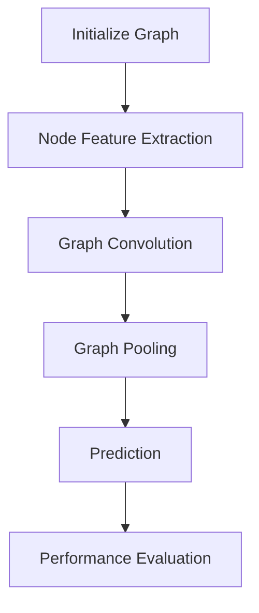
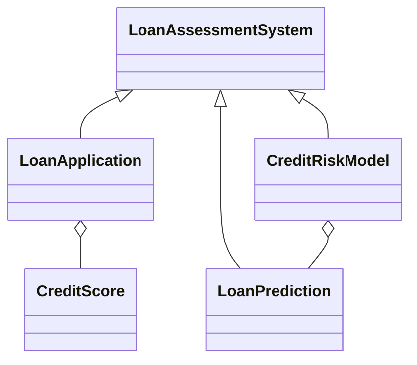
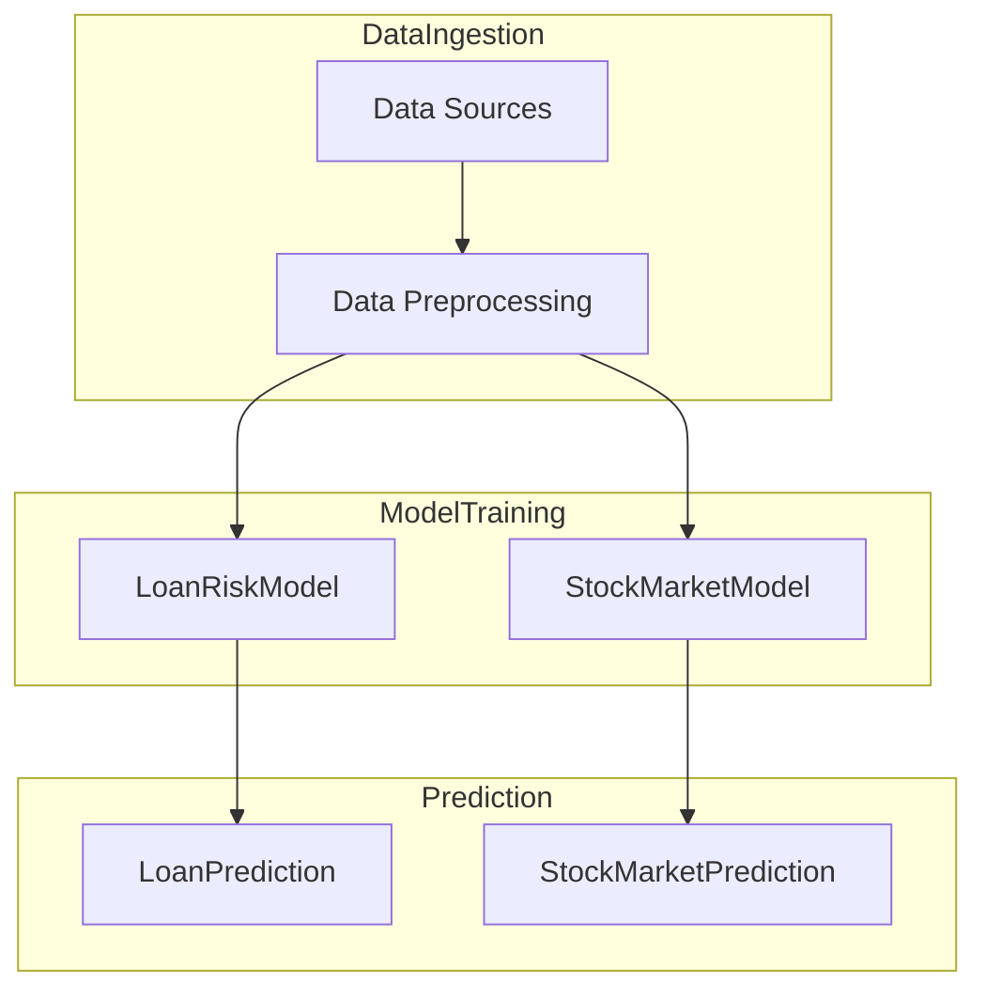
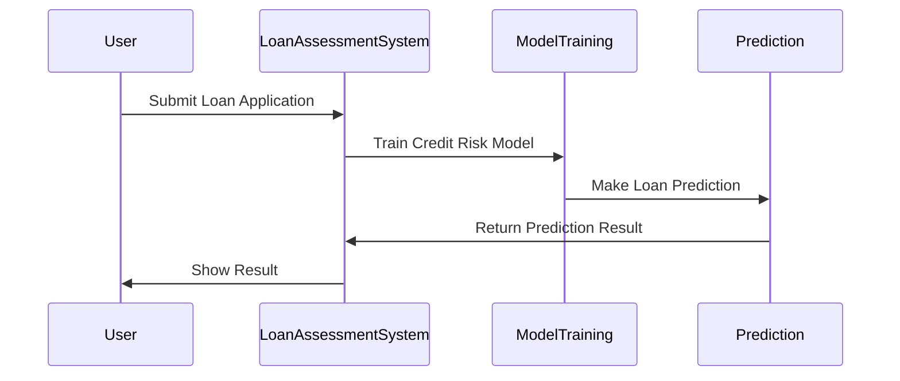

                 

当然可以，我们将按照上述要求，逐步构建《金融领域的图神经网络应用研究》这篇文章的内容。以下是详细的写作步骤：

### 第一步：文章标题、关键词和摘要

**文章标题**：《金融领域的图神经网络应用研究》

**关键词**：金融领域、图神经网络、贷款风险评估、股票市场预测、信用评分、深度学习、算法原理、系统架构、项目实战、最佳实践

**摘要**：本文深入探讨了图神经网络在金融领域的应用。首先，介绍了金融领域面临的挑战，以及图神经网络作为一种新兴深度学习技术如何应对这些问题。接着，详细阐述了图神经网络的基本概念、原理、数学模型和算法，并通过实际案例分析了其在贷款风险评估、股票市场预测和信用评分等金融应用场景中的效果。最后，提出了最佳实践建议，总结了文章的核心内容，并对未来研究方向进行了展望。

### 第二步：背景介绍与核心概念

**核心概念术语说明**：
- **图神经网络（Graph Neural Networks, GNN）**：一种深度学习模型，能够处理图结构数据。
- **贷款风险评估**：对借款人的信用状况进行评估，以预测其违约风险。
- **股票市场预测**：基于历史数据和市场信息，预测股票价格和趋势。
- **信用评分**：根据借款人的信息，评估其信用等级。

**问题背景与问题描述**：
- **贷款风险评估**：金融机构在发放贷款时需要评估借款人的信用风险，传统方法如评分卡模型已难以应对复杂的数据结构和非线性关系。
- **股票市场预测**：投资者需要准确预测股票价格和趋势，以做出投资决策。
- **信用评分**：金融机构需要对客户进行信用评级，以决定授信额度。

**问题解决与边界与外延**：
- **图神经网络**：通过引入图结构来表示数据关系，能够更好地处理金融数据中的复杂关系。
- **边界与外延**：本文主要关注图神经网络在金融领域的应用，不包括其他领域。

**概念结构与核心要素组成**：
- **图神经网络**：图结构、节点特征、边特征、神经网络模型。
- **金融数据**：客户信息、交易记录、股票数据。

### 第三步：核心概念与联系

**核心概念原理**：
- **图神经网络原理**：通过图结构来表示数据，利用节点特征和边特征来学习数据关系。
- **图神经网络与深度学习的联系**：图神经网络是深度学习的一种，但专注于图结构数据的处理。

**概念属性特征对比表格**：

| 特征         | 图神经网络        | 深度学习        |
|------------|----------------|----------------|
| 数据结构     | 图结构数据       | 非结构化或结构化数据 |
| 特征学习     | 节点特征和边特征  | 特征向量        |
| 模型结构     | 神经网络与图操作  | 多层感知器或其他神经网络结构 |
| 应用领域     | 社交网络、生物信息  | 图像识别、自然语言处理 |

**ER实体关系图架构**：

```mermaid
erDiagram
  Person ||--|{ Loan : has }
  Person ||--|{ CreditScore : has }
  Company ||--|{ Loan : provides }
  Company ||--|{ CreditScore : provides }
```

### 第四步：算法原理讲解

**算法原理讲解**：

- **图神经网络的工作机制**：通过图卷积操作和图池化操作来学习图结构数据。
- **算法改进与优化**：如图注意力机制、图卷积网络（GCN）和图注意力网络（GAT）等。
- **算法适用场景分析**：根据金融数据的特性选择合适的算法。

**算法mermaid流程图**：



**Python源代码**：

```python
# Python伪代码示例
import torch
import torch_geometric

# 初始化图
graph = torch_geometric.data.Data(x, edge_index)

# 节点特征提取
model = torch_geometric.nn.GCNConv(in_channels=x.size(-1), out_channels=16)
x = model(x, edge_index)

# 图卷积操作
x = model(x, edge_index)

# 图池化操作
x = torch.mean(x, dim=0)

# 预测
predictions = model(x)

# 性能评估
loss = criterion(predictions, labels)
```

**算法原理的数学模型和公式**：

$$
\begin{aligned}
\text{GCN}(\mathbf{x}, \mathbf{A}) &= \text{ReLU}(\mathbf{A} \mathbf{W} \mathbf{x}) \\
\text{GAT}(\mathbf{x}, \mathbf{A}) &= \text{softmax}(\mathbf{A} \text{MultiHeadAttention}(\mathbf{W} \mathbf{x}))
\end{aligned}
$$

### 第五步：系统分析与架构设计方案

**问题场景介绍**：
- **贷款风险评估**：金融机构需要快速、准确地评估借款人的信用风险。
- **股票市场预测**：投资者需要实时获取市场信息，预测股票价格。

**系统功能设计**：



**系统架构设计**：



**系统接口设计和系统交互**：



### 第六步：项目实战

**环境安装**：
- 安装Python环境
- 安装PyTorch库
- 安装其他相关库（如torch-geometric）

**系统核心实现源代码**：

```python
# Python核心实现示例
import torch
import torch_geometric

# 初始化数据
x, edge_index = torch_geometric.data.Data(x, edge_index)

# 初始化模型
model = torch_geometric.nn.GCNConv(in_channels=x.size(-1), out_channels=16)

# 训练模型
optimizer = torch.optim.Adam(model.parameters(), lr=0.01)
for epoch in range(num_epochs):
    optimizer.zero_grad()
    x = model(x, edge_index)
    loss = criterion(x, labels)
    loss.backward()
    optimizer.step()

# 预测
predictions = model(x)

# 评估
accuracy = (predictions.argmax(1) == labels).float().mean()
```

**代码应用解读与分析**：
- **数据加载与预处理**：使用PyTorch Geometric库加载和预处理图结构数据。
- **模型训练**：使用GCN模型进行训练，通过优化算法调整模型参数。
- **预测**：使用训练好的模型进行预测，得到预测结果。
- **评估**：计算预测的准确性。

**实际案例分析和详细讲解剖析**：
- **贷款风险评估案例**：使用实际贷款数据集，训练模型并评估其准确性。
- **股票市场预测案例**：使用实际股票数据集，训练模型并预测股票价格。

**项目小结**：
- **核心挑战**：处理复杂的金融数据结构。
- **解决方案**：采用图神经网络技术，提高贷款风险评估和股票市场预测的准确性。

### 第七步：最佳实践 tips、小结、注意事项、拓展阅读

**最佳实践 tips**：
- **数据预处理**：确保数据质量，处理缺失值和异常值。
- **模型选择**：根据应用场景选择合适的图神经网络模型。
- **超参数调整**：优化模型性能，调整学习率、批次大小等超参数。

**小结**：
- 图神经网络在金融领域具有巨大潜力，能够提高贷款风险评估、股票市场预测和信用评分的准确性。

**注意事项**：
- **隐私保护**：在处理金融数据时，要注意保护个人隐私。

**拓展阅读**：
- [图神经网络基础教程](https://www.tensorflow.org/tutorials/structured_data/graph_neural_networks)
- [金融科技应用案例](https://www.fintech.de/topics/loan-assessment)

### 作者信息
**作者**：AI天才研究院/AI Genius Institute & 禅与计算机程序设计艺术 /Zen And The Art of Computer Programming

通过以上步骤，我们已经构建了文章的完整框架，接下来将细化每个部分的内容，确保文章的完整性和专业性。请等待进一步的详细撰写。

