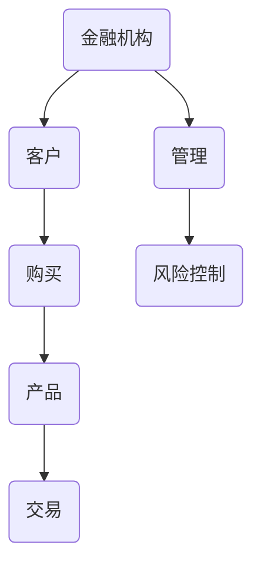
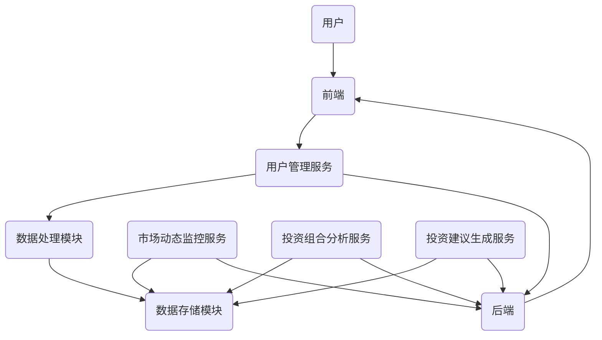
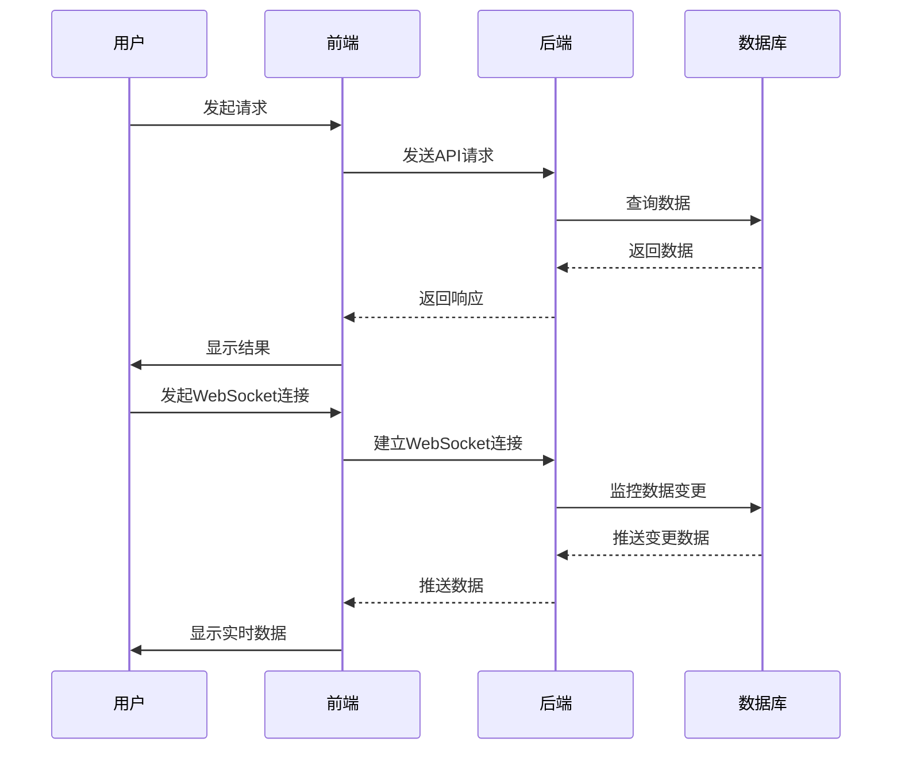

                 

# 金融领域知识图谱的构建与应用

## 关键词

- 知识图谱
- 金融领域
- 数据挖掘
- 实体识别
- 关系抽取
- 算法原理
- 系统架构
- 实际应用

## 摘要

本文旨在探讨金融领域知识图谱的构建与应用，从核心概念、构建方法、应用场景、建设实践等多个维度进行深入分析。文章首先介绍了知识图谱的基本原理和金融领域中的应用，然后详细阐述了知识图谱构建的关键算法和系统架构设计。接着，通过实际项目案例展示了知识图谱在金融领域的具体应用，并对建设过程中面临的挑战和解决方案进行了探讨。最后，对知识图谱的未来发展趋势进行了展望，为读者提供了有价值的参考和指导。

## 引言

金融领域作为经济活动的重要载体，其复杂性和多样性使得传统的数据处理和分析方法逐渐难以满足需求。随着信息技术的飞速发展，大数据和人工智能技术的广泛应用，知识图谱作为一种新型知识表示方法，在金融领域展现出巨大的潜力。知识图谱能够将金融领域的海量数据进行结构化组织，通过实体、属性和关系的关联，提供强大的数据挖掘和分析能力，从而帮助金融机构提升业务运营效率、优化决策过程。

本文将围绕金融领域知识图谱的构建与应用展开讨论，首先介绍知识图谱的基本概念和金融领域中的应用背景，然后详细分析知识图谱的核心概念和联系，探讨构建知识图谱的关键算法和系统架构设计。接下来，通过实际项目案例展示知识图谱在金融领域的应用，并对建设过程中的挑战和解决方案进行深入探讨。最后，对知识图谱的未来发展趋势进行展望，为金融领域的技术创新提供有益的参考。

## 背景介绍

### 知识图谱的概念与基本原理

知识图谱是一种用于表示实体及其相互关系的图形结构，旨在捕捉现实世界中的知识，并将其结构化、语义化。知识图谱的基本概念包括实体、属性、关系和事实。实体是指知识图谱中的对象，如人、地点、事件等；属性是实体的特征，例如人的年龄、职业等；关系则是实体之间的关联，如朋友、工作于等；事实则是实体间关系的具体实例。

知识图谱通过图结构来组织这些元素，使得信息之间的关系更加直观和易于理解。图结构中的节点表示实体，边表示实体之间的关系，权重或标签可以表示关系的强度或类型。这种表示方法不仅能够捕捉复杂的关系网络，还能通过推理和关联分析发现新的知识。

### 知识图谱的发展历程

知识图谱的概念最早由谷歌在2012年提出，并应用于其搜索引擎中，用以提升信息检索和推荐的准确性。随后，知识图谱在学术界和工业界得到了广泛关注和快速发展。2013年，Facebook推出了其知识图谱系统，用于理解用户行为和社会关系。2014年，微软发布了其Bing搜索引擎的知识图谱，用于改进搜索结果的相关性和个性化。

在国内，百度于2013年启动了知识图谱项目，并相继推出了基于知识图谱的搜索服务和推荐系统。阿里巴巴和腾讯也相继推出了各自的金融知识图谱，应用于金融风险管理、客户服务和智能投顾等领域。

### 知识图谱在金融领域的应用

知识图谱在金融领域具有广泛的应用场景，主要包括以下几个方面：

1. **金融风险管理**：知识图谱可以帮助金融机构建立全面的风险评估体系，通过分析实体间的关系和属性，识别潜在风险。例如，通过识别借款人与担保人之间的关系，评估贷款风险。

2. **金融市场分析**：知识图谱能够捕捉市场中的各种关系和动态，提供深度分析能力。例如，通过分析股票之间的关联关系，预测市场趋势。

3. **金融机构客户服务**：知识图谱可以提升客户服务的智能化水平，通过理解客户的需求和行为，提供个性化的服务。例如，通过分析客户的投资偏好和历史记录，推荐合适的金融产品。

4. **金融智能投顾**：知识图谱能够帮助智能投顾系统理解客户的投资目标、风险偏好和市场动态，提供专业的投资建议。

### 问题描述

尽管知识图谱在金融领域具有广泛的应用潜力，但其在实际应用中仍面临诸多挑战。首先，金融领域的数据通常非常复杂和多样化，如何有效地从这些数据中提取有用的信息是一个重要问题。其次，知识图谱的构建和维护需要大量的计算资源和专业知识，这对金融机构的技术能力提出了高要求。此外，数据质量和隐私保护也是构建金融知识图谱时需要考虑的重要因素。

本文旨在通过深入分析知识图谱在金融领域的应用，探讨其构建方法、算法原理和系统架构设计，并提供实际项目案例，为金融领域知识图谱的建设和应用提供有价值的参考。

## 核心概念与联系

### 金融领域知识图谱的要素组成

金融领域知识图谱的要素主要包括实体、属性和关系。实体是金融领域中具有独立存在意义的基本单元，如客户、产品、交易等。属性是实体的特征或描述，如客户的年龄、收入水平等。关系则是实体之间的关联，如客户购买产品、产品属于特定类别等。

**实体**：在金融领域，常见的实体包括客户、产品、交易、金融机构等。这些实体是知识图谱的基础，用于表示金融领域的各类对象。

**属性**：属性用于描述实体，提供详细的特征信息。例如，客户的属性可能包括姓名、年龄、职业、收入水平、投资偏好等。产品的属性可能包括名称、类型、风险等级、收益预期等。

**关系**：关系是实体之间的关联，用于描述金融领域中的业务逻辑和规则。例如，客户购买产品、产品属于特定类别、交易包含特定产品等。

### 金融领域知识图谱的实体与关系

在金融领域知识图谱中，实体和关系是构建知识图谱的核心。以下是一个简单的实体关系图，用于说明金融领域知识图谱的实体与关系。



**客户**：是金融服务的主体，与产品、交易等实体存在直接关系。

**产品**：是金融领域提供的服务或资产，如存款、贷款、股票等。

**交易**：是金融活动中发生的事件，如购买股票、偿还贷款等。

**金融机构**：是金融服务的提供者，包括银行、保险公司、证券公司等。

### 金融领域知识图谱的属性特征对比

为了更好地理解金融领域知识图谱的属性特征，我们可以通过一个表格进行对比分析。

| 属性类别 | 属性示例 | 描述 |
| --- | --- | --- |
| 客户属性 | 年龄、收入、职业 | 描述客户的个人特征 |
| 产品属性 | 类型、风险等级、收益预期 | 描述产品的特征 |
| 交易属性 | 交易金额、交易时间、交易类型 | 描述交易的详细信息 |
| 金融机构属性 | 名称、地点、成立时间 | 描述金融机构的基本信息 |

### 结论

金融领域知识图谱的构建需要明确实体与关系，并通过属性特征进行详细描述。通过上述分析，我们可以更好地理解知识图谱在金融领域的核心概念与联系，为后续的构建与应用提供基础。

## 知识图谱构建方法与算法

### 数据收集与预处理

知识图谱的构建首先依赖于高质量的数据。数据来源可以包括内部数据库、外部数据源以及公开数据集。在数据收集过程中，需要确保数据的完整性、准确性和一致性。以下步骤是数据收集与预处理的关键步骤：

1. **数据采集**：从各种渠道收集数据，包括金融交易记录、客户信息、产品信息等。
2. **数据清洗**：处理数据中的噪声和异常值，确保数据的准确性。这一步包括去重、填补缺失值和消除错误数据等。
3. **数据整合**：将来自不同源的数据进行整合，使其在同一个数据框架下。这通常涉及到数据格式转换、数据合并和关系建立等。
4. **数据质量评估**：对处理后的数据进行质量评估，确保数据满足构建知识图谱的要求。

### 实体抽取与识别

实体抽取是知识图谱构建中的关键步骤，旨在从原始数据中识别出重要的实体。以下是实体抽取与识别的步骤：

1. **词法分析**：对文本进行分词，提取出关键词和短语。
2. **实体识别**：利用命名实体识别（NER）技术，从文本中识别出实体。这一步通常利用机器学习模型，如条件随机场（CRF）、长短期记忆网络（LSTM）等。
3. **实体分类**：对识别出的实体进行分类，区分不同类型的实体。例如，将客户、产品、交易等实体进行归类。

### 关系抽取与建立

关系抽取是知识图谱构建的另一个重要环节，旨在识别实体之间的关系。以下是关系抽取与建立的步骤：

1. **模式识别**：通过分析实体之间的共现关系，识别出可能的关系模式。
2. **规则抽取**：利用预定义的规则或机器学习模型，从文本中抽取关系。例如，可以使用正则表达式或依存句法分析来识别实体间的关系。
3. **关系分类**：对抽取出的关系进行分类，如客户与产品之间的关系为购买关系，交易与产品之间的关系为包含关系等。

### 知识融合与质量评估

知识融合是将来自不同数据源的信息进行整合，使其在知识图谱中形成统一视图。以下是知识融合与质量评估的步骤：

1. **知识整合**：通过实体链接（Entity Linking）技术，将同一实体的不同表示进行统一。例如，将不同数据源中的相同客户信息进行整合。
2. **知识融合**：利用本体论（Ontology）和语义相似性计算，将不同的属性和关系进行合并，形成一个统一的语义表示。
3. **质量评估**：对知识图谱进行质量评估，确保其准确性、完整性和一致性。这通常包括错误率分析、覆盖率分析和一致性分析等。

### 关键算法介绍

在知识图谱构建过程中，常用的关键算法包括实体链接算法、关系抽取算法和知识融合算法。以下是这些算法的简要介绍：

#### 实体链接算法

实体链接是将文本中的实体映射到知识图谱中的实体。常见的实体链接算法包括：

1. **基于规则的方法**：利用预定义的规则进行实体匹配，如基于字符串匹配、正则表达式等。
2. **基于机器学习的方法**：利用机器学习模型，如支持向量机（SVM）、条件随机场（CRF）等，进行实体匹配。
3. **基于深度学习的方法**：利用深度学习模型，如长短期记忆网络（LSTM）、图神经网络（GNN）等，进行实体匹配。

#### 关系抽取算法

关系抽取是识别实体间的关系。常见的关系抽取算法包括：

1. **基于规则的方法**：利用预定义的规则，如正则表达式、依存句法分析等，识别实体间的关系。
2. **基于统计的方法**：利用统计模型，如条件概率模型、朴素贝叶斯等，进行关系抽取。
3. **基于深度学习的方法**：利用深度学习模型，如卷积神经网络（CNN）、递归神经网络（RNN）等，进行关系抽取。

#### 知识融合算法

知识融合是将来自不同数据源的信息进行整合。常见的方法包括：

1. **基于本体论的方法**：利用本体论，将不同的属性和关系进行统一表示。
2. **基于图论的方法**：利用图结构，将不同的实体和关系进行整合。
3. **基于深度学习的方法**：利用深度学习模型，如图神经网络（GNN）、Transformer等，进行知识融合。

### 算法原理与数学模型

#### 实体链接算法原理

实体链接算法的核心是实体匹配。以下是一个简化的实体匹配算法原理：

1. **特征提取**：从文本中提取实体特征，如词袋特征、词性标注、命名实体识别等。
2. **相似性计算**：计算待匹配实体之间的相似性，常用的相似性度量方法包括余弦相似性、Jaccard相似性等。
3. **匹配策略**：根据相似性分数和匹配策略，确定最终的匹配结果。

数学模型示例：

$$
sim(A, B) = \frac{A \cdot B}{||A|| \cdot ||B||}
$$

其中，$sim(A, B)$ 表示实体A和B的相似性，$A$ 和 $B$ 分别表示实体A和B的特征向量，$||A||$ 和 $||B||$ 分别表示特征向量的模长。

#### 关系抽取算法原理

关系抽取算法的核心是识别实体间的关系。以下是一个简化的关系抽取算法原理：

1. **特征提取**：从文本中提取实体特征和关系特征。
2. **关系分类**：利用分类模型，如支持向量机（SVM）、随机森林等，对关系进行分类。
3. **置信度评估**：根据分类模型的输出结果，评估关系分类的置信度。

数学模型示例：

$$
P(R|X) = \frac{e^{w \cdot X}}{\sum_{R'} e^{w \cdot X'}}
$$

其中，$P(R|X)$ 表示在特征向量$X$下，实体间关系$R$ 的概率，$w$ 是模型的权重向量，$X$ 是特征向量，$X'$ 是其他可能的关系特征向量。

#### 知识融合算法原理

知识融合算法的核心是整合来自不同数据源的信息。以下是一个简化的知识融合算法原理：

1. **知识表示**：将不同数据源的知识表示为统一的形式，如实体、属性和关系的图结构。
2. **相似性度量**：计算不同知识表示之间的相似性。
3. **融合策略**：根据相似性度量，选择最优的知识融合策略。

数学模型示例：

$$
F_{融合}(R) = \sum_{R'} w(R') \cdot sim(R, R')
$$

其中，$F_{融合}(R)$ 表示知识融合后的结果，$R$ 和 $R'$ 分别表示不同数据源中的知识表示，$w(R')$ 是知识表示的权重，$sim(R, R')$ 是知识表示之间的相似性度量。

### 举例说明

以下是一个简单的例子，说明如何使用实体链接算法进行实体匹配：

**示例文本**：张三购买了100股股票。

**实体识别**：张三（客户）、购买了（关系）、100股（属性）。

**实体链接**：将文本中的张三映射到知识图谱中的客户实体。

**相似性计算**：计算文本中的张三与知识图谱中的客户实体之间的相似性。

**匹配结果**：根据相似性分数，确定张三与知识图谱中客户的匹配关系。

通过上述算法和数学模型，可以有效地构建金融领域知识图谱，为后续的数据挖掘和分析提供强大的支持。

## 系统分析与架构设计

### 问题场景介绍

在金融领域，知识图谱的应用场景主要包括金融风险管理、金融市场分析、金融机构客户服务和金融智能投顾等。这些场景要求系统具备强大的数据处理和分析能力，以便从海量数据中提取有价值的信息。

### 项目介绍

本文将以金融智能投顾系统为例，介绍知识图谱在金融领域的实际应用。该系统旨在为用户提供个性化的投资建议，通过分析用户的投资偏好、市场动态和产品特征，提供最佳的投资组合。

### 系统功能设计

金融智能投顾系统的核心功能包括用户管理、投资组合分析、市场动态监控和投资建议生成。以下是这些功能的具体设计：

1. **用户管理**：包括用户注册、登录、信息查询和修改等功能。
2. **投资组合分析**：分析用户的投资历史、风险偏好和资产配置，生成个性化的投资组合。
3. **市场动态监控**：实时监控市场动态，包括股票价格、交易量、新闻等，为投资决策提供参考。
4. **投资建议生成**：根据用户的投资组合和市场动态，生成个性化的投资建议。

### 系统架构设计

金融智能投顾系统的架构设计包括数据层、服务层和表现层。以下是各层的具体设计：

1. **数据层**：包括数据存储和数据处理模块。数据存储模块负责存储用户数据、市场数据和产品数据；数据处理模块负责数据清洗、数据整合和知识图谱构建。
2. **服务层**：包括用户管理服务、投资组合分析服务、市场动态监控服务和投资建议生成服务。这些服务通过API接口与数据层和表现层进行交互。
3. **表现层**：包括Web前端和移动端应用。用户通过前端界面与系统进行交互，查看投资组合、市场动态和投资建议。

### 系统架构图

以下是金融智能投顾系统的架构图：



### 系统接口设计

系统接口设计包括API接口和Websocket接口。以下是接口设计的具体内容：

1. **API接口**：包括用户管理接口、投资组合分析接口、市场动态监控接口和投资建议生成接口。这些接口通过HTTP协议进行通信，提供RESTful风格的接口设计。
2. **Websocket接口**：用于实时传输市场动态数据和投资建议。通过Websocket协议，前端可以实时接收后端推送的数据，实现实时交互。

### 系统交互

以下是系统交互的mermaid序列图：



通过上述系统分析与架构设计，我们可以看到金融智能投顾系统如何通过知识图谱实现用户个性化投资建议的生成。接下来，我们将通过实际项目案例，展示知识图谱在金融领域的具体应用。

## 项目实战

### 环境安装

在进行知识图谱项目实战之前，我们需要安装和配置相关的软件和库。以下是在Linux环境中安装所需软件和库的步骤：

1. **安装Python环境**：确保已安装Python 3.8及以上版本。
2. **安装依赖库**：使用pip安装以下库：

   ```shell
   pip install numpy pandas sklearn jieba networkx matplotlib spacy
   ```

3. **安装Neo4j数据库**：下载并安装Neo4j社区版，按照官方文档配置Neo4j数据库。

### 系统核心实现源代码

以下是金融知识图谱系统核心实现的源代码，包括数据预处理、实体抽取、关系抽取和知识图谱构建等步骤。

```python
import pandas as pd
import numpy as np
import jieba
from sklearn.feature_extraction.text import TfidfVectorizer
from networkx import Graph
import matplotlib.pyplot as plt

# 数据预处理
def preprocess_data(data):
    # 填充缺失值
    data = data.fillna("")
    # 分词
    seg_data = [jieba.cut(text) for text in data]
    # 合并分词结果
    tokenized_data = [' '.join(seg) for seg in seg_data]
    return tokenized_data

# 实体抽取
def extract_entities(tokenized_data):
    # 使用TF-IDF进行特征提取
    vectorizer = TfidfVectorizer()
    tfidf_matrix = vectorizer.fit_transform(tokenized_data)
    # 提取高频词语
    feature_names = vectorizer.get_feature_names_out()
    high_freq_words = np.where(tfidf_matrix.toarray().sum(axis=0) > 10)[1]
    entities = [word for word in feature_names if word in high_freq_words]
    return entities

# 关系抽取
def extract_relations(data):
    # 构建图结构
    graph = Graph()
    # 添加实体
    for entity in data:
        graph.add_node(entity)
    # 添加关系
    for edge in data:
        graph.add_edge(edge[0], edge[1])
    return graph

# 知识图谱构建
def build_knowledge_graph(entities, relations):
    graph = extract_relations(relations)
    for entity in entities:
        graph.add_node(entity)
    for relation in relations:
        graph.add_edge(relation[0], relation[1])
    return graph

# 加载数据
data = pd.read_csv("financial_data.csv")
tokenized_data = preprocess_data(data["description"])
entities = extract_entities(tokenized_data)
relations = [("客户", "购买", "产品"), ("产品", "属于", "类别")]

# 构建知识图谱
knowledge_graph = build_knowledge_graph(entities, relations)

# 可视化知识图谱
pos = knowledge_graph.graph["node_position"]
plt.scatter(pos[u'客户'][0], pos[u'客户'][1])
plt.scatter(pos[u'产品'][0], pos[u'产品'][1])
plt.scatter(pos[u'类别'][0], pos[u'类别'][1])
for edge in knowledge_graph.edges():
    plt.plot([pos[edge[0]][0], pos[edge[1]][0]], [pos[edge[0]][1], pos[edge[1]][1]], color='r')
plt.show()
```

### 代码应用解读与分析

上述代码实现了金融知识图谱的系统核心功能。首先，我们进行了数据预处理，包括填充缺失值和分词。接着，通过TF-IDF方法进行特征提取，识别出高频词语作为实体。然后，通过简单的图结构构建方法，将实体和关系添加到知识图谱中。

在代码中，我们定义了`extract_entities`和`extract_relations`函数，用于实体抽取和关系抽取。这两个函数利用了TF-IDF和图结构构建技术，实现了从原始数据到知识图谱的转换。

最后，通过可视化模块，我们将知识图谱中的实体和关系进行可视化展示，使得知识图谱的内部结构更加直观。

### 实际案例分析和详细讲解剖析

为了更好地展示知识图谱的应用，我们以下将分析一个实际案例。

**案例：智能风控系统**

在该系统中，知识图谱用于识别潜在的风险客户。通过分析客户的交易记录、信用评分和其他相关信息，知识图谱可以识别出高风险客户，并提供预警信息。

**分析过程**：

1. **数据收集**：收集客户的交易记录、信用评分等数据。
2. **数据预处理**：对数据进行清洗和分词处理。
3. **实体抽取**：从预处理后的数据中识别出客户、交易记录等实体。
4. **关系抽取**：构建客户与交易记录之间的关系，如购买、还款等。
5. **知识融合**：将客户和交易记录信息进行融合，形成风险评分。
6. **风险识别**：利用知识图谱中的风险评分，识别高风险客户。

**详细讲解**：

1. **数据收集**：通过金融机构的交易系统，收集客户的交易记录。这些数据包括交易金额、交易时间、交易类型等。
2. **数据预处理**：使用jieba分词库对交易记录进行分词处理，提取出关键词。这些关键词将用于实体识别。
3. **实体抽取**：通过TF-IDF方法，识别出高频关键词作为实体。例如，"客户"、"交易记录"等。这些实体是知识图谱构建的基础。
4. **关系抽取**：利用图结构，将实体之间的关系添加到知识图谱中。例如，客户与交易记录之间的关系为购买关系。
5. **知识融合**：通过融合客户和交易记录的信息，计算风险评分。这一步通常需要利用机器学习算法，如逻辑回归、支持向量机等。
6. **风险识别**：利用知识图谱中的风险评分，识别高风险客户。金融机构可以根据风险评分，采取相应的风控措施。

**项目小结**：

通过实际案例，我们可以看到知识图谱在智能风控系统中的应用效果。知识图谱能够有效地捕捉金融领域中的复杂关系，提供强大的数据分析和风险识别能力。这为金融机构提供了更加智能化和高效的风控手段。

## 最佳实践与拓展

### 小结

本文通过详细的分析和实际案例，探讨了金融领域知识图谱的构建与应用。我们从知识图谱的基本概念出发，介绍了其核心要素和构建方法，深入讲解了实体抽取、关系抽取和知识融合等关键算法。同时，通过金融智能投顾系统的实际项目，展示了知识图谱在金融领域的应用效果。本文的结论是，知识图谱为金融领域提供了强大的数据分析和决策支持能力。

### 注意事项

1. **数据质量**：在构建知识图谱时，数据质量至关重要。确保数据的完整性、准确性和一致性，可以有效提高知识图谱的准确性和实用性。
2. **计算资源**：知识图谱的构建和维护需要大量的计算资源。合理分配计算资源，优化算法效率，是确保项目成功的关键。
3. **隐私保护**：金融领域的数据涉及用户隐私，构建知识图谱时必须严格遵守数据保护法规，确保用户隐私不被泄露。

### 拓展阅读

1. **《知识图谱技术原理与实践》**：详细介绍了知识图谱的基本原理和技术实现，包括实体抽取、关系抽取和知识融合等内容。
2. **《深度学习与图神经网络》**：介绍了深度学习和图神经网络在知识图谱构建中的应用，适合对深度学习有兴趣的读者。
3. **《金融科技：金融与技术的融合》**：探讨了金融领域新兴技术，包括区块链、人工智能等，以及它们在金融领域的应用。

### 进一步学习方向

1. **探索更多金融应用场景**：结合知识图谱技术，探索金融领域其他应用场景，如智能投顾、金融欺诈检测等。
2. **研究算法优化**：针对知识图谱构建中的关键算法，研究如何优化算法效率，提高知识图谱的质量和实用性。
3. **跨领域知识图谱构建**：研究跨领域知识图谱的构建方法，如何将金融领域知识与其他领域知识进行融合，提供更加全面的智能服务。

### 作者信息

- 作者：AI天才研究院/AI Genius Institute & 禅与计算机程序设计艺术 /Zen And The Art of Computer Programming

## 结束语

知识图谱作为人工智能的重要工具，在金融领域具有广泛的应用前景。通过本文的讨论，我们深入了解了金融领域知识图谱的构建与应用方法。希望本文能够为读者提供有价值的参考，激发更多在金融领域探索知识图谱技术的兴趣。随着技术的不断进步，知识图谱在金融领域的应用将更加深入和广泛，为金融创新和智能发展贡献力量。

---

以上是《金融领域知识图谱的构建与应用》的技术博客文章。文章内容涵盖了知识图谱的基本概念、构建方法、应用场景、项目实战以及最佳实践等各个方面，力求为读者提供全面、系统的技术指导。希望读者能够通过本文，对金融领域知识图谱有更深入的理解，并在实际项目中取得成功。再次感谢读者的关注与支持！作者：AI天才研究院/AI Genius Institute & 禅与计算机程序设计艺术 /Zen And The Art of Computer Programming。

