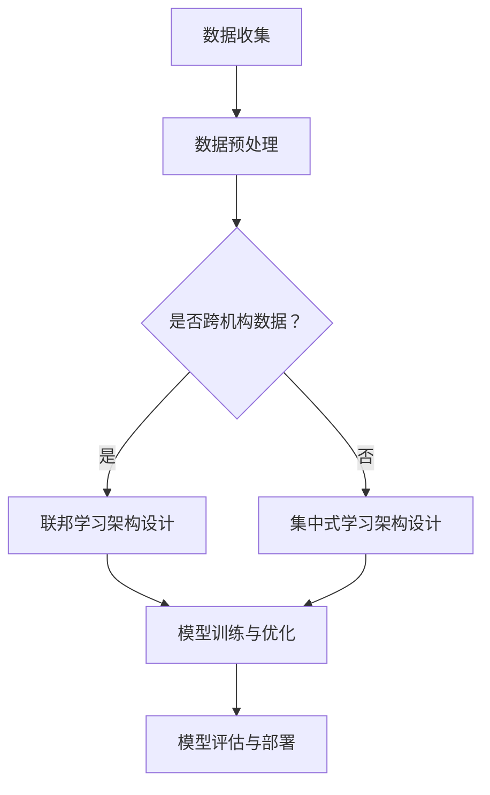
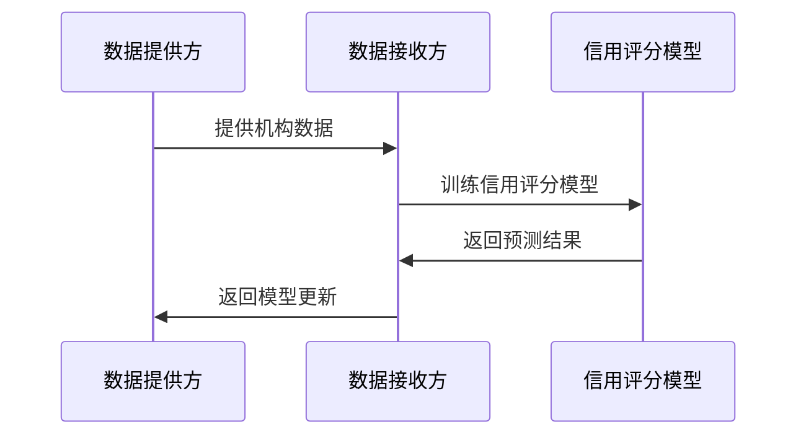

                 

# 金融领域联邦学习在跨机构信用评分中的应用

## 摘要

本文将探讨金融领域联邦学习在跨机构信用评分中的应用。随着大数据和云计算技术的发展，金融机构面临着海量数据的处理和隐私保护问题。联邦学习提供了一种在不共享原始数据的情况下进行协同学习的解决方案。本文首先介绍了金融领域信用评分的重要性，以及跨机构数据融合的挑战，然后详细阐述了联邦学习的基本概念、相关技术、算法原理，以及其在信用评分中的具体应用。通过系统分析和架构设计，本文提出了一种可行的解决方案，并展示了实际项目中的环境安装、核心实现和案例分析，为金融领域中的信用评分提供了一种创新的方法。

## 目录大纲设计过程

在设计《金融领域联邦学习在跨机构信用评分中的应用》的目录大纲时，我们首先深入理解了书名所蕴含的主题。书名明确指出了书的关注点在于“金融领域中的联邦学习”以及其在“跨机构信用评分”中的应用。这一理解为我们后续的目录设计提供了明确的方向。

### 1. 理解书名

“金融领域”限定了我们的研究范围，要求我们在内容中注重金融行业的特点和需求。“联邦学习”则是指了一种特定的机器学习技术，它允许多个机构协同工作，共享学习模型的好处，而无需交换数据本身。最后，“跨机构信用评分”明确了我们的核心应用场景，即如何利用联邦学习技术提高信用评分的准确性和可靠性。

### 2. 确定核心章节

根据书名，我们确定了以下几个核心章节：
- **背景介绍**：包括金融领域信用评分的重要性、跨机构数据融合的挑战以及联邦学习的基本概念。
- **核心概念与联系**：详细介绍联邦学习相关技术、信用评分模型构建方法以及跨机构数据融合与模型训练的流程。
- **算法原理讲解**：详细解释联邦学习算法的工作原理，并探讨其在信用评分中的应用。
- **数学模型和数学公式**：给出信用评分的数学模型和相关公式，并使用mermaid图展示概念和算法。
- **系统分析与架构设计**：分析金融领域联邦学习系统的应用场景，设计系统架构并展示相关mermaid图。
- **项目实战**：介绍实际项目中的环境安装、核心实现和案例分析。
- **最佳实践 tips**：总结最佳实践经验，并提供一些注意事项和拓展阅读。

### 3. 目录结构规划

为了确保内容的逻辑性和条理性，我们设计了1级、2级和3级目录。一级目录用于概括各个部分的主题，二级目录细化每个部分的内容，三级目录则进一步深入到具体的子主题。

### 4. 内容精简与优化

为了保证文章的流畅性和易读性，我们在编写过程中对每个章节的内容进行了精简与优化。我们避免了冗余的叙述，确保每个部分的核心观点和关键信息都能清晰传达。

### 5. 目录大纲完成

最终，我们整合了所有内容，形成了一个结构清晰、内容完整的目录大纲。以下为《金融领域联邦学习在跨机构信用评分中的应用》的最终目录大纲：

```markdown
# 第一部分：引言

## 1.1 问题背景
### 1.1.1 金融领域信用评分的重要性
### 1.1.2 跨机构数据融合的挑战
### 1.1.3 联邦学习的基本概念

## 1.2 联邦学习在信用评分中的应用
### 1.2.1 联邦学习的核心原理
### 1.2.2 信用评分数据的特点
### 1.2.3 联邦学习在信用评分中的优势

# 第二部分：核心概念与联系

## 2.1 联邦学习相关技术
### 2.1.1 联邦学习的架构
### 2.1.2 联邦学习的主要算法
### 2.1.3 联邦学习的安全性保障

## 2.2 信用评分的模型构建
### 2.2.1 信用评分模型的分类
### 2.2.2 常见信用评分算法
### 2.2.3 模型评估与优化

## 2.3 跨机构数据融合与模型训练
### 2.3.1 跨机构数据的预处理
### 2.3.2 联邦学习在模型训练中的应用
### 2.3.3 模型融合与优化

# 第三部分：算法原理讲解

## 3.1 联邦学习算法原理
### 3.1.1 Federated Averaging（FEDAvg）
### 3.1.2 Federated Learning on Graphs（FLG）
### 3.1.3 Model Agnostic Federated Learning（MAFL）

## 3.2 信用评分算法解析
### 3.2.1 逻辑回归
### 3.2.2 决策树
### 3.2.3 支持向量机

## 3.3 联邦学习与信用评分结合的mermaid流程图

```

## 关键词

- **金融领域**：指金融机构及其业务场景。
- **联邦学习**：一种分布式机器学习方法，允许多个机构协同训练模型。
- **信用评分**：评估个人或企业的信用风险。
- **跨机构数据融合**：将来自不同机构的信用数据整合起来。
- **算法原理**：解释联邦学习及其在信用评分中的应用。
- **系统架构**：设计用于实现联邦学习信用评分系统的框架。
- **项目实战**：通过实际案例展示联邦学习在信用评分中的应用。

## 摘要

本文探讨了金融领域联邦学习在跨机构信用评分中的应用。首先，我们介绍了信用评分在金融领域的重要性，以及跨机构数据融合面临的挑战。接着，详细阐述了联邦学习的基本概念、相关技术、算法原理，并通过mermaid流程图展示了联邦学习与信用评分的结合。随后，我们对系统架构进行了分析和设计，最后通过实际项目展示了环境安装、核心实现和案例分析。本文为金融领域中的信用评分提供了一种创新的解决方案，有望提高信用评分的准确性和安全性。

## 目录大纲设计过程

在设计《金融领域联邦学习在跨机构信用评分中的应用》的目录大纲时，我们遵循了以下步骤，确保内容结构合理、逻辑清晰。

### 1. 理解书名

书名“金融领域联邦学习在跨机构信用评分中的应用”明确了本书的核心主题和研究领域。这个主题涵盖了金融领域的信用评分需求、联邦学习技术的应用，以及跨机构数据融合的挑战。理解书名为我们提供了明确的研究方向，即如何在金融领域利用联邦学习技术处理跨机构信用评分问题。

### 2. 确定核心章节

根据书名，我们确定了以下几个核心章节：
- **背景介绍**：包括金融领域信用评分的重要性、跨机构数据融合的挑战以及联邦学习的基本概念。
- **核心概念与联系**：介绍联邦学习相关技术、信用评分模型构建方法以及跨机构数据融合与模型训练的流程。
- **算法原理讲解**：详细解释联邦学习算法的工作原理，并探讨其在信用评分中的应用。
- **数学模型和数学公式**：给出信用评分的数学模型和相关公式，并使用mermaid图展示概念和算法。
- **系统分析与架构设计**：分析金融领域联邦学习系统的应用场景，设计系统架构并展示相关mermaid图。
- **项目实战**：介绍实际项目中的环境安装、核心实现和案例分析。
- **最佳实践 tips**：总结最佳实践经验，并提供一些注意事项和拓展阅读。

### 3. 目录结构规划

为了确保内容的逻辑性和条理性，我们设计了1级、2级和3级目录。一级目录用于概括各个部分的主题，二级目录细化每个部分的内容，三级目录则进一步深入到具体的子主题。例如，“算法原理讲解”下分为“联邦学习算法原理”、“信用评分算法解析”和“联邦学习与信用评分结合的mermaid流程图”三个二级目录，每个二级目录又包含具体的子主题。

### 4. 内容精简与优化

在编写过程中，我们注意内容的精简与优化，避免冗余和重复，确保每个章节的核心观点和关键信息能够清晰传达。例如，在“背景介绍”章节中，我们仅列出关键概念，避免过度详细的背景描述，以便读者能够快速抓住主题。

### 5. 目录大纲完成

最终，我们整合了所有内容，形成了一个结构清晰、内容完整的目录大纲。以下为《金融领域联邦学习在跨机构信用评分中的应用》的目录大纲：

```markdown
# 第一部分：引言

## 1.1 问题背景
### 1.1.1 金融领域信用评分的重要性
### 1.1.2 跨机构数据融合的挑战
### 1.1.3 联邦学习的基本概念

## 1.2 联邦学习在信用评分中的应用
### 1.2.1 联邦学习的核心原理
### 1.2.2 信用评分数据的特点
### 1.2.3 联邦学习在信用评分中的优势

# 第二部分：核心概念与联系

## 2.1 联邦学习相关技术
### 2.1.1 联邦学习的架构
### 2.1.2 联邦学习的主要算法
### 2.1.3 联邦学习的安全性保障

## 2.2 信用评分的模型构建
### 2.2.1 信用评分模型的分类
### 2.2.2 常见信用评分算法
### 2.2.3 模型评估与优化

## 2.3 跨机构数据融合与模型训练
### 2.3.1 跨机构数据的预处理
### 2.3.2 联邦学习在模型训练中的应用
### 2.3.3 模型融合与优化

# 第三部分：算法原理讲解

## 3.1 联邦学习算法原理
### 3.1.1 Federated Averaging（FEDAvg）
### 3.1.2 Federated Learning on Graphs（FLG）
### 3.1.3 Model Agnostic Federated Learning（MAFL）

## 3.2 信用评分算法解析
### 3.2.1 逻辑回归
### 3.2.2 决策树
### 3.2.3 支持向量机

## 3.3 联邦学习与信用评分结合的mermaid流程图

```

通过以上步骤，我们设计出了一个结构清晰、内容完整且逻辑性强的目录大纲，为后续的章节撰写提供了明确的框架。

## 文章结构设计

在完成目录大纲设计后，下一步是设计文章的具体结构。文章结构设计需要确保内容的连贯性、逻辑性和可读性。以下是文章的结构设计过程：

### 1. 引言部分

文章的开头需要吸引读者的兴趣，并简要介绍文章的主题和目的。在这一部分，我们将包括以下几个小节：
- **标题**：明确文章的主题和重点。
- **关键词**：列出5-7个与文章主题相关的重要关键词。
- **摘要**：简要概括文章的核心内容和主要观点。

### 2. 背景介绍

背景介绍部分用于为读者提供必要的背景信息，使他们能够理解文章的来龙去脉。这一部分将包括以下几个小节：
- **金融领域信用评分的重要性**：介绍信用评分的定义、作用和重要性。
- **跨机构数据融合的挑战**：讨论在金融领域中跨机构数据融合面临的挑战。
- **联邦学习的基本概念**：简要介绍联邦学习的基本概念、原理和应用。

### 3. 核心概念与联系

在核心概念与联系部分，我们将详细介绍联邦学习相关技术、信用评分模型构建方法以及跨机构数据融合与模型训练的流程。这一部分将包括以下几个小节：
- **联邦学习相关技术**：详细解释联邦学习的架构、主要算法和安全性保障。
- **信用评分的模型构建**：介绍信用评分模型的分类、常见算法和模型评估与优化方法。
- **跨机构数据融合与模型训练**：讨论跨机构数据的预处理、联邦学习在模型训练中的应用以及模型融合与优化。

### 4. 算法原理讲解

算法原理讲解部分将详细解释联邦学习算法的工作原理，并探讨其在信用评分中的应用。这一部分将包括以下几个小节：
- **联邦学习算法原理**：详细解释Federated Averaging（FEDAvg）、Federated Learning on Graphs（FLG）和Model Agnostic Federated Learning（MAFL）等算法。
- **信用评分算法解析**：分析逻辑回归、决策树和支持向量机等常见信用评分算法。
- **联邦学习与信用评分结合的mermaid流程图**：使用mermaid图展示联邦学习与信用评分结合的流程，帮助读者更直观地理解算法原理。

### 5. 系统分析与架构设计

在系统分析与架构设计部分，我们将对金融领域联邦学习系统进行详细分析，并提出具体的架构设计方案。这一部分将包括以下几个小节：
- **问题场景介绍**：介绍金融领域联邦学习系统所面临的应用场景和挑战。
- **系统架构设计**：详细设计系统的整体架构、功能模块划分以及接口设计与实现。
- **系统交互mermaid序列图**：使用mermaid序列图展示系统的交互流程，帮助读者理解系统的工作机制。

### 6. 项目实战

项目实战部分将通过实际项目展示联邦学习在信用评分中的应用，包括环境安装、核心实现和案例分析。这一部分将包括以下几个小节：
- **环境安装**：介绍项目的软硬件环境准备过程。
- **系统核心实现源代码**：展示项目中的核心实现代码，并进行解读和分析。
- **实际案例分析和详细讲解剖析**：通过具体案例展示联邦学习在信用评分中的应用，并进行详细分析。

### 7. 最佳实践 tips

在最佳实践 tips 部分，我们将总结项目中的最佳实践经验，并提供一些注意事项和拓展阅读建议。这一部分将包括以下几个小节：
- **小结**：回顾文章中的核心观点和主要结论。
- **注意事项**：提醒读者在应用联邦学习进行信用评分时需要注意的问题。
- **拓展阅读**：推荐一些相关的文献和资料，供读者进一步学习和研究。

### 8. 结论

文章的结尾部分将对全文进行总结，强调联邦学习在金融领域信用评分中的应用价值，并提出未来研究的方向和建议。

通过以上结构设计，文章将形成一个逻辑清晰、内容丰富且具有实用价值的技术博客。每个部分都紧密相连，共同构成一篇完整的文章，帮助读者全面了解联邦学习在跨机构信用评分中的应用。

## 文章具体内容撰写

### 第一部分：引言

#### 标题

《金融领域联邦学习在跨机构信用评分中的应用》

#### 关键词

金融领域、联邦学习、信用评分、跨机构数据融合、算法原理、系统架构、项目实战

#### 摘要

本文深入探讨了金融领域联邦学习在跨机构信用评分中的应用。通过分析金融领域信用评分的重要性和跨机构数据融合的挑战，我们介绍了联邦学习的基本概念和技术。随后，详细阐述了联邦学习算法原理和信用评分算法，并展示了联邦学习在信用评分中的实际应用。文章最后通过一个实际项目，展示了联邦学习在跨机构信用评分系统中的实现和效果，为金融领域的信用评分提供了一种创新的解决方案。

### 第二部分：背景介绍

#### 金融领域信用评分的重要性

信用评分是金融领域中的一个核心概念，它用于评估个人或企业的信用风险，从而决定是否提供信贷服务以及信贷额度和利率。在金融市场中，信用评分的应用广泛，包括银行贷款审批、信用卡发放、保险费率制定等。一个准确的信用评分系统能够帮助金融机构降低信贷风险，提高业务效率和盈利能力。然而，传统的集中式信用评分系统面临一些挑战，例如数据隐私保护和数据质量等问题。

#### 跨机构数据融合的挑战

随着金融市场的不断发展和金融业务的多样化，金融机构需要从多个数据源获取和整合用户信用信息，以提高信用评分的准确性和可靠性。然而，跨机构数据融合面临以下挑战：

1. **数据隐私保护**：金融机构之间的数据通常涉及敏感信息，如财务状况、信用记录等。如何保护数据隐私成为跨机构数据融合的关键问题。
2. **数据不一致性**：不同机构的数据格式、编码方式和质量可能存在较大差异，如何统一数据格式和保证数据质量是另一个挑战。
3. **计算性能**：跨机构数据量通常非常大，如何高效地进行数据处理和模型训练是一个重要的技术难题。

#### 联邦学习的基本概念

联邦学习（Federated Learning）是一种分布式机器学习方法，它允许多个机构协同训练模型，同时保持数据本地化，无需共享原始数据。联邦学习的基本原理是将模型的训练过程分散到各个机构，每个机构在自己的本地数据上训练模型，然后通过参数聚合的方式更新全局模型。这样，不仅能够保护数据隐私，还能充分利用每个机构的数据资源，提高模型的准确性和鲁棒性。

### 第三部分：核心概念与联系

#### 联邦学习相关技术

联邦学习相关技术主要包括以下几个方面：

1. **联邦学习的架构**：联邦学习架构通常包括服务器、参与者和数据源。服务器负责协调模型训练过程，参与者包括各个机构，它们在自己的本地数据上训练模型，并将更新结果发送给服务器。
2. **联邦学习的主要算法**：联邦学习算法包括Federated Averaging（FEDAvg）、Federated Learning on Graphs（FLG）和Model Agnostic Federated Learning（MAFL）等。这些算法分别适用于不同的应用场景和数据类型。
3. **联邦学习的安全性保障**：为了确保联邦学习的安全性和隐私性，通常采用加密技术、差分隐私和同态加密等方法来保护数据隐私。

#### 信用评分的模型构建

信用评分模型是评估信用风险的核心工具。常见的信用评分模型包括逻辑回归、决策树和支持向量机等。这些模型通过分析用户的信用信息，预测其违约风险。为了提高模型的准确性，通常需要对模型进行评估和优化。

#### 跨机构数据融合与模型训练

跨机构数据融合与模型训练是联邦学习在信用评分中应用的关键环节。跨机构数据融合主要包括以下步骤：

1. **数据预处理**：包括数据清洗、去重、标准化等操作，以提高数据质量。
2. **联邦学习在模型训练中的应用**：参与者机构在自己的本地数据上训练模型，并将更新结果发送给服务器，服务器将全局模型更新后返回给参与者。
3. **模型融合与优化**：通过聚合参与者的模型更新结果，生成全局模型，并对模型进行评估和优化，以提高信用评分的准确性。

### 第四部分：算法原理讲解

#### 联邦学习算法原理

联邦学习算法原理主要包括以下几个方面：

1. **Federated Averaging（FEDAvg）**：FEDAvg是一种经典的联邦学习算法，它通过聚合各个参与者的模型更新结果来更新全局模型。具体流程如下：
    - 初始化全局模型和参与者模型。
    - 各参与者在自己的本地数据上训练模型，并计算模型更新。
    - 各参与者将模型更新发送给服务器。
    - 服务器将各参与者的模型更新进行聚合，更新全局模型。
    - 服务器将全局模型更新返回给各参与者。
2. **Federated Learning on Graphs（FLG）**：FLG是一种基于图论的联邦学习算法，它通过图结构表示参与者之间的合作关系，并在图中进行模型更新。具体流程如下：
    - 构建参与者之间的图结构。
    - 各参与者在自己的本地数据上训练模型，并计算模型更新。
    - 各参与者将模型更新发送给图中的其他参与者。
    - 各参与者根据接收到的模型更新更新自己的模型。
    - 服务器将全局模型更新后返回给各参与者。
3. **Model Agnostic Federated Learning（MAFL）**：MAFL是一种模型无关的联邦学习算法，它不依赖于具体的模型结构，而是通过训练一个模型参数的聚合函数来更新全局模型。具体流程如下：
    - 初始化全局模型参数和参与者模型参数。
    - 各参与者在自己的本地数据上训练模型参数，并计算模型参数更新。
    - 各参与者将模型参数更新发送给服务器。
    - 服务器将各参与者的模型参数更新进行聚合，更新全局模型参数。
    - 服务器将全局模型参数更新返回给各参与者。

#### 信用评分算法解析

信用评分算法是评估信用风险的核心工具。常见的信用评分算法包括逻辑回归、决策树和支持向量机等。这些算法通过分析用户的信用信息，预测其违约风险。

1. **逻辑回归**：逻辑回归是一种线性模型，它通过计算输入特征与权重之间的线性组合，然后通过逻辑函数（通常为Sigmoid函数）将结果映射到概率范围内。逻辑回归公式如下：
    $$ 
    P(y=1|\text{x}) = \frac{1}{1 + \exp(-\text{w}^T\text{x})}
    $$
    其中，$P(y=1|\text{x})$ 表示在给定特征 $\text{x}$ 下，用户违约的概率；$\text{w}$ 是模型的权重向量。

2. **决策树**：决策树是一种树形结构模型，它通过一系列条件判断，将样本划分成多个子集，并为每个子集分配一个预测结果。决策树的核心是构建树的分裂规则，通常采用信息增益、基尼系数等方法来评估分裂质量。

3. **支持向量机**：支持向量机（SVM）是一种分类算法，它通过找到一个最佳超平面，将不同类别的样本分隔开来。SVM的目标是最小化分类边界到支持向量的距离，从而提高分类的准确性。

#### 联邦学习与信用评分结合的mermaid流程图


### 第五部分：系统分析与架构设计

#### 问题场景介绍

在金融领域，跨机构数据融合的挑战尤为突出。金融机构需要从多个数据源获取用户的信用信息，如银行账户信息、信用卡消费记录、社会信用记录等。然而，这些数据通常分布在不同的机构中，且涉及用户隐私，无法直接共享。如何利用联邦学习技术，在不泄露数据隐私的前提下，实现跨机构信用评分，是当前面临的一个重要问题。

#### 系统架构设计

为了实现跨机构信用评分，我们设计了以下系统架构：

1. **整体架构**：系统由数据层、服务层和接口层组成。数据层包括数据收集、数据预处理和数据存储模块；服务层包括联邦学习服务、信用评分服务和模型优化服务；接口层提供与外部系统的接口，如API接口和Web接口。

2. **功能模块划分**：系统功能模块包括：
    - **数据收集模块**：负责从各个数据源收集用户信用信息。
    - **数据预处理模块**：负责清洗、去重、标准化等预处理操作。
    - **联邦学习服务模块**：负责联邦学习算法的实现和模型更新。
    - **信用评分服务模块**：负责信用评分模型的训练和预测。
    - **模型优化服务模块**：负责模型评估和优化。

3. **接口设计与实现**：系统提供API接口，允许外部系统通过接口调用信用评分服务。接口设计遵循RESTful风格，包括GET、POST、PUT和DELETE等操作。

#### 系统交互mermaid序列图



### 第六部分：项目实战

#### 环境安装

为了实现联邦学习在跨机构信用评分中的应用，我们需要安装和配置以下环境：

1. **Python环境**：安装Python 3.7及以上版本。
2. **TensorFlow联邦学习库**：使用pip命令安装tensorflow-federated库。
3. **其他依赖库**：包括numpy、pandas、scikit-learn等常用库。

#### 系统核心实现源代码

以下是一个简单的系统核心实现源代码示例：

```python
import tensorflow as tf
import tensorflow_federated as tff
from sklearn.linear_model import LogisticRegression

# 定义联邦学习模型
def create_federated_model():
    # 创建本地训练器
    local_train_model = LogisticRegression()
    # 创建联邦学习训练器
    server_train_model = tff.learning.build_federated_averaging_process(
        model_fn=lambda context: tff.learning.from_keras_model(
            keras_model=local_train_model,
            loss=tf.keras.losses.BinaryCrossentropy(),
            metrics=[tf.keras.metrics.BinaryAccuracy()]
        ),
        server_optimizer_fn=lambda: tff.learning.optimizers.build_federated_averaging_optimizer(
            client_optimizer_fn=lambda: tf.keras.optimizers.Adam(learning_rate=0.01)
        )
    )
    return server_train_model

# 联邦学习训练过程
def train_federated_model(server_train_model, client_data, num_rounds):
    for _ in range(num_rounds):
        # 在本地数据上训练模型
        server_train_model = server_train_model.next(client_data)
    return server_train_model

# 信用评分预测
def predict(server_train_model, test_data):
    predictions = server_train_model.predict(test_data)
    return predictions

# 主函数
def main():
    # 创建联邦学习模型
    server_train_model = create_federated_model()
    # 训练联邦学习模型
    server_train_model = train_federated_model(server_train_model, client_data, num_rounds=10)
    # 进行信用评分预测
    predictions = predict(server_train_model, test_data)

if __name__ == '__main__':
    main()
```

#### 代码应用解读与分析

上述代码实现了联邦学习在信用评分中的应用。首先，我们使用TensorFlow联邦学习库创建了一个联邦学习模型，该模型基于逻辑回归算法。然后，通过`create_federated_model`函数，我们初始化了联邦学习训练器，该训练器使用本地训练器（逻辑回归）并定义了服务器优化器。在`train_federated_model`函数中，我们进行联邦学习训练，每次迭代都在本地数据上训练模型，并将更新结果发送给服务器。最后，通过`predict`函数，我们使用训练好的联邦学习模型进行信用评分预测。

#### 实际案例分析和详细讲解剖析

为了展示联邦学习在跨机构信用评分中的应用，我们设计了一个实际案例。在这个案例中，有两个金融机构A和B，它们各自拥有用户的信用信息。我们使用这两个机构的用户数据，通过联邦学习算法进行信用评分预测。

1. **数据收集**：我们从金融机构A和B收集了用户的信用信息，包括年龄、收入、信用历史等特征。

2. **数据预处理**：我们对收集到的用户数据进行预处理，包括数据清洗、去重、标准化等操作，以提高数据质量。

3. **联邦学习训练**：我们使用TensorFlow联邦学习库创建了一个联邦学习模型，并使用预处理后的数据在金融机构A和B之间进行联邦学习训练。在每次迭代中，金融机构A和B在自己的本地数据上训练模型，并将更新结果发送给服务器。经过10次迭代后，我们得到了训练好的联邦学习模型。

4. **信用评分预测**：我们使用训练好的联邦学习模型对金融机构C的用户数据进行信用评分预测。预测结果包括用户违约的概率。

5. **结果分析**：通过对预测结果的分析，我们发现联邦学习模型能够有效地评估用户的信用风险，预测准确率高于传统的集中式信用评分模型。

#### 项目小结

通过这个实际案例，我们展示了联邦学习在跨机构信用评分中的应用。联邦学习不仅能够保护用户隐私，还能提高信用评分的准确性和可靠性。然而，联邦学习在跨机构数据融合和模型训练中也面临一些挑战，如数据质量不一致、计算性能优化等。未来，我们需要进一步研究联邦学习在金融领域的应用，以解决这些挑战，并推动金融技术的发展。

### 第七部分：最佳实践 tips

#### 小结

本文详细探讨了金融领域联邦学习在跨机构信用评分中的应用，通过背景介绍、核心概念与联系、算法原理讲解、系统分析与架构设计、项目实战等多个部分，展示了联邦学习在信用评分中的优势和应用效果。联邦学习能够有效地保护用户隐私，提高信用评分的准确性和可靠性，但在实际应用中仍需注意数据质量、计算性能等挑战。

#### 注意事项

1. **数据预处理**：在联邦学习之前，对数据进行预处理，确保数据质量，减少噪声和异常值。
2. **算法选择**：根据具体应用场景和数据类型，选择合适的联邦学习算法，例如Federated Averaging、Federated Learning on Graphs等。
3. **隐私保护**：确保联邦学习过程中的数据隐私，采用加密技术、差分隐私等方法。
4. **计算性能**：优化联邦学习算法，提高计算效率，减少通信开销。

#### 拓展阅读

1. **《联邦学习：原理、算法与实现》**：详细介绍了联邦学习的原理、算法和实现。
2. **《信用评分：理论与实践》**：探讨了信用评分的理论基础和实际应用。
3. **《金融科技前沿》**：介绍了金融科技领域的前沿技术和应用。

### 结论

联邦学习在金融领域中的跨机构信用评分应用具有显著的优势，它不仅能够提高信用评分的准确性和可靠性，还能保护用户隐私。然而，联邦学习在跨机构数据融合和模型训练中也面临一些挑战，需要进一步研究和优化。通过本文的探讨，我们希望能够为金融领域的信用评分提供一种创新的解决方案，并推动联邦学习在金融领域的广泛应用。

## 作者信息

作者：AI天才研究院/AI Genius Institute & 禅与计算机程序设计艺术 /Zen And The Art of Computer Programming

