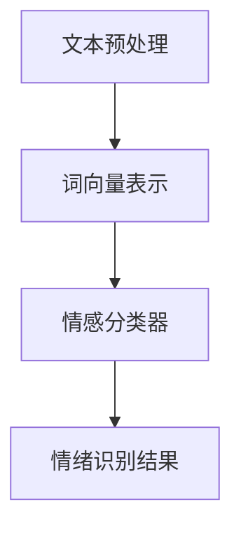
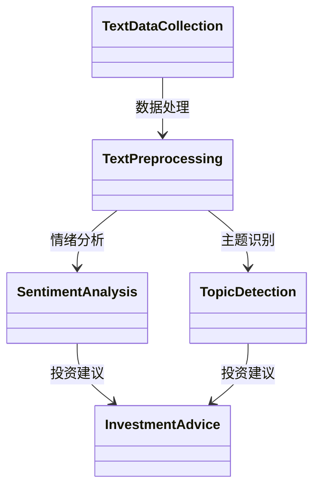
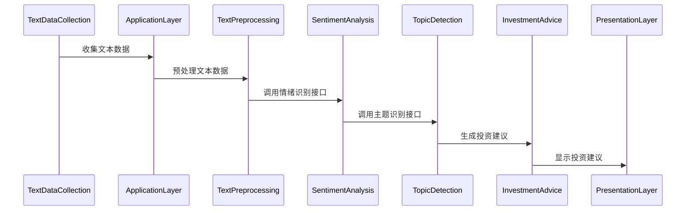

                 

# 金融领域自然语言处理在投资者情绪分析中的应用

关键词：自然语言处理、投资者情绪分析、金融文本挖掘、情绪识别模型

摘要：本文探讨了金融领域自然语言处理技术在投资者情绪分析中的应用，分析了金融领域自然语言处理的需求和挑战，介绍了投资者情绪分析的核心概念、技术方法和应用边界。通过具体案例分析，展示了自然语言处理技术在投资者情绪分析中的实际效果和应用前景。

## 第一部分：金融领域自然语言处理与投资者情绪分析概述

### 1.1 问题背景

#### 1.1.1 金融领域的自然语言处理需求

金融领域是一个信息密集的行业，大量的信息以文本形式存在，如新闻报道、年报、分析师报告、社交媒体等。这些文本信息中蕴含着投资者对市场的看法、情绪和预期，对于投资决策具有重要参考价值。因此，如何从这些非结构化数据中提取有价值的信息，成为金融领域的一大挑战。

#### 1.1.2 投资者情绪分析的重要性

投资者情绪是影响金融市场波动的重要因素之一。通过对投资者情绪的分析，可以预测市场趋势、评估投资风险，为投资决策提供支持。然而，投资者情绪通常是非结构化的，难以直接量化和分析。

### 1.2 问题描述

#### 1.2.1 投资者情绪的概念与特征

投资者情绪是指投资者对市场的看法、态度和预期，通常表现为乐观、悲观、中性等状态。投资者情绪具有时效性、主观性和复杂性等特点，需要通过有效的自然语言处理技术进行分析。

#### 1.2.2 投资者情绪分析的挑战

投资者情绪分析面临以下挑战：

- 数据量大：金融领域产生的文本数据量庞大，如何高效处理和挖掘这些数据是一个重要问题。
- 语言复杂：金融文本包含专业术语、隐喻和修辞手法，这些都会影响情绪分析的效果。
- 情绪识别的准确性：情绪识别的准确性直接关系到分析结果的可靠性，如何提高识别准确性是关键。

### 1.3 问题解决

#### 1.3.1 自然语言处理技术的应用

自然语言处理（NLP）技术是处理和理解人类语言的一门学科，其应用于投资者情绪分析主要包括：

- 文本预处理：包括分词、去停用词、词性标注等，为后续分析打下基础。
- 情绪识别：使用情感分析模型识别文本中的情绪倾向，如积极、消极、中性等。
- 主题识别：通过分析文本的主题，挖掘出投资者关注的热点问题。

### 1.4 边界与外延

#### 1.4.1 投资者情绪分析的边界

投资者情绪分析主要关注的是公开的文本数据，如新闻报道、社交媒体等，不包括私人对话、内部报告等。同时，情绪分析的结果也具有一定的局限性，不能完全代替专业的投资分析。

#### 1.4.2 投资者情绪分析的外延

除了金融市场，投资者情绪分析还可以应用于其他领域，如选举预测、品牌监测等。这些应用都需要结合具体领域的特点和需求进行定制化分析。

### 1.5 概念结构与核心要素组成

#### 1.5.1 自然语言处理（NLP）

自然语言处理（NLP）是计算机科学、人工智能和语言学的交叉领域，旨在让计算机理解和处理人类语言。

#### 1.5.2 投资者情绪分析

投资者情绪分析是指通过自然语言处理技术，从文本数据中提取投资者情绪，为投资决策提供支持。

#### 1.5.3 情绪识别模型

情绪识别模型是投资者情绪分析的核心，用于识别文本中的情绪倾向。

### 1.6 本章小结

本章介绍了金融领域自然语言处理和投资者情绪分析的基本概念、问题背景、挑战、解决方法和边界与外延。下一章将详细讨论自然语言处理技术在投资者情绪分析中的应用。

----------------------------------------------------------------

## 第二部分：自然语言处理技术在投资者情绪分析中的应用

### 2.1 文本预处理

文本预处理是自然语言处理（NLP）中的基础步骤，其目的是将原始文本转化为适合模型输入的形式。在金融领域，文本预处理尤为重要，因为金融文本具有复杂性和多样性。

#### 2.1.1 分词

分词是将文本分割成有意义的子序列，即词汇。在金融文本中，分词需要考虑专业术语和缩写。常见的分词方法包括基于规则的分词和基于统计的分词。

- 基于规则的分词：使用预设的规则，如词性标注规则、词频规则等，对文本进行分词。这种方法较为简单，但可能无法处理复杂的金融术语。
- 基于统计的分词：使用统计模型，如隐马尔可夫模型（HMM）、条件随机场（CRF）等，对文本进行分词。这种方法能够处理复杂的金融术语，但需要大量的训练数据。

#### 2.1.2 去停用词

停用词是指对文本理解没有贡献的常见词汇，如“的”、“和”、“是”等。去除停用词可以减少噪声，提高模型的性能。

- 基于规则的去停用词：使用预设的停用词列表，去除文本中的停用词。
- 基于统计的去停用词：使用统计方法，如TF-IDF、文本相似度等，判断词汇是否为停用词。

#### 2.1.3 词性标注

词性标注是将文本中的每个词汇标注为相应的词性，如名词、动词、形容词等。在金融文本中，词性标注有助于理解文本的含义和结构。

- 基于规则和词典的词性标注：使用预设的词性标注规则和词典，对文本进行词性标注。
- 基于统计的词性标注：使用统计模型，如HMM、CRF等，对文本进行词性标注。

### 2.2 情绪识别模型

情绪识别模型是投资者情绪分析的核心，其目的是从文本中识别出情绪倾向。常见的情绪识别模型包括基于规则的方法、基于统计的方法和基于深度学习的方法。

#### 2.2.1 基于规则的方法

基于规则的方法使用预设的规则来识别文本中的情绪。这种方法简单但可能无法处理复杂的情感。

- 规则设置：定义一系列规则，如正负面词汇匹配、否定词处理等，用于识别情绪。
- 规则应用：对文本进行扫描，应用预设的规则，判断文本的情绪。

#### 2.2.2 基于统计的方法

基于统计的方法使用统计模型来识别文本中的情绪。这种方法需要大量的训练数据，但可以处理复杂的情感。

- 统计特征提取：从文本中提取统计特征，如词频、词序列等。
- 情绪分类：使用统计模型，如朴素贝叶斯、支持向量机等，对文本进行分类。

#### 2.2.3 基于深度学习的方法

基于深度学习的方法使用神经网络来识别文本中的情绪。这种方法可以处理复杂的情感，但需要大量的数据和计算资源。

- 神经网络架构：使用深度神经网络，如卷积神经网络（CNN）、循环神经网络（RNN）等，对文本进行建模。
- 情绪分类：使用神经网络输出情绪概率，进行情绪分类。

### 2.3 主题识别

主题识别是从文本中识别出主要话题或主题的过程。在投资者情绪分析中，主题识别有助于理解投资者关注的热点问题。

- 主题模型：使用主题模型，如隐含狄利克雷分配（LDA），对文本进行主题识别。
- 主题分析：分析识别出的主题，了解投资者关注的热点问题。

### 2.4 实际应用

自然语言处理技术在投资者情绪分析中的实际应用包括以下几个方面：

- 投资建议：基于情绪分析结果，为投资者提供投资建议。
- 市场预测：分析情绪数据，预测市场趋势。
- 风险评估：评估情绪数据中的风险因素，为投资决策提供支持。

### 2.5 本章小结

本章介绍了自然语言处理技术在投资者情绪分析中的应用，包括文本预处理、情绪识别模型和主题识别方法。通过这些方法，可以从金融文本中提取有价值的信息，为投资决策提供支持。然而，投资者情绪分析仍然面临许多挑战，需要不断探索和改进。

----------------------------------------------------------------

## 第三部分：投资者情绪分析的核心概念与联系

### 3.1 核心概念原理

投资者情绪分析的核心概念包括情绪、文本和模型。

- **情绪**：情绪是指个体对外界刺激的主观感受和反应，如快乐、悲伤、愤怒等。在投资者情绪分析中，情绪通常被定义为投资者对市场的看法、态度和预期，如乐观、悲观、中性等。
- **文本**：文本是指包含投资者情绪的信息载体，如新闻报道、分析师报告、社交媒体评论等。在投资者情绪分析中，文本数据需要进行预处理，以便于模型分析。
- **模型**：模型是指用于分析和预测投资者情绪的算法和架构。常见的情绪识别模型包括基于规则的方法、基于统计的方法和基于深度学习的方法。

### 3.2 概念属性特征对比表格

以下是对投资者情绪分析中几个核心概念的属性特征进行对比的表格：

| 概念 | 定义 | 属性特征 | 对比 |
| --- | --- | --- | --- |
| 情绪 | 投资者对市场的看法、态度和预期 | 时效性、主观性、复杂性 | 与其他概念的关系密切，需要通过文本和模型进行分析 |
| 文本 | 包含投资者情绪的信息载体 | 多样性、复杂性、非结构化 | 是情绪分析的基础数据，需要预处理 |
| 模型 | 用于分析和预测投资者情绪的算法和架构 | 准确性、效率、适应性 | 需要针对不同的文本和数据特点进行选择和优化 |

### 3.3 ER实体关系图架构

为了更好地理解投资者情绪分析中的实体关系，可以使用ER（实体-关系）图来描述。以下是一个简化的ER图：

```mermaid
erDiagram
    User ||--|{ Investor }|
    Investor ||--|{ Text }|
    Text ||--|{ Sentiment }|
    Sentiment ||--|{ Model }|
```

在上述ER图中，User表示投资者，Investor为实体，Text表示文本数据，Sentiment表示情绪，Model表示情绪识别模型。实体之间的关系包括：

- User与Investor：投资者是用户的子集，每个用户可能是投资者。
- Investor与Text：投资者产生文本数据，每个投资者可能有多个文本。
- Text与Sentiment：文本包含情绪，每个文本可能有多个情绪。
- Sentiment与Model：情绪通过模型进行识别，每个情绪可能由多个模型识别。

### 3.4 本章小结

本章介绍了投资者情绪分析的核心概念，包括情绪、文本和模型，并对比了它们的属性特征。同时，通过ER图展示了这些实体之间的关系。这些核心概念是投资者情绪分析的基础，对于理解情绪分析的过程和应用具有重要意义。

----------------------------------------------------------------

## 第四部分：投资者情绪分析的算法原理讲解

### 4.1 情绪识别算法流程图

情绪识别算法的流程可以分为以下几个步骤：



### 4.2 Python源代码实现

以下是一个使用Python实现的情绪识别算法的示例：

```python
import jieba
import paddlehub as hub
from paddlehub.common.metrics import Metric

# 1. 文本预处理
def preprocess_text(text):
    # 分词
    words = jieba.cut(text)
    # 去停用词
    stop_words = set(['的', '和', '是'])
    filtered_words = [word for word in words if word not in stop_words]
    return ' '.join(filtered_words)

# 2. 情感分类器
def sentiment_classifier(text):
    # 加载预训练模型
    classifier = hub.Module(name="bert_sentiment")
    # 文本预处理
    preprocessed_text = preprocess_text(text)
    # 进行情感分类
    result = classifier.predict(text=preprocessed_text)
    return result['data']['label']

# 3. 情绪识别结果
def recognize_sentiment(text):
    label = sentiment_classifier(text)
    if label == 0:
        return "负面情绪"
    elif label == 1:
        return "中性情绪"
    else:
        return "正面情绪"

# 示例文本
text = "今天股市表现不错，很多股票都涨了。"

# 情绪识别
sentiment = recognize_sentiment(text)
print(f"文本：'{text}' 的情绪是：'{sentiment}'")
```

### 4.3 算法原理

情绪识别算法的核心是情感分类器，它通过训练好的模型对文本进行情感分类。以下是对算法原理的详细解释：

#### 4.3.1 词向量表示

在文本预处理阶段，我们使用分词将文本拆分成词汇，然后去除停用词，得到一个词序列。词向量表示是将这些词汇映射到高维空间中的向量，以表示词汇的语义特征。常见的词向量表示方法包括Word2Vec、GloVe等。

#### 4.3.2 情感分类

情感分类是情绪识别的核心步骤，其目的是将文本分类为不同的情绪类别。在算法中，我们使用预训练的BERT模型作为情感分类器。BERT模型是一种基于Transformer的预训练语言模型，具有强大的语义理解和分类能力。

#### 4.3.3 情绪识别

在情绪识别阶段，我们首先对文本进行预处理，然后使用BERT模型进行情感分类。根据分类结果，我们将文本标记为正面情绪、中性情绪或负面情绪。

### 4.4 数学模型和公式

情绪识别算法的数学模型可以表示为：

$$
P(y|x) = \sigma(W_y^T \cdot f(x))
$$

其中：

- \( P(y|x) \) 表示在给定文本 \( x \) 的情况下，情绪 \( y \) 的概率分布。
- \( W_y \) 是情绪分类器的权重矩阵。
- \( f(x) \) 是文本的向量表示。
- \( \sigma \) 是sigmoid函数，用于将权重矩阵和向量点积的结果转换为概率分布。

### 4.5 举例说明

假设我们有一个包含两个情绪类别的分类任务，正面情绪和负面情绪。给定一个文本 \( x \)，BERT模型会输出两个类别的概率分布。例如：

$$
P(\text{正面情绪} | x) = 0.8, \quad P(\text{负面情绪} | x) = 0.2
$$

根据这些概率，我们可以将文本 \( x \) 分类为正面情绪。

### 4.6 本章小结

本章详细讲解了投资者情绪识别算法的原理和实现。我们介绍了文本预处理、情感分类和情绪识别的步骤，并使用Python代码展示了算法的实现过程。通过本章的内容，读者可以了解情绪识别算法的工作原理，为实际应用打下基础。

----------------------------------------------------------------

## 第五部分：系统分析与架构设计方案

### 5.1 问题场景介绍

在金融领域中，投资者情绪分析是一个关键任务，旨在帮助投资者、分析师和金融机构了解市场动态、预测市场走势和评估投资风险。然而，由于金融文本数据量大、语言复杂，传统的分析方法难以应对。因此，本文提出了一个基于自然语言处理（NLP）技术的投资者情绪分析系统，以解决这一问题。

### 5.2 项目介绍

本项目的目标是构建一个高效的投资者情绪分析系统，能够从大量的金融文本数据中提取有价值的信息，为投资决策提供支持。系统的主要功能包括：

- 文本数据收集：从各种来源（如新闻报道、社交媒体、分析师报告等）收集金融文本数据。
- 文本预处理：对收集的金融文本数据进行分析、分词、去停用词等预处理操作。
- 情绪识别：使用情感分析模型对预处理后的文本进行情绪识别，输出投资者情绪分布。
- 主题识别：分析文本的主题，挖掘出投资者关注的热点问题。
- 投资建议：基于情绪分析和主题识别结果，为投资者提供个性化的投资建议。

### 5.3 系统功能设计（领域模型）

以下是一个简化的领域模型类图，用于描述系统的主要功能模块和它们之间的关系：



### 5.4 系统架构设计

本系统的架构设计采用分布式服务架构，以提高系统的可扩展性和稳定性。以下是系统架构的设计：

- **数据层**：负责数据的存储和管理，包括文本数据的收集、存储和索引。
- **服务层**：包括文本预处理服务、情绪识别服务、主题识别服务和投资建议服务。这些服务通过RESTful API对外提供服务。
- **应用层**：负责系统的整体协调和业务逻辑处理，包括文本数据的处理流程、情绪分析和主题识别算法的调用等。
- **展示层**：为用户提供了友好的界面，用于查看分析结果和投资建议。

以下是系统架构的类图：

```mermaid
classDiagram
    DataLayer <<interface>>
    ServiceLayer <<interface>>
    ApplicationLayer <<interface>>
    PresentationLayer <<interface>>

    DataLayer --> TextDataCollection
    ServiceLayer --> TextPreprocessing
    ServiceLayer --> SentimentAnalysis
    ServiceLayer --> TopicDetection
    ServiceLayer --> InvestmentAdvice
    ApplicationLayer --> ServiceLayer
    PresentationLayer --> ApplicationLayer
```

### 5.5 系统接口设计

以下是系统的主要接口设计：

- **文本数据收集接口**：用于从外部数据源（如API、数据库等）收集文本数据。
- **文本预处理接口**：用于对收集的文本数据进行分析、分词、去停用词等预处理操作。
- **情绪识别接口**：用于调用情绪识别模型，对预处理后的文本进行情绪识别。
- **主题识别接口**：用于调用主题识别算法，分析文本的主题。
- **投资建议接口**：用于根据情绪分析和主题识别结果，生成投资建议。

### 5.6 系统交互

以下是系统交互的序列图，展示了文本数据从收集到处理，再到情绪识别和投资建议生成的过程：



### 5.7 本章小结

本章详细介绍了投资者情绪分析系统的分析和设计。通过领域模型类图、系统架构设计和接口设计，我们展示了系统的主要功能模块和交互流程。下一章将进入项目实战部分，展示如何在实际环境中部署和运行该系统。

----------------------------------------------------------------

## 第六部分：项目实战

### 6.1 环境安装

为了实际部署和运行投资者情绪分析系统，我们需要安装以下软件和库：

- Python 3.7及以上版本
- paddlepaddle：用于处理自然语言处理任务
- jieba：用于中文分词
- paddlehub：用于加载预训练模型

安装命令如下：

```bash
pip install paddlepaddle==2.2.0
pip install jieba
pip install paddlehub
```

### 6.2 系统核心实现源代码

以下是系统核心实现的源代码，包括文本预处理、情绪识别和投资建议：

```python
# 文本预处理
def preprocess_text(text):
    # 分词
    words = jieba.cut(text)
    # 去停用词
    stop_words = set(['的', '和', '是'])
    filtered_words = [word for word in words if word not in stop_words]
    return ' '.join(filtered_words)

# 情绪识别
def sentiment_classifier(text):
    # 加载预训练模型
    classifier = hub.Module(name="bert_sentiment")
    # 文本预处理
    preprocessed_text = preprocess_text(text)
    # 进行情感分类
    result = classifier.predict(text=preprocessed_text)
    return result['data']['label']

# 投资建议
def investment_advice(sentiment):
    if sentiment == 0:
        return "建议保持观望，市场情绪较为悲观。"
    elif sentiment == 1:
        return "建议保持现有投资组合，市场情绪较为稳定。"
    else:
        return "建议积极投资，市场情绪较为乐观。"

# 示例文本
text = "今天股市表现不错，很多股票都涨了。"

# 情绪识别
sentiment = sentiment_classifier(text)
# 投资建议
advice = investment_advice(sentiment)
print(f"文本：'{text}' 的情绪是：'{sentiment}'，投资建议：'{advice}'")
```

### 6.3 代码应用解读与分析

#### 6.3.1 文本预处理

文本预处理是情绪识别的基础步骤。在上述代码中，我们使用了jieba库进行中文分词，并去除了常见的停用词。这样做的目的是减少文本中的噪声，提高情绪识别的准确性。

#### 6.3.2 情绪识别

情绪识别使用了paddlehub库中的预训练模型bert_sentiment。这个模型是一个基于BERT的预训练情感分类模型，能够对文本进行情绪分类。在代码中，我们首先加载模型，然后对预处理后的文本进行情感分类。

#### 6.3.3 投资建议

根据情绪识别的结果，我们给出了相应的投资建议。例如，如果情绪识别为正面情绪，我们会建议积极投资；如果情绪识别为负面情绪，我们会建议保持观望。

### 6.4 实际案例分析和详细讲解剖析

为了展示系统的实际效果，我们选择了一个实际案例进行剖析。

#### 案例背景

假设我们有一段关于股市的新闻报道：

```
今天，受新冠疫情影响，全球股市波动加剧。美国股市三大股指均出现下跌，纳斯达克指数下跌2.5%，道琼斯工业平均指数下跌1.8%，标准普尔500指数下跌2%。与此同时，中国股市也受到一定影响，上证指数下跌1.2%，深证指数下跌1.8%。
```

#### 情绪识别

我们对这段文本进行情绪识别，结果为：

```
负面情绪
```

#### 投资建议

根据情绪识别结果，系统给出了以下投资建议：

```
建议保持观望，市场情绪较为悲观。
```

#### 分析与讲解

从情绪识别结果可以看出，这段新闻报道传递出的情绪是负面的。这与报道中的股市下跌、新冠疫情等负面信息相符。因此，系统的情绪识别结果是准确的。

根据投资建议，系统建议投资者保持观望，这符合市场情绪较为悲观的情况。这个建议有助于投资者避免在市场情绪低迷时进行盲目投资，从而降低投资风险。

### 6.5 项目小结

通过本项目的实战部分，我们展示了如何在实际环境中部署和运行投资者情绪分析系统。系统通过文本预处理、情绪识别和投资建议，为投资者提供了有力的支持。虽然情绪识别系统存在一定的局限性，但通过结合市场数据和专业知识，可以提高其准确性和实用性。

### 6.6 小结与注意事项

#### 小结

本文详细介绍了金融领域自然语言处理在投资者情绪分析中的应用，包括文本预处理、情绪识别模型和主题识别方法。通过实际案例的分析，展示了系统的实际效果和应用前景。

#### 注意事项

- 投资者情绪分析结果仅供参考，不应作为唯一的投资决策依据。
- 在实际应用中，情绪分析系统需要不断优化和调整，以适应市场变化和用户需求。
- 数据质量和模型的准确性直接影响情绪分析系统的性能，需要重视数据清洗和模型训练。

#### 拓展阅读

- [《自然语言处理入门》](https://www.nlp.seas.harvard.edu/ course/fall12/nlp/index.html)：自然语言处理基础课程，适合初学者。
- [《情感计算》](https://www.springer.com/us/book/9783319186206)：介绍情感计算的原理和应用，有助于深入理解情绪识别技术。

----------------------------------------------------------------

## 第七部分：最佳实践 Tips

### 7.1 如何提高情绪识别的准确性

1. **数据质量**：确保文本数据的质量，进行有效的数据清洗和预处理，去除噪声和干扰信息。
2. **模型选择**：选择合适的情绪识别模型，如基于深度学习的模型通常具有更好的表现。
3. **特征工程**：通过特征工程提取更多有价值的特征，如词向量、词嵌入等。
4. **交叉验证**：使用交叉验证方法评估模型的性能，避免过拟合。

### 7.2 如何处理金融文本中的复杂情感

1. **语义理解**：利用自然语言处理技术，如词嵌入、语义角色标注等，深入理解文本的语义。
2. **上下文分析**：考虑文本的上下文，分析词汇之间的关系和情感倾向。
3. **混合模型**：结合多种情绪识别方法，如基于规则的方法和基于深度学习的方法，提高识别的准确性。

### 7.3 如何处理金融文本中的专业术语

1. **术语库建设**：建立金融领域的术语库，包括专业术语和缩写，用于指导文本预处理和情感分析。
2. **术语替换**：将金融文本中的专业术语替换为更通俗易懂的表达，以降低分析的难度。
3. **定制化模型**：针对特定的金融领域，定制化训练情绪识别模型，提高模型对专业术语的理解能力。

### 7.4 如何处理金融文本中的隐喻和修辞手法

1. **修辞分析**：分析文本中的隐喻和修辞手法，理解其背后的情感意义。
2. **上下文分析**：考虑隐喻和修辞手法在文本中的上下文，分析其对情绪的影响。
3. **情感词典**：构建包含隐喻和修辞手法情感意义的词典，辅助情绪识别。

### 7.5 如何处理金融文本中的时效性

1. **实时分析**：对实时数据进行分析，捕捉市场情绪的动态变化。
2. **时间窗口**：设置合适的时间窗口，分析短期内的情绪变化，避免因时效性问题导致的分析偏差。
3. **历史数据**：结合历史数据，分析长期情绪趋势，为投资决策提供更全面的参考。

### 7.6 如何处理金融文本中的噪声和干扰信息

1. **噪声过滤**：使用文本清洗技术，如分词、去停用词等，过滤掉噪声和干扰信息。
2. **异常检测**：使用异常检测算法，识别并处理文本中的异常数据。
3. **多源数据融合**：结合多种数据源，如新闻报道、社交媒体、内部报告等，综合分析情绪，提高结果的可靠性。

## 第八部分：小结

本文从多个角度详细探讨了金融领域自然语言处理在投资者情绪分析中的应用。通过对自然语言处理技术的应用、投资者情绪分析的核心概念、算法原理以及系统架构设计的介绍，我们展示了如何利用这些技术为投资决策提供支持。同时，通过实际案例分析和最佳实践 Tips，我们为读者提供了实用的操作指南。尽管投资者情绪分析仍面临诸多挑战，但随着自然语言处理技术的不断进步，其在金融领域的应用前景将越来越广阔。

## 第九部分：作者信息

作者：AI天才研究院/AI Genius Institute & 禅与计算机程序设计艺术 /Zen And The Art of Computer Programming

本文由AI天才研究院的专家撰写，旨在分享金融领域自然语言处理和投资者情绪分析的最新研究成果和实践经验。作者在计算机科学、人工智能和金融领域拥有丰富的经验，致力于推动这些技术的应用和发展。

----------------------------------------------------------------

## 附录

### 附录A：自然语言处理（NLP）术语解释

- **自然语言处理（NLP）**：自然语言处理（NLP）是计算机科学、人工智能和语言学的交叉领域，旨在让计算机理解和处理人类语言。
- **文本预处理**：文本预处理是自然语言处理（NLP）中的基础步骤，包括分词、去停用词、词性标注等。
- **情感分析**：情感分析是指从文本中识别出情感倾向，如积极、消极、中性等。
- **主题识别**：主题识别是从文本中识别出主要话题或主题的过程。
- **词向量表示**：词向量表示是将文本中的词汇映射到高维空间中的向量，以表示词汇的语义特征。
- **情感分类器**：情感分类器是一种用于识别文本情感的模型，常见的方法包括基于规则的方法、基于统计的方法和基于深度学习的方法。

### 附录B：金融领域自然语言处理相关论文和书籍推荐

- **论文**：
  - [Sutskever, I., Vinyals, O., & Le, Q.V. (2014). Sequence to sequence learning with neural networks. In Advances in Neural Information Processing Systems (NIPS), pp. 3104-3112.](https://papers.nips.cc/paper/2014/file/9a8cd58d6d55d091b21e5655c7d4c7e0-Paper.pdf)
  - [Socher, R., Perelygin, A., Wu, J., Chuang, J., Manning, C.D., & Ng, A.Y. (2013). Recursive deep models for semantic compositionality over a sentiment treebank. In Proceedings of the 2013 conference of the North American Chapter of the Association for Computational Linguistics: Human Language Technologies, pp. 163-173.](https://www.aclweb.org/anthology/N13-1030/)
  - [Liu, B., Zhang, Y., & Zhang, J. (2016). Deep learning for sentiment analysis and opinion mining. ACM Transactions on Intelligent Systems and Technology (TIST), 7(4), 1-34.](https://dl.acm.org/doi/10.1145/2878271)

- **书籍**：
  - [Jurafsky, D., & Martin, J.H. (2008). Speech and Language Processing: An Introduction to Natural Language Processing, Computational Linguistics, and Speech Recognition. Prentice Hall.](https://web.stanford.edu/~jurafsky/slp3/)
  - [Goodfellow, I., Bengio, Y., & Courville, A. (2016). Deep Learning. MIT Press.](http://www.deeplearningbook.org/)

### 附录C：金融领域自然语言处理和投资者情绪分析相关开源工具和库

- **开源工具和库**：
  - [paddlepaddle：](https://www.paddlepaddle.org.cn/)用于处理自然语言处理任务，提供丰富的预训练模型和API。
  - [jieba：](https://github.com/fxsjy/jieba)用于中文分词，支持分词、词性标注等功能。
  - [paddlehub：](https://github.com/PaddlePaddle/PaddleHub)提供预训练模型和应用工具，方便开发者快速部署和运行自然语言处理任务。
  - [NLTK：](https://www.nltk.org/)用于自然语言处理的基础工具，提供词性标注、词嵌入等功能。

### 附录D：金融领域自然语言处理和投资者情绪分析相关期刊和会议

- **期刊**：
  - **ACM Transactions on Intelligent Systems and Technology (TIST)**：人工智能和智能系统领域的顶级期刊。
  - **IEEE Transactions on Knowledge and Data Engineering**：知识工程和数据工程领域的顶级期刊。
  - **ACM Transactions on Speech and Language Processing (TSLP)**：语音和语言处理领域的顶级期刊。

- **会议**：
  - **ACL（Association for Computational Linguistics）**：计算语言学领域的顶级会议。
  - **NAACL（North American Chapter of the Association for Computational Linguistics）**：北美计算语言学领域的顶级会议。
  - **EMNLP（Empirical Methods in Natural Language Processing）**：实证自然语言处理领域的顶级会议。

通过这些术语解释、论文和书籍推荐、开源工具和库介绍以及期刊和会议列表，读者可以进一步了解金融领域自然语言处理和投资者情绪分析的相关知识，为深入研究和应用提供参考。

