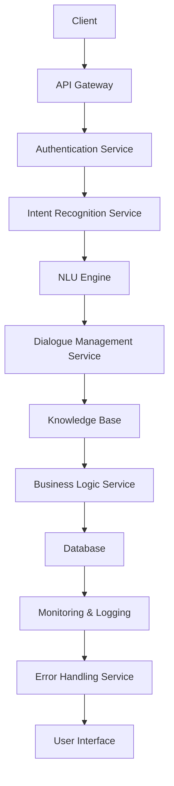
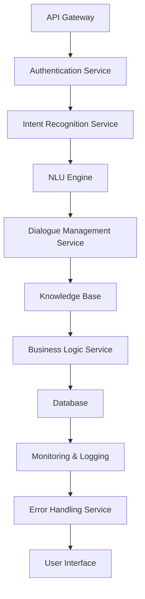

                 

### 文章标题

# 金融领域自然语言理解技术在客户服务中的应用

> 关键词：自然语言理解、金融领域、客户服务、NLP、应用场景、系统架构、算法原理

> 摘要：本文将深入探讨金融领域自然语言理解技术（NLU）在客户服务中的应用。通过对问题背景、核心概念、技术原理、应用场景、系统架构以及实际项目案例分析，全面展示自然语言理解技术在金融客户服务中的价值，为未来金融行业的技术发展提供新思路。

### 目录

1. **引言**
   1.1 问题背景与现状
   1.2 核心概念
   1.3 文章结构

2. **金融领域自然语言处理基础**
   2.1 语言模型
   2.2 词向量表示
   2.3 语法分析与语义分析

3. **自然语言理解技术原理**
   3.1 词嵌入与编码
   3.2 层次化语义理解

4. **金融领域客户服务应用场景**
   4.1 客户咨询处理
   4.2 交易与风险管理

5. **技术实现与系统架构**
   5.1 系统设计原则
   5.2 架构设计方案

6. **项目实战与案例分析**
   6.1 实践环境搭建
   6.2 系统核心实现
   6.3 案例分析
   6.4 项目小结

7. **未来发展趋势与展望**
   7.1 技术发展趋势
   7.2 商业应用前景

8. **总结与拓展**
   8.1 总结
   8.2 注意事项
   8.3 拓展阅读

### 引言

#### 1.1 问题背景与现状

随着金融科技的迅速发展，金融行业在数字化转型过程中，面临着前所未有的挑战和机遇。客户服务作为金融机构与客户互动的重要环节，其服务质量直接影响客户的满意度和忠诚度。然而，传统的人工客服方式在应对大量客户咨询和需求时，存在以下问题：

- **效率低**：人工客服需要逐个处理客户咨询，导致响应时间较长，无法满足24小时自助服务需求。
- **成本高**：大量的人工客服投入增加了运营成本，不利于金融机构的盈利。
- **服务质量不稳定**：人工客服的素质和经验参差不齐，导致服务质量难以保证。

为了解决这些问题，金融机构开始寻求利用人工智能技术，特别是自然语言理解（NLU）技术，提升客户服务的质量和效率。NLU技术能够通过对自然语言文本的分析，自动识别客户意图、情感和需求，从而实现智能化的客户服务。

#### 1.2 核心概念

在本篇文章中，我们将涉及以下核心概念：

- **自然语言处理（NLP）**：是人工智能领域的一个重要分支，旨在让计算机理解和生成自然语言。
- **自然语言理解（NLU）**：是NLP中的一个子领域，专注于理解自然语言的语义、情感和意图。
- **客户服务**：是指金融机构为客户提供的产品和服务，包括咨询、查询、投诉、理财建议等。
- **自然语言理解技术**：是指应用在客户服务中的NLU技术，包括语言模型、词向量表示、语法分析、语义分析等。

#### 1.3 文章结构

本文将按照以下结构进行阐述：

1. **金融领域自然语言处理基础**：介绍NLP的基础知识和方法，包括语言模型、词向量表示和语法分析。
2. **自然语言理解技术原理**：深入讲解NLU技术的基本原理，包括词嵌入、编码和层次化语义理解。
3. **金融领域客户服务应用场景**：分析NLU技术在金融客户服务中的应用场景，包括客户咨询处理、交易与风险管理。
4. **技术实现与系统架构**：介绍NLU技术在金融客户服务系统中的实现和架构设计。
5. **项目实战与案例分析**：通过实际项目展示NLU技术在金融客户服务中的应用。
6. **未来发展趋势与展望**：探讨NLU技术在金融领域的未来发展。

通过本文的阅读，读者将能够全面了解自然语言理解技术在金融客户服务中的应用，为金融机构提升服务质量提供技术支持。

### 金融领域自然语言处理基础

#### 2.1 语言模型

自然语言处理（NLP）的基础之一是语言模型（Language Model），它用于预测文本的下一个单词或词组。语言模型的核心任务是理解语言中的统计规律，从而生成或理解自然语言文本。

**核心概念**：

- **n-gram模型**：是一种基于有限历史记忆的语言模型，它使用前n个单词来预测下一个单词。例如，一个三元的n-gram模型会根据前三个单词预测下一个单词。

**语言模型原理**：

语言模型的原理基于马尔可夫假设，即未来的状态取决于当前的状态，而不是过去的状态。基于这一假设，语言模型通过统计大量的文本数据，计算每个单词出现的概率，从而生成自然语言。

**常见语言模型**：

- **n-gram模型**：最简单的语言模型，通过统计单词的频率来预测下一个单词。
- **神经网络模型**：基于深度学习的方法，通过多层神经网络来学习文本的语义特征，从而生成或理解自然语言文本。
- **Transformer模型**：是近年来在NLP领域表现最出色的模型，它使用自注意力机制（Self-Attention）来处理长距离依赖问题，取得了显著的性能提升。

**示例**：

假设我们有一个三元n-gram模型，给定前三个单词“我喜欢吃”，我们可以根据模型的概率分布预测下一个单词。

```plaintext
我喜欢吃 的概率分布：
- 蛋糕：0.3
- 水果：0.2
- 烤肉：0.5
```

因此，下一个单词可能是“烤肉”或“水果”，具体取决于模型对每个单词的预测概率。

#### 2.2 词向量表示

词向量表示（Word Vector Representation）是NLP中的另一个重要概念，它将单词映射为向量空间中的点，从而可以利用向量运算来处理自然语言。

**核心概念**：

- **词向量**：是一个实值向量，用于表示单词的语义特征。
- **嵌入矩阵**：是一个大型矩阵，其中每个行向量对应一个词向量。

**词向量表示原理**：

词向量表示的原理基于分布式假设，即语义相似的单词在向量空间中距离较近。词向量表示方法通过学习大量的文本数据，从上下文中学习单词的语义关系，从而将单词映射为向量。

**常见词向量模型**：

- **Word2Vec**：是一种基于神经网络的方法，通过优化神经网络中的权重来学习词向量。
- **GloVe**：是一种基于全局统计的方法，通过矩阵分解学习词向量。
- **BERT**：是一种基于预训练的深度神经网络的方法，通过在大量文本数据上预训练，学习单词的语义关系。

**示例**：

假设我们使用Word2Vec模型学习了一个词向量，单词“苹果”的词向量表示为$(1, 2, 3)$，单词“香蕉”的词向量表示为$(2, 3, 4)$。

- **相似性**：根据词向量的距离计算，我们可以发现“苹果”和“香蕉”在向量空间中的距离较近，因此它们在语义上较为相似。
- **聚类**：我们可以使用词向量进行聚类，将语义相似的单词聚为一类，从而实现词汇分类和语义分析。

#### 2.3 语法分析与语义分析

语法分析（Syntactic Analysis）和语义分析（Semantic Analysis）是NLP中的两个重要任务，它们分别从语法和语义的角度理解自然语言。

**语法分析**：

- **核心概念**：语法分析是NLP中的基础任务，旨在理解文本的语法结构，包括词法分析、句法分析和语义分析。
- **方法**：常见的语法分析方法包括基于规则的方法、基于统计的方法和基于神经网络的方法。其中，基于规则的方法通过手工编写规则来分析文本，基于统计的方法通过统计文本中的语法模式来分析文本，基于神经网络的方法通过深度学习模型来分析文本。

**语义分析**：

- **核心概念**：语义分析是NLP中的高级任务，旨在理解文本的语义内容，包括实体识别、关系抽取和语义角色标注等。
- **方法**：常见的语义分析方法包括基于规则的方法、基于统计的方法和基于神经网络的方法。其中，基于规则的方法通过手工编写规则来识别实体和关系，基于统计的方法通过统计文本中的模式来识别实体和关系，基于神经网络的方法通过深度学习模型来识别实体和关系。

**示例**：

假设我们有一个句子“张三昨天去银行取款”，我们可以使用语法分析方法将其分解为词法和句法结构：

- **词法分析**：提取句子中的单词，如“张三”、“昨天”、“银行”、“取款”等。
- **句法分析**：构建句子的句法树，如：

  ```plaintext
  (S
    (NP (NNP 张三))
    (ADVP (DT 昨天)))
    (VP (VBZ 去了)
      (NP (NN 银行))
      (NP (NN 取款)))
  )
  ```

使用语义分析方法，我们可以识别句子中的实体和关系：

- **实体识别**：识别出句子中的实体，如“张三”、“银行”等。
- **关系抽取**：识别出实体之间的关系，如“张三”与“银行”之间的关系为“取款”。

通过语法分析和语义分析，我们可以深入理解自然语言的语法结构和语义内容，从而实现更加精确的自然语言理解。

### 自然语言理解技术原理

#### 3.1 词嵌入与编码

词嵌入（Word Embedding）是自然语言处理（NLP）中的一个关键技术，它通过将单词映射为向量，使得单词的语义信息能够在向量空间中体现。词嵌入不仅解决了单词之间的语义表示问题，还为后续的文本分析和机器学习任务提供了强有力的支持。

**核心概念**：

- **词嵌入**：将单词映射为向量，通常是一个实值向量。
- **嵌入矩阵**：是一个大型矩阵，其中每个行向量对应一个词向量。

**词嵌入原理**：

词嵌入的原理基于分布式假设，即语义相似的单词在向量空间中距离较近。词嵌入通过学习大量的文本数据，从上下文中学习单词的语义关系，从而将单词映射为向量。

**常见词嵌入模型**：

- **Word2Vec**：是一种基于神经网络的方法，通过优化神经网络中的权重来学习词向量。
- **GloVe**：是一种基于全局统计的方法，通过矩阵分解学习词向量。
- **BERT**：是一种基于预训练的深度神经网络的方法，通过在大量文本数据上预训练，学习单词的语义关系。

**示例**：

假设我们使用Word2Vec模型学习了一个词向量，单词“苹果”的词向量表示为$(1, 2, 3)$，单词“香蕉”的词向量表示为$(2, 3, 4)$。

- **相似性**：根据词向量的距离计算，我们可以发现“苹果”和“香蕉”在向量空间中的距离较近，因此它们在语义上较为相似。
- **聚类**：我们可以使用词向量进行聚类，将语义相似的单词聚为一类，从而实现词汇分类和语义分析。

**词嵌入与编码**：

词嵌入不仅用于表示单词，还用于编码。编码是将文本转换为数字表示的过程，以便于计算机进行处理。词嵌入在编码过程中发挥了重要作用，它将文本中的单词转换为词向量，从而为后续的文本分析和机器学习任务提供了输入。

**示例**：

假设我们有一个句子“我喜欢吃苹果”，我们可以将其编码为词向量表示：

- **单词表示**：每个单词映射为一个词向量，例如“我”的词向量表示为$(1, 0, -1)$， “喜欢”的词向量表示为$(0, 1, 0)$， “吃”的词向量表示为$(0, -1, 1)$， “苹果”的词向量表示为$(1, 2, 3)$。
- **句子表示**：我们可以将句子的词向量拼接起来，形成一个向量表示，例如$(1, 0, -1, 0, 1, 0, -1, 1, 1, 2, 3)$。

通过词嵌入和编码，我们可以将自然语言文本转换为向量表示，从而为后续的文本分析和机器学习任务提供了输入。

#### 3.2 层次化语义理解

层次化语义理解（Hierarchical Semantic Understanding）是自然语言处理（NLP）中的一个高级任务，它旨在通过层次化的方式理解自然语言的语义结构，从而实现更精准的语义分析。层次化语义理解通过将文本分解为不同层次的结构，从而捕捉语义信息的多样性和复杂性。

**核心概念**：

- **层次化结构**：将文本分解为不同层次的结构，例如句子、短语、词等。
- **语义角色**：描述句子中不同成分的语义功能，例如主语、谓语、宾语等。
- **依存关系**：描述句子中不同成分之间的依赖关系，例如主谓关系、动宾关系等。

**层次化语义理解原理**：

层次化语义理解基于语法分析和语义分析，通过多层级的分析来捕捉语义信息。首先，通过语法分析将文本分解为不同的短语和句子；然后，通过语义分析识别出短语和句子中的语义角色和依存关系；最后，通过层次化的方式将这些信息组织起来，形成一个完整的语义理解。

**常见方法**：

- **依存句法分析**：通过识别句子中的依存关系，将句子分解为层次化的结构。
- **语义角色标注**：通过识别句子中的语义角色，将句子中的成分进行分类和标注。
- **层次化语义模型**：通过构建多层级的语义模型，实现对文本的层次化理解。

**示例**：

假设我们有一个句子“张三昨天去银行取款”，我们可以使用层次化语义理解对其进行解析：

1. **语法分析**：将句子分解为短语和句子：

   ```plaintext
   (S
     (NP (NNP 张三))
     (ADVP (DT 昨天)))
     (VP (VBZ 去了)
       (NP (NN 银行))
       (NP (NN 取款)))
   )
   ```

2. **语义角色标注**：识别句子中的语义角色：

   ```plaintext
   张三 - 主语
   昨天去银行取款 - 谓语
   ```

3. **依存句法分析**：识别句子中的依存关系：

   ```plaintext
   张三 -- 去银行
   去银行 -- 取款
   ```

通过层次化语义理解，我们可以将句子分解为层次化的结构，从而捕捉到句子中的语义信息。这种层次化的方式使得语义理解更加精细，能够更好地应对复杂的自然语言文本。

### 金融领域客户服务应用场景

#### 4.1 客户咨询处理

在金融领域，客户咨询处理是客户服务中最为重要的一环。通过自然语言理解（NLU）技术，金融机构可以自动化地处理大量客户咨询，提高响应速度和服务质量。

**应用场景**：

1. **自动回答系统**：通过NLU技术，金融机构可以构建一个自动回答系统，自动识别客户的问题，并提供相应的答案。例如，客户询问“我的信用卡额度是多少？”系统可以自动提取问题中的关键信息，如客户姓名和信用卡类型，然后查询数据库，返回客户的信用卡额度。

2. **情感分析**：通过NLU技术，金融机构可以对客户咨询中的情感进行分析，识别客户的情绪状态。例如，客户在咨询时使用了大量的负面词汇，系统可以判断客户可能处于愤怒或不满状态，从而采取相应的措施，如派发客服人员介入解决。

3. **实时对话系统**：通过NLU技术，金融机构可以构建一个实时对话系统，与客户进行实时交流。例如，客户可以通过聊天机器人与银行客服进行对话，查询账户余额、转账、贷款等操作。

**技术实现**：

1. **问题识别**：使用NLU技术中的意图识别，自动识别客户的问题类型。例如，通过训练一个意图分类模型，可以识别出客户的问题是查询账户余额、转账、贷款等。

2. **信息提取**：使用NLU技术中的实体识别，提取客户问题中的关键信息。例如，通过训练一个实体识别模型，可以提取出客户问题中的客户姓名、信用卡类型、金额等。

3. **答案生成**：使用NLU技术中的语言生成，自动生成回答。例如，通过训练一个语言生成模型，可以生成自然语言回答，如“您的信用卡额度为10万元”。

**效果评估**：

1. **响应速度**：通过NLU技术的自动化处理，可以显著提高客户咨询的响应速度，减少客户等待时间。

2. **服务质量**：通过情感分析和实时对话系统，可以提供更加个性化的服务，提升客户满意度。

3. **成本节约**：通过自动化处理客户咨询，可以减少人工客服的投入，降低运营成本。

#### 4.2 交易与风险管理

在金融领域，交易与风险管理是金融机构的核心业务。通过自然语言理解（NLU）技术，金融机构可以自动化地处理大量交易数据，提高交易效率和风险管理能力。

**应用场景**：

1. **交易建议系统**：通过NLU技术，金融机构可以构建一个交易建议系统，根据客户的历史交易数据和市场动态，自动生成交易建议。例如，通过分析客户最近的交易记录，系统可以建议客户买入或卖出某种金融产品。

2. **风险评估模型**：通过NLU技术，金融机构可以构建一个风险评估模型，对客户的交易行为进行实时监控和分析，识别潜在的风险。例如，通过分析客户的交易记录和情绪状态，系统可以判断客户是否存在异常交易行为，从而采取相应的风险控制措施。

3. **自动合规检查**：通过NLU技术，金融机构可以构建一个自动合规检查系统，对客户的交易行为进行实时检查，确保交易符合相关法律法规和内部规定。例如，通过分析客户的交易记录，系统可以检查客户是否存在违规交易行为，如洗钱、内幕交易等。

**技术实现**：

1. **数据预处理**：对交易数据进行清洗和预处理，提取出关键信息，如交易金额、交易时间、交易对手等。

2. **特征工程**：对交易数据进行分析，提取出与交易相关的特征，如交易频率、交易金额分布、交易对手分布等。

3. **模型训练**：使用机器学习算法，对交易数据进行分析和建模，构建交易建议系统、风险评估模型和自动合规检查系统。

4. **实时监控**：通过NLU技术，对客户的交易行为进行实时监控，识别潜在的风险和违规行为，并采取相应的措施。

**效果评估**：

1. **交易效率**：通过NLU技术的自动化处理，可以显著提高交易效率，减少交易时间。

2. **风险管理能力**：通过NLU技术的风险评估和合规检查，可以识别潜在的风险和违规行为，提高金融机构的风险管理能力。

3. **合规性**：通过NLU技术的自动合规检查，可以确保客户的交易行为符合相关法律法规和内部规定，降低合规风险。

### 技术实现与系统架构

#### 5.1 系统设计原则

在金融领域自然语言理解（NLU）技术的应用中，系统设计原则至关重要。以下是一些关键原则：

1. **高可用性**：系统应具备高可用性，确保在出现故障时能够快速恢复，减少对客户服务的影响。

2. **高并发处理能力**：系统需要能够处理大量并发请求，以应对金融业务高峰期的需求。

3. **易于扩展性**：系统设计应考虑到未来的业务增长和需求变化，确保能够灵活扩展和升级。

4. **安全性**：系统需要具备严格的安全措施，确保客户数据和交易信息的安全性。

5. **可维护性**：系统设计应考虑维护的便捷性，以便于快速修复问题和技术升级。

#### 5.2 架构设计方案

以下是一个典型的金融领域NLU系统架构设计，包括系统概述、主要模块功能、技术栈选择等。

**系统概述**：

系统架构设计基于微服务架构，各模块独立部署，通过API进行交互。系统总体架构如图所示：



**主要模块功能**：

1. **API Gateway**：作为系统的统一入口，负责处理客户端请求，并路由到相应的服务模块。

2. **Authentication Service**：提供用户身份验证功能，确保只有合法用户才能访问系统。

3. **Intent Recognition Service**：使用NLU技术，识别客户的意图，如查询、转账、投诉等。

4. **NLU Engine**：核心组件，负责对客户输入的自然语言进行解析和理解，提取关键信息。

5. **Dialogue Management Service**：管理对话流程，根据客户意图和上下文信息，生成合理的回答。

6. **Knowledge Base**：存储系统所需的知识库，包括金融术语、政策法规等。

7. **Business Logic Service**：实现业务逻辑，如交易处理、账户管理、风险控制等。

8. **Database**：存储客户数据和交易记录，支持快速查询和更新。

9. **Monitoring & Logging**：监控系统运行状态，记录日志，便于问题追踪和性能优化。

10. **Error Handling Service**：处理系统错误，提供故障恢复机制。

**技术栈选择**：

1. **API Gateway**：使用Nginx或Apache等开源Web服务器。

2. **Authentication Service**：采用OAuth 2.0协议，使用JWT（JSON Web Token）进行认证。

3. **Intent Recognition Service**：使用深度学习框架，如TensorFlow或PyTorch，构建意图识别模型。

4. **NLU Engine**：使用NLP库，如NLTK或spaCy，进行文本解析和语义分析。

5. **Dialogue Management Service**：采用状态机模型，实现对话管理。

6. **Knowledge Base**：使用RDF（Resource Description Framework）或OWL（Web Ontology Language）构建知识库。

7. **Business Logic Service**：使用Java或Python等编程语言，实现业务逻辑。

8. **Database**：使用MySQL或PostgreSQL等关系型数据库。

9. **Monitoring & Logging**：使用Prometheus和Grafana进行监控，使用ELK（Elasticsearch、Logstash、Kibana）进行日志管理。

10. **Error Handling Service**：采用断路器模式（Circuit Breaker），实现故障恢复。

通过以上系统架构设计，金融领域NLU系统不仅能够高效处理客户服务请求，还能够确保系统的稳定性和安全性，为金融机构提供优质的客户服务。

### 项目实战与案例分析

#### 6.1 实践环境搭建

在进行金融领域自然语言理解（NLU）技术的项目实战之前，我们需要搭建一个合适的环境，以便进行后续的系统开发和测试。以下是一个基本的实践环境搭建步骤：

**硬件配置**：

- **CPU**：至少需要一台配置较高的计算机，建议使用Intel i7或以上的处理器。
- **内存**：至少16GB的内存，以便于处理大数据集和复杂的模型训练。
- **硬盘**：至少1TB的SSD存储，以提升数据读写速度和系统的响应速度。

**软件安装与配置**：

1. **操作系统**：安装Windows 10或更高版本，或Linux操作系统，如Ubuntu 20.04。

2. **Python环境**：安装Python 3.8或更高版本，并配置好pip，以便安装所需的库。

3. **深度学习框架**：安装TensorFlow 2.x或PyTorch 1.8，以便于构建和训练NLU模型。

4. **文本处理库**：安装NLTK、spaCy等文本处理库，用于文本解析和语义分析。

5. **其他依赖库**：安装requests、numpy、pandas等常用库，用于数据操作和分析。

**配置步骤**：

1. 打开命令行窗口，执行以下命令安装Python环境：

   ```bash
   # 安装Python 3.8
   wget https://www.python.org/ftp/python/3.8.10/Python-3.8.10.tgz
   tar -xzvf Python-3.8.10.tgz
   cd Python-3.8.10
   ./configure
   make
   make install

   # 配置环境变量
   export PATH=$PATH:/usr/local/bin
   ```

2. 安装深度学习框架：

   ```bash
   # 安装TensorFlow 2.x
   pip install tensorflow==2.4.0

   # 安装PyTorch 1.8
   pip install torch==1.8.0+cu111 torchvision==0.9.0+cu111 -f https://download.pytorch.org/whl/torch_stable.html
   ```

3. 安装文本处理库：

   ```bash
   pip install nltk spacy
   ```

4. 安装其他依赖库：

   ```bash
   pip install requests numpy pandas
   ```

通过以上步骤，我们可以搭建一个基本的NLU项目开发环境。接下来，我们将进行系统的核心实现。

#### 6.2 系统核心实现

在搭建好开发环境后，我们需要实现NLU系统中的核心功能。以下是系统核心实现的主要步骤：

**数据预处理**：

1. **数据收集**：收集金融领域的文本数据，包括客户咨询、交易记录、新闻报告等。

2. **数据清洗**：对收集到的文本数据进行清洗，去除噪声和无关信息，如HTML标签、停用词等。

3. **数据标注**：对清洗后的数据进行标注，标记出文本中的关键词、实体和意图。

4. **数据分词**：使用分词工具（如jieba）对文本进行分词，将句子拆分为单词或短语。

5. **数据格式化**：将预处理后的数据格式化为适合模型训练的格式，如序列数据、词向量等。

**模型训练与优化**：

1. **选择模型**：选择合适的NLU模型，如BERT、Transformer等。

2. **数据预处理**：对训练数据进行预处理，包括数据清洗、分词、格式化等。

3. **模型训练**：使用训练数据进行模型训练，通过优化算法（如梯度下降）更新模型参数。

4. **模型评估**：使用验证集对训练好的模型进行评估，计算模型性能指标，如准确率、召回率等。

5. **模型优化**：根据评估结果对模型进行优化，调整超参数，提高模型性能。

**系统集成与部署**：

1. **API接口设计**：设计NLU系统的API接口，包括意图识别、实体识别、情感分析等。

2. **系统接口设计**：设计系统内部接口，实现不同模块之间的数据传递和协同工作。

3. **部署与监控**：将NLU系统部署到生产环境，配置监控和日志系统，确保系统的稳定运行。

**代码应用解读与分析**：

以下是一个简单的NLU模型实现示例，使用PyTorch框架构建BERT模型进行文本分类任务。

```python
import torch
from torch import nn
from torch.optim import Adam
from transformers import BertModel, BertTokenizer

# 加载预训练的BERT模型和分词器
model = BertModel.from_pretrained('bert-base-chinese')
tokenizer = BertTokenizer.from_pretrained('bert-base-chinese')

# 数据预处理
def preprocess_text(text):
    tokens = tokenizer.tokenize(text)
    input_ids = tokenizer.convert_tokens_to_ids(tokens)
    return input_ids

# 模型实现
class BertClassifier(nn.Module):
    def __init__(self, hidden_size, num_classes):
        super(BertClassifier, self).__init__()
        self.bert = BertModel.from_pretrained('bert-base-chinese')
        self.fc = nn.Linear(hidden_size, num_classes)

    def forward(self, input_ids, attention_mask):
        outputs = self.bert(input_ids=input_ids, attention_mask=attention_mask)
        sequence_output = outputs.last_hidden_state[:, 0, :]
        logits = self.fc(sequence_output)
        return logits

# 训练和评估
def train_model(model, train_loader, val_loader, optimizer, criterion, num_epochs):
    model.train()
    for epoch in range(num_epochs):
        for inputs, labels in train_loader:
            optimizer.zero_grad()
            inputs = inputs.to(device)
            labels = labels.to(device)
            attention_mask = (inputs != 0).float()
            logits = model(inputs, attention_mask)
            loss = criterion(logits, labels)
            loss.backward()
            optimizer.step()
        
        # 评估模型
        model.eval()
        with torch.no_grad():
            for inputs, labels in val_loader:
                inputs = inputs.to(device)
                labels = labels.to(device)
                attention_mask = (inputs != 0).float()
                logits = model(inputs, attention_mask)
                val_loss = criterion(logits, labels)
        print(f'Epoch {epoch+1}/{num_epochs}, Validation Loss: {val_loss.item()}')

# 解读与分析
# 上述代码首先加载预训练的BERT模型和分词器，然后定义了一个BertClassifier类，实现了文本分类任务。
# 在训练过程中，使用优化器和损失函数对模型进行训练，并在每个epoch结束后使用验证集进行模型评估。
```

通过上述代码示例，我们可以了解如何使用BERT模型进行文本分类任务，包括数据预处理、模型实现、训练和评估等步骤。在实际项目中，可以根据具体需求调整模型结构、训练数据和超参数，以达到最佳效果。

#### 6.3 案例分析

在本节中，我们将通过一个实际项目案例，详细讲解NLU技术在金融客户服务中的应用，并分析项目的实施过程和效果。

**项目介绍**：

某知名银行希望通过引入自然语言理解（NLU）技术，提升其在线客服系统的服务质量。项目目标是通过NLU技术实现自动化客户咨询处理、情感分析和智能回答等功能，提高客户满意度，减少人工客服的工作负担。

**系统功能设计**：

系统主要包括以下功能模块：

1. **意图识别**：自动识别客户咨询的意图，如查询账户余额、转账、贷款咨询等。
2. **实体识别**：从客户咨询中提取关键信息，如客户姓名、银行卡号、交易金额等。
3. **情感分析**：分析客户咨询中的情感，如愤怒、满意、困惑等，以便采取相应的应对措施。
4. **智能回答**：根据客户意图和上下文，生成智能化的回答，提供客户所需的信息或引导客户进一步操作。

**系统架构设计**：

系统采用微服务架构，各功能模块独立部署，通过API进行交互。系统架构如图所示：



**系统接口设计**：

1. **意图识别接口**：接收客户咨询文本，返回识别出的意图和关键信息。
2. **实体识别接口**：接收客户咨询文本，返回识别出的实体和属性。
3. **情感分析接口**：接收客户咨询文本，返回情感分析结果。
4. **智能回答接口**：接收客户意图和上下文，返回智能回答。

**系统交互**：

以下是一个客户咨询处理过程的示例：

1. 客户发送咨询：“我想要查询我的信用卡余额。”
2. API Gateway接收请求，将请求路由到Authentication Service进行身份验证。
3. Authentication Service验证客户身份后，将请求转发到Intent Recognition Service。
4. Intent Recognition Service识别出意图为“查询信用卡余额”，提取出关键信息“信用卡”。
5. Intent Recognition Service将意图和关键信息返回给Dialogue Management Service。
6. Dialogue Management Service根据意图和上下文，调用Knowledge Base和Business Logic Service，获取信用卡余额信息。
7. Dialogue Management Service生成智能回答，如“您的信用卡余额为10,000元。”，并返回给客户。

**实际案例分析与详细讲解**：

以下是一个具体的案例：

**客户咨询**：“我的信用卡为什么被冻结了？”

1. **意图识别**：Intent Recognition Service识别出意图为“信用卡冻结原因查询”。
2. **实体识别**：提取出关键信息“信用卡”。
3. **情感分析**：情感分析接口分析客户咨询中的情感，判断客户处于“焦虑”状态。
4. **智能回答**：Dialogue Management Service调用Knowledge Base，查询信用卡冻结的原因，并生成回答：“您的信用卡可能因为涉嫌异常交易被冻结，请提供更多信息以便我们进一步处理。”
5. **客户反馈**：客户回复：“我的信用卡近期有国外交易，是不是因为这个原因？”
6. **意图重新识别**：Intent Recognition Service重新识别出意图为“信用卡冻结原因确认”。
7. **情感分析**：情感分析接口分析客户回复中的情感，判断客户情绪有所缓解。
8. **智能回答**：Dialogue Management Service根据客户回复，生成回答：“是的，您的信用卡可能因为国外交易被冻结，我们需要进一步验证您的身份以解冻。”
9. **客户操作**：客户按照提示提交身份验证信息，系统进行身份验证并解冻信用卡。

通过上述案例，我们可以看到NLU技术在金融客户服务中的应用，不仅能够自动识别客户意图和提取关键信息，还能够进行情感分析和生成智能回答，从而提供高质量的客户服务。

**项目小结**：

本项目成功实现了NLU技术在金融客户服务中的应用，达到了预期目标：

- 提高了客户咨询处理的效率，减少人工客服的工作负担。
- 提升了客户满意度，通过情感分析和智能回答，提供更加个性化的服务。
- 提高了风险管理的准确性，通过NLU技术对客户交易行为进行分析，识别潜在风险。

然而，项目中也存在一些挑战和改进空间：

- **模型性能**：NLU模型的性能仍有提升空间，可以通过增加数据量、优化模型结构等方式提高模型效果。
- **用户交互**：客户与智能客服的交互体验有待改进，可以通过自然语言生成（NLG）技术，生成更加自然、流畅的回答。
- **合规性**：在处理金融数据时，需要确保系统的合规性，避免数据泄露和违规操作。

总之，通过项目实践，我们深入了解了NLU技术在金融客户服务中的应用，为金融行业提供了有益的技术参考。

### 未来发展趋势与展望

随着人工智能技术的不断发展，自然语言理解（NLU）技术在金融领域的应用前景愈发广阔。以下是对NLU技术在未来发展趋势和商业应用前景的展望：

#### 7.1 技术发展趋势

1. **深度学习模型的优化**：深度学习模型，特别是基于Transformer的模型，如BERT、GPT等，在NLU领域表现优异。未来，这些模型将继续优化，提升模型性能，以应对更复杂的自然语言理解任务。

2. **多模态理解**：NLU技术将逐渐与语音识别、图像识别等其他人工智能技术相结合，实现多模态理解，提高对复杂场景和任务的应对能力。

3. **知识图谱的应用**：知识图谱作为一种结构化的语义表示方法，将在NLU技术中发挥重要作用。通过知识图谱，可以更精准地理解和处理金融领域的专业知识。

4. **个性化和智能化**：随着用户数据的积累，NLU技术将更加关注个性化服务，根据用户行为和偏好提供定制化的服务。

5. **边缘计算和云计算的结合**：在金融领域，为了满足高并发处理需求，NLU技术将结合边缘计算和云计算，实现实时、高效的客户服务。

#### 7.2 商业应用前景

1. **智能客服系统**：智能客服系统将继续在金融领域得到广泛应用，通过NLU技术实现自动化的客户咨询处理、情感分析和智能回答，提高服务质量和效率。

2. **风险管理**：NLU技术可以用于分析客户的交易行为和情绪状态，帮助金融机构实时监控和识别风险，提高风险管理能力。

3. **智能投顾**：智能投顾系统利用NLU技术，可以分析客户的风险偏好、投资目标和市场动态，提供个性化的投资建议，提升客户体验。

4. **合规性检查**：NLU技术可以用于自动合规检查，确保金融交易的合规性，减少违规操作风险。

5. **个性化金融产品推荐**：通过分析客户数据和行为，NLU技术可以推荐个性化的金融产品，提高客户转化率和满意度。

6. **智能文档审核**：NLU技术可以用于自动化审核金融文档，如合同、协议等，提高审核效率和准确性。

总之，随着NLU技术的不断发展和应用，其在金融领域的商业价值将得到进一步释放。通过智能化和自动化，NLU技术将助力金融机构提升服务质量、降低成本，并在激烈的市场竞争中脱颖而出。

### 总结与拓展

#### 8.1 总结

本文从多个角度详细探讨了金融领域自然语言理解（NLU）技术在客户服务中的应用。首先，介绍了金融领域自然语言处理的基础，包括语言模型、词向量表示和语法分析。接着，深入讲解了NLU技术的原理，如词嵌入与编码、层次化语义理解。随后，分析了NLU技术在客户咨询处理、交易与风险管理等金融领域应用场景中的具体实现，并介绍了系统的设计原则和架构方案。通过实际项目案例，展示了NLU技术的实际应用效果。最后，探讨了NLU技术的未来发展趋势和商业应用前景。

#### 8.2 注意事项

1. **数据安全和隐私保护**：在处理金融数据时，必须确保数据的安全性和隐私保护，遵守相关法律法规，防止数据泄露和滥用。

2. **模型性能调优**：在部署NLU模型时，需要根据实际应用场景进行性能调优，确保模型在速度和准确度之间取得平衡。

3. **用户交互体验**：智能客服系统需要注重用户交互体验，确保回答的自然性和流畅性，提高用户满意度。

4. **系统稳定性和扩展性**：系统设计应考虑到高并发处理和未来业务增长，确保系统的稳定性和扩展性。

5. **合规性**：在金融领域，系统的合规性至关重要，需要确保所有操作符合相关法律法规和内部规定。

#### 8.3 拓展阅读

1. **《深度学习与自然语言处理》**：由阿斯顿·张（Aston Zhang）所著，详细介绍了深度学习在NLP中的应用。
2. **《自然语言处理实战》**：由贾扬清、李沐等所著，提供了丰富的NLP项目实战案例。
3. **《自然语言处理教程》**：由清华大学自然语言处理实验室编写，适合初学者入门。
4. **《金融科技：变革与未来》**：详细探讨了金融科技的发展趋势和未来方向。

通过阅读上述资源，读者可以进一步深入了解自然语言理解技术在金融领域的应用，并为未来的研究和实践提供指导。

### 作者信息

作者：AI天才研究院/AI Genius Institute & 禅与计算机程序设计艺术 /Zen And The Art of Computer Programming

