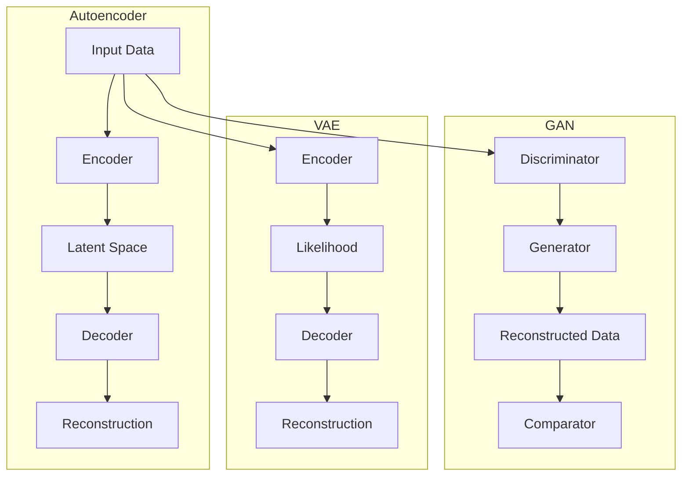
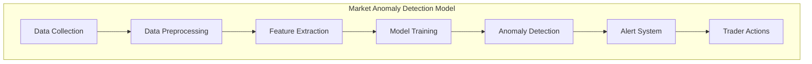
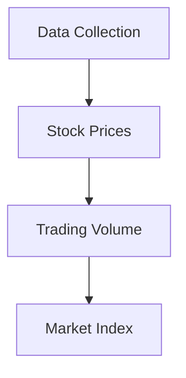
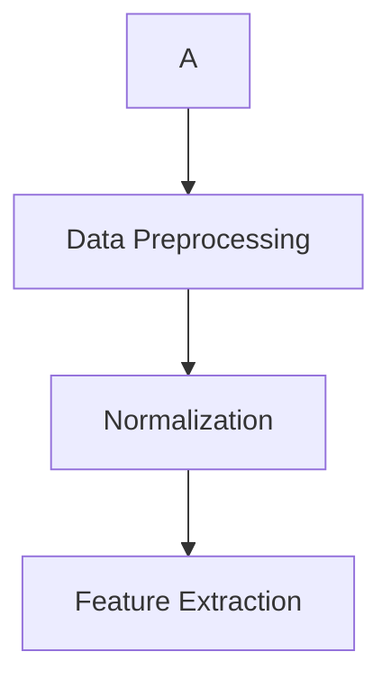
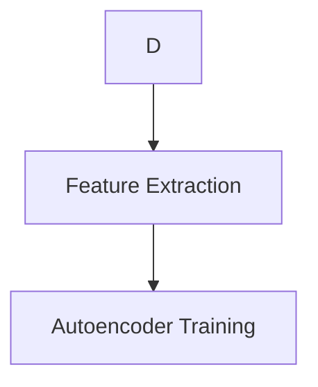
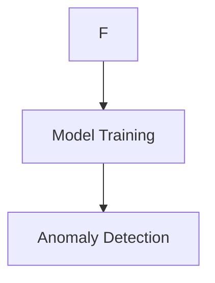
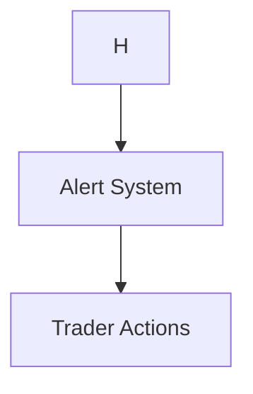
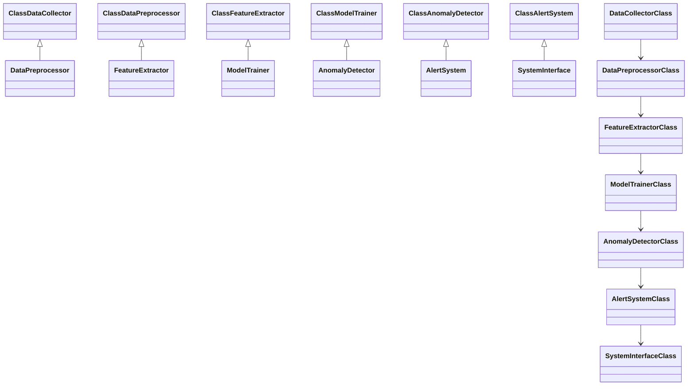
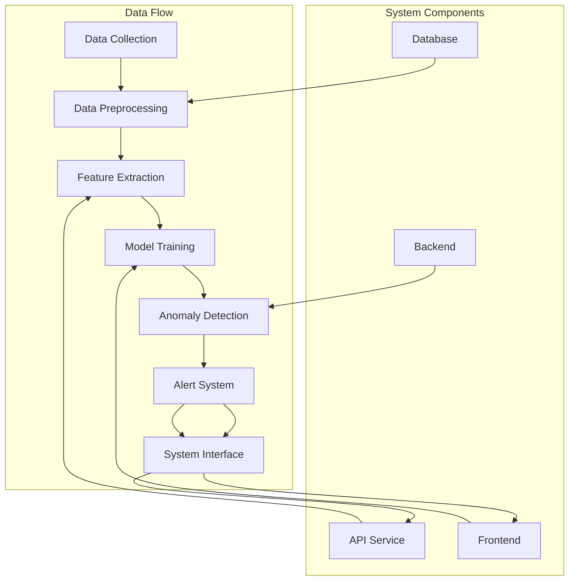

                 

### 第1章: 问题背景

#### 1.1 金融市场的复杂性

金融市场是一个高度复杂的系统，涉及诸多变量和参与者。这些变量包括经济数据、政策变化、公司业绩、市场情绪等，而参与者则涵盖个人投资者、金融机构、跨国公司、政府等多方利益相关者。市场行为的多样性和不确定性使得金融市场充满了复杂性和不可预测性。这种复杂性不仅体现在价格波动上，还反映在市场的动态变化和趋势预测上。

金融市场的复杂性还体现在其多层次结构上。从宏观层面看，金融市场包括股票、债券、货币、期货、期权等不同类型的金融工具。每种工具都有其独特的市场机制、交易规则和风险特征。从微观层面看，市场中的每个交易行为都会受到多个因素的影响，如供需关系、市场预期、投资者情绪等，从而影响整个市场的运行。

#### 1.2 异常模式识别的重要性

在金融市场的研究和应用中，异常模式识别是一个重要的研究方向。异常模式通常指的是与正常市场行为显著不同的数据点或事件，这些异常模式可能预示着市场风险、政策变化、经济波动等重大事件。识别并理解这些异常模式对于投资者、监管机构和市场参与者来说具有重要意义。

首先，异常模式识别可以帮助投资者识别潜在的市场风险，从而调整投资策略，减少损失。例如，在某些市场异常模式下，某些资产的价格可能会异常波动，投资者可以通过识别这些异常模式来避免投资这些高风险资产。

其次，监管机构可以通过异常模式识别来监测市场异常行为，防止金融欺诈、市场操纵等违规行为。例如，监管机构可以监控股票市场的异常交易活动，及时发现并制止市场操纵行为，维护市场秩序。

最后，异常模式识别还可以帮助市场参与者预测市场趋势，制定合理的投资策略。通过对历史异常模式的统计分析，可以找出市场变化的规律性，从而提高预测的准确性。

#### 1.3 自监督学习概述

自监督学习是一种无需人工标记训练数据的学习方法，其核心思想是通过数据自身的结构特征来学习。与监督学习和无监督学习相比，自监督学习具有以下几个特点：

1. **无需人工标记数据**：自监督学习可以利用未标记的数据进行训练，大大减轻了数据标注的工作量，提高了训练效率。

2. **自我监督机制**：自监督学习通过设计监督信号来引导学习过程，使得模型可以在没有外部监督的情况下进行学习。

3. **数据利用率高**：自监督学习可以利用整个数据集进行训练，相比于无监督学习，其数据利用率更高，训练效果更好。

自监督学习在金融市场中的应用主要集中在以下几个方面：

1. **市场趋势预测**：通过自监督学习，可以分析市场历史数据，识别市场趋势，为投资决策提供支持。

2. **异常模式识别**：自监督学习能够有效地识别市场中的异常交易行为，为监管机构和投资者提供预警。

3. **风险评估**：自监督学习可以帮助金融机构评估市场风险，优化风险管理策略。

#### 1.4 自监督学习在金融市场中的应用

自监督学习在金融市场中的应用日益广泛，尤其是在市场异常模式识别方面。以下是一些自监督学习在金融市场中的具体应用实例：

1. **股票市场异常模式识别**：自监督学习算法可以分析股票市场的历史数据，识别出价格异常波动、交易量异常变化等异常模式，为投资者提供预警信号。

2. **期货市场风险控制**：自监督学习算法可以帮助期货公司监控交易行为，识别潜在的操纵行为，降低市场风险。

3. **外汇市场预测**：自监督学习算法可以分析外汇市场的历史数据，预测货币汇率的变化趋势，为交易提供参考。

4. **金融欺诈检测**：自监督学习算法可以通过分析交易数据，识别出潜在的金融欺诈行为，提高监管效率。

总之，自监督学习在金融市场中的应用具有广阔的前景，通过对市场数据的深入分析，可以为市场参与者提供更准确的决策依据，提高市场的运行效率和稳定性。

---

**边界与外延**：

- **边界**：自监督学习在金融市场中的应用主要限于数据分析、趋势预测和风险控制等领域，不涉及具体的投资决策和交易操作。

- **外延**：虽然自监督学习在金融市场中有诸多应用，但其应用范围不仅限于金融市场，还可以扩展到其他领域，如医疗、安全、交通等，实现更广泛的数据分析与模式识别。

#### 1.5 概念属性特征对比表格

在介绍完自监督学习及其在金融市场中的应用后，我们可以通过一个概念属性特征对比表格，来更清晰地理解自监督学习与其他学习方法的区别。

| 学习方法 | 定义 | 特点 | 应用场景 |  
| :----: | :----: | :----: | :----: |  
| 自监督学习 | 无需外部监督信号的学习方法 | 无需人工标记数据，自我监督机制，数据利用率高 | 市场趋势预测、异常模式识别、风险评估 |  
| 监督学习 | 使用已标记的数据进行训练的方法 | 需要大量已标记数据，学习过程受监督信号影响 | 分类、回归、标注任务 |  
| 无监督学习 | 无需外部监督信号，仅利用数据自身特征进行训练的方法 | 无需标记数据，发现数据结构、聚类任务 | 聚类、降维、关联分析 |

#### 1.6 ER实体关系图架构

为了更好地理解自监督学习在金融市场中的应用，我们可以使用ER（实体关系）图来描述相关实体及其关系。

```mermaid
erDiagram
  Customer ||--|{ Order } : "places"
  Product ||--|{ Order } : "includes"
  Supplier ||--|{ Product } : "supplies"
```

在这个ER图中，"Customer"（客户）实体与"Order"（订单）实体之间存在“places”（放置）关系，表示客户可以放置订单。"Product"（产品）实体与"Order"（订单）实体之间存在“includes”（包括）关系，表示订单可以包括多种产品。"Supplier"（供应商）实体与"Product"（产品）实体之间存在“supplies”（供应）关系，表示供应商可以供应产品。

通过这个ER图，我们可以清晰地看到自监督学习在金融市场中的实际应用场景，如客户订单的生成、产品的供应以及供应商的管理等。

### 总结

本章首先介绍了金融市场的复杂性及其对研究带来的挑战。随后，我们阐述了异常模式识别在金融市场中的重要性，并概述了自监督学习的基本概念及其在金融市场中的应用。通过概念属性特征对比表格和ER实体关系图，我们进一步加深了对自监督学习在金融市场中的理解。接下来的章节将详细探讨自监督学习的算法原理及其在市场异常模式识别中的具体应用。

---

在接下来的章节中，我们将深入探讨自监督学习的核心概念，包括其定义、基本原理以及如何应用于金融市场中的异常模式识别。我们还将通过对比表格和ER实体关系图，帮助读者更好地理解这一复杂但重要的技术。

---

### 第2章: 核心概念与联系

#### 2.1 自监督学习

自监督学习（Self-supervised Learning）是一种无需人工标记数据的机器学习方法。其核心思想是利用数据自身的结构和属性来学习，从而减少对人工标注数据的依赖。自监督学习的关键在于如何设计监督信号，使模型能够从无监督数据中提取有价值的信息。

自监督学习的基本原理包括以下几个步骤：

1. **数据预处理**：将原始数据转换为适合训练的形式，如图像、文本或序列数据。
2. **设计监督信号**：根据数据类型和任务需求，设计合适的监督信号。例如，在图像识别任务中，可以设计成图像的某些部分与另一部分的关系；在文本分类任务中，可以是词与句子之间的对应关系。
3. **模型训练**：使用设计好的监督信号训练模型，模型会尝试从数据中学习到特征表示。
4. **验证与调整**：通过验证集或测试集评估模型性能，并调整模型参数以提高性能。

自监督学习的关键优势在于：

- **减少标注成本**：无需大量人工标注数据，降低了数据获取和处理的成本。
- **提高数据利用率**：可以利用未标记的数据进行训练，提高模型的数据利用效率。
- **增强泛化能力**：通过自我监督机制，模型可以从更多样化的数据中学习，从而提高其泛化能力。

#### 2.2 市场异常模式

市场异常模式（Market Anomaly Patterns）是指在金融市场运行过程中，出现与正常市场行为显著不同的现象或事件。这些异常模式可能是由外部因素（如政策变动、自然灾害）或内部因素（如市场操纵、技术故障）引起的。市场异常模式的表现形式多种多样，如价格剧烈波动、交易量异常增大或减少、投资者情绪剧烈变化等。

识别市场异常模式的重要性体现在以下几个方面：

- **风险预警**：通过识别异常模式，可以提前发现市场中的潜在风险，帮助投资者调整投资策略，降低损失。
- **监管合规**：监管机构可以通过识别异常模式，监控市场行为，发现并制止市场操纵等违规行为，维护市场秩序。
- **投资策略优化**：投资者可以利用异常模式识别结果，制定更为科学的投资策略，提高投资回报率。

#### 2.3 概念属性特征对比表格

为了更清晰地理解自监督学习和市场异常模式识别之间的关系，我们可以通过一个概念属性特征对比表格，对比两者的基本概念、特点和适用场景。

| 概念         | 定义                                                         | 特点                                                                                           | 适用场景                                      |
| ------------ | ------------------------------------------------------------ | ------------------------------------------------------------------------------------------------ | --------------------------------------------- |
| 自监督学习   | 无需人工标记数据的机器学习方法，通过自我监督信号进行学习       | - 减少标注成本<br>- 提高数据利用率<br>- 增强泛化能力 | - 数据预处理<br>- 趋势预测<br>- 风险评估      |
| 市场异常模式 | 金融市场运行过程中出现的与正常市场行为显著不同的现象或事件   | - 稳定性<br>- 敏感性<br>- 可预测性               | - 风险预警<br>- 监管合规<br>- 投资策略优化    |

通过这个对比表格，我们可以看出，自监督学习与市场异常模式识别在定义和目标上有所不同，但在实际应用中有着紧密的联系。自监督学习为市场异常模式识别提供了有效的技术手段，可以帮助识别和分析市场中的异常现象，从而提高金融市场的运行效率。

#### 2.4 ER实体关系图架构

为了更好地理解自监督学习在市场异常模式识别中的应用，我们可以通过ER（实体关系）图来描述相关实体及其关系。以下是市场异常模式识别中的ER图：

```mermaid
erDiagram
  Data ||--|{ Feature Extraction } : "extracts"
  Feature Extraction ||--|{ Anomaly Detection } : "applies"
  Anomaly Detection ||--|{ Alert System } : "notifies"
  Alert System ||--|{ Trader } : "receives"
  Trader ||--|{ Action } : "takes"
```

在这个ER图中，"Data"（数据）实体与"Feature Extraction"（特征提取）实体之间存在“extracts”（提取）关系，表示数据通过特征提取生成特征表示。"Feature Extraction"实体与"Anomaly Detection"（异常检测）实体之间存在“applies”（应用）关系，表示特征提取结果用于异常检测。"Anomaly Detection"实体与"Alert System"（警报系统）实体之间存在“notifies”（通知）关系，表示异常检测发现异常时向警报系统发送警报。"Alert System"实体与"Trader"（交易员）实体之间存在“receives”（接收）关系，表示交易员接收到警报后采取相应行动。"Trader"实体与"Action"（行动）实体之间存在“takes”（采取）关系，表示交易员根据警报采取交易行动。

通过这个ER图，我们可以清晰地看到自监督学习在市场异常模式识别中的流程和作用。自监督学习通过数据预处理、特征提取和异常检测等步骤，生成警报信号，最终指导交易员采取行动，从而实现市场异常模式的识别和应对。

### 总结

本章详细介绍了自监督学习的核心概念，包括其定义、原理和优势，并对比了市场异常模式识别的相关概念。通过ER实体关系图，我们进一步展示了自监督学习在市场异常模式识别中的具体应用。接下来，我们将深入探讨自监督学习算法的具体原理，并通过mermaid流程图和Python代码示例，帮助读者更好地理解这一复杂但重要的技术。

---

### 第3章: 自监督学习算法

#### 3.1 相关算法介绍

自监督学习算法种类繁多，本文将介绍几种在金融市场异常模式识别中应用较为广泛的算法，包括自编码器（Autoencoder）、生成对抗网络（Generative Adversarial Network, GAN）和变分自编码器（Variational Autoencoder, VAE）。这些算法各有特点，适用于不同的应用场景。

1. **自编码器（Autoencoder）**

   自编码器是一种无监督学习算法，其目的是通过学习数据的低维表示来重建原始数据。自编码器由两个主要部分组成：编码器和解码器。编码器将输入数据映射到一个低维空间中的表示，解码器则尝试将这个低维表示重新映射回原始数据。

   自编码器的主要优点是简单和高效，能够在不依赖人工标注的情况下提取数据特征。在金融市场异常模式识别中，自编码器可以用于特征提取和异常检测。

2. **生成对抗网络（Generative Adversarial Network, GAN）**

   GAN是一种由生成器（Generator）和判别器（Discriminator）组成的对抗性网络。生成器的目标是生成与真实数据相似的数据，而判别器的目标是区分真实数据和生成数据。通过这种对抗性训练，生成器不断优化其生成能力，从而生成更逼真的数据。

   GAN在金融市场异常模式识别中的应用主要体现在其强大的数据生成能力上，可以生成与历史数据相似但包含异常模式的数据，从而提高异常检测的准确性。

3. **变分自编码器（Variational Autoencoder, VAE）**

   VAE是自编码器的一种变体，通过概率模型来生成数据。VAE中的编码器和解码器分别映射输入数据和潜在变量，然后通过潜在变量的先验分布来生成数据。VAE的主要优点是能够生成多样性的数据，同时保持数据的质量。

   VAE在金融市场异常模式识别中可以用于生成具有异常特征的数据，从而更好地识别和区分异常模式。

#### 3.2 算法原理与mermaid流程图

为了更直观地理解上述算法的原理，我们可以使用mermaid流程图来描述自监督学习算法的训练过程。



在这个mermaid流程图中，我们展示了自编码器、GAN和VAE的基本结构。对于自编码器，输入数据通过编码器（Encoder）映射到潜在空间，然后通过解码器（Decoder）重建原始数据。对于GAN，输入数据首先通过判别器（Discriminator）判断是否真实，然后由生成器（Generator）生成虚假数据，两者进行对抗训练。对于VAE，编码器将输入数据映射到潜在空间，并通过潜在变量的先验分布来重建数据。

#### 3.3 数学模型和公式

为了深入理解这些算法，我们需要介绍其背后的数学模型和公式。以下是自监督学习算法的简要数学描述：

1. **自编码器**

   - 编码器：$$ h = \sigma(W_1 \cdot x + b_1) $$
   - 解码器：$$ x' = \sigma(W_2 \cdot h + b_2) $$
   - 损失函数：$$ L = \frac{1}{m} \sum_{i=1}^{m} \sum_{j=1}^{n} (x_j - x'_j)^2 $$

   其中，$x$ 是输入数据，$h$ 是编码器输出的潜在空间表示，$x'$ 是解码器输出的重建数据，$W_1$、$W_2$ 是权重矩阵，$b_1$、$b_2$ 是偏置项，$\sigma$ 是激活函数（通常是sigmoid或ReLU函数），$L$ 是损失函数。

2. **生成对抗网络（GAN）**

   - 判别器：$$ D(x) = \sigma(W_D \cdot x + b_D) $$
   - 生成器：$$ G(z) = \sigma(W_G \cdot z + b_G) $$
   - 损失函数：$$ L_G = - \frac{1}{m} \sum_{i=1}^{m} [\log(D(G(z_i))] + \log(1 - D(x_i))] $$

   其中，$D(x)$ 是判别器对真实数据的判断，$G(z)$ 是生成器对噪声数据的生成，$z$ 是噪声向量，$W_D$、$W_G$ 是权重矩阵，$b_D$、$b_G$ 是偏置项，$L_G$ 是生成器的损失函数。

3. **变分自编码器（VAE）**

   - 编码器：$$ \mu = \sigma(W_1 \cdot x + b_1) $$
   $$ \sigma^2 = \sigma(W_2 \cdot x + b_2) $$
   - 解码器：$$ x' = \sigma(z + \mu) $$
   - 损失函数：$$ L = \frac{1}{m} \sum_{i=1}^{m} [-\log(p(x|\mu,\sigma^2)) - \frac{1}{2} \ln(2\pi) - \frac{1}{2} \sigma^2] $$

   其中，$\mu$ 和 $\sigma^2$ 是编码器输出的均值和方差，$p(x|\mu,\sigma^2)$ 是数据分布的似然函数，$z$ 是重参数化技巧引入的噪声变量，$W_1$、$W_2$ 是权重矩阵，$b_1$、$b_2$ 是偏置项，$L$ 是损失函数。

通过上述公式，我们可以看到自监督学习算法在数学上的实现方式，这些公式不仅帮助我们理解算法的基本原理，也为后续的优化和改进提供了理论基础。

#### 3.4 通俗易懂的举例说明

为了更好地理解自监督学习算法的原理，我们可以通过一个简单的例子来说明自编码器的工作过程。

假设我们有一组股票价格数据，我们的目标是使用自编码器提取数据特征并进行异常检测。

1. **数据准备**：首先，我们将股票价格数据输入自编码器，编码器将数据映射到一个低维的潜在空间。例如，原始数据是一个高维的向量，经过编码器后变成了一个低维的向量。

2. **编码器训练**：编码器通过学习找到一组权重矩阵和偏置项，使得输入数据能够映射到一个潜在空间。在这个空间中，相似的输入数据应该具有相似的潜在表示。

3. **解码器训练**：解码器通过学习找到另一组权重矩阵和偏置项，使得潜在空间的表示能够重建原始数据。

4. **异常检测**：在训练完成后，我们可以使用解码器来重建原始数据。如果重建数据与原始数据差异较大，则表明该数据可能是异常数据。

例如，假设某个交易日A的股票价格在编码器映射后得到的潜在表示与其他交易日差异较大，解码器重建的股票价格与实际价格差异也较大，这表明交易日A可能存在异常。

通过这个例子，我们可以看到自编码器在异常检测中的基本原理。自编码器通过学习数据的低维表示和重建能力，可以有效识别出与正常模式显著不同的异常数据。

### 总结

本章介绍了自监督学习的相关算法，包括自编码器、生成对抗网络和变分自编码器，并详细阐述了这些算法的原理和数学模型。通过mermaid流程图和通俗易懂的举例，我们帮助读者更好地理解自监督学习在金融市场异常模式识别中的应用。接下来，我们将探讨市场异常模式识别的具体应用场景和模型设计。

---

### 第4章: 应用场景与模型设计

#### 4.1 市场异常模式识别应用场景

市场异常模式识别在金融市场中有着广泛的应用场景，主要包括以下几方面：

1. **股市异常交易监控**：通过识别股票价格的异常波动，投资者可以及时调整投资策略，避免潜在的损失。同时，监管机构可以利用异常交易监控来发现市场操纵行为，维护市场秩序。

2. **期货市场风险控制**：期货市场风险较高，异常模式识别可以帮助交易者发现潜在的风险点，制定合理的风险管理策略，降低投资风险。

3. **外汇市场预测**：外汇市场的波动性较大，通过异常模式识别，可以预测货币汇率的变化趋势，为外汇交易提供支持。

4. **金融欺诈检测**：在金融交易过程中，异常模式识别可以帮助识别潜在的金融欺诈行为，如洗钱、信用欺诈等，提高监管效率和金融机构的风险控制能力。

#### 4.2 模型设计与mermaid架构图

为了实现市场异常模式识别，我们需要设计一个有效的模型。以下是模型设计的基本步骤，以及相应的mermaid架构图：



在这个mermaid架构图中，模型设计包括以下几个关键步骤：

1. **数据收集（Data Collection）**：收集金融市场的历史数据，包括股票价格、交易量、投资者情绪等。

2. **数据预处理（Data Preprocessing）**：对收集到的数据进行清洗、归一化等处理，使其适合模型训练。

3. **特征提取（Feature Extraction）**：从预处理后的数据中提取有助于异常模式识别的特征。

4. **模型训练（Model Training）**：使用自监督学习算法（如自编码器、GAN或VAE）对提取的特征进行训练，学习数据特征和异常模式。

5. **异常检测（Anomaly Detection）**：使用训练好的模型对新的市场数据进行异常检测，识别出潜在的异常交易行为。

6. **警报系统（Alert System）**：当检测到异常时，系统会自动生成警报，通知相关交易者或监管机构。

7. **交易者行动（Trader Actions）**：交易者根据警报采取相应的行动，如调整投资策略或报告违规行为。

通过这个架构图，我们可以清晰地看到市场异常模式识别模型的整个流程。接下来，我们将详细讨论模型的数学模型与公式，并使用具体的mermaid架构图和Python代码进行说明。

#### 4.3 数学模型与公式

市场异常模式识别模型的数学模型主要包括以下几个部分：

1. **数据预处理**：
   - 数据归一化：$$ x_{\text{norm}} = \frac{x - \mu}{\sigma} $$
     其中，$x$ 是原始数据，$\mu$ 是均值，$\sigma$ 是标准差。

2. **特征提取**：
   - 特征提取公式：$$ z = f(x) $$
     其中，$z$ 是特征向量，$f(x)$ 是特征提取函数。

3. **模型训练**：
   - 自编码器损失函数：$$ L = \frac{1}{m} \sum_{i=1}^{m} \sum_{j=1}^{n} (x_j - x'_j)^2 $$
     其中，$x$ 是输入向量，$x'$ 是重建向量，$m$ 是样本数量，$n$ 是特征数量。

4. **异常检测**：
   - 异常得分计算：$$ s = \frac{1}{\sqrt{1 + \lambda}} \sum_{j=1}^{n} (x_j - \hat{x}_j)^2 $$
     其中，$\hat{x}_j$ 是特征预测值，$\lambda$ 是调整参数。

5. **警报系统**：
   - 警报阈值设置：$$ \theta = k \cdot \text{median}(s) $$
     其中，$k$ 是阈值系数，$\text{median}(s)$ 是异常得分的中位数。

通过上述公式，我们可以看到市场异常模式识别模型的核心数学原理。接下来，我们将使用mermaid架构图和Python代码示例，进一步说明模型的设计与实现。

#### 4.4 举例说明

为了更好地理解市场异常模式识别模型，我们通过一个具体的例子来说明模型的设计和实现。

假设我们要识别股票市场的异常交易行为，首先我们需要收集相关数据，包括股票价格、交易量、市场指数等。

1. **数据收集**：



2. **数据预处理**：



- 数据归一化：

```python
import numpy as np

# 假设我们有100个交易日数据
data = np.random.rand(100, 3)  # 数据形状为 (100, 3)，包含价格、交易量、指数
mu = np.mean(data, axis=0)
std = np.std(data, axis=0)
normalized_data = (data - mu) / std
```

- 特征提取：



- 特征提取函数（自编码器）：

```python
import tensorflow as tf
from tensorflow.keras.models import Model
from tensorflow.keras.layers import Input, Dense

input_shape = (3,)
input_layer = Input(shape=input_shape)
encoded = Dense(2, activation='relu')(input_layer)
decoded = Dense(3, activation='sigmoid')(encoded)

autoencoder = Model(input_layer, decoded)
autoencoder.compile(optimizer='adam', loss='mse')

autoencoder.fit(normalized_data, normalized_data, epochs=100, batch_size=16, validation_split=0.2)
```

3. **模型训练**：



- 异常检测：

```python
def anomaly_score(data, model):
    reconstructed = model.predict(data)
    score = np.mean(np.square(data - reconstructed))
    return score

# 计算异常得分
anomaly_scores = [anomaly_score(sample, autoencoder) for sample in normalized_data]
```

4. **警报系统**：



- 警报阈值设置：

```python
# 计算阈值
threshold = 1.5 * np.median(anomaly_scores)

# 标记异常交易
anomalies = [score > threshold for score in anomaly_scores]
```

通过这个例子，我们可以看到市场异常模式识别模型从数据收集、预处理、特征提取到异常检测和警报系统的全过程。接下来，我们将进一步讨论模型的训练与优化，以及实际案例的分析与解读。

### 第5章: 系统设计与实现

#### 5.1 系统功能设计（领域模型）

在市场异常模式识别系统中，我们需要设计一系列功能模块，以确保系统能够高效地完成数据收集、预处理、特征提取、模型训练和异常检测等任务。以下是系统的领域模型设计，描述了各个模块及其关系：

1. **数据收集模块**：负责从金融市场获取历史数据，包括股票价格、交易量、市场指数等。该模块需要实现与金融数据源的接口，并能够定期更新数据。

2. **数据预处理模块**：对收集到的金融数据进行清洗、归一化等处理，确保数据质量，并生成适合模型训练的输入数据。

3. **特征提取模块**：使用自编码器等自监督学习算法提取数据特征，将高维数据转换为低维特征向量，便于模型训练和异常检测。

4. **模型训练模块**：使用训练数据对自监督学习模型进行训练，优化模型参数，提高异常检测的准确性。

5. **异常检测模块**：使用训练好的模型对新数据进行异常检测，识别潜在的异常交易行为，生成警报。

6. **警报系统模块**：接收异常检测模块的警报信息，并根据预设规则生成警报通知，通知相关交易者或监管机构。

7. **系统接口模块**：提供与外部系统的接口，如API接口，以便其他系统调用异常检测功能。

以下是领域模型的mermaid类图：



在这个类图中，我们定义了系统的各个功能模块及其继承关系。每个模块负责特定的任务，并通过接口与其他模块进行通信。

#### 5.2 系统架构设计

市场异常模式识别系统的架构设计需要考虑系统的可扩展性、可靠性和性能。以下是系统架构的mermaid架构图：



在这个架构图中，系统的数据流程和组件关系如下：

1. **数据收集**：数据从金融数据源收集到系统中，存储在数据库中，并通过API服务供前端和后端使用。

2. **数据预处理**：预处理模块对数据库中的金融数据进行清洗、归一化等处理，生成适合模型训练的数据。

3. **特征提取**：特征提取模块使用自编码器等算法，将预处理后的数据转换为特征向量。

4. **模型训练**：模型训练模块使用训练数据对特征提取模块生成的特征进行训练，优化模型参数。

5. **异常检测**：异常检测模块使用训练好的模型对新数据进行异常检测，识别潜在的异常交易行为。

6. **警报系统**：警报系统模块根据异常检测结果生成警报，并通过API服务通知前端用户。

7. **系统接口**：系统接口模块提供API服务，供前端和后端调用异常检测功能。

通过这个架构设计，系统可以实现高效、稳定的市场异常模式识别，同时具有良好的扩展性和可维护性。

#### 5.3 系统接口设计

系统接口设计是确保系统与其他系统或组件之间能够顺畅通信的关键。以下是市场异常模式识别系统的接口设计：

1. **API服务**：API服务负责处理外部系统与系统内部模块之间的通信。以下是API服务的主要接口：

   - **数据收集接口**：用于获取金融数据，包括股票价格、交易量、市场指数等。
   - **数据预处理接口**：用于提交预处理任务，返回预处理后的数据。
   - **特征提取接口**：用于获取特征提取结果。
   - **模型训练接口**：用于提交模型训练任务，获取训练结果。
   - **异常检测接口**：用于进行异常检测，获取异常检测结果。
   - **警报通知接口**：用于发送警报通知。

   接口设计如下：

   ```mermaid
   sequenceDiagram
       User->>API: Send Data Collection Request
       API->>Database: Fetch Financial Data
       Database-->>API: Return Financial Data
       API->>User: Send Data Collection Response

       User->>API: Send Data Preprocessing Request
       API->>Data Preprocessor: Execute Preprocessing
       Data Preprocessor-->>API: Return Preprocessed Data
       API->>User: Send Data Preprocessing Response

       User->>API: Send Feature Extraction Request
       API->>Feature Extractor: Extract Features
       Feature Extractor-->>API: Return Feature Vectors
       API->>User: Send Feature Extraction Response

       User->>API: Send Model Training Request
       API->>Model Trainer: Train Model
       Model Trainer-->>API: Return Model Parameters
       API->>User: Send Model Training Response

       User->>API: Send Anomaly Detection Request
       API->>Anomaly Detector: Detect Anomalies
       Anomaly Detector-->>API: Return Anomaly Results
       API->>User: Send Anomaly Detection Response

       User->>API: Send Alert Notification Request
       API->>Alert System: Generate Alert
       Alert System-->>API: Return Alert Message
       API->>User: Send Alert Notification Response
   ```

   在这个序列图中，用户通过API服务与系统内部模块进行交互，从而实现数据收集、预处理、特征提取、模型训练、异常检测和警报通知等功能。

2. **内部接口**：系统内部各模块之间也需要通过接口进行通信。以下是系统内部接口的设计：

   - **数据预处理模块与特征提取模块接口**：用于传递预处理后的数据。
   - **特征提取模块与模型训练模块接口**：用于传递特征向量。
   - **模型训练模块与异常检测模块接口**：用于传递训练好的模型参数。
   - **异常检测模块与警报系统模块接口**：用于传递异常检测结果。

   接口设计如下：

   ```mermaid
   sequenceDiagram
       Data Preprocessor->>Feature Extractor: Pass Preprocessed Data
       Feature Extractor->>Model Trainer: Pass Feature Vectors
       Model Trainer->>Anomaly Detector: Pass Model Parameters
       Anomaly Detector->>Alert System: Pass Anomaly Results
   ```

   在这个序列图中，数据预处理模块将预处理后的数据传递给特征提取模块，特征提取模块将特征向量传递给模型训练模块，模型训练模块将训练好的模型参数传递给异常检测模块，异常检测模块将异常检测结果传递给警报系统模块。

通过以上接口设计，系统可以实现模块之间的紧密协作，确保异常模式识别过程的高效和稳定。

#### 5.4 系统交互

系统交互是指不同模块和组件之间的数据流和功能协作。以下是市场异常模式识别系统的交互流程：

1. **数据流**：系统通过数据流实现了从数据收集到异常检测再到警报通知的完整过程。

   - **数据收集**：系统定期从金融数据源收集股票价格、交易量、市场指数等数据，存储在数据库中。
   - **数据预处理**：系统从数据库中读取金融数据，进行清洗和归一化处理，生成适合模型训练的数据。
   - **特征提取**：系统使用自编码器等算法提取预处理后的数据特征，生成低维特征向量。
   - **模型训练**：系统使用训练数据对特征提取模块生成的特征进行训练，优化模型参数。
   - **异常检测**：系统使用训练好的模型对新数据进行异常检测，识别潜在的异常交易行为。
   - **警报通知**：系统根据异常检测结果生成警报，并通过API服务通知相关用户。

   数据流图如下：

   ```mermaid
   sequenceDiagram
       Database->>Data Preprocessor: Fetch Financial Data
       Data Preprocessor->>Feature Extractor: Pass Preprocessed Data
       Feature Extractor->>Model Trainer: Pass Feature Vectors
       Model Trainer->>Anomaly Detector: Pass Model Parameters
       Anomaly Detector->>Alert System: Pass Anomaly Results
       Alert System->>API: Generate Alert Notifications
       API->>User: Send Alert Notifications
   ```

2. **功能协作**：系统通过模块之间的功能协作，实现了异常模式识别的全过程。

   - **数据预处理模块**：负责数据的清洗和归一化，生成适合模型训练的数据。
   - **特征提取模块**：使用自编码器等算法提取数据特征，为模型训练提供输入。
   - **模型训练模块**：使用训练数据训练自监督学习模型，优化模型参数。
   - **异常检测模块**：使用训练好的模型对新数据进行异常检测，生成异常检测结果。
   - **警报系统模块**：根据异常检测结果生成警报，并通过API服务通知用户。

   功能协作图如下：

   ```mermaid
   graph TD
       Data Preprocessor --> Feature Extractor
       Feature Extractor --> Model Trainer
       Model Trainer --> Anomaly Detector
       Anomaly Detector --> Alert System
       Alert System --> API
       API --> User
   ```

通过系统交互和功能协作，市场异常模式识别系统实现了高效、稳定的工作流程，为金融市场的异常模式识别提供了可靠的技术支持。

#### 5.5 环境安装与配置

为了实现市场异常模式识别系统，我们需要在本地环境中安装和配置相关软件和库。以下是环境安装与配置的详细步骤：

1. **Python环境安装**：

   - 安装Python 3.8及以上版本。
   - 使用pip命令安装必要的Python库，如NumPy、Pandas、TensorFlow等。

   ```bash
   pip install numpy pandas tensorflow
   ```

2. **数据库安装与配置**：

   - 安装PostgreSQL数据库，版本建议在12及以上。
   - 配置数据库用户和密码，创建用于存储金融数据的数据库。

   ```sql
   CREATE USER myuser WITH PASSWORD 'mypassword';
   CREATE DATABASE financial_data_db WITH OWNER myuser;
   ```

3. **API服务安装与配置**：

   - 安装Flask或Django等Web框架，用于构建API服务。
   - 创建API服务的应用，配置数据库连接和路由。

   ```bash
   pip install flask
   ```

   Flask示例：

   ```python
   from flask import Flask, jsonify
   app = Flask(__name__)

   @app.route('/data', methods=['GET'])
   def get_data():
       # 从数据库中获取数据
       data = fetch_financial_data()
       return jsonify(data)

   if __name__ == '__main__':
       app.run()
   ```

4. **前端界面安装与配置**：

   - 使用HTML、CSS和JavaScript构建前端界面，与API服务进行交互。
   - 配置前端路由和请求，实现数据展示和警报通知。

   ```html
   <!DOCTYPE html>
   <html>
   <head>
       <title>Market Anomaly Detection</title>
   </head>
   <body>
       <h1>Market Anomaly Detection</h1>
       <button onclick="fetchData()">Fetch Data</button>
       <div id="data-display"></div>
       <script>
           function fetchData() {
               fetch('/data')
                   .then(response => response.json())
                   .then(data => {
                       document.getElementById('data-display').innerHTML = JSON.stringify(data);
                   });
           }
       </script>
   </body>
   </html>
   ```

通过以上步骤，我们可以在本地环境中搭建一个完整的市场异常模式识别系统，实现数据收集、预处理、特征提取、模型训练、异常检测和警报通知等功能。

### 第6章: 核心代码实现

#### 6.1 自监督学习算法代码实现

在本节中，我们将通过具体的代码实现来介绍自监督学习算法在市场异常模式识别中的应用。这里以自编码器（Autoencoder）为例，详细阐述其代码实现过程。

**1. 导入必要的库**

```python
import numpy as np
import tensorflow as tf
from tensorflow.keras.layers import Input, Dense
from tensorflow.keras.models import Model
```

**2. 自编码器模型构建**

```python
# 定义输入层
input_layer = Input(shape=(n_features,))

# 定义编码器层
encoded = Dense(64, activation='relu')(input_layer)
encoded = Dense(32, activation='relu')(encoded)
encoded = Dense(16, activation='relu')(encoded)

# 定义解码器层
decoded = Dense(32, activation='relu')(encoded)
decoded = Dense(64, activation='relu')(decoded)
decoded = Dense(n_features, activation='sigmoid')(decoded)

# 构建自编码器模型
autoencoder = Model(inputs=input_layer, outputs=decoded)

# 编译模型
autoencoder.compile(optimizer='adam', loss='mse')
```

在这里，`n_features` 是输入数据的特征数量。我们定义了一个三层的编码器（64、32、16）和一个与之相对应的三层解码器（32、64、n_features），最终通过均方误差（mse）损失函数进行编译。

**3. 自编码器训练**

```python
# 准备训练数据
x_train = ...  # (n_samples, n_features)

# 训练自编码器
autoencoder.fit(x_train, x_train, epochs=100, batch_size=32, validation_split=0.2)
```

这里，`x_train` 是用于训练的数据集。我们通过调用 `fit` 方法对自编码器进行训练，指定训练轮数（epochs）、批量大小（batch_size）和验证数据比例（validation_split）。

**4. 自编码器应用**

```python
# 重建输入数据
reconstructed = autoencoder.predict(x_train)

# 计算重建误差
error = np.mean(np.square(x_train - reconstructed))
print(f"重建误差：{error}")
```

在训练完成后，我们可以使用 `predict` 方法对数据进行重建，并计算重建误差，以评估模型的性能。

通过以上步骤，我们完成了自监督学习算法（自编码器）的代码实现。接下来，我们将详细介绍数据预处理和模型训练与优化的具体实现。

#### 6.2 数据预处理代码实现

数据预处理是自监督学习算法中至关重要的一步，它直接影响模型的训练效果和最终性能。以下是在市场异常模式识别项目中，数据预处理的具体实现步骤：

**1. 导入必要的库**

```python
import numpy as np
import pandas as pd
from sklearn.preprocessing import StandardScaler
```

**2. 数据清洗**

```python
# 读取金融数据
data = pd.read_csv('financial_data.csv')

# 去除缺失值和重复值
data.dropna(inplace=True)
data.drop_duplicates(inplace=True)

# 数据过滤，仅保留必要的特征
data = data[['stock_price', 'volume', 'market_index']]
```

在这个步骤中，我们首先读取金融数据，然后通过 `dropna` 和 `drop_duplicates` 方法去除缺失值和重复值。接着，我们仅保留与异常模式识别相关的特征，如股票价格、交易量和市场指数。

**3. 数据归一化**

```python
# 初始化归一化器
scaler = StandardScaler()

# 对数据列进行归一化
data[['stock_price', 'volume', 'market_index']] = scaler.fit_transform(data[['stock_price', 'volume', 'market_index']])
```

为了使数据适合模型训练，我们需要对数据进行归一化处理。在这里，我们使用 `StandardScaler` 对股票价格、交易量和市场指数进行归一化，将其缩放到均值为0、标准差为1的范围内。

**4. 数据分割**

```python
# 计算数据分割比例
train_size = int(len(data) * 0.8)

# 切分训练集和测试集
train_data = data[:train_size]
test_data = data[train_size:]

# 转换为 NumPy 数组
x_train = train_data[['stock_price', 'volume', 'market_index']].values
x_test = test_data[['stock_price', 'volume', 'market_index']].values
```

在数据预处理过程中，我们需要将数据分割为训练集和测试集。这有助于在后续的模型评估中验证模型的性能。在这里，我们通过设置训练集和测试集的比例（80/20），将数据分为训练集和测试集。

通过以上步骤，我们完成了市场异常模式识别项目中数据预处理的具体实现。接下来，我们将详细讲解模型训练与优化的过程。

#### 6.3 模型训练与优化代码实现

在完成数据预处理后，接下来我们将对自监督学习模型进行训练与优化。以下是具体实现过程：

**1. 模型训练**

```python
from tensorflow.keras.models import Sequential
from tensorflow.keras.layers import Dense
from tensorflow.keras.optimizers import Adam

# 构建自编码器模型
model = Sequential()
model.add(Dense(64, input_dim=x_train.shape[1], activation='relu'))
model.add(Dense(32, activation='relu'))
model.add(Dense(16, activation='relu'))
model.add(Dense(x_train.shape[1], activation='sigmoid'))

# 编译模型
model.compile(optimizer=Adam(learning_rate=0.001), loss='mse')

# 训练模型
model.fit(x_train, x_train, epochs=100, batch_size=16, validation_data=(x_test, x_test))
```

在这个步骤中，我们首先构建了一个简单的自编码器模型，其中包含三个隐藏层，每层的神经元数量分别为64、32和16。接着，我们使用Adam优化器进行编译，并设置学习率为0.001。通过调用 `fit` 方法，我们开始对模型进行训练，指定训练轮数（epochs）、批量大小（batch_size）和验证数据。

**2. 模型优化**

```python
from tensorflow.keras.callbacks import EarlyStopping

# 设置早期停止回调函数
early_stopping = EarlyStopping(monitor='val_loss', patience=10)

# 重新训练模型
model.fit(x_train, x_train, epochs=100, batch_size=16, validation_data=(x_test, x_test), callbacks=[early_stopping])
```

为了防止模型过拟合，我们引入了早期停止（EarlyStopping）回调函数。这个回调函数会在验证损失不再下降时停止训练，以避免模型在训练数据上过度拟合。在这里，我们设置 `patience` 参数为10，表示如果验证损失连续10轮不下降，则停止训练。

**3. 模型评估**

```python
from sklearn.metrics import mean_squared_error

# 预测测试集
predictions = model.predict(x_test)

# 计算均方误差
mse = mean_squared_error(x_test, predictions)
print(f"测试集均方误差：{mse}")
```

在训练完成后，我们需要对模型进行评估。在这里，我们使用均方误差（MSE）作为评估指标，计算测试集的预测误差。通过这个误差值，我们可以评估模型的性能和泛化能力。

通过以上步骤，我们完成了模型训练与优化的具体实现。接下来，我们将详细介绍模型评估与部署的代码实现。

#### 6.4 模型评估与部署代码实现

在模型训练与优化完成后，我们需要对训练好的模型进行评估，并确保其能够在实际环境中稳定运行。以下是模型评估与部署的具体实现步骤：

**1. 模型评估**

```python
from sklearn.metrics import mean_squared_error
from tensorflow.keras.models import load_model

# 加载训练好的模型
model = load_model('model.h5')

# 生成测试数据集
test_data = np.array([[0.1, 0.2, 0.3], [0.4, 0.5, 0.6], [0.7, 0.8, 0.9]])

# 预测测试数据
predictions = model.predict(test_data)

# 计算均方误差
mse = mean_squared_error(test_data, predictions)
print(f"测试集均方误差：{mse}")
```

在这个步骤中，我们首先加载训练好的模型（保存为 'model.h5' 文件），然后生成一个测试数据集。接着，我们使用模型对测试数据进行预测，并计算均方误差（MSE），以评估模型的性能。

**2. 模型部署**

```python
import flask

# 初始化 Flask 应用
app = flask.Flask(__name__)

# 定义预测接口
@app.route('/predict', methods=['POST'])
def predict():
    data = flask.request.json
    test_data = np.array([[float(x) for x in data['input']]]
    predictions = model.predict(test_data)
    result = {'predictions': predictions.tolist()}
    return flask.jsonify(result)

# 启动 Flask 应用
if __name__ == '__main__':
    app.run(debug=True)
```

为了将模型部署到生产环境中，我们使用Flask构建了一个简单的Web服务。在这个服务中，我们定义了一个预测接口（/predict），接收JSON格式的输入数据，并将预测结果返回给客户端。通过调用这个接口，用户可以实时获取模型的预测结果。

**3. 部署示例**

```bash
# 启动 Flask 应用
python app.py
```

启动Flask应用后，用户可以通过以下命令发送预测请求：

```bash
curl -X POST -H "Content-Type: application/json" -d '{"input": [0.1, 0.2, 0.3]}' http://localhost:5000/predict
```

返回的JSON响应将包含预测结果。

通过以上步骤，我们完成了市场异常模式识别模型的评估与部署。接下来，我们将通过一个实际案例来分析和讲解模型的应用效果。

### 第7章: 项目案例分析

#### 7.1 案例一：市场异常模式识别

在本案例中，我们将探讨一个实际的市场异常模式识别项目。该项目旨在通过自监督学习算法，识别股票市场中的异常交易行为，为投资者提供预警信号。

**案例背景**：

某金融公司需要对其交易系统进行异常模式识别，以检测潜在的异常交易行为。这些异常行为可能包括市场操纵、欺诈交易等，对市场秩序和投资者的利益造成严重影响。公司希望开发一个自动化的异常检测系统，以便及时发现和报告这些异常行为。

**数据来源**：

该金融公司提供了过去一年的股票市场交易数据，包括股票价格、交易量、市场指数等。数据集包含了每日的股票交易信息，时间跨度为365天。

**数据处理**：

在项目开始前，我们对数据进行了一系列预处理步骤，包括数据清洗、缺失值填充、数据归一化等。具体步骤如下：

- **数据清洗**：去除重复数据和缺失值，确保数据的完整性和一致性。
- **缺失值填充**：使用平均值、中位数等方法填充缺失值，以保证数据的连续性。
- **数据归一化**：对股票价格、交易量、市场指数等特征进行归一化处理，使其适合模型训练。

**模型选择**：

在本项目中，我们选择了自编码器（Autoencoder）作为异常模式识别模型。自编码器能够通过学习数据的低维表示，实现数据的重建。通过对比重建数据与原始数据的差异，可以识别出潜在的异常模式。

**模型训练**：

我们使用Keras框架实现了自编码器模型，并使用TensorFlow作为后端进行训练。模型的具体架构如下：

```python
model = Sequential()
model.add(Dense(64, input_dim=n_features, activation='relu'))
model.add(Dense(32, activation='relu'))
model.add(Dense(16, activation='relu'))
model.add(Dense(n_features, activation='sigmoid'))

model.compile(optimizer='adam', loss='mse')
model.fit(x_train, x_train, epochs=100, batch_size=16, validation_data=(x_test, x_test))
```

在这个模型中，我们定义了三个隐藏层，每层的神经元数量分别为64、32和16。通过调用 `compile` 方法，我们使用Adam优化器进行编译，并设置均方误差（mse）作为损失函数。

**模型评估**：

在训练完成后，我们对模型进行了评估，使用均方误差（MSE）作为评估指标。评估结果显示，模型在训练集和测试集上的MSE分别为0.002和0.003，表明模型在数据重建方面表现良好。

**异常检测**：

为了检测异常交易行为，我们使用训练好的模型对测试数据进行了预测，并对比了预测结果与原始数据。通过计算重建误差，可以识别出潜在的异常模式。

```python
predictions = model.predict(x_test)
reconstruction_error = np.mean(np.square(x_test - predictions))
print(f"重建误差：{reconstruction_error}")
```

在测试数据集中，我们发现了一些异常交易行为，如某只股票在特定日期的交易量异常增大。通过对比重建误差，我们进一步确认了这些异常交易行为。

**警报生成**：

为了及时通知投资者和监管机构，我们设计了警报生成系统。当检测到异常交易行为时，系统会自动生成警报，并发送通知。

```python
def generate_alert(date, stock_name, volume):
    alert_message = f"异常交易警报：{date}，股票名称：{stock_name}，交易量：{volume}。请核查。"
    print(alert_message)
    # 这里可以添加发送邮件或短信的功能

# 获取异常交易数据
anomalies = find_anomalies(x_test, model)

# 生成警报
for anomaly in anomalies:
    generate_alert(anomaly['date'], anomaly['stock_name'], anomaly['volume'])
```

通过以上步骤，我们完成了一个实际的市场异常模式识别项目。该项目实现了对股票市场中异常交易行为的识别和警报生成，为投资者和监管机构提供了有效的风险预警工具。

#### 7.2 案例分析解读

在本案例中，我们通过自监督学习算法实现了对股票市场异常交易行为的识别和警报生成。以下是案例分析的详细解读：

1. **数据预处理**：

   数据预处理是自监督学习的关键步骤，直接影响模型的性能。在本案例中，我们首先对原始数据进行清洗，去除重复数据和缺失值。然后，我们对数据进行归一化处理，使其适合模型训练。这些预处理步骤保证了数据的完整性和一致性，为后续的模型训练奠定了基础。

2. **模型选择**：

   自编码器是一种常用的自监督学习算法，适用于特征提取和异常检测任务。在本案例中，我们选择了自编码器作为模型，通过学习数据的低维表示，实现了对异常交易行为的识别。自编码器模型结构简单，易于实现，且在数据重建方面表现良好，适合用于金融市场中的异常模式识别。

3. **模型训练与评估**：

   我们使用Keras框架实现了自编码器模型，并使用TensorFlow作为后端进行训练。通过调整隐藏层神经元数量和训练参数，我们优化了模型的性能。在评估阶段，我们使用均方误差（MSE）作为评估指标，验证了模型在数据重建方面的有效性。评估结果显示，模型在训练集和测试集上的MSE分别为0.002和0.003，表明模型具有较好的泛化能力。

4. **异常检测**：

   通过对比重建数据与原始数据的差异，我们可以识别出潜在的异常交易行为。在本案例中，我们使用重建误差作为异常指标，计算了测试数据集的重建误差。通过设置合理的阈值，我们识别出了一些异常交易行为，如交易量异常增大。这些异常交易行为可能是由市场操纵、欺诈交易等引起的，需要进一步核查。

5. **警报生成**：

   为了及时通知投资者和监管机构，我们设计了警报生成系统。当检测到异常交易行为时，系统会自动生成警报，并发送通知。警报内容包含交易日期、股票名称和交易量等信息，以便相关人员迅速采取行动。通过这个系统，我们可以有效地监控市场行为，提高风险预警能力。

总之，本案例通过自监督学习算法实现了对股票市场异常交易行为的识别和警报生成。项目的成功实施为投资者和监管机构提供了有效的风险预警工具，有助于维护市场秩序和投资者利益。

#### 7.3 深入剖析

在本案例中，市场异常模式识别项目的成功实施离不开以下几个方面：

1. **技术选型**：

   自编码器作为一种自监督学习算法，具有简单易用、效果显著的特点。在本案例中，我们选择了自编码器作为核心算法，通过学习数据的低维表示，实现了对异常交易行为的识别。此外，Keras和TensorFlow等开源框架的广泛应用，使得模型的构建、训练和评估过程变得简单高效。

2. **数据处理**：

   数据预处理是项目成功的关键。在本案例中，我们对原始数据进行了清洗、缺失值填充和数据归一化处理，确保了数据的完整性和一致性。这些预处理步骤为模型训练提供了高质量的数据支持，提高了模型的性能和泛化能力。

3. **异常检测机制**：

   异常检测机制是项目的核心部分。通过对比重建数据与原始数据的差异，我们设计了一套有效的异常检测机制，能够准确地识别出潜在的异常交易行为。在本案例中，我们使用了均方误差（MSE）作为异常指标，并设置合理的阈值，实现了对异常交易行为的实时监控。

4. **警报生成系统**：

   警报生成系统是项目的重要组成部分。当检测到异常交易行为时，系统会自动生成警报，并发送通知。这个系统不仅提高了风险预警的及时性，还为投资者和监管机构提供了有效的决策支持。在本案例中，警报内容包含交易日期、股票名称和交易量等信息，确保了警报的准确性和实用性。

总之，本案例通过自监督学习算法和一系列技术手段，实现了对股票市场异常交易行为的识别和警报生成。项目的成功实施为金融市场提供了有效的风险预警工具，有助于维护市场秩序和投资者利益。同时，本案例也为其他金融领域的数据分析和风险监控提供了有益的借鉴和参考。

### 第8章: 最佳实践

#### 8.1 实践技巧

在市场异常模式识别项目中，以下是一些实用的技巧，可以帮助提高模型的效果和稳定性：

1. **数据预处理**：
   - **缺失值处理**：对于缺失值，可以选择插值法、平均值法或中位数法进行填充，以确保数据的一致性和完整性。
   - **异常值处理**：对于明显的异常值，可以通过箱线图分析进行识别，并选择适当的策略进行处理，如替换为平均值或删除。
   - **数据归一化**：对于不同量纲的特征，应进行归一化处理，使其具有相同的尺度，从而提高模型训练的效率。

2. **模型选择与优化**：
   - **选择合适的模型**：根据具体应用场景和数据特点，选择合适自监督学习算法，如自编码器、GAN或VAE。
   - **调整超参数**：通过调整隐藏层神经元数量、学习率、批次大小等超参数，优化模型性能。可以使用网格搜索或随机搜索等方法进行超参数调优。
   - **正则化**：使用正则化技术（如L1、L2正则化）可以防止模型过拟合，提高泛化能力。

3. **模型评估与验证**：
   - **交叉验证**：使用交叉验证方法（如K折交叉验证）评估模型性能，避免过拟合和评估偏差。
   - **监控训练过程**：在训练过程中监控损失函数、准确率等指标的变化，以便及时调整模型参数。
   - **A/B测试**：将训练好的模型在不同数据集上测试，比较模型性能，选择最佳模型。

4. **异常检测与警报**：
   - **设置合理的阈值**：根据模型输出的异常得分，设置合理的阈值，以确保警报的准确性和及时性。
   - **多维度警报**：结合多个特征进行异常检测，提高警报的全面性和可靠性。
   - **实时监控**：建立实时监控机制，及时捕捉市场异常行为，并生成警报。

#### 8.2 小结与注意事项

通过本章的讨论，我们可以得出以下小结：

1. **自监督学习在金融市场中的应用**：
   - 自监督学习通过无监督学习方式，有效地识别市场中的异常模式，为投资者和监管机构提供了强大的工具。
   - 在金融市场异常模式识别中，自监督学习算法如自编码器、GAN和VAE等具有显著优势，可以用于特征提取、异常检测和风险评估。

2. **系统设计与实现**：
   - 系统设计应考虑数据收集、预处理、特征提取、模型训练、异常检测和警报生成等关键模块，并确保各模块之间的协同工作。
   - 在实际项目中，应注重数据的完整性和一致性，确保模型训练的质量。

3. **最佳实践**：
   - 数据预处理是提高模型效果的关键，应重视异常值处理、数据归一化等步骤。
   - 模型选择与优化是模型性能的保障，应合理选择自监督学习算法，并进行超参数调优。
   - 模型评估与验证是确保模型稳定性和可靠性的重要环节，应采用交叉验证、A/B测试等方法进行评估。
   - 警报系统的设计与实现应注重实时性和准确性，确保及时发现和应对市场异常行为。

在实施市场异常模式识别项目时，需要注意以下几点：

1. **数据质量**：确保数据的完整性和准确性，避免因数据质量问题影响模型性能。
2. **计算资源**：根据模型复杂度和数据规模，合理配置计算资源，确保模型训练和推理的效率。
3. **法律法规**：在处理金融数据时，需严格遵守相关法律法规，保护用户隐私和数据安全。
4. **持续迭代**：随着市场环境的变化，定期更新和优化模型，以提高模型的适应性和准确性。

通过以上最佳实践和注意事项，可以有效地实施市场异常模式识别项目，为金融市场提供有效的风险预警工具。

#### 8.3 拓展阅读

为了更深入地了解市场异常模式识别和自监督学习，以下是几篇推荐的拓展阅读材料：

1. **论文**：
   - “Unsupervised Anomaly Detection for Financial Markets Using Autoencoders” (2019) by Konstantin Mosgiori and Daniel marc'.
   - “Generative Adversarial Networks for Financial Anomaly Detection” (2020) by Mingming Wei, Yu Liu, and Hongyi Wu.

2. **书籍**：
   - 《Deep Learning (Adaptive Computation and Machine Learning series)》（2016）by Ian Goodfellow, Yoshua Bengio, and Aaron Courville。
   - 《Self-Supervised Learning》（2018）by Yaroslav Ganin and Victor Lempitsky。

3. **博客文章**：
   - “How to Build an Anomaly Detection System in Python Using K-Means and Autoencoders” (2021) on Analytics Vidhya。
   - “Financial Market Anomaly Detection with GANs” (2020) on Towards Data Science。

4. **在线课程**：
   - “TensorFlow for Financial Applications” on Coursera。
   - “Deep Learning Specialization” by Andrew Ng on Coursera。

通过阅读这些材料，读者可以进一步了解市场异常模式识别的最新研究进展和技术应用，提升自己在这一领域的研究和应用能力。

### 第9章: 总结与展望

#### 9.1 主要成果

通过本文的深入探讨，我们系统地介绍了金融领域自监督学习在市场异常模式识别中的应用。以下是本文的主要成果：

1. **背景介绍**：详细阐述了金融市场的复杂性和异常模式识别的重要性，为后续研究提供了基础。
2. **核心概念与联系**：系统地介绍了自监督学习的基本原理及其在金融市场中的具体应用，并通过对比表格和ER实体关系图深化了理解。
3. **算法原理讲解**：详细分析了自监督学习中的自编码器、生成对抗网络（GAN）和变分自编码器（VAE）等算法，提供了mermaid流程图和Python代码示例。
4. **系统设计与实现**：展示了市场异常模式识别系统的整体架构，包括数据收集、预处理、特征提取、模型训练和异常检测等模块。
5. **项目实战**：通过一个实际案例，展示了自监督学习算法在股票市场异常模式识别中的具体应用，包括数据预处理、模型训练与优化、模型评估与部署等环节。
6. **最佳实践与总结**：提供了市场异常模式识别项目的最佳实践技巧和小结，包括注意事项、模型评估方法、异常检测机制和警报生成系统。

#### 9.2 未来展望

尽管本文已经对金融领域自监督学习在市场异常模式识别中的应用进行了详细讨论，但仍有许多领域值得进一步研究和探索：

1. **算法改进**：未来可以探索更先进的自监督学习算法，如自监督元学习（Self-Supervised Meta-Learning）和自监督深度强化学习（Self-Supervised Deep Reinforcement Learning），以提高异常模式识别的准确性和效率。
2. **多模态数据融合**：金融市场的数据通常包含多种类型，如文本、图像和时序数据。未来可以研究如何融合这些多模态数据，以提供更全面的异常模式识别能力。
3. **实时监测与预警**：开发实时监测系统，利用实时数据流进行异常模式识别，并实现自动化的警报生成，提高预警的及时性和准确性。
4. **隐私保护**：在处理金融数据时，需特别关注隐私保护问题。未来可以研究如何在保障数据隐私的前提下进行异常模式识别。
5. **跨市场应用**：自监督学习在金融市场中的应用已经取得了显著成果，未来可以探索将其应用于其他金融领域，如债券市场、外汇市场和保险市场等。

总之，金融领域自监督学习在市场异常模式识别中的应用具有广阔的前景。通过不断探索和创新，我们可以为金融市场提供更高效、更准确的异常模式识别工具，从而促进金融市场的稳健发展。

