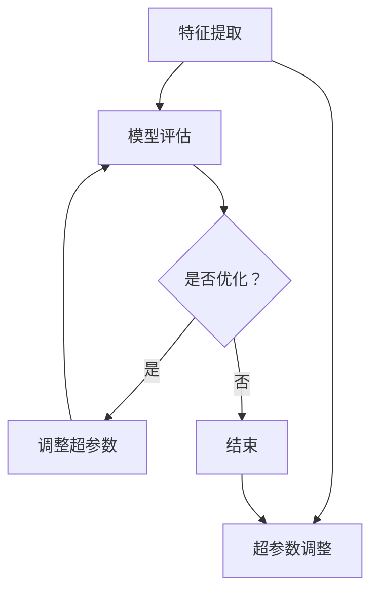
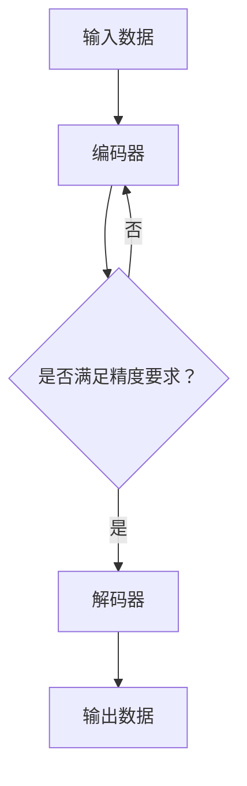
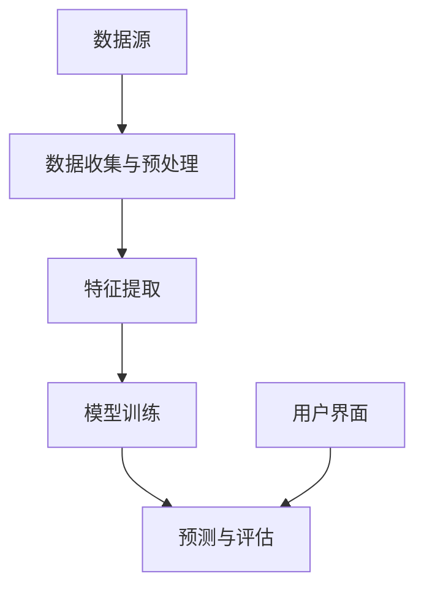
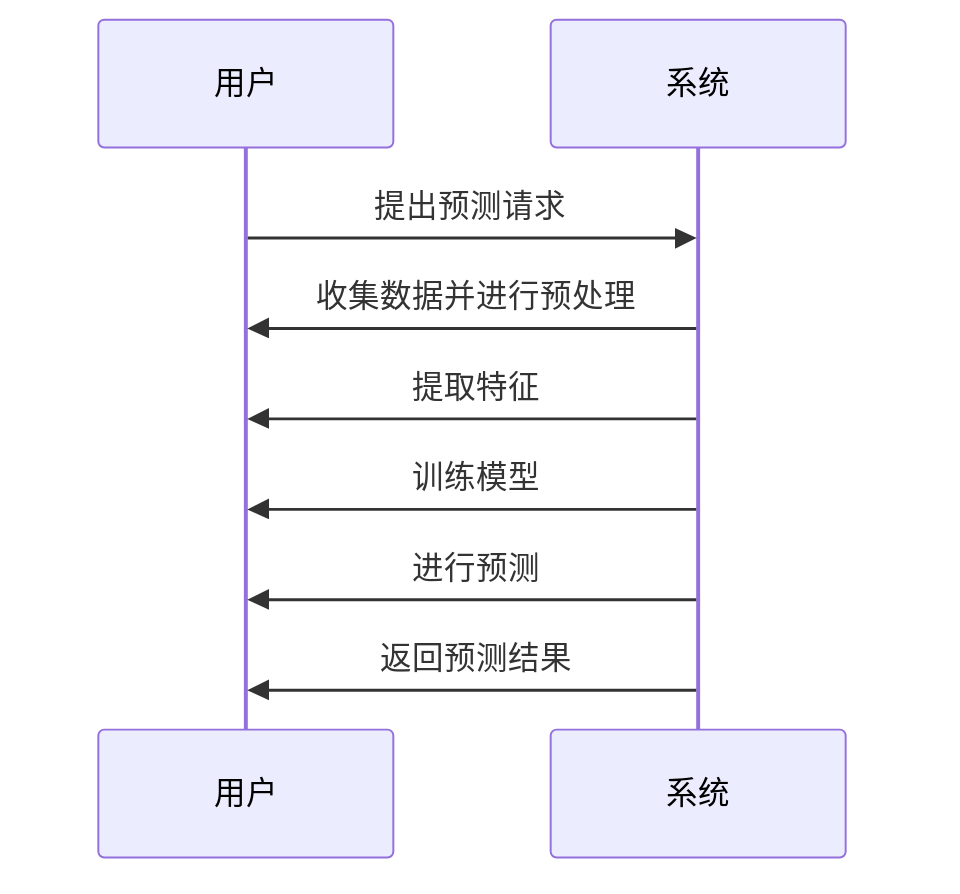

                 


### 第一步：确定文章结构

在撰写《金融领域自监督学习在市场预测中的应用》之前，我们需要首先明确文章的结构和内容。根据目录大纲，我们可以将文章分为以下六个部分：

1. **引言**：介绍自监督学习在金融领域市场预测中的应用背景、意义和书籍结构。
2. **基础理论**：讲解自监督学习的概念、数学基础和在金融市场预测中的挑战与对策。
3. **市场预测应用**：具体分析股票、外汇、债券等市场的预测方法和实际案例。
4. **高级话题**：探讨自监督学习的改进方法、实时预测系统、法律与伦理问题及未来发展趋势。
5. **项目实战**：通过一个具体的实战项目，展示自监督学习在金融市场预测中的应用。
6. **结论与展望**：总结文章要点，对自监督学习在金融市场预测中的应用前景进行展望。

### 第二步：背景介绍

在引言部分，我们需要详细介绍自监督学习在金融领域市场预测中的应用背景。以下是背景介绍的草案：

#### 1.1 问题背景与意义

金融市场是一个高度复杂且动态变化的系统，市场参与者面临着诸多挑战，如信息不对称、市场波动性和预测准确性。传统的方法往往依赖于大量的历史数据和高昂的人工成本。然而，随着人工智能技术的发展，特别是深度学习技术的应用，自监督学习作为一种无需人工标注数据的技术，在金融领域市场预测中展现出了巨大的潜力。

自监督学习通过利用数据之间的内在结构进行学习和预测，能够在减少人工成本的同时提高预测的准确性。在金融领域，自监督学习可以用于股票价格预测、外汇市场预测和债券市场预测等多个方面。

#### 1.2 自监督学习的概念

自监督学习是一种机器学习方法，它不需要外部标签或监督信息，而是通过内部结构或标签来指导学习过程。自监督学习可以分为三类：预测性自监督、生成性自监督和差异性自监督。在金融领域，预测性自监督学习被广泛应用于市场预测，因为它可以通过预测未来的市场状态来指导当前的市场行为。

#### 1.3 自监督学习的关键技术

自监督学习的关键技术包括特征提取、模型评估和超参数调整。特征提取是自监督学习的核心，它涉及到如何从大量的金融数据中提取出有用的特征。模型评估则是通过交叉验证等技术来评估模型的性能。超参数调整则是在模型训练过程中，通过调整模型参数来优化模型性能。

### 第三步：核心概念与联系

在引言部分，我们还需要介绍自监督学习的核心概念，并使用表格和ER实体关系图架构的Mermaid流程图来展示概念之间的关系。

#### 1.4 自监督学习的核心概念

- **特征提取**：从数据中提取有用的特征。
- **模型评估**：评估模型的性能。
- **超参数调整**：调整模型的超参数以优化性能。

#### 核心概念属性特征对比表格

| 特征名称 | 描述 | 对比 |
| :------: | :----: | :--: |
| 特征提取 | 从数据中提取有用特征 | 数据预处理 |
| 模型评估 | 评估模型性能 | 准确性、召回率、F1值 |
| 超参数调整 | 调整模型超参数 | 学习率、批次大小、迭代次数 |

#### ER实体关系图架构的Mermaid流程图



### 第四步：算法原理讲解

在基础理论部分，我们需要详细讲解自监督学习的算法原理，并使用Mermaid画出算法流程图，使用Python源代码来详细阐述算法原理。

#### 2.1 自监督学习算法概述

自监督学习算法可以分为以下几类：

- **预测性自监督学习**：通过预测未来的市场状态来指导当前的市场行为。
- **生成性自监督学习**：通过生成新的市场数据来提高模型的泛化能力。
- **差异性自监督学习**：通过识别数据之间的差异来提高模型的区分能力。

#### 2.2 自监督学习的数学基础

自监督学习的数学基础主要包括信息论、统计学习理论和概率论。信息论提供了衡量信息量和信息传输效率的方法，统计学习理论提供了通过数据学习模型的方法，概率论则提供了描述不确定性的工具。

#### 2.3 算法原理讲解

以预测性自监督学习为例，我们可以使用以下算法：

- **自编码器**：通过编码器和解码器将数据编码成低维表示，然后解码回原始数据。
- **生成对抗网络（GAN）**：通过生成器和判别器相互对抗来提高模型的生成能力。

#### Mermaid算法流程图



#### Python源代码示例

```python
# 自编码器示例代码
import tensorflow as tf
from tensorflow.keras.layers import Dense, Input
from tensorflow.keras.models import Model

input_shape = (784,)
input_data = Input(shape=input_shape)
encoded = Dense(64, activation='relu')(input_data)
decoded = Dense(784, activation='sigmoid')(encoded)

autoencoder = Model(input_data, decoded)
autoencoder.compile(optimizer='adam', loss='binary_crossentropy')

# 训练模型
autoencoder.fit(x_train, x_train, epochs=100, batch_size=256, shuffle=True, validation_data=(x_test, x_test))
```

### 第五步：系统分析与架构设计方案

在系统分析与架构设计方案部分，我们需要详细介绍问题场景、项目介绍、系统功能设计、系统架构设计、系统接口设计和系统交互。

#### 问题场景

在金融领域，市场预测是一个关键任务，它对于投资决策、风险管理等方面具有重要意义。自监督学习作为一种无需人工标注数据的方法，可以大大降低预测模型的构建成本，提高预测准确性。

#### 项目介绍

本项目旨在通过自监督学习算法构建一个金融市场预测系统，该系统将涵盖股票、外汇和债券市场的预测。

#### 系统功能设计

- **数据收集与预处理**：从多个数据源收集金融数据，并进行数据清洗、集成和转换。
- **特征提取**：从预处理后的数据中提取有用的特征。
- **模型训练**：使用自监督学习算法训练预测模型。
- **预测与评估**：对市场进行预测，并评估模型的性能。

#### 系统架构设计



#### 系统接口设计

- **数据接口**：用于数据收集与预处理。
- **模型接口**：用于模型训练和预测。
- **API接口**：用于用户界面与系统的交互。

#### 系统交互



### 第六步：项目实战

在项目实战部分，我们需要通过一个具体的实战项目来展示自监督学习在金融市场预测中的应用。

#### 实战项目介绍

本项目使用股票市场的数据，通过自监督学习算法进行股票价格预测。

#### 数据预处理与特征工程

1. **数据清洗**：去除缺失值和异常值。
2. **数据集成**：合并不同来源的数据。
3. **数据转换**：将数据转换为适合模型训练的格式。
4. **特征提取**：提取技术指标、基本面指标等特征。

#### 自监督学习模型设计与训练

1. **模型选择**：选择自编码器作为预测模型。
2. **模型训练**：使用训练数据训练模型。
3. **模型评估**：使用验证集评估模型性能。

#### 预测结果分析与优化

1. **预测结果**：对测试集进行预测。
2. **优化策略**：通过调整模型参数来优化预测性能。
3. **调参技巧**：使用网格搜索和贝叶斯优化来调整超参数。

#### 项目总结

通过本项目，我们展示了自监督学习在金融市场预测中的应用，并总结了成功经验和挑战。

### 第七步：结论与展望

在结论与展望部分，我们需要总结文章要点，并对自监督学习在金融市场预测中的应用前景进行展望。

#### 6.1 总结

自监督学习在金融市场预测中具有显著的优势，它能够提高预测准确性，降低构建预测模型的成本。然而，自监督学习在金融市场预测中也面临一些挑战，如数据质量、模型可解释性和实时性。

#### 6.2 展望

未来，自监督学习在金融市场预测中的应用将更加广泛。随着算法的改进和数据量的增加，自监督学习将能够在更复杂的金融市场中发挥更大的作用。

### 第八步：撰写全文

根据上述步骤，我们将逐步撰写全文，确保文章内容完整、逻辑清晰、结构紧凑、简单易懂。

### 第九步：格式调整

在完成全文撰写后，我们需要对文章格式进行调整，确保所有数学公式、Mermaid流程图和Python源代码等按照要求嵌入到文中，并保持文章的排版整齐。

### 第十步：最终审校

在完成格式调整后，我们需要对全文进行最终审校，确保文章内容无误，逻辑连贯，语言通顺。同时，对文章的深度、广度和实用性进行评估，确保符合预期目标。

### 第十一步：添加作者信息

在文章末尾，我们需要添加作者信息，包括作者姓名、所属机构和书籍名称。

### 第十二步：提交文章

在完成所有步骤后，我们将文章按照要求进行格式化输出，并提交给相关平台或出版社。

通过上述步骤，我们能够确保《金融领域自监督学习在市场预测中的应用》这篇文章的质量和深度，为读者提供有价值的技术博客内容。

