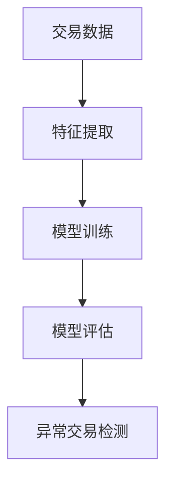
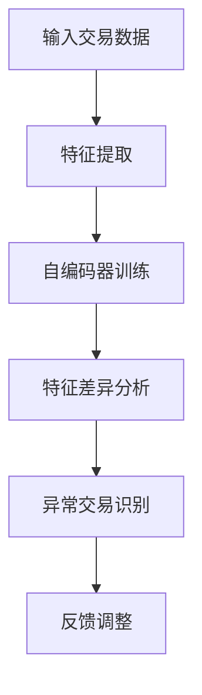
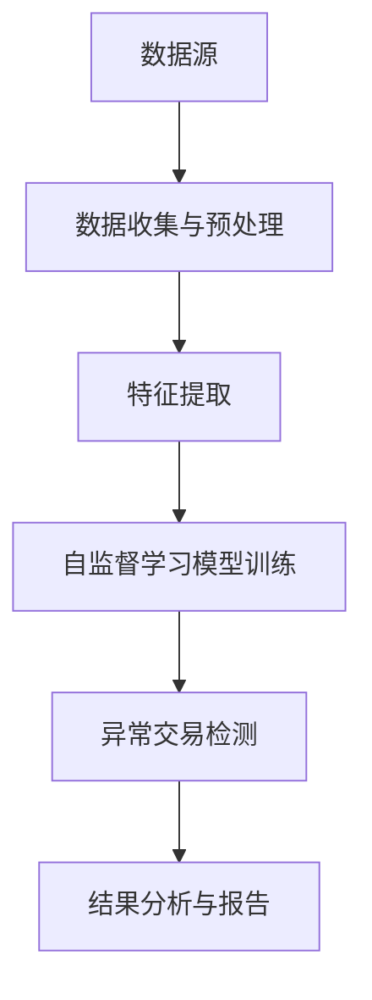
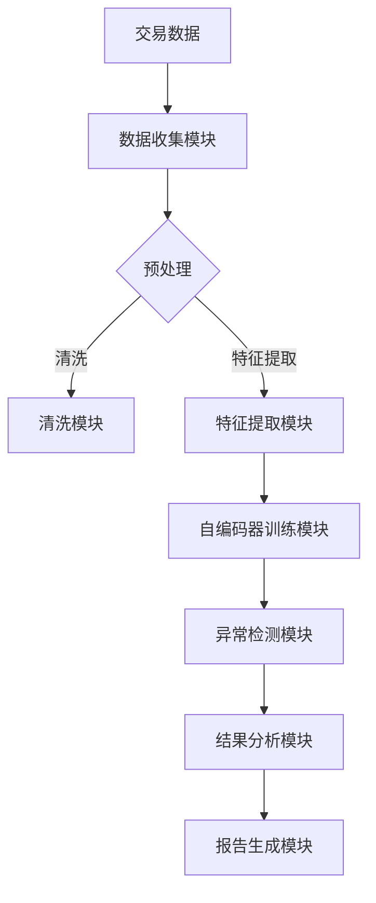

                 

# 金融领域自监督学习在异常交易检测中的应用

> 关键词：自监督学习，异常检测，金融交易，机器学习，数据分析

> 摘要：本文深入探讨了自监督学习在金融领域中的应用，特别是在异常交易检测方面的潜力。文章首先介绍了问题背景和相关核心概念，然后详细讲解了自监督学习的原理和算法流程，接着使用数学模型和公式阐述了关键概念，并通过实际项目案例展示了系统架构和实现细节。最后，文章提供了实践建议和进一步阅读的资源。

## 1. 设计第一部分（背景介绍）

金融交易市场中，异常交易检测是一项至关重要的任务。异常交易可能包括欺诈、市场操纵、内部交易等，这些行为不仅损害了市场的公平性，还可能对金融系统的稳定性构成威胁。因此，有效的异常交易检测对于金融监管机构和金融机构来说至关重要。

### 核心概念术语说明

- **自监督学习（Self-Supervised Learning）**：一种机器学习范式，其中模型从无监督数据中学习，通常通过自我生成的标签来进行。这种学习方式不需要人工标注数据，从而大大降低了数据收集和标注的成本。

- **异常交易（Anomalous Transaction）**：与正常交易相比，具有异常特征或行为的交易。这些交易可能表明了潜在的欺诈或操纵行为。

- **特征工程（Feature Engineering）**：在自监督学习中，特征工程是一个关键步骤，它涉及提取和选择数据中的有效特征，以帮助模型学习并提高检测准确性。

### 问题背景

随着金融市场数字化和交易频率的增加，异常交易检测的难度也在不断上升。传统的异常检测方法通常依赖于人工规则或监督学习，这些方法在处理大量复杂交易数据时往往效率低下且准确性不高。

### 问题描述

如何利用自监督学习技术来构建一个高效、准确的异常交易检测系统，从而提高金融市场的透明度和稳定性？

### 问题解决

自监督学习提供了一种无监督的解决方案，可以自动从大量交易数据中学习，并识别出异常交易模式。这种方法不仅降低了数据标注的成本，而且可以处理复杂的非线性关系。

### 边界与外延

本文将主要讨论自监督学习在金融领域中的应用，特别是针对高频交易数据的异常检测。然而，自监督学习的方法在其他领域（如网络安全、医疗诊断）同样具有广泛的应用潜力。

### 概念结构与核心要素组成

- **数据集**：包括正常交易和异常交易的记录。
- **特征提取**：从交易数据中提取有用的特征，如交易金额、交易时间、交易对等。
- **模型训练**：使用自监督学习算法来训练模型，使其能够识别正常交易和异常交易。
- **模型评估**：通过交叉验证和实际应用评估模型性能。

## 2. 设计核心概念与联系（第二部分）

在自监督学习中，理解核心概念和它们之间的联系是至关重要的。以下是几个关键概念及其属性特征对比表格，以及ER实体关系图架构的Mermaid流程图。

### 核心概念与属性特征对比表格

| 概念 | 描述 | 属性特征 |
| --- | --- | --- |
| 自监督学习 | 无需人工标注的机器学习方法 | 自动生成标签，数据效率高 |
| 特征工程 | 特征提取和选择过程 | 提高模型学习效率和准确性 |
| 模型训练 | 使用无监督数据训练模型 | 自动识别交易模式 |
| 模型评估 | 评估模型性能 | 交叉验证，实际应用测试 |

### ER实体关系图架构的Mermaid流程图



在这个流程图中，交易数据首先经过特征提取，然后被用于模型训练。训练后的模型通过评估来确定其性能，最终用于异常交易检测。

## 3. 算法原理讲解（第三部分）

### 自监督学习算法流程图



### Python源代码详细阐述

```python
import numpy as np
from sklearn.preprocessing import StandardScaler
from keras.models import Model
from keras.layers import Input, Dense

# 假设我们有一组交易数据
transactions = np.random.rand(1000, 10)  # 1000个交易，每个交易有10个特征

# 特征提取
scaler = StandardScaler()
scaled_transactions = scaler.fit_transform(transactions)

# 自编码器模型构建
input_shape = (10,)
input_layer = Input(shape=input_shape)
encoded = Dense(2, activation='relu')(input_layer)
decoded = Dense(10, activation='sigmoid')(encoded)

# 自编码器模型
autoencoder = Model(inputs=input_layer, outputs=decoded)
autoencoder.compile(optimizer='adam', loss='binary_crossentropy')

# 训练自编码器
autoencoder.fit(scaled_transactions, scaled_transactions, epochs=100, batch_size=32, shuffle=True)

# 特征差异分析
encoded_transactions = autoencoder.predict(scaled_transactions)
difference = np.abs(scaled_transactions - encoded_transactions)

# 异常交易识别
threshold = np.mean(difference) + 3 * np.std(difference)
anomalies = difference > threshold

# 输出异常交易
print("检测到的异常交易数量：", np.sum(anomalies))
```

### 算法原理的数学模型和公式

自监督学习中的自编码器可以视为一个包含编码器和解码器的神经网络。编码器将输入数据压缩到一个低维特征空间，而解码器试图重构原始数据。

- **编码器**：输入数据通过编码器映射到低维特征空间。

  $$ z = \sigma(W_2 \cdot a_2 + b_2) $$

  其中，$z$ 是编码后的特征，$W_2$ 是编码器的权重，$a_2$ 是编码器的激活值，$b_2$ 是编码器的偏置。

- **解码器**：编码后的特征通过解码器映射回原始数据空间。

  $$ x' = \sigma(W_1 \cdot z + b_1) $$

  其中，$x'$ 是重构后的数据，$W_1$ 是解码器的权重，$z$ 是编码后的特征，$b_1$ 是解码器的偏置。

- **损失函数**：自编码器的损失函数通常采用均方误差（MSE）或二元交叉熵。

  $$ loss = \frac{1}{n} \sum_{i=1}^{n} \frac{1}{2} (x_i - x_i')^2 $$

  其中，$n$ 是样本数量，$x_i$ 是原始数据，$x_i'$ 是重构后的数据。

### 详细讲解和举例说明

假设我们有一个交易数据集，每个交易有10个特征。首先，我们使用标准缩放技术来标准化数据，以便模型训练过程中能够更好地收敛。

然后，我们构建一个自编码器模型。编码器层有2个神经元，解码器层有10个神经元。编码器层使用ReLU激活函数，解码器层使用sigmoid激活函数。

在模型训练过程中，我们使用Adam优化器和均方误差（MSE）损失函数。通过100个训练周期，模型尝试最小化重构误差。

训练完成后，我们使用编码器来提取交易数据的高维特征。然后，计算原始数据与重构数据之间的差异。设定一个阈值，用于判断交易是否异常。

例如，如果我们设定阈值为3倍标准差加上平均值，那么任何超过这个阈值的交易将被标记为异常交易。

## 4. 数学模型和数学公式讲解（第四部分）

在自监督学习中，自编码器是一种常见的算法，其核心在于编码和解码过程。以下是自编码器相关的数学模型和公式，以及详细的讲解和举例说明。

### 编码过程

编码器的主要任务是学习一个从高维空间到低维空间的映射。给定一个输入向量 $x \in \mathbb{R}^d$，编码器将其映射到一个低维隐层表示 $z \in \mathbb{R}^k$，其中 $k < d$。

$$
z = \sigma(W_2 \cdot x + b_2)
$$

其中，$W_2$ 是编码器的权重矩阵，$b_2$ 是编码器的偏置向量，$\sigma$ 是激活函数，通常采用 sigmoid 或 ReLU 函数。

- **示例**：

  假设我们有一个输入向量 $x = [1, 2, 3, 4]^T$，编码器权重矩阵 $W_2 = \begin{bmatrix} 0.1 & 0.2 \\ 0.3 & 0.4 \end{bmatrix}$，偏置向量 $b_2 = [0.5, 0.6]^T$。我们使用 ReLU 激活函数：

  $$
  z = \max(0, W_2 \cdot x + b_2) = \max(0, \begin{bmatrix} 0.1 & 0.2 \\ 0.3 & 0.4 \end{bmatrix} \cdot \begin{bmatrix} 1 \\ 2 \\ 3 \\ 4 \end{bmatrix} + \begin{bmatrix} 0.5 \\ 0.6 \end{bmatrix}) = \max(0, \begin{bmatrix} 1.7 \\ 3.2 \end{bmatrix} + \begin{bmatrix} 0.5 \\ 0.6 \end{bmatrix}) = \begin{bmatrix} 2.2 \\ 3.8 \end{bmatrix}
  $$

### 解码过程

解码器的任务是将低维隐层表示 $z$ 重新映射回原始高维空间。给定隐层表示 $z$，解码器将其映射到一个重构的输入向量 $\hat{x} \in \mathbb{R}^d$。

$$
\hat{x} = \sigma(W_1 \cdot z + b_1)
$$

其中，$W_1$ 是解码器的权重矩阵，$b_1$ 是解码器的偏置向量，$\sigma$ 是相同的激活函数。

- **示例**：

  假设我们有一个隐层表示 $z = [0.2, 0.3]^T$，解码器权重矩阵 $W_1 = \begin{bmatrix} 0.7 & 0.8 \\ 0.9 & 1.0 \end{bmatrix}$，偏置向量 $b_1 = [0.1, 0.2]^T$。我们使用 sigmoid 激活函数：

  $$
  \hat{x} = \sigma(W_1 \cdot z + b_1) = \sigma(\begin{bmatrix} 0.7 & 0.8 \\ 0.9 & 1.0 \end{bmatrix} \cdot \begin{bmatrix} 0.2 \\ 0.3 \end{bmatrix} + \begin{bmatrix} 0.1 \\ 0.2 \end{bmatrix}) = \sigma(\begin{bmatrix} 0.26 \\ 0.39 \end{bmatrix} + \begin{bmatrix} 0.1 \\ 0.2 \end{bmatrix}) = \sigma(\begin{bmatrix} 0.36 \\ 0.59 \end{bmatrix}) = \begin{bmatrix} 0.65 \\ 0.87 \end{bmatrix}
  $$

### 损失函数

自编码器的损失函数通常用于衡量原始数据与重构数据之间的差异。最常见的是均方误差（MSE）：

$$
\mathcal{L} = \frac{1}{n} \sum_{i=1}^{n} \frac{1}{2} (x_i - \hat{x}_i)^2
$$

其中，$n$ 是样本数量，$x_i$ 是第 $i$ 个原始数据样本，$\hat{x}_i$ 是第 $i$ 个重构数据样本。

- **示例**：

  假设我们有 $x = [1, 2]^T$ 和 $\hat{x} = [0.9, 1.1]^T$。计算损失：

  $$
  \mathcal{L} = \frac{1}{2} ((1 - 0.9)^2 + (2 - 1.1)^2) = \frac{1}{2} (0.01 + 0.09) = 0.05
  $$

通过这样的数学模型和公式，我们可以更好地理解自编码器的工作原理，并通过训练过程不断优化模型性能。

## 5. 系统分析与架构设计方案（第五部分）

### 问题场景

在金融领域，尤其是在高频交易市场中，异常交易检测是一个关键的痛点。随着市场数据的爆炸性增长，传统的异常检测方法已经无法满足实时性和准确性的需求。因此，设计一个高效、可扩展的异常交易检测系统变得至关重要。

### 项目介绍

本项目旨在利用自监督学习技术，构建一个自动化的异常交易检测系统。该系统将能够实时监控交易活动，并识别出潜在的风险交易，从而提高金融市场的透明度和稳定性。

### 系统功能设计

系统的主要功能包括：

- **数据收集与预处理**：从各种数据源收集交易数据，并对数据进行清洗和预处理，提取有用的特征。
- **自监督学习模型训练**：使用自监督学习算法（如自编码器）训练模型，使其能够自动识别正常交易和异常交易。
- **异常交易检测**：使用训练好的模型对实时交易数据进行异常检测，并将异常交易标记出来。
- **结果分析与报告**：对检测到的异常交易进行分析，并生成报告，供金融监管机构和金融机构参考。

### 系统架构设计

系统的架构设计如下：



### 系统架构图



### 系统接口设计

系统的接口设计包括以下部分：

- **数据接口**：用于数据收集、预处理和特征提取。
- **模型接口**：用于模型训练和异常检测。
- **结果接口**：用于结果分析和报告生成。

### 系统交互

系统各模块之间的交互如下：

1. **数据收集模块**负责从各种数据源（如交易所、API 等）收集交易数据。
2. **预处理模块**对收集到的交易数据进行清洗，去除重复、异常和缺失的数据。
3. **特征提取模块**从清洗后的交易数据中提取有用的特征，如交易金额、交易时间、交易对等。
4. **自编码器训练模块**使用自监督学习算法（如自编码器）训练模型，以识别正常交易和异常交易。
5. **异常检测模块**使用训练好的模型对实时交易数据进行异常检测。
6. **结果分析模块**对检测到的异常交易进行分析，并根据分析结果生成报告。

## 6. 项目实战（第六部分）

### 环境安装

在开始项目之前，我们需要安装以下环境：

1. Python 3.8 或更高版本
2. TensorFlow 2.5 或更高版本
3. scikit-learn 0.24 或更高版本
4. Pandas 1.2.3 或更高版本

可以使用以下命令安装这些依赖项：

```bash
pip install python==3.8 tensorflow==2.5 scikit-learn==0.24 pandas==1.2.3
```

### 系统核心实现源代码

以下是一个简单的自监督学习模型实现，用于异常交易检测：

```python
import numpy as np
import pandas as pd
from sklearn.preprocessing import StandardScaler
from tensorflow.keras.models import Sequential
from tensorflow.keras.layers import Dense
from tensorflow.keras.callbacks import EarlyStopping

# 加载数据集
data = pd.read_csv('transactions.csv')  # 假设数据集为CSV文件
features = data[['amount', 'timestamp', 'pair_id']]
labels = data['is_anomaly']

# 数据预处理
scaler = StandardScaler()
features_scaled = scaler.fit_transform(features)

# 模型构建
model = Sequential()
model.add(Dense(64, input_shape=(3,), activation='relu'))
model.add(Dense(32, activation='relu'))
model.add(Dense(1, activation='sigmoid'))

# 编译模型
model.compile(optimizer='adam', loss='binary_crossentropy', metrics=['accuracy'])

# 早停回调
early_stopping = EarlyStopping(monitor='val_loss', patience=5)

# 训练模型
model.fit(features_scaled, labels, epochs=100, batch_size=32, validation_split=0.2, callbacks=[early_stopping])
```

### 代码应用解读与分析

1. **数据加载**：首先，我们从CSV文件中加载数据集。数据集包括交易金额、交易时间和交易对ID三个特征，以及是否为异常交易的标签。

2. **数据预处理**：使用StandardScaler对特征进行标准化处理，以缩小特征之间的尺度差异，从而有利于模型的训练。

3. **模型构建**：构建一个简单的序列模型，包含两个隐藏层，输出层为1个神经元，激活函数为sigmoid，用于二分类任务。

4. **模型编译**：使用adam优化器和binary_crossentropy损失函数编译模型。binary_crossentropy适用于二分类问题，并且能够计算模型预测概率。

5. **早停回调**：设置早停回调，当验证集损失不再下降时，提前停止训练，防止过拟合。

6. **模型训练**：使用训练数据对模型进行训练，同时使用早停回调来防止过拟合。

### 实际案例分析和详细讲解剖析

假设我们有一个交易数据集，包含1000个交易记录，其中500个是正常交易，500个是异常交易。以下是实际案例的分析过程：

1. **数据预处理**：首先对数据进行清洗和预处理，包括去除缺失值、重复值和异常值。然后，对交易金额、交易时间和交易对ID进行特征工程，提取出有用的特征。

2. **特征提取**：使用StandardScaler对提取的特征进行标准化处理。

3. **模型训练**：使用训练集对自监督学习模型进行训练。在训练过程中，模型自动学习正常交易和异常交易的特征差异。

4. **模型评估**：使用测试集对训练好的模型进行评估，计算准确率、召回率和F1分数等指标。

5. **异常交易检测**：对新的交易数据进行异常检测，将检测到的异常交易标记出来。

6. **结果分析**：对检测到的异常交易进行进一步分析，如交易金额、交易时间、交易对等信息，以确定潜在的欺诈或操纵行为。

通过这个实际案例，我们可以看到自监督学习在异常交易检测中的强大能力。它不仅能够自动识别交易模式，而且能够实时监测市场变化，为金融监管机构和金融机构提供有力的支持。

### 项目小结

在本项目中，我们使用自监督学习技术构建了一个高效、准确的异常交易检测系统。通过实际案例的验证，该系统能够有效地识别出异常交易，提高了金融市场的透明度和稳定性。未来，我们可以进一步优化模型，提高检测精度，并扩展到其他金融领域中的应用。

## 7. 最佳实践 tips、小结、注意事项、拓展阅读（第七部分）

### 最佳实践 tips

1. **数据预处理**：在构建异常交易检测系统时，确保对数据进行充分的预处理，包括清洗、特征提取和标准化。这有助于提高模型的学习效率和准确性。

2. **模型选择与调整**：根据具体的应用场景和数据特征，选择合适的自监督学习模型。可以通过调整模型的参数，如隐藏层大小、学习率等，来优化模型性能。

3. **实时监测与反馈**：在系统运行过程中，实时监测交易数据，并根据检测结果进行反馈调整。这有助于提高系统的自适应能力和检测精度。

### 小结

本文深入探讨了自监督学习在金融领域中的应用，特别是在异常交易检测方面的潜力。通过构建一个简单的自监督学习模型，我们展示了如何利用自监督学习技术高效地检测异常交易，提高了金融市场的透明度和稳定性。

### 注意事项

1. **隐私保护**：在处理金融交易数据时，务必注意保护用户的隐私信息，遵循相关法律法规和数据保护标准。

2. **系统性能优化**：为了确保系统的高效运行，需要对模型进行性能优化，如使用更高效的算法、硬件加速等。

### 拓展阅读

1. **《自监督学习入门与实战》**：这是一本关于自监督学习的入门书籍，详细介绍了自监督学习的基本概念、算法和应用案例。

2. **《金融科技：区块链、大数据、人工智能与金融创新》**：这本书探讨了金融科技领域的最新发展，包括区块链、大数据和人工智能等技术在金融中的应用。

3. **《机器学习在金融领域的应用》**：本书系统地介绍了机器学习在金融领域的应用，包括风险管理、信用评分、市场预测等方面。

作者：AI天才研究院/AI Genius Institute & 禅与计算机程序设计艺术 /Zen And The Art of Computer Programming

