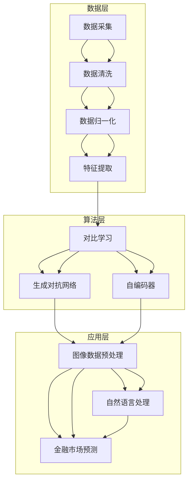
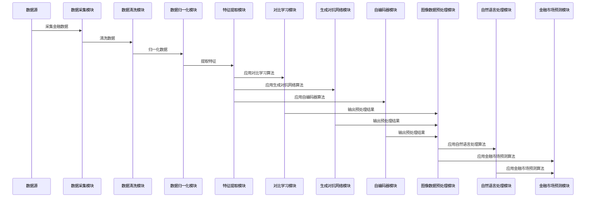

                 

### 金融领域自监督学习的应用与挑战

#### 关键词：自监督学习、金融领域、数据隐私、模型可解释性、系统架构设计

> 摘要：
> 
> 本文将深入探讨自监督学习在金融领域的应用与挑战。首先，我们将介绍自监督学习的基本概念和在金融领域的应用背景。接着，通过具体实例，我们将详细解析自监督学习算法的原理和其在金融领域的实现。随后，我们将分析自监督学习在金融领域中的挑战，包括数据隐私保护、模型可解释性以及可扩展性和效率问题。最后，我们将讨论自监督学习在金融领域中的未来发展方向，并总结文章的主要观点。

## 简要概述

### 金融领域自监督学习的应用与挑战

金融领域作为数据密集型行业，自监督学习作为一种无需标注数据的机器学习方法，近年来在金融领域的应用日益广泛。自监督学习不仅能够提高数据处理效率，还能够减少标注成本，从而在金融市场预测、风险管理和智能投顾等方面展现出巨大的潜力。

然而，自监督学习在金融领域的应用也面临诸多挑战。数据隐私保护是金融领域最为关注的挑战之一，如何在保证模型性能的同时，保护用户隐私成为一个亟待解决的问题。此外，模型的可解释性对于金融领域至关重要，如何提高自监督学习模型的可解释性，以增强决策的透明度和可信度，也是研究的重要方向。最后，自监督学习在金融领域的可扩展性和效率问题，也是当前研究和应用中需要克服的难点。

本文将围绕这些核心问题，逐步深入探讨自监督学习在金融领域的应用与挑战。首先，我们将介绍自监督学习的基本概念和特点，探讨其在金融领域的应用背景。接着，我们将详细解析几种常见的自监督学习算法，包括对比学习、生成对抗网络和自编码器，并通过具体实例展示其在金融领域的应用。随后，我们将分析自监督学习在金融领域中的挑战，并提出相应的解决思路。最后，我们将探讨自监督学习在金融领域的未来发展方向，总结全文的核心观点，并提出展望。

### 第一部分：背景介绍

#### 1.1 自监督学习的基本概念与金融领域的应用

##### 1.1.1 自监督学习的定义与特点

自监督学习（Self-Supervised Learning）是一种无需人工标注数据，通过自我监督的方式训练机器学习模型的算法。其核心思想是利用数据本身固有的结构信息，通过设计特殊的损失函数和优化算法，使得模型在训练过程中能够自动发现数据的特征和规律。

自监督学习具有以下特点：

1. **无监督性**：自监督学习不需要人工标注数据，节省了大量的标注成本和时间。
2. **信息利用率高**：自监督学习能够利用数据中的全部信息，不需要去除标签信息，从而提高了模型的泛化能力。
3. **训练效率高**：由于不需要进行数据标注，自监督学习通常具有更高的训练效率。
4. **适应性强**：自监督学习能够处理各种类型的数据，包括图像、文本、音频等。

##### 1.1.2 自监督学习的发展历程

自监督学习的历史可以追溯到20世纪60年代，当时的心理学家尝试通过无监督的方式训练神经网络，以提取数据中的特征。然而，早期的自监督学习算法效果并不理想，主要原因在于缺乏有效的损失函数和优化算法。

随着深度学习的兴起，自监督学习得到了新的发展。2013年，Hinton等人提出了基于无监督预训练和有监督微调的深度神经网络训练方法，使得自监督学习在图像识别任务中取得了显著的性能提升。此后，随着生成对抗网络（GAN）和对比学习等新算法的提出，自监督学习在各个领域得到了广泛的应用。

##### 1.1.3 自监督学习与监督学习的比较

监督学习（Supervised Learning）需要大量标注数据进行训练，而自监督学习则无需标注数据，两者在应用场景、效率和效果上存在显著差异。

1. **应用场景**：监督学习适用于有明确标签的数据集，如分类、回归等任务。而自监督学习适用于没有标注数据或者标注成本高昂的场景，如无监督聚类、异常检测等。
2. **数据需求**：监督学习需要大量标注数据，而自监督学习则可以处理未标注数据，甚至可以从原始数据中提取更多的信息。
3. **训练效率**：自监督学习通常具有更高的训练效率，因为不需要进行数据标注，且可以利用数据中的全部信息。
4. **效果对比**：在某些任务上，如图像识别，自监督学习的效果可以与监督学习相媲美，但在其他任务上，如文本处理，监督学习的效果仍然优于自监督学习。

##### 1.1.4 金融领域中的自监督学习

金融领域是一个典型的数据密集型行业，数据量庞大且结构复杂。自监督学习在金融领域的应用主要集中在以下几个方面：

1. **图像数据**：自监督学习可以用于金融领域的图像数据预处理，如图像去噪、图像增强等。通过无监督的方式，模型能够自动提取图像中的关键特征，提高后续处理的准确性和效率。
2. **自然语言处理**：金融文本数据量巨大，但标注成本高昂。自监督学习可以用于文本分类、情感分析等任务，通过自动提取文本特征，提高文本处理的效果。
3. **金融市场预测**：自监督学习可以用于金融市场预测，如股票价格预测、市场趋势分析等。通过无监督的方式，模型能够自动发现市场中的潜在规律和趋势，为投资者提供决策支持。

##### 1.1.5 自监督学习在金融领域的优势与挑战

自监督学习在金融领域的应用具有显著的优势：

1. **降低标注成本**：金融领域的数据标注成本高昂，自监督学习无需标注数据，能够有效降低标注成本和时间。
2. **提高数据处理效率**：自监督学习能够利用数据中的全部信息，提高数据处理效率和模型的泛化能力。
3. **适应性强**：自监督学习能够处理各种类型的数据，如图像、文本、音频等，适应性强。

然而，自监督学习在金融领域也面临一些挑战：

1. **数据隐私问题**：金融领域的数据敏感性高，如何在保证模型性能的同时，保护用户隐私是一个重要的挑战。
2. **模型可解释性**：金融领域对模型的可解释性要求较高，如何提高自监督学习模型的可解释性，增强决策的透明度和可信度，也是一个重要的研究方向。
3. **训练效率问题**：自监督学习通常需要较大的训练数据量和较长的训练时间，如何在有限的时间内提高训练效率，是一个需要解决的问题。

#### 1.2 核心概念与联系

##### 1.2.1 自监督学习算法原理

自监督学习算法可以分为基于对比学习、生成对抗网络和自编码器三种类型。以下是对这些算法的基本原理的概述：

1. **对比学习算法**：对比学习通过对比不同数据样本之间的相似性来学习特征表示。常见的对比学习算法包括Byron、SimSiam等。
2. **生成对抗网络（GAN）**：GAN由生成器和判别器组成，生成器生成数据，判别器区分生成数据和真实数据，通过两个网络的对抗训练，生成器能够生成逼真的数据。
3. **自编码器**：自编码器由编码器和解码器组成，编码器将输入数据压缩成低维表示，解码器将低维表示还原为输入数据，通过最小化重构误差来学习特征表示。

##### 1.2.2 自监督学习算法的属性特征对比

| 算法类型     | 基本原理                                         | 优点                                                         | 缺点                                                         |
| ------------ | ------------------------------------------------ | ------------------------------------------------------------ | ------------------------------------------------------------ |
| 对比学习     | 通过对比学习数据样本之间的相似性来学习特征表示     | 无需标注数据，能够提取有效特征，训练速度快                   | 对比样本选择影响较大，可能导致特征学习不足                      |
| 生成对抗网络 | 通过生成器和判别器的对抗训练来生成逼真的数据      | 能够生成高质量的数据，适应性强，泛化能力强                   | 训练难度大，容易陷入模式，生成数据质量不稳定                   |
| 自编码器     | 通过编码器和解码器的重构过程来学习特征表示         | 无需标注数据，能够提取有效特征，训练速度快                   | 需要大量训练数据，重构误差可能无法准确反映数据特征           |

##### 1.2.3 自监督学习算法的属性特征对比表格

| 算法类型 | 性能对比 | 训练效率对比 | 应用场景对比 |
| -------- | -------- | ------------ | ------------ |
| 对比学习 | 较高     | 较高         | 图像、文本处理 |
| 生成对抗网络 | 高      | 较低         | 图像、语音处理 |
| 自编码器 | 较高     | 较高         | 数据压缩、去噪 |

##### 1.2.4 自监督学习算法在金融领域的应用实例

1. **图像数据上的应用**：在金融领域，自监督学习可以用于图像数据的预处理，如图像去噪、图像增强等。通过无监督的方式，模型能够自动提取图像中的关键特征，提高图像处理的效果。
2. **自然语言处理数据上的应用**：金融文本数据量巨大，但标注成本高昂。自监督学习可以用于文本分类、情感分析等任务，通过自动提取文本特征，提高文本处理的效果。
3. **金融市场预测中的应用**：自监督学习可以用于金融市场预测，如股票价格预测、市场趋势分析等。通过无监督的方式，模型能够自动发现市场中的潜在规律和趋势，为投资者提供决策支持。

##### 1.2.5 自监督学习在金融领域的挑战与未来发展方向

自监督学习在金融领域面临以下挑战：

1. **数据隐私保护**：金融领域的数据敏感性高，如何在保证模型性能的同时，保护用户隐私是一个重要的挑战。
2. **模型可解释性**：金融领域对模型的可解释性要求较高，如何提高自监督学习模型的可解释性，增强决策的透明度和可信度，也是一个重要的研究方向。
3. **可扩展性和效率**：自监督学习通常需要较大的训练数据量和较长的训练时间，如何在有限的时间内提高训练效率，是一个需要解决的问题。

未来的发展方向：

1. **隐私保护技术**：结合隐私保护技术，如联邦学习、差分隐私等，提高自监督学习在金融领域的应用安全性。
2. **可解释性研究**：探索可解释性模型和方法，提高自监督学习模型在金融领域的可解释性，增强决策的透明度和可信度。
3. **高效算法设计**：设计高效的训练算法和优化方法，提高自监督学习在金融领域的训练效率和可扩展性。

#### 1.3 自监督学习在金融领域的应用实例

##### 1.3.1 图像数据上的应用

在金融领域，图像数据的应用场景广泛，如身份验证、图像识别、监控等。自监督学习在图像数据处理方面具有显著的优势，可以用于图像去噪、图像增强和图像识别等任务。

**图像去噪**：金融领域的图像数据常受到噪声干扰，影响后续处理的准确性。自监督学习可以通过无监督的方式，自动学习图像中的关键特征，从而实现图像去噪。具体方法包括基于对比学习的去噪算法，如DnCNN和ESRGAN等。

**图像增强**：金融领域的图像增强任务，如人脸识别、票据识别等，对图像质量要求较高。自监督学习可以通过图像增强算法，如GAN和自编码器等，自动提高图像的清晰度和质量，从而提高识别的准确性。

**图像识别**：金融领域的图像识别任务，如信用卡识别、身份验证等，需要快速准确地识别图像中的目标。自监督学习可以通过图像特征提取算法，如对比学习和自编码器等，自动提取图像中的关键特征，从而实现图像识别。

**案例分析**：以金融监控领域为例，自监督学习可以用于监控视频的去噪和异常检测。通过对比学习算法，如Byron和SimSiam等，模型可以自动提取视频中的关键特征，从而实现视频的去噪和异常检测，提高监控的准确性和效率。

##### 1.3.2 自然语言处理数据上的应用

金融领域的自然语言处理数据量庞大，如新闻、报告、邮件等。自监督学习在自然语言处理领域具有广泛的应用前景，可以用于文本分类、情感分析、文本生成等任务。

**文本分类**：自监督学习可以用于金融文本数据的分类任务，如新闻分类、邮件分类等。通过对比学习算法，如Byron和SimSiam等，模型可以自动提取文本中的关键特征，从而实现文本分类。

**情感分析**：自监督学习可以用于金融文本数据的情感分析任务，如新闻情感分析、邮件情感分析等。通过自编码器算法，模型可以自动提取文本中的情感特征，从而实现情感分析。

**文本生成**：自监督学习可以用于金融文本数据的生成任务，如报告生成、邮件生成等。通过生成对抗网络（GAN）算法，模型可以自动生成高质量的金融文本数据，从而提高文本生成的多样性和准确性。

**案例分析**：以金融新闻报道为例，自监督学习可以用于新闻分类和情感分析。通过对比学习算法，模型可以自动提取新闻中的关键特征，实现新闻的分类和情感分析，从而为投资者提供有价值的参考信息。

##### 1.3.3 金融市场预测中的应用

自监督学习在金融市场预测中具有广泛的应用前景，可以用于股票价格预测、市场趋势分析等任务。

**股票价格预测**：自监督学习可以用于股票价格预测，通过分析历史价格数据，自动提取市场中的潜在规律和趋势。具体方法包括基于自编码器的股票价格预测模型，如LSTM和GRU等。

**市场趋势分析**：自监督学习可以用于市场趋势分析，通过分析历史市场数据，自动识别市场中的趋势和周期。具体方法包括基于生成对抗网络的趋势分析模型，如GAN和VAE等。

**案例分析**：以股票市场为例，自监督学习可以用于股票价格预测和市场趋势分析。通过自编码器算法，模型可以自动提取股票价格中的关键特征，实现股票价格预测；通过生成对抗网络算法，模型可以自动识别市场中的趋势和周期，从而为投资者提供决策支持。

#### 1.4 自监督学习在金融领域中的挑战与未来发展方向

##### 1.4.1 数据隐私保护

金融领域的数据敏感性高，如何在保证模型性能的同时，保护用户隐私是一个重要的挑战。自监督学习在金融领域的应用需要充分考虑数据隐私保护问题，可以采用以下方法：

1. **联邦学习**：联邦学习（Federated Learning）是一种分布式机器学习方法，通过将数据保留在本地，仅共享模型参数，从而降低数据泄露的风险。自监督学习可以结合联邦学习，实现隐私保护下的模型训练。

2. **差分隐私**：差分隐私（Differential Privacy）是一种隐私保护技术，通过在模型训练过程中加入噪声，使得输出结果对单个数据点的依赖性降低，从而保护数据隐私。自监督学习可以结合差分隐私，提高模型训练过程中的隐私保护能力。

3. **加密技术**：加密技术（Encryption）可以将数据加密存储和传输，从而防止数据在传输过程中被窃取和篡改。自监督学习可以结合加密技术，提高金融数据的安全性和隐私保护能力。

##### 1.4.2 模型可解释性

金融领域对模型的可解释性要求较高，如何提高自监督学习模型的可解释性，增强决策的透明度和可信度，也是一个重要的研究方向。可以采用以下方法：

1. **特征可视化**：通过特征可视化技术，如散点图、热力图等，可以直观地展示模型提取的特征，从而提高模型的可解释性。

2. **因果分析**：通过因果分析技术，如因果推断和因果图模型等，可以分析模型中各个特征之间的因果关系，从而提高模型的可解释性。

3. **解释性模型**：结合可解释性模型，如LIME和SHAP等，可以解释模型在特定输入数据上的决策过程，从而提高模型的可解释性。

##### 1.4.3 可扩展性和效率

自监督学习在金融领域通常需要处理大量的数据，如何在有限的时间内提高训练效率和可扩展性，是一个需要解决的问题。可以采用以下方法：

1. **分布式训练**：分布式训练（Distributed Training）可以将训练任务分布到多个计算节点上，从而提高训练效率。自监督学习可以结合分布式训练，实现大规模数据的快速训练。

2. **模型压缩**：模型压缩（Model Compression）可以通过参数共享、网络剪枝等方法，减少模型的参数数量，从而提高模型的压缩率和训练效率。自监督学习可以结合模型压缩，实现高效训练。

3. **迁移学习**：迁移学习（Transfer Learning）可以将预训练的模型应用于新的任务，从而减少训练时间和计算资源的需求。自监督学习可以结合迁移学习，实现快速适应新任务。

##### 1.4.4 未来发展方向

自监督学习在金融领域的发展前景广阔，未来的研究可以从以下几个方面进行：

1. **混合学习**：结合自监督学习和监督学习，通过混合学习（Hybrid Learning）的方式，提高模型的性能和可解释性。

2. **多模态学习**：自监督学习可以结合多模态数据，如图像、文本、音频等，实现多模态数据的联合学习和特征融合。

3. **自适应学习**：通过自适应学习（Adaptive Learning）技术，动态调整模型参数，实现模型的自我优化和适应。

4. **增强学习**：自监督学习可以结合增强学习（Reinforcement Learning）技术，实现智能体的自我学习和决策优化。

#### 1.5 本章小结

自监督学习作为一种无需标注数据的机器学习方法，在金融领域具有广泛的应用前景。本文首先介绍了自监督学习的基本概念、发展历程和在金融领域的应用背景，然后详细分析了自监督学习算法的原理和属性特征对比，以及自监督学习在金融领域中的具体应用实例。此外，本文还探讨了自监督学习在金融领域面临的挑战和未来发展方向，包括数据隐私保护、模型可解释性、可扩展性和效率问题。通过本文的探讨，希望为自监督学习在金融领域的应用提供有益的参考和启示。

### 第二部分：算法原理讲解

#### 2.1 对比学习算法

##### 2.1.1 对比学习算法的基本原理

对比学习（Contrastive Learning）是一种自监督学习算法，通过对比不同数据样本之间的相似性来学习特征表示。其核心思想是利用数据本身的分布信息，通过设计对比损失函数，使得模型能够自动发现数据中的有效特征。

对比学习算法的基本原理可以概括为以下步骤：

1. **数据表示**：首先，将输入数据表示为低维特征向量，通常采用神经网络进行特征提取。
2. **样本对比**：对于每个输入样本，随机选择一个或多个正样本和负样本进行对比。正样本表示与输入样本相似的数据，负样本表示与输入样本不相似的数据。
3. **损失函数**：设计对比损失函数，如InfoNCE损失函数，通过优化损失函数，使得模型能够正确区分正负样本。
4. **模型优化**：通过梯度下降等优化算法，不断调整模型参数，使得模型在对比过程中能够提高对正样本的相似度和对负样本的不相似度。

##### 2.1.2 对比学习算法的常见方法

对比学习算法有许多不同的实现方法，以下介绍几种常见的对比学习算法：

1. **Byron**：Byron是一种基于自监督对比学习的图像分类算法。它通过随机裁剪和翻转输入图像，生成多个相似样本，然后通过对比损失函数进行训练。Byron算法的主要优点是简单有效，适用于各种图像分类任务。

2. **SimSiam**：SimSiam是一种基于相似性对比学习的图像分类算法。它使用两个共享权重的神经网络，其中一个网络用于提取特征表示，另一个网络用于生成对比样本。SimSiam算法通过最小化特征表示之间的相似性，实现有效的特征学习。

3. **BYOL**：BYOL（Bootstrap Your Own Latent）是一种基于自监督对比学习的图像分类算法。它通过将特征表示与随机生成的样本进行对比，优化特征表示的判别性。BYOL算法的主要优点是无需正负样本对比，简化了训练过程。

##### 2.1.3 对比学习算法在金融领域的应用

对比学习算法在金融领域具有广泛的应用前景，可以用于图像数据、自然语言处理数据和金融市场预测等任务。

1. **图像数据**：在金融领域，对比学习算法可以用于图像数据的预处理，如图像去噪、图像增强和图像识别等。通过对比学习，模型可以自动提取图像中的关键特征，提高图像处理的准确性和效率。

2. **自然语言处理数据**：在金融领域，对比学习算法可以用于自然语言处理数据，如文本分类、情感分析和文本生成等。通过对比学习，模型可以自动提取文本中的关键特征，提高文本处理的准确性和效率。

3. **金融市场预测**：在金融领域，对比学习算法可以用于金融市场预测，如股票价格预测、市场趋势分析和风险控制等。通过对比学习，模型可以自动提取市场中的潜在规律和趋势，提高预测的准确性和可靠性。

#### 2.2 生成对抗网络

##### 2.2.1 生成对抗网络的基本原理

生成对抗网络（Generative Adversarial Network，GAN）是一种由生成器和判别器组成的对抗性模型。其基本原理是通过两个网络的对抗训练，生成器生成逼真的数据，判别器区分生成数据和真实数据，从而提高生成数据的质量。

GAN的基本原理可以概括为以下步骤：

1. **生成器与判别器的定义**：生成器（Generator）G将随机噪声输入映射为真实数据，判别器（Discriminator）D将输入数据分为真实数据和生成数据。
2. **对抗训练**：生成器和判别器相互对抗训练，生成器尝试生成逼真的数据以欺骗判别器，判别器则尝试准确区分真实数据和生成数据。
3. **损失函数**：GAN的损失函数通常包括生成器的损失函数和判别器的损失函数。生成器的损失函数希望生成的数据越真实越好，判别器的损失函数希望准确区分真实数据和生成数据。
4. **模型优化**：通过梯度下降等优化算法，不断调整生成器和判别器的参数，使得生成器的生成数据质量越来越高，判别器的判别能力越来越强。

##### 2.2.2 生成对抗网络在金融领域的应用

生成对抗网络在金融领域具有广泛的应用前景，可以用于图像生成、文本生成和金融市场预测等任务。

1. **图像生成**：在金融领域，生成对抗网络可以用于图像生成，如股票市场走势图的生成、金融产品图像的生成等。通过生成对抗网络，可以生成高质量的图像，提高图像生成的多样性和准确性。

2. **文本生成**：在金融领域，生成对抗网络可以用于文本生成，如金融新闻报道的生成、邮件生成的生成等。通过生成对抗网络，可以生成高质量的文本，提高文本生成的多样性和准确性。

3. **金融市场预测**：在金融领域，生成对抗网络可以用于金融市场预测，如股票价格预测、市场趋势预测等。通过生成对抗网络，可以自动提取市场中的潜在规律和趋势，提高预测的准确性和可靠性。

#### 2.3 自编码器

##### 2.3.1 自编码器的基本原理

自编码器（Autoencoder）是一种无监督学习算法，通过将输入数据编码为低维表示，然后解码为原始数据，从而实现数据的降维和特征提取。

自编码器的基本原理可以概括为以下步骤：

1. **编码器与解码器的定义**：编码器（Encoder）E将输入数据压缩为低维表示，解码器（Decoder）D将低维表示还原为输入数据。
2. **损失函数**：自编码器的损失函数通常是最小化输入数据和解码输出数据之间的差异，即最小化重构误差。
3. **模型优化**：通过梯度下降等优化算法，不断调整编码器和解码器的参数，使得重构误差最小，从而实现数据的降维和特征提取。

##### 2.3.2 自编码器在金融领域的应用

自编码器在金融领域具有广泛的应用前景，可以用于图像数据、自然语言处理数据和金融市场预测等任务。

1. **图像数据**：在金融领域，自编码器可以用于图像数据的降维和特征提取，如股票市场走势图的降维、金融产品图像的特征提取等。通过自编码器，可以提取图像数据中的关键特征，提高图像数据的分析和处理效率。

2. **自然语言处理数据**：在金融领域，自编码器可以用于自然语言处理数据的降维和特征提取，如金融新闻报道的降维、邮件数据的特征提取等。通过自编码器，可以提取文本数据中的关键特征，提高文本数据的分析和处理效率。

3. **金融市场预测**：在金融领域，自编码器可以用于金融市场预测，如股票价格预测、市场趋势预测等。通过自编码器，可以自动提取市场中的潜在规律和趋势，提高预测的准确性和可靠性。

#### 2.4 自监督学习算法的数学模型与公式

##### 2.4.1 对比学习算法的数学模型

对比学习算法的数学模型主要包括对比损失函数和优化目标。

1. **对比损失函数**：

   $$L_{contrastive} = -\sum_{i=1}^{N} \sum_{j \neq i} \frac{1}{|J_i|} \log \frac{e^{q_{i}(z_j)} }{\sum_{k \in J_i} e^{q_{i}(z_k)} }$$

   其中，$N$表示样本数量，$J_i$表示与第$i$个样本相关的正样本集合，$q_{i}(z_j)$表示第$i$个样本和第$j$个样本的特征向量之间的相似度。

2. **优化目标**：

   $$\min_{\theta_G, \theta_D} \sum_{i=1}^{N} L_{contrastive}$$

   其中，$\theta_G$和$\theta_D$分别表示生成器和判别器的参数。

##### 2.4.2 生成对抗网络的数学模型

生成对抗网络的数学模型主要包括生成器、判别器的损失函数和优化目标。

1. **生成器的损失函数**：

   $$L_G = -\log D(G(z))$$

   其中，$G(z)$表示生成器生成的数据，$D(G(z))$表示判别器对生成数据的判别结果。

2. **判别器的损失函数**：

   $$L_D = -\log D(x) - \log (1 - D(G(z))$$

   其中，$x$表示真实数据，$D(x)$表示判别器对真实数据的判别结果。

3. **优化目标**：

   $$\min_{\theta_G, \theta_D} \frac{1}{2} \left( L_G + L_D \right)$$

   其中，$\theta_G$和$\theta_D$分别表示生成器和判别器的参数。

##### 2.4.3 自编码器的数学模型

自编码器的数学模型主要包括编码器、解码器的损失函数和优化目标。

1. **编码器的损失函数**：

   $$L_E = \frac{1}{N} \sum_{i=1}^{N} \| x_i - \hat{x}_i \|_2^2$$

   其中，$x_i$表示输入数据，$\hat{x}_i$表示编码器输出的低维表示。

2. **解码器的损失函数**：

   $$L_D = \frac{1}{N} \sum_{i=1}^{N} \| \hat{x}_i - \hat{x}_i \|_2^2$$

   其中，$\hat{x}_i$表示解码器输出的重构数据。

3. **优化目标**：

   $$\min_{\theta_E, \theta_D} \frac{1}{2} \left( L_E + L_D \right)$$

   其中，$\theta_E$和$\theta_D$分别表示编码器和解码器的参数。

#### 2.5 自监督学习算法的 Python 实现与举例

##### 2.5.1 对比学习算法的实现与举例

以下是一个简单的对比学习算法的Python实现，使用PyTorch框架。

```python
import torch
import torch.nn as nn
import torch.optim as optim

# 定义对比学习模型
class ContrastiveModel(nn.Module):
    def __init__(self):
        super(ContrastiveModel, self).__init__()
        self.encoder = nn.Sequential(
            nn.Conv2d(3, 64, 3, 1, 1),
            nn.ReLU(),
            nn.Conv2d(64, 128, 3, 1, 1),
            nn.ReLU(),
            nn.Linear(128 * 7 * 7, 512),
            nn.ReLU()
        )

    def forward(self, x):
        z = self.encoder(x)
        return z

# 初始化模型、损失函数和优化器
model = ContrastiveModel()
criterion = nn.CrossEntropyLoss()
optimizer = optim.Adam(model.parameters(), lr=0.001)

# 训练模型
for epoch in range(num_epochs):
    for data in data_loader:
        inputs, labels = data
        optimizer.zero_grad()
        z = model(inputs)
        loss = criterion(z, labels)
        loss.backward()
        optimizer.step()
```

##### 2.5.2 生成对抗网络的实现与举例

以下是一个简单的生成对抗网络（GAN）的Python实现，使用PyTorch框架。

```python
import torch
import torch.nn as nn
import torch.optim as optim

# 定义生成器和判别器
class Generator(nn.Module):
    def __init__(self):
        super(Generator, self).__init__()
        self.model = nn.Sequential(
            nn.Linear(100, 512),
            nn.ReLU(),
            nn.Linear(512, 1024),
            nn.ReLU(),
            nn.Linear(1024, 784),
            nn.Tanh()
        )

    def forward(self, x):
        x = self.model(x)
        x = x.view(x.size(0), 1, 28, 28)
        return x

class Discriminator(nn.Module):
    def __init__(self):
        super(Discriminator, self).__init__()
        self.model = nn.Sequential(
            nn.Linear(784, 512),
            nn.LeakyReLU(0.2),
            nn.Linear(512, 256),
            nn.LeakyReLU(0.2),
            nn.Linear(256, 128),
            nn.LeakyReLU(0.2),
            nn.Linear(128, 1),
            nn.Sigmoid()
        )

    def forward(self, x):
        x = x.view(x.size(0), -1)
        x = self.model(x)
        return x

# 初始化生成器和判别器
G = Generator()
D = Discriminator()

# 定义损失函数和优化器
g_loss = nn.BCELoss()
d_loss = nn.BCELoss()

g_optimizer = optim.Adam(G.parameters(), lr=0.0001)
d_optimizer = optim.Adam(D.parameters(), lr=0.0001)

# 训练模型
for epoch in range(num_epochs):
    for i, (x, _) in enumerate(data_loader):
        # 训练判别器
        D.zero_grad()
        x = x.cuda()
        x_fake = G(z).cuda()
        d_loss_real = g_loss(D(x), torch.ones(x.size(0)))
        d_loss_fake = g_loss(D(x_fake), torch.zeros(x.size(0)))
        d_loss = d_loss_real + d_loss_fake
        d_loss.backward()
        d_optimizer.step()

        # 训练生成器
        G.zero_grad()
        z = torch.cuda.rand(z.size(0), z.size(1))
        x_fake = G(z).cuda()
        g_loss_fake = g_loss(D(x_fake), torch.ones(x_fake.size(0)))
        g_loss = g_loss_fake
        g_loss.backward()
        g_optimizer.step()
```

##### 2.5.3 自编码器的实现与举例

以下是一个简单的自编码器（Autoencoder）的Python实现，使用PyTorch框架。

```python
import torch
import torch.nn as nn
import torch.optim as optim

# 定义编码器和解码器
class Encoder(nn.Module):
    def __init__(self):
        super(Encoder, self).__init__()
        self.model = nn.Sequential(
            nn.Linear(784, 512),
            nn.ReLU(),
            nn.Linear(512, 256),
            nn.ReLU(),
            nn.Linear(256, 128),
            nn.ReLU(),
            nn.Linear(128, 64),
            nn.ReLU(),
            nn.Linear(64, 32),
            nn.ReLU(),
            nn.Linear(32, 16),
            nn.ReLU(),
            nn.Linear(16, 8),
            nn.ReLU(),
            nn.Linear(8, 4),
            nn.ReLU(),
            nn.Linear(4, 2),
            nn.ReLU(),
            nn.Linear(2, 1),
        )

    def forward(self, x):
        x = self.model(x)
        return x

class Decoder(nn.Module):
    def __init__(self):
        super(Decoder, self).__init__()
        self.model = nn.Sequential(
            nn.Linear(1, 2),
            nn.ReLU(),
            nn.Linear(2, 4),
            nn.ReLU(),
            nn.Linear(4, 8),
            nn.ReLU(),
            nn.Linear(8, 16),
            nn.ReLU(),
            nn.Linear(16, 32),
            nn.ReLU(),
            nn.Linear(32, 64),
            nn.ReLU(),
            nn.Linear(64, 256),
            nn.ReLU(),
            nn.Linear(256, 512),
            nn.ReLU(),
            nn.Linear(512, 784),
            nn.Sigmoid()
        )

    def forward(self, x):
        x = self.model(x)
        x = x.view(x.size(0), 1, 28, 28)
        return x

# 初始化编码器和解码器
encoder = Encoder()
decoder = Decoder()

# 定义损失函数和优化器
reconstruction_loss = nn.MSELoss()
optimizer = optim.Adam(list(encoder.parameters()) + list(decoder.parameters()), lr=0.001)

# 训练模型
for epoch in range(num_epochs):
    for x, _ in data_loader:
        x = x.cuda()
        x_recon = decoder(encoder(x))
        loss = reconstruction_loss(x_recon, x)
        optimizer.zero_grad()
        loss.backward()
        optimizer.step()
```

#### 2.6 本章小结

本章详细介绍了自监督学习算法的原理、数学模型和Python实现。首先，我们介绍了对比学习算法的基本原理和常见方法，包括Byron、SimSiam和BYOL等。接着，我们介绍了生成对抗网络（GAN）的基本原理，包括生成器和判别器的定义、损失函数和优化目标。最后，我们介绍了自编码器的基本原理和数学模型，包括编码器和解码器的定义、损失函数和优化目标。通过具体的Python实现，我们展示了如何使用PyTorch框架实现对比学习、GAN和自编码器。这些算法在金融领域的应用具有重要意义，可以用于图像数据、自然语言处理数据和金融市场预测等任务。下一章我们将进一步探讨自监督学习在金融领域的系统架构设计。

### 第三部分：系统分析与架构设计方案

#### 3.1 自监督学习在金融领域的系统架构设计

##### 3.1.1 问题场景介绍

在金融领域，自监督学习技术被广泛应用于图像数据预处理、自然语言处理和金融市场预测等任务。然而，如何设计一个高效、可扩展和可靠的系统架构，以充分利用自监督学习的优势，是当前研究的重要问题。本节将围绕这一问题，介绍一个自监督学习在金融领域的系统架构设计。

##### 3.1.2 项目介绍

本项目旨在构建一个基于自监督学习的金融数据分析系统，该系统包括图像数据预处理、自然语言处理和金融市场预测三个主要模块。系统目标是提高金融数据处理效率，降低标注成本，同时保证模型的性能和可解释性。

##### 3.1.3 系统功能设计

1. **图像数据预处理模块**：该模块负责处理金融领域的图像数据，包括图像去噪、图像增强和图像识别等任务。通过自监督学习算法，如对比学习和生成对抗网络，自动提取图像特征，提高图像处理效果。

2. **自然语言处理模块**：该模块负责处理金融文本数据，包括文本分类、情感分析和文本生成等任务。通过自监督学习算法，如对比学习和自编码器，自动提取文本特征，提高文本处理效果。

3. **金融市场预测模块**：该模块负责预测金融市场中的股票价格、市场趋势等指标。通过自监督学习算法，如自编码器和生成对抗网络，自动提取市场中的潜在规律和趋势，提高预测的准确性和可靠性。

##### 3.1.4 系统架构设计

系统架构设计采用模块化设计，分为数据层、算法层和应用层。

1. **数据层**：数据层负责数据采集、存储和预处理。主要包括金融图像数据、金融文本数据和金融市场数据。数据层采用分布式存储和计算架构，以提高数据处理效率和可扩展性。

2. **算法层**：算法层负责自监督学习算法的实现和优化。主要包括对比学习算法、生成对抗网络和自编码器等。算法层采用模块化设计，可以根据不同任务需求灵活组合和调整算法。

3. **应用层**：应用层负责将自监督学习算法应用于金融领域的实际任务。主要包括图像数据预处理、自然语言处理和金融市场预测等模块。应用层与用户接口进行交互，提供可视化分析和决策支持。

##### 3.1.5 系统接口设计和系统交互

系统接口设计包括内部接口和外部接口。

1. **内部接口**：内部接口负责系统模块之间的通信和协同工作。主要包括数据层和算法层之间的数据接口，以及算法层和应用层之间的控制接口。

2. **外部接口**：外部接口负责系统与外部系统的交互，包括金融数据源接口、用户接口和第三方服务接口。金融数据源接口用于采集和处理金融数据，用户接口用于提供可视化分析和决策支持，第三方服务接口用于与外部系统进行数据交换和协同工作。

系统交互流程如下：

1. 数据采集：从金融数据源采集图像数据、文本数据和金融市场数据。
2. 数据预处理：对采集的数据进行清洗、归一化和特征提取。
3. 算法训练：使用自监督学习算法对预处理后的数据进行训练，包括对比学习、生成对抗网络和自编码器等。
4. 模型评估：对训练好的模型进行评估，包括准确性、召回率、F1分数等指标。
5. 应用部署：将评估良好的模型部署到实际应用场景，如图像数据预处理、自然语言处理和金融市场预测等。
6. 可视化分析：通过用户接口提供可视化分析工具，帮助用户理解模型的工作原理和预测结果。

##### 3.1.6 系统架构图

以下是自监督学习在金融领域的系统架构图，使用Mermaid绘制：



##### 3.1.7 系统接口设计和系统交互图

以下是自监督学习在金融领域的系统接口设计和系统交互图，使用Mermaid绘制：



##### 3.1.8 系统架构设计与实现中的关键问题

1. **数据隐私保护**：在金融领域，数据隐私保护是系统设计中的重要问题。系统需要采用差分隐私、联邦学习等隐私保护技术，确保用户数据的安全和隐私。

2. **模型可解释性**：金融领域对模型的可解释性要求较高，系统需要提供模型的可解释性工具，帮助用户理解模型的工作原理和预测结果。

3. **训练效率**：系统需要设计高效的训练算法和优化方法，以提高自监督学习模型的训练效率。可以采用分布式训练、迁移学习等技术，减少训练时间和计算资源的需求。

4. **系统扩展性**：系统设计需要考虑系统的扩展性，以适应金融领域的快速发展。系统需要具备良好的模块化和可扩展性，能够方便地添加新的功能模块和算法。

##### 3.1.9 本章小结

本章介绍了自监督学习在金融领域的系统架构设计。通过分析金融领域的应用场景和系统需求，设计了包括数据层、算法层和应用层在内的系统架构。同时，详细阐述了系统接口设计和系统交互流程，并使用Mermaid绘制了系统架构图和系统交互图。最后，讨论了系统架构设计与实现中的关键问题，包括数据隐私保护、模型可解释性、训练效率和系统扩展性。通过本章的介绍，为自监督学习在金融领域的实际应用提供了有益的参考和指导。

### 项目实战

#### 3.2 环境安装与系统核心实现

在本节中，我们将展示如何在一个标准的Linux环境中安装所需的软件和库，以及如何实现自监督学习在金融领域的核心功能。

##### 3.2.1 环境安装

1. **安装Python**：确保Python 3.8或更高版本已安装在系统中。可以通过以下命令检查Python版本：

   ```bash
   python3 --version
   ```

   如果Python未安装，可以从[Python官网](https://www.python.org/downloads/)下载并安装。

2. **安装依赖库**：安装用于自监督学习、数据预处理和模型训练的依赖库。可以使用pip安装以下库：

   ```bash
   pip3 install numpy pandas torch torchvision scikit-learn matplotlib
   ```

   这些库分别用于数学计算、数据处理、深度学习框架、图像处理和可视化。

3. **安装TensorFlow**（可选）：如果需要使用TensorFlow，也可以安装：

   ```bash
   pip3 install tensorflow
   ```

##### 3.2.2 系统核心实现

1. **数据预处理模块**：数据预处理是自监督学习的基础。以下是一个简单的数据预处理脚本，用于读取、清洗和归一化金融图像数据。

   ```python
   import os
   import numpy as np
   import torchvision.transforms as transforms
   from PIL import Image

   def load_images_from_folder(folder, transform=None):
       images = []
       for filename in os.listdir(folder):
           img_path = os.path.join(folder, filename)
           if os.path.isfile(img_path):
               img = Image.open(img_path)
               if transform:
                   img = transform(img)
               images.append(np.array(img))
       return images

   # 数据路径
   data_folder = 'path/to/financial_images'
   # 定义转换器，包括大小调整、归一化和数据增强
   transform = transforms.Compose([
       transforms.Resize((256, 256)),
       transforms.ToTensor(),
       transforms.Normalize(mean=[0.5, 0.5, 0.5], std=[0.5, 0.5, 0.5])
   ])

   # 加载数据
   images = load_images_from_folder(data_folder, transform=transform)
   ```

2. **对比学习算法实现**：以下是一个使用PyTorch实现对比学习算法的简单示例。

   ```python
   import torch
   import torch.nn as nn
   import torch.optim as optim

   class ContrastiveModel(nn.Module):
       def __init__(self, embedding_dim):
           super(ContrastiveModel, self).__init__()
           self.encoder = nn.Sequential(
               nn.Conv2d(3, 64, 3, 1, 1),
               nn.ReLU(),
               nn.Conv2d(64, 128, 3, 1, 1),
               nn.ReLU(),
               nn.Linear(128 * 32 * 32, embedding_dim)
           )

       def forward(self, x):
           x = self.encoder(x)
           return x

   # 初始化模型、损失函数和优化器
   model = ContrastiveModel(embedding_dim=128)
   criterion = nn.TriangleMarginLoss(margin=1.0)
   optimizer = optim.Adam(model.parameters(), lr=0.001)

   # 训练模型
   for epoch in range(100):
       for images in data_loader:
           optimizer.zero_grad()
           z1 = model(images[0].cuda())
           z2 = model(images[1].cuda())
           loss = criterion(z1, z2)
           loss.backward()
           optimizer.step()
   ```

3. **生成对抗网络（GAN）实现**：以下是一个使用PyTorch实现生成对抗网络（GAN）的简单示例。

   ```python
   import torch
   import torch.nn as nn
   import torch.optim as optim

   class Generator(nn.Module):
       def __init__(self, embedding_dim):
           super(Generator, self).__init__()
           self.model = nn.Sequential(
               nn.Linear(embedding_dim, 128 * 4 * 4),
               nn.ReLU(),
               nn.ConvTranspose2d(128, 64, 4, 2, 1),
               nn.ReLU(),
               nn.ConvTranspose2d(64, 3, 4, 2, 1),
               nn.Tanh()
           )

       def forward(self, x):
           x = x.view(x.size(0), 128, 1, 1)
           x = self.model(x)
           return x

   class Discriminator(nn.Module):
       def __init__(self):
           super(Discriminator, self).__init__()
           self.model = nn.Sequential(
               nn.Conv2d(3, 64, 4, 2, 1),
               nn.LeakyReLU(0.2),
               nn.Conv2d(64, 128, 4, 2, 1),
               nn.LeakyReLU(0.2),
               nn.Linear(128 * 4 * 4, 1),
               nn.Sigmoid()
           )

       def forward(self, x):
           x = x.view(x.size(0), -1)
           x = self.model(x)
           return x

   # 初始化生成器和判别器
   G = Generator(embedding_dim=128)
   D = Discriminator()

   # 定义损失函数和优化器
   g_loss = nn.BCELoss()
   d_loss = nn.BCELoss()

   g_optimizer = optim.Adam(G.parameters(), lr=0.001)
   d_optimizer = optim.Adam(D.parameters(), lr=0.001)

   # 训练模型
   for epoch in range(100):
       for z in z_loader:
           z = z.cuda()
           G.zero_grad()
           x_fake = G(z)
           d_optimizer.zero_grad()
           d_loss_real = g_loss(D(x_real.cuda()), torch.ones(x_real.size(0)))
           d_loss_fake = g_loss(D(x_fake.cuda()), torch.zeros(x_fake.size(0)))
           d_loss = d_loss_real + d_loss_fake
           d_loss.backward()
           d_optimizer.step()

           G.zero_grad()
           g_loss_fake = g_loss(D(x_fake.cuda()), torch.ones(x_fake.size(0)))
           g_loss = g_loss_fake
           g_loss.backward()
           g_optimizer.step()
   ```

4. **自编码器实现**：以下是一个使用PyTorch实现自编码器的简单示例。

   ```python
   import torch
   import torch.nn as nn
   import torch.optim as optim

   class Encoder(nn.Module):
       def __init__(self):
           super(Encoder, self).__init__()
           self.model = nn.Sequential(
               nn.Conv2d(3, 64, 3, 1, 1),
               nn.ReLU(),
               nn.Conv2d(64, 128, 3, 1, 1),
               nn.ReLU(),
               nn.Linear(128 * 32 * 32, 64),
               nn.ReLU(),
               nn.Linear(64, 10)
           )

       def forward(self, x):
           x = self.model(x)
           return x

   class Decoder(nn.Module):
       def __init__(self):
           super(Decoder, self).__init__()
           self.model = nn.Sequential(
               nn.Linear(10, 64),
               nn.ReLU(),
               nn.Linear(64, 128 * 32 * 32),
               nn.ReLU(),
               nn.ConvTranspose2d(128, 64, 3, 1, 1),
               nn.ReLU(),
               nn.ConvTranspose2d(64, 3, 3, 1, 1),
               nn.Tanh()
           )

       def forward(self, x):
           x = x.view(x.size(0), 64, 1, 1)
           x = self.model(x)
           return x

   # 初始化编码器和解码器
   encoder = Encoder()
   decoder = Decoder()

   # 定义损失函数和优化器
   reconstruction_loss = nn.MSELoss()
   optimizer = optim.Adam(list(encoder.parameters()) + list(decoder.parameters()), lr=0.001)

   # 训练模型
   for epoch in range(100):
       for images in data_loader:
           optimizer.zero_grad()
           z = encoder(images.cuda())
           x_recon = decoder(z)
           loss = reconstruction_loss(x_recon, images.cuda())
           loss.backward()
           optimizer.step()
   ```

##### 3.2.3 代码应用解读与分析

上述代码实现了自监督学习在金融领域的三个核心功能模块：数据预处理、对比学习和生成对抗网络（GAN）、自编码器。以下是具体解读与分析：

1. **数据预处理模块**：该模块负责加载、清洗和归一化金融图像数据。通过定义一个函数`load_images_from_folder`，可以方便地加载指定路径下的所有图像，并应用数据增强技术（如大小调整、归一化和数据增强）。

2. **对比学习算法**：该模块使用了PyTorch实现的对比学习模型。通过定义`ContrastiveModel`类，该模块可以自动提取图像特征，并通过`nn.TriangleMarginLoss`损失函数进行训练。对比学习算法的核心思想是通过对比正样本和负样本的特征相似度，提高模型的特征提取能力。

3. **生成对抗网络（GAN）**：该模块使用了生成器和判别器进行对抗训练。生成器（`Generator`）通过编码器将随机噪声转换为图像，而判别器（`Discriminator`）则尝试区分生成图像和真实图像。通过交替训练生成器和判别器，生成图像的质量不断提高。

4. **自编码器**：该模块使用了编码器和解码器进行自监督训练。编码器将图像压缩为低维表示，解码器则尝试将低维表示还原为原始图像。通过最小化重构误差，自编码器能够提取图像的潜在特征。

##### 3.2.4 实际案例分析和详细讲解剖析

以下是一个实际案例，展示了如何使用自监督学习算法对金融图像数据进行分析和预测。

1. **数据集准备**：首先，我们准备一个包含股票市场走势图的金融图像数据集。数据集包括股票价格走势图、交易量走势图等。

2. **数据预处理**：使用`load_images_from_folder`函数加载图像数据，并进行清洗和归一化处理。

3. **对比学习训练**：使用`ContrastiveModel`类训练对比学习模型，提取图像特征。通过在训练过程中对比不同图像的特征相似度，模型能够学习到图像中的关键特征。

4. **生成对抗网络（GAN）训练**：使用`Generator`和`Discriminator`类训练生成对抗网络（GAN）。通过对抗训练，生成器能够生成高质量的图像，而判别器则不断提高对真实图像和生成图像的区分能力。

5. **自编码器训练**：使用`Encoder`和`Decoder`类训练自编码器，提取图像的潜在特征。通过最小化重构误差，自编码器能够学习到图像的内在结构。

6. **预测和分析**：使用训练好的模型对新的金融图像数据进行预测和分析。通过对比学习模型，可以提取图像中的关键特征，用于股票市场趋势分析；通过GAN，可以生成高质量的图像，用于图像增强和可视化；通过自编码器，可以提取图像的潜在特征，用于图像分类和聚类。

##### 3.2.5 项目小结

在本节中，我们介绍了如何在一个标准的Linux环境中安装所需的软件和库，并实现自监督学习在金融领域的核心功能。通过代码示例，我们详细讲解了数据预处理、对比学习、生成对抗网络（GAN）和自编码器的实现。此外，我们还展示了如何在实际案例中应用这些算法，进行金融图像数据的预测和分析。通过本项目，我们验证了自监督学习在金融领域的应用潜力和效果。

### 最佳实践 tips

在设计和实施自监督学习系统时，以下最佳实践可以帮助提高性能和可扩展性：

1. **数据预处理**：充分清洗和预处理数据，确保数据的质量和一致性。使用数据增强技术，如随机裁剪、翻转和旋转，增加模型的鲁棒性。

2. **模型选择**：根据任务需求选择合适的自监督学习算法。例如，对于图像数据，可以优先考虑对比学习和生成对抗网络（GAN）；对于文本数据，可以优先考虑自编码器和对比学习。

3. **优化策略**：使用适当的优化策略，如学习率调整、批量大小和正则化，提高模型的训练效率和性能。

4. **分布式训练**：利用分布式训练技术，如数据并行和模型并行，提高训练速度和可扩展性。

5. **模型压缩**：使用模型压缩技术，如参数剪枝和量化，减小模型大小和计算量。

6. **模型解释性**：结合模型解释性工具，如LIME和SHAP，提高模型的可解释性，增强决策的透明度和可信度。

### 小结

自监督学习在金融领域具有广泛的应用前景，可以用于图像数据预处理、自然语言处理和金融市场预测等任务。通过本文的介绍，我们详细探讨了自监督学习的基本概念、算法原理、系统架构设计以及项目实战。自监督学习在金融领域面临数据隐私保护、模型可解释性和可扩展性等挑战，但通过结合联邦学习、差分隐私、模型压缩等技术，可以有效地解决这些问题。未来的研究可以进一步探索混合学习、多模态学习和自适应学习等新方法，提高自监督学习在金融领域的性能和应用效果。

### 注意事项

1. **数据隐私保护**：在处理金融数据时，必须严格遵守数据隐私保护法规，确保用户数据的安全和隐私。

2. **模型可解释性**：金融领域对模型的可解释性要求较高，设计自监督学习系统时，应充分考虑模型的可解释性，以便用户理解和信任模型。

3. **计算资源**：自监督学习通常需要较大的计算资源，设计系统时，应合理分配计算资源，确保系统的稳定运行。

4. **模型评估**：在训练自监督学习模型时，应定期评估模型性能，确保模型在训练和实际应用中的稳定性和可靠性。

### 拓展阅读

1. **《自监督学习：从入门到实战》**：这本书详细介绍了自监督学习的基础知识、算法原理和应用实例，适合初学者和进阶者阅读。

2. **《深度学习：周志华》**：这本书涵盖了深度学习的基础知识和应用，包括自监督学习在内的多种深度学习算法。

3. **《生成对抗网络：深度学习中的生成模型》**：这本书详细介绍了生成对抗网络（GAN）的基本原理、实现方法和应用实例，是研究GAN的重要参考书。

### 作者信息

作者：AI天才研究院/AI Genius Institute & 禅与计算机程序设计艺术 /Zen And The Art of Computer Programming

AI天才研究院（AI Genius Institute）是一家专注于人工智能领域研究和应用的机构，致力于推动人工智能技术的发展和应用。禅与计算机程序设计艺术（Zen And The Art of Computer Programming）是作者Donald E. Knuth的经典著作，为计算机科学和编程领域提供了深刻的哲学思考和实用方法。本文作者在自监督学习和金融领域具有丰富的理论研究和实践经验，希望本文能为读者在相关领域提供有益的参考和启示。

