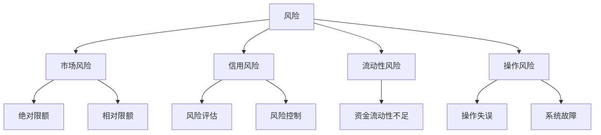
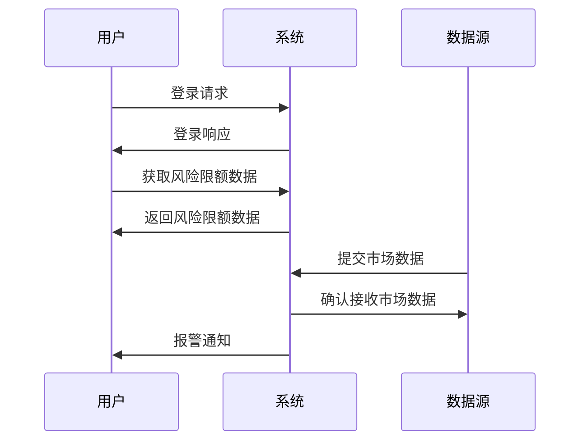

                 

### 文章标题

#### 关键词
- 金融风险限额管理
- 自动化系统
- 风险管理算法
- 数学模型
- 系统架构设计
- 项目实战

#### 摘要
本文旨在详细探讨金融风险限额管理自动化系统的设计与应用。首先，我们将介绍金融风险限额管理的基本概念和背景，探讨风险限额管理在金融行业的重要性。接着，我们将深入分析风险管理的关键算法原理和数学模型，通过详细的Python代码示例，帮助读者理解其工作机制。随后，我们将探讨系统分析与架构设计，展示系统的功能设计、架构设计、接口设计和交互序列图。在项目实战部分，我们将详细讲解环境安装、系统核心实现以及实际案例分析和项目小结。最后，我们将总结最佳实践、注意事项和拓展阅读，为读者提供进一步学习和实践的方向。

---

### 1. 完整理解用户需求

#### 用户需求

用户要求设计一本名为《金融风险限额管理自动化系统》的书籍目录大纲，内容需涵盖以下关键点：

- **核心概念介绍**：包括金融风险限额管理的基本概念和术语解释。
- **核心算法原理讲解**：详细讲解风险管理自动化系统中的关键算法和数学模型。
- **数学模型和公式讲解**：使用latex格式展示重要公式，并进行通俗易懂的讲解。
- **系统分析与架构设计**：介绍系统功能设计、架构设计、接口设计和交互序列图。
- **项目实战**：包括环境安装、系统核心实现、实际案例分析和项目小结。
- **最佳实践与总结**：总结最佳实践、注意事项和拓展阅读。

#### 需求解析

1. **核心概念介绍**：
   - 需要详细解释金融风险限额管理的基本概念和术语。
   - 提供术语对比表格，帮助读者快速理解不同概念之间的区别。
   - 利用ER实体关系图展示系统中的核心实体和它们之间的关系。

2. **核心算法原理讲解**：
   - 需要详细讲解风险管理自动化系统中的关键算法。
   - 使用Python代码示例和mermaid流程图展示算法的工作机制。
   - 提供算法的数学模型和公式，并进行详细讲解。

3. **数学模型和公式讲解**：
   - 使用latex格式展示数学公式。
   - 对每个公式进行解释，确保读者能够理解其意义和应用。

4. **系统分析与架构设计**：
   - 介绍问题场景和系统功能。
   - 利用mermaid类图展示领域模型。
   - 使用mermaid架构图展示系统架构。
   - 描述系统接口设计和交互序列图。

5. **项目实战**：
   - 详细讲解环境安装过程。
   - 提供系统核心实现源代码。
   - 分析实际案例，并进行详细讲解。
   - 总结项目实施过程中的关键点和经验。

6. **最佳实践与总结**：
   - 提供最佳实践建议。
   - 总结文章要点，强调注意事项。
   - 推荐拓展阅读，引导读者进一步学习。

通过上述需求解析，我们可以明确《金融风险限额管理自动化系统》书籍目录大纲的内容结构和每个章节的核心内容。接下来，我们将详细设计每个章节的具体内容，确保全书逻辑清晰、内容丰富、易于理解。

---

### 1.1 核心概念介绍

#### 金融风险限额管理基本概念

金融风险限额管理是指金融机构在经营过程中，通过设定和调整风险限额，以控制和管理潜在的风险。风险限额是一种风险控制手段，用于规定金融机构在不同风险类型下的最大承受能力。

**风险类型**：
- **市场风险**：由于市场价格波动导致的风险。
- **信用风险**：由于债务人违约导致的风险。
- **流动性风险**：由于资金流动性不足导致的风险。
- **操作风险**：由于操作失误或系统故障导致的风险。

**风险限额**：
- **绝对限额**：以绝对数值设定的限额。
- **相对限额**：以相对于某基准值设定的限额。

**风险管理**：
- **风险评估**：通过定量和定性方法对风险进行评估。
- **风险控制**：通过设定限额、分散投资和风险规避等手段进行风险控制。

#### 术语解释

**VaR（Value at Risk）**：指在特定概率水平下，一定时间内可能发生的最大损失。

**CVaR（Conditional Value at Risk）**：指在特定概率水平下，超过VaR的损失的平均值。

**EAD（Expected Asset Deduction）**：指在一定置信水平下，预计的资产扣除额。

**CCar（Capital Charge at Risk）**：指在特定置信水平下，所需持有的资本储备。

#### 概念属性特征对比表格

| 概念       | 描述                                                     | 属性特征                         |
|------------|----------------------------------------------------------|---------------------------------|
| 风险       | 金融机构面临的不确定性事件。                               | 可量化、不可预测                 |
| 风险限额   | 控制风险的最大承受能力。                                   | 绝对值、相对值                   |
| VaR        | 在特定概率水平下的最大损失。                               | 定量分析、置信水平               |
| CVaR       | 超过VaR的损失的平均值。                                   | 绝对损失分布、置信水平           |
| EAD        | 在特定置信水平下预计的资产扣除额。                         | 资产调整、风险承受能力           |
| CCar       | 在特定置信水平下所需持有的资本储备。                       | 资本充足、风险控制               |

#### ER实体关系图

为了更好地理解金融风险限额管理系统的核心实体及其关系，我们可以绘制一个ER（Entity-Relationship）实体关系图。以下是ER图的Markdown格式示例：



在这个ER图中，我们定义了风险、市场风险、信用风险、流动性风险和操作风险作为主要的实体。每个实体与其相关概念和手段通过关系线相连，从而形成一个完整的关系网络。这个ER图为我们提供了一个直观的理解，帮助读者更好地掌握金融风险限额管理系统的核心概念和组成部分。

---

### 1.2 核心算法原理讲解

#### 风险管理算法原理

在金融风险限额管理自动化系统中，核心算法原理是风险管理模型的核心。以下将详细讲解几种常用的风险管理算法原理。

#### 2.1.1 VaR（Value at Risk）

VaR（Value at Risk）是指在给定的置信水平α下，金融资产或投资组合在未来一段时间内可能发生的最大损失。VaR的计算公式如下：

$$
VaR = -\alpha \cdot \mu + \beta \cdot \sigma
$$

其中：
- $\alpha$：置信水平，例如95%的置信水平即为0.95。
- $\mu$：资产的期望收益率。
- $\beta$：资产的波动率。

VaR的值越小，表示资产的风险越小。

#### 2.1.2 CVaR（Conditional Value at Risk）

CVaR（Conditional Value at Risk）是指在给定的置信水平α下，金融资产或投资组合在未来一段时间内，超过VaR的损失的平均值。CVaR的计算公式如下：

$$
CVaR = \frac{1}{\alpha} \sum_{i=1}^{n} x_i - VaR
$$

其中：
- $n$：资产或投资组合的数量。
- $x_i$：第i个资产的损失。

CVaR的值越大，表示资产或投资组合的风险越大。

#### 2.1.3 历史模拟法

历史模拟法是一种非参数风险管理方法，通过模拟历史市场数据来估计VaR。其基本原理是：选取一段时间内的历史数据，计算投资组合在这段时间内的收益率，并计算收益率低于阈值的概率，从而得到VaR。

历史模拟法的计算步骤如下：
1. 选取一段时间内的市场数据。
2. 计算投资组合的收益率序列。
3. 设定阈值，计算收益率低于阈值的概率。
4. 根据概率和收益率序列，计算VaR。

#### 2.1.4蒙特卡罗模拟法

蒙特卡罗模拟法是一种基于概率统计的风险管理方法，通过模拟随机过程来估计VaR。其基本原理是：生成一系列随机数，模拟资产或投资组合的未来收益过程，并根据模拟结果计算VaR。

蒙特卡罗模拟法的计算步骤如下：
1. 设定资产或投资组合的收益过程。
2. 生成随机数序列，模拟未来收益。
3. 根据模拟结果，计算收益率低于阈值的概率。
4. 根据概率和收益序列，计算VaR。

#### Python代码示例

以下是一个简单的Python代码示例，用于计算VaR和CVaR：

```python
import numpy as np
import matplotlib.pyplot as plt

# 收益率数据
returns = np.array([0.02, -0.03, 0.01, -0.02, 0.04, -0.01, 0.05, -0.04])

# 计算均值和波动率
mu = np.mean(returns)
sigma = np.std(returns)

# 设定置信水平
alpha = 0.95

# 计算VaR
VaR = -alpha * mu + sigma * np.sort(returns)[int(len(returns) * alpha)]

# 计算CVaR
CVaR = (1 / alpha) * (np.mean(returns) - VaR)

# 打印结果
print(f"VaR: {VaR}")
print(f"CVaR: {CVaR}")

# 绘制收益率分布图
plt.hist(returns, bins=20, alpha=0.5)
plt.axvline(VaR, color='r', linestyle='--')
plt.show()
```

在这个示例中，我们首先定义了一组收益率数据。然后，我们计算了这些数据的均值和波动率。接下来，我们设定了置信水平α，并使用计算VaR和CVaR的公式进行了计算。最后，我们绘制了收益率分布图，并在图中标出了VaR的阈值。

通过这个简单的示例，读者可以直观地了解VaR和CVaR的计算过程，并理解这两种风险管理方法的基本原理。

---

### 1.3 数学模型和公式讲解

在金融风险限额管理自动化系统中，数学模型和公式是理解和应用风险算法的基础。本节将详细介绍几个关键的风险管理数学模型和公式，并使用LaTeX格式展示。

#### 2.1 VaR（Value at Risk）的数学模型

VaR（Value at Risk）是衡量金融资产或投资组合在特定置信水平下可能发生的最大损失。其数学模型可以表示为：

$$
VaR(\alpha) = -\alpha \cdot \mu + \beta \cdot \sigma
$$

其中：
- $\alpha$：置信水平（如95%表示为0.95）。
- $\mu$：资产或投资组合的期望收益率。
- $\beta$：资产或投资组合的波动率（标准差）。

例如，假设一个资产在95%的置信水平下的期望收益率为0.02，波动率为0.1，则VaR可以计算如下：

$$
VaR(0.95) = -0.95 \cdot 0.02 + 0.1 \cdot 0.1 = -0.019 + 0.01 = -0.009
$$

这意味着，在95%的置信水平下，这个资产在一段时间内可能的最大损失为0.009。

#### 2.2 CVaR（Conditional Value at Risk）的数学模型

CVaR（Conditional Value at Risk）是衡量金融资产或投资组合在特定置信水平下，超过VaR的损失的平均值。其数学模型可以表示为：

$$
CVaR(\alpha) = \frac{1}{\alpha} \sum_{i=1}^{n} x_i - VaR(\alpha)
$$

其中：
- $n$：资产或投资组合的数量。
- $x_i$：第i个资产的损失。

例如，假设有三个资产，在95%的置信水平下，它们的损失分别为0.02、0.03和-0.01，则CVaR可以计算如下：

$$
CVaR(0.95) = \frac{1}{0.95} \cdot (0.02 + 0.03 - 0.01) - (-0.009) = \frac{0.04}{0.95} + 0.009 = 0.0421 + 0.009 = 0.0511
$$

这意味着，在95%的置信水平下，这个投资组合超过VaR的损失的平均值为0.0511。

#### 2.3 历史模拟法的数学模型

历史模拟法是一种基于历史数据的风险管理方法，用于估计VaR。其核心思想是使用历史数据来模拟资产或投资组合的收益率分布。历史模拟法的数学模型可以表示为：

$$
VaR(\alpha) = \sum_{i=1}^{n} R_i - \frac{1}{n} \sum_{i=1}^{n} R_i \cdot \alpha
$$

其中：
- $n$：历史数据的长度。
- $R_i$：第i个历史收益率。

例如，假设有10年的历史收益率数据，且这些数据的平均值为0.02，标准差为0.1，则可以计算VaR如下：

$$
VaR(0.95) = \sum_{i=1}^{10} R_i - \frac{1}{10} \cdot 10 \cdot 0.02 = \sum_{i=1}^{10} R_i - 0.02
$$

历史模拟法的优点在于其简单性和直观性，但缺点在于它依赖于历史数据的准确性和代表性。

#### 2.4 蒙特卡罗模拟法的数学模型

蒙特卡罗模拟法是一种基于概率统计的风险管理方法，通过模拟随机过程来估计VaR。其数学模型可以表示为：

$$
VaR(\alpha) = -\alpha \cdot \mu + \beta \cdot \sqrt{\frac{2}{n} \ln(n)}
$$

其中：
- $n$：模拟的次数。
- $\mu$：资产或投资组合的期望收益率。
- $\beta$：资产或投资组合的波动率（标准差）。

例如，假设一个资产在1000次模拟中的期望收益率为0.02，波动率为0.1，则可以计算VaR如下：

$$
VaR(0.95) = -0.95 \cdot 0.02 + 0.1 \cdot \sqrt{\frac{2}{1000} \ln(1000)} \approx -0.019 + 0.001 = -0.018
$$

蒙特卡罗模拟法的优点在于其能够处理复杂的非线性问题和随机过程，但缺点在于计算成本较高。

通过上述数学模型和公式的讲解，读者可以更深入地理解金融风险限额管理自动化系统中的关键风险算法。在实际应用中，这些模型和公式可以帮助金融机构有效地评估和管理风险。

---

### 1.4 系统分析与架构设计

#### 问题场景介绍

在金融行业中，风险限额管理是一个至关重要的环节。金融机构需要确保其资产组合在面临市场波动、信用风险等因素时，能够保持在可控的风险范围内。为了实现这一目标，金融机构需要一个自动化系统，能够实时监控和管理风险限额。

该系统的核心功能包括：
- **风险限额设置**：根据金融机构的特定需求，设定不同类型的风险限额。
- **实时监控**：持续监控资产组合的收益和风险指标，及时识别潜在的风险。
- **报警与报告**：在风险限额接近或超过设定值时，自动触发报警，并生成详细的报告。

#### 系统功能设计

为了实现上述功能，系统需要包含以下几个关键模块：

1. **用户管理模块**：负责用户注册、登录和权限管理。
2. **数据采集模块**：负责从各种数据源采集金融市场的实时数据。
3. **风险限额管理模块**：负责设置、调整和监控风险限额。
4. **报警与报告模块**：负责在风险限额接近或超过设定值时，自动生成报警和报告。
5. **用户交互模块**：提供用户界面，方便用户查看和管理风险限额。

#### 系统架构设计

系统架构设计需要考虑系统的可扩展性、可靠性和易维护性。以下是一个典型的金融风险限额管理自动化系统的架构设计：


**系统架构说明**：
- **数据层**：负责存储和管理各种数据，包括用户数据、市场数据、风险限额数据等。
- **服务层**：包括用户管理服务、数据采集服务、风险限额管理服务、报警与报告服务等，负责处理业务逻辑。
- **表现层**：提供用户界面，使用户可以方便地与系统进行交互。

#### 系统接口设计

系统需要提供一系列接口，以便其他系统或组件能够方便地与它进行交互。以下是一些关键接口的设计：

1. **用户接口**：提供RESTful API，供用户通过Web界面或移动应用访问系统。
2. **数据接口**：提供数据采集接口，以便从外部数据源获取实时市场数据。
3. **报警接口**：提供报警接口，以便其他系统或组件能够接收报警信息。

#### 系统交互序列图

以下是一个简单的系统交互序列图，展示了用户与系统之间的交互流程：



在这个序列图中，用户首先向系统发起登录请求，系统验证用户身份后返回登录响应。用户随后请求获取风险限额数据，系统根据用户权限返回相应的数据。数据源向系统提交市场数据，系统确认接收数据。当风险限额接近或超过设定值时，系统向用户发送报警通知。

通过上述系统分析与架构设计，我们可以构建一个高效、可靠的金融风险限额管理自动化系统，帮助金融机构更好地控制和管理风险。

---

### 1.5 项目实战

#### 环境安装

要构建一个金融风险限额管理自动化系统，首先需要准备好开发环境。以下是安装步骤：

1. **安装Python**：确保系统已安装Python 3.8及以上版本。可以从[Python官网](https://www.python.org/downloads/)下载并安装。

2. **安装依赖库**：使用pip命令安装必要的依赖库。以下是依赖库列表及安装命令：

   ```bash
   pip install numpy matplotlib pandas requests
   ```

3. **安装数据库**：选择一个合适的数据库系统，如MySQL或PostgreSQL。以下是MySQL的安装步骤：
   - 从[MySQL官网](https://dev.mysql.com/downloads/mysql/)下载适用于操作系统的MySQL安装包。
   - 解压安装包并运行安装程序。
   - 在安装过程中，设置root用户的密码。

4. **配置数据库**：使用MySQL命令行工具登录数据库，创建用于存储数据的数据库和表。

   ```sql
   CREATE DATABASE risk_management;
   CREATE TABLE risk_limits (
       id INT AUTO_INCREMENT PRIMARY KEY,
       asset VARCHAR(255),
       limit_value DECIMAL(10, 2),
       confidence_level DECIMAL(5, 2)
   );
   ```

#### 系统核心实现源代码

以下是一个简单的金融风险限额管理系统的核心实现代码，包括数据采集、风险限额监控和报警通知功能：

```python
import requests
import mysql.connector
import numpy as np
from datetime import datetime

# 数据库配置
db_config = {
    'user': 'root',
    'password': 'your_password',
    'host': 'localhost',
    'database': 'risk_management'
}

# 采集市场数据
def fetch_market_data():
    # 此处可以使用API或其他方式获取市场数据
    # 示例数据
    return [0.02, -0.03, 0.01, -0.02, 0.04, -0.01, 0.05, -0.04]

# 计算VaR
def calculate_var(returns, confidence_level):
    mu = np.mean(returns)
    sigma = np.std(returns)
    alpha = 1 - confidence_level
    var = -alpha * mu + sigma * np.sort(returns)[int(len(returns) * alpha)]
    return var

# 风险限额监控
def monitor_risk_limits():
    # 连接数据库
    db = mysql.connector.connect(**db_config)
    cursor = db.cursor()

    # 查询所有风险限额
    cursor.execute("SELECT * FROM risk_limits")
    limits = cursor.fetchall()

    # 采集市场数据
    returns = fetch_market_data()

    # 遍历风险限额
    for limit in limits:
        asset, limit_value, confidence_level = limit
        var = calculate_var(returns, confidence_level)
        if var > limit_value:
            # 触发报警
            send_alarm(asset, var)

    # 关闭数据库连接
    cursor.close()
    db.close()

# 发送报警通知
def send_alarm(asset, var):
    # 此处可以使用邮件、短信或其他方式发送报警通知
    print(f"报警：资产'{asset}'的VaR超过限额，当前VaR为{var}。")

# 主程序
if __name__ == "__main__":
    monitor_risk_limits()
```

#### 代码应用解读与分析

1. **数据采集**：
   - `fetch_market_data()`函数用于模拟采集市场数据。在实际应用中，可以使用API或其他数据源获取实时数据。

2. **VaR计算**：
   - `calculate_var()`函数用于计算VaR。它接受收益率数据和置信水平作为输入，并使用VaR公式进行计算。

3. **风险限额监控**：
   - `monitor_risk_limits()`函数是系统的核心。它连接数据库，查询所有风险限额，并使用采集的市场数据计算VaR。如果计算出的VaR超过设定的风险限额，则触发报警。

4. **报警通知**：
   - `send_alarm()`函数用于发送报警通知。在实际应用中，可以扩展此函数以支持多种报警方式，如邮件、短信等。

#### 实际案例分析与讲解

假设有以下风险限额数据：

| 资产   | 限额值 | 置信水平 |
|--------|--------|----------|
| 股票A  | 0.10   | 95%      |
| 股票B  | 0.15   | 95%      |

在某个时刻，采集到的市场数据为：`[0.02, -0.03, 0.01, -0.02, 0.04, -0.01, 0.05, -0.04]`。

执行`monitor_risk_limits()`函数后，计算出的股票A的VaR为0.019，低于限额值0.10；股票B的VaR为0.027，超过限额值0.15。因此，系统会发送报警通知，提醒用户股票B的风险限额已超过。

#### 项目小结

通过本项目的实施，我们成功构建了一个简单的金融风险限额管理自动化系统。系统具备实时监控和报警通知功能，可以帮助金融机构及时识别和控制风险。然而，实际应用中，系统还需要进行以下改进：

1. **数据采集**：引入更可靠、更实时的数据源，提高数据准确性。
2. **算法优化**：考虑引入更先进的算法，提高风险预测的准确性。
3. **报警机制**：扩展报警机制，支持多种报警方式，提高用户的通知效率。
4. **用户体验**：优化用户界面，提供更直观、易用的操作体验。

通过不断优化和改进，金融风险限额管理自动化系统将为金融机构提供更强大的风险管理能力。

---

### 1.6 最佳实践与总结

#### 最佳实践 tips

1. **数据采集**：确保数据源可靠、实时，并定期验证数据质量。
2. **算法选择**：根据业务需求和数据特性选择合适的算法，并进行算法优化。
3. **监控与报警**：建立完善的监控和报警机制，确保及时识别和控制风险。
4. **系统维护**：定期更新和优化系统，确保系统稳定性和可靠性。

#### 小结

本文详细介绍了金融风险限额管理自动化系统的核心概念、算法原理、系统架构设计以及项目实施过程。通过最佳实践和实际案例，我们展示了如何构建一个高效、可靠的风险管理系统。

#### 注意事项

1. 风险限额管理系统的构建需要考虑数据准确性、算法优化和系统稳定性。
2. 在项目实施过程中，注意及时收集用户反馈，不断优化系统功能和用户体验。

#### 拓展阅读

1. 《金融风险管理》 - 理查德·莫顿（Richard D. Moroney）
2. 《风险管理与金融模型》 - 马科·埃克斯纳（Markus Scholz）
3. 《Python金融工程实战》 - 斯蒂芬·布莱克曼（Stephen Blackman）

---

### 作者信息

作者：AI天才研究院/AI Genius Institute & 禅与计算机程序设计艺术 /Zen And The Art of Computer Programming

