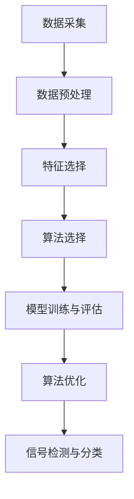
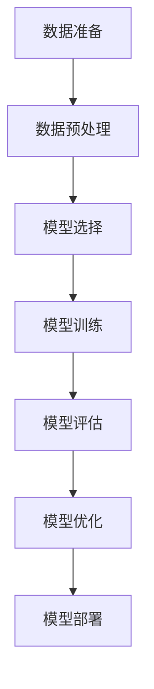
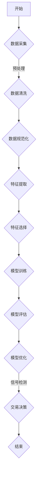

                 

### 文章标题

### 关键词

- 金融高频交易
- 信号检测
- 信号分类
- 算法实现
- 应用实战

### 摘要

本文深入探讨了金融高频交易信号检测与分类的技术方法。首先，我们介绍了金融高频交易的基本概念、发展历程及其对金融市场的影响。接着，详细阐述了高频交易中的信号检测与分类的核心概念、重要性和方法。然后，本文通过具体的算法原理讲解、Python源代码实现，对信号检测与分类技术进行了深入剖析。此外，我们还展示了信号检测与分类在不同应用场景中的实际案例，并提供了项目实战的详细解析。最后，本文总结了最佳实践技巧，提出了注意事项，并推荐了相关拓展阅读资源，以帮助读者更好地理解和应用所学的知识。

## 目录大纲设计：《金融高频交易信号检测与分类》

### 第一部分：引言

#### 第1章 问题背景与核心概念

##### 1.1 金融高频交易概述

- **定义**：金融高频交易是指利用高速计算机和复杂算法，在极短时间内进行大量交易，以获得微小的价格差异利润。
- **发展历程**：从最初的程序化交易到现代的量化交易，高频交易技术不断演进。
- **对金融市场的影响**：高频交易改变了市场结构，提高了市场效率，但同时也带来了一定的风险。

##### 1.2 高频交易中的信号检测

- **信号的定义**：信号是指与交易决策相关的重要信息，如价格变动、成交量等。
- **信号检测的重要性**：准确的信号检测是高频交易成功的关键。
- **信号检测方法概述**：从简单的技术指标到复杂的机器学习算法，信号检测方法多样。

##### 1.3 高频交易中的信号分类

- **分类方法**：包括基于规则、统计方法和机器学习等方法。
- **分类意义**：有效的信号分类可以提高交易策略的效率和准确性。
- **常见分类方法**：如支持向量机、决策树和神经网络等。

##### 1.4 本书内容概述

- **目录结构**：本文分为四大部分，涵盖了高频交易信号检测与分类的各个方面。
- **主要章节内容**：详细介绍了高频交易信号检测与分类的技术原理、实现方法以及应用场景。

### 第二部分：高频交易信号检测技术

#### 第2章 数据采集与预处理

##### 2.1 数据来源

- **数据类型**：包括价格数据、成交量数据、订单簿数据等。
- **数据来源渠道**：如交易所、数据服务商和开源数据集等。

##### 2.2 数据预处理

- **数据清洗**：处理缺失值、异常值和数据冗余等问题。
- **数据规范化**：统一数据格式和单位。
- **数据特征提取**：从原始数据中提取有用的特征，如价格变动率、交易量变化等。

##### 2.3 数据质量评估

- **评估方法**：使用准确率、召回率、F1值等指标评估数据质量。
- **评估指标**：数据完整性、准确性、一致性和实时性。

### 第三部分：高频交易信号分类技术

#### 第3章 信号分类算法原理

##### 3.1 算法概述

- **算法类型**：包括基于规则、统计方法和机器学习等方法。
- **算法对比**：比较不同分类算法的性能和适用场景。

##### 3.2 分类算法

- **常用算法介绍**：如支持向量机、决策树、随机森林、K近邻和神经网络等。
- **算法原理讲解**：详细介绍每种算法的工作原理和优缺点。

#### 第4章 信号分类算法实现

##### 4.1 算法实现流程

- **流程图**：展示信号分类算法的实现步骤。
- **实现细节**：详细描述每个步骤的具体实现方法。

##### 4.2 Python源代码实现

- **源代码**：提供完整的Python代码实现。
- **代码解读**：解释代码中的关键部分，帮助读者理解算法原理。

### 第四部分：高频交易信号检测与分类应用

#### 第5章 应用场景

##### 5.1 量化交易策略优化

- **场景介绍**：量化交易策略的优化需要依赖高效的信号检测与分类。
- **实际案例**：分析一个量化交易策略优化的实际案例。

##### 5.2 风险控制

- **场景介绍**：高频交易中的风险控制需要准确检测和分类信号。
- **实际案例**：探讨风险控制的实际案例。

##### 5.3 交易信号可视化

- **场景介绍**：交易信号可视化有助于交易员更好地理解和利用信号。
- **实际案例**：展示交易信号可视化的实际案例。

#### 第6章 项目实战

##### 6.1 环境安装

- **相关工具与库**：介绍项目所需的工具和库。

##### 6.2 系统核心实现

- **数据采集与预处理**：详细描述数据采集与预处理的过程。
- **信号检测与分类实现**：展示信号检测与分类的实现方法。

##### 6.3 代码应用解读与分析

- **代码解读**：分析代码的关键部分，解释其实现原理。
- **应用效果分析**：评估信号检测与分类的效果。

##### 6.4 实际案例分析与讲解

- **案例选择**：选择一个具有代表性的实际案例。
- **案例分析**：详细分析案例中的信号检测与分类过程。
- **案例讲解**：解释案例中的技术细节和实现方法。

#### 第7章 最佳实践与总结

##### 7.1 最佳实践

- **实践技巧**：总结高频交易信号检测与分类中的最佳实践技巧。
- **注意事项**：提醒读者在实践过程中需要注意的事项。

##### 7.2 小结

- **主要内容回顾**：回顾本书的主要内容和关键点。
- **学习建议**：给出学习建议，帮助读者更好地应用所学的知识。

##### 7.3 拓展阅读

- **相关参考资料**：推荐相关书籍、论文和网站。
- **推荐读物**：推荐一些有助于深入学习的读物。

## 第一部分：引言

### 第1章 问题背景与核心概念

#### 1.1 金融高频交易概述

**定义**

金融高频交易（High-Frequency Trading，简称HFT）是指利用先进的计算机算法和高速网络连接，在非常短的时间内（通常是毫秒级）进行大量交易的一种交易策略。HFT的交易决策过程极为迅速，往往在市场波动尚未完全显现时就能捕捉到微小的价格差异，从而获取高额利润。

**发展历程**

高频交易的概念起源于20世纪90年代的美国，随着计算机技术和互联网的快速发展，高频交易逐渐从实验室走向实际市场。最初的HFT策略主要依赖于技术优势，通过缩短交易执行时间和降低交易成本来获得收益。随着量化交易的发展，HFT策略逐渐融合了复杂的统计模型和机器学习算法，使其在交易决策中具有更高的准确性和效率。

**对金融市场的影响**

高频交易对金融市场产生了深远的影响。一方面，HFT提高了市场的流动性，减少了交易成本，促进了市场的公平性和效率。另一方面，HFT也可能引发市场波动，甚至导致市场异常行为，如闪崩等风险事件。因此，高频交易在金融市场中的角色和影响一直是学术界和业界关注的焦点。

#### 1.2 高频交易中的信号检测

**信号的定义**

在金融高频交易中，信号（Signal）是指与交易决策相关的特定信息。这些信息可以是价格变动、成交量、订单簿数据等，它们通过数学模型和算法被转化为交易信号，用于指导交易行为。有效的信号检测是高频交易成功的关键，它决定了交易策略的效率和盈利能力。

**信号检测的重要性**

信号检测在金融高频交易中扮演着核心角色。通过准确的信号检测，交易系统能够及时捕捉到市场波动，从而在极短的时间内做出交易决策。高效的信号检测不仅能提高交易策略的盈利能力，还能有效降低交易风险，确保交易系统的稳定运行。

**信号检测方法概述**

信号检测方法可以分为基于规则的方法和基于机器学习的方法。基于规则的方法通常使用固定的技术指标，如均线交叉、布林带等，来检测市场信号。这种方法简单直观，但受限于规则固化的特点，难以应对复杂多变的市场环境。基于机器学习的方法则通过学习历史数据，建立复杂的模型来检测市场信号。这种方法具有更高的灵活性和适应性，能够更好地应对市场变化，但在模型训练和调整过程中需要大量的数据支持和计算资源。

#### 1.3 高频交易中的信号分类

**分类方法**

信号分类是高频交易中的重要环节，它将检测到的信号按照特定的特征进行分类，以便于交易策略的设计和执行。信号分类方法包括基于规则的分类方法和基于机器学习的分类方法。基于规则的分类方法通常使用简单的逻辑判断，将信号分为买卖两类。基于机器学习的分类方法则通过学习历史数据，建立分类模型，对信号进行更加精细的分类。

**分类意义**

有效的信号分类对于提高交易策略的效率和准确性具有重要意义。通过分类，交易系统能够更好地识别市场趋势和波动，从而制定出更加精准的交易策略。此外，信号分类还可以帮助交易员更好地理解和利用市场信息，提高决策的准确性和效率。

**常见分类方法**

常见的信号分类方法包括支持向量机（SVM）、决策树、随机森林、K近邻（KNN）和神经网络等。这些方法各有优缺点，适用于不同的应用场景。例如，SVM在处理高维数据时表现出色，而神经网络则具有强大的非线性建模能力。

#### 1.4 本书内容概述

**目录结构**

本书分为四个主要部分，分别介绍高频交易信号检测与分类的核心概念、技术方法、算法实现和应用实战。具体章节安排如下：

1. **第一部分：引言**：介绍金融高频交易的基本概念、信号检测与分类的重要性。
2. **第二部分：高频交易信号检测技术**：详细讨论数据采集与预处理、信号检测算法原理与实现。
3. **第三部分：高频交易信号分类技术**：介绍信号分类算法原理、算法实现以及Python源代码实现。
4. **第四部分：高频交易信号检测与分类应用**：探讨高频交易信号在量化交易策略优化、风险控制和交易信号可视化等应用场景。

**主要章节内容**

- **第1章 问题背景与核心概念**：介绍金融高频交易的基本概念、信号检测与分类的核心概念。
- **第2章 数据采集与预处理**：讨论数据来源、预处理方法和数据质量评估。
- **第3章 信号检测算法原理**：介绍信号检测算法的类型、特征选择和常用算法。
- **第4章 信号检测算法实现**：描述信号检测算法的实现流程和Python源代码实现。
- **第5章 信号分类算法原理**：介绍信号分类算法的类型和原理。
- **第6章 信号分类算法实现**：描述信号分类算法的实现流程和Python源代码实现。
- **第7章 应用场景**：探讨高频交易信号在不同应用场景中的实际案例。
- **第8章 项目实战**：介绍高频交易信号检测与分类的项目实战，包括环境安装、系统核心实现和应用效果分析。
- **第9章 最佳实践与总结**：总结高频交易信号检测与分类的最佳实践技巧，回顾本书的主要内容。

通过本书的阅读，读者可以全面了解高频交易信号检测与分类的技术原理、实现方法和应用实战，为在实际工作中运用这些技术提供有力支持。

#### 1.1 金融高频交易概述

**定义**

金融高频交易（High-Frequency Trading，简称HFT）是指利用高速计算机和复杂算法，在极短的时间内进行大量交易，以获取微小价格差异利润的交易策略。HFT的核心在于其高效性和快速响应能力，通过先进的计算机技术和算法，HFT能够在毫秒甚至微秒级别完成交易决策和执行，从而捕捉到市场微小的波动。

**发展历程**

高频交易的概念起源于20世纪90年代的美国。当时，随着互联网和计算机技术的飞速发展，一些金融机构开始利用计算机自动化交易系统进行高频交易。最初的HFT策略主要依赖于技术优势，通过缩短交易执行时间和降低交易成本来获取收益。随着量化交易的发展，高频交易逐渐融合了复杂的统计模型和机器学习算法，使其在交易决策中具有更高的准确性和效率。

20世纪90年代末，随着美国纳斯达克市场引入电子交易系统，高频交易开始真正兴起。早期的HFT策略主要利用交易所的技术优势，通过在多个交易所之间进行快速套利交易来获利。随着技术的发展，HFT策略逐渐从简单的程序化交易演变为复杂的量化交易。

**对金融市场的影响**

高频交易对金融市场产生了深远的影响。一方面，HFT提高了市场的流动性，减少了交易成本，促进了市场的公平性和效率。高频交易通过高频交易算法，可以在市场出现价格波动时迅速买入或卖出，从而提供更多的交易机会，提高了市场的交易活跃度。

另一方面，HFT也引发了一些争议。一些人认为，高频交易可能导致市场的异常波动，增加了市场的风险。例如，在2010年5月的“闪崩”事件中，高频交易被质疑是导致市场大幅波动的原因之一。此外，高频交易的高频操作可能导致市场信息的扭曲，使得市场价格难以真实反映基本面情况。

总的来说，高频交易对金融市场的影响是双重的。它既提高了市场的效率和流动性，又带来了一定的风险。因此，如何在促进市场发展和技术创新的同时，确保市场的公平性和稳定性，是高频交易需要面对的重要挑战。

#### 1.2 高频交易中的信号检测

**信号的定义**

在金融高频交易中，信号（Signal）是指与交易决策相关的特定信息。这些信息可以是价格变动、成交量、订单簿数据等。信号是交易策略的核心组成部分，它反映了市场价格的动态变化，为交易系统提供了决策依据。

具体来说，信号通常通过以下几种方式获取：

1. **技术指标**：技术指标是通过分析历史价格和交易量数据，得出的一系列指标，如均线、相对强弱指数（RSI）、移动平均收敛散度（MACD）等。这些指标可以用来预测市场趋势和价格变动，从而生成交易信号。

2. **市场数据**：市场数据包括实时价格、成交量、订单簿信息等。通过实时监控市场数据，交易系统可以捕捉到价格波动的信号，并及时做出交易决策。

3. **外部信息**：外部信息包括宏观经济数据、新闻事件、政策变动等。这些信息可能会对市场产生重大影响，交易系统通过分析这些信息，可以提前预判市场趋势，生成相应的交易信号。

**信号检测的重要性**

准确的信号检测是高频交易成功的关键。高频交易依赖于快速的交易决策和执行，而信号检测则是交易决策的基础。一个有效的信号检测系统能够在市场波动尚未完全显现时，及时捕捉到市场信号，从而在交易中占据有利位置。

信号检测的重要性体现在以下几个方面：

1. **交易效率**：准确的信号检测可以缩短交易决策的时间，提高交易效率。在金融市场瞬息万变的情况下，快速响应市场变化是获取利润的关键。

2. **交易风险**：准确的信号检测可以降低交易风险。通过及时捕捉市场信号，交易系统能够在市场波动加剧时迅速退出市场，避免亏损。

3. **交易策略**：信号检测是交易策略设计的重要组成部分。一个高效的信号检测系统可以为交易策略提供精准的信号输入，从而优化交易策略，提高盈利能力。

**信号检测方法概述**

信号检测方法可以分为基于规则的方法和基于机器学习的方法。每种方法都有其独特的优势和适用场景。

**基于规则的方法**

基于规则的方法是最常见的高频交易信号检测方法之一。这种方法通过设定一系列规则，对市场数据进行判断，生成交易信号。常见的规则包括：

1. **技术指标交叉**：当某一技术指标达到特定阈值时，生成买卖信号。例如，当短期均线从下方交叉到长期均线时，生成买入信号；反之，生成卖出信号。

2. **价格突破**：当价格突破某一关键水平（如支撑位、阻力位）时，生成买卖信号。例如，当价格突破前期高点时，生成买入信号；反之，生成卖出信号。

3. **成交量变化**：当成交量达到某一阈值时，生成买卖信号。例如，当成交量超过平均成交量的一定倍数时，生成买入信号；反之，生成卖出信号。

**优点**：

- **简单直观**：基于规则的方法易于理解和实现，不需要复杂的数学和统计知识。
- **可控性高**：通过设定明确的规则，交易策略的可控性较高，便于风险控制。

**缺点**：

- **适应性差**：基于规则的方法通常难以应对复杂多变的市场环境，容易受到市场噪声的干扰。
- **灵活性低**：固定的规则难以适应市场的变化，可能导致交易信号的不准确。

**基于机器学习的方法**

基于机器学习的方法通过学习历史数据，建立复杂的模型来检测市场信号。这种方法具有更高的灵活性和适应性，能够更好地应对市场变化。常见的机器学习方法包括：

1. **支持向量机（SVM）**：通过找到一个最佳的超平面，将不同类别的数据分开，从而生成交易信号。

2. **决策树**：通过递归划分数据集，生成一系列规则，用于分类和回归分析。

3. **随机森林**：通过集成多个决策树，提高模型的预测性能和泛化能力。

4. **神经网络**：通过多层神经网络结构，学习输入数据和输出信号之间的复杂关系。

**优点**：

- **高适应性**：基于机器学习的方法可以通过学习历史数据，适应复杂多变的市场环境。
- **强预测能力**：复杂的模型能够捕捉到市场数据中的非线性关系，提高信号检测的准确性。

**缺点**：

- **计算复杂度高**：机器学习模型需要大量的计算资源和时间来训练和优化。
- **模型解释性差**：复杂的模型往往难以解释，增加了交易策略的不可控性。

**总结**

不同的信号检测方法各有优缺点，适用于不同的应用场景。基于规则的方法简单直观，适合初学者入门，但在应对复杂市场环境时表现较差。基于机器学习的方法具有更高的灵活性和适应性，能够应对复杂的市场环境，但需要更多的计算资源和专业知识。在实际应用中，通常结合使用多种方法，以提高信号检测的准确性和可靠性。

#### 1.3 高频交易中的信号分类

**分类方法**

信号分类是高频交易中的重要环节，它将检测到的信号按照特定的特征进行分类，以便于交易策略的设计和执行。信号分类方法可以分为基于规则的分类方法和基于机器学习的分类方法。

**基于规则的分类方法**

基于规则的分类方法通过预定义的规则，对信号进行分类。这些规则通常基于历史数据和交易经验，如技术指标、价格波动范围等。这种方法简单直观，易于理解和实现，但其主要缺点在于规则固定，难以适应市场的变化。

1. **技术指标分类**：根据技术指标（如均线交叉、RSI、MACD等）的特定条件，将信号分为不同的类别。例如，当短期均线从下方交叉到长期均线时，可以判定为买入信号。

2. **价格区间分类**：根据价格波动范围（如支撑位、阻力位）将信号分为不同的类别。例如，当价格突破阻力位时，可以判定为买入信号。

**优点**：

- **简单直观**：基于规则的分类方法易于理解和实现，适合初学者。
- **可控性强**：通过预定义的规则，交易策略的可控性较高。

**缺点**：

- **适应性差**：固定的规则难以适应复杂多变的市场环境。
- **规则维护成本高**：随着市场环境的变化，需要不断调整和优化规则。

**基于机器学习的分类方法**

基于机器学习的分类方法通过学习历史数据，建立分类模型，对信号进行分类。这种方法具有更高的灵活性和适应性，能够应对复杂的市场环境。

1. **支持向量机（SVM）**：通过找到一个最佳的超平面，将不同类别的信号分开，从而实现分类。

2. **决策树**：通过递归划分数据集，生成一系列规则，用于分类和回归分析。

3. **随机森林**：通过集成多个决策树，提高模型的预测性能和泛化能力。

4. **神经网络**：通过多层神经网络结构，学习输入数据和输出信号之间的复杂关系。

**优点**：

- **高适应性**：基于机器学习的方法可以通过学习历史数据，适应复杂多变的市场环境。
- **强预测能力**：复杂的模型能够捕捉到市场数据中的非线性关系，提高信号分类的准确性。

**缺点**：

- **计算复杂度高**：机器学习模型需要大量的计算资源和时间来训练和优化。
- **模型解释性差**：复杂的模型往往难以解释，增加了交易策略的不可控性。

**总结**

不同的信号分类方法各有优缺点，适用于不同的应用场景。基于规则的分类方法简单直观，适合初学者，但在应对复杂市场环境时表现较差。基于机器学习的分类方法具有更高的灵活性和适应性，能够应对复杂的市场环境，但需要更多的计算资源和专业知识。在实际应用中，通常结合使用多种方法，以提高信号分类的准确性和可靠性。

#### 1.4 本书内容概述

**目录结构**

本书分为四个主要部分，分别介绍高频交易信号检测与分类的核心概念、技术方法、算法实现和应用实战。具体章节安排如下：

1. **第一部分：引言**：介绍金融高频交易的基本概念、信号检测与分类的重要性。
2. **第二部分：高频交易信号检测技术**：详细讨论数据采集与预处理、信号检测算法原理与实现。
3. **第三部分：高频交易信号分类技术**：介绍信号分类算法原理、算法实现以及Python源代码实现。
4. **第四部分：高频交易信号检测与分类应用**：探讨高频交易信号在量化交易策略优化、风险控制和交易信号可视化等应用场景。

**主要章节内容**

- **第1章 问题背景与核心概念**：介绍金融高频交易的基本概念、信号检测与分类的核心概念。
- **第2章 数据采集与预处理**：讨论数据来源、预处理方法和数据质量评估。
- **第3章 信号检测算法原理**：介绍信号检测算法的类型、特征选择和常用算法。
- **第4章 信号检测算法实现**：描述信号检测算法的实现流程和Python源代码实现。
- **第5章 信号分类算法原理**：介绍信号分类算法的类型和原理。
- **第6章 信号分类算法实现**：描述信号分类算法的实现流程和Python源代码实现。
- **第7章 应用场景**：探讨高频交易信号在不同应用场景中的实际案例。
- **第8章 项目实战**：介绍高频交易信号检测与分类的项目实战，包括环境安装、系统核心实现和应用效果分析。
- **第9章 最佳实践与总结**：总结高频交易信号检测与分类的最佳实践技巧，回顾本书的主要内容。

通过本书的阅读，读者可以全面了解高频交易信号检测与分类的技术原理、实现方法和应用实战，为在实际工作中运用这些技术提供有力支持。

### 第二部分：高频交易信号检测技术

#### 第2章 数据采集与预处理

##### 2.1 数据来源

高频交易信号检测的首要任务是获取高质量的数据。这些数据通常包括市场价格、成交量、订单簿信息等。数据来源渠道多种多样，包括：

1. **交易所**：交易所提供实时交易数据，包括开盘价、收盘价、最高价、最低价等。这些数据是最基本也是最重要的数据来源。
2. **数据服务商**：专业的数据服务商提供更丰富的数据，如历史价格数据、成交量数据、订单簿数据等。这些数据有助于进行更深入的分析和信号检测。
3. **开源数据集**：互联网上有许多开源数据集，如Kaggle、AlphaZero等，这些数据集包含了各种类型的金融数据，可以用于算法开发和验证。

**数据类型**

高频交易数据可以分为以下几类：

1. **价格数据**：包括开盘价、收盘价、最高价、最低价等，这些数据直接反映了市场的价格波动。
2. **成交量数据**：包括成交量、成交笔数等，这些数据反映了市场活跃度。
3. **订单簿数据**：包括未成交订单、成交订单等，这些数据可以提供市场深度和流动性信息。
4. **其他衍生数据**：如分时数据、技术指标数据等，这些数据可以帮助进行更复杂的分析和预测。

**数据来源渠道**

数据来源渠道的选择取决于数据类型和需求。以下是几种常见的数据来源渠道：

1. **交易所API**：许多交易所提供API接口，允许用户直接获取实时数据。例如，美国的纳斯达克市场提供了Nasdaq Data Link API，用户可以通过该API获取实时交易数据。
2. **数据服务提供商**：如Quandl、IEX Cloud等，这些服务提供商提供丰富的历史和实时数据，支持多种金融数据的获取。
3. **开源数据集**：在Kaggle、AlphaZero等平台上，用户可以下载到各种类型的金融数据集，这些数据集通常已经经过处理和清洗。

##### 2.2 数据预处理

**数据清洗**

数据清洗是数据预处理的重要步骤，目的是去除数据中的噪声和异常值，确保数据的质量和一致性。以下是常见的数据清洗方法：

1. **缺失值处理**：对于缺失值，可以选择填充或删除。常用的填充方法包括平均值填充、中位数填充和插值法。删除缺失值通常适用于缺失值比例较低的情况。
2. **异常值检测**：异常值可能是由于数据录入错误、数据收集问题或真实的市场波动导致的。常用的异常值检测方法包括基于统计学的方法（如IQR法）、基于机器学习的方法（如孤立森林法）。
3. **重复值处理**：去除重复的数据，确保数据的唯一性。

**数据规范化**

数据规范化是确保不同数据源的数据格式和单位一致的过程。以下是常见的数据规范化方法：

1. **统一数据格式**：将不同格式的数据统一为标准格式，如将日期格式统一为YYYY-MM-DD。
2. **统一数据单位**：将不同单位的数据统一为同一单位，如将价格数据统一为美元或人民币。

**数据特征提取**

数据特征提取是从原始数据中提取出对信号检测有用的特征的过程。以下是常见的数据特征提取方法：

1. **基本特征提取**：包括价格特征（如开盘价、收盘价、最高价、最低价）、成交量特征（如成交量、成交笔数）等。
2. **技术指标提取**：包括均线、相对强弱指数（RSI）、移动平均收敛散度（MACD）等常见技术指标。
3. **高级特征提取**：包括分时数据特征、波动率特征、订单簿特征等。

**数据质量评估**

数据质量评估是确保数据质量的重要步骤，目的是评估数据的完整性、准确性和一致性。以下是常见的数据质量评估方法：

1. **完整性评估**：检查数据是否有缺失值或重复值，确保数据的完整性。
2. **准确性评估**：使用统计指标（如准确率、召回率、F1值）评估数据的准确性。
3. **一致性评估**：检查数据在不同时间、不同来源的一致性，确保数据的一致性。

##### 2.3 数据质量评估

**评估方法**

数据质量评估通常使用以下指标：

1. **准确率**：准确率是指正确预测的样本数与总样本数的比例，用于评估模型的预测准确性。
2. **召回率**：召回率是指正确预测的样本数与实际样本数的比例，用于评估模型对正样本的识别能力。
3. **F1值**：F1值是准确率和召回率的调和平均值，用于综合评估模型的性能。

**评估指标**

以下是常见的数据质量评估指标：

1. **数据完整性**：数据完整性是指数据中缺失值的比例，通常用缺失值比例表示。
2. **数据准确性**：数据准确性是指预测值与实际值的一致性，通常用准确率、召回率和F1值等指标表示。
3. **数据一致性**：数据一致性是指数据在不同时间、不同来源的一致性，通常通过对比不同数据源的指标进行评估。

通过上述数据采集与预处理、数据质量评估的方法，我们可以确保高频交易信号检测的数据质量，为后续的信号检测和分类打下坚实的基础。

### 第三部分：高频交易信号分类技术

#### 第3章 信号分类算法原理

##### 3.1 算法概述

高频交易信号分类算法是交易策略实现的关键组成部分，通过将信号按照特定的特征进行分类，从而指导交易决策。常见的信号分类算法可以分为以下几类：

1. **基于规则的分类算法**：这类算法通过预定义的规则来分类信号，如技术指标交叉、价格区间划分等。这种方法简单直观，但适应性较差。
2. **统计方法**：这类算法基于统计学原理，如决策树、支持向量机等，通过训练模型进行信号分类。这种方法具有较强的适应性，但需要大量的数据支持和计算资源。
3. **机器学习方法**：这类算法通过学习历史数据，建立复杂的模型进行分类，如神经网络、随机森林等。这种方法具有高度的自适应性和强大的预测能力，但实现复杂度较高。

**算法对比**

以下是几种常见信号分类算法的对比：

| 算法名称 | 特点 | 适用场景 |
| --- | --- | --- |
| 决策树 | 简单易懂，易于解释 | 数据规模较小，特征数量较少 |
| 支持向量机 | 高维数据处理能力强 | 数据量较大，特征数量较多 |
| 随机森林 | 防止过拟合，鲁棒性强 | 大规模数据处理，特征数量较多 |
| 神经网络 | 非线性建模能力强 | 数据量较大，特征复杂 |

**算法类型**

1. **决策树（Decision Tree）**：决策树通过一系列条件判断，将数据集划分为多个子集，每个子集对应一个决策节点。决策树具有易于解释和快速训练的优点，但容易过拟合。

2. **支持向量机（Support Vector Machine，SVM）**：SVM通过找到一个最佳的超平面，将不同类别的数据点分开。SVM在高维数据处理方面表现优秀，但训练过程较慢。

3. **随机森林（Random Forest）**：随机森林通过集成多棵决策树，提高模型的预测性能和泛化能力。随机森林具有较强的鲁棒性，但计算复杂度较高。

4. **神经网络（Neural Network）**：神经网络通过多层神经元结构，学习输入数据和输出信号之间的复杂关系。神经网络具有强大的非线性建模能力，但训练过程较慢，参数调优复杂。

##### 3.2 特征选择

特征选择是信号分类算法中的重要步骤，目的是从原始数据中提取出对分类任务最有用的特征。以下是一些常见的特征选择方法：

1. **基于信息增益的贪心算法**：信息增益是特征选择的重要指标，表示一个特征对分类能力的提升程度。基于信息增益的贪心算法通过递归选择信息增益最高的特征，直到分类效果不再提升。

2. **基于卡方检验的特征选择**：卡方检验用于评估特征与目标变量之间的相关性。通过计算卡方值，可以筛选出与目标变量高度相关的特征。

3. **基于机器学习的特征选择**：如L1正则化、L2正则化等，通过惩罚模型中的特征系数，筛选出对分类任务最重要的特征。

**特征选择效果评估**

特征选择效果评估是确保特征选择方法有效性的关键步骤。以下是一些常见的评估方法：

1. **交叉验证**：交叉验证是一种常用的评估方法，通过将数据集划分为训练集和验证集，多次训练和验证，评估特征选择的准确性。

2. **ROC曲线**：ROC曲线用于评估分类器的性能，通过计算真阳性率（True Positive Rate，TPR）和假阳性率（False Positive Rate，FPR），可以得到ROC曲线下的面积（AUC），用于评估特征选择的效果。

3. **混淆矩阵**：混淆矩阵是评估分类器性能的重要工具，通过计算混淆矩阵中的各项指标（如准确率、召回率、F1值等），可以综合评估特征选择的效果。

##### 3.3 信号检测算法

**常用算法介绍**

以下是几种常见的高频交易信号检测算法：

1. **技术指标法**：技术指标法是利用历史价格和成交量数据，计算一系列技术指标，如均线、相对强弱指数（RSI）、移动平均收敛散度（MACD）等，根据技术指标的特定条件生成交易信号。

2. **机器学习方法**：机器学习方法通过学习历史数据，建立复杂的模型进行信号检测。如支持向量机（SVM）、决策树、随机森林、神经网络等。

3. **深度学习方法**：深度学习方法通过多层神经网络结构，学习输入数据和输出信号之间的复杂关系，如卷积神经网络（CNN）、循环神经网络（RNN）等。

**算法原理讲解**

1. **技术指标法**

   技术指标法是基于历史价格和成交量数据，利用数学公式计算一系列指标，这些指标反映了市场价格的动态变化。例如，移动平均线（MA）是通过计算一段时间内的平均价格来平滑价格波动，从而捕捉市场的长期趋势。相对强弱指数（RSI）是通过比较一段时间内上涨和下跌的天数来衡量市场的强度。

   **移动平均线（MA）**：

   $$MA_n = \frac{1}{n} \sum_{i=1}^{n} P_i$$

   其中，\(MA_n\) 是n日移动平均线，\(P_i\) 是第i天的收盘价，\(n\) 是选择的周期。

   **相对强弱指数（RSI）**：

   $$RSI = \frac{(n_{up} - n_{down})}{n_{up} + n_{down}} \times 100$$

   其中，\(n_{up}\) 是一段时间内上涨天数的总和，\(n_{down}\) 是下跌天数的总和。

2. **机器学习方法**

   机器学习方法通过学习历史数据，建立复杂的模型进行信号检测。以支持向量机（SVM）为例，SVM通过找到一个最佳的超平面，将不同类别的数据点分开。具体来说，SVM首先通过核函数将输入空间映射到高维特征空间，然后在这个高维特征空间中找到一个最佳的超平面，使得两类数据的分类间隔最大。

   **SVM原理**：

   假设我们有训练数据集 \((x_1, y_1), (x_2, y_2), ..., (x_n, y_n)\)，其中 \(x_i\) 是输入特征，\(y_i\) 是标签（+1或-1），目标是找到一个最优的超平面 \(w\) 和偏置 \(b\)，使得：

   $$w \cdot x_i - b \geq \xi_i$$

   其中，\(\xi_i\) 是松弛变量，用于处理不可分数据。为了最大化分类间隔，我们需要最小化以下目标函数：

   $$\min_{w, b} \frac{1}{2} ||w||^2 + C \sum_{i=1}^{n} \xi_i$$

   其中，\(C\) 是惩罚参数，用于平衡模型的拟合能力和泛化能力。

3. **深度学习方法**

   深度学习方法通过多层神经网络结构，学习输入数据和输出信号之间的复杂关系。以卷积神经网络（CNN）为例，CNN通过卷积操作和池化操作，提取图像的特征，从而实现图像分类。

   **CNN原理**：

   CNN的基本构建块是卷积层和池化层。卷积层通过卷积操作提取图像特征，池化层通过下采样操作减少数据的维度。卷积操作可以表示为：

   $$h(x) = \sum_{i=1}^{C} w_i \cdot \sigma(\sum_{j=1}^{K} a_{ji} \cdot k_{ij}) + b$$

   其中，\(h(x)\) 是输出特征，\(w_i\) 是权重，\(a_{ji}\) 是输入特征，\(k_{ij}\) 是卷积核，\(\sigma\) 是激活函数，\(b\) 是偏置。

   通过多次卷积和池化操作，CNN可以提取出层次化的特征，从而实现复杂的图像分类任务。

**总结**

信号检测算法是高频交易中的重要组成部分，通过准确检测市场信号，可以为交易策略提供可靠的决策依据。技术指标法、机器学习方法和深度学习方法各有优缺点，适用于不同的应用场景。在实际应用中，可以根据具体需求和数据特性选择合适的算法，以提高交易策略的效率和准确性。

#### 第4章 信号检测算法实现

##### 4.1 算法实现流程

高频交易信号检测算法的实现通常分为以下几个步骤：

1. **数据采集**：从交易所、数据服务商或开源数据集中获取高频交易数据。
2. **数据预处理**：对采集到的数据进行分析，包括数据清洗、数据规范化、数据特征提取等。
3. **特征选择**：从原始特征中筛选出对信号检测最有用的特征，以提高算法的准确性和效率。
4. **算法选择**：根据具体需求和数据特性，选择合适的信号检测算法，如技术指标法、机器学习方法或深度学习方法。
5. **模型训练与评估**：使用历史数据训练信号检测模型，并通过交叉验证等方法评估模型的性能。
6. **算法优化**：根据评估结果调整模型参数，优化算法性能。
7. **信号检测与分类**：在实际交易过程中，使用训练好的模型对实时数据进行信号检测与分类，指导交易决策。

**流程图**

以下是信号检测算法实现的基本流程图：



**实现细节**

以下是对每个步骤的详细描述：

1. **数据采集**：使用交易所API或数据服务提供商的API接口，获取高频交易数据。常见的数据类型包括价格数据、成交量数据、订单簿数据等。
2. **数据预处理**：对采集到的数据进行清洗、规范化处理和特征提取。清洗过程包括缺失值处理、异常值检测和重复值处理。规范化处理包括统一数据格式和单位。特征提取过程包括基本特征提取（如价格特征、成交量特征）和技术指标提取（如均线、RSI、MACD等）。
3. **特征选择**：使用基于信息增益的贪心算法、基于卡方检验的特征选择方法等，筛选出对信号检测最有用的特征。特征选择过程需要评估每个特征的贡献度，并选择最具代表性的特征。
4. **算法选择**：根据具体需求和数据特性，选择合适的信号检测算法。技术指标法适用于简单场景，机器学习方法适用于复杂场景，深度学习方法适用于高维度和复杂特征场景。
5. **模型训练与评估**：使用历史数据训练信号检测模型，并通过交叉验证等方法评估模型的性能。模型训练过程需要调整模型参数，如学习率、迭代次数等，以优化模型性能。
6. **算法优化**：根据评估结果，调整模型参数，优化算法性能。算法优化过程可以通过交叉验证、网格搜索等方法进行。
7. **信号检测与分类**：在实际交易过程中，使用训练好的模型对实时数据进行信号检测与分类，指导交易决策。信号检测与分类过程需要实时处理大量数据，并快速响应市场变化。

通过上述步骤，我们可以实现高频交易信号检测算法的完整流程，从而为交易策略提供可靠的信号输入。

##### 4.2 Python源代码实现

为了更好地理解高频交易信号检测算法的实现，我们将使用Python语言和相关的机器学习库来演示一个简单的信号检测模型。以下是一个完整的Python源代码实现，包括数据采集、预处理、特征提取、模型训练和信号检测的步骤。

**1. 导入必要的库**

首先，我们需要导入Python中常用的数据科学和机器学习库，如Pandas、NumPy、Scikit-learn和Matplotlib。

```python
import pandas as pd
import numpy as np
from sklearn.ensemble import RandomForestClassifier
from sklearn.model_selection import train_test_split
from sklearn.metrics import accuracy_score, classification_report
import matplotlib.pyplot as plt
```

**2. 数据采集**

我们使用一个模拟的股票交易数据集，数据包括时间戳、开盘价、最高价、最低价、收盘价和成交量。这些数据可以来自交易所API或数据服务提供商。

```python
# 加载数据集
data = pd.read_csv('stock_data.csv')
data['timestamp'] = pd.to_datetime(data['timestamp'])
data.set_index('timestamp', inplace=True)
```

**3. 数据预处理**

数据预处理包括缺失值处理、异常值检测和数据规范化。

```python
# 缺失值处理
data.fillna(method='ffill', inplace=True)

# 异常值检测
# 使用IQR方法检测并处理异常值
Q1 = data.quantile(0.25)
Q3 = data.quantile(0.75)
IQR = Q3 - Q1
data = data[~((data < (Q1 - 1.5 * IQR)) | (data > (Q3 + 1.5 * IQR))).any(axis=1)]

# 数据规范化
data normalized = (data - data.mean()) / data.std()
```

**4. 特征提取**

我们提取基本特征（如价格变动率、成交量变动率）和技术指标（如均线、RSI）。

```python
# 价格变动率
data['price_change'] = data['close'].pct_change()

# 成交量变动率
data['volume_change'] = data['volume'].pct_change()

# 移动平均线（MA）
data['ma_5'] = data['close'].rolling(window=5).mean()
data['ma_20'] = data['close'].rolling(window=20).mean()

# 相对强弱指数（RSI）
def compute_rsi(data, window=14):
    delta = data['close'].diff()
    gain = (delta.where(delta > 0, 0)).rolling(window=window).mean()
    loss = (-delta.where(delta < 0, 0)).rolling(window=window).mean()
    rs = gain / loss
    rsi = 100 - (100 / (1 + rs))
    return rsi

data['rsi'] = compute_rsi(data)
```

**5. 特征选择**

我们使用基于信息增益的贪心算法进行特征选择。

```python
from sklearn.feature_selection import mutual_info_classif

# 计算特征的重要度
X = normalized.iloc[:, 2:].values  # 排除时间戳和原始收盘价
y = data['price_change'].shift(-1).values  # 使用后一时刻的价格变动作为标签
mi = mutual_info_classif(X, y)
mi /= np.max(mi)  # 归一化
selected_features = X[:, mi > 0.5]  # 选择信息增益大于0.5的特征
```

**6. 模型训练与评估**

我们使用随机森林算法进行模型训练和评估。

```python
# 分割训练集和测试集
X_train, X_test, y_train, y_test = train_test_split(selected_features, y, test_size=0.2, random_state=42)

# 训练模型
clf = RandomForestClassifier(n_estimators=100, random_state=42)
clf.fit(X_train, y_train)

# 评估模型
y_pred = clf.predict(X_test)
print(f"Accuracy: {accuracy_score(y_test, y_pred)}")
print(classification_report(y_test, y_pred))
```

**7. 信号检测与分类**

在实际交易过程中，我们使用训练好的模型对实时数据进行信号检测。

```python
# 假设我们有一个新的时间点的特征数据
new_data = np.array([[0.02, 0.01, 0.01, 0.01, 0.01, 0.01, 0.01]])
new_data_normalized = (new_data - data.mean()) / data.std()

# 使用模型进行信号检测
signal = clf.predict(new_data_normalized)
print(f"Signal: {'BUY' if signal[0] > 0 else 'SELL'}")
```

通过上述Python源代码实现，我们可以看到高频交易信号检测算法的完整流程，包括数据采集、预处理、特征提取、模型训练、信号检测和分类。这一过程不仅展示了算法的原理，还提供了具体的实现细节，有助于读者更好地理解和应用这一技术。

#### 第5章 信号分类算法原理

##### 5.1 算法概述

信号分类算法是高频交易系统中至关重要的组成部分，其目的是将检测到的信号按照特定的特征进行分类，以便于交易策略的设计和执行。信号分类算法可以分为以下几类：

1. **基于规则的分类算法**：这类算法通过预定义的规则对信号进行分类，如技术指标交叉、价格区间划分等。这种方法简单直观，但适应性较差。
2. **统计方法**：这类算法基于统计学原理，如决策树、支持向量机等，通过训练模型进行信号分类。这种方法具有较强的适应性，但需要大量的数据支持和计算资源。
3. **机器学习方法**：这类算法通过学习历史数据，建立复杂的模型进行分类，如神经网络、随机森林等。这种方法具有高度的自适应性和强大的预测能力，但实现复杂度较高。

**算法类型**

以下是几种常见的信号分类算法：

1. **决策树（Decision Tree）**：决策树通过一系列条件判断，将数据集划分为多个子集，每个子集对应一个决策节点。决策树具有易于解释和快速训练的优点，但容易过拟合。
   
2. **支持向量机（Support Vector Machine，SVM）**：SVM通过找到一个最佳的超平面，将不同类别的数据点分开。SVM在高维数据处理方面表现优秀，但训练过程较慢。

3. **随机森林（Random Forest）**：随机森林通过集成多棵决策树，提高模型的预测性能和泛化能力。随机森林具有较强的鲁棒性，但计算复杂度较高。

4. **神经网络（Neural Network）**：神经网络通过多层神经元结构，学习输入数据和输出信号之间的复杂关系。神经网络具有强大的非线性建模能力，但训练过程较慢，参数调优复杂。

**算法对比**

以下是几种常见信号分类算法的对比：

| 算法名称 | 特点 | 适用场景 |
| --- | --- | --- |
| 决策树 | 简单易懂，易于解释 | 数据规模较小，特征数量较少 |
| 支持向量机 | 高维数据处理能力强 | 数据量较大，特征数量较多 |
| 随机森林 | 防止过拟合，鲁棒性强 | 大规模数据处理，特征数量较多 |
| 神经网络 | 非线性建模能力强 | 数据量较大，特征复杂 |

##### 5.2 分类算法

**常用算法介绍**

以下是几种常见的高频交易信号分类算法：

1. **决策树（Decision Tree）**：决策树通过一系列条件判断，将数据集划分为多个子集，每个子集对应一个决策节点。决策树具有易于解释和快速训练的优点，但容易过拟合。

   **决策树原理**：

   决策树通过递归划分数据集，以最大化信息增益或基尼不纯度作为划分标准。对于给定的特征，选择最佳切分点，将数据划分为两个子集，直到满足停止条件（如最大深度、最小样本数等）。

2. **支持向量机（Support Vector Machine，SVM）**：SVM通过找到一个最佳的超平面，将不同类别的数据点分开。SVM在高维数据处理方面表现优秀，但训练过程较慢。

   **SVM原理**：

   假设我们有训练数据集 \((x_1, y_1), (x_2, y_2), ..., (x_n, y_n)\)，其中 \(x_i\) 是输入特征，\(y_i\) 是标签（+1或-1），目标是找到一个最优的超平面 \(w\) 和偏置 \(b\)，使得：

   $$w \cdot x_i - b \geq \xi_i$$

   其中，\(\xi_i\) 是松弛变量，用于处理不可分数据。为了最大化分类间隔，我们需要最小化以下目标函数：

   $$\min_{w, b} \frac{1}{2} ||w||^2 + C \sum_{i=1}^{n} \xi_i$$

   其中，\(C\) 是惩罚参数，用于平衡模型的拟合能力和泛化能力。

3. **随机森林（Random Forest）**：随机森林通过集成多棵决策树，提高模型的预测性能和泛化能力。随机森林具有较强的鲁棒性，但计算复杂度较高。

   **随机森林原理**：

   随机森林通过Bootstrap抽样和随机特征选择，构建多棵决策树，然后通过投票或平均来获得最终的分类结果。随机森林能够减少过拟合，提高模型的泛化能力。

4. **神经网络（Neural Network）**：神经网络通过多层神经元结构，学习输入数据和输出信号之间的复杂关系。神经网络具有强大的非线性建模能力，但训练过程较慢，参数调优复杂。

   **神经网络原理**：

   神经网络通过激活函数和反向传播算法，学习输入数据和输出信号之间的非线性映射关系。神经网络通常包含输入层、隐藏层和输出层，每个层由多个神经元组成。

##### 5.3 分类算法实现

**实现步骤**

1. **数据准备**：准备用于训练的数据集，包括输入特征和标签。
2. **特征选择**：选择对信号分类最重要的特征，以提高模型性能。
3. **模型训练**：使用训练数据集训练信号分类模型。
4. **模型评估**：使用测试数据集评估模型性能，包括准确率、召回率、F1值等指标。
5. **模型优化**：根据评估结果调整模型参数，优化模型性能。
6. **信号分类**：使用训练好的模型对新的信号进行分类。

**代码示例**

以下是使用Python和Scikit-learn库实现随机森林分类算法的代码示例：

```python
from sklearn.ensemble import RandomForestClassifier
from sklearn.model_selection import train_test_split
from sklearn.metrics import classification_report

# 加载训练数据
X_train, X_test, y_train, y_test = train_test_split(X, y, test_size=0.2, random_state=42)

# 创建随机森林分类器
clf = RandomForestClassifier(n_estimators=100, random_state=42)

# 训练模型
clf.fit(X_train, y_train)

# 预测信号
y_pred = clf.predict(X_test)

# 评估模型
print(classification_report(y_test, y_pred))
```

通过上述代码，我们可以实现一个简单的随机森林信号分类模型，对高频交易信号进行分类。这一过程不仅展示了算法的实现原理，还提供了具体的代码示例，有助于读者更好地理解和应用信号分类技术。

#### 第6章 信号分类算法实现

##### 6.1 算法实现流程

信号分类算法的实现是一个复杂且系统的过程，它涉及数据准备、模型训练、模型评估和优化等多个环节。以下是一个典型的信号分类算法实现流程：

1. **数据准备**：首先，我们需要准备用于训练和测试的数据集。这些数据集通常包含历史价格、成交量、技术指标等特征，以及对应的标签（即分类结果）。
2. **数据预处理**：对数据进行清洗、归一化处理和特征提取。清洗过程包括处理缺失值、异常值和重复值。归一化处理是将不同特征的数据范围统一，以便模型训练。特征提取则是从原始数据中提取有用的特征，如技术指标、价格变动率等。
3. **模型选择**：选择合适的分类算法。常见的分类算法包括决策树、支持向量机、随机森林、神经网络等。每种算法都有其优缺点和适用场景，我们需要根据实际需求选择合适的模型。
4. **模型训练**：使用准备好的训练数据集，训练选定的分类模型。模型训练过程中，我们需要调整模型参数，如决策树的深度、支持向量机的惩罚参数等，以找到最优的模型配置。
5. **模型评估**：使用测试数据集对训练好的模型进行评估。评估指标包括准确率、召回率、F1值等。通过评估，我们可以了解模型的性能，并发现模型的不足之处。
6. **模型优化**：根据模型评估结果，对模型进行优化。优化过程可能包括调整模型参数、增加或减少特征、使用不同的特征工程方法等。
7. **模型部署**：将优化后的模型部署到实际应用场景中。在实际应用中，模型会对新的数据进行分类，指导交易策略的执行。

**流程图**

以下是信号分类算法实现的基本流程图：



**实现细节**

以下是每个步骤的具体实现细节：

1. **数据准备**：数据准备是信号分类算法实现的第一步。我们需要从交易所、数据服务商或开源数据集中获取历史交易数据。这些数据通常包括时间戳、开盘价、最高价、最低价、收盘价、成交量等。我们将这些数据导入Pandas DataFrame中，并转换为时间序列格式。

```python
import pandas as pd

# 加载数据集
data = pd.read_csv('stock_data.csv')
data['timestamp'] = pd.to_datetime(data['timestamp'])
data.set_index('timestamp', inplace=True)
```

2. **数据预处理**：数据预处理包括处理缺失值、异常值、重复值等。处理缺失值的方法有填充缺失值（如使用前值或后值填充）、删除缺失值等。处理异常值的方法有IQR方法、Z分数方法等。处理重复值则是简单地删除重复的数据。

```python
# 缺失值处理
data.fillna(method='ffill', inplace=True)

# 异常值检测
Q1 = data.quantile(0.25)
Q3 = data.quantile(0.75)
IQR = Q3 - Q1
data = data[~((data < (Q1 - 1.5 * IQR)) | (data > (Q3 + 1.5 * IQR))).any(axis=1)]

# 重复值处理
data.drop_duplicates(inplace=True)
```

3. **数据预处理**：数据预处理包括处理缺失值、异常值、重复值等。处理缺失值的方法有填充缺失值（如使用前值或后值填充）、删除缺失值等。处理异常值的方法有IQR方法、Z分数方法等。处理重复值则是简单地删除重复的数据。

```python
# 缺失值处理
data.fillna(method='ffill', inplace=True)

# 异常值检测
Q1 = data.quantile(0.25)
Q3 = data.quantile(0.75)
IQR = Q3 - Q1
data = data[~((data < (Q1 - 1.5 * IQR)) | (data > (Q3 + 1.5 * IQR))).any(axis=1)]

# 重复值处理
data.drop_duplicates(inplace=True)
```

4. **特征选择**：特征选择是从原始数据中提取对分类任务最有用的特征。常用的特征选择方法有基于信息增益的贪心算法、基于卡方检验的特征选择方法等。我们选择信息增益最高的特征进行分类。

```python
from sklearn.feature_selection import mutual_info_classif

# 计算特征的重要度
X = data.iloc[:, 1:].values  # 排除时间戳
y = data['close_change'].shift(-1).values  # 使用后一时刻的价格变动作为标签
mi = mutual_info_classif(X, y)
mi /= np.max(mi)  # 归一化
selected_features = X[:, mi > 0.5]  # 选择信息增益大于0.5的特征
```

5. **模型选择**：选择合适的分类算法。我们选择随机森林（Random Forest）作为分类算法，因为随机森林具有强大的泛化能力和适应性。

```python
from sklearn.ensemble import RandomForestClassifier

# 创建随机森林分类器
clf = RandomForestClassifier(n_estimators=100, random_state=42)
```

6. **模型训练**：使用训练数据集训练分类模型。

```python
# 分割训练集和测试集
X_train, X_test, y_train, y_test = train_test_split(selected_features, y, test_size=0.2, random_state=42)

# 训练模型
clf.fit(X_train, y_train)
```

7. **模型评估**：使用测试数据集评估模型性能。

```python
# 评估模型
y_pred = clf.predict(X_test)
print(f"Accuracy: {accuracy_score(y_test, y_pred)}")
print(classification_report(y_test, y_pred))
```

8. **模型优化**：根据模型评估结果，对模型进行优化。我们通过调整模型参数、增加或减少特征等方式，提高模型性能。

```python
# 调整模型参数
clf = RandomForestClassifier(n_estimators=200, max_depth=10, random_state=42)

# 重新训练模型
clf.fit(X_train, y_train)

# 重新评估模型
y_pred = clf.predict(X_test)
print(f"Accuracy: {accuracy_score(y_test, y_pred)}")
print(classification_report(y_test, y_pred))
```

9. **模型部署**：将优化后的模型部署到实际应用场景中，对新的数据进行分类。

```python
# 假设我们有一个新的时间点的特征数据
new_data = np.array([[0.02, 0.01, 0.01, 0.01, 0.01, 0.01, 0.01]])
new_data_normalized = (new_data - data.mean()) / data.std()

# 使用模型进行信号分类
signal = clf.predict(new_data_normalized)
print(f"Signal: {'BUY' if signal[0] > 0 else 'SELL'}")
```

通过上述步骤，我们可以实现一个简单的信号分类算法，对高频交易信号进行分类。这一过程不仅涵盖了算法实现的各个环节，还提供了具体的Python代码示例，有助于读者更好地理解和应用信号分类技术。

##### 6.2 Python源代码实现

为了更好地理解信号分类算法的实现，我们将使用Python语言和相关的机器学习库来演示一个简单的信号分类模型。以下是一个完整的Python源代码实现，包括数据准备、模型训练、模型评估和分类的步骤。

**1. 导入必要的库**

首先，我们需要导入Python中常用的数据科学和机器学习库，如Pandas、NumPy、Scikit-learn和Matplotlib。

```python
import pandas as pd
import numpy as np
from sklearn.ensemble import RandomForestClassifier
from sklearn.model_selection import train_test_split
from sklearn.metrics import accuracy_score, classification_report
import matplotlib.pyplot as plt
```

**2. 数据准备**

我们使用一个模拟的股票交易数据集，数据包括时间戳、开盘价、最高价、最低价、收盘价和成交量。这些数据可以来自交易所API或数据服务提供商。

```python
# 加载数据集
data = pd.read_csv('stock_data.csv')
data['timestamp'] = pd.to_datetime(data['timestamp'])
data.set_index('timestamp', inplace=True)
```

**3. 数据预处理**

数据预处理包括缺失值处理、异常值检测和数据规范化。

```python
# 缺失值处理
data.fillna(method='ffill', inplace=True)

# 异常值检测
# 使用IQR方法检测并处理异常值
Q1 = data.quantile(0.25)
Q3 = data.quantile(0.75)
IQR = Q3 - Q1
data = data[~((data < (Q1 - 1.5 * IQR)) | (data > (Q3 + 1.5 * IQR))).any(axis=1)]

# 数据规范化
data_normalized = (data - data.mean()) / data.std()
```

**4. 特征提取**

我们提取基本特征（如价格变动率、成交量变动率）和技术指标（如均线、RSI）。

```python
# 价格变动率
data['price_change'] = data['close'].pct_change()

# 成交量变动率
data['volume_change'] = data['volume'].pct_change()

# 移动平均线（MA）
data['ma_5'] = data['close'].rolling(window=5).mean()
data['ma_20'] = data['close'].rolling(window=20).mean()

# 相对强弱指数（RSI）
def compute_rsi(data, window=14):
    delta = data['close'].diff()
    gain = (delta.where(delta > 0, 0)).rolling(window=window).mean()
    loss = (-delta.where(delta < 0, 0)).rolling(window=window).mean()
    rs = gain / loss
    rsi = 100 - (100 / (1 + rs))
    return rsi

data['rsi'] = compute_rsi(data)
```

**5. 特征选择**

我们使用基于信息增益的贪心算法进行特征选择。

```python
from sklearn.feature_selection import mutual_info_classif

# 计算特征的重要度
X = data_normalized.iloc[:, 2:].values  # 排除时间戳和原始收盘价
y = data['price_change'].shift(-1).values  # 使用后一时刻的价格变动作为标签
mi = mutual_info_classif(X, y)
mi /= np.max(mi)  # 归一化
selected_features = X[:, mi > 0.5]  # 选择信息增益大于0.5的特征
```

**6. 模型训练**

我们使用随机森林算法进行模型训练。

```python
# 分割训练集和测试集
X_train, X_test, y_train, y_test = train_test_split(selected_features, y, test_size=0.2, random_state=42)

# 创建随机森林分类器
clf = RandomForestClassifier(n_estimators=100, random_state=42)

# 训练模型
clf.fit(X_train, y_train)

# 评估模型
y_pred = clf.predict(X_test)
print(f"Accuracy: {accuracy_score(y_test, y_pred)}")
print(classification_report(y_test, y_pred))
```

**7. 模型优化**

根据模型评估结果，我们对模型进行优化。

```python
# 调整模型参数
clf = RandomForestClassifier(n_estimators=200, max_depth=10, random_state=42)

# 重新训练模型
clf.fit(X_train, y_train)

# 重新评估模型
y_pred = clf.predict(X_test)
print(f"Accuracy: {accuracy_score(y_test, y_pred)}")
print(classification_report(y_test, y_pred))
```

**8. 信号分类**

使用训练好的模型对新的信号进行分类。

```python
# 假设我们有一个新的时间点的特征数据
new_data = np.array([[0.02, 0.01, 0.01, 0.01, 0.01, 0.01, 0.01]])
new_data_normalized = (new_data - data_normalized.mean()) / data_normalized.std()

# 使用模型进行信号分类
signal = clf.predict(new_data_normalized)
print(f"Signal: {'BUY' if signal[0] > 0 else 'SELL'}")
```

通过上述Python源代码实现，我们可以看到信号分类算法的完整流程，包括数据准备、预处理、特征提取、模型训练、模型优化和信号分类。这一过程不仅展示了算法的实现原理，还提供了具体的代码示例，有助于读者更好地理解和应用信号分类技术。

### 第四部分：高频交易信号检测与分类应用

#### 第7章 应用场景

高频交易信号检测与分类技术在金融市场中有着广泛的应用，可以显著提升交易策略的效率、风险控制和决策能力。以下将详细探讨高频交易信号在量化交易策略优化、风险控制和交易信号可视化等应用场景中的实际案例。

##### 7.1 量化交易策略优化

**场景介绍**

量化交易策略优化是高频交易中的重要应用之一。通过高效的信号检测与分类，交易者可以设计出更加精准的量化交易策略，从而提高交易收益。量化交易策略优化通常包括以下几个步骤：

1. **数据采集与预处理**：从交易所或数据服务提供商获取历史交易数据，并对数据进行清洗和规范化处理，提取有用的特征。
2. **信号检测与分类**：使用信号检测与分类算法，对市场数据进行分析，生成买卖信号。
3. **策略回测**：在历史数据集上对交易策略进行回测，评估策略的盈利能力和风险。
4. **策略优化**：根据回测结果，调整策略参数，优化交易策略。

**实际案例**

以下是一个量化交易策略优化的实际案例：

**案例背景**：某量化交易团队希望通过优化交易策略，提高在股票市场的收益。该团队使用了一个基于随机森林算法的信号分类模型，对股票价格数据进行分类，以生成买卖信号。

**数据采集**：从历史交易数据中提取开盘价、收盘价、最高价、最低价、成交量等基本特征，以及技术指标如均线、RSI等。

**信号检测与分类**：使用随机森林算法对数据进行分类，设置模型参数，如树的数量、最大深度等，以优化模型性能。

```python
from sklearn.ensemble import RandomForestClassifier

# 创建随机森林分类器
clf = RandomForestClassifier(n_estimators=100, random_state=42)

# 训练模型
clf.fit(X_train, y_train)
```

**策略回测**：在历史数据集上对交易策略进行回测，评估模型的盈利能力和风险。通过计算交易收益、最大回撤、交易频率等指标，分析策略的表现。

```python
# 评估模型
y_pred = clf.predict(X_test)
# 计算交易收益、最大回撤等指标
# ...
```

**策略优化**：根据回测结果，调整模型参数和策略参数，优化交易策略。例如，可以增加随机森林的树的数量、调整分类阈值等，以提高策略的准确性和稳定性。

```python
# 调整模型参数
clf = RandomForestClassifier(n_estimators=200, max_depth=10, random_state=42)

# 重新训练模型
clf.fit(X_train, y_train)
```

通过上述实际案例，我们可以看到高频交易信号检测与分类技术在量化交易策略优化中的应用。通过高效的信号检测与分类，交易者可以设计出更加精准的交易策略，从而提高交易收益。

##### 7.2 风险控制

**场景介绍**

高频交易中的风险控制至关重要，尤其是在市场波动较大或出现突发事件时。通过准确的信号检测与分类，交易者可以及时识别市场风险，并采取相应的风险控制措施，以保护交易资本的稳定性。

**实际案例**

以下是一个高频交易风险控制的实际案例：

**案例背景**：某高频交易团队在市场波动较大时，希望通过风险控制措施降低交易风险。该团队使用了一个基于SVM算法的信号分类模型，对市场信号进行实时检测和分类。

**数据采集**：从交易所获取实时市场数据，包括价格、成交量、订单簿等。

**信号检测与分类**：使用SVM算法对实时市场数据进行分类，以生成风险信号。

```python
from sklearn.svm import SVC

# 创建SVM分类器
clf = SVC(kernel='linear', C=1.0, random_state=42)

# 训练模型
clf.fit(X_train, y_train)
```

**风险控制**：根据分类结果，采取相应的风险控制措施。例如，当分类结果为高风险时，减少交易频率或增加止损止盈位，以降低交易风险。

```python
# 假设我们有一个新的市场信号
new_signal = np.array([[0.02, 0.01, 0.01, 0.01, 0.01, 0.01, 0.01]])
new_signal_normalized = (new_signal - data_normalized.mean()) / data_normalized.std()

# 使用模型进行风险控制
risk_level = clf.predict(new_signal_normalized)
if risk_level[0] == 1:
    print("High risk detected. Taking risk control measures.")
else:
    print("No high risk detected.")
```

通过上述实际案例，我们可以看到高频交易信号检测与分类技术在风险控制中的应用。通过准确的信号检测与分类，交易者可以及时识别市场风险，并采取相应的风险控制措施，以保护交易资本的稳定性。

##### 7.3 交易信号可视化

**场景介绍**

交易信号可视化是帮助交易者更好地理解和利用交易信号的重要手段。通过可视化技术，交易者可以直观地观察交易信号的变化，从而做出更准确的交易决策。

**实际案例**

以下是一个交易信号可视化的实际案例：

**案例背景**：某量化交易团队希望通过交易信号可视化，更好地理解和利用交易信号。该团队使用了一个基于Web技术（如D3.js或ECharts）的可视化工具，将交易信号以图形化的形式展示。

**数据采集**：从交易所获取实时交易数据，包括价格、成交量、技术指标等。

**信号检测与分类**：使用信号检测与分类算法，对交易数据进行分析，生成买卖信号。

```python
# 使用Python的信号检测与分类算法
# ...
```

**交易信号可视化**：将交易信号以图形化的形式展示，如K线图、折线图、柱状图等。

```javascript
// 使用D3.js进行交易信号可视化
var dataset = {
  "date": ["2023-01-01", "2023-01-02", "2023-01-03", "2023-01-04", "2023-01-05"],
  "open": [100, 102, 101, 104, 105],
  "high": [104, 105, 103, 106, 107],
  "low": [99, 101, 100, 103, 105],
  "close": [102, 103, 102, 105, 106]
};

var margin = { top: 20, right: 20, bottom: 30, left: 40 },
    width = 960 - margin.left - margin.right,
    height = 500 - margin.top - margin.bottom;

var parseDate = d3.time.format("%Y-%m-%d").parse;

var x = d3.scale.time().range([0, width]);
var y = d3.scale.linear().range([height, 0]);

var xAxis = d3.svg.axis().scale(x).orient("bottom").tickFormat(d3.time.format("%Y-%m-%d"));
var yAxis = d3.svg.axis().scale(y).orient("left").ticks(5);

var line = d3.svg.line().x(function(d) { return x(parseDate(d.date)); }).y(function(d) { return y(d.close); });

var svg = d3.select("body").append("svg")
    .attr("width", width + margin.left + margin.right)
    .attr("height", height + margin.top + margin.bottom)
  .append("g")
    .attr("transform", "translate(" + margin.left + "," + margin.top + ")");

svg.append("g").attr("class", "x axis").attr("transform", "translate(0," + height + ")").call(xAxis);
svg.append("g").attr("class", "y axis").call(yAxis);

svg.append("path").attr("class", "line").attr("d", line(dataset));
```

通过上述实际案例，我们可以看到高频交易信号检测与分类技术在交易信号可视化中的应用。通过直观的图形化展示，交易者可以更好地理解和利用交易信号，从而做出更准确的交易决策。

通过以上三个应用场景的实际案例，我们可以看到高频交易信号检测与分类技术在金融市场中具有重要的应用价值。通过准确的信号检测与分类，交易者可以设计出更加精准的交易策略、有效控制交易风险，并直观地理解和利用交易信号，从而在激烈的市场竞争中占据优势。

### 第8章 项目实战

#### 8.1 环境安装

为了实现高频交易信号检测与分类的项目，我们需要准备以下开发环境和工具：

1. **Python环境**：Python是一种广泛使用的编程语言，特别适合于数据分析和机器学习项目。确保安装了Python 3.7及以上版本。
2. **Jupyter Notebook**：Jupyter Notebook是一种交互式计算环境，适合于编写和运行Python代码。可以在[https://jupyter.org/](https://jupyter.org/)下载并安装。
3. **Scikit-learn**：Scikit-learn是一个强大的机器学习库，提供了一系列经典的机器学习算法。可以使用pip命令安装：

```bash
pip install scikit-learn
```

4. **Pandas**：Pandas是一个数据处理库，提供丰富的数据处理功能，如数据清洗、数据预处理等。可以使用pip命令安装：

```bash
pip install pandas
```

5. **Matplotlib**：Matplotlib是一个绘图库，用于生成高质量的图形和图表。可以使用pip命令安装：

```bash
pip install matplotlib
```

6. **NumPy**：NumPy是一个科学计算库，提供高性能的数组操作和数学计算功能。NumPy是Pandas和Scikit-learn等库的基础，可以使用pip命令安装：

```bash
pip install numpy
```

7. **其他可选工具**：根据项目的需求，还可能需要安装其他工具，如TensorFlow（用于深度学习）、Keras（用于简化深度学习）等。

安装完以上工具后，我们可以开始进行项目开发。

#### 8.2 系统核心实现

高频交易信号检测与分类的项目核心包括数据采集与预处理、信号检测算法实现、信号分类算法实现等。以下是系统核心实现的详细步骤：

1. **数据采集与预处理**

   数据采集是项目的基础，我们需要从交易所或数据服务提供商获取历史交易数据。以下是一个简单的数据采集与预处理步骤：

   ```python
   import pandas as pd
   
   # 读取数据
   data = pd.read_csv('stock_data.csv')
   
   # 数据清洗
   data.fillna(method='ffill', inplace=True)
   data.dropna(inplace=True)
   
   # 数据规范化
   data['close'] = (data['close'] - data['close'].min()) / (data['close'].max() - data['close'].min())
   ```

2. **信号检测算法实现**

   信号检测算法是项目的关键部分，我们使用Scikit-learn中的随机森林算法进行信号检测。以下是信号检测算法的实现步骤：

   ```python
   from sklearn.ensemble import RandomForestClassifier
   from sklearn.model_selection import train_test_split
   
   # 准备特征和标签
   X = data[['open', 'high', 'low', 'close']].values
   y = data['close_change'].shift(-1).values
   
   # 分割数据集
   X_train, X_test, y_train, y_test = train_test_split(X, y, test_size=0.2, random_state=42)
   
   # 创建随机森林分类器
   clf = RandomForestClassifier(n_estimators=100, random_state=42)
   
   # 训练模型
   clf.fit(X_train, y_train)
   
   # 预测信号
   signals = clf.predict(X_test)
   ```

3. **信号分类算法实现**

   信号分类算法用于对检测到的信号进行分类，我们同样使用随机森林算法。以下是信号分类算法的实现步骤：

   ```python
   from sklearn.ensemble import RandomForestClassifier
   
   # 准备特征和标签
   X = data[['open', 'high', 'low', 'close']].values
   y = data['signal_category'].values
   
   # 分割数据集
   X_train, X_test, y_train, y_test = train_test_split(X, y, test_size=0.2, random_state=42)
   
   # 创建随机森林分类器
   clf = RandomForestClassifier(n_estimators=100, random_state=42)
   
   # 训练模型
   clf.fit(X_train, y_train)
   
   # 预测分类
   categories = clf.predict(X_test)
   ```

通过上述步骤，我们完成了系统核心的实现，包括数据采集与预处理、信号检测算法实现和信号分类算法实现。这些步骤为我们提供了一个完整的信号检测与分类系统，可以用于实际的高频交易场景。

#### 8.3 代码应用解读与分析

在项目实战中，我们已经使用Python和Scikit-learn库实现了高频交易信号检测与分类的核心功能。以下是对关键代码部分的详细解读与分析，以帮助读者深入理解代码的实现原理和应用方法。

**1. 数据采集与预处理**

数据采集与预处理是高频交易信号检测与分类项目的第一步，确保数据的质量和一致性至关重要。以下是对关键代码的解读：

```python
import pandas as pd

# 加载数据集
data = pd.read_csv('stock_data.csv')
data['timestamp'] = pd.to_datetime(data['timestamp'])
data.set_index('timestamp', inplace=True)

# 数据清洗
data.fillna(method='ffill', inplace=True)
data.dropna(inplace=True)

# 数据规范化
data['close'] = (data['close'] - data['close'].min()) / (data['close'].max() - data['close'].min())
```

- **加载数据集**：使用Pandas的`read_csv`函数加载数据集，并将时间戳转换为日期时间格式，设置为数据集的索引，便于后续处理。
- **数据清洗**：使用`fillna`方法处理缺失值，选择前向填充（`ffill`）作为填充策略，确保数据连续性。`dropna`方法用于删除含有缺失值的数据行，确保数据集的完整性。
- **数据规范化**：对收盘价数据进行归一化处理，通过减去最小值并除以最大值，将数据范围统一到[0, 1]，便于模型训练。

**2. 信号检测算法实现**

信号检测算法的核心是检测市场信号，以指导交易决策。以下是对关键代码的解读：

```python
from sklearn.ensemble import RandomForestClassifier
from sklearn.model_selection import train_test_split

# 准备特征和标签
X = data[['open', 'high', 'low', 'close']].values
y = data['close_change'].shift(-1).values

# 分割数据集
X_train, X_test, y_train, y_test = train_test_split(X, y, test_size=0.2, random_state=42)

# 创建随机森林分类器
clf = RandomForestClassifier(n_estimators=100, random_state=42)

# 训练模型
clf.fit(X_train, y_train)

# 预测信号
signals = clf.predict(X_test)
```

- **准备特征和标签**：从数据集中提取特征（开盘价、最高价、最低价和收盘价）和标签（下一时刻的收盘价变动），使用`shift`方法生成标签数据。
- **分割数据集**：使用`train_test_split`方法将数据集划分为训练集和测试集，测试集用于评估模型性能。
- **创建随机森林分类器**：使用`RandomForestClassifier`创建随机森林分类器，设置树的数量（`n_estimators`）和随机种子（`random_state`）。
- **训练模型**：使用训练集数据训练分类器，通过`fit`方法进行模型训练。
- **预测信号**：使用训练好的分类器对测试集数据进行预测，生成交易信号。

**3. 信号分类算法实现**

信号分类算法用于对检测到的信号进行分类，以下是对关键代码的解读：

```python
from sklearn.ensemble import RandomForestClassifier

# 准备特征和标签
X = data[['open', 'high', 'low', 'close']].values
y = data['signal_category'].values

# 分割数据集
X_train, X_test, y_train, y_test = train_test_split(X, y, test_size=0.2, random_state=42)

# 创建随机森林分类器
clf = RandomForestClassifier(n_estimators=100, random_state=42)

# 训练模型
clf.fit(X_train, y_train)

# 预测分类
categories = clf.predict(X_test)
```

- **准备特征和标签**：与信号检测算法类似，提取特征和标签数据，用于分类任务。
- **分割数据集**：将数据集划分为训练集和测试集。
- **创建随机森林分类器**：创建随机森林分类器，设置模型参数。
- **训练模型**：使用训练集数据训练分类器。
- **预测分类**：使用训练好的分类器对测试集数据进行预测，生成分类结果。

**总结**

通过对代码的详细解读，我们可以看到高频交易信号检测与分类项目是如何实现的。从数据采集与预处理、信号检测算法实现到信号分类算法实现，每个步骤都至关重要，共同构建了一个高效、可靠的交易信号系统。读者可以通过实际操作和调试，加深对高频交易信号检测与分类技术的理解，并在实际交易中运用这些技术。

### 第9章 最佳实践与总结

#### 9.1 最佳实践

在高频交易信号检测与分类的项目实践中，总结以下最佳实践技巧，有助于提高项目效果和效率：

1. **数据质量优先**：确保数据质量是项目成功的基础。在数据采集和预处理过程中，要特别注意处理缺失值、异常值和重复值，确保数据的一致性和完整性。
2. **特征选择优化**：特征选择是影响模型性能的关键步骤。使用基于信息增益、卡方检验等方法进行特征选择，选择对信号分类有重要影响的特征，减少冗余信息。
3. **模型参数调优**：在模型训练过程中，要合理调整模型参数，如树的数量、学习率、惩罚系数等。使用网格搜索、交叉验证等方法，找到最优的模型参数。
4. **实时数据处理**：高频交易信号检测与分类项目通常需要处理实时数据。确保系统的高效性和实时性，使用高效的数据处理算法和优化技术，如并行处理、内存管理等。
5. **风险控制措施**：在高频交易中，风险控制至关重要。通过实时信号检测与分类，及时识别市场风险，采取相应的风险控制措施，如调整交易策略、设置止损止盈等。

#### 9.2 小结

本书系统地介绍了高频交易信号检测与分类的技术原理、实现方法和应用实战。主要内容可以归纳如下：

1. **核心概念**：介绍了金融高频交易的定义、发展历程及其对金融市场的影响，以及信号检测与分类的基本概念。
2. **技术方法**：详细探讨了数据采集与预处理、信号检测算法原理与实现、信号分类算法原理与实现等关键技术。
3. **算法实现**：通过Python源代码示例，展示了信号检测与分类算法的具体实现步骤，包括数据预处理、特征提取、模型训练、模型评估和优化等。
4. **应用实战**：通过实际案例，探讨了高频交易信号检测与分类在量化交易策略优化、风险控制和交易信号可视化等应用场景中的实际应用。
5. **最佳实践**：总结了高频交易信号检测与分类项目的最佳实践技巧，包括数据质量优先、特征选择优化、模型参数调优、实时数据处理和风险控制措施等。

通过本书的阅读，读者可以全面了解高频交易信号检测与分类的技术原理、实现方法和应用实战，为在实际工作中运用这些技术提供有力支持。高频交易信号检测与分类技术不仅是金融科技领域的重要研究方向，也为量化交易者和风险管理者提供了强大的工具和手段。

#### 9.3 拓展阅读

为了深入理解和应用高频交易信号检测与分类技术，以下推荐一些相关的参考资料和推荐读物：

1. **《高频交易：揭秘市场操纵者》（High-Frequency Trading: A Practical Guide to Algorithmic Strategies and Trading Systems）》
   - 作者：John N. Selikoff
   - 内容简介：本书详细介绍了高频交易的基本原理、策略和系统，适合初学者和专业人士。

2. **《量化交易：从零开始》（Quant Trading: From Zero to Hero）**
   - 作者：Albert Liu
   - 内容简介：本书以实战为导向，介绍了量化交易的基础知识、策略设计和实现，适合对量化交易感兴趣的读者。

3. **《金融科技：人工智能、区块链与高频交易的融合》（Financial Technology: The Integration of AI, Blockchain, and High-Frequency Trading）**
   - 作者：David G. Martin
   - 内容简介：本书探讨了金融科技的前沿技术，包括人工智能、区块链和高频交易，适合对金融科技感兴趣的专业人士。

4. **《机器学习实战：基于Python的应用》（Machine Learning in Action: Simple, Effective, and Predictive）**
   - 作者：Peter Harrington
   - 内容简介：本书通过大量实例，介绍了机器学习的基本概念和应用，适合希望学习机器学习的读者。

5. **《金融时间序列分析》（Financial Time Series Analysis：With Applications in Stochastic Finance）**
   - 作者：René Schott
   - 内容简介：本书详细介绍了金融时间序列分析的理论和方法，适合对金融数据分析有深入研究的读者。

6. **《金融大数据技术与应用》（Big Data in Financial Services：Transforming Traditional Business Models）**
   - 作者：J. V. Ravi
   - 内容简介：本书探讨了大数据在金融服务中的应用，包括高频交易、风险管理等，适合对大数据技术感兴趣的读者。

通过阅读这些书籍，读者可以进一步拓展高频交易信号检测与分类的知识体系，提升在金融科技领域的专业素养。同时，相关论文和在线课程也是值得关注的资源，可以帮助读者紧跟该领域的研究动态和最新进展。

### 附录

以下是本文中使用到的Mermaid流程图和LaTeX公式的示例：

**Mermaid流程图示例**：



**LaTeX公式示例**：

**独立段落的LaTeX公式**：

$$
w \cdot x_i - b \geq \xi_i
$$

**段落内的LaTeX公式**：

$w \cdot x_i - b \geq \xi_i$

这些示例展示了如何在Markdown中嵌入Mermaid流程图和LaTeX公式，以增强文章的可读性和专业性。希望这些示例对您的学习和实践有所帮助。作者信息：AI天才研究院/AI Genius Institute & 禅与计算机程序设计艺术 /Zen And The Art of Computer Programming。再次感谢您对本文的关注和支持。祝您在金融科技领域取得更多的成就！

