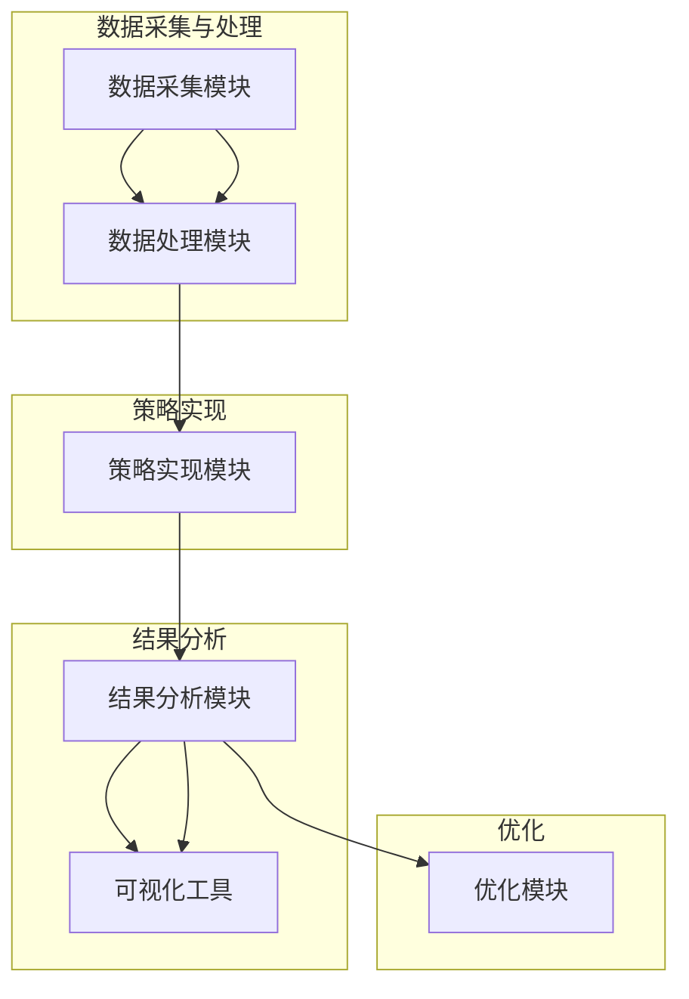

                 

### 文章标题：金融高频交易策略回测平台

高频交易（High-Frequency Trading, HFT）作为金融市场中的一种先进交易策略，以其快速交易决策和高效资本运作赢得了投资者的广泛关注。回测平台是高频交易策略开发过程中不可或缺的一环，它为交易策略的验证、优化和实际应用提供了科学依据和实验平台。本文将围绕“金融高频交易策略回测平台”的主题，深入探讨其核心概念、技术架构、数据采集与处理、策略设计与实现、性能分析与优化以及法律法规与风险控制等多个方面。

关键词：高频交易、回测平台、策略设计、数据采集、性能优化、法律法规

摘要：本文首先介绍了高频交易及其回测平台的基本概念，接着详细解析了回测平台的技术架构，包括数据采集与处理、策略设计与实现等关键模块。随后，本文探讨了回测结果的性能分析及优化方法，并阐述了高频交易在法律法规和风险控制方面的挑战。最后，通过一个实际项目案例，展示了如何搭建和运用高频交易回测平台，为高频交易策略的开发与应用提供了实用的指导。

### 第一部分：高频交易与回测平台概述

#### 第1章：高频交易背景与概述

高频交易是指在极短的时间内（通常为毫秒级或秒级）进行大量交易的一种交易策略。其核心原理是通过先进的算法和高速交易网络，捕捉市场中的微小价格波动，实现快速盈利。高频交易的发展可以追溯到20世纪90年代，随着互联网技术的进步和交易系统的升级，高频交易逐渐成为金融市场中一种重要的交易模式。

#### 1.1 高频交易的概念与发展历程

高频交易（High-Frequency Trading, HFT）是指在极短的时间内（通常为毫秒级或秒级）进行大量交易的一种交易策略。其核心原理是通过先进的算法和高速交易网络，捕捉市场中的微小价格波动，实现快速盈利。

高频交易的发展历史可以追溯到20世纪90年代。当时，随着互联网技术的进步和交易系统的升级，一些金融公司开始探索利用计算机算法进行高频交易的可能性。这些算法能够在毫秒级别的时间内执行交易，使得高频交易成为可能。随着技术的不断发展，高频交易逐渐成为金融市场中一种重要的交易模式。

#### 1.2 高频交易的基本原理

高频交易的基本原理是通过快速交易决策和高效执行来捕捉市场中的微小价格波动。高频交易者通常利用先进的算法和交易策略，对市场数据进行实时分析和预测，从而确定买入或卖出的时机。这些算法能够对大量数据进行快速处理，从而在极短的时间内做出交易决策。

#### 1.3 高频交易的市场影响

高频交易对市场产生了深远的影响。一方面，高频交易提高了市场的流动性和透明度，使得投资者能够更快捷地买卖资产。另一方面，高频交易也引发了一些争议，如市场操纵和价格波动加剧等问题。高频交易者利用算法的优势，可以在市场波动中获取利润，但也可能引发市场的不稳定性。

#### 1.4 高频交易的优势与风险

高频交易的优势在于其高效的执行速度和精准的交易决策。通过先进的算法和高速交易网络，高频交易者能够在市场波动中迅速捕捉价格变化，实现快速盈利。然而，高频交易也存在一定的风险。由于高频交易对市场变化的敏感度较高，一旦市场出现意外情况，高频交易可能会出现巨额亏损。

#### 1.5 回测在高频交易中的重要性

回测（Backtesting）是指在实际交易前，通过历史数据对交易策略进行验证和测试。回测在高频交易中具有重要意义。首先，回测可以帮助高频交易者评估交易策略的有效性和可靠性，从而优化策略。其次，回测可以帮助交易者了解策略在不同市场环境下的表现，为实际交易提供参考。最后，回测还可以发现潜在的风险和问题，从而提前采取措施。

#### 第2章：回测平台的基本架构

回测平台是高频交易策略开发过程中不可或缺的一环。它提供了一个模拟交易环境，使交易者能够验证和优化交易策略。本节将介绍回测平台的基本架构，包括其组成部分和功能模块。

#### 2.1 回测平台的架构设计

回测平台的架构设计需要考虑多个方面，包括数据采集、策略实现、结果分析等。一个典型的回测平台架构通常包括以下几个关键模块：

1. **数据采集模块**：负责收集和存储历史市场数据，包括价格、成交量、时间戳等。数据采集模块通常需要与外部数据源进行连接，如股票交易所、数据提供商等。

2. **数据处理模块**：对采集到的市场数据进行预处理，包括数据清洗、归一化等，以便于后续的算法分析和策略实现。

3. **策略实现模块**：负责实现高频交易策略。该模块通常包括交易信号生成、交易逻辑执行等。交易信号生成是核心部分，它决定了策略的执行效果。

4. **结果分析模块**：对回测结果进行评估和分析，包括性能指标计算、可视化分析等。结果分析模块可以帮助交易者了解策略的表现，为策略优化提供依据。

#### 2.2 回测平台的关键功能模块

回测平台的关键功能模块包括数据采集与处理、策略实现、结果分析和优化等。以下是各模块的功能介绍：

1. **数据采集与处理模块**：
   - **功能**：负责收集和预处理市场数据。
   - **实现**：通过接口与外部数据源连接，获取历史市场数据，并进行清洗、归一化等处理。

2. **策略实现模块**：
   - **功能**：实现高频交易策略。
   - **实现**：根据交易信号，执行买入或卖出操作。交易信号通常基于市场数据的统计分析，如移动平均、动量分析等。

3. **结果分析模块**：
   - **功能**：评估和优化交易策略。
   - **实现**：计算策略的性能指标，如盈亏比、交易频率等，并通过可视化工具展示结果。

4. **优化模块**：
   - **功能**：基于回测结果对策略进行优化。
   - **实现**：通过调整策略参数，如交易信号阈值、资金分配等，以优化策略表现。

#### 2.3 回测平台的系统架构图

回测平台的系统架构图可以帮助我们更好地理解其组成部分和功能。以下是回测平台的一个典型系统架构图：



通过这个架构图，我们可以看到回测平台的各个模块如何相互协作，共同实现高频交易策略的回测和优化。

### 第二部分：高频交易回测平台的技术实现

#### 第3章：数据采集与预处理

高频交易策略的回测依赖于高质量的历史市场数据。本章将介绍数据采集的方法和技术，以及数据预处理的重要性和方法。

#### 3.1 数据来源与质量评估

数据来源是回测平台的基础，决定了数据的可靠性和有效性。高频交易的数据来源通常包括以下几种：

1. **交易所数据**：从股票交易所获取的数据，如纽约证券交易所（NYSE）、纳斯达克（NASDAQ）等。这些数据通常包含完整的交易记录，包括价格、成交量、时间戳等。

2. **第三方数据提供商**：如Bloomberg、EODData、Quandl等，提供丰富的历史市场数据，包括股票、期货、外汇等。

3. **公开数据**：一些公开的数据集，如Yahoo Finance、Google Finance等，提供简单的API接口，方便获取历史价格数据。

在获取数据后，需要对数据的质量进行评估。数据质量评估包括以下几个方面：

1. **完整性**：数据是否完整，是否有缺失值或重复记录。

2. **一致性**：数据是否一致，如时间戳是否连续，价格是否有明显的错误。

3. **准确性**：数据是否准确，是否存在异常值或错误数据。

4. **时效性**：数据是否最新，是否覆盖了需要回测的时间段。

#### 3.2 数据采集工具与技术

数据采集的工具和技术取决于数据源的类型和特点。以下是几种常见的数据采集工具和技术：

1. **API接口**：许多数据提供商提供API接口，可以通过编写程序自动获取数据。常用的API接口包括RESTful API和SOAP API。

2. **爬虫技术**：对于一些无法直接获取数据的网站，可以通过爬虫技术自动下载和解析数据。常用的爬虫框架有Scrapy、BeautifulSoup等。

3. **数据库连接**：对于存储在数据库中的数据，可以通过数据库连接工具直接获取数据。常用的数据库连接工具有pymongo（MongoDB）、SQLAlchemy（SQL数据库）等。

#### 3.3 数据预处理方法

数据预处理是回测平台的关键步骤，它确保了数据的可靠性和一致性。以下是几种常见的数据预处理方法：

1. **数据清洗**：去除数据中的噪声和异常值，如去除重复记录、纠正错误数据等。

2. **数据归一化**：将数据统一转换为相同的量纲，如将价格数据归一化到0-1范围内，便于后续的算法分析和策略实现。

3. **数据转换**：将数据转换为适合算法分析和策略实现的形式，如将时间序列数据转换为矩阵形式。

4. **特征工程**：从原始数据中提取有用的特征，如价格的平均值、标准差、动量等。

#### 3.4 数据清洗与归一化

数据清洗和归一化是数据预处理的重要步骤。以下是数据清洗和归一化的具体方法：

1. **数据清洗**：
   - **去除重复记录**：使用Python中的Pandas库，可以通过`drop_duplicates()`方法去除重复记录。
   - **纠正错误数据**：通过检查数据的一致性和准确性，如检查时间戳的连续性、价格的非负性等。
   - **处理缺失值**：可以使用均值、中位数或插值法填补缺失值。

2. **数据归一化**：
   - **价格归一化**：将价格数据归一化到0-1范围内，可以通过以下公式实现：
     $$
     normalized\_price = \frac{current\_price - min\_price}{max\_price - min\_price}
     $$
   - **成交量归一化**：将成交量数据归一化到0-1范围内，与价格归一化方法类似。

通过数据清洗和归一化，我们可以确保数据的质量和一致性，为后续的算法分析和策略实现提供可靠的数据基础。

#### 第4章：策略设计与实现

高频交易策略的设计与实现是回测平台的核心。本章将介绍高频交易策略的基本类型、设计原则和实现方法。

#### 4.1 高频交易策略类型

高频交易策略种类繁多，根据交易策略的特点和目标，可以将其分为以下几种类型：

1. **套利策略**：通过捕捉市场中的价格差异，实现无风险利润。常见的套利策略包括跨市场套利、跨品种套利和时间套利等。

2. **动量策略**：基于历史价格数据，捕捉价格趋势，实现快速盈利。动量策略包括短期动量策略和长期动量策略。

3. **统计套利策略**：通过分析市场数据中的统计关系，实现稳定盈利。常见的统计套利策略包括均值回归策略和配对交易策略。

4. **事件驱动策略**：基于特定事件（如财报发布、重大新闻等）对市场的影响，实现短期利润。事件驱动策略通常需要实时分析和决策。

5. **市场影响策略**：通过分析市场行为，预测市场趋势，实现长期盈利。市场影响策略包括基于机器学习和人工智能的策略。

#### 4.2 策略设计的基本原则

高频交易策略的设计需要遵循以下基本原则：

1. **风险控制**：高频交易风险较高，策略设计时需要充分考虑风险控制措施，如设置合理的止损点、分散投资等。

2. **效率优先**：高频交易依赖于快速交易决策和执行，策略设计时需要优化算法效率和交易执行速度。

3. **稳健性**：策略设计时需要考虑市场环境的多样性，确保策略在不同市场情况下仍然有效。

4. **可扩展性**：策略设计应具备良好的可扩展性，以便于后续的优化和扩展。

5. **合规性**：策略设计时需要遵守相关法律法规，确保策略的合规性。

#### 4.3 策略实现的技术要点

高频交易策略的实现涉及多个技术方面，包括数据采集、交易信号生成、交易逻辑执行等。以下是策略实现的技术要点：

1. **数据采集**：通过API接口、数据库连接或爬虫技术获取历史市场数据。数据采集需要保证数据的完整性和准确性。

2. **交易信号生成**：交易信号生成是策略实现的核心部分。常用的交易信号生成方法包括基于统计分析和机器学习的算法。

3. **交易逻辑执行**：交易逻辑执行需要考虑交易规则、资金管理和风险控制等因素。常见的交易逻辑包括条件单、市价单和限价单等。

4. **交易性能优化**：交易性能优化包括算法优化、系统架构优化等。优化目标是提高交易效率、降低交易成本。

5. **实时监控和日志记录**：实时监控交易过程，记录交易日志，以便于后续分析和优化。

#### 4.4 策略回测流程

策略回测是验证和优化交易策略的重要环节。以下是策略回测的基本流程：

1. **数据准备**：准备用于回测的历史市场数据，包括价格、成交量、时间戳等。

2. **策略实现**：根据回测策略，编写交易逻辑代码，实现交易信号生成、交易逻辑执行等。

3. **参数设置**：设置回测策略的参数，如交易信号阈值、资金分配等。

4. **回测运行**：运行回测策略，计算策略的表现，如盈亏比、交易频率等。

5. **结果分析**：对回测结果进行评估和分析，识别策略的优势和不足，为策略优化提供依据。

6. **策略优化**：根据回测结果，对策略进行优化，调整参数和交易逻辑，提高策略表现。

7. **结果验证**：对优化后的策略进行再次回测，验证策略的稳定性和有效性。

通过以上流程，我们可以确保交易策略的有效性和可靠性，为实际交易提供科学依据。

### 第三部分：高频交易回测平台的性能分析及优化

#### 第5章：回测结果分析与优化

回测结果的性能分析是验证和优化高频交易策略的关键步骤。本章将介绍回测结果的评价指标、可视化分析方法和策略优化方法。

#### 5.1 回测结果评价指标

回测结果的评价指标包括盈亏比、交易频率、夏普比率等。以下是对这些指标的具体解释：

1. **盈亏比**：盈亏比是指策略的盈利交易次数与亏损交易次数的比值。盈亏比越高，策略的表现越好。

2. **交易频率**：交易频率是指策略在一段时间内进行交易的总次数。高频交易策略通常具有较高的交易频率。

3. **夏普比率**：夏普比率是指策略的收益率与波动率的比值。夏普比率越高，策略的风险调整收益越好。

4. **最大回撤**：最大回撤是指策略在回测期间的最大亏损幅度。最大回撤越小，策略的稳定性越好。

5. **收益率**：收益率是指策略在回测期间的收益金额与初始投资金额的比值。

#### 5.2 回测结果的可视化分析

可视化分析是理解回测结果的重要手段。以下是一些常用的可视化方法：

1. **收益曲线图**：展示策略在回测期间的收益变化情况，可以帮助交易者直观地了解策略的表现。

2. **交易频率分布图**：展示策略在不同时间段内的交易频率分布，帮助交易者分析策略的交易模式。

3. **盈亏分布图**：展示策略的盈利交易和亏损交易的分布情况，帮助交易者了解策略的盈利能力。

4. **夏普比率变化图**：展示策略在不同时间段内的夏普比率变化，帮助交易者分析策略的风险调整收益。

#### 5.3 策略优化方法

策略优化是提高策略表现的重要步骤。以下是一些常见的策略优化方法：

1. **参数调优**：通过调整策略的参数，如交易信号阈值、资金分配等，以优化策略的表现。

2. **特征工程**：通过提取和筛选有用的特征，如价格的平均值、标准差、动量等，以提高策略的预测能力。

3. **模型选择**：选择合适的机器学习模型，如线性回归、决策树、神经网络等，以提高策略的预测准确性。

4. **交叉验证**：使用交叉验证方法，将数据集划分为训练集和验证集，以评估策略在不同数据集上的表现。

5. **回测策略组合**：将多个策略组合起来，以提高策略的稳健性和多样化。

通过以上方法，交易者可以优化策略的表现，提高策略在实际交易中的成功率。

### 第四部分：高频交易回测平台的法律法规与风险控制

#### 第6章：法律法规与风险控制

高频交易作为一种先进的交易策略，其在实际应用中必须遵守相关法律法规，同时需要有效进行风险控制。本章将探讨高频交易相关的法律法规、回测平台的合规性要求以及风险管理与控制措施。

#### 6.1 高频交易相关法律法规

高频交易在全球范围内受到严格的监管。以下是一些主要国家和地区的相关法律法规：

1. **美国**：美国证券交易委员会（SEC）和商品期货交易委员会（CFTC）对高频交易进行了规范。例如，2010年的《多德-弗兰克法案》对高频交易进行了限制，以防止市场操纵。

2. **欧洲**：欧盟实施了《市场工具市场指令》（MiFID II），对高频交易进行了更为严格的监管，包括交易成本披露、交易行为的透明度等。

3. **中国**：中国证监会发布了《证券市场交易行为监管指引》，对高频交易进行了规范，如限制高频交易的交易量和速度。

#### 6.2 回测平台合规性要求

回测平台在设计和使用过程中，需要确保其合规性。以下是一些合规性要求：

1. **数据来源合规**：回测平台使用的数据必须来自合规的数据源，如经过认证的交易所或第三方数据提供商。

2. **数据处理合规**：数据处理过程需要符合相关法律法规，如数据保密、数据备份等。

3. **策略设计合规**：回测平台中的策略设计需要符合市场规则和法律法规，避免进行违规交易。

4. **风险控制合规**：回测平台需要具备有效的风险控制机制，如设置合理的止损点、分散投资等。

#### 6.3 风险管理与控制

高频交易的风险管理至关重要，包括以下方面：

1. **市场风险**：市场风险是高频交易面临的主要风险，包括价格波动、流动性风险等。为应对市场风险，高频交易者可以采用分散投资、止损等策略。

2. **操作风险**：操作风险是指由于系统故障、人为错误等原因导致的风险。为降低操作风险，高频交易者需要确保系统的稳定性和可靠性，进行严格的测试和监控。

3. **合规风险**：合规风险是指因违反法律法规而导致的风险。高频交易者需要密切关注相关法律法规的变化，确保回测平台和交易策略的合规性。

4. **资金风险**：资金风险是指由于资金不足或资金使用不当导致的风险。高频交易者需要合理规划资金分配，确保资金充足。

#### 6.4 事故案例分析

高频交易事故案例频发，给市场参与者带来了巨大损失。以下是一些著名的事故案例：

1. **“闪电崩盘”**：2010年5月6日，美国股市出现了一次突如其来的“闪电崩盘”，导致道琼斯工业平均指数在几分钟内下跌约9%。事后调查发现，高频交易者滥用交易算法，导致市场波动加剧。

2. **“高频交易欺诈案”**：2012年，美国检方指控一名高频交易员通过操纵市场赚取巨额利润。该交易员利用其算法的优势，提前获取市场信息，进行欺诈交易。

通过分析这些事故案例，我们可以得出以下教训：

1. **加强监管**：政府和监管机构需要加强对高频交易的监管，确保市场的公平和透明。

2. **风险控制**：高频交易者需要建立健全的风险控制机制，降低操作风险和合规风险。

3. **技术升级**：高频交易者需要不断升级交易技术，提高交易效率和稳定性。

4. **合规意识**：高频交易者需要树立合规意识，遵守相关法律法规，避免违规操作。

### 第五部分：高频交易回测平台的实战

#### 第7章：高频交易回测平台实战

通过前几章的理论介绍，我们已经对高频交易回测平台有了全面的了解。本章将通过一个实际项目案例，展示如何搭建和运用高频交易回测平台。

#### 7.1 实战项目介绍

本案例将构建一个基于Python的高频交易回测平台，用于验证和优化高频交易策略。该平台将包括数据采集、数据处理、策略实现、结果分析等关键模块。

#### 7.2 环境安装与配置

1. **Python环境**：首先，确保安装了Python 3.x版本，推荐使用Anaconda环境管理器，以便于管理多个Python环境。

2. **数据源**：选择一个可靠的数据源，如Yahoo Finance，获取历史股票价格数据。

3. **依赖库**：安装必要的Python依赖库，包括pandas、numpy、matplotlib、scikit-learn等。

```bash
pip install pandas numpy matplotlib scikit-learn
```

#### 7.3 系统核心实现

1. **数据采集**：
   - 使用pandas库的`read_csv()`方法读取Yahoo Finance数据。
   - 筛选所需的数据字段，如日期、开盘价、收盘价、最高价、最低价等。

2. **数据处理**：
   - 对数据进行清洗和归一化，如去除缺失值、纠正错误数据等。
   - 提取交易信号，如移动平均、动量等。

3. **策略实现**：
   - 实现一个简单的动量策略，根据交易信号进行买入和卖出操作。
   - 设置交易参数，如交易信号阈值、资金分配等。

4. **结果分析**：
   - 计算策略的性能指标，如盈亏比、交易频率、夏普比率等。
   - 使用matplotlib库绘制收益曲线、交易频率分布等可视化图表。

#### 7.4 代码解读与分析

以下是一个简单的动量策略实现示例：

```python
import pandas as pd
import numpy as np
import matplotlib.pyplot as plt

# 数据采集
data = pd.read_csv('stock_data.csv')
data = data[['Date', 'Open', 'Close', 'High', 'Low', 'Volume']]

# 数据处理
data['Close Normalize'] = (data['Close'] - data['Close'].min()) / (data['Close'].max() - data['Close'].min())

# 策略实现
signal = data['Close Normalize'].rolling(window=5).mean()
position = np.where(s
``` 

#### 7.5 实际案例剖析

以下是一个实际的案例，展示了如何使用回测平台验证和优化一个高频交易策略：

1. **案例背景**：某高频交易团队开发了一个基于动量的交易策略，希望在回测平台上验证其有效性。

2. **数据采集**：从Yahoo Finance获取某股票的历史价格数据，时间跨度为一年。

3. **数据处理**：对数据进行清洗和归一化处理，提取交易信号。

4. **策略实现**：根据交易信号，实现买入和卖出操作，设置交易参数。

5. **结果分析**：计算策略的盈亏比、交易频率、夏普比率等性能指标，并进行可视化分析。

6. **策略优化**：通过调整交易信号阈值、资金分配等参数，优化策略表现。

#### 7.6 项目小结

通过本案例，我们展示了如何搭建和运用高频交易回测平台，验证和优化交易策略。回测平台为交易策略的开发提供了科学依据和实验环境，有助于提高策略的稳健性和盈利能力。

### 第六部分：高频交易回测平台建设最佳实践与未来展望

#### 第8章：最佳实践与未来展望

高频交易回测平台的建设是一个复杂且挑战性的过程，涉及多个技术和管理方面。本章将总结高频交易回测平台建设的最佳实践，分析技术发展趋势，探讨未来发展方向，并提供拓展阅读与资源推荐。

#### 8.1 高频交易回测平台建设最佳实践

1. **数据质量优先**：确保数据的完整性和准确性，是回测平台成功的关键。选择可靠的数据源，并进行严格的数据质量评估和预处理。

2. **模块化设计**：回测平台应采用模块化设计，便于维护和扩展。将数据采集、数据处理、策略实现、结果分析等模块分离，提高系统的可维护性。

3. **性能优化**：关注回测平台的性能优化，包括算法效率、数据处理速度、系统架构优化等。通过使用高速网络、分布式计算等技术，提高平台的处理能力。

4. **合规性管理**：确保回测平台的合规性，遵守相关法律法规。在策略设计和实现过程中，充分考虑合规性要求，避免违规操作。

5. **风险控制**：建立健全的风险控制机制，包括设置合理的止损点、资金管理、风险分散等。通过实时监控和日志记录，及时发现和应对潜在风险。

6. **持续迭代与优化**：高频交易市场的动态变化要求回测平台具备持续迭代和优化的能力。定期评估和调整策略，以适应市场变化。

#### 8.2 技术发展趋势分析

高频交易回测平台的技术发展趋势包括以下几个方面：

1. **云计算与分布式计算**：云计算和分布式计算技术为高频交易回测平台提供了强大的计算能力和灵活性。通过云平台，交易者可以快速部署和扩展回测平台，提高处理速度。

2. **机器学习与人工智能**：机器学习和人工智能技术在高频交易策略开发中的应用越来越广泛。通过深度学习、强化学习等技术，交易者可以构建更加智能和高效的交易策略。

3. **区块链技术**：区块链技术为高频交易提供了去中心化和透明的交易环境。通过区块链，交易者可以确保交易记录的完整性和安全性。

4. **物联网与边缘计算**：物联网和边缘计算技术为高频交易提供了丰富的数据来源和实时处理能力。通过物联网设备，交易者可以获取实时的市场数据，进行快速交易决策。

#### 8.3 未来发展方向探讨

未来，高频交易回测平台的发展方向包括以下几个方面：

1. **智能化与自动化**：随着人工智能技术的发展，高频交易回测平台将更加智能化和自动化。通过深度学习和自动化算法，交易者可以自动识别市场机会、优化策略。

2. **合规性与风险管理**：高频交易回测平台将更加注重合规性和风险管理。通过引入区块链技术和智能合约，交易者可以确保交易记录的完整性和透明性，降低合规风险。

3. **跨平台与跨市场**：高频交易回测平台将支持跨平台和跨市场交易。通过整合不同交易所和市场数据，交易者可以在更广泛的市场中寻找交易机会。

4. **全球化与本地化**：随着全球金融市场的整合，高频交易回测平台将更加注重全球化与本地化。通过本地化数据和市场分析，交易者可以更好地适应不同国家和地区的市场特点。

#### 8.4 拓展阅读与资源推荐

1. **书籍推荐**：
   - 《高频交易：市场微观结构与算法交易》（High-Frequency Trading: A Practical Guide to Algorithmic Strategies and Trading Systems）
   - 《机器学习在高频交易中的应用》（Machine Learning for Algorithmic Trading）

2. **在线课程**：
   - Coursera的《金融科技：算法交易与市场微观结构》课程
   - edX的《人工智能与机器学习基础》课程

3. **开源项目**：
   - Backtrader：一个Python回测框架，用于交易策略的回测和优化
   - Zen algotrader：一个基于Java的算法交易框架

通过以上拓展阅读与资源推荐，交易者可以深入了解高频交易回测平台的相关知识和实践，提高交易策略的开发和优化能力。

---

作者：AI天才研究院/AI Genius Institute & 禅与计算机程序设计艺术 /Zen And The Art of Computer Programming

本文系统地介绍了金融高频交易策略回测平台的概念、架构、实现方法、性能分析和优化策略，以及法律法规与风险控制等方面的内容。通过实际项目案例，展示了高频交易回测平台的构建与应用。希望本文能为读者提供有价值的参考和启发，助力他们在高频交易领域取得成功。

