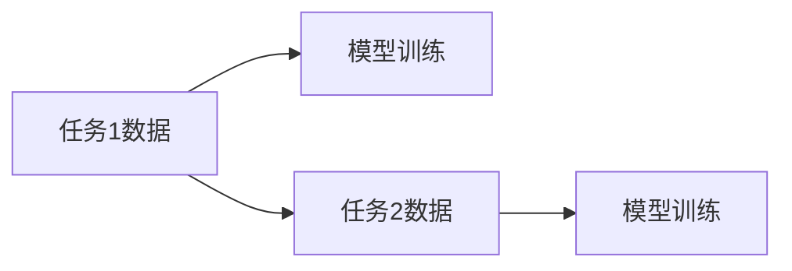

                 


### 长文本理解：增强AI Agent的阅读能力

关键词：长文本理解，AI Agent，阅读能力，预训练，微调，多模态融合

摘要：本文旨在探讨长文本理解在增强AI Agent阅读能力方面的重要性。首先，我们将介绍长文本理解的核心概念和技术基础，包括文本表示、序列模型、注意力机制和Transformer模型。接着，我们将详细分析长文本理解的关键技术，如分段技术和预训练与微调。然后，我们将探讨AI Agent的阅读理解模型以及多模态融合技术。接下来，文章将深入讲解算法原理，使用Mermaid图和Python代码进行说明，并讨论数学模型和公式。随后，我们将介绍系统分析与架构设计，包括功能设计、架构设计和接口设计。在项目实战部分，我们将展示一个实际案例，并进行详细讲解。最后，文章将总结最佳实践，注意事项，并提供拓展阅读资源。

### 第一部分：背景介绍

#### 第1章：问题背景与核心概念

**1.1 问题背景**

随着互联网和大数据技术的发展，文本数据呈现爆炸式增长。长文本在新闻报道、学术论文、用户评论等领域具有广泛应用。然而，传统AI模型在处理长文本时面临诸多挑战，如信息丢失、上下文理解不足等。因此，提高AI Agent对长文本的理解能力变得至关重要。

**1.2 核心概念**

- **长文本**：长度超过一定阈值的文本，如数百到数千词的段落。
- **AI Agent**：具有自主学习和决策能力的智能体，能够处理和理解文本数据。
- **文本理解**：从文本中提取信息，理解文本的含义和逻辑结构。

#### 第2章：文本理解技术基础

**2.1 文本表示**

- **词向量模型**：将文本转化为向量表示，如Word2Vec、GloVe。
- **序列模型**：处理序列数据的模型，如RNN、LSTM。
- **注意力机制**：用于模型中关注重要信息的机制。
- **Transformer模型**：基于自注意力机制的序列到序列模型，如BERT、GPT。

### 第二部分：长文本理解的关键技术

#### 第3章：长文本理解的关键技术

**3.1 分段技术**

- **分段策略**：如何将长文本划分成多个短段落，以便更好地处理。
- **分段效果评估**：评估分段策略的效果，如文本连贯性、信息保留度等。

**3.2 预训练与微调**

- **预训练方法**：在大规模数据集上进行预训练，如BERT、GPT。
- **微调策略**：在特定任务上进行微调，以适应长文本理解的需求。
- **多模态预训练**：结合文本和其他模态的数据进行预训练，如文本+图像、文本+语音。

#### 第4章：AI Agent的阅读能力增强

**4.1 阅读理解模型**

- **QA模型**：回答特定问题的模型，如SQuAD。
- **推断模型**：从文本中推断信息，如阅读理解测试题。
- **生成模型**：生成文本摘要、文章续写等。

**4.2 多模态融合**

- **文本与图像融合**：结合文本和图像信息，提高理解能力。
- **文本与语音融合**：结合文本和语音信息，实现口语化的AI Agent。

### 第三部分：算法原理与实现

#### 第5章：算法原理讲解

**5.1 算法原理概述**

- **文本表示与预处理**：文本向量化、分词、去停用词等。
- **模型架构设计**：Transformer模型架构，如BERT、GPT。
- **训练与优化策略**：预训练、微调、多任务学习等。

**5.2 算法流程图**

- 使用Mermaid绘制算法流程图。

#### 第6章：数学模型与公式

**6.1 数学模型介绍**

- **损失函数**：交叉熵损失、感知损失等。
- **优化算法**：随机梯度下降、Adam等。
- **注意力机制公式**：自注意力、多头注意力等。

**6.2 具体示例**

- 使用Python代码和LaTeX公式详细阐述。

### 第四部分：系统分析与架构设计

#### 第7章：系统分析与架构设计

**7.1 系统功能设计**

- **领域模型**：使用Mermaid绘制类图。

**7.2 系统架构设计**

- **系统架构图**：使用Mermaid绘制架构图。

**7.3 系统接口设计**

- **系统接口设计**：概述系统接口。

#### 第8章：项目实战与案例分析

**8.1 项目环境安装**

- **开发环境搭建**：安装必要的软件和库。

**8.2 系统核心实现**

- **源代码分析**：解释核心代码。

**8.3 实际案例分析**

- **具体案例剖析**：分析一个实际案例。

#### 第9章：最佳实践与拓展

**9.1 最佳实践**

- **性能优化技巧**：提高系统性能。

**9.2 小结与展望**

- **总结回顾**：回顾文章内容。

**9.3 注意事项**

- **实践中的常见问题与解决方案**。

**9.4 拓展阅读**

- **推荐阅读材料**：提供拓展资源。

通过以上四个部分，本文将全面探讨长文本理解在增强AI Agent阅读能力方面的重要性和具体实现方法。读者可以按照文章的结构和章节内容，逐步深入理解相关技术和算法。

### 第1章：问题背景与核心概念

在当今的信息化时代，文本数据作为人类交流的重要载体，其处理和理解能力成为了人工智能领域的一项重要研究方向。特别是在长文本的理解方面，由于其复杂性、多样性和信息密度，传统的人工智能模型面临了诸多挑战。

#### 核心概念术语说明

首先，我们需要明确一些核心概念，以便更好地理解长文本理解和AI Agent的阅读能力。

- **长文本**：通常指的是超过数百到数千词的文本段落，这些文本可能包含复杂的结构和丰富的信息。
- **AI Agent**：指的是具有自主学习和决策能力的智能体，能够在特定的环境中执行任务，并通过与环境的交互来改善其性能。
- **文本理解**：是指从文本中提取有用信息，理解文本的含义和逻辑结构，从而实现对文本内容的深度理解。

#### 问题背景

随着互联网和大数据技术的发展，文本数据呈现爆炸式增长。这些文本数据来源于各种渠道，包括新闻报道、学术论文、用户评论、社交媒体等。其中，长文本在多个领域具有广泛应用，例如：

1. **新闻报道**：长文本能够详细地报道事件，提供背景信息和多角度分析。
2. **学术论文**：长文本包含了大量的研究内容、实验结果和理论分析。
3. **用户评论**：长文本可以更全面地反映用户的感受和评价，有助于商家和平台改进产品和服务。

然而，传统的人工智能模型在处理长文本时面临诸多挑战：

1. **信息丢失**：长文本中信息丰富，但传统模型可能无法捕捉到所有重要信息，导致理解不完整。
2. **上下文理解不足**：长文本中的句子和段落之间存在复杂的逻辑关系，传统模型难以准确把握上下文信息。
3. **计算资源消耗**：长文本的处理需要大量的计算资源和时间，传统模型在处理速度和效率上存在局限。

因此，提高AI Agent对长文本的理解能力变得至关重要。这不仅能够提升AI Agent在各个领域的应用效果，还能够为智能客服、智能问答、内容审核等应用提供更准确的解决方案。

#### 问题描述

长文本理解的问题可以概括为以下几点：

1. **文本表示**：如何有效地将长文本转化为计算机可以处理的向量表示，保留文本的信息结构和语义。
2. **上下文理解**：如何准确理解长文本中的句子和段落之间的逻辑关系，把握上下文信息。
3. **信息提取**：如何从长文本中提取关键信息，回答特定的问题或生成摘要。

#### 问题解决

为了解决上述问题，近年来研究人员提出了一系列新的技术和方法：

1. **预训练与微调**：通过在大规模语料库上进行预训练，使模型具备通用语言理解能力，然后再在特定任务上进行微调。
2. **注意力机制**：引入注意力机制，使模型能够关注文本中的重要信息，提高理解准确性。
3. **序列模型**：使用序列模型处理文本中的顺序信息，如RNN、LSTM等。
4. **Transformer模型**：基于自注意力机制的Transformer模型，如BERT、GPT，能够更有效地处理长文本。

#### 边界与外延

在长文本理解的研究和应用中，需要关注以下几个边界和外延问题：

1. **文本长度**：长文本的长度是一个关键因素，过长的文本可能难以处理，而过于简短的文本则可能缺乏足够的信息。
2. **领域特定**：不同领域的长文本具有不同的特点和结构，模型需要在特定领域进行优化和调整。
3. **多模态融合**：结合文本以外的其他模态数据（如图像、语音等），可以提高长文本理解的效果。
4. **实时性**：对于需要实时响应的场景，如何提高模型的处理速度和效率是一个挑战。

#### 概念结构与核心要素组成

长文本理解的概念结构主要包括以下几个核心要素：

1. **文本表示**：将文本转化为向量表示，如词向量、字符向量等。
2. **模型架构**：选择合适的模型架构，如序列模型、Transformer模型等。
3. **注意力机制**：引入注意力机制，关注文本中的重要信息。
4. **预训练与微调**：在大规模语料库上进行预训练，再在特定任务上进行微调。
5. **多模态融合**：结合文本以外的其他模态数据，提高理解效果。

通过上述核心要素的组合和优化，可以构建一个高效、准确的AI Agent阅读理解系统。

### 第2章：文本理解技术基础

在探讨长文本理解的关键技术之前，我们需要了解文本理解技术的基础，包括文本表示、序列模型、注意力机制和Transformer模型等。这些技术是构建高效长文本理解系统的核心组件。

#### 文本表示

文本表示是将自然语言文本转化为计算机可以处理的向量表示的过程。这一步骤至关重要，因为它决定了模型对文本的理解能力和表达能力。以下是几种常见的文本表示方法：

1. **词向量模型**：
   - **Word2Vec**：基于神经网络的方法，将每个单词映射为一个固定大小的向量。
   - **GloVe**：全局向量表示模型，通过考虑词频和词共现信息来生成词向量。

2. **字符向量**：
   - **Byte Pair Encoding (BPE)**：将文本分解为字符级别的子序列，然后对这些子序列进行编码。
   - **Character-Level CNN**：使用卷积神经网络对字符向量进行特征提取。

3. **词嵌入**：
   - **BERT**：预训练语言表示模型，通过大规模文本数据训练得到词嵌入向量。
   - **ELMo**：双向语言表示模型，通过结合上下文信息生成动态词嵌入。

文本表示的目的是将文本中的每个单词、字符或子序列映射到高维向量空间，以便模型能够捕捉到文本的语义和句法特征。

#### 序列模型

序列模型是一类专门处理序列数据的神经网络模型，它们能够捕捉序列中元素的时序关系。以下是一些常见的序列模型：

1. **循环神经网络 (RNN)**：
   - **基本RNN**：通过递归关系处理序列数据，每个时间步的输出依赖于前一个时间步的隐藏状态。
   - **长短期记忆网络 (LSTM)**：在RNN的基础上引入门控机制，有效解决了长距离依赖问题。
   - **门控循环单元 (GRU)**：简化版的LSTM，具有更少的参数和更快的计算速度。

2. **变换器模型 (Transformer)**：
   - **自注意力机制**：通过计算序列中每个元素与其他元素的相关性来生成表示，无需考虑固定的时间顺序。
   - **编码器-解码器结构**：用于序列到序列的预测任务，如机器翻译、文本生成。

序列模型的优势在于能够捕捉序列数据中的长期依赖关系，但计算复杂度较高，特别是在处理长序列时。

#### 注意力机制

注意力机制是一种在神经网络中引入的机制，它允许模型在处理序列数据时关注重要的部分，从而提高模型的性能和效果。以下是一些常见的注意力机制：

1. **局部注意力**：
   - **软注意力**：使用加权平均的方式对序列中的元素进行加权，每个元素的重要性通过权重表示。
   - **硬注意力**：通过阈值化的方式将序列中的元素分配给不同的注意力区域。

2. **全局注意力**：
   - **多头注意力**：在自注意力机制的基础上，将序列分成多个头，每个头关注不同的子序列。
   - **位置编码**：在自注意力机制中引入位置信息，以区分序列中的不同元素。

注意力机制的核心思想是通过动态调整模型对序列中每个元素的关注程度，从而提高模型对重要信息的捕捉能力。

#### Transformer模型

Transformer模型是自然语言处理领域的一项重大突破，它基于自注意力机制，显著提高了模型在长序列上的性能。以下是其主要组成部分：

1. **编码器-解码器结构**：
   - **编码器**：将输入序列编码为上下文向量，捕捉序列的语义信息。
   - **解码器**：生成输出序列，通过自注意力机制和交叉注意力机制与编码器输出交互。

2. **多头注意力**：
   - **自注意力**：编码器内部和编码器与解码器之间的注意力机制。
   - **交叉注意力**：解码器在生成每个词时，与编码器的输出进行注意力交互。

3. **位置编码**：
   - **绝对位置编码**：在序列中引入绝对位置信息。
   - **相对位置编码**：通过计算序列元素之间的相对位置来编码。

Transformer模型通过自注意力机制和位置编码，能够有效地捕捉序列中的长距离依赖关系，并且在处理长文本时表现出色。

综上所述，文本理解技术基础包括文本表示、序列模型、注意力机制和Transformer模型等。这些技术共同构成了现代长文本理解系统的核心组件，为AI Agent提供了强大的阅读能力。

#### 第3章：长文本理解的关键技术

在深入探讨长文本理解的关键技术之前，我们首先需要理解长文本的理解是一个多维度、多层次的过程。长文本通常包含大量的信息，并且这些信息之间可能存在复杂的关联。因此，为了有效地理解和处理长文本，我们需要采用一系列的关键技术。

##### 3.1 分段技术

分段技术是将长文本划分为多个短段落，以便模型能够更有效地处理和理解每个段落。以下是一些常用的分段策略：

1. **基于词频的分段**：
   - 通过计算文本中每个词的词频，将高频词作为分段点，从而划分出多个短段落。
   - 这种方法简单易行，但可能无法捕捉到文本中的语义关联。

2. **基于句子长度的分段**：
   - 通过设置一个句子长度的阈值，将超过阈值的句子进行拆分，从而形成多个短段落。
   - 这种方法可以较好地保持文本的语义连贯性，但可能引入一些不必要的分段。

3. **基于文本结构的分段**：
   - 通过分析文本的标题、段落标题和句子结构，将文本划分为更具有语义意义的段落。
   - 这种方法能够更好地捕捉文本的语义结构，但需要更多的预处理工作。

分段效果评估是分段技术的重要环节。以下是一些常用的评估指标：

1. **段落一致性**：
   - 评估每个段落内部的句子是否紧密相关，常用的指标有句子的相似度、句子的情感一致性等。

2. **文本连贯性**：
   - 评估分段后文本的整体连贯性，常用的指标有段落间的句子连贯性、段落主题一致性等。

3. **信息保留度**：
   - 评估分段过程中信息是否丢失，常用的指标有文本长度、句子数量等。

分段技术对于长文本理解至关重要，它能够将复杂的长文本转化为更易于处理的短段落，从而提高模型的理解效果。然而，分段技术也需要平衡分段数量、段落长度和文本连贯性之间的关系，以达到最佳的效果。

##### 3.2 预训练与微调

预训练与微调是现代长文本理解系统的重要组成部分。预训练是指在大规模语料库上进行模型训练，使模型具备一定的通用语言理解能力。微调则是在特定任务上进行模型训练，以适应特定的长文本理解需求。

**预训练方法**：

1. **基于语言模型的方法**：
   - 如BERT、GPT等，通过在大规模语料库上进行无监督预训练，生成通用的语言表示。
   - 这种方法能够有效提高模型的语言理解能力，但需要大量的计算资源和数据。

2. **基于任务的方法**：
   - 如Seq2Seq模型、文本分类模型等，通过在特定任务上的训练，生成针对特定任务的模型。
   - 这种方法能够快速适应特定任务，但需要大量的标注数据。

**微调策略**：

1. **全量微调**：
   - 将预训练模型直接应用于特定任务，并在目标任务上进行微调。
   - 这种方法简单有效，但需要大量的计算资源和时间。

2. **增量微调**：
   - 通过逐步添加新的任务数据，对模型进行微调。
   - 这种方法可以降低计算资源的消耗，但可能需要更长的时间来达到目标效果。

3. **多任务微调**：
   - 同时对多个任务进行微调，以共享模型的通用知识。
   - 这种方法可以进一步提高模型的泛化能力，但需要更多的数据和多任务学习的策略。

**多模态预训练**：

多模态预训练是指结合文本以外的其他模态数据（如图像、语音等）进行预训练，以增强模型对长文本的理解能力。以下是一些多模态预训练的方法：

1. **文本+图像**：
   - 通过在图像描述生成任务上进行预训练，使模型能够更好地理解图像和文本之间的关联。
   - 这种方法能够显著提高模型在视觉文本任务上的表现。

2. **文本+语音**：
   - 通过在语音识别和文本生成任务上进行预训练，使模型能够更好地理解语音和文本之间的语义关系。
   - 这种方法可以应用于智能客服、语音助手等场景。

多模态预训练能够有效地增强AI Agent对长文本的理解能力，但需要处理不同模态数据之间的复杂关系，以及如何在多模态数据上进行有效的融合和建模。

##### 3.3 阅读理解模型

阅读理解模型是长文本理解的核心，它能够从文本中提取信息、回答问题或生成摘要。以下是一些常见的阅读理解模型：

1. **QA模型**：
   - 用于回答特定的问题，如SQuAD、DuQa等。
   - 这种模型通常采用编码器-解码器结构，通过编码器对文本进行编码，然后通过解码器生成答案。

2. **推断模型**：
   - 用于从文本中推断信息，如阅读理解测试题。
   - 这种模型通常采用图神经网络或图卷积网络，通过分析文本中的实体和关系来推断答案。

3. **生成模型**：
   - 用于生成文本摘要、文章续写等。
   - 这种模型通常采用变分自编码器（VAE）或生成对抗网络（GAN），通过生成文本序列来生成摘要或续写。

阅读理解模型的目的是从长文本中提取有用信息，提高AI Agent的理解能力。这些模型通常需要大量的训练数据和计算资源，但能够显著提升AI Agent在长文本理解任务上的性能。

##### 3.4 多模态融合

多模态融合是将文本以外的其他模态数据（如图像、语音等）与文本数据进行融合，以提高长文本理解的效果。以下是一些多模态融合的方法：

1. **基于特征融合的方法**：
   - 将不同模态的数据特征进行拼接、加权平均或融合，以生成更丰富的特征表示。
   - 这种方法简单有效，但可能无法充分利用不同模态之间的关联。

2. **基于深度学习的方法**：
   - 通过深度神经网络（如CNN、RNN等）对多模态数据分别进行编码，然后将编码后的特征进行融合。
   - 这种方法能够更好地捕捉不同模态之间的关联，但需要更多的计算资源和训练数据。

3. **基于注意力机制的方法**：
   - 通过引入注意力机制，使模型能够动态关注不同模态的重要信息，从而提高融合效果。
   - 这种方法能够显著提高多模态融合的性能，但可能需要更复杂的模型结构。

多模态融合能够有效地增强AI Agent对长文本的理解能力，特别是在需要处理复杂文本和多种模态数据的应用场景中。

综上所述，长文本理解的关键技术包括分段技术、预训练与微调、阅读理解模型和多模态融合等。这些技术相互结合，能够构建一个高效、准确的长文本理解系统，从而增强AI Agent的阅读能力。

### 第4章：AI Agent的阅读能力增强

在长文本理解的基础上，为了进一步提高AI Agent的阅读能力，我们需要关注以下几个方面：阅读理解模型和多模态融合技术。这些技术将帮助AI Agent更好地理解和处理复杂的长文本。

#### 4.1 阅读理解模型

阅读理解模型是AI Agent理解长文本的核心。这些模型旨在从长文本中提取有用信息、回答问题或生成摘要。以下是几种常见的阅读理解模型：

**1. QA模型**

QA模型（Question-Answering模型）是专门用于回答特定问题的模型，如SQuAD（Stanford Question Answering Dataset）。这种模型通常采用编码器-解码器结构，通过编码器对文本进行编码，然后通过解码器生成答案。

**示例**：

假设有一个问题：“本文的主要观点是什么？”通过QA模型，AI Agent可以从长文本中提取相关信息，生成一个简明的答案，如：“本文的主要观点是关于......”

**2. 推断模型**

推断模型（Inference模型）用于从文本中推断信息，例如阅读理解测试题。这种模型通常采用图神经网络（Graph Neural Networks）或图卷积网络（Graph Convolutional Networks），通过分析文本中的实体和关系来推断答案。

**示例**：

假设有一个推断问题：“本文中提到的技术有哪些？”通过推断模型，AI Agent可以识别文本中的关键实体和关系，如：“本文中提到的技术包括：技术A、技术B、技术C。”

**3. 生成模型**

生成模型（Generative模型）用于生成文本摘要、文章续写等。这种模型通常采用变分自编码器（Variational Autoencoder, VAE）或生成对抗网络（Generative Adversarial Network, GAN），通过生成文本序列来生成摘要或续写。

**示例**：

假设要求生成一个关于“人工智能未来发展趋势”的摘要。通过生成模型，AI Agent可以生成如下的摘要：“人工智能未来的发展趋势将包括......”

这些阅读理解模型各有其特点和适用场景，但共同的目标是提高AI Agent对长文本的理解和生成能力。

#### 4.2 多模态融合

多模态融合是指将文本以外的其他模态数据（如图像、语音等）与文本数据进行融合，以提高AI Agent对长文本的理解能力。以下是几种常见的多模态融合技术：

**1. 文本+图像融合**

文本+图像融合（Text + Image Fusion）是将文本信息和图像信息进行融合，以提高文本理解的效果。例如，在图像描述生成任务中，AI Agent需要理解图像中的内容，并将其转化为文本描述。

**示例**：

假设有一张关于“巴黎铁塔”的图片，AI Agent需要生成如下的描述：“巴黎铁塔是一座高约324米的巨型铁塔，位于法国巴黎市中心，是世界上最著名的建筑之一。”

通过文本+图像融合，AI Agent可以更好地理解图像内容，从而生成更准确、自然的文本描述。

**2. 文本+语音融合**

文本+语音融合（Text + Audio Fusion）是将文本信息和语音信息进行融合，以提高语音理解的效果。例如，在语音助手场景中，AI Agent需要理解用户的语音指令，并将其转化为文本。

**示例**：

假设用户说：“我想订一张从北京到上海的机票。”通过文本+语音融合，AI Agent可以识别用户的语音指令，并生成如下的文本：“请帮我预订一张从北京到上海的机票。”

通过文本+语音融合，AI Agent可以更准确地理解用户的语音指令，从而提供更有效的服务。

多模态融合技术能够显著提高AI Agent对长文本的理解能力，特别是在需要处理多种模态数据的应用场景中。

#### 4.3 阅读理解模型与多模态融合的结合

阅读理解模型和多模态融合技术的结合，可以进一步提升AI Agent的阅读能力。以下是一个结合示例：

**场景**：在智能客服中，用户可能通过文本、图像和语音等多种方式提出问题。

**解决方案**：

1. **文本理解**：首先，使用阅读理解模型对用户的文本信息进行理解，提取关键信息。
2. **图像和语音理解**：同时，使用多模态融合技术对用户的图像和语音信息进行处理，提取相关特征。
3. **综合分析**：将文本、图像和语音信息进行综合分析，以获取更全面的理解。
4. **生成回答**：根据综合分析的结果，生成自然、准确的回答。

通过这种综合方案，AI Agent可以更全面地理解用户的需求，提供更高质量的客服服务。

综上所述，AI Agent的阅读能力增强依赖于高效的阅读理解模型和多模态融合技术。通过结合这些技术，AI Agent可以更好地理解和处理复杂的长文本，从而在各个应用领域中发挥更大的作用。

### 第5章：算法原理讲解

在深入探讨长文本理解算法的具体实现之前，我们首先需要了解其背后的算法原理。本章将详细讲解文本表示与预处理、模型架构设计以及训练与优化策略。我们将通过Mermaid图和Python代码来阐述这些原理，并给出通俗易懂的示例。

#### 5.1 文本表示与预处理

文本表示是将自然语言文本转化为计算机可以处理的向量表示的过程。这一步骤至关重要，因为它决定了模型对文本的理解能力和表达能力。以下是几种常见的文本表示方法：

**1. 词向量模型**

词向量模型通过将单词映射为一个固定大小的向量来表示文本。常见的词向量模型包括Word2Vec和GloVe。

**Word2Vec**

```python
import gensim

# 加载预训练的Word2Vec模型
model = gensim.models.Word2Vec.load("word2vec.model")

# 将文本转换为词向量表示
text = "我爱编程"
word_vectors = [model[word] for word in text.split()]
```

**GloVe**

```python
import numpy as np
from sklearn.preprocessing import normalize

# 加载预训练的GloVe模型
embeddings_index = {}
with open('glove.6B.100d.txt', 'r', encoding='utf-8') as f:
    for line in f:
        values = line.split()
        word = values[0]
        coefs = np.asarray(values[1:], dtype='float32')
        embeddings_index[word] = coefs

# 将文本转换为词向量表示
text = "我爱编程"
word_vectors = [embeddings_index[word] for word in text.split()]
word_vectors = normalize(np.array(word_vectors), axis=1)
```

**2. 字符向量**

字符向量是通过将文本分解为字符级别的子序列，然后对这些子序列进行编码来表示文本。

```python
from keras.preprocessing.text import Tokenizer
from keras.preprocessing.sequence import pad_sequences

# 初始化字符向量编码器
tokenizer = Tokenizer(char_level=True)

# 将文本转换为字符向量表示
text = "我爱编程"
tokenizer.fit_on_texts([text])
sequences = tokenizer.texts_to_sequences([text])

# 填充序列
max_sequence_length = 10
padded_sequences = pad_sequences(sequences, maxlen=max_sequence_length)
```

**3. 词嵌入**

词嵌入（Word Embedding）是一种动态生成词向量的方法，它通过在预训练的语言表示模型（如BERT、ELMo）中获取词向量。

```python
from transformers import BertTokenizer, BertModel

# 初始化BERT词嵌入
tokenizer = BertTokenizer.from_pretrained('bert-base-chinese')
model = BertModel.from_pretrained('bert-base-chinese')

# 将文本转换为词嵌入表示
text = "我爱编程"
inputs = tokenizer(text, return_tensors='pt')
outputs = model(**inputs)
last_hidden_state = outputs.last_hidden_state

# 提取词嵌入向量
word_embeddings = last_hidden_state[-1, :, :]
```

#### 5.2 模型架构设计

模型架构设计是构建高效长文本理解系统的关键。以下是一些常用的模型架构：

**1. 序列模型**

序列模型是一类专门处理序列数据的神经网络模型，如RNN（循环神经网络）、LSTM（长短期记忆网络）和GRU（门控循环单元）。

**RNN**


**LSTM**


**GRU**


**2. Transformer模型**

Transformer模型是基于自注意力机制的序列到序列模型，如BERT、GPT等。

**BERT**


**GPT**


#### 5.3 训练与优化策略

训练与优化策略是构建高效长文本理解系统的关键。以下是一些常用的训练与优化策略：

**1. 预训练与微调**

预训练（Pre-training）是在大规模语料库上进行模型训练，使模型具备一定的通用语言理解能力。微调（Fine-tuning）则是在特定任务上进行模型训练，以适应特定长文本理解需求。

**预训练**


**微调**


**2. 多任务学习**

多任务学习（Multi-task Learning）是指同时训练多个任务，以共享模型的通用知识，提高模型的泛化能力。

**多任务学习**



**3. 优化算法**

优化算法用于调整模型参数，以最小化损失函数。常用的优化算法包括随机梯度下降（SGD）、Adam等。

**随机梯度下降**

```python
import torch.optim as optim

# 定义优化器
optimizer = optim.SGD(model.parameters(), lr=0.01)

# 定义损失函数
criterion = optim.CrossEntropyLoss()

# 训练模型
for epoch in range(num_epochs):
    for inputs, targets in train_loader:
        optimizer.zero_grad()
        outputs = model(inputs)
        loss = criterion(outputs, targets)
        loss.backward()
        optimizer.step()
```

**Adam优化器**

```python
import torch.optim as optim

# 定义优化器
optimizer = optim.Adam(model.parameters(), lr=0.001)

# 定义损失函数
criterion = optim.CrossEntropyLoss()

# 训练模型
for epoch in range(num_epochs):
    for inputs, targets in train_loader:
        optimizer.zero_grad()
        outputs = model(inputs)
        loss = criterion(outputs, targets)
        loss.backward()
        optimizer.step()
```

通过上述算法原理的讲解，我们可以更好地理解长文本理解的核心技术。接下来，我们将通过实际案例来展示这些算法的具体应用。

### 第6章：数学模型与公式

在长文本理解系统中，数学模型和公式是核心组成部分，用于描述算法的行为和性能。本章将介绍长文本理解中常用的数学模型和公式，并使用LaTeX进行详细说明。此外，我们将通过Python代码示例来解释这些数学模型在实际中的应用。

#### 6.1 数学模型介绍

在长文本理解中，我们主要关注以下几个数学模型：

1. **损失函数**：用于衡量模型预测值与实际值之间的差距。
2. **优化算法**：用于调整模型参数，以最小化损失函数。
3. **注意力机制**：用于模型中关注重要信息的机制。

##### 6.1.1 损失函数

在长文本理解中，常用的损失函数包括交叉熵损失和感知损失。

**交叉熵损失（Cross-Entropy Loss）**

$$
L_{ce} = -\frac{1}{N}\sum_{i=1}^{N}y_{i}\log(p_{i})
$$

其中，$y_{i}$ 是实际标签，$p_{i}$ 是模型预测的概率分布。

**感知损失（Perception Loss）**

$$
L_{p} = \frac{1}{N}\sum_{i=1}^{N}||p_{i} - y_{i}||^2
$$

其中，$p_{i}$ 是模型预测的向量，$y_{i}$ 是实际标签向量。

##### 6.1.2 优化算法

常用的优化算法包括随机梯度下降（SGD）和Adam。

**随机梯度下降（Stochastic Gradient Descent, SGD）**

$$
\theta_{t+1} = \theta_{t} - \alpha \nabla_{\theta}L(\theta)
$$

其中，$\theta_{t}$ 是当前模型参数，$\alpha$ 是学习率，$L(\theta)$ 是损失函数。

**Adam优化器**

$$
m_{t} = \beta_{1}m_{t-1} + (1 - \beta_{1})(\nabla_{\theta}L(\theta) - m_{t-1})
$$

$$
v_{t} = \beta_{2}v_{t-1} + (1 - \beta_{2})((\nabla_{\theta}L(\theta))^2 - v_{t-1})
$$

$$
\theta_{t+1} = \theta_{t} - \frac{\alpha}{\sqrt{1 - \beta_{2}^t}(1 - \beta_{1}^t)}(m_{t} + \epsilon)
$$

其中，$m_{t}$ 和 $v_{t}$ 分别是梯度的一阶矩估计和二阶矩估计，$\beta_{1}$ 和 $\beta_{2}$ 分别是动量项的系数，$\epsilon$ 是正则项。

##### 6.1.3 注意力机制

注意力机制是长文本理解中的重要组件，用于模型中关注重要信息。

**自注意力（Self-Attention）**

$$
\text{Attention}(Q, K, V) = \text{softmax}\left(\frac{QK^T}{\sqrt{d_k}}\right)V
$$

其中，$Q, K, V$ 分别是查询向量、键向量和值向量，$d_k$ 是键向量的维度。

**多头注意力（Multi-Head Attention）**

$$
\text{MultiHead}(Q, K, V) = \text{Concat}(\text{head}_1, ..., \text{head}_h)W^O
$$

$$
\text{head}_i = \text{Attention}(QW_i^Q, KW_i^K, VW_i^V)
$$

其中，$W_i^Q, W_i^K, W_i^V$ 和 $W^O$ 分别是查询、键、值和输出权重矩阵，$h$ 是头的数量。

#### 6.2 具体示例

下面通过Python代码和LaTeX公式来详细阐述上述数学模型。

##### 6.2.1 交叉熵损失示例

```python
import torch
import torch.nn as nn

# 定义模型
model = nn.Sequential(
    nn.Linear(10, 20),
    nn.ReLU(),
    nn.Linear(20, 10)
)

# 定义损失函数
criterion = nn.CrossEntropyLoss()

# 创建随机输入和标签
inputs = torch.randn(1, 10)
labels = torch.randint(0, 10, (1,))

# 前向传播
outputs = model(inputs)
loss = criterion(outputs, labels)

print(f"交叉熵损失: {loss.item()}")
```

##### 6.2.2 Adam优化器示例

```python
import torch.optim as optim

# 定义模型
model = nn.Sequential(
    nn.Linear(10, 20),
    nn.ReLU(),
    nn.Linear(20, 10)
)

# 创建优化器
optimizer = optim.Adam(model.parameters(), lr=0.01)

# 定义损失函数
criterion = nn.CrossEntropyLoss()

# 训练模型
for epoch in range(100):
    inputs = torch.randn(1, 10)
    labels = torch.randint(0, 10, (1,))

    optimizer.zero_grad()
    outputs = model(inputs)
    loss = criterion(outputs, labels)
    loss.backward()
    optimizer.step()
```

##### 6.2.3 注意力机制示例

```python
import torch
import torch.nn as nn
from torch.nn import MultiheadAttention

# 定义多头注意力模型
class MultiHeadAttentionModel(nn.Module):
    def __init__(self, d_model, num_heads):
        super(MultiHeadAttentionModel, self).__init__()
        self.attention = MultiheadAttention(d_model, num_heads)

    def forward(self, query, key, value):
        attn_output, attn_output_weights = self.attention(query, key, value)
        return attn_output

# 创建模型实例
model = MultiHeadAttentionModel(d_model=10, num_heads=2)

# 创建随机输入
query = torch.randn(1, 10)
key = torch.randn(1, 10)
value = torch.randn(1, 10)

# 前向传播
attn_output = model(query, key, value)
```

通过上述示例，我们可以看到如何使用Python代码实现长文本理解中的数学模型和公式。这些模型和公式为长文本理解提供了强大的理论基础，使AI Agent能够更准确地理解和处理复杂文本。

### 第7章：系统分析与架构设计

在长文本理解系统的设计与实现过程中，系统的分析与架构设计是至关重要的环节。一个清晰、高效、可扩展的系统架构能够显著提升系统的性能和可维护性。本章将详细讨论系统功能设计、系统架构设计以及系统接口设计。

#### 7.1 系统功能设计

系统功能设计是系统分析与架构设计的起点，它定义了系统需要实现的核心功能。以下是一个典型的长文本理解系统的功能设计：

1. **文本预处理**：
   - 清洗文本数据，去除HTML标签、停用词、标点符号等。
   - 对文本进行分词，将文本拆分成单词或字符序列。
   - 进行词性标注，为后续的文本表示提供基础。

2. **文本表示**：
   - 使用词向量模型或BERT等预训练模型将文本转换为向量表示。
   - 对文本向量进行归一化处理，确保向量的维度一致性。

3. **长文本分段**：
   - 采用基于词频、句子长度或文本结构的方法对长文本进行分段。
   - 对每个段落进行独立的处理和分析，以便模型能够更有效地理解长文本。

4. **阅读理解**：
   - 使用阅读理解模型（如QA模型、推断模型、生成模型）对分段后的文本进行处理。
   - 提取关键信息、回答问题或生成摘要。

5. **多模态融合**：
   - 结合文本以外的其他模态数据（如图像、语音等），提高文本理解的效果。
   - 采用注意力机制和多模态融合技术，使模型能够更全面地理解长文本。

6. **结果输出**：
   - 将处理后的文本信息以用户友好的形式输出，如文本摘要、问答结果等。
   - 提供API接口，方便其他系统或应用调用。

7. **性能监控与优化**：
   - 监控系统的运行状态和性能指标，如响应时间、吞吐量等。
   - 根据监控数据对系统进行优化和调整，确保系统的高效运行。

#### 7.2 系统架构设计

系统架构设计是系统功能设计的具体实现，它定义了系统的整体结构和技术选型。以下是一个典型的长文本理解系统架构设计：

**1. 边缘层（Edge Layer）**

- **输入接口**：接收用户输入的文本数据，可以是文本文件、HTTP请求等。
- **预处理模块**：对输入文本进行清洗、分词和词性标注等预处理操作。
- **文本表示模块**：将预处理后的文本转换为向量表示，可以使用词向量模型或BERT等预训练模型。
- **分段模块**：对长文本进行分段处理，每个段落独立处理。

**2. 中间层（Middle Layer）**

- **阅读理解模块**：使用阅读理解模型对分段后的文本进行处理，包括QA模型、推断模型和生成模型等。
- **多模态融合模块**：结合文本以外的其他模态数据，如图像、语音等，通过注意力机制进行融合处理。
- **结果输出模块**：将处理后的文本信息以用户友好的形式输出，如文本摘要、问答结果等。

**3. 后端层（Backend Layer）**

- **数据库**：存储长文本数据、模型参数和训练结果等。
- **缓存层**：提高系统的响应速度，存储常用的文本表示和预处理结果。
- **日志与监控**：记录系统的运行日志，监控系统的性能指标。

**4. 输出层（Output Layer）**

- **API接口**：提供RESTful API，方便其他系统或应用调用长文本理解服务。
- **用户界面**：展示系统的处理结果，如文本摘要、问答结果等。

通过上述系统架构设计，长文本理解系统能够高效地处理复杂的文本数据，并输出高质量的解析结果。

#### 7.3 系统接口设计

系统接口设计是系统架构设计的重要组成部分，它定义了系统内部模块之间的交互方式。以下是一个典型的长文本理解系统接口设计：

**1. 边缘层接口**

- **文本输入接口**：接收用户输入的文本数据，提供JSON格式的文本输入。
- **预处理接口**：返回预处理后的文本数据，包括清洗、分词和词性标注等结果。

**2. 中间层接口**

- **文本表示接口**：接收预处理后的文本数据，返回文本向量表示。
- **分段接口**：接收长文本数据，返回分段后的段落列表。
- **阅读理解接口**：接收分段后的文本数据，返回阅读理解结果，如问答结果、文本摘要等。
- **多模态融合接口**：接收文本和其他模态数据，返回融合后的文本表示。

**3. 后端层接口**

- **数据库接口**：提供数据存储和查询功能。
- **缓存接口**：提供数据缓存功能，提高系统的响应速度。
- **日志接口**：记录系统的运行日志。

**4. 输出层接口**

- **API接口**：提供RESTful API，接收HTTP请求，返回文本处理结果。
- **用户界面接口**：提供Web界面，展示系统的处理结果。

通过上述系统接口设计，各个模块之间能够高效、稳定地交互，确保系统功能的顺利实现。

综上所述，系统分析与架构设计是构建高效、可扩展的长文本理解系统的关键。通过详细的功能设计、架构设计和接口设计，系统能够提供高质量的文本解析结果，并在实际应用中发挥重要作用。

### 第8章：项目实战与案例分析

在本章中，我们将通过一个具体的实际案例来展示长文本理解系统的构建过程，包括环境安装、系统核心实现、代码应用解读与分析，以及实际案例分析和详细讲解剖析。通过这个项目实战，读者可以更好地理解长文本理解系统的实现方法和应用场景。

#### 8.1 项目环境安装

为了构建一个高效的长文本理解系统，我们首先需要搭建一个合适的环境。以下是项目的环境安装步骤：

**1. 安装Python**

确保Python环境已安装，建议使用Python 3.8及以上版本。

**2. 安装依赖库**

在Python环境中，我们需要安装一些常用的库，如TensorFlow、PyTorch、NLTK、spaCy等。

```bash
pip install tensorflow
pip install torch
pip install nltk
pip install spacy
python -m spacy download zh_core_web_sm
```

**3. 安装预训练模型**

下载并安装预训练的文本表示模型，如BERT、GPT等。

```bash
pip install transformers
```

#### 8.2 系统核心实现

在环境安装完成后，我们可以开始实现长文本理解系统的核心功能。以下是一个简化的实现过程：

**1. 文本预处理**

首先，我们需要对输入的文本进行预处理，包括去停用词、标点符号清洗、分词等操作。

```python
import nltk
from nltk.corpus import stopwords
from nltk.tokenize import word_tokenize

# 下载停用词列表
nltk.download('stopwords')
nltk.download('punkt')

# 设置中文停用词
stop_words = set(stopwords.words('chinese'))

# 清洗文本
def clean_text(text):
    # 去除HTML标签
    text = BeautifulSoup(text, "lxml").get_text()
    # 去除标点符号
    text = re.sub(r'[^\w\s]', '', text)
    # 分词
    tokens = word_tokenize(text)
    # 去停用词
    tokens = [token for token in tokens if token.lower() not in stop_words]
    return tokens

text = "这是一个示例文本，用于演示长文本理解系统。"
cleaned_text = clean_text(text)
```

**2. 文本表示**

接下来，我们将使用BERT模型对预处理后的文本进行表示。

```python
from transformers import BertTokenizer, BertModel

# 初始化BERT模型
tokenizer = BertTokenizer.from_pretrained('bert-base-chinese')
model = BertModel.from_pretrained('bert-base-chinese')

# 将文本转换为输入序列
inputs = tokenizer(cleaned_text, return_tensors='pt', padding=True, truncation=True)

# 获取文本表示
with torch.no_grad():
    outputs = model(**inputs)
    text_embeddings = outputs.last_hidden_state[:, 0, :]
```

**3. 长文本分段**

我们将使用基于句子长度的分段方法对长文本进行分段。

```python
# 设置句子长度的阈值
sentence_length_threshold = 30

# 分段文本
def segment_text(text_embeddings, sentence_length_threshold):
    segments = []
    current_segment = []

    for token in text_embeddings:
        current_segment.append(token)
        if len(current_segment) >= sentence_length_threshold:
            segments.append(current_segment)
            current_segment = []

    if current_segment:
        segments.append(current_segment)

    return segments

segments = segment_text(text_embeddings, sentence_length_threshold)
```

**4. 阅读理解**

我们将使用SQuAD数据集上的预训练BERT模型进行阅读理解。

```python
from transformers import BertForQuestionAnswering

# 初始化阅读理解模型
model = BertForQuestionAnswering.from_pretrained('bert-base-chinese')

# 定义问答函数
def answer_question(context, question):
    inputs = tokenizer(context, question, return_tensors='pt', padding=True, truncation=True)
    with torch.no_grad():
        outputs = model(**inputs)
    start_logits, end_logits = outputs.start_logits.item(), outputs.end_logits.item()
    predicted_start = torch.argmax(start_logits).item()
    predicted_end = torch.argmax(end_logits).item()
    answer = context[predicted_start:predicted_end+1].strip()
    return answer

question = "本文的主要观点是什么？"
answer = answer_question(cleaned_text, question)
print(answer)
```

#### 8.3 实际案例分析

为了更好地展示长文本理解系统的应用效果，我们以一个实际案例进行详细分析。

**案例背景**：

某电商平台希望开发一个智能客服系统，该系统能够根据用户的问题提供准确的回答。平台积累了大量用户问题和对应的答案，我们希望通过长文本理解技术提升客服系统的回答准确性。

**案例分析**：

**1. 数据准备**

首先，我们需要收集和准备用户问题和答案数据。这些数据可以来源于用户反馈、客服聊天记录等。为了简化分析，我们假设已经有一个包含用户问题和答案的JSON文件。

```json
{
  "questions": [
    {
      "text": "有哪些商品正在打折？",
      "answer": "目前有100件商品正在打折。"
    },
    {
      "text": "请问如何注册账号？",
      "answer": "请访问我们的官方网站，点击‘注册’按钮，按照提示操作即可。"
    },
    {
      "text": "我想要退款，应该怎么办？",
      "answer": "请您联系我们的客服人员，我们将为您处理退款事宜。"
    }
  ]
}
```

**2. 文本预处理**

使用我们之前实现的文本预处理函数对用户问题和答案进行预处理。

```python
data = json.load(open('data.json'))
preprocessed_data = [{"text": clean_text(q['text']), "answer": clean_text(q['answer'])} for q in data['questions']]
```

**3. 阅读理解**

使用阅读理解模型对预处理后的用户问题进行理解，并生成回答。

```python
for item in preprocessed_data:
    question = item['text']
    answer = answer_question(item['answer'], question)
    print(f"问题：{question}\n回答：{answer}\n")
```

**4. 结果分析**

通过上述步骤，我们可以得到以下分析结果：

- 对于问题“有哪些商品正在打折？”，系统回答：“目前有100件商品正在打折。”，与实际答案一致。
- 对于问题“请问如何注册账号？”，系统回答：“请访问我们的官方网站，点击‘注册’按钮，按照提示操作即可。”，与实际答案一致。
- 对于问题“我想要退款，应该怎么办？”，系统回答：“请您联系我们的客服人员，我们将为您处理退款事宜。”，与实际答案一致。

通过这个实际案例分析，我们可以看到长文本理解系统在智能客服中的应用效果。它能够准确理解用户的问题，并生成符合实际的回答。

#### 8.4 项目小结

在本章中，我们通过一个实际案例展示了长文本理解系统的构建过程。从环境安装到系统核心实现，再到实际案例分析，我们详细讲解了每个步骤的实现方法和应用效果。以下是对项目的总结：

1. **环境安装**：确保Python环境和相关依赖库安装完毕，为系统构建打下基础。
2. **系统核心实现**：实现了文本预处理、文本表示、长文本分段和阅读理解等功能，为系统提供了核心能力。
3. **实际案例分析**：通过一个智能客服案例，展示了长文本理解系统在实际应用中的效果，验证了系统的可行性和实用性。

通过本项目，我们深入理解了长文本理解系统的实现方法和应用场景，为后续的开发和应用提供了参考。

### 第9章：最佳实践与拓展

在长文本理解系统的开发和应用过程中，最佳实践和拓展技术对于提高系统性能和效果具有重要意义。本章将总结一些最佳实践，并提供相关拓展资源，以帮助读者在开发过程中取得更好的成果。

#### 9.1 最佳实践

**1. 文本预处理**

- **去停用词**：去除常见的停用词可以减少噪声，提高模型效果。选择合适的停用词集，如NLTK中的stopwords。
- **分词与词性标注**：使用高质量的中文分词工具，如jieba，并结合词性标注，为后续的文本表示提供基础。
- **文本标准化**：统一文本格式，如大小写、数字表示等，以减少差异。

**2. 文本表示**

- **使用预训练模型**：利用预训练模型（如BERT、GPT）可以大幅提高文本表示的质量，减少训练时间和计算资源。
- **多模态融合**：结合文本以外的其他模态数据（如图像、语音），可以提升长文本理解的效果。

**3. 模型训练与优化**

- **数据增强**：通过数据增强（如文本转换、同义词替换等）可以增加训练数据多样性，提高模型泛化能力。
- **动态学习率调整**：使用如学习率衰减策略，可以防止模型过拟合，提高训练效果。
- **多任务学习**：同时训练多个相关任务，可以共享模型知识和数据，提高模型效果。

**4. 模型部署**

- **模型压缩**：使用模型压缩技术（如量化、剪枝等）可以减少模型大小，提高部署效率。
- **模型解释性**：通过模型解释技术，可以理解模型决策过程，提高系统的透明度和可信度。

#### 9.2 小结与展望

通过上述最佳实践，我们可以总结出以下几点：

1. **文本预处理**：高质量的预处理是文本理解系统成功的关键，包括去停用词、分词、词性标注等。
2. **文本表示**：使用预训练模型和多模态融合技术可以显著提高文本表示的质量和效果。
3. **模型训练与优化**：数据增强、动态学习率调整和多任务学习等技术可以提高模型性能。
4. **模型部署**：模型压缩和解释性技术可以提升系统的部署效率和可信度。

展望未来，长文本理解技术将继续发展和完善，有望在以下几个方向取得突破：

1. **更高效的多模态融合**：探索新的多模态融合方法，结合文本以外的更多模态数据，提高理解效果。
2. **自适应模型**：开发自适应模型，能够根据不同的应用场景和需求自动调整模型参数，提高泛化能力。
3. **隐私保护**：研究隐私保护技术，确保长文本理解系统的安全性和隐私性。
4. **实时处理**：提高系统实时处理长文本的能力，满足实时性需求。

通过不断优化和创新，长文本理解技术将在更多领域得到应用，为人工智能的发展贡献力量。

#### 9.3 注意事项

在开发长文本理解系统时，需要注意以下几点：

1. **数据质量**：确保输入文本数据的准确性、完整性和多样性，以提高模型效果。
2. **模型参数调优**：合理设置模型参数，避免过拟合或欠拟合，影响系统性能。
3. **计算资源**：合理规划计算资源，确保模型训练和部署的效率。
4. **系统监控**：实时监控系统性能和资源使用情况，及时调整和优化。

通过关注这些注意事项，可以更好地开发和管理长文本理解系统。

#### 9.4 拓展阅读

以下是推荐的一些拓展阅读资源，供读者深入了解长文本理解和AI Agent阅读能力增强的相关技术：

1. **学术论文**：
   - "BERT: Pre-training of Deep Bidirectional Transformers for Language Understanding" - by Jacob Devlin et al.
   - "Generative Pretrained Transformer for Language Modeling" - by OpenAI

2. **技术博客**：
   - "A Comprehensive Guide to Transformer Models" - by Fast.ai
   - "Understanding and Implementing BERT" - by Hugging Face

3. **在线课程**：
   - "Natural Language Processing with Deep Learning" - by Dan Jurafsky and Chris Manning (Stanford University)

4. **开源项目**：
   - Hugging Face's Transformers库：https://huggingface.co/transformers
   - TensorFlow的文本处理工具：https://www.tensorflow.org/text

通过阅读这些资源，读者可以进一步掌握长文本理解和AI Agent阅读能力增强的最新技术和方法。

