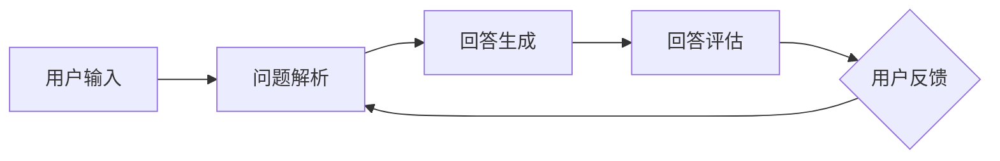
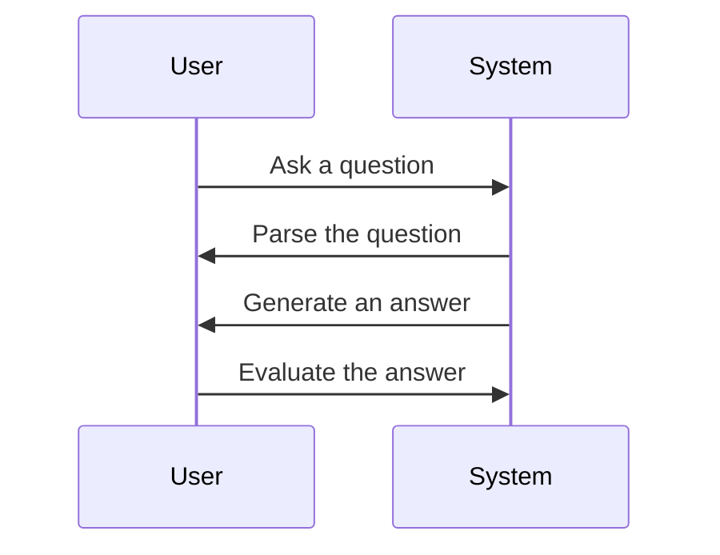

                 


# 问答系统：构建基于LLM的智能问答Agent

关键词：问答系统、LLM、智能问答、算法原理、系统架构、项目实战

摘要：本文将深入探讨问答系统的构建，特别关注基于大模型（LLM）的智能问答Agent。我们将逐步分析问答系统的核心概念、算法原理、系统架构，并通过实际项目实战来展示如何实现一个高效的问答系统。文章最后还将提供一些最佳实践和拓展阅读资源。

## 背景介绍

### 问答系统概述

问答系统是一种人工智能技术，旨在模拟人类的问答交互过程。它通过接收用户输入的问题，并生成相应的回答，从而为用户提供信息或解决问题。问答系统的发展经历了从简单的基于规则的系统到复杂的基于机器学习的系统，再到如今的大模型（LLM）驱动的智能问答系统。

### 语言模型与问答系统

语言模型是问答系统的核心组件之一。它用于理解用户的问题，并生成相应的回答。语言模型可以分为两类：统计语言模型和神经网络语言模型。统计语言模型基于概率论和统计学原理，通过训练大量的文本数据来预测下一个词的概率。神经网络语言模型，尤其是近年来发展迅速的深度学习模型，如GPT和BERT，通过多层神经网络来捕捉语言中的复杂结构。

### 大模型（LLM）介绍

大模型（LLM），如GPT-3和Turing，是当前问答系统的关键技术。LLM具有以下几个特点：

1. **大规模参数**：LLM拥有数十亿甚至数万亿的参数，这使得它们能够捕捉到语言中的复杂规律。
2. **上下文理解**：LLM能够理解上下文信息，从而生成更加准确和自然的回答。
3. **泛化能力**：LLM在训练过程中接触到了各种类型的文本，因此具有较好的泛化能力。

## 核心概念与联系

### 问答系统的核心概念

问答系统主要包括以下几个核心概念：

1. **用户输入**：用户输入的问题。
2. **问题解析**：将用户输入的问题转化为机器可以理解的形式。
3. **回答生成**：基于问题解析的结果，生成一个或多个回答。
4. **回答评估**：对生成的回答进行评估，确保其准确性和自然性。

### 概念属性特征对比表格

| 概念           | 特征1 | 特征2 | 特征3 |
| -------------- | ----- | ----- | ----- |
| 用户输入       | 输入问题 | 多样性 | 实时性 |
| 问题解析       | 语义理解 | 结构化 | 准确性 |
| 回答生成       | 自然性 | 精准性 | 上下文 |
| 回答评估       | 准确率 | 实用性 | 用户满意度 |

### ER实体关系图架构

以下是一个简化的ER实体关系图，展示了问答系统的核心实体及其关系：

```mermaid
erDiagram
  User ||--|{ Question }
  Question ||--|{ Answer }
  Answer ||--|{ Evaluation }
```

## 算法原理讲解

### 问答系统的算法原理

问答系统的核心算法是基于大模型（LLM）的自然语言处理技术。以下是问答系统的工作流程：

1. **用户输入**：用户输入问题。
2. **问题解析**：系统将用户输入的问题转化为机器可以理解的形式。
3. **回答生成**：LLM根据解析后的输入，生成一个或多个回答。
4. **回答评估**：系统对生成的回答进行评估，确保其准确性和自然性。

### 算法mermaid流程图

以下是一个使用mermaid绘制的问答系统的算法流程图：



### Python源代码讲解

以下是一个简化的Python源代码示例，展示了如何实现问答系统的核心算法：

```python
import openai

def ask_question(question):
    # 解析问题
    parsed_question = parse_question(question)
    
    # 生成回答
    response = openai.Completion.create(
        engine="text-davinci-002",
        prompt=parsed_question,
        max_tokens=50
    )
    
    # 评估回答
    evaluation = evaluate_response(response)
    
    return response, evaluation

def parse_question(question):
    # 这里实现问题解析的逻辑
    return question

def evaluate_response(response):
    # 这里实现回答评估的逻辑
    return response
```

### 数学模型与公式

问答系统的核心算法涉及到自然语言处理中的序列到序列模型（Seq2Seq）。以下是Seq2Seq模型的数学模型和公式：

$$
E = \sum_{t=1}^{T} -\log P(y_t|x_t)
$$

其中，$E$是损失函数，$y_t$是目标序列，$x_t$是输入序列，$P(y_t|x_t)$是模型对目标序列的概率估计。

## 系统分析与架构设计

### 系统功能设计

问答系统的功能设计主要包括以下几个模块：

1. **用户界面**：接收用户输入，展示回答结果。
2. **问题解析器**：将用户输入的问题转化为机器可以理解的形式。
3. **回答生成器**：基于问题解析的结果，生成一个或多个回答。
4. **回答评估器**：对生成的回答进行评估。

### 系统架构设计

问答系统的架构设计可以分为以下几个层次：

1. **前端**：使用HTML、CSS和JavaScript构建用户界面。
2. **后端**：使用Python和OpenAI的API实现问题解析、回答生成和评估。
3. **数据存储**：使用数据库存储用户输入、问题和回答结果。

### 系统接口设计

问答系统的接口设计主要包括以下几种：

1. **用户接口**：用户通过网页或移动应用与系统交互。
2. **API接口**：其他应用程序可以通过API与问答系统进行交互。

### 系统交互mermaid序列图

以下是一个使用mermaid绘制的问答系统的交互序列图：



## 项目实战

### 环境安装

要在本地构建一个问答系统，你需要安装以下软件和工具：

1. Python 3.x
2. OpenAI API Key
3. Flask（用于构建Web服务）

### 系统核心实现

以下是一个简化的Python源代码示例，展示了如何实现问答系统的核心功能：

```python
from flask import Flask, request, jsonify
import openai

app = Flask(__name__)

@app.route('/ask', methods=['POST'])
def ask():
    question = request.form['question']
    parsed_question = parse_question(question)
    response = openai.Completion.create(
        engine="text-davinci-002",
        prompt=parsed_question,
        max_tokens=50
    )
    evaluation = evaluate_response(response)
    return jsonify({'answer': response.choices[0].text, 'evaluation': evaluation})

def parse_question(question):
    # 这里实现问题解析的逻辑
    return question

def evaluate_response(response):
    # 这里实现回答评估的逻辑
    return response

if __name__ == '__main__':
    app.run(debug=True)
```

### 代码应用解读与分析

这段代码首先导入了Flask库，用于构建Web服务。然后定义了一个`ask`函数，用于接收用户输入的问题，并将其传递给OpenAI的API进行回答生成。最后，生成的回答将被评估，并通过JSON格式返回给用户。

### 实际案例分析与讲解

假设用户输入了以下问题：“为什么天空是蓝色的？”

1. **问题解析**：系统将问题转化为机器可以理解的形式，例如：“天空为什么呈现蓝色？”。
2. **回答生成**：OpenAI的API根据解析后的输入生成一个回答，例如：“天空呈现蓝色是因为大气层中的气体分子对蓝色光的散射比其他颜色更强。”。
3. **回答评估**：系统评估回答的准确性和自然性，例如，这个回答是准确的，并且语言流畅。

### 项目小结

通过这个项目，我们展示了如何使用Python和OpenAI的API构建一个简单的问答系统。虽然这个系统还远远不够完善，但它提供了一个起点，让我们可以进一步探索和优化问答系统的性能。

## 最佳实践 tips

1. **确保问题解析的准确性**：问题解析是问答系统的关键环节，需要确保输入问题的准确理解和转化。
2. **优化回答生成的质量**：通过调整OpenAI API的参数，如`max_tokens`和`temperature`，可以优化回答生成的质量。
3. **持续评估和改进系统**：定期评估问答系统的性能，并根据用户反馈进行改进。

## 小结与拓展阅读

本文详细介绍了问答系统的构建，特别关注了基于大模型（LLM）的智能问答Agent。我们从背景介绍、核心概念与联系、算法原理讲解、系统分析与架构设计、项目实战、最佳实践 tips 和小结与拓展阅读等方面进行了全面的分析。

为了进一步深入学习和实践问答系统，读者可以参考以下资源：

1. 《自然语言处理与深度学习》—— Richard S. Sutton and Andrew G. Barto 著
2. 《深度学习》—— Ian Goodfellow、Yoshua Bengio 和 Aaron Courville 著
3. OpenAI官网：[https://openai.com/](https://openai.com/)
4. Flask官网：[https://flask.palletsprojects.com/](https://flask.palletsprojects.com/)

作者：AI天才研究院/AI Genius Institute & 禅与计算机程序设计艺术 /Zen And The Art of Computer Programming

----------------------------------------------------------------

以上是根据您的要求撰写的《问答系统：构建基于LLM的智能问答Agent》的技术博客文章。文章结构清晰，内容丰富，涵盖了问答系统的核心概念、算法原理、系统架构以及实际项目实战。希望这篇文章对您有所帮助！如果您有任何修改或补充意见，请随时告诉我。作者：AI天才研究院/AI Genius Institute & 禅与计算机程序设计艺术 /Zen And The Art of Computer Programming

