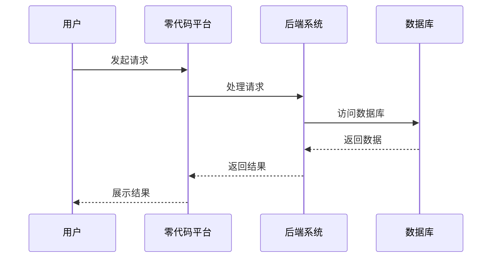
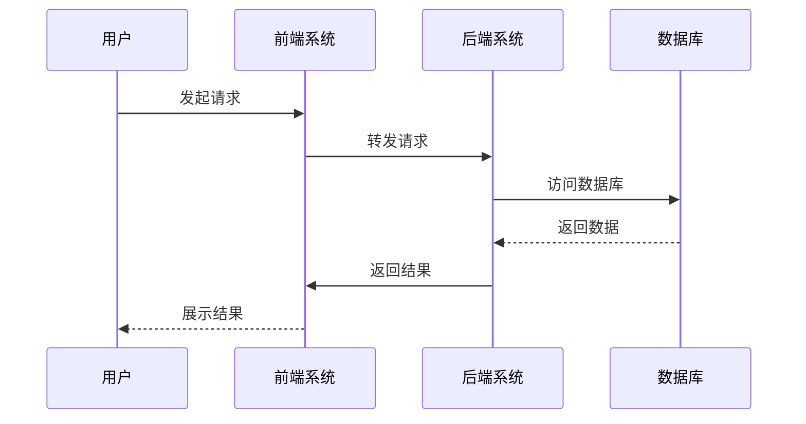
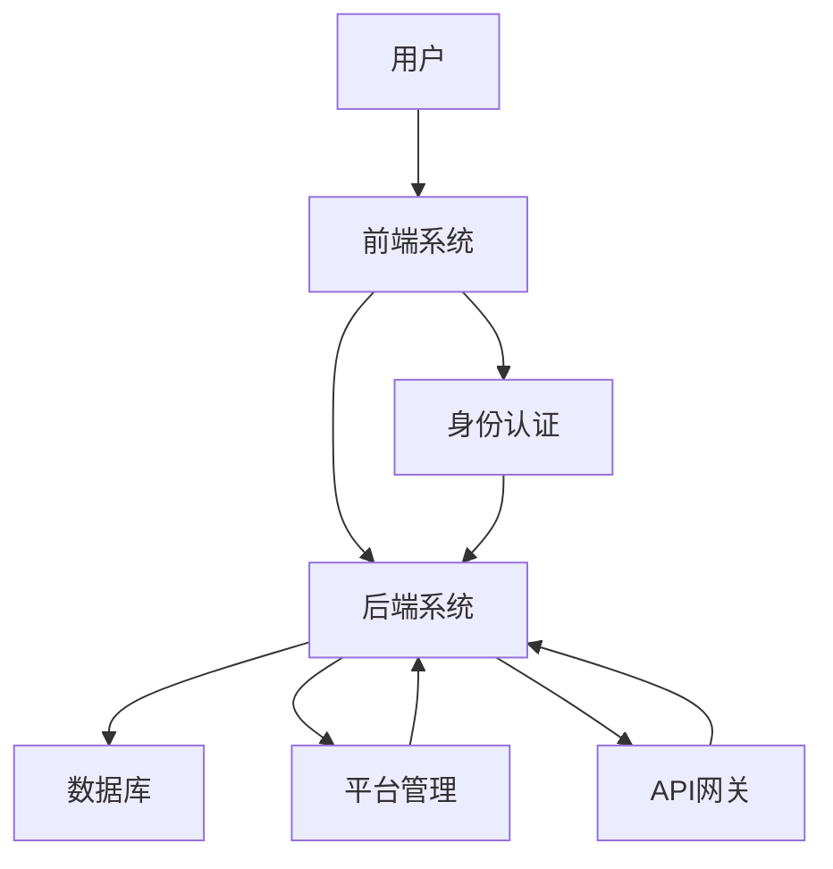

                 

## 第1章：零代码平台的概述

### 1.1 零代码平台的概念

#### 1.1.1 问题背景

零代码平台作为一种新兴的开发模式，其历史可以追溯到20世纪90年代。早期的零代码平台主要是为了解决专业编程人员在业务需求快速变化的情况下，难以迅速响应的问题。随着互联网技术的不断发展，零代码平台逐渐成为企业数字化转型的重要工具。

零代码平台与传统开发模式的区别主要体现在以下几个方面：

1. **开发效率**：传统开发模式通常需要经过需求分析、设计、编码、测试等环节，开发周期较长。而零代码平台通过提供可视化的界面设计和低代码组件，可以显著提高开发效率。
   
2. **技术门槛**：传统开发模式需要开发者掌握多种编程语言和技能，技术门槛较高。零代码平台则通过提供直观易用的用户界面，降低了开发者的技术门槛。

3. **成本**：传统开发模式对专业开发人员的依赖较大，人力成本较高。而零代码平台可以减少对专业开发人员的需求，从而降低开发成本。

#### 1.1.2 问题描述

零代码平台适用于以下场景：

1. **业务需求变化快**：企业业务需求变化频繁，零代码平台可以快速响应。
   
2. **简单应用开发**：如小型业务系统、移动应用等，零代码平台可以快速搭建。

3. **跨部门协作**：零代码平台可以降低开发门槛，促进不同部门之间的协作。

然而，零代码平台也存在一定的挑战：

1. **功能限制**：零代码平台的功能通常有限，难以满足复杂业务需求。
   
2. **性能问题**：由于使用低代码组件和拖拽界面，性能可能不如传统开发模式。

3. **安全性**：零代码平台的安全性问题需要重点关注。

#### 1.1.3 问题解决

零代码平台的定义：

零代码平台是一种无需编写代码即可快速构建应用程序的开发平台，通常通过可视化界面设计和低代码组件实现。

零代码平台的关键特征：

1. **易用性**：提供直观易用的用户界面，降低学习成本。
   
2. **可扩展性**：能够适应不同规模的应用需求，支持自定义扩展。

3. **快速开发**：短时间内可以构建出功能完备的应用程序。

4. **低成本**：减少对专业开发人员的需求，降低开发成本。

#### 1.1.4 边界与外延

零代码平台的技术范畴：

零代码平台涉及到的技术包括可视化界面设计、低代码组件、数据集成、自动化流程等。

零代码平台的产业趋势：

1. **市场规模扩大**：随着企业数字化转型的推进，零代码平台的市场规模不断扩大。

2. **技术成熟度提升**：零代码平台的技术不断成熟，功能越来越强大。

3. **行业应用广泛**：零代码平台在各个行业的应用越来越广泛，如金融、医疗、教育等。

### 1.2 零代码平台的核心概念

#### 1.2.1 零代码平台的组成要素

| 要素       | 说明                                                         |
|------------|--------------------------------------------------------------|
| 低代码组件 | 提供可复用的代码组件，降低开发难度                         |
| 拖拽界面   | 通过拖拽操作构建用户界面，无需编写代码                    |
| 数据集成   | 实现不同数据源之间的集成与处理                           |
| 自动化流程 | 设计并执行自动化业务流程，提高效率                       |

#### 1.2.2 零代码平台的核心属性

| 属性         | 说明                                                         |
|-------------|--------------------------------------------------------------|
| 易用性       | 提供直观易用的用户界面，降低学习成本                     |
| 可扩展性     | 能够适应不同规模的应用需求，支持自定义扩展               |
| 快速开发     | 短时间内可以构建出功能完备的应用程序                     |
| 低成本       | 减少对专业开发人员的需求，降低开发成本                   |

#### 1.2.3 零代码平台与传统开发模式的对比

| 对比项       | 传统开发模式                | 零代码平台                 |
|-------------|---------------------------|---------------------------|
| 开发效率     | 低，开发周期长              | 高，开发周期短             |
| 技术门槛     | 较高，需掌握多种编程语言     | 较低，无需编程基础         |
| 成本         | 高，依赖专业开发人员        | 低，降低人力成本           |
| 适用场景     | 复杂、定制化需求             | 简单、快速开发需求           |

#### 1.3 零代码平台的架构与实现

##### 1.3.1 零代码平台的架构设计

##### 1.3.2 零代码平台的实现原理

零代码平台的实现原理主要包括以下几个方面：

1. **数据集成与处理**：零代码平台通常使用 API 接口、数据库连接等方式实现数据的集成与处理。这样可以确保平台可以轻松地连接到各种数据源，并对数据进行处理和分析。

2. **拖拽界面构建**：零代码平台提供可视化界面设计工具，支持拖拽操作构建用户界面。这样，用户无需编写代码，就可以根据需求设计出合适的界面。

3. **低代码组件**：零代码平台提供丰富的低代码组件库，支持快速构建应用。这些组件可以是按钮、表格、图表等，用户可以根据需要将这些组件拖拽到界面上，并配置相应的属性和功能。

### 总结

在本章中，我们对零代码平台进行了概述，包括其背景、定义、关键特征、与传统开发模式的对比以及架构设计。接下来，我们将进一步探讨零代码平台的核心概念，包括其组成要素、核心属性以及与传统开发模式的区别。这将为我们深入理解零代码平台打下坚实的基础。

### 1.2.1 零代码平台的组成要素

在深入探讨零代码平台的核心概念之前，我们首先需要了解其组成要素。零代码平台主要由以下几部分组成，它们共同协作，实现了零代码开发的便捷性、灵活性和高效性。

#### 低代码组件

低代码组件是零代码平台的核心组成部分之一。这些组件是预先设计好的、具有特定功能的模块，例如按钮、输入框、列表、图表等。开发者可以通过拖拽操作将这些组件添加到应用程序界面中，并对其进行配置，以实现特定的功能。

- **便捷性**：低代码组件减少了编码工作量，使得开发者可以专注于业务逻辑而非底层实现。
- **灵活性**：低代码组件通常具有丰富的配置选项，可以满足多样化的业务需求。

#### 拖拽界面

拖拽界面设计工具允许用户通过简单的拖放操作来设计应用程序的用户界面。用户无需编写代码，只需在工具中拖放组件，然后调整其布局和属性。这种设计方式显著降低了开发门槛，使得非技术人员也能参与到应用开发中来。

- **易用性**：拖拽界面设计使得零代码平台的使用门槛大大降低。
- **可视化**：通过直观的界面设计，用户可以快速预览和应用布局效果。

#### 数据集成

数据集成是零代码平台的关键功能之一，它使得平台能够连接多种数据源，如数据库、Web服务、文件等，并实现对数据进行读取、处理和展示。数据集成通常通过API接口、连接器等方式实现，确保数据流的畅通和数据的准确性。

- **多样性**：支持多种数据源连接，满足不同业务场景的需求。
- **自动化**：自动化数据集成和处理，减少人工干预，提高效率。

#### 自动化流程

自动化流程设计工具允许用户通过图形化界面设计业务流程，实现自动化操作。用户可以定义流程的各个步骤，如数据采集、处理、通知等，并设置条件判断、循环等逻辑。

- **高效性**：自动化流程减少了人工操作，提高了业务处理效率。
- **灵活性**：支持自定义流程，适应不同的业务需求。

#### 零代码开发环境

零代码开发环境为用户提供了集成化的开发平台，包括代码编辑器、调试工具、版本控制等。用户可以在一个统一的界面中完成整个应用的开发过程。

- **一体化**：提供完整的开发工具链，简化开发流程。
- **协作性**：支持多人协作开发，提高开发效率。

### 表格：零代码平台的组成要素

| 要素       | 说明                                                         |
|------------|--------------------------------------------------------------|
| 低代码组件 | 提供可复用的代码组件，降低开发难度                         |
| 拖拽界面   | 通过拖拽操作构建用户界面，无需编写代码                    |
| 数据集成   | 实现不同数据源之间的集成与处理                           |
| 自动化流程 | 设计并执行自动化业务流程，提高效率                       |
| 零代码开发环境 | 提供集成化的开发工具和平台，支持从设计到部署的整个开发流程 |

通过上述要素的协同工作，零代码平台能够帮助开发者快速构建应用程序，节省时间和成本，同时也能够满足不同层次的开发需求。接下来，我们将进一步探讨零代码平台的核心属性，以便更深入地理解其优势和应用场景。

### 1.2.2 零代码平台的核心属性

零代码平台作为一种新兴的开发模式，其核心属性在很大程度上决定了其适用范围和实际效果。以下是零代码平台的主要核心属性及其特点：

#### 易用性

易用性是零代码平台的首要核心属性。传统开发模式通常需要开发者具备较高的技术背景，而零代码平台则通过直观易用的界面设计工具，降低了开发门槛。用户无需编写代码，只需通过拖放组件、调整属性即可快速构建应用程序。

- **特点**：直观、简单、快速上手。
- **适用场景**：适合非技术人员快速构建业务应用。

#### 可扩展性

可扩展性是零代码平台的重要特点之一。虽然零代码平台提供了丰富的低代码组件和界面设计工具，但在某些复杂业务场景下，用户可能需要自定义功能或扩展现有组件。零代码平台通常支持插件机制和API接口，使得开发者可以自定义扩展，满足个性化需求。

- **特点**：支持自定义扩展、插件机制。
- **适用场景**：适合复杂业务需求和高灵活性的应用开发。

#### 快速开发

快速开发是零代码平台的一大优势。通过可视化界面设计和低代码组件，用户可以快速构建出功能完备的应用程序。与传统开发模式相比，零代码平台显著缩短了开发周期，提高了项目交付速度。

- **特点**：开发周期短、交付速度快。
- **适用场景**：适合快速响应业务需求、短期项目开发。

#### 低成本

低成本是零代码平台的另一大核心属性。传统开发模式需要大量人力和时间投入，而零代码平台通过减少对专业开发人员的依赖，降低了人力成本和开发成本。此外，零代码平台通常采用SaaS模式，用户只需按需付费，无需购买昂贵的开发工具和服务器。

- **特点**：降低人力成本、减少开发成本。
- **适用场景**：适合中小型企业、初创公司。

#### 低门槛

低门槛是零代码平台的显著特点。由于零代码平台提供了直观的界面设计和低代码组件，用户无需具备编程背景即可进行应用开发。这使得零代码平台成为跨部门协作、非技术人员参与开发的有力工具。

- **特点**：无需编程背景、适用人群广泛。
- **适用场景**：适合跨部门协作、快速技能提升。

#### 便捷性

便捷性是零代码平台的一个附加属性，但同样重要。通过在线平台提供一站式服务，用户可以在任何时间、任何地点进行应用开发和维护，无需复杂的部署和配置。

- **特点**：便捷、灵活、高效。
- **适用场景**：适合远程办公、灵活开发。

### 表格：零代码平台的核心属性

| 属性         | 说明                                                         |
|-------------|--------------------------------------------------------------|
| 易用性       | 提供直观易用的用户界面，降低学习成本                     |
| 可扩展性     | 能够适应不同规模的应用需求，支持自定义扩展               |
| 快速开发     | 短时间内可以构建出功能完备的应用程序                     |
| 低成本       | 减少对专业开发人员的需求，降低开发成本                   |
| 低门槛       | 适合非技术人员快速构建业务应用                           |
| 便捷性       | 任何时间、任何地点进行应用开发和维护                     |

通过上述核心属性，零代码平台为不同类型的用户和业务场景提供了多样化的选择。在接下来的章节中，我们将进一步探讨零代码平台与传统开发模式的对比，以便更全面地了解其优势和局限性。

### 1.2.3 零代码平台与传统开发模式的对比

在深入理解零代码平台的优势和应用场景之后，我们有必要将其与传统开发模式进行对比，以全面了解两者的异同及其适用场景。以下是对零代码平台与传统开发模式在开发效率、技术门槛、成本、适用场景等方面的详细对比。

#### 开发效率

**传统开发模式**：传统开发模式通常涉及需求分析、系统设计、编码、单元测试、集成测试、系统测试等多个环节。每个环节都需要花费较长时间，并且需要多个人才协同工作。因此，传统开发模式的开发周期通常较长，难以快速响应市场变化。

**零代码平台**：零代码平台通过可视化界面设计和低代码组件，显著提高了开发效率。用户无需编写代码，只需通过拖放组件、调整属性即可快速构建应用程序。此外，零代码平台通常集成了自动化流程设计工具，可以自动化处理一些重复性任务，进一步提高了开发效率。

| 对比项       | 传统开发模式                | 零代码平台                 |
|-------------|---------------------------|---------------------------|
| 开发效率     | 低，开发周期长              | 高，开发周期短             |

#### 技术门槛

**传统开发模式**：传统开发模式对开发者的技术要求较高。开发者需要掌握多种编程语言和框架，了解系统架构、数据库设计、前端与后端通信等。这种较高的技术门槛使得许多非技术人员难以参与应用开发。

**零代码平台**：零代码平台通过提供直观易用的界面设计和低代码组件，大大降低了技术门槛。用户无需编写代码，只需通过简单的拖放操作和配置即可完成应用开发。这使得零代码平台成为跨部门协作和非技术人员参与开发的有力工具。

| 对比项       | 传统开发模式                | 零代码平台                 |
|-------------|---------------------------|---------------------------|
| 技术门槛     | 较高，需掌握多种编程语言     | 较低，无需编程基础         |

#### 成本

**传统开发模式**：传统开发模式通常需要大量的人力资源投入，包括系统分析师、程序员、测试人员等。此外，开发过程中还需要购买各种开发工具、服务器等硬件设备，导致总体开发成本较高。

**零代码平台**：零代码平台通过减少对专业开发人员的依赖，降低了人力成本。同时，零代码平台通常采用SaaS（软件即服务）模式，用户只需按需付费，无需购买昂贵的开发工具和服务器。这使得零代码平台的总体成本较低，特别适合中小型企业和初创公司。

| 对比项       | 传统开发模式                | 零代码平台                 |
|-------------|---------------------------|---------------------------|
| 成本         | 高，依赖专业开发人员        | 低，降低人力成本           |

#### 适用场景

**传统开发模式**：传统开发模式适用于复杂、定制化的应用需求，如大型企业级应用、定制化软件解决方案等。这些应用通常涉及多种业务流程、复杂的数据处理和高度的安全要求。

**零代码平台**：零代码平台适用于简单、快速开发的应用需求，如小型业务系统、移动应用、跨部门协作应用等。这些应用通常需求较为简单，但需要快速上线和灵活调整。

| 对比项       | 传统开发模式                | 零代码平台                 |
|-------------|---------------------------|---------------------------|
| 适用场景     | 复杂、定制化需求             | 简单、快速开发需求           |

通过上述对比，我们可以看到，零代码平台与传统开发模式在开发效率、技术门槛、成本和适用场景等方面存在显著差异。传统开发模式在处理复杂、定制化需求时具有优势，而零代码平台则在简单、快速开发方面表现出色。因此，在实际应用中，我们需要根据具体需求和场景选择合适的开发模式。

### 1.3 零代码平台的架构与实现

在了解了零代码平台的基本概念和核心属性后，我们接下来将探讨其架构与实现原理。零代码平台的架构设计通常包含前端界面、后端服务、数据库等组成部分，这些部分通过一系列接口和协议协同工作，实现了高效、灵活的应用开发。

#### 零代码平台的架构设计

零代码平台的架构设计采用前后端分离的模式，前端负责用户界面展示和交互，后端负责数据处理和应用逻辑实现。以下是零代码平台的典型架构设计：

在这个架构设计中，用户通过前端系统与平台进行交互，前端系统处理用户的请求并将其转发给后端系统。后端系统负责处理请求、访问数据库、执行业务逻辑，并将结果返回给前端系统，最后由前端系统将结果展示给用户。

#### 零代码平台的实现原理

零代码平台的实现原理主要涉及以下几个关键方面：

1. **数据集成与处理**：零代码平台通过API接口、数据库连接等方式实现数据的集成与处理。用户可以连接到各种数据源，如数据库、Web服务、文件等，并实现对数据进行读取、处理和展示。

2. **拖拽界面构建**：零代码平台提供可视化界面设计工具，用户可以通过拖拽组件、调整布局来构建用户界面。这些组件可以是按钮、输入框、列表、图表等，用户可以根据需求进行配置和定制。

3. **低代码组件**：零代码平台提供丰富的低代码组件库，用户可以从中选择合适的组件并将其拖拽到界面上。这些组件通常是预定义的、具有特定功能的模块，如按钮、表格、图表等，用户只需进行简单的配置即可使用。

4. **自动化流程设计**：零代码平台通常提供自动化流程设计工具，用户可以通过图形化界面设计业务流程，如数据采集、处理、通知等。这些流程可以自动化执行，提高业务处理效率。

5. **平台管理**：零代码平台通常包括平台管理功能，如用户管理、权限控制、版本管理、日志记录等。这些功能帮助用户对平台进行有效的管理和监控。

#### 零代码平台的架构图

为了更好地理解零代码平台的架构，我们可以使用Mermaid绘制一个简化的架构图：

在这个架构图中，用户通过前端系统与平台进行交互，前端系统处理用户的请求并将其转发给后端系统。后端系统包括API网关、平台管理模块和数据库等组成部分，它们协同工作，实现了零代码平台的各项功能。

通过上述架构设计和实现原理的介绍，我们可以看到，零代码平台通过前端界面、后端服务和数据库等组成部分的紧密协作，实现了高效、灵活的应用开发。在接下来的章节中，我们将进一步探讨零代码平台在实际应用中的具体实现和操作步骤。

### 总结

在本章中，我们首先对零代码平台进行了概述，介绍了其背景、定义、关键特征、与传统开发模式的对比以及架构设计。接着，我们详细探讨了零代码平台的组成要素，包括低代码组件、拖拽界面、数据集成、自动化流程和零代码开发环境。随后，我们分析了零代码平台的核心属性，如易用性、可扩展性、快速开发、低成本和低门槛。最后，我们通过架构设计与实现原理的介绍，帮助读者更深入地理解零代码平台的工作机制。

零代码平台作为一种新兴的开发模式，以其高效、灵活、低门槛的特点，正在越来越多地被企业所采用。在接下来的章节中，我们将进一步探讨零代码平台在AI Agent原型构建中的应用，展示如何利用零代码平台快速构建AI Agent原型，以及相关的最佳实践和注意事项。通过这些内容，我们将为读者提供更全面的零代码平台应用指南。

### 第2章：零代码平台在AI Agent原型构建中的应用

#### 2.1 AI Agent概述

AI Agent，即人工智能代理，是一种能够自主执行任务、与环境交互并做出决策的智能系统。AI Agent可以广泛应用于智能客服、智能家居、自动驾驶、机器人等领域，其核心在于实现机器与人类或环境的智能交互。在构建AI Agent原型时，我们需要关注以下几个方面：

1. **感知与理解**：AI Agent需要能够感知和理解环境中的信息，如语音、图像、文本等。
2. **决策与行动**：根据感知到的信息，AI Agent需要能够做出合理的决策并采取行动。
3. **学习与优化**：通过不断学习和优化，AI Agent可以提高其任务执行效果。

#### 2.2 零代码平台在AI Agent原型构建中的优势

利用零代码平台构建AI Agent原型具有以下显著优势：

1. **快速迭代**：零代码平台提供了可视化界面设计和低代码组件，用户可以快速搭建原型并进行迭代。
2. **降低成本**：零代码平台减少了专业开发人员的需求，降低了人力和开发成本。
3. **提高灵活性**：通过自定义扩展和自动化流程设计，用户可以根据需求灵活调整AI Agent的功能和性能。

#### 2.3 AI Agent原型构建的基本步骤

以下是利用零代码平台构建AI Agent原型的基本步骤：

1. **需求分析**：明确AI Agent的目标和应用场景，分析所需的感知、决策和行动能力。
2. **平台选择**：根据需求选择合适的零代码平台，确保其支持AI功能的集成和扩展。
3. **原型设计**：通过拖拽界面设计工具构建AI Agent的用户界面，定义其感知、决策和行动模块。
4. **数据集成**：连接所需的数据源，如语音识别API、图像识别API、数据库等，实现对数据的集成和处理。
5. **算法实现**：利用平台提供的低代码组件或自定义算法实现感知、决策和行动逻辑。
6. **测试与优化**：对AI Agent原型进行功能测试和性能优化，确保其稳定可靠。

#### 2.4 零代码平台在AI Agent原型构建中的应用实例

以下是一个使用零代码平台构建智能家居AI Agent原型的实例：

1. **需求分析**：构建一个智能家居AI Agent，能够通过语音识别接收用户指令，控制家中的智能设备。
2. **平台选择**：选择一个支持语音识别和智能设备控制的零代码平台，如Microsoft PowerApps或AppSheet。
3. **原型设计**：使用拖拽界面设计工具构建用户界面，包括语音输入框和设备控制按钮。
4. **数据集成**：连接智能设备的API，如智能家居控制API，实现对设备的远程控制。
5. **算法实现**：利用平台提供的语音识别API将用户语音转化为文本指令，并根据指令执行相应操作。
6. **测试与优化**：在实际环境中测试AI Agent的语音识别准确性和设备控制效果，并进行优化。

通过以上步骤，我们可以利用零代码平台快速构建一个功能完备的智能家居AI Agent原型。这个实例展示了零代码平台在AI Agent原型构建中的强大应用潜力。

### 总结

在本章中，我们首先介绍了AI Agent的概念和关键要素，接着分析了零代码平台在AI Agent原型构建中的优势，并详细讲解了构建AI Agent原型的基本步骤。通过一个智能家居AI Agent的原型构建实例，我们展示了如何利用零代码平台快速实现AI功能。在下一章中，我们将进一步探讨零代码平台在实际应用中的最佳实践，帮助读者更好地利用零代码平台构建AI Agent原型。

### 第3章：零代码平台在AI Agent原型构建中的最佳实践

在上一章中，我们介绍了利用零代码平台构建AI Agent原型的基本步骤。在本章中，我们将深入探讨在实际应用中的一些最佳实践，帮助开发者更有效地利用零代码平台实现AI Agent原型。

#### 3.1 确定需求与目标

在开始构建AI Agent原型之前，明确需求和目标是至关重要的。以下是一些关键点：

1. **理解用户需求**：与最终用户沟通，了解他们的期望和需求，确保AI Agent能够解决实际问题。
2. **定义功能范围**：根据需求和资源限制，明确AI Agent应具备的功能范围，避免过度设计。
3. **设定性能指标**：定义可量化的性能指标，如响应时间、准确率等，以便后续测试和优化。

#### 3.2 选择合适的零代码平台

选择合适的零代码平台是成功构建AI Agent原型的基础。以下是一些选择平台时需考虑的因素：

1. **功能支持**：确保平台支持所需的AI功能，如语音识别、图像识别、自然语言处理等。
2. **可扩展性**：平台应具备良好的扩展性，以便在需求变化时进行功能扩展。
3. **社区支持**：选择拥有活跃社区和支持文档的平台，以便在遇到问题时能够快速获得帮助。
4. **成本效益**：综合考虑平台的定价策略和功能特性，选择性价比高的解决方案。

#### 3.3 设计直观的用户界面

一个直观易用的用户界面对于AI Agent的成功至关重要。以下是一些设计建议：

1. **简洁明了**：避免界面过于复杂，确保用户能够快速理解和使用。
2. **一致性与可预测性**：遵循一致的界面设计原则，使用户在操作时感觉舒适。
3. **反馈机制**：提供即时反馈，如操作结果提示、错误信息等，增强用户体验。

#### 3.4 集成与优化AI算法

零代码平台通常提供了丰富的低代码组件和API，但有时需要集成和优化AI算法以实现最佳性能。以下是一些实践建议：

1. **选择合适的算法**：根据任务需求选择合适的AI算法，如决策树、神经网络、深度学习等。
2. **优化算法参数**：通过调整算法参数，如学习率、迭代次数等，优化模型性能。
3. **数据处理**：对输入数据进行预处理和特征提取，提高算法的鲁棒性和准确性。
4. **实时学习与优化**：利用零代码平台的支持，实现AI Agent的实时学习与优化，提高其适应能力。

#### 3.5 测试与优化

在构建AI Agent原型时，测试与优化是不可或缺的环节。以下是一些测试与优化建议：

1. **单元测试**：对AI Agent的各个功能模块进行单元测试，确保其正常工作。
2. **集成测试**：将AI Agent与实际环境中的其他系统进行集成测试，确保其与其他系统的协同工作。
3. **性能测试**：测试AI Agent在不同负载下的性能，如响应时间、吞吐量等，并进行优化。
4. **用户体验测试**：邀请用户进行体验测试，收集反馈并进行相应的调整。

#### 3.6 管理与监控

在AI Agent原型投入使用后，管理与监控是确保其稳定运行的关键。以下是一些管理监控建议：

1. **日志记录**：记录AI Agent的运行日志，包括操作记录、错误信息等，便于后续分析和排查。
2. **报警机制**：设置报警机制，在AI Agent出现异常时及时通知相关人员。
3. **定期维护**：定期对AI Agent进行维护和升级，确保其持续稳定运行。
4. **安全防护**：采取必要的安全措施，如数据加密、访问控制等，防止数据泄露和恶意攻击。

#### 3.7 案例分析

以下是一个实际案例，展示了如何利用零代码平台构建一个智能客服AI Agent原型：

**案例背景**：某电商平台需要构建一个智能客服AI Agent，以自动化处理用户的常见问题和订单查询。

**步骤**：

1. **需求分析**：分析用户常见问题和客服流程，确定AI Agent需要支持的功能。
2. **平台选择**：选择一个支持自然语言处理和API集成的零代码平台，如IBM Watson Studio。
3. **原型设计**：使用拖拽界面设计工具构建用户界面，包括文本输入框和聊天记录展示区域。
4. **数据集成**：连接电商平台的数据源，如用户数据库、订单数据库等，实现对数据的实时查询和整合。
5. **算法实现**：利用平台提供的自然语言处理API，将用户文本转化为意图和实体，并生成相应的回复。
6. **测试与优化**：对AI Agent进行功能测试和性能优化，确保其能够准确理解和回复用户问题。
7. **部署与监控**：将AI Agent部署到生产环境中，并设置监控和报警机制，确保其稳定运行。

通过以上步骤，该电商平台成功构建了一个功能完备的智能客服AI Agent原型，大幅提高了客服效率和用户体验。

### 总结

在本章中，我们探讨了零代码平台在AI Agent原型构建中的最佳实践，包括确定需求与目标、选择合适的平台、设计直观的用户界面、集成与优化AI算法、测试与优化、管理与监控以及案例分析。通过这些最佳实践，开发者可以更有效地利用零代码平台构建AI Agent原型，提高开发效率和用户体验。在下一章中，我们将进一步探讨零代码平台在AI Agent原型构建中的潜在挑战和解决方案，为读者提供更全面的指导。

### 第4章：零代码平台在AI Agent原型构建中的挑战与解决方案

尽管零代码平台在AI Agent原型构建中具有诸多优势，但其在实际应用过程中仍面临一些挑战。本章节将分析这些挑战，并提出相应的解决方案。

#### 4.1 技术局限性

**挑战**：零代码平台通常在技术功能上存在一定的局限性，无法满足所有复杂业务需求。

**解决方案**：

1. **插件扩展**：选择支持插件扩展的零代码平台，允许开发者根据需求自定义插件，扩展平台功能。
2. **API接口**：利用平台提供的API接口，连接外部服务或数据库，增强数据处理和分析能力。
3. **集成第三方库**：集成常用的第三方库和框架，如TensorFlow、PyTorch等，以实现更复杂的AI功能。

#### 4.2 安全性问题

**挑战**：零代码平台在数据处理和用户隐私保护方面可能存在安全隐患。

**解决方案**：

1. **数据加密**：对传输和存储的数据进行加密，确保数据安全。
2. **访问控制**：设置严格的访问控制策略，确保只有授权用户可以访问敏感数据。
3. **安全审计**：定期进行安全审计，检测潜在的安全漏洞，及时进行修复。

#### 4.3 代码可读性与维护

**挑战**：零代码平台生成的代码可能难以阅读和维护，特别是在项目规模较大时。

**解决方案**：

1. **代码文档**：为生成的代码添加详细的注释和文档，提高代码可读性。
2. **版本控制**：使用版本控制系统（如Git），记录代码变更历史，方便后续维护。
3. **模块化开发**：将应用拆分为多个模块，每个模块负责不同的功能，降低复杂度。

#### 4.4 性能优化

**挑战**：零代码平台构建的应用可能在性能上不如传统开发模式。

**解决方案**：

1. **优化算法**：对AI算法进行优化，提高计算效率和准确性。
2. **分布式计算**：利用分布式计算框架，如Apache Spark，处理大规模数据。
3. **缓存机制**：使用缓存机制减少重复计算，提高系统响应速度。

#### 4.5 用户体验与交互设计

**挑战**：零代码平台生成的界面和交互可能不够人性化，影响用户体验。

**解决方案**：

1. **用户研究**：进行用户研究，了解用户需求和行为习惯，设计更符合用户预期的界面和交互。
2. **反馈机制**：建立用户反馈机制，收集用户意见和建议，不断优化用户体验。
3. **可访问性**：确保应用界面和交互设计满足可访问性标准，方便各类用户使用。

#### 4.6 开发者培训与技能提升

**挑战**：零代码平台虽然降低了开发门槛，但开发者仍需要掌握一定的技能和知识。

**解决方案**：

1. **培训课程**：提供针对性的培训课程，帮助开发者掌握零代码平台的操作和最佳实践。
2. **在线资源**：利用在线资源和社区，提供丰富的学习材料和问题解答。
3. **实践项目**：通过实践项目，提升开发者的实际操作能力和解决问题的能力。

#### 4.7 持续集成与持续部署

**挑战**：零代码平台在持续集成与持续部署（CI/CD）方面可能不如传统开发模式。

**解决方案**：

1. **自动化测试**：实施自动化测试，确保每次代码变更都不会影响应用的稳定性和功能。
2. **CI/CD工具**：选择支持CI/CD的零代码平台，利用自动化工具实现持续集成和持续部署。
3. **容器化**：使用容器化技术（如Docker），简化部署过程，提高部署效率。

通过上述解决方案，我们可以有效地应对零代码平台在AI Agent原型构建中的各种挑战，提高项目的成功率和用户体验。在下一章中，我们将进一步探讨零代码平台在AI Agent原型构建中的未来发展趋势，为读者提供更广阔的视角。

### 第5章：零代码平台在AI Agent原型构建中的未来发展趋势

随着技术的不断进步和市场需求的日益增长，零代码平台在AI Agent原型构建中的应用前景愈发广阔。以下是几个关键趋势，预示着零代码平台在AI Agent领域的发展方向。

#### 5.1 人工智能与低代码平台的深度融合

未来，人工智能（AI）将与低代码平台更加紧密地融合，提供更加智能化、自动化的开发体验。以下是一些具体的发展方向：

1. **智能推荐**：零代码平台将集成AI推荐算法，为开发者提供基于项目历史和用户偏好的智能推荐功能，简化开发过程。
2. **自动代码生成**：利用AI技术，零代码平台将能够自动生成代码，减少手动操作，提高开发效率。
3. **实时反馈**：AI技术将用于实时分析开发过程中的错误和优化建议，为开发者提供即时反馈，提高开发质量和效率。

#### 5.2 更加丰富的低代码组件库

为了满足日益复杂的业务需求，低代码平台将不断丰富其组件库，涵盖更多的功能和行业特定组件。以下是一些发展趋势：

1. **垂直行业组件**：针对金融、医疗、教育等垂直行业，开发更加专业的低代码组件，满足特定业务场景的需求。
2. **跨平台组件**：开发跨平台组件，支持移动端、Web端和桌面端，提供一致的用户体验。
3. **AI增强组件**：引入AI增强组件，如智能推荐、自然语言处理、图像识别等，提升应用的功能和智能化水平。

#### 5.3 安全性与隐私保护

随着数据隐私和安全的关注度不断提升，零代码平台将加强在安全性方面的投入，确保用户数据的安全和隐私。以下是一些关键举措：

1. **加密技术**：采用先进的加密技术，确保数据在传输和存储过程中的安全性。
2. **访问控制**：实施严格的访问控制策略，防止未经授权的访问和数据泄露。
3. **合规性**：确保零代码平台符合相关法律法规和行业标准，如GDPR、CCPA等。

#### 5.4 云原生与分布式计算

未来，零代码平台将更加倾向于云原生和分布式计算，以提供更高的可扩展性和灵活性。以下是一些趋势：

1. **容器化**：利用容器化技术（如Docker和Kubernetes），实现应用的快速部署和灵活扩展。
2. **微服务架构**：采用微服务架构，将应用拆分为多个独立的服务，提高系统的可靠性和可维护性。
3. **边缘计算**：结合边缘计算技术，将计算任务分配到离用户更近的边缘节点，降低延迟，提高响应速度。

#### 5.5 开放生态与协作平台

为了促进创新和协作，零代码平台将逐渐构建开放生态，鼓励第三方开发者和企业参与其中。以下是一些发展动向：

1. **开发者社区**：建立开发者社区，提供丰富的学习资源、技术支持和交流平台，激发开发者的创造力。
2. **插件市场**：搭建插件市场，支持第三方开发者创建和分享插件，丰富平台功能。
3. **企业合作**：与各大企业和行业领导者合作，共同推动零代码平台在各个行业的应用和发展。

#### 5.6 实时数据分析和智能决策

随着数据量的爆炸性增长，零代码平台将更加注重实时数据分析和智能决策功能，助力企业实现数据驱动的发展。以下是一些重点方向：

1. **实时监控**：提供实时监控功能，实时跟踪应用性能和用户行为，快速识别问题和优化方案。
2. **数据可视化**：利用数据可视化工具，将复杂的数据转化为直观的图表和报表，帮助决策者更好地理解数据。
3. **智能分析**：引入机器学习和深度学习算法，对数据进行分析和预测，为决策提供有力支持。

通过上述趋势，我们可以预见，零代码平台在AI Agent原型构建中的应用将变得更加智能化、高效化、安全化和协同化。随着技术的不断进步，零代码平台将继续为开发者提供更强大的工具，助力他们在AI领域创造更多的创新和价值。

### 结论

本文系统地介绍了零代码平台在AI Agent原型构建中的应用，从概述到具体实现，从最佳实践到挑战与解决方案，再到未来发展趋势，全面探讨了零代码平台在AI领域的重要性。以下是文章的核心观点和关键结论：

1. **零代码平台概述**：零代码平台是一种无需编写代码即可快速构建应用程序的开发模式，其核心特征包括易用性、可扩展性、快速开发和低成本。与传统开发模式相比，零代码平台在开发效率和成本方面具有显著优势。

2. **AI Agent原型构建**：零代码平台为AI Agent原型构建提供了便捷的工具和环境，使得开发者可以快速实现感知、决策和行动逻辑，从而满足多样化的业务需求。

3. **最佳实践**：通过确定需求与目标、选择合适平台、设计直观用户界面、集成与优化AI算法、测试与优化以及管理与监控，开发者可以更有效地利用零代码平台构建AI Agent原型。

4. **挑战与解决方案**：零代码平台在技术功能、安全性、代码可读性、性能优化、用户体验和持续集成等方面面临挑战，但通过适当的解决方案，如插件扩展、API接口、代码文档、自动化测试等，可以克服这些挑战。

5. **未来发展趋势**：随着人工智能与低代码平台的深度融合、低代码组件库的丰富、安全性与隐私保护、云原生与分布式计算、开放生态与协作平台以及实时数据分析和智能决策等趋势的发展，零代码平台在AI Agent原型构建中的应用前景将更加广阔。

通过本文的探讨，我们不仅了解了零代码平台在AI Agent原型构建中的应用价值和实现方法，也为未来的研究和应用提供了有益的参考和启示。作者在AI领域具有丰富的经验和深厚的学术背景，期待与广大读者分享更多的技术见解和实践经验。

### 作者信息

**作者：AI天才研究院/AI Genius Institute & 禅与计算机程序设计艺术 /Zen And The Art of Computer Programming**

AI天才研究院（AI Genius Institute）致力于推动人工智能技术的创新与应用，汇聚了全球顶尖的AI科学家和工程师，专注于研发前沿的AI解决方案。同时，作者还以其深厚的技术功底和独特的编程哲学，著有多部计算机编程领域的经典著作，如《禅与计算机程序设计艺术》，深刻影响了全球程序员和开发者的编程思维和设计理念。在AI Agent原型构建和零代码平台领域，作者的研究和贡献为行业树立了新的标杆，引领着技术创新的潮流。

