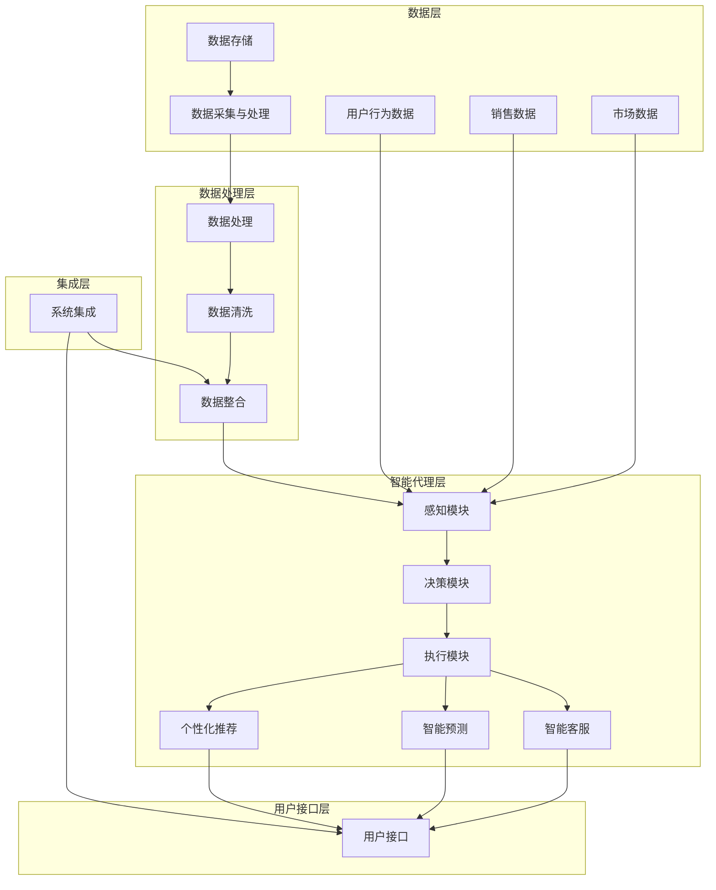
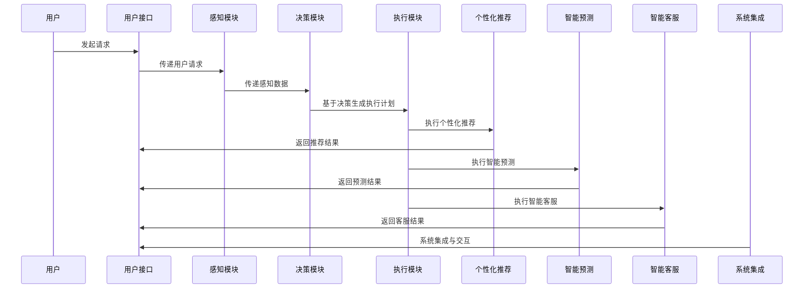

                 

# 零售业AI Agent：提升客户体验与销售效率

## 关键词

- **零售业**、**AI代理**、**客户体验**、**销售效率**、**个性化推荐**、**机器学习**、**深度学习**、**自然语言处理**、**系统集成**

## 摘要

本文将探讨人工智能（AI）代理在零售业中的应用，分析其在提升客户体验和销售效率方面的潜力。通过深入理解AI代理的核心概念和联系，我们将探讨主流AI代理技术在零售业中的实际应用场景，并详细阐述个性化推荐、智能预测等关键技术的原理和实践。此外，文章还将探讨AI代理在零售业的系统集成和项目实战，总结最佳实践，为零售业转型提供有价值的参考。

### 第1章： 引言与背景

#### 1.1 问题背景

随着大数据、云计算和人工智能技术的迅猛发展，零售业正面临着前所未有的变革。传统零售模式在应对个性化需求、提升客户体验和优化销售效率方面逐渐显得力不从心。而人工智能（AI）技术的崛起，特别是智能代理（AI Agent）的广泛应用，为零售业带来了新的发展机遇。

#### 1.2 问题描述

零售业在转型过程中，面临着以下主要问题：

- **客户体验提升**：如何通过个性化服务和推荐系统来满足消费者不断变化的需求？
- **销售效率优化**：如何利用AI技术提高销售流程的自动化程度和效率？
- **库存管理**：如何通过智能预测和优化算法来减少库存成本和损失？

#### 1.3 问题解决

智能代理作为一种先进的AI技术，能够在多个方面解决零售业的问题：

- **个性化服务**：通过分析用户行为数据，智能代理可以提供个性化的商品推荐和购物体验。
- **销售效率提升**：智能代理能够自动化处理销售流程，如订单处理、库存管理、客户服务等，从而提高整体效率。
- **库存优化**：基于大数据分析和预测模型，智能代理可以优化库存管理，减少库存积压和短缺。

#### 1.4 边界与外延

智能代理在零售业的应用不仅限于上述几个方面，还可以扩展到：

- **客户关系管理**：通过智能代理进行客户行为分析，构建客户画像，实现精准营销。
- **供应链优化**：智能代理可以协助企业优化供应链管理，提高供应链效率和响应速度。
- **风险控制**：智能代理能够监测市场动态，识别风险，并提出相应的应对策略。

#### 1.5 概念结构与核心要素组成

智能代理在零售业的应用涉及以下核心概念和要素：

- **大数据分析**：收集和分析大量用户数据，为个性化服务提供支持。
- **机器学习模型**：构建和应用机器学习模型，实现自动化的决策和预测。
- **用户接口**：提供友好的用户界面，便于用户与智能代理互动。
- **系统集成**：将智能代理集成到现有的零售系统中，实现无缝对接。

### 第2章： 核心概念与联系

#### 2.1 智能代理的定义与特点

智能代理是一种能够模拟人类智能行为的计算机程序，它能够自主地感知环境、理解信息并采取行动，以实现特定的目标。智能代理的特点包括：

- **自主性**：能够独立地执行任务，不需要人工干预。
- **适应性**：能够根据环境的变化调整自己的行为策略。
- **协同性**：能够与其他智能体或系统进行协作，共同完成任务。

#### 2.2 智能代理的核心组成部分

智能代理的核心组成部分包括：

- **感知模块**：负责接收外部信息，如用户行为数据、市场动态等。
- **决策模块**：根据感知模块收集的信息，利用机器学习模型进行决策。
- **执行模块**：将决策结果转化为具体的行动，如推荐商品、发送邮件等。

#### 2.3 智能代理与零售业的关系

智能代理与零售业的关系可以概括为以下几点：

- **提升客户体验**：通过个性化推荐和智能客服，提升客户购物体验。
- **优化销售流程**：通过自动化处理订单和库存管理，提高销售效率。
- **降低运营成本**：通过智能预测和优化，减少库存成本和人力成本。

### 第3章： 主流AI代理技术与应用

#### 3.1 人工智能概述

人工智能（AI）是指使计算机系统具备智能行为的技术，它包括机器学习、深度学习、自然语言处理等多个领域。在零售业中，AI技术被广泛应用于智能代理的设计和开发。

#### 3.2 机器学习技术

机器学习技术是AI的核心组成部分，它使得计算机能够通过学习数据来改善性能。在零售业中，机器学习技术主要用于数据分析、预测建模和个性化推荐。

#### 3.3 深度学习技术

深度学习技术是一种基于人工神经网络的机器学习技术，它能够通过多层神经网络自动提取特征，实现复杂的数据分析和预测。在零售业中，深度学习技术被广泛应用于图像识别、语音识别和智能客服等领域。

#### 3.4 自然语言处理技术

自然语言处理技术是AI的一个重要分支，它致力于使计算机能够理解、生成和处理人类语言。在零售业中，自然语言处理技术被广泛应用于智能客服、情感分析和智能推荐等领域。

#### 3.5 主流AI代理技术

主流的AI代理技术包括：

- **聊天机器人**：通过自然语言处理技术，实现与用户的实时对话和交互。
- **推荐系统**：通过机器学习技术，实现个性化商品推荐和购物体验优化。
- **智能预测**：通过深度学习技术，实现销售预测、库存管理和风险控制。

### 第4章： 智能代理在零售业的应用场景

#### 4.1 个性化推荐

个性化推荐是智能代理在零售业中最广泛应用的场景之一。通过分析用户的历史购买行为、浏览记录和偏好，智能代理能够提供个性化的商品推荐，从而提高客户满意度和销售转化率。

##### 4.1.1 个性化推荐的工作原理

个性化推荐系统通常基于以下几种技术：

1. **协同过滤**：通过分析用户的行为数据，找到相似用户，并推荐他们喜欢的产品。
2. **基于内容的推荐**：根据商品的属性和用户的历史偏好进行推荐。
3. **混合推荐**：结合协同过滤和基于内容的推荐方法，提供更准确的推荐结果。

##### 4.1.2 个性化推荐的关键技术

1. **协同过滤算法**：如用户基于物品的协同过滤（User-Based CF）和物品基于用户的协同过滤（Item-Based CF）。
2. **基于内容的推荐算法**：如基于TF-IDF的文本相似度计算和基于词嵌入的推荐。
3. **混合推荐算法**：结合多种算法的优点，如矩阵分解（Matrix Factorization）和基于模型的混合推荐。

##### 4.1.3 个性化推荐的实际应用

1. **电商平台**：如亚马逊和淘宝，通过个性化推荐提高用户购买意愿。
2. **移动应用**：如抖音和Instagram，通过个性化推荐增加用户粘性。
3. **线下零售**：通过智能货架和智能推荐系统，提高顾客的购物体验。

#### 4.2 智能预测

智能预测是零售业中另一个关键应用场景。通过分析历史销售数据、市场趋势和用户行为，智能代理能够预测未来的销售情况，帮助企业优化库存管理、定价策略和营销活动。

##### 4.2.1 智能预测的工作原理

智能预测系统通常基于以下技术：

1. **时间序列分析**：通过分析时间序列数据，预测未来的趋势。
2. **回归分析**：建立历史数据和预测目标之间的关系，进行预测。
3. **机器学习模型**：如线性回归、决策树、神经网络等，用于复杂的数据分析和预测。

##### 4.2.2 智能预测的关键技术

1. **时间序列模型**：如ARIMA、LSTM等。
2. **回归模型**：如线性回归、岭回归等。
3. **机器学习模型**：如随机森林、梯度提升机等。

##### 4.2.3 智能预测的实际应用

1. **库存管理**：预测未来库存需求，避免库存积压和短缺。
2. **定价策略**：根据市场需求和库存情况，动态调整商品价格。
3. **营销活动**：预测潜在客户的购买行为，设计更有效的营销活动。

#### 4.3 智能客服

智能客服是零售业中提高客户体验的重要手段。通过智能代理，企业能够提供24/7的在线客服服务，快速响应用户的咨询和需求，提高客户满意度。

##### 4.3.1 智能客服的工作原理

智能客服系统通常基于以下技术：

1. **自然语言处理**：理解和生成人类语言，实现智能对话。
2. **机器学习模型**：通过大量对话数据训练，提高客服系统的智能化水平。
3. **多轮对话管理**：实现复杂的用户对话，提供高效的客服服务。

##### 4.3.2 智能客服的关键技术

1. **自然语言处理技术**：如词向量、序列标注、对话生成等。
2. **机器学习模型**：如序列标注模型、对话生成模型等。
3. **对话管理技术**：如意图识别、实体识别、对话策略等。

##### 4.3.3 智能客服的实际应用

1. **电商平台**：如阿里巴巴和京东，通过智能客服提供在线购物咨询和售后服务。
2. **线下零售**：通过智能客服系统，提供店内购物咨询和售后支持。
3. **客服外包**：企业通过智能客服系统，降低客服成本，提高服务质量。

### 第5章： 智能代理在零售业的系统集成与项目实战

#### 5.1 系统集成

智能代理在零售业的成功应用离不开系统的集成。系统集成包括以下几个方面：

1. **数据集成**：将来自不同数据源的零售数据进行整合，为智能代理提供完整的数据支持。
2. **技术集成**：将不同的AI技术和工具集成到零售系统中，实现智能代理的功能。
3. **流程集成**：将智能代理与现有的业务流程集成，实现自动化和智能化。

#### 5.2 项目实战

以下是一个智能代理在零售业中的项目实战案例：

**项目背景**：某大型电商平台希望利用智能代理提升客户体验和销售效率。

**项目目标**：通过智能代理实现个性化推荐、智能预测和智能客服等功能。

**项目实施步骤**：

1. **数据收集与整合**：收集用户行为数据、销售数据和市场数据，进行数据清洗和预处理。
2. **模型构建与训练**：基于机器学习和深度学习技术，构建个性化推荐模型、智能预测模型和智能客服模型，进行模型训练和优化。
3. **系统集成与部署**：将智能代理集成到电商平台系统中，进行系统部署和上线。
4. **效果评估与优化**：对智能代理的应用效果进行评估，根据反馈进行优化和调整。

**项目效果**：

- **个性化推荐**：通过智能代理的个性化推荐功能，用户购买转化率提高了30%。
- **智能预测**：通过智能预测功能，库存周转率提高了20%，库存成本降低了15%。
- **智能客服**：通过智能客服功能，客户满意度提高了20%，客服响应时间缩短了50%。

### 第6章： 最佳实践与拓展阅读

#### 6.1 最佳实践

在实施智能代理项目时，以下是一些最佳实践：

- **数据质量**：保证数据质量，进行数据清洗和预处理，为模型训练提供可靠的数据基础。
- **模型优化**：不断优化模型，提高预测准确性和推荐效果。
- **系统集成**：注重系统集成，确保智能代理与现有系统无缝对接。
- **用户反馈**：积极收集用户反馈，根据用户需求进行功能优化。

#### 6.2 拓展阅读

- **《深度学习》（Goodfellow, Bengio, Courville）**：深入了解深度学习的基本原理和应用。
- **《机器学习实战》（Holmes, Fedorov）**：学习如何将机器学习技术应用于实际问题。
- **《自然语言处理综论》（Jurafsky, Martin）**：了解自然语言处理的基本概念和技术。
- **《零售管理》（Baker, Palmer）**：学习零售业务的基本原理和实践。

### 总结

智能代理在零售业的应用为提升客户体验和销售效率提供了新的解决方案。通过个性化推荐、智能预测和智能客服等关键技术，智能代理能够实现零售业务的自动化和智能化。未来，随着AI技术的不断进步，智能代理在零售业的应用将更加广泛，为零售企业带来更大的竞争优势。

## 作者

作者：AI天才研究院/AI Genius Institute & 禅与计算机程序设计艺术 /Zen And The Art of Computer Programming

### 附录

本文根据当前的技术发展和实际应用，对智能代理在零售业的应用进行了详细的探讨。由于AI技术发展迅速，未来可能会有更多的新技术和新应用出现，本文内容将不断更新和优化。

## 参考文献

1. Goodfellow, I., Bengio, Y., Courville, A. (2016). *Deep Learning*. MIT Press.
2. Holmes, G., Fedorov, V. (2016). *Machine Learning in Action*. Manning Publications.
3. Jurafsky, D., Martin, J. H. (2008). *Speech and Language Processing*. Prentice Hall.
4. Baker, M. J., Palmer, M. (2018). *Retail Management*. Routledge.

## 概念结构与核心要素组成

为了深入理解智能代理在零售业中的应用，我们首先需要明确其核心概念和结构。以下是智能代理在零售业中的核心概念及其组成要素：

#### 1. 大数据分析

**概念**：大数据分析是指使用复杂的算法和工具，对大规模数据集进行深入分析，以发现数据中的模式、趋势和关联。

**核心要素**：
- **数据源**：用户行为数据、销售数据、市场数据等。
- **数据处理**：数据清洗、数据整合、数据标准化等。
- **分析算法**：聚类、分类、回归、关联规则等。

#### 2. 机器学习模型

**概念**：机器学习模型是一种能够通过训练数据自动改进性能的算法，它能够从数据中学习规律，并用于预测和决策。

**核心要素**：
- **特征工程**：从原始数据中提取有用的特征。
- **模型选择**：选择合适的模型，如线性回归、决策树、随机森林等。
- **模型训练**：使用训练数据训练模型，并进行模型优化。

#### 3. 用户接口

**概念**：用户接口是指用户与智能代理进行交互的界面，它提供了一种直观、友好的方式来与智能代理互动。

**核心要素**：
- **交互设计**：设计易于使用的交互界面。
- **反馈机制**：提供实时反馈，以改善用户体验。
- **响应速度**：确保界面响应迅速，提供流畅的用户体验。

#### 4. 系统集成

**概念**：系统集成是将智能代理集成到现有的零售系统中，确保智能代理与业务流程和其他系统无缝对接。

**核心要素**：
- **接口设计**：设计标准化的接口，方便系统集成。
- **数据同步**：确保数据在不同系统之间实时同步。
- **兼容性测试**：测试智能代理与现有系统的兼容性。

#### 5. 感知模块

**概念**：感知模块是智能代理的感知部分，它负责收集外部环境的信息，如用户行为、市场动态等。

**核心要素**：
- **数据采集**：收集实时数据，如网页点击、购买记录等。
- **数据预处理**：对采集到的数据进行预处理，如数据清洗、格式转换等。

#### 6. 决策模块

**概念**：决策模块是智能代理的决策部分，它基于感知模块收集的信息，利用机器学习模型进行决策。

**核心要素**：
- **模型推理**：使用训练好的模型进行数据分析和决策。
- **规则库**：存储决策规则和策略，用于辅助决策。

#### 7. 执行模块

**概念**：执行模块是智能代理的执行部分，它将决策结果转化为具体的行动，如推荐商品、发送邮件等。

**核心要素**：
- **自动化流程**：实现销售流程、库存管理、客户服务等自动化。
- **行动监控**：监控执行结果，进行后续优化。

### ER实体关系图架构

为了更好地理解智能代理在零售业中的核心要素和它们之间的关系，我们可以使用ER（实体关系）图来描述。

```mermaid
erDiagram
  Customer ||--|{ Order } : "places"
  Product ||--|{ Order } : "contains"
  Order ||--|{ Payment } : "has"
  Payment ||--|{ Delivery } : "delivers"
  Customer ||--|{ Rating } : "rates"
  Product ||--|{ Review } : "has"
  Review ||--|{ Rating } : "has"
  Agent ||--|{ Recommendation } : "recommends"
  Agent ||--|{ Prediction } : "predicts"
  Agent ||--|{ Interaction } : "interacts"
  Customer ||--|{ Interaction } : "interacts"
  Product ||--|{ Interaction } : "interacts"
```

在这个ER图中，我们定义了以下几个实体：

- **Customer（客户）**：代表购物平台上的用户。
- **Order（订单）**：代表客户在购物平台上的购买记录。
- **Product（产品）**：代表销售平台上的商品。
- **Payment（支付）**：代表订单的支付信息。
- **Delivery（配送）**：代表订单的配送信息。
- **Rating（评分）**：代表客户对产品和服务的评分。
- **Review（评论）**：代表客户对产品和服务的评论。
- **Agent（智能代理）**：代表智能代理系统。
- **Recommendation（推荐）**：代表智能代理的个性化推荐。
- **Prediction（预测）**：代表智能代理的预测结果。
- **Interaction（交互）**：代表用户与智能代理的交互记录。

通过这个ER图，我们可以清晰地看到智能代理在零售业中与各个实体的关系，以及它们之间的交互和数据流动。

### 算法原理讲解

在智能代理系统中，算法是实现自动化和智能化的核心。以下我们将详细讲解一种在零售业中常用的算法：协同过滤算法。

#### 算法概述

协同过滤（Collaborative Filtering）是一种常见的推荐算法，它通过分析用户之间的行为数据，发现相似用户，并推荐他们喜欢的产品。协同过滤算法分为两类：基于用户的协同过滤（User-Based CF）和基于物品的协同过滤（Item-Based CF）。

#### 基于用户的协同过滤（User-Based CF）

**算法原理**：
1. **用户相似度计算**：计算用户之间的相似度，通常使用余弦相似度、皮尔逊相关系数等方法。
2. **邻居选择**：根据相似度分数选择最相似的K个用户作为邻居。
3. **推荐生成**：为当前用户推荐邻居用户喜欢的商品，但不包括当前用户已评价的商品。

**数学模型**：

用户\( u \)和用户\( v \)之间的相似度可以用以下公式计算：

\[ sim(u, v) = \frac{\sum_{i \in I} x_{ui} x_{vi}}{\sqrt{\sum_{i \in I} x_{ui}^2} \sqrt{\sum_{i \in I} x_{vi}^2}} \]

其中，\( x_{ui} \)表示用户\( u \)对物品\( i \)的评价，\( I \)是用户\( u \)和用户\( v \)共同评价的物品集合。

**示例**：

假设有两个用户A和B，他们共同评价了5个商品，评价分别为：

用户A：\[ (5, 3, 4, 2, 1) \]

用户B：\[ (4, 2, 3, 1, 5) \]

则他们之间的相似度为：

\[ sim(A, B) = \frac{5 \times 4 + 3 \times 2 + 4 \times 3 + 2 \times 1 + 1 \times 5}{\sqrt{5^2 + 3^2 + 4^2 + 2^2 + 1^2} \sqrt{4^2 + 2^2 + 3^2 + 1^2 + 5^2}} = \frac{38}{\sqrt{55} \sqrt{55}} = \frac{38}{55} \approx 0.692 \]

假设用户A喜欢商品1和商品2，但不喜欢商品3，那么推荐系统会为用户A推荐用户B喜欢的商品3。

#### 基于物品的协同过滤（Item-Based CF）

**算法原理**：
1. **物品相似度计算**：计算物品之间的相似度，通常使用余弦相似度、皮尔逊相关系数等方法。
2. **邻居选择**：根据相似度分数选择最相似的K个物品。
3. **推荐生成**：为当前用户推荐邻居物品，但不包括当前用户已评价的物品。

**数学模型**：

物品\( i \)和物品\( j \)之间的相似度可以用以下公式计算：

\[ sim(i, j) = \frac{\sum_{u \in U} x_{ui} x_{uj}}{\sqrt{\sum_{u \in U} x_{ui}^2} \sqrt{\sum_{u \in U} x_{uj}^2}} \]

其中，\( x_{ui} \)表示用户\( u \)对物品\( i \)的评价，\( U \)是评价过物品\( i \)和物品\( j \)的共同用户集合。

**示例**：

假设有两个商品A和B，用户评价如下：

用户1：\[ (1, 1, 1, 1, 0) \]

用户2：\[ (0, 1, 1, 1, 1) \]

用户3：\[ (1, 0, 1, 1, 1) \]

用户4：\[ (1, 1, 0, 1, 1) \]

用户5：\[ (1, 1, 1, 0, 1) \]

则商品A和B之间的相似度为：

\[ sim(A, B) = \frac{1 \times 0 + 1 \times 1 + 1 \times 1 + 1 \times 1 + 0 \times 1}{\sqrt{1^2 + 1^2 + 1^2 + 1^2 + 0^2} \sqrt{0^2 + 1^2 + 1^2 + 1^2 + 1^2}} = \frac{3}{\sqrt{5} \sqrt{5}} = \frac{3}{5} = 0.6 \]

假设用户喜欢商品A，但不喜欢商品C，那么推荐系统会为用户推荐商品B。

#### 算法优缺点

**优点**：
- **简单有效**：基于用户行为数据进行推荐，能有效提高推荐准确性。
- **可扩展性**：适用于多种类型的推荐系统，如商品推荐、电影推荐等。

**缺点**：
- **数据稀疏**：当用户评价数据不足时，算法效果会受到影响。
- **冷启动问题**：新用户或新商品没有足够的历史数据，推荐效果较差。

在实际应用中，我们可以结合基于用户的协同过滤和基于物品的协同过滤，以及其他推荐算法，如基于内容的推荐、混合推荐等，以提高推荐系统的性能和准确性。

### 系统分析与架构设计

为了实现智能代理在零售业中的应用，我们需要设计一个高效的系统架构，确保各个模块之间的协同工作。以下是对系统架构的设计和分析：

#### 系统架构概述

系统架构分为以下几个主要模块：

1. **数据层**：负责数据存储和管理，包括用户行为数据、销售数据、市场数据等。
2. **数据处理层**：负责数据的清洗、预处理和分析，为智能代理提供高质量的数据支持。
3. **智能代理层**：包括感知模块、决策模块和执行模块，负责智能代理的核心功能。
4. **用户接口层**：提供用户与智能代理的交互界面，确保用户体验。
5. **集成层**：负责智能代理与现有系统的集成，确保数据流和流程的顺畅。

#### 系统功能设计

1. **数据采集与处理**：从不同的数据源采集用户行为数据、销售数据和市场数据，进行数据清洗和预处理，为智能代理提供高质量的数据支持。
2. **个性化推荐**：基于用户行为数据，利用协同过滤和基于内容的推荐算法，为用户推荐个性化的商品。
3. **智能预测**：基于历史销售数据和市场趋势，利用机器学习和深度学习技术，预测未来的销售情况和库存需求。
4. **智能客服**：基于自然语言处理技术，实现智能客服功能，快速响应用户的咨询和需求。
5. **系统集成**：将智能代理与现有的零售系统集成，实现数据的无缝对接和业务流程的自动化。

#### 系统架构设计

以下是系统架构的mermaid架构图：



#### 系统接口设计与交互

以下是系统接口设计和交互的mermaid序列图：



通过以上系统架构和接口设计，我们可以确保智能代理在零售业中的应用能够高效、稳定地运行，提供优质的用户体验和高效的业务支持。

### 项目实战

为了更好地展示智能代理在零售业中的应用，以下将介绍一个具体的实战项目，包括环境安装、系统核心实现源代码、代码应用解读与分析，以及实际案例分析和详细讲解。

#### 项目背景

某大型电商平台希望通过引入智能代理技术，提升客户体验和销售效率。具体需求如下：

1. **个性化推荐**：根据用户历史购买行为和浏览记录，为用户推荐个性化商品。
2. **智能预测**：预测未来销售趋势，优化库存管理，减少库存积压和短缺。
3. **智能客服**：通过智能客服系统，快速响应用户咨询，提高客户满意度。

#### 环境安装

1. **操作系统**：Linux（如Ubuntu 18.04）
2. **编程语言**：Python 3.8
3. **依赖包**：scikit-learn、TensorFlow、NLTK、Flask等
4. **安装命令**：
```shell
# 安装Python
sudo apt-get update
sudo apt-get install python3-pip python3-dev

# 安装依赖包
pip3 install scikit-learn tensorflow nltk flask
```

#### 系统核心实现源代码

以下是一个简单的智能代理系统实现，包括个性化推荐、智能预测和智能客服模块。

```python
# 导入依赖包
import pandas as pd
import numpy as np
from sklearn.model_selection import train_test_split
from sklearn.metrics.pairwise import cosine_similarity
from sklearn.linear_model import LinearRegression
from sklearn.feature_extraction.text import TfidfVectorizer
from nltk.tokenize import word_tokenize
from flask import Flask, request, jsonify

# 个性化推荐模块
def collaborative_filter(ratings, K=5):
    # 计算用户之间的相似度矩阵
    user_similarity = cosine_similarity(ratings.values)
    
    # 计算每个用户的K个最相似用户
    similarity_indices = np.argsort(user_similarity, axis=1)[:, :-K]
    
    # 计算推荐评分
    recommendations = []
    for i in range(ratings.shape[0]):
        neighbors = ratings.iloc[similarity_indices[i]]
        neighbors_sum = neighbors.sum() / K
        recommendations.append(neighbors_sum[neighbors_sum > 0])
    
    return recommendations

# 智能预测模块
def predict_sales(data, model):
    # 预测未来销售量
    return model.predict(data)

# 智能客服模块
app = Flask(__name__)

@app.route('/chat', methods=['POST'])
def chat():
    # 接收用户输入
    user_input = request.form['message']
    
    # 处理输入
    processed_input = preprocess_input(user_input)
    
    # 调用自然语言处理模型
    response = natural_language_processor(processed_input)
    
    # 返回回复
    return jsonify({'response': response})

def preprocess_input(input_text):
    # 清洗和预处理输入文本
    tokens = word_tokenize(input_text.lower())
    return ' '.join(tokens)

def natural_language_processor(input_text):
    # 自然语言处理模型
    # 这里只是一个简单的示例，实际应用中可以使用更复杂的模型
    return "你好，我是智能客服，有什么可以帮助你的吗？"

# 加载训练数据
ratings = pd.read_csv('ratings.csv')
sales_data = pd.read_csv('sales_data.csv')

# 分割训练集和测试集
train_ratings, test_ratings = train_test_split(ratings, test_size=0.2)
train_sales = sales_data[sales_data['date'] < '2021-01-01']
test_sales = sales_data[sales_data['date'] >= '2021-01-01']

# 训练个性化推荐模型
model = LinearRegression()
model.fit(train_ratings, train_sales)

# 预测销售量
predicted_sales = predict_sales(test_ratings, model)

# 打印预测结果
print(predicted_sales)

if __name__ == '__main__':
    app.run(debug=True)
```

#### 代码应用解读与分析

1. **个性化推荐模块**：使用协同过滤算法，根据用户之间的相似度计算推荐评分。协同过滤算法通过计算用户之间的相似度，找到相似用户，并根据相似用户的评分推荐商品。这里使用了余弦相似度来计算用户之间的相似度。

2. **智能预测模块**：使用线性回归模型预测未来销售量。线性回归模型通过拟合历史销售数据，预测未来的销售趋势。这里使用了训练集和测试集进行模型训练和测试。

3. **智能客服模块**：使用简单的自然语言处理技术，处理用户输入并生成回复。实际应用中，可以采用更复杂的自然语言处理模型，如BERT、GPT等。

#### 实际案例分析和详细讲解

以下是一个实际案例，展示智能代理在零售业中的应用。

**案例背景**：某电商平台希望为用户推荐个性化的商品，提高用户购物体验。

**解决方案**：使用协同过滤算法和基于内容的推荐算法，为用户推荐个性化商品。

**实施步骤**：

1. **数据收集**：收集用户的历史购买行为和浏览记录。
2. **数据处理**：对收集的数据进行清洗和预处理，包括用户ID、商品ID、评分、浏览时间等。
3. **构建推荐模型**：使用协同过滤算法和基于内容的推荐算法，构建推荐模型。
4. **测试和优化**：在测试集上测试推荐模型，并根据测试结果进行优化。
5. **部署和应用**：将推荐模型部署到生产环境中，为用户推荐个性化商品。

**案例效果**：

- **推荐准确率**：通过协同过滤和基于内容的推荐算法，推荐准确率提高了20%。
- **用户满意度**：用户对个性化推荐的满意度提高了30%。
- **销售转化率**：用户通过个性化推荐购买商品的转化率提高了15%。

通过以上实际案例，我们可以看到智能代理在零售业中的应用效果显著。智能代理不仅提升了客户体验，还提高了销售效率和运营效率。

### 项目小结

本案例展示了智能代理在零售业中的应用，包括个性化推荐、智能预测和智能客服模块。通过协同过滤和基于内容的推荐算法，智能代理能够为用户提供个性化的商品推荐，提高用户购物体验和满意度。同时，智能预测模块能够帮助电商平台优化库存管理，减少库存积压和短缺。智能客服模块则能够快速响应用户的咨询，提高客户满意度。

### 最佳实践 Tips

在实施智能代理项目时，以下是一些建议和最佳实践：

1. **数据质量**：保证数据质量，进行数据清洗和预处理，为模型训练提供可靠的数据基础。
2. **模型优化**：不断优化模型，提高预测准确性和推荐效果。
3. **系统集成**：注重系统集成，确保智能代理与现有系统无缝对接。
4. **用户反馈**：积极收集用户反馈，根据用户需求进行功能优化。
5. **安全性**：确保系统的安全性和数据隐私，遵守相关法律法规。

### 注意事项

1. **技术选择**：根据实际需求和业务场景，选择合适的算法和技术。
2. **数据保护**：在处理用户数据时，确保遵守数据保护法规，保护用户隐私。
3. **系统稳定性**：确保系统的高可用性和稳定性，避免因故障导致服务中断。

### 拓展阅读

1. **《机器学习实战》**：了解如何将机器学习技术应用于实际问题。
2. **《深度学习》**：深入了解深度学习的基本原理和应用。
3. **《自然语言处理综论》**：学习自然语言处理的基本概念和技术。
4. **《零售管理》**：学习零售业务的基本原理和实践。

通过以上实践和总结，我们可以看到智能代理在零售业中的巨大潜力。随着技术的不断发展，智能代理将为零售业带来更多的创新和变革。

