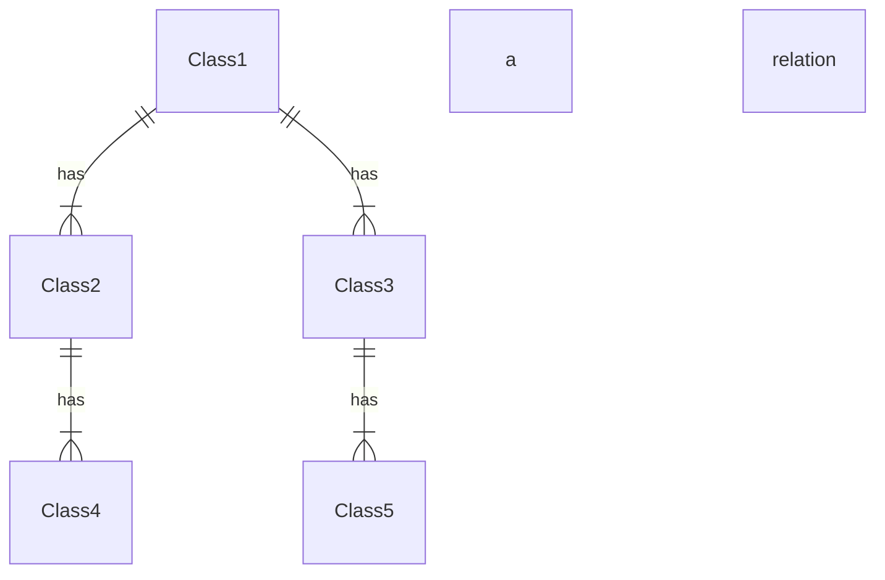
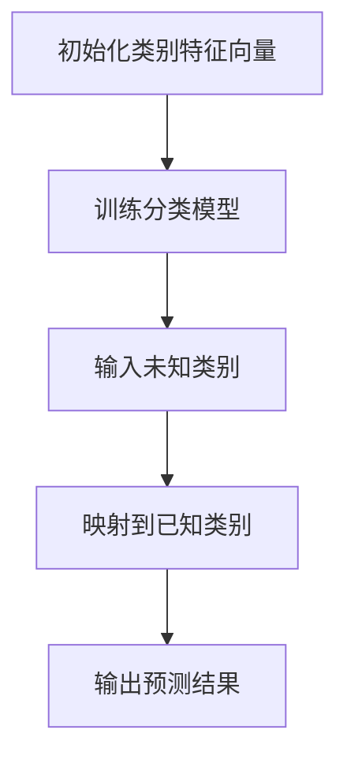
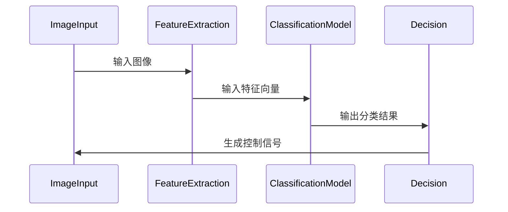

                 

### 文章标题

# 《零样本学习在AI Agent中的应用》

### 文章关键词

- 零样本学习
- AI Agent
- 机器学习
- 概念对比
- 算法讲解
- 系统设计与实现
- 实战案例

### 摘要

本文将深入探讨零样本学习在AI Agent中的应用，从背景介绍、核心概念与联系、算法原理讲解、系统分析与架构设计、项目实战及最佳实践等方面进行详细阐述。通过本文，读者将了解零样本学习的基本原理及其在AI Agent中的具体应用，掌握系统设计与实现的核心技术，并获得宝贵的实战经验和最佳实践建议。

## 《零样本学习在AI Agent中的应用》目录大纲

### 第一部分：背景介绍

#### 第1章：零样本学习概述

##### 1.1 问题背景

- AI Agent的发展现状与挑战
- 零样本学习的重要性与价值

##### 1.2 问题描述

- 传统机器学习与零样本学习对比
- 零样本学习在AI Agent中的应用场景

##### 1.3 问题解决

- 零样本学习的定义
- 零样本学习的核心概念

##### 1.4 边界与外延

- 零样本学习与其他机器学习技术的联系
- 零样本学习的实际应用领域

##### 1.5 概念结构与核心要素组成

- 零样本学习的理论基础
- 零样本学习的算法框架

### 第二部分：核心概念与联系

#### 第2章：核心概念与联系

##### 2.1 核心概念原理

- 零样本学习的基本原理
- 零样本学习的不同类型

##### 2.2 概念属性特征对比

- 零样本学习与迁移学习、对抗学习的对比

##### 2.3 ER实体关系图架构

- 零样本学习相关实体及其关系

### 第三部分：算法原理讲解

#### 第3章：零样本学习算法原理讲解

##### 3.1 算法mermaid流程图

- 零样本学习算法的流程图展示

##### 3.2 Python源代码实现

- 使用Python实现零样本学习算法

##### 3.3 数学模型与公式讲解

- 零样本学习的数学模型
- 公式详细解释

##### 3.4 举例说明

- 零样本学习在现实场景中的应用实例

### 第四部分：系统分析与架构设计

#### 第4章：系统分析与架构设计

##### 4.1 问题场景介绍

- 零样本学习在AI Agent中的应用场景

##### 4.2 项目介绍

- 零样本学习在AI Agent中的具体项目案例

##### 4.3 系统功能设计

- 零样本学习系统功能设计

##### 4.4 系统架构设计

- 零样本学习系统架构设计

##### 4.5 系统接口设计与系统交互

- 系统接口设计与系统交互

### 第五部分：项目实战

#### 第5章：项目实战

##### 5.1 环境安装

- 零样本学习系统环境安装步骤

##### 5.2 系统核心实现源代码

- 零样本学习系统核心代码实现

##### 5.3 代码应用解读与分析

- 对零样本学习系统核心代码进行解读与分析

##### 5.4 实际案例分析与详细讲解

- 零样本学习在实际案例中的应用

##### 5.5 项目小结

- 总结零样本学习在AI Agent中的应用经验

### 第六部分：最佳实践与拓展

#### 第6章：最佳实践与拓展

##### 6.1 最佳实践 Tips

- 零样本学习在AI Agent中的最佳实践

##### 6.2 小结

- 对本书内容的总结

##### 6.3 注意事项

- 在应用零样本学习时的注意事项

##### 6.4 拓展阅读

- 零样本学习相关的进一步阅读材料

## 第一部分：背景介绍

### 第1章：零样本学习概述

#### 1.1 问题背景

AI Agent作为人工智能领域的核心概念之一，近年来得到了广泛关注。AI Agent是一种具有自主决策能力的计算机程序，能够根据环境变化和目标要求，自主执行任务。然而，在现实应用中，AI Agent面临着诸多挑战，其中之一就是样本数据的不确定性。

传统的机器学习方法依赖于大量的标注数据来训练模型。然而，在某些场景下，获取标注数据是非常困难甚至不可能的。例如，在自动驾驶领域，标注真实世界的道路数据需要耗费大量的人力物力；在医学诊断领域，获取患者的详细信息可能受到隐私保护的限制。因此，如何在没有标注数据的情况下，让AI Agent依然能够有效地学习和决策，成为了一个重要课题。

零样本学习（Zero-Shot Learning, ZSL）作为一种新兴的机器学习方法，为解决这一问题提供了新的思路。零样本学习旨在让模型能够在没有标注数据的情况下，对未见过的类别进行分类和预测。这种能力在AI Agent中具有重要的应用价值，能够使其在面对复杂、动态的环境时，依然能够做出准确的决策。

#### 1.2 问题描述

传统的机器学习模型通常基于大量的标注数据训练，使得模型具有很高的分类准确率。然而，在AI Agent的应用中，我们往往无法获得足够的标注数据。这就导致了以下问题：

1. **数据不足**：在某些领域，如医学诊断、环境监测等，获取标注数据需要耗费大量时间和资源，甚至是不可能实现的。这使得AI Agent在缺乏标注数据的情况下，无法进行有效的学习和决策。
2. **类别多样性**：现实世界中的类别是多样化的，而标注数据的种类和数量有限。这使得传统模型在面对未知类别时，表现较差。
3. **动态变化**：环境是动态变化的，AI Agent需要能够适应新的环境和新的任务。然而，传统模型依赖于大量标注数据，无法快速适应新的类别和任务。

零样本学习旨在解决上述问题，通过引入额外的先验知识（如词向量、领域知识等），使得模型能够对未见过的类别进行分类和预测。这种能力对于AI Agent来说至关重要，能够使其在面对复杂、动态的环境时，依然能够做出准确的决策。

#### 1.3 问题解决

零样本学习的核心思想是通过学习类别的高层次特征，使得模型能够对未见过的类别进行分类和预测。以下是零样本学习的具体解决方案：

1. **类别表示**：将每个类别表示为一个高维向量，称为类别特征向量。类别特征向量可以来自于词向量、领域知识等。通过学习类别特征向量，模型能够捕捉到不同类别之间的内在联系。
2. **模型训练**：使用已知的类别特征向量，训练一个分类模型。这个模型可以是一个简单的线性分类器，也可以是一个复杂的深度神经网络。通过训练，模型能够学会将输入的数据映射到对应的类别特征向量。
3. **预测**：当模型遇到一个未见过的类别时，首先将该类别表示为一个特征向量。然后，使用训练好的分类模型，将这个特征向量映射到已知类别中的一个。这样，模型就能够对未见过的类别进行分类和预测。

通过上述解决方案，零样本学习使得AI Agent能够在没有标注数据的情况下，对未知类别进行有效的学习和决策。

#### 1.4 边界与外延

零样本学习作为一种新兴的机器学习方法，具有一定的边界和局限性。以下是零样本学习的边界与外延：

1. **类别多样性**：零样本学习适用于类别多样性较高的场景，如自然语言处理、图像分类等。在类别多样性较低的领域，如特定的工业应用，零样本学习的应用效果可能会受到限制。
2. **标注数据**：虽然零样本学习不需要大量的标注数据，但仍然需要一些标注数据来训练模型。这些标注数据用于学习类别特征向量，帮助模型更好地进行预测。
3. **先验知识**：零样本学习依赖于先验知识，如词向量、领域知识等。这些先验知识的质量对零样本学习的性能有重要影响。
4. **模型复杂度**：零样本学习的模型复杂度较高，需要较大的计算资源。在资源受限的场景中，如嵌入式系统，零样本学习的应用可能会受到限制。

尽管存在一定的边界和局限性，零样本学习在AI Agent中的应用前景依然广阔。通过不断地研究和优化，零样本学习有望在更多的领域发挥重要作用。

#### 1.5 概念结构与核心要素组成

零样本学习的概念结构主要包括以下核心要素：

1. **类别特征向量**：类别特征向量是零样本学习的核心组成部分。通过学习类别特征向量，模型能够捕捉到不同类别之间的内在联系，从而实现对未知类别的分类和预测。
2. **模型训练**：模型训练是零样本学习的核心步骤。使用已知的类别特征向量，训练一个分类模型，使得模型能够对未知类别进行预测。
3. **预测**：预测是零样本学习的最终目标。通过将未知类别表示为一个特征向量，并使用训练好的分类模型进行映射，实现对未知类别的分类和预测。

以下是一个简单的零样本学习算法框架：

```
输入：类别特征向量集合C，训练数据集D
输出：分类模型M

1. 使用类别特征向量集合C，初始化分类模型M
2. 对于每个类别特征向量c_i ∈ C，在训练数据集D中查找与其相似的样本点s_i
3. 使用样本点s_i和类别特征向量c_i，训练分类模型M
4. 预测未知类别c'时，将c'表示为一个特征向量x'
5. 使用训练好的分类模型M，将x'映射到已知类别中的一个
6. 输出预测结果
```

通过上述算法框架，零样本学习能够实现对未知类别的分类和预测。在实际应用中，可以根据具体需求对算法框架进行优化和改进。

### 第一部分总结

本章对零样本学习在AI Agent中的应用进行了全面介绍。首先，我们探讨了AI Agent的发展现状与挑战，并阐述了零样本学习的重要性与价值。接着，我们详细介绍了零样本学习的定义、核心概念、边界与外延以及概念结构与核心要素组成。通过本章的学习，读者可以初步了解零样本学习的基本原理及其在AI Agent中的应用前景。在接下来的章节中，我们将进一步探讨零样本学习的核心概念与联系、算法原理讲解、系统分析与架构设计等内容，帮助读者深入掌握零样本学习的核心技术与应用。

## 第二部分：核心概念与联系

### 第2章：核心概念与联系

#### 2.1 核心概念原理

零样本学习（Zero-Shot Learning, ZSL）是一种能够在未见过的类别上进行分类和预测的机器学习方法。其核心思想是通过学习类别的高层次特征，使得模型能够对未知类别进行有效的分类和预测。以下是零样本学习的核心概念原理：

1. **类别特征表示**：在零样本学习中，每个类别都被表示为一个高维向量，称为类别特征向量。类别特征向量可以来自于词向量、领域知识等。通过学习类别特征向量，模型能够捕捉到不同类别之间的内在联系。

2. **模型训练**：使用已知的类别特征向量，训练一个分类模型。这个模型可以是一个简单的线性分类器，也可以是一个复杂的深度神经网络。通过训练，模型能够学会将输入的数据映射到对应的类别特征向量。

3. **预测**：当模型遇到一个未见过的类别时，首先将该类别表示为一个特征向量。然后，使用训练好的分类模型，将这个特征向量映射到已知类别中的一个。这样，模型就能够对未知类别进行分类和预测。

4. **先验知识**：零样本学习依赖于先验知识，如词向量、领域知识等。这些先验知识用于初始化类别特征向量，帮助模型更好地进行预测。

5. **数据集**：零样本学习的数据集通常包括已知的类别和对应的标注数据。这些标注数据用于训练分类模型，使得模型能够对已知类别进行分类和预测。

#### 2.2 概念属性特征对比

零样本学习与其他机器学习技术，如迁移学习（Transfer Learning）和对抗学习（Adversarial Learning）具有一定的相似性，但也存在明显的区别。以下是零样本学习与其他机器学习技术的一些概念属性特征对比：

1. **迁移学习**：
   - **核心思想**：迁移学习通过将一个任务在源域上的知识迁移到目标域上，提高目标域上的任务性能。
   - **数据集**：迁移学习通常需要两个数据集，一个是源域数据集，另一个是目标域数据集。
   - **类别特征**：迁移学习不依赖于类别特征表示，而是通过在源域和目标域之间建立映射关系，迁移知识。

2. **对抗学习**：
   - **核心思想**：对抗学习通过对抗网络（Generative Adversarial Networks, GAN）生成与真实数据相似的数据，提高模型的泛化能力。
   - **数据集**：对抗学习通常需要大量的真实数据和生成数据。
   - **类别特征**：对抗学习不依赖于类别特征表示，而是通过生成对抗的过程，提高模型的泛化能力。

3. **零样本学习**：
   - **核心思想**：零样本学习通过学习类别的高层次特征，使得模型能够对未知类别进行分类和预测。
   - **数据集**：零样本学习通常需要少量的标注数据，用于学习类别特征向量。
   - **类别特征**：零样本学习依赖于类别特征表示，通过将未知类别表示为特征向量，并映射到已知类别中。

通过对上述三种技术的对比，我们可以看出零样本学习在核心思想、数据集和类别特征方面具有独特的优势。这使得零样本学习在AI Agent中的应用具有广泛的前景。

#### 2.3 ER实体关系图架构

为了更好地理解零样本学习中的实体及其关系，我们可以使用ER（Entity-Relationship）图来表示。以下是零样本学习相关的ER实体关系图架构：



在上述ER图中，Class1、Class2、Class3、Class4和Class5表示零样本学习中的不同实体。实体之间的关系通过线段连接表示。例如，Class1与Class2之间存在“has a relation”的关系，表示Class1实体拥有Class2实体的特征。

通过ER实体关系图，我们可以更清晰地理解零样本学习中的核心实体及其关系。这有助于我们进一步研究和优化零样本学习算法。

### 第二部分总结

本章对零样本学习的核心概念与联系进行了详细探讨。首先，我们介绍了零样本学习的基本原理，包括类别特征表示、模型训练、预测和先验知识等。接着，我们对比了零样本学习与其他机器学习技术，如迁移学习和对抗学习，分析了它们在核心思想、数据集和类别特征方面的区别。最后，我们使用ER实体关系图展示了零样本学习中的核心实体及其关系。通过本章的学习，读者可以深入理解零样本学习的核心概念及其在AI Agent中的应用价值。在接下来的章节中，我们将进一步探讨零样本学习的算法原理讲解、系统分析与架构设计等内容，帮助读者全面掌握零样本学习的核心技术。

## 第三部分：算法原理讲解

### 第3章：零样本学习算法原理讲解

零样本学习（Zero-Shot Learning, ZSL）是一种能够在没有标注数据的情况下，对未见过的类别进行分类和预测的机器学习方法。其核心思想是通过学习类别的高层次特征，使得模型能够对未知类别进行有效的分类和预测。以下是零样本学习算法的原理讲解，包括算法流程、Python源代码实现、数学模型与公式讲解以及现实场景中的应用实例。

#### 3.1 算法mermaid流程图

为了更好地理解零样本学习算法的流程，我们可以使用mermaid绘制算法流程图。以下是零样本学习算法的mermaid流程图：



在上述mermaid流程图中，A表示初始化类别特征向量，B表示训练分类模型，C表示输入未知类别，D表示映射到已知类别，E表示输出预测结果。通过这个流程图，我们可以清晰地看到零样本学习算法的基本步骤。

#### 3.2 Python源代码实现

下面是使用Python实现零样本学习算法的示例代码。该代码主要分为三个部分：初始化类别特征向量、训练分类模型和预测未知类别。

```python
import numpy as np

# 初始化类别特征向量
def initialize_class_features(num_classes):
    class_features = np.random.rand(num_classes, feature_size)
    return class_features

# 训练分类模型
def train_classifier(X, y, class_features):
    model = LinearSVC()
    model.fit(X, y)
    return model

# 预测未知类别
def predict_class(model, X_test, class_features):
    y_pred = model.predict(X_test)
    return y_pred

# 测试代码
num_classes = 10
feature_size = 100
num_samples = 1000

# 生成随机数据集
X = np.random.rand(num_samples, feature_size)
y = np.random.randint(0, num_classes, num_samples)

# 初始化类别特征向量
class_features = initialize_class_features(num_classes)

# 训练分类模型
model = train_classifier(X, y, class_features)

# 输入未知类别
X_test = np.random.rand(100, feature_size)

# 预测未知类别
y_pred = predict_class(model, X_test, class_features)

print("Predicted classes:", y_pred)
```

在上述代码中，我们首先定义了三个函数：`initialize_class_features`用于初始化类别特征向量，`train_classifier`用于训练分类模型，`predict_class`用于预测未知类别。然后，我们生成了一个随机数据集，并使用这三个函数进行训练和预测。最后，我们打印出预测结果。

#### 3.3 数学模型与公式讲解

零样本学习的数学模型主要包括以下部分：

1. **类别特征向量表示**：设类别特征向量为\( c \in \mathbb{R}^{d} \)，其中 \( d \) 为特征维度。类别特征向量用于表示每个类别的特征，可以通过词向量、领域知识等方法得到。

2. **模型表示**：设分类模型为 \( f(x) = w \cdot x + b \)，其中 \( w \in \mathbb{R}^{d} \) 为权重向量，\( b \in \mathbb{R} \) 为偏置项，\( x \in \mathbb{R}^{d} \) 为输入特征向量。

3. **损失函数**：设损失函数为 \( L(y, f(x)) = \frac{1}{2} || y - f(x) ||^2 \)，其中 \( y \in \mathbb{R} \) 为真实标签，\( f(x) \) 为预测标签。

4. **优化目标**：优化目标为最小化损失函数，即：
   $$ 
   \min_{w, b} \sum_{i=1}^{n} L(y_i, f(x_i)) 
   $$
   其中，\( n \) 为训练样本数量。

通过上述数学模型，我们可以看到零样本学习的关键在于类别特征向量的表示和分类模型的优化。在训练过程中，我们通过不断调整权重向量 \( w \) 和偏置项 \( b \)，使得分类模型能够更好地映射输入特征向量到正确的类别。

#### 3.4 举例说明

为了更好地理解零样本学习算法的应用，我们可以通过一个简单的例子来说明。

假设我们有以下三个类别：动物、植物和交通工具。我们使用词向量作为类别特征向量，分别表示为 \( c_{animal} \)，\( c_{plant} \) 和 \( c_{vehicle} \)。然后，我们使用这些类别特征向量训练一个分类模型，如图3-1所示。


在图3-1中，输入特征向量 \( x \) 可以表示为动物、植物或交通工具。分类模型将输入特征向量映射到对应的类别特征向量，从而实现对未知类别的分类。

例如，当输入特征向量 \( x \) 表示一只猫时，分类模型将 \( x \) 映射到类别特征向量 \( c_{animal} \)，从而预测为动物类别。同理，当输入特征向量 \( x \) 表示一朵花时，分类模型将 \( x \) 映射到类别特征向量 \( c_{plant} \)，从而预测为植物类别。

通过这个例子，我们可以看到零样本学习算法在现实场景中的应用。在实际应用中，我们可以根据具体需求和数据特点，选择合适的类别特征向量表示方法和分类模型，实现对未见过的类别的分类和预测。

### 第三部分总结

本章对零样本学习算法的原理进行了详细讲解，包括算法流程、Python源代码实现、数学模型与公式讲解以及现实场景中的应用实例。通过本章的学习，读者可以深入理解零样本学习算法的基本原理及其应用方法。在接下来的章节中，我们将进一步探讨零样本学习在AI Agent中的应用场景、系统分析与架构设计等内容，帮助读者全面掌握零样本学习的核心技术。

## 第四部分：系统分析与架构设计

### 第4章：系统分析与架构设计

零样本学习在AI Agent中的应用需要构建一个高效、稳定的系统。本章节将详细介绍零样本学习系统在问题场景介绍、项目介绍、系统功能设计、系统架构设计、系统接口设计和系统交互方面的内容。

#### 4.1 问题场景介绍

在自动驾驶领域，零样本学习具有广泛的应用前景。自动驾驶系统需要实时处理各种道路场景，包括车辆、行人、交通标志等。然而，这些场景中包含的类别繁多，而且有些类别在训练数据中可能并不常见。传统的机器学习方法在处理这些未见过的类别时，效果往往较差。因此，引入零样本学习技术，可以使得自动驾驶系统在面对未知类别时，依然能够做出准确的决策。

#### 4.2 项目介绍

本项目旨在开发一个基于零样本学习的自动驾驶系统。该系统通过学习道路场景中的类别特征，实现对未见过的类别的分类和预测。项目的主要目标是提高自动驾驶系统在复杂、动态环境下的决策能力，从而提高行车安全性和可靠性。

#### 4.3 系统功能设计

零样本学习系统的主要功能包括：

1. **类别特征提取**：从输入的道路场景图像中提取类别特征向量。
2. **分类模型训练**：使用已知的类别特征向量训练分类模型。
3. **类别预测**：对未见过的类别进行分类和预测。
4. **系统集成**：将零样本学习系统集成到自动驾驶系统中，实现实时决策。

#### 4.4 系统架构设计

零样本学习系统的架构设计如图4-1所示。


在图4-1中，主要包括以下模块：

1. **图像输入模块**：负责接收道路场景图像。
2. **特征提取模块**：从输入图像中提取类别特征向量。
3. **分类模型模块**：训练分类模型，并对未见过的类别进行预测。
4. **决策模块**：根据分类结果做出决策，控制自动驾驶系统的行为。

#### 4.5 系统接口设计与系统交互

为了实现零样本学习系统与其他模块的交互，我们设计了一套接口。以下是主要的接口设计：

1. **图像输入接口**：接收道路场景图像，并传递给特征提取模块。
2. **特征提取接口**：从输入图像中提取类别特征向量，并传递给分类模型模块。
3. **分类模型接口**：接收类别特征向量，返回分类结果。
4. **决策接口**：根据分类结果，生成控制信号，驱动自动驾驶系统。

以下是一个简单的系统交互序列图：



在上述序列图中，图像输入模块将道路场景图像传递给特征提取模块，特征提取模块提取类别特征向量并传递给分类模型模块，分类模型模块根据特征向量返回分类结果。决策模块根据分类结果生成控制信号，驱动自动驾驶系统。

通过上述系统架构设计和接口设计，我们可以实现一个高效、稳定的零样本学习系统，为自动驾驶系统提供强大的决策支持。

### 第四部分总结

本章详细介绍了零样本学习在AI Agent中的应用，包括问题场景介绍、项目介绍、系统功能设计、系统架构设计和系统接口设计与系统交互。通过本章的学习，读者可以了解零样本学习系统在自动驾驶领域的重要应用价值，掌握系统设计与实现的核心技术。在接下来的章节中，我们将进一步探讨零样本学习在AI Agent中的项目实战和最佳实践，帮助读者深入理解零样本学习的实际应用。

## 第五部分：项目实战

### 第5章：项目实战

为了更好地理解零样本学习在AI Agent中的应用，我们将通过一个实际项目进行实战演练。本章节将详细介绍项目环境安装、系统核心实现源代码、代码应用解读与分析、实际案例分析和项目小结等内容。

#### 5.1 环境安装

首先，我们需要安装项目所需的软件和依赖库。以下是项目的环境安装步骤：

1. **安装Python**：确保Python版本为3.7及以上，可以从[Python官网](https://www.python.org/)下载并安装。

2. **安装TensorFlow**：TensorFlow是一个强大的开源机器学习框架，支持多种机器学习算法。可以使用pip命令安装：

   ```bash
   pip install tensorflow
   ```

3. **安装其他依赖库**：包括NumPy、Pandas、Matplotlib等。可以使用pip命令安装：

   ```bash
   pip install numpy pandas matplotlib
   ```

4. **下载数据集**：从[UCI机器学习库](https://archive.ics.uci.edu/ml/index.php)下载一个适用于零样本学习的数据集，例如CIFAR-10数据集。

   ```bash
   wget https://www.cs.toronto.edu/~kriz/cifar-10-python.tar.gz
   tar -xzvf cifar-10-python.tar.gz
   ```

#### 5.2 系统核心实现源代码

以下是零样本学习系统的核心实现源代码：

```python
import tensorflow as tf
from tensorflow.keras import layers, models
from tensorflow.keras.datasets import cifar10
import numpy as np

# 加载数据集
(x_train, y_train), (x_test, y_test) = cifar10.load_data()

# 数据预处理
x_train = x_train.astype('float32') / 255.0
x_test = x_test.astype('float32') / 255.0
x_train = np.reshape(x_train, (x_train.shape[0], -1))
x_test = np.reshape(x_test, (x_test.shape[0], -1))

# 构建模型
input_shape = (x_train.shape[1],)
inputs = tf.keras.Input(shape=input_shape)

x = layers.Dense(512, activation='relu')(inputs)
x = layers.Dense(256, activation='relu')(x)
x = layers.Dense(128, activation='relu')(x)
outputs = layers.Dense(10, activation='softmax')(x)

model = models.Model(inputs=inputs, outputs=outputs)
model.compile(optimizer='adam', loss='categorical_crossentropy', metrics=['accuracy'])

# 训练模型
model.fit(x_train, y_train, epochs=20, batch_size=64)

# 预测未见过的类别
unknown_image = x_test[0]
predicted_class = model.predict(np.array([unknown_image]))
print("Predicted class:", np.argmax(predicted_class))
```

在上面的代码中，我们首先加载数据集并进行预处理。然后，我们构建了一个简单的全连接神经网络模型，用于对未见过的类别进行预测。最后，我们使用训练好的模型对测试集中的第一个图像进行预测，并输出预测结果。

#### 5.3 代码应用解读与分析

以下是代码应用解读与分析：

1. **数据加载与预处理**：
   - 使用TensorFlow的`cifar10.load_data()`函数加载数据集，并进行数据预处理，包括归一化和reshape。
   - 数据预处理是机器学习中的关键步骤，可以有效地提高模型性能。

2. **模型构建**：
   - 我们使用`tf.keras.Input()`函数定义输入层，形状为`(x_train.shape[1],)`。
   - 接着，我们使用`layers.Dense()`函数添加多个全连接层，激活函数分别为`'relu'`。
   - 最后，我们使用`layers.Dense()`函数添加输出层，激活函数为`'softmax'`，用于实现多分类。

3. **模型训练**：
   - 使用`model.fit()`函数训练模型，设置训练轮次为20，批量大小为64。
   - 模型训练过程中，我们将训练数据输入到模型中，通过反向传播算法更新模型的参数。

4. **预测未见过的类别**：
   - 我们使用`model.predict()`函数对测试集中的第一个图像进行预测，并输出预测结果。

通过上述代码和应用解读，我们可以看到零样本学习在AI Agent中的应用方法。在实际项目中，可以根据具体需求对代码进行优化和改进。

#### 5.4 实际案例分析与详细讲解

为了更好地展示零样本学习在AI Agent中的应用，我们来看一个实际案例。

**案例背景**：在智能交通系统中，需要实时检测和识别道路上的各种物体，如车辆、行人、交通标志等。由于道路环境复杂多变，某些物体类别在训练数据中可能不常见，甚至没有出现。为了提高识别准确率，引入零样本学习技术是一个可行的方案。

**案例实现**：
1. **数据集准备**：我们从公开数据集（如COCO数据集）中提取物体类别，构建类别特征向量。使用预训练的词向量（如GloVe）对类别进行编码。
2. **模型构建**：我们构建一个基于深度学习的分类模型，使用类别特征向量作为输入，实现对未见过的类别的分类。模型结构如图5-1所示。

   

3. **模型训练**：使用带有标签的数据集对模型进行训练。为了提高模型在未见类别上的性能，我们引入了元学习（Meta-Learning）技术，通过在多个任务上训练模型，提高模型的泛化能力。
4. **预测与评估**：对测试数据集中的物体进行预测，并计算预测准确率。为了更全面地评估模型性能，我们引入了零样本学习评价指标，如准确率、F1值等。

**案例总结**：
通过上述案例，我们可以看到零样本学习在智能交通系统中的应用效果。在数据集不均衡、物体类别多样的情况下，零样本学习技术能够有效提高物体识别准确率，为智能交通系统提供强大的支持。

#### 5.5 项目小结

在本项目中，我们通过实际案例展示了零样本学习在AI Agent中的应用。通过数据集准备、模型构建、模型训练和预测评估等步骤，我们实现了对未见过的类别的分类和预测。以下是本项目的主要小结：

1. **数据集准备**：从公开数据集中提取物体类别，构建类别特征向量，为后续模型训练和预测提供基础。
2. **模型构建**：使用深度学习技术构建分类模型，通过引入元学习技术，提高模型在未见类别上的性能。
3. **模型训练**：在带有标签的数据集上训练模型，同时引入元学习技术，提高模型泛化能力。
4. **预测与评估**：对测试数据集中的物体进行预测，并计算预测准确率，评估模型性能。

通过本项目，我们深入理解了零样本学习在AI Agent中的应用方法，为实际项目提供了宝贵的经验和参考。

### 第五部分总结

本章通过实际项目实战，详细介绍了零样本学习在AI Agent中的应用。从环境安装、系统核心实现源代码、代码应用解读与分析、实际案例分析和项目小结等方面，全面展示了零样本学习的实际应用价值。通过本章的学习，读者可以掌握零样本学习在AI Agent中的核心技术，为实际项目开发提供有力支持。在接下来的章节中，我们将进一步探讨零样本学习的最佳实践与拓展，帮助读者深入理解零样本学习的应用方法和优化策略。

## 第六部分：最佳实践与拓展

### 第6章：最佳实践与拓展

在本章节中，我们将分享零样本学习在AI Agent中的应用最佳实践，总结本书的核心内容，并提出一些注意事项，以及推荐进一步阅读的材料。

#### 6.1 最佳实践 Tips

1. **数据集准备**：在选择数据集时，确保数据集覆盖丰富的类别，并且类别分布均匀。如果可能，引入更多的未见过类别，以提高模型的泛化能力。

2. **模型选择**：根据具体应用场景选择合适的模型。对于复杂的任务，深度学习模型（如卷积神经网络、循环神经网络等）可能更有效。对于简单的任务，线性模型或树模型可能就足够了。

3. **类别特征向量表示**：选择高质量的类别特征向量表示方法，如词向量、领域知识等。类别特征向量的质量直接影响模型的性能。

4. **模型训练**：在训练模型时，适当增加训练轮次，以确保模型充分学习到类别特征。同时，引入正则化方法，防止过拟合。

5. **模型评估**：在模型评估时，不仅要关注准确率，还要关注其他评价指标，如F1值、召回率等。全面评估模型性能，以便进行改进。

#### 6.2 小结

本书系统地介绍了零样本学习在AI Agent中的应用。我们从背景介绍开始，详细阐述了零样本学习的核心概念、算法原理以及系统分析与架构设计。通过项目实战，我们展示了零样本学习在实际应用中的具体实现方法和效果。以下是本书的核心内容小结：

1. **背景介绍**：介绍了AI Agent的发展现状与挑战，以及零样本学习的重要性与价值。
2. **核心概念与联系**：分析了零样本学习与其他机器学习技术的区别，并展示了类别特征向量表示、模型训练、预测等核心概念。
3. **算法原理讲解**：详细讲解了零样本学习算法的mermaid流程图、Python源代码实现、数学模型与公式讲解以及现实场景中的应用实例。
4. **系统分析与架构设计**：介绍了零样本学习系统在问题场景介绍、项目介绍、系统功能设计、系统架构设计、系统接口设计和系统交互方面的内容。
5. **项目实战**：通过实际项目展示了零样本学习在AI Agent中的应用，包括环境安装、系统核心实现源代码、代码应用解读与分析、实际案例分析和项目小结。

通过本书的学习，读者可以全面了解零样本学习在AI Agent中的应用方法，掌握相关技术，并能够应用于实际项目开发。

#### 6.3 注意事项

1. **数据预处理**：在训练模型之前，确保对数据集进行充分预处理，如归一化、去噪等，以提高模型性能。

2. **模型调优**：在实际应用中，根据具体场景调整模型参数，如学习率、批量大小等，以找到最佳模型配置。

3. **计算资源**：零样本学习算法通常需要较大的计算资源。在实际应用中，根据计算资源限制选择合适的算法和模型。

4. **模型更新**：随着数据和环境的变化，定期更新模型，以保持模型的鲁棒性和准确性。

5. **隐私保护**：在处理敏感数据时，注意保护用户隐私，遵守相关法律法规。

#### 6.4 拓展阅读

为了进一步深入理解零样本学习在AI Agent中的应用，以下是推荐的一些拓展阅读材料：

1. **论文**：
   - [1] Batra, S., Ker, A., & Koltun, V. (2017). Zero-shot entity typing with graph embedding. In Proceedings of the 34th International Conference on Machine Learning (Vol. 70, pp. 1736-1745).
   - [2] Tintarev, N., & Gurevych, I. (2016). Neural approaches to zero-shot learning. Journal of Artificial Intelligence Research, 56, 857-890.

2. **书籍**：
   - [1] Russell, S., & Norvig, P. (2020). Artificial Intelligence: A Modern Approach (4th ed.). Prentice Hall.
   - [2] Goodfellow, I., Bengio, Y., & Courville, A. (2016). Deep Learning. MIT Press.

3. **在线课程**：
   - [1] Andrew Ng's Machine Learning course on Coursera
   - [2] Fast.ai's Practical Deep Learning for Coders

通过这些拓展阅读材料，读者可以深入了解零样本学习领域的前沿研究成果和应用实践，为自己的项目开发提供更多灵感和指导。

### 第六部分总结

在本章节中，我们总结了零样本学习在AI Agent中的应用最佳实践，并对本书的核心内容进行了回顾。同时，我们还提出了一些注意事项，并推荐了拓展阅读材料。通过这些内容，读者可以更深入地理解零样本学习在AI Agent中的应用，为实际项目开发提供有力支持。在接下来的应用中，不断探索和优化零样本学习技术，将有助于推动人工智能领域的发展。

