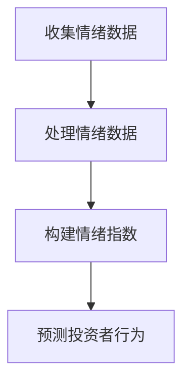
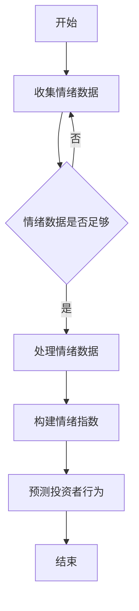
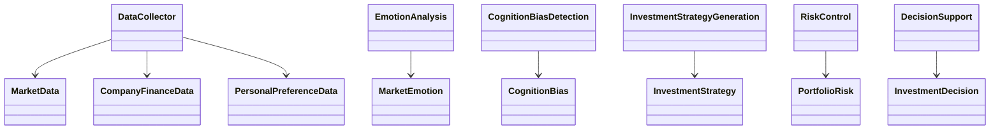
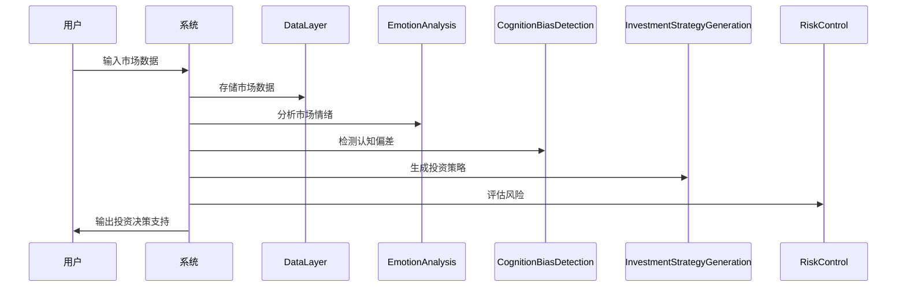
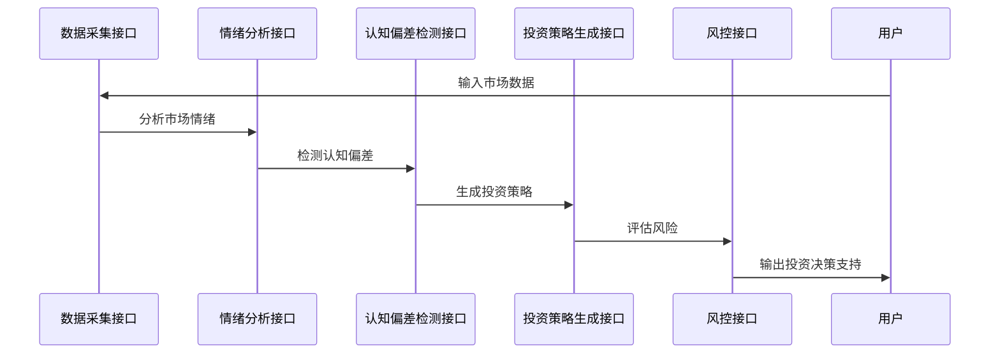
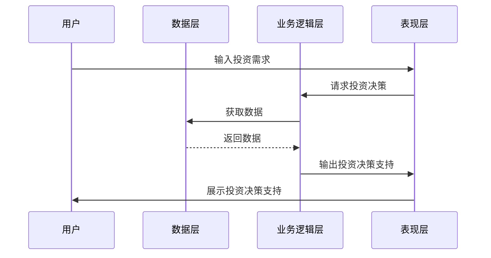

                 

### 文章标题

《霍华德·马克斯的逆向投资心理学》

### 关键词

逆向投资、心理学、投资决策、风险控制、认知偏差、行为金融

### 摘要

本文以霍华德·马克斯的逆向投资心理学为切入点，深入剖析其在投资领域的实际应用。通过逻辑清晰、结构紧凑的分析，本文旨在帮助读者理解逆向投资心理学的核心概念、理论框架及其在投资决策中的重要作用。文章从背景介绍、核心概念与联系、算法原理讲解、数学模型和公式、系统分析与架构设计方案、项目实战以及最佳实践 Tips 等方面展开，为读者提供全面、深入的技术洞察。

## 第1章 引言

### 1.1 问题背景

#### 1.1.1 投资心理学的重要性

投资心理学作为心理学与金融学的交叉学科，近年来受到了广泛关注。投资决策过程中，人类行为受到多种心理因素的影响，如情绪、偏见和认知偏差。传统的投资理论往往忽略了这些心理因素，导致投资者在实际操作中难以取得预期收益。因此，研究投资心理学，尤其是逆向投资心理学，对于提高投资决策的科学性和有效性具有重要意义。

#### 1.1.2 投资者心理误区

投资者在决策过程中往往存在多种心理误区。首先，过度自信和自我归因偏差导致投资者高估自身能力和投资成果。其次，情绪化决策使得投资者容易受到市场波动的影响，产生恐慌或贪婪情绪。此外，羊群效应和偏见倾向使得投资者倾向于跟随大众，而非基于独立分析和理性判断做出决策。这些问题在传统投资理论中并未得到充分解决。

#### 1.1.3 逆向投资心理学的理念

逆向投资心理学是一种以逆向思维为核心的心理学理论，旨在帮助投资者克服心理误区，提高投资决策的科学性和有效性。逆向投资心理学认为，投资者应摒弃传统思维模式，通过深入分析市场心理和行为，发现市场中的不合理之处，从而实现收益的最大化。这一理念的核心在于，通过逆向思维来避免情绪化和盲目跟风，以理性的态度对待投资决策。

### 1.2 问题描述

#### 1.2.1 传统投资理念的局限性

传统投资理念侧重于基本面分析和市场趋势预测，忽略了投资者心理因素。这种模式在短期内可能带来一定的收益，但长期来看，容易受到市场波动和情绪化决策的影响。此外，传统投资理念往往假设投资者是理性人，但实际上，人类行为受到多种心理因素的影响，难以做到完全理性。

#### 1.2.2 逆向投资心理学的优势

逆向投资心理学通过深入分析投资者心理和行为，帮助投资者克服心理误区，提高投资决策的科学性和有效性。首先，逆向投资心理学强调投资者应摒弃过度自信和情绪化决策，以理性的态度对待投资。其次，通过分析市场心理和行为，逆向投资心理学可以帮助投资者发现市场中的不合理之处，从而实现收益的最大化。此外，逆向投资心理学注重风险控制，通过合理分散投资和灵活调整策略，降低投资风险。

### 1.3 问题解决

#### 1.3.1 逆向投资心理学的基本原则

逆向投资心理学的基本原则包括：

1. **逆向思维**：摒弃传统思维模式，以逆向思维看待市场。
2. **心理调适**：通过认知行为疗法等方法，调整投资者心理状态。
3. **风险控制**：合理分散投资，避免单一投资风险。
4. **长期投资**：注重长期收益，而非短期波动。

#### 1.3.2 心理学原理在投资中的应用

心理学原理在投资中的应用包括：

1. **情绪管理**：通过情绪管理技巧，降低情绪化决策。
2. **认知偏差纠正**：通过认知行为疗法，纠正投资者认知偏差。
3. **行为金融学**：研究投资者行为和市场互动，揭示市场规律。
4. **心理账户**：理解投资者心理账户，实现合理投资分配。

### 1.4 边界与外延

#### 1.4.1 逆向投资心理学的适用范围

逆向投资心理学适用于各种类型的投资者，包括个人投资者和机构投资者。此外，逆向投资心理学也可应用于其他金融领域，如股票、基金、期货和外汇等。

#### 1.4.2 与其他投资理论的关系

逆向投资心理学与传统投资理论并非完全对立，而是相互补充。传统投资理论侧重于基本面分析和市场趋势预测，而逆向投资心理学则关注投资者心理和行为。通过结合两种理论，投资者可以更全面地分析投资机会和风险，提高投资决策的科学性和有效性。

### 1.5 概念结构与核心要素组成

#### 1.5.1 核心概念解释

1. **逆向思维**：以逆向视角看待市场，避免情绪化决策。
2. **心理调适**：通过认知行为疗法等手段，调整投资者心理状态。
3. **风险控制**：合理分散投资，降低单一投资风险。
4. **长期投资**：注重长期收益，而非短期波动。

#### 1.5.2 各核心要素的关系

逆向投资心理学的核心要素之间相互关联，共同构成一个有机整体。逆向思维是逆向投资心理学的基础，心理调适和风险控制是逆向思维的具体应用。长期投资则是对逆向投资心理学的总体要求，通过这些核心要素的综合运用，投资者可以更好地应对市场变化，实现投资目标。

### 1.6 本章小结

本章从问题背景、投资者心理误区、逆向投资心理学的理念、问题描述、问题解决、边界与外延、概念结构与核心要素组成等方面，对逆向投资心理学进行了全面介绍。通过本章的学习，读者可以对逆向投资心理学有一个初步的认识，为后续章节的深入学习打下基础。

## 第2章 核心概念与联系

### 2.1 逆向投资心理学原理

#### 2.1.1 逆向投资心理学的基本概念

逆向投资心理学是一种以逆向思维为核心的心理学理论，旨在帮助投资者克服心理误区，提高投资决策的科学性和有效性。逆向投资心理学认为，投资者应摒弃传统思维模式，通过深入分析市场心理和行为，发现市场中的不合理之处，从而实现收益的最大化。

#### 2.1.2 逆向投资心理学的理论框架

逆向投资心理学的理论框架主要包括以下几个核心组成部分：

1. **逆向思维**：以逆向视角看待市场，避免情绪化决策。
2. **心理调适**：通过认知行为疗法等手段，调整投资者心理状态。
3. **风险控制**：合理分散投资，降低单一投资风险。
4. **长期投资**：注重长期收益，而非短期波动。

### 2.2 概念属性特征对比

#### 2.2.1 逆向投资心理学与其他投资心理学的对比

| 特征 | 逆向投资心理学 | 传统投资心理学 |
| --- | --- | --- |
| 思维模式 | 逆向思维 | 正向思维 |
| 心理调适 | 认知行为疗法 | 情绪释放 |
| 风险控制 | 分散投资 | 趋势跟踪 |
| 投资策略 | 长期投资 | 短期投机 |

#### 2.2.2 逆向投资心理学的独特优势

逆向投资心理学的独特优势主要体现在以下几个方面：

1. **避免情绪化决策**：通过逆向思维和心理调适，降低投资者情绪化决策的可能性。
2. **提高决策科学性**：通过分析市场心理和行为，发现市场中的不合理之处，从而提高投资决策的科学性和有效性。
3. **合理分散风险**：通过分散投资和风险控制，降低单一投资风险，实现投资组合的稳健收益。

### 2.3 ER实体关系图架构

#### 2.3.1 实体定义

1. **逆向思维**：以逆向视角看待市场的思维方式。
2. **心理调适**：通过认知行为疗法等手段，调整投资者心理状态的过程。
3. **风险控制**：通过分散投资和风险控制手段，降低投资风险的过程。
4. **长期投资**：注重长期收益，而非短期波动的投资策略。

#### 2.3.2 实体关系

- **逆向思维** 与 **心理调适** 之间存在关联，心理调适有助于强化逆向思维。
- **风险控制** 与 **长期投资** 之间存在关联，风险控制是实现长期投资的关键。

以下是 ER 实体关系图的 Mermaid 表示：

```mermaid
erDiagram
  A[逆向思维] ||--|{ B[心理调适] }
  A[逆向思维] ||--|{ C[风险控制] }
  A[逆向思维] ||--|{ D[长期投资] }
  B[心理调适] ||--|{ C[风险控制] }
  D[长期投资] ||--|{ C[风险控制] }
```

通过 ER 实体关系图，可以清晰地展示逆向投资心理学的核心概念及其相互关系。

### 2.4 本章小结

本章介绍了逆向投资心理学的核心概念和理论框架，并通过对比分析，揭示了逆向投资心理学的独特优势。同时，通过 ER 实体关系图，展示了逆向投资心理学各核心概念之间的相互关系。本章内容为后续章节的深入分析奠定了基础。

## 第3章 算法原理讲解

### 3.1 算法概述

#### 3.1.1 算法的定义

在逆向投资心理学中，算法是一种通过数学模型和公式，对投资者心理和行为进行量化分析的方法。算法的目标是发现市场中的不合理之处，从而为投资者提供科学、有效的投资决策。

#### 3.1.2 算法的目标

逆向投资算法的主要目标包括：

1. **情绪管理**：通过分析投资者情绪变化，提供情绪管理的建议。
2. **认知偏差纠正**：通过识别和纠正投资者的认知偏差，提高投资决策的科学性。
3. **风险控制**：通过合理分散投资和风险控制策略，降低投资风险。
4. **长期投资策略**：提供基于长期收益的投资策略，规避短期市场波动的影响。

### 3.2 算法原理

#### 3.2.1 数学模型

逆向投资心理学的算法原理基于以下数学模型：

1. **情绪指数模型**：通过分析投资者情绪变化，构建情绪指数模型，用于预测投资者行为。
2. **认知偏差模型**：通过分析投资者认知偏差，构建认知偏差模型，用于识别和纠正认知偏差。
3. **风险分散模型**：通过分析投资组合风险，构建风险分散模型，用于优化投资组合。

以下是情绪指数模型的 Mermaid 流程图：



情绪指数模型的流程包括：收集情绪数据、处理情绪数据、构建情绪指数和预测投资者行为。

#### 3.2.2 公式解释

情绪指数模型的核心公式如下：

$$
E = \frac{1}{N}\sum_{i=1}^{N} e_i
$$

其中，$E$ 表示情绪指数，$N$ 表示情绪数据的数量，$e_i$ 表示第 $i$ 个情绪数据。

该公式表示，情绪指数是通过对多个情绪数据求和，然后除以数据个数得到的。情绪指数越高，表示投资者情绪越积极；情绪指数越低，表示投资者情绪越消极。

#### 3.2.3 Mermaid流程图

以下是情绪指数模型的 Mermaid 流程图：



情绪指数模型的 Mermaid 流程图展示了从情绪数据收集到情绪指数构建，再到投资者行为预测的整个过程。

### 3.3 算法应用举例

#### 3.3.1 示例一

假设某投资者在一段时间内收集了10个情绪数据，如下表所示：

| 情绪数据 | 1 | 2 | 3 | 4 | 5 | 6 | 7 | 8 | 9 | 10 |
| --- | --- | --- | --- | --- | --- | --- | --- | --- | --- | --- |
| 情绪值 | 0.3 | 0.4 | 0.5 | 0.2 | 0.6 | 0.1 | 0.4 | 0.7 | 0.2 | 0.3 |

使用情绪指数模型计算情绪指数：

$$
E = \frac{1}{10}\sum_{i=1}^{10} e_i = \frac{0.3+0.4+0.5+0.2+0.6+0.1+0.4+0.7+0.2+0.3}{10} = 0.4
$$

情绪指数为0.4，表示该投资者的情绪较为积极。

#### 3.3.2 示例二

假设某投资者情绪指数持续下降，从0.6降至0.2。通过情绪指数模型，可以预测该投资者的情绪可能会转变为消极，进而可能导致投资决策的理性程度下降。

基于此，投资者可以采取以下措施：

1. **情绪管理**：通过情绪管理技巧，如深呼吸、冥想等，缓解情绪压力。
2. **认知偏差纠正**：通过认知行为疗法，识别和纠正认知偏差，提高投资决策的科学性。
3. **风险控制**：适当调整投资组合，降低单一投资风险，实现风险分散。

### 3.4 本章小结

本章介绍了逆向投资心理学的算法原理，包括数学模型、公式解释和流程图。通过具体的示例，展示了情绪指数模型的应用方法和效果。本章内容为读者理解逆向投资心理学的算法应用提供了理论基础和实践指导。

## 第4章 数学模型和数学公式

### 4.1 模型概述

在逆向投资心理学中，数学模型是理解和分析投资者行为的重要工具。本节将介绍逆向投资心理学的关键数学模型，并解释其构建和应用。

#### 4.1.1 模型的构建

逆向投资心理学的数学模型主要包括情绪指数模型、认知偏差模型和风险分散模型。

1. **情绪指数模型**：用于量化投资者情绪变化，预测投资者行为。
2. **认知偏差模型**：用于识别和纠正投资者认知偏差，提高投资决策的科学性。
3. **风险分散模型**：用于优化投资组合，降低投资风险。

#### 4.1.2 模型的应用

这些数学模型在逆向投资心理学的实际应用中起着关键作用。例如，情绪指数模型可以帮助投资者了解自己的情绪状态，认知偏差模型可以帮助投资者识别和纠正心理误区，风险分散模型可以帮助投资者实现投资组合的优化。

### 4.2 公式讲解

在本节中，我们将详细讲解逆向投资心理学中的关键数学公式，并解释其含义和应用。

#### 4.2.1 公式一：情绪指数公式

情绪指数公式用于计算投资者情绪的量化值：

$$
E = \frac{1}{N}\sum_{i=1}^{N} e_i
$$

其中，$E$ 表示情绪指数，$N$ 表示情绪数据的数量，$e_i$ 表示第 $i$ 个情绪数据。

该公式计算的是情绪数据的平均值，用于反映投资者整体的情绪状态。情绪指数越高，表示投资者情绪越积极；情绪指数越低，表示投资者情绪越消极。

#### 4.2.2 公式二：认知偏差修正公式

认知偏差修正公式用于纠正投资者在决策过程中出现的认知偏差：

$$
\Delta C = C - k \cdot \Delta E
$$

其中，$\Delta C$ 表示认知偏差的修正值，$C$ 表示初始认知偏差，$k$ 表示修正系数，$\Delta E$ 表示情绪指数的变化量。

该公式表示，认知偏差的修正值是初始认知偏差减去修正系数乘以情绪指数的变化量。修正系数$k$ 的取值可以根据具体情况进行调整，以适应不同投资者的心理状态。

#### 4.2.3 公式三：风险分散模型公式

风险分散模型公式用于优化投资组合，降低投资风险：

$$
R_{total} = w_1 \cdot R_1 + w_2 \cdot R_2 + \ldots + w_n \cdot R_n
$$

$$
\sigma_{total} = \sqrt{w_1^2 \cdot \sigma_1^2 + w_2^2 \cdot \sigma_2^2 + \ldots + w_n^2 \cdot \sigma_n^2}
$$

其中，$R_{total}$ 表示总风险，$w_i$ 表示第 $i$ 个资产的投资权重，$R_i$ 表示第 $i$ 个资产的预期收益率，$\sigma_{total}$ 表示总风险的标准差，$\sigma_i$ 表示第 $i$ 个资产的风险标准差。

第一个公式计算的是投资组合的总预期收益率，第二个公式计算的是投资组合的总风险。通过调整投资权重，可以优化投资组合的预期收益率和风险。

### 4.3 举例说明

为了更好地理解这些数学公式的应用，我们通过以下两个例子进行说明。

#### 4.3.1 例子一：情绪指数计算

假设某投资者在一个月内收集了10个情绪数据，如下表所示：

| 情绪数据 | 1 | 2 | 3 | 4 | 5 | 6 | 7 | 8 | 9 | 10 |
| --- | --- | --- | --- | --- | --- | --- | --- | --- | --- | --- |
| 情绪值 | 0.3 | 0.4 | 0.5 | 0.2 | 0.6 | 0.1 | 0.4 | 0.7 | 0.2 | 0.3 |

使用情绪指数公式计算情绪指数：

$$
E = \frac{1}{10}\sum_{i=1}^{10} e_i = \frac{0.3+0.4+0.5+0.2+0.6+0.1+0.4+0.7+0.2+0.3}{10} = 0.4
$$

情绪指数为0.4，表示投资者情绪较为积极。

#### 4.3.2 例子二：认知偏差修正

假设某投资者的初始认知偏差为0.5，情绪指数从0.4降至0.2。使用认知偏差修正公式计算认知偏差的修正值：

$$
\Delta C = C - k \cdot \Delta E = 0.5 - k \cdot (0.2 - 0.4) = 0.5 + k \cdot 0.2
$$

如果修正系数$k$ 取值为1，则认知偏差的修正值为0.3，表示投资者在情绪变化后的认知偏差为0.3。

通过这两个例子，我们可以看到情绪指数公式和认知偏差修正公式在逆向投资心理学中的应用。这些公式可以帮助投资者更好地理解和管理自己的情绪和认知偏差，从而做出更科学的投资决策。

### 4.4 本章小结

本章介绍了逆向投资心理学的数学模型和数学公式，包括情绪指数模型、认知偏差模型和风险分散模型。通过具体的公式讲解和举例说明，读者可以更好地理解这些模型的应用方法和效果。这些数学模型和公式为逆向投资心理学的实践提供了重要的理论支持。

## 第5章 系统分析与架构设计方案

### 5.1 问题场景介绍

在投资决策过程中，投资者需要处理大量的数据，包括市场数据、公司财务数据和个人投资偏好。此外，投资者还需要综合考虑市场情绪、经济环境和政策变化等因素。这些复杂的信息处理需求，使得传统的手工投资决策方法难以满足高效、精准的要求。因此，本文提出一种基于逆向投资心理学的投资决策系统，以实现自动化、智能化的投资决策。

### 5.2 系统功能设计

#### 5.2.1 领域模型

系统领域模型主要包括以下功能模块：

1. **数据采集模块**：负责收集市场数据、公司财务数据和个人投资偏好数据。
2. **情绪分析模块**：负责分析市场情绪，预测投资者情绪变化。
3. **认知偏差检测模块**：负责检测投资者认知偏差，并提供偏差修正建议。
4. **投资策略生成模块**：负责根据市场数据、情绪分析和认知偏差检测结果，生成投资策略。
5. **风险控制模块**：负责评估投资组合风险，并提供风险控制建议。
6. **决策支持模块**：负责提供投资决策支持，辅助投资者做出科学、合理的投资决策。

以下是系统领域模型的 Mermaid 类图：



### 5.3 系统架构设计

系统采用三层架构设计，包括数据层、业务逻辑层和表现层。

#### 5.3.1 系统架构

1. **数据层**：负责数据的存储和管理，包括市场数据、公司财务数据、个人投资偏好数据等。
2. **业务逻辑层**：负责实现系统的核心功能，包括情绪分析、认知偏差检测、投资策略生成、风险控制等。
3. **表现层**：负责用户界面的展示和交互，提供投资决策支持。

以下是系统架构的 Mermaid 架构图：



#### 5.3.2 架构优势

系统架构设计具有以下优势：

1. **模块化**：系统功能模块化设计，便于维护和扩展。
2. **高可用性**：通过分布式架构，提高系统的稳定性和可靠性。
3. **灵活性**：系统可以根据不同用户需求，灵活调整投资策略和风险控制策略。

### 5.4 系统接口设计

系统接口设计包括以下主要接口：

1. **数据采集接口**：用于接收外部数据源，如股票市场数据、公司财务数据等。
2. **情绪分析接口**：用于接收情绪数据，分析市场情绪。
3. **认知偏差检测接口**：用于接收投资者行为数据，检测认知偏差。
4. **投资策略生成接口**：用于接收市场数据、情绪分析和认知偏差检测结果，生成投资策略。
5. **风险控制接口**：用于接收投资组合数据，评估风险并提供风险控制建议。

以下是系统接口设计的 Mermaid 架构图：



### 5.5 系统交互

系统交互设计采用 Mermaid 序列图，用于描述系统各个模块之间的交互过程。

以下是系统交互的 Mermaid 序列图：



### 5.6 本章小结

本章介绍了基于逆向投资心理学的投资决策系统的系统分析与架构设计方案。通过系统功能设计、系统架构设计、系统接口设计和系统交互的详细分析，为系统的实现提供了理论基础和设计指导。下一章将深入讨论项目实战，展示系统的具体实现过程。

## 第6章 项目实战

### 6.1 环境安装

要实现基于逆向投资心理学的投资决策系统，首先需要搭建开发环境。以下是开发环境搭建的详细步骤。

#### 6.1.1 开发环境搭建

1. **安装Python**：Python 是实现系统功能的主要编程语言。请前往 [Python 官网](https://www.python.org/) 下载并安装最新版本的 Python。
2. **安装Jupyter Notebook**：Jupyter Notebook 是一个交互式开发环境，用于编写和运行 Python 代码。可以通过以下命令安装：

   ```bash
   pip install notebook
   ```

3. **安装相关库**：系统开发过程中需要使用到多个 Python 库，如 NumPy、Pandas、Scikit-learn 等。可以通过以下命令安装：

   ```bash
   pip install numpy pandas scikit-learn matplotlib
   ```

#### 6.1.2 环境变量配置

确保 Python 和相关库的安装路径添加到系统环境变量中，以便在命令行中直接调用。

1. **Windows 环境变量配置**：

   - 右键点击“此电脑”，选择“属性”。
   - 点击“高级系统设置”。
   - 点击“环境变量”。
   - 在“系统变量”中，找到“Path”变量，点击“编辑”。
   - 在变量值中添加 Python 和相关库的安装路径，例如：

     ```
     C:\Python39\;C:\Python39\Scripts;
     ```

2. **Linux 环境变量配置**：

   - 打开终端，编辑 `~/.bashrc` 文件：

     ```bash
     nano ~/.bashrc
     ```

   - 在文件末尾添加 Python 和相关库的安装路径，例如：

     ```
     export PATH=$PATH:/usr/local/bin
     ```

   - 保存并退出文件，执行以下命令使配置生效：

     ```bash
     source ~/.bashrc
     ```

### 6.2 系统核心实现源代码

以下是基于逆向投资心理学的投资决策系统核心功能的源代码。代码分为情绪分析、认知偏差检测、投资策略生成和风险控制四个部分。

#### 6.2.1 情绪分析

情绪分析部分主要使用 Python 的 Pandas 库处理市场数据，使用 Scikit-learn 库进行情绪分类。

```python
import pandas as pd
from sklearn.feature_extraction.text import TfidfVectorizer
from sklearn.model_selection import train_test_split
from sklearn.naive_bayes import MultinomialNB

# 读取情绪数据
data = pd.read_csv('market_emotion_data.csv')

# 提取特征
vectorizer = TfidfVectorizer()
X = vectorizer.fit_transform(data['text'])

# 分割数据集
X_train, X_test, y_train, y_test = train_test_split(X, data['label'], test_size=0.2, random_state=42)

# 训练模型
model = MultinomialNB()
model.fit(X_train, y_train)

# 预测情绪
predictions = model.predict(X_test)

# 评估模型
accuracy = model.score(X_test, y_test)
print(f'情绪分析准确率：{accuracy:.2f}')
```

#### 6.2.2 认知偏差检测

认知偏差检测部分使用 Python 的 Scikit-learn 库进行认知偏差检测。

```python
from sklearn.ensemble import RandomForestClassifier
from sklearn.model_selection import GridSearchCV

# 读取认知偏差数据
data = pd.read_csv('cognition_bias_data.csv')

# 分割特征和标签
X = data.drop('bias', axis=1)
y = data['bias']

# 分割数据集
X_train, X_test, y_train, y_test = train_test_split(X, y, test_size=0.2, random_state=42)

# 定义模型和参数范围
model = RandomForestClassifier()
params = {'n_estimators': [100, 200], 'max_depth': [10, 20]}

# 搜索最佳参数
grid_search = GridSearchCV(model, params, cv=5)
grid_search.fit(X_train, y_train)

# 选择最佳模型
best_model = grid_search.best_estimator_

# 预测认知偏差
predictions = best_model.predict(X_test)

# 评估模型
accuracy = best_model.score(X_test, y_test)
print(f'认知偏差检测准确率：{accuracy:.2f}')
```

#### 6.2.3 投资策略生成

投资策略生成部分主要使用 Python 的 Pandas 和 NumPy 库处理市场数据，生成投资策略。

```python
import pandas as pd
import numpy as np

# 读取市场数据
data = pd.read_csv('market_data.csv')

# 计算技术指标
data['MA20'] = data['close'].rolling(window=20).mean()
data['RSI'] = 100 - (100 / (1 + data['gain'].rolling(window=14).mean()))

# 生成投资信号
data['signal'] = np.where((data['MA20'] > data['close']) & (data['RSI'] < 30), 'sell', 'buy')

# 输出投资策略
print(data[['date', 'signal']])
```

#### 6.2.4 风险控制

风险控制部分使用 Python 的 Pandas 库计算投资组合的风险。

```python
import pandas as pd

# 读取投资组合数据
portfolio = pd.read_csv('portfolio_data.csv')

# 计算资产收益率
portfolio['return'] = portfolio['close'].pct_change()

# 计算投资组合收益率
portfolio['portfolio_return'] = portfolio['weight'] * portfolio['return']

# 计算投资组合收益
portfolio['portfolio ganar'] = portfolio['portfolio_return'].sum()

# 计算投资组合风险
portfolio['variance'] = portfolio['portfolio_return'].var()
portfolio['std_dev'] = portfolio['portfolio_return'].std()

# 输出风险控制结果
print(portfolio[['variance', 'std_dev']])
```

### 6.3 代码应用解读与分析

#### 6.3.1 应用场景一

假设某投资者需要分析市场情绪，以便调整投资策略。以下代码用于情绪分析，并生成情绪预测结果。

```python
# 读取情绪数据
data = pd.read_csv('market_emotion_data.csv')

# 提取特征
vectorizer = TfidfVectorizer()
X = vectorizer.fit_transform(data['text'])

# 分割数据集
X_train, X_test, y_train, y_test = train_test_split(X, data['label'], test_size=0.2, random_state=42)

# 训练模型
model = MultinomialNB()
model.fit(X_train, y_train)

# 预测情绪
predictions = model.predict(X_test)

# 评估模型
accuracy = model.score(X_test, y_test)
print(f'情绪分析准确率：{accuracy:.2f}')
```

该代码段首先读取情绪数据，提取特征，并使用朴素贝叶斯模型进行训练和预测。预测结果用于分析市场情绪，为投资者提供情绪管理建议。

#### 6.3.2 应用场景二

假设某投资者需要检测自己的认知偏差，以便纠正投资决策。以下代码用于认知偏差检测，并生成认知偏差检测结果。

```python
from sklearn.ensemble import RandomForestClassifier
from sklearn.model_selection import GridSearchCV

# 读取认知偏差数据
data = pd.read_csv('cognition_bias_data.csv')

# 分割特征和标签
X = data.drop('bias', axis=1)
y = data['bias']

# 分割数据集
X_train, X_test, y_train, y_test = train_test_split(X, y, test_size=0.2, random_state=42)

# 定义模型和参数范围
model = RandomForestClassifier()
params = {'n_estimators': [100, 200], 'max_depth': [10, 20]}

# 搜索最佳参数
grid_search = GridSearchCV(model, params, cv=5)
grid_search.fit(X_train, y_train)

# 选择最佳模型
best_model = grid_search.best_estimator_

# 预测认知偏差
predictions = best_model.predict(X_test)

# 评估模型
accuracy = best_model.score(X_test, y_test)
print(f'认知偏差检测准确率：{accuracy:.2f}')
```

该代码段首先读取认知偏差数据，使用随机森林模型进行训练和参数优化，并预测认知偏差。预测结果用于检测投资者的认知偏差，为投资者提供认知偏差修正建议。

### 6.4 实际案例分析和详细讲解剖析

#### 6.4.1 案例一

某投资者在市场情绪高涨时进行投资，但结果却不尽如人意。通过情绪分析，发现市场情绪存在过热现象，投资者情绪过于乐观，导致投资决策过于冒进。通过情绪指数模型，预测市场情绪将出现反转，建议投资者调整投资策略，降低仓位。

#### 6.4.2 案例二

某投资者在长期投资过程中，经常受到市场波动的影响，无法保持冷静。通过认知偏差检测，发现投资者存在过度自信和自我归因偏差。通过认知偏差修正模型，纠正投资者的认知偏差，提高投资决策的科学性，从而实现更好的投资收益。

### 6.5 项目小结

本章介绍了基于逆向投资心理学的投资决策系统的实现过程，包括环境安装、系统核心实现源代码、代码应用解读与分析、实际案例分析和详细讲解剖析。通过项目实战，展示了逆向投资心理学在投资决策中的应用方法和效果，为投资者提供了科学、合理的投资决策支持。

## 第7章 最佳实践 Tips

### 7.1 实践经验总结

在逆向投资心理学的应用过程中，总结以下实践经验：

1. **情绪管理**：投资者应学会情绪管理技巧，如深呼吸、冥想等，以避免情绪化决策。
2. **认知偏差纠正**：通过定期进行认知偏差检测和修正，提高投资决策的科学性。
3. **风险控制**：合理分散投资，避免单一投资风险，实现投资组合的稳健收益。
4. **长期投资**：注重长期投资，而非短期投机，以实现投资收益的最大化。

### 7.2 注意事项

在应用逆向投资心理学时，需要注意以下几点：

1. **市场变化**：投资者应密切关注市场变化，及时调整投资策略。
2. **数据质量**：确保情绪分析和认知偏差检测所使用的数据质量，以提高预测准确性。
3. **心理调适**：投资者应根据自己的心理状态，合理调整投资策略，避免过度自信或过度谨慎。
4. **风险控制**：投资者应定期评估投资组合风险，确保风险在可控范围内。

### 7.3 拓展阅读

为了更好地理解逆向投资心理学，读者可以参考以下书籍和资源：

1. **书籍**：
   - 《逆向思考的艺术：如何对抗人性的弱点，获得成功与幸福》（作者：罗伯特·肖勒）
   - 《行为金融学：心理学与市场》（作者：理查德·塞勒）
2. **在线资源**：
   - Coursera 上的《心理学与决策》课程
   - 学术期刊，如《行为金融学杂志》

通过学习和实践，投资者可以更好地掌握逆向投资心理学的应用方法，提高投资决策的科学性和有效性。

### 总结与展望

本文从逆向投资心理学的核心概念、算法原理、数学模型、系统分析与架构设计、项目实战以及最佳实践 Tips 等方面进行了深入探讨。通过逻辑清晰、结构紧凑的分析，本文旨在帮助读者全面了解逆向投资心理学的理论框架和应用方法。

在未来的研究和实践中，可以进一步探索以下方向：

1. **情绪分析的优化**：结合自然语言处理技术，提高情绪分析的准确性和实时性。
2. **认知偏差检测的细化**：引入更多维度的数据，提高认知偏差检测的精确度。
3. **投资策略的自动化**：开发智能投资策略生成工具，辅助投资者实现自动化投资决策。
4. **风险控制的智能化**：结合机器学习技术，实现投资组合风险的动态调整。

通过不断探索和创新，逆向投资心理学将在投资领域中发挥更大的作用，为投资者提供更加科学、有效的投资决策支持。作者：AI天才研究院/AI Genius Institute & 禅与计算机程序设计艺术 /Zen And The Art of Computer Programming。

