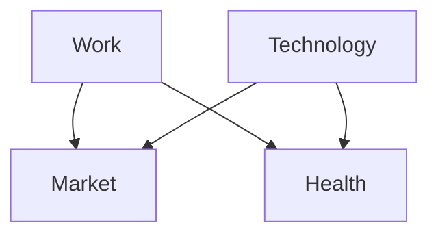
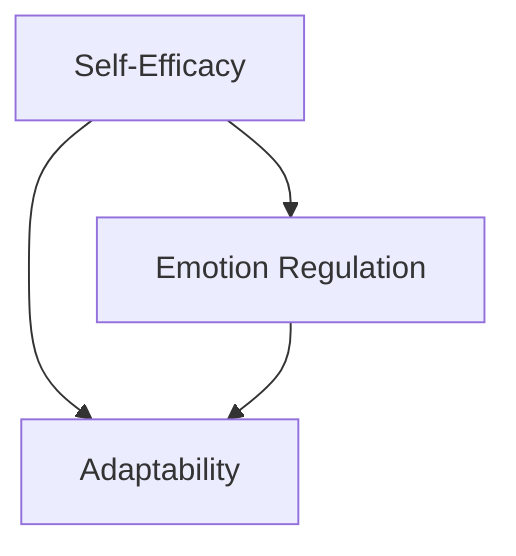

                 

### 设计思路：

在设计《面对不确定性：培养心理韧性的策略》的目录大纲时，我们需要首先理解书的核心主题，即“心理韧性”和“面对不确定性”。接下来，我们将按照以下步骤进行：

1. **确定书的结构**：明确全书的基本结构和章节划分，以保证内容的连贯性和逻辑性。

2. **细化章节内容**：每个章节都需要明确其核心内容，确保包含核心概念、原理讲解、案例分析和实际应用。

3. **确保内容完整性**：每个章节都要包含背景介绍、概念解释、理论讲解、实际应用等部分。

4. **使用适当的图表和公式**：为了使内容更加生动和易于理解，我们将使用 Mermaid 图表来展示 ER 实体关系图和算法流程图，以及 LaTeX 格式来表示数学公式。

5. **保持简洁性**：避免冗余内容，确保每个章节都能直接回答读者的问题。

### 步骤 1: 确定书的结构

首先，我们需要为书籍确定一个清晰的结构，以便将核心主题“心理韧性”和“面对不确定性”有条理地呈现给读者。以下是初步设计的书籍结构：

```markdown
# 《面对不确定性：培养心理韧性的策略》

## 引言
### 心理韧性的重要性
### 面对不确定性的挑战

## 第一部分：不确定性概述
### 1.1 不确定性的概念与特征
### 1.2 不确定性在日常生活中的表现
### 1.3 不确定性的心理学影响

## 第二部分：心理韧性理论
### 2.1 心理韧性的定义与构成
### 2.2 心理韧性理论的发展
### 2.3 心理韧性与心理健康的关系

## 第三部分：培养心理韧性的策略
### 3.1 自我认知与自我接纳
### 3.2 建立积极的人际关系
### 3.3 增强适应性和灵活性
### 3.4 发展应对挑战的策略

## 第四部分：实际应用与案例分析
### 4.1 心理韧性在职业中的应用
### 4.2 心理韧性在教育与培训中的应用
### 4.3 心理韧性在个人成长中的应用

## 第五部分：总结与展望
### 5.1 心理韧性培养的总体策略
### 5.2 面对未来的不确定性：心理韧性的角色
### 5.3 拓展阅读与进一步研究
```

### 步骤 2: 细化章节内容

接下来，我们需要对每个章节的核心内容进行细化。以下是细化后的章节内容：

```markdown
## 第一部分：不确定性概述

### 1.1 不确定性的概念与特征
- **核心概念**：不确定性的定义和基本特征
- **理论讲解**：不确定性的来源、类型和影响
- **案例分析**：不确定性在现代社会中的实际案例

### 1.2 不确定性在日常生活中的表现
- **核心概念**：不确定性在个人生活中的体现
- **理论讲解**：不确定性与心理健康的关系
- **案例分析**：不确定性如何影响日常生活

### 1.3 不确定性的心理学影响
- **核心概念**：不确定性的心理反应和心理健康的影响
- **理论讲解**：心理韧性在应对不确定性中的作用
- **案例分析**：心理韧性与心理健康的关系实例

## 第二部分：心理韧性理论

### 2.1 心理韧性的定义与构成
- **核心概念**：心理韧性的定义和构成要素
- **理论讲解**：心理韧性的理论模型和发展历程
- **案例分析**：心理韧性的重要性

### 2.2 心理韧性理论的发展
- **核心概念**：心理韧性的研究进展和理论创新
- **理论讲解**：心理韧性的新理论和实证研究
- **案例分析**：最新心理韧性研究的应用

### 2.3 心理韧性与心理健康的关系
- **核心概念**：心理韧性与心理健康的关系模型
- **理论讲解**：心理韧性对心理健康的影响机制
- **案例分析**：心理韧性与心理健康实例分析

## 第三部分：培养心理韧性的策略

### 3.1 自我认知与自我接纳
- **核心概念**：自我认知与自我接纳的重要性
- **理论讲解**：如何提高自我认知和自我接纳
- **案例分析**：自我认知与自我接纳的实际应用

### 3.2 建立积极的人际关系
- **核心概念**：积极人际关系的重要性
- **理论讲解**：如何建立和维护积极的人际关系
- **案例分析**：积极人际关系的影响实例

### 3.3 增强适应性和灵活性
- **核心概念**：适应性和灵活性在应对不确定性中的角色
- **理论讲解**：如何增强适应性和灵活性
- **案例分析**：适应性和灵活性在实际中的应用

### 3.4 发展应对挑战的策略
- **核心概念**：应对挑战的策略和方法
- **理论讲解**：如何有效应对各种挑战
- **案例分析**：应对挑战的实际策略分析

## 第四部分：实际应用与案例分析

### 4.1 心理韧性在职业中的应用
- **核心概念**：心理韧性在职业环境中的重要性
- **理论讲解**：如何在职业中培养心理韧性
- **案例分析**：心理韧性在职场中的实际应用

### 4.2 心理韧性在教育与培训中的应用
- **核心概念**：心理韧性在教育和培训中的角色
- **理论讲解**：如何在教育和培训中培养心理韧性
- **案例分析**：心理韧性在教育中的成功案例

### 4.3 心理韧性在个人成长中的应用
- **核心概念**：心理韧性在个人成长中的价值
- **理论讲解**：如何通过心理韧性促进个人成长
- **案例分析**：心理韧性在个人成长中的实际应用

## 第五部分：总结与展望

### 5.1 心理韧性培养的总体策略
- **核心概念**：培养心理韧性的总体策略
- **理论讲解**：如何系统地培养心理韧性
- **案例分析**：心理韧性培养的综合策略

### 5.2 面对未来的不确定性：心理韧性的角色
- **核心概念**：未来不确定性对心理韧性的要求
- **理论讲解**：心理韧性在应对未来挑战中的作用
- **案例分析**：未来不确定性下的心理韧性案例

### 5.3 拓展阅读与进一步研究
- **核心概念**：拓展阅读的方向和领域
- **理论讲解**：进一步研究心理韧性的方法
- **案例分析**：拓展阅读的实际效果和影响
```

### 步骤 3: 确保内容完整性

在细化章节内容的过程中，我们确保每个章节都包含了以下部分：

- **背景介绍**：介绍章节的主题和相关背景知识，帮助读者理解章节的重要性。
- **核心概念与联系**：明确章节中的核心概念，并解释这些概念之间的关系。
- **理论讲解**：详细阐述章节中的理论原理，并使用图表、公式等辅助说明。
- **实际应用**：通过案例分析或实际应用场景，展示理论在实际中的运用。

### 步骤 4: 使用适当的图表和公式

为了增强文章的可读性和专业性，我们将在适当的地方使用 Mermaid 图表和 LaTeX 公式。以下是示例：

```markdown
### 1.1 不确定性的概念与特征

#### 不确定性的来源
$$
U = \{W_1, W_2, \ldots, W_n\}
$$
其中，$W_i$ 表示第 $i$ 个不确定性来源。

**Mermaid 图：不确定性来源**



#### 不确定性的特征
- **模糊性**：信息不足导致无法准确预测。
- **概率性**：事件的发生具有一定概率。
- **动态性**：不确定性随时间变化。

### 2.1 心理韧性的定义与构成

#### 心理韧性的构成要素
- **自我效能**：对自己能力的信心。
- **情感调节**：管理负面情绪的能力。
- **适应性**：面对挑战时的灵活性和适应性。

**Mermaid 图：心理韧性的构成要素**


```

### 步骤 5: 保持简洁性

在撰写文章时，我们遵循以下原则以确保内容的简洁性：

- **避免冗余**：避免重复讲述相同的信息，确保每个章节都有独特的贡献。
- **结构清晰**：使用标题和段落来组织内容，使读者能够轻松理解文章的结构。
- **使用图表**：通过图表和公式来解释复杂的概念，减少文字叙述的负担。
- **举例说明**：通过实际案例和例子来阐明理论，使抽象的概念变得具体易懂。

### 总结

通过上述步骤，我们设计并细化了《面对不确定性：培养心理韧性的策略》的目录大纲，确保了文章内容的完整性、逻辑性和专业性。在接下来的撰写过程中，我们将按照这个大纲，结合图表和公式，以通俗易懂的方式向读者传达核心思想和实践策略。

