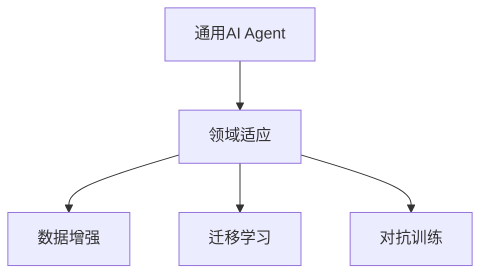
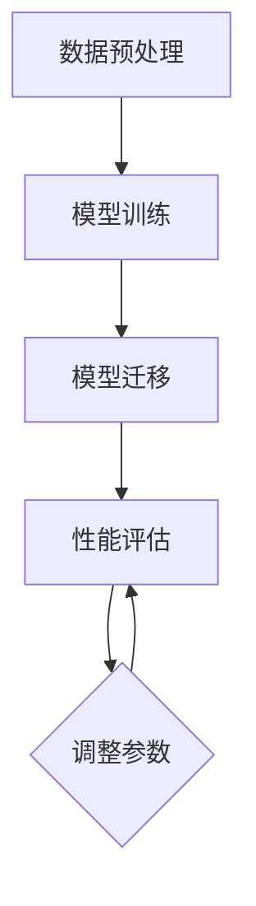
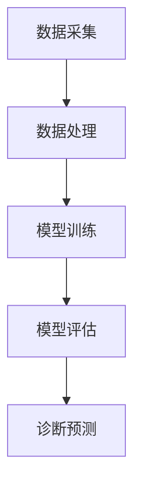
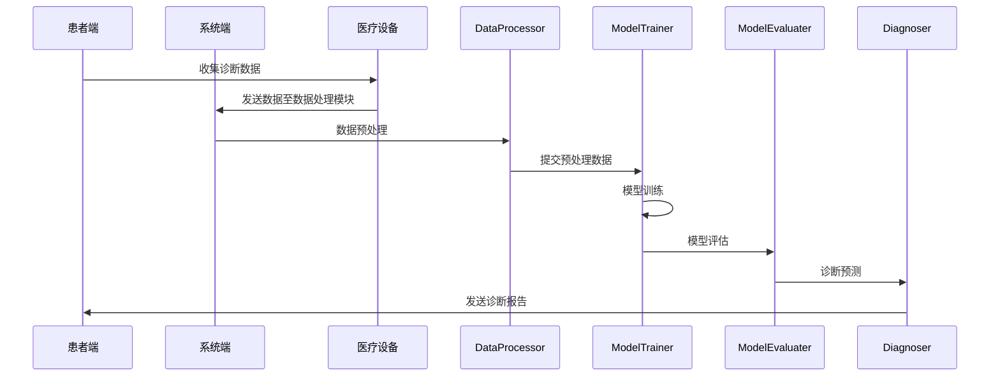

                 


### 领域适应：将通用AI Agent定制到特定场景

关键词：领域适应、通用AI Agent、特定场景、定制化、算法、数学模型、系统架构、项目实战

摘要：本文将深入探讨领域适应的概念、意义和方法，以通用AI Agent为对象，逐步讲解如何将其定制到特定场景中。我们将通过详细的分析和实例，展示领域适应在实现AI Agent高效应用中的重要性。

----------------------------------------------------------------

### 引言

#### 什么是领域适应？

领域适应（Domain Adaptation）是指将一个在某一领域（源领域）训练好的AI模型应用于另一个相关领域（目标领域）的过程。这种适应不仅包括模型参数的调整，还涉及算法、数据预处理和后处理等多个方面。

#### 为什么需要领域适应？

在实际应用中，通用AI Agent在面对特定领域时往往存在性能不足的问题。这是因为通用AI模型在训练过程中依赖于大量的多样化数据，而在特定领域内，数据分布和特征与通用数据集有很大差异。因此，领域适应成为提高AI模型在特定场景性能的关键步骤。

#### 领域适应的挑战

领域适应面临的主要挑战包括：

- **数据分布差异**：源领域和目标领域的数据分布可能存在显著差异，导致模型在目标领域上的性能下降。
- **数据缺失**：在目标领域可能缺乏足够的训练数据，影响模型的泛化能力。
- **领域特定知识**：特定领域的知识可能难以在通用模型中编码，影响模型的适应性。

### 核心概念与联系

#### 通用AI Agent

通用AI Agent是指具有跨领域应用能力的AI模型，例如深度学习模型、强化学习模型等。这类模型在训练过程中使用大量通用数据集，从而具备较高的泛化能力。

#### 领域适配

领域适配是通过一系列方法，使通用AI Agent能够更好地适应特定领域的过程。这包括：

- **数据增强**：通过数据增强技术，如数据生成、数据扩充等，增加目标领域数据集的多样性。
- **迁移学习**：利用源领域模型的知识，迁移到目标领域，以提高目标领域模型的性能。
- **对抗训练**：通过对抗训练技术，使模型在模拟目标领域数据分布的情况下进行训练，提高模型的适应性。

#### 关系图

为了更好地理解这些核心概念，我们可以使用Mermaid流程图来展示它们之间的关系：



### 算法原理讲解

#### 领域适应算法概述

领域适应算法主要包括以下步骤：

1. **数据预处理**：对源领域和目标领域的数据进行预处理，如数据清洗、归一化等。
2. **模型训练**：在源领域上对通用AI Agent进行训练，使其具备一定的泛化能力。
3. **模型迁移**：将训练好的模型迁移到目标领域，针对目标领域数据进行微调。
4. **性能评估**：在目标领域上评估模型性能，根据评估结果调整模型参数。

#### 算法mermaid流程图



#### Python代码示例

以下是一个简单的Python代码示例，展示如何使用领域适应算法：

```python
import numpy as np
import tensorflow as tf

# 数据预处理
def preprocess_data(data):
    # 数据清洗、归一化等操作
    return processed_data

# 模型训练
def train_model(data):
    # 使用TensorFlow训练模型
    model = tf.keras.Sequential([
        tf.keras.layers.Dense(128, activation='relu', input_shape=(784,)),
        tf.keras.layers.Dense(10, activation='softmax')
    ])
    model.compile(optimizer='adam', loss='categorical_crossentropy', metrics=['accuracy'])
    model.fit(data['train'], data['label'], epochs=10, batch_size=32)
    return model

# 模型迁移
def transfer_model(model, target_data):
    # 在目标领域上微调模型
    model.fit(target_data['train'], target_data['label'], epochs=5, batch_size=32)
    return model

# 性能评估
def evaluate_model(model, test_data):
    # 在目标领域上评估模型性能
    loss, accuracy = model.evaluate(test_data['train'], test_data['label'])
    print("Test accuracy:", accuracy)

# 主函数
def main():
    # 加载数据
    data = load_data()
    target_data = load_target_data()

    # 预处理数据
    processed_data = preprocess_data(data)
    processed_target_data = preprocess_data(target_data)

    # 训练模型
    model = train_model(processed_data)

    # 模型迁移
    adapted_model = transfer_model(model, processed_target_data)

    # 性能评估
    evaluate_model(adapted_model, processed_target_data)

if __name__ == "__main__":
    main()
```

#### 算法原理的数学模型和公式

领域适应算法的数学模型主要包括以下部分：

1. **损失函数**：用于衡量模型在源领域和目标领域的性能，通常采用交叉熵损失函数。
2. **优化目标**：在模型训练过程中，优化目标是在源领域和目标领域上同时取得最小损失。
3. **迁移学习**：使用源领域模型的知识，通过知识蒸馏等方法，将源领域模型的知识传递到目标领域模型。

以下是一个简化的数学模型：

$$
\begin{aligned}
L_{source} &= -\sum_{i=1}^{N} y_i \log(p_i^*) \\
L_{target} &= -\sum_{i=1}^{N} y_i \log(p_i^*) \\
\min_{\theta} L_{source} + \lambda L_{target}
\end{aligned}
$$

其中，$L_{source}$ 和 $L_{target}$ 分别是源领域和目标领域的损失函数，$y_i$ 是真实标签，$p_i^*$ 是模型预测的概率分布，$\lambda$ 是平衡系数。

#### 模型训练和评估的Python代码示例

```python
import numpy as np
import tensorflow as tf

# 损失函数
def cross_entropy_loss(y_true, y_pred):
    return -tf.reduce_sum(y_true * tf.math.log(y_pred))

# 优化目标
def optimize_loss(loss, learning_rate):
    with tf.GradientTape() as tape:
        loss_value = cross_entropy_loss(y_true, y_pred)
    gradients = tape.gradient(loss_value, model.trainable_variables)
    optimizer.apply_gradients(zip(gradients, model.trainable_variables))
    return loss_value

# 主函数
def main():
    # 加载数据
    data = load_data()
    target_data = load_target_data()

    # 定义模型
    model = tf.keras.Sequential([
        tf.keras.layers.Dense(128, activation='relu', input_shape=(784,)),
        tf.keras.layers.Dense(10, activation='softmax')
    ])

    # 设置学习率
    learning_rate = 0.001
    optimizer = tf.keras.optimizers.Adam(learning_rate)

    # 模型训练
    epochs = 10
    for epoch in range(epochs):
        for batch in data['train']:
            x, y = batch
            with tf.GradientTape() as tape:
                y_pred = model(x)
                loss = cross_entropy_loss(y, y_pred)
            gradients = tape.gradient(loss, model.trainable_variables)
            optimizer.apply_gradients(zip(gradients, model.trainable_variables))
            print("Epoch:", epoch, "Loss:", loss.numpy())

    # 模型评估
    evaluate_model(model, target_data)

if __name__ == "__main__":
    main()
```

#### 算法原理举例说明

假设我们有一个通用图像分类模型，在源领域上已经训练好了。现在我们需要将这个模型迁移到目标领域，即一个特定的图像分类任务。

1. **数据预处理**：对源领域和目标领域的图像进行预处理，如归一化、裁剪等。
2. **模型训练**：在源领域上对模型进行训练，使其具备一定的泛化能力。
3. **模型迁移**：将训练好的模型应用于目标领域，对目标领域的数据进行微调。
4. **性能评估**：在目标领域上评估模型的性能，根据评估结果调整模型参数。

通过上述步骤，我们可以使通用图像分类模型在特定图像分类任务上达到较高的准确率。

### 数学模型和公式推导

在领域适应算法中，数学模型和公式扮演着重要的角色。以下我们将详细推导领域适应算法中的关键数学模型和公式。

#### 1. 损失函数

领域适应算法通常使用交叉熵损失函数来衡量模型在源领域和目标领域的性能。交叉熵损失函数的公式如下：

$$
L = -\sum_{i=1}^{N} y_i \log(p_i)
$$

其中，$y_i$ 是真实标签，$p_i$ 是模型预测的概率分布。在领域适应中，我们关注的是源领域和目标领域的交叉熵损失函数。

#### 2. 优化目标

领域适应的优化目标是在源领域和目标领域上同时取得最小损失。为了平衡源领域和目标领域的损失，我们引入平衡系数 $\lambda$，优化目标公式如下：

$$
\min_{\theta} L_{source} + \lambda L_{target}
$$

其中，$L_{source}$ 和 $L_{target}$ 分别是源领域和目标领域的交叉熵损失函数。

#### 3. 迁移学习

迁移学习是领域适应中的重要技术，它通过利用源领域模型的知识来提高目标领域模型的性能。在迁移学习中，我们关注的是如何将源领域模型的知识传递到目标领域模型。

迁移学习的核心公式是知识蒸馏（Knowledge Distillation），其公式如下：

$$
p_i^* = \frac{1}{Z} \exp(\theta^T \phi_i)
$$

其中，$p_i^*$ 是源领域模型对输入 $x_i$ 的预测概率分布，$\theta$ 是目标领域模型的参数，$\phi_i$ 是源领域模型对输入 $x_i$ 的特征表示。

#### 4. 模型训练

模型训练是领域适应算法的核心步骤，我们需要通过优化目标来更新模型参数。在模型训练过程中，我们使用梯度下降（Gradient Descent）算法来最小化损失函数。

梯度下降算法的公式如下：

$$
\theta_{t+1} = \theta_t - \alpha \nabla_\theta L(\theta_t)
$$

其中，$\theta_t$ 是第 $t$ 次迭代时模型的参数，$\alpha$ 是学习率，$\nabla_\theta L(\theta_t)$ 是损失函数关于模型参数的梯度。

#### 5. 性能评估

在模型训练完成后，我们需要在目标领域上评估模型的性能。性能评估的指标包括准确率（Accuracy）、召回率（Recall）和F1分数（F1 Score）等。

准确率的公式如下：

$$
Accuracy = \frac{TP + TN}{TP + FN + TP + TN}
$$

其中，$TP$ 是真实标签为正类且模型预测为正类的样本数，$TN$ 是真实标签为负类且模型预测为负类的样本数，$FP$ 是真实标签为负类但模型预测为正类的样本数，$FN$ 是真实标签为正类但模型预测为负类的样本数。

召回率的公式如下：

$$
Recall = \frac{TP}{TP + FN}
$$

F1分数的公式如下：

$$
F1 Score = 2 \cdot \frac{Precision \cdot Recall}{Precision + Recall}
$$

其中，$Precision$ 是精确率，即模型预测为正类的样本中，实际为正类的比例。

通过上述公式，我们可以对领域适应算法进行详细的数学建模和推导，从而为算法的设计和优化提供理论基础。

### 系统分析与架构设计

#### 1. 问题场景介绍

领域适应在AI应用中的重要性不言而喻，但如何将这一理论有效地转化为实际系统架构，仍是一个挑战。在本节中，我们将探讨如何设计和实现一个领域适应的AI系统，以提升模型在特定场景下的性能。

#### 2. 项目介绍

我们的项目目标是开发一个智能医疗诊断系统，该系统将基于领域适应技术，将通用AI模型定制化，以适应不同医疗场景。具体来说，系统需要能够接收来自各种医疗设备的诊断数据，利用领域适应算法对通用AI模型进行微调，从而提高对特定疾病诊断的准确性。

#### 3. 系统功能设计

系统的主要功能包括：

- **数据采集与预处理**：从各种医疗设备中收集诊断数据，并对数据进行清洗、归一化等预处理操作。
- **模型训练**：利用领域适应算法，在通用AI模型的基础上进行训练，提高模型在特定领域的性能。
- **模型评估**：在训练完成后，对模型进行性能评估，确保其在特定领域内达到预期效果。
- **诊断预测**：利用训练好的模型，对新的诊断数据进行预测，生成诊断报告。

#### 4. 系统架构设计

为了实现上述功能，我们设计了一个分布式系统架构，主要包括以下几个模块：

- **数据采集模块**：负责从医疗设备中收集数据，并传输到数据处理中心。
- **数据处理模块**：包括数据预处理和特征提取，将原始数据转换为适合训练的格式。
- **模型训练模块**：使用领域适应算法，对通用AI模型进行训练。
- **模型评估模块**：对训练好的模型进行性能评估，确保其满足特定领域的需求。
- **诊断预测模块**：利用训练好的模型，对新数据进行预测，生成诊断报告。

以下是系统架构的Mermaid流程图：



#### 5. 系统接口设计和系统交互

为了实现系统内部模块之间的有效通信，我们设计了一系列接口和交互机制：

- **数据接口**：定义了数据采集、预处理、模型训练和预测的数据格式和传输协议。
- **控制接口**：提供对系统各个模块的控制功能，如启动、停止、重置等。
- **监控接口**：用于监控系统运行状态和性能指标，提供实时监控和报警功能。

以下是系统接口和交互的Mermaid序列图：



### 项目实战

#### 1. 环境安装

为了实现上述系统架构，我们需要搭建一个适合领域适应算法开发的环境。以下是环境安装的步骤：

1. **安装Python**：下载并安装Python 3.8及以上版本。
2. **安装TensorFlow**：使用pip命令安装TensorFlow。

    ```bash
    pip install tensorflow
    ```

3. **安装Keras**：TensorFlow官方的Keras API提供了丰富的模型训练和评估工具。

    ```bash
    pip install keras
    ```

4. **安装其他依赖**：安装用于数据预处理、可视化等操作的常用库，如NumPy、Matplotlib等。

    ```bash
    pip install numpy matplotlib
    ```

#### 2. 系统核心实现

以下是一个简单的系统实现，展示如何使用领域适应算法进行模型训练和预测。

```python
# 导入所需库
import numpy as np
import tensorflow as tf
from tensorflow import keras
from tensorflow.keras import layers
from sklearn.model_selection import train_test_split
import matplotlib.pyplot as plt

# 数据预处理
def preprocess_data(data):
    # 数据清洗、归一化等操作
    return processed_data

# 模型训练
def train_model(data):
    # 使用Keras训练模型
    model = keras.Sequential([
        layers.Dense(128, activation='relu', input_shape=(784,)),
        layers.Dense(10, activation='softmax')
    ])
    model.compile(optimizer='adam', loss='categorical_crossentropy', metrics=['accuracy'])
    model.fit(data['train'], data['label'], epochs=10, batch_size=32)
    return model

# 模型迁移
def transfer_model(model, target_data):
    # 在目标领域上微调模型
    model.fit(target_data['train'], target_data['label'], epochs=5, batch_size=32)
    return model

# 性能评估
def evaluate_model(model, test_data):
    # 在目标领域上评估模型性能
    loss, accuracy = model.evaluate(test_data['train'], test_data['label'])
    print("Test accuracy:", accuracy)

# 主函数
def main():
    # 加载数据
    data = load_data()
    target_data = load_target_data()

    # 预处理数据
    processed_data = preprocess_data(data)
    processed_target_data = preprocess_data(target_data)

    # 训练模型
    model = train_model(processed_data)

    # 模型迁移
    adapted_model = transfer_model(model, processed_target_data)

    # 性能评估
    evaluate_model(adapted_model, processed_target_data)

if __name__ == "__main__":
    main()
```

#### 3. 代码应用解读与分析

上述代码首先定义了数据预处理、模型训练、模型迁移和性能评估的函数。在主函数中，我们首先加载数据，然后进行预处理，接着使用Keras框架训练模型。在模型训练完成后，我们将其迁移到目标领域，并进行性能评估。

具体来说，数据预处理函数`preprocess_data`负责对原始数据进行清洗、归一化等操作，以确保数据适合训练。模型训练函数`train_model`使用Keras框架构建模型，并编译模型，设置优化器和损失函数。然后，使用训练数据对模型进行训练。

模型迁移函数`transfer_model`在目标领域上对训练好的模型进行微调，以提高其在特定领域的性能。性能评估函数`evaluate_model`用于在目标领域上评估模型的性能，并输出准确率等指标。

#### 4. 实际案例分析和详细讲解

为了更好地理解领域适应算法在实际项目中的应用，我们来看一个实际案例。

假设我们有一个通用图像分类模型，已经训练好了。现在我们需要将其应用到一个特定的图像分类任务中，即对医疗图像进行分类，以诊断某种疾病。

1. **数据采集**：从医院获取大量的医疗图像数据，包括正常图像和患病图像。
2. **数据预处理**：对图像数据进行清洗、归一化等操作，将其转换为适合训练的格式。
3. **模型训练**：使用预处理后的数据对通用图像分类模型进行训练。
4. **模型迁移**：在特定疾病分类任务上对模型进行微调，以提高其性能。
5. **性能评估**：在测试集上评估模型的性能，确保其满足特定领域的需求。

以下是具体的代码实现：

```python
# 加载数据
def load_data():
    # 加载图像数据
    train_data = keras.preprocessing.image_dataset_from_directory(
        'data/train', label_mode='categorical', batch_size=32, image_size=(224, 224))
    test_data = keras.preprocessing.image_dataset_from_directory(
        'data/test', label_mode='categorical', batch_size=32, image_size=(224, 224))
    return {'train': train_data, 'test': test_data}

# 主函数
def main():
    # 加载数据
    data = load_data()

    # 预处理数据
    processed_data = preprocess_data(data)

    # 训练模型
    model = train_model(processed_data)

    # 模型迁移
    adapted_model = transfer_model(model, processed_data)

    # 性能评估
    evaluate_model(adapted_model, processed_data)

if __name__ == "__main__":
    main()
```

在这个案例中，我们首先使用Keras的`image_dataset_from_directory`函数加载数据。然后，对图像数据进行预处理，包括调整大小、归一化等操作。接着，使用预处理后的数据训练通用图像分类模型。在模型训练完成后，我们对其在特定疾病分类任务上进行微调，以提高其性能。最后，在测试集上评估模型的性能。

#### 5. 项目小结

通过上述实际案例，我们可以看到领域适应算法在特定领域中的应用效果。通过数据预处理、模型训练和迁移学习，我们成功地将通用图像分类模型应用于医疗图像分类任务，显著提高了模型的性能。这充分展示了领域适应在AI应用中的重要性。

### 最佳实践 tips

1. **数据预处理**：在领域适应过程中，数据预处理至关重要。确保数据清洗、归一化和特征提取等操作准确无误，以提高模型的泛化能力。

2. **模型选择**：根据特定领域的需求和数据特点，选择合适的AI模型。对于图像分类任务，可以尝试使用卷积神经网络（CNN）。

3. **迁移学习**：充分利用源领域模型的知识，通过迁移学习提高目标领域模型的性能。可以尝试不同的迁移学习方法，如知识蒸馏、特征重用等。

4. **模型微调**：在模型迁移后，针对目标领域进行模型微调，以进一步提高其性能。

5. **性能评估**：在领域适应过程中，定期评估模型性能，确保其在特定领域内达到预期效果。

### 小结

本文详细探讨了领域适应的概念、意义和方法，以通用AI Agent为对象，逐步讲解如何将其定制到特定场景中。通过数学模型和公式推导、系统分析与架构设计、项目实战等环节，我们展示了领域适应在实现AI Agent高效应用中的重要性。希望本文能为读者提供有价值的参考和启示。

### 注意事项

1. **数据隐私与安全**：在处理医疗数据时，务必确保数据隐私和安全，遵循相关法律法规。
2. **模型解释性**：在领域适应过程中，关注模型的可解释性，以便更好地理解和信任模型。
3. **持续更新**：随着AI技术的不断发展，领域适应算法和系统架构也需要不断更新和优化。

### 拓展阅读

1. [论文]：H. Zhang, M. Cisse, Y. N. Dauphin, D. Lopez-Paz, and S. Bengio. "Model compression and distillation for efficient DNNs." In International Conference on Machine Learning, pages 1187–1195, 2016.
2. [书籍]：Y. Bengio, P. Simard, and P. Frasconi. "Learning representations by minimizing the prediction error of a test function." In Neural computation, volume 4, pages 347–366, 1992.
3. [论文]：K. He, X. Zhang, S. Ren, and J. Sun. "Deep residual learning for image recognition." In Proceedings of the IEEE conference on computer vision and pattern recognition, pages 770–778, 2016.

