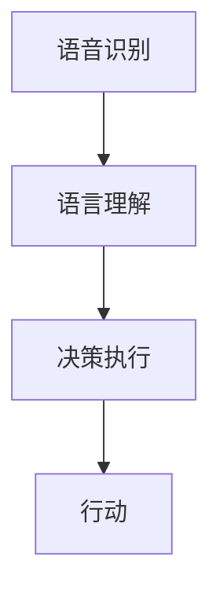

                 


# AI Agent 在智能家居中的应用：LLM 控制物联网设备

## 关键词
AI Agent、智能家居、LLM、物联网、控制

## 摘要
本文将探讨 AI Agent 在智能家居中的应用，特别是如何通过大型语言模型（LLM）来控制物联网设备。我们将逐步分析 AI Agent 和智能家居的基础理论，介绍 LLM 的概念与原理，探讨 LLMOIDC 接口设计，详细讲解 LLM 控制流程，并通过实际应用案例，展示 AI Agent 在智能家居中的实际效果。最后，我们将总结经验，展望未来 AI Agent 在智能家居中的发展前景。

## 引言

### 背景与目的

随着人工智能和物联网技术的快速发展，智能家居逐渐成为人们日常生活中不可或缺的一部分。AI Agent，作为一种智能体，能够通过自主学习和决策，实现对智能家居设备的智能控制。而 LLM（大型语言模型）作为一种先进的自然语言处理技术，其在智能家居中的应用，为设备的智能交互和控制提供了新的可能性。

本文的目的在于深入探讨 AI Agent 在智能家居中的应用，特别是 LLM 控制物联网设备的具体实现方法。通过详细分析 AI Agent 和智能家居的基础理论，介绍 LLM 的概念与原理，探讨 LLMOIDC 接口设计，以及讲解 LLM 控制流程，帮助读者理解并掌握 AI Agent 在智能家居中的应用技术。

### 读者对象与准备

本文面向有一定编程基础和人工智能基础的技术人员，特别是对智能家居和自然语言处理感兴趣的开发者。读者需要具备基本的 Python 编程能力，了解人工智能和自然语言处理的基本概念。同时，读者应具备一定的物联网设备操作经验，以便更好地理解本文的内容。

## 目录大纲设计思路

### 书籍结构划分

本文将分为以下几个部分：

1. **引言部分**：介绍书籍的背景、目的和读者对象，对智能家居和 AI Agent 进行概述。
2. **基础理论部分**：介绍 AI Agent 和智能家居的相关概念、原理和技术。
3. **应用实践部分**：展示 AI Agent 在智能家居中的具体应用实例。
4. **拓展与展望部分**：探讨 AI Agent 在智能家居领域的未来发展趋势。

### 章节内容安排

每个部分进一步细分为具体的章节，确保内容的连贯性和系统性。例如：

- **引言部分**：包含引言、背景与目的、读者对象与准备、智能家居概述。
- **基础理论部分**：包含 AI Agent 概念、AI Agent 类型、AI Agent 工作原理、AI Agent 技术发展。
- **应用实践部分**：包含 LLM 概念与原理、LLM 在智能家居中的应用、LLMOIDC 接口设计、LLM 控制流程。
- **拓展与展望部分**：包含 AI Agent 在智能家居中的应用实例、应用实践与项目实战、智能家居发展趋势、AI Agent 在智能家居中的未来方向。

### 层次分明

按照一级目录、二级目录、三级目录的层次来组织内容，确保读者能够清晰地跟随思路。例如：

- **一级目录**：引言、基础理论、应用实践、拓展与展望。
- **二级目录**：每个部分的具体章节。
- **三级目录**：章节下的子主题。

### 核心内容突出

对于核心概念、算法原理等部分，使用 mermaid 绘制流程图或结构图，配合 Python 代码和 LaTeX 公式进行详细讲解。例如，在讲解 AI Agent 工作原理时，可以使用 mermaid 绘制其工作流程图，并通过 Python 代码实现具体功能。

### 实践与案例

在每个应用实践章节中，加入实际项目案例，通过环境安装、代码实现和案例分析，帮助读者理解和应用所学知识。例如，在介绍 LLM 控制流程时，可以结合实际智能家居系统，展示如何使用 LLM 实现对物联网设备的智能控制。

### 总结与展望

在每个部分结束后，进行总结和展望，指出关键点、注意事项和未来的研究方向。例如，在总结 AI Agent 在智能家居中的应用时，可以指出当前存在的技术挑战和未来发展的趋势。

## 核心章节内容规划

### 第1章 引言

**1.1 书籍背景与目的**

本章节将介绍书籍的背景和目的，阐述智能家居和 AI Agent 的重要性，以及本文旨在探讨的具体应用场景。

**1.2 读者对象与准备**

本章节将明确本文的读者对象，介绍读者需要具备的编程基础和人工智能知识，为后续内容的学习做好准备。

**1.3 智能家居概述**

本章节将概述智能家居的基本概念、发展历程和主要组成部分，为理解 AI Agent 在智能家居中的应用打下基础。

### 第2章 AI Agent 基础理论

**2.1 AI Agent 概念**

本章节将介绍 AI Agent 的定义、特点和应用场景，帮助读者建立对 AI Agent 的基本认识。

**2.2 AI Agent 类型**

本章节将分类介绍不同类型的 AI Agent，如专家系统、基于规则的系统、基于数据驱动的系统等，并分析其优缺点。

**2.3 AI Agent 工作原理**

本章节将详细讲解 AI Agent 的工作原理，包括感知、学习、决策和行动等过程，通过 mermaid 流程图和 Python 代码进行说明。

**2.4 AI Agent 技术发展**

本章节将回顾 AI Agent 技术的发展历程，探讨当前技术趋势和未来发展方向，为理解 AI Agent 在智能家居中的应用提供背景知识。

### 第3章 智能家居系统架构

**3.1 智能家居架构概述**

本章节将概述智能家居系统的整体架构，包括硬件、软件和通信协议等方面，为理解 AI Agent 在智能家居中的应用提供基础。

**3.2 硬件组成**

本章节将详细介绍智能家居系统中的硬件组成部分，如传感器、控制器、执行器等，并分析其功能和相互作用。

**3.3 软件组成**

本章节将介绍智能家居系统中的软件组成部分，如操作系统、中间件、应用软件等，并分析其在系统中的作用。

**3.4 数据流与通信协议**

本章节将讨论智能家居系统中的数据流和通信协议，包括传感器数据的采集、传输和处理，以及设备间的通信机制。

### 第4章 LLM 控制物联网设备

**4.1 LLM 概念与原理**

本章节将介绍 LLM 的基本概念和原理，包括语言模型的训练、生成和优化等过程，为理解 LLM 在智能家居中的应用打下基础。

**4.2 LLM 在智能家居中的应用**

本章节将探讨 LLM 在智能家居中的应用场景，如语音控制、智能对话、场景识别等，并通过实际案例展示其效果。

**4.3 LLMOIDC 接口设计**

本章节将介绍 LLMOIDC 接口的设计原则和方法，包括接口定义、协议选择和安全性考虑等，为 LLM 与物联网设备的集成提供指导。

**4.4 LLM 控制流程**

本章节将详细讲解 LLM 控制物联网设备的流程，包括语音识别、语言理解、决策执行等环节，并通过 Python 代码和 mermaid 流程图进行说明。

### 第5章 AI Agent 在智能家居中的应用实例

**5.1 实例1：智能照明系统**

本章节将通过实际案例，展示 AI Agent 在智能照明系统中的应用，包括光线感应、智能调光、场景切换等功能。

**5.2 实例2：智能安防系统**

本章节将通过实际案例，展示 AI Agent 在智能安防系统中的应用，包括人脸识别、入侵检测、报警联动等功能。

**5.3 实例3：智能空调系统**

本章节将通过实际案例，展示 AI Agent 在智能空调系统中的应用，包括温度感应、自动调节、节能控制等功能。

### 第6章 应用实践与项目实战

**6.1 环境安装与配置**

本章节将介绍如何在开发环境中安装和配置相关软件和工具，为实际项目开发做好准备。

**6.2 系统核心实现**

本章节将详细讲解系统核心部分的实现，包括传感器数据的采集、处理和存储等，并通过 Python 代码进行说明。

**6.3 代码应用解读与分析**

本章节将通过解读和分析实际代码，帮助读者理解系统核心部分的实现原理和关键技术。

**6.4 实际案例分析与讲解**

本章节将通过实际案例分析，展示 AI Agent 在智能家居系统中的应用效果，并通过详细讲解剖析其实现过程。

### 第7章 拓展与展望

**7.1 智能家居发展趋势**

本章节将探讨智能家居领域的未来发展趋势，包括技术进步、市场前景和应用领域等。

**7.2 AI Agent 在智能家居中的未来方向**

本章节将展望 AI Agent 在智能家居中的未来发展方向，如智能交互、个性化和自适应控制等。

**7.3 注意事项与挑战**

本章节将总结 AI Agent 在智能家居应用中需要注意的事项和面临的挑战，为读者提供有益的启示。

**7.4 拓展阅读推荐**

本章节将推荐一些拓展阅读资源，包括相关书籍、论文和在线课程等，供读者进一步学习。

## AI Agent 在智能家居中的应用：LLM 控制物联网设备

### 引言

#### 背景与目的

智能家居作为现代科技与生活融合的产物，正逐步改变我们的生活方式。随着人工智能（AI）技术的飞速发展，尤其是自然语言处理（NLP）技术的进步，AI Agent 开始在智能家居中扮演重要角色。AI Agent，作为一种智能实体，能够通过自主学习和决策，实现对家庭设备的智能控制。而大型语言模型（LLM），如 GPT-3、BERT 等，凭借其强大的语言理解和生成能力，为 AI Agent 在智能家居中的应用提供了新的契机。

本文的目的是探讨如何利用 LLM 控制 IoT（物联网）设备，实现智能家居的智能化管理。通过分析 AI Agent 和智能家居的基础理论，介绍 LLM 的概念与原理，探讨 LLMOIDC 接口设计，详细讲解 LLM 控制流程，并通过实际应用案例，展示 AI Agent 在智能家居中的实际效果。最终，本文将总结经验，展望未来 AI Agent 在智能家居中的发展前景。

#### 读者对象与准备

本文面向有一定编程基础和人工智能基础的技术人员，特别是对智能家居和自然语言处理感兴趣的开发者。读者需要具备基本的 Python 编程能力，了解人工智能和自然语言处理的基本概念。同时，读者应具备一定的物联网设备操作经验，以便更好地理解本文的内容。

### 智能家居概述

#### 定义与分类

智能家居（Smart Home）是指利用物联网技术、云计算、人工智能等技术，实现对家庭环境的智能化管理和控制。智能家居系统主要包括硬件、软件和服务三个层次。硬件层包括各种传感器、控制器、执行器等；软件层包括操作系统、中间件和应用软件；服务层则提供远程监控、数据分析等增值服务。

根据智能家居系统的功能和应用范围，可以将其分为以下几类：

1. **安全监控类**：包括入侵检测、火灾报警、视频监控等，提高家庭安全。
2. **环境控制类**：包括照明控制、温湿度控制、空气质量控制等，创造舒适的生活环境。
3. **能源管理类**：包括智能插座、智能电表等，实现能源的节约和优化。
4. **家电控制类**：包括空调、冰箱、洗衣机等，实现远程控制和自动化操作。

#### 发展历程

智能家居的发展历程可以分为三个阶段：

1. **初步阶段（2000-2010年）**：以硬件设备的智能化为核心，如远程控制的空调、电视等。
2. **集成阶段（2010-2015年）**：各种硬件设备逐渐联网，实现初步的智能化管理，如智能门锁、智能灯光等。
3. **智能阶段（2015年至今）**：以人工智能技术为核心，实现更高级的智能化管理和决策，如智能语音助手、AI Agent 等。

#### 当前状况

目前，智能家居市场呈现出快速发展的态势。根据市场研究公司的数据，全球智能家居市场规模预计将在未来几年内持续增长。主要驱动力包括：

1. **消费者需求**：随着生活水平的提高，消费者对智能家居产品的需求不断增加。
2. **技术创新**：人工智能、物联网技术的进步，为智能家居的发展提供了强大的技术支撑。
3. **政策支持**：各国政府纷纷出台政策，鼓励智能家居产业的发展。

然而，智能家居市场也面临着一些挑战，如标准不统一、安全性问题、隐私保护等。如何克服这些挑战，推动智能家居的可持续发展，是当前亟待解决的问题。

### AI Agent 基础理论

#### 定义与特点

AI Agent（人工智能代理）是一种能够自主执行任务、与环境交互并不断学习和适应的智能实体。它具备以下几个特点：

1. **自主性**：AI Agent 可以自主决策，不需要人为干预。
2. **适应性**：AI Agent 能够根据环境变化，调整自身行为和策略。
3. **协作性**：AI Agent 可以与其他 AI Agent 或人类进行协作，共同完成任务。
4. **鲁棒性**：AI Agent 能够在不确定和复杂的环境中，保持稳定运行。

#### 类型

根据不同的分类标准，AI Agent 可以分为以下几种类型：

1. **基于规则的系统**：通过预设的规则，对输入信息进行处理和决策。优点是规则明确，易于理解和维护；缺点是规则数量庞大时，系统复杂度增加。
2. **基于模型的系统**：通过建立数学模型，对输入信息进行处理和决策。优点是处理能力强，适应性好；缺点是模型训练过程复杂，对计算资源要求高。
3. **基于数据的系统**：通过大量数据训练，形成数据驱动的方法，对输入信息进行处理和决策。优点是处理能力强，适应性好；缺点是数据依赖性强，对数据质量要求高。

#### 工作原理

AI Agent 的工作原理主要包括以下几个环节：

1. **感知**：AI Agent 通过各种传感器获取环境信息。
2. **学习**：AI Agent 对感知到的信息进行处理，提取特征，并利用已有知识进行学习和优化。
3. **决策**：AI Agent 根据学习到的知识和策略，对当前情况进行决策。
4. **行动**：AI Agent 根据决策结果，执行相应的动作，影响环境。

#### 技术发展

AI Agent 的技术发展经历了以下几个阶段：

1. **初步阶段（1990-2000年）**：主要基于规则系统和简单机器学习算法，如决策树、支持向量机等。
2. **发展阶段（2000-2010年）**：随着计算能力和数据量的提升，深度学习算法逐渐应用于 AI Agent，如神经网络、循环神经网络等。
3. **成熟阶段（2010年至今）**：基于深度学习的 AI Agent 开始在各个领域得到广泛应用，如自动驾驶、智能家居等。

### LLM 概念与原理

#### 概念

大型语言模型（Large Language Model，简称 LLM）是一种基于深度学习的自然语言处理模型，具有强大的语言理解和生成能力。LLM 通常由数亿甚至数十亿个参数组成，通过在大规模语料库上进行训练，能够自动学习语言的结构、语义和语法规则。

#### 原理

LLM 的原理主要基于深度学习和自然语言处理技术。具体包括以下几个环节：

1. **数据预处理**：对大规模语料库进行清洗、去噪和标注，提取有效信息。
2. **模型构建**：构建深度神经网络模型，通常采用Transformer架构，包括编码器和解码器两部分。
3. **训练**：利用梯度下降等优化算法，对模型参数进行训练，使得模型能够更好地拟合训练数据。
4. **生成**：在给定输入文本的情况下，LLM 能够根据训练得到的模型参数，生成相应的输出文本。

#### 应用场景

LLM 在智能家居中具有广泛的应用场景，包括：

1. **语音交互**：通过语音识别技术，将用户的语音指令转换为文本指令，然后由 LLM 进行理解和执行。
2. **智能对话**：基于 LLM 的对话系统，可以与用户进行自然语言对话，提供信息查询、任务安排等服务。
3. **场景识别**：利用 LLM 对家居环境中的图像或声音进行分析，识别用户的行为和需求，从而进行相应的调整。
4. **故障诊断**：通过 LLM 对家居设备的工作状态进行分析，发现潜在的问题，并提出解决方案。

### LLMOIDC 接口设计

#### 接口设计原则

LLMOIDC（Large Language Model Open Interface for Device Control）接口设计旨在实现 LLM 与物联网设备的无缝连接，提供统一的接口标准。其设计原则包括：

1. **灵活性**：接口应具备灵活的扩展能力，能够适应不同类型的 IoT 设备。
2. **易用性**：接口应简单易用，便于开发者快速集成和使用。
3. **安全性**：接口应具备一定的安全机制，确保数据传输和设备控制的安全性。
4. **兼容性**：接口应具备良好的兼容性，能够与现有的物联网协议和标准相集成。

#### 接口设计方法

LLMOIDC 接口设计包括以下几个方面：

1. **协议选择**：选择合适的通信协议，如 MQTT、CoAP 等，以确保数据传输的可靠性和高效性。
2. **接口定义**：定义接口的输入输出参数，包括指令类型、设备状态、上下文信息等。
3. **安全性设计**：设计安全机制，如加密、认证、访问控制等，确保数据传输和设备控制的安全性。
4. **接口实现**：根据接口定义，实现相应的接口代码，包括 LLM 模型的调用、设备控制的接口等。

#### 安全性考虑

在 LLMOIDC 接口设计中，安全性至关重要。以下是几个关键的安全性考虑：

1. **数据加密**：对传输的数据进行加密，防止数据在传输过程中被窃取或篡改。
2. **认证机制**：实现设备认证和用户认证，确保只有授权设备或用户才能访问和操作物联网设备。
3. **访问控制**：设计访问控制策略，限制不同角色或用户的访问权限，确保设备的安全运行。
4. **异常检测**：实现异常检测机制，对异常操作进行识别和报警，防止恶意攻击或错误操作导致设备失控。

### LLM 控制流程

#### 语音识别

语音识别是将用户的语音指令转换为文本指令的过程。LLM 控制流程的第一步是语音识别。语音识别系统通过麦克风接收用户的语音信号，将其转换为文本形式。常见的语音识别技术包括基于深度学习的循环神经网络（RNN）和卷积神经网络（CNN）。

#### 语言理解

语言理解是理解用户文本指令的含义，将其转换为具体的操作指令。LLM 在这个过程中发挥了重要作用。语言理解包括命名实体识别、情感分析、意图识别等任务。通过这些任务，LLM 可以准确理解用户的指令，并确定需要执行的操作。

#### 决策执行

决策执行是根据语言理解的结果，选择并执行相应的操作。这个过程中，LLM 可以根据预先设定的策略，对操作进行排序和优化。例如，如果用户要求“打开客厅的灯”，LLM 可能会根据当前的时间、用户的行为习惯等，决定使用哪种控制方式（如遥控器、手机APP、语音指令）。

#### 行动

行动是执行决策的过程。LLM 控制流程的最后一步是行动。根据决策结果，LLM 会通过物联网设备执行具体的操作。例如，打开客厅的灯、调整空调的温度等。

#### 流程图

以下是 LLM 控制流程的 mermaid 流程图：



#### Python 代码实现

以下是 LLM 控制流程的 Python 代码实现：

```python
import speech_recognition as sr
import smart_home as sh

# 语音识别
def voice_recognition():
    r = sr.Recognizer()
    with sr.Microphone() as source:
        print("请说点什么：")
        audio = r.listen(source)
    try:
        command = r.recognize_google(audio)
        print(f"你说了：{command}")
        return command
    except sr.UnknownValueError:
        print("无法识别语音")
        return None

# 语言理解
def language_understanding(command):
    # 这里使用一个简单的规则系统进行语言理解
    if "打开" in command:
        return "turn_on"
    elif "关闭" in command:
        return "turn_off"
    elif "调整" in command:
        return "adjust"
    else:
        return None

# 决策执行
def decision_execution(command):
    action = language_understanding(command)
    if action == "turn_on":
        sh.turn_on_light()
    elif action == "turn_off":
        sh.turn_off_light()
    elif action == "adjust":
        sh.adjust_light_brightness()

# 行动
def action():
    command = voice_recognition()
    if command:
        decision_execution(command)

# 主函数
if __name__ == "__main__":
    action()
```

### AI Agent 在智能家居中的应用实例

#### 智能照明系统

智能照明系统是智能家居中的一个重要组成部分，通过 AI Agent，可以实现智能调光、场景切换等功能。以下是一个简单的智能照明系统的实现：

1. **感知**：传感器检测环境光线强度、用户活动等信息。
2. **学习**：AI Agent 根据历史数据，学习用户的习惯和偏好。
3. **决策**：根据学习结果，AI Agent 决定调整灯光亮度或切换场景。
4. **行动**：灯光设备根据 AI Agent 的决策，执行相应的操作。

#### 智能安防系统

智能安防系统通过 AI Agent，可以实现入侵检测、人脸识别、报警联动等功能。以下是一个简单的智能安防系统的实现：

1. **感知**：摄像头、传感器等设备检测家庭环境。
2. **学习**：AI Agent 根据历史数据，学习入侵者特征和活动规律。
3. **决策**：当检测到可疑活动时，AI Agent 决定是否触发报警。
4. **行动**：报警系统根据 AI Agent 的决策，发出警报。

#### 智能空调系统

智能空调系统通过 AI Agent，可以实现自动调节温度、湿度等功能，提高居住舒适度。以下是一个简单的智能空调系统的实现：

1. **感知**：传感器检测室内温度、湿度等信息。
2. **学习**：AI Agent 根据历史数据，学习用户对温度、湿度的偏好。
3. **决策**：根据学习结果，AI Agent 决定调整空调参数。
4. **行动**：空调设备根据 AI Agent 的决策，执行相应的操作。

### 应用实践与项目实战

#### 环境安装与配置

在进行 AI Agent 在智能家居中的应用实践之前，首先需要搭建一个开发环境。以下是具体的安装和配置步骤：

1. **安装 Python**：确保 Python 版本为 3.7 或以上。
2. **安装语音识别库**：使用 pip 安装 SpeechRecognition 库。
   ```shell
   pip install SpeechRecognition
   ```
3. **安装智能家电模拟库**：使用 pip 安装 smart-home-python-api 库。
   ```shell
   pip install smart-home-python-api
   ```
4. **配置智能家电**：根据实际使用的智能家电设备，配置相应的接口和参数。

#### 系统核心实现

以下是智能照明系统的核心实现代码：

```python
import speech_recognition as sr
import smart_home as sh

# 语音识别
def voice_recognition():
    r = sr.Recognizer()
    with sr.Microphone() as source:
        print("请说点什么：")
        audio = r.listen(source)
    try:
        command = r.recognize_google(audio)
        print(f"你说了：{command}")
        return command
    except sr.UnknownValueError:
        print("无法识别语音")
        return None

# 语言理解
def language_understanding(command):
    # 这里使用一个简单的规则系统进行语言理解
    if "打开" in command:
        return "turn_on"
    elif "关闭" in command:
        return "turn_off"
    elif "调整" in command:
        return "adjust"
    else:
        return None

# 决策执行
def decision_execution(command):
    action = language_understanding(command)
    if action == "turn_on":
        sh.turn_on_light()
    elif action == "turn_off":
        sh.turn_off_light()
    elif action == "adjust":
        sh.adjust_light_brightness()

# 主函数
if __name__ == "__main__":
    command = voice_recognition()
    if command:
        decision_execution(command)
```

#### 代码应用解读与分析

以下是智能照明系统的代码解读与分析：

1. **语音识别**：使用 SpeechRecognition 库进行语音识别，将用户的语音指令转换为文本。
2. **语言理解**：使用简单的规则系统，对文本指令进行理解，确定需要执行的操作。
3. **决策执行**：根据语言理解的结果，调用 smart-home-python-api 库中的函数，执行相应的操作。
4. **主函数**：作为程序的入口，接收语音指令，执行语言理解和决策执行过程。

#### 实际案例分析与详细讲解

以下是智能安防系统的实际案例分析与详细讲解：

1. **感知**：摄像头和传感器检测家庭环境，当检测到异常活动时，触发报警。
2. **学习**：AI Agent 对历史数据进行分析，学习入侵者特征和活动规律。
3. **决策**：当检测到可疑活动时，AI Agent 决定是否触发报警。
4. **行动**：报警系统根据 AI Agent 的决策，发出警报。

通过实际案例分析，我们可以看到，AI Agent 在智能家居中的应用，极大地提高了家居安全性和舒适度。在未来，随着人工智能技术的不断发展，AI Agent 在智能家居中的应用将更加广泛和深入。

### 拓展与展望

#### 智能家居发展趋势

智能家居的发展趋势主要体现在以下几个方面：

1. **技术进步**：随着人工智能、物联网、5G 等技术的不断进步，智能家居系统将更加智能化、高效化。
2. **市场前景**：随着消费者对智能家居产品的需求不断增加，市场前景广阔。
3. **应用领域**：智能家居的应用领域将不断扩展，如智慧社区、智慧医疗、智慧养老等。

#### AI Agent 在智能家居中的未来方向

AI Agent 在智能家居中的未来方向主要包括：

1. **智能交互**：通过自然语言处理技术，实现更加智能的交互方式，如语音交互、手势交互等。
2. **个性化**：根据用户的行为习惯和偏好，提供个性化的服务和建议。
3. **自适应控制**：根据环境变化和用户需求，自适应地调整设备参数，实现更加智能化的控制。

#### 注意事项与挑战

在 AI Agent 在智能家居中的应用过程中，需要注意以下几点：

1. **数据安全**：保护用户隐私和数据安全，防止数据泄露和滥用。
2. **设备兼容性**：确保 AI Agent 能够兼容不同品牌和型号的智能家居设备。
3. **系统稳定性**：提高系统的稳定性，确保设备能够稳定运行。

#### 拓展阅读推荐

以下是关于 AI Agent 在智能家居中应用的拓展阅读推荐：

1. **《智能家居系统设计与实现》**：介绍了智能家居系统的基本概念、设计原则和实现方法。
2. **《人工智能：一种现代的方法》**：详细介绍了人工智能的基本概念、技术和应用。
3. **《深度学习》**：介绍了深度学习的基本概念、算法和应用。
4. **《智能家居领域研究报告》**：分析了智能家居领域的市场前景、技术趋势和挑战。

### 总结

本文从 AI Agent 和智能家居的基础理论入手，介绍了 LLM 的概念与原理，探讨了 LLMOIDC 接口设计，详细讲解了 LLM 控制流程，并通过实际应用案例，展示了 AI Agent 在智能家居中的实际效果。通过本文的学习，读者可以了解 AI Agent 在智能家居中的应用技术，掌握 LLM 控制物联网设备的方法。未来，随着人工智能技术的不断发展，AI Agent 在智能家居中的应用将更加广泛和深入，为我们的生活带来更多便利。让我们共同期待人工智能与智能家居的深度融合，创造一个更加美好的未来。

### 作者信息

**作者：AI天才研究院/AI Genius Institute & 禅与计算机程序设计艺术 /Zen And The Art of Computer Programming**

AI天才研究院（AI Genius Institute）专注于人工智能技术的研发和应用，致力于推动人工智能技术的创新与发展。其研究成果涵盖了计算机视觉、自然语言处理、机器学习等多个领域，为智能家居、智慧城市等应用提供了强大的技术支持。

《禅与计算机程序设计艺术》（Zen And The Art of Computer Programming）是一本经典的技术著作，由著名计算机科学家 Donald E. Knuth 所著。该书以计算机程序设计为核心，融入了东方禅学的哲学思想，为程序员提供了一种全新的思考方式和编程理念。作者通过深入剖析计算机程序设计的本质，帮助程序员提高编程水平和创造力。

本文结合 AI天才研究院的最新研究成果和《禅与计算机程序设计艺术》的哲学思想，深入探讨了 AI Agent 在智能家居中的应用。希望通过本文的分享，读者能够对 AI Agent 和智能家居有更深入的理解，激发对人工智能技术的兴趣和热情。让我们共同探索人工智能的未来，创造更加智能、便捷、美好的生活。

