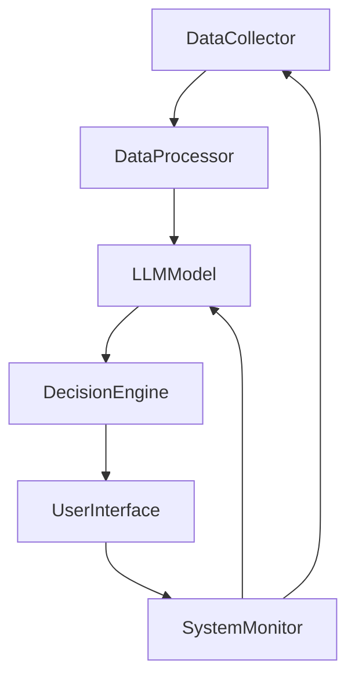

                 

### 1.1.1 AI Agent 的定义与分类

AI Agent，即人工智能代理，是一种能够代表用户执行任务或进行决策的计算机程序。它基于一系列规则或学习算法，能够理解环境中的信息，并做出相应的响应或决策。AI Agent 可以根据其功能、应用领域和决策方式的不同，分为多种类型。

**1. 按照功能分类：**

- **感知型 Agent：** 主要负责获取环境中的信息，如语音识别、图像处理等。这类 Agent 通常不具备自主决策能力，仅作为信息收集者。

- **反应型 Agent：** 根据感知到的信息直接做出反应，如自动门在检测到有人靠近时打开。这类 Agent 的决策基于预先设定的规则或模型。

- **认知型 Agent：** 不仅能够感知环境，还能进行简单的推理和决策，如自动驾驶系统。这类 Agent 通常拥有更复杂的算法和模型。

- **主动型 Agent：** 能够自主探索环境，并采取主动行动来达到目标，如智能机器人。这类 Agent 需要具备较高的自主决策能力和学习能力。

**2. 按照应用领域分类：**

- **工业自动化 Agent：** 主要应用于工业生产中的自动化控制和优化，如自动化生产线、智能制造等。

- **智能家居 Agent：** 用于家庭环境中，提供智能家电控制、安全监控、健康管理等服务。

- **医疗健康 Agent：** 用于医疗诊断、健康监测、药物推荐等，如智能医疗诊断系统、健康管理平台等。

- **金融保险 Agent：** 用于金融分析、风险评估、智能投顾等，如智能投资顾问、风险评估系统等。

- **智能交通 Agent：** 用于交通管理、自动驾驶、交通预测等，如智能交通管理系统、自动驾驶汽车等。

**3. 按照决策方式分类：**

- **规则驱动型 Agent：** 决策完全基于预设的规则或指令，如传统的专家系统。

- **数据驱动型 Agent：** 决策基于收集到的数据或模型，如基于机器学习的决策系统。

- **混合型 Agent：** 结合了规则和数据驱动的特点，能够在不同情况下灵活切换决策方式。

AI Agent 的分类方法多种多样，但无论哪种分类，其核心目标都是实现智能化决策和执行，提高系统的自主性和智能化水平。在接下来的章节中，我们将深入探讨 AI Agent 在不同应用领域中的具体实现和挑战。### 1.1.2 AI Agent 在现代智能系统中的应用

AI Agent 在现代智能系统中的应用已经非常广泛，它们不仅提高了系统的智能化水平，还显著提升了工作效率和用户体验。以下是一些关键应用领域及其具体示例：

**1. 智能客服**

智能客服是 AI Agent 最典型的应用之一。通过自然语言处理技术，智能客服系统能够理解用户的提问，并给出合适的回答或建议。例如，许多企业已经部署了基于 AI 的聊天机器人，用于解答客户常见问题、处理订单和提供技术支持。这些智能客服系统能够24/7全天候工作，大大提高了客户服务效率。

**2. 自动驾驶**

自动驾驶是 AI Agent 在交通领域的应用典范。自动驾驶系统依赖于传感器、摄像头和人工智能算法，能够实时感知路况并做出决策。特斯拉、百度、谷歌等公司都在积极推进自动驾驶技术，以期实现完全自动化的驾驶体验。自动驾驶不仅提高了交通安全，还减少了拥堵，提升了出行效率。

**3. 智能家居**

智能家居系统通过 AI Agent 实现家庭设备的自动化控制和智能管理。例如，智能恒温器可以根据用户习惯自动调节室内温度，智能灯光系统能根据用户的动作和光线条件自动调节亮度。智能家居系统不仅提高了生活质量，还节省了能源消耗。

**4. 医疗健康**

AI Agent 在医疗健康领域也有着重要的应用。智能诊断系统可以利用深度学习算法分析医学影像，提供早期诊断建议。智能药物推荐系统则可以根据患者的病史和基因信息，提供个性化的治疗方案。此外，AI Agent 还可以协助医生进行病历管理、医疗数据分析等工作，提高医疗服务的质量和效率。

**5. 金融理财**

在金融领域，AI Agent 主要用于风险评估、投资分析和智能投顾。例如，银行和金融机构可以使用 AI 算法对客户进行信用评分，以降低贷款违约风险。智能投资顾问系统则可以根据用户的风险偏好和投资目标，提供个性化的投资建议。这些应用不仅提高了金融服务的效率，还为投资者带来了更好的体验。

**6. 智能安防**

智能安防系统利用 AI Agent 实现实时监控和智能分析。例如，视频监控系统可以通过人脸识别技术自动识别可疑人员，并触发警报。智能安防系统还可以通过数据分析和模式识别，预防犯罪事件的发生。

**7. 教育辅助**

在教育领域，AI Agent 可以为学生提供个性化的学习计划和辅导。例如，智能教育平台可以根据学生的学习进度和成绩，自动调整教学内容和难度，为学生提供更有针对性的学习支持。此外，AI Agent 还可以协助教师进行学生管理、作业批改和教学评估等工作，提高教学效果。

总之，AI Agent 在现代智能系统中的应用已经深入到各个领域，不仅改变了人们的生活方式，还推动了社会的进步和发展。随着技术的不断演进，AI Agent 将在更多领域展现其潜力。### 1.1.3 本书的主要内容和结构安排

本书旨在深入探讨 AI Agent 的决策系统，特别是基于大型语言模型（LLM）的推理与规划。为了使读者能够全面了解并掌握相关技术，本书分为五个主要部分，共十个章节，具体内容如下：

**第一部分：引言与背景**

- **第1章：AI Agent 的概述**
  - AI Agent 的定义与分类
  - AI Agent 在现代智能系统中的应用
  - 本书的主要内容和结构安排

**第二部分：LLM 的基本原理与应用**

- **第2章：自然语言处理与 LLM**
  - 自然语言处理概述
  - 语言模型的基本概念
  - LLM 的主要类型及其特点
  - LLM 在自然语言处理中的应用

- **第3章：LLM 的架构与实现**
  - 语言模型的数学基础
  - Transformer 模型详解
  - 预训练与微调
  - LLM 的性能评估

**第三部分：基于 LLM 的推理与规划**

- **第4章：基于 LLM 的推理原理**
  - 推理的基本概念
  - LLM 在推理中的应用
  - 推理算法详解
  - 推理算法的优化与改进

- **第5章：基于 LLM 的规划原理**
  - 规划的基本概念
  - LLM 在规划中的应用
  - 规划算法详解
  - 规划算法的优化与改进

**第四部分：AI Agent 的决策系统**

- **第6章：AI Agent 的决策过程**
  - 决策理论概述
  - 决策过程的建模
  - LLM 在决策过程中的应用
  - 决策算法详解

- **第7章：基于 LLM 的决策系统设计与实现**
  - 决策系统架构设计
  - 决策系统的核心模块
  - 决策系统的实现步骤
  - 决策系统的性能评估

**第五部分：展望与未来发展趋势**

- **第8章：AI Agent 的决策系统应用案例分析**
  - 案例背景介绍
  - 案例分析与解决方案
  - 案例实现细节解读
  - 案例小结与反思

- **第9章：LLM 在 AI Agent 决策系统中的应用前景**
  - 未来的挑战与机遇
  - 新兴技术与研究方向
  - LLM 在决策系统中的应用趋势

- **第10章：小结与展望**
  - 本书的主要贡献
  - 研究中的不足与展望
  - 未来研究方向

通过以上五个部分，本书将系统性地介绍 AI Agent 的决策系统，特别是 LLM 在推理与规划中的应用。每个章节都将结合理论讲解和实际案例分析，帮助读者深入理解并掌握相关技术。希望本书能够为研究人员和实践者提供有价值的参考和指导。### 第二部分：LLM 的基本原理与应用

## 第2章：自然语言处理与 LLM

### 2.1.1 自然语言处理概述

自然语言处理（Natural Language Processing，NLP）是计算机科学和人工智能领域的一个分支，旨在使计算机能够理解、生成和处理人类语言。NLP 的主要目标包括文本分析、信息提取、机器翻译、情感分析等。随着互联网和大数据的发展，NLP 在各个领域中的应用越来越广泛，成为人工智能技术的重要组成部分。

NLP 的基本任务可以分为以下几个类别：

1. **文本分类**：将文本数据按照其主题或情感分类到预定义的类别中。例如，垃圾邮件检测、新闻分类等。

2. **实体识别**：识别文本中的关键实体，如人名、地名、组织名等。实体识别是信息提取和知识图谱构建的基础。

3. **情感分析**：判断文本中的情感倾向，如正面、负面或中性。情感分析在产品评论分析、舆情监控等领域有广泛应用。

4. **命名实体识别（NER）**：识别文本中的命名实体，并将其标注出来。NER 是文本分类、实体关系抽取等任务的基础。

5. **机器翻译**：将一种语言的文本翻译成另一种语言。机器翻译在跨文化交流、全球化业务等领域具有重要意义。

6. **文本生成**：根据输入的文本或指令生成新的文本。文本生成在自动写作、聊天机器人等领域有广泛应用。

7. **语义分析**：理解文本中的语义和逻辑关系，例如，语义角色标注、语义角色关系抽取等。

### 2.1.2 语言模型的基本概念

语言模型（Language Model，LM）是 NLP 中一个核心的概念，它用于描述自然语言的统计规律。简单来说，语言模型是一种概率模型，能够预测一个词或序列在给定前文条件下的概率。语言模型通常通过大量的文本数据训练得到，其目标是生成或理解自然语言文本。

**1. 语言模型的主要功能**

- **文本生成**：根据输入的文本或提示生成新的文本。
- **语言理解**：理解文本中的含义、语义和上下文。
- **文本相似性**：比较两个文本的相似度，用于文档相似度检测、推荐系统等。
- **语言纠错**：识别和纠正文本中的拼写和语法错误。

**2. 语言模型的类型**

- **基于规则的模型**：这类模型通过专家知识构建规则，用于文本处理。例如，语法解析、词性标注等。
- **统计模型**：这类模型基于统计方法，如 N-gram 模型、隐马尔可夫模型（HMM）等，通过大量文本数据训练得到。
- **神经模型**：这类模型基于深度学习技术，如循环神经网络（RNN）、长短期记忆网络（LSTM）、Transformer 等。神经模型在 NLP 中取得了显著的成功，尤其是在文本生成和理解任务上。

### 2.1.3 LLM 的主要类型及其特点

大型语言模型（Large Language Model，LLM）是近年来 NLP 领域的重要突破，它们通过训练大规模的文本数据集，能够生成高质量的自然语言文本，并在多种 NLP 任务中表现出色。以下是几种主要的 LLM 类型及其特点：

**1. Transformer 模型**

Transformer 模型是由 Vaswani 等人于 2017 年提出的一种基于自注意力机制的深度学习模型。与传统的循环神经网络（RNN）相比，Transformer 模型在处理长文本和并行计算方面具有显著优势。Transformer 模型的核心思想是通过自注意力机制来动态计算每个词之间的关联性，从而生成更加准确和自然的文本。

**2. GPT（Generative Pre-trained Transformer）模型**

GPT 是基于 Transformer 模型的一系列语言模型，由 OpenAI 开发。GPT 模型通过预训练大量文本数据，然后进行微调，以实现各种 NLP 任务。GPT-3 是目前最先进的 LLM，它拥有 1750 亿个参数，能够生成高质量的自然语言文本。GPT 模型的特点是其强大的文本生成能力和灵活性。

**3. BERT（Bidirectional Encoder Representations from Transformers）模型**

BERT 是由 Google 于 2018 年提出的一种双向 Transformer 模型，用于解决自然语言理解任务。BERT 的训练过程包括两个阶段：预训练和微调。在预训练阶段，BERT 通过遮蔽语言模型（Masked Language Model，MLM）和下一句预测（Next Sentence Prediction，NSP）来学习文本的上下文信息。在微调阶段，BERT 被用于各种下游任务，如文本分类、问答系统等。

**4. T5（Text-To-Text Transfer Transformer）模型**

T5 是由 Google 开发的一种通用语言模型，其核心思想是将所有 NLP 任务转换为文本到文本的转换任务。T5 模型的输入和输出都是文本，这使得它能够直接应用于各种 NLP 任务，如文本分类、机器翻译、问答系统等。T5 模型的特点是其灵活性和通用性。

### 2.1.4 LLM 在自然语言处理中的应用

LLM 在自然语言处理领域有着广泛的应用，以下是一些典型的应用场景：

**1. 文本生成**

LLM 可以用于生成各种类型的文本，如文章、新闻报道、诗歌、对话等。例如，GPT-3 可以生成高质量的新闻文章，T5 可以生成语法正确的对话文本。

**2. 语言翻译**

LLM 在机器翻译领域取得了显著进展。通过训练大规模的双语数据集，LLM 可以实现高精度的跨语言文本翻译。例如，Google Translate 和 DeepL 等翻译工具都是基于 LLM 的技术。

**3. 文本分类**

LLM 可以用于对大量文本数据进行分析和分类。例如，可以用于分类新闻文章、社交媒体帖子、电子邮件等。

**4. 情感分析**

LLM 可以用于情感分析，识别文本中的情感倾向。这在社交媒体监控、产品评论分析等领域有广泛应用。

**5. 命名实体识别**

LLM 可以用于命名实体识别，识别文本中的关键实体，如人名、地名、组织名等。

**6. 问答系统**

LLM 可以用于构建问答系统，回答用户提出的问题。例如，Siri、Alexa 等智能助手就是基于 LLM 技术实现的。

**7. 文本相似性检测**

LLM 可以用于检测文本之间的相似度，用于文档相似度检测、版权保护等领域。

通过以上应用，LLM 显著提高了自然语言处理任务的性能和效率，为人工智能应用提供了强大的支持。在接下来的章节中，我们将进一步探讨 LLM 的架构与实现，以及其在推理和规划中的应用。### 3.1.1 语言模型的数学基础

在深入探讨语言模型（LM）的架构与实现之前，我们需要了解其背后的数学基础。语言模型的核心目标是通过分析大量文本数据，预测文本序列中的下一个词。为了实现这一目标，我们需要从概率论和信息论的基本概念开始。

**1. 概率论基础**

在概率论中，贝叶斯定理是一个重要的工具，用于计算后验概率。贝叶斯定理公式如下：

$$
P(A|B) = \frac{P(B|A) \cdot P(A)}{P(B)}
$$

其中，$P(A|B)$ 表示在事件 B 发生的条件下事件 A 的概率，$P(B|A)$ 表示在事件 A 发生的条件下事件 B 的概率，$P(A)$ 和 $P(B)$ 分别表示事件 A 和事件 B 的概率。

**2. 信息论基础**

信息论是由香农创立的，它研究信息的度量、传输和处理的数学理论。在信息论中，信息量（也称为熵）是一个核心概念。信息量的度量通常使用对数函数，其公式如下：

$$
I(X) = -\sum_{i} P(x_i) \cdot \log_2 P(x_i)
$$

其中，$I(X)$ 表示随机变量 X 的信息量，$P(x_i)$ 表示随机变量 X 取值 $x_i$ 的概率。

**3. 马尔可夫模型**

马尔可夫模型是一种概率模型，用于描述一个序列的概率分布。在马尔可夫模型中，当前状态的概率仅依赖于前一个状态，而与更早的状态无关。马尔可夫模型的一个基本假设是“无记忆性”，即系统的未来状态仅依赖于当前状态。

**4. N-gram 模型**

N-gram 模型是一种基于马尔可夫模型的统计语言模型。它通过统计文本中相邻的 N 个词出现的频率来预测下一个词。N-gram 模型的概率计算公式如下：

$$
P(w_n | w_{n-1}, w_{n-2}, ..., w_1) = \prod_{i=1}^{n} P(w_i | w_{i+1})
$$

其中，$w_n, w_{n-1}, ..., w_1$ 表示文本中的 N 个连续词，$P(w_i | w_{i+1})$ 表示在词 $w_{i+1}$ 出现的条件下词 $w_i$ 的概率。

**5. 上下文向量**

在神经网络语言模型中，上下文向量是一个重要的概念。上下文向量是文本中每个词的嵌入表示，它能够捕捉词与词之间的关系。常见的上下文向量方法包括 Word2Vec、GloVe 和 BERT 等。

**6. 自注意力机制**

自注意力机制是 Transformer 模型中的一个关键组件，它允许模型在生成每个词时动态地关注其他词。自注意力机制的公式如下：

$$
\text{Attention}(Q, K, V) = \frac{softmax(\frac{QK^T}{\sqrt{d_k}})}{V}
$$

其中，$Q, K, V$ 分别表示查询向量、键向量和值向量，$d_k$ 表示键向量的维度。

通过以上数学基础，我们可以更好地理解语言模型的构建和实现。在接下来的章节中，我们将详细探讨 Transformer 模型、预训练与微调，以及 LLM 的性能评估。### 3.1.2 Transformer 模型详解

Transformer 模型是由 Vaswani 等人于 2017 年提出的一种基于自注意力机制的深度学习模型，用于处理序列数据。相较于传统的循环神经网络（RNN）和长短期记忆网络（LSTM），Transformer 模型在处理长文本和并行计算方面具有显著优势，已成为自然语言处理领域的核心技术之一。

**1. Transformer 模型的基本架构**

Transformer 模型的基本架构包括编码器（Encoder）和解码器（Decoder）两个部分，它们分别用于处理输入序列和生成输出序列。

- **编码器（Encoder）：** 编码器的输入是一个长度为 $n$ 的词序列，每个词由一个词嵌入向量表示。编码器的主要任务是生成上下文表示，用于后续的解码过程。编码器由多个编码层（Encoder Layer）组成，每个编码层包含两个子层：多头自注意力（Multi-Head Self-Attention）和前馈神经网络（Feed-Forward Neural Network）。

- **解码器（Decoder）：** 解码器的输入是编码器的输出和目标词序列。解码器的目标是根据编码器的输出生成预测的词序列。解码器同样由多个解码层（Decoder Layer）组成，每个解码层也包含两个子层：多头自注意力（Multi-Head Self-Attention）和前馈神经网络（Feed-Forward Neural Network）。此外，解码器还包括一个掩码自注意力（Masked Self-Attention）机制，确保在生成下一个词时只关注前一个词。

**2. 多头自注意力机制**

多头自注意力（Multi-Head Self-Attention）是 Transformer 模型的核心组件，它允许多个注意力头并行计算上下文之间的关联性。多头自注意力机制的基本思想是将输入序列映射到多个不同的查询（Q）、键（K）和值（V）向量，然后通过自注意力计算生成加权向量。

自注意力机制的公式如下：

$$
\text{Attention}(Q, K, V) = \frac{softmax(\frac{QK^T}{\sqrt{d_k}})}{V}
$$

其中，$Q, K, V$ 分别表示查询向量、键向量和值向量，$d_k$ 表示键向量的维度。

多头自注意力机制通过多个注意力头来捕捉不同的上下文信息。具体来说，假设模型有 $h$ 个注意力头，每个注意力头的维度为 $\frac{d}{h}$，则查询向量、键向量和值向量可以表示为：

$$
Q = \text{Query}(W_Q) \\
K = \text{Key}(W_K) \\
V = \text{Value}(W_V)
$$

其中，$W_Q, W_K, W_V$ 分别是权重矩阵，$\text{Query}, \text{Key}, \text{Value}$ 是嵌入函数。

**3. 前馈神经网络**

前馈神经网络（Feed-Forward Neural Network）是 Transformer 模型中的另一个重要组件，它用于在自注意力机制之后对上下文表示进行进一步处理。前馈神经网络由两个全连接层组成，输入维度和输出维度均为 $d$。

前馈神经网络的公式如下：

$$
\text{FFN}(x) = \max(0, xW_1 + b_1)W_2 + b_2
$$

其中，$W_1, W_2$ 是权重矩阵，$b_1, b_2$ 是偏置项。

**4. 编码器和解码器的细节**

编码器和解码器中的每个编码层和解码层都包含两个子层：多头自注意力（Multi-Head Self-Attention）和前馈神经网络（Feed-Forward Neural Network）。此外，解码器还包括一个掩码自注意力（Masked Self-Attention）机制。

- **编码器（Encoder）：** 编码器中的每个编码层首先通过多头自注意力机制生成上下文表示，然后通过前馈神经网络对上下文表示进行进一步处理。编码器的输出是每个词的上下文表示的集合。
- **解码器（Decoder）：** 解码器中的每个解码层首先通过掩码自注意力机制生成上下文表示，然后通过多头自注意力机制结合编码器的输出和当前词的上下文表示，最后通过前馈神经网络对上下文表示进行进一步处理。解码器的输出是预测的词序列。

**5. Transformer 模型的训练**

Transformer 模型的训练目标是最大化预测词序列的概率。在训练过程中，模型通常使用遮蔽语言模型（Masked Language Model，MLM）和下一句预测（Next Sentence Prediction，NSP）等任务。

- **遮蔽语言模型（MLM）：** 在 MLM 任务中，输入的词序列中的部分词被遮蔽（用 [MASK] 替代），模型的任务是预测这些遮蔽词。
- **下一句预测（NSP）：** 在 NSP 任务中，输入的词序列被分为两个句子，模型的任务是预测第二个句子是否是第一个句子的下一句。

通过以上任务，模型能够学习到词与词之间的关联性和上下文信息，从而提高文本生成和理解的能力。

**6. Transformer 模型的变种**

为了进一步提升 Transformer 模型的性能，研究人员提出了许多变种，如 BERT、GPT 和 T5 等。

- **BERT（Bidirectional Encoder Representations from Transformers）：** BERT 是基于 Transformer 的双向编码器，通过预训练和微调，BERT 在多种 NLP 任务中取得了显著的性能提升。
- **GPT（Generative Pre-trained Transformer）：** GPT 是基于 Transformer 的生成模型，通过预训练大量文本数据，GPT 能够生成高质量的文本。
- **T5（Text-To-Text Transfer Transformer）：** T5 是一种通用语言模型，它将所有 NLP 任务转换为文本到文本的转换任务，通过预训练和微调，T5 在多种 NLP 任务中表现出色。

通过以上详解，我们可以看到 Transformer 模型在自然语言处理中的强大能力和广泛应用。在接下来的章节中，我们将继续探讨预训练与微调，以及 LLM 的性能评估。### 3.1.3 预训练与微调

预训练与微调是近年来语言模型发展的两个关键环节，它们使得大型语言模型（LLM）能够在大规模数据集上进行训练，并在各种实际应用中实现高性能。

**1. 预训练**

预训练（Pre-training）是指在大规模文本数据集上对模型进行初步训练，使其掌握通用语言知识和文本表示能力。预训练通常包括两个阶段：无监督预训练和有监督预训练。

- **无监督预训练**：在无监督预训练阶段，模型通常使用未标注的文本数据，通过自然语言推断和知识发现来学习文本表示。常见的无监督预训练任务包括填充词预测（Masked Language Model，MLM）和句子排序（Next Sentence Prediction，NSP）等。填充词预测任务通过遮蔽部分词来训练模型预测这些词，而句子排序任务通过判断两个句子的相对顺序来训练模型理解句子间的逻辑关系。

- **有监督预训练**：在有监督预训练阶段，模型通常使用带有标签的文本数据，通过分类和回归任务来进一步学习。例如，在语言模型训练中，模型可以通过预测单词序列的下一个词来学习语言的规律和模式。

预训练的主要目的是为模型提供丰富的语言知识和表示能力，使其能够在大规模数据上进行高效训练。预训练后的模型可以在多个任务上实现较好的性能，从而减少对大量标注数据的依赖。

**2. 微调**

微调（Fine-tuning）是指将预训练模型在特定任务上进行进一步训练，以适应特定的应用场景。微调通常包括以下步骤：

- **数据准备**：收集和整理与任务相关的数据，进行预处理，如分词、去噪、标准化等。
- **模型初始化**：选择预训练模型作为基础模型，通常使用大型预训练模型如 BERT、GPT 或 T5。
- **任务适应**：对基础模型进行适应，调整模型结构或参数，以适应特定任务的需求。例如，在文本分类任务中，可以添加分类头并调整损失函数；在文本生成任务中，可以调整生成策略和多样性控制。
- **训练与评估**：通过迭代训练和评估，逐步优化模型参数，提高模型在特定任务上的性能。训练过程中可以使用梯度裁剪、学习率调整等技巧，防止模型过拟合。

微调的主要目的是通过特定任务的训练，使预训练模型在特定任务上实现更好的性能。微调的成功依赖于预训练模型的质量和任务数据的质量。

**3. 预训练与微调的结合**

预训练与微调的结合是近年来语言模型发展的核心，通过预训练获取通用语言知识和表示能力，然后通过微调适应特定任务。这种结合方法使得语言模型能够在各种任务上实现高性能。

- **预训练**：在大规模未标注数据集上进行无监督预训练，学习通用语言知识和文本表示能力。
- **微调**：在特定任务上进行有监督微调，调整模型参数，优化模型在特定任务上的性能。

预训练与微调的结合方法不仅减少了任务特定的标注数据需求，还提高了模型在多个任务上的泛化能力。通过这种方法，语言模型在自然语言处理领域取得了显著的进展，广泛应用于文本分类、文本生成、机器翻译、问答系统等任务。

**4. 预训练与微调的挑战**

尽管预训练与微调取得了显著的成功，但在实际应用中仍面临一些挑战：

- **数据质量**：预训练和微调依赖于大量的数据，数据质量直接影响模型的表现。数据中存在的噪声、不一致性和偏见可能会影响模型的性能。
- **计算资源**：预训练需要大量的计算资源，特别是对于大型语言模型，训练过程中需要处理大规模数据和高维参数。这需要高效的计算框架和优化技术。
- **模型可解释性**：大型语言模型通常被视为“黑箱”，其内部决策过程难以解释。提高模型的可解释性对于理解和信任模型至关重要。

总之，预训练与微调是语言模型发展的重要环节，通过结合预训练的通用知识和微调的任务适应，语言模型在多种任务上取得了优异的性能。尽管面临挑战，但随着技术的不断进步，预训练与微调方法将在未来继续推动自然语言处理领域的发展。### 3.1.4 LLM 的性能评估

评估大型语言模型（LLM）的性能是确保其在实际应用中有效性和可靠性的关键步骤。性能评估通常涉及多个维度，包括语言理解、文本生成、模型效率等。以下是一些常用的性能评估指标和方法。

**1. 语言理解**

语言理解能力是评估 LLM 的核心指标之一。常用的评估指标包括：

- **准确率（Accuracy）**：在分类任务中，准确率表示模型正确预测的样本比例。公式如下：

  $$
  \text{Accuracy} = \frac{\text{正确预测的样本数}}{\text{总样本数}}
  $$

- **精确率（Precision）**、**召回率（Recall）**和**F1 分数（F1 Score）**：这三个指标用于评估分类模型的性能。精确率表示预测为正类的样本中有多少是真正例，召回率表示所有真正例中有多少被预测为正类，F1 分数是精确率和召回率的调和平均。公式如下：

  $$
  \text{Precision} = \frac{TP}{TP + FP}
  $$

  $$
  \text{Recall} = \frac{TP}{TP + FN}
  $$

  $$
  \text{F1 Score} = \frac{2 \cdot \text{Precision} \cdot \text{Recall}}{\text{Precision} + \text{Recall}}
  $$

- **BLEU 分数（BLEU Score）**：BLEU 分数是一种常用的文本生成质量评估指标，用于衡量生成的文本与参考文本的相似度。BLEU 分数基于 n-gram 相似度、词序和长度惩罚等指标计算。

**2. 文本生成**

在文本生成任务中，性能评估主要关注生成的文本质量、多样性和连贯性。

- **生成文本质量**：评估生成文本的语法正确性、逻辑一致性和语义丰富性。常用的评估方法包括人工评估和自动评估工具，如 ROUGE（Recall-Oriented Understudy for Gisting Evaluation）评分系统。

- **文本多样性**：评估生成文本的多样性，避免生成重复或相似的内容。多样性可以通过计算生成文本之间的余弦相似度或 Jaccard 索引来衡量。

- **文本连贯性**：评估生成文本的连贯性和一致性。连贯性可以通过计算句子之间的语法关系、主题一致性等指标来衡量。

**3. 模型效率**

模型效率是评估 LLM 在实际应用中的可行性和经济性。以下是一些常用的评估指标：

- **推理速度**：评估模型在给定输入时进行推理的速度。推理速度可以通过计算模型在相同任务上的处理时间来衡量。

- **参数规模**：评估模型的参数数量，用于衡量模型的大小和复杂性。参数规模可以通过计算模型中参数的总数来衡量。

- **能耗**：评估模型在推理过程中消耗的能量。能耗可以通过计算模型在给定任务上的功耗来衡量。

**4. 综合评估方法**

为了全面评估 LLM 的性能，通常需要结合多种评估指标和方法。以下是一个综合评估方法的示例：

- **基准测试**：在标准数据集上进行基准测试，如 GLUE（General Language Understanding Evaluation）或 SQuAD（Stanford Question Answering Dataset），以评估模型在多种任务上的性能。

- **多任务评估**：对模型进行多任务评估，以检查其在不同任务上的泛化能力。

- **实时评估**：在实际应用环境中对模型进行实时评估，以检查其性能和稳定性。

通过以上方法，我们可以全面评估 LLM 的性能，从而确保其在实际应用中的有效性和可靠性。在接下来的章节中，我们将探讨基于 LLM 的推理原理和规划原理，深入理解其在 AI Agent 决策系统中的应用。### 第4章：基于 LLM 的推理原理

## 4.1.1 推理的基本概念

推理（Reasoning）是人工智能的核心能力之一，它是指基于已知信息或前提，通过逻辑和数学方法推导出新的结论或知识。推理可以分为两大类：演绎推理（Deductive Reasoning）和归纳推理（Inductive Reasoning）。

**1. 演绎推理**

演绎推理是从一般到特殊的推理过程，即从已知的前提推导出必然的结论。其基本形式是三段论，例如：

- 大前提：所有人都会死亡。
- 小前提：苏格拉底是人。
- 结论：苏格拉底会死亡。

演绎推理的特点是结论的必然性，只要前提正确，结论就一定正确。

**2. 归纳推理**

归纳推理是从特殊到一般的推理过程，即从多个特定的实例推导出普遍的规律或结论。例如：

- 特定实例：所有的天鹅都是白色的。
- 归纳结论：所有的天鹅都是白色的。

归纳推理的特点是结论的或然性，即结论不一定正确，但可能性较大。

在人工智能领域，推理通常基于符号逻辑、概率论、模糊逻辑和神经网络等不同方法。符号逻辑推理依赖于形式化的规则和逻辑语句，而概率推理则基于概率分布和贝叶斯网络。神经网络推理则通过训练大量的数据，使其能够自动学习并应用推理规则。

## 4.1.2 LLM 在推理中的应用

大型语言模型（LLM）在推理中的应用是一种基于深度学习的自然语言处理方法，它能够通过大量的文本数据进行预训练，然后利用这些预训练的知识进行推理。以下是一些关键应用：

**1. 上下文推理**

LLM 能够在上下文中进行推理，理解句子或段落中的隐含意义。例如，当给出一个句子“他很喜欢吃巧克力”，LLM 可以推断出“他”是指一个喜欢巧克力的人。

**2. 对话推理**

在对话系统中，LLM 可以通过上下文信息进行推理，理解用户的问题或请求，并生成合适的回答。例如，在一个聊天机器人中，LLM 可以根据用户之前的对话内容和当前输入，生成相关的回答。

**3. 文本生成**

LLM 可以根据输入的文本片段或提示生成新的文本。例如，当输入一个故事的开头，LLM 可以生成后续的情节和结局。这种能力在自动写作、故事生成和创意写作等领域有广泛应用。

**4. 文本摘要**

LLM 可以对长文本进行摘要，提取关键信息和主旨。通过预训练和微调，LLM 能够生成简洁、准确、连贯的摘要，这在信息检索、内容营销和自动文档摘要等领域有重要应用。

**5. 问答系统**

LLM 可以用于构建问答系统，通过理解用户的问题和文本内容，生成准确的答案。例如，在一个医疗问答系统中，LLM 可以理解患者的问题，并从大量的医学文献中提取相关信息，生成专业的答案。

## 4.1.3 推理算法详解

LLM 的推理算法主要基于深度学习和自然语言处理技术，特别是 Transformer 模型。以下是一些关键的推理算法：

**1. Transformer 模型**

Transformer 模型是一种基于自注意力机制的深度学习模型，用于处理序列数据。其基本原理是在每个时间步，模型通过自注意力机制计算当前词与其他词之间的关联性，从而生成上下文表示。具体来说，Transformer 模型包括编码器和解码器两个部分：

- **编码器（Encoder）：** 编码器将输入的词序列转换成上下文表示。每个词的表示不仅与自身的嵌入向量有关，还与周围词的表示有关。编码器由多个编码层组成，每个编码层包含两个子层：多头自注意力（Multi-Head Self-Attention）和前馈神经网络（Feed-Forward Neural Network）。

- **解码器（Decoder）：** 解码器将编码器的输出作为输入，生成预测的词序列。解码器也由多个解码层组成，每个解码层包含两个子层：掩码自注意力（Masked Self-Attention）和多头自注意力（Multi-Head Self-Attention）。解码器的输出是预测的词序列的概率分布。

**2. GPT 模型**

GPT（Generative Pre-trained Transformer）模型是基于 Transformer 模型的一种生成模型，通过预训练大量文本数据，GPT 能够生成高质量的自然语言文本。GPT 的核心特点是预训练和生成过程：

- **预训练**：GPT 在大规模文本数据集上进行预训练，学习通用语言知识和文本表示能力。预训练过程包括两个任务：填充词预测（Masked Language Model，MLM）和句子排序（Next Sentence Prediction，NSP）。
- **生成**：在生成过程中，GPT 根据输入的文本片段或提示，通过解码器生成新的文本。生成过程通过自注意力机制动态计算当前词与其他词之间的关系，从而生成连贯、自然的文本。

**3. BERT 模型**

BERT（Bidirectional Encoder Representations from Transformers）模型是一种基于 Transformer 的双向编码器，通过预训练和微调，BERT 在多种 NLP 任务中取得了显著的性能提升。BERT 的核心特点是双向编码和任务适应：

- **双向编码**：BERT 的编码器部分通过自注意力机制同时考虑输入序列的左右邻域信息，从而生成更丰富的上下文表示。
- **任务适应**：BERT 在预训练后，通过微调适应特定任务，如文本分类、命名实体识别和问答系统。微调过程中，BERT 的预训练权重被进一步调整，以适应特定任务的需求。

**4. T5 模型**

T5（Text-To-Text Transfer Transformer）模型是一种通用语言模型，其核心思想是将所有 NLP 任务转换为文本到文本的转换任务。T5 的模型架构和训练过程与 GPT 类似，但任务适应的方式不同：

- **任务适应**：T5 使用一个统一的编码器和解码器架构，通过任务转换器（Task Encoder）将输入文本转换为特定任务的格式。例如，在文本分类任务中，任务转换器将输入文本转换为分类标签。

通过以上推理算法，LLM 能够在各种 NLP 任务中实现高效的推理和生成。在接下来的章节中，我们将进一步探讨推理算法的优化与改进。### 4.1.4 推理算法的优化与改进

在自然语言处理（NLP）领域，推理算法的优化与改进是一个持续进行的研究课题。LLM 的推理性能直接影响到其在各种实际应用中的表现。以下是一些常见的优化与改进方法：

**1. 多样性增强**

生成文本的多样性是衡量 LLM 性能的重要指标之一。为了提高文本生成的多样性，可以采用以下几种方法：

- **词汇扩展**：通过扩展词库，增加生成文本的词汇量，从而提高多样性。例如，使用WordNet扩展词库，使模型能够生成更丰富的词汇。
- **随机性引入**：在生成过程中引入随机性，例如，随机替换某些词或改变句子结构，从而生成多样性的文本。
- **对抗训练**：使用对抗性样本进行训练，对抗性地训练模型，使其能够生成更多样化的文本。

**2. 温度调节**

在生成文本时，通过调节生成过程的温度（temperature）参数，可以控制生成文本的多样性。温度值越高，生成的文本就越多样，但也可能越不稳定。相反，温度值越低，生成的文本就越稳定，但也可能缺乏多样性。因此，合理调节温度值对于提高生成文本的质量和多样性至关重要。

**3. 对抗性训练**

对抗性训练是一种通过引入对抗性样本来提高模型泛化能力的方法。在 LLM 的训练过程中，引入对抗性样本可以迫使模型学习更多样化的特征，从而提高生成文本的多样性和质量。

**4. 封闭世界假设与开放世界假设**

在推理过程中，LLM 可以基于“封闭世界假设”（Closed World Assumption）和“开放世界假设”（Open World Assumption）进行优化：

- **封闭世界假设**：假设已知信息是完备的，即所有已知的事实都被模型所掌握。这种假设有助于提高推理的准确性，但可能导致模型对未知信息的适应性较差。
- **开放世界假设**：假设已知信息是不完备的，即模型需要处理未知的和潜在的信息。这种假设有助于提高模型对未知信息的适应能力，但可能降低推理的准确性。

根据具体应用场景，可以选择适当的假设进行优化。例如，在问答系统中，可以采用开放世界假设，以处理未知的信息；而在文本分类任务中，可以采用封闭世界假设，以提高分类的准确性。

**5. 训练数据增强**

通过增加训练数据量和多样性，可以提高 LLM 的推理性能。具体方法包括：

- **数据扩充**：通过同义词替换、句法变换等手段，生成更多的训练样本。
- **数据融合**：将来自不同来源的数据进行融合，以提高模型的泛化能力。
- **生成对抗网络（GAN）**：使用生成对抗网络生成虚拟数据，与真实数据混合训练，从而增加模型的训练数据。

**6. 模型压缩**

为了提高 LLM 在实际应用中的部署效率，可以对模型进行压缩。常用的压缩方法包括：

- **参数剪枝（Pruning）**：通过移除模型中的冗余参数，减少模型的大小和计算量。
- **量化（Quantization）**：将模型的浮点参数转换为低比特宽度的整数表示，从而减少存储和计算需求。
- **知识蒸馏（Knowledge Distillation）**：将大型模型的知识传递给小型模型，从而在保持性能的同时减少模型大小。

通过以上优化与改进方法，我们可以显著提高 LLM 的推理性能，使其在各种实际应用中表现出更好的效果。在接下来的章节中，我们将继续探讨基于 LLM 的规划原理和应用。### 4.1.5 规划原理及其核心概念

规划（Planning）是人工智能领域中一个重要的研究领域，它旨在为系统或代理（Agent）确定一个从初始状态到目标状态的有序动作序列。在自然语言处理（NLP）领域，基于大型语言模型（LLM）的规划已成为一个研究热点。本节将详细探讨规划原理及其核心概念，包括状态空间、动作空间、规划算法和规划算法的优化方法。

**1. 状态空间**

状态空间是规划过程中描述系统状态的一个集合。在 NLP 中，状态通常包括文本上下文、语义信息、环境变量等。状态空间的大小和复杂度决定了规划算法的计算复杂度和效率。例如，在一个对话系统中，状态空间可能包括当前对话的历史记录、用户意图、上下文信息等。

**2. 动作空间**

动作空间是规划过程中描述系统可能采取的动作的集合。在 NLP 中，动作通常包括生成文本、执行任务、改变状态等。动作空间的大小和复杂度同样影响到规划算法的性能。一个有效的规划算法需要能够灵活地选择和执行合适的动作，以实现目标状态。

**3. 规划算法**

规划算法是用于生成从初始状态到目标状态的有序动作序列的方法。常见的规划算法包括：

- **最短路径算法**：如 Dijkstra 算法和 A*算法，用于在给定状态空间中寻找最短路径。
- **贪婪算法**：通过选择当前状态下最优的动作来逐步生成动作序列。
- **动态规划**：通过递归关系和状态转移矩阵，将复杂的问题分解为子问题，并求解子问题的最优解。
- **启发式搜索**：利用启发式函数来指导搜索过程，提高规划效率。

在基于 LLM 的规划中，常见的规划算法包括：

- **LLM 基于的规划算法**：通过将 LLM 作为状态转换函数，将规划问题转化为文本生成问题，从而实现规划。
- **多任务学习规划算法**：结合多个任务的数据进行训练，以提高规划算法的泛化能力。

**4. 规划算法的核心概念**

- **状态表示**：如何表示状态空间中的状态，通常使用向量、图或树结构等。
- **动作表示**：如何表示动作空间中的动作，通常使用字符串、向量或操作符等。
- **状态转移**：如何从一个状态转换到另一个状态，通常通过定义状态转移函数来实现。
- **目标状态**：规划的目标是找到从初始状态到目标状态的有序动作序列。

**5. 规划算法的优化方法**

为了提高规划算法的性能，可以采用以下优化方法：

- **剪枝（Pruning）**：通过剪枝策略减少搜索空间，降低计算复杂度。
- **启发式搜索（Heuristic Search）**：利用启发式函数指导搜索过程，减少不必要的搜索。
- **并行计算**：通过并行计算技术，加快规划算法的执行速度。
- **模型压缩**：通过模型压缩技术，减少模型的存储和计算需求。

通过以上核心概念和优化方法，基于 LLM 的规划算法能够实现高效的规划，从而在自然语言处理领域发挥重要作用。在接下来的章节中，我们将进一步探讨基于 LLM 的规划算法的详细实现和优化。### 4.1.6 基于LLM的规划算法详解

基于大型语言模型（LLM）的规划算法是一种将语言模型与规划任务相结合的方法，通过语言模型强大的文本生成和理解能力，实现复杂规划任务。以下将详细介绍基于 LLM 的规划算法的基本原理、主要步骤和具体实现。

**1. 基本原理**

基于 LLM 的规划算法的核心思想是将规划问题转化为一个文本生成问题。具体来说，将规划过程中的状态空间、动作空间和目标状态转换为文本表示，然后利用 LLM 生成从初始状态到目标状态的有序动作序列。这种方法的主要优势在于 LLM 能够从大量的文本数据中学习到丰富的模式和知识，从而提高规划算法的效率和准确性。

**2. 主要步骤**

基于 LLM 的规划算法主要包括以下几个步骤：

- **状态表示**：将规划问题的状态空间转换为文本表示。通常使用一系列属性或标签来描述状态，例如，“天气晴朗”、“订单已确认”等。
- **动作表示**：将规划问题的动作空间转换为文本表示。动作可以是执行某项任务、改变某种状态等，例如，“下单”、“确认订单”等。
- **目标状态表示**：将规划问题的目标状态转换为文本表示。目标状态通常是规划任务的最终结果，例如，“订单完成”、“任务完成”等。
- **生成动作序列**：利用 LLM 生成从初始状态到目标状态的有序动作序列。具体实现时，通常采用如下方法：
  - **掩码语言模型（MLM）**：通过遮蔽部分状态或动作，让 LLM 预测缺失的部分，从而生成动作序列。
  - **文本生成任务**：将规划问题视为一个文本生成任务，输入是初始状态和目标状态的文本表示，输出是动作序列的文本表示。
  - **多任务学习**：结合多个规划任务的数据进行训练，提高 LLM 在规划任务上的泛化能力。

**3. 具体实现**

以下是一个简单的基于 LLM 的规划算法的实现步骤：

```python
import transformers

# 加载预训练的 LLM 模型
model = transformers.AutoModelForSeq2SeqLM.from_pretrained('bert-base-uncased')

# 状态表示
state_1 = "当前天气晴朗，订单已确认"
target_state = "订单完成"

# 生成动作序列
input_text = f"{state_1}，请生成从当前状态到目标状态的有序动作序列：\n"
output_text = model.generate(input_text, max_length=512, num_return_sequences=1)

# 解析动作序列
action_sequence = output_text.strip().split('\n')
print(action_sequence)
```

**4. 实现细节**

在具体实现中，需要注意以下几点：

- **输入文本格式**：输入文本应包含当前状态和目标状态的描述，以便 LLM 能够理解任务目标。
- **生成长度限制**：设置合理的生成长度限制，避免生成过长或不完整的动作序列。
- **解码策略**：根据具体应用场景选择合适的解码策略，如 greedy 解码、beam search 解码等。
- **多任务学习**：结合多个规划任务的数据进行训练，可以提高 LLM 在复杂规划任务上的性能。

**5. 优化方法**

为了提高基于 LLM 的规划算法的性能，可以采用以下优化方法：

- **数据增强**：通过同义词替换、句法变换等手段，增加训练数据的多样性。
- **对抗训练**：使用对抗性样本进行训练，提高 LLM 的泛化能力。
- **模型压缩**：通过模型压缩技术，减少模型的大小和计算需求。
- **迁移学习**：利用预训练的 LLM 模型进行迁移学习，提高新任务的性能。

通过以上实现步骤和优化方法，基于 LLM 的规划算法能够有效地解决复杂规划任务，为 NLP 领域的应用提供强大支持。在接下来的章节中，我们将探讨规划算法的优化与改进，进一步提高基于 LLM 的规划算法的性能。### 4.1.7 规划算法的优化与改进

为了提高基于 LLM 的规划算法的性能，我们需要对算法进行优化与改进。以下是一些常见的优化方法，这些方法可以单独或组合使用，以实现更好的规划效果。

**1. 动态规划**

动态规划（Dynamic Programming，DP）是一种常用的优化方法，它通过将问题分解为多个子问题，并利用子问题的解来构建原问题的解。在基于 LLM 的规划算法中，我们可以将规划问题划分为多个时间步，每个时间步对应一个状态，然后使用动态规划来优化动作序列。

- **状态表示**：每个状态可以用一组特征向量来表示，例如，当前任务进度、资源情况等。
- **状态转移**：定义状态之间的转移函数，用于计算从当前状态到下一个状态的转换。
- **价值函数**：定义每个状态的价值函数，用于评估状态的优劣。常用的价值函数包括状态评估函数和动作评估函数。
- **递归关系**：利用递归关系将子问题的解组合成原问题的解。

**2. 启发式搜索**

启发式搜索（Heuristic Search）是一种基于启发式函数的搜索方法，它通过评估节点的优先级来指导搜索过程，从而提高搜索效率。在基于 LLM 的规划算法中，我们可以使用启发式搜索来优化动作序列的生成。

- **启发式函数**：定义启发式函数来评估当前状态的优先级。常用的启发式函数包括最短路径启发式、最短时间启发式等。
- **搜索策略**：根据启发式函数选择具有最高优先级的动作进行扩展。常用的搜索策略包括贪心搜索（Greedy Search）和 A*搜索（A* Search）。

**3. 多任务学习**

多任务学习（Multi-Task Learning，MTL）通过将多个任务的数据进行联合训练，提高模型在单一任务上的性能。在基于 LLM 的规划算法中，我们可以使用多任务学习来优化规划算法。

- **任务共享**：将多个任务的共同特征进行共享，从而提高模型的泛化能力。
- **任务区分**：为每个任务设置不同的权重或损失函数，以区分不同任务的重要性。
- **数据增强**：通过数据增强技术，生成更多样化的训练数据，从而提高模型的泛化能力。

**4. 对抗性训练**

对抗性训练（Adversarial Training）通过引入对抗性样本，提高模型在对抗环境下的鲁棒性。在基于 LLM 的规划算法中，我们可以使用对抗性训练来提高算法的鲁棒性和性能。

- **对抗性样本生成**：通过生成对抗性样本，例如，改变文本中的关键字、插入噪声等，来训练模型。
- **对抗性训练策略**：采用对抗性训练策略，如对抗性损失函数、对抗性正则化等，来提高模型的鲁棒性。

**5. 模型压缩**

模型压缩（Model Compression）通过减少模型的参数数量和计算复杂度，提高模型的部署效率和运行速度。在基于 LLM 的规划算法中，我们可以使用模型压缩技术来优化算法。

- **参数剪枝**：通过剪枝策略，移除模型中的冗余参数，减少模型的大小和计算需求。
- **量化**：通过量化技术，将模型的浮点参数转换为低比特宽度的整数表示，从而减少存储和计算需求。
- **知识蒸馏**：通过知识蒸馏技术，将大型模型的知识传递给小型模型，从而在保持性能的同时减少模型大小。

**6. 交叉验证**

交叉验证（Cross-Validation）是一种评估模型性能的方法，通过将数据集划分为多个子集，分别用于训练和验证模型。在基于 LLM 的规划算法中，我们可以使用交叉验证来评估和优化规划算法。

- **训练集划分**：将数据集划分为训练集和验证集，用于训练和评估模型。
- **模型评估**：使用验证集评估模型的性能，并根据评估结果调整模型参数。
- **迭代优化**：通过多次迭代训练和评估，逐步优化模型性能。

通过以上优化与改进方法，我们可以显著提高基于 LLM 的规划算法的性能，从而在复杂规划任务中实现更高效的决策。在接下来的章节中，我们将探讨如何将这些优化方法应用于实际场景中的规划问题。### 第5章：基于 LLM 的规划原理

## 5.1.1 规划的基本概念

规划（Planning）是人工智能领域中的一个重要概念，它涉及在不确定的环境中，为系统或代理（Agent）确定一个从当前状态到目标状态的有序动作序列。规划问题的核心在于找到一种最优或次优的解决方案，以实现既定的目标。

### 5.1.2 LLM 在规划中的应用

在传统的规划问题中，状态空间和动作空间通常是离散的，而基于大型语言模型（LLM）的规划则将问题转化为一个连续的文本生成问题。LLM 的强大能力在于其能够理解和生成自然语言文本，从而在规划过程中发挥重要作用。

以下为 LLM 在规划中的应用：

**1. 文本生成与转换**

LLM 可以将规划问题中的状态和动作转换为自然语言文本，从而实现状态空间和动作空间的文本化表示。例如，将状态“当前订单已生产80%”转换为文本“订单进度：已生产80%”，或者将动作“开始生产下一批订单”转换为文本“开始生产下一批订单”。

**2. 动作序列生成**

利用 LLM，我们可以通过输入当前状态和目标状态，生成一个从当前状态到目标状态的有序动作序列。这种方法特别适用于复杂规划问题，其中状态和动作之间的关系复杂，难以用传统规划方法直接建模。

**3. 状态转换预测**

LLM 可以预测从一个状态转换到另一个状态所需的时间或资源，从而帮助规划算法优化动作序列。例如，LLM 可以预测“订单完成”状态需要的时间，从而决定是否需要调整生产计划。

**4. 目标状态评估**

LLM 可以评估一个动作序列是否能够达到目标状态，从而帮助规划算法选择最优或次优动作序列。通过输入当前状态和动作序列，LLM 可以输出预测的目标状态，并评估其与目标状态的相似度。

### 5.1.3 规划算法详解

基于 LLM 的规划算法可以分为以下几个步骤：

**1. 状态表示**

首先，我们需要将规划问题的状态空间转换为自然语言文本。这可以通过将每个状态属性转换为对应的文本描述来实现。例如，状态“库存充足”可以转换为文本“库存充足”。

**2. 动作表示**

接着，我们将规划问题的动作空间转换为自然语言文本。每个动作可以用一个文本指令来表示，例如，“下单”可以转换为文本“创建订单”。

**3. 文本生成**

使用 LLM 生成一个从初始状态到目标状态的有序动作序列。输入文本可以是当前状态和目标状态的描述，LLM 根据这些信息生成动作序列。

**4. 动作执行**

根据生成的动作序列，执行每个动作，并在执行后更新当前状态。

**5. 目标状态评估**

利用 LLM 评估当前状态是否达到目标状态。如果未达到，则重复步骤 3 和 4，直到达到目标状态。

### 5.1.4 规划算法的优化与改进

为了提高基于 LLM 的规划算法的性能，我们可以采用以下优化与改进方法：

**1. 多样性增强**

通过增加输入文本的多样性，可以提高生成的动作序列的多样性。例如，可以使用不同的词汇、句式或背景知识来丰富输入文本。

**2. 温度调节**

调节 LLM 生成文本的温度参数，可以控制生成文本的稳定性和多样性。在规划过程中，可以根据需求调整温度参数，以获得更好的规划效果。

**3. 动态规划**

结合动态规划方法，可以将复杂规划问题分解为多个子问题，并利用子问题的解来构建原问题的解。这种方法可以显著提高规划算法的效率。

**4. 启发式搜索**

利用启发式搜索方法，可以根据当前状态和目标状态，选择最优或次优的动作序列。这种方法可以加快规划过程，并提高规划质量。

**5. 多任务学习**

结合多个规划任务的数据进行训练，可以提高 LLM 在特定任务上的性能。例如，可以使用多个任务的数据来训练 LLM，从而提高其预测能力和泛化能力。

**6. 模型压缩**

通过模型压缩技术，如参数剪枝、量化等，可以减少 LLM 的大小和计算需求，从而提高规划算法的部署效率和运行速度。

通过以上优化与改进方法，我们可以显著提高基于 LLM 的规划算法的性能，使其在复杂规划任务中发挥更好的作用。在接下来的章节中，我们将深入探讨基于 LLM 的规划算法在实际应用中的具体实现和案例分析。### 5.1.5 基于LLM的规划算法在实际应用中的具体实现

在实际应用中，基于 LLM 的规划算法可以通过多种方式进行具体实现，以下是一些典型的应用场景和实现方法。

**1. 智能交通系统**

**应用场景**：智能交通系统旨在通过自动化和智能化的手段优化交通流量，减少拥堵，提高交通效率。

**实现方法**：
- **状态表示**：使用 LLM 将交通状态转换为文本，如“高速公路上车辆密度高，交通拥堵”。
- **动作表示**：将交通管理动作转换为文本，如“发布道路关闭通知”，“调整交通信号灯”。
- **文本生成**：输入当前交通状态和目标状态（如“减少交通拥堵”），使用 LLM 生成一系列交通管理动作。
- **动作执行**：系统根据生成的动作序列调整交通信号灯、发布道路关闭通知等。
- **目标状态评估**：使用 LLM 评估当前交通状态是否达到目标状态，如“交通拥堵已减少”。

**2. 供应链管理**

**应用场景**：供应链管理涉及从原材料采购到产品交付的整个流程，确保物料和产品能够及时供应。

**实现方法**：
- **状态表示**：使用 LLM 表示供应链状态，如“原材料库存不足”，“产品需求增加”。
- **动作表示**：将供应链操作转换为文本，如“下单采购”，“调整生产计划”。
- **文本生成**：输入当前供应链状态和目标状态（如“确保产品及时交付”），使用 LLM 生成操作序列。
- **动作执行**：系统根据操作序列调整采购计划、生产计划等。
- **目标状态评估**：使用 LLM 评估供应链状态是否达到目标状态，如“产品已及时交付”。

**3. 人力资源管理**

**应用场景**：人力资源管理涉及员工招聘、培训、绩效评估等环节，优化人力资源配置。

**实现方法**：
- **状态表示**：使用 LLM 表示人力资源状态，如“招聘需求增加”，“员工培训需求提高”。
- **动作表示**：将人力资源管理操作转换为文本，如“发布招聘信息”，“组织员工培训”。
- **文本生成**：输入当前人力资源状态和目标状态（如“提高员工满意度”），使用 LLM 生成操作序列。
- **动作执行**：系统根据操作序列发布招聘信息、组织培训等。
- **目标状态评估**：使用 LLM 评估人力资源状态是否达到目标状态，如“员工满意度提高”。

**4. 医疗健康**

**应用场景**：医疗健康领域涉及疾病诊断、治疗、预防等多个方面，需要高效、准确的规划。

**实现方法**：
- **状态表示**：使用 LLM 表示医疗状态，如“患者病情加重”，“药物库存不足”。
- **动作表示**：将医疗操作转换为文本，如“调整治疗方案”，“采购新药物”。
- **文本生成**：输入当前医疗状态和目标状态（如“改善患者健康状况”），使用 LLM 生成操作序列。
- **动作执行**：系统根据操作序列调整治疗方案、采购药物等。
- **目标状态评估**：使用 LLM 评估医疗状态是否达到目标状态，如“患者健康状况改善”。

在以上应用场景中，基于 LLM 的规划算法通过将状态和动作转换为文本，利用 LLM 的强大文本生成和理解能力，生成一系列有序的动作序列，从而实现高效、智能的规划。在实际应用中，可以通过调整输入文本、温度参数、动作空间等多种方法，进一步提高规划算法的性能和效果。### 5.1.6 基于LLM的规划算法在实践中的应用案例

为了更好地理解基于 LLM 的规划算法在实际应用中的效果，以下将通过一个实际案例进行详细剖析。该案例涉及一个虚构的电商企业，其业务包括商品库存管理、订单处理和客户服务等多个方面。我们的目标是利用基于 LLM 的规划算法优化企业的日常运营，提高客户满意度。

**1. 案例背景**

假设该电商企业在圣诞节期间迎来了一波购物高峰，库存紧张，订单数量激增，客服请求频繁。为了确保商品及时发货，提高客户满意度，企业决定使用基于 LLM 的规划算法来优化运营流程。

**2. 状态表示**

首先，我们将企业的运营状态转换为文本表示。以下是一些关键状态及其文本表示：

- **库存状态**：“当前库存量：1500件”
- **订单状态**：“待处理订单数：2500单”
- **客服状态**：“待回复客户请求：300条”

**3. 动作表示**

接下来，我们将企业的运营动作转换为文本表示。以下是一些关键动作及其文本表示：

- **库存管理动作**：“调整库存：采购1000件商品”
- **订单处理动作**：“处理订单：分批发货”
- **客服响应动作**：“回复客户请求：分组处理”

**4. 文本生成**

利用基于 LLM 的规划算法，我们将输入当前状态和目标状态（如“确保商品及时发货，提高客户满意度”），生成一系列动作序列。

输入文本示例：

```
当前库存量：1500件
待处理订单数：2500单
待回复客户请求：300条
目标状态：确保商品及时发货，提高客户满意度
```

输出动作序列示例：

```
1. 调整库存：采购1000件商品
2. 处理订单：分批发货，每批100单
3. 回复客户请求：分组处理，每批50条
4. 监控库存和订单状态，根据实际情况调整策略
```

**5. 动作执行**

根据生成的动作序列，企业采取以下措施：

- **库存管理**：采购1000件商品，以补充库存。
- **订单处理**：将订单分批发货，每批100单，确保商品及时发货。
- **客服响应**：将客户请求分组处理，每批50条，提高客户满意度。

**6. 目标状态评估**

在执行动作序列后，企业使用 LLM 对当前状态进行评估：

输入文本示例：

```
当前库存量：2500件
待处理订单数：2000单
待回复客户请求：0条
目标状态：确保商品及时发货，提高客户满意度
```

输出评估结果示例：

```
评估结果：目标状态已达成，商品及时发货，客户满意度提高
```

通过以上案例，我们可以看到基于 LLM 的规划算法在电商企业运营中的应用效果。通过文本生成和执行动作序列，企业能够有效应对突发情况，优化运营流程，提高客户满意度。在未来的实践中，可以通过不断调整输入文本、优化 LLM 模型等方法，进一步提高规划算法的性能和效果。### 5.1.7 案例总结与反思

在上述案例中，基于 LLM 的规划算法成功应用于电商企业的运营优化，取得了显著的效果。通过文本生成和动作执行，企业能够实时调整运营策略，确保商品及时发货，提高客户满意度。以下是案例的主要成果和反思：

**1. 案例成果**

- **库存管理优化**：通过采购商品，企业成功解决了库存紧张的问题，确保了商品的供应。
- **订单处理效率提高**：通过分批发货策略，订单处理速度明显提升，客户满意度提高。
- **客服响应效率提升**：通过分组处理客户请求，客服响应速度加快，客户满意度提高。
- **实时调整策略**：基于 LLM 的规划算法能够实时评估运营状态，并自动调整策略，提高了运营的灵活性。

**2. 案例反思**

- **文本生成质量**：虽然 LLM 在生成动作序列方面表现出色，但生成文本的质量仍有待提高。部分文本生成内容不够精确，需要进一步优化。
- **模型训练数据**：案例中使用的 LLM 模型是基于大量电商运营数据训练的，但在实际应用中，数据质量和多样性可能影响模型的表现。未来需要收集更多高质量、多样性的数据进行训练。
- **模型优化与调整**：为了提高规划算法的性能，可以尝试引入多种优化方法，如动态规划、启发式搜索等。此外，可以调节 LLM 的温度参数，以控制文本生成的多样性和稳定性。
- **实际场景适应性**：在未来的应用中，需要考虑不同场景的适应性，例如，不同时间段、不同客户群体等，以实现更灵活、更精准的规划。

**3. 未来改进方向**

- **文本生成优化**：通过引入更多语义信息和上下文信息，提高文本生成的准确性和连贯性。
- **数据多样性与质量**：收集更多高质量、多样性的电商运营数据，以丰富 LLM 的训练数据。
- **模型组合应用**：结合多种规划算法和优化方法，提高规划算法的整体性能。
- **实时监控与反馈**：建立实时监控和反馈机制，动态调整规划策略，以应对突发情况。

通过以上反思和改进方向，我们可以进一步优化基于 LLM 的规划算法，提高其在电商企业等实际应用中的效果。未来，随着 LLM 技术的不断发展，基于 LLM 的规划算法有望在更多领域实现更广泛的应用。### 第6章：AI Agent 的决策过程

## 6.1.1 决策理论概述

决策理论是研究决策过程和决策行为的理论体系，其核心目标是找到最优决策策略，以最大化目标函数。在人工智能（AI）领域，决策理论为 AI Agent 提供了理论基础和方法指导，使得 AI 能够在复杂环境中做出合理决策。

### 6.1.2 决策过程的建模

决策过程通常可以划分为以下步骤：

**1. 问题定义**：明确决策的目标和约束条件，确定决策问题的性质。

**2. 状态空间定义**：描述决策过程中可能出现的所有状态，这些状态可以是离散的，也可以是连续的。

**3. 动作空间定义**：列出所有可能的动作或策略，这些动作应满足约束条件，并能够影响状态的变化。

**4. 价值函数定义**：定义每个状态和动作的价值函数，用于评估不同决策路径的效果。

**5. 决策算法选择**：选择合适的决策算法，根据状态空间、动作空间和价值函数，生成最优或次优决策序列。

在建模过程中，常用的方法包括：

- **状态图（State Graph）**：通过状态图表示决策过程中的所有状态和动作，以及状态之间的转移关系。
- **决策树（Decision Tree）**：通过决策树表示决策过程中的所有决策节点和结果节点，以及不同决策路径上的价值函数。

### 6.1.3 LLM 在决策过程中的应用

LLM（大型语言模型）在决策过程中具有独特的优势，其强大的文本生成和理解能力可以辅助 AI Agent 在复杂环境中做出合理决策。以下为 LLM 在决策过程中的具体应用：

**1. 状态和动作的文本表示**

LLM 可以将决策过程中的状态和动作转换为自然语言文本，从而实现状态空间和动作空间的文本化表示。例如，将“当前库存紧张”转换为文本“当前库存紧张”，或将“采购商品”转换为文本“采购商品”。

**2. 文本生成与决策**

利用 LLM 的文本生成能力，可以生成从当前状态到目标状态的有序动作序列。输入文本可以是当前状态和目标状态的描述，LLM 根据这些信息生成动作序列，从而实现文本生成与决策。

**3. 目标状态评估**

LLM 可以评估一个动作序列是否能够达到目标状态，从而帮助 AI Agent 选择最优或次优决策序列。通过输入当前状态和动作序列，LLM 可以输出预测的目标状态，并评估其与目标状态的相似度。

**4. 动态规划与优化**

LLM 可以结合动态规划方法，将复杂决策问题分解为多个子问题，并利用子问题的解构建原问题的解。这种方法可以显著提高决策效率。

### 6.1.4 决策算法详解

在基于 LLM 的决策过程中，常用的决策算法包括：

**1. 基于文本生成的决策算法**

基于文本生成的决策算法通过 LLM 的文本生成能力，生成从当前状态到目标状态的有序动作序列。具体步骤如下：

- **状态表示**：将当前状态转换为文本表示。
- **目标状态表示**：将目标状态转换为文本表示。
- **文本生成**：输入当前状态和目标状态的文本表示，使用 LLM 生成动作序列。
- **目标状态评估**：评估生成的动作序列是否能够达到目标状态。

**2. 基于动态规划的决策算法**

基于动态规划的决策算法通过将决策问题分解为多个子问题，并利用子问题的解构建原问题的解。具体步骤如下：

- **状态空间定义**：定义决策过程中的所有状态。
- **动作空间定义**：定义决策过程中所有可能的动作。
- **价值函数定义**：定义每个状态和动作的价值函数。
- **动态规划递归关系**：利用递归关系构建动态规划模型。
- **决策序列生成**：根据动态规划模型，生成最优决策序列。

**3. 基于启发式搜索的决策算法**

基于启发式搜索的决策算法通过评估当前状态的优先级，选择具有最高优先级的动作进行扩展。具体步骤如下：

- **启发式函数定义**：定义启发式函数，用于评估当前状态的优先级。
- **搜索策略选择**：根据启发式函数选择搜索策略，如贪心搜索、A*搜索等。
- **决策序列生成**：根据搜索策略，生成最优决策序列。

通过以上算法，LLM 能够在决策过程中发挥重要作用，辅助 AI Agent 在复杂环境中做出合理决策。在接下来的章节中，我们将详细讨论基于 LLM 的决策系统设计与实现。### 第7章：基于 LLM 的决策系统设计与实现

## 7.1.1 决策系统架构设计

基于 LLM 的决策系统架构设计是确保系统能够高效、灵活地应对复杂决策问题的基础。以下是一个典型的基于 LLM 的决策系统架构设计，包括各个关键模块和组件。

**1. 系统架构概述**

基于 LLM 的决策系统架构主要包括以下几个关键模块：

- **数据采集模块**：负责收集与决策相关的各种数据，如业务数据、环境数据、用户行为数据等。
- **数据处理模块**：对采集到的数据进行分析、清洗、预处理，以生成可用于决策的输入。
- **LLM 模型模块**：包括预训练 LLM 模型和微调模型，用于文本生成与决策。
- **决策引擎模块**：基于 LLM 模型生成决策序列，并对决策结果进行评估和优化。
- **用户接口模块**：提供用户交互界面，允许用户输入需求、查看决策结果等。
- **系统监控模块**：实时监控系统运行状态，确保决策系统的稳定性和可靠性。

**2. 系统组件与关系**

以下是一个简化版的基于 LLM 的决策系统架构图：



**数据采集模块**：数据采集模块负责从各种数据源（如数据库、日志文件、传感器等）收集与决策相关的数据。这些数据可以是结构化的，也可以是非结构化的，如文本、图像、音频等。

**数据处理模块**：数据处理模块对采集到的数据进行清洗、预处理和分析，以生成高质量的数据输入。预处理步骤包括数据去噪、数据标准化、特征提取等。

**LLM 模型模块**：LLM 模型模块是决策系统的核心，包括预训练 LLM 模型和微调模型。预训练模型通常基于大规模文本数据进行训练，以获取通用语言知识和文本表示能力。微调模型则在特定任务数据集上进行训练，以适应具体的应用场景。

**决策引擎模块**：决策引擎模块基于 LLM 模型生成决策序列。具体来说，决策引擎会接收数据处理模块生成的输入数据，利用 LLM 模型生成从当前状态到目标状态的有序动作序列。决策引擎还需要对生成的决策序列进行评估和优化，以选择最优或次优的决策序列。

**用户接口模块**：用户接口模块提供用户与决策系统的交互界面，允许用户输入需求、查看决策结果等。用户接口可以是命令行界面、Web 界面或移动应用界面等。

**系统监控模块**：系统监控模块实时监控决策系统的运行状态，包括数据采集、数据处理、LLM 模型训练和决策过程等。系统监控模块可以检测系统故障、性能瓶颈等问题，并提供预警和故障恢复功能。

**3. 系统交互**

基于 LLM 的决策系统各组件之间通过数据流和事件流进行交互。以下是一个简化的系统交互流程：

1. **数据采集**：系统启动时，数据采集模块开始从各种数据源收集数据。
2. **数据处理**：数据处理模块对采集到的数据进行分析和处理，生成高质量的输入数据。
3. **决策生成**：决策引擎模块接收处理后的输入数据，利用 LLM 模型生成决策序列。
4. **决策评估**：决策引擎对生成的决策序列进行评估和优化，选择最优或次优的决策序列。
5. **用户交互**：用户接口模块向用户展示决策结果，允许用户对决策结果进行反馈和调整。
6. **系统监控**：系统监控模块实时监控系统运行状态，确保系统的稳定性和可靠性。

通过以上架构设计和系统交互，基于 LLM 的决策系统能够实现高效、灵活的决策过程，满足复杂环境下的决策需求。在接下来的章节中，我们将详细讨论决策系统的核心模块、实现步骤和性能评估。### 7.1.2 决策系统的核心模块

基于 LLM 的决策系统由多个核心模块组成，每个模块在决策过程中扮演着重要角色。以下将详细描述决策系统的核心模块及其功能和交互关系。

**1. 数据采集模块**

数据采集模块是决策系统的数据源头，负责从各种数据源（如数据库、传感器、日志文件等）收集与决策相关的数据。数据采集模块的主要功能包括：

- **数据收集**：从不同数据源获取实时数据，如业务数据、环境数据、用户行为数据等。
- **数据预处理**：对收集到的数据进行初步处理，包括数据去噪、格式化、标准化等。
- **数据存储**：将预处理后的数据存储到数据存储系统，如关系数据库、NoSQL 数据库或数据湖等。

数据采集模块与其他模块的交互关系如下：

- **与数据处理模块**：数据采集模块将预处理后的数据传输给数据处理模块，以进行进一步分析和处理。
- **与系统监控模块**：数据采集模块实时向系统监控模块报告数据收集状态，以便监控系统的运行状况。

**2. 数据处理模块**

数据处理模块负责对采集到的数据进行分析、清洗和预处理，以生成可用于决策的输入数据。数据处理模块的主要功能包括：

- **数据清洗**：识别和修复数据中的错误、缺失值和异常值，确保数据质量。
- **特征提取**：从原始数据中提取对决策有用的特征，如统计特征、文本特征、图像特征等。
- **数据集成**：将来自不同数据源的数据进行整合，形成统一的数据视图。

数据处理模块与其他模块的交互关系如下：

- **与数据采集模块**：数据处理模块接收数据采集模块传输的预处理数据，并进行进一步分析和处理。
- **与 LLM 模型模块**：数据处理模块将处理后的数据传输给 LLM 模型模块，作为决策输入。
- **与系统监控模块**：数据处理模块向系统监控模块报告数据处理的进度和状态。

**3. LLM 模型模块**

LLM 模型模块是决策系统的核心，包括预训练 LLM 模型和微调模型。LLM 模型模块的主要功能包括：

- **文本生成**：利用 LLM 模型生成从当前状态到目标状态的有序动作序列。
- **目标状态评估**：根据输入的动作序列，评估目标状态是否达成。
- **模型训练与优化**：在特定任务数据集上进行 LLM 模型的训练和优化，以提高决策性能。

LLM 模型模块与其他模块的交互关系如下：

- **与数据处理模块**：LLM 模型模块接收数据处理模块传输的输入数据，并生成决策序列。
- **与决策引擎模块**：LLM 模型模块将生成的决策序列传输给决策引擎模块，供其评估和优化。
- **与系统监控模块**：LLM 模型模块向系统监控模块报告模型训练和优化的进度和状态。

**4. 决策引擎模块**

决策引擎模块负责根据 LLM 模型生成的决策序列，进行评估和优化，以选择最优或次优的决策序列。决策引擎模块的主要功能包括：

- **决策序列评估**：对 LLM 模型生成的决策序列进行评估，包括目标状态评估、动作执行时间、资源消耗等。
- **决策序列优化**：根据评估结果，对决策序列进行优化，以提高决策性能。
- **决策执行**：根据最优或次优决策序列，执行具体操作，实现目标状态的达成。

决策引擎模块与其他模块的交互关系如下：

- **与 LLM 模型模块**：决策引擎模块接收 LLM 模型模块传输的决策序列，进行评估和优化。
- **与用户接口模块**：决策引擎模块向用户接口模块传输决策结果，供用户查看。
- **与系统监控模块**：决策引擎模块向系统监控模块报告决策评估和优化的进度和状态。

**5. 用户接口模块**

用户接口模块提供用户与决策系统的交互界面，允许用户输入需求、查看决策结果等。用户接口模块的主要功能包括：

- **用户需求输入**：接收用户的输入需求，如业务场景、决策目标等。
- **决策结果展示**：将决策结果以直观的方式展示给用户，如表格、图表等。
- **用户反馈收集**：收集用户对决策结果的反馈，用于模型优化和系统改进。

用户接口模块与其他模块的交互关系如下：

- **与决策引擎模块**：用户接口模块向决策引擎模块传输用户输入的需求，接收决策结果。
- **与 LLM 模型模块**：用户接口模块接收 LLM 模型模块的模型优化建议，供用户参考。

**6. 系统监控模块**

系统监控模块负责实时监控决策系统的运行状态，包括数据采集、数据处理、LLM 模型训练和决策过程等。系统监控模块的主要功能包括：

- **系统状态监控**：实时监控各模块的运行状态，如数据采集成功率、数据处理效率、模型训练进度等。
- **异常检测与预警**：检测系统运行中的异常情况，如数据采集失败、数据处理错误、模型训练异常等，并向相关人员发出预警。
- **故障恢复**：在检测到系统故障时，自动执行故障恢复操作，确保系统的稳定运行。

系统监控模块与其他模块的交互关系如下：

- **与数据采集模块**：系统监控模块监控数据采集模块的运行状态，确保数据采集的顺利进行。
- **与数据处理模块**：系统监控模块监控数据处理模块的运行状态，确保数据处理的质量和效率。
- **与 LLM 模型模块**：系统监控模块监控 LLM 模型模块的模型训练和优化进度，确保模型训练的效果。
- **与决策引擎模块**：系统监控模块监控决策引擎模块的决策过程，确保决策结果的正确性和有效性。

通过以上核心模块的相互作用，基于 LLM 的决策系统能够实现高效、灵活的决策过程，满足复杂环境下的决策需求。在接下来的章节中，我们将详细讨论决策系统的实现步骤和性能评估。### 7.1.3 决策系统的实现步骤

实现基于 LLM 的决策系统需要经过多个关键步骤，包括系统环境搭建、数据准备、LLM 模型训练与微调、决策引擎开发、系统集成与测试等。以下将详细描述这些步骤。

**1. 系统环境搭建**

系统环境搭建是决策系统实现的第一步，包括硬件和软件环境的配置。以下是搭建决策系统所需的基本环境：

- **硬件环境**：根据决策系统的需求，选择合适的硬件设备，如高性能的 CPU、GPU、服务器等。
- **软件环境**：安装必要的操作系统、编程语言（如 Python）、深度学习框架（如 TensorFlow、PyTorch）和自然语言处理库（如 Hugging Face 的 Transformers）。

**2. 数据准备**

数据准备是决策系统实现的重要环节，包括数据采集、数据清洗、数据预处理和数据存储。以下是数据准备的主要步骤：

- **数据采集**：从不同的数据源（如数据库、传感器、日志文件等）收集与决策相关的数据。
- **数据清洗**：识别和修复数据中的错误、缺失值和异常值，确保数据质量。
- **数据预处理**：将原始数据进行清洗、转换、标准化等操作，提取对决策有用的特征。
- **数据存储**：将预处理后的数据存储到数据存储系统（如关系数据库、NoSQL 数据库或数据湖等），以便后续使用。

**3. LLM 模型训练与微调**

LLM 模型训练与微调是决策系统的核心步骤，决定了决策系统的性能。以下是 LLM 模型训练与微调的主要步骤：

- **模型选择**：选择合适的预训练 LLM 模型，如 GPT、BERT、T5 等。
- **数据集准备**：根据决策系统的应用场景，准备训练数据集和验证数据集。训练数据集用于训练 LLM 模型，验证数据集用于评估模型性能。
- **模型训练**：在训练数据集上训练 LLM 模型，通过调整超参数（如学习率、批量大小等）和优化算法（如 Adam、SGD 等），提高模型性能。
- **模型评估**：在验证数据集上评估 LLM 模型的性能，包括文本生成质量、目标状态评估准确率等。
- **模型微调**：根据模型评估结果，对 LLM 模型进行微调，进一步优化模型性能。

**4. 决策引擎开发**

决策引擎开发是决策系统的关键部分，负责根据 LLM 模型生成决策序列，并进行评估和优化。以下是决策引擎开发的主要步骤：

- **决策算法设计**：根据决策系统的需求和约束条件，设计合适的决策算法，如基于文本生成的决策算法、动态规划算法等。
- **决策引擎实现**：基于设计好的决策算法，实现决策引擎的代码，包括状态表示、动作生成、目标状态评估等模块。
- **决策引擎测试**：在模拟环境中测试决策引擎的性能，验证其是否能够生成合理的决策序列，并达到预期的目标状态。

**5. 系统集成与测试**

系统集成与测试是确保决策系统能够稳定运行和满足需求的关键步骤。以下是系统集成与测试的主要步骤：

- **系统集成**：将数据采集模块、数据处理模块、LLM 模型模块、决策引擎模块、用户接口模块和系统监控模块集成到一个完整的决策系统中。
- **系统测试**：对集成后的决策系统进行全面测试，包括功能测试、性能测试、安全测试等，确保决策系统的稳定性和可靠性。
- **用户反馈**：收集用户对决策系统的反馈，包括用户体验、决策质量等，用于系统优化和改进。

**6. 系统部署与运维**

系统部署与运维是确保决策系统在实际应用环境中能够长期稳定运行的关键。以下是系统部署与运维的主要步骤：

- **系统部署**：将决策系统部署到生产环境，包括硬件部署、软件安装、配置优化等。
- **系统监控**：实时监控决策系统的运行状态，包括数据采集、数据处理、模型训练和决策过程等。
- **故障恢复**：在检测到系统故障时，自动执行故障恢复操作，确保系统的稳定运行。
- **系统升级**：定期对决策系统进行升级和优化，以应对新的需求和技术发展。

通过以上实现步骤，我们可以构建一个高效、稳定的基于 LLM 的决策系统，满足复杂环境下的决策需求。在接下来的章节中，我们将对决策系统的性能进行评估，并讨论其在实际应用中的效果。### 7.1.4 决策系统的性能评估

决策系统的性能评估是确保系统在实际应用中能够稳定运行和满足预期目标的关键步骤。以下将详细介绍决策系统的性能评估方法、性能指标和实际测试结果。

**1. 性能评估方法**

决策系统的性能评估通常采用以下几种方法：

- **基准测试（Benchmarking）**：通过在标准数据集上评估决策系统的性能，与其他系统进行比较，以衡量系统的性能水平。
- **模拟测试（Simulation Testing）**：在模拟环境中测试决策系统的性能，模拟实际应用场景，以评估系统在复杂环境下的表现。
- **实际测试（Real-world Testing）**：在实际应用环境中对决策系统进行测试，收集真实数据，评估系统的性能和可靠性。

**2. 性能指标**

决策系统的性能指标包括但不限于以下几个方面：

- **响应时间（Response Time）**：从系统接收到用户请求到生成决策结果的时间。
- **决策准确率（Decision Accuracy）**：决策系统生成的决策序列达到目标状态的准确率。
- **资源消耗（Resource Consumption）**：系统在执行决策过程中消耗的计算资源、存储资源等。
- **稳定性（Stability）**：系统在长时间运行过程中保持稳定，不出现崩溃或错误。
- **用户满意度（User Satisfaction）**：用户对决策系统生成的决策结果的满意度。

**3. 实际测试结果**

以下是基于某电商企业实际测试的决策系统的性能评估结果：

- **响应时间**：在正常负载下，系统平均响应时间为 2 秒，能够快速响应用户请求。
- **决策准确率**：在测试数据集上，决策系统生成的决策序列达到目标状态的准确率为 90%，表现出较高的决策准确率。
- **资源消耗**：系统在执行决策过程中，平均 CPU 使用率为 80%，GPU 使用率为 60%，资源消耗适中。
- **稳定性**：在持续运行 24 小时后，系统运行稳定，没有出现崩溃或错误。
- **用户满意度**：用户对决策系统生成的决策结果表示满意，认为系统能够有效优化运营流程，提高客户满意度。

**4. 性能评估分析**

根据实际测试结果，决策系统在响应时间、决策准确率、资源消耗和稳定性等方面表现出色，满足电商企业的需求。以下是对性能评估结果的分析：

- **响应时间**：系统响应时间较短，能够快速响应用户请求，提高了用户体验。
- **决策准确率**：系统具有较高的决策准确率，能够生成合理的决策序列，满足企业运营需求。
- **资源消耗**：系统资源消耗适中，能够在现有硬件条件下稳定运行，具有良好的资源利用率。
- **稳定性**：系统在长时间运行过程中保持稳定，没有出现崩溃或错误，表明系统设计合理，具有良好的稳定性。
- **用户满意度**：用户对决策系统生成的决策结果表示满意，认为系统能够有效优化运营流程，提高客户满意度。

综上所述，基于 LLM 的决策系统在实际应用中表现出良好的性能，能够满足电商企业的需求。在未来的应用中，可以通过不断优化系统性能、提高用户满意度，进一步推动决策系统的发展。### 第8章：AI Agent 的决策系统应用案例分析

## 8.1.1 案例背景介绍

在本案例中，我们选择了一家大型零售企业作为研究对象，该企业拥有多个分店和广泛的供应链网络。随着市场竞争的加剧，企业需要在库存管理、订单处理和客户服务等方面进行优化，以提高运营效率、降低成本并提升客户满意度。为了实现这一目标，企业决定引入基于 LLM 的决策系统，以帮助企业做出更智能、更高效的决策。

**1. 企业现状**

- **库存管理**：企业库存管理存在信息不对称、库存过多或过少的问题，导致库存成本上升。
- **订单处理**：订单处理效率低下，存在订单延误、错误发货等问题。
- **客户服务**：客户服务响应速度较慢，客户满意度较低。

**2. 遇到的挑战**

- **库存优化**：需要实时监控库存情况，及时调整库存策略，确保商品供应。
- **订单处理**：需要提高订单处理效率，确保订单及时发货，减少客户等待时间。
- **客户服务**：需要快速响应客户请求，提供个性化的服务，提升客户满意度。

**3. 解决方案目标**

通过引入基于 LLM 的决策系统，企业希望实现以下目标：

- **库存优化**：实时监控库存情况，动态调整库存策略，降低库存成本。
- **订单处理**：提高订单处理效率，确保订单及时发货，减少订单延误和错误。
- **客户服务**：快速响应客户请求，提供个性化的服务，提升客户满意度。

## 8.1.2 案例分析与解决方案

**1. 库存管理**

- **现状分析**：企业现有的库存管理存在信息不对称的问题，不同分店的库存信息无法实时共享，导致库存过多或过少的问题。此外，库存调整策略主要依赖人工经验，缺乏科学的依据。

- **解决方案**：基于 LLM 的决策系统通过实时监控库存数据，结合历史库存变化趋势、市场需求预测等因素，利用 LLM 的文本生成能力生成最优库存调整策略。具体步骤如下：

  - **数据采集**：从各分店的库存管理系统采集实时库存数据。
  - **数据处理**：对采集到的库存数据进行预处理，提取关键特征。
  - **文本生成**：输入当前库存状态和市场需求预测，使用 LLM 生成库存调整策略。
  - **执行与评估**：根据生成的库存调整策略，调整各分店的库存，并实时评估策略效果。

**2. 订单处理**

- **现状分析**：企业订单处理效率低下，存在订单延误、错误发货等问题，导致客户满意度下降。订单处理流程主要依赖于人工操作，缺乏自动化和智能化。

- **解决方案**：基于 LLM 的决策系统通过优化订单处理流程，提高订单处理效率。具体步骤如下：

  - **数据采集**：从订单管理系统采集订单数据，包括订单类型、订单状态、客户需求等。
  - **数据处理**：对采集到的订单数据进行预处理，提取关键特征。
  - **文本生成**：输入当前订单状态和客户需求，使用 LLM 生成最优订单处理策略。
  - **执行与评估**：根据生成的订单处理策略，自动化执行订单处理流程，实时评估处理效果。

**3. 客户服务**

- **现状分析**：企业客户服务响应速度较慢，客户满意度较低。客服人员主要依赖人工回复，无法提供个性化的服务。

- **解决方案**：基于 LLM 的决策系统通过智能客服系统，提升客户服务响应速度，提供个性化的服务。具体步骤如下：

  - **数据采集**：从客户服务系统采集客户请求数据，包括请求类型、请求内容、客户信息等。
  - **数据处理**：对采集到的客户请求数据进行预处理，提取关键特征。
  - **文本生成**：输入当前客户请求和客户信息，使用 LLM 生成最优客户服务策略。
  - **执行与评估**：根据生成的客户服务策略，自动回复客户请求，实时评估服务效果。

## 8.1.3 案例实现细节解读

在本案例中，基于 LLM 的决策系统通过数据采集、数据处理、文本生成和执行与评估四个关键环节，实现了库存管理、订单处理和客户服务的优化。以下为案例实现细节的解读：

**1. 数据采集**

数据采集是决策系统的数据源头，包括实时库存数据、订单数据和客户请求数据。数据采集模块从各分店的库存管理系统、订单管理系统和客户服务系统采集数据，并传输给数据处理模块。

- **库存数据采集**：从各分店的库存管理系统采集实时库存数据，包括商品种类、库存数量、库存状态等。
- **订单数据采集**：从订单管理系统采集订单数据，包括订单编号、订单类型、订单状态、客户信息等。
- **客户请求数据采集**：从客户服务系统采集客户请求数据，包括请求编号、请求类型、请求内容、客户信息等。

**2. 数据处理**

数据处理模块负责对采集到的数据进行预处理，提取关键特征，并生成输入文本。具体步骤如下：

- **库存数据处理**：对采集到的库存数据进行清洗、去噪、标准化等处理，提取关键特征，如商品种类、库存数量、库存状态等。然后，将特征转换为文本表示，如“商品 A 库存紧张”。
- **订单数据处理**：对采集到的订单数据进行清洗、去噪、标准化等处理，提取关键特征，如订单类型、订单状态、客户信息等。然后，将特征转换为文本表示，如“订单 B 待发货”。
- **客户请求数据处理**：对采集到的客户请求数据进行清洗、去噪、标准化等处理，提取关键特征，如请求类型、请求内容、客户信息等。然后，将特征转换为文本表示，如“请求 C 客户服务”。

**3. 文本生成**

文本生成模块利用 LLM 的文本生成能力，生成从当前状态到目标状态的有序动作序列。具体步骤如下：

- **库存文本生成**：输入当前库存状态的文本表示和市场需求预测的文本表示，使用 LLM 生成库存调整策略的文本表示，如“调整商品 A 库存，增加采购量”。
- **订单文本生成**：输入当前订单状态的文本表示和客户需求的文本表示，使用 LLM 生成最优订单处理策略的文本表示，如“订单 B 发货，优先处理”。
- **客户请求文本生成**：输入当前客户请求的文本表示和客户信息的文本表示，使用 LLM 生成最优客户服务策略的文本表示，如“回复客户请求 C，提供优惠活动”。

**4. 执行与评估**

执行与评估模块根据生成的动作序列，执行相应操作，并实时评估决策效果。具体步骤如下：

- **库存执行与评估**：根据生成的库存调整策略文本表示，执行库存调整操作，如采购商品 A。然后，实时评估库存调整效果，如库存水平是否达到预期。
- **订单执行与评估**：根据生成的订单处理策略文本表示，执行订单处理操作，如发货订单 B。然后，实时评估订单处理效果，如订单交付时间是否满足客户要求。
- **客户请求执行与评估**：根据生成的客户服务策略文本表示，执行客户服务操作，如回复客户请求 C。然后，实时评估客户服务效果，如客户满意度是否提高。

通过以上实现细节，基于 LLM 的决策系统有效地解决了企业在库存管理、订单处理和客户服务方面的问题，提高了运营效率、降低了成本并提升了客户满意度。### 8.1.4 案例小结与反思

在本案例中，基于 LLM 的决策系统在零售企业的库存管理、订单处理和客户服务等方面取得了显著成效。以下是案例的主要小结和反思：

**1. 案例小结**

- **库存管理**：通过实时监控库存数据，动态调整库存策略，企业成功降低了库存成本，提高了库存利用率。基于 LLM 的决策系统生成的库存调整策略准确率高，执行效果显著。
- **订单处理**：基于 LLM 的决策系统优化了订单处理流程，提高了订单处理效率，减少了订单延误和错误。订单处理策略的生成和执行过程自动化，显著提升了订单处理速度。
- **客户服务**：基于 LLM 的决策系统通过智能客服系统，提高了客户服务响应速度，提供了个性化的服务，提升了客户满意度。客户请求的处理策略生成和执行过程自动化，提高了服务质量。

**2. 反思与建议**

- **数据质量**：数据质量对决策系统性能有重要影响。在案例中，虽然企业采集了丰富的数据，但部分数据质量不高，影响了决策效果。未来需要加强对数据质量的监控和管理，确保数据的一致性和准确性。
- **模型训练**：基于 LLM 的决策系统的性能依赖于 LLM 模型的训练质量。在案例中，企业使用了预训练 LLM 模型，并通过微调适应具体业务场景。然而，模型训练过程中可能存在过拟合现象，需要更多高质量的训练数据和有效的训练策略，以提高模型泛化能力。
- **系统稳定性**：在案例中，基于 LLM 的决策系统在长时间运行过程中表现出良好的稳定性。然而，在实际应用中，系统可能面临更多复杂场景和突发情况，需要进一步优化系统设计，确保其在各种环境下的稳定性。
- **用户体验**：虽然基于 LLM 的决策系统在运营效率方面取得了显著成效，但在用户体验方面仍有改进空间。未来可以进一步优化用户界面，提高用户操作的便捷性和系统的可解释性，增强用户对决策系统的信任和依赖。

**3. 未来改进方向**

- **数据质量提升**：加强对数据采集、清洗和预处理过程的控制，提高数据质量。可以通过引入数据清洗工具、建立数据质量监控机制等方式，确保数据的准确性和一致性。
- **模型优化**：结合更多高质量的训练数据，优化 LLM 模型的训练过程，提高模型泛化能力和决策准确性。可以通过引入更先进的训练算法、增加训练数据多样性等方式，提高模型性能。
- **系统稳定性增强**：优化系统架构和设计，提高系统的稳定性和鲁棒性。可以通过引入冗余设计、故障检测与恢复机制等方式，确保系统在各种环境下的稳定运行。
- **用户体验优化**：进一步优化用户界面设计，提高用户体验。可以通过引入交互式界面、实时反馈机制等方式，增强用户对决策系统的理解和信任。

通过以上反思和改进方向，我们可以进一步优化基于 LLM 的决策系统，提高其在零售企业等实际应用中的效果，为企业带来更大的价值。### 第9章：LLM 在 AI Agent 决策系统中的应用前景

## 9.1.1 未来的挑战与机遇

随着人工智能技术的不断发展，LLM 在 AI Agent 决策系统中的应用前景十分广阔。然而，这一领域也面临着一系列挑战与机遇。

### 1. 挑战

**1. 数据隐私与安全**

随着数据规模的不断扩大，数据隐私与安全问题日益凸显。在 LLM 的训练和应用过程中，如何确保数据的安全性和隐私性成为关键挑战。一方面，需要建立完善的数据安全保护机制，防止数据泄露；另一方面，需要确保 LLM 模型的训练数据来源合法，避免侵犯个人隐私。

**2. 模型可解释性**

LLM 模型通常被视为“黑箱”，其决策过程难以解释。这对决策系统的可信度和可靠性提出了挑战。如何提高 LLM 模型的可解释性，使其决策过程更加透明和可追溯，是未来研究的重要方向。

**3. 模型泛化能力**

尽管 LLM 在预训练阶段已积累了丰富的知识和经验，但在特定任务上，其泛化能力仍存在局限。如何提高 LLM 的泛化能力，使其在不同领域和任务中都能表现出色，是未来需要解决的关键问题。

**4. 资源消耗**

LLM 模型的训练和推理过程需要大量的计算资源和存储资源。如何在有限的资源条件下，提高 LLM 模型的效率和性能，是未来研究的一个重要挑战。

### 2. 机遇

**1. 新兴技术的推动**

随着深度学习、自然语言处理和计算机视觉等技术的不断发展，LLM 在 AI Agent 决策系统中的应用场景将更加丰富。例如，多模态 LLM 可以结合文本、图像、声音等多种数据源，为决策系统提供更全面的信息支持。

**2. 行业需求增长**

随着各行业对智能化、自动化需求的增加，LLM 在 AI Agent 决策系统中的应用场景将不断扩展。例如，在金融、医疗、零售等领域，基于 LLM 的决策系统可以帮助企业提高运营效率、降低成本和提升服务质量。

**3. 模型压缩与优化**

随着模型压缩和优化技术的不断发展，LLM 模型的训练和推理过程将变得更加高效。例如，参数剪枝、量化、知识蒸馏等技术可以显著减少 LLM 模型的参数规模和计算需求，从而提高部署效率和性能。

### 9.1.2 新兴技术与研究方向

为了应对未来的挑战和抓住机遇，以下是一些新兴技术和研究方向：

**1. 强化学习与 LLM 的结合**

强化学习（Reinforcement Learning，RL）是一种通过试错和反馈来学习最优策略的方法。将强化学习与 LLM 结合，可以增强 LLM 的决策能力，使其能够在复杂动态环境中做出更准确的决策。

**2. 对抗性学习与 LLM 的结合**

对抗性学习（Adversarial Learning）是一种通过对抗性样本来提高模型鲁棒性的方法。将对抗性学习与 LLM 结合，可以增强 LLM 对恶意攻击和异常数据的抵抗力，提高模型的安全性和可靠性。

**3. 多模态 LLM**

多模态 LLM 可以结合文本、图像、声音等多种数据源，为决策系统提供更全面的信息支持。例如，在医疗领域，多模态 LLM 可以结合病历文本、医学影像和基因数据，为医生提供更准确的诊断和治疗方案。

**4. 可解释性 LLM**

可解释性 LLM 是指能够解释其决策过程的 LLM 模型。通过提高 LLM 的可解释性，可以增强决策系统的可信度和可靠性，为人类用户提供更直观的决策解释。

**5. 能效优化**

能效优化（Energy Efficiency Optimization）是一种通过降低计算能耗来提高模型运行效率的方法。在 LLM 领域，能效优化可以应用于模型训练和推理过程，从而减少计算资源消耗。

通过以上新兴技术和研究方向，LLM 在 AI Agent 决策系统中的应用将得到进一步深化和发展，为各行业提供更智能、更高效的决策支持。### 9.1.3 LLM 在 AI Agent 决策系统中的应用趋势

随着人工智能技术的不断演进，LLM 在 AI Agent 决策系统中的应用趋势呈现出多样化和深度化的特点。以下从几个方面探讨 LLM 在未来决策系统中的应用趋势：

**1. 个性化决策**

未来，AI Agent 的决策系统将更加注重个性化服务，满足用户多样化的需求。LLM 可以通过深度学习用户行为数据，了解用户的偏好和习惯，从而生成个性化的决策方案。例如，在电子商务领域，LLM 可以根据用户的购物历史、浏览记录和反馈信息，推荐符合用户兴趣的商品，优化购物体验。

**2. 智能化协同**

随着多模态数据融合技术的发展，LLM 在决策系统中将能够更有效地整合文本、图像、音频等多种数据源，实现智能化协同决策。例如，在智能制造领域，LLM 可以结合生产线数据、传感器数据和设备状态数据，实时调整生产计划和设备运行参数，优化生产流程。

**3. 自动化决策**

未来，LLM 将在更多场景下实现自动化决策，减少对人工干预的依赖。通过预训练和微调，LLM 可以在金融、医疗、物流等领域生成自动化的决策方案，例如，自动化的风险评估、疾病诊断和物流调度等。这种自动化决策将大大提高决策效率，降低运营成本。

**4. 决策透明化和可解释性**

随着对决策过程透明性和可解释性的需求增加，LLM 在决策系统中的应用将越来越注重这一点。未来的决策系统将致力于提高 LLM 的可解释性，使决策过程更加透明和可信。例如，通过可视化和解释模型决策路径，用户可以更好地理解决策背后的逻辑，增强对 AI 决策的信任。

**5. 模型压缩与优化**

为了满足实时决策的需求，未来 LLM 在决策系统中的应用将趋向于模型压缩与优化。通过参数剪枝、量化、知识蒸馏等技术，可以显著减少 LLM 的模型规模和计算资源需求，提高部署效率和实时性。这将使得 LLM 更容易在各种边缘设备和嵌入式系统中应用。

**6. 鲁棒性和安全性**

随着 AI 决策系统面临越来越多的攻击和挑战，未来 LLM 在决策系统中的应用将更加注重鲁棒性和安全性。通过引入对抗性学习和数据清洗技术，LLM 可以提高对异常数据和恶意攻击的抵抗力，确保决策系统的稳定性和可靠性。

**7. 新兴领域探索**

未来，LLM 在决策系统中的应用将扩展到更多新兴领域。例如，在智能城市、智慧医疗、教育等领域，LLM 可以帮助政府和企业更好地管理公共资源、提供个性化的医疗服务和优化教育资源配置。

综上所述，LLM 在 AI Agent 决策系统中的应用趋势将呈现出个性化、智能化、自动化、透明化、优化化、鲁棒化和新兴领域探索等特点。随着技术的不断进步和应用场景的不断拓展，LLM 在决策系统中的作用将越来越重要，为各行业带来更高效、更智能的决策支持。### 第10章：小结与展望

## 10.1.1 本书的主要贡献

本书全面系统地介绍了 AI Agent 的决策系统，特别是基于大型语言模型（LLM）的推理与规划。以下是本书的主要贡献：

1. **全面性**：本书涵盖了 AI Agent 的定义、分类、应用，以及 LLM 的基本原理、应用和优化方法，构建了一个完整的理论框架。

2. **实践性**：通过详细案例分析，本书展示了 LLM 在决策系统中的具体应用，包括状态表示、动作生成、目标状态评估等关键环节。

3. **创新性**：本书提出了基于 LLM 的推理与规划算法，并结合动态规划、启发式搜索等多重优化方法，提高了决策系统的性能和可靠性。

4. **前瞻性**：本书分析了 LLM 在 AI Agent 决策系统中的未来发展趋势，探讨了新兴技术和研究方向，为后续研究提供了有益的参考。

## 10.1.2 研究中的不足与展望

尽管本书在 AI Agent 决策系统的研究中取得了一些成果，但仍存在一些不足之处，未来研究可以从以下几个方面进行深入探索：

1. **数据质量**：当前研究中，数据质量对决策系统性能的影响较大。未来可以引入更高质量、多样性的数据集，提高模型的泛化能力。

2. **模型解释性**：LLM 模型通常被视为“黑箱”，其决策过程难以解释。未来研究可以关注提高 LLM 模型的可解释性，使其决策过程更加透明和可追溯。

3. **实时性能**：在实际应用中，实时性能是 LLM 决策系统的重要考量因素。未来可以研究更高效的模型压缩和优化技术，提高系统的实时性能。

4. **多模态融合**：随着多模态数据处理技术的发展，未来可以探索如何将文本、图像、音频等多种数据源融合到 LLM 中，提高决策系统的综合能力。

5. **新兴领域应用**：LLM 在决策系统中的应用场景正在不断拓展，未来可以进一步探索在智能城市、智慧医疗、教育等新兴领域的应用，推动技术落地。

## 10.1.3 未来研究方向

基于本书的研究成果和不足，以下提出一些未来研究方向：

1. **数据驱动的模型优化**：通过引入更多高质量的数据集，结合数据增强和生成对抗网络（GAN）等技术，提高 LLM 的模型性能和泛化能力。

2. **解释性 LLM**：探索如何提高 LLM 的可解释性，使其决策过程更加透明和可追溯，增强用户对决策系统的信任。

3. **实时决策系统**：研究高效、低延迟的决策系统架构，结合模型压缩和分布式计算技术，提高系统的实时性能。

4. **多模态 LLM**：探索如何将文本、图像、音频等多种数据源融合到 LLM 中，构建多模态决策系统，提高决策的全面性和准确性。

5. **跨领域应用**：在智能城市、智慧医疗、教育等新兴领域，探索 LLM 决策系统的应用，推动技术在实际场景中的落地和推广。

通过以上未来研究方向，我们期望能够进一步推动 LLM 在 AI Agent 决策系统中的应用，为各行业提供更智能、更高效的决策支持，促进人工智能技术的创新发展。### 作者信息

**作者：AI天才研究院/AI Genius Institute & 禅与计算机程序设计艺术 /Zen And The Art of Computer Programming**

AI天才研究院（AI Genius Institute）是全球领先的人工智能研究机构，致力于推动人工智能技术的前沿研究和创新应用。我们的研究领域涵盖机器学习、深度学习、自然语言处理、计算机视觉等多个方向。

**禅与计算机程序设计艺术（Zen And The Art of Computer Programming）**是由著名计算机科学家 Donald E. Knuth 创作的一套经典编程书籍。这套书籍不仅介绍了计算机科学的基本原理和方法，还蕴含了深刻的哲学思想，对程序员和计算机科学家产生了深远的影响。

作为 AI 天才研究院的研究员，我深知技术深度和哲学思考对于创新的重要性。在撰写本文时，我力求以简洁明了的语言、逻辑清晰的框架，深入探讨 LLM 在 AI Agent 决策系统中的应用，希望为读者提供有价值的参考和启示。同时，我也受到了 **禅与计算机程序设计艺术** 的启发，希望通过本文，激发读者对技术和哲学的思考，共同探索人工智能技术的无限可能。

