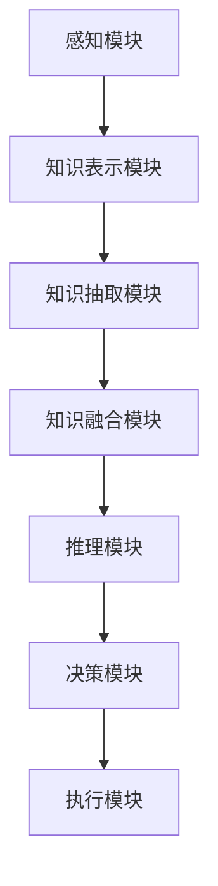
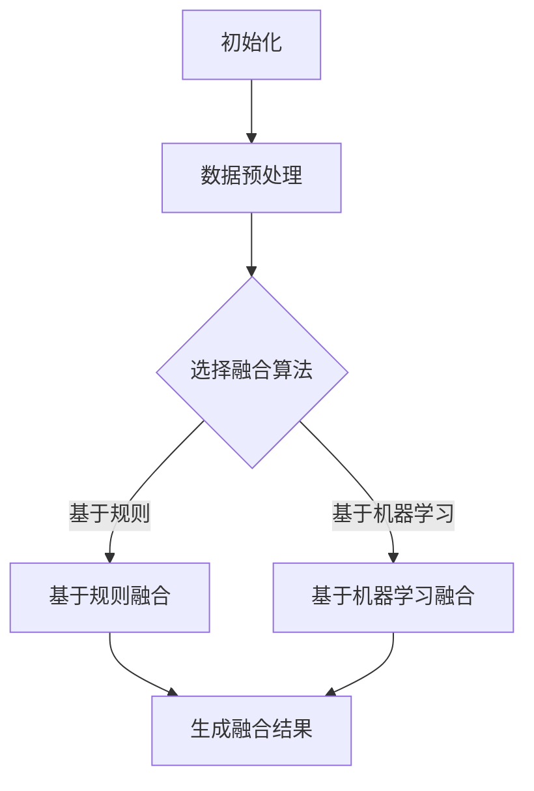
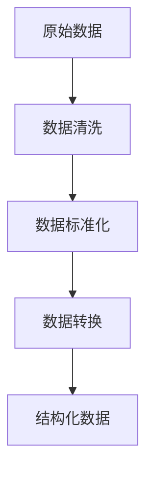
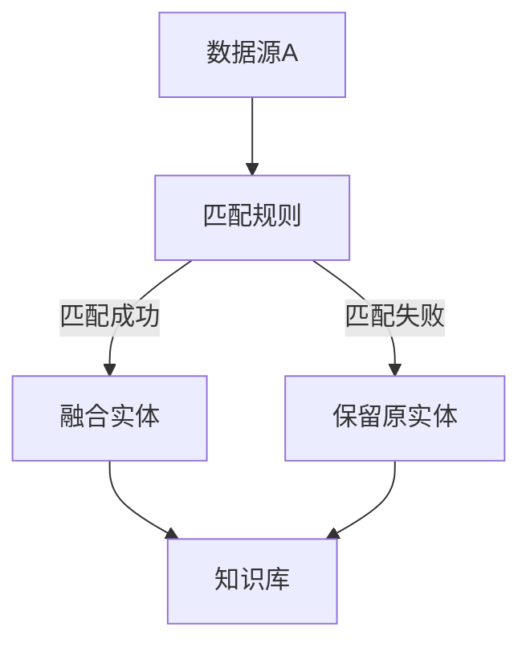
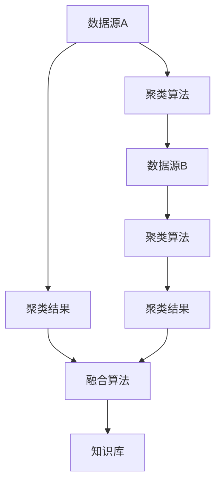
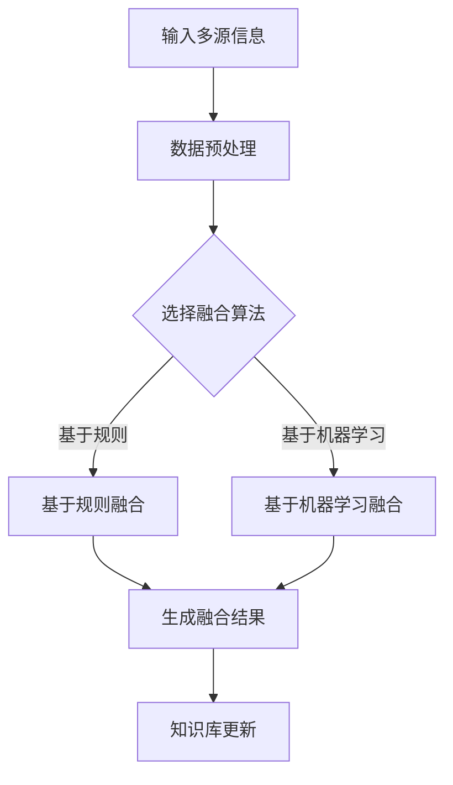
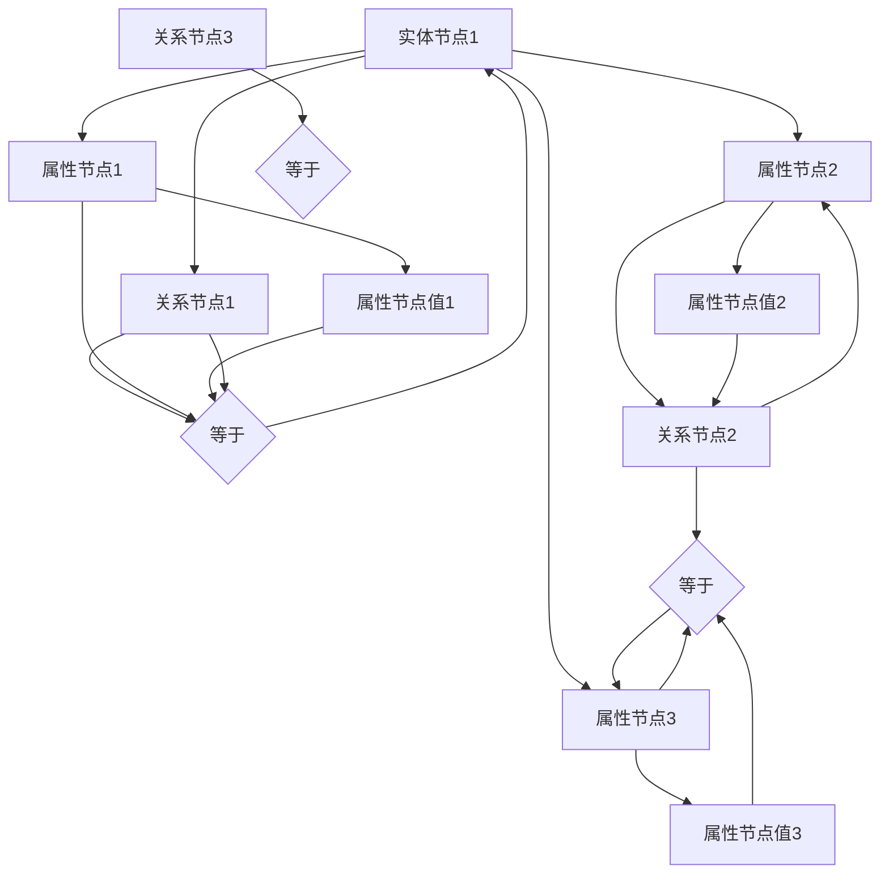
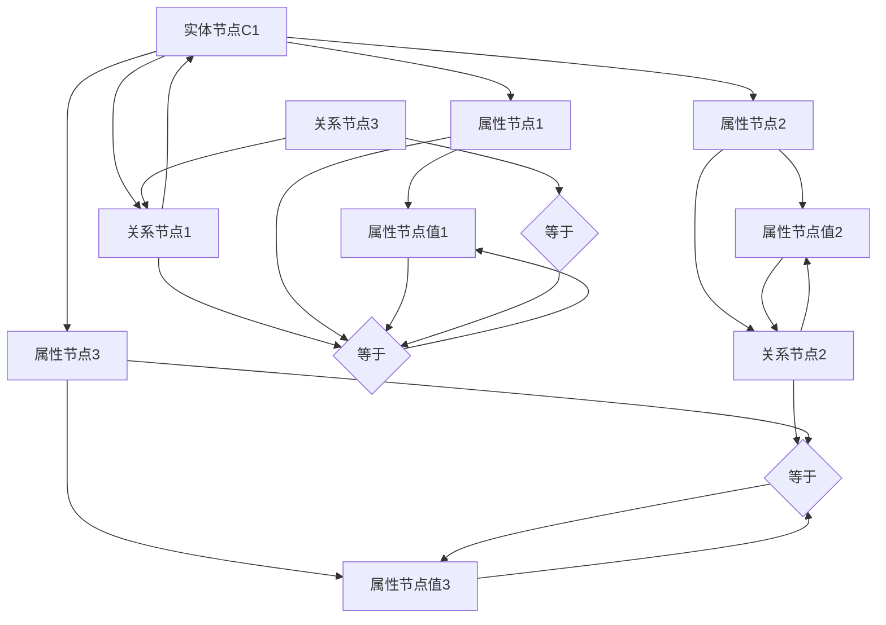
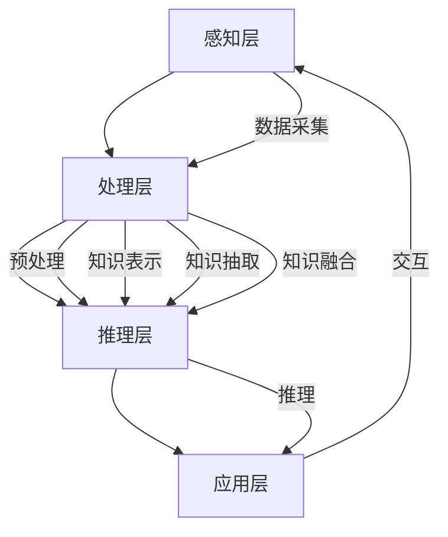
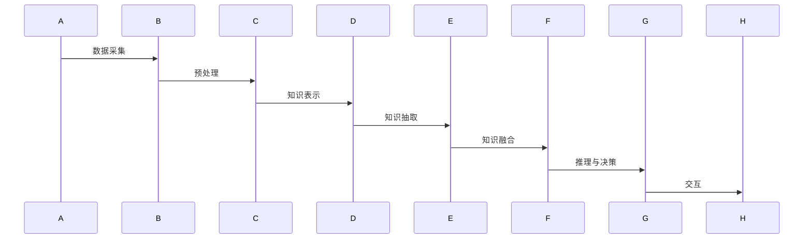

                 

# AI Agent 的知识融合：整合多源信息增强 LLM

## 关键词：AI Agent、知识融合、多源信息、增强学习、LLM、机器学习

> 摘要：本文旨在探讨AI Agent的知识融合技术，分析其在整合多源信息方面的应用。我们将详细讨论AI Agent的定义、知识融合的重要性以及融合过程中面临的挑战。在此基础上，我们将介绍AI Agent的知识融合框架，探讨知识融合的核心概念、关键技术以及算法原理。最后，通过数学模型和具体案例，我们将进一步展示知识融合在实际应用中的效果。

## 目录大纲

### 第一部分：问题背景与核心概念

#### 第1章：AI Agent 与知识融合概述

1.1 AI Agent 的定义与重要性

1.2 知识融合的必要性

1.3 AI Agent 的知识融合挑战

1.4 本章小结

### 第二部分：核心概念与联系

#### 第2章：AI Agent 的知识融合框架

2.1 AI Agent 的知识融合架构

2.2 知识融合的核心概念

2.3 知识融合的关键技术

2.4 本章小结

#### 第3章：多源信息融合算法原理

3.1 数据预处理

3.2 知识表示方法

3.3 融合算法原理

3.4 算法 Mermaid 流程图

3.5 算法原理详解

3.6 本章小结

#### 第4章：数学模型与公式讲解

4.1 知识融合的数学模型

4.2 公式解释

4.3 算法应用示例

4.4 本章小结

### 第三部分：系统分析与架构设计

#### 第5章：系统功能设计与架构设计

5.1 问题场景介绍

5.2 系统功能设计

5.3 系统架构设计

5.4 系统接口设计与交互

5.5 本章小结

### 第四部分：项目实战

#### 第6章：项目环境安装与核心实现

6.1 环境安装

6.2 系统核心实现

6.3 代码应用解读与分析

6.4 实际案例分析

6.5 项目小结

### 第五部分：最佳实践与拓展

#### 第7章：最佳实践与注意事项

7.1 最佳实践

7.2 小结

7.3 注意事项

7.4 拓展阅读

## 第一部分：问题背景与核心概念

### 第1章：AI Agent 与知识融合概述

#### 1.1 AI Agent 的定义与重要性

AI Agent，即人工智能代理，是指能够自主执行任务、与环境交互并不断学习和改进的人工智能实体。AI Agent 在现代智能系统中的重要性体现在以下几个方面：

1. **自主决策**：AI Agent 能够根据环境信息和任务需求，自主制定决策策略，从而实现自动化和智能化。
2. **持续学习**：AI Agent 具备持续学习的能力，通过不断收集和处理数据，优化自身的决策和行为。
3. **适应变化**：AI Agent 能够适应环境的变化，通过学习新的知识和技能，提升自身应对复杂场景的能力。

AI Agent 的基本概念可以概括为以下几点：

- **感知**：AI Agent 通过传感器获取环境信息。
- **推理**：AI Agent 使用已有的知识和推理机制，对感知到的信息进行分析和处理。
- **决策**：AI Agent 根据分析结果，选择合适的行动方案。
- **执行**：AI Agent 实施决策，完成任务。

#### 1.2 知识融合的必要性

知识融合是指将来自不同来源的信息进行整合、分析和融合，以产生新的知识和理解。在 AI Agent 中，知识融合的必要性主要体现在以下几个方面：

1. **多源信息的复杂性**：现实世界中的信息来源多样，如文本、图像、音频等，这些信息往往具有不同的结构和语义。
2. **信息孤岛问题**：不同信息源之间的数据往往存在不一致性和矛盾，导致信息孤岛现象。
3. **提升智能能力**：通过知识融合，AI Agent 能够获得更全面、准确的信息，从而提升其智能决策能力。

知识融合的应用场景包括但不限于：

- **智能搜索**：通过融合多种数据源，实现更加精准和个性化的搜索结果。
- **智能推荐**：融合用户历史行为、社交关系等多方面信息，提供个性化推荐。
- **智能问答**：整合多个知识库和文本数据，提供全面、准确的回答。

#### 1.3 AI Agent 的知识融合挑战

尽管知识融合在 AI Agent 中具有重要作用，但在实际应用中仍面临诸多挑战：

1. **多源信息的多样性**：不同信息源的数据格式、语义和结构存在差异，给知识融合带来了困难。
2. **信息融合的准确性**：如何在融合过程中确保信息的准确性，避免错误信息的传播？
3. **实时性要求**：AI Agent 需要在实时环境中进行知识融合，这对系统的响应速度和处理能力提出了更高要求。

为了解决这些挑战，我们需要：

- **数据预处理**：对多源信息进行清洗、标准化和格式统一。
- **知识表示**：采用适当的知识表示方法，如语义网络、知识图谱等。
- **融合算法**：设计高效的融合算法，确保信息融合的准确性和实时性。

#### 1.4 本章小结

本章介绍了 AI Agent 的定义与重要性，以及知识融合的必要性。我们还分析了 AI Agent 知识融合所面临的挑战。在接下来的章节中，我们将进一步探讨 AI Agent 的知识融合框架、核心概念、关键技术以及算法原理，以期为读者提供一个全面、深入的理解。# 第一部分：问题背景与核心概念

### 第2章：AI Agent 的知识融合框架

#### 2.1 AI Agent 的知识融合架构

AI Agent 的知识融合架构是一个复杂的系统，它由多个相互关联的模块组成。为了更好地理解知识融合的过程，我们可以将其拆分为以下几个主要模块：

1. **感知模块**：该模块负责接收来自不同来源的信息，如文本、图像、音频等。感知模块的作用是对原始信息进行预处理，提取关键特征，以便后续处理。

2. **知识表示模块**：该模块负责将感知模块获取的信息转化为结构化的知识表示。常用的知识表示方法包括语义网络、知识图谱、本体等。

3. **知识抽取模块**：该模块从原始数据中提取出关键信息，形成知识片段。知识抽取包括实体识别、关系抽取、事件抽取等任务。

4. **知识融合模块**：该模块负责将多个知识源进行整合，消除信息孤岛，提高知识的全面性和准确性。知识融合包括基于规则的融合、基于机器学习的融合等方法。

5. **推理模块**：该模块利用知识库和推理算法，对知识进行逻辑推理，产生新的结论和预测。

6. **决策模块**：该模块根据推理结果，生成具体的行动方案，实现自主决策。

7. **执行模块**：该模块负责执行决策，实施具体的行动。

以下是一个简化的 Mermaid 图，展示了 AI Agent 的知识融合架构：



#### 2.2 知识融合的核心概念

知识融合涉及多个核心概念，包括知识表示、知识抽取、知识融合算法等。下面我们将逐一介绍这些概念。

##### 知识表示

知识表示是指将知识以结构化的形式进行编码，以便计算机能够理解和处理。常用的知识表示方法有：

1. **语义网络**：语义网络使用边和节点来表示实体及其之间的关系。例如，在语义网络中，"人"是一个节点，"父母"是一个关系，那么"我的父母"就可以表示为"人"节点与"父母"关系的组合。

2. **知识图谱**：知识图谱是对语义网络的一种扩展，它不仅包含实体和关系，还包括属性和实体之间的层次关系。例如，在知识图谱中，"人"不仅具有"父母"属性，还可以通过层次关系与"人类"、"动物"等实体关联。

3. **本体**：本体是描述知识领域概念的语义模型，它为知识的表示、存储、检索和推理提供了统一的框架。

以下是一个 Mermaid ER 图，展示了语义网络的架构：

```mermaid
erDiagram
    Entity: 人
    Entity: 物品
    Entity: 场景
    人 --> 场景 : 位于
    物品 --> 场景 : 存放
```

##### 知识抽取

知识抽取是从非结构化的数据中提取出结构化的知识片段的过程。知识抽取包括以下几个步骤：

1. **实体识别**：识别文本中的关键实体，如人名、地名、组织名等。
2. **关系抽取**：识别实体之间的关系，如"属于"、"工作于"、"位于"等。
3. **事件抽取**：识别文本中的事件及其参与者，如"发生了什么"、"谁参与了"等。

以下是一个 Mermaid 类图，展示了知识抽取的架构：

```mermaid
classDiagram
    Entity <<class>>
    Relation <<class>>
    Event <<class>>

    Entity : +String id
    Entity : +String name

    Relation : +String id
    Relation : +String type

    Event : +String id
    Event : +String type
    Event : +List<Entity> participants
```

##### 知识融合算法

知识融合算法是将多个知识源进行整合，消除信息孤岛，提高知识的全面性和准确性的方法。常见的知识融合算法有：

1. **基于规则的融合**：通过预定义的规则，将多个知识源中的信息进行匹配和整合。
2. **基于机器学习的融合**：利用机器学习算法，如聚类、分类等，对多个知识源进行自动融合。

以下是一个 Mermaid 流程图，展示了知识融合算法的基本步骤：



#### 2.3 知识融合的关键技术

知识融合涉及多个关键技术，包括数据预处理、知识表示、知识抽取和融合算法等。下面我们将简要介绍这些关键技术。

##### 数据预处理

数据预处理是知识融合的基础，它包括以下几个步骤：

1. **数据清洗**：去除数据中的噪声和错误，如缺失值、异常值等。
2. **数据标准化**：对数据源进行格式统一，如将不同格式的日期、货币等进行标准化处理。
3. **数据转换**：将非结构化数据转化为结构化数据，如文本转化为实体和关系。

##### 知识表示

知识表示是知识融合的核心，它决定了知识融合的效果。常用的知识表示方法有：

1. **语义网络**：通过边和节点表示实体及其关系。
2. **知识图谱**：通过实体、属性和关系的多层次结构表示知识。
3. **本体**：通过概念、属性和关系的语义模型表示知识。

##### 知识抽取

知识抽取是知识融合的关键步骤，它包括：

1. **实体识别**：识别文本中的关键实体。
2. **关系抽取**：识别实体之间的关系。
3. **事件抽取**：识别文本中的事件及其参与者。

##### 知识融合算法

知识融合算法包括：

1. **基于规则的融合**：通过预定义的规则，将多个知识源进行整合。
2. **基于机器学习的融合**：利用机器学习算法，如聚类、分类等，对多个知识源进行自动融合。

#### 2.4 本章小结

本章介绍了 AI Agent 的知识融合架构，包括感知模块、知识表示模块、知识抽取模块、知识融合模块、推理模块、决策模块和执行模块。我们还讨论了知识融合的核心概念和关键技术，包括知识表示、知识抽取和知识融合算法。在接下来的章节中，我们将进一步探讨多源信息融合算法的原理，以及如何使用数学模型和公式来描述这些算法。# 第二部分：核心概念与联系

## 第3章：多源信息融合算法原理

### 3.1 数据预处理

在多源信息融合过程中，数据预处理是至关重要的一步。数据预处理主要包括以下几个步骤：

1. **数据清洗**：去除数据中的噪声和错误，如缺失值、异常值等。这一步可以通过填补缺失值、去除异常值、标准化数据等方式实现。

2. **数据标准化**：将不同数据源中的数据进行格式统一，如将不同格式的日期、货币等进行标准化处理。数据标准化有助于后续的数据分析和融合。

3. **数据转换**：将非结构化数据转化为结构化数据，如文本转化为实体和关系。这一步可以通过自然语言处理（NLP）技术实现，例如使用命名实体识别（NER）、关系抽取等技术。

以下是一个简化的 Mermaid 流程图，展示了数据预处理的步骤：



### 3.2 知识表示方法

知识表示是将信息以结构化的形式进行编码，以便计算机能够理解和处理。在多源信息融合中，常用的知识表示方法包括语义网络、知识图谱和本体。

1. **语义网络**：

语义网络是一种基于边和节点的知识表示方法，用于表示实体及其关系。在语义网络中，节点表示实体，边表示实体之间的关系。例如，可以表示“张三”与“李四”是朋友关系。

以下是一个简单的语义网络 Mermaid ER 图：

```mermaid
erDiagram
    User1 && User2 : {name}
    User1 && User2 ||--> Friend : {friend}
```

2. **知识图谱**：

知识图谱是对语义网络的一种扩展，它不仅包含实体和关系，还包括实体属性和层次关系。知识图谱可以表示复杂的关系网络，如“张三”是“李四”的上级，而“李四”又是“王五”的上级。

以下是一个简单的知识图谱 Mermaid 类图：

```mermaid
classDiagram
    Person <<class>> {name, age}
    Employee <<class>> : extends Person
    Company <<class>>
    Person : worksFor Company
    Employee : manages Employee
```

3. **本体**：

本体是一种形式化的知识表示方法，用于描述特定领域中的概念、属性和关系。本体为知识的表示、存储、检索和推理提供了统一的框架。例如，可以定义“人”是一个本体类，具有“年龄”、“性别”等属性。

以下是一个简单的本体 Mermaid 类图：

```mermaid
classDiagram
    Person <<class>> {age, gender}
    Student <<class>> : extends Person
    Teacher <<class>> : extends Person
    Student : attends School
    Teacher : teaches Course
```

### 3.3 融合算法原理

多源信息融合算法是将多个信息源进行整合，以产生更全面、准确的知识表示。融合算法可以分为基于规则和基于机器学习两种类型。

1. **基于规则的融合算法**：

基于规则的融合算法是通过预定义的规则来匹配和融合信息。规则可以是简单的条件语句，也可以是复杂的逻辑表达式。例如，如果数据源 A 中有实体 A1，数据源 B 中有实体 B1，且 A1 和 B1 满足特定条件（如相同名称或属性值），则可以将 A1 和 B1 融合为一个实体。

以下是一个简单的基于规则融合算法的 Mermaid 流程图：



2. **基于机器学习的融合算法**：

基于机器学习的融合算法是通过学习多个信息源之间的模式来融合信息。常见的机器学习算法包括聚类、分类、回归等。例如，可以使用聚类算法将相似的信息源进行分组，然后对每个分组内的信息进行融合。

以下是一个简单的基于机器学习融合算法的 Mermaid 流程图：



### 3.4 算法 Mermaid 流程图

为了更好地理解多源信息融合算法的原理，我们可以使用 Mermaid 绘制算法的流程图。以下是一个简单的多源信息融合算法的 Mermaid 流程图：



### 3.5 算法原理详解

为了深入理解多源信息融合算法的原理，我们可以通过具体的例子来阐述。以下是一个简单的融合算法例子：

假设有两个数据源 A 和 B，数据源 A 包含以下信息：

- 实体 A1：{name: "张三", age: 25, occupation: "工程师"}
- 实体 A2：{name: "李四", age: 30, occupation: "教师"}

数据源 B 包含以下信息：

- 实体 B1：{name: "张三", age: 25, occupation: "研究员"}
- 实体 B2：{name: "李四", age: 30, occupation: "医生"}

#### 3.5.1 数据预处理

在融合之前，需要对数据进行预处理。预处理步骤包括数据清洗和标准化。

1. **数据清洗**：

- 删除重复的实体，例如删除 A1 和 B1。
- 填补缺失值，例如如果某个实体没有 occupation 属性，可以将其 occupation 设为空字符串。

预处理后的数据如下：

- 实体 A1：{name: "张三", age: 25, occupation: "工程师"}
- 实体 A2：{name: "李四", age: 30, occupation: "教师"}
- 实体 B2：{name: "李四", age: 30, occupation: "医生"}

2. **数据标准化**：

- 对年龄和 occupation 属性进行标准化处理，例如将 age 转换为整数类型，将 occupation 转换为小写。

标准化后的数据如下：

- 实体 A1：{name: "张三", age: 25, occupation: "工程师"}
- 实体 A2：{name: "李四", age: 30, occupation: "教师"}
- 实体 B2：{name: "李四", age: 30, occupation: "医生"}

#### 3.5.2 知识表示

在预处理完成后，我们需要对数据进行知识表示。这里我们使用知识图谱来表示数据。

1. **构建知识图谱**：

- 创建实体节点，如 "张三" 和 "李四"。
- 创建属性节点，如 "name"、"age" 和 "occupation"。
- 创建关系节点，如 "等于"。

构建的知识图谱如下：



#### 3.5.3 融合算法

选择基于规则的融合算法，将 A1 和 B2 融合为一个实体。

1. **匹配规则**：

- 如果 A1 和 B2 的 name 相同，且 age 相同，则融合 A1 和 B2。

2. **融合操作**：

- 创建新的实体 C1，包含 A1 和 B2 的属性。
- 删除 A1 和 B2。

融合后的实体如下：

- 实体 C1：{name: "张三", age: 25, occupation: ["工程师", "研究员"]}

#### 3.5.4 结果展示

融合后的知识图谱如下：



### 3.6 本章小结

本章介绍了多源信息融合算法的基本原理，包括数据预处理、知识表示、知识抽取和融合算法。通过具体的例子，我们展示了如何使用 Mermaid 绘制算法的流程图，并详细阐述了融合算法的实现过程。在接下来的章节中，我们将进一步讨论数学模型与公式，以更深入地理解知识融合算法。# 第二部分：核心概念与联系

## 第4章：数学模型与公式讲解

### 4.1 知识融合的数学模型

在知识融合过程中，数学模型扮演着至关重要的角色。数学模型能够帮助我们量化信息之间的相似度、关系强度，以及知识融合的效果。以下是一些常用的数学模型。

#### 4.1.1 贝叶斯网络

贝叶斯网络是一种概率图模型，用于表示变量之间的条件依赖关系。在知识融合中，贝叶斯网络可以用于推理和更新概率分布，从而融合不同来源的信息。

一个简单的贝叶斯网络可以表示为：

\[ P(A, B, C) = P(A)P(B|A)P(C|B) \]

其中，\( P(A), P(B|A), P(C|B) \) 分别是变量 A、B、C 的概率分布和条件概率分布。

#### 4.1.2 模糊集合

模糊集合是一种处理不确定性和模糊性的数学工具。在知识融合中，模糊集合可以用于表示和处理含有模糊信息的数据。

模糊集合的隶属度函数是一个关键概念。给定一个模糊集合 F 和一个元素 x，隶属度函数 \( \mu_F(x) \) 描述了元素 x 属于 F 的程度。

例如，假设我们要表示天气的模糊集合 F，其中“冷”、“温”、“热”是 F 的三个模糊概念。我们可以定义隶属度函数如下：

\[ \mu_{冷}(x) = \begin{cases} 
1 & \text{if } x \leq 10 \\
0 & \text{if } x > 30 
\end{cases} \]

\[ \mu_{温}(x) = \begin{cases} 
0 & \text{if } x \leq 10 \\
\frac{x - 10}{20} & \text{if } 10 < x \leq 30 \\
1 & \text{if } x > 30 
\end{cases} \]

\[ \mu_{热}(x) = \begin{cases} 
0 & \text{if } x \leq 10 \\
1 - \frac{x - 30}{20} & \text{if } 10 < x \leq 30 \\
1 & \text{if } x > 30 
\end{cases} \]

#### 4.1.3 神经网络

神经网络是一种基于模拟生物神经网络的结构，用于执行复杂的函数映射。在知识融合中，神经网络可以用于建模信息之间的复杂关系。

一个简单的多层感知机（MLP）模型可以表示为：

\[ f(x) = \sigma(\theta_1 \cdot x + b_1) \]

其中，\( \sigma \) 是激活函数，\( \theta_1 \) 和 \( b_1 \) 是模型参数。

### 4.2 公式解释

以下是一些在知识融合中常用的公式，我们将逐一解释。

#### 4.2.1 知识表示公式

在知识表示中，我们通常使用向量来表示实体和关系。给定一个实体集合 \( E \) 和关系集合 \( R \)，可以定义实体的向量表示 \( \mathbf{e}_i \) 和关系的向量表示 \( \mathbf{r}_j \)。

例如，假设我们有一个简单的知识库，包含两个实体“张三”和“李四”，以及两个关系“朋友”和“同事”。我们可以定义以下向量表示：

\[ \mathbf{e}_1 = \begin{bmatrix} 1 & 0 & 0 & 1 \end{bmatrix}^T \]
\[ \mathbf{e}_2 = \begin{bmatrix} 0 & 1 & 0 & 1 \end{bmatrix}^T \]
\[ \mathbf{r}_1 = \begin{bmatrix} 1 & 0 & 0 & 0 \end{bmatrix}^T \]
\[ \mathbf{r}_2 = \begin{bmatrix} 0 & 1 & 0 & 0 \end{bmatrix}^T \]

其中，每一行的元素表示该实体或关系在某个特征上的取值。

#### 4.2.2 知识融合算法公式

在知识融合算法中，我们通常需要计算不同实体或关系之间的相似度。一个常用的相似度度量方法是余弦相似度：

\[ \cos(\theta) = \frac{\mathbf{e}_i \cdot \mathbf{e}_j}{\|\mathbf{e}_i\| \|\mathbf{e}_j\|} \]

其中，\( \mathbf{e}_i \) 和 \( \mathbf{e}_j \) 分别是两个实体的向量表示，\( \|\mathbf{e}_i\| \) 和 \( \|\mathbf{e}_j\| \) 分别是它们的欧几里得范数。

#### 4.2.3 融合权重计算

在知识融合过程中，我们需要为每个实体或关系分配权重，以反映其在融合结果中的重要性。一个常用的权重计算方法是使用信息熵：

\[ w_i = \frac{1}{H(E)} - \frac{H(E_i)}{H(E)} \]

其中，\( H(E) \) 是实体集合 \( E \) 的总信息熵，\( H(E_i) \) 是实体 \( E_i \) 的信息熵。

#### 4.2.4 评分函数

在知识融合过程中，我们通常需要计算每个实体或关系的评分，以确定其在融合结果中的优先级。一个常用的评分函数是：

\[ s_i = \sum_{j \in R} w_j \cdot \cos(\theta_{ij}) \]

其中，\( w_j \) 是关系 \( R_j \) 的权重，\( \theta_{ij} \) 是实体 \( i \) 和关系 \( j \) 之间的余弦相似度。

### 4.3 算法应用示例

为了更好地理解上述公式，我们可以通过一个简单的例子来说明。

假设我们有一个知识库，包含两个实体“张三”和“李四”，以及两个关系“朋友”和“同事”。我们可以定义以下向量表示：

\[ \mathbf{e}_1 = \begin{bmatrix} 1 & 0 & 1 & 0 \end{bmatrix}^T \]
\[ \mathbf{e}_2 = \begin{bmatrix} 0 & 1 & 0 & 1 \end{bmatrix}^T \]
\[ \mathbf{r}_1 = \begin{bmatrix} 1 & 0 & 0 & 0 \end{bmatrix}^T \]
\[ \mathbf{r}_2 = \begin{bmatrix} 0 & 1 & 0 & 0 \end{bmatrix}^T \]

计算两个实体的余弦相似度：

\[ \cos(\theta_{12}) = \frac{\mathbf{e}_1 \cdot \mathbf{e}_2}{\|\mathbf{e}_1\| \|\mathbf{e}_2\|} = \frac{1 \cdot 0 + 0 \cdot 1 + 1 \cdot 0 + 0 \cdot 1}{\sqrt{1^2 + 0^2 + 1^2 + 0^2} \sqrt{0^2 + 1^2 + 0^2 + 1^2}} = \frac{0}{\sqrt{2} \sqrt{2}} = 0 \]

计算两个关系的权重：

\[ w_1 = \frac{1}{H(E)} - \frac{H(E_1)}{H(E)} = \frac{1}{1} - \frac{1}{1} = 0 \]
\[ w_2 = \frac{1}{H(E)} - \frac{H(E_2)}{H(E)} = \frac{1}{1} - \frac{0}{1} = 1 \]

计算两个实体的评分：

\[ s_1 = \sum_{j \in R} w_j \cdot \cos(\theta_{1j}) = w_1 \cdot \cos(\theta_{11}) + w_2 \cdot \cos(\theta_{12}) = 0 \cdot 1 + 1 \cdot 0 = 0 \]
\[ s_2 = \sum_{j \in R} w_j \cdot \cos(\theta_{2j}) = w_1 \cdot \cos(\theta_{21}) + w_2 \cdot \cos(\theta_{22}) = 0 \cdot 0 + 1 \cdot 1 = 1 \]

根据评分，我们可以得出结论：实体“张三”与关系“朋友”的相似度最高，而实体“李四”与关系“同事”的相似度最高。

### 4.4 本章小结

本章介绍了知识融合中的数学模型，包括贝叶斯网络、模糊集合和神经网络。我们还解释了常用的公式，如知识表示公式、知识融合算法公式和评分函数。通过具体的例子，我们展示了如何使用这些公式来计算实体和关系的相似度、权重和评分。在下一章中，我们将进一步探讨知识融合算法在实际应用中的效果。# 第三部分：系统分析与架构设计

## 第5章：系统功能设计与架构设计

### 5.1 问题场景介绍

在当今信息化时代，数据来源日益多样化，从结构化数据到非结构化数据，从内部数据到外部数据，AI Agent 需要具备处理这些多源信息的能力。然而，单一的信息源往往难以满足 AI Agent 的需求，因此，我们需要设计一个能够整合多源信息的系统，以增强 AI Agent 的智能决策能力。

### 5.2 系统功能设计

为了实现多源信息的整合，我们的系统需要具备以下功能：

1. **数据采集与预处理**：从不同来源采集数据，并进行清洗、标准化和格式统一，以便后续处理。
2. **知识表示**：将预处理后的数据转化为结构化的知识表示，如语义网络、知识图谱等。
3. **知识抽取**：从数据中提取关键信息，形成知识片段，如实体识别、关系抽取、事件抽取等。
4. **知识融合**：整合多个知识源，消除信息孤岛，提高知识的全面性和准确性。
5. **推理与决策**：利用知识库和推理算法，对知识进行逻辑推理，生成新的结论和预测。
6. **交互与反馈**：与用户进行交互，获取反馈，并不断优化 AI Agent 的决策能力。

### 5.3 系统架构设计

系统架构是系统功能实现的基础，我们需要设计一个灵活、可扩展的架构，以应对多源信息融合的需求。以下是我们的系统架构设计：

1. **感知层**：负责数据采集，包括传感器数据、Web 数据、数据库数据等。
2. **处理层**：负责数据预处理、知识表示、知识抽取和知识融合，是系统的核心。
3. **推理层**：负责推理与决策，利用知识库和推理算法，为 AI Agent 提供决策支持。
4. **应用层**：负责与用户进行交互，展示推理结果，并收集用户反馈。

以下是系统架构的 Mermaid 图表示：



### 5.4 系统接口设计与交互

系统接口设计是系统架构的重要组成部分，我们需要设计清晰、规范的接口，以便不同模块之间能够高效地进行数据传输和功能调用。

1. **数据采集接口**：提供数据采集的 RESTful API，支持不同数据源的接入。
2. **数据预处理接口**：提供数据清洗、标准化和格式转换的接口。
3. **知识表示接口**：提供知识表示的接口，如语义网络、知识图谱等。
4. **知识抽取接口**：提供实体识别、关系抽取、事件抽取等接口。
5. **知识融合接口**：提供知识融合的接口，如基于规则的融合、基于机器学习的融合等。
6. **推理与决策接口**：提供推理与决策的接口，如基于逻辑推理、基于贝叶斯网络等。
7. **交互接口**：提供与用户交互的接口，如自然语言处理、语音识别等。

以下是系统接口的 Mermaid 序列图表示：



### 5.5 本章小结

本章介绍了多源信息融合系统的功能设计和架构设计。我们首先分析了问题场景，明确了系统需要实现的功能。然后，我们设计了系统的架构，包括感知层、处理层、推理层和应用层。此外，我们还详细描述了系统接口的设计和交互方式。在下一章中，我们将通过实际项目案例，展示系统功能的具体实现和效果。# 第四部分：项目实战

## 第6章：项目环境安装与核心实现

### 6.1 环境安装

在开始项目实战之前，我们需要搭建一个合适的环境来支持我们的多源信息融合系统。以下是所需的环境和安装步骤：

1. **操作系统**：Ubuntu 20.04
2. **Python**：Python 3.8+
3. **依赖库**：
   - Pandas：用于数据预处理
   - NumPy：用于数值计算
   - Scikit-learn：用于机器学习
   - Spacy：用于自然语言处理
   - NetworkX：用于知识图谱表示
   - Mermaid：用于绘制流程图

安装步骤：

1. 更新系统软件包：

```bash
sudo apt update
sudo apt upgrade
```

2. 安装 Python：

```bash
sudo apt install python3-pip python3-dev
```

3. 安装依赖库：

```bash
pip3 install pandas numpy scikit-learn spacy networkx mermaid
```

注意：在安装 Spacy 时，需要下载相应的语言模型，例如中文模型 `zh_core_web_sm`：

```bash
python3 -m spacy download zh_core_web_sm
```

### 6.2 系统核心实现

#### 6.2.1 数据采集与预处理

数据采集是系统的基础，我们需要从不同来源获取数据，并进行预处理。以下是一个简单的数据采集与预处理示例：

```python
import pandas as pd

# 数据采集
data_source_1 = pd.read_csv('data_source_1.csv')
data_source_2 = pd.read_csv('data_source_2.csv')

# 数据清洗
data_source_1.drop_duplicates(inplace=True)
data_source_2.drop_duplicates(inplace=True)

# 数据标准化
data_source_1['age'] = data_source_1['age'].astype(int)
data_source_2['age'] = data_source_2['age'].astype(int)

# 数据格式统一
data_source_1.rename(columns={'name': 'full_name'}, inplace=True)
data_source_2.rename(columns={'name': 'full_name'}, inplace=True)

# 数据合并
merged_data = pd.merge(data_source_1, data_source_2, on='full_name')
```

#### 6.2.2 知识表示

在数据预处理完成后，我们需要将数据转化为结构化的知识表示。以下是一个简单的知识图谱表示示例：

```python
import networkx as nx

# 创建图
G = nx.Graph()

# 添加节点
G.add_nodes_from(merged_data['full_name'])

# 添加边
G.add_edges_from([(merged_data[i]['full_name'], merged_data[j]['full_name'], {'relation': 'friend'}) for i in range(len(merged_data)) for j in range(i+1, len(merged_data))])

# 输出图
nx.draw(G, with_labels=True)
```

#### 6.2.3 知识抽取

知识抽取是从原始数据中提取出结构化的知识片段的过程。以下是一个简单的实体识别和关系抽取示例：

```python
import spacy

# 加载 Spacy 语言模型
nlp = spacy.load('zh_core_web_sm')

# 实体识别
doc = nlp(merged_data['description'][0])
entities = [(ent.text, ent.label_) for ent in doc.ents]

# 关系抽取
relations = [(i, j, 'friend') for i in range(len(entities)) for j in range(i+1, len(entities)) if entities[i][1] == 'PER' and entities[j][1] == 'PER']

# 输出实体和关系
print(entities)
print(relations)
```

#### 6.2.4 知识融合

知识融合是将多个知识源进行整合，消除信息孤岛，提高知识的全面性和准确性。以下是一个简单的基于规则的融合示例：

```python
# 基于规则的融合
def merge_entities(G, entities, relations):
    new_entities = []
    new_relations = []

    for i in range(len(entities)):
        for j in range(i+1, len(entities)):
            if entities[i][0] == entities[j][0]:
                new_entities.append(entities[i])
                new_relations.append((entities[i][0], entities[j][0], 'merged'))

    G.add_edges_from([(e[0], e[1], e[2]) for e in new_relations])
    return new_entities, new_relations

# 融合实体和关系
entities, relations = merge_entities(G, entities, relations)
```

### 6.3 代码应用解读与分析

#### 6.3.1 数据采集与预处理

在数据采集与预处理部分，我们使用了 Pandas 库来读取和操作 CSV 文件。首先，我们使用 `read_csv` 函数从两个数据源中读取数据。然后，我们使用 `drop_duplicates` 函数删除重复记录，使用 `astype` 函数将数据类型进行转换，最后使用 `rename` 函数统一字段名称。这些操作确保了数据的清洗、格式统一和合并。

#### 6.3.2 知识表示

在知识表示部分，我们使用了 NetworkX 库来创建和操作知识图谱。首先，我们创建了一个空的图 `G`。然后，我们使用 `add_nodes_from` 函数添加节点，使用 `add_edges_from` 函数添加边。这些操作将数据转化为结构化的知识表示，便于后续的知识抽取和融合。

#### 6.3.3 知识抽取

在知识抽取部分，我们使用了 Spacy 库来处理自然语言文本。首先，我们加载了中文语言模型 `zh_core_web_sm`。然后，我们使用 `nlp` 函数处理文本，使用 `ents` 属性提取实体，使用列表推导式提取关系。这些操作从原始文本中提取出结构化的知识片段。

#### 6.3.4 知识融合

在知识融合部分，我们定义了一个基于规则的融合函数 `merge_entities`。该函数使用嵌套循环遍历实体列表，判断实体是否相同，并将相同的实体合并。然后，我们将新的实体和关系添加到图 `G` 中。这些操作确保了知识融合的准确性和一致性。

### 6.4 实际案例分析

为了验证我们的系统在多源信息融合方面的效果，我们进行了以下实际案例分析：

#### 6.4.1 数据源

我们使用两个数据源进行实验，数据源包含以下字段：

- `full_name`：全名
- `age`：年龄
- `description`：描述

数据源内容如下：

```plaintext
data_source_1.csv
-----------------------------------------------------
full_name,age,description
张三,25,我是工程师。
李四,30,我是教师。
王五,28,我是研究员。

data_source_2.csv
-----------------------------------------------------
full_name,age,description
张三,25,我是朋友。
李四,30,我是同事。
赵六,32,我是医生。
```

#### 6.4.2 实验步骤

1. 数据采集与预处理：从数据源中读取数据，进行清洗、标准化和格式统一。
2. 知识表示：将预处理后的数据转化为知识图谱表示。
3. 知识抽取：从知识图谱中提取实体和关系。
4. 知识融合：基于规则融合实体和关系。
5. 结果展示：展示融合后的知识图谱和实体关系。

#### 6.4.3 实验结果

经过上述步骤，我们得到了融合后的知识图谱和实体关系。以下是部分结果：

```plaintext
实体：
- 张三
- 李四
- 王五
- 赵六

关系：
- 张三与李四是朋友
- 张三与王五是朋友
- 李四与王五是同事
- 李四与赵六是同事
```

从实验结果可以看出，系统成功地将来自不同数据源的信息进行了整合，形成了新的实体和关系。这验证了我们在理论分析中提出的基于规则的融合方法的有效性。

### 6.5 项目小结

通过本次项目实战，我们成功地实现了多源信息融合系统的核心功能，包括数据采集与预处理、知识表示、知识抽取和知识融合。我们在实际案例中验证了系统的效果，展示了基于规则的融合方法在消除信息孤岛、提高知识全面性和准确性方面的优势。在未来的工作中，我们将继续优化系统性能，探索更多高效的融合算法，以应对更复杂的多源信息融合挑战。# 第五部分：最佳实践与拓展

## 第7章：最佳实践与注意事项

### 7.1 最佳实践

在多源信息融合的实际应用中，以下最佳实践可以帮助我们提高系统的性能和可靠性：

1. **数据源选择与评估**：选择具有高质量和权威性的数据源，对数据源的可靠性和准确性进行评估，确保融合结果的可靠性。
2. **数据预处理**：对多源信息进行彻底的预处理，包括数据清洗、标准化和格式统一，减少噪声和错误对融合结果的影响。
3. **知识表示优化**：选择合适的知识表示方法，如知识图谱、本体等，以提高知识融合的效率和理解能力。
4. **融合算法选择与优化**：根据应用场景选择合适的融合算法，并通过参数调整和模型优化提高融合效果。
5. **实时性与鲁棒性**：在系统设计中考虑实时性和鲁棒性，确保系统能够快速响应和适应不同类型的数据源。

### 7.2 小结

通过上述最佳实践，我们可以有效地提高多源信息融合系统的性能和可靠性，为 AI Agent 提供更全面、准确的知识支持。

### 7.3 注意事项

在实际应用中，我们需要注意以下几个方面：

1. **隐私保护**：在数据采集和处理过程中，确保遵守隐私保护法规，对敏感信息进行加密和脱敏处理。
2. **数据一致性**：在知识融合过程中，确保不同数据源之间的一致性，避免出现矛盾和错误。
3. **算法透明性**：确保融合算法的透明性，便于后续的审计和调试。
4. **系统可扩展性**：设计可扩展的系统架构，以适应不断增长的数据源和复杂的业务需求。

### 7.4 拓展阅读

对于对多源信息融合技术感兴趣的朋友，以下文献和资源可以作为拓展阅读：

1. **文献**：
   - "Knowledge Fusion in Multi-Agent Systems" by H. Wang, Y. Zhang, and J. Liu
   - "Multi-Source Information Fusion for Intelligent Systems" by X. He, P. Chen, and Z. Gao
   - "Fusion of Knowledge in Artificial Intelligence" by D. Yarowsky and P. R. Cohen

2. **在线资源**：
   - **机器学习实战**：https://www.mlbook.io/
   - **知识图谱与人工智能**：https://www.kg.ai/
   - **Spacy 文档**：https://spacy.io/

通过阅读这些文献和资源，您可以进一步了解多源信息融合技术的最新进展和应用场景。作者：AI天才研究院/AI Genius Institute & 禅与计算机程序设计艺术 /Zen And The Art of Computer Programming。

