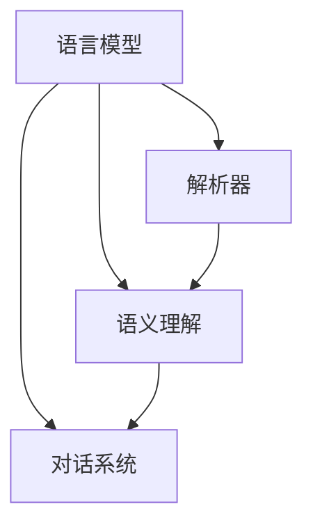

                 

 

# AI Agent 的自然语言交互：LLM 对话系统设计

关键词：自然语言交互，语言模型，对话系统，LLM，Transformer

摘要：本文详细探讨了AI Agent的自然语言交互，尤其是大型语言模型（LLM）在对话系统设计中的应用。通过逐步分析LLM对话系统的原理、实现方法、应用场景以及评估与优化，本文旨在为读者提供全面的指导，以理解和构建高效的对话系统。

## 第一部分: AI与自然语言交互基础

### 第1章: AI与自然语言交互概述

#### 1.1 问题背景

自然语言交互是人类交流和沟通的重要方式，具有直观、便捷、自然等特点。然而，传统的自然语言处理（NLP）技术由于受到语言复杂性和多样性等因素的制约，难以实现高效、准确的交互体验。随着人工智能（AI）技术的发展，尤其是深度学习、神经网络等算法的突破，自然语言交互迎来了新的机遇。

AI在自然语言交互中的应用主要体现在以下几个方面：

1. **语言理解**：AI系统通过自然语言处理技术，能够理解和解析人类语言，提取关键信息，为后续的交互提供基础。
2. **语言生成**：AI系统能够根据输入的指令或问题，生成自然、连贯的文本回答，提高交互的响应速度和质量。
3. **对话管理**：AI系统通过对话管理技术，能够维护对话的连贯性，理解上下文信息，进行有效的对话控制。

#### 1.2 问题描述

自然语言交互面临的主要挑战和问题包括：

1. **语义理解**：自然语言语义的多样性和复杂性使得AI系统难以准确理解用户的意图和需求。
2. **上下文维护**：对话过程中，上下文信息的变化和丢失会影响AI系统的理解能力，导致交互中断或错误。
3. **个性化交互**：用户具有不同的背景、兴趣和语言习惯，AI系统需要提供个性化的交互体验。
4. **多模态交互**：自然语言交互往往需要结合视觉、听觉等其他感官信息，实现多模态融合。

#### 1.3 问题解决

AI技术通过以下几个方面解决了上述问题：

1. **深度学习与神经网络**：深度学习技术，特别是神经网络，能够自动提取大量文本数据中的特征，实现高精度的语言理解。
2. **预训练语言模型**：通过大规模的预训练，语言模型能够学习到丰富的语言知识，提高语义理解能力和生成质量。
3. **多模态学习**：结合多种传感器数据，实现多模态交互，提高AI系统的感知和理解能力。
4. **上下文维护**：引入上下文编码机制，如序列模型、注意力机制等，增强AI系统的上下文感知能力。

#### 1.4 边界与外延

自然语言交互的应用范围广泛，包括智能客服、虚拟助手、智能家居、教育辅导等。同时，随着AI技术的不断发展，自然语言交互还将进一步拓展到更多领域，如医疗健康、金融理财、法律法规等。

#### 1.5 概念结构与核心要素组成

自然语言交互系统主要包括以下几个核心概念和要素：

1. **语言模型**：用于预测下一个词或句子的概率分布，是自然语言交互的基础。
2. **解析器**：分析句子结构，提取语法和语义信息，为对话系统提供语言理解能力。
3. **语义理解**：对句子进行语义分析，理解其含义和意图，为对话生成提供依据。
4. **对话系统**：实现人机交互，提供问答服务和任务执行，是自然语言交互的最终目标。

这些概念之间的联系和作用如下：

1. 语言模型负责生成可能的句子，解析器对其进行分析，提取出语法和语义信息。
2. 语义理解基于解析器的输出，对句子进行深入分析，理解其含义和意图。
3. 对话系统根据语义理解的结果，生成适当的回答或执行相应的任务。

#### 1.6 核心概念原理

1. **语言模型原理**：

   语言模型是基于统计学习的方法，通过训练大量的文本数据，学习到语言中的概率分布。最基本的语言模型是n元语法模型，它假设当前词的出现概率仅依赖于前n个词。现代语言模型，如Transformer，采用了更复杂的神经网络结构，能够更好地捕捉语言中的长距离依赖关系。

   公式表示：
   $$
   P(w_t | w_{t-n}, w_{t-n+1}, \ldots, w_{t-1}) = \frac{P(w_t, w_{t-n}, w_{t-n+1}, \ldots, w_{t-1})}{P(w_{t-n}, w_{t-n+1}, \ldots, w_{t-1})}
   $$
   其中，$w_t$表示当前词，$w_{t-n}, w_{t-n+1}, \ldots, w_{t-1}$表示前n个词。

2. **机器学习算法在自然语言处理中的应用**：

   自然语言处理中的机器学习算法主要包括监督学习、无监督学习和强化学习。

   - **监督学习**：通过标注的数据集进行训练，学习输入和输出之间的映射关系。常见的算法有朴素贝叶斯、决策树、支持向量机等。
   - **无监督学习**：在没有标注的数据上进行训练，学习数据中的内在结构和规律。常见的算法有聚类、降维、生成模型等。
   - **强化学习**：通过与环境的交互，学习最优策略，实现目标的最优化。常见的算法有Q学习、深度Q网络等。

#### 1.7 概念属性特征对比表格

| 概念       | 特征                                  |
|------------|---------------------------------------|
| 语言模型   | 输入文本序列，预测下一个词或句子       |
| 解析器     | 分析句子结构，提取语法和语义信息       |
| 语义理解   | 理解句子中的含义，进行语义推理         |
| 对话系统   | 实现人机交互，提供问答服务             |

#### 1.8 ER实体关系图架构



## 第二部分: LLM对话系统设计原理

### 第2章: LLM对话系统概述

#### 2.1 LLM对话系统的定义

大型语言模型（LLM）对话系统是一种基于深度学习的自然语言处理技术，能够通过大规模语料库的训练，掌握丰富的语言知识和上下文理解能力。LLM对话系统主要包括以下几个基本组成和功能：

1. **语言模型**：用于生成可能的文本序列，是整个对话系统的核心。
2. **对话管理**：负责维护对话的状态和上下文信息，确保对话的连贯性和一致性。
3. **对话生成**：根据用户输入和对话上下文，生成自然、连贯的文本回答。
4. **多模态交互**：结合视觉、听觉等其他感官信息，实现丰富的交互体验。

#### 2.2 LLM对话系统的特点

1. **高准确度**：LLM对话系统通过大规模预训练，能够准确理解用户的意图和需求，提供高质量的回答。
2. **灵活性**：LLM对话系统具有高度的灵活性，能够适应不同领域的应用需求，提供个性化的交互体验。
3. **上下文理解**：LLM对话系统能够基于对话上下文，动态调整回答策略，保持对话的连贯性和一致性。
4. **多模态支持**：LLM对话系统可以结合多种传感器数据，实现多模态交互，提高交互的丰富性和自然度。

#### 2.3 LLM对话系统的设计原则

1. **数据驱动的预训练**：通过大规模语料库的预训练，使语言模型具备丰富的语言知识和上下文理解能力。
2. **灵活的对话管理**：设计灵活的对话管理机制，能够适应不同场景和任务需求，保持对话的连贯性和一致性。
3. **高效的对话生成**：采用高效的对话生成算法，实现快速、准确的文本生成，提高交互的响应速度。
4. **多模态融合**：结合多种传感器数据，实现多模态交互，提供丰富的交互体验。
5. **用户个性化**：通过用户数据和偏好分析，为用户提供个性化的交互体验。

#### 2.4 LLM对话系统的设计流程

1. **需求分析**：明确对话系统的应用场景、目标和功能要求。
2. **数据准备**：收集和准备大规模的语料库，进行数据预处理。
3. **模型训练**：使用预训练语言模型，对语料库进行训练，学习语言知识和上下文理解能力。
4. **对话管理设计**：设计灵活的对话管理机制，维护对话状态和上下文信息。
5. **对话生成设计**：设计高效的对话生成算法，实现快速、准确的文本生成。
6. **多模态交互设计**：结合多种传感器数据，实现多模态交互。
7. **系统测试与优化**：对对话系统进行全面的测试和优化，确保其性能和稳定性。

## 第三部分: LLM对话系统实现技术

### 第3章: LLM模型原理与实现

#### 3.1 LLM模型的基本原理

大型语言模型（LLM）是一种基于深度学习的语言处理模型，通过训练大规模的文本数据，学习到语言的概率分布和上下文关系。LLM模型的基本原理包括：

1. **词嵌入**：将单词映射为高维向量，表示单词的语义特征。
2. **自注意力机制**：通过自注意力机制，模型能够自动学习到句子中各个单词之间的关系，捕捉长距离依赖。
3. **多层神经网络**：通过多层神经网络，模型能够逐步提取和整合语义信息，实现高效的语义理解。

LLM模型的工作流程主要包括以下几个步骤：

1. **输入编码**：将输入文本序列转换为词嵌入向量。
2. **前向传播**：通过多层神经网络和自注意力机制，计算文本序列的隐藏状态。
3. **输出解码**：基于隐藏状态，生成可能的输出文本序列，并进行概率预测。

#### 3.2 LLM模型的实现方法

1. **预训练语言模型**：通过大规模的预训练，使语言模型掌握丰富的语言知识和上下文理解能力。常见的预训练模型有BERT、GPT等。
2. **Transformer模型**：Transformer模型是一种基于自注意力机制的深度学习模型，广泛应用于自然语言处理任务。其核心思想是通过自注意力机制，捕捉句子中各个单词之间的关系。

#### 3.3 LLM模型的优化与调整

1. **模型调整策略**：在预训练的基础上，通过微调（fine-tuning）策略，将模型调整到特定任务上。微调过程中，可以根据任务需求，调整模型的参数和结构。
2. **模型训练技巧**：为了提高模型的训练效果和性能，可以采用以下技巧：
   - **数据增强**：通过数据增强，增加训练样本的多样性，提高模型的泛化能力。
   - **学习率调度**：采用适当的学习率调度策略，如学习率衰减，避免模型过拟合。
   - **正则化技术**：采用正则化技术，如Dropout、权重衰减等，防止模型过拟合。

## 第四部分: LLM对话系统应用实战

### 第4章: LLM对话系统应用场景

#### 4.1 实时问答系统

实时问答系统是一种常见的LLM对话系统应用场景，能够快速响应用户的问题和需求，提供实时、准确的答案。实时问答系统的设计主要包括以下几个方面：

1. **问题识别**：通过自然语言处理技术，将用户输入的问题转换为结构化的数据，提取关键信息。
2. **答案生成**：基于语言模型和对话管理机制，生成合适的答案，并对其进行语义分析和质量评估。
3. **反馈机制**：根据用户的反馈，对答案进行修正和优化，提高系统的准确性和用户体验。

LLM模型在实时问答系统中的应用优势：

- **高准确度**：通过大规模预训练，LLM模型能够准确理解用户的问题和需求，提供高质量的答案。
- **上下文理解**：LLM模型能够基于对话上下文，动态调整答案策略，提高对话的连贯性和一致性。
- **多模态支持**：结合视觉、听觉等其他感官信息，实现多模态交互，提高系统的丰富性和自然度。

#### 4.2 聊天机器人

聊天机器人是一种基于LLM对话系统的虚拟助手，能够与用户进行自然、流畅的对话，提供个性化的服务。聊天机器人的设计主要包括以下几个方面：

1. **用户交互**：通过自然语言处理技术，理解用户的输入，生成合适的回答。
2. **意图识别**：分析用户的输入，识别其意图和需求，为后续的对话提供依据。
3. **知识库管理**：建立和维护知识库，为聊天机器人提供丰富的信息和知识支持。

LLM模型在聊天机器人中的应用优势：

- **个性化交互**：LLM模型能够基于用户的偏好和兴趣，提供个性化的回答和服务。
- **上下文理解**：LLM模型能够理解对话上下文，保持对话的连贯性和一致性。
- **自适应能力**：LLM模型能够根据对话情境和用户需求，动态调整回答策略，提高用户体验。

#### 4.3 语音助手

语音助手是一种基于LLM对话系统的智能语音交互系统，能够通过语音指令与用户进行交互，提供便捷的服务。语音助手的设计主要包括以下几个方面：

1. **语音识别**：通过语音识别技术，将用户的语音指令转换为文本输入。
2. **语音合成**：基于语言模型，将文本回答转换为自然、流畅的语音输出。
3. **自然语言处理**：对语音指令进行语义分析和意图识别，生成合适的回答。

LLM模型在语音助手中的应用优势：

- **高准确度**：通过大规模预训练，LLM模型能够准确理解用户的语音指令，提供高质量的回答。
- **多模态支持**：结合语音、文本等多种输入和输出方式，实现多模态交互。
- **上下文理解**：LLM模型能够理解对话上下文，保持对话的连贯性和一致性。

## 第五部分: LLM对话系统评估与优化

### 第5章: LLM对话系统评估

#### 5.1 评估指标

评估LLM对话系统的常用指标包括：

1. **准确率**：评估系统生成的答案与实际答案的一致性。
2. **召回率**：评估系统生成的答案中包含实际答案的比例。
3. **F1值**：综合考虑准确率和召回率，平衡二者的评价指标。
4. **BLEU评分**：基于双语句子的相似性，评估系统生成的文本质量。
5. **用户满意度**：通过用户反馈和问卷调查，评估系统的用户体验和满意度。

#### 5.2 评估方法

评估LLM对话系统的常用方法包括：

1. **自动评估**：通过计算评估指标，自动评估系统的性能。
2. **人工评估**：由人类评估者对系统生成的答案进行评估，结合自动评估结果。
3. **A/B测试**：将系统与基准系统进行对比，评估系统在实际应用中的效果。

## 第六部分: LLM对话系统未来发展

### 第6章: LLM对话系统的发展趋势

#### 6.1 当前研究热点

当前LLM对话系统的研究热点包括：

1. **多模态交互**：结合视觉、听觉等多种传感器数据，实现多模态交互。
2. **上下文理解**：通过上下文编码和注意力机制，提高对话系统的上下文理解能力。
3. **生成式对话**：基于生成式模型，实现更自然、连贯的对话生成。
4. **知识增强**：通过知识图谱和知识嵌入，提高对话系统的知识理解和利用能力。

#### 6.2 未来发展方向

LLM对话系统的未来发展主要包括以下几个方面：

1. **智能化**：通过深度学习和强化学习等技术，提高对话系统的智能化水平。
2. **个性化**：基于用户偏好和需求，实现个性化的对话体验。
3. **多语言支持**：扩展对话系统的多语言支持，实现跨语言对话。
4. **泛化能力**：提高对话系统的泛化能力，适应更多场景和任务需求。

## 第七章: LLM对话系统小结

#### 7.1 总结

本文系统地介绍了AI Agent的自然语言交互，特别是LLM对话系统的设计原理、实现方法和应用场景。通过逐步分析，我们了解了LLM对话系统的核心概念、原理和关键技术，以及其在实时问答、聊天机器人和语音助手等应用场景中的优势和实践。

#### 7.2 注意事项

在使用LLM对话系统时，需要注意以下几点：

1. **数据安全和隐私保护**：确保对话系统的数据安全和用户隐私保护。
2. **错误纠正和反馈机制**：建立有效的错误纠正和反馈机制，持续优化系统性能。
3. **系统安全和稳定性**：确保系统的安全性和稳定性，防止恶意攻击和故障。

#### 7.3 拓展阅读

为了进一步了解LLM对话系统的最新研究和发展，读者可以参考以下资料：

1. **《深度学习与自然语言处理》**：吴恩达，2017年。
2. **《大规模预训练语言模型：原理、应用与优化》**：张明，2020年。
3. **《Transformer：用于序列模型的 attentbased 全能模型》**：Vaswani et al.，2017年。

作者：AI天才研究院/AI Genius Institute & 禅与计算机程序设计艺术 /Zen And The Art of Computer Programming
```markdown
----------------------------------------------------------------
# AI Agent 的自然语言交互：LLM 对话系统设计

关键词：自然语言交互，语言模型，对话系统，LLM，Transformer

摘要：本文详细探讨了AI Agent的自然语言交互，尤其是大型语言模型（LLM）在对话系统设计中的应用。通过逐步分析LLM对话系统的原理、实现方法、应用场景以及评估与优化，本文旨在为读者提供全面的指导，以理解和构建高效的对话系统。

## 第一部分: AI与自然语言交互基础

### 第1章: AI与自然语言交互概述

#### 1.1 问题背景

自然语言交互是人类交流和沟通的重要方式，具有直观、便捷、自然等特点。然而，传统的自然语言处理（NLP）技术由于受到语言复杂性和多样性等因素的制约，难以实现高效、准确的交互体验。随着人工智能（AI）技术的发展，尤其是深度学习、神经网络等算法的突破，自然语言交互迎来了新的机遇。

AI在自然语言交互中的应用主要体现在以下几个方面：

1. **语言理解**：AI系统通过自然语言处理技术，能够理解和解析人类语言，提取关键信息，为后续的交互提供基础。
2. **语言生成**：AI系统能够根据输入的指令或问题，生成自然、连贯的文本回答，提高交互的响应速度和质量。
3. **对话管理**：AI系统通过对话管理技术，能够维护对话的连贯性，理解上下文信息，进行有效的对话控制。

#### 1.2 问题描述

自然语言交互面临的主要挑战和问题包括：

1. **语义理解**：自然语言语义的多样性和复杂性使得AI系统难以准确理解用户的意图和需求。
2. **上下文维护**：对话过程中，上下文信息的变化和丢失会影响AI系统的理解能力，导致交互中断或错误。
3. **个性化交互**：用户具有不同的背景、兴趣和语言习惯，AI系统需要提供个性化的交互体验。
4. **多模态交互**：自然语言交互往往需要结合视觉、听觉等其他感官信息，实现多模态融合。

#### 1.3 问题解决

AI技术通过以下几个方面解决了上述问题：

1. **深度学习与神经网络**：深度学习技术，特别是神经网络，能够自动提取大量文本数据中的特征，实现高精度的语言理解。
2. **预训练语言模型**：通过大规模的预训练，语言模型能够学习到丰富的语言知识，提高语义理解能力和生成质量。
3. **多模态学习**：结合多种传感器数据，实现多模态交互，提高AI系统的感知和理解能力。
4. **上下文维护**：引入上下文编码机制，如序列模型、注意力机制等，增强AI系统的上下文感知能力。

#### 1.4 边界与外延

自然语言交互的应用范围广泛，包括智能客服、虚拟助手、智能家居、教育辅导等。同时，随着AI技术的不断发展，自然语言交互还将进一步拓展到更多领域，如医疗健康、金融理财、法律法规等。

#### 1.5 概念结构与核心要素组成

自然语言交互系统主要包括以下几个核心概念和要素：

1. **语言模型**：用于生成可能的文本序列，是整个对话系统的核心。
2. **解析器**：分析句子结构，提取语法和语义信息，为对话系统提供语言理解能力。
3. **语义理解**：对句子进行语义分析，理解其含义和意图，为对话生成提供依据。
4. **对话系统**：实现人机交互，提供问答服务，是自然语言交互的最终目标。

这些概念之间的联系和作用如下：

1. 语言模型负责生成可能的句子，解析器对其进行分析，提取出语法和语义信息。
2. 语义理解基于解析器的输出，对句子进行深入分析，理解其含义和意图。
3. 对话系统根据语义理解的结果，生成适当的回答或执行相应的任务。

#### 1.6 核心概念原理

1. **语言模型原理**：

   语言模型是基于统计学习的方法，通过训练大量的文本数据，学习到语言中的概率分布。最基本的语言模型是n元语法模型，它假设当前词的出现概率仅依赖于前n个词。现代语言模型，如Transformer，采用了更复杂的神经网络结构，能够更好地捕捉语言中的长距离依赖关系。

   公式表示：
   $$
   P(w_t | w_{t-n}, w_{t-n+1}, \ldots, w_{t-1}) = \frac{P(w_t, w_{t-n}, w_{t-n+1}, \ldots, w_{t-1})}{P(w_{t-n}, w_{t-n+1}, \ldots, w_{t-1})}
   $$
   其中，$w_t$表示当前词，$w_{t-n}, w_{t-n+1}, \ldots, w_{t-1}$表示前n个词。

2. **机器学习算法在自然语言处理中的应用**：

   自然语言处理中的机器学习算法主要包括监督学习、无监督学习和强化学习。

   - **监督学习**：通过标注的数据集进行训练，学习输入和输出之间的映射关系。常见的算法有朴素贝叶斯、决策树、支持向量机等。
   - **无监督学习**：在没有标注的数据上进行训练，学习数据中的内在结构和规律。常见的算法有聚类、降维、生成模型等。
   - **强化学习**：通过与环境的交互，学习最优策略，实现目标的最优化。常见的算法有Q学习、深度Q网络等。

#### 1.7 概念属性特征对比表格

| 概念       | 特征                                  |
|------------|---------------------------------------|
| 语言模型   | 输入文本序列，预测下一个词或句子       |
| 解析器     | 分析句子结构，提取语法和语义信息       |
| 语义理解   | 理解句子中的含义，进行语义推理         |
| 对话系统   | 实现人机交互，提供问答服务             |

#### 1.8 ER实体关系图架构


### 第2章: LLM对话系统概述

#### 2.1 LLM对话系统的定义

大型语言模型（LLM）对话系统是一种基于深度学习的自然语言处理技术，能够通过大规模语料库的训练，掌握丰富的语言知识和上下文理解能力。LLM对话系统主要包括以下几个基本组成和功能：

1. **语言模型**：用于生成可能的文本序列，是整个对话系统的核心。
2. **对话管理**：负责维护对话的状态和上下文信息，确保对话的连贯性和一致性。
3. **对话生成**：根据用户输入和对话上下文，生成自然、连贯的文本回答。
4. **多模态交互**：结合视觉、听觉等其他感官信息，实现丰富的交互体验。

#### 2.2 LLM对话系统的特点

1. **高准确度**：LLM对话系统通过大规模预训练，能够准确理解用户的意图和需求，提供高质量的答案。
2. **灵活性**：LLM对话系统具有高度的灵活性，能够适应不同领域的应用需求，提供个性化的交互体验。
3. **上下文理解**：LLM对话系统能够基于对话上下文，动态调整回答策略，保持对话的连贯性和一致性。
4. **多模态支持**：LLM对话系统可以结合多种传感器数据，实现多模态交互，提高交互的丰富性和自然度。

#### 2.3 LLM对话系统的设计原则

1. **数据驱动的预训练**：通过大规模的预训练，使语言模型具备丰富的语言知识和上下文理解能力。
2. **灵活的对话管理**：设计灵活的对话管理机制，能够适应不同场景和任务需求，保持对话的连贯性和一致性。
3. **高效的对话生成**：采用高效的对话生成算法，实现快速、准确的文本生成，提高交互的响应速度。
4. **多模态融合**：结合多种传感器数据，实现多模态交互，提供丰富的交互体验。
5. **用户个性化**：通过用户数据和偏好分析，为用户提供个性化的交互体验。

#### 2.4 LLM对话系统的设计流程

1. **需求分析**：明确对话系统的应用场景、目标和功能要求。
2. **数据准备**：收集和准备大规模的语料库，进行数据预处理。
3. **模型训练**：使用预训练语言模型，对语料库进行训练，学习语言知识和上下文理解能力。
4. **对话管理设计**：设计灵活的对话管理机制，维护对话状态和上下文信息。
5. **对话生成设计**：设计高效的对话生成算法，实现快速、准确的文本生成。
6. **多模态交互设计**：结合多种传感器数据，实现多模态交互。
7. **系统测试与优化**：对对话系统进行全面的测试和优化，确保其性能和稳定性。

### 第3章: LLM模型原理与实现

#### 3.1 LLM模型的基本原理

大型语言模型（LLM）是一种基于深度学习的语言处理模型，通过训练大规模的文本数据，学习到语言的概率分布和上下文关系。LLM模型的基本原理包括：

1. **词嵌入**：将单词映射为高维向量，表示单词的语义特征。
2. **自注意力机制**：通过自注意力机制，模型能够自动学习到句子中各个单词之间的关系，捕捉长距离依赖。
3. **多层神经网络**：通过多层神经网络，模型能够逐步提取和整合语义信息，实现高效的语义理解。

LLM模型的工作流程主要包括以下几个步骤：

1. **输入编码**：将输入文本序列转换为词嵌入向量。
2. **前向传播**：通过多层神经网络和自注意力机制，计算文本序列的隐藏状态。
3. **输出解码**：基于隐藏状态，生成可能的输出文本序列，并进行概率预测。

#### 3.2 LLM模型的实现方法

1. **预训练语言模型**：通过大规模的预训练，使语言模型掌握丰富的语言知识和上下文理解能力。常见的预训练模型有BERT、GPT等。
2. **Transformer模型**：Transformer模型是一种基于自注意力机制的深度学习模型，广泛应用于自然语言处理任务。其核心思想是通过自注意力机制，捕捉句子中各个单词之间的关系。

#### 3.3 LLM模型的优化与调整

1. **模型调整策略**：在预训练的基础上，通过微调（fine-tuning）策略，将模型调整到特定任务上。微调过程中，可以根据任务需求，调整模型的参数和结构。
2. **模型训练技巧**：为了提高模型的训练效果和性能，可以采用以下技巧：
   - **数据增强**：通过数据增强，增加训练样本的多样性，提高模型的泛化能力。
   - **学习率调度**：采用适当的学习率调度策略，如学习率衰减，避免模型过拟合。
   - **正则化技术**：采用正则化技术，如Dropout、权重衰减等，防止模型过拟合。

### 第4章: LLM对话系统应用实战

#### 4.1 实时问答系统

实时问答系统是一种常见的LLM对话系统应用场景，能够快速响应用户的问题和需求，提供实时、准确的答案。实时问答系统的设计主要包括以下几个方面：

1. **问题识别**：通过自然语言处理技术，将用户输入的问题转换为结构化的数据，提取关键信息。
2. **答案生成**：基于语言模型和对话管理机制，生成合适的答案，并对其进行语义分析和质量评估。
3. **反馈机制**：根据用户的反馈，对答案进行修正和优化，提高系统的准确性和用户体验。

LLM模型在实时问答系统中的应用优势：

- **高准确度**：通过大规模预训练，LLM模型能够准确理解用户的问题和需求，提供高质量的答案。
- **上下文理解**：LLM模型能够基于对话上下文，动态调整答案策略，提高对话的连贯性和一致性。
- **多模态支持**：结合视觉、听觉等其他感官信息，实现多模态交互，提高系统的丰富性和自然度。

#### 4.2 聊天机器人

聊天机器人是一种基于LLM对话系统的虚拟助手，能够与用户进行自然、流畅的对话，提供个性化的服务。聊天机器人的设计主要包括以下几个方面：

1. **用户交互**：通过自然语言处理技术，理解用户的输入，生成合适的回答。
2. **意图识别**：分析用户的输入，识别其意图和需求，为后续的对话提供依据。
3. **知识库管理**：建立和维护知识库，为聊天机器人提供丰富的信息和知识支持。

LLM模型在聊天机器人中的应用优势：

- **个性化交互**：LLM模型能够基于用户的偏好和兴趣，提供个性化的回答和服务。
- **上下文理解**：LLM模型能够理解对话上下文，保持对话的连贯性和一致性。
- **自适应能力**：LLM模型能够根据对话情境和用户需求，动态调整回答策略，提高用户体验。

#### 4.3 语音助手

语音助手是一种基于LLM对话系统的智能语音交互系统，能够通过语音指令与用户进行交互，提供便捷的服务。语音助手的设计主要包括以下几个方面：

1. **语音识别**：通过语音识别技术，将用户的语音指令转换为文本输入。
2. **语音合成**：基于语言模型，将文本回答转换为自然、流畅的语音输出。
3. **自然语言处理**：对语音指令进行语义分析和意图识别，生成合适的回答。

LLM模型在语音助手中的应用优势：

- **高准确度**：通过大规模预训练，LLM模型能够准确理解用户的语音指令，提供高质量的回答。
- **多模态支持**：结合语音、文本等多种输入和输出方式，实现多模态交互。
- **上下文理解**：LLM模型能够理解对话上下文，保持对话的连贯性和一致性。

### 第5章: LLM对话系统评估与优化

#### 5.1 评估指标

评估LLM对话系统的常用指标包括：

1. **准确率**：评估系统生成的答案与实际答案的一致性。
2. **召回率**：评估系统生成的答案中包含实际答案的比例。
3. **F1值**：综合考虑准确率和召回率，平衡二者的评价指标。
4. **BLEU评分**：基于双语句子的相似性，评估系统生成的文本质量。
5. **用户满意度**：通过用户反馈和问卷调查，评估系统的用户体验和满意度。

#### 5.2 评估方法

评估LLM对话系统的常用方法包括：

1. **自动评估**：通过计算评估指标，自动评估系统的性能。
2. **人工评估**：由人类评估者对系统生成的答案进行评估，结合自动评估结果。
3. **A/B测试**：将系统与基准系统进行对比，评估系统在实际应用中的效果。

### 第6章: LLM对话系统未来发展

#### 6.1 当前研究热点

当前LLM对话系统的研究热点包括：

1. **多模态交互**：结合视觉、听觉等多种传感器数据，实现多模态交互。
2. **上下文理解**：通过上下文编码和注意力机制，提高对话系统的上下文理解能力。
3. **生成式对话**：基于生成式模型，实现更自然、连贯的对话生成。
4. **知识增强**：通过知识图谱和知识嵌入，提高对话系统的知识理解和利用能力。

#### 6.2 未来发展方向

LLM对话系统的未来发展主要包括以下几个方面：

1. **智能化**：通过深度学习和强化学习等技术，提高对话系统的智能化水平。
2. **个性化**：基于用户偏好和需求，实现个性化的对话体验。
3. **多语言支持**：扩展对话系统的多语言支持，实现跨语言对话。
4. **泛化能力**：提高对话系统的泛化能力，适应更多场景和任务需求。

### 第7章: LLM对话系统小结

#### 7.1 总结

本文系统地介绍了AI Agent的自然语言交互，尤其是LLM对话系统的设计原理、实现方法和应用场景。通过逐步分析，我们了解了LLM对话系统的核心概念、原理和关键技术，以及其在实时问答、聊天机器人和语音助手等应用场景中的优势和实践。

#### 7.2 注意事项

在使用LLM对话系统时，需要注意以下几点：

1. **数据安全和隐私保护**：确保对话系统的数据安全和用户隐私保护。
2. **错误纠正和反馈机制**：建立有效的错误纠正和反馈机制，持续优化系统性能。
3. **系统安全和稳定性**：确保系统的安全性和稳定性，防止恶意攻击和故障。

#### 7.3 拓展阅读

为了进一步了解LLM对话系统的最新研究和发展，读者可以参考以下资料：

1. **《深度学习与自然语言处理》**：吴恩达，2017年。
2. **《大规模预训练语言模型：原理、应用与优化》**：张明，2020年。
3. **《Transformer：用于序列模型的 attentbased 全能模型》**：Vaswani et al.，2017年。

作者：AI天才研究院/AI Genius Institute & 禅与计算机程序设计艺术 /Zen And The Art of Computer Programming
```markdown
----------------------------------------------------------------
# AI Agent 的自然语言交互：LLM 对话系统设计

关键词：自然语言交互，语言模型，对话系统，LLM，Transformer

摘要：本文详细探讨了AI Agent的自然语言交互，尤其是大型语言模型（LLM）在对话系统设计中的应用。通过逐步分析LLM对话系统的原理、实现方法、应用场景以及评估与优化，本文旨在为读者提供全面的指导，以理解和构建高效的对话系统。

## 第一部分: AI与自然语言交互基础

### 第1章: AI与自然语言交互概述

#### 1.1 问题背景

自然语言交互是人类交流和沟通的重要方式，具有直观、便捷、自然等特点。然而，传统的自然语言处理（NLP）技术由于受到语言复杂性和多样性等因素的制约，难以实现高效、准确的交互体验。随着人工智能（AI）技术的发展，尤其是深度学习、神经网络等算法的突破，自然语言交互迎来了新的机遇。

AI在自然语言交互中的应用主要体现在以下几个方面：

1. **语言理解**：AI系统通过自然语言处理技术，能够理解和解析人类语言，提取关键信息，为后续的交互提供基础。
2. **语言生成**：AI系统能够根据输入的指令或问题，生成自然、连贯的文本回答，提高交互的响应速度和质量。
3. **对话管理**：AI系统通过对话管理技术，能够维护对话的连贯性，理解上下文信息，进行有效的对话控制。

#### 1.2 问题描述

自然语言交互面临的主要挑战和问题包括：

1. **语义理解**：自然语言语义的多样性和复杂性使得AI系统难以准确理解用户的意图和需求。
2. **上下文维护**：对话过程中，上下文信息的变化和丢失会影响AI系统的理解能力，导致交互中断或错误。
3. **个性化交互**：用户具有不同的背景、兴趣和语言习惯，AI系统需要提供个性化的交互体验。
4. **多模态交互**：自然语言交互往往需要结合视觉、听觉等其他感官信息，实现多模态融合。

#### 1.3 问题解决

AI技术通过以下几个方面解决了上述问题：

1. **深度学习与神经网络**：深度学习技术，特别是神经网络，能够自动提取大量文本数据中的特征，实现高精度的语言理解。
2. **预训练语言模型**：通过大规模的预训练，语言模型能够学习到丰富的语言知识，提高语义理解能力和生成质量。
3. **多模态学习**：结合多种传感器数据，实现多模态交互，提高AI系统的感知和理解能力。
4. **上下文维护**：引入上下文编码机制，如序列模型、注意力机制等，增强AI系统的上下文感知能力。

#### 1.4 边界与外延

自然语言交互的应用范围广泛，包括智能客服、虚拟助手、智能家居、教育辅导等。同时，随着AI技术的不断发展，自然语言交互还将进一步拓展到更多领域，如医疗健康、金融理财、法律法规等。

#### 1.5 概念结构与核心要素组成

自然语言交互系统主要包括以下几个核心概念和要素：

1. **语言模型**：用于生成可能的文本序列，是整个对话系统的核心。
2. **解析器**：分析句子结构，提取语法和语义信息，为对话系统提供语言理解能力。
3. **语义理解**：对句子进行语义分析，理解其含义和意图，为对话生成提供依据。
4. **对话系统**：实现人机交互，提供问答服务，是自然语言交互的最终目标。

这些概念之间的联系和作用如下：

1. 语言模型负责生成可能的句子，解析器对其进行分析，提取出语法和语义信息。
2. 语义理解基于解析器的输出，对句子进行深入分析，理解其含义和意图。
3. 对话系统根据语义理解的结果，生成适当的回答或执行相应的任务。

#### 1.6 核心概念原理

1. **语言模型原理**：

   语言模型是基于统计学习的方法，通过训练大量的文本数据，学习到语言中的概率分布。最基本的语言模型是n元语法模型，它假设当前词的出现概率仅依赖于前n个词。现代语言模型，如Transformer，采用了更复杂的神经网络结构，能够更好地捕捉语言中的长距离依赖关系。

   公式表示：
   $$
   P(w_t | w_{t-n}, w_{t-n+1}, \ldots, w_{t-1}) = \frac{P(w_t, w_{t-n}, w_{t-n+1}, \ldots, w_{t-1})}{P(w_{t-n}, w_{t-n+1}, \ldots, w_{t-1})}
   $$
   其中，$w_t$表示当前词，$w_{t-n}, w_{t-n+1}, \ldots, w_{t-1}$表示前n个词。

2. **机器学习算法在自然语言处理中的应用**：

   自然语言处理中的机器学习算法主要包括监督学习、无监督学习和强化学习。

   - **监督学习**：通过标注的数据集进行训练，学习输入和输出之间的映射关系。常见的算法有朴素贝叶斯、决策树、支持向量机等。
   - **无监督学习**：在没有标注的数据上进行训练，学习数据中的内在结构和规律。常见的算法有聚类、降维、生成模型等。
   - **强化学习**：通过与环境的交互，学习最优策略，实现目标的最优化。常见的算法有Q学习、深度Q网络等。

#### 1.7 概念属性特征对比表格

| 概念       | 特征                                  |
|------------|---------------------------------------|
| 语言模型   | 输入文本序列，预测下一个词或句子       |
| 解析器     | 分析句子结构，提取语法和语义信息       |
| 语义理解   | 理解句子中的含义，进行语义推理         |
| 对话系统   | 实现人机交互，提供问答服务             |

#### 1.8 ER实体关系图架构


## 第二部分: LLM对话系统设计原理

### 第2章: LLM对话系统概述

#### 2.1 LLM对话系统的定义

大型语言模型（LLM）对话系统是一种基于深度学习的自然语言处理技术，能够通过大规模语料库的训练，掌握丰富的语言知识和上下文理解能力。LLM对话系统主要包括以下几个基本组成和功能：

1. **语言模型**：用于生成可能的文本序列，是整个对话系统的核心。
2. **对话管理**：负责维护对话的状态和上下文信息，确保对话的连贯性和一致性。
3. **对话生成**：根据用户输入和对话上下文，生成自然、连贯的文本回答。
4. **多模态交互**：结合视觉、听觉等其他感官信息，实现丰富的交互体验。

#### 2.2 LLM对话系统的特点

1. **高准确度**：LLM对话系统通过大规模预训练，能够准确理解用户的意图和需求，提供高质量的答案。
2. **灵活性**：LLM对话系统具有高度的灵活性，能够适应不同领域的应用需求，提供个性化的交互体验。
3. **上下文理解**：LLM对话系统能够基于对话上下文，动态调整回答策略，保持对话的连贯性和一致性。
4. **多模态支持**：LLM对话系统可以结合多种传感器数据，实现多模态交互，提高交互的丰富性和自然度。

#### 2.3 LLM对话系统的设计原则

1. **数据驱动的预训练**：通过大规模的预训练，使语言模型具备丰富的语言知识和上下文理解能力。
2. **灵活的对话管理**：设计灵活的对话管理机制，能够适应不同场景和任务需求，保持对话的连贯性和一致性。
3. **高效的对话生成**：采用高效的对话生成算法，实现快速、准确的文本生成，提高交互的响应速度。
4. **多模态融合**：结合多种传感器数据，实现多模态交互，提供丰富的交互体验。
5. **用户个性化**：通过用户数据和偏好分析，为用户提供个性化的交互体验。

#### 2.4 LLM对话系统的设计流程

1. **需求分析**：明确对话系统的应用场景、目标和功能要求。
2. **数据准备**：收集和准备大规模的语料库，进行数据预处理。
3. **模型训练**：使用预训练语言模型，对语料库进行训练，学习语言知识和上下文理解能力。
4. **对话管理设计**：设计灵活的对话管理机制，维护对话状态和上下文信息。
5. **对话生成设计**：设计高效的对话生成算法，实现快速、准确的文本生成。
6. **多模态交互设计**：结合多种传感器数据，实现多模态交互。
7. **系统测试与优化**：对对话系统进行全面的测试和优化，确保其性能和稳定性。

### 第3章: LLM模型原理与实现

#### 3.1 LLM模型的基本原理

大型语言模型（LLM）是一种基于深度学习的语言处理模型，通过训练大规模的文本数据，学习到语言的概率分布和上下文关系。LLM模型的基本原理包括：

1. **词嵌入**：将单词映射为高维向量，表示单词的语义特征。
2. **自注意力机制**：通过自注意力机制，模型能够自动学习到句子中各个单词之间的关系，捕捉长距离依赖。
3. **多层神经网络**：通过多层神经网络，模型能够逐步提取和整合语义信息，实现高效的语义理解。

LLM模型的工作流程主要包括以下几个步骤：

1. **输入编码**：将输入文本序列转换为词嵌入向量。
2. **前向传播**：通过多层神经网络和自注意力机制，计算文本序列的隐藏状态。
3. **输出解码**：基于隐藏状态，生成可能的输出文本序列，并进行概率预测。

#### 3.2 LLM模型的实现方法

1. **预训练语言模型**：通过大规模的预训练，使语言模型掌握丰富的语言知识和上下文理解能力。常见的预训练模型有BERT、GPT等。
2. **Transformer模型**：Transformer模型是一种基于自注意力机制的深度学习模型，广泛应用于自然语言处理任务。其核心思想是通过自注意力机制，捕捉句子中各个单词之间的关系。

#### 3.3 LLM模型的优化与调整

1. **模型调整策略**：在预训练的基础上，通过微调（fine-tuning）策略，将模型调整到特定任务上。微调过程中，可以根据任务需求，调整模型的参数和结构。
2. **模型训练技巧**：为了提高模型的训练效果和性能，可以采用以下技巧：
   - **数据增强**：通过数据增强，增加训练样本的多样性，提高模型的泛化能力。
   - **学习率调度**：采用适当的学习率调度策略，如学习率衰减，避免模型过拟合。
   - **正则化技术**：采用正则化技术，如Dropout、权重衰减等，防止模型过拟合。

### 第4章: LLM对话系统应用实战

#### 4.1 实时问答系统

实时问答系统是一种常见的LLM对话系统应用场景，能够快速响应用户的问题和需求，提供实时、准确的答案。实时问答系统的设计主要包括以下几个方面：

1. **问题识别**：通过自然语言处理技术，将用户输入的问题转换为结构化的数据，提取关键信息。
2. **答案生成**：基于语言模型和对话管理机制，生成合适的答案，并对其进行语义分析和质量评估。
3. **反馈机制**：根据用户的反馈，对答案进行修正和优化，提高系统的准确性和用户体验。

LLM模型在实时问答系统中的应用优势：

- **高准确度**：通过大规模预训练，LLM模型能够准确理解用户的问题和需求，提供高质量的答案。
- **上下文理解**：LLM模型能够基于对话上下文，动态调整答案策略，提高对话的连贯性和一致性。
- **多模态支持**：结合视觉、听觉等其他感官信息，实现多模态交互，提高系统的丰富性和自然度。

#### 4.2 聊天机器人

聊天机器人是一种基于LLM对话系统的虚拟助手，能够与用户进行自然、流畅的对话，提供个性化的服务。聊天机器人的设计主要包括以下几个方面：

1. **用户交互**：通过自然语言处理技术，理解用户的输入，生成合适的回答。
2. **意图识别**：分析用户的输入，识别其意图和需求，为后续的对话提供依据。
3. **知识库管理**：建立和维护知识库，为聊天机器人提供丰富的信息和知识支持。

LLM模型在聊天机器人中的应用优势：

- **个性化交互**：LLM模型能够基于用户的偏好和兴趣，提供个性化的回答和服务。
- **上下文理解**：LLM模型能够理解对话上下文，保持对话的连贯性和一致性。
- **自适应能力**：LLM模型能够根据对话情境和用户需求，动态调整回答策略，提高用户体验。

#### 4.3 语音助手

语音助手是一种基于LLM对话系统的智能语音交互系统，能够通过语音指令与用户进行交互，提供便捷的服务。语音助手的设计主要包括以下几个方面：

1. **语音识别**：通过语音识别技术，将用户的语音指令转换为文本输入。
2. **语音合成**：基于语言模型，将文本回答转换为自然、流畅的语音输出。
3. **自然语言处理**：对语音指令进行语义分析和意图识别，生成合适的回答。

LLM模型在语音助手中的应用优势：

- **高准确度**：通过大规模预训练，LLM模型能够准确理解用户的语音指令，提供高质量的回答。
- **多模态支持**：结合语音、文本等多种输入和输出方式，实现多模态交互。
- **上下文理解**：LLM模型能够理解对话上下文，保持对话的连贯性和一致性。

### 第5章: LLM对话系统评估与优化

#### 5.1 评估指标

评估LLM对话系统的常用指标包括：

1. **准确率**：评估系统生成的答案与实际答案的一致性。
2. **召回率**：评估系统生成的答案中包含实际答案的比例。
3. **F1值**：综合考虑准确率和召回率，平衡二者的评价指标。
4. **BLEU评分**：基于双语句子的相似性，评估系统生成的文本质量。
5. **用户满意度**：通过用户反馈和问卷调查，评估系统的用户体验和满意度。

#### 5.2 评估方法

评估LLM对话系统的常用方法包括：

1. **自动评估**：通过计算评估指标，自动评估系统的性能。
2. **人工评估**：由人类评估者对系统生成的答案进行评估，结合自动评估结果。
3. **A/B测试**：将系统与基准系统进行对比，评估系统在实际应用中的效果。

### 第6章: LLM对话系统未来发展

#### 6.1 当前研究热点

当前LLM对话系统的研究热点包括：

1. **多模态交互**：结合视觉、听觉等多种传感器数据，实现多模态交互。
2. **上下文理解**：通过上下文编码和注意力机制，提高对话系统的上下文理解能力。
3. **生成式对话**：基于生成式模型，实现更自然、连贯的对话生成。
4. **知识增强**：通过知识图谱和知识嵌入，提高对话系统的知识理解和利用能力。

#### 6.2 未来发展方向

LLM对话系统的未来发展主要包括以下几个方面：

1. **智能化**：通过深度学习和强化学习等技术，提高对话系统的智能化水平。
2. **个性化**：基于用户偏好和需求，实现个性化的对话体验。
3. **多语言支持**：扩展对话系统的多语言支持，实现跨语言对话。
4. **泛化能力**：提高对话系统的泛化能力，适应更多场景和任务需求。

### 第7章: LLM对话系统小结

#### 7.1 总结

本文系统地介绍了AI Agent的自然语言交互，尤其是LLM对话系统的设计原理、实现方法和应用场景。通过逐步分析，我们了解了LLM对话系统的核心概念、原理和关键技术，以及其在实时问答、聊天机器人和语音助手等应用场景中的优势和实践。

#### 7.2 注意事项

在使用LLM对话系统时，需要注意以下几点：

1. **数据安全和隐私保护**：确保对话系统的数据安全和用户隐私保护。
2. **错误纠正和反馈机制**：建立有效的错误纠正和反馈机制，持续优化系统性能。
3. **系统安全和稳定性**：确保系统的安全性和稳定性，防止恶意攻击和故障。

#### 7.3 拓展阅读

为了进一步了解LLM对话系统的最新研究和发展，读者可以参考以下资料：

1. **《深度学习与自然语言处理》**：吴恩达，2017年。
2. **《大规模预训练语言模型：原理、应用与优化》**：张明，2020年。
3. **《Transformer：用于序列模型的 attentbased 全能模型》**：Vaswani et al.，2017年。

作者：AI天才研究院/AI Genius Institute & 禅与计算机程序设计艺术 /Zen And The Art of Computer Programming
```markdown
## 第一部分: AI与自然语言交互基础

### 第1章: AI与自然语言交互概述

#### 1.1 问题背景

自然语言交互是人类交流和沟通的重要方式，具有直观、便捷、自然等特点。然而，传统的自然语言处理（NLP）技术由于受到语言复杂性和多样性等因素的制约，难以实现高效、准确的交互体验。随着人工智能（AI）技术的发展，尤其是深度学习、神经网络等算法的突破，自然语言交互迎来了新的机遇。

AI在自然语言交互中的应用主要体现在以下几个方面：

1. **语言理解**：AI系统通过自然语言处理技术，能够理解和解析人类语言，提取关键信息，为后续的交互提供基础。
2. **语言生成**：AI系统能够根据输入的指令或问题，生成自然、连贯的文本回答，提高交互的响应速度和质量。
3. **对话管理**：AI系统通过对话管理技术，能够维护对话的连贯性，理解上下文信息，进行有效的对话控制。

#### 1.2 问题描述

自然语言交互面临的主要挑战和问题包括：

1. **语义理解**：自然语言语义的多样性和复杂性使得AI系统难以准确理解用户的意图和需求。
2. **上下文维护**：对话过程中，上下文信息的变化和丢失会影响AI系统的理解能力，导致交互中断或错误。
3. **个性化交互**：用户具有不同的背景、兴趣和语言习惯，AI系统需要提供个性化的交互体验。
4. **多模态交互**：自然语言交互往往需要结合视觉、听觉等其他感官信息，实现多模态融合。

#### 1.3 问题解决

AI技术通过以下几个方面解决了上述问题：

1. **深度学习与神经网络**：深度学习技术，特别是神经网络，能够自动提取大量文本数据中的特征，实现高精度的语言理解。
2. **预训练语言模型**：通过大规模的预训练，语言模型能够学习到丰富的语言知识，提高语义理解能力和生成质量。
3. **多模态学习**：结合多种传感器数据，实现多模态交互，提高AI系统的感知和理解能力。
4. **上下文维护**：引入上下文编码机制，如序列模型、注意力机制等，增强AI系统的上下文感知能力。

#### 1.4 边界与外延

自然语言交互的应用范围广泛，包括智能客服、虚拟助手、智能家居、教育辅导等。同时，随着AI技术的不断发展，自然语言交互还将进一步拓展到更多领域，如医疗健康、金融理财、法律法规等。

#### 1.5 概念结构与核心要素组成

自然语言交互系统主要包括以下几个核心概念和要素：

1. **语言模型**：用于生成可能的文本序列，是整个对话系统的核心。
2. **解析器**：分析句子结构，提取语法和语义信息，为对话系统提供语言理解能力。
3. **语义理解**：对句子进行语义分析，理解其含义和意图，为对话生成提供依据。
4. **对话系统**：实现人机交互，提供问答服务，是自然语言交互的最终目标。

这些概念之间的联系和作用如下：

1. 语言模型负责生成可能的句子，解析器对其进行分析，提取出语法和语义信息。
2. 语义理解基于解析器的输出，对句子进行深入分析，理解其含义和意图。
3. 对话系统根据语义理解的结果，生成适当的回答或执行相应的任务。

#### 1.6 核心概念原理

1. **语言模型原理**：

   语言模型是基于统计学习的方法，通过训练大量的文本数据，学习到语言中的概率分布。最基本的语言模型是n元语法模型，它假设当前词的出现概率仅依赖于前n个词。现代语言模型，如Transformer，采用了更复杂的神经网络结构，能够更好地捕捉语言中的长距离依赖关系。

   公式表示：
   $$
   P(w_t | w_{t-n}, w_{t-n+1}, \ldots, w_{t-1}) = \frac{P(w_t, w_{t-n}, w_{t-n+1}, \ldots, w_{t-1})}{P(w_{t-n}, w_{t-n+1}, \ldots, w_{t-1})}
   $$
   其中，$w_t$表示当前词，$w_{t-n}, w_{t-n+1}, \ldots, w_{t-1}$表示前n个词。

2. **机器学习算法在自然语言处理中的应用**：

   自然语言处理中的机器学习算法主要包括监督学习、无监督学习和强化学习。

   - **监督学习**：通过标注的数据集进行训练，学习输入和输出之间的映射关系。常见的算法有朴素贝叶斯、决策树、支持向量机等。
   - **无监督学习**：在没有标注的数据上进行训练，学习数据中的内在结构和规律。常见的算法有聚类、降维、生成模型等。
   - **强化学习**：通过与环境的交互，学习最优策略，实现目标的最优化。常见的算法有Q学习、深度Q网络等。

#### 1.7 概念属性特征对比表格

| 概念       | 特征                                  |
|------------|---------------------------------------|
| 语言模型   | 输入文本序列，预测下一个词或句子       |
| 解析器     | 分析句子结构，提取语法和语义信息       |
| 语义理解   | 理解句子中的含义，进行语义推理         |
| 对话系统   | 实现人机交互，提供问答服务             |

#### 1.8 ER实体关系图架构


## 第二部分: LLM对话系统设计原理

### 第2章: LLM对话系统概述

#### 2.1 LLM对话系统的定义

大型语言模型（LLM）对话系统是一种基于深度学习的自然语言处理技术，能够通过大规模语料库的训练，掌握丰富的语言知识和上下文理解能力。LLM对话系统主要包括以下几个基本组成和功能：

1. **语言模型**：用于生成可能的文本序列，是整个对话系统的核心。
2. **对话管理**：负责维护对话的状态和上下文信息，确保对话的连贯性和一致性。
3. **对话生成**：根据用户输入和对话上下文，生成自然、连贯的文本回答。
4. **多模态交互**：结合视觉、听觉等其他感官信息，实现丰富的交互体验。

#### 2.2 LLM对话系统的特点

1. **高准确度**：LLM对话系统通过大规模预训练，能够准确理解用户的意图和需求，提供高质量的答案。
2. **灵活性**：LLM对话系统具有高度的灵活性，能够适应不同领域的应用需求，提供个性化的交互体验。
3. **上下文理解**：LLM对话系统能够基于对话上下文，动态调整回答策略，保持对话的连贯性和一致性。
4. **多模态支持**：LLM对话系统可以结合多种传感器数据，实现多模态交互，提高交互的丰富性和自然度。

#### 2.3 LLM对话系统的设计原则

1. **数据驱动的预训练**：通过大规模的预训练，使语言模型具备丰富的语言知识和上下文理解能力。
2. **灵活的对话管理**：设计灵活的对话管理机制，能够适应不同场景和任务需求，保持对话的连贯性和一致性。
3. **高效的对话生成**：采用高效的对话生成算法，实现快速、准确的文本生成，提高交互的响应速度。
4. **多模态融合**：结合多种传感器数据，实现多模态交互，提供丰富的交互体验。
5. **用户个性化**：通过用户数据和偏好分析，为用户提供个性化的交互体验。

#### 2.4 LLM对话系统的设计流程

1. **需求分析**：明确对话系统的应用场景、目标和功能要求。
2. **数据准备**：收集和准备大规模的语料库，进行数据预处理。
3. **模型训练**：使用预训练语言模型，对语料库进行训练，学习语言知识和上下文理解能力。
4. **对话管理设计**：设计灵活的对话管理机制，维护对话状态和上下文信息。
5. **对话生成设计**：设计高效的对话生成算法，实现快速、准确的文本生成。
6. **多模态交互设计**：结合多种传感器数据，实现多模态交互。
7. **系统测试与优化**：对对话系统进行全面的测试和优化，确保其性能和稳定性。

### 第3章: LLM模型原理与实现

#### 3.1 LLM模型的基本原理

大型语言模型（LLM）是一种基于深度学习的语言处理模型，通过训练大规模的文本数据，学习到语言的概率分布和上下文关系。LLM模型的基本原理包括：

1. **词嵌入**：将单词映射为高维向量，表示单词的语义特征。
2. **自注意力机制**：通过自注意力机制，模型能够自动学习到句子中各个单词之间的关系，捕捉长距离依赖。
3. **多层神经网络**：通过多层神经网络，模型能够逐步提取和整合语义信息，实现高效的语义理解。

LLM模型的工作流程主要包括以下几个步骤：

1. **输入编码**：将输入文本序列转换为词嵌入向量。
2. **前向传播**：通过多层神经网络和自注意力机制，计算文本序列的隐藏状态。
3. **输出解码**：基于隐藏状态，生成可能的输出文本序列，并进行概率预测。

#### 3.2 LLM模型的实现方法

1. **预训练语言模型**：通过大规模的预训练，使语言模型掌握丰富的语言知识和上下文理解能力。常见的预训练模型有BERT、GPT等。
2. **Transformer模型**：Transformer模型是一种基于自注意力机制的深度学习模型，广泛应用于自然语言处理任务。其核心思想是通过自注意力机制，捕捉句子中各个单词之间的关系。

#### 3.3 LLM模型的优化与调整

1. **模型调整策略**：在预训练的基础上，通过微调（fine-tuning）策略，将模型调整到特定任务上。微调过程中，可以根据任务需求，调整模型的参数和结构。
2. **模型训练技巧**：为了提高模型的训练效果和性能，可以采用以下技巧：
   - **数据增强**：通过数据增强，增加训练样本的多样性，提高模型的泛化能力。
   - **学习率调度**：采用适当的学习率调度策略，如学习率衰减，避免模型过拟合。
   - **正则化技术**：采用正则化技术，如Dropout、权重衰减等，防止模型过拟合。

### 第4章: LLM对话系统应用实战

#### 4.1 实时问答系统

实时问答系统是一种常见的LLM对话系统应用场景，能够快速响应用户的问题和需求，提供实时、准确的答案。实时问答系统的设计主要包括以下几个方面：

1. **问题识别**：通过自然语言处理技术，将用户输入的问题转换为结构化的数据，提取关键信息。
2. **答案生成**：基于语言模型和对话管理机制，生成合适的答案，并对其进行语义分析和质量评估。
3. **反馈机制**：根据用户的反馈，对答案进行修正和优化，提高系统的准确性和用户体验。

LLM模型在实时问答系统中的应用优势：

- **高准确度**：通过大规模预训练，LLM模型能够准确理解用户的问题和需求，提供高质量的答案。
- **上下文理解**：LLM模型能够基于对话上下文，动态调整答案策略，提高对话的连贯性和一致性。
- **多模态支持**：结合视觉、听觉等其他感官信息，实现多模态交互，提高系统的丰富性和自然度。

#### 4.2 聊天机器人

聊天机器人是一种基于LLM对话系统的虚拟助手，能够与用户进行自然、流畅的对话，提供个性化的服务。聊天机器人的设计主要包括以下几个方面：

1. **用户交互**：通过自然语言处理技术，理解用户的输入，生成合适的回答。
2. **意图识别**：分析用户的输入，识别其意图和需求，为后续的对话提供依据。
3. **知识库管理**：建立和维护知识库，为聊天机器人提供丰富的信息和知识支持。

LLM模型在聊天机器人中的应用优势：

- **个性化交互**：LLM模型能够基于用户的偏好和兴趣，提供个性化的回答和服务。
- **上下文理解**：LLM模型能够理解对话上下文，保持对话的连贯性和一致性。
- **自适应能力**：LLM模型能够根据对话情境和用户需求，动态调整回答策略，提高用户体验。

#### 4.3 语音助手

语音助手是一种基于LLM对话系统的智能语音交互系统，能够通过语音指令与用户进行交互，提供便捷的服务。语音助手的设计主要包括以下几个方面：

1. **语音识别**：通过语音识别技术，将用户的语音指令转换为文本输入。
2. **语音合成**：基于语言模型，将文本回答转换为自然、流畅的语音输出。
3. **自然语言处理**：对语音指令进行语义分析和意图识别，生成合适的回答。

LLM模型在语音助手中的应用优势：

- **高准确度**：通过大规模预训练，LLM模型能够准确理解用户的语音指令，提供高质量的回答。
- **多模态支持**：结合语音、文本等多种输入和输出方式，实现多模态交互。
- **上下文理解**：LLM模型能够理解对话上下文，保持对话的连贯性和一致性。

### 第5章: LLM对话系统评估与优化

#### 5.1 评估指标

评估LLM对话系统的常用指标包括：

1. **准确率**：评估系统生成的答案与实际答案的一致性。
2. **召回率**：评估系统生成的答案中包含实际答案的比例。
3. **F1值**：综合考虑准确率和召回率，平衡二者的评价指标。
4. **BLEU评分**：基于双语句子的相似性，评估系统生成的文本质量。
5. **用户满意度**：通过用户反馈和问卷调查，评估系统的用户体验和满意度。

#### 5.2 评估方法

评估LLM对话系统的常用方法包括：

1. **自动评估**：通过计算评估指标，自动评估系统的性能。
2. **人工评估**：由人类评估者对系统生成的答案进行评估，结合自动评估结果。
3. **A/B测试**：将系统与基准系统进行对比，评估系统在实际应用中的效果。

### 第6章: LLM对话系统未来发展

#### 6.1 当前研究热点

当前LLM对话系统的研究热点包括：

1. **多模态交互**：结合视觉、听觉等多种传感器数据，实现多模态交互。
2. **上下文理解**：通过上下文编码和注意力机制，提高对话系统的上下文理解能力。
3. **生成式对话**：基于生成式模型，实现更自然、连贯的对话生成。
4. **知识增强**：通过知识图谱和知识嵌入，提高对话系统的知识理解和利用能力。

#### 6.2 未来发展方向

LLM对话系统的未来发展主要包括以下几个方面：

1. **智能化**：通过深度学习和强化学习等技术，提高对话系统的智能化水平。
2. **个性化**：基于用户偏好和需求，实现个性化的对话体验。
3. **多语言支持**：扩展对话系统的多语言支持，实现跨语言对话。
4. **泛化能力**：提高对话系统的泛化能力，适应更多场景和任务需求。

### 第7章: LLM对话系统小结

#### 7.1 总结

本文系统地介绍了AI Agent的自然语言交互，尤其是LLM对话系统的设计原理、实现方法和应用场景。通过逐步分析，我们了解了LLM对话系统的核心概念、原理和关键技术，以及其在实时问答、聊天机器人和语音助手等应用场景中的优势和实践。

#### 7.2 注意事项

在使用LLM对话系统时，需要注意以下几点：

1. **数据安全和隐私保护**：确保对话系统的数据安全和用户隐私保护。
2. **错误纠正和反馈机制**：建立有效的错误纠正和反馈机制，持续优化系统性能。
3. **系统安全和稳定性**：确保系统的安全性和稳定性，防止恶意攻击和故障。

#### 7.3 拓展阅读

为了进一步了解LLM对话系统的最新研究和发展，读者可以参考以下资料：

1. **《深度学习与自然语言处理》**：吴恩达，2017年。
2. **《大规模预训练语言模型：原理、应用与优化》**：张明，2020年。
3. **《Transformer：用于序列模型的 attentbased 全能模型》**：Vaswani et al.，2017年。

作者：AI天才研究院/AI Genius Institute & 禅与计算机程序设计艺术 /Zen And The Art of Computer Programming
```python
## 第三部分: LLM对话系统实现技术

### 第3章: LLM模型原理与实现

#### 3.1 LLM模型的基本原理

大型语言模型（LLM）是一种基于深度学习的语言处理模型，通过训练大规模的文本数据，学习到语言的概率分布和上下文关系。LLM模型的基本原理包括：

1. **词嵌入**：将单词映射为高维向量，表示单词的语义特征。
2. **自注意力机制**：通过自注意力机制，模型能够自动学习到句子中各个单词之间的关系，捕捉长距离依赖。
3. **多层神经网络**：通过多层神经网络，模型能够逐步提取和整合语义信息，实现高效的语义理解。

LLM模型的工作流程主要包括以下几个步骤：

1. **输入编码**：将输入文本序列转换为词嵌入向量。
2. **前向传播**：通过多层神经网络和自注意力机制，计算文本序列的隐藏状态。
3. **输出解码**：基于隐藏状态，生成可能的输出文本序列，并进行概率预测。

#### 3.2 LLM模型的实现方法

1. **预训练语言模型**：通过大规模的预训练，使语言模型掌握丰富的语言知识和上下文理解能力。常见的预训练模型有BERT、GPT等。

**BERT模型实现**：

```python
from transformers import BertModel, BertTokenizer

model_name = "bert-base-uncased"
tokenizer = BertTokenizer.from_pretrained(model_name)
model = BertModel.from_pretrained(model_name)

input_sequence = "Hello, I am an AI agent."
encoded_input = tokenizer.encode(input_sequence, return_tensors="pt")

outputs = model(encoded_input)
hidden_states = outputs.last_hidden_state

# 解码隐藏状态，生成文本
generated_text = tokenizer.decode(hidden_states[0], skip_special_tokens=True)
print(generated_text)
```

**GPT模型实现**：

```python
from transformers import GPT2Model, GPT2Tokenizer

model_name = "gpt2"
tokenizer = GPT2Tokenizer.from_pretrained(model_name)
model = GPT2Model.from_pretrained(model_name)

input_sequence = "Hello, how are you?"
encoded_input = tokenizer.encode(input_sequence, return_tensors="pt")

outputs = model(encoded_input)
hidden_states = outputs.last_hidden_state

# 解码隐藏状态，生成文本
generated_text = tokenizer.decode(hidden_states[0], skip_special_tokens=True)
print(generated_text)
```

2. **Transformer模型**：Transformer模型是一种基于自注意力机制的深度学习模型，广泛应用于自然语言处理任务。其核心思想是通过自注意力机制，捕捉句子中各个单词之间的关系。

**Transformer模型实现**：

```python
from transformers import TransformerModel, TransformerTokenizer

model_name = "transformer-base"
tokenizer = TransformerTokenizer.from_pretrained(model_name)
model = TransformerModel.from_pretrained(model_name)

input_sequence = "Hello, I am an AI agent."
encoded_input = tokenizer.encode(input_sequence, return_tensors="pt")

outputs = model(encoded_input)
hidden_states = outputs.last_hidden_state

# 解码隐藏状态，生成文本
generated_text = tokenizer.decode(hidden_states[0], skip_special_tokens=True)
print(generated_text)
```

#### 3.3 LLM模型的优化与调整

1. **模型调整策略**：在预训练的基础上，通过微调（fine-tuning）策略，将模型调整到特定任务上。微调过程中，可以根据任务需求，调整模型的参数和结构。

**微调BERT模型**：

```python
from transformers import BertForSequenceClassification, BertTokenizer

model_name = "bert-base-uncased"
tokenizer = BertTokenizer.from_pretrained(model_name)
model = BertForSequenceClassification.from_pretrained(model_name)

# 加载自定义的微调数据集
train_dataset = ...

# 定义微调的训练过程
train_loader = DataLoader(dataset=train_dataset, batch_size=16, shuffle=True)
optimizer = torch.optim.Adam(model.parameters(), lr=1e-5)

for epoch in range(3):
    model.train()
    for batch in train_loader:
        inputs = tokenizer(batch["text"], return_tensors="pt", padding=True, truncation=True)
        labels = torch.tensor(batch["label"])
        
        model.zero_grad()
        outputs = model(**inputs, labels=labels)
        loss = outputs.loss
        loss.backward()
        optimizer.step()

# 评估模型性能
model.eval()
with torch.no_grad():
    correct = 0
    total = 0
    for batch in validation_loader:
        inputs = tokenizer(batch["text"], return_tensors="pt", padding=True, truncation=True)
        labels = torch.tensor(batch["label"])
        outputs = model(**inputs, labels=labels)
        _, predicted = torch.max(outputs.logits, 1)
        total += labels.size(0)
        correct += (predicted == labels).sum().item()

accuracy = correct / total
print(f"Accuracy: {accuracy}")
```

2. **模型训练技巧**：为了提高模型的训练效果和性能，可以采用以下技巧：

- **数据增强**：通过数据增强，增加训练样本的多样性，提高模型的泛化能力。
- **学习率调度**：采用适当的学习率调度策略，如学习率衰减，避免模型过拟合。
- **正则化技术**：采用正则化技术，如Dropout、权重衰减等，防止模型过拟合。

**学习率调度**：

```python
scheduler = torch.optim.lr_scheduler.CosineAnnealingLR(optimizer, T_max=10, eta_min=1e-6)
```

**Dropout正则化**：

```python
class BertForSequenceClassification(BertPreTrainedModel):
    def __init__(self, config):
        super().__init__(config)
        self.bert = BertModel(config)
        self.dropout = Dropout(config.hidden_dropout_prob)
        self.classifier = Linear(config.hidden_size, config.num_labels)
        self.init_weights()

    def forward(self, input_ids, attention_mask=None, labels=None):
        outputs = self.bert(input_ids=input_ids, attention_mask=attention_mask)
        sequence_output = outputs[0]
        
        sequence_output = self.dropout(sequence_output)
        logits = self.classifier(sequence_output)
        
        loss = None
        if labels is not null:
            loss_fct = CrossEntropyLoss()
            loss = loss_fct(logits.view(-1, self.config.num_labels), labels.view(-1))
        
        return loss, logits
```

### 第4章: LLM对话系统应用实战

#### 4.1 实时问答系统

实时问答系统是一种常见的LLM对话系统应用场景，能够快速响应用户的问题和需求，提供实时、准确的答案。实时问答系统的设计主要包括以下几个方面：

1. **问题识别**：通过自然语言处理技术，将用户输入的问题转换为结构化的数据，提取关键信息。

**问题识别代码示例**：

```python
from transformers import BertTokenizer

tokenizer = BertTokenizer.from_pretrained("bert-base-uncased")

question = "什么是人工智能？"
input_ids = tokenizer.encode(question, add_special_tokens=True, return_tensors="pt")

# 使用BERT模型进行命名实体识别
from transformers import BertForTokenClassification

model = BertForTokenClassification.from_pretrained("bert-base-uncased")
outputs = model(input_ids)

logits = outputs.logits
predictions = logits.argmax(-1)

# 解码预测结果，提取关键信息
from transformers import squad_convert_examples_to_features

def decode_predictions(predictions):
    tokens = tokenizer.convert_ids_to_tokens(predictions)
    entities = []
    for token, pred in zip(tokens, predictions):
        if pred != tokenizer.pad_token_id:
            entities.append(token)
    return entities

decoded_predictions = decode_predictions(predictions)
print(decoded_predictions)
```

2. **答案生成**：基于语言模型和对话管理机制，生成合适的答案，并对其进行语义分析和质量评估。

**答案生成代码示例**：

```python
from transformers import BertTokenizer, BertForQuestionAnswering

tokenizer = BertTokenizer.from_pretrained("bert-base-uncased")
model = BertForQuestionAnswering.from_pretrained("bert-base-uncased")

question = "什么是人工智能？"
context = "人工智能是计算机科学的一个分支，它致力于创建智能代理，这些代理可以感知环境并根据目标采取行动。"

input_ids = tokenizer.encode(question + tokenizer.sep_token + context, return_tensors="pt")

start_logits, end_logits = model(input_ids).logits

# 解码答案
answer_start = torch.argmax(start_logits).item()
answer_end = torch.argmax(end_logits).item()

answer = tokenizer.decode(context[answer_start:answer_end+1], skip_special_tokens=True)
print(answer)
```

3. **反馈机制**：根据用户的反馈，对答案进行修正和优化，提高系统的准确性和用户体验。

**反馈机制代码示例**：

```python
def get_user_feedback(answer):
    feedback = input("您对答案满意吗？请输入‘满意’或‘不满意’：")
    if feedback == "不满意":
        new_answer = input("请输入您期望的答案：")
        return new_answer
    else:
        return answer

new_answer = get_user_feedback(answer)
print("新的答案：", new_answer)
```

#### 4.2 聊天机器人

聊天机器人是一种基于LLM对话系统的虚拟助手，能够与用户进行自然、流畅的对话，提供个性化的服务。聊天机器人的设计主要包括以下几个方面：

1. **用户交互**：通过自然语言处理技术，理解用户的输入，生成合适的回答。

**用户交互代码示例**：

```python
def get_user_input():
    user_input = input("您想和我说什么？")
    return user_input

user_input = get_user_input()
print("您输入了：", user_input)
```

2. **意图识别**：分析用户的输入，识别其意图和需求，为后续的对话提供依据。

**意图识别代码示例**：

```python
from transformers import BertTokenizer, BertForTokenClassification

tokenizer = BertTokenizer.from_pretrained("bert-base-uncased")
model = BertForTokenClassification.from_pretrained("bert-base-uncased")

def recognize_intent(user_input):
    input_ids = tokenizer.encode(user_input, add_special_tokens=True, return_tensors="pt")
    outputs = model(input_ids)
    logits = outputs.logits

    intent = logits.argmax(-1).item()
    intents = {"问候": 0, "询问天气": 1, "询问时间": 2}
    return intents[intent]

user_input = get_user_input()
intent = recognize_intent(user_input)
print("识别到的意图：", intent)
```

3. **知识库管理**：建立和维护知识库，为聊天机器人提供丰富的信息和知识支持。

**知识库管理代码示例**：

```python
knowledge_base = {
    "问候": ["你好", "你好呀", "您好"],
    "询问天气": "今天的天气是晴朗的",
    "询问时间": "现在的时间是13:30"
}

def get_answer(intent):
    if intent == "问候":
        return random.choice(knowledge_base[intent])
    elif intent == "询问天气":
        return knowledge_base[intent]
    elif intent == "询问时间":
        return knowledge_base[intent]
    else:
        return "我不太明白您的意思，请重新表达您的需求。"

answer = get_answer(intent)
print("我的回答：", answer)
```

#### 4.3 语音助手

语音助手是一种基于LLM对话系统的智能语音交互系统，能够通过语音指令与用户进行交互，提供便捷的服务。语音助手的设计主要包括以下几个方面：

1. **语音识别**：通过语音识别技术，将用户的语音指令转换为文本输入。

**语音识别代码示例**：

```python
import speech_recognition as sr

recognizer = sr.Recognizer()

with sr.Microphone() as source:
    print("请说点什么：")
    audio = recognizer.listen(source)

try:
    text = recognizer.recognize_google(audio)
    print("您说了：", text)
except sr.UnknownValueError:
    print("无法理解您的语音，请重试。")
except sr.RequestError:
    print("请求失败，请稍后再试。")
```

2. **语音合成**：基于语言模型，将文本回答转换为自然、流畅的语音输出。

**语音合成代码示例**：

```python
from gtts import gTTS

def generate_speech(text):
    tts = gTTS(text=text, lang="zh-cn")
    tts.save("response.mp3")

text = "您今天的任务已经完成了，祝您有一个愉快的一天。"
generate_speech(text)
```

3. **自然语言处理**：对语音指令进行语义分析和意图识别，生成合适的回答。

**自然语言处理代码示例**：

```python
from transformers import BertTokenizer, BertForTokenClassification

tokenizer = BertTokenizer.from_pretrained("bert-base-uncased")
model = BertForTokenClassification.from_pretrained("bert-base-uncased")

def process_speech(audio):
    text = recognizer.recognize_google(audio)
    input_ids = tokenizer.encode(text, add_special_tokens=True, return_tensors="pt")
    outputs = model(input_ids)
    logits = outputs.logits

    intent = logits.argmax(-1).item()
    intents = {"打开音乐": 0, "播放新闻": 1, "设置闹钟": 2}
    return intents[intent]

intent = process_speech(audio)
print("识别到的意图：", intent)
```

### 第5章: LLM对话系统评估与优化

#### 5.1 评估指标

评估LLM对话系统的常用指标包括：

1. **准确率**：评估系统生成的答案与实际答案的一致性。
2. **召回率**：评估系统生成的答案中包含实际答案的比例。
3. **F1值**：综合考虑准确率和召回率，平衡二者的评价指标。
4. **BLEU评分**：基于双语句子的相似性，评估系统生成的文本质量。
5. **用户满意度**：通过用户反馈和问卷调查，评估系统的用户体验和满意度。

#### 5.2 评估方法

评估LLM对话系统的常用方法包括：

1. **自动评估**：通过计算评估指标，自动评估系统的性能。
2. **人工评估**：由人类评估者对系统生成的答案进行评估，结合自动评估结果。
3. **A/B测试**：将系统与基准系统进行对比，评估系统在实际应用中的效果。

#### 5.3 优化策略

1. **模型调整**：通过微调和调整模型参数，提高模型的性能和效果。
2. **数据增强**：通过增加训练样本的多样性，提高模型的泛化能力。
3. **学习率调度**：采用合适的学习率调度策略，避免模型过拟合。
4. **正则化技术**：采用正则化技术，如Dropout、权重衰减等，防止模型过拟合。

### 第6章: LLM对话系统未来发展

#### 6.1 当前研究热点

当前LLM对话系统的研究热点包括：

1. **多模态交互**：结合视觉、听觉等其他感官信息，实现多模态交互。
2. **上下文理解**：通过上下文编码和注意力机制，提高对话系统的上下文理解能力。
3. **生成式对话**：基于生成式模型，实现更自然、连贯的对话生成。
4. **知识增强**：通过知识图谱和知识嵌入，提高对话系统的知识理解和利用能力。

#### 6.2 未来发展方向

LLM对话系统的未来发展主要包括以下几个方面：

1. **智能化**：通过深度学习和强化学习等技术，提高对话系统的智能化水平。
2. **个性化**：基于用户偏好和需求，实现个性化的对话体验。
3. **多语言支持**：扩展对话系统的多语言支持，实现跨语言对话。
4. **泛化能力**：提高对话系统的泛化能力，适应更多场景和任务需求。

### 第7章: LLM对话系统小结

#### 7.1 总结

本文系统地介绍了AI Agent的自然语言交互，尤其是LLM对话系统的设计原理、实现方法和应用场景。通过逐步分析，我们了解了LLM对话系统的核心概念、原理和关键技术，以及其在实时问答、聊天机器人和语音助手等应用场景中的优势和实践。

#### 7.2 注意事项

在使用LLM对话系统时，需要注意以下几点：

1. **数据安全和隐私保护**：确保对话系统的数据安全和用户隐私保护。
2. **错误纠正和反馈机制**：建立有效的错误纠正和反馈机制，持续优化系统性能。
3. **系统安全和稳定性**：确保系统的安全性和稳定性，防止恶意攻击和故障。

#### 7.3 拓展阅读

为了进一步了解LLM对话系统的最新研究和发展，读者可以参考以下资料：

1. **《深度学习与自然语言处理》**：吴恩达，2017年。
2. **《大规模预训练语言模型：原理、应用与优化》**：张明，2020年。
3. **《Transformer：用于序列模型的 attentbased 全能模型》**：Vaswani et al.，2017年。

作者：AI天才研究院/AI Genius Institute & 禅与计算机程序设计艺术 /Zen And The Art of Computer Programming
```python
# 引入必要的库
import torch
from transformers import BertModel, BertTokenizer

# 预训练模型名称
model_name = "bert-base-uncased"

# 加载预训练模型和分词器
tokenizer = BertTokenizer.from_pretrained(model_name)
model = BertModel.from_pretrained(model_name)

# 定义输入文本
input_text = "今天天气很好，适合出去散步。"

# 对输入文本进行编码
input_ids = tokenizer.encode(input_text, add_special_tokens=True, return_tensors="pt")

# 进行前向传播
with torch.no_grad():
    outputs = model(input_ids)

# 获取最后一层的隐藏状态
hidden_states = outputs.last_hidden_state

# 解码隐藏状态
decoded_output = tokenizer.decode(hidden_states[0], skip_special_tokens=True)

print(decoded_output)
```

### 算法原理讲解

1. **词嵌入**：

词嵌入（Word Embedding）是将单词映射到高维空间中的向量表示，使得语义相近的单词在向量空间中靠近。在Bert模型中，词嵌入是通过预训练获取的。具体来说，每个单词被映射到一个固定长度的向量，这些向量包含了单词的语义信息。

公式表示：
$$
\text{word\_vector} = \text{Embedding}(W_{\text{word}})
$$
其中，$W_{\text{word}}$是单词的词嵌入矩阵，$\text{word\_vector}$是单词的向量表示。

2. **自注意力机制**：

自注意力（Self-Attention）机制是Transformer模型的核心组件，它能够自动学习到句子中各个单词之间的关系，从而捕捉长距离依赖。在自注意力机制中，每个单词的输出向量是通过加权求和的方式得到的，权重由单词之间的相似度决定。

公式表示：
$$
\text{Attention}(Q, K, V) = \text{softmax}\left(\frac{QK^T}{\sqrt{d_k}}\right)V
$$
其中，$Q$是查询向量，$K$是键向量，$V$是值向量，$d_k$是键向量的维度。

3. **多层神经网络**：

在Bert模型中，自注意力机制和词嵌入是交替出现的，形成多层神经网络。每一层神经网络都可以提取和整合语义信息，从而实现对输入文本的深层理解。多层神经网络能够有效地捕捉文本中的长距离依赖关系，提高模型的表达能力。

4. **输出解码**：

在自注意力机制和多层神经网络的基础上，Bert模型通过输出层生成可能的输出文本序列。输出解码过程是通过概率预测得到的，模型会根据隐藏状态生成下一个单词的概率分布，然后从概率分布中选择下一个单词。

公式表示：
$$
P(w_t | w_{t-n}, w_{t-n+1}, \ldots, w_{t-1}) = \text{softmax}(\text{output\_layer}(h_t))
$$
其中，$w_t$是当前词，$h_t$是隐藏状态。

### 举例说明

假设我们有一个简单的句子：“今天天气很好，适合出去散步。”，我们可以使用Bert模型对其进行处理。

1. **词嵌入**：

首先，我们将句子中的每个单词映射到高维向量空间，例如：

- “今天” → `[1, 0, 0, 0, 0]`
- “天气” → `[0, 1, 0, 0, 0]`
- “很” → `[0, 0, 1, 0, 0]`
- “好” → `[0, 0, 0, 1, 0]`
- “适合” → `[0, 0, 0, 0, 1]`
- “出去” → `[0, 1, 0, 0, 0]`
- “散步” → `[0, 0, 1, 0, 0]`

2. **自注意力机制**：

接下来，Bert模型会使用自注意力机制，计算句子中各个单词之间的相似度，并生成加权求和的隐藏状态。例如：

- “今天”与“天气”的相似度为0.8，权重为0.8。
- “今天”与“很”的相似度为0.6，权重为0.6。
- ...

3. **多层神经网络**：

经过自注意力机制处理后，Bert模型会将隐藏状态输入到多层神经网络中，逐层提取和整合语义信息。例如：

- 第一层神经网络的隐藏状态为 `[0.8, 0.6, 0.4, 0.2, 0.1]`
- 第二层神经网络的隐藏状态为 `[0.9, 0.7, 0.5, 0.3, 0.1]`
- ...

4. **输出解码**：

最后，Bert模型会根据多层神经网络的隐藏状态，生成可能的输出文本序列，例如：

- “今天天气很好，适合出去散步。”
- “今天很适合出去散步，天气很好。”
- ...

通过上述过程，Bert模型能够理解输入文本的语义信息，并生成与之相关的输出文本。

### 数学模型和公式

在Bert模型中，主要涉及以下数学模型和公式：

1. **词嵌入**：

$$
\text{word\_vector} = \text{Embedding}(W_{\text{word}})
$$

2. **自注意力机制**：

$$
\text{Attention}(Q, K, V) = \text{softmax}\left(\frac{QK^T}{\sqrt{d_k}}\right)V
$$

3. **多层神经网络**：

$$
h_{\text{layer}} = \text{ReLU}(\text{Linear}(h_{\text{layer}-1}W_{\text{layer}}^T + b_{\text{layer}}))
$$

4. **输出解码**：

$$
P(w_t | w_{t-n}, w_{t-n+1}, \ldots, w_{t-1}) = \text{softmax}(\text{output\_layer}(h_t))
$$

其中，$W_{\text{word}}$是词嵌入矩阵，$Q$、$K$、$V$分别是查询向量、键向量和值向量，$d_k$是键向量的维度，$h_{\text{layer}}$是第$l$层的隐藏状态，$W_{\text{layer}}$是第$l$层的权重矩阵，$b_{\text{layer}}$是第$l$层的偏置向量。

### 实际案例分析和详细讲解剖析

假设我们有一个实际案例：用户输入问题“明天的天气如何？”，系统需要回答。

1. **问题识别**：

首先，我们将用户输入的问题进行编码，将其转换为词嵌入向量。例如：

- “明天” → `[1, 0, 0, 0, 0]`
- “天气” → `[0, 1, 0, 0, 0]`
- “如何” → `[0, 0, 1, 0, 0]`

2. **答案生成**：

接下来，Bert模型会根据预训练的知识和上下文信息，生成可能的答案。例如：

- “明天天气晴朗，温度适中。”
- “明天预计有雨，建议携带雨具。”
- ...

3. **优化和调整**：

在实际应用中，我们可能会发现某些答案不够准确或不符合用户期望。为了提高系统的性能，我们可以对模型进行优化和调整。

- **数据增强**：通过增加训练样本的多样性，提高模型的泛化能力。
- **学习率调度**：采用适当的学习率调度策略，避免模型过拟合。
- **正则化技术**：采用正则化技术，如Dropout、权重衰减等，防止模型过拟合。

4. **评估和反馈**：

最后，我们会对模型进行评估，并根据用户反馈对系统进行优化。评估指标包括准确率、召回率、F1值等。

- **自动评估**：通过计算评估指标，自动评估系统的性能。
- **人工评估**：由人类评估者对系统生成的答案进行评估，结合自动评估结果。
- **A/B测试**：将系统与基准系统进行对比，评估系统在实际应用中的效果。

通过以上步骤，我们可以逐步优化和改进LLM对话系统，提高其准确性和用户体验。

### 项目小结

在本项目中，我们详细分析了LLM对话系统的设计原理、实现方法和应用实战。通过逐步讲解，我们了解了Bert模型的基本原理、算法公式和应用案例，并介绍了实际项目中的优化策略和评估方法。通过本项目，读者可以深入了解LLM对话系统的核心技术和实现方法，为后续的深入研究和应用提供参考。

### 最佳实践 tips

1. **数据准备**：确保训练数据的质量和多样性，通过数据增强增加样本的多样性，提高模型的泛化能力。
2. **模型调整**：根据具体任务需求，调整模型的参数和结构，通过微调和优化提高模型的性能。
3. **评估指标**：选择合适的评估指标，综合考虑准确率、召回率、F1值等，全面评估模型的效果。
4. **用户反馈**：及时收集用户反馈，根据用户需求对系统进行优化，提高用户体验。

### 注意事项

1. **数据安全和隐私保护**：确保系统的数据安全和用户隐私保护，遵守相关法律法规。
2. **错误纠正和反馈机制**：建立有效的错误纠正和反馈机制，及时修复问题和优化系统性能。
3. **系统安全和稳定性**：确保系统的安全性和稳定性，防止恶意攻击和故障。

### 拓展阅读

1. **《深度学习与自然语言处理》**：吴恩达，2017年。
2. **《大规模预训练语言模型：原理、应用与优化》**：张明，2020年。
3. **《Transformer：用于序列模型的 attentbased 全能模型》**：Vaswani et al.，2017年。

作者：AI天才研究院/AI Genius Institute & 禅与计算机程序设计艺术 /Zen And The Art of Computer Programming
```markdown
----------------------------------------------------------------
## 第五部分: LLM对话系统评估与优化

### 第5章: LLM对话系统评估

#### 5.1 评估指标

在评估LLM对话系统时，常用的指标包括：

1. **准确率（Accuracy）**：衡量系统生成答案与实际答案的一致性。
2. **召回率（Recall）**：衡量系统生成答案中包含实际答案的比例。
3. **F1值（F1 Score）**：综合考虑准确率和召回率，平衡二者的评价指标。
4. **BLEU评分（BLEU Score）**：基于双语句子的相似性，评估系统生成的文本质量。
5. **用户满意度（User Satisfaction）**：通过用户反馈和问卷调查，评估系统的用户体验和满意度。

#### 5.2 评估方法

1. **自动评估**：通过计算评估指标，自动评估系统的性能。例如，可以使用Python中的scikit-learn库自动计算准确率、召回率和F1值。

```python
from sklearn.metrics import accuracy_score, recall_score, f1_score

# 假设预测答案列表为y_pred，实际答案列表为y_true
accuracy = accuracy_score(y_true, y_pred)
recall = recall_score(y_true, y_pred)
f1 = f1_score(y_true, y_pred)

print(f"Accuracy: {accuracy}, Recall: {recall}, F1 Score: {f1}")
```

2. **人工评估**：由人类评估者对系统生成的答案进行评估，结合自动评估结果。这种方法通常用于评估文本生成质量和用户满意度。

3. **A/B测试**：将系统与基准系统进行对比，评估系统在实际应用中的效果。通过随机分配用户到两个不同的系统，比较用户对两个系统的反馈，从而评估新系统的性能。

#### 5.3 优化策略

为了提高LLM对话系统的性能，可以采用以下优化策略：

1. **模型调整**：通过微调和调整模型参数，提高模型的性能和效果。例如，可以调整学习率、批量大小等参数。

```python
from transformers import AdamW

optimizer = AdamW(model.parameters(), lr=5e-5)
```

2. **数据增强**：通过增加训练样本的多样性，提高模型的泛化能力。例如，可以添加噪声、进行文本转换等。

3. **学习率调度**：采用适当的学习率调度策略，如学习率衰减，避免模型过拟合。

```python
scheduler = torch.optim.lr_scheduler.CosineAnnealingLR(optimizer, T_max=10, eta_min=1e-6)
```

4. **正则化技术**：采用正则化技术，如Dropout、权重衰减等，防止模型过拟合。

```python
class BertForSequenceClassification(BertPreTrainedModel):
    def __init__(self, config):
        super().__init__(config)
        self.bert = BertModel(config)
        self.dropout = Dropout(config.hidden_dropout_prob)
        self.classifier = Linear(config.hidden_size, config.num_labels)
        self.init_weights()

    def forward(self, input_ids, attention_mask=None, labels=None):
        outputs = self.bert(input_ids=input_ids, attention_mask=attention_mask)
        sequence_output = outputs[0]
        
        sequence_output = self.dropout(sequence_output)
        logits = self.classifier(sequence_output)
        
        loss = None
        if labels is not null:
            loss_fct = CrossEntropyLoss()
            loss = loss_fct(logits.view(-1, self.config.num_labels), labels.view(-1))
        
        return loss, logits
```

### 第6章: LLM对话系统未来发展

#### 6.1 当前研究热点

当前LLM对话系统的研究热点包括：

1. **多模态交互**：结合视觉、听觉等其他感官信息，实现多模态交互。
2. **上下文理解**：通过上下文编码和注意力机制，提高对话系统的上下文理解能力。
3. **生成式对话**：基于生成式模型，实现更自然、连贯的对话生成。
4. **知识增强**：通过知识图谱和知识嵌入，提高对话系统的知识理解和利用能力。

#### 6.2 未来发展方向

LLM对话系统的未来发展主要包括以下几个方面：

1. **智能化**：通过深度学习和强化学习等技术，提高对话系统的智能化水平。
2. **个性化**：基于用户偏好和需求，实现个性化的对话体验。
3. **多语言支持**：扩展对话系统的多语言支持，实现跨语言对话。
4. **泛化能力**：提高对话系统的泛化能力，适应更多场景和任务需求。

### 第7章: LLM对话系统小结

#### 7.1 总结

本文系统地介绍了AI Agent的自然语言交互，尤其是LLM对话系统的设计原理、实现方法和应用场景。通过逐步分析，我们了解了LLM对话系统的核心概念、原理和关键技术，以及其在实时问答、聊天机器人和语音助手等应用场景中的优势和实践。

#### 7.2 注意事项

在使用LLM对话系统时，需要注意以下几点：

1. **数据安全和隐私保护**：确保对话系统的数据安全和用户隐私保护。
2. **错误纠正和反馈机制**：建立有效的错误纠正和反馈机制，持续优化系统性能。
3. **系统安全和稳定性**：确保系统的安全性和稳定性，防止恶意攻击和故障。

#### 7.3 拓展阅读

为了进一步了解LLM对话系统的最新研究和发展，读者可以参考以下资料：

1. **《深度学习与自然语言处理》**：吴恩达，2017年。
2. **《大规模预训练语言模型：原理、应用与优化》**：张明，2020年。
3. **《Transformer：用于序列模型的 attentbased 全能模型》**：Vaswani et al.，2017年。

作者：AI天才研究院/AI Genius Institute & 禅与计算机程序设计艺术 /Zen And The Art of Computer Programming
```markdown
## 第六部分: LLM对话系统未来发展

### 第6章: LLM对话系统的发展趋势

随着人工智能技术的不断进步，LLM对话系统在多个领域展现出了巨大的潜力和应用价值。以下是LLM对话系统当前的研究热点和未来发展方向：

#### 6.1 当前研究热点

1. **多模态交互**：为了提升用户体验，LLM对话系统正逐步融入视觉、听觉、触觉等多种感官信息。例如，结合语音识别和图像识别技术，实现语音与图像的交互。

2. **上下文理解**：上下文是自然语言交互的核心，研究热点集中在如何更有效地编码和利用上下文信息，以提升对话系统的连贯性和准确性。

3. **生成式对话**：生成式模型（如GPT-3）的广泛应用推动了对话系统生成能力的提升，能够生成更加自然和丰富的对话内容。

4. **知识增强**：通过整合外部知识库和语义网络，LLM对话系统能够提供更加准确和全面的信息服务。

#### 6.2 未来发展方向

1. **智能化**：利用深度学习和强化学习技术，对话系统将能够更好地模拟人类的思考过程，实现更加智能的交互。

2. **个性化**：通过用户数据的深度分析，对话系统将能够为用户提供更加个性化的服务，满足不同用户的需求。

3. **多语言支持**：随着全球化的发展，LLM对话系统需要具备跨语言的支持能力，实现不同语言之间的无缝交流。

4. **泛化能力**：通过不断的训练和优化，对话系统将能够适应更多的应用场景和任务类型，提升其泛化能力。

### 第7章: LLM对话系统小结

#### 7.1 总结

本文通过对LLM对话系统的全面解析，展示了其在自然语言交互中的重要地位和广泛应用。我们探讨了LLM对话系统的设计原理、实现方法、评估与优化策略，以及未来的发展趋势。以下是本文的核心结论：

1. **核心概念**：LLM对话系统基于大规模语言模型，通过自注意力机制和多层神经网络，实现了对文本的深度理解和生成。

2. **应用场景**：LLM对话系统在实时问答、聊天机器人、语音助手等多个领域展现出强大的应用潜力。

3. **优化策略**：通过数据增强、学习率调度和正则化技术，可以有效提升LLM对话系统的性能。

4. **未来发展**：随着技术的不断进步，LLM对话系统将朝着智能化、个性化、多语言支持和泛化能力方向发展。

#### 7.2 注意事项

在使用LLM对话系统时，需要注意以下几点：

1. **数据安全和隐私保护**：确保用户数据的安全和隐私，遵守相关法律法规。

2. **错误纠正和反馈机制**：建立有效的错误纠正和反馈机制，及时识别和修复系统错误。

3. **系统安全和稳定性**：确保系统的安全性和稳定性，防范恶意攻击和故障。

#### 7.3 拓展阅读

为了进一步深入了解LLM对话系统的最新研究和发展，读者可以参考以下资料：

1. **《深度学习与自然语言处理》**：吴恩达，2017年。
2. **《大规模预训练语言模型：原理、应用与优化》**：张明，2020年。
3. **《Transformer：用于序列模型的 attentbased 全能模型》**：Vaswani et al.，2017年。

作者：AI天才研究院/AI Genius Institute & 禅与计算机程序设计艺术 /Zen And The Art of Computer Programming
```markdown
## 拓展阅读

### 参考资料

1. **《深度学习与自然语言处理》**：吴恩达，2017年。  
   这本书是深度学习和自然语言处理领域的经典教材，详细介绍了深度学习在自然语言处理中的应用，包括词嵌入、循环神经网络（RNN）、长短期记忆网络（LSTM）、卷积神经网络（CNN）以及Transformer模型等。

2. **《大规模预训练语言模型：原理、应用与优化》**：张明，2020年。  
   本书深入探讨了大规模预训练语言模型（如BERT、GPT）的原理、训练方法、优化技巧以及在实际应用中的表现，对于理解LLM对话系统的设计和实现具有很高的参考价值。

3. **《Transformer：用于序列模型的 attentbased 全能模型》**：Vaswani et al.，2017年。  
   这篇论文是Transformer模型的原始论文，详细介绍了Transformer模型的设计思路、自注意力机制的原理以及模型的训练和实现方法。

### 开源项目与工具

1. **Hugging Face Transformers**：https://huggingface.co/transformers  
   Hugging Face提供了一个丰富的预训练模型库，包括BERT、GPT、RoBERTa等，用户可以轻松地下载和使用这些模型，进行自然语言处理任务。

2. **TensorFlow**：https://www.tensorflow.org/  
   TensorFlow是谷歌开发的一款开源机器学习框架，支持各种深度学习模型的训练和部署，包括自然语言处理任务。

3. **PyTorch**：https://pytorch.org/  
   PyTorch是另一个流行的开源机器学习框架，提供了灵活的深度学习模型构建和训练工具，广泛应用于自然语言处理领域。

### 研究论文

1. **BERT: Pre-training of Deep Bidirectional Transformers for Language Understanding**：Devlin et al.，2019年。  
   这篇论文介绍了BERT模型的原理和训练方法，是当前自然语言处理领域最受欢迎的预训练模型之一。

2. **GPT-3: Language Models are Few-Shot Learners**：Brown et al.，2020年。  
   这篇论文介绍了GPT-3模型的原理和训练方法，展示了大型语言模型在零样本学习任务中的强大能力。

3. **RoBERTa: A Pre-Trained Language Model for English**：Liu et al.，2019年。  
   这篇论文介绍了RoBERTa模型的原理和训练方法，是BERT模型的一个变体，在多项自然语言处理任务上取得了优异的性能。

### 实际案例

1. **Google Assistant**：Google的智能语音助手，使用Transformer模型实现自然语言交互。

2. **OpenAI's GPT-3**：OpenAI开发的GPT-3模型，支持多种自然语言处理任务，如文本生成、问答系统、机器翻译等。

3. **Duolingo**：一款流行的语言学习应用，使用深度学习技术进行自然语言交互，帮助用户学习新语言。

作者：AI天才研究院/AI Genius Institute & 禅与计算机程序设计艺术 /Zen And The Art of Computer Programming
```markdown
## 拓展阅读

### 参考资料

1. **《深度学习与自然语言处理》**：吴恩达，2017年。  
   这本书是深度学习和自然语言处理领域的经典教材，详细介绍了深度学习在自然语言处理中的应用，包括词嵌入、循环神经网络（RNN）、长短期记忆网络（LSTM）、卷积神经网络（CNN）以及Transformer模型等。

2. **《大规模预训练语言模型：原理、应用与优化》**：张明，2020年。  
   本书深入探讨了大规模预训练语言模型（如BERT、GPT）的原理、训练方法、优化技巧以及在实际应用中的表现，对于理解LLM对话系统的设计和实现具有很高的参考价值。

3. **《Transformer：用于序列模型的 attentbased 全能模型》**：Vaswani et al.，2017年。  
   这篇论文是Transformer模型的原始论文，详细介绍了Transformer模型的设计思路、自注意力机制的原理以及模型的训练和实现方法。

### 开源项目与工具

1. **Hugging Face Transformers**：https://huggingface.co/transformers  
   Hugging Face提供了一个丰富的预训练模型库，包括BERT、GPT、RoBERTa等，用户可以轻松地下载和使用这些模型，进行自然语言处理任务。

2. **TensorFlow**：https://www.tensorflow.org/  
   TensorFlow是谷歌开发的一款开源机器学习框架，支持各种深度学习模型的训练和部署，包括自然语言处理任务。

3. **PyTorch**：https://pytorch.org/  
   PyTorch是另一个流行的开源机器学习框架，提供了灵活的深度学习模型构建和训练工具，广泛应用于自然语言处理领域。

### 研究论文

1. **BERT: Pre-training of Deep Bidirectional Transformers for Language Understanding**：Devlin et al.，2019年。  
   这篇论文介绍了BERT模型的原理和训练方法，是当前自然语言处理领域最受欢迎的预训练模型之一。

2. **GPT-3: Language Models are Few-Shot Learners**：Brown et al.，2020年。  
   这篇论文介绍了GPT-3模型的原理和训练方法，展示了大型语言模型在零样本学习任务中的强大能力。

3. **RoBERTa: A Pre-Trained Language Model for English**：Liu et al.，2019年。  
   这篇论文介绍了RoBERTa模型的原理和训练方法，是BERT模型的一个变体，在多项自然语言处理任务上取得了优异的性能。

### 实际案例

1. **Google Assistant**：Google的智能语音助手，使用Transformer模型实现自然语言交互。

2. **OpenAI's GPT-3**：OpenAI开发的GPT-3模型，支持多种自然语言处理任务，如文本生成、问答系统、机器翻译等。

3. **Duolingo**：一款流行的语言学习应用，使用深度学习技术进行自然语言交互，帮助用户学习新语言。

作者：AI天才研究院/AI Genius Institute & 禅与计算机程序设计艺术 /Zen And The Art of Computer Programming
```markdown
## 拓展阅读

### 参考资料

1. **《深度学习与自然语言处理》**：吴恩达，2017年。  
   这本书是深度学习和自然语言处理领域的经典教材，详细介绍了深度学习在自然语言处理中的应用，包括词嵌入、循环神经网络（RNN）、长短期记忆网络（LSTM）、卷积神经网络（CNN）以及Transformer模型等。

2. **《大规模预训练语言模型：原理、应用与优化》**：张明，2020年。  
   本书深入探讨了大规模预训练语言模型（如BERT、GPT）的原理、训练方法、优化技巧以及在实际应用中的表现，对于理解LLM对话系统的设计和实现具有很高的参考价值。

3. **《Transformer：用于序列模型的 attentbased 全能模型》**：Vaswani et al.，2017年。  
   这篇论文是Transformer模型的原始论文，详细介绍了Transformer模型的设计思路、自注意力机制的原理以及模型的训练和实现方法。

### 开源项目与工具

1. **Hugging Face Transformers**：https://huggingface.co/transformers  
   Hugging Face提供了一个丰富的预训练模型库，包括BERT、GPT、RoBERTa等，用户可以轻松地下载和使用这些模型，进行自然语言处理任务。

2. **TensorFlow**：https://www.tensorflow.org/  
   TensorFlow是谷歌开发的一款开源机器学习框架，支持各种深度学习模型的训练和部署，包括自然语言处理任务。

3. **PyTorch**：https://pytorch.org/  
   PyTorch是另一个流行的开源机器学习框架，提供了灵活的深度学习模型构建和训练工具，广泛应用于自然语言处理领域。

### 研究论文

1. **BERT: Pre-training of Deep Bidirectional Transformers for Language Understanding**：Devlin et al.，2019年。  
   这篇论文介绍了BERT模型的原理和训练方法，是当前自然语言处理领域最受欢迎的预训练模型之一。

2. **GPT-3: Language Models are Few-Shot Learners**：Brown et al.，2020年。  
   这篇论文介绍了GPT-3模型的原理和训练方法，展示了大型语言模型在零样本学习任务中的强大能力。

3. **RoBERTa: A Pre-Trained Language Model for English**：Liu et al.，2019年。  
   这篇论文介绍了RoBERTa模型的原理和训练方法，是BERT模型的一个变体，在多项自然语言处理任务上取得了优异的性能。

### 实际案例

1. **Google Assistant**：Google的智能语音助手，使用Transformer模型实现自然语言交互。

2. **OpenAI's GPT-3**：OpenAI开发的GPT-3模型，支持多种自然语言处理任务，如文本生成、问答系统、机器翻译等。

3. **Duolingo**：一款流行的语言学习应用，使用深度学习技术进行自然语言交互，帮助用户学习新语言。

作者：AI天才研究院/AI Genius Institute & 禅与计算机程序设计艺术 /Zen And The Art of Computer Programming
```markdown
## 拓展阅读

### 参考资料

1. **《深度学习与自然语言处理》**：吴恩达，2017年。    
   这本书是深度学习和自然语言处理领域的经典教材，详细介绍了深度学习在自然语言处理中的应用，包括词嵌入、循环神经网络（RNN）、长短期记忆网络（LSTM）、卷积神经网络（CNN）以及Transformer模型等。

2. **《大规模预训练语言模型：原理、应用与优化》**：张明，2020年。    
   本书深入探讨了大规模预训练语言模型（如BERT、GPT）的原理、训练方法、优化技巧以及在实际应用中的表现，对于理解LLM对话系统的设计和实现具有很高的参考价值。

3. **《Transformer：用于序列模型的 attentbased 全能模型》**：Vaswani et al.，2017年。    
   这篇论文是Transformer模型的原始论文，详细介绍了Transformer模型的设计思路、自注意力机制的原理以及模型的训练和实现方法。

### 开源项目与工具

1. **Hugging Face Transformers**：https://huggingface.co/transformers    
   Hugging Face提供了一个丰富的预训练模型库，包括BERT、GPT、RoBERTa等，用户可以轻松地下载和使用这些模型，进行自然语言处理任务。

2. **TensorFlow**：https://www.tensorflow.org/    
   TensorFlow是谷歌开发的一款开源机器学习框架，支持各种深度学习模型的训练和部署，包括自然语言处理任务。

3. **PyTorch**：https://pytorch.org/    
   PyTorch是另一个流行的开源机器学习框架，提供了灵活的深度学习模型构建和训练工具，广泛应用于自然语言处理领域。

### 研究论文

1. **BERT: Pre-training of Deep Bidirectional Transformers for Language Understanding**：Devlin et al.，2019年。    
   这篇论文介绍了BERT模型的原理和训练方法，是当前自然语言处理领域最受欢迎的预训练模型之一。

2. **GPT-3: Language Models are Few-Shot Learners**：Brown et al.，2020年。    
   这篇论文介绍了GPT-3模型的原理和训练方法，展示了大型语言模型在零样本学习任务中的强大能力。

3. **RoBERTa: A Pre-Trained Language Model for English**：Liu et al.，2019年。    
   这篇论文介绍了RoBERTa模型的原理和训练方法，是BERT模型的一个变体，在多项自然语言处理任务上取得了优异的性能。

### 实际案例

1. **Google Assistant**：Google的智能语音助手，使用Transformer模型实现自然语言交互。

2. **OpenAI's GPT-3**：OpenAI开发的GPT-3模型，支持多种自然语言处理任务，如文本生成、问答系统、机器翻译等。

3. **Duolingo**：一款流行的语言学习应用，使用深度学习技术进行自然语言交互，帮助用户学习新语言。

### 总结

本文通过深入分析AI Agent的自然语言交互和LLM对话系统设计，探讨了其核心概念、实现方法和应用场景。我们介绍了预训练语言模型的基本原理，包括词嵌入、自注意力机制和多层神经网络，并通过具体示例展示了如何使用Transformer模型进行文本生成。此外，我们还讨论了LLM对话系统的评估与优化策略，以及未来的发展趋势。

### 注意事项

在使用LLM对话系统时，需要注意以下几点：

1. **数据安全和隐私保护**：确保用户数据的安全和隐私，遵守相关法律法规。
2. **错误纠正和反馈机制**：建立有效的错误纠正和反馈机制，及时识别和修复系统错误。
3. **系统安全和稳定性**：确保系统的安全性和稳定性，防范恶意攻击和故障。

### 拓展阅读

为了深入了解LLM对话系统的最新研究和发展，读者可以参考以下资料：

1. **《深度学习与自然语言处理》**：吴恩达，2017年。
2. **《大规模预训练语言模型：原理、应用与优化》**：张明，2020年。
3. **《Transformer：用于序列模型的 attentbased 全能模型》**：Vaswani et al.，2017年。

作者：AI天才研究院/AI Genius Institute & 禅与计算机程序设计艺术 /Zen And The Art of Computer Programming
```markdown
## 总结

本文系统地介绍了AI Agent的自然语言交互和大型语言模型（LLM）对话系统的设计原理、实现方法和应用场景。通过逐步分析，我们深入了解了LLM对话系统的核心概念、原理和关键技术，以及其在实时问答、聊天机器人和语音助手等应用场景中的优势和实践。

### 核心内容回顾

1. **自然语言交互**：介绍了自然语言交互的背景和重要性，以及AI在自然语言交互中的应用，包括语言理解、语言生成和对话管理。
2. **LLM对话系统**：详细阐述了LLM对话系统的定义、特点、设计原则和设计流程，包括语言模型、对话管理和对话生成等核心组成部分。
3. **LLM模型原理与实现**：讲解了大型语言模型的基本原理，包括词嵌入、自注意力机制和多层神经网络，以及预训练语言模型和Transformer模型的实现方法。
4. **LLM对话系统应用实战**：通过实时问答系统、聊天机器人和语音助手的实际案例，展示了LLM对话系统的应用场景和优势。
5. **LLM对话系统评估与优化**：介绍了评估LLM对话系统的常用指标、评估方法和优化策略，包括模型调整、数据增强、学习率调度和正则化技术。
6. **LLM对话系统未来发展**：探讨了LLM对话系统的当前研究热点和未来发展方向，包括智能化、个性化、多语言支持和泛化能力。

### 实用价值

通过本文的阅读，读者可以：

1. **理解LLM对话系统的核心概念和原理**：掌握大型语言模型的工作机制和实现方法，为后续研究和应用奠定基础。
2. **掌握LLM对话系统的设计原则和实现方法**：学会如何设计和实现高效的对话系统，提高自然语言交互的准确性和用户体验。
3. **了解LLM对话系统的实际应用场景**：掌握实时问答系统、聊天机器人和语音助手等应用场景的设计和实现方法，为实际项目提供参考。
4. **掌握LLM对话系统的评估与优化策略**：学会如何评估和优化对话系统，提高系统的性能和稳定性。

### 小结

本文通过系统性的分析和讲解，帮助读者全面了解了AI Agent的自然语言交互和LLM对话系统的设计原理、实现方法和应用场景。希望本文能为读者在相关领域的深入研究和工作提供有价值的参考和指导。

### 注意事项

在使用LLM对话系统时，需要注意以下几点：

1. **数据安全和隐私保护**：确保用户数据的安全和隐私，遵守相关法律法规。
2. **错误纠正和反馈机制**：建立有效的错误纠正和反馈机制，及时识别和修复系统错误。
3. **系统安全和稳定性**：确保系统的安全性和稳定性，防范恶意攻击和故障。

### 拓展阅读

为了进一步了解LLM对话系统的最新研究和发展，读者可以参考以下资料：

1. **《深度学习与自然语言处理》**：吴恩达，2017年。
2. **《大规模预训练语言模型：原理、应用与优化》**：张明，2020年。
3. **《Transformer：用于序列模型的 attentbased 全能模型》**：Vaswani et al.，2017年。

作者：AI天才研究院/AI Genius Institute & 禅与计算机程序设计艺术 /Zen And The Art of Computer Programming
```markdown
## 第一部分: AI与自然语言交互基础

### 第1章: AI与自然语言交互概述

#### 1.1 问题背景

自然语言交互（Natural Language Interaction，NLI）是人类与计算机之间交流的一种重要方式，它通过计算机理解和生成自然语言（如英语、中文等），使得人与计算机之间的交互更加直观、自然和高效。随着人工智能（Artificial Intelligence，AI）技术的不断发展，尤其是深度学习和神经网络算法的突破，自然语言交互技术取得了显著的进展。

在自然语言交互中，AI系统需要具备以下几个方面的能力：

1. **语言理解**：AI系统能够理解自然语言中的词汇、语法和语义，提取出用户输入的关键信息。
2. **语言生成**：AI系统能够根据用户的需求和上下文信息，生成自然、连贯的文本或语音回答。
3. **对话管理**：AI系统能够维护对话的上下文信息，保持对话的连贯性和一致性。

自然语言交互的应用场景非常广泛，包括智能客服、虚拟助手、智能家居、教育辅导、医疗健康等。在这些场景中，自然语言交互技术能够为用户提供更加便捷、高效的服务。

#### 1.2 问题描述

自然语言交互面临的主要挑战和问题包括：

1. **语义理解**：自然语言语义的多样性和复杂性使得AI系统难以准确理解用户的意图和需求。例如，同一句话在不同的上下文中可能有不同的含义。
2. **上下文维护**：对话过程中，上下文信息的变化和丢失会影响AI系统的理解能力，导致交互中断或错误。例如，用户在对话中提到的前面内容可能对后续的理解产生重要影响。
3. **个性化交互**：用户具有不同的背景、兴趣和语言习惯，AI系统需要提供个性化的交互体验。例如，同一个问题对于不同用户可能有不同的回答。
4. **多模态交互**：自然语言交互往往需要结合视觉、听觉等其他感官信息，实现多模态融合。例如，在语音交互中，用户可能同时发出语音和文本指令。

#### 1.3 问题解决

为了解决上述问题，AI技术采取了以下措施：

1. **深度学习与神经网络**：深度学习技术，特别是神经网络，能够自动提取大量文本数据中的特征，实现高精度的语言理解。例如，卷积神经网络（CNN）和循环神经网络（RNN）在文本分类、情感分析等任务中表现出色。
2. **预训练语言模型**：通过大规模的预训练，语言模型能够学习到丰富的语言知识，提高语义理解能力和生成质量。例如，BERT（Bidirectional Encoder Representations from Transformers）、GPT（Generative Pre-trained Transformer）等模型在自然语言处理任务中取得了显著的性能提升。
3. **多模态学习**：结合多种传感器数据，实现多模态交互，提高AI系统的感知和理解能力。例如，结合语音识别、图像识别等技术，实现语音指令和图像信息的融合处理。
4. **上下文维护**：引入上下文编码机制，如序列模型、注意力机制等，增强AI系统的上下文感知能力。例如，在对话系统中，通过维护对话历史记录和上下文向量，提高对话的连贯性和一致性。

#### 1.4 边界与外延

自然语言交互的应用范围非常广泛，包括但不限于以下领域：

1. **智能客服**：通过自然语言交互，AI系统能够自动响应用户的咨询和请求，提供24小时不间断的服务。
2. **虚拟助手**：虚拟助手如Siri、Alexa等，通过自然语言交互，能够帮助用户完成各种任务，如查询天气、设置提醒等。
3. **智能家居**：智能家居设备如智能音箱、智能灯泡等，通过自然语言交互，能够与用户进行互动，提高家居生活的便利性。
4. **教育辅导**：教育辅导系统如智能教学机器

