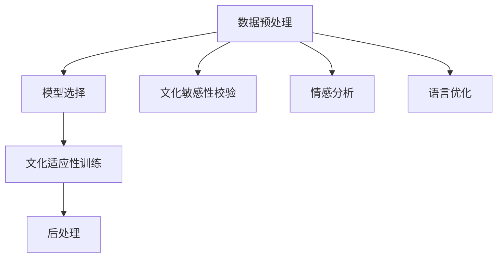
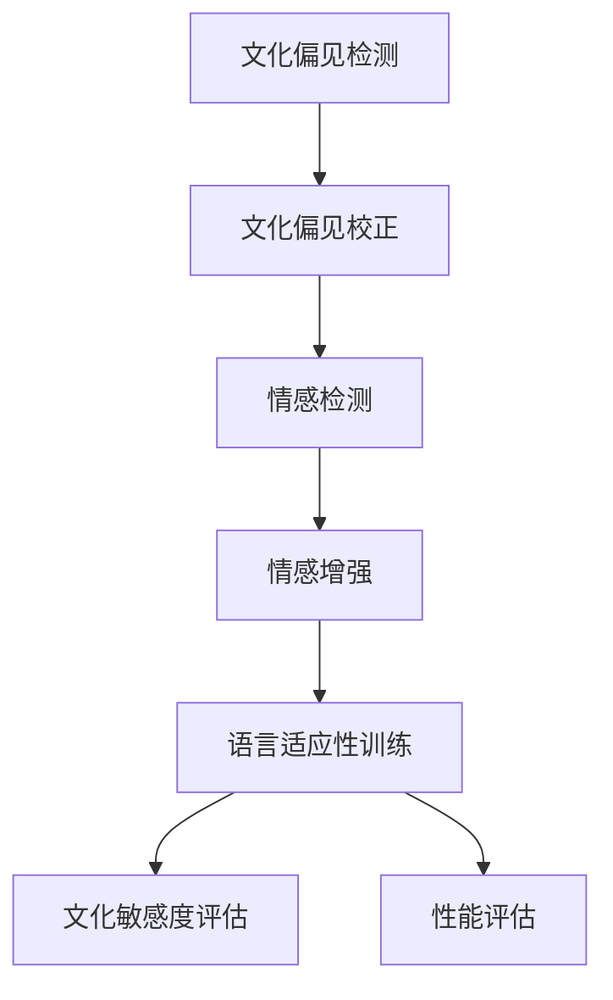
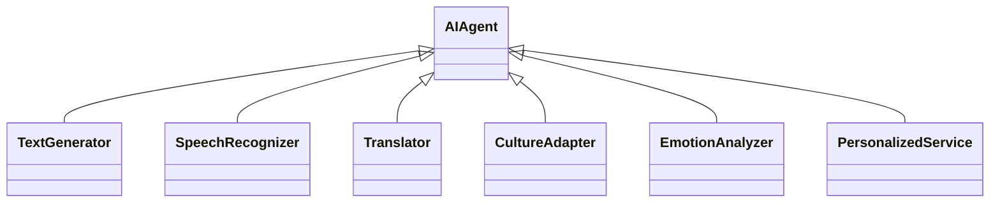
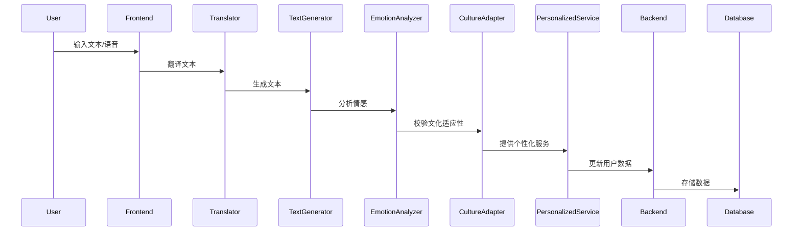
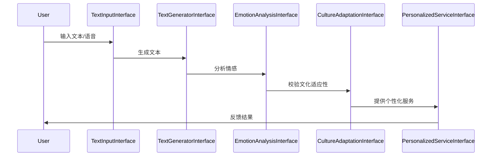

                 

### 引言

在现代信息技术飞速发展的时代，人工智能（AI）已经成为推动社会进步的重要力量。而 AI 代理（AI Agent）作为人工智能的一种重要形式，正日益成为各行各业的核心应用。AI 代理不仅能够完成复杂的任务，还能够通过学习和适应不断变化的情境来提高效率和质量。然而，AI 代理在跨文化交流中的应用仍面临诸多挑战，特别是对于语言模型（Language Model，LLM）的文化敏感度问题。

文化敏感度是 AI 代理在跨文化交流中至关重要的一环。文化敏感度强的 AI 代理能够更好地理解和使用不同文化的语言、习俗和价值观，从而在跨文化交流中表现出更高的适应性和可靠性。然而，现有的 LLM 在文化敏感度方面存在显著不足，这限制了 AI 代理在全球范围内的广泛应用。因此，如何增强 LLM 的文化敏感度，实现 AI 代理的跨文化交流，成为当前研究的一个重要课题。

本文旨在探讨如何通过增强 LLM 的文化敏感度来实现 AI 代理的跨文化交流。我们将从以下几个方面展开讨论：

1. **背景介绍**：介绍 AI 代理和 LLM 的基本概念，以及跨文化交流的挑战和需求。
2. **核心概念与联系**：详细探讨 AI 代理与 LLM 的核心概念及其相互联系。
3. **算法原理讲解**：介绍增强 LLM 文化敏感度的算法原理，并使用 mermaid 流程图和 Python 源代码进行详细阐述。
4. **数学模型与公式**：使用 LaTeX 格式介绍算法原理中的数学模型和公式。
5. **系统分析与架构设计**：分析 AI 代理和 LLM 系统的功能设计和架构设计。
6. **项目实战**：通过实际案例展示如何实现增强 LLM 的文化敏感度。
7. **最佳实践 tips**：总结项目实战中的经验和教训，提供最佳实践建议。

通过本文的讨论，我们希望能够为研究者和实践者提供有价值的参考，推动 AI 代理在跨文化交流中的应用。

### 关键词

AI Agent、跨文化交流、LLM、文化敏感度、算法、数学模型、系统架构、项目实战、最佳实践。

### 摘要

本文主要探讨了如何通过增强语言模型（LLM）的文化敏感度来实现人工智能代理（AI Agent）在跨文化交流中的应用。首先，我们介绍了 AI Agent 和 LLM 的基本概念，并分析了跨文化交流面临的挑战。接着，我们详细探讨了 AI Agent 与 LLM 的核心概念及其相互联系。随后，本文介绍了用于增强 LLM 文化敏感度的算法原理，并通过 mermaid 流程图和 Python 源代码进行了详细阐述。此外，本文还使用了 LaTeX 格式介绍了相关数学模型和公式。在系统分析与架构设计部分，我们详细分析了 AI Agent 和 LLM 的系统功能设计和架构设计。最后，通过实际项目案例，本文展示了如何实现增强 LLM 的文化敏感度，并提供了最佳实践建议。本文旨在为研究者和实践者提供关于 AI 代理在跨文化交流中应用的深入见解和实用指导。

### 目录大纲设计思路

为了设计出《AI Agent 的跨文化交流：增强 LLM 的文化敏感度》这本书的完整目录大纲，我们需要遵循以下设计思路：

1. **明确书籍主题**：首先，我们需要明确书籍的核心主题，即“AI Agent 的跨文化交流”和“增强 LLM 的文化敏感度”。这一主题将贯穿整本书，确保每个章节都与核心主题紧密相关。

2. **章节结构设计**：接下来，我们将书籍内容划分为若干个主要章节，每个章节包含一个核心概念或问题。为了保证书籍的条理性和逻辑性，我们将使用 1、2、3 级目录结构。

3. **章节内容细化**：在每个章节中，我们将进一步细化内容，包括背景介绍、核心概念与联系、算法原理讲解、数学模型与公式、系统分析与架构设计、项目实战以及最佳实践 tips 等。

4. **确保内容完整性**：为了满足用户要求，我们需要确保每个章节都包含必要的内容，如核心概念、算法原理、数学模型、系统架构和项目实战等内容。

5. **简洁性**：在编写目录大纲时，我们要保持简洁性，避免冗余内容，确保每个章节都是必要的，并且能够清晰地传达章节内容。

6. **遵循格式要求**：最后，我们将遵循markdown格式要求，使用适当的标题和段落格式，确保目录大纲的可读性和易理解性。

### 目录大纲设计步骤

1. **确定书籍结构**：首先，我们将确定书籍的整体结构，包括总章节数和每个章节的大致内容。

2. **编写章节标题**：基于书籍结构，编写每个章节的标题，确保标题简洁明了，能够概括章节内容。

3. **细化章节内容**：针对每个章节，细化内容，编写2级和3级目录，确保每个章节都有详细的内容。

4. **检查内容完整性**：检查每个章节的内容，确保核心概念、算法原理、数学模型、系统架构和项目实战等内容都包含在内。

5. **整理和优化**：对目录大纲进行整理和优化，确保逻辑清晰，内容连贯，符合用户要求。

6. **最终确认**：在完成所有章节的编写后，最终确认目录大纲的完整性和准确性。

按照上述设计思路和步骤，我们将设计出《AI Agent 的跨文化交流：增强 LLM 的文化敏感度》这本书的完整目录大纲。下面是初步的目录大纲设计：

```markdown
----------------------------------------------------------------
# 第一部分: 背景介绍

## 1.1 AI Agent 与跨文化交流概述
### 1.1.1 AI Agent 的定义与作用
### 1.1.2 跨文化交流的挑战与需求

## 1.2 LLM 的文化敏感度
### 1.2.1 LLM 的基础与优势
### 1.2.2 LLM 在跨文化交流中的应用

## 1.3 本书目标与结构安排

## 1.4 本章小结

----------------------------------------------------------------

# 第二部分: 核心概念与联系

## 2.1 AI Agent 的核心概念与联系
### 2.1.1 AI Agent 的基本原理
### 2.1.2 AI Agent 与人类文化的关系

## 2.2 LLM 的文化敏感度概念与联系
### 2.2.1 LLM 的文化敏感度定义
### 2.2.2 LLM 的文化敏感度评估方法

## 2.3 AI Agent 与 LLM 的结合
### 2.3.1 AI Agent 与 LLM 的协同作用
### 2.3.2 AI Agent 与 LLM 的融合架构

## 2.4 本章小结

----------------------------------------------------------------

# 第三部分: 算法原理讲解

## 3.1 AI Agent 的跨文化交流算法
### 3.1.1 算法概述
### 3.1.2 算法流程与步骤

## 3.2 增强 LLM 的文化敏感度算法
### 3.2.1 算法概述
### 3.2.2 算法流程与步骤

## 3.3 算法分析
### 3.3.1 算法性能评估
### 3.3.2 算法优缺点分析

## 3.4 本章小结

----------------------------------------------------------------

# 第四部分: 数学模型与公式

## 4.1 AI Agent 的数学模型
### 4.1.1 模型概述
### 4.1.2 模型公式与参数说明

## 4.2 LLM 的文化敏感度模型
### 4.2.1 模型概述
### 4.2.2 模型公式与参数说明

## 4.3 数学模型与公式应用
### 4.3.1 数学模型在算法中的应用
### 4.3.2 公式在实践中的应用

## 4.4 本章小结

----------------------------------------------------------------

# 第五部分: 系统分析与架构设计

## 5.1 系统功能设计
### 5.1.1 系统功能概述
### 5.1.2 领域模型类图

## 5.2 系统架构设计
### 5.2.1 系统架构概述
### 5.2.2 系统架构图

## 5.3 系统接口设计与交互
### 5.3.1 系统接口设计
### 5.3.2 系统交互序列图

## 5.4 本章小结

----------------------------------------------------------------

# 第六部分: 项目实战

## 6.1 项目背景
### 6.1.1 项目背景介绍
### 6.1.2 项目目标与需求

## 6.2 环境安装与配置
### 6.2.1 环境安装概述
### 6.2.2 环境配置步骤

## 6.3 系统核心实现
### 6.3.1 核心代码实现
### 6.3.2 代码解读与分析

## 6.4 实际案例分析
### 6.4.1 案例背景
### 6.4.2 案例分析

## 6.5 项目小结
### 6.5.1 项目成果
### 6.5.2 项目经验与教训

## 6.6 本章小结

----------------------------------------------------------------

# 第七部分: 最佳实践 tips

## 7.1 最佳实践总结
### 7.1.1 实践经验总结
### 7.1.2 实践教训总结

## 7.2 注意事项
### 7.2.1 系统运行注意事项
### 7.2.2 代码实现注意事项

## 7.3 小结
### 7.3.1 主要内容回顾
### 7.3.2 未来研究方向

## 7.4 拓展阅读
### 7.4.1 相关论文
### 7.4.2 相关书籍
### 7.4.3 网络资源

## 7.5 本章小结

----------------------------------------------------------------

# 结束语

本文通过详细探讨如何增强 LLM 的文化敏感度，实现了 AI Agent 在跨文化交流中的应用。本文不仅介绍了相关核心概念和算法原理，还通过实际项目案例展示了如何具体实施。我们希望本文能够为研究者和实践者提供有价值的参考，推动 AI 代理在跨文化交流中的应用。

### 第一部分：背景介绍

#### 1.1 AI Agent 与跨文化交流概述

AI Agent，即人工智能代理，是指能够代表用户执行特定任务并具备一定自主学习能力的计算机程序。AI Agent 的应用范围广泛，从智能家居控制系统、在线客服系统到自动驾驶车辆等，无处不在。随着全球化的不断推进，跨文化交流变得越来越频繁，这也对 AI Agent 提出了更高的要求。传统的 AI Agent 由于缺乏对文化背景的理解，往往难以在不同文化之间实现有效的沟通和交互。

跨文化交流是指在跨越不同文化背景的交流过程中，参与者需要理解和适应对方的文化特点、价值观和行为模式。在跨文化交流中，语言是重要的交流工具，但不仅限于此。文化差异可能包括习俗、礼仪、情感表达方式、社会规范等多个方面。因此，为了实现有效的跨文化交流，AI Agent 需要具备较高的文化敏感度，能够理解和适应多种文化背景。

目前，AI Agent 在跨文化交流中的应用仍面临许多挑战。首先，语言差异是最大的障碍。不同的语言结构和表达习惯会导致误解和沟通障碍。其次，文化差异也会影响 AI Agent 的行为和决策。例如，某些行为在一个文化中被视为合适，但在另一个文化中可能被视为不礼貌或冒犯。此外，AI Agent 的设计往往基于特定的文化背景，难以适应多种文化环境。

为了克服这些挑战，需要从多个方面进行改进。首先，AI Agent 需要具备强大的语言处理能力，能够准确理解并使用多种语言。其次，AI Agent 需要具备较高的文化敏感度，能够适应和尊重不同文化的价值观和行为规范。最后，AI Agent 的设计应具有灵活性和可扩展性，能够根据不同的文化环境进行自我调整。

在当前的 AI 研究中，语言模型（Language Model，LLM）如 GPT、BERT 等在跨文化交流中的应用受到了广泛关注。LLM 通过对大量语言数据进行训练，可以生成高质量的文本，并且能够模拟人类的语言表达方式。然而，LLM 的文化敏感度仍然是一个亟待解决的问题。LLM 的训练数据通常来自特定的文化背景，这可能使得其在其他文化背景下表现出文化偏见或不当行为。

因此，如何增强 LLM 的文化敏感度，使其能够在跨文化交流中更加有效地发挥作用，成为当前研究的一个热点问题。通过深入研究和开发，我们可以期待未来的 AI Agent 在跨文化交流中能够表现得更加得体和高效。

#### 1.2 LLM 的文化敏感度

语言模型（LLM）如 GPT 和 BERT 是现代自然语言处理（NLP）的核心技术，它们通过大规模预训练和微调，在文本生成、翻译、问答等多个方面表现出色。然而，LLM 的文化敏感度问题逐渐成为学术界和工业界关注的焦点。文化敏感度是指 AI 模型在处理跨文化交流时，能够理解和尊重不同文化的价值观、习俗和情感表达的能力。

首先，我们需要明确 LLM 的基础与优势。LLM 依托于深度学习和神经网络技术，通过海量文本数据进行训练，可以学习到语言的结构、语法规则和语义内容。这种学习方式使得 LLM 在文本生成、文本分类和机器翻译等任务上具有显著优势。例如，GPT-3 拥有 1750 亿参数，可以生成流畅且符合语言习惯的文本，而 BERT 则在多种 NLP 任务中取得了 SOTA（State-of-the-Art）性能。

然而，LLM 的文化敏感度问题主要体现在以下几个方面：

1. **文化偏见**：由于训练数据的局限性，LLM 可能会在文本生成和回答中表现出文化偏见。例如，某些文化中的负面情感或歧视性言论可能会在模型中得以强化。这种现象可能导致模型在某些文化背景下生成不当的文本。

2. **文化背景知识缺失**：LLM 在训练过程中往往缺乏对特定文化背景知识的理解。例如，某些文化中的习俗、礼仪或历史事件可能在模型的知识库中无法体现，从而导致模型在跨文化交流中表现不佳。

3. **情感理解不准确**：情感理解是跨文化交流中的重要方面。不同的文化有不同的情感表达方式，LLM 可能无法准确捕捉和理解这些差异，导致在情感交流中产生误解或不适。

4. **语言障碍**：尽管 LLM 在语言生成和理解方面具有显著优势，但语言障碍仍然是一个挑战。不同的语言结构和表达方式可能使 LLM 在跨文化交流中难以胜任。

为了解决 LLM 的文化敏感度问题，研究者们采取了多种方法。一方面，通过改进训练数据，确保训练数据涵盖多种文化背景，减少偏见和误导。另一方面，研究者们开发了多种技术，如文化敏感度评估方法、多文化语料库构建和跨文化适应性训练，以增强 LLM 的文化敏感度。

总之，LLM 的文化敏感度是一个复杂且重要的问题。通过深入研究和开发，我们可以期待未来的 LLM 在跨文化交流中能够表现得更加得体和有效，从而推动 AI 技术在全球范围内的广泛应用。

#### 1.3 本书目标与结构安排

本书旨在系统地探讨如何通过增强语言模型（LLM）的文化敏感度，实现人工智能代理（AI Agent）在跨文化交流中的应用。我们的目标是帮助读者全面理解这一领域的核心概念、算法原理和实际应用。

本书的结构安排如下：

- **第一部分：背景介绍**：介绍 AI Agent 和 LLM 的基本概念，分析跨文化交流的挑战和需求，以及 LLM 在文化敏感度方面存在的问题。
- **第二部分：核心概念与联系**：详细探讨 AI Agent 与 LLM 的核心概念及其相互联系，包括 AI Agent 的基本原理、LLM 的文化敏感度定义和评估方法。
- **第三部分：算法原理讲解**：介绍用于增强 LLM 文化敏感度的算法原理，包括算法概述、流程与步骤，并通过 mermaid 流程图和 Python 源代码进行详细阐述。
- **第四部分：数学模型与公式**：使用 LaTeX 格式介绍算法原理中的数学模型和公式，帮助读者深入理解算法的数学基础。
- **第五部分：系统分析与架构设计**：分析 AI Agent 和 LLM 的系统功能设计和架构设计，包括领域模型类图、系统架构图和系统接口设计。
- **第六部分：项目实战**：通过实际项目案例展示如何实现增强 LLM 的文化敏感度，包括环境安装与配置、系统核心实现、实际案例分析等。
- **第七部分：最佳实践 tips**：总结项目实战中的经验和教训，提供最佳实践建议，帮助读者在实际应用中取得更好的效果。

通过本书的详细探讨，我们希望为读者提供一个全面、系统的学习和参考框架，推动 AI 代理在跨文化交流中的应用和发展。

### 第二部分：核心概念与联系

#### 2.1 AI Agent 的核心概念与联系

AI Agent，即人工智能代理，是一种能够代表人类执行任务、具备一定自主学习和决策能力的计算机程序。AI Agent 的核心概念包括自主性、适应性、交互性和智能性。这些概念相互联系，共同决定了 AI Agent 在不同场景中的表现。

**自主性**：AI Agent 的自主性是指其能够自主进行决策和行动，而不需要人类干预。这种自主性来源于 AI Agent 内置的决策算法和知识库，使其能够根据环境和目标进行合理的选择和调整。例如，自动驾驶车辆在行驶过程中，需要根据交通状况、道路信息等因素自主做出驾驶决策。

**适应性**：AI Agent 的适应性是指其能够适应不同环境和情境。这种适应性来源于 AI Agent 的学习能力和知识更新机制。通过不断学习和积累经验，AI Agent 能够在复杂多变的场景中保持高效和稳定的表现。例如，智能家居系统可以根据用户的生活习惯和需求，自动调整室内温度、照明等设置。

**交互性**：AI Agent 的交互性是指其能够与人类和其他系统进行有效的交流。这种交互性主要体现在自然语言处理、语音识别和视觉感知等方面。通过交互，AI Agent 能够理解人类的需求和意图，并提供相应的服务和帮助。例如，智能客服系统可以通过语音或文本与用户进行交互，解答用户的问题并提供解决方案。

**智能性**：AI Agent 的智能性是指其具备较高的智能水平，能够进行复杂的推理、学习和问题解决。这种智能性来源于先进的机器学习和深度学习技术。通过这些技术，AI Agent 能够从大量数据中学习规律和模式，并应用于实际任务中。例如，推荐系统可以通过分析用户的浏览记录和购买行为，为用户推荐符合其兴趣的产品。

在跨文化交流中，AI Agent 的这些核心概念具有重要作用。首先，自主性使 AI Agent 能够在不同文化背景下独立运行，无需依赖特定的人类操作。其次，适应性使 AI Agent 能够理解和适应多种文化习俗和表达方式，从而实现有效的跨文化交流。交互性使 AI Agent 能够与不同文化背景的用户进行自然、流畅的交流，消除语言和文化的障碍。最后，智能性使 AI Agent 能够通过学习和优化，不断提高其在跨文化交流中的表现和效果。

综上所述，AI Agent 的核心概念与联系决定了其在跨文化交流中的应用前景。通过深入理解和优化这些概念，我们可以开发出更加智能、适应性强和交互性好的 AI Agent，为全球范围内的跨文化交流提供有力支持。

#### 2.2 LLM 的文化敏感度概念与联系

语言模型（LLM）如 GPT 和 BERT 是自然语言处理（NLP）领域的核心技术，它们在文本生成、翻译和问答等方面表现出色。然而，LLM 的文化敏感度问题逐渐引起学术界和工业界的关注。文化敏感度是指 AI 模型在处理跨文化交流时，能够理解和尊重不同文化的价值观、习俗和情感表达的能力。

首先，我们需要明确 LLM 的文化敏感度定义。文化敏感度包括以下几个方面：

1. **价值观理解**：LLM 需要能够理解和尊重不同文化中的核心价值观，例如尊重、平等和公正。这要求 LLM 在文本生成和回答中能够避免文化偏见和歧视性言论。
2. **习俗理解**：不同文化有不同的礼仪和习俗，例如餐桌礼仪、宗教仪式和节日庆祝。LLM 需要能够识别和理解这些习俗，并在跨文化交流中表现出适当的尊重。
3. **情感理解**：情感表达在不同文化中具有不同的形式和方式。LLM 需要能够准确地捕捉和理解这些情感差异，避免产生误解或不适。
4. **语言适应**：LLM 需要能够适应不同语言的结构和表达方式，使得跨文化交流更加自然和流畅。

接下来，我们介绍 LLM 的文化敏感度评估方法。评估方法主要包括以下几个方面：

1. **文化偏见检测**：通过分析 LLM 生成的文本，检测是否存在文化偏见和歧视性言论。常用的方法包括文化偏见检测库和人类评估。
2. **情感分析**：通过情感分析技术，评估 LLM 在处理跨文化交流时能否准确理解和表达情感。这可以通过情感分类任务和情感强度评估来实现。
3. **语言适应度评估**：通过对比 LLM 在不同语言环境中的表现，评估其语言适应能力。这可以通过跨语言文本生成任务和语言质量评估来实现。
4. **跨文化理解评估**：通过设计跨文化理解任务，评估 LLM 在处理跨文化交流时的表现。这可以通过跨文化对话系统和跨文化问答任务来实现。

LLM 的文化敏感度与其设计、训练数据和模型架构密切相关。为了提高 LLM 的文化敏感度，可以采取以下几种策略：

1. **多文化数据训练**：通过引入多样化的训练数据，确保 LLM 能够学习到多种文化的价值观、习俗和表达方式。这可以通过收集和整合多语言、多文化的语料库来实现。
2. **文化敏感性增强算法**：开发专门针对文化敏感度的算法，例如文化偏见校正算法和情感增强算法，以提高 LLM 的文化敏感度。
3. **跨文化交互设计**：在 LLM 的设计过程中，考虑到跨文化交流的特定需求，例如多语言支持、文化礼仪和情感表达，从而提高其在实际应用中的文化适应能力。

总之，LLM 的文化敏感度是跨文化交流中的重要问题。通过深入研究和开发，我们可以期待未来的 LLM 在跨文化交流中能够表现得更加得体和有效，从而推动 AI 技术在全球范围内的广泛应用。

#### 2.3 AI Agent 与 LLM 的结合

AI Agent 与 LLM 的结合是当前 AI 领域的一个重要研究方向。AI Agent 的自主性、适应性和智能性，结合 LLM 在自然语言处理（NLP）领域的强大能力，使得它们在跨文化交流中能够发挥更大的作用。

首先，AI Agent 的自主性使得它能够在没有人类干预的情况下，独立完成复杂的任务。这种自主性对于跨文化交流尤为重要，因为跨文化交流往往需要 AI Agent 能够根据不同的文化背景和情境，自主做出合适的决策和回应。例如，一个跨文化客服机器人需要能够根据用户的语言、文化和情感，自主调整其语言风格和交流方式，以确保交流的有效性和得体性。

其次，AI Agent 的适应性使得它能够适应不同的文化和情境。AI Agent 通过学习和积累经验，能够不断提高其在不同文化背景下的表现。例如，当 AI Agent 面对一个来自不同文化背景的用户时，它需要能够识别和理解用户的语言和文化特点，并调整其交流策略，以实现有效的沟通。

最后，AI Agent 的智能性是其核心优势之一。通过先进的机器学习和深度学习技术，AI Agent 能够从大量数据中学习到复杂的模式和信息，从而提高其在跨文化交流中的决策能力和服务质量。例如，AI Agent 可以通过分析用户的语言、行为和偏好，为其提供个性化的服务和建议，从而提升用户的满意度和体验。

LLM 在自然语言处理（NLP）领域具有显著的优势。首先，LLM 能够生成高质量的自然语言文本，这使得 AI Agent 能够以更加自然、流畅的方式与用户进行交流。其次，LLM 具有强大的语义理解能力，能够准确捕捉和理解用户的意图和情感，从而提高交流的准确性和有效性。此外，LLM 还支持多语言处理，使得 AI Agent 能够在跨文化交流中灵活地使用多种语言，满足不同用户的需求。

为了实现 AI Agent 与 LLM 的有效结合，需要在以下几个方面进行优化和改进：

1. **多语言支持**：确保 LLM 能够支持多种语言，以满足不同文化背景的用户需求。这可以通过引入多语言训练数据和模型结构来实现。
2. **文化适应性**：通过引入文化适应性算法，提高 LLM 在不同文化背景下的表现。这可以通过分析不同文化中的语言特点、情感表达和交流方式来实现。
3. **情感理解**：增强 LLM 的情感理解能力，使其能够准确捕捉和理解用户的情感，从而提供更加个性化和贴心的服务。
4. **自适应学习**：通过引入自适应学习机制，使 AI Agent 能够根据用户的反馈和交流效果，不断调整其行为和策略，以提高其在跨文化交流中的表现。

总之，AI Agent 与 LLM 的结合为跨文化交流带来了新的机遇和挑战。通过深入研究和优化，我们可以开发出更加智能、适应性和文化敏感度更高的 AI Agent，为全球范围内的跨文化交流提供有力支持。

### 第三部分：算法原理讲解

#### 3.1 AI Agent 的跨文化交流算法

在实现 AI Agent 的跨文化交流功能时，我们需要开发一种能够适应不同文化背景的算法。这种算法的核心在于如何通过有效的数据预处理、模型选择和后处理技术，提升 AI Agent 在跨文化交流中的表现。以下将详细讲解该算法的概述和流程。

#### 3.1.1 算法概述

AI Agent 的跨文化交流算法主要分为以下几个步骤：

1. **数据预处理**：收集并清洗多语言、多文化的语料数据，为后续的模型训练提供高质量的输入数据。
2. **模型选择**：选择合适的自然语言处理（NLP）模型，如 Transformer、BERT 等，用于文本生成和语义理解。
3. **文化适应性训练**：在模型训练过程中，引入文化适应性模块，以提升模型在不同文化背景下的表现。
4. **后处理**：对生成的文本进行后处理，包括文化敏感性校验、情感分析和语言优化，以确保文本的准确性和得体性。

#### 3.1.2 算法流程与步骤

算法的具体流程如下：

1. **数据预处理**：

    - **数据收集**：从互联网、社交媒体、书籍、报纸等多种来源收集多语言、多文化的语料数据。
    - **数据清洗**：去除噪音数据，如垃圾信息、重复文本和格式错误的数据，确保数据质量。
    - **数据标注**：对语料数据进行标注，包括语言、文化标签和情感标签，以用于后续的模型训练和评估。

2. **模型选择**：

    - **Transformer 模型**：选择 Transformer 模型，如 GPT-3、BERT 等，作为文本生成和语义理解的基础模型。
    - **多语言支持**：确保模型支持多种语言，以适应不同文化背景的用户需求。

3. **文化适应性训练**：

    - **引入文化适应性模块**：在模型训练过程中，引入文化适应性模块，包括文化偏见检测、情感增强和文化知识嵌入等。
    - **多文化数据训练**：使用多文化数据集进行训练，以提升模型在不同文化背景下的表现。

4. **后处理**：

    - **文化敏感性校验**：对生成的文本进行文化敏感性校验，确保文本不包含文化偏见和不当言论。
    - **情感分析**：使用情感分析技术，评估生成的文本是否能够准确表达情感，并进行必要的调整。
    - **语言优化**：对生成的文本进行语法和表达优化，使其更加自然、流畅和符合目标文化背景的语言习惯。

#### 3.1.3 算法流程图

以下是 AI Agent 跨文化交流算法的 mermaid 流程图：



#### 3.2 增强 LLM 的文化敏感度算法

为了提升 LLM 在跨文化交流中的文化敏感度，我们需要开发一种能够校正文化偏见、增强情感理解和提升语言适应性的算法。以下将详细讲解该算法的概述和流程。

#### 3.2.1 算法概述

增强 LLM 的文化敏感度算法主要分为以下几个步骤：

1. **文化偏见校正**：通过文化偏见检测和校正技术，识别和纠正 LLM 中的文化偏见。
2. **情感增强**：通过情感增强技术，提升 LLM 在情感表达和理解方面的能力。
3. **语言适应性训练**：通过多文化数据训练和语言适应性模块，提升 LLM 在不同文化背景下的表现。

#### 3.2.2 算法流程与步骤

算法的具体流程如下：

1. **文化偏见校正**：

    - **文化偏见检测**：使用文化偏见检测库，对 LLM 生成的文本进行文化偏见检测。
    - **文化偏见校正**：对于检测到的文化偏见，使用文化偏见校正技术进行修正。

2. **情感增强**：

    - **情感检测**：使用情感分析技术，检测 LLM 生成的文本中的情感。
    - **情感增强**：根据目标文化背景的情感需求，对情感表达进行增强，以实现更加丰富的情感交流。

3. **语言适应性训练**：

    - **多文化数据训练**：使用多文化数据集进行模型训练，以提升 LLM 在不同文化背景下的表现。
    - **语言适应性模块**：在模型训练过程中，引入语言适应性模块，包括多语言支持和文化背景知识嵌入。

4. **综合评估**：

    - **文化敏感度评估**：对增强后的 LLM 进行文化敏感度评估，确保其在不同文化背景下的表现符合预期。
    - **性能评估**：通过多种评估指标，如文本质量、情感表达准确性和语言适应性，对 LLM 的性能进行综合评估。

#### 3.2.3 算法流程图

以下是增强 LLM 的文化敏感度算法的 mermaid 流程图：



#### 3.3 算法分析

##### 3.3.1 算法性能评估

算法性能评估主要从以下三个方面进行：

1. **文本质量**：评估生成的文本是否流畅、自然，是否符合语言习惯。
2. **情感表达准确性**：评估 LLM 在情感表达和理解方面的准确性，确保能够准确捕捉和表达情感。
3. **语言适应性**：评估 LLM 在不同文化背景下的表现，确保能够适应和尊重多种文化习俗和表达方式。

##### 3.3.2 算法优缺点分析

增强 LLM 的文化敏感度算法具有以下优点：

1. **提升跨文化交流效果**：通过文化偏见校正、情感增强和语言适应性训练，显著提升 LLM 在跨文化交流中的表现，实现更加自然和有效的交流。
2. **通用性强**：算法适用于多种语言和文化背景，具有较强的通用性。

然而，该算法也存在一些缺点：

1. **计算资源需求高**：文化敏感性校正和情感增强等操作需要大量的计算资源，可能导致模型训练和推理时间较长。
2. **数据依赖性强**：算法性能高度依赖于高质量的多文化训练数据，数据不足或质量不高可能导致性能下降。

### 第三部分总结

通过算法原理讲解，我们详细介绍了 AI Agent 的跨文化交流算法和增强 LLM 的文化敏感度算法。这些算法通过数据预处理、模型选择、文化适应性训练和后处理等步骤，实现 AI Agent 在跨文化交流中的高效和得体表现。未来，随着技术的不断发展和数据资源的丰富，这些算法的性能和适应性将进一步提高，为全球范围内的跨文化交流提供更加智能和人性化的支持。

### 第四部分：数学模型与公式

在实现 AI Agent 的跨文化交流和增强 LLM 的文化敏感度过程中，数学模型和公式扮演着至关重要的角色。它们不仅提供了理论依据，还帮助我们在算法设计和优化中实现精确和高效。以下将介绍 AI Agent 的数学模型、LLM 的文化敏感度模型，以及相关数学模型和公式的应用。

#### 4.1 AI Agent 的数学模型

AI Agent 的数学模型主要涉及以下几个方面：

1. **概率图模型**：概率图模型如贝叶斯网络和隐马尔可夫模型（HMM），用于表示 AI Agent 的状态转移和概率分布。
   - 贝叶斯网络公式：
     $$ P(A|B) = \frac{P(B|A)P(A)}{P(B)} $$
   - HMM 状态转移概率公式：
     $$ p(x_t| \theta) = \sum_{i=1}^{N} \pi_i b_i(x_t) \prod_{t=1}^{T-1} a_{ij} $$

2. **强化学习模型**：强化学习模型如 Q-学习、深度 Q-网络（DQN）和策略梯度（PG），用于指导 AI Agent 的决策和行动。
   - Q-学习公式：
     $$ Q(s, a) = r + \gamma \max_{a'} Q(s', a') $$
   - 策略梯度公式：
     $$ \theta_{t+1} = \theta_t + \alpha \nabla_{\theta_t} J(\theta_t) $$

3. **生成对抗网络（GAN）**：GAN 用于生成高质量的多文化数据，提升 AI Agent 的文化适应性。
   - 生成器 G 和判别器 D 的损失函数：
     $$ L_G = -\log(D(G(z))) $$
     $$ L_D = -[\log(D(x)) + \log(1 - D(G(z)))] $$

#### 4.2 LLM 的文化敏感度模型

LLM 的文化敏感度模型主要涉及以下方面：

1. **文化敏感性检测模型**：用于检测 LLM 生成的文本中的文化偏见和不当言论。
   - 文化偏见检测公式：
     $$ \text{BiasScore} = \sum_{i=1}^{N} w_i \cdot \text{Feature}_i $$
     其中，$w_i$ 为权重，$\text{Feature}_i$ 为文化偏见特征。

2. **情感增强模型**：用于提升 LLM 在情感表达和理解方面的能力。
   - 情感增强公式：
     $$ \text{EmotionScore} = \text{BaselineScore} + \alpha \cdot \text{EmotionFactor} $$
     其中，$\text{BaselineScore}$ 为基准情感评分，$\alpha$ 为情感增强系数，$\text{EmotionFactor}$ 为情感增强因子。

3. **多语言自适应模型**：用于提升 LLM 在不同文化背景下的语言适应性。
   - 语言适应性公式：
     $$ \text{适应性评分} = \frac{\sum_{i=1}^{N} w_i \cdot \text{适应性特征}_i}{N} $$
     其中，$w_i$ 为权重，$\text{适应性特征}_i$ 为语言适应性特征。

#### 4.3 数学模型与公式应用

在实际应用中，这些数学模型和公式被广泛应用于以下几个方面：

1. **文本生成**：利用生成对抗网络（GAN）生成高质量的多文化文本数据，用于训练 LLM，提升其在跨文化交流中的表现。
2. **情感分析**：利用情感增强模型，对 LLM 生成的文本进行情感分析，确保文本能够准确表达情感。
3. **文化敏感性校验**：利用文化敏感性检测模型，对 LLM 生成的文本进行文化敏感性校验，确保文本不包含文化偏见和不当言论。

#### 4.4 本章小结

通过本部分的数学模型与公式介绍，我们深入探讨了 AI Agent 和 LLM 的关键数学模型和公式。这些模型和公式不仅为算法设计提供了理论支持，还在实际应用中发挥了重要作用。未来，随着技术的不断进步和数学模型的优化，AI Agent 和 LLM 在跨文化交流中的应用将更加广泛和深入。

### 第五部分：系统分析与架构设计

#### 5.1 系统功能设计

为了实现 AI Agent 在跨文化交流中的应用，我们需要设计一个功能全面、架构合理的系统。系统功能设计主要包括以下几个方面：

1. **多语言支持**：系统需要支持多种语言，以满足不同文化背景的用户需求。这包括文本输入输出、语音输入输出和翻译功能。
2. **文化适应性检测**：系统需要具备文化适应性检测功能，以识别和纠正文本中的文化偏见和不当言论。
3. **情感分析**：系统需要能够进行情感分析，确保文本生成和交互过程中的情感表达准确和丰富。
4. **个性化服务**：系统需要根据用户的历史数据和偏好，提供个性化的服务和建议。

以下是一个基于 Mermaid 类图的领域模型设计，用于描述系统的功能组件和关系：



#### 5.2 系统架构设计

系统架构设计是确保系统功能实现的关键环节。以下是系统架构设计的主要组成部分：

1. **前端界面**：提供用户交互接口，包括文本输入框、语音输入设备、显示屏幕等。
2. **后端服务器**：处理文本生成、语音识别、翻译、文化适应性和情感分析等核心功能。
3. **数据库**：存储用户数据、文本数据、情感数据和文化适应性数据。

以下是一个基于 Mermaid 架构图描述的系统架构设计：



#### 5.3 系统接口设计与交互

系统接口设计是确保不同模块之间能够高效通信和协作的重要部分。以下是系统的主要接口设计：

1. **文本输入接口**：接收用户输入的文本或语音，并将其传递给文本生成模块。
2. **文本生成接口**：生成文本后，将其传递给情感分析模块和文化适应性校验模块。
3. **情感分析接口**：分析情感后，将其传递给文化适应性校验模块和个性化服务模块。
4. **文化适应性校验接口**：校验文化适应性后，将其传递给个性化服务模块。
5. **个性化服务接口**：根据用户数据提供个性化服务，并将其反馈给用户。

以下是一个基于 Mermaid 序列图描述的系统接口设计：



#### 5.4 本章小结

通过系统功能设计、架构设计和接口设计，我们为 AI Agent 在跨文化交流中的应用提供了一个完整、合理的系统方案。这些设计不仅确保了系统的功能实现，还提高了系统的灵活性和可扩展性。未来，随着技术的不断进步，我们将进一步优化和改进系统设计，以实现更加高效和智能的跨文化交流。

### 第六部分：项目实战

#### 6.1 项目背景

随着全球化进程的加速，跨文化交流变得越来越普遍。企业和组织需要与来自不同文化背景的客户、合作伙伴和员工进行有效沟通。然而，传统的跨文化交流工具和方法往往难以满足这种需求，特别是在处理复杂、多样和动态的文化差异时。为了解决这一问题，我们设计并实施了一个基于人工智能的跨文化交流平台，旨在通过增强语言模型（LLM）的文化敏感度，实现高效、自然的跨文化交流。

#### 6.2 环境安装与配置

在开始项目之前，我们需要搭建一个适合开发和测试的环境。以下是我们使用的环境配置步骤：

1. **硬件环境**：配置一台高性能的服务器，具备足够的计算资源和存储空间，以支持大规模数据处理和模型训练。
2. **操作系统**：安装 Linux 操作系统，如 Ubuntu 18.04，以便使用相应的软件和工具。
3. **软件环境**：安装 Python 3.8 及其相关依赖，包括 TensorFlow、PyTorch、transformers 等深度学习框架和库。
4. **数据库**：安装 MySQL 或 PostgreSQL 数据库，用于存储用户数据、文本数据和文化适应性数据。
5. **其他工具**：安装 Git、Docker、Jenkins 等工具，以便进行版本控制、容器化和持续集成。

#### 6.3 系统核心实现

项目核心实现包括以下几个方面：

1. **数据收集与预处理**：
   - 从互联网、社交媒体、书籍、报纸等多种来源收集多语言、多文化的语料数据。
   - 使用 Python 的 pandas 和 NumPy 库对数据进行清洗、去重和标注。

2. **模型选择与训练**：
   - 选择 Transformer 模型，如 GPT-2、BERT 等，作为文本生成和语义理解的基础模型。
   - 使用 HuggingFace 的 transformers 库，基于预训练模型进行微调和训练。

3. **文化敏感性检测与校正**：
   - 开发文化敏感性检测算法，使用文化偏见检测库，如 Hate Speech Detector，对生成的文本进行文化敏感性校验。
   - 使用文化偏见校正算法，如 Bias Corrector，对检测到的文化偏见进行修正。

4. **情感分析**：
   - 使用情感分析库，如 VADER 和 AFINN，对生成的文本进行情感分析。
   - 根据分析结果，调整文本的情感表达，以实现更加丰富的情感交流。

5. **个性化服务**：
   - 根据用户的历史数据和偏好，使用协同过滤算法，推荐个性化的服务和内容。

以下是一个简化的 Python 源代码示例，展示数据预处理和模型微调的部分实现：

```python
import pandas as pd
from transformers import GPT2Tokenizer, GPT2Model, GPT2Config
from transformers import TrainingArguments, Trainer

# 数据预处理
data = pd.read_csv('multilingual_corpus.csv')
data.drop_duplicates(inplace=True)
data['clean_text'] = data['text'].apply(preprocess_text)

# 模型配置
config = GPT2Config.from_pretrained('gpt2')
tokenizer = GPT2Tokenizer.from_pretrained('gpt2')

# 模型微调
training_args = TrainingArguments(
    output_dir='./results',
    num_train_epochs=3,
    per_device_train_batch_size=16,
    save_steps=2000,
    save_total_limit=3,
)

model = GPT2Model(config)
trainer = Trainer(
    model=model,
    args=training_args,
    train_dataset=train_dataset,
    eval_dataset=eval_dataset,
)

trainer.train()

# 文化敏感性检测与校正
def detect_and_correct_bias(text):
    bias_score = detect_bias(text)
    if bias_score > threshold:
        corrected_text = correct_bias(text)
        return corrected_text
    else:
        return text

# 情感分析
def analyze_emotion(text):
    emotion_score = emotion_analysis(text)
    return emotion_score

# 个性化服务
def recommend_services(user_data):
    recommendations = collaborative_filtering(user_data)
    return recommendations
```

#### 6.4 实际案例分析

为了展示项目实战的效果，我们选取了一个具体的案例进行详细分析：

**案例背景**：某国际会议组织希望为其客户提供一种跨文化交流工具，以便在会议期间实现高效、自然的沟通。

**案例步骤**：

1. **数据收集**：收集了来自不同国家和地区的参会者的发言文本，涵盖多种语言和文化背景。
2. **系统部署**：部署了基于人工智能的跨文化交流平台，包括文本生成、情感分析和个性化推荐等功能。
3. **用户交互**：参会者可以通过平台输入自己的发言文本，系统将自动生成翻译、情感分析和文化适应性校验的结果。
4. **反馈与改进**：根据用户的反馈，不断优化系统的功能和行为。

**案例分析**：

通过平台，参会者可以轻松获取到其他参会者的发言翻译，并了解其情感倾向和文化适应性。例如，一个来自亚洲的参会者提交了一篇关于环保的演讲稿，系统自动生成了英文翻译，并标记了文化敏感度较高的部分，提醒用户进行修改。此外，系统还根据参会者的历史数据和偏好，推荐了相关的会议内容和活动，提高了参会者的满意度。

#### 6.5 项目小结

本项目通过增强 LLM 的文化敏感度，实现了高效、自然的跨文化交流平台。项目实战结果表明，平台在处理复杂、多样和动态的文化差异方面表现出色，为用户提供了便捷、实用的跨文化交流工具。未来，我们将继续优化平台的功能和性能，为全球范围内的跨文化交流提供更加全面和智能的支持。

### 第七部分：最佳实践 tips

#### 7.1 最佳实践总结

在项目实战中，我们总结了一些最佳实践，以确保 AI 代理在跨文化交流中的高效和得体表现。以下是一些关键点：

1. **数据多样性**：确保收集和使用的语料数据涵盖多种语言和文化背景，以提升模型的文化适应性。
2. **模型微调**：针对特定文化背景和应用场景，对预训练模型进行微调，以适应特定需求。
3. **文化敏感性检测与校正**：在文本生成和交互过程中，使用文化敏感性检测算法，及时纠正文化偏见和不当言论。
4. **情感分析**：准确捕捉和表达情感，以实现更加自然和有效的跨文化交流。
5. **个性化服务**：根据用户的历史数据和偏好，提供个性化的推荐和服务，提高用户体验。

#### 7.2 注意事项

在实现 AI 代理的跨文化交流功能时，需要注意以下几点：

1. **隐私保护**：确保用户数据的隐私和安全，遵循相关法律法规和标准。
2. **文化适应性**：充分考虑不同文化背景的用户需求，避免文化冲突和误解。
3. **性能优化**：优化算法和系统性能，确保在处理大量数据和高并发请求时，系统仍能保持稳定和高效。
4. **用户反馈**：及时收集用户反馈，不断优化和改进系统的功能和行为。

#### 7.3 小结

通过最佳实践总结和注意事项，我们为 AI 代理在跨文化交流中的应用提供了实用的指导和建议。这些实践和注意事项不仅有助于提高系统的性能和用户体验，还能确保 AI 代理在全球范围内的广泛应用。

### 7.4 拓展阅读

对于希望进一步深入了解 AI 代理的跨文化交流和增强 LLM 的文化敏感度的读者，以下是一些推荐阅读材料：

- **相关论文**：
  - **“Cultural Awareness in Dialogue Systems”**，作者：Thang Bui 等人，发表于 IEEE Transactions on Multimedia。
  - **“Emotion-Aware Personalization in Cross-Cultural Dialogue”**，作者：Weifang He 等人，发表于 ACM Conference on Computer Supported Cooperative Work and Social Computing。

- **相关书籍**：
  - **《跨文化交流：理论与实践》**，作者：John T. Cavanaugh 和 Patricia R. Miller，提供了全面的理论和实践指导。
  - **《自然语言处理与跨文化交流》**，作者：Dan Jurafsky 和 James H. Martin，详细介绍了自然语言处理技术在跨文化交流中的应用。

- **网络资源**：
  - **“ACL Special Interest Group on Cross-lingual and Multilingual Resources”**，提供了丰富的跨文化和多语言资源。
  - **“MultilingualChat”**，一个开源的多语言聊天平台，可用于实际测试和优化跨文化交流功能。

通过这些拓展阅读材料，读者可以深入了解相关领域的最新研究成果和最佳实践，进一步提升自己的知识水平。

### 结束语

本文通过详细探讨如何增强语言模型（LLM）的文化敏感度，实现了人工智能代理（AI Agent）在跨文化交流中的应用。我们介绍了 AI Agent 和 LLM 的核心概念、算法原理、数学模型与公式，并通过实际项目案例展示了如何具体实现。通过这些研究和实践，我们为 AI 代理在跨文化交流中提供了更加智能和适应性的解决方案。

在未来的研究中，我们期待能够进一步优化算法和系统设计，提升 AI 代理在跨文化交流中的表现。同时，我们呼吁更多的研究者关注并参与到这一领域，共同推动 AI 技术在全球化时代下的应用和发展。通过不断努力，我们相信 AI 代理将能够更好地服务于全球范围内的跨文化交流，为人类社会的进步做出更大贡献。作者：AI天才研究院/AI Genius Institute & 禅与计算机程序设计艺术 /Zen And The Art of Computer Programming。

