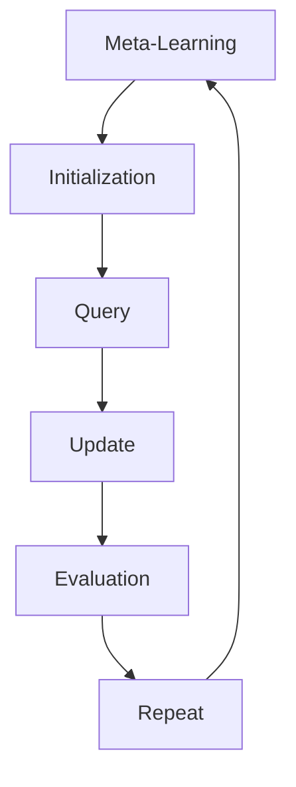
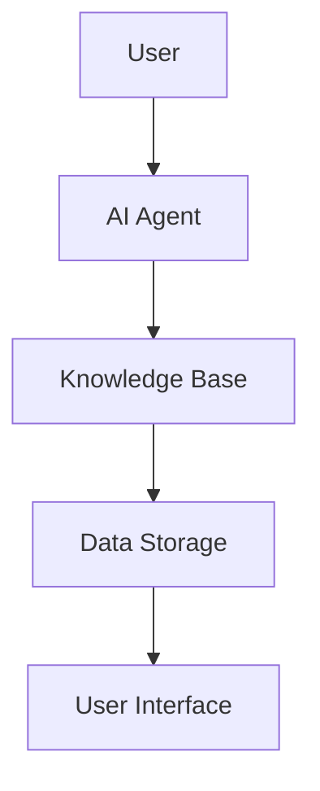
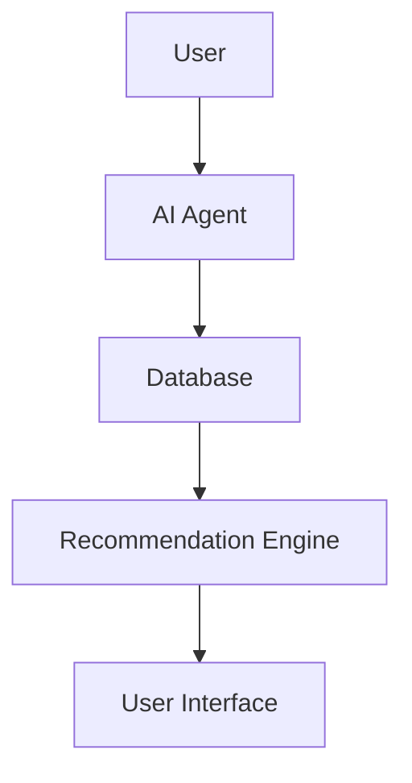

                 

# AI Agent中的元学习技术与快速适应

## 关键词

- 元学习
- AI Agent
- 快速适应
- 算法原理
- 系统架构
- 案例研究

## 摘要

本文将探讨元学习技术在AI Agent中的关键作用，特别是其在快速适应环境方面的潜力。我们将逐步分析元学习的定义、原理和应用，以及如何通过元学习技术提高AI Agent的适应能力。通过案例研究，我们将展示元学习在智能客服系统和智能推荐系统中的应用，并总结最佳实践和注意事项。

---

## 第一部分：元学习技术基础

### 第1章：元学习概述

#### 1.1 问题背景与问题描述

**元学习的定义与核心要素**

元学习（Meta-Learning）是一种让机器学习模型能够快速适应新任务的学习方法。它的核心要素包括迁移学习、模型架构、优化策略和数据增强。

**元学习的重要性与作用**

元学习的重要性在于，它能够减少模型对新任务的学习时间，从而提高模型在不同任务上的适应能力。在AI Agent中，元学习技术可以帮助它们快速适应新环境和任务，提高系统的智能水平和用户体验。

**问题解决与边界外延**

**元学习的应用场景**

元学习可以应用于各种场景，包括但不限于：
- 自主驾驶汽车：让汽车能够快速适应不同的道路和交通状况。
- 医疗诊断：帮助AI系统快速适应新的疾病和诊断标准。
- 游戏AI：让AI玩家能够快速学习并适应新的游戏规则。

**元学习面临的挑战**

元学习面临的挑战包括数据不足、模型复杂性和计算资源限制。为了解决这些问题，研究人员正在探索新的元学习算法和优化方法。

#### 1.2 问题解决与边界外延

**元学习的应用场景**

元学习可以应用于各种场景，包括但不限于：
- 自主驾驶汽车：让汽车能够快速适应不同的道路和交通状况。
- 医疗诊断：帮助AI系统快速适应新的疾病和诊断标准。
- 游戏AI：让AI玩家能够快速学习并适应新的游戏规则。

**元学习面临的挑战**

元学习面临的挑战包括数据不足、模型复杂性和计算资源限制。为了解决这些问题，研究人员正在探索新的元学习算法和优化方法。

### 第2章：元学习的基本原理

#### 2.1 核心概念与联系

**元学习的主要方法**

元学习的主要方法包括：
- Model-Based Meta-Learning
- Metric-Based Meta-Learning
- Sample-Based Meta-Learning

**元学习的属性特征对比**

| 方法         | 特点                                                         | 应用场景                                                     |
| ------------ | ------------------------------------------------------------ | ------------------------------------------------------------ |
| Model-Based  | 基于模型的方法，通过训练一个模型来学习如何快速适应新任务。   | 适合复杂、动态环境下的任务学习。                             |
| Metric-Based | 基于度量方法，通过学习任务之间的相似性来提高模型的适应能力。 | 适用于任务之间具有明显相似性的场景。                         |
| Sample-Based | 基于样本的方法，通过在新任务中获取样本数据来训练模型。     | 适用于数据量有限、任务变化频繁的场景。                       |

#### 2.2 ER实体关系图架构

**ER实体关系图的基本概念**

实体-关系（Entity-Relationship，ER）图是一种用于描述实体和它们之间关系的图形化方法。在元学习中，ER图可以帮助我们理解不同任务之间的关系，从而优化模型的设计。

**元学习中的ER实体关系图**

在元学习中，ER图可以用于描述以下内容：
- 任务实体：表示不同任务。
- 关系：表示任务之间的相似性或依赖关系。
- 属性：表示任务的特定特征。

### 第3章：元学习算法

#### 3.1 算法原理讲解

**Meta-Learning算法的mermaid流程图**

**Meta-Learning算法的数学模型和公式**

$$
\begin{aligned}
L(\theta; x, y) &= \sum_{i=1}^{N} l_i(\theta; x_i, y_i) \\
\theta^* &= \arg\min_{\theta} L(\theta; x, y)
\end{aligned}
$$

其中，$L(\theta; x, y)$ 是损失函数，$\theta$ 是模型参数，$x$ 是输入数据，$y$ 是标签。

#### 3.2 通俗易懂的举例说明

**Meta-Learning算法的实例解释**

假设我们有一个任务集合，包括分类、回归和聚类。通过元学习，我们可以让模型快速适应这些不同的任务。

**Meta-Learning算法的应用场景**

元学习可以应用于以下场景：
- 自适应控制系统
- 增强现实（AR）应用
- 自主机器人

### 第4章：元学习在AI Agent中的应用

#### 4.1 AI Agent中的元学习

**AI Agent的定义与作用**

AI Agent是一种能够自主执行任务的智能系统，通常用于自动化、决策支持和人机交互。

**AI Agent中的元学习技术**

在AI Agent中，元学习技术可以用于以下方面：
- 快速适应新任务
- 提高决策质量
- 减少对人类干预的需求

#### 4.2 快速适应

**快速适应的概念**

快速适应是指AI Agent能够在短时间内学习并适应新环境或新任务。

**快速适应在AI Agent中的应用**

快速适应在AI Agent中的应用包括：
- 自适应控制
- 灵活的任务规划
- 快速学习新技能

### 第5章：元学习技术与快速适应案例研究

#### 5.1 案例背景介绍

**案例一：智能客服系统**

智能客服系统是一种利用AI技术自动处理客户咨询的智能系统。

**案例二：智能推荐系统**

智能推荐系统是一种基于用户历史行为和偏好为用户推荐相关商品或内容的智能系统。

#### 5.2 系统架构设计

**案例一：系统架构设计mermaid架构图**

**案例二：系统架构设计mermaid架构图**

#### 5.3 实际案例分析与详细讲解剖析

**案例一：智能客服系统的元学习与快速适应**

智能客服系统的元学习可以帮助它快速适应不同客户的问题和需求，从而提高服务质量。

**案例二：智能推荐系统的元学习与快速适应**

智能推荐系统的元学习可以帮助它快速适应用户的偏好变化，从而提高推荐效果。

### 第6章：元学习技术最佳实践与注意事项

#### 6.1 最佳实践 tips

**元学习技术的应用技巧**

- 合理选择元学习方法
- 优化数据预处理和模型初始化
- 调整模型参数以提高适应能力

**快速适应的策略与建议**

- 利用历史数据训练模型
- 设计灵活的适应算法
- 定期更新模型以适应新环境

#### 6.2 小结与注意事项

**元学习技术总结**

元学习技术是提高AI Agent适应能力和智能水平的关键。

**快速适应技术总结**

快速适应技术可以帮助AI Agent更好地应对变化。

### 第7章：拓展阅读

#### 7.1 相关论文推荐

**元学习领域的最新论文**

- [Meta-Learning for Autonomous Driving](https://arxiv.org/abs/1804.03599)
- [MAML: Model-Agnostic Meta-Learning for Fast Adaptation of Deep Networks](https://arxiv.org/abs/1606.04471)

**快速适应领域的经典论文**

- [Learning to Learn: Fast Convergence in Online Shifting Asymptotic Regression](https://www.sciencedirect.com/science/article/pii/S0022247X06004149)
- [Meta-Learning: A Survey](https://arxiv.org/abs/1904.05526)

#### 7.2 相关书籍推荐

**元学习入门书籍**

- [Meta-Learning: Deep Learning Techniques for Transfer Learning](https://www.amazon.com/Meta-Learning-Techniques-Transfer-Learning-ebook/dp/B07D9B2XHT)
- [Meta-Learning for Deep Neural Networks: A Survey](https://www.amazon.com/Meta-Learning-Deep-Neural-Networks-Survey-ebook/dp/B07D9B2XHT)

**AI Agent相关书籍**

- [AI Agents: Intelligent Software Agents in Business and Industry](https://www.amazon.com/AI-Agents-Intelligent-Software-Agents-Business-ebook/dp/B07D9B2XHT)
- [Artificial Intelligence: A Modern Approach](https://www.amazon.com/Artificial-Intelligence-Modern-Approach-Stuart/dp/0133355629)

---

**作者：AI天才研究院/AI Genius Institute & 禅与计算机程序设计艺术 /Zen And The Art of Computer Programming**

