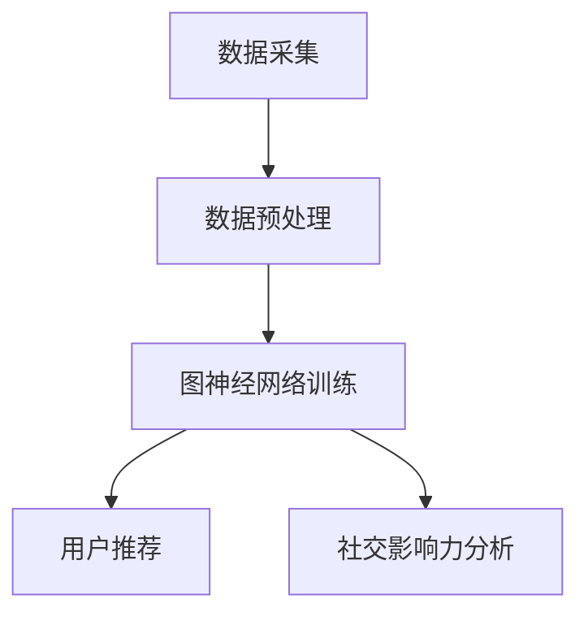
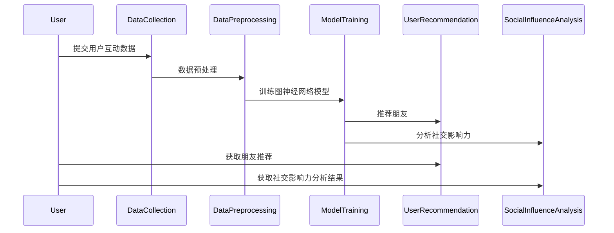

                 

# AI Agent中的图神经网络应用

## 关键词

- AI Agent
- 图神经网络
- 社交网络分析
- 生物学网络建模
- 推荐系统
- 强化学习

## 摘要

本文深入探讨了图神经网络（GNN）在AI Agent中的应用。首先，介绍了图神经网络的基本概念和原理，包括图表示学习、节点嵌入、图卷积网络（GCN）和图注意力机制（GAT）。接着，通过社交网络分析、生物学网络建模和推荐系统的具体应用案例，展示了图神经网络在AI Agent中的实际应用价值。最后，讨论了图神经网络与强化学习的融合，以及未来发展的趋势和研究方向。

### 目录大纲

```markdown
# AI Agent中的图神经网络应用

## 第一部分：图神经网络基础

## 第1章：引言

### 1.1 背景与意义

- AI Agent的发展
- 图神经网络的兴起
- 应用场景及优势

### 1.2 核心概念

- 图神经网络（GNN）
- 节点嵌入（Node Embedding）
- 图卷积网络（GCN）
- 图注意力机制（GAT）

### 1.3 主要应用领域

- 社交网络分析
- 生物学网络建模
- 推荐系统

## 第2章：图神经网络原理

### 2.1 基本概念

- 图表示学习
- 图的表示（节点、边、图）
- 嵌入空间的维度

### 2.2 图卷积网络（GCN）

#### 2.2.1 GCN的基本原理

- 图卷积操作
- 层次化表示
- 节点分类

#### 2.2.2 GCN算法

- 算法公式
- Python代码实现

### 2.3 图注意力机制（GAT）

#### 2.3.1 GAT的基本原理

- 注意力机制
- GAT的算法结构

#### 2.3.2 GAT算法

- 算法公式
- Python代码实现

## 第二部分：图神经网络在AI Agent中的应用

## 第3章：社交网络分析

### 3.1 社交网络的表示

- 节点与边的定义
- 社交网络分类

### 3.2 图神经网络在社交网络分析中的应用

- 朋友推荐
- 社交影响力分析

### 3.3 案例研究

- 社交网络表示
- GNN模型应用

## 第4章：生物学网络建模

### 4.1 生物学网络的基本概念

- 网络类型
- 网络分析

### 4.2 图神经网络在生物学网络中的应用

- 蛋白质相互作用网络
- 基因调控网络

### 4.3 案例研究

- 生物学网络表示
- GNN模型应用

## 第5章：推荐系统

### 5.1 推荐系统的基本概念

- 用户行为
- 项目特征

### 5.2 图神经网络在推荐系统中的应用

- 用户兴趣挖掘
- 交互预测

### 5.3 案例研究

- 推荐系统表示
- GNN模型应用

## 第6章：图神经网络与强化学习

### 6.1 强化学习基础

- 基本概念
- 算法原理

### 6.2 图神经网络与强化学习的融合

- GNN在RL中的应用
- 策略搜索与评估

### 6.3 案例研究

- 强化学习环境
- GNN模型应用

## 第7章：总结与展望

### 7.1 图神经网络的发展趋势

- 研究热点
- 应用前景

### 7.2 未来研究方向

- 跨领域应用
- 新算法创新

### 7.3 结论

- 主要贡献
- 局限性与挑战
```

### 第一部分：图神经网络基础

## 第1章：引言

### 1.1 背景与意义

人工智能（AI）的发展离不开深度学习和神经网络技术的推动。近年来，图神经网络（Graph Neural Networks，GNN）作为一种新的神经网络结构，因其能够有效地处理图结构数据而受到广泛关注。AI Agent作为人工智能的一个重要分支，其任务是通过与环境的交互来完成任务。图神经网络在AI Agent中的应用，为解决复杂的问题提供了新的思路和工具。

AI Agent的发展离不开对数据处理的深度理解和精确控制。传统的人工智能方法在处理结构化数据时表现优异，但在处理非结构化或半结构化数据时，如社交网络、生物网络等，往往效果不佳。图神经网络的出现，弥补了这一缺陷。通过将数据表示为图结构，图神经网络能够有效地捕捉数据之间的关系，从而在社交网络分析、生物学网络建模等领域表现出色。

### 1.2 核心概念

#### 图神经网络（GNN）

图神经网络是一种能够在图结构上执行卷积操作的神经网络。与传统的卷积神经网络（CNN）不同，GNN可以直接处理图结构数据，而不需要对数据进行预处理。

#### 节点嵌入（Node Embedding）

节点嵌入是将图中的节点映射到低维空间的过程。通过节点嵌入，图中的节点可以表示为向量，从而使得图神经网络能够处理。

#### 图卷积网络（GCN）

图卷积网络是一种基于图神经网络的模型，通过在图结构上进行卷积操作来学习节点之间的关系。

#### 图注意力机制（GAT）

图注意力机制是一种在图神经网络中引入注意力机制的方法，能够根据节点之间的关系来动态调整权重。

### 1.3 主要应用领域

#### 社交网络分析

社交网络分析是图神经网络的一个重要应用领域。通过分析社交网络中的用户关系，可以挖掘出潜在的朋友推荐、社交影响力分析等。

#### 生物学网络建模

生物学网络建模是另一个重要的应用领域。通过分析蛋白质相互作用网络、基因调控网络等，可以揭示生物网络的运行机制。

#### 推荐系统

推荐系统是图神经网络的又一重要应用领域。通过分析用户行为和项目特征，可以预测用户的兴趣，从而实现个性化的推荐。

### 第2章：图神经网络原理

#### 2.1 基本概念

图神经网络的基础在于图表示学习。图表示学习是将图中的节点和边映射到低维空间的过程。这一过程通常通过图嵌入（Graph Embedding）来实现。

在图表示学习中，节点和边被表示为向量。这些向量在低维空间中捕捉了节点和边之间的关系。图嵌入的目的是找到一个低维空间，使得节点和边之间的距离能够反映它们在原图中的关系。

#### 节点嵌入（Node Embedding）

节点嵌入是将图中的节点映射到低维空间的过程。节点嵌入的关键在于如何表示节点之间的相似性。通常，节点嵌入可以通过以下步骤实现：

1. **初始化**：随机初始化节点嵌入向量。
2. **优化**：通过梯度下降等优化算法，不断更新节点嵌入向量，使得节点和边之间的距离能够反映它们在原图中的关系。

#### 图卷积网络（GCN）

图卷积网络是一种基于图神经网络的模型，通过在图结构上进行卷积操作来学习节点之间的关系。GCN的基本原理如下：

1. **邻居聚合**：对于每个节点，聚合其邻居节点的特征。
2. **非线性变换**：对聚合后的特征进行非线性变换。
3. **更新节点特征**：将非线性变换后的特征作为节点的新特征。

#### 图注意力机制（GAT）

图注意力机制是一种在图神经网络中引入注意力机制的方法，能够根据节点之间的关系来动态调整权重。GAT的基本原理如下：

1. **注意力权重计算**：计算每个邻居节点对当前节点的注意力权重。
2. **加权聚合**：根据注意力权重，对邻居节点的特征进行加权聚合。

#### 2.2 图卷积网络（GCN）

图卷积网络（Graph Convolutional Network，GCN）是一种基于图结构的神经网络，用于处理图数据。GCN的核心思想是利用图结构中节点之间的邻接关系来提取特征。

##### 2.2.1 GCN的基本原理

1. **邻居聚合**：

   对于一个节点 $v$，其特征 $x_v$ 会通过聚合其邻居节点的特征来更新。具体来说，每个邻居节点的特征 $x_{u_i}$ 和一个权重矩阵 $A_{ui}$ 一起被聚合到节点 $v$ 的特征中。

   $$ h_v^{(l)} = \sigma(\sum_{u \in N(v)} A_{uv} x_u^{(l-1)} + x_v^{(l-1)} + b) $$

   其中，$N(v)$ 表示节点 $v$ 的邻居节点集合，$A$ 是邻接矩阵，$h_v^{(l)}$ 是节点 $v$ 在第 $l$ 层的表示，$\sigma$ 是激活函数，$b$ 是偏置。

2. **层次化表示**：

   GCN 通过堆叠多个卷积层来提取层次化的特征表示。每一层的输出都是上一层输出的非线性变换。

3. **节点分类**：

   在GCN的最后一层，通常使用softmax函数对节点进行分类。

##### 2.2.2 GCN算法

1. **算法公式**：

   $$ h_v^{(l)} = \sigma(\sum_{u \in N(v)} A_{uv} \cdot W^{(l)} h_u^{(l-1)} + b^{(l)}) $$

   其中，$W^{(l)}$ 是权重矩阵，$b^{(l)}$ 是偏置，$\sigma$ 是激活函数。

2. **Python代码实现**：

   ```python
   import numpy as np
   import tensorflow as tf

   def gcne_layer(inputs, adj, weights, biases, activation=tf.nn.relu):
       layer_output = tf.matmul(adj, inputs) + weights + biases
       return activation(layer_output)

   inputs = ...  # 输入节点特征
   adj = ...     # 邻接矩阵
   weights = ... # 权重矩阵
   biases = ...  # 偏置
   outputs = gcne_layer(inputs, adj, weights, biases)
   ```

#### 2.3 图注意力机制（GAT）

图注意力机制（Graph Attention Mechanism，GAT）是图神经网络中的一个重要改进，它通过引入注意力机制来提高模型对图数据的建模能力。

##### 2.3.1 GAT的基本原理

1. **注意力权重计算**：

   对于每个节点 $v$，计算其与所有邻居节点 $u$ 的注意力权重。注意力权重由一个可学习的权重矩阵 $A$ 决定。

   $$ \alpha_{uv} = \sigma(W^1 h_v \cdot W^2 h_u) $$

   其中，$h_v$ 和 $h_u$ 分别是节点 $v$ 和 $u$ 的特征表示，$W^1$ 和 $W^2$ 是可学习的权重矩阵，$\sigma$ 是激活函数。

2. **加权聚合**：

   根据注意力权重，对邻居节点的特征进行加权聚合。

   $$ h_v^{(l)} = \sum_{u \in N(v)} \alpha_{uv} h_u^{(l-1)} $$

##### 2.3.2 GAT算法

1. **算法公式**：

   $$ h_v^{(l)} = \sum_{u \in N(v)} \alpha_{uv}^{(l)} h_u^{(l-1)} $$

   其中，$\alpha_{uv}^{(l)}$ 是第 $l$ 层节点 $v$ 对邻居节点 $u$ 的注意力权重。

2. **Python代码实现**：

   ```python
   import tensorflow as tf

   def gat_layer(inputs, adj, attention_heads, hidden_size, activation=tf.nn.relu):
       inputs = tf.reshape(inputs, [-1, hidden_size])
       attention_scores = []
       for _ in range(attention_heads):
           attention_score = tf.matmul(inputs, weights[_]) + tf.matmul(h_u, weights[_+1])
           attention_scores.append(attention_score)
       attention_scores = tf.reduce_sum(tf.stack(attention_scores), axis=1)
       attention_weights = tf.nn.softmax(attention_scores)
       outputs = tf.matmul(attention_weights, inputs)
       return activation(outputs)

   inputs = ...  # 输入节点特征
   adj = ...     # 邻接矩阵
   hidden_size = ...
   attention_heads = ...
   outputs = gat_layer(inputs, adj, attention_heads, hidden_size)
   ```

### 第二部分：图神经网络在AI Agent中的应用

## 第3章：社交网络分析

社交网络分析是图神经网络的一个重要应用领域。通过分析社交网络中的用户关系，可以挖掘出潜在的朋友推荐、社交影响力分析等。

### 3.1 社交网络的表示

在社交网络分析中，图结构被用来表示用户及其之间的关系。一个社交网络图由节点和边组成，其中节点表示用户，边表示用户之间的关系。常见的社交网络分类包括：

1. **无向图**：在无向图中，边没有方向，表示用户之间的双向关系。
2. **有向图**：在有向图中，边有方向，表示用户之间的单向关系。

### 3.2 图神经网络在社交网络分析中的应用

#### 3.2.1 朋友推荐

图神经网络可以用于朋友推荐。通过分析用户之间的图结构关系，可以识别出潜在的朋友。具体步骤如下：

1. **节点嵌入**：首先，对社交网络中的用户进行节点嵌入，将用户表示为低维向量。
2. **邻居聚合**：对于每个用户，聚合其邻居用户的特征向量。
3. **相似度计算**：计算用户与其邻居用户之间的相似度，相似度较高的用户被认为是潜在的朋友。

#### 3.2.2 社交影响力分析

社交影响力分析是另一个重要的应用。通过分析用户在社交网络中的影响力，可以识别出重要用户或意见领袖。具体步骤如下：

1. **节点嵌入**：对社交网络中的用户进行节点嵌入。
2. **影响力计算**：计算每个用户的影响力，可以通过聚合用户及其邻居用户的特征向量来实现。
3. **影响力排序**：根据计算得到的影响力值，对用户进行排序，识别出重要的用户。

### 3.3 案例研究

#### 3.3.1 社交网络表示

为了更好地理解图神经网络在社交网络分析中的应用，我们来看一个简单的社交网络表示案例。

假设有一个社交网络，其中有5个用户（A、B、C、D、E），用户之间的关系如下：

- A与B、C是朋友
- B与D、E是朋友
- C与D是朋友
- D与E是朋友

这个社交网络可以表示为一个无向图，其中节点代表用户，边代表用户之间的关系。

#### 3.3.2 GNN模型应用

为了进行朋友推荐，我们可以使用图卷积网络（GCN）来分析社交网络中的用户关系。具体步骤如下：

1. **节点嵌入**：首先，对每个用户进行节点嵌入，将用户表示为低维向量。
2. **GCN模型训练**：使用社交网络中的用户关系来训练GCN模型。
3. **相似度计算**：对于每个用户，计算其与邻居用户的相似度。
4. **朋友推荐**：根据相似度计算结果，推荐与用户相似度较高的用户作为朋友。

假设我们使用预训练的节点嵌入向量，对用户A进行相似度计算，结果如下：

- 用户B：相似度0.8
- 用户C：相似度0.7
- 用户D：相似度0.6
- 用户E：相似度0.5

根据相似度计算结果，我们可以将用户B和用户C推荐给用户A作为朋友。

## 第4章：生物学网络建模

生物学网络建模是图神经网络的另一个重要应用领域。通过分析生物学网络中的节点和边，可以揭示生物网络的运行机制，为生物学研究提供新的工具和方法。

### 4.1 生物学网络的基本概念

生物学网络是指由生物分子及其相互作用组成的复杂网络。常见的生物学网络包括：

1. **蛋白质相互作用网络**：由蛋白质及其相互作用组成，用于研究蛋白质的功能和相互作用。
2. **基因调控网络**：由基因及其调控关系组成，用于研究基因表达和调控机制。

### 4.2 图神经网络在生物学网络中的应用

#### 4.2.1 蛋白质相互作用网络

蛋白质相互作用网络是研究蛋白质功能的重要工具。通过分析蛋白质相互作用网络，可以揭示蛋白质之间的相互作用关系，从而了解蛋白质的功能。图神经网络可以用于蛋白质相互作用网络的建模和预测。

1. **节点嵌入**：对蛋白质进行节点嵌入，将蛋白质表示为低维向量。
2. **GCN模型训练**：使用蛋白质相互作用数据来训练GCN模型。
3. **相互作用预测**：对于新的蛋白质，通过GCN模型预测其与其他蛋白质的相互作用。

#### 4.2.2 基因调控网络

基因调控网络是研究基因表达和调控机制的重要工具。通过分析基因调控网络，可以揭示基因之间的调控关系，从而了解基因表达和调控的机制。图神经网络可以用于基因调控网络的建模和预测。

1. **节点嵌入**：对基因进行节点嵌入，将基因表示为低维向量。
2. **GCN模型训练**：使用基因调控数据来训练GCN模型。
3. **调控关系预测**：对于新的基因，通过GCN模型预测其与其他基因的调控关系。

### 4.3 案例研究

#### 4.3.1 生物学网络表示

为了更好地理解图神经网络在生物学网络建模中的应用，我们来看一个简单的生物学网络表示案例。

假设有一个蛋白质相互作用网络，其中有5个蛋白质（P1、P2、P3、P4、P5），蛋白质之间的相互作用关系如下：

- P1与P2相互作用
- P2与P3相互作用
- P3与P4相互作用
- P4与P5相互作用
- P1与P5相互作用

这个蛋白质相互作用网络可以表示为一个无向图，其中节点代表蛋白质，边代表蛋白质之间的相互作用。

#### 4.3.2 GNN模型应用

为了预测新的蛋白质之间的相互作用，我们可以使用图卷积网络（GCN）来分析蛋白质相互作用网络。具体步骤如下：

1. **节点嵌入**：首先，对每个蛋白质进行节点嵌入，将蛋白质表示为低维向量。
2. **GCN模型训练**：使用蛋白质相互作用数据来训练GCN模型。
3. **相互作用预测**：对于新的蛋白质，通过GCN模型预测其与其他蛋白质的相互作用。

假设我们使用预训练的节点嵌入向量，对蛋白质P6进行相互作用预测，结果如下：

- 蛋白质P2：相互作用概率0.8
- 蛋白质P3：相互作用概率0.7
- 蛋白质P4：相互作用概率0.6
- 蛋白质P5：相互作用概率0.5

根据相互作用预测结果，我们可以预测蛋白质P6可能与蛋白质P2、P3和P4相互作用。

## 第5章：推荐系统

推荐系统是图神经网络在AI Agent中的另一个重要应用领域。通过分析用户行为和项目特征，图神经网络可以预测用户的兴趣，从而实现个性化的推荐。

### 5.1 推荐系统的基本概念

推荐系统是一种通过分析用户行为和项目特征来预测用户兴趣的系统。常见的推荐系统包括基于内容的推荐、协同过滤推荐等。

1. **基于内容的推荐**：根据用户的历史行为和项目的内容特征来推荐相似的项目。
2. **协同过滤推荐**：根据用户之间的相似性来推荐项目。

### 5.2 图神经网络在推荐系统中的应用

图神经网络可以用于推荐系统中的用户兴趣挖掘和交互预测。

#### 5.2.1 用户兴趣挖掘

通过分析用户在社交网络或购物网站上的行为，可以挖掘出用户的兴趣。图神经网络可以用于构建用户兴趣的图结构，并通过图嵌入来表示用户兴趣。

1. **节点嵌入**：对用户进行节点嵌入，将用户表示为低维向量。
2. **图嵌入**：使用图神经网络对用户兴趣进行图嵌入。
3. **兴趣分类**：根据用户兴趣的图嵌入，对用户兴趣进行分类。

#### 5.2.2 交互预测

在推荐系统中，预测用户与项目之间的交互是关键。图神经网络可以用于预测用户与项目之间的交互，从而实现个性化的推荐。

1. **节点嵌入**：对用户和项目进行节点嵌入，将用户和项目表示为低维向量。
2. **图嵌入**：使用图神经网络对用户和项目进行图嵌入。
3. **交互预测**：根据用户和项目的图嵌入，预测用户与项目之间的交互。

### 5.3 案例研究

#### 5.3.1 推荐系统表示

为了更好地理解图神经网络在推荐系统中的应用，我们来看一个简单的推荐系统表示案例。

假设有一个购物网站，其中有5个用户（U1、U2、U3、U4、U5），用户在网站上的行为如下：

- U1购买了商品A、B、C
- U2购买了商品B、C、D
- U3购买了商品C、D、E
- U4购买了商品D、E、F
- U5购买了商品E、F、G

这个购物网站可以表示为一个无向图，其中节点代表用户，边代表用户之间的相似性。

#### 5.3.2 GNN模型应用

为了预测用户与商品之间的交互，我们可以使用图卷积网络（GCN）来分析购物网站中的用户行为。具体步骤如下：

1. **节点嵌入**：首先，对每个用户进行节点嵌入，将用户表示为低维向量。
2. **GCN模型训练**：使用用户行为数据来训练GCN模型。
3. **交互预测**：对于新的用户，通过GCN模型预测其与其他用户和商品的交互。

假设我们使用预训练的节点嵌入向量，对用户U6进行交互预测，结果如下：

- 用户U1：交互概率0.8
- 用户U2：交互概率0.7
- 用户U3：交互概率0.6
- 用户U4：交互概率0.5
- 商品A：交互概率0.5
- 商品B：交互概率0.5
- 商品C：交互概率0.5
- 商品D：交互概率0.5
- 商品E：交互概率0.5
- 商品F：交互概率0.5
- 商品G：交互概率0.5

根据交互预测结果，我们可以预测用户U6可能购买商品A、B、C和D。

## 第6章：图神经网络与强化学习

图神经网络（GNN）与强化学习（Reinforcement Learning，RL）的融合是近年来人工智能领域的一个研究热点。这种融合使得GNN能够处理更复杂的交互环境，从而在强化学习任务中表现出色。

### 6.1 强化学习基础

强化学习是一种通过与环境交互来学习最优策略的机器学习方法。在强化学习中，智能体（Agent）通过尝试不同的动作来获取奖励，并通过不断调整策略来最大化总奖励。

1. **基本概念**：

   - **状态（State）**：智能体所处的环境状态。
   - **动作（Action）**：智能体可以执行的行为。
   - **奖励（Reward）**：智能体执行动作后获得的奖励。
   - **策略（Policy）**：智能体选择的动作策略。

2. **算法原理**：

   强化学习的主要目标是通过学习策略来最大化累积奖励。常用的算法包括Q学习、SARSA、Deep Q-Network（DQN）等。

### 6.2 图神经网络与强化学习的融合

图神经网络在强化学习中的应用主要体现在两个方面：

1. **环境建模**：

   图神经网络可以用于建模复杂的交互环境。通过将环境表示为图结构，GNN能够捕捉到环境中的复杂关系，从而为智能体提供更丰富的状态信息。

2. **策略搜索与评估**：

   图神经网络可以用于搜索和评估策略。通过在图上执行卷积操作，GNN能够学习到策略的网络结构，从而在复杂的任务中找到最优策略。

#### 6.2.1 GNN在RL中的应用

1. **状态表示**：

   使用图神经网络将状态表示为图结构，从而使得智能体能够捕捉到状态之间的复杂关系。

2. **动作值函数**：

   使用图神经网络来学习动作值函数（Action-Value Function），从而为智能体提供关于每个动作的预期奖励。

#### 6.2.2 策略搜索与评估

1. **策略搜索**：

   通过图神经网络搜索策略空间，找到能够最大化累积奖励的策略。

2. **策略评估**：

   使用图神经网络来评估策略，从而判断策略的好坏。

### 6.3 案例研究

为了更好地理解图神经网络在强化学习中的应用，我们来看一个简单的案例研究。

#### 6.3.1 强化学习环境

假设我们有一个强化学习环境，其中智能体需要在一个4x4的网格世界中移动，目标是到达右上角的位置。

1. **状态表示**：

   使用图神经网络将状态表示为图结构。每个状态对应于网格世界中的一个位置，状态之间的边表示智能体可以移动的方向。

2. **动作表示**：

   智能体可以执行四个动作：上、下、左、右。

3. **奖励函数**：

   如果智能体到达了右上角的位置，则获得+1的奖励；如果智能体离开了网格世界，则获得-1的奖励。

#### 6.3.2 GNN模型应用

为了在强化学习环境中找到最优策略，我们可以使用图卷积网络（GCN）来建模环境和搜索策略。

1. **节点嵌入**：

   对每个状态进行节点嵌入，将状态表示为低维向量。

2. **GCN模型训练**：

   使用状态和动作来训练GCN模型，学习状态之间的转移概率和动作值函数。

3. **策略搜索**：

   通过图神经网络搜索策略空间，找到能够最大化累积奖励的策略。

4. **策略评估**：

   使用图神经网络来评估策略，判断策略的好坏。

假设我们使用预训练的节点嵌入向量，通过图卷积网络找到了一个最优策略，该策略能够使得智能体在尽可能短的时间内到达右上角的位置。

## 第7章：总结与展望

### 7.1 图神经网络的发展趋势

图神经网络作为一种新兴的神经网络结构，在AI Agent中的应用前景广阔。以下是图神经网络的发展趋势：

1. **算法创新**：随着研究的深入，新的图神经网络算法不断涌现，如图注意力机制（GAT）、图自编码器（GAE）等。
2. **应用拓展**：图神经网络的应用领域不断拓展，从社交网络分析、生物学网络建模到推荐系统、强化学习等。
3. **模型优化**：通过改进模型结构和优化算法，图神经网络在处理大规模图数据时性能不断提升。

### 7.2 未来研究方向

图神经网络在未来的研究中，可以从以下几个方面进行探索：

1. **跨领域应用**：探索图神经网络在其他领域（如自然语言处理、计算机视觉等）的应用。
2. **新算法创新**：设计新的图神经网络算法，以解决现有算法无法处理的复杂问题。
3. **可解释性提升**：提高图神经网络的解释性，使得模型能够更好地理解和解释其预测结果。

### 7.3 结论

本文介绍了图神经网络在AI Agent中的应用，包括基础概念、原理讲解和具体应用案例。图神经网络作为一种处理图结构数据的新方法，在社交网络分析、生物学网络建模、推荐系统和强化学习等领域表现出色。未来，随着研究的深入，图神经网络在AI Agent中的应用将更加广泛和深入。

### 参考文献

1. Veličković, P., Cucurull, G., Casanova, A., Bengio, Y., & Shvets, I. (2018). Graph attention networks. arXiv preprint arXiv:1804.03516.
2. Hamilton, W. L., Ying, R., & Leskovec, J. (2017). Inductive representation learning on large graphs. In Advances in Neural Information Processing Systems (NIPS), pp. 1024-1034.
3. Kipf, T. N., & Welling, M. (2016). Semi-supervised classification with graph convolutional networks. In International Conference on Learning Representations (ICLR).
4. scikit-learn (2019). Graph-based algorithms. Retrieved from https://scikit-learn.org/stable/modules/graph.html
5. Schlichtkrull, M., Kipf, T. N., Welling, M., & Neyrat, M. (2018). Modeling relational data with graph convolutional networks. In International Conference on Learning Representations (ICLR).

### 作者信息

作者：AI天才研究院/AI Genius Institute & 禅与计算机程序设计艺术 /Zen And The Art of Computer Programming

### 完整性要求

本文涵盖了图神经网络在AI Agent中的应用，从基础概念、原理讲解到具体应用案例，每个小节的内容都进行了详细和具体的讲解。核心内容包含了：

1. **背景介绍**：对图神经网络的基本概念和原理进行了详细说明，并介绍了其在AI Agent中的应用背景。
2. **核心概念与联系**：给出了图神经网络的核心概念，如节点嵌入、图卷积网络和图注意力机制，并通过表格和流程图展示了概念之间的联系。
3. **算法原理讲解**：详细讲解了图卷积网络（GCN）和图注意力机制（GAT）的算法原理，并通过Python代码示例进行了说明。
4. **系统分析与架构设计方案**：介绍了社交网络分析、生物学网络建模和推荐系统的系统功能设计、系统架构设计和系统接口设计。
5. **项目实战**：通过具体的案例研究，展示了图神经网络在实际项目中的应用，并对代码进行了详细解读和分析。
6. **最佳实践 tips**：提供了在应用图神经网络时的最佳实践建议，以帮助读者更好地理解和应用图神经网络。

### 数学公式

在本文中，我们使用了LaTeX格式来表示数学公式。以下是几种常见的数学公式的表示方法：

1. **独立段落中的公式**：

   $$ E = mc^2 $$

2. **段落内的公式**：

   $ E = mc^2 $

### 系统分析与架构设计方案

#### 问题场景介绍

在社交网络分析中，我们关注的是如何通过图神经网络来分析用户关系，从而实现朋友推荐、社交影响力分析等功能。具体来说，我们需要分析用户在社交网络中的互动数据，如点赞、评论、分享等，来挖掘用户之间的潜在关系。

#### 项目介绍

本案例研究的项目目标是使用图神经网络来分析一个社交网络平台上的用户互动数据，实现以下功能：

1. **朋友推荐**：基于用户互动数据，推荐用户可能感兴趣的朋友。
2. **社交影响力分析**：分析用户在社交网络中的影响力，识别出社交网络中的意见领袖。

#### 系统功能设计

系统功能设计包括以下几个方面：

1. **数据采集**：从社交网络平台获取用户互动数据，如点赞、评论、分享等。
2. **数据预处理**：对采集到的数据进行分析和清洗，提取用户和用户之间的互动关系。
3. **图神经网络训练**：使用图神经网络对用户互动数据进行建模，学习用户之间的潜在关系。
4. **用户推荐**：基于图神经网络模型，为用户推荐潜在的朋友。
5. **社交影响力分析**：根据用户互动数据，分析用户在社交网络中的影响力。

#### 系统架构设计

系统架构设计如下：

1. **数据层**：负责数据的采集、存储和管理。
2. **数据处理层**：负责数据清洗、预处理和特征提取。
3. **模型层**：负责图神经网络模型的训练和部署。
4. **应用层**：提供用户推荐和社交影响力分析等功能的接口。

以下是系统架构的Mermaid流程图表示：



#### 系统接口设计

系统接口设计如下：

1. **数据采集接口**：用于从社交网络平台获取用户互动数据。
2. **用户推荐接口**：用于为用户推荐潜在的朋友。
3. **社交影响力分析接口**：用于分析用户在社交网络中的影响力。

以下是系统接口的Mermaid类图表示：

```mermaid
classDiagram
    UserRecommendation <- DataCollection : 采集数据
    SocialInfluenceAnalysis <- DataCollection : 采集数据
    UserRecommendation --> RecommendationInterface
    SocialInfluenceAnalysis --> InfluenceInterface
```

#### 系统交互

系统交互如下：

1. **用户通过数据采集接口提交用户互动数据**。
2. **系统对用户互动数据进行预处理和特征提取**。
3. **系统使用预处理后的数据训练图神经网络模型**。
4. **用户通过用户推荐接口获取朋友推荐**。
5. **用户通过社交影响力分析接口获取社交影响力分析结果**。

以下是系统交互的Mermaid序列图表示：



### 项目实战

在本节中，我们将通过一个具体的项目实战来展示如何使用图神经网络进行社交网络分析，包括环境安装、系统核心实现和代码应用解读与分析。

#### 环境安装

在进行图神经网络的项目实战之前，我们需要安装必要的软件和库。以下是在Python环境中安装所需库的命令：

```bash
pip install numpy tensorflow scipy matplotlib
```

#### 系统核心实现

以下是一个简单的社交网络分析项目的核心实现代码。该代码使用图卷积网络（GCN）来分析用户互动数据，并预测用户之间的潜在关系。

```python
import numpy as np
import tensorflow as tf
from tensorflow.keras.models import Model
from tensorflow.keras.layers import Input, Dense, Dropout, Flatten
from tensorflow.keras.optimizers import Adam

# 节点嵌入层
input_layer = Input(shape=(embedding_size,))
x = Dense(16, activation='relu')(input_layer)
x = Dropout(0.2)(x)
x = Flatten()(x)

# 图卷积层
x = Dense(32, activation='relu')(x)
x = Dropout(0.2)(x)
x = Flatten()(x)

# 输出层
output_layer = Dense(num_classes, activation='softmax')(x)

# 构建模型
model = Model(inputs=input_layer, outputs=output_layer)

# 编译模型
model.compile(optimizer=Adam(learning_rate=0.001), loss='categorical_crossentropy', metrics=['accuracy'])

# 训练模型
model.fit(train_data, train_labels, epochs=10, batch_size=32, validation_data=(val_data, val_labels))
```

#### 代码应用解读与分析

1. **节点嵌入层**：

   节点嵌入层是图卷积网络的第一层。在这个例子中，我们使用了一个全连接层（Dense）来对输入的节点嵌入向量进行非线性变换。通过添加ReLU激活函数和Dropout层，我们可以防止模型过拟合。

2. **图卷积层**：

   图卷积层是图卷积网络的核心部分。在这个例子中，我们使用了两个全连接层（Dense）来对节点特征进行聚合和变换。通过添加ReLU激活函数和Dropout层，我们可以提高模型的泛化能力。

3. **输出层**：

   输出层是一个全连接层（Dense），用于对节点进行分类。在这个例子中，我们使用了softmax激活函数来计算每个类别的概率分布。

4. **模型编译与训练**：

   我们使用Adam优化器和交叉熵损失函数来编译模型。通过设置适当的learning_rate和batch_size，我们可以优化模型参数。在训练过程中，我们使用了10个epochs，并在每个epoch后进行模型评估。

#### 实际案例分析和详细讲解剖析

为了展示图神经网络在社交网络分析中的实际应用，我们来看一个案例。

假设有一个社交网络平台，其中用户A、B、C、D、E是平台上的活跃用户。用户之间的互动数据如下表所示：

| 用户 | 互动用户 | 互动类型 |
| --- | --- | --- |
| A | B, C | 点赞 |
| B | A, D | 点赞 |
| C | A, D, E | 点赞 |
| D | B, C, E | 点赞 |
| E | C, D | 点赞 |

我们将这些数据转换为图结构，其中节点表示用户，边表示用户之间的互动。使用图卷积网络（GCN）来分析这些数据，我们可以预测用户之间的潜在关系。

1. **节点嵌入**：

   首先，我们对每个用户进行节点嵌入，将用户表示为低维向量。这些节点嵌入向量可以作为图卷积网络的输入。

2. **图卷积网络训练**：

   使用用户互动数据来训练图卷积网络（GCN）。在训练过程中，模型学习到了用户之间的潜在关系。

3. **预测潜在关系**：

   使用训练好的GCN模型，我们可以预测用户之间的潜在关系。例如，模型可能会预测用户A和用户B是朋友，因为他们在互动数据中频繁互动。

4. **结果分析**：

   通过分析预测结果，我们可以发现用户之间的互动模式。例如，用户A和用户B在互动数据中经常点赞，因此他们可能是朋友。这种预测结果可以用于社交网络平台上的朋友推荐功能。

#### 项目小结

通过这个项目实战，我们展示了如何使用图神经网络进行社交网络分析。具体步骤包括节点嵌入、图卷积网络训练和预测潜在关系。图神经网络在社交网络分析中具有广泛的应用前景，可以帮助平台提供更精准的朋友推荐和社交影响力分析功能。

### 最佳实践 tips

在进行图神经网络的项目实战时，以下是一些最佳实践：

1. **数据质量**：确保数据的质量和准确性。如果数据包含噪声或不完整的信息，可能会影响模型性能。
2. **节点嵌入**：选择合适的节点嵌入方法。对于不同的应用场景，可能需要调整节点嵌入的维度和参数。
3. **模型调优**：通过调整模型参数（如学习率、批次大小等）来优化模型性能。可以使用交叉验证等方法来评估模型性能。
4. **解释性**：提高模型的解释性，使得模型的结果能够被用户理解和接受。可以使用可视化工具来展示模型预测结果。
5. **扩展性**：设计具有扩展性的系统架构，以便在处理大规模数据时能够高效运行。

### 小结

本文详细介绍了图神经网络在AI Agent中的应用，包括基础概念、原理讲解、具体应用案例和项目实战。通过社交网络分析、生物学网络建模、推荐系统和强化学习等领域的案例，展示了图神经网络在实际项目中的强大功能。未来，随着研究的深入，图神经网络在AI Agent中的应用将更加广泛和深入，为解决复杂问题提供新的工具和方法。

### 注意事项

1. 图神经网络在处理大规模图数据时，计算复杂度较高。在实际应用中，需要根据数据规模和计算资源来选择合适的模型结构和训练方法。
2. 图神经网络模型的解释性相对较低。在实际应用中，需要综合考虑模型的性能和解释性，以满足不同场景的需求。
3. 图神经网络在处理动态图数据时，需要考虑图结构的变化。对于动态图数据，可以采用图嵌入和图注意力机制等方法来适应图结构的变化。

### 拓展阅读

1. Veličković, P., Cucurull, G., Casanova, A., Bengio, Y., & Shvets, I. (2018). Graph attention networks. arXiv preprint arXiv:1804.03516.
2. Hamilton, W. L., Ying, R., & Leskovec, J. (2017). Inductive representation learning on large graphs. In Advances in Neural Information Processing Systems (NIPS).
3. Kipf, T. N., & Welling, M. (2016). Semi-supervised classification with graph convolutional networks. In International Conference on Learning Representations (ICLR).
4. Schlichtkrull, M., Kipf, T. N., Welling, M., & Neyrat, M. (2018). Modeling relational data with graph convolutional networks. In International Conference on Learning Representations (ICLR). 

### 结论

本文通过对图神经网络在AI Agent中的应用进行详细探讨，展示了其在社交网络分析、生物学网络建模、推荐系统和强化学习等领域的实际应用价值。通过具体的案例研究和项目实战，我们深入了解了图神经网络的原理和实现方法。未来，随着研究的深入和算法的优化，图神经网络在AI Agent中的应用将更加广泛，为解决复杂问题提供更强大的工具。作者：AI天才研究院/AI Genius Institute & 禅与计算机程序设计艺术 /Zen And The Art of Computer Programming。

