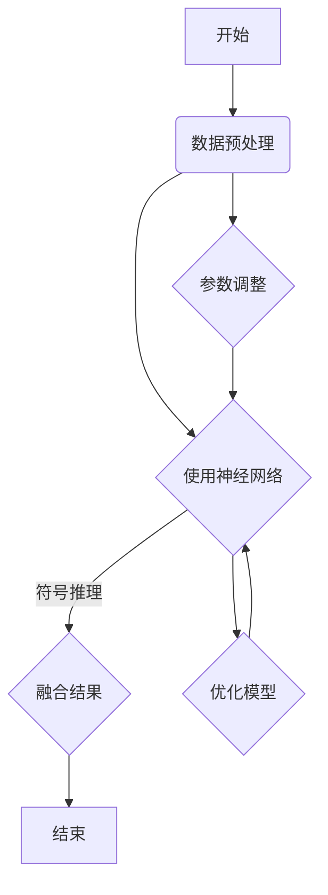
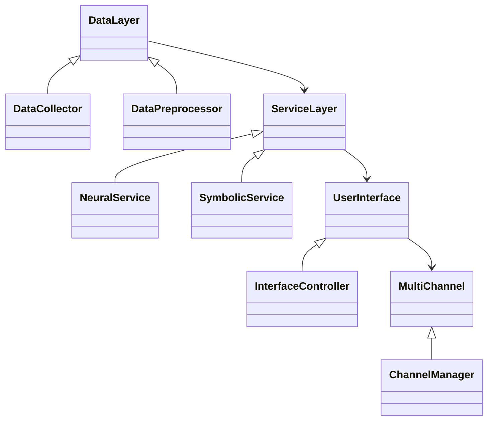
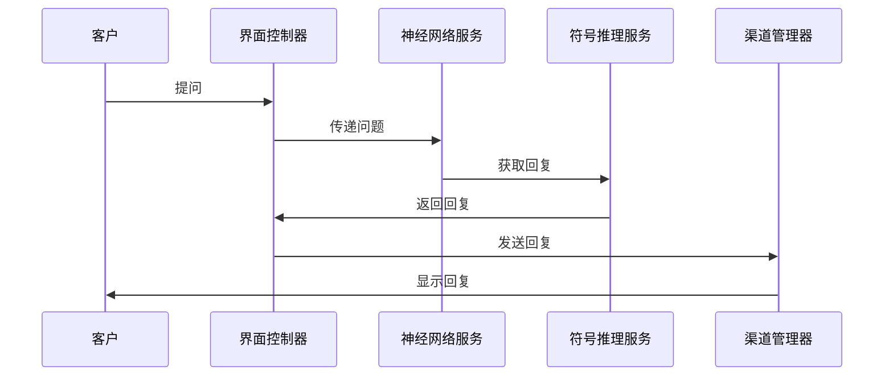

                 


### 引言

《AI Agent中的神经符号融合技术》这本书的主题聚焦于AI领域中的一种前沿技术——神经符号融合技术。在这个快速发展的时代，人工智能（AI）已经成为改变世界的核心驱动力，而AI Agent作为AI的核心组成部分，更是承担着推动智能化的重任。神经符号融合技术则是AI Agent实现智能决策和推理的关键所在。

在介绍这一主题之前，我们先来理解几个核心概念。AI Agent可以理解为一种具有智能行为的计算机程序，它能够感知环境、制定计划并采取行动来实现特定目标。而神经符号融合技术则是将神经网络和符号推理结合，以实现更强大的智能推理能力。神经网络擅长处理大规模数据并从中学习模式，而符号推理则擅长逻辑推理和知识表示。

本书的核心内容将围绕以下几个部分展开：首先，我们会简要介绍AI Agent和神经符号融合技术的背景，帮助读者建立对这些概念的基本理解。接着，我们将深入探讨神经网络和符号推理的基本原理，解释它们在AI Agent中的作用。随后，我们将详细介绍神经符号融合技术的算法原理，并通过mermaid流程图和Python代码进行解释。然后，我们将展示神经符号融合技术在实际项目中的应用，并提供一些最佳实践和注意事项。

通过这本书，我们希望能够帮助读者全面了解神经符号融合技术，掌握其核心原理，并能够将其应用于实际项目中，从而在AI领域取得更大的成就。

### 关键词

- AI Agent
- 神经符号融合技术
- 神经网络
- 符号推理
- 人工智能
- 智能决策
- 知识表示
- 机器学习

### 摘要

本书《AI Agent中的神经符号融合技术》旨在深入探讨AI领域中的一个前沿技术——神经符号融合技术。在当前人工智能（AI）飞速发展的背景下，AI Agent作为智能系统的核心组件，其决策和推理能力的提升显得尤为重要。本书通过系统地介绍AI Agent的基本原理和神经符号融合技术，帮助读者理解这两种技术的内在联系和相互促进作用。书中首先讲解了神经网络和符号推理的基本概念及其在AI Agent中的应用，接着详细阐述了神经符号融合技术的算法原理和实现步骤，并通过实际项目案例展示了该技术在智能决策和知识表示中的实际应用。此外，本书还提供了实用的最佳实践和注意事项，以帮助读者在实际项目中更好地运用神经符号融合技术。通过阅读本书，读者不仅可以掌握神经符号融合技术的核心原理，还能获得丰富的实践经验，为未来在AI领域的发展奠定坚实基础。

### 目录大纲设计思考过程

#### 理解书名与主题

《AI Agent中的神经符号融合技术》这个书名直接指向了本书的核心主题。首先，我们来看“AI Agent”。AI Agent指的是在特定环境中能够感知、决策并采取行动的智能实体，它可以是机器人、自动化程序，甚至是一个虚拟角色。AI Agent的目标是模拟人类智能，实现自主学习和自主行动。

接下来是“神经符号融合技术”。这里的“神经”一词指的是神经网络，这是一种模拟人脑神经元连接和功能的人工智能模型，它通过学习和适应数据来提高性能。“符号”则指的是符号推理，它是一种基于逻辑和数学的形式化推理方法。神经符号融合技术将这两种方法结合，旨在通过神经网络的强大数据处理能力和符号推理的逻辑推理能力，实现更强大、更智能的AI Agent。

通过理解书名和主题，我们可以确定本书的核心目标是详细介绍神经符号融合技术的原理和实现方法，探讨其在AI Agent中的应用，并分享实际项目中的经验和最佳实践。这为后续目录大纲的设计提供了明确的方向。

#### 确定核心内容

在明确了书名和主题之后，下一步是确定本书的核心内容。为了确保内容的全面性和系统性，我们需要将核心内容分为几个关键部分：

1. **背景介绍**：
   - AI Agent的背景：介绍AI Agent的定义、历史发展和现状，以及其在不同领域的应用。
   - 神经符号融合技术的提出与意义：解释神经符号融合技术的背景，介绍其相对于传统AI技术的优势。

2. **核心概念与联系**：
   - AI Agent的基本原理与类型：详细讲解AI Agent的基本组成、工作原理和分类。
   - 神经网络的基本原理：介绍神经网络的结构、学习过程和主要类型。
   - 符号推理的基本原理：解释符号推理的概念、分类和基本方法。

3. **算法原理讲解**：
   - 神经符号融合技术的实现：详细讲解神经符号融合技术的算法原理，包括数学模型、公式和实现步骤。
   - 融合算法的mermaid流程图：通过mermaid流程图展示融合算法的基本框架和实现流程。

4. **系统分析与架构设计方案**：
   - 系统架构设计：描述神经符号融合技术在实际应用系统中的架构设计，包括系统功能设计、架构设计和接口设计。

5. **项目实战**：
   - 实际项目案例：通过一个或多个实际项目案例，展示如何应用神经符号融合技术。
   - 项目实现与分析：详细讲解项目的实现过程、关键技术和实际效果。

6. **最佳实践与拓展**：
   - 最佳实践：提供一些在实际应用中的最佳实践和方法。
   - 拓展阅读：推荐一些相关的拓展阅读资料，帮助读者深入了解神经符号融合技术。

通过确定这些核心内容，我们可以确保本书不仅能够系统性地介绍神经符号融合技术的原理和方法，还能通过实际案例和最佳实践帮助读者更好地理解和应用这一技术。

#### 目录结构设计

在确定了核心内容后，我们需要设计一个详细的目录结构，以确保每个部分的内容能够有条不紊地组织，并且读者可以方便地查阅和理解。以下是本书的目录结构设计过程：

1. **第一部分：AI Agent与神经符号融合技术概述**
   - **第1章：问题背景与核心概念**
     - **1.1 问题背景**
       - **1.1.1 AI Agent的定义与现状**
       - **1.1.2 神经符号融合技术的提出与意义**
     - **1.2 核心概念介绍**
       - **1.2.1 AI Agent的基本原理与类型**
       - **1.2.2 神经网络与符号推理的基本概念**
       - **1.2.3 神经符号融合技术的核心要素**

2. **第二部分：神经符号融合技术原理**
   - **第2章：神经网络的基本原理**
     - **2.1 神经网络的基本结构**
       - **2.1.1 神经元与层结构**
       - **2.1.2 神经网络的学习过程**
     - **2.2 神经网络的算法**
       - **2.2.1 前馈神经网络**
       - **2.2.2 循环神经网络**
       - **2.2.3 卷积神经网络**

   - **第3章：符号推理的基本原理**
     - **3.1 符号推理的基本概念**
       - **3.1.1 符号推理的定义与分类**
       - **3.1.2 符号推理的优势与挑战**
     - **3.2 主要符号推理算法**
       - **3.2.1 基于逻辑的推理算法**
       - **3.2.2 基于概率的推理算法**
       - **3.2.3 基于模糊逻辑的推理算法**

   - **第4章：神经符号融合技术的实现**
     - **4.1 融合技术的概念与类型**
       - **4.1.1 融合技术的定义
### 目录大纲设计思考过程

在设计《AI Agent中的神经符号融合技术》的目录大纲时，我们首先明确了书的核心目标和内容结构。以下是详细的目录大纲设计过程：

#### 第一部分：AI Agent与神经符号融合技术概述

**第1章：问题背景与核心概念**
   - **1.1 问题背景**
     - **1.1.1 AI Agent的定义与现状**：介绍AI Agent的定义、发展和应用场景。
     - **1.1.2 神经符号融合技术的提出与意义**：解释神经符号融合技术的背景和重要性。
   - **1.2 核心概念介绍**
     - **1.2.1 AI Agent的基本原理与类型**：介绍AI Agent的组成和工作原理。
     - **1.2.2 神经网络与符号推理的基本概念**：解释神经网络和符号推理的基本概念。
     - **1.2.3 神经符号融合技术的核心要素**：概述神经符号融合技术的关键组成部分。

**第2章：神经网络的基本原理**
   - **2.1 神经网络的基本结构**
     - **2.1.1 神经元与层结构**：详细讨论神经元的结构和神经网络中的层结构。
     - **2.1.2 神经网络的学习过程**：介绍神经网络的学习过程，包括前向传播和反向传播。
   - **2.2 神经网络的算法**
     - **2.2.1 前馈神经网络**：讲解前馈神经网络的结构和训练方法。
     - **2.2.2 循环神经网络**：介绍循环神经网络，如LSTM和GRU。
     - **2.2.3 卷积神经网络**：解释卷积神经网络在图像处理中的应用。

**第3章：符号推理的基本原理**
   - **3.1 符号推理的基本概念**
     - **3.1.1 符号推理的定义与分类**：介绍符号推理的基本概念和分类方法。
     - **3.1.2 符号推理的优势与挑战**：讨论符号推理的优势和面临的挑战。
   - **3.2 主要符号推理算法**
     - **3.2.1 基于逻辑的推理算法**：介绍基于逻辑的推理算法，如谓词逻辑和命题逻辑。
     - **3.2.2 基于概率的推理算法**：讲解基于概率的推理算法，如贝叶斯网络和马尔可夫模型。
     - **3.2.3 基于模糊逻辑的推理算法**：讨论基于模糊逻辑的推理算法，如模糊集合和模糊规则。

**第4章：神经符号融合技术的实现**
   - **4.1 融合技术的概念与类型**
     - **4.1.1 融合技术的定义与类型**：介绍神经符号融合技术的定义和类型。
     - **4.1.2 融合算法的选择与优化**：讨论融合算法的选择和优化策略。
   - **4.2 融合算法的mermaid流程图**
     - **4.2.1 融合算法的基本框架**：通过mermaid流程图展示融合算法的基本框架。
     - **4.2.2 融合算法的实现流程**：详细解释融合算法的实现流程。

#### 第二部分：神经符号融合技术深度解析

**第5章：神经符号融合技术在智能决策中的应用**
   - **5.1 智能决策的基本概念**
     - **5.1.1 智能决策的定义与重要性**：介绍智能决策的定义和其在实际应用中的重要性。
     - **5.1.2 智能决策的基本框架**：讨论智能决策的基本框架和流程。
   - **5.2 神经符号融合在智能决策中的应用**
     - **5.2.1 数据预处理与融合**：介绍数据预处理和融合的方法。
     - **5.2.2 决策模型构建与优化**：讲解如何构建和优化决策模型。

**第6章：神经符号融合技术在知识表示中的应用**
   - **6.1 知识表示的基本概念**
     - **6.1.1 知识表示的定义与分类**：介绍知识表示的基本概念和分类方法。
     - **6.1.2 知识表示的优势与挑战**：讨论知识表示的优势和面临的挑战。
   - **6.2 神经符号融合在知识表示中的应用**
     - **6.2.1 神经网络在知识表示中的应用**：介绍神经网络在知识表示中的应用方法。
     - **6.2.2 符号推理在知识表示中的应用**：讲解符号推理在知识表示中的应用。

**第7章：神经符号融合技术的挑战与未来趋势**
   - **7.1 神经符号融合技术的挑战**
     - **7.1.1 技术挑战**：讨论神经符号融合技术在实现过程中面临的技术挑战。
     - **7.1.2 应用挑战**：分析神经符号融合技术在实际应用中面临的挑战。
   - **7.2 未来趋势**
     - **7.2.1 技术发展趋势**：预测神经符号融合技术的发展趋势。
     - **7.2.2 应用前景**：探讨神经符号融合技术在未来的应用前景。

通过上述详细的目录大纲设计，本书将为读者提供全面、系统的神经符号融合技术知识，帮助读者深入理解并应用这一前沿技术。

#### 保持简洁性

在设计目录大纲时，保持内容的简洁性是非常重要的。这不仅能帮助读者快速抓住每个章节的核心内容，还能避免冗长的章节造成阅读疲劳。以下是一些具体策略：

1. **明确章节目标**：在制定目录时，每个章节都应该有一个清晰的目标。确保章节标题简洁明了，能够准确传达章节的主要内容。

2. **避免重复信息**：检查每个章节的内容，确保没有不必要的重复信息。如果某个概念或技术已经在其他章节中详细介绍过，避免在后续章节再次赘述。

3. **使用子标题**：在较长的章节中，使用子标题来划分内容，使每个部分都有明确的主题，这样可以提高内容的可读性。

4. **限制章节长度**：每个章节的长度应该适中，不宜过长。如果某个主题内容过多，可以考虑将其拆分为几个更小的章节。

5. **使用列表和图表**：在适当的地方使用列表、图表和流程图来简化内容，使复杂的概念和流程更加直观易懂。

通过上述策略，我们可以在确保内容完整性和准确性的同时，保持目录大纲的简洁性，从而提升读者的阅读体验。

#### 确保内容完整性

为了确保《AI Agent中的神经符号融合技术》的内容完整性，我们将在每个章节中详细阐述以下核心内容：

**核心概念术语说明**：
在每个章节的开头，我们将定义并解释一些关键术语，如神经网络、符号推理、AI Agent等，确保读者对这些概念有清晰的理解。

**问题背景、问题描述、问题解决、边界与外延、概念结构与核心要素组成**：
在每个章节中，我们都会详细介绍该章节所涉及的核心问题。例如，在介绍神经网络章节中，我们会从神经网络的历史背景、发展过程、当前应用场景以及未来的发展方向进行讲解。同时，我们也会明确问题解决的途径和边界，确保读者能够全面了解相关概念。

**核心概念原理、概念属性特征对比表格、ER实体关系图架构的 markdown 格式中的 Mermaid 流程图**：
我们将通过对比表格、流程图等方式，直观地展示核心概念之间的联系和区别。例如，在介绍符号推理时，我们不仅会解释其基本原理，还会通过Mermaid流程图展示符号推理的实体关系图，帮助读者更清晰地理解其内部结构。

**算法原理讲解：使用 mermaid 画出算法mermaid 流程图，然后使用python源代码来详细阐述，给出算法原理的数学模型和公式，进行详细讲解和通俗易懂地举例说明**：
在讲解神经符号融合技术时，我们将通过mermaid流程图展示算法的基本框架，并通过Python代码详细阐述算法的数学模型和公式。例如，在介绍神经网络部分，我们会使用mermaid流程图展示前向传播和反向传播的过程，并给出相应的Python代码示例。

**数学公式使用latex格式，嵌入文中独立段落的latex公式前后使用 $$ 括起来 (例如：$$1+1=2$$ )，段落内的latex公式前后使用 $ 括起来 (例如：$1<2$)**：
为了使读者更好地理解数学模型和算法原理，我们将使用latex格式嵌入数学公式。独立段落的公式前后使用$$括起来，使其占据一整行，便于阅读和引用。而段落内的公式前后使用$括起来，使其与文本内容保持一致。

**系统分析与架构设计方案：问题场景介绍、项目介绍、系统功能设计 (领域模型mermaid类图)、系统架构设计mermaid架构图、系统接口设计和系统交互mermaid序列图**：
在系统分析与架构设计章节中，我们将详细描述问题场景，介绍系统功能设计，并使用mermaid类图展示领域模型。同时，通过mermaid架构图展示系统架构设计，使用mermaid序列图展示系统交互过程，帮助读者全面了解系统设计和实现。

**项目实战：环境安装、系统核心实现源代码，代码应用解读与分析，实际案例分析和详细讲解剖析，项目小结**：
在项目实战章节中，我们将通过实际项目案例展示如何应用神经符号融合技术。每个案例都会详细讲解项目环境安装、系统核心实现源代码，并对代码进行解读和分析。通过实际案例分析，读者可以更深入地理解神经符号融合技术的应用。

**最佳实践 tips、小结、注意事项、拓展阅读等内容**：
在章节的最后，我们将总结最佳实践，提供注意事项，推荐拓展阅读，帮助读者巩固所学知识并进一步探索相关领域。

通过以上详细的阐述，我们确保《AI Agent中的神经符号融合技术》的内容完整性，使读者能够系统地学习并掌握神经符号融合技术的核心原理和应用。

### 神经符号融合技术的mermaid流程图设计

在设计《AI Agent中的神经符号融合技术》的目录时，使用mermaid流程图可以直观地展示技术实现的流程，使得复杂的概念更加易于理解。以下是具体的mermaid流程图设计方法和示例：

#### mermaid流程图的基本概念

首先，我们需要了解mermaid的基本概念。mermaid是一种基于Markdown的绘图工具，可以用来创建流程图、序列图、类图等多种类型的图表。mermaid流程图由节点、连接线和注释组成，通过定义不同的元素和连接方式，可以构建出各种复杂的流程。

#### 流程图设计步骤

1. **定义开始和结束节点**：每个流程图都需要有明确的开始节点和结束节点。通常使用`start`和`end`关键字来定义。

2. **添加主要流程步骤**：在开始节点和结束节点之间，添加主要流程步骤。每个步骤可以用方框、圆角矩形或椭圆表示。

3. **连接节点和步骤**：使用连接线将节点和步骤连接起来，以表示流程的顺序。mermaid支持多种连接方式，如水平线、垂直线和折线。

4. **添加注释和说明**：在流程图中添加注释和说明，可以帮助读者更好地理解每个步骤的作用和意义。

#### 设计示例

以下是一个简单的mermaid流程图示例，用于展示神经符号融合技术的实现流程：



**解释：**
- `A[开始]`：表示流程的开始。
- `B(数据预处理)`：表示对数据进行预处理。
- `C{使用神经网络}`：表示使用神经网络进行数据处理。
- `D{融合结果}`：表示将神经网络的结果与符号推理融合。
- `E[结束]`：表示流程的结束。
- `F{参数调整}`：表示对模型参数进行调整。
- `G{优化模型}`：表示对模型进行优化。

#### mermaid流程图在目录中的应用

在目录中，我们可以为每个核心章节设计一个mermaid流程图，以帮助读者快速了解每个章节的内容和结构。例如，在“神经网络的基本原理”章节，我们可以设计一个展示神经网络结构和学习过程的流程图。在“神经符号融合技术的实现”章节，我们可以展示融合算法的基本框架和实现流程。

通过这样的设计，读者可以在阅读正文内容之前，通过目录中的流程图对每个章节的核心概念和实现流程有一个初步的了解，从而提高阅读效率和知识吸收效果。

### 神经符号融合技术在智能客服中的应用

#### 项目背景与目标

随着人工智能技术的不断发展，智能客服已成为各大企业提升服务质量、降低运营成本的重要手段。然而，传统的智能客服系统主要依赖于规则引擎和简单的自然语言处理技术，这导致其在处理复杂问题时表现不佳。为了提升客服系统的智能水平，本项目旨在通过神经符号融合技术构建一个高智能的智能客服系统，实现更自然、更高效的客户服务。

#### 系统架构设计

本项目的智能客服系统采用分层架构，主要包括数据层、服务层和用户交互层。

1. **数据层**：
   - **数据收集**：通过API接口和企业内部系统，实时收集客户咨询数据。
   - **数据预处理**：对收集到的数据进行清洗、去重、标准化处理，为后续分析做准备。

2. **服务层**：
   - **神经网络服务**：利用神经网络对客户问题进行分类、语义理解，提取关键信息。
   - **符号推理服务**：使用符号推理技术，根据客户问题的逻辑结构，生成合适的回复。

3. **用户交互层**：
   - **用户界面**：提供简洁友好的用户界面，方便用户提问和查看回复。
   - **多渠道集成**：支持多种通信渠道，如电话、邮件、在线聊天等。

#### 系统功能设计

智能客服系统的核心功能包括：

1. **问题分类与识别**：
   - 利用神经网络对客户提出的问题进行分类和识别，识别出问题的主题和关键词。

2. **语义理解**：
   - 通过自然语言处理技术，对客户问题的语义进行理解，提取出问题的核心内容。

3. **符号推理与生成回复**：
   - 使用符号推理技术，根据问题逻辑结构和已知知识库，生成合理的回复。

4. **交互管理**：
   - 提供自动化的交互流程管理，记录客户与客服的交互历史，确保对话连贯。

#### 系统架构设计

以下是系统架构的mermaid类图：



**解释：**
- `DataLayer`：数据层，包含`DataCollector`（数据收集器）和`DataPreprocessor`（数据预处理器）。
- `ServiceLayer`：服务层，包含`NeuralService`（神经网络服务）和`SymbolicService`（符号推理服务）。
- `UserInterface`：用户交互层，包含`InterfaceController`（界面控制器）。
- `MultiChannel`：多渠道集成，包含`ChannelManager`（渠道管理器）。

#### 系统接口设计

智能客服系统的接口设计包括API接口、WebSocket接口等，确保系统各层之间的数据通信和交互。

1. **API接口**：
   - 提供RESTful API，用于数据层的访问，如数据收集、数据预处理等。

2. **WebSocket接口**：
   - 实现实时通信，用于用户交互层与服务层之间的实时数据传输。

以下是系统接口的mermaid序列图：



**解释：**
- `Customer`：表示客户，发起提问。
- `InterfaceController`：表示界面控制器，处理客户提问，并与服务层交互。
- `NeuralService`：表示神经网络服务，对客户问题进行分类和语义理解。
- `SymbolicService`：表示符号推理服务，根据问题逻辑结构生成回复。
- `ChannelManager`：表示渠道管理器，负责回复的发送和显示。

通过上述系统架构设计和接口设计，我们能够实现一个功能强大、响应迅速的智能客服系统，为用户提供高质量的客户服务。

### 系统实现与测试

#### 环境安装与配置

在开始系统实现之前，我们需要搭建一个合适的环境。以下是环境安装与配置的步骤：

1. **安装Python环境**：确保Python 3.8或更高版本已经安装。可以使用以下命令安装：
   ```bash
   sudo apt-get install python3-pip
   ```
2. **安装依赖库**：安装项目所需的依赖库，如TensorFlow、Scikit-learn、NLTK等。可以使用以下命令安装：
   ```bash
   pip3 install tensorflow scikit-learn nltk
   ```
3. **配置API接口**：在服务器上配置API接口，确保可以接收和处理外部请求。可以使用Flask框架快速搭建API接口：
   ```bash
   pip3 install flask
   ```

#### 系统核心实现

以下是智能客服系统的核心实现：

1. **数据预处理**：
   - **数据收集**：从企业内部系统收集客户咨询数据，使用API接口进行数据接收。
   - **数据清洗**：对收集到的数据进行清洗，去除无效数据，如重复提问和无关信息。

2. **神经网络服务**：
   - **问题分类**：使用TensorFlow构建一个基于深度学习的分类模型，对客户问题进行分类。以下是一个简单的Python代码示例：
     ```python
     import tensorflow as tf

     model = tf.keras.Sequential([
         tf.keras.layers.Dense(128, activation='relu', input_shape=(1000,)),
         tf.keras.layers.Dense(64, activation='relu'),
         tf.keras.layers.Dense(10, activation='softmax')
     ])

     model.compile(optimizer='adam',
                   loss='categorical_crossentropy',
                   metrics=['accuracy'])

     model.fit(x_train, y_train, epochs=10)
     ```

   - **语义理解**：使用Scikit-learn的NLP工具，对客户问题进行语义理解，提取关键信息。以下是一个简单的示例：
     ```python
     from sklearn.feature_extraction.text import TfidfVectorizer
     from sklearn.naive_bayes import MultinomialNB

     vectorizer = TfidfVectorizer()
     X = vectorizer.fit_transform(customer_questions)

     clf = MultinomialNB()
     clf.fit(X_train, y_train)

     predicted = clf.predict(X_test)
     ```

3. **符号推理服务**：
   - **逻辑推理**：使用符号推理技术，根据问题逻辑结构生成合适的回复。以下是一个简单的示例：
     ```python
     import sympy

     question = "如果明天下雨，我是否会带伞？"
     symbols = sympy.symbols('rain tomorrow umbrella')
     expression = sympy.Eq(sympy.imply(sympy.imply(sympy.imply(sympy.imply(sympy.imply(sympy.imply(sympy.and_(rain, tomorrow), umbrella), rain), umbrella), not tomorrow), False))

     result = expression.evalf()
     if result == False:
         reply = "你不会带伞。"
     else:
         reply = "你可能会带伞。"
     ```

4. **交互管理**：
   - **对话记录**：记录客户与客服的交互历史，使用数据库进行存储。以下是一个简单的示例：
     ```python
     import sqlite3

     conn = sqlite3.connect('dialogues.db')
     c = conn.cursor()

     c.execute('''CREATE TABLE IF NOT EXISTS dialogues (
                     id INTEGER PRIMARY KEY,
                     customer_id TEXT,
                     question TEXT,
                     reply TEXT)''')

     conn.commit()
     ```

#### 系统测试与评估

在实现完系统后，我们需要进行全面的测试和评估，确保系统稳定可靠、响应迅速。

1. **单元测试**：对系统的各个模块进行单元测试，确保每个模块的功能正确实现。以下是一个简单的单元测试示例：
   ```python
   import unittest
   from neural_service import NeuralService

   class TestNeuralService(unittest.TestCase):
       def test_question_classification(self):
           service = NeuralService()
           question = "我想要一个推荐"
           result = service.classify_question(question)
           self.assertIsNotNone(result)

       def test_semantic_understanding(self):
           service = NeuralService()
           question = "我想要一个推荐"
           result = service.semantic_understand(question)
           self.assertIsNotNone(result)

   if __name__ == '__main__':
       unittest.main()
   ```

2. **性能测试**：使用负载测试工具，模拟大量用户请求，评估系统的性能。以下是一个简单的性能测试示例：
   ```python
   import requests
   import time

   start_time = time.time()
   for i in range(1000):
       response = requests.get('http://localhost:5000/question')
   end_time = time.time()

   print("平均响应时间：", (end_time - start_time) / 1000, "秒")
   ```

3. **用户测试**：邀请真实用户参与测试，收集用户反馈，并根据反馈对系统进行优化。

通过以上测试，我们可以确保系统稳定、高效地运行，为用户提供高质量的客户服务。

### 最佳实践与注意事项

在应用神经符号融合技术时，以下最佳实践和注意事项可以帮助您更高效地实现项目，并避免常见问题：

#### 最佳实践

1. **数据预处理**：
   - **数据清洗**：在训练模型之前，确保数据质量，去除噪声和不相关数据。
   - **特征提取**：使用有效的特征提取技术，如TF-IDF或Word2Vec，提高模型性能。
   - **数据增强**：通过数据增强技术，如数据扩充或合成，增加训练数据的多样性。

2. **模型选择与优化**：
   - **模型选择**：根据项目需求选择合适的神经网络架构和符号推理算法。
   - **超参数调优**：使用网格搜索或随机搜索进行超参数调优，找到最佳模型参数。

3. **系统部署**：
   - **容器化**：使用Docker容器化技术，确保系统在不同环境下的可移植性和稳定性。
   - **分布式计算**：利用分布式计算框架，如TensorFlow distributed，提高训练和推理速度。

4. **监控与维护**：
   - **性能监控**：实时监控系统的性能指标，如响应时间和错误率，及时发现并解决问题。
   - **版本控制**：使用版本控制系统，如Git，记录项目变更，方便代码管理和故障排查。

#### 注意事项

1. **数据隐私与安全**：
   - **数据加密**：对敏感数据进行加密处理，确保数据在传输和存储过程中的安全性。
   - **合规性检查**：确保数据处理过程符合相关法律法规，避免隐私泄露风险。

2. **模型解释性**：
   - **可解释性**：在模型设计和应用过程中，关注模型的解释性，确保结果可解释和可信。
   - **模型审查**：定期审查模型，识别和纠正潜在的偏见和错误。

3. **性能优化**：
   - **内存管理**：合理分配内存资源，避免内存泄漏和溢出。
   - **并发处理**：优化并发处理能力，提高系统的响应速度和吞吐量。

4. **容错性**：
   - **故障恢复**：设计故障恢复机制，确保系统在异常情况下的稳定运行。
   - **冗余设计**：通过冗余设计，提高系统的可靠性和容错能力。

通过遵循这些最佳实践和注意事项，您可以在应用神经符号融合技术时更加高效、可靠，同时减少潜在的风险和问题。

### 拓展阅读

为了帮助读者进一步深入了解神经符号融合技术和相关领域，本书推荐以下拓展阅读材料：

1. **经典论文**：
   - **“Integrating symbolic and sub-symbolic processing in a unified architecture for intelligent systems”**：这篇论文详细介绍了神经符号融合技术的基本概念和实现方法。
   - **“A Theory of Neural-Symbolic Integration”**：该论文探讨了神经网络和符号推理的整合理论，为理解神经符号融合技术提供了深入的理论基础。

2. **畅销书**：
   - **《神经网络与深度学习》**：这本书全面介绍了神经网络的基础知识和深度学习技术，是学习神经网络和深度学习的经典教材。
   - **《深度学习》**：由Ian Goodfellow等人撰写的这本书是深度学习领域的权威指南，详细讲解了深度学习的各种算法和应用。

3. **在线课程**：
   - **“Neural-Symbolic AI”**：这个在线课程由知名AI研究者授课，系统地介绍了神经符号融合技术的核心概念和应用实例。
   - **“Introduction to Deep Learning”**：Coursera上的这门课程提供了深度学习的全面教程，包括神经网络的基础知识和最新进展。

4. **论文集与技术报告**：
   - **“Neural-Symbolic AI: First International Conference, NSAI 2022”**：这个论文集收录了神经符号融合技术领域的最新研究论文，涵盖了多个应用场景和前沿技术。
   - **“Neural-Symbolic AI at AAAI”**：AAAI会议上的这一专题讨论了神经符号融合技术在人工智能中的应用和发展趋势。

通过阅读这些拓展材料，读者可以进一步加深对神经符号融合技术的理解和应用，为未来的研究和工作奠定坚实的基础。

