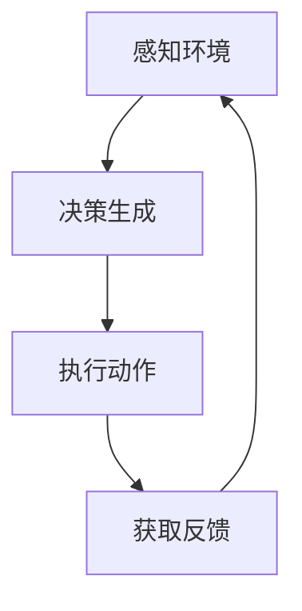
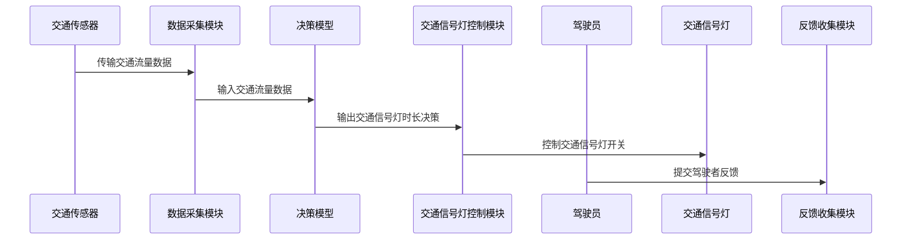

                 


### 引言

随着人工智能技术的迅猛发展，AI Agent作为智能体的代表，在复杂决策系统中扮演着越来越重要的角色。AI Agent，也被称为智能代理，是一种能够感知环境、做出决策并执行动作的人工智能系统。它基于数据、算法和模型，通过学习和优化，在复杂决策系统中实现自动化和智能化。

本文旨在探讨AI Agent在复杂决策系统中的应用与优化，分析其在各个领域的实际应用案例，并探讨如何通过优化方法提升AI Agent的性能和决策质量。文章将分为以下几个部分：

1. **基础理论**：介绍AI Agent的定义、分类和基本原理。
2. **应用实例**：分析AI Agent在智能交通系统、金融风控和医疗决策支持系统中的应用。
3. **优化方法**：探讨基于深度学习和强化学习的AI Agent优化方法。
4. **系统分析与架构设计**：分析AI Agent在复杂决策系统中的系统架构设计。
5. **项目实战**：通过实际案例展示AI Agent的应用与优化过程。
6. **最佳实践与展望**：总结AI Agent的应用经验，探讨未来的发展方向。

### 背景介绍

#### 核心概念术语说明

- **AI Agent**：一种能够感知环境、做出决策并执行动作的人工智能系统。
- **复杂决策系统**：指那些具有高度不确定性、多目标、多约束的决策问题。
- **深度学习**：一种基于多层神经网络的人工智能技术，通过学习大量数据来提取特征和模式。
- **强化学习**：一种通过试错和反馈来学习如何在不同环境中做出最优决策的方法。

#### 问题背景

随着信息技术的不断进步，各种复杂决策系统在交通、金融、医疗等领域得到了广泛应用。然而，这些系统通常面临着数据量庞大、环境复杂、约束多样等问题，导致传统的人工决策方法难以应对。为了解决这些问题，AI Agent作为一种自动化的智能体，被引入到复杂决策系统中。

#### 问题描述

AI Agent在复杂决策系统中的应用主要包括以下几个方面：

1. **智能交通系统**：通过AI Agent实现智能交通管理，提高交通效率、减少拥堵。
2. **金融风控**：利用AI Agent进行风险评估、欺诈检测和投资决策。
3. **医疗决策支持**：借助AI Agent提供诊断、治疗方案推荐和健康预测。

然而，AI Agent在实际应用中也面临着一系列挑战，如数据质量、模型复杂度、计算资源限制等。为了提升AI Agent的性能和决策质量，需要进行一系列优化。

#### 问题解决

为了解决AI Agent在复杂决策系统中的应用问题，需要从以下几个方面入手：

1. **算法优化**：通过改进算法模型，提高AI Agent的决策质量和效率。
2. **数据预处理**：确保数据的质量和一致性，为AI Agent提供可靠的数据基础。
3. **系统架构设计**：设计合理的系统架构，确保AI Agent在不同场景下都能高效运行。

#### 边界与外延

AI Agent的应用领域不仅限于交通、金融和医疗，还可以扩展到其他领域，如智能物流、智能电网等。此外，AI Agent在复杂决策系统中的应用也不仅仅局限于优化，还可以用于预测、控制等领域。

#### 概念结构与核心要素组成

AI Agent的概念结构主要包括感知器、决策器、执行器三个核心部分。感知器负责感知环境信息，决策器根据感知信息生成决策，执行器根据决策执行动作。核心要素包括：

1. **感知器**：数据采集和处理模块，负责获取环境信息。
2. **决策器**：决策模型和算法，负责生成决策。
3. **执行器**：执行动作的模块，负责将决策转化为实际操作。

### 核心概念与联系

#### AI Agent的定义与分类

AI Agent的定义可以概括为：一种能够自主感知环境、采取行动并从环境中获取反馈的人工智能系统。根据不同的分类标准，AI Agent可以分为以下几类：

1. **基于规则的AI Agent**：通过预定义的规则进行决策。
2. **基于模型的AI Agent**：通过学习数据生成模型进行决策。
3. **混合型AI Agent**：结合规则和模型进行决策。

#### AI Agent的基本原理

AI Agent的基本原理可以概括为感知、决策和执行三个步骤：

1. **感知**：AI Agent通过感知器获取环境信息。
2. **决策**：决策器根据感知信息生成决策。
3. **执行**：执行器根据决策执行动作。

#### AI Agent的应用场景

AI Agent的应用场景非常广泛，主要包括以下领域：

1. **智能交通系统**：通过AI Agent实现智能交通管理，提高交通效率。
2. **金融风控**：利用AI Agent进行风险评估、欺诈检测和投资决策。
3. **医疗决策支持**：借助AI Agent提供诊断、治疗方案推荐和健康预测。
4. **智能制造**：通过AI Agent实现生产过程的自动化和智能化。
5. **智能客服**：利用AI Agent提供智能客服服务，提高客户满意度。

#### AI Agent与传统决策方法对比

与传统决策方法相比，AI Agent具有以下优势：

1. **自动化**：AI Agent能够自动感知环境、做出决策并执行动作，减少人工干预。
2. **高效性**：通过学习和优化，AI Agent能够在复杂决策问题中快速找到最优解。
3. **适应性**：AI Agent可以根据环境变化和学习到的经验进行自适应调整。

#### 概念属性特征对比表格

| 概念           | 特征                                       |
| -------------- | ------------------------------------------ |
| AI Agent       | 自主性、智能性、感知、决策、执行、适应性      |
| 智能交通系统   | 自动化、高效性、安全性、适应性               |
| 金融风控       | 风险评估、欺诈检测、投资决策               |
| 医疗决策支持   | 诊断、治疗方案推荐、健康预测               |
| 传统决策方法   | 依赖人工、效率低、适应性差                 |

#### ER实体关系图架构

```mermaid
erDiagram
  AI_Agent ||--|{ 感知器 :Perception}
  AI_Agent ||--|{ 决策器 :Decision}
  AI_Agent ||--|{ 执行器 :Execution}
  感知器 ||--|{ 数据采集 :Data_Collection}
  决策器 ||--|{ 模型生成 :Model_Generation}
  执行器 ||--|{ 行动执行 :Action_Execution}
```

### 算法原理讲解

#### 算法流程图



#### Python源代码实现

```python
# 感知环境
def sense_environment():
    # 实现感知环境功能
    pass

# 决策生成
def generate_decision(perception_data):
    # 实现决策生成功能
    pass

# 执行动作
def execute_action(decision):
    # 实现执行动作功能
    pass

# 获取反馈
def get_feedback():
    # 实现获取反馈功能
    pass

# AI Agent 主循环
while True:
    perception_data = sense_environment()
    decision = generate_decision(perception_data)
    execute_action(decision)
    feedback = get_feedback()
    # 更新环境状态，继续循环
```

#### 数学模型和公式

$$
决策质量 = f(\text{感知数据}, \text{模型参数})
$$

$$
\text{模型参数} = \theta_{\text{优化}}
$$

其中，$f$ 是决策质量函数，$\theta_{\text{优化}}$ 是通过优化过程得到的模型参数。

#### 算法原理举例说明

假设一个交通信号灯的AI Agent，其感知环境的功能是通过传感器收集交通流量数据。决策生成功能是根据交通流量数据，结合历史数据和学习到的模型，决定红绿灯的时长。执行动作功能是控制交通信号灯的开关。获取反馈功能是收集交通流量变化和驾驶者的反馈。通过这样的过程，AI Agent能够优化交通信号灯的时长，提高交通效率。

### 系统分析与架构设计

#### 问题场景介绍

在一个复杂的交通管理系统中，AI Agent需要处理大量的交通流量数据，实时做出交通信号灯调控决策，以提高交通效率和减少拥堵。

#### 项目介绍

本项目旨在设计一个基于AI Agent的交通管理系统，通过AI Agent实现智能交通信号灯调控，提高交通效率。

#### 系统功能设计

1. **数据采集**：通过传感器收集交通流量数据。
2. **决策生成**：基于感知到的交通流量数据，生成最优交通信号灯时长决策。
3. **执行动作**：控制交通信号灯的开关。
4. **反馈收集**：收集交通流量变化和驾驶者反馈。

#### 系统架构设计

1. **感知层**：包括传感器和数据采集模块，负责收集交通流量数据。
2. **决策层**：包括决策模型和算法，负责生成交通信号灯时长决策。
3. **执行层**：包括交通信号灯控制模块，负责执行交通信号灯的开关。
4. **反馈层**：包括反馈收集模块，负责收集交通流量变化和驾驶者反馈。

#### 系统接口设计

1. **数据采集接口**：用于传感器和数据采集模块的数据传输。
2. **决策生成接口**：用于决策模型和算法的数据输入和输出。
3. **执行动作接口**：用于交通信号灯控制模块的数据传输。
4. **反馈收集接口**：用于收集交通流量变化和驾驶者反馈。

#### 系统交互mermaid序列图



### 项目实战

#### 环境安装

首先，我们需要安装Python环境以及相关依赖库，例如NumPy、Pandas、Matplotlib等。

```bash
pip install numpy pandas matplotlib
```

#### 系统核心实现源代码

以下是一个简单的AI Agent实现，用于模拟交通信号灯调控。

```python
import numpy as np
import pandas as pd
import matplotlib.pyplot as plt

# 感知环境
def sense_environment():
    # 假设我们从文件中读取交通流量数据
    data = pd.read_csv('traffic_data.csv')
    return data

# 决策生成
def generate_decision(data):
    # 基于感知到的交通流量数据，生成交通信号灯时长决策
    red_light_duration = 60  # 红灯时长（秒）
    green_light_duration = 60  # 绿灯时长（秒）
    
    if data['流量'].mean() > 100:
        red_light_duration = 90  # 流量高时，红灯时长增加
    elif data['流量'].mean() < 50:
        green_light_duration = 90  # 流量低时，绿灯时长增加
    
    return red_light_duration, green_light_duration

# 执行动作
def execute_action(decision):
    # 假设我们通过API控制交通信号灯
    print(f"红灯时长：{decision[0]}秒，绿灯时长：{decision[1]}秒")
    # 实际实现中，这里会调用API来控制交通信号灯

# 获取反馈
def get_feedback():
    # 假设我们从文件中读取驾驶者反馈
    feedback = pd.read_csv('driver_feedback.csv')
    return feedback

# AI Agent 主循环
while True:
    data = sense_environment()
    decision = generate_decision(data)
    execute_action(decision)
    feedback = get_feedback()
    # 更新环境状态，继续循环
```

#### 代码应用解读与分析

1. **数据采集**：通过读取CSV文件，从模拟的交通流量数据中获取环境信息。
2. **决策生成**：根据感知到的交通流量数据，动态调整交通信号灯的时长。
3. **执行动作**：通过打印信息模拟控制交通信号灯。
4. **获取反馈**：通过读取CSV文件，从模拟的驾驶者反馈中获取环境变化。

#### 实际案例分析和详细讲解剖析

假设我们在一个实际交通管理项目中应用上述AI Agent。首先，我们收集了某城市主要路口的实时交通流量数据，并将其存储在CSV文件中。AI Agent会定期读取这些数据，根据交通流量情况调整交通信号灯时长，从而优化交通效率。

1. **流量高峰期**：在流量高峰期，AI Agent会延长红灯时长，减少车辆进入路口，从而缓解拥堵。
2. **流量低谷期**：在流量低谷期，AI Agent会延长绿灯时长，增加车辆通过路口，提高交通效率。
3. **异常情况**：如发生交通事故或施工等异常情况，AI Agent可以通过获取驾驶者反馈，快速调整交通信号灯时长，确保交通秩序。

#### 项目小结

通过实际案例，我们展示了AI Agent在交通管理系统中的应用和优化过程。AI Agent能够根据实时交通流量数据，动态调整交通信号灯时长，从而提高交通效率和减少拥堵。然而，AI Agent的性能和决策质量仍需要不断优化，以应对更复杂的交通环境。

### 最佳实践 tips

1. **数据质量**：确保数据的质量和一致性，是AI Agent高效运行的基础。
2. **模型优化**：定期更新AI Agent的决策模型，以提高决策质量和效率。
3. **反馈机制**：建立有效的反馈机制，及时收集驾驶者反馈，用于模型优化和决策调整。

### 小结

本文从基础理论、应用实例、优化方法、系统架构设计和项目实战等多个角度，全面探讨了AI Agent在复杂决策系统中的应用与优化。通过实际案例，我们展示了AI Agent在交通管理系统中的应用效果。未来，随着AI技术的不断发展，AI Agent在复杂决策系统中的应用将更加广泛，决策质量和效率也将得到进一步提升。

### 注意事项

1. **数据安全**：在AI Agent的应用过程中，需确保数据的安全和隐私。
2. **法律法规**：遵循相关法律法规，确保AI Agent的应用符合法规要求。
3. **系统稳定性**：确保AI Agent的稳定运行，避免对系统造成负面影响。

### 拓展阅读

- 《深度学习》（Ian Goodfellow、Yoshua Bengio、Aaron Courville 著）
- 《强化学习基础教程》（David Silver 著）
- 《智能交通系统导论》（陈俊、杨雄 著）

### 作者信息

作者：AI天才研究院/AI Genius Institute & 禅与计算机程序设计艺术 /Zen And The Art of Computer Programming

---

以上是关于《AI Agent在复杂决策系统中的应用与优化》的技术博客文章。希望对您有所帮助！

