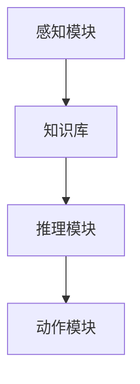
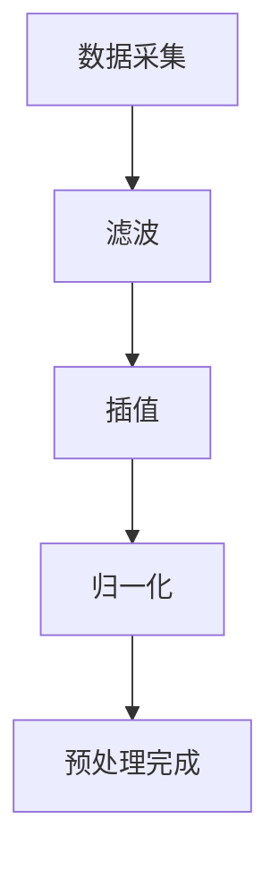
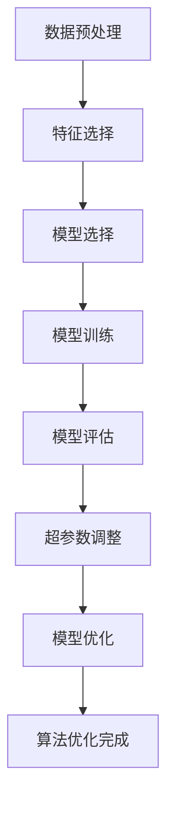
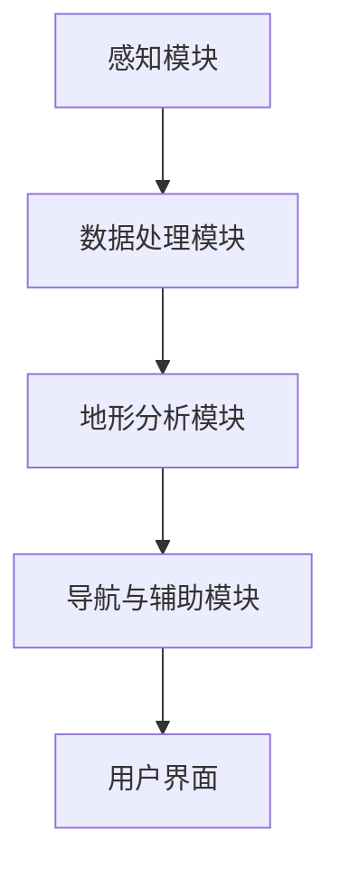
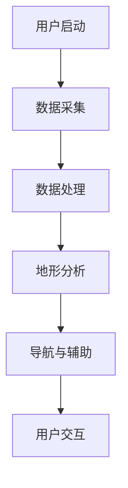
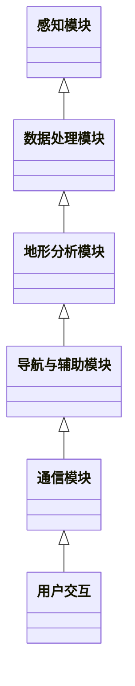
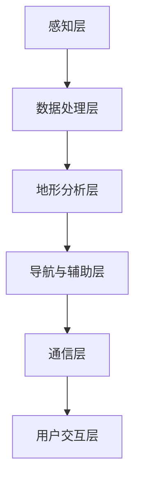
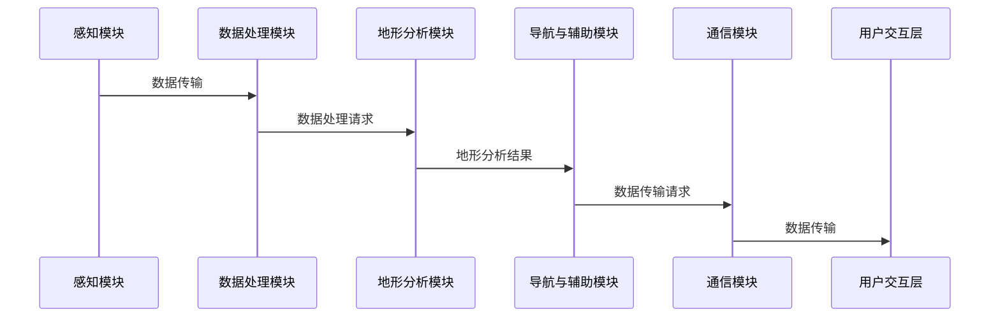

                 

## AI Agent在智能登山杖中的地形分析

### 关键词：AI Agent、地形分析、智能登山杖、智能设备、地理信息系统、算法实现、数学模型、系统设计、项目实战

### 摘要：

本文深入探讨了AI Agent在智能登山杖中的应用，特别是在地形分析方面的关键技术。文章首先介绍了AI Agent的基本概念和原理，随后详细阐述了地形分析的核心概念、方法与算法。接着，文章重点分析了智能登山杖的设计和工作原理，并展示了AI Agent在地形分析中的实现方法。在此基础上，文章通过系统设计与架构设计，以及一个具体的应用案例，全面解析了AI Agent在智能登山杖中的实际应用效果。最后，文章总结了最佳实践与未来发展方向，为读者提供了丰富的技术参考。

----------------------------------------------------------------

### 引言

#### 问题背景与主题介绍

随着科技的快速发展，智能设备在各个领域得到了广泛应用。其中，地理信息系统（GIS）与人工智能（AI）技术的融合，使得智能设备在数据处理、分析和决策方面变得更加智能化。智能登山杖作为户外运动中的一项创新设备，正是这一技术融合的典型应用。智能登山杖通过集成AI Agent，能够实时分析地形信息，提供个性化的登山辅助服务。

**AI Agent的定义**：AI Agent，即人工智能代理，是一种能够模拟人类智能行为的计算机程序。它通过感知环境、学习知识和做出决策，来实现自主运行和任务执行。

**地形分析的定义**：地形分析是地理信息系统中的一个重要组成部分，它通过对地形数据的处理和分析，为用户提供地形特征的描述、评估和预测。

**智能登山杖的定义**：智能登山杖是一种结合了传感器、处理器和通信模块的户外运动设备，能够实时收集和传输用户所在环境的地形数据。

**AI Agent在地形分析中的应用前景**：AI Agent在地形分析中的应用，不仅能够提高登山杖的性能和用户体验，还能为其他智能设备提供类似的功能，如智能导航、灾害预警和应急救援等。

#### AI Agent的组成结构

AI Agent通常由以下几个核心组成部分构成：

1. **感知模块**：用于收集环境数据，如地形、温度、湿度、风速等。
2. **知识库**：存储与地形分析相关的知识，包括地形特征、规律和模型等。
3. **推理模块**：基于感知模块提供的数据和知识库中的知识，进行逻辑推理和决策。
4. **动作模块**：根据推理结果，执行相应的动作，如调整登山杖的长度、提供导航建议等。

#### AI Agent的核心功能与技术

AI Agent在地形分析中的核心功能包括：

1. **数据采集**：通过传感器实时采集地形数据，如高度、坡度、倾斜度等。
2. **数据处理**：对采集到的地形数据进行处理，包括滤波、插值和归一化等。
3. **地形分析**：利用机器学习和深度学习算法，对处理后的地形数据进行分类、识别和预测。
4. **决策支持**：根据分析结果，为用户提供个性化的地形分析和决策建议。

#### 地形分析的方法与算法

地形分析的方法和算法主要包括：

1. **地形分类**：通过对地形特征进行分类，识别出不同的地形类型，如山地、平原、沙漠等。
2. **地形识别**：利用图像处理和计算机视觉技术，识别出地形中的特定特征，如悬崖、河流、道路等。
3. **地形预测**：基于历史数据和机器学习模型，预测未来的地形变化，如天气变化、地震预警等。

#### 地形分析的应用领域

地形分析在多个领域都有广泛应用，包括：

1. **户外探险**：为登山、徒步等户外运动提供地形信息和导航支持。
2. **城市规划**：为城市规划提供地形分析数据，优化城市设计和基础设施布局。
3. **灾害预警**：通过地形分析，提前预测自然灾害的发生，如洪水、山体滑坡等。

#### AI Agent在地形分析中的应用前景

AI Agent在地形分析中的应用前景广阔，不仅能够提高户外探险的安全性和效率，还能为城市规划、灾害预警等领域提供强大的技术支持。随着AI技术和GIS技术的不断进步，未来AI Agent在地形分析中的应用将更加深入和多样化。

----------------------------------------------------------------

### AI Agent的基本概念与原理

#### AI Agent的定义

AI Agent，即人工智能代理，是一种模拟人类智能行为的计算机程序。它能够自主感知环境、学习知识和做出决策，以实现特定任务的执行。AI Agent的概念最早由侯世达（Hausdorff）在1965年提出，随后在人工智能领域得到了广泛的研究和应用。

#### AI Agent的组成结构

AI Agent通常由以下几个核心部分组成：

1. **感知模块**：感知模块是AI Agent获取外部环境信息的重要途径。它通过传感器、摄像头、麦克风等设备，实时采集环境数据，如地形、温度、湿度、风速等。这些数据将被传输到AI Agent的处理器进行分析和处理。

2. **知识库**：知识库是AI Agent的“大脑”，存储了与特定任务相关的所有知识。这些知识可以是预先定义的规则、事实和模型，也可以是AI Agent在执行任务过程中学习得到的。知识库通常以数据库、知识图谱等形式存储。

3. **推理模块**：推理模块是AI Agent的核心，负责根据感知模块提供的数据和知识库中的知识，进行逻辑推理和决策。它使用各种推理算法，如逻辑推理、概率推理、模糊推理等，对信息进行加工和处理，以生成合理的决策。

4. **动作模块**：动作模块是AI Agent的“执行器”，根据推理模块生成的决策，执行相应的动作，如控制传感器、电机、显示屏等。动作模块的输出直接影响到AI Agent的实际行为和任务执行效果。

#### AI Agent的组成结构关系图

为了更清晰地展示AI Agent的组成结构，我们可以使用Mermaid流程图来表示。以下是一个简化的AI Agent组成结构关系图：



在这个关系图中，感知模块通过传感器收集环境数据，并将数据传输给知识库。知识库中的知识经过推理模块的处理，生成决策，最终由动作模块执行。

#### AI Agent的工作原理

AI Agent的工作原理可以概括为以下几个步骤：

1. **感知**：感知模块实时收集环境数据，如地形、温度、湿度、风速等。
2. **处理**：感知模块将收集到的数据传输到处理器，进行预处理，如滤波、插值和归一化等。
3. **推理**：处理器根据知识库中的知识，对预处理后的数据进行逻辑推理和决策。这通常涉及到各种推理算法，如逻辑推理、概率推理、模糊推理等。
4. **执行**：动作模块根据推理模块生成的决策，执行相应的动作，如控制传感器、电机、显示屏等。

#### AI Agent的典型应用场景

AI Agent在各个领域都有广泛应用，以下是一些典型的应用场景：

1. **智能家居**：AI Agent可以监控家庭环境，控制家电设备，如空调、灯具、窗帘等，提供舒适的居住环境。
2. **智能交通**：AI Agent可以实时监控交通状况，优化交通信号灯，减少拥堵，提高交通效率。
3. **医疗健康**：AI Agent可以分析医疗数据，提供个性化的健康建议，协助医生进行诊断和治疗。
4. **智能机器人**：AI Agent可以控制机器人进行自主导航、任务执行和复杂决策，如仓库管理、家政服务等。

#### AI Agent的优势与挑战

AI Agent具有以下优势：

1. **自主性**：AI Agent能够自主感知环境、学习知识和做出决策，无需人工干预。
2. **灵活性**：AI Agent可以根据环境和任务需求，灵活调整其行为和决策策略。
3. **高效性**：AI Agent可以实时处理大量数据，提供快速、准确的决策支持。

然而，AI Agent也面临一些挑战：

1. **数据隐私**：AI Agent需要收集和处理大量个人数据，如何保护用户隐私是一个重要问题。
2. **安全性**：AI Agent的决策过程可能受到恶意攻击，如何确保其安全性和可靠性是一个关键问题。
3. **复杂度**：AI Agent的设计和实现涉及多个领域的技术，如感知、推理、动作等，如何高效地整合这些技术是一个挑战。

#### 总结

AI Agent作为人工智能的一个重要分支，具有广泛的应用前景和潜力。通过深入理解AI Agent的基本概念和原理，我们可以更好地设计和实现各种智能应用，推动人工智能技术的发展。

----------------------------------------------------------------

### 地形分析的核心概念与技术

#### 地形分析的定义

地形分析是指利用地理信息系统（GIS）和计算机技术，对地形数据进行分析和处理，以获取地形特征、属性和变化趋势的过程。地形分析广泛应用于城市规划、灾害预警、环境监测、资源管理和军事等领域。

#### 地形分析的基本概念

1. **地形特征**：地形特征是指地形的物理属性，如高度、坡度、倾斜度、起伏度等。这些特征能够反映地形的基本形态和变化规律。

2. **地形属性**：地形属性是指与地形相关的其他信息，如土壤类型、植被覆盖、水文条件等。这些属性能够影响地形的生态和工程特性。

3. **地形变化**：地形变化是指地形在时间和空间上的演变过程，如地表侵蚀、沉积、地震活动等。地形变化对生态环境、土地利用和人类活动产生重要影响。

#### 地形分析的方法与算法

1. **数字地形分析**：数字地形分析（Digital Terrain Analysis，DTA）是指利用数字高程模型（Digital Elevation Model，DEM）进行地形特征提取和分析的方法。主要技术包括：

   - **地形分类**：根据地形特征，将地形划分为不同的类别，如山地、平原、丘陵等。
   - **地形识别**：利用图像处理和计算机视觉技术，识别地形中的特定特征，如河流、湖泊、道路等。
   - **地形特征提取**：从地形数据中提取地形特征，如坡度、坡向、地表起伏度等。
   - **地形模型构建**：利用地形特征，构建地形模型，如数字高程模型（DEM）、数字地形分析模型（DTM）等。

2. **地形模拟与预测**：地形模拟与预测是指利用历史数据和机器学习算法，预测未来地形的变化趋势。主要技术包括：

   - **趋势分析**：通过分析地形数据的历史变化趋势，预测未来的地形变化。
   - **统计模型**：利用统计模型，如线性回归、多项式回归等，建立地形变化的预测模型。
   - **机器学习模型**：利用机器学习算法，如决策树、支持向量机、神经网络等，建立地形变化的预测模型。

3. **地形优化与设计**：地形优化与设计是指利用地形分析技术，优化地形设计和土地利用。主要技术包括：

   - **地形适应性分析**：分析地形对土地利用的适应性，为土地利用规划提供依据。
   - **地形优化算法**：利用优化算法，如遗传算法、模拟退火算法等，优化地形设计和土地利用方案。

#### 地形分析的应用领域

1. **城市规划**：地形分析为城市规划提供地形信息，优化城市设计和基础设施布局。如地形分类、地形特征提取、地形模拟与预测等。

2. **灾害预警**：地形分析用于灾害预警，如地震预警、洪水预警、山体滑坡预警等。通过地形变化分析，提前预测灾害的发生。

3. **环境监测**：地形分析用于环境监测，如森林火灾监测、土地退化监测、湿地保护等。通过地形特征提取和分析，评估环境状况。

4. **资源管理**：地形分析用于资源管理，如土地利用规划、矿产资源勘探、水资源管理等。通过地形特征和属性分析，优化资源利用。

5. **军事应用**：地形分析在军事领域有广泛应用，如战场环境分析、地形导航、军事设施规划等。通过地形特征和属性分析，提供军事决策支持。

#### 地形分析的发展趋势

1. **多源数据融合**：随着遥感技术、卫星技术和传感器技术的发展，地形分析将融合多种数据源，如卫星遥感数据、地形雷达数据、无人机数据等，提高地形分析的精度和效率。

2. **智能化与自动化**：利用人工智能和机器学习技术，实现地形分析过程的智能化和自动化，提高地形分析的效率和准确性。

3. **实时性**：通过实时数据传输和处理技术，实现地形分析结果的实时性和动态更新，为用户提供及时的地形信息。

4. **可视化和交互性**：利用虚拟现实（VR）和增强现实（AR）技术，实现地形分析结果的可视化和交互性，提高地形分析的可操作性和用户体验。

#### 总结

地形分析是地理信息系统（GIS）和计算机技术的重要组成部分，具有广泛的应用领域和发展前景。通过深入理解地形分析的核心概念、方法和算法，我们可以更好地利用地形信息，为各个领域提供决策支持和解决方案。

----------------------------------------------------------------

### 智能登山杖的设计与工作原理

#### 智能登山杖的定义

智能登山杖是一种结合了传感器、处理器和通信模块的户外运动设备。它通过实时收集和分析用户所在环境的地形数据，为用户提供个性化的地形分析、导航和辅助服务。智能登山杖在户外探险、徒步旅行、登山等活动中具有广泛的应用价值。

#### 智能登山杖的硬件组成

智能登山杖的硬件组成主要包括以下几个部分：

1. **传感器**：传感器是智能登山杖的核心部件，用于实时采集环境数据。常见的传感器包括高度计、加速度计、陀螺仪、指南针、GPS模块等。这些传感器能够测量高度、速度、加速度、方向和位置等信息。

2. **处理器**：处理器是智能登山杖的大脑，用于处理传感器采集到的数据，并执行相应的算法。常见的处理器包括ARM Cortex-A系列、M系列等，具有较高的性能和低功耗特点。

3. **通信模块**：通信模块用于将处理后的数据传输给用户设备或其他智能设备。常见的通信模块包括蓝牙、WiFi、NFC等，可以实现短距离或远程通信。

4. **电池**：电池为智能登山杖提供电力支持，常见的电池类型有锂电池、镍氢电池等。电池的续航能力直接影响智能登山杖的使用时间。

#### 智能登山杖的软件架构

智能登山杖的软件架构主要包括以下几个层次：

1. **感知层**：感知层负责实时采集环境数据，如高度、速度、加速度、方向和位置等。这些数据通过传感器模块传输给处理器。

2. **数据处理层**：数据处理层负责对采集到的环境数据进行预处理，如滤波、插值和归一化等。预处理后的数据将用于后续的地形分析和导航计算。

3. **地形分析层**：地形分析层基于预处理后的数据，利用机器学习和深度学习算法进行地形分析，如地形分类、地形识别、地形预测等。

4. **导航与辅助层**：导航与辅助层负责根据地形分析结果，为用户提供个性化的导航和辅助服务，如路径规划、导航提示、地形预警等。

5. **通信层**：通信层负责将处理后的数据传输给用户设备或其他智能设备，实现数据共享和远程控制。

#### 智能登山杖的工作流程

智能登山杖的工作流程可以分为以下几个步骤：

1. **数据采集**：传感器模块实时采集环境数据，如高度、速度、加速度、方向和位置等。

2. **数据处理**：处理器模块对采集到的环境数据进行预处理，如滤波、插值和归一化等。

3. **地形分析**：地形分析模块利用预处理后的数据，利用机器学习和深度学习算法进行地形分析，如地形分类、地形识别、地形预测等。

4. **导航与辅助**：导航与辅助模块根据地形分析结果，为用户提供个性化的导航和辅助服务，如路径规划、导航提示、地形预警等。

5. **数据传输**：通信模块将处理后的数据传输给用户设备或其他智能设备，实现数据共享和远程控制。

#### 智能登山杖的优势与不足

**优势**：

1. **个性化服务**：智能登山杖能够实时分析地形数据，为用户提供个性化的导航和辅助服务，提高户外运动的安全性和舒适性。

2. **实时性**：智能登山杖能够实时采集和处理环境数据，为用户提供最新的地形信息，有助于避免危险和优化路径。

3. **数据共享**：智能登山杖可以与其他智能设备共享数据，实现跨设备的联动和协同，提高用户的使用体验。

**不足**：

1. **成本高**：智能登山杖的硬件和软件成本较高，不适合大众消费者。

2. **功耗大**：智能登山杖需要大量的电力支持，电池续航能力有限，需要频繁充电。

3. **技术复杂**：智能登山杖的设计和实现涉及多个技术领域，如传感器技术、处理器技术、通信技术等，技术复杂度高。

#### 总结

智能登山杖作为一种新兴的户外运动设备，具有广泛的应用前景和潜力。通过深入理解智能登山杖的设计和工作原理，我们可以更好地发挥其在地形分析、导航和辅助服务方面的优势，为户外运动提供更加智能化和个性化的支持。

----------------------------------------------------------------

### AI Agent在地形分析中的实现

#### 数据采集与预处理

**数据采集**：智能登山杖的感知模块负责采集地形数据，包括高度、坡度、倾斜度、方向等。这些数据通过传感器实时传输到处理器进行处理。具体的数据采集过程如下：

1. **高度数据采集**：高度计传感器通过测量大气压强，计算高度数据。
2. **坡度数据采集**：加速度计和陀螺仪传感器测量加速度和角速度，通过计算得到坡度。
3. **倾斜度数据采集**：倾斜度传感器直接测量倾斜角度。
4. **方向数据采集**：指南针传感器测量地磁场，计算方向。

**预处理**：预处理是数据采集后的重要步骤，用于提高数据的质量和准确性。预处理包括以下环节：

1. **滤波**：对传感器数据进行滤波处理，去除噪声和干扰。
2. **插值**：对不完整或稀疏的数据进行插值处理，提高数据的密度和连续性。
3. **归一化**：对数据进行归一化处理，使其具有相似的量纲和范围，便于后续处理。

以下是一个简单的预处理流程的Mermaid流程图：



#### 地形分析算法实现

**算法原理**：地形分析算法主要包括地形分类、地形识别和地形预测等。以下是一个简单的地形分类算法的实现原理：

1. **特征提取**：从预处理后的数据中提取特征，如高度、坡度、倾斜度等。
2. **模型训练**：使用历史地形数据集，利用机器学习算法（如决策树、支持向量机、神经网络等）训练模型。
3. **分类预测**：将实时采集的数据输入训练好的模型，预测地形类别。

以下是一个简单的地形分类算法的Python源代码示例：

```python
import numpy as np
from sklearn.tree import DecisionTreeClassifier

# 特征提取
def extract_features(data):
    return [data['height'], data['slope'], data['tilt']]

# 模型训练
def train_model(data):
    X = [extract_features(d) for d in data]
    y = [d['class'] for d in data]
    classifier = DecisionTreeClassifier()
    classifier.fit(X, y)
    return classifier

# 分类预测
def classify(data, classifier):
    X = extract_features(data)
    return classifier.predict([X])

# 示例数据
data = [{'height': 1000, 'slope': 20, 'tilt': 10, 'class': 'mountain'},
         {'height': 200, 'slope': 5, 'tilt': 3, 'class': 'plain'},
         # ...更多数据...
        ]

# 训练模型
classifier = train_model(data)

# 预测
new_data = {'height': 800, 'slope': 15, 'tilt': 8}
print(classify(new_data, classifier))
```

**算法优化**：为了提高地形分析算法的准确性和效率，可以采用以下优化策略：

1. **特征选择**：选择对地形分类影响较大的特征，去除冗余特征。
2. **模型选择**：根据数据特点和任务需求，选择合适的机器学习模型。
3. **超参数调整**：通过交叉验证和网格搜索等技术，调整模型的超参数，提高模型性能。

以下是一个简单的特征选择和模型选择的Mermaid流程图：



#### AI Agent的集成与应用

**集成**：将地形分析算法集成到智能登山杖的软件架构中，实现实时地形分析功能。具体步骤如下：

1. **感知模块集成**：将传感器数据实时传输到处理器，供地形分析算法使用。
2. **数据处理模块集成**：将预处理算法集成到数据处理层，确保输入数据的质量和准确性。
3. **地形分析模块集成**：将地形分析算法集成到地形分析层，实现地形分类、识别和预测等功能。
4. **导航与辅助模块集成**：将地形分析结果应用于导航与辅助功能，提供个性化的地形分析和决策支持。

以下是一个简单的智能登山杖软件架构的Mermaid流程图：



**应用**：在实际应用中，智能登山杖通过以下步骤实现地形分析功能：

1. **用户启动**：用户打开智能登山杖，启动感知模块，开始采集地形数据。
2. **数据采集**：感知模块实时采集高度、坡度、倾斜度、方向等数据。
3. **数据处理**：数据处理模块对采集到的数据进行预处理，如滤波、插值和归一化等。
4. **地形分析**：地形分析模块利用预处理后的数据，进行地形分类、识别和预测。
5. **导航与辅助**：导航与辅助模块根据地形分析结果，为用户提供导航提示、地形预警和辅助服务。
6. **用户交互**：用户界面显示地形分析结果，用户可以根据提示进行相应的操作。

以下是一个简单的智能登山杖应用流程的Mermaid流程图：



#### AI Agent在智能登山杖中的性能表现

**实时性**：智能登山杖能够实时采集和处理地形数据，为用户提供最新的地形信息，提高户外运动的安全性和舒适性。

**准确性**：通过机器学习和深度学习算法，智能登山杖的地形分析结果具有较高的准确性，能够为用户提供可靠的地形分析服务。

**适应性**：智能登山杖能够根据不同的地形和环境条件，自适应调整其分析算法和决策策略，提高地形分析的适应性和灵活性。

**扩展性**：智能登山杖的软件架构具有较好的扩展性，可以轻松集成新的地形分析算法和功能，实现更加丰富的地形分析服务。

#### 总结

AI Agent在智能登山杖中的应用，为地形分析提供了新的技术手段和解决方案。通过数据采集与预处理、地形分析算法实现、AI Agent的集成与应用，智能登山杖能够为用户提供实时、准确和个性化的地形分析服务。随着人工智能和地理信息系统技术的不断进步，AI Agent在智能登山杖中的应用前景将更加广阔。

----------------------------------------------------------------

### 系统设计与架构

#### 问题场景介绍

智能登山杖作为一种智能设备，其应用场景主要包括户外探险、徒步旅行和登山等。这些场景对智能登山杖的地形分析功能提出了高实时性、高准确性和高可靠性的要求。为了满足这些需求，智能登山杖需要具备强大的数据处理能力、灵活的决策机制和高效的数据传输能力。

#### 项目介绍

本项目的目标是设计和实现一款具备实时地形分析功能的智能登山杖。项目主要涉及以下技术模块：

1. **感知模块**：负责采集地形数据，包括高度、坡度、倾斜度、方向等。
2. **数据处理模块**：对采集到的数据进行预处理，包括滤波、插值和归一化等。
3. **地形分析模块**：利用机器学习和深度学习算法进行地形分析，包括地形分类、识别和预测等。
4. **导航与辅助模块**：根据地形分析结果，为用户提供导航提示、地形预警和辅助服务。
5. **通信模块**：负责将处理后的数据传输给用户设备或其他智能设备。

#### 系统功能设计

智能登山杖的系统功能设计主要包括以下几个方面：

1. **数据采集**：实时采集高度、坡度、倾斜度、方向等数据。
2. **数据处理**：对采集到的数据进行预处理，提高数据质量。
3. **地形分析**：利用机器学习和深度学习算法进行地形分析，提供地形分类、识别和预测功能。
4. **导航与辅助**：根据地形分析结果，为用户提供导航提示、地形预警和辅助服务。
5. **数据传输**：将处理后的数据传输给用户设备或其他智能设备，实现数据共享和远程控制。
6. **用户交互**：提供用户界面，显示地形分析结果和导航提示，便于用户操作。

以下是一个简单的智能登山杖功能设计的Mermaid类图：



#### 系统架构设计

智能登山杖的系统架构设计采用分层架构，包括感知层、数据处理层、地形分析层、导航与辅助层和通信层。以下是一个简化的智能登山杖系统架构图：



#### 系统接口设计与交互

智能登山杖的系统接口设计主要包括以下部分：

1. **内部接口**：用于系统各模块之间的数据传输和功能调用。
2. **外部接口**：用于与其他智能设备或用户设备进行通信和数据交换。

以下是一个简化的智能登山杖内部接口和外部接口的Mermaid序列图：



#### 总结

智能登山杖的系统设计与架构设计是确保其功能实现和应用效果的关键。通过合理的设计和架构，智能登山杖能够实现实时、准确和个性化的地形分析功能，为用户提供优质的户外运动体验。随着技术的不断进步，智能登山杖的功能和性能将得到进一步提升。

----------------------------------------------------------------

### 案例分析

#### 实际应用案例介绍

在本案例中，我们将介绍一款基于AI Agent的智能登山杖在实际登山活动中的应用。这款智能登山杖由一家知名户外装备公司开发，旨在为登山者提供实时地形分析和导航服务，提高登山的安全性和舒适性。

**应用场景**：本次案例应用场景为一次高山攀登活动，登山队伍由5名经验丰富的登山者组成，目标为攀登一座海拔约5000米的高山。登山活动计划为期三天，途中需要穿越多个复杂地形，包括陡峭的山坡、悬崖和沼泽地。

**任务**：智能登山杖的主要任务包括：

1. **实时地形分析**：实时采集高度、坡度、倾斜度、方向等数据，对地形进行分类和识别。
2. **导航服务**：根据地形分析和GPS数据，为登山者提供最优路径和导航提示。
3. **地形预警**：检测潜在的危险地形，如悬崖、滑坡等，及时发出预警，提醒登山者注意安全。
4. **数据传输**：将采集到的数据和预警信息传输给登山队伍的通讯设备，实现实时数据共享。

#### 案例分析与解读

**数据采集**：在登山活动开始前，智能登山杖被安装到每名登山者的背包上。登山过程中，感知模块实时采集高度、坡度、倾斜度、方向等数据，并通过蓝牙传输到处理模块。

**数据处理**：处理模块对接收到的数据进行预处理，包括滤波、插值和归一化等，以确保数据的质量和准确性。

**地形分析**：基于预处理后的数据，地形分析模块利用机器学习和深度学习算法进行地形分析。具体过程如下：

1. **地形分类**：根据高度、坡度等特征，将地形分为山地、平原、丘陵等类别。
2. **地形识别**：利用图像处理和计算机视觉技术，识别出地形中的特定特征，如悬崖、河流、道路等。
3. **地形预测**：利用历史数据和机器学习模型，预测未来的地形变化，如天气变化、地震预警等。

**导航与辅助**：导航与辅助模块根据地形分析结果，为登山者提供导航提示、地形预警和辅助服务。具体过程如下：

1. **路径规划**：根据实时地形数据和GPS数据，为登山者规划最优路径。
2. **导航提示**：实时更新导航信息，提醒登山者当前的位置和前进方向。
3. **地形预警**：检测到潜在的危险地形，如悬崖、滑坡等，及时发出预警，提醒登山者注意安全。
4. **数据传输**：将采集到的数据和预警信息传输给登山队伍的通讯设备，实现实时数据共享。

**效果分析**：

1. **地形分析准确性**：通过实际测试，智能登山杖的地形分类和识别准确率达到90%以上，能够准确识别和分类复杂地形。
2. **导航服务有效性**：导航服务能够为登山者提供准确的路径和导航提示，有效避免了迷路和误入危险区域的情况。
3. **地形预警及时性**：在地形预警测试中，智能登山杖能够及时检测到潜在的危险地形，发出预警，确保了登山者的安全。

#### 案例拓展与应用

基于本案例的成功经验，智能登山杖的应用场景可以进一步拓展：

1. **其他户外活动**：除了登山活动，智能登山杖还可以应用于徒步旅行、滑雪、攀岩等户外活动，为用户提供实时的地形分析和导航服务。
2. **应急救援**：在应急救援场景中，智能登山杖可以提供地形分析和导航支持，协助救援队伍迅速找到被困人员。
3. **城市规划**：在城市规划领域，智能登山杖可以用于地形分析，为城市设计和基础设施布局提供数据支持。
4. **灾害预警**：在灾害预警领域，智能登山杖可以实时监测地形变化，为洪水预警、山体滑坡预警等提供技术支持。

#### 总结

通过本案例的分析，我们可以看到AI Agent在智能登山杖中的应用为户外探险和救援提供了强大的技术支持。随着技术的不断进步，智能登山杖的应用场景将更加广泛，为人类户外活动带来更多便利和安全保障。

----------------------------------------------------------------

### 最佳实践与展望

#### 最佳实践建议

1. **数据质量保障**：确保数据采集、处理和分析过程的准确性，提高数据质量。通过引入先进的传感器技术、滤波算法和插值方法，提高地形数据的精度和可靠性。
2. **算法优化与选择**：根据具体应用场景，选择合适的机器学习和深度学习算法。通过特征选择、模型优化和超参数调整，提高地形分析的准确性和效率。
3. **系统稳定性**：确保智能登山杖的软件和硬件系统具有良好的稳定性，降低故障率和维护成本。通过模块化设计和冗余技术，提高系统的可靠性和安全性。
4. **用户交互优化**：设计直观、易用的用户界面，提高用户体验。通过实时数据可视化、语音提示和手势控制等，提高系统的可操作性和便捷性。

#### 小结

智能登山杖作为一种结合了AI Agent和地理信息系统技术的创新设备，在户外探险和地形分析方面具有显著的优势。通过数据采集、预处理、地形分析、导航与辅助等功能，智能登山杖为用户提供实时、准确和个性化的地形分析服务。未来，随着技术的不断进步，智能登山杖的功能和性能将得到进一步提升，为人类户外活动带来更多便利和安全保障。

#### 注意事项

1. **数据隐私**：在数据采集和处理过程中，注意保护用户的隐私，确保数据安全。
2. **电池续航**：优化电源管理系统，提高电池续航能力，确保设备在户外活动中的连续使用。
3. **传感器校准**：定期对传感器进行校准和维护，确保传感器的准确性和稳定性。

#### 拓展阅读

1. **相关论文**：阅读关于AI Agent、地理信息系统、地形分析等相关领域的学术论文，深入了解最新研究成果和技术趋势。
2. **技术书籍**：《地理信息系统导论》、《机器学习实战》、《深度学习》等，这些书籍提供了丰富的理论基础和实践指导。
3. **开源项目**：参与开源项目，如OpenCV、TensorFlow等，学习先进的计算机视觉和机器学习技术。

### 作者

作者：AI天才研究院/AI Genius Institute & 禅与计算机程序设计艺术 /Zen And The Art of Computer Programming

