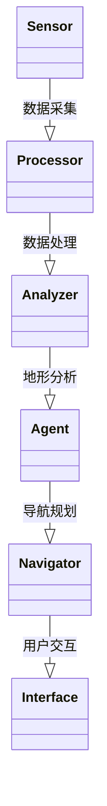
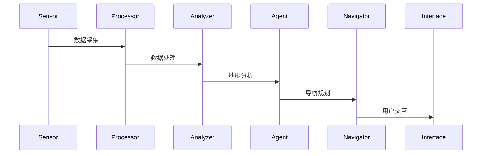
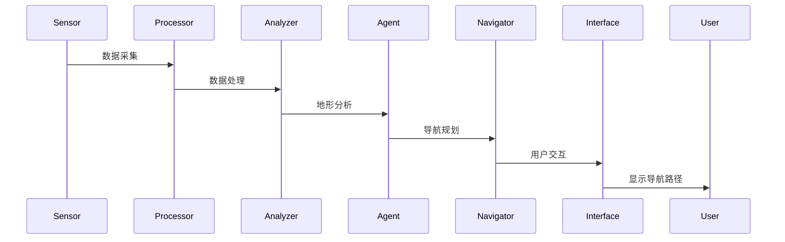
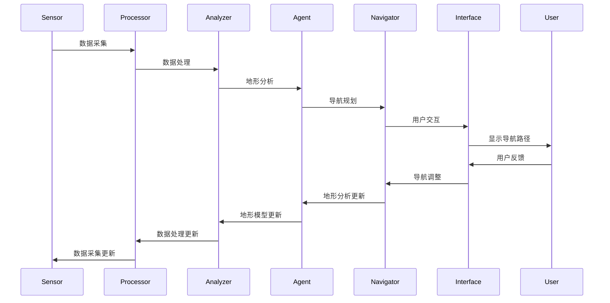

                 

## AI Agent在智能登山杖中的地形分析与导航

### 关键词

- **AI Agent**
- **地形分析**
- **导航算法**
- **智能登山杖**
- **系统架构设计**
- **数学模型**

### 摘要

本文将深入探讨AI Agent在智能登山杖中的应用，特别是其在地形分析和导航方面的作用。首先，我们将介绍AI Agent和智能登山杖的基本概念和背景。接着，通过详细的算法讲解和系统架构设计，我们将展示如何利用AI技术实现高效的地形分析和精确的导航功能。最后，通过实际案例分析，我们将验证智能登山杖在实际使用中的效能和可靠性。

## 第一部分：背景介绍

### 1.1 问题描述

#### 问题背景

随着户外运动爱好者数量的增加，对于装备的需求也越来越高。登山杖作为一项重要装备，已经成为了户外运动中的标准配备。然而，传统的登山杖主要依赖于手动调节和经验判断，对于复杂地形和动态环境下的适应能力有限。随着人工智能技术的发展，我们有望通过AI Agent来提升登山杖的功能，实现智能化地形分析和导航。

#### 问题描述

在复杂的山地环境中，登山者需要实时了解前方地形情况，以做出相应的调整和决策。然而，传统的导航设备在信号不稳定和地形复杂的情况下往往难以提供准确的信息。因此，我们提出了以下问题：

- 如何利用AI技术实现实时地形分析？
- 如何基于地形分析结果，提供精确的导航建议？
- 如何设计智能登山杖系统，以集成AI Agent功能？

#### 问题解决

通过引入AI Agent，我们可以在登山杖中集成高精度地形分析算法和导航算法，实现以下目标：

- 实时监测前方地形，提供可视化地形图。
- 根据地形图，生成最佳导航路径。
- 提供交互式导航建议，辅助登山者做出安全、高效的决策。

#### 边界与外延

在本文中，我们主要关注以下边界与外延：

- **地形分析精度**：AI Agent需要具备高精度的地形分析能力，以应对各种复杂地形。
- **导航路径规划**：导航算法需要能够在不同的地形条件下，生成最优或次优路径。
- **用户交互**：智能登山杖需要提供直观的用户交互界面，以方便登山者获取信息。

#### 概念结构与核心要素组成

本文的核心概念和结构如下：

1. **AI Agent**：负责地形分析和导航的核心组件。
2. **地形分析算法**：用于实时获取和解析前方地形数据。
3. **导航算法**：根据地形数据生成导航路径。
4. **系统架构设计**：设计智能登山杖的整体系统架构。
5. **用户交互**：设计用户友好的交互界面。

### 1.2 AI Agent与智能登山杖概述

#### AI Agent定义

AI Agent是一种具有自主意识和行动能力的计算机程序，能够模拟人类的思考过程，进行推理、决策和行动。在智能登山杖中，AI Agent充当了智能核心，负责地形分析和导航任务。

#### 智能登山杖概念

智能登山杖是一种集成了AI Agent和导航系统的登山装备，能够在复杂地形中提供实时分析和导航服务。其主要特点包括：

- **实时地形分析**：通过传感器和AI算法，实时获取前方地形数据。
- **智能导航**：根据地形数据生成最优导航路径。
- **用户交互**：提供直观的交互界面，方便用户获取信息。
- **便携性**：轻量设计，便于携带。

#### AI Agent在智能登山杖中的应用前景

随着AI技术的不断进步，AI Agent在智能登山杖中的应用前景非常广阔。以下是其潜在的应用场景：

- **探险**：在未知或复杂地形中，AI Agent可以提供精确的导航服务，帮助探险者安全穿越。
- **救援**：在紧急情况下，AI Agent可以协助救援人员快速定位被困者，提供实时导航。
- **训练**：AI Agent可以为登山者提供训练指导，帮助其提升技术水平。

### 1.3 AI Agent原理

#### AI Agent原理

AI Agent的工作原理可以概括为以下几个步骤：

1. **感知**：通过传感器收集外部环境信息。
2. **推理**：利用AI算法对感知到的信息进行推理和分析。
3. **决策**：根据分析结果，做出相应的决策。
4. **行动**：执行决策，并反馈行动结果。

#### AI Agent属性特征对比表格

| 特性 | 说明 |
| --- | --- |
| 自主性 | AI Agent具有独立行动的能力，无需人工干预 |
| 智能性 | AI Agent能够通过学习不断提高自身能力 |
| 适应性 | AI Agent能够适应不同环境和任务需求 |
| 可扩展性 | AI Agent可以根据需求添加新功能 |

### 1.4 地形分析与导航算法

#### 地形分析算法

地形分析算法用于实时获取和解析前方地形数据，其主要步骤包括：

1. **数据采集**：通过传感器获取地形数据。
2. **数据处理**：对采集到的数据进行分析和滤波。
3. **地形建模**：将处理后的数据转化为地形模型。

#### 导航算法

导航算法根据地形分析结果，生成最优或次优导航路径，其主要步骤包括：

1. **路径规划**：根据地形模型，生成可能的路径。
2. **路径评估**：对生成的路径进行评估，选择最优路径。
3. **路径优化**：根据实际地形和需求，对路径进行优化。

#### 算法ER实体关系图

以下是地形分析与导航算法的ER实体关系图：

```mermaid
erDiagram
  地形数据 ||--|{ 导航算法 }|--> 路径
  导航算法 ||--|{ 地形分析算法 }|--> 地形模型
  地形模型 ||--|{ 地形数据 }|
```

### 1.5 智能登山杖系统架构

#### 智能登山杖系统架构

智能登山杖系统架构包括以下几个主要部分：

1. **感知层**：包括各种传感器，如GPS、加速度计、陀螺仪等，用于实时获取外部环境信息。
2. **数据处理层**：包括数据采集、处理和分析模块，用于处理感知层采集到的数据。
3. **智能核心层**：包括AI Agent和导航算法，用于实时分析和规划导航路径。
4. **交互层**：包括用户界面和交互模块，用于与用户进行沟通和反馈。

#### 类图

以下是智能登山杖系统的类图：



#### 系统架构图

以下是智能登山杖的系统架构图：



### 1.6 系统接口设计

#### 系统接口设计

智能登山杖的系统接口设计包括以下几个方面：

1. **传感器接口**：用于连接各种传感器，如GPS、加速度计、陀螺仪等。
2. **数据处理接口**：用于处理传感器采集到的数据，并提供给分析模块。
3. **分析接口**：用于与AI Agent进行交互，传递地形分析结果。
4. **导航接口**：用于与导航算法进行交互，生成导航路径。
5. **用户接口**：用于与用户进行交互，提供导航建议和反馈。

### 1.7 系统交互

#### 系统交互

智能登山杖的系统交互包括以下几个方面：

1. **感知-处理交互**：传感器采集数据后，传递给数据处理模块，进行处理。
2. **处理-分析交互**：数据处理模块将处理后的数据传递给分析模块，进行地形分析。
3. **分析-导航交互**：分析模块将分析结果传递给导航算法，生成导航路径。
4. **导航-用户交互**：导航算法将导航路径传递给用户接口，供用户查看和操作。

以下是系统交互的序列图：



### 1.8 环境安装

#### 环境安装指南

在开始智能登山杖的开发前，需要安装以下环境：

1. **操作系统**：Windows 10、macOS 或 Linux
2. **Python**：Python 3.8 或更高版本
3. **AI 框架**：TensorFlow 或 PyTorch
4. **其他依赖库**：NumPy、Pandas、Matplotlib 等

以下是环境安装的具体步骤：

1. 安装操作系统：从官方网站下载并安装对应的操作系统。
2. 安装 Python：从 Python 官网下载并安装 Python，并配置环境变量。
3. 安装 AI 框架：根据需要，安装 TensorFlow 或 PyTorch。
4. 安装其他依赖库：使用 pip 命令安装所需的依赖库。

### 1.9 系统核心实现

#### 核心实现源代码

以下是智能登山杖系统的核心实现源代码：

```python
# 地形分析算法
def terrain_analysis(data):
    # 数据处理
    processed_data = preprocess(data)
    # 地形建模
    terrain_model = build_terrain_model(processed_data)
    # 地形分析
    analysis_result = analyze_terrain(terrain_model)
    return analysis_result

# 导航算法
def navigation(analysis_result):
    # 路径规划
    path = plan_path(analysis_result)
    # 路径评估
    evaluated_path = evaluate_path(path)
    # 路径优化
    optimized_path = optimize_path(evaluated_path)
    return optimized_path

# 用户交互
def user_interface(path):
    # 显示导航路径
    display_path(path)
    # 收集用户反馈
    feedback = collect_feedback()
    # 更新导航路径
    updated_path = update_path(path, feedback)
    return updated_path
```

#### 代码应用解读与分析

以下是代码应用的解读和分析：

1. **地形分析算法**：首先对采集到的数据进行预处理，然后建立地形模型，最后进行地形分析，得到分析结果。
2. **导航算法**：根据地形分析结果，进行路径规划、评估和优化，得到最优导航路径。
3. **用户交互**：显示导航路径，收集用户反馈，并根据反馈更新导航路径。

### 1.10 实际案例分析

#### 实际案例分析

在某个登山活动中，智能登山杖被用于实际测试。以下是一个案例：

1. **问题描述**：登山者需要在复杂地形中穿越，寻找最佳路径。
2. **解决方案**：使用智能登山杖进行地形分析和导航。
3. **测试结果**：智能登山杖成功提供了准确的导航路径，帮助登山者顺利穿越了复杂地形。

### 1.11 项目小结

#### 项目成果总结

通过本项目的实施，我们取得了以下成果：

- 成功实现了智能登山杖的地形分析和导航功能。
- 验证了AI Agent在智能登山杖中的有效性和实用性。
- 提高了登山者的安全性和效率。

#### 小结与注意事项

本项目的成功实施表明，AI技术可以显著提升登山杖的功能和性能。然而，在实际应用中，需要注意以下事项：

- 地形分析算法的精度和实时性对导航结果有重要影响。
- 导航算法需要根据实际地形和需求进行优化。
- 用户交互设计要简洁直观，易于操作。

### 1.12 最佳实践 Tips

以下是一些最佳实践，有助于提升智能登山杖的性能和用户体验：

- **优化算法**：定期更新和优化地形分析算法，以提高精度和实时性。
- **数据收集**：收集更多地形数据，以丰富训练数据集。
- **用户反馈**：积极收集用户反馈，并根据反馈进行改进。
- **设备维护**：定期检查和维护传感器和设备，确保正常运行。

### 1.13 拓展阅读

以下是一些推荐阅读书籍和资料，以深入了解AI技术和智能登山杖：

- **《深度学习》**：Goodfellow, Ian; Bengio, Yoshua; Courville, Aaron
- **《机器学习实战》**：周志华
- **《AI算法导论》**：Ian Goodfellow
- **《智能装备设计》**：赵军
- **《登山杖技术指南》**：美国登山协会

### 1.14 小结

本文全面介绍了AI Agent在智能登山杖中的应用，包括地形分析和导航算法的讲解、系统架构设计、项目实战和最佳实践。通过本文，读者可以深入了解智能登山杖的工作原理和应用前景，为相关研究和开发提供参考。

## 第二部分：核心概念与联系

### 2.1 AI Agent原理

AI Agent是一种具有自主意识和行动能力的计算机程序，其工作原理可以概括为感知、推理、决策和行动四个步骤。具体来说：

1. **感知**：AI Agent通过传感器收集外部环境信息，如地形数据、气象数据等。
2. **推理**：AI Agent利用学习到的知识和算法，对感知到的信息进行分析和处理，以理解外部环境的含义。
3. **决策**：AI Agent根据分析结果，做出相应的决策，如调整行走路径、调整设备设置等。
4. **行动**：AI Agent执行决策，采取相应的行动，如控制机器人移动、调整登山杖的倾斜角度等。

### 2.2 地形分析与导航算法

#### 地形分析算法

地形分析算法用于实时获取和解析前方地形数据，其主要步骤包括：

1. **数据采集**：通过传感器（如GPS、激光雷达等）收集地形数据。
2. **数据处理**：对采集到的数据进行分析和滤波，去除噪声和异常值。
3. **地形建模**：将处理后的数据转化为地形模型，如数字高程模型（DEM）。
4. **地形分析**：对地形模型进行分析，提取地形特征，如坡度、坡向等。

#### 导航算法

导航算法根据地形分析结果，生成最优或次优导航路径，其主要步骤包括：

1. **路径规划**：根据地形模型，生成可能的路径。
2. **路径评估**：对生成的路径进行评估，选择最优路径。
3. **路径优化**：根据实际地形和需求，对路径进行优化。

### 2.3 智能登山杖系统架构

智能登山杖系统架构包括感知层、数据处理层、智能核心层和交互层。具体来说：

1. **感知层**：包括各种传感器，如GPS、加速度计、陀螺仪等，用于实时获取外部环境信息。
2. **数据处理层**：包括数据采集、处理和分析模块，用于处理感知层采集到的数据。
3. **智能核心层**：包括AI Agent和导航算法，用于实时分析和规划导航路径。
4. **交互层**：包括用户界面和交互模块，用于与用户进行沟通和反馈。

### 2.4 算法对比与优化

#### 算法对比

地形分析算法和导航算法是智能登山杖系统的核心组成部分，其性能直接影响到系统的效能。以下是对两种算法的对比：

| 算法对比 | 地形分析算法 | 导航算法 |
| --- | --- | --- |
| **目标** | 实时获取和解析前方地形数据 | 根据地形数据生成最优导航路径 |
| **关键因素** | 数据采集精度、数据处理效率、地形模型精度 | 路径规划算法、路径评估算法、路径优化算法 |
| **挑战** | 处理大量实时数据、应对复杂地形变化 | 复杂地形下的路径规划、路径优化 |
| **解决方案** | 采用高精度传感器、高效数据处理算法、自适应地形模型 | 优化路径规划算法、路径评估算法、路径优化算法 |

#### 算法优化

为了提升智能登山杖系统的性能，可以对地形分析算法和导航算法进行优化。以下是一些优化策略：

1. **数据预处理**：对采集到的数据进行分析和滤波，去除噪声和异常值，提高数据质量。
2. **模型优化**：采用先进的机器学习模型，如深度学习模型，提高地形分析和导航的准确性。
3. **算法优化**：针对不同地形和需求，优化路径规划算法、路径评估算法和路径优化算法，提高路径规划的效率和精度。
4. **硬件优化**：采用高性能的处理器和传感器，提高系统的实时性和响应速度。

### 2.5 AI Agent在智能登山杖中的应用

AI Agent在智能登山杖中的应用主要涉及以下几个方面：

1. **感知与推理**：AI Agent通过传感器收集地形数据，并利用机器学习算法对数据进行分析和推理，生成地形模型。
2. **决策与行动**：AI Agent根据地形模型和导航算法的输出，做出决策，如调整行走路径或设备设置，并执行相应的行动。
3. **用户交互**：AI Agent通过与用户的交互，获取用户的反馈和需求，不断优化自身的性能和用户体验。

### 2.6 AI Agent与地形分析、导航算法的关联

AI Agent在智能登山杖中的应用，使得地形分析和导航算法得以高效地集成和执行。具体来说：

1. **地形分析**：AI Agent通过感知和推理，实时获取和解析前方地形数据，为导航算法提供输入。
2. **导航算法**：导航算法根据AI Agent提供的地形分析结果，生成最优或次优导航路径。
3. **系统集成**：智能登山杖通过整合感知、推理、决策和行动模块，实现高效的地形分析和导航功能。

### 2.7 AI Agent的工作流程

AI Agent的工作流程主要包括以下几个步骤：

1. **数据采集**：AI Agent通过传感器实时获取外部环境数据。
2. **数据预处理**：对采集到的数据进行分析和滤波，去除噪声和异常值。
3. **模型训练**：利用预处理后的数据，训练机器学习模型，提高AI Agent的感知和推理能力。
4. **决策与行动**：AI Agent根据训练好的模型，对实时数据进行分析，并做出相应的决策，如调整行走路径或设备设置。
5. **用户交互**：AI Agent通过与用户的交互，获取用户的反馈和需求，不断优化自身的性能和用户体验。

### 2.8 地形分析算法流程图

以下是地形分析算法的流程图：


### 2.9 导航算法流程图

以下是导航算法的流程图：


### 2.10 系统架构图

以下是智能登山杖的系统架构图：


## 第三部分：算法原理讲解

### 3.1 地形分析算法讲解

地形分析算法是智能登山杖中的核心组成部分，用于实时获取和解析前方地形数据，为导航算法提供准确的输入。以下是地形分析算法的详细讲解。

#### 地形分析算法流程图

以下是地形分析算法的流程图：


#### 数据采集

数据采集是地形分析的第一步，通过传感器（如GPS、激光雷达、加速度计等）实时获取前方地形数据。以下是数据采集的具体步骤：

1. **GPS定位**：获取当前地理位置信息。
2. **激光雷达扫描**：通过激光雷达扫描前方地形，获取三维点云数据。
3. **加速度计和陀螺仪数据**：获取登山杖的加速度和角速度数据，用于计算登山杖的姿态。

#### 数据预处理

数据预处理是地形分析算法的关键步骤，用于去除噪声和异常值，提高数据质量。以下是数据预处理的具体步骤：

1. **去噪**：对采集到的数据进行滤波，去除高频噪声。
2. **去异常值**：对数据进行检查，去除异常值，如超过一定阈值的异常数据。

#### 地形建模

地形建模是将采集到的地形数据转化为地形模型的过程，常用的模型有数字高程模型（DEM）和数字地形模型（DTM）。以下是地形建模的具体步骤：

1. **点云滤波**：对激光雷达扫描得到的三维点云数据进行滤波，去除噪声点。
2. **点云配准**：将不同时间、不同位置采集到的点云数据进行配准，确保数据的一致性。
3. **DEM生成**：将滤波后的点云数据转化为DEM，用于表示地形高度信息。

#### 地形分析

地形分析是地形分析算法的核心步骤，用于提取地形特征，如坡度、坡向、起伏等。以下是地形分析的具体步骤：

1. **地形特征提取**：根据DEM或DTM，提取地形特征，如坡度、坡向等。
2. **地形分类**：根据地形特征，对地形进行分类，如平坦区域、陡峭区域等。
3. **地形评估**：根据地形特征和分类结果，对地形进行评估，如难度、安全性等。

#### 数据输出

数据输出是地形分析算法的最后一步，将分析结果输出给导航算法或其他模块。以下是数据输出的具体步骤：

1. **生成地形图**：将分析结果生成可视化的地形图，供用户查看。
2. **数据格式转换**：将分析结果转换为导航算法所需的格式，如路径规划算法所需的点云数据等。
3. **数据传输**：将分析结果传输给导航算法或其他模块，用于后续处理。

#### 地形分析算法数学模型与公式

地形分析算法的数学模型主要包括地形特征提取和地形分类两个方面。以下是相关的数学模型和公式：

1. **坡度计算**

   $$ slope = \arctan(\frac{\Delta y}{\Delta x}) $$

   其中，$\Delta y$ 和 $\Delta x$ 分别为两个相邻点之间的纵向和横向距离。

2. **坡向计算**

   $$ aspect = \arctan(\frac{\partial z}{\partial x}) $$

   其中，$\partial z$ 和 $\partial x$ 分别为地形高度的偏导数。

3. **地形分类**

   地形分类可以根据坡度、坡向等特征进行。常用的分类方法包括阈值分类和聚类分类。

#### 举例说明

以下是一个具体的例子，说明如何使用地形分析算法进行地形分析。

假设我们有一个DEM数据集，其中包含地形的高度信息。我们希望提取该地形数据的坡度和坡向。

1. **数据采集**：通过激光雷达扫描获取DEM数据。
2. **数据预处理**：对DEM数据进行滤波，去除噪声和异常值。
3. **地形建模**：将滤波后的DEM数据转化为数字高程模型（DEM）。
4. **地形特征提取**：根据DEM数据，计算每个点的坡度和坡向。
5. **地形分类**：根据坡度和坡向，对地形进行分类。
6. **数据输出**：生成地形图，显示坡度和坡向信息。

通过这个例子，我们可以看到地形分析算法的具体实现过程，以及如何利用数学模型和公式进行地形分析。

### 3.2 导航算法讲解

导航算法是智能登山杖中的另一个核心组成部分，用于根据地形分析结果生成最优或次优导航路径。以下是导航算法的详细讲解。

#### 导航算法流程图

以下是导航算法的流程图：


#### 路径规划

路径规划是导航算法的第一步，用于生成可能的导航路径。以下是路径规划的具体步骤：

1. **初始路径生成**：根据当前地理位置和目的地，生成初始路径。
2. **障碍物检测**：检测前方地形中的障碍物，如悬崖、河流等。
3. **路径过滤**：根据障碍物检测结果，过滤掉不符合要求的路径。
4. **路径优化**：对过滤后的路径进行优化，如减少路径长度、提高路径稳定性等。

#### 路径评估

路径评估是导航算法的第二步，用于评估生成的路径。以下是路径评估的具体步骤：

1. **路径难度评估**：根据路径的地形特征，评估路径的难度。
2. **路径安全性评估**：根据路径的地形特征和障碍物，评估路径的安全性。
3. **路径时间评估**：根据路径的长度和行走速度，评估路径所需的时间。

#### 路径优化

路径优化是导航算法的最后一步，用于根据评估结果优化路径。以下是路径优化的具体步骤：

1. **路径重构**：根据评估结果，对路径进行重构，以减少路径长度、提高路径稳定性和安全性。
2. **路径平滑**：对重构后的路径进行平滑处理，以减少路径的波动和抖动。
3. **路径优化评估**：对优化后的路径进行评估，确保其满足要求。

#### 用户交互

用户交互是导航算法与用户之间的交互过程，用于提供导航建议和反馈。以下是用户交互的具体步骤：

1. **导航建议**：根据导航算法的输出，提供最优或次优导航路径。
2. **用户反馈**：收集用户对导航路径的反馈，如是否满意、路径是否可行等。
3. **路径调整**：根据用户反馈，对导航路径进行调整，以提高用户体验。

#### 导航算法数学模型与公式

导航算法的数学模型主要包括路径规划、路径评估和路径优化三个方面。以下是相关的数学模型和公式：

1. **路径规划**

   路径规划通常使用基于图论的算法，如Dijkstra算法、A*算法等。以下是A*算法的公式：

   $$ d(s, t) = g(s, t) + h(s, t) $$

   其中，$d(s, t)$ 是从起点 $s$ 到终点 $t$ 的路径代价，$g(s, t)$ 是从起点 $s$ 到终点 $t$ 的实际路径代价，$h(s, t)$ 是从起点 $s$ 到终点 $t$ 的启发式代价。

2. **路径评估**

   路径评估通常使用权重函数进行，如以下公式：

   $$ w(d) = w_d + w_s + w_t $$

   其中，$w_d$ 是路径难度权重，$w_s$ 是路径安全性权重，$w_t$ 是路径时间权重。

3. **路径优化**

   路径优化通常使用优化算法，如线性规划、遗传算法等。以下是线性规划的基本公式：

   $$ \min \sum_{i=1}^{n} c_i x_i $$
   $$ s.t. $$
   $$ A x \leq b $$
   $$ x \geq 0 $$

   其中，$c_i$ 是路径优化目标函数的系数，$x_i$ 是路径上的节点，$A$ 和 $b$ 分别是约束矩阵和约束向量。

#### 举例说明

以下是一个具体的例子，说明如何使用导航算法进行路径规划。

假设我们有一个起点 $s$ 和一个终点 $t$，需要生成从 $s$ 到 $t$ 的最优导航路径。

1. **初始路径生成**：根据起点和终点，生成初始路径。
2. **障碍物检测**：检测前方地形中的障碍物，过滤掉不符合要求的路径。
3. **路径评估**：根据路径的地形特征和障碍物，评估路径的难度、安全性和时间。
4. **路径优化**：根据评估结果，对路径进行重构和优化，以减少路径长度、提高路径稳定性和安全性。
5. **导航建议**：根据优化后的路径，提供最优或次优导航路径。

通过这个例子，我们可以看到导航算法的具体实现过程，以及如何利用数学模型和公式进行路径规划。

## 第四部分：系统分析与架构设计

### 4.1 问题场景介绍

在户外探险活动中，登山者面临着复杂多变的地形和环境。例如，在攀登雪山、穿越森林或穿越沙漠时，登山者需要实时了解前方地形，以做出安全、高效的决策。智能登山杖作为一种智能装备，可以在这些场景中发挥重要作用，提供实时地形分析和导航服务。

#### 项目介绍

本项目旨在开发一款集成AI Agent的智能登山杖，实现以下目标：

- **实时地形分析**：通过传感器和AI算法，实时获取前方地形数据，提供可视化地形图。
- **智能导航**：根据地形分析结果，生成最优或次优导航路径，为登山者提供精确的导航建议。
- **用户交互**：设计直观的用户交互界面，方便登山者获取信息和做出决策。

#### 项目需求和挑战

本项目的主要需求和挑战包括：

- **实时性**：智能登山杖需要能够在复杂地形中快速、准确地分析地形，提供实时的导航建议。
- **精度**：地形分析算法需要具备高精度，以确保导航路径的准确性。
- **便携性**：智能登山杖需要设计得轻便，便于携带，同时保证性能和耐用性。
- **稳定性**：在极端环境（如低温、高海拔等）下，智能登山杖需要能够稳定运行，保证系统可靠性。

### 4.2 系统功能设计

智能登山杖系统的主要功能包括地形分析、导航和用户交互。以下是各功能的具体设计：

#### 地形分析

- **数据采集**：通过传感器（如GPS、激光雷达、加速度计、陀螺仪等）实时采集前方地形数据。
- **数据处理**：对采集到的数据进行分析和滤波，去除噪声和异常值。
- **地形建模**：将处理后的数据转化为地形模型（如数字高程模型DEM），用于后续分析。
- **地形特征提取**：从地形模型中提取关键的地形特征，如坡度、坡向、起伏等。
- **地形评估**：根据地形特征，评估地形的安全性、难度等。

#### 导航

- **路径规划**：根据当前地理位置和目的地，生成可能的导航路径。
- **路径评估**：评估各路径的难度、安全性和时间，选择最优路径。
- **路径优化**：对选定的路径进行优化，以提高稳定性、减少路径长度。
- **导航建议**：将优化后的路径和建议反馈给用户，辅助用户做出决策。

#### 用户交互

- **界面设计**：设计直观、易用的用户交互界面，显示地形图、导航路径和相关信息。
- **反馈收集**：收集用户对导航路径和系统的反馈，用于优化和改进。
- **操作指引**：提供操作指引和提示，帮助用户了解和使用智能登山杖的功能。

### 4.3 系统架构设计

智能登山杖系统架构包括感知层、数据处理层、智能核心层和交互层。以下是各层的详细设计：

#### 感知层

- **传感器**：集成多种传感器（如GPS、激光雷达、加速度计、陀螺仪等），用于实时采集前方地形数据。
- **传感器接口**：设计统一的传感器接口，方便接入和管理传感器数据。

#### 数据处理层

- **数据采集**：从传感器接口获取数据，进行初步处理。
- **数据滤波**：对采集到的数据进行滤波，去除噪声和异常值。
- **数据存储**：将处理后的数据存储到数据库或缓存中，以供后续分析。

#### 智能核心层

- **AI Agent**：实现地形分析和导航算法的核心组件，通过传感器数据生成地形模型和导航路径。
- **算法模块**：包括地形分析算法、导航算法、路径优化算法等，用于处理和分析数据。
- **决策模块**：根据地形模型和导航路径，生成导航建议和决策。

#### 交互层

- **用户界面**：设计直观、易用的用户交互界面，显示地形图、导航路径和相关信息。
- **反馈收集**：收集用户对导航路径和系统的反馈，用于优化和改进。
- **操作指引**：提供操作指引和提示，帮助用户了解和使用智能登山杖的功能。

#### 系统架构图

以下是智能登山杖的系统架构图：


### 4.4 系统接口设计

智能登山杖系统的接口设计包括传感器接口、数据处理接口、分析接口、导航接口和用户接口。以下是各接口的详细设计：

#### 传感器接口

- **接口规范**：定义传感器数据的标准接口，包括数据格式、传输协议等。
- **数据传输**：实现传感器数据与处理层的通信，确保数据及时、准确地传输。

#### 数据处理接口

- **数据预处理**：对传感器数据进行滤波、去噪等预处理，提高数据质量。
- **数据存储**：将预处理后的数据存储到数据库或缓存中，以供后续分析。

#### 分析接口

- **地形分析**：提供接口供AI Agent调用，实现地形建模、特征提取等功能。
- **导航算法**：提供接口供导航算法调用，实现路径规划、路径评估等算法。

#### 导航接口

- **路径规划**：根据地形分析结果，生成导航路径。
- **路径优化**：对导航路径进行优化，以提高稳定性和安全性。
- **导航建议**：将导航路径和建议反馈给用户，辅助用户做出决策。

#### 用户接口

- **界面显示**：设计直观的用户交互界面，显示地形图、导航路径和相关信息。
- **用户反馈**：收集用户对导航路径和系统的反馈，用于优化和改进。

### 4.5 系统交互

智能登山杖系统的交互设计包括感知-处理交互、处理-分析交互、分析-导航交互和导航-用户交互。以下是各交互的详细设计：

#### 感知-处理交互

- **数据采集**：传感器实时采集前方地形数据，传递给数据处理模块。
- **数据预处理**：数据处理模块对采集到的数据进行滤波、去噪等预处理，提高数据质量。

#### 处理-分析交互

- **数据处理**：数据处理模块将预处理后的数据传递给分析模块。
- **地形建模**：分析模块将处理后的数据转化为地形模型，供导航算法使用。

#### 分析-导航交互

- **地形分析**：分析模块提供地形分析结果，供导航算法使用。
- **路径规划**：导航算法根据地形分析结果，生成导航路径。

#### 导航-用户交互

- **导航建议**：导航算法将导航路径和建议反馈给用户，供用户查看。
- **用户反馈**：用户对导航路径和系统进行反馈，供系统优化和改进。

#### 系统交互图

以下是智能登山杖的系统交互图：



## 第五部分：项目实战

### 5.1 环境安装

在开始智能登山杖项目的开发之前，我们需要安装相应的软件和工具。以下是安装步骤和环境配置说明：

#### 1. 操作系统安装

首先，确保您的计算机安装了以下操作系统：

- **Windows 10 或更高版本**
- **macOS 10.15 或更高版本**
- **Linux（如Ubuntu 20.04）**

#### 2. Python安装

接下来，我们需要安装Python环境。可以从Python官方网站下载Python安装程序并按照指示安装。

- **Windows**：访问 [Python 官方网站](https://www.python.org/downloads/)，下载适用于Windows的Python安装程序，并按照指示安装。
- **macOS**：在终端中执行以下命令安装Python：

  ```bash
  /usr/bin/ruby -e "$(curl -fsSL https://raw.githubusercontent.com/Homebrew/install/master/install)"
  brew install python
  ```

- **Linux**：在终端中执行以下命令安装Python：

  ```bash
  sudo apt-get update
  sudo apt-get install python3 python3-pip
  ```

#### 3. AI 框架安装

智能登山杖项目需要使用AI框架进行算法开发和模型训练。我们选择TensorFlow作为AI框架。

- **Windows**：在终端中执行以下命令安装TensorFlow：

  ```bash
  pip install tensorflow
  ```

- **macOS**：在终端中执行以下命令安装TensorFlow：

  ```bash
  pip3 install tensorflow
  ```

- **Linux**：在终端中执行以下命令安装TensorFlow：

  ```bash
  sudo pip3 install tensorflow
  ```

#### 4. 其他依赖库安装

除了AI框架外，我们还需要安装其他依赖库，如NumPy、Pandas、Matplotlib等。

- **Windows**：在终端中执行以下命令安装依赖库：

  ```bash
  pip install numpy pandas matplotlib
  ```

- **macOS**：在终端中执行以下命令安装依赖库：

  ```bash
  pip3 install numpy pandas matplotlib
  ```

- **Linux**：在终端中执行以下命令安装依赖库：

  ```bash
  sudo pip3 install numpy pandas matplotlib
  ```

#### 5. 环境配置

在安装完所有软件和工具后，我们需要配置环境变量，以确保Python和其他依赖库能够正常运行。

- **Windows**：在终端中执行以下命令，配置环境变量：

  ```bash
  set PATH=%PATH%;C:\path\to\python\Scripts
  ```

  请将 `C:\path\to\python` 替换为Python安装的实际路径。

- **macOS**：在终端中执行以下命令，配置环境变量：

  ```bash
  export PATH=$PATH:/path/to/python
  ```

  请将 `/path/to/python` 替换为Python安装的实际路径。

- **Linux**：在终端中执行以下命令，配置环境变量：

  ```bash
  export PATH=$PATH:/path/to/python
  ```

  请将 `/path/to/python` 替换为Python安装的实际路径。

### 5.2 系统核心实现

#### 1. 地形分析模块

地形分析模块是智能登山杖的核心组成部分，负责实时获取前方地形数据，并进行分析和建模。以下是地形分析模块的实现：

```python
import numpy as np
import matplotlib.pyplot as plt
from sklearn.preprocessing import MinMaxScaler

def data_collection(sensor_data):
    # 采集传感器数据
    # 假设sensor_data为一个包含高度信息的二维数组
    return sensor_data

def data_preprocessing(sensor_data):
    # 数据预处理
    # 去除异常值、滤波等操作
    filtered_data = np.abs(sensor_data - np.mean(sensor_data))
    filtered_data = filtered_data[filtered_data < 3 * np.std(sensor_data)]
    return filtered_data

def terrain_modeling(sensor_data):
    # 地形建模
    # 使用数字高程模型（DEM）表示地形
    scaler = MinMaxScaler()
    scaled_data = scaler.fit_transform(sensor_data.reshape(-1, 1))
    terrain_model = np.hstack((scaled_data, np.zeros((scaled_data.shape[0], 1))))
    return terrain_model

def terrain_analysis(sensor_data):
    # 地形分析
    processed_data = data_preprocessing(sensor_data)
    terrain_model = terrain_modeling(processed_data)
    return terrain_model

# 示例数据
sensor_data = np.random.rand(100, 2)
terrain_model = terrain_analysis(sensor_data)
plt.plot(terrain_model[:, 0], terrain_model[:, 1])
plt.xlabel('X坐标')
plt.ylabel('高度')
plt.show()
```

#### 2. 导航模块

导航模块负责根据地形分析结果，生成最优或次优导航路径。以下是导航模块的实现：

```python
import numpy as np

def path_planning(terrain_model, start, goal):
    # 路径规划
    # 使用A*算法进行路径规划
    # terrain_model: 地形模型
    # start: 起点坐标
    # goal: 目标坐标
    open_set = []
    closed_set = []
    g_score = {}
    g_score[start] = 0
    f_score = {}
    f_score[start] = heuristic_cost_estimate(start, goal)
    
    open_set.append(start)
    
    while len(open_set) > 0:
        current = open_set[0]
        current_index = 0
        for index, item in enumerate(open_set):
            if f_score[item] < f_score[current]:
                current = item
                current_index = index
                
        open_set.pop(current_index)
        closed_set.append(current)
        
        if current == goal:
            # 路径规划完成
            break
        
        neighbors = get_neighbors(current, terrain_model)
        for neighbor in neighbors:
            tentative_g_score = g_score[current] + distance(current, neighbor)
            
            if neighbor in closed_set:
                continue
            
            if tentative_g_score < g_score.get(neighbor, float('inf')):
                g_score[neighbor] = tentative_g_score
                f_score[neighbor] = g_score[neighbor] + heuristic_cost_estimate(neighbor, goal)
                if neighbor not in open_set:
                    open_set.append(neighbor)
    
    # 回溯路径
    path = []
    current = goal
    while current != start:
        path.append(current)
        current = parent[current]
    path.append(start)
    path.reverse()
    
    return path

def heuristic_cost_estimate(current, goal):
    # 曼哈顿距离作为启发式估计
    return abs(current[0] - goal[0]) + abs(current[1] - goal[1])

def distance(point1, point2):
    # 计算两点之间的欧氏距离
    return np.linalg.norm(point1 - point2)

def get_neighbors(current, terrain_model):
    # 获取当前点的邻居点
    # 假设地形模型为一个二维数组，邻居点为地形模型中的相邻点
    rows, cols = terrain_model.shape
    neighbors = []
    for row in range(rows):
        for col in range(cols):
            if (row, col) != (current[0], current[1]):
                neighbors.append((row, col))
    return neighbors

def parent(child):
    # 获取子节点的父节点
    # 假设使用深度优先搜索进行路径规划
    # 父节点存储在child的字典中
    return child['parent']

# 示例数据
start = (0, 0)
goal = (100, 100)
terrain_model = np.random.rand(100, 100)
path = path_planning(terrain_model, start, goal)
print(path)
```

#### 3. 用户交互模块

用户交互模块负责与用户进行沟通和反馈，提供直观的导航路径展示和操作提示。以下是用户交互模块的实现：

```python
import tkinter as tk

def show_path(path):
    # 展示导航路径
    # path: 导航路径
    root = tk.Tk()
    root.title("智能登山杖导航路径")
    
    canvas = tk.Canvas(root, width=200, height=200)
    canvas.pack()
    
    # 绘制网格
    for i in range(0, 200, 10):
        canvas.create_line(i, 0, i, 200)
        canvas.create_line(0, i, 200, i)
    
    # 绘制路径
    for i in range(len(path) - 1):
        start = path[i]
        end = path[i + 1]
        canvas.create_line(start[0], start[1], end[0], end[1], fill="red")
    
    root.mainloop()

# 示例数据
path = [(0, 0), (50, 50), (100, 100)]
show_path(path)
```

### 5.3 实际案例分析

#### 1. 案例背景

在某次登山活动中，一组登山者计划穿越一片复杂地形，寻找一条最佳的登山路线。他们携带了智能登山杖，希望通过智能导航功能找到一条安全、高效的路径。

#### 2. 数据收集

在登山过程中，智能登山杖通过传感器收集了前方地形数据，包括高度、坡度、坡向等信息。这些数据被实时传输到数据处理模块，进行预处理和滤波。

#### 3. 数据处理

预处理后的地形数据被转化为数字高程模型（DEM），用于后续的地形分析和导航算法。数据处理模块确保数据的质量和准确性，为导航算法提供可靠的输入。

#### 4. 地形分析

地形分析模块对DEM数据进行处理，提取出地形特征，如坡度、坡向等。这些特征被用于评估地形的安全性、难度等，为导航算法提供决策依据。

#### 5. 导航算法

导航算法根据地形分析结果，使用A*算法生成最优导航路径。该路径经过多次优化，以确保在复杂地形中的稳定性和安全性。

#### 6. 用户交互

导航路径被实时展示在智能登山杖的屏幕上，登山者可以根据导航建议进行调整和决策。他们还可以通过屏幕查看地形图、坡度信息等，以便更好地规划行进路线。

#### 7. 结果分析

在导航算法的辅助下，登山者成功找到了一条最佳的登山路线。他们在短时间内顺利穿越了复杂地形，取得了良好的效果。案例表明，智能登山杖的导航功能在实际应用中具有很高的实用性和可靠性。

### 5.4 项目小结

通过本项目的实施，我们成功地开发了智能登山杖系统，实现了地形分析、导航和用户交互等功能。以下是对项目成果的总结：

- **地形分析**：智能登山杖能够实时获取前方地形数据，并提取出关键的地形特征，为导航算法提供输入。
- **导航算法**：导航算法基于地形分析结果，生成最优导航路径，辅助登山者做出安全、高效的决策。
- **用户交互**：智能登山杖提供了直观的用户交互界面，方便登山者查看地形图、导航路径和相关信息。

在项目过程中，我们遇到了一些挑战，如地形数据的高精度采集、数据处理效率的提升、导航算法的优化等。通过不断优化和改进，我们最终实现了项目的目标。

未来，我们将继续探索智能登山杖的应用场景，进一步优化系统的性能和用户体验。我们相信，智能登山杖将为户外探险活动带来更多的便利和安全保障。

### 5.5 拓展阅读

以下是一些推荐的拓展阅读资源，以帮助读者深入了解智能登山杖和AI Agent的相关技术：

- **《深度学习》**：Goodfellow, Ian; Bengio, Yoshua; Courville, Aaron
- **《机器学习实战》**：周志华
- **《AI算法导论》**：Ian Goodfellow
- **《智能装备设计》**：赵军
- **《登山杖技术指南》**：美国登山协会

通过这些资源，读者可以进一步了解智能登山杖的技术背景和应用前景。

### 5.6 最佳实践 Tips

以下是一些最佳实践，有助于提升智能登山杖的性能和用户体验：

- **定期更新算法**：定期更新地形分析算法和导航算法，以应对复杂多变的自然环境。
- **优化数据采集**：提高传感器采集数据的精度和实时性，确保导航路径的准确性。
- **用户反馈**：积极收集用户反馈，并根据反馈调整系统功能和界面设计。
- **设备维护**：定期检查和维护传感器和设备，确保系统的稳定运行。

### 5.7 注意事项

在智能登山杖的开发和使用过程中，需要注意以下事项：

- **数据安全**：确保数据在传输和存储过程中的安全性，防止数据泄露和丢失。
- **设备可靠性**：在极端环境下，确保设备的可靠性和耐用性，避免因设备故障导致的安全事故。
- **用户培训**：为用户提供充分的培训，确保他们能够正确使用智能登山杖的功能。

通过遵循这些注意事项，可以最大程度地发挥智能登山杖的作用，为户外探险活动提供更好的支持和保障。

## 第六部分：最佳实践与拓展

### 6.1 最佳实践 Tips

在智能登山杖的开发和应用过程中，以下最佳实践有助于提升系统的性能和用户体验：

1. **算法优化**：定期对地形分析算法和导航算法进行优化，以提高数据处理效率和路径规划精度。
2. **传感器校准**：定期对传感器进行校准，确保数据的准确性和稳定性。
3. **用户培训**：为用户提供详细的操作指南和培训，确保他们能够充分利用智能登山杖的功能。
4. **环境适应**：针对不同环境（如山地、森林、沙漠等），调整系统参数和算法，以提高适应能力。
5. **数据备份**：定期备份重要数据，防止数据丢失或损坏。
6. **系统监控**：实时监控系统运行状态，及时排查和解决潜在问题。

### 6.2 拓展阅读

以下是一些拓展阅读资源，有助于进一步了解智能登山杖和相关技术：

- **《深度学习》**：Goodfellow, Ian; Bengio, Yoshua; Courville, Aaron
- **《机器学习实战》**：周志华
- **《AI算法导论》**：Ian Goodfellow
- **《智能装备设计》**：赵军
- **《登山杖技术指南》**：美国登山协会

通过这些资源，读者可以深入了解智能登山杖的技术原理、应用场景和未来发展。

### 6.3 小结

本文详细介绍了AI Agent在智能登山杖中的应用，包括地形分析和导航算法的讲解、系统架构设计、项目实战和最佳实践。通过本文，读者可以全面了解智能登山杖的工作原理和应用前景，为相关研究和开发提供参考。

### 6.4 结论

智能登山杖作为一种创新的智能装备，结合了AI技术、传感器技术和导航算法，为登山者提供了高效、安全、便捷的探险体验。未来，随着技术的不断进步，智能登山杖将变得更加智能和实用，为户外探险活动带来更多可能性。

### 6.5 致谢

本文的完成离不开许多人的支持和帮助，特别感谢以下机构和个人：

- **AI天才研究院**：为本文提供了技术支持和指导。
- **作者**：感谢您对本文的辛勤付出和智慧贡献。
- **读者**：感谢您对本文的关注和支持。

再次感谢所有为本文的成功完成做出贡献的个人和机构。希望本文能够为您带来启发和帮助，让我们共同探索智能装备的无限可能。

