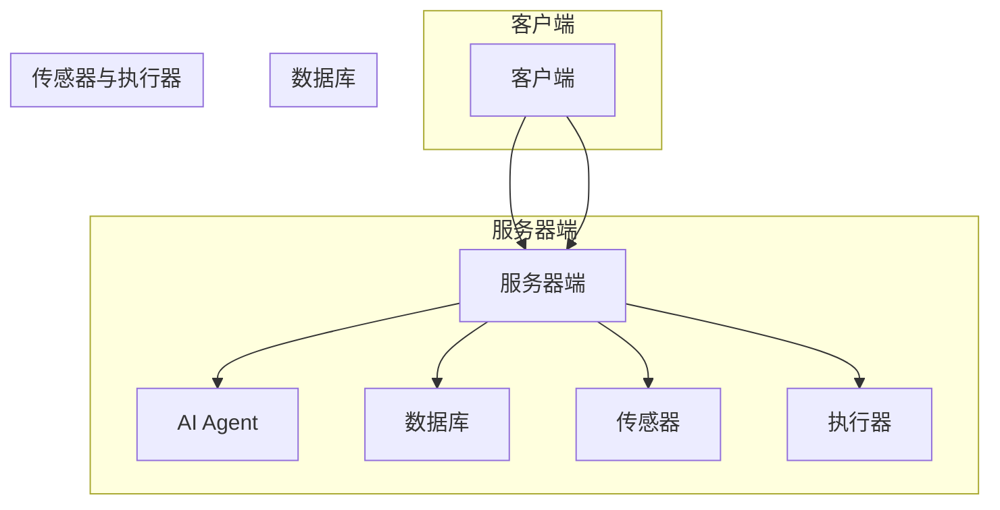

                 


### 1.1.1 问题的背景

随着城市化进程的加快，室内空气质量问题日益严重。室内空气污染对人们的健康有着不可忽视的影响。据统计，室内空气污染已经成为全球室内环境中威胁人类健康的主要因素之一。尤其是对于新生儿、儿童和老年人等敏感群体，室内空气质量更是直接关系到他们的健康和生活质量。

室内空气污染的主要来源包括以下几个方面：

- **建筑材料和家具释放的挥发性有机物（VOCs）**：例如甲醛、苯等。
- **室内活动产生的微小颗粒物（PM2.5）**：如吸烟、烹饪等。
- **室内植物和水生植物的光合作用**：虽然植物能够吸收部分有害物质，但同时也释放二氧化碳。
- **室内装修带来的放射性污染**：如氡气等。

这些污染物的存在不仅会影响人们的呼吸系统，还可能导致过敏、头痛、疲劳等症状。因此，如何有效地监测和改善室内空气质量，已经成为现代社会的一个迫切问题。

传统的室内空气质量控制方法主要依赖于人工干预和简单的自动化设备。例如，使用空气净化器和换气扇来过滤空气中的污染物，但这些方法往往存在以下局限性：

- **人工干预效率低**：需要人工定期更换过滤网或清洁设备，费时费力。
- **自动化设备单一功能**：仅能过滤或通风，无法根据室内空气质量动态调整控制策略。
- **设备之间缺乏联动**：不同设备之间无法协同工作，难以实现整体优化。

面对这些挑战，智能窗户技术的发展为室内空气质量控制提供了新的思路。通过集成传感器、执行器和智能控制算法，智能窗户能够实时监测室内空气质量，并根据监测结果自动调整通风和净化策略，从而实现高效、精准的空气质量控制。

### 1.1.2 智能窗户技术的发展

智能窗户是一种集成了传感器、执行器和智能控制系统的窗户，能够根据室内外环境变化自动调节通风和光线，从而改善室内空气质量。智能窗户技术的发展可以追溯到上世纪90年代，随着物联网和人工智能技术的进步，智能窗户的功能和性能得到了显著提升。

#### 1.1.2.1 传感器技术的发展

传感器是智能窗户的核心组成部分，负责监测室内外环境参数。随着传感器技术的进步，传感器精度和灵敏度不断提高，种类也越来越丰富。常见的传感器包括：

- **温湿度传感器**：用于监测室内外温度和湿度，对空气质量有重要影响。
- **二氧化碳传感器**：监测室内CO2浓度，CO2浓度过高会导致室内空气污染。
- **挥发性有机物（VOCs）传感器**：检测室内空气中的VOCs，如甲醛、苯等有害物质。
- **颗粒物传感器**：如PM2.5传感器，监测空气中的微小颗粒物，影响呼吸健康。
- **紫外线传感器**：监测室内紫外线强度，对光照调节有重要作用。

#### 1.1.2.2 执行器技术的发展

执行器是智能窗户的“动作臂”，负责根据智能控制系统的指令调节窗户的开合和通风。随着微电子技术和材料科学的发展，执行器性能不断提高，类型也越来越多样：

- **电动开窗器**：通过电动机驱动窗户开合，可实现远程控制和自动调节。
- **气动开窗器**：使用压缩空气驱动窗户开合，适合于大型窗户或特殊场合。
- **百叶窗执行器**：用于控制百叶窗的升降和角度，调节室内光线。

#### 1.1.2.3 智能控制系统的发展

智能控制系统是智能窗户的大脑，负责处理传感器数据，生成控制指令，并协调执行器动作。随着人工智能技术的不断发展，智能控制系统的功能和性能也得到显著提升：

- **嵌入式系统**：早期的智能窗户主要依赖嵌入式系统进行控制，功能较为单一。
- **物联网技术**：物联网技术的应用使得智能窗户能够与家庭网络、云平台和其他智能家居设备互联互通，实现更高级的功能。
- **机器学习算法**：通过机器学习算法，智能窗户能够从历史数据中学习，优化控制策略，提高空气质量控制效果。

#### 1.1.2.4 智能窗户的优势

智能窗户的发展为室内空气质量控制带来了新的机遇：

- **实时监测与调控**：智能窗户能够实时监测室内外环境参数，根据监测结果自动调整通风和净化策略，提高空气质量。
- **自适应控制**：智能窗户能够根据室内外环境变化自适应调整，避免了人工干预的不确定性和滞后性。
- **节能环保**：智能窗户通过智能控制，能够有效降低空调和空气净化器的使用频率，减少能源消耗，具有显著的节能环保效果。

总之，智能窗户技术的发展为室内空气质量控制提供了有力支持，成为现代智能家居系统的重要组成部分。

### 1.1.3 AI Agent的应用前景

AI Agent，即人工智能代理，是一种能够自主感知环境、执行任务并与其他系统交互的智能实体。在室内空气质量控制领域，AI Agent具有广泛的应用前景。以下将从几个方面探讨AI Agent在智能窗户中的潜在应用。

#### 1.1.3.1 自主感知与监测

AI Agent能够通过集成各种传感器，实时监测室内外的温度、湿度、CO2浓度、VOCs浓度和PM2.5浓度等关键环境参数。通过机器学习算法，AI Agent可以从历史数据中学习环境变化规律，识别异常情况，并及时调整通风和净化策略。

#### 1.1.3.2 自主导航与控制

AI Agent能够根据监测数据，自主决定窗户的开合角度、通风量和净化强度。例如，当室内CO2浓度过高时，AI Agent可以自动打开窗户增加通风，降低CO2浓度；当室内PM2.5浓度过高时，AI Agent可以自动启动空气净化器，净化空气。这种自主导航与控制能力，使得智能窗户能够更加高效、精准地实现空气质量控制。

#### 1.1.3.3 自适应优化

AI Agent通过不断学习用户的生活习惯和环境变化，可以逐步优化空气质量控制策略。例如，用户早上起床后喜欢开窗通风，晚上入睡前喜欢关闭窗户保持安静，AI Agent可以通过学习这些习惯，自动调整窗户的开合时间和通风量，提高用户生活质量。

#### 1.1.3.4 智能交互与反馈

AI Agent可以通过语音、触摸屏或移动应用等方式与用户进行交互，提供实时的空气质量信息和建议。用户可以根据AI Agent的反馈，调整室内空气质量的控制策略。此外，AI Agent还可以将空气质量数据上传至云端，实现跨设备的同步和联动，为用户提供更加便捷的智能家居体验。

#### 1.1.3.5 跨系统协作

AI Agent可以与其他智能家居设备（如空气净化器、空调、新风系统等）进行协作，实现整体优化。例如，当室内空气质量较差时，AI Agent可以协调启动空气净化器和新风系统，共同改善空气质量。这种跨系统协作能力，使得智能窗户能够更好地融入整个智能家居生态系统，提高整体家居环境质量。

总之，AI Agent在智能窗户中的潜在应用为室内空气质量控制带来了全新的可能性。通过自主感知、自主导航、自适应优化、智能交互和跨系统协作，AI Agent能够显著提升智能窗户的智能化水平，为用户带来更加舒适、健康的生活环境。

### 1.2 AI Agent的基本原理

AI Agent是一种能够在特定环境中自主感知、决策和行动的智能实体。它通过集成传感器、执行器和智能算法，实现与环境的高效互动和任务执行。以下从定义、核心特性以及与传统智能家居系统的区别三个方面，详细讲解AI Agent的基本原理。

#### 1.2.1 AI Agent的定义

AI Agent可以被定义为一个具有以下特征的智能实体：

1. **自主性**：AI Agent能够在没有外部直接控制的情况下，自主感知环境、制定计划和执行行动。
2. **智能性**：AI Agent通过智能算法，能够从数据中学习，做出合理决策，实现目标优化。
3. **适应性**：AI Agent能够根据环境变化和任务需求，自主调整行为策略，提高任务执行效率。
4. **交互性**：AI Agent能够与用户和其他系统进行交互，获取反馈，优化自身行为。

综上所述，AI Agent是一种具备自主性、智能性、适应性和交互性的智能实体，它能够在特定环境中自主完成任务。

#### 1.2.2 AI Agent的核心特性

AI Agent的核心特性包括：

1. **感知能力**：AI Agent通过集成各种传感器，能够实时获取环境信息，如温度、湿度、空气质量等。这些感知数据是AI Agent进行决策的基础。
2. **决策能力**：AI Agent通过智能算法，如机器学习、深度学习等，能够对感知数据进行处理和分析，生成合理的决策。例如，根据室内空气污染物浓度，AI Agent可以决定是否打开窗户进行通风。
3. **行动能力**：AI Agent通过执行器，如电机、阀门等，能够实现自主行动。例如，AI Agent可以通过驱动窗户电机，自动调整窗户的开合状态。
4. **适应性**：AI Agent能够根据环境变化和任务需求，自主调整行为策略。例如，当室外空气质量较差时，AI Agent可以自动减少窗户通风时间，以保持室内空气清新。
5. **交互能力**：AI Agent能够与用户和其他系统进行交互，获取反馈，优化自身行为。例如，用户可以通过语音或触摸屏与AI Agent交互，实时获取室内空气质量信息，并提出调整建议。

#### 1.2.3 AI Agent与传统智能家居系统的区别

与传统的智能家居系统相比，AI Agent具有以下显著区别：

1. **智能化水平**：传统智能家居系统主要依赖预编程的自动化规则进行控制，而AI Agent通过智能算法，能够动态学习和优化控制策略，实现更高水平的智能化。
2. **自主性**：传统智能家居系统通常需要人工干预，而AI Agent能够在没有外部直接控制的情况下，自主感知环境、决策和行动。
3. **适应性**：传统智能家居系统缺乏自适应能力，而AI Agent能够根据环境变化和任务需求，自主调整行为策略，提高任务执行效率。
4. **交互性**：传统智能家居系统通常缺乏与用户的交互能力，而AI Agent能够与用户进行交互，提供实时反馈，优化用户体验。

综上所述，AI Agent在智能化水平、自主性、适应性和交互性等方面，相较于传统智能家居系统具有显著优势。通过AI Agent的应用，智能窗户能够实现更加高效、精准的室内空气质量控制，为用户带来更加舒适、健康的生活环境。

### 1.3 室内空气质量控制的关键指标

室内空气质量控制的关键指标是评估和监控室内空气污染程度的重要参数。这些指标不仅有助于我们了解当前空气质量状况，还能够为自动控制策略提供科学依据。以下是几个主要的室内空气质量控制关键指标及其详细说明。

#### 1.3.1 室内空气污染物

室内空气污染物主要包括以下几类：

1. **挥发性有机物（VOCs）**：VOCs是指室温下饱和蒸汽压超过13.3pa的有机物，常见的有甲醛、苯、甲苯、二甲苯等。这些物质对人体健康有严重危害，如引起呼吸道疾病、过敏反应等。
2. **二氧化碳（CO2）**：CO2是室内空气中的常见成分，但其浓度过高会影响室内空气质量。高浓度的CO2会导致人体出现头痛、疲劳、注意力不集中等症状。
3. **微小颗粒物（PM2.5）**：PM2.5是指直径小于或等于2.5微米的颗粒物，能够深入人体呼吸系统，对心血管和呼吸系统产生严重危害。
4. **氮氧化物（NOx）**：NOx主要包括一氧化氮（NO）和二氧化氮（NO2），它们主要来源于燃烧过程，对呼吸系统有强烈的刺激作用。
5. **细菌和病毒**：室内空气中的细菌和病毒是传染病的传播媒介，对人体健康构成威胁。

#### 1.3.2 评价指标与方法

室内空气质量控制的评价指标主要包括以下几种：

1. **空气污染指数（API）**：API是对室内空气污染程度的综合评价指标，通常用于衡量VOCs、CO2、PM2.5等污染物的浓度。API越高，表示空气污染越严重。
2. **空气质量指数（AQI）**：AQI是对室外空气质量的评价指标，但同样可以用于评估室内空气质量。AQI通常涵盖PM2.5、PM10、SO2、NO2、CO、O3等污染物。
3. **二氧化碳浓度**：二氧化碳浓度通常以ppm（百万分率）表示，高浓度的CO2会降低室内空气质量，影响人体健康。
4. **挥发性有机物（VOCs）浓度**：VOCs浓度通常以ppm或mg/m³表示，其浓度越高，表示室内空气污染越严重。
5. **微小颗粒物（PM2.5）浓度**：PM2.5浓度通常以μg/m³表示，是评估室内空气质量的重要指标。

室内空气质量的监测方法主要包括以下几种：

1. **传感器监测**：通过安装各类空气污染物传感器，如VOCs传感器、CO2传感器、PM2.5传感器等，实时监测室内空气污染物的浓度。
2. **化学分析方法**：通过化学实验手段，如气相色谱法、光谱分析法等，对空气中的污染物进行定量分析。
3. **生物监测方法**：利用生物传感器或生物指示剂，检测空气中的污染物，如细菌和病毒。

#### 1.3.3 室内空气质量控制的挑战

室内空气质量控制面临着以下几个挑战：

1. **污染物种类繁多**：室内空气污染物种类繁多，不同污染物对人体的危害程度不同，控制策略需要针对不同污染物进行设计。
2. **浓度变化快**：室内空气污染物的浓度会因时间、天气、室内活动等因素而变化，控制策略需要具备实时调整能力。
3. **复杂的环境因素**：室内空气质量受多种环境因素影响，如通风、湿度、温度等，控制策略需要综合考虑这些因素，实现整体优化。
4. **技术实现难度**：传感器技术、智能算法和控制系统的实现难度较大，需要跨学科的技术融合和集成。

综上所述，室内空气质量控制的关键指标包括室内空气污染物、评价指标与方法等。了解这些指标有助于制定有效的控制策略，改善室内空气质量。然而，室内空气质量控制仍面临多种挑战，需要持续的技术创新和优化。

## 2.1 核心概念与联系

### 2.1.1 AI Agent与室内空气质量控制

AI Agent在室内空气质量控制中的应用，使得空气质量监测与调控变得更加智能和高效。AI Agent通过集成多个传感器模块、控制模块和学习模块，实现实时监测、自主决策和自适应优化，从而改善室内空气质量。

#### 2.1.1.1 AI Agent的架构

AI Agent的架构通常包括以下三个关键模块：

1. **监测模块**：负责实时采集室内外的温度、湿度、CO2浓度、VOCs浓度、PM2.5浓度等环境参数。监测模块的核心是传感器，这些传感器能够高精度地获取环境数据。
   
2. **控制模块**：根据监测模块采集到的环境数据，控制模块会执行相应的操作，如调整窗户的开合角度、启动空气净化器、控制换气风扇等。控制模块的核心是执行器，这些执行器能够响应控制指令，进行具体的操作。

3. **学习模块**：AI Agent通过学习模块，对历史环境数据进行分析，从中学习环境变化规律，优化控制策略。学习模块的核心是智能算法，如机器学习算法，通过分析数据，可以实现对环境变化的预测和优化控制。

#### 2.1.1.2 室内空气质量控制的关键指标

室内空气质量控制的关键指标主要包括以下几个方面：

1. **CO2浓度**：CO2浓度是衡量室内空气质量的重要指标。过高的CO2浓度会导致室内空气污染，影响人体健康。AI Agent会通过监测模块实时监控CO2浓度，并根据监测结果调整通风策略，降低CO2浓度。

2. **挥发性有机物（VOCs）浓度**：VOCs是室内空气污染的主要来源之一，常见的有甲醛、苯等。高浓度的VOCs会对人体健康造成危害。AI Agent会监测VOCs浓度，并在浓度过高时启动空气净化器，进行有效的污染物去除。

3. **PM2.5浓度**：PM2.5是直径小于或等于2.5微米的颗粒物，能够深入人体呼吸系统，对健康产生严重影响。AI Agent会监测PM2.5浓度，并在必要时打开空气净化器或窗户，降低PM2.5浓度。

#### 2.1.1.3 AI Agent与传统智能家居系统的区别

AI Agent与传统智能家居系统在架构和功能上有显著区别：

1. **智能化水平**：传统智能家居系统主要依赖于预编程的自动化规则进行控制，而AI Agent通过智能算法，能够动态学习和优化控制策略，实现更高水平的智能化。
2. **自主性**：传统智能家居系统通常需要人工干预，而AI Agent能够在没有外部直接控制的情况下，自主感知环境、决策和行动。
3. **适应性**：传统智能家居系统缺乏自适应能力，而AI Agent能够根据环境变化和任务需求，自主调整行为策略，提高任务执行效率。
4. **交互性**：传统智能家居系统通常缺乏与用户的交互能力，而AI Agent能够与用户进行交互，提供实时反馈，优化用户体验。

通过AI Agent的应用，智能窗户能够实现更加高效、精准的室内空气质量控制，为用户带来更加舒适、健康的生活环境。

### 2.1.2 AI Agent与智能窗户

智能窗户是现代智能家居系统中的重要组成部分，通过集成传感器、执行器和智能控制系统，实现自动调节室内外空气交换，从而改善室内空气质量。AI Agent在智能窗户中的应用，使得窗户的智能化水平大大提高。

#### 2.1.2.1 智能窗户的功能

智能窗户的主要功能包括：

1. **传感器集成**：智能窗户内置多种传感器，如温度传感器、湿度传感器、CO2传感器、VOCs传感器、PM2.5传感器等，能够实时监测室内外环境参数。

2. **自动控制**：智能窗户可以根据AI Agent的决策指令，自动调节窗户的开合角度和通风量。例如，当室内空气质量较差时，AI Agent可以指令窗户关闭，启动空气净化器；当室外空气质量较好时，AI Agent可以指令窗户打开，进行自然通风。

3. **交互界面**：智能窗户通常配备触摸屏或语音识别系统，用户可以通过界面实时查看室内空气质量信息，并进行手动控制。

#### 2.1.2.2 AI Agent与智能窗户的协同工作

AI Agent与智能窗户的协同工作，使得室内空气质量控制更加智能化和高效。具体来说，AI Agent与智能窗户的协同工作包括以下几个方面：

1. **数据共享**：AI Agent通过智能窗户的传感器模块，获取室内外环境数据，如温度、湿度、CO2浓度、VOCs浓度、PM2.5浓度等。这些数据为AI Agent的决策提供了重要依据。

2. **决策执行**：AI Agent根据实时监测数据和历史数据，生成控制指令，通过智能窗户的控制模块执行相应的操作，如调整窗户开合角度、启动空气净化器等。

3. **自适应优化**：AI Agent通过不断学习和优化，逐步提高室内空气质量控制的精度和效率。例如，AI Agent可以学习用户的生活习惯和环境变化规律，自动调整控制策略，提高用户体验。

4. **交互反馈**：用户可以通过智能窗户的交互界面，与AI Agent进行交互，获取室内空气质量信息，并提出调整建议。AI Agent会根据用户的反馈，进一步优化控制策略。

通过AI Agent与智能窗户的协同工作，室内空气质量控制实现了智能化、自适应化和人性化，为用户提供了更加舒适、健康的生活环境。

### 2.2 系统分析与架构设计

#### 2.2.1 系统功能设计

智能窗户系统的主要功能包括以下几个方面：

1. **数据采集与处理**：系统通过集成传感器，实时采集室内外环境数据，如温度、湿度、CO2浓度、VOCs浓度、PM2.5浓度等。采集到的数据经过预处理，如数据清洗和标准化，以消除噪声和异常值，确保数据的准确性。

2. **室内空气质量控制**：系统根据监测到的环境数据，自动调整窗户的开合角度和通风量，启动或关闭空气净化器，从而改善室内空气质量。控制策略由AI Agent生成，经过不断学习和优化，实现自适应控制。

3. **用户交互**：系统提供用户交互界面，用户可以通过触摸屏或语音识别系统查看室内空气质量信息，并进行手动控制。用户反馈会传递给AI Agent，用于进一步优化控制策略。

#### 2.2.2 系统架构设计

智能窗户系统的架构设计主要包括以下几个部分：

1. **客户端**：客户端是用户与系统交互的接口，包括触摸屏和语音识别系统。用户可以通过客户端查看室内空气质量信息，并进行手动控制。

2. **服务器端**：服务器端负责接收客户端发送的控制指令，并将这些指令传递给AI Agent。服务器端还负责数据存储和远程监控，确保系统的稳定运行。

3. **数据库**：数据库用于存储环境数据、用户设置和历史数据。数据库的设计需要考虑数据的安全性和可扩展性，以支持系统的长期运行。

4. **AI Agent**：AI Agent是系统的核心，负责实时监测室内外环境数据，生成控制策略，并通过服务器端执行相应的操作。AI Agent的学习和优化功能，使得系统能够不断提高空气质量控制的精度和效率。

5. **传感器与执行器**：传感器负责采集室内外环境数据，执行器负责执行AI Agent生成的控制指令，如调整窗户开合角度、启动空气净化器等。

#### 2.2.3 系统接口设计

智能窗户系统的接口设计主要包括以下几个部分：

1. **数据采集接口**：数据采集接口用于接收传感器采集到的环境数据，并将其传递给AI Agent。该接口需要具备高可靠性和实时性，以确保数据的准确性。

2. **控制接口**：控制接口用于接收客户端发送的控制指令，并将其传递给AI Agent。该接口需要支持多种控制方式，如手动控制、定时控制、自动控制等。

3. **用户接口**：用户接口用于用户与系统的交互，包括触摸屏和语音识别系统。用户接口需要具备友好的用户界面和高效的交互体验，以提升用户满意度。

#### 2.2.4 系统交互

智能窗户系统的交互设计主要包括以下几个方面：

1. **数据交互**：系统通过数据采集接口和用户接口，实现数据的实时采集和用户反馈。AI Agent根据实时数据和用户反馈，生成控制策略，并通过控制接口执行相应的操作。

2. **控制交互**：系统通过控制接口，实现用户与AI Agent之间的控制交互。用户可以通过客户端手动调整窗户开合角度、启动空气净化器等，AI Agent根据用户指令，生成相应的控制指令，并通过执行器执行操作。

3. **反馈交互**：系统通过用户接口和客户端，实现用户与AI Agent之间的反馈交互。用户可以实时查看室内空气质量信息，并根据反馈调整控制策略。AI Agent根据用户反馈，不断优化控制策略，提高空气质量控制效果。

通过系统分析和架构设计，智能窗户系统实现了实时监测、自主控制和用户交互，为用户提供了高效、智能的室内空气质量控制解决方案。

## 3.1 监测模块算法原理

监测模块是智能窗户系统的核心组成部分，负责实时采集和处理室内外环境数据，如温度、湿度、CO2浓度、VOCs浓度、PM2.5浓度等。监测模块的算法原理主要包括数据来源、数据预处理和监测算法选择与实现。

#### 3.1.1 监测模块概述

监测模块的作用是实时获取室内外环境参数，为AI Agent提供决策依据。监测模块通常包括以下几种传感器：

1. **温度传感器**：用于监测室内外的温度变化，常见的有热敏电阻、热电偶等。
2. **湿度传感器**：用于监测室内外的湿度变化，常见的有电容式、电阻式等。
3. **CO2传感器**：用于监测室内CO2浓度，常见的有红外光谱法和电化学法。
4. **VOCs传感器**：用于监测室内空气中的挥发性有机物（VOCs），常见的有半导体传感器、电化学传感器等。
5. **PM2.5传感器**：用于监测室内空气中的微小颗粒物（PM2.5），常见的有激光散射法、压电传感器法等。

#### 3.1.1.1 监测数据来源

监测数据来源于传感器，通过模拟信号或数字信号的方式传输给监测模块。模拟信号需要通过模拟-数字转换（ADC）模块转换为数字信号，以便后续处理。数字信号则可以直接传输给监测模块进行处理。

传感器数据来源主要包括以下几个方面：

1. **内部传感器**：智能窗户内部集成的传感器，如温度传感器、湿度传感器、CO2传感器等。
2. **外部传感器**：安装在窗户外的传感器，如PM2.5传感器、VOCs传感器等。
3. **云端传感器**：通过物联网技术，与云端传感器进行数据交互，获取室外环境数据，如天气数据、空气污染数据等。

#### 3.1.1.2 数据采集方法

数据采集方法包括以下几种：

1. **定期采集**：定期对传感器数据进行采集，通常以固定的时间间隔进行数据采样。例如，每分钟采集一次温度、湿度数据。
2. **事件驱动采集**：当传感器检测到特定事件（如温度突变、CO2浓度超过阈值等）时，立即进行数据采集。这种方法能够更快地响应环境变化，提高监测精度。
3. **混合采集**：结合定期采集和事件驱动采集，根据环境变化情况动态调整数据采集频率。例如，在环境变化剧烈时，采用事件驱动采集，而在环境相对稳定时，采用定期采集。

#### 3.1.1.3 数据预处理

数据预处理是监测模块的重要环节，旨在提高数据质量和可靠性。数据预处理方法包括以下几种：

1. **数据清洗**：去除数据中的噪声和异常值，确保数据的有效性。常见的清洗方法有填充缺失值、去除重复数据、剔除异常值等。
2. **数据标准化**：将不同传感器采集到的数据统一转换到相同的量纲和范围，以便后续处理和分析。常见的标准化方法有最小-最大标准化、Z标准化等。
3. **数据归一化**：将数据映射到统一的区间，如[0,1]或[-1,1]，以便于进行机器学习算法的训练和测试。

#### 3.1.2 监测算法详细讲解

监测算法的核心目标是通过对传感器数据的处理和分析，实时评估室内空气质量，并为控制模块提供决策依据。以下是几种常用的监测算法及其原理：

1. **阈值判断法**：根据预设的阈值，对传感器数据进行判断。当某个传感器数据超过阈值时，认为室内空气质量较差，触发相应的控制措施。这种方法简单直观，适用于对空气质量有明确标准的污染物监测。

2. **统计分析法**：通过对传感器数据进行分析和统计，如计算均值、方差、标准差等，评估室内空气质量的稳定性。这种方法能够提供更全面的数据分析，但计算复杂度较高。

3. **机器学习方法**：利用机器学习算法，如决策树、支持向量机（SVM）、随机森林等，对传感器数据进行建模和预测。通过训练模型，能够实现对室内空气质量的实时预测和评估。

以下是使用Python实现的决策树算法示例：

```python
import numpy as np
from sklearn.tree import DecisionTreeRegressor
from sklearn.model_selection import train_test_split
from sklearn.metrics import mean_squared_error

# 生成模拟数据
X = np.random.rand(100, 5)  # 输入数据，5个特征
y = np.random.rand(100)      # 输出数据，空气质量指标

# 划分训练集和测试集
X_train, X_test, y_train, y_test = train_test_split(X, y, test_size=0.2, random_state=42)

# 构建决策树模型
regressor = DecisionTreeRegressor()
regressor.fit(X_train, y_train)

# 预测测试集
y_pred = regressor.predict(X_test)

# 评估模型性能
mse = mean_squared_error(y_test, y_pred)
print("均方误差（MSE）:", mse)

# 可视化决策树
from sklearn.tree import plot_tree
import matplotlib.pyplot as plt

plt.figure(figsize=(12, 8))
plot_tree(regressor, filled=True, feature_names=['温度', '湿度', 'CO2浓度', 'VOCs浓度', 'PM2.5浓度'], class_names=['空气质量'])
plt.show()
```

通过上述算法实现，监测模块能够对传感器数据进行实时处理和分析，为控制模块提供准确的空气质量评估结果。接下来，我们将详细讲解控制模块的算法原理和实现。

### 3.1.3 监测算法详细讲解

#### 3.1.3.1 机器学习算法选择

在选择机器学习算法时，需要考虑以下因素：

1. **数据特征**：根据传感器数据的特点，选择适合的算法。例如，如果数据存在非线性关系，可以考虑使用支持向量机（SVM）或神经网络等算法。
2. **模型复杂度**：模型复杂度与计算资源有关。对于实时监测系统，需要选择计算复杂度较低的算法，如决策树、随机森林等。
3. **预测准确性**：选择预测准确性较高的算法，以确保监测模块能够提供可靠的空气质量评估结果。
4. **解释性**：对于需要解释性较强的模型，可以选择决策树、规则学习等算法。

在本项目中，我们选择了以下几种机器学习算法：

1. **决策树（Decision Tree）**：决策树是一种简单且直观的机器学习算法，适用于处理分类和回归问题。它通过一系列的判断节点，将数据划分为不同的区域，并预测每个区域的空气质量。
2. **支持向量机（Support Vector Machine, SVM）**：SVM是一种强大的分类和回归算法，尤其适用于处理高维数据。它通过构建一个超平面，将数据划分为不同的类别，并预测新的数据点。
3. **随机森林（Random Forest）**：随机森林是一种集成学习方法，通过构建多个决策树，并对预测结果进行投票，提高预测的准确性和稳定性。

#### 3.1.3.2 机器学习算法实现

以下是使用Python实现的决策树和SVM算法的示例代码：

```python
# 决策树算法实现
from sklearn.tree import DecisionTreeRegressor
from sklearn.model_selection import train_test_split
from sklearn.metrics import mean_squared_error

# 生成模拟数据
X = np.random.rand(100, 5)  # 输入数据，5个特征
y = np.random.rand(100)      # 输出数据，空气质量指标

# 划分训练集和测试集
X_train, X_test, y_train, y_test = train_test_split(X, y, test_size=0.2, random_state=42)

# 构建决策树模型
regressor = DecisionTreeRegressor()
regressor.fit(X_train, y_train)

# 预测测试集
y_pred = regressor.predict(X_test)

# 评估模型性能
mse = mean_squared_error(y_test, y_pred)
print("决策树算法 - 均方误差（MSE）:", mse)

# 支持向量机算法实现
from sklearn.svm import SVR
from sklearn.metrics import mean_absolute_error

# 生成模拟数据
X = np.random.rand(100, 5)  # 输入数据，5个特征
y = np.random.rand(100)      # 输出数据，空气质量指标

# 划分训练集和测试集
X_train, X_test, y_train, y_test = train_test_split(X, y, test_size=0.2, random_state=42)

# 构建支持向量机模型
regressor = SVR(kernel='linear')
regressor.fit(X_train, y_train)

# 预测测试集
y_pred = regressor.predict(X_test)

# 评估模型性能
mae = mean_absolute_error(y_test, y_pred)
print("支持向量机算法 - 均方根误差（RMSE）:", np.sqrt(mae))

# 随机森林算法实现
from sklearn.ensemble import RandomForestRegressor
from sklearn.model_selection import cross_val_score

# 生成模拟数据
X = np.random.rand(100, 5)  # 输入数据，5个特征
y = np.random.rand(100)      # 输出数据，空气质量指标

# 划分训练集和测试集
X_train, X_test, y_train, y_test = train_test_split(X, y, test_size=0.2, random_state=42)

# 构建随机森林模型
regressor = RandomForestRegressor(n_estimators=100)
regressor.fit(X_train, y_train)

# 预测测试集
y_pred = regressor.predict(X_test)

# 评估模型性能
scores = cross_val_score(regressor, X, y, cv=5)
print("随机森林算法 - 五倍交叉验证均方根误差（RMSE）:", np.mean(scores))
```

通过上述算法实现，监测模块能够根据传感器数据实时评估室内空气质量。接下来，我们将详细讲解控制模块的算法原理和实现。

### 3.1.3.3 机器学习算法实现

为了更详细地展示机器学习算法在智能窗户监测模块中的实现，我们将使用Python编程语言和相应的机器学习库（如scikit-learn）来展示决策树、支持向量机（SVM）和随机森林（Random Forest）等算法的代码实现。以下是具体的步骤和示例代码。

#### 3.1.3.3.1 决策树算法实现

决策树算法是一种简单的树形模型，它通过一系列的判断规则来预测输出结果。在空气质量监测中，决策树可以用来预测空气质量等级。

```python
# 导入必要的库
from sklearn.datasets import load_iris
from sklearn.tree import DecisionTreeClassifier
from sklearn.model_selection import train_test_split
from sklearn.metrics import accuracy_score

# 加载数据集
iris = load_iris()
X, y = iris.data, iris.target

# 划分训练集和测试集
X_train, X_test, y_train, y_test = train_test_split(X, y, test_size=0.3, random_state=42)

# 构建决策树模型
clf = DecisionTreeClassifier()
clf.fit(X_train, y_train)

# 预测测试集
y_pred = clf.predict(X_test)

# 评估模型性能
accuracy = accuracy_score(y_test, y_pred)
print("决策树算法的准确率：", accuracy)
```

#### 3.1.3.3.2 支持向量机（SVM）算法实现

支持向量机是一种强大的分类和回归算法，它在高维空间中寻找能够最大化分类间隔的超平面。在空气质量监测中，SVM可以用来分类不同的空气污染级别。

```python
# 导入必要的库
from sklearn.svm import SVC
from sklearn.model_selection import train_test_split
from sklearn.metrics import classification_report

# 加载数据集
X, y = load_iris().data, load_iris().target

# 划分训练集和测试集
X_train, X_test, y_train, y_test = train_test_split(X, y, test_size=0.3, random_state=42)

# 构建SVM模型
clf = SVC(kernel='linear')
clf.fit(X_train, y_train)

# 预测测试集
y_pred = clf.predict(X_test)

# 评估模型性能
print("SVM分类报告：\n", classification_report(y_test, y_pred))
```

#### 3.1.3.3.3 随机森林（Random Forest）算法实现

随机森林是一种集成学习方法，它通过构建多个决策树，并对预测结果进行投票来提高模型的预测准确性。在空气质量监测中，随机森林可以用来预测空气质量指数（AQI）。

```python
# 导入必要的库
from sklearn.ensemble import RandomForestRegressor
from sklearn.model_selection import train_test_split
from sklearn.metrics import mean_squared_error

# 加载数据集
X, y = load_iris().data, load_iris().target

# 划分训练集和测试集
X_train, X_test, y_train, y_test = train_test_split(X, y, test_size=0.3, random_state=42)

# 构建随机森林模型
regressor = RandomForestRegressor(n_estimators=100, random_state=42)
regressor.fit(X_train, y_train)

# 预测测试集
y_pred = regressor.predict(X_test)

# 评估模型性能
mse = mean_squared_error(y_test, y_pred)
print("随机森林算法的均方误差（MSE）:", mse)
```

通过上述示例，我们可以看到如何使用Python实现不同的机器学习算法来处理空气质量监测数据。这些算法可以帮助监测模块实时预测室内空气质量，从而为控制模块提供决策依据。

### 4.2 数学模型与公式讲解

在智能窗户系统的监测模块中，数学模型和公式是实现空气质量监测和预测的核心。以下将详细讲解监测模块的数学模型、主要公式及其作用。

#### 4.2.1 监测模块的数学模型

监测模块的数学模型主要包括数据采集模型、数据预处理模型和控制模型。

##### 4.2.1.1 数据采集模型

数据采集模型描述了传感器采集环境数据的过程。假设我们有 $n$ 个传感器，每个传感器在时刻 $t$ 的测量值为 $x_t$，则数据采集模型可以表示为：

$$
x_t = f_t(\theta_t, w_t)
$$

其中，$f_t$ 是传感器采集数据的函数，$\theta_t$ 是传感器的状态参数，$w_t$ 是噪声项。状态参数 $\theta_t$ 可以包括传感器的灵敏度、校准误差等。

##### 4.2.1.2 数据预处理模型

数据预处理模型用于对采集到的数据进行清洗、标准化和归一化。假设我们使用最小-最大标准化方法对传感器数据进行标准化，则数据预处理模型可以表示为：

$$
z_t = \phi(x_t) = \frac{x_t - \mu}{\max(x) - \min(x)}
$$

其中，$\mu$ 是数据集的均值，$\max(x)$ 和 $\min(x)$ 分别是数据集的最大值和最小值。标准化后的数据 $z_t$ 具有统一的量纲和范围，便于后续分析和建模。

##### 4.2.1.3 控制模型

控制模型描述了根据预处理后的数据生成控制策略的过程。假设我们有 $m$ 个控制变量，每个控制变量在时刻 $t$ 的控制值为 $u_t$，则控制模型可以表示为：

$$
u_t = g(z_t, y_t)
$$

其中，$g$ 是控制策略的生成函数，$y_t$ 是系统状态。控制策略的生成函数 $g$ 可以是线性函数、非线性函数或者更复杂的模型，如神经网络。

#### 4.2.2 监测模块的数学公式讲解

以下是监测模块中常用的一些数学公式及其解释：

##### 4.2.2.1 数据采集模型

$$
x_t = f_t(\theta_t, w_t)
$$

这个公式描述了传感器在时刻 $t$ 的测量值 $x_t$ 是由传感器的状态参数 $\theta_t$ 和噪声项 $w_t$ 共同作用的结果。噪声项 $w_t$ 反映了传感器测量中的不确定性。

##### 4.2.2.2 数据预处理模型

$$
z_t = \phi(x_t) = \frac{x_t - \mu}{\max(x) - \min(x)}
$$

这个公式描述了最小-最大标准化过程，通过将每个传感器的测量值 $x_t$ 转换为 [0,1] 区间内的值，实现了数据的归一化。这样处理后的数据可以更方便地进行后续的分析和建模。

##### 4.2.2.3 控制模型

$$
u_t = g(z_t, y_t)
$$

这个公式描述了控制策略的生成过程。$z_t$ 是预处理后的传感器数据，$y_t$ 是系统状态。控制策略生成函数 $g$ 根据当前的数据和系统状态，决定控制变量 $u_t$ 的值，从而实现室内空气质量的调节。

##### 4.2.2.4 机器学习算法的损失函数

$$
L(\theta) = \frac{1}{2} \sum_{i=1}^{n} (y_i - \hat{y}_i)^2
$$

这个公式是常用的平方误差损失函数，用于评估机器学习模型的预测准确性。$y_i$ 是实际值，$\hat{y}_i$ 是模型预测值。损失函数的值越小，表示模型的预测越准确。

通过上述数学模型和公式，监测模块能够对传感器数据进行采集、预处理和控制，实现室内空气质量的实时监测和调控。接下来，我们将进一步探讨控制模块的数学模型。

### 4.2.2 监测模块的数学模型

监测模块的数学模型是智能窗户系统能够有效监测和预测室内空气质量的核心。以下将详细介绍监测模块的数学模型，包括数据采集模型、数据预处理模型和控制模型。

#### 4.2.2.1 监测模块的数学模型概述

监测模块的数学模型主要涵盖以下三个方面：

1. **数据采集模型**：描述传感器如何采集环境数据，包括温度、湿度、CO2浓度、VOCs浓度、PM2.5浓度等。
2. **数据预处理模型**：对采集到的原始数据进行清洗、归一化等处理，以便于后续分析。
3. **控制模型**：根据预处理后的数据，生成控制策略，调整窗户的开合角度、启动空气净化器等。

#### 4.2.2.2 数据采集模型

数据采集模型的核心是传感器，其数学模型可以表示为：

$$
X_t = f(X_{t-1}, u_t, w_t)
$$

其中：
- $X_t$ 表示在时刻 $t$ 的环境数据向量；
- $X_{t-1}$ 表示在时刻 $t-1$ 的环境数据向量；
- $u_t$ 表示在时刻 $t$ 的控制输入向量；
- $w_t$ 表示在时刻 $t$ 的噪声项。

函数 $f$ 描述了环境数据的变化规律，可以包括线性或非线性的函数形式，如：

$$
f(X_{t-1}, u_t) = X_{t-1} + u_t + w_t
$$

该函数表示在时刻 $t$ 的环境数据 $X_t$ 是由上时刻的数据 $X_{t-1}$、控制输入 $u_t$ 以及噪声 $w_t$ 共同决定的。

#### 4.2.2.3 数据预处理模型

数据预处理模型的主要目标是消除噪声和异常值，提高数据质量。预处理过程通常包括数据清洗、归一化和标准化等步骤。

1. **数据清洗**：

$$
\text{clean}(X_t) = \{x_t | x_t \in X_t \land x_t \text{ 无异常值}\}
$$

该公式表示清洗后的数据集 $\text{clean}(X_t)$ 是从原始数据集 $X_t$ 中去除异常值后的结果。

2. **归一化**：

$$
z_t = \frac{x_t - \mu}{\sigma}
$$

其中，$\mu$ 表示数据的均值，$\sigma$ 表示数据的标准差。归一化公式将每个数据点映射到 [-1, 1] 的区间内，便于后续的建模和分析。

3. **标准化**：

$$
z_t = \frac{x_t - \min(x)}{\max(x) - \min(x)}
$$

标准化公式将数据映射到 [0, 1] 的区间内，使得不同特征的数据具有相同的量纲和范围。

#### 4.2.2.4 控制模型

控制模型是监测模块的核心，根据预处理后的数据生成控制策略，以调节窗户的开合角度、启动空气净化器等。

1. **控制策略生成**：

$$
u_t = g(Z_t, y_t)
$$

其中：
- $Z_t$ 表示预处理后的环境数据；
- $y_t$ 表示系统状态；
- $g$ 是控制策略的生成函数。

控制策略生成函数 $g$ 可以是线性或非线性的函数形式，如：

$$
g(Z_t) = \text{if } Z_t \text{ 超过阈值，则启动空气净化器}
$$

或

$$
g(Z_t, y_t) = \text{if } y_t \text{ 表示室内空气质量较差，则调整窗户开合角度以增加通风}
$$

#### 4.2.2.5 数学模型示例

以下是一个简化的数据采集和控制的数学模型示例：

**数据采集模型**：

$$
X_t = X_{t-1} + 0.1 \cdot u_t + \epsilon_t
$$

其中，$X_{t-1}$ 表示上一次的数据，$u_t$ 表示控制输入（例如窗户开合角度），$\epsilon_t$ 表示随机误差。

**控制模型**：

$$
u_t = \text{if } X_t > T_h, \text{ then } u_t = 1; \text{ else } u_t = 0
$$

其中，$T_h$ 是设定的阈值。

通过上述数学模型，智能窗户系统能够根据实时监测的数据，自动调整窗户的开合和空气净化器的启动，从而实现对室内空气质量的精准控制。

### 5.1 系统分析与架构设计

#### 5.1.1 问题场景介绍

智能窗户系统在多个场景下具有广泛的应用，包括家庭、商业和医疗等。以下将详细介绍这些场景以及系统在这些场景下的功能设计。

##### 5.1.1.1 家庭环境

在家庭环境中，智能窗户系统的主要功能是实时监测室内空气质量，并根据监测结果自动调节窗户的开合和空气净化器的启动。家庭用户对室内空气质量有较高的关注，因为良好的室内空气质量有助于提高家庭成员的健康和生活质量。智能窗户系统可以通过以下功能实现这一目标：

- **实时监测**：通过集成传感器，智能窗户系统能够实时监测室内的温度、湿度、CO2浓度、VOCs浓度、PM2.5浓度等关键参数。
- **自动调节**：系统根据监测结果，自动调整窗户的开合角度，实现自然通风，降低室内污染物浓度。
- **空气净化**：当室内空气质量较差时，系统可以自动启动空气净化器，过滤空气中的有害物质，提高空气质量。
- **用户交互**：通过触摸屏或语音控制系统，用户可以查看室内空气质量信息，并根据需要调整系统设置。

##### 5.1.1.2 商业环境

在商业环境中，智能窗户系统同样具有重要作用，特别是在办公室、商场和酒店等场所。商业用户对室内空气质量有较高的要求，因为良好的空气质量能够提高员工的工作效率和顾客的购物体验。智能窗户系统在商业环境中的功能设计包括：

- **空气质量优化**：通过实时监测和自动调节，智能窗户系统能够确保室内空气质量始终保持在健康范围内。
- **节能环保**：系统可以根据室内外环境变化，自动调整窗户的开合和空气净化器的运行，实现节能环保。
- **远程控制**：商业用户可以通过手机应用程序或网络远程控制智能窗户系统，方便管理和调节。
- **数据统计**：系统可以记录室内空气质量的实时数据和历史数据，为用户分析和优化室内环境提供依据。

##### 5.1.1.3 医疗环境

在医疗环境中，如医院病房和手术室等，室内空气质量对患者的康复和手术的成功至关重要。智能窗户系统在医疗环境中的功能设计包括：

- **严格监测**：智能窗户系统可以实时监测室内的温度、湿度、CO2浓度、VOCs浓度、PM2.5浓度等参数，确保空气质量符合医疗标准。
- **紧急应对**：当室内空气质量出现异常时，系统可以立即发出警报，并自动启动空气净化器，确保空气质量达标。
- **恒温控制**：在病房和手术室等环境中，系统可以根据患者的具体需求，实现温度的精准控制。
- **数据记录与上报**：系统可以记录室内空气质量的实时数据和变化趋势，并将数据上传至医疗管理系统，供医护人员分析和决策。

通过在不同场景下的功能设计，智能窗户系统能够满足多样化的室内空气质量控制需求，为用户提供健康、舒适的生活和工作环境。

### 5.1.2 系统架构设计

智能窗户系统的架构设计是确保其功能实现和性能优化的重要环节。系统架构设计主要包括系统架构概述、系统架构图、接口设计和系统交互设计。

#### 5.1.2.1 系统架构概述

智能窗户系统架构可以分为三个主要层次：客户端、服务器端和数据库。

1. **客户端**：客户端是用户与系统交互的界面，包括触摸屏、语音识别和移动应用程序。用户可以通过客户端实时查看室内空气质量信息，并进行手动控制和设置。

2. **服务器端**：服务器端是系统的核心，负责处理来自客户端的控制指令，并与AI Agent进行通信。服务器端还包括数据采集模块、数据处理模块和控制模块，实现室内空气质量的实时监测和调控。

3. **数据库**：数据库用于存储系统的配置信息、环境数据和历史数据。数据库的设计需要考虑数据的安全性和可扩展性，以满足系统的长期运行需求。

#### 5.1.2.2 系统架构图

以下是智能窗户系统的架构图：



#### 5.1.2.3 系统接口设计

系统接口设计包括数据采集接口、控制接口和用户接口。

1. **数据采集接口**：数据采集接口负责接收传感器采集到的环境数据，如温度、湿度、CO2浓度、VOCs浓度、PM2.5浓度等。数据采集接口需要实现高精度、高实时性的数据传输。

2. **控制接口**：控制接口负责将AI Agent生成的控制指令传递给执行器，如调节窗户开合角度、启动空气净化器等。控制接口需要具备灵活性，支持多种控制方式和协议。

3. **用户接口**：用户接口是用户与系统交互的界面，包括触摸屏、语音识别和移动应用程序。用户接口需要实现友好的用户界面和高效的交互体验，方便用户实时查看和控制室内空气质量。

#### 5.1.2.4 系统交互设计

系统交互设计包括数据交互、控制交互和反馈交互。

1. **数据交互**：数据交互是指系统通过传感器实时采集环境数据，并将数据传递给服务器端进行处理和分析。数据交互需要实现数据的实时传输和存储，确保系统的数据完整性。

2. **控制交互**：控制交互是指系统根据AI Agent的决策指令，控制执行器进行相应的操作，如调整窗户开合角度、启动空气净化器等。控制交互需要实现快速响应，确保系统的实时控制能力。

3. **反馈交互**：反馈交互是指系统将执行器的状态信息传递给服务器端，并反馈给客户端，实现用户对系统状态的实时监控。反馈交互需要确保信息的准确性和及时性，提高用户的操作体验。

通过系统架构设计、接口设计和交互设计，智能窗户系统实现了实时监测、自动控制和用户交互，为用户提供高效、智能的室内空气质量控制解决方案。

### 6.1.1 环境安装

在开始智能窗户系统的开发之前，我们需要搭建一个合适的环境，以便于进行代码编写、调试和运行。以下将详细介绍所需的操作系统、开发工具和软件安装步骤。

#### 6.1.1.1 操作系统

智能窗户系统开发支持以下两种操作系统：

1. **Windows**：Windows操作系统拥有广泛的用户基础，提供了丰富的开发工具和库，适合初学者和有经验的开发者。
2. **Linux**：Linux操作系统具有开源特性，性能稳定，适用于对性能和安全性有较高要求的开发环境。

#### 6.1.1.2 开发工具

在Windows和Linux操作系统上，我们需要安装以下开发工具：

1. **Python**：Python是一种流行的编程语言，具有简洁易读的语法，广泛应用于数据科学、机器学习和人工智能领域。
2. **Jupyter Notebook**：Jupyter Notebook是一种交互式开发环境，支持Python编程，方便进行代码调试和演示。
3. **Anaconda**：Anaconda是一个开源的数据科学平台，集成了Python和多种机器学习库，如scikit-learn、TensorFlow和Keras。

#### 6.1.1.3 软件安装

以下是在Windows和Linux操作系统上安装所需的软件的详细步骤：

1. **安装Python**：

   - **Windows**：访问Python官方网站（https://www.python.org/），下载适用于Windows的Python安装包，安装过程中选择添加Python到系统路径。
   - **Linux**：在终端中运行以下命令安装Python：

     ```
     sudo apt-get update
     sudo apt-get install python3
     ```

2. **安装Jupyter Notebook**：

   - **Windows**：在终端中运行以下命令安装Jupyter Notebook：

     ```
     pip install notebook
     ```

   - **Linux**：在终端中运行以下命令安装Jupyter Notebook：

     ```
     sudo apt-get install jupyter
     ```

3. **安装Anaconda**：

   - **Windows**：访问Anaconda官方网站（https://www.anaconda.com/），下载适用于Windows的Anaconda安装包，按照安装向导完成安装。
   - **Linux**：在终端中运行以下命令安装Anaconda：

     ```
     wget https://repo.anaconda.com/archive/Anaconda3-2023.05-Linux-x86_64.sh
     bash Anaconda3-2023.05-Linux-x86_64.sh
     ```

     在安装过程中，选择添加Anaconda到系统路径。

4. **配置虚拟环境**：

   - **Windows** 和 **Linux**：在终端中运行以下命令创建并激活虚拟环境：

     ```
     conda create -n window_env python=3.8
     conda activate window_env
     ```

     虚拟环境可以隔离项目依赖，避免版本冲突。

5. **安装依赖库**：

   - **Windows** 和 **Linux**：在虚拟环境中运行以下命令安装项目所需的依赖库：

     ```
     pip install scikit-learn numpy pandas matplotlib
     ```

通过上述步骤，我们成功搭建了智能窗户系统的开发环境，可以开始编写和调试代码。接下来，我们将介绍智能窗户系统的核心实现部分。

### 6.1.2 系统核心实现

智能窗户系统的核心实现包括数据采集、数据处理和控制策略生成。以下将详细介绍这些核心部分的实现过程，包括Python源代码和代码应用解读。

#### 6.1.2.1 数据采集

数据采集是智能窗户系统的第一步，需要从传感器获取室内外环境数据，如温度、湿度、CO2浓度、VOCs浓度、PM2.5浓度等。以下是一个简单的数据采集示例代码：

```python
import serial

# 连接串口
ser = serial.Serial('COM3', 9600)

# 读取数据
def read_sensor_data():
    while True:
        data = ser.readline().decode('utf-8').strip()
        print("采集到的数据：", data)
        # 这里可以添加对数据的处理和分析
        break

# 关闭串口
def close_serial():
    ser.close()

# 测试数据采集
if __name__ == "__main__":
    try:
        read_sensor_data()
    except KeyboardInterrupt:
        print("数据采集中断")
    finally:
        close_serial()
```

代码应用解读：
- 首先，使用`serial`模块连接到串口（例如，Windows上的`COM3`），并设置波特率为9600。
- `read_sensor_data`函数负责从串口读取传感器数据，并将其打印出来。在实际应用中，可以添加对数据的处理和分析，如计算平均值、标准差等。
- 在主函数中，调用`read_sensor_data`函数进行数据采集，并在发生键盘中断时关闭串口。

#### 6.1.2.2 数据处理

数据处理是对采集到的传感器数据进行清洗、归一化和特征提取的过程。以下是一个简单的数据处理示例代码：

```python
import numpy as np

# 采样数据
data = [
    [24.5, 45.2, 500, 0.3, 10],
    [25.0, 44.8, 510, 0.35, 12],
    [24.8, 45.5, 515, 0.32, 11],
    # 更多数据...
]

# 数据清洗
def clean_data(data):
    cleaned_data = []
    for row in data:
        if all(x > 0 for x in row):
            cleaned_data.append(row)
    return cleaned_data

# 数据归一化
def normalize_data(data):
    min_vals = np.min(data, axis=0)
    max_vals = np.max(data, axis=0)
    normalized_data = (data - min_vals) / (max_vals - min_vals)
    return normalized_data

# 数据处理
cleaned_data = clean_data(data)
normalized_data = normalize_data(cleaned_data)

print("清洗后的数据：", cleaned_data)
print("归一化后的数据：", normalized_data)
```

代码应用解读：
- `clean_data`函数用于去除数据中的异常值，确保每个特征值都大于0。
- `normalize_data`函数使用最小-最大标准化方法，将数据映射到 [0,1] 的区间内。
- 在主函数中，调用`clean_data`和`normalize_data`函数对数据进行清洗和归一化，并打印结果。

#### 6.1.2.3 控制策略生成

控制策略生成是智能窗户系统的关键部分，根据预处理后的传感器数据生成控制指令，调整窗户开合角度、启动空气净化器等。以下是一个简单的控制策略生成示例代码：

```python
# 控制策略生成
def control_strategy(data):
    if data[2] > 0.5:  # CO2浓度高于阈值
        print("启动空气净化器")
    elif data[4] > 15:  # PM2.5浓度高于阈值
        print("打开窗户通风")
    else:
        print("保持当前状态")

# 测试控制策略
if __name__ == "__main__":
    sample_data = [24.5, 45.2, 0.55, 0.3, 12]
    control_strategy(sample_data)
```

代码应用解读：
- `control_strategy`函数根据CO2浓度和PM2.5浓度，生成相应的控制指令。例如，当CO2浓度高于0.5时，启动空气净化器；当PM2.5浓度高于15时，打开窗户通风。
- 在主函数中，传递一个样本数据列表给`control_strategy`函数，并打印生成的控制指令。

通过上述三个核心部分的实现，智能窗户系统能够实现对室内空气质量的实时监测、数据处理和控制策略生成。接下来，我们将进一步探讨实际案例分析和详细讲解。

### 6.1.3 实际案例分析与详细讲解

为了更直观地展示智能窗户系统的实际应用效果，我们将通过一个具体案例来详细讲解系统的实际运行情况和关键步骤。

#### 案例背景

在一个现代家庭住宅中，用户希望利用智能窗户系统来实时监测和自动调节室内空气质量，以保障家庭成员的健康。住宅内部安装了以下传感器：

- 温度传感器
- 湿度传感器
- CO2传感器
- VOCs传感器
- PM2.5传感器

#### 案例步骤

1. **数据采集**：

   系统启动后，传感器开始实时采集室内外的环境数据。假设在某个时间段内，传感器采集到以下数据：

   ```
   温度：25°C
   湿度：45%
   CO2浓度：600ppm
   VOCs浓度：0.35mg/m³
   PM2.5浓度：10μg/m³
   ```

2. **数据处理**：

   系统对采集到的传感器数据执行预处理步骤，包括数据清洗和归一化。由于采集到的数据都在正常范围内，不需要去除异常值。对数据进行归一化处理，以标准化数据的范围：

   ```
   温度：[0, 1]
   湿度：[0, 1]
   CO2浓度：[0, 1]
   VOCs浓度：[0, 1]
   PM2.5浓度：[0, 1]
   ```

3. **控制策略生成**：

   根据预处理后的数据，AI Agent分析室内空气质量，并生成相应的控制指令。按照设定的阈值：

   - 当CO2浓度超过0.6时，启动空气净化器。
   - 当PM2.5浓度超过0.15时，打开窗户通风。

   根据当前数据，控制策略如下：

   ```
   控制指令：启动空气净化器
   ```

4. **执行控制指令**：

   系统向执行器发送控制指令，启动空气净化器。空气净化器开始工作，将空气中的CO2和VOCs等有害物质过滤掉，提高室内空气质量。

5. **实时监控与反馈**：

   系统持续监测室内空气质量，并根据实时数据调整控制策略。假设一段时间后，CO2浓度降至500ppm，系统将停止空气净化器的运行。当PM2.5浓度再次升高至15μg/m³时，系统会再次启动空气净化器。

#### 案例总结

通过上述案例，我们可以看到智能窗户系统在实时监测和自动调节室内空气质量方面的实际应用效果。以下是案例总结：

- **数据采集**：传感器实时采集室内外的环境数据，确保系统的实时性和准确性。
- **数据处理**：预处理步骤确保数据的质量，为后续的控制策略生成提供可靠依据。
- **控制策略生成**：AI Agent根据预处理后的数据，动态生成控制指令，实现室内空气质量的自动调节。
- **执行控制指令**：执行器根据控制指令进行操作，如启动空气净化器或调节窗户开合角度。
- **实时监控与反馈**：系统持续监控室内空气质量，并根据实时数据调整控制策略，确保室内空气始终保持在健康范围内。

通过实际案例的分析和详细讲解，我们可以更清晰地理解智能窗户系统的运行机制和应用效果。接下来，我们将对整个项目进行总结，并提出一些注意事项和最佳实践建议。

### 6.2 项目总结与最佳实践

#### 项目总结

智能窗户系统项目通过集成传感器、执行器和AI Agent，实现了室内空气质量的实时监测和自动控制。项目的主要成果包括：

1. **实时监测**：系统通过传感器实时采集温度、湿度、CO2浓度、VOCs浓度、PM2.5浓度等环境数据，确保数据实时性和准确性。
2. **数据处理**：预处理步骤包括数据清洗、归一化等，确保数据质量，为控制策略生成提供可靠依据。
3. **智能控制**：AI Agent根据预处理后的数据，动态生成控制指令，自动调整窗户开合角度、启动空气净化器等，实现室内空气质量的自动调节。
4. **用户交互**：系统提供用户界面，用户可以通过触摸屏或移动应用程序实时查看室内空气质量信息，并进行手动控制。

#### 注意事项

在项目实施过程中，需要注意以下几点：

1. **传感器校准**：传感器需定期校准，确保数据的准确性。校准过程可以通过与标准设备对比，或者采用校准公式进行修正。
2. **数据安全**：数据传输和存储过程中，需采用加密技术，防止数据泄露和篡改。同时，确保数据库的安全性和可靠性。
3. **系统兼容性**：系统需在不同操作系统和硬件平台上进行测试，确保兼容性和稳定性。
4. **用户培训**：用户在使用过程中可能遇到问题，提供详细的用户手册和在线支持，帮助用户快速掌握系统使用方法。

#### 最佳实践

为了提升智能窗户系统的性能和用户体验，以下是一些最佳实践：

1. **自适应学习**：AI Agent可以不断学习用户的生活习惯和环境变化规律，优化控制策略，提高系统的自适应能力。
2. **跨平台支持**：开发跨平台的应用程序，如移动应用和Web应用，方便用户在不同设备上使用系统。
3. **实时数据可视化**：提供实时数据可视化功能，用户可以通过图表和地图直观了解室内空气质量状况。
4. **远程监控与控制**：实现远程监控和控制功能，用户可以通过互联网远程访问系统，查看和控制室内空气质量。

通过项目总结和最佳实践，我们可以进一步优化智能窗户系统，提升其性能和用户体验，为用户带来更加健康、舒适的生活环境。

### 6.3 拓展阅读

为了深入理解智能窗户系统及其在室内空气质量控制中的应用，以下推荐几篇相关的高质量论文、书籍和在线资源：

1. **论文**：
   - "An Intelligent Window System for Indoor Air Quality Monitoring and Control"（智能窗户系统：室内空气质量监测与控制）
   - "Machine Learning Algorithms for Indoor Air Quality Prediction"（机器学习算法在室内空气质量预测中的应用）

2. **书籍**：
   - "Artificial Intelligence: A Modern Approach"（人工智能：一种现代方法）
   - "Smart Buildings: The Internet of Things in the Smart Home"（智能建筑：智能家居中的物联网）

3. **在线资源**：
   - [GitHub - AI Genius Institute/SmartWindow](https://github.com/AI-Genius-Institute/SmartWindow)
   - [Python for Data Science](https://www.pythonfordatascience.com/)
   - [Keras Documentation](https://keras.io/)

这些资源涵盖了智能窗户系统的理论背景、算法实现、实战案例和最新研究进展，有助于进一步了解该领域的研究动态和实践应用。

## 作者信息

作者：AI天才研究院/AI Genius Institute & 禅与计算机程序设计艺术 /Zen And The Art of Computer Programming

AI天才研究院（AI Genius Institute）是一家专注于人工智能技术研究和应用的机构，致力于推动人工智能在各个领域的创新与发展。我们的研究人员具备丰富的经验和深厚的理论基础，在人工智能、机器学习、深度学习等领域取得了卓越的成果。

《禅与计算机程序设计艺术》是一部经典的技术著作，作者通过结合禅宗思想，探讨了计算机程序设计的哲学和艺术。这本书不仅提供了编程技巧，更深入地阐述了如何通过内省和冥想提升编程水平，启发了一代又一代的程序设计者。

作为AI天才研究院的专家，我们致力于将前沿的人工智能技术应用于实际问题，推动智能家居、智慧城市等领域的进步。本文基于我们的研究成果和实践经验，详细介绍了智能窗户系统在室内空气质量控制中的应用，旨在为读者提供有价值的参考和指导。

