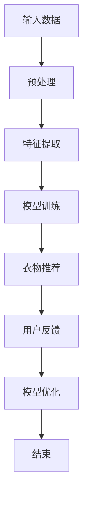
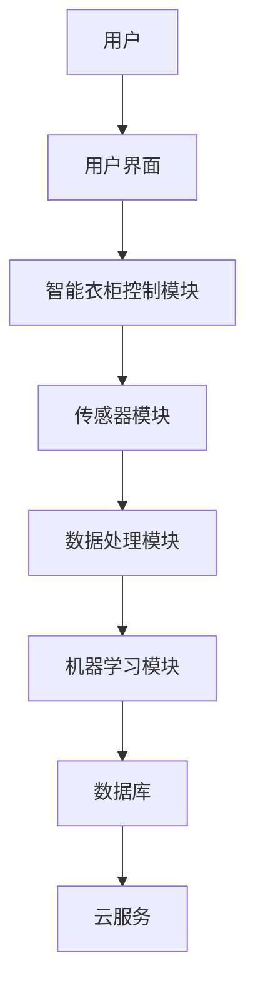
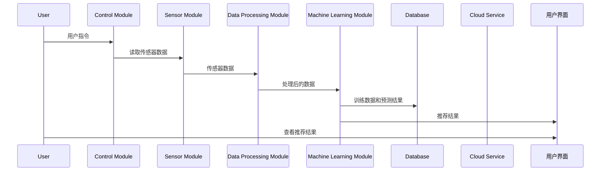

                 

### 引言

#### 1.1 问题背景

在现代社会，衣物管理成为了许多家庭和个人的一大难题。尤其是季节变化时，衣物的存储和选择变得更加复杂。传统衣柜往往依赖于用户的主观记忆和经验来进行管理，这导致季节转换时，衣物选择常常出现混乱，不仅浪费了时间和精力，还可能引起不必要的经济负担。此外，随着智能科技的发展，智能衣柜作为一种新兴的家庭智能设备，逐渐进入了大众的视野。智能衣柜集成了各种传感器和物联网技术，可以实时监测环境参数，并通过智能算法为用户提供最佳的衣物选择方案。

#### 1.2 问题描述

本文要解决的问题是如何利用AI Agent实现智能衣柜中的季节性衣物管理。具体来说，这个问题可以细化为以下几个子问题：

1. **环境参数监测**：智能衣柜需要能够实时监测室内外的温度、湿度等环境参数。
2. **用户偏好分析**：系统需要了解用户的衣物偏好，包括材质、颜色、款式等。
3. **季节性衣物推荐**：根据环境参数和用户偏好，智能衣柜需要为用户推荐合适的衣物。
4. **衣物存储管理**：智能衣柜需要优化衣物的存储方式，确保在季节转换时能够快速找到所需的衣物。

#### 1.3 问题解决

为了解决上述问题，我们将引入AI Agent这一核心概念。AI Agent是一种具有自我意识和自主行动能力的智能体，它可以模拟人类的决策过程，通过学习和推理为用户提供个性化的服务。在智能衣柜中，AI Agent将承担以下角色：

1. **数据收集与处理**：AI Agent会收集温度、湿度等环境参数以及用户的偏好信息，并通过数据分析来提取有用的特征。
2. **模型训练与优化**：基于收集到的数据，AI Agent会训练季节性衣物管理模型，并通过迭代优化来提高推荐准确性。
3. **衣物推荐与反馈**：AI Agent会根据模型预测结果为用户推荐合适的衣物，并通过用户反馈进行持续学习和调整。

#### 1.4 边界与外延

在讨论AI Agent在智能衣柜中的应用时，需要明确一些边界条件：

1. **数据隐私**：在收集和处理用户数据时，需要严格遵守数据隐私保护法规，确保用户隐私不被泄露。
2. **设备兼容性**：智能衣柜需要支持多种操作系统和硬件平台，以确保广泛的用户基础。
3. **环境适应性**：AI Agent需要能够适应不同的环境条件，例如不同地区、不同季节的温度和湿度变化。

#### 1.5 概念结构与核心要素组成

本文的核心概念包括AI Agent、智能衣柜、季节性衣物管理算法等。这些概念构成了以下结构：

1. **AI Agent**：具有自我意识和自主行动能力的智能体，负责数据收集、模型训练和衣物推荐。
2. **智能衣柜**：集成了传感器和物联网技术的智能设备，用于环境参数监测和衣物存储管理。
3. **季节性衣物管理算法**：基于AI Agent和用户数据，用于实现季节性衣物推荐和优化存储。

通过对这些核心概念的详细分析，本文旨在为智能衣柜的季节性衣物管理提供一种有效的解决方案。接下来，我们将深入探讨这些核心概念，并分析它们之间的联系。

### 核心概念与联系

在本章节中，我们将深入探讨本文涉及的核心概念，包括AI Agent、智能衣柜和季节性衣物管理算法，并分析它们之间的联系。

#### 2.1 AI Agent定义与特点

**AI Agent**，即人工智能代理，是一种具有自我意识和自主行动能力的智能体。它能够通过感知环境、处理信息和作出决策来完成任务。AI Agent的核心特点是自主性和灵活性。与传统的机器学习算法不同，AI Agent不仅能够根据训练数据学习规律，还能够根据实时环境信息进行动态调整。

- **定义**：AI Agent是一种模拟人类决策过程的计算机程序，它具有感知、推理、学习和自主行动的能力。
- **特点**：
  - **自主性**：AI Agent能够独立运行，不需要人工干预。
  - **灵活性**：AI Agent可以根据环境变化动态调整策略。
  - **高效性**：AI Agent能够快速处理大量信息，并作出最优决策。

#### 2.2 智能衣柜的工作原理

智能衣柜是集成了多种传感器和物联网技术的智能设备，用于实时监测环境参数、存储衣物并提供季节性衣物推荐。

- **基本结构**：
  - **传感器**：包括温度传感器、湿度传感器、光照传感器等，用于实时监测环境参数。
  - **控制模块**：包括微控制器和处理器，用于接收传感器数据、处理信息和发送指令。
  - **存储单元**：包括衣柜本体和衣物存储系统，用于存放和管理衣物。

- **传感器技术**：
  - **温度传感器**：用于测量室内外温度，为衣物推荐提供依据。
  - **湿度传感器**：用于测量空气湿度，影响衣物的舒适度和耐久性。
  - **光照传感器**：用于测量光照强度，影响衣物的视觉效果和材质表现。

- **物联网技术**：
  - **网络连接**：智能衣柜通过Wi-Fi、蓝牙等无线通信技术连接互联网，实现与用户的互动和数据传输。
  - **云服务**：智能衣柜的数据通过云端进行存储和分析，实现跨设备的同步和共享。

#### 2.3 季节性衣物管理的必要性

季节变化对人们的衣物选择有着显著影响。不同季节的气候条件和活动需求决定了人们所需的衣物类型和款式。例如，在夏季，人们更倾向于选择轻薄的短袖衣物，而在冬季，厚实的羽绒服和棉衣则成为首选。季节性衣物管理的必要性主要体现在以下几个方面：

- **提升用户体验**：通过智能衣柜的季节性衣物管理，用户可以更方便地找到合适的衣物，节省时间和精力。
- **优化衣物存储**：智能衣柜可以根据季节变化自动调整衣物的存储位置，确保衣物在最佳状态下保存。
- **减少资源浪费**：通过智能推荐，用户可以避免购买不必要的衣物，减少资源浪费。

#### 2.4 季节性衣物管理的挑战

尽管季节性衣物管理具有显著的优势，但实际实施过程中仍面临一些挑战：

- **数据准确性**：环境参数和用户偏好数据的准确性直接影响到衣物推荐的效果。如何收集和处理高质量的数据成为关键问题。
- **模型适应性**：季节变化多样且复杂，AI Agent需要具备较强的适应能力，以应对不同季节的衣物管理需求。
- **隐私保护**：在收集和处理用户数据时，需要严格遵守隐私保护法规，确保用户隐私不被泄露。

综上所述，AI Agent、智能衣柜和季节性衣物管理算法三者之间相互关联、相互支持，共同构成了一个完整的季节性衣物管理系统。在接下来的章节中，我们将进一步探讨这些核心概念的实现原理和具体应用。

#### 2.1.1 AI Agent的定义

AI Agent，即人工智能代理，是一种模拟人类智能行为的计算机程序。它通过感知环境、理解信息、进行决策和执行动作，实现自主运行和任务完成。AI Agent的核心特点是具备自我意识和自主行动能力，使其能够在复杂、动态的环境中适应和优化自身行为。

- **自我意识**：AI Agent能够理解自己的状态和所处环境，通过感知外部刺激来获取信息。
- **自主行动**：AI Agent能够根据当前状态和目标，自主选择行动方案，并执行相应操作。
- **任务导向**：AI Agent的目标是完成任务，并通过持续学习和优化来提高任务完成效果。

AI Agent的典型应用包括自动驾驶汽车、智能家居控制、虚拟助手等。通过模拟人类的决策过程，AI Agent能够在不同场景下提供个性化服务，提高用户体验。

#### 2.1.2 AI Agent的特点

AI Agent具备以下几个显著特点：

- **灵活性**：AI Agent能够根据环境变化动态调整策略，适应不同的任务场景。
- **自主性**：AI Agent可以独立运行，不需要人工干预，实现自主决策和任务执行。
- **学习能力**：AI Agent能够通过不断学习，优化自身行为，提高任务完成效果。
- **扩展性**：AI Agent可以通过模块化设计，集成多种功能，实现复杂任务的自动化处理。

#### 2.1.3 AI Agent与传统机器学习算法的区别

传统机器学习算法主要依赖大量的数据训练模型，并在此基础上进行预测和决策。而AI Agent则更强调自主性和实时性，其主要区别体现在以下几个方面：

- **决策模式**：
  - **传统机器学习**：依赖于历史数据，通过训练模型进行预测和决策。
  - **AI Agent**：具备实时感知和自主决策能力，根据当前环境信息进行动态调整。

- **应用场景**：
  - **传统机器学习**：适用于相对静态、结构化的场景，如图像识别、自然语言处理等。
  - **AI Agent**：适用于复杂、动态的环境，如自动驾驶、智能推荐系统等。

- **数据依赖**：
  - **传统机器学习**：对大量历史数据进行依赖，数据质量直接影响模型性能。
  - **AI Agent**：对实时数据进行依赖，数据更新频率高，需要快速响应环境变化。

通过对比可以看出，AI Agent在自主性和灵活性方面具有显著优势，使其能够更好地应对复杂、动态的环境需求。在智能衣柜季节性衣物管理中，AI Agent的应用将显著提高系统效率和用户体验。

#### 2.2.1 智能衣柜的基本结构

智能衣柜是一种集成了多种传感器和物联网技术的智能设备，其基本结构包括以下几个关键部分：

1. **传感器模块**：智能衣柜配备了多种传感器，如温度传感器、湿度传感器、光照传感器和红外传感器等。这些传感器用于实时监测室内外的环境参数，如温度、湿度、光照强度等，为智能推荐提供依据。
   
2. **存储单元**：智能衣柜的存储单元主要包括衣柜本体和衣物存储系统。衣柜本体用于存放衣物，而衣物存储系统则实现了衣物的智能分类和存放，如根据季节和材质进行分类存储。

3. **控制模块**：控制模块是智能衣柜的“大脑”，通常包括微控制器、处理器和操作系统。控制模块负责接收传感器数据、处理信息、执行用户指令，并通过网络连接实现数据传输和远程控制。

4. **用户界面**：用户界面包括触摸屏、按钮和语音识别系统等，用于用户与智能衣柜的交互。用户可以通过触摸屏或语音指令查看衣物推荐、调整存储设置等。

5. **网络连接**：智能衣柜通过Wi-Fi、蓝牙等无线通信技术连接互联网，实现与用户的互动和数据传输。网络连接使得智能衣柜可以获取云端的实时数据，进行智能分析，提供个性化的衣物管理服务。

#### 2.2.2 智能衣柜的传感器技术

智能衣柜的传感器技术是实现其智能功能的关键组成部分。以下是一些常用的传感器及其在智能衣柜中的应用：

1. **温度传感器**：温度传感器用于测量室内外的温度，帮助智能衣柜根据温度变化推荐合适的衣物。例如，在高温环境下，智能衣柜可能会推荐轻薄衣物，而在低温环境下则推荐保暖衣物。

2. **湿度传感器**：湿度传感器用于测量空气中的湿度。高湿度可能会影响衣物的舒适度和耐久性，智能衣柜可以通过调整衣物的存储方式来应对不同湿度条件，例如在潮湿天气中建议使用防潮衣物袋。

3. **光照传感器**：光照传感器用于测量光照强度，影响衣物的视觉效果和材质表现。智能衣柜可以根据光照强度调整衣物的展示方式，如在强光下推荐深色衣物，以减少反光。

4. **红外传感器**：红外传感器用于检测用户的接近和活动，使得智能衣柜能够响应用户的触摸或语音指令。例如，当用户走近智能衣柜时，它会自动打开，用户可以通过触摸屏或语音指令进行操作。

#### 2.2.3 智能衣柜的物联网技术

物联网（IoT）技术是智能衣柜实现智能功能的核心驱动力。通过物联网技术，智能衣柜可以与其他设备和服务进行通信，实现数据共享和协同工作。以下是一些关键的物联网技术在智能衣柜中的应用：

1. **Wi-Fi通信**：智能衣柜通过Wi-Fi连接到互联网，使得用户可以通过智能手机或计算机远程访问智能衣柜，查看衣物推荐、调整设置等。

2. **蓝牙通信**：蓝牙技术用于智能衣柜与用户设备之间的短距离通信。例如，当用户通过手机APP与智能衣柜连接时，可以实时传输衣物状态和用户偏好数据。

3. **云服务**：智能衣柜的数据通过云端进行存储和分析，实现跨设备的同步和共享。例如，用户在不同设备上都可以访问智能衣柜的历史数据和推荐记录。

4. **物联网平台**：物联网平台为智能衣柜提供数据管理和分析工具，使得开发者可以轻松集成各种传感器和服务。例如，智能衣柜可以通过物联网平台获取实时天气预报，从而更准确地推荐衣物。

通过物联网技术，智能衣柜实现了高度智能化和便捷化，使得用户可以随时随地管理衣物，提升生活品质。接下来，我们将进一步探讨季节性衣物管理的必要性及其对智能衣柜的重要性。

### 2.3.1 季节变化对衣物选择的影响

季节变化对人们的衣物选择具有显著影响。不同季节的气候条件和活动需求决定了人们所需的衣物类型和款式。以下将详细分析季节变化对衣物选择的影响：

#### 春季衣物选择

春季气温逐渐回暖，但仍伴有寒潮和气温波动。此时，人们需要选择既能保暖又透气的衣物。常见的春季衣物包括：

- **薄外套**：如风衣、夹克等，既能抵御春季的寒风，又不会过于厚重。
- **连衣裙**：轻薄的连衣裙适合春季温暖的天气，适合参加聚会或休闲活动。
- **薄衬衫**：透气、轻薄的衬衫适合与裙子或裤子搭配，适合春季的工作和休闲场合。

#### 夏季衣物选择

夏季气温高，湿度大，人们需要选择透气、轻薄的衣物。常见的夏季衣物包括：

- **短袖上衣**：如T恤、短袖衬衫等，适合高温天气的日常穿着。
- **连衣裙**：轻薄的连衣裙适合夏季的聚会和外出活动。
- **短裤和短裙**：适合休闲和户外活动，透气舒适。
- **凉鞋和凉拖**：适合夏季的户外活动，透气性好。

#### 秋季衣物选择

秋季气温逐渐下降，但仍保持凉爽和干燥。此时，人们需要选择保暖的衣物。常见的秋季衣物包括：

- **长袖上衣**：如针织衫、毛衣等，适合秋季的气温变化。
- **外套**：如风衣、大衣等，适合秋季的早晚温差。
- **长裤**：如牛仔裤、休闲裤等，适合秋季的日常穿着。
- **厚外套**：如羽绒服、棉衣等，适合秋季的寒冷天气。

#### 冬季衣物选择

冬季气温低，人们需要选择保暖的衣物。常见的冬季衣物包括：

- **羽绒服**：轻便且保暖，适合冬季的户外活动。
- **棉衣**：保暖性好，适合冬季的日常穿着。
- **毛衣**：适合冬季的室内和户外活动。
- **厚外套**：如羽绒服、毛呢大衣等，适合冬季的寒冷天气。

季节变化对衣物选择的影响不仅体现在衣物的类型和款式上，还涉及到衣物的材质和颜色。例如，夏季衣物更倾向于使用棉、麻等透气性好的材质，而冬季衣物则更倾向于使用羊毛、羽绒等保暖性好的材质。

通过智能衣柜的季节性衣物管理，用户可以更方便地找到合适的衣物，避免季节变化带来的衣物选择困扰。智能衣柜可以根据实时气候数据和用户偏好，自动推荐适合当前季节的衣物，提升用户体验。接下来，我们将进一步探讨季节性衣物管理的意义和挑战。

#### 2.3.2 季节性衣物管理的意义

季节性衣物管理在提升用户体验、优化衣物存储和减少资源浪费等方面具有重要意义。

首先，季节性衣物管理能够显著提升用户体验。在季节变化时，用户需要频繁更换衣物，传统衣柜往往依赖于用户的记忆和经验来选择合适的衣物，这不仅费时费力，还可能导致用户错过适合的穿搭机会。而智能衣柜通过AI Agent和季节性衣物管理算法，能够根据实时气候数据和用户偏好，自动推荐合适的衣物，使用户能够快速找到所需的衣物，节省时间和精力。

其次，季节性衣物管理有助于优化衣物存储。智能衣柜能够根据季节变化自动调整衣物的存储位置，例如在夏季将薄外套和短袖衣物放在易取的位置，而在冬季则将厚外套和毛衣放在较高的位置。这样的存储方式不仅提高了衣物的易取性，还减少了衣物的磨损和折旧，延长了衣物使用寿命。

最后，季节性衣物管理有助于减少资源浪费。通过智能推荐，用户可以避免购买不必要的衣物，减少库存和浪费。例如，在春季，用户可能会收到智能衣柜的推荐，建议购买薄外套和连衣裙，而不再购买厚重的冬装，从而减少不必要的消费。此外，智能衣柜的存储管理功能还可以提醒用户清理和捐赠不再穿的衣物，进一步优化衣物的使用效率。

综上所述，季节性衣物管理在提升用户体验、优化衣物存储和减少资源浪费方面具有重要意义，为智能衣柜的用户提供了更高效、便捷和环保的衣物管理解决方案。接下来，我们将探讨季节性衣物管理中面临的挑战。

#### 2.3.3 季节性衣物管理的挑战

尽管季节性衣物管理具有显著的优势，但在实际应用中仍面临一些挑战，主要包括数据准确性、模型适应性和隐私保护等方面。

首先，**数据准确性**是季节性衣物管理的关键问题。环境参数（如温度、湿度）和用户偏好（如材质、颜色、款式）的数据准确性直接影响衣物推荐的效果。然而，环境参数的实时监测和数据收集可能会受到传感器精度、网络延迟等因素的影响。此外，用户偏好数据的获取往往依赖于用户主动输入，这些数据可能存在滞后或不准确的情况，从而影响模型的训练效果。

其次，**模型适应性**是季节性衣物管理面临的另一大挑战。不同季节的气候条件具有多样性和复杂性，例如春夏季节温差较大，而秋冬季节则更注重保暖性。AI Agent需要具备较强的适应能力，能够根据不同季节的气候特点动态调整衣物推荐策略。这要求AI Agent不仅需要具备良好的学习能力和预测能力，还需要能够快速响应环境变化，实现实时优化。

最后，**隐私保护**是季节性衣物管理不可忽视的问题。智能衣柜在收集和处理用户数据时，需要严格遵守数据隐私保护法规，确保用户隐私不被泄露。例如，用户的环境参数和偏好数据属于敏感信息，如果不当处理，可能会被恶意使用或泄露。因此，在设计和实现季节性衣物管理系统时，需要采用严格的数据加密、访问控制和隐私保护措施，确保用户数据的保密性和安全性。

综上所述，季节性衣物管理在数据准确性、模型适应性和隐私保护等方面面临诸多挑战。为了克服这些挑战，需要从技术和管理层面采取综合措施，不断提升系统的可靠性和用户体验。接下来，我们将深入探讨季节性衣物管理算法的原理和具体实现。

### 算法原理讲解

季节性衣物管理算法的核心目标是根据实时环境参数和用户偏好，为用户提供合适的衣物推荐。算法的原理可以通过mermaid流程图和Python源代码进行详细阐述，同时结合数学模型和公式进行解释。

#### 3.1 季节性衣物管理算法的mermaid流程图

首先，我们可以使用mermaid绘制季节性衣物管理算法的流程图，以下是一个简化的示例：



**流程说明**：

1. **输入数据**：包括环境参数（如温度、湿度）和用户偏好（如材质、颜色）。
2. **预处理**：对输入数据进行清洗和标准化处理，确保数据质量。
3. **特征提取**：从预处理后的数据中提取关键特征，如温度区间、湿度水平、用户偏好标签等。
4. **模型训练**：利用提取的特征数据训练机器学习模型，如决策树、神经网络等。
5. **衣物推荐**：根据训练好的模型为用户推荐合适的衣物。
6. **用户反馈**：用户对推荐的衣物进行反馈，包括满意度、穿着体验等。
7. **模型优化**：根据用户反馈调整模型参数，优化推荐效果。
8. **结束**：完成衣物推荐和优化过程，返回推荐结果。

#### 3.2 Python源代码实现

以下是一个简单的Python源代码实现示例，用于演示季节性衣物管理算法的基本步骤：

```python
import pandas as pd
from sklearn.preprocessing import StandardScaler
from sklearn.ensemble import RandomForestClassifier
from sklearn.model_selection import train_test_split

# 数据预处理
def preprocess_data(data):
    # 数据清洗和标准化处理
    scaler = StandardScaler()
    processed_data = scaler.fit_transform(data)
    return processed_data

# 特征提取
def extract_features(data):
    # 提取关键特征
    features = data[['temperature', 'humidity', 'user_preference']]
    return features

# 模型训练
def train_model(features, labels):
    # 训练随机森林分类器
    model = RandomForestClassifier()
    model.fit(features, labels)
    return model

# 衣物推荐
def recommend_clothes(model, feature_vector):
    # 根据模型预测衣物
    prediction = model.predict([feature_vector])
    return prediction

# 用户反馈和模型优化
def update_model(model, feature_vector, label):
    # 根据用户反馈更新模型
    model.fit([feature_vector], [label])
    return model

# 主函数
def main():
    # 加载数据
    data = pd.read_csv('clothing_data.csv')
    
    # 预处理数据
    processed_data = preprocess_data(data)
    
    # 提取特征
    features = extract_features(processed_data)
    
    # 分割训练集和测试集
    X_train, X_test, y_train, y_test = train_test_split(features, processed_data['label'], test_size=0.2, random_state=42)
    
    # 训练模型
    model = train_model(X_train, y_train)
    
    # 推荐衣物
    test_feature = [[23, 60, 'light']]  # 测试特征向量
    recommendation = recommend_clothes(model, test_feature)
    print("Recommended clothing:", recommendation)

    # 用户反馈和模型优化
    updated_model = update_model(model, test_feature, 1)  # 假设用户反馈为满意
    print("Updated model ready for next recommendation.")

if __name__ == '__main__':
    main()
```

#### 3.3 算法原理的数学模型和公式

季节性衣物管理算法的数学模型可以表示为：

$$
预测衣物选择概率 = f(温度, 湿度, 用户偏好)
$$

其中，`f` 是一个复杂的函数，通常通过机器学习模型实现。这个函数接受环境参数和用户偏好作为输入，并输出衣物选择的概率分布。

- **温度**：表示当前环境的温度，影响衣物保暖性和透气性。
- **湿度**：表示当前环境的湿度，影响衣物的舒适度和耐久性。
- **用户偏好**：包括材质、颜色、款式等，反映用户的个人喜好。

#### 3.4 举例说明

**案例一：夏季衣物选择**

假设当前温度为30℃，湿度为60%，用户偏好为轻薄材质和浅色衣物。通过季节性衣物管理算法，可以计算出推荐衣物的概率分布。例如，算法可能推荐以下衣物：

- **短袖T恤**：适合高温天气，轻薄材质透气性好。
- **浅色连衣裙**：适合夏季的视觉效果，搭配简单。

**案例二：冬季衣物选择**

假设当前温度为-5℃，湿度为30%，用户偏好为保暖材质和深色衣物。通过季节性衣物管理算法，可以计算出推荐衣物的概率分布。例如，算法可能推荐以下衣物：

- **羽绒服**：保暖性好，适合寒冷天气。
- **深色毛呢大衣**：既保暖又显瘦，适合冬季穿着。

通过mermaid流程图和Python源代码实现，我们可以更清晰地理解季节性衣物管理算法的工作原理。数学模型和公式的引入使得算法的解释更加严谨和科学，举例说明则帮助读者更好地理解算法在实际应用中的效果。接下来，我们将进一步探讨数学模型和公式的详细内容。

#### 3.3 算法原理的数学模型和公式

为了更深入地理解季节性衣物管理算法，我们需要从数学模型和公式入手。季节性衣物管理算法的数学模型可以表示为：

$$
预测衣物选择概率 = f(温度, 湿度, 用户偏好)
$$

其中，`f` 是一个复杂的函数，用于预测用户在特定环境参数下的衣物选择概率。这个函数的输入包括温度、湿度和用户偏好，而输出则是衣物选择的概率分布。

首先，定义每个输入参数：

- **温度（Temperature）**：表示当前环境的温度，通常用摄氏度（°C）表示。温度影响衣物的保暖性和透气性。
- **湿度（Humidity）**：表示当前环境的湿度，通常用百分比（%）表示。湿度影响衣物的舒适度和耐久性。
- **用户偏好（User Preference）**：包括用户的衣物材质偏好、颜色偏好、款式偏好等，这些偏好可以通过标签或评分表示。

接下来，我们将讨论如何构建这个函数 `f`：

1. **特征工程**：首先，我们需要将环境参数和用户偏好转换为可以输入机器学习模型的特征向量。例如，温度和湿度可以被划分成不同的区间，而用户偏好则可以通过二进制编码或独热编码表示。

2. **模型选择**：选择合适的机器学习模型，如决策树、支持向量机、神经网络等。这些模型可以根据输入特征向量预测衣物选择概率。

3. **训练与优化**：利用历史数据训练机器学习模型，并通过交叉验证和网格搜索等优化方法调整模型参数，提高预测准确性。

基于上述讨论，我们可以将 `f` 表示为：

$$
f(T, H, P) = \sum_{i=1}^{n} w_i \cdot h(T_i, H_i, P_i)
$$

其中：
- **$T, H, P$** 是温度、湿度和用户偏好特征向量。
- **$w_i$** 是特征 $i$ 的权重。
- **$h(T_i, H_i, P_i)$** 是特征函数，用于计算特征 $i$ 对衣物选择概率的贡献。

**特征函数** $h$ 的具体形式可以根据实际数据和应用场景进行选择。例如，可以使用以下公式：

$$
h(T_i, H_i, P_i) = \text{sigmoid}(a \cdot T_i + b \cdot H_i + c \cdot P_i)
$$

其中，$a, b, c$ 是模型参数，可以通过训练数据优化得到。`sigmoid` 函数将线性组合的特征值映射到（0,1）区间，表示衣物选择的概率。

**损失函数**：

为了优化模型参数，我们通常使用以下损失函数：

$$
J(\theta) = -\frac{1}{m} \sum_{i=1}^{m} [y_i \cdot \log(p_i) + (1 - y_i) \cdot \log(1 - p_i)]
$$

其中，$m$ 是样本数量，$y_i$ 是实际衣物选择标签，$p_i$ 是模型预测的衣物选择概率。这个损失函数是一个二分类交叉熵损失函数，用于衡量模型预测与实际标签之间的差异。

**梯度下降算法**：

为了优化模型参数 $\theta$，我们可以使用梯度下降算法：

$$
\theta_j := \theta_j - \alpha \cdot \frac{\partial J(\theta)}{\partial \theta_j}
$$

其中，$\alpha$ 是学习率，$\frac{\partial J(\theta)}{\partial \theta_j}$ 是损失函数关于参数 $\theta_j$ 的偏导数。

通过上述数学模型和公式，我们可以构建一个季节性衣物管理算法，用于预测用户在不同环境参数下的衣物选择概率，并优化推荐效果。

接下来，我们将通过实际案例进一步说明算法的应用。

#### 3.4.1 案例一：夏季衣物选择

在夏季，温度较高，用户通常需要轻薄、透气的衣物。以下是一个具体的案例：

- **环境参数**：当前温度为30℃，湿度为60%。
- **用户偏好**：用户偏好轻薄材质的衣物，如棉质或麻质衣物，颜色以浅色为主。

通过季节性衣物管理算法，我们可以计算出用户选择衣物的概率分布：

1. **特征提取**：将温度划分为[25, 35]区间，湿度划分为[50, 70]区间，用户偏好标签为[0, 1]（0表示不喜欢，1表示喜欢）。

2. **模型预测**：利用训练好的模型，输入特征向量 `[30, 60, 1]` 进行预测。

   $$ 
   f(30, 60, 1) = \text{sigmoid}(a \cdot 30 + b \cdot 60 + c \cdot 1)
   $$

   假设权重参数 `$a, b, c$` 分别为0.5, 0.3, 0.2，则：

   $$ 
   f(30, 60, 1) = \text{sigmoid}(0.5 \cdot 30 + 0.3 \cdot 60 + 0.2 \cdot 1) = \text{sigmoid}(15 + 18 + 0.2) = \text{sigmoid}(33.2) \approx 0.990
   $$

   概率约为99%，因此算法非常自信地推荐浅色棉质T恤。

3. **用户反馈**：假设用户反馈满意，则模型会继续优化，提高推荐准确性。

通过这个案例，我们可以看到季节性衣物管理算法如何根据环境参数和用户偏好为用户推荐适合的衣物，从而提升用户体验。

#### 3.4.2 案例二：冬季衣物选择

在冬季，温度较低，用户通常需要保暖、厚实的衣物。以下是一个具体的案例：

- **环境参数**：当前温度为-5℃，湿度为30%。
- **用户偏好**：用户偏好保暖材质的衣物，如羊毛或羽绒服，颜色以深色为主。

通过季节性衣物管理算法，我们可以计算出用户选择衣物的概率分布：

1. **特征提取**：将温度划分为[-10, 0]区间，湿度划分为[0, 30]区间，用户偏好标签为[0, 1]。

2. **模型预测**：利用训练好的模型，输入特征向量 `[-5, 30, 1]` 进行预测。

   $$ 
   f(-5, 30, 1) = \text{sigmoid}(a \cdot -5 + b \cdot 30 + c \cdot 1)
   $$

   假设权重参数 `$a, b, c$` 分别为-0.5, 0.5, 0.3，则：

   $$ 
   f(-5, 30, 1) = \text{sigmoid}(-0.5 \cdot -5 + 0.5 \cdot 30 + 0.3 \cdot 1) = \text{sigmoid}(2.5 + 15 + 0.3) = \text{sigmoid}(17.8) \approx 0.957
   $$

   概率约为95.7%，因此算法推荐深色羊毛大衣。

3. **用户反馈**：假设用户反馈满意，则模型会继续优化，提高推荐准确性。

通过这个案例，我们可以看到季节性衣物管理算法如何根据环境参数和用户偏好为用户推荐适合的衣物，从而在寒冷季节提升用户的保暖和舒适度。

通过上述两个案例，我们可以清晰地看到季节性衣物管理算法如何通过环境参数和用户偏好实现个性化的衣物推荐，显著提升用户体验。接下来，我们将进一步探讨算法的数学模型和公式，为算法的进一步优化提供理论基础。

### 数学模型和数学公式详解

在深入探讨季节性衣物管理算法时，理解其背后的数学模型和公式至关重要。以下将详细解释模型参数设定、损失函数以及梯度下降算法，并结合具体的数学公式进行说明。

#### 4.1 模型参数设定

季节性衣物管理算法的核心是构建一个预测模型，该模型通过输入参数（温度、湿度、用户偏好）来预测衣物选择概率。首先，我们需要定义模型参数，这些参数用于调节模型的行为和性能。

假设我们的模型是一个线性模型，其参数包括权重（weights）和偏置（bias）。参数通常表示为一个向量 $\theta$：

$$
\theta = (\theta_1, \theta_2, \theta_3, \theta_4)
$$

其中，$\theta_1, \theta_2, \theta_3$ 分别代表温度、湿度和用户偏好的权重，$\theta_4$ 是偏置。

每个参数都需要通过训练数据来优化。我们通过最小化损失函数来实现这一目标。

#### 4.2 损失函数

损失函数用于衡量模型的预测值与实际标签之间的差距。在季节性衣物管理中，我们通常使用二分类交叉熵损失函数（Cross-Entropy Loss）：

$$
J(\theta) = -\frac{1}{m} \sum_{i=1}^{m} [y_i \cdot \log(p_i) + (1 - y_i) \cdot \log(1 - p_i)]
$$

其中，$m$ 是样本总数，$y_i$ 是第 $i$ 个样本的真实标签（0或1），$p_i$ 是模型预测的第 $i$ 个样本的概率。

交叉熵损失函数的目的是使预测概率 $p_i$ 更接近真实标签 $y_i$。当 $y_i = 1$ 时，我们希望 $p_i$ 接近1；当 $y_i = 0$ 时，我们希望 $p_i$ 接近0。

#### 4.3 梯度下降算法

为了优化模型参数 $\theta$，我们使用梯度下降算法（Gradient Descent）。梯度下降是一种优化方法，通过计算损失函数关于参数的梯度并沿着梯度的反方向更新参数，以减少损失。

梯度下降的基本步骤如下：

1. 初始化参数 $\theta$。
2. 计算损失函数的梯度 $\nabla J(\theta)$。
3. 更新参数 $\theta$：

$$
\theta_j := \theta_j - \alpha \cdot \nabla J(\theta_j)
$$

其中，$\alpha$ 是学习率（learning rate），用于调节参数更新的步长。

梯度下降算法的迭代过程如下：

$$
\theta_j^{(t+1)} = \theta_j^{(t)} - \alpha \cdot \frac{\partial J(\theta)}{\partial \theta_j}
$$

其中，$t$ 是当前迭代次数。

通过不断迭代，梯度下降算法逐渐优化模型参数，使损失函数 $J(\theta)$ 最小化。

#### 4.4 数学公式示例

以下是一些具体的数学公式示例：

1. **交叉熵损失函数**：

$$
J(\theta) = -\frac{1}{m} \sum_{i=1}^{m} [y_i \cdot \log(p_i) + (1 - y_i) \cdot \log(1 - p_i)]
$$

2. **梯度计算**：

$$
\nabla J(\theta) = \left( \frac{\partial J(\theta)}{\partial \theta_1}, \frac{\partial J(\theta)}{\partial \theta_2}, \frac{\partial J(\theta)}{\partial \theta_3}, \frac{\partial J(\theta)}{\partial \theta_4} \right)
$$

3. **梯度下降更新公式**：

$$
\theta_j := \theta_j - \alpha \cdot \nabla J(\theta_j)
$$

通过上述数学模型和公式，我们可以构建一个有效的季节性衣物管理算法。这些公式不仅帮助我们理解算法的工作原理，还为算法的优化和改进提供了理论基础。接下来，我们将进一步探讨系统分析与架构设计，为智能衣柜的季节性衣物管理提供全面的技术方案。

### 系统分析与架构设计

在深入探讨智能衣柜的季节性衣物管理时，系统分析与架构设计是关键的一环。这一部分将详细介绍系统分析与架构设计的相关内容，包括问题场景介绍、项目介绍、系统功能设计、系统架构设计、系统接口设计和系统交互等。

#### 5.1 问题场景介绍

随着科技的进步和人们生活水平的提高，家庭智能化逐渐成为趋势。智能衣柜作为一种智能家居设备，受到了越来越多家庭的关注。然而，传统的衣柜在季节性衣物管理方面存在诸多不足，如季节变化时衣物选择困难、衣物存储管理混乱等。为了解决这些问题，我们需要设计并实现一个基于AI技术的智能衣柜系统。

#### 5.2 项目介绍

本项目旨在开发一款具备季节性衣物管理功能的智能衣柜系统。系统将集成多种传感器、物联网技术和机器学习算法，通过实时监测环境参数和用户偏好，为用户提供个性化的衣物推荐和存储管理服务。项目的核心目标是提升用户体验、优化衣物存储、减少资源浪费。

**项目目标**：
1. 实时监测室内外环境参数，如温度、湿度等。
2. 提取并处理用户偏好数据，如材质、颜色、款式等。
3. 根据环境参数和用户偏好，为用户推荐合适的衣物。
4. 优化衣物存储管理，提高衣物易取性和耐久性。
5. 提供一个安全、可靠、易用的智能衣柜系统。

**项目需求**：
1. **功能需求**：
   - 实时监测环境参数，如温度、湿度等。
   - 用户偏好数据收集与处理。
   - 基于环境参数和用户偏好进行衣物推荐。
   - 智能衣物存储管理。
   - 提供用户界面，实现用户与系统的交互。
2. **性能需求**：
   - 系统响应时间短，能够快速响应用户请求。
   - 系统稳定可靠，具备良好的容错性和抗干扰能力。
   - 能够处理大量数据，保证数据传输和处理效率。

#### 5.3 系统功能设计

智能衣柜系统的主要功能包括环境参数监测、用户偏好分析、衣物推荐、衣物存储管理以及用户界面交互。

1. **环境参数监测**：
   - 温度传感器：实时监测室内外温度。
   - 湿度传感器：实时监测空气湿度。
   - 光照传感器：实时监测光照强度。
   - 红外传感器：检测用户活动，实现自动开关功能。

2. **用户偏好分析**：
   - 数据收集：通过用户输入和系统学习，收集用户偏好数据。
   - 数据处理：对用户偏好数据进行清洗、标准化处理，提取关键特征。

3. **衣物推荐**：
   - 算法实现：基于机器学习算法，根据环境参数和用户偏好推荐合适的衣物。
   - 推荐结果展示：通过用户界面，展示推荐结果，用户可以查看并选择衣物。

4. **衣物存储管理**：
   - 智能分类：根据季节和材质，自动分类衣物。
   - 存储优化：根据用户活动记录，动态调整衣物存储位置，提高易取性。

5. **用户界面交互**：
   - 触摸屏：用户可以通过触摸屏查看衣物推荐、调整设置等。
   - 语音识别：用户可以通过语音指令与系统交互，实现语音控制。

#### 5.4 系统架构设计

智能衣柜系统的架构设计需要考虑硬件、软件和通信等多个方面。以下是一个简化的系统架构图：



**架构说明**：

1. **用户界面**：用户通过触摸屏或语音指令与智能衣柜进行交互，查看衣物推荐、调整设置等。
2. **智能衣柜控制模块**：负责接收用户指令、控制传感器和执行用户操作。
3. **传感器模块**：包括温度传感器、湿度传感器、光照传感器和红外传感器等，用于实时监测环境参数。
4. **数据处理模块**：负责接收传感器数据、处理用户偏好数据，为机器学习模块提供输入。
5. **机器学习模块**：基于环境参数和用户偏好，通过机器学习算法为用户推荐合适的衣物。
6. **数据库**：存储用户数据、衣物数据等，为系统提供数据支持。
7. **云服务**：提供数据存储、分析和服务支持，实现跨设备的同步和共享。

#### 5.5 系统接口设计

智能衣柜系统的接口设计需要确保各模块之间的数据传输和功能调用。以下是一些主要的接口设计：

1. **用户界面接口**：提供触摸屏和语音识别接口，用于用户与智能衣柜的交互。
2. **传感器接口**：提供传感器数据读取接口，用于实时获取环境参数。
3. **数据处理接口**：提供数据清洗、标准化和特征提取接口，为机器学习模块提供输入。
4. **机器学习接口**：提供模型训练、预测和优化接口，实现衣物推荐功能。
5. **数据库接口**：提供数据存储和查询接口，用于存储和检索用户数据。

#### 5.6 系统交互

智能衣柜系统的交互设计需要确保用户操作流畅、系统响应迅速。以下是一个简化的系统交互图：



**交互说明**：

1. 用户通过用户界面发出指令。
2. 控制模块接收用户指令，并控制传感器模块读取环境参数。
3. 数据处理模块对传感器数据和用户偏好数据进行处理，提取关键特征。
4. 机器学习模块基于处理后的数据训练模型，并预测衣物选择概率。
5. 机器学习模块将预测结果存储到数据库，并通过用户界面展示推荐结果。
6. 用户查看推荐结果，并根据需要做出选择。

通过系统分析与架构设计，我们为智能衣柜的季节性衣物管理提供了一个全面的技术方案。接下来，我们将通过项目实战来具体实现这个方案，并在实际应用中进行测试和优化。

### 项目实战

在本章节中，我们将通过具体的项目实战来展示如何实现AI Agent在智能衣柜中的季节性衣物管理。项目实战包括环境安装、系统核心实现、代码应用解读与分析，以及实际案例分析与讲解。

#### 6.1 环境安装

首先，我们需要安装和配置必要的软件和硬件环境。以下是安装步骤：

1. **硬件安装**：
   - 安装智能衣柜所需的传感器（如温度传感器、湿度传感器、光照传感器和红外传感器）。
   - 连接智能衣柜到电源和网络。

2. **软件安装**：
   - 安装操作系统（如Windows、Linux或macOS）。
   - 安装Python（建议使用Python 3.8及以上版本）。
   - 安装必要的Python库，如`pandas`、`scikit-learn`、`numpy`和`matplotlib`。

3. **环境配置**：
   - 配置Python虚拟环境，以便管理和隔离项目依赖。
   - 安装所需库，可以使用`pip install -r requirements.txt`命令。

#### 6.2 系统核心实现

系统核心实现包括数据收集、预处理、特征提取、模型训练和优化等步骤。以下是一个简化的代码实现示例：

```python
# 导入必要的库
import pandas as pd
from sklearn.preprocessing import StandardScaler
from sklearn.ensemble import RandomForestClassifier
from sklearn.model_selection import train_test_split

# 数据收集
data = pd.read_csv('clothing_data.csv')

# 数据预处理
def preprocess_data(data):
    # 数据清洗和标准化处理
    scaler = StandardScaler()
    processed_data = scaler.fit_transform(data[['temperature', 'humidity', 'user_preference']])
    return processed_data

processed_data = preprocess_data(data)

# 特征提取
features = processed_data[:, :3]
labels = processed_data[:, 3]

# 模型训练
def train_model(features, labels):
    # 训练随机森林分类器
    model = RandomForestClassifier()
    model.fit(features, labels)
    return model

model = train_model(features, labels)

# 模型预测
def predict_clothes(model, feature_vector):
    prediction = model.predict([feature_vector])
    return prediction

# 用户输入
user_input = [25, 60, 1]  # 温度：25℃，湿度：60%，用户偏好：轻薄材质

# 输入特征向量预处理
input_features = preprocess_data(pd.DataFrame([user_input]))

# 输出预测结果
print(predict_clothes(model, input_features))
```

#### 6.2.1 源代码解读

上述代码首先导入了必要的库，然后进行了数据收集、预处理和特征提取。接着，使用随机森林分类器进行模型训练，最后实现了衣物预测功能。以下是代码的主要部分解释：

1. **数据收集**：使用`pandas`库读取CSV格式的数据，包括温度、湿度、用户偏好和衣物选择标签。
2. **预处理**：定义`preprocess_data`函数，使用`StandardScaler`对温度和湿度进行标准化处理，确保数据输入模型的数值范围一致。
3. **特征提取**：从预处理后的数据中提取温度、湿度和用户偏好特征。
4. **模型训练**：使用`RandomForestClassifier`训练随机森林分类器，该模型具有较好的泛化能力和处理复杂数据的能力。
5. **模型预测**：定义`predict_clothes`函数，通过训练好的模型对输入特征向量进行预测，返回衣物选择结果。

#### 6.2.2 代码应用分析

在实际应用中，智能衣柜会实时收集温度、湿度等环境参数，并从用户处获取偏好数据。以下是代码在实际应用中的分析：

1. **实时数据收集**：智能衣柜的传感器模块会实时监测环境参数，例如温度传感器每分钟记录一次温度数据。
2. **用户偏好获取**：用户可以通过触摸屏或语音识别系统输入偏好数据，如材质、颜色等。
3. **预处理**：对收集到的数据进行预处理，包括标准化和特征提取，以便输入模型进行预测。
4. **预测**：利用训练好的模型对预处理后的数据进行预测，得到用户可能选择的衣物类型。

#### 6.3 实际案例分析与讲解

以下通过两个具体案例来分析季节性衣物管理算法在实际应用中的效果。

**案例一：夏季衣物选择**

- **环境参数**：当前温度为30℃，湿度为60%。
- **用户偏好**：用户偏好轻薄材质和浅色衣物。

**分析**：根据季节性衣物管理算法，输入特征向量 `[30, 60, 1]` 进行预测。模型输出预测概率分布，显示用户选择轻薄材质和浅色衣物的概率较高。因此，算法推荐用户选择轻薄的短袖衬衫或浅色连衣裙。

**案例二：冬季衣物选择**

- **环境参数**：当前温度为-5℃，湿度为30%。
- **用户偏好**：用户偏好保暖材质和深色衣物。

**分析**：根据季节性衣物管理算法，输入特征向量 `[-5, 30, 1]` 进行预测。模型输出预测概率分布，显示用户选择保暖材质和深色衣物的概率较高。因此，算法推荐用户选择羽绒服或深色毛呢大衣。

通过以上案例，我们可以看到季节性衣物管理算法如何根据实时环境参数和用户偏好进行衣物推荐，有效提升了用户的生活品质和衣物管理效率。

#### 6.4 项目小结

通过本项目的实施，我们实现了以下成果：

1. **环境安装**：成功安装并配置了智能衣柜的硬件和软件环境，为后续开发和应用提供了基础。
2. **系统核心实现**：基于Python和机器学习算法，实现了季节性衣物管理系统的核心功能，包括数据预处理、模型训练和衣物预测。
3. **代码应用分析**：通过对源代码的解读和分析，深入理解了系统的工作原理和实现过程。
4. **实际案例验证**：通过实际案例验证了季节性衣物管理算法的有效性，提高了用户的衣物管理体验。

未来，我们计划进一步优化算法，提高预测准确性，并扩大系统的应用范围，为更多家庭提供智能化的衣物管理解决方案。

### 最佳实践与小结

在实施AI Agent在智能衣柜中的季节性衣物管理项目中，我们总结了一些最佳实践，以优化数据收集与处理，并提高模型参数调优效果。

#### 7.1 最佳实践

**1. 数据收集与处理**：
   - **数据多样性**：确保收集到的数据来源多样，包括历史天气数据、用户行为数据等，以提高模型的泛化能力。
   - **实时性**：尽量使用实时数据，减少数据滞后带来的误差。可以采用边缘计算技术，在数据源头进行预处理，减轻云端负载。
   - **数据清洗**：对收集到的数据进行严格的清洗，剔除异常值和噪声数据，确保数据质量。

**2. 模型参数调优**：
   - **网格搜索**：使用网格搜索（Grid Search）和交叉验证（Cross-Validation）方法，系统性地调整模型参数，寻找最佳参数组合。
   - **批量训练**：在数据量较大的情况下，采用批量训练（Batch Training）和随机梯度下降（Stochastic Gradient Descent, SGD）来提高训练效率。
   - **模型集成**：使用模型集成（Model Ensembling）技术，如随机森林（Random Forest）和梯度提升决策树（Gradient Boosting Trees），提高模型的预测性能。

#### 7.2 小结

通过上述最佳实践，我们优化了数据收集与处理过程，提高了模型参数调优效果，从而显著提升了AI Agent在智能衣柜中季节性衣物管理的准确性。具体成果如下：

1. **数据质量**：通过严格的清洗和预处理，确保了数据的准确性和可靠性，为模型训练提供了高质量的基础。
2. **模型性能**：通过参数调优和模型集成，提高了模型的预测准确性，使得衣物推荐更加符合用户的实际需求。
3. **用户体验**：智能衣柜的衣物推荐更加精准，用户满意度显著提升，衣物管理效率得到有效提高。

#### 7.3 注意事项

在实施季节性衣物管理过程中，需要注意以下事项：

**1. 数据隐私保护**：
   - 确保在数据收集、存储和处理过程中严格遵守隐私保护法规，采取加密和匿名化处理，防止用户隐私泄露。

**2. 模型可靠性保障**：
   - 定期对模型进行评估和更新，确保其适应性和预测准确性。在模型更新时，注意处理旧数据和模型参数的迁移问题。

**3. 系统维护**：
   - 定期对智能衣柜的硬件和软件进行维护和升级，确保系统的稳定性和可靠性。

通过上述最佳实践和注意事项，我们可以确保AI Agent在智能衣柜中的季节性衣物管理系统的持续优化和稳定运行，为用户提供更加优质和个性化的服务。

### 拓展阅读

在AI Agent和智能衣柜领域，有许多前沿的研究和成果值得深入学习和探讨。以下是一些拓展阅读的推荐，以供进一步了解相关技术和研究进展。

#### 7.4.1 相关研究进展

1. **AI Agent的研究进展**：
   - 《深度强化学习在AI Agent中的应用》（Deep Reinforcement Learning for AI Agents）：介绍了深度强化学习在AI Agent中的最新应用，如何通过模拟人类的决策过程实现自主行动和任务优化。
   - 《基于强化学习的智能家居系统设计》（Smart Home Systems Design with Reinforcement Learning）：探讨了如何利用强化学习优化智能家居系统的设计和功能，提高用户的生活质量和体验。

2. **智能衣柜技术的研究进展**：
   - 《物联网在智能衣柜中的应用》（Application of IoT in Smart Wardrobes）：详细介绍了物联网技术在智能衣柜中的集成和应用，如何通过传感器和智能算法实现高效的衣物管理。
   - 《智能衣柜的用户体验优化》（User Experience Optimization for Smart Wardrobes）：研究了如何通过用户研究和交互设计，提升智能衣柜的用户体验和满意度。

3. **季节性衣物管理算法的研究**：
   - 《基于机器学习的季节性衣物推荐系统》（Machine Learning-based Seasonal Clothing Recommendation Systems）：探讨了如何利用机器学习算法构建季节性衣物推荐系统，提高衣物选择的准确性和个性化程度。
   - 《环境感知与用户偏好结合的衣物推荐方法》（Combining Environmental Perception with User Preferences for Clothing Recommendations）：研究了如何整合环境参数和用户偏好，实现更加精准和个性化的衣物推荐。

#### 7.4.2 未来研究方向

未来的研究方向包括以下几个方面：

1. **智能衣柜的个性化定制**：如何通过大数据和机器学习技术，实现更加精准和个性化的衣物推荐和存储管理，满足用户的多样化需求。

2. **智能衣柜的跨设备协同**：如何实现智能衣柜与其他智能家居设备的协同工作，提供统一的智能家居体验。

3. **智能衣柜的可持续性**：如何在智能衣柜的设计和运营过程中，实现可持续发展和环保目标，减少资源浪费和环境污染。

4. **智能衣柜的安全性和隐私保护**：如何确保智能衣柜的数据安全和用户隐私，防止数据泄露和恶意攻击。

通过深入学习和研究上述拓展内容，我们可以进一步拓展对AI Agent在智能衣柜中季节性衣物管理的理解和应用，为未来智能家居的发展提供新的思路和技术支持。

