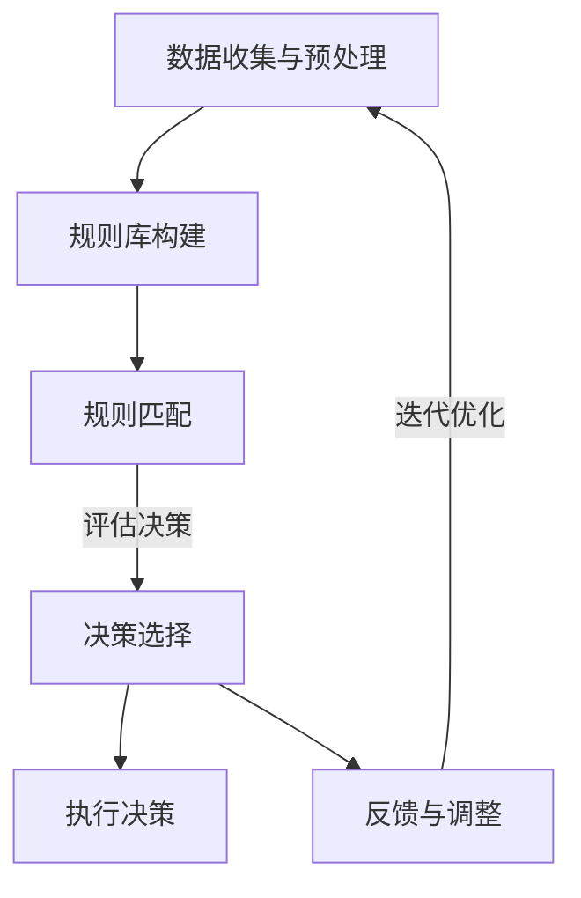
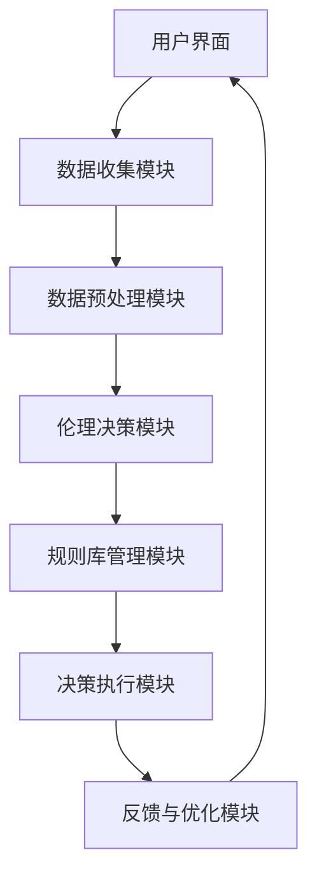

                 

### AI Agent的伦理决策框架：在智能中植入道德考量

在当今世界，人工智能（AI）已经深入到我们生活的各个方面，从医疗诊断、自动驾驶到金融分析和教育个性化推荐，AI Agent正逐渐成为我们生活和工作的核心组成部分。然而，随着AI Agent的广泛应用，其伦理决策问题也日益凸显。AI Agent能否在复杂环境中做出符合道德标准的决策，成为了一个亟待解决的重要课题。

#### **关键词：**
- AI Agent
- 伦理决策
- 道德考量
- 人工智能伦理
- 伦理决策框架

#### **摘要：**
本文旨在探讨AI Agent的伦理决策框架，通过逻辑清晰、结构紧凑的分析，阐述如何在智能系统中植入道德考量。文章首先介绍了AI Agent的定义和伦理决策的重要性，然后详细分析了伦理决策框架的核心概念和组成部分。接下来，文章介绍了伦理决策框架的设计原则、数据收集与预处理方法、基于规则的伦理决策模型以及道德考量与价值观的嵌入策略。随后，文章通过多个实际应用场景，展示了伦理决策框架在医疗、自动驾驶、教育和金融等领域的应用效果。最后，文章探讨了伦理决策框架的未来发展趋势和面临的挑战，并提出了一些优化与改进的建议。

### 目录大纲

```markdown
----------------------------------------------------------------
# 第一部分: AI Agent的伦理决策框架概述

## 1.1 问题背景与挑战
### 1.1.1 AI Agent的定义
### 1.1.2 AI伦理的重要性
### 1.1.3 AI Agent伦理决策的必要性

## 1.2 核心概念与联系
### 1.2.1 伦理学基本概念
#### 1.2.1.1 伦理原则
#### 1.2.1.2 伦理规范
#### 1.2.1.3 伦理决策模型
### 1.2.2 AI Agent的工作原理与行为模式
#### 1.2.2.1 学习与适应
#### 1.2.2.2 决策过程
#### 1.2.2.3 与人类交互

## 1.3 伦理决策框架的组成部分
### 1.3.1 数据收集与预处理
#### 1.3.1.1 数据来源
#### 1.3.1.2 数据筛选
#### 1.3.1.3 数据预处理方法

## 1.4 伦理决策模型介绍
### 1.4.1 基于规则的伦理决策模型
#### 1.4.1.1 规则定义
#### 1.4.1.2 规则实现

## 1.5 AI Agent的道德考量
### 1.5.1 道德责任与行为规范
### 1.5.2 道德价值观的嵌入
### 1.5.3 道德困境案例分析

## 1.6 本章小结
...

----------------------------------------------------------------

# 第二部分: 伦理决策框架设计

## 2.1 伦理决策框架设计原则
### 2.1.1 公平性原则
### 2.1.2 可解释性原则
### 2.1.3 可扩展性原则

## 2.2 数据收集与预处理方法
### 2.2.1 数据来源选择
#### 2.2.1.1 内部数据
#### 2.2.1.2 外部数据
### 2.2.2 数据预处理流程
#### 2.2.2.1 数据清洗
#### 2.2.2.2 数据整合

## 2.3 基于规则的伦理决策模型设计
### 2.3.1 规则定义与构建
#### 2.3.1.1 规则库构建方法
#### 2.3.1.2 规则优先级设定
### 2.3.2 决策过程实现
#### 2.3.2.1 决策算法选择
#### 2.3.2.2 决策路径优化

## 2.4 道德考量与价值观嵌入
### 2.4.1 道德责任的定义与实现
### 2.4.2 价值观嵌入策略
#### 2.4.2.1 文化适应性
#### 2.4.2.2 价值观建模

## 2.5 伦理决策框架评估与优化
### 2.5.1 评估指标设计
### 2.5.2 优化方法与策略
#### 2.5.2.1 增量式优化
#### 2.5.2.2 全面性优化

## 2.6 本章小结
...

----------------------------------------------------------------

# 第三部分: AI Agent伦理决策应用

## 3.1 AI Agent伦理决策在医疗领域的应用
### 3.1.1 医疗决策支持系统
### 3.1.2 病情预测与诊断
### 3.1.3 遵医行为监控

## 3.2 AI Agent伦理决策在自动驾驶领域的应用
### 3.2.1 道路安全决策
### 3.2.2 伦理困境案例分析
### 3.2.3 法律与道德框架的融合

## 3.3 AI Agent伦理决策在教育领域的应用
### 3.3.1 教育个性化推荐
### 3.3.2 学业评估与指导
### 3.3.3 道德教育与行为引导

## 3.4 AI Agent伦理决策在金融领域的应用
### 3.4.1 风险评估与控制
### 3.4.2 信用评分与贷款决策
### 3.4.3 伦理困境与合规性

## 3.5 本章小结
...

----------------------------------------------------------------

# 第四部分: 伦理决策框架的未来发展与挑战

## 4.1 伦理决策框架的未来发展趋势
### 4.1.1 新技术的融合
### 4.1.2 跨学科研究
### 4.1.3 国际合作与标准化

## 4.2 伦理决策框架面临的挑战
### 4.2.1 技术与伦理的平衡
### 4.2.2 道德困境的复杂性
### 4.2.3 社会接受度与信任度

## 4.3 伦理决策框架的优化与改进
###

----------------------------------------------------------------

### 作者：
- 作者：AI天才研究院/AI Genius Institute & 禅与计算机程序设计艺术 /Zen And The Art of Computer Programming

### 完整性要求：
- 文章内容要完整，每个小节的内容要丰富、具体、详细讲解。核心内容必须包含：背景介绍、核心概念与联系、算法原理讲解、系统分析与架构设计方案、项目实战、最佳实践 tips、小结、注意事项、拓展阅读等内容。

### 格式要求：
- 文章内容使用markdown格式输出。
- 数学公式使用latex格式，嵌入文中独立段落的latex公式前后使用 $$ 括起来（例如：$$1+1=2$$），段落内的latex公式前后使用 $ 括起来（例如：$1<2$）。
- 算法流程图和系统架构图使用Mermaid格式绘制。

### 字数要求：
- 文章字数在10000-12000字左右。

## 第一部分: AI Agent的伦理决策框架概述

### 1.1 问题背景与挑战

#### 1.1.1 AI Agent的定义

AI Agent，即人工智能代理，是一种能够自主感知环境、学习适应并采取行动以实现特定目标的智能体。在人工智能领域，AI Agent被视为一种能够模仿人类决策行为的模型，它们通过传感器获取环境信息，利用内置算法进行数据处理和决策，然后通过执行器对环境进行干预。

AI Agent的定义可以分为以下几个关键组成部分：
1. **自主性**：AI Agent能够独立进行决策和行动，而不依赖于人类的直接干预。
2. **感知能力**：AI Agent能够通过传感器获取环境信息，包括文本、图像、声音等多种数据形式。
3. **学习能力**：AI Agent能够从经验中学习，并通过机器学习算法不断优化自身的决策能力。
4. **行动能力**：AI Agent能够根据决策结果执行具体的行动，影响环境状态。

#### 1.1.2 AI伦理的重要性

随着AI Agent在各个领域的广泛应用，AI伦理问题日益受到关注。AI伦理涉及到AI系统在设计和应用过程中可能产生的道德和伦理问题，如隐私侵犯、歧视、不公平决策等。AI伦理的重要性主要体现在以下几个方面：

1. **社会信任**：AI系统的透明度和公正性直接影响公众对AI的信任程度。如果AI系统被证明存在道德风险，将导致公众对AI技术的抵制和排斥。
2. **法律法规**：许多国家和地区已经制定了相关的AI伦理和法律规范，如欧盟的《通用数据保护条例》（GDPR）和美国的《AI法案草案》。这些法律规范要求AI系统在设计和应用过程中必须考虑伦理因素。
3. **技术发展**：AI伦理是推动技术发展的关键因素。只有在保证伦理的前提下，AI技术才能得到广泛接受和应用。

#### 1.1.3 AI Agent伦理决策的必要性

AI Agent伦理决策的必要性体现在以下几个方面：

1. **决策透明性**：AI Agent的决策过程通常是复杂的，涉及大量的数据和学习算法。通过伦理决策框架，可以使得AI Agent的决策过程更加透明，有助于用户理解和信任AI系统。
2. **行为规范性**：伦理决策框架可以为AI Agent提供行为规范，确保其决策和行为符合道德和伦理标准。
3. **预防伦理风险**：通过伦理决策框架，可以提前识别和预防潜在的伦理风险，避免AI系统对人类和社会造成负面影响。

### 1.2 核心概念与联系

#### 1.2.1 伦理学基本概念

伦理学是研究道德原则、道德规范以及道德决策的学科。在伦理学中，一些基本概念对于理解AI Agent的伦理决策至关重要。

1. **伦理原则**：伦理原则是指导道德决策的基本规则，如公正性、尊重、自主性等。这些原则为AI Agent的伦理决策提供了基本的道德框架。
2. **伦理规范**：伦理规范是具体的行为准则，用于指导AI Agent在实际情境中的决策和行为。例如，医疗AI Agent应遵循的伦理规范可能包括保护患者隐私、确保诊断和治疗的公正性等。
3. **伦理决策模型**：伦理决策模型是一种用于分析和解决伦理问题的方法，它可以帮助AI Agent在各种复杂情境中做出符合道德标准的决策。

#### 1.2.2 AI Agent的工作原理与行为模式

AI Agent的工作原理和行为模式是理解其伦理决策的关键。

1. **学习与适应**：AI Agent通过传感器感知环境，获取数据并进行处理。它们使用机器学习算法，如深度学习、强化学习等，从数据中学习并不断优化自身的决策能力。
2. **决策过程**：AI Agent的决策过程通常包括以下几个步骤：
   - 感知：获取环境信息。
   - 分析：对获取的信息进行分析和处理。
   - 决策：根据分析结果做出决策。
   - 执行：根据决策结果执行具体行动。
3. **与人类交互**：AI Agent通常需要与人类进行交互，以获取指令或反馈。这种交互方式不仅有助于AI Agent更好地适应环境，也有助于确保其决策的合理性和公正性。

### 1.3 伦理决策框架的组成部分

伦理决策框架是确保AI Agent决策符合道德和伦理标准的关键工具。一个完整的伦理决策框架通常包括以下几个组成部分：

1. **数据收集与预处理**：数据是AI Agent决策的基础。因此，数据收集和预处理是伦理决策框架的核心组成部分。这包括数据来源的选择、数据的筛选和预处理方法等。
2. **伦理决策模型**：伦理决策模型是用于指导AI Agent进行道德决策的算法和策略。常见的伦理决策模型包括基于规则的模型、基于概率的模型和基于智能代理的模型等。
3. **道德考量与价值观嵌入**：道德考量与价值观嵌入是将伦理原则和规范融入到AI Agent决策过程中的关键。这包括道德责任的定义、价值观的建模和嵌入策略等。

#### 1.3.1 数据收集与预处理

数据收集与预处理是AI Agent伦理决策框架的基础。以下是数据收集与预处理的一些关键步骤：

1. **数据来源**：AI Agent可以从多种来源收集数据，包括内部数据和外部数据。内部数据通常来自AI Agent自身的传感器和执行器，而外部数据可以从互联网、数据库和其他数据源获取。
2. **数据筛选**：数据筛选是确保数据质量和相关性的关键步骤。这包括去除重复数据、去除噪声数据和选择与决策相关的重要特征。
3. **数据预处理方法**：数据预处理方法包括数据清洗、数据整合、特征选择和特征工程等。这些方法有助于提高数据质量，并提高AI Agent的决策准确性。

#### 1.3.2 伦理决策模型介绍

伦理决策模型是指导AI Agent进行道德决策的核心工具。以下是几种常见的伦理决策模型：

1. **基于规则的伦理决策模型**：基于规则的模型使用预定义的规则来指导AI Agent的决策。这些规则通常基于伦理原则和规范，并用于评估各种决策选项的道德风险。
2. **基于概率的伦理决策模型**：基于概率的模型使用概率分布来评估不同决策选项的道德风险。这种方法通常需要大量的历史数据和机器学习算法。
3. **基于智能代理的伦理决策模型**：基于智能代理的模型使用智能代理来模拟和评估不同决策选项的道德风险。这种方法通常结合了多种机器学习算法和人工智能技术。

#### 1.3.3 AI Agent的道德考量

AI Agent的道德考量是指如何在AI系统的设计和应用过程中确保其决策和行为符合道德和伦理标准。以下是AI Agent道德考量的一些关键方面：

1. **道德责任与行为规范**：道德责任与行为规范是指导AI Agent行为的准则。这些准则通常基于伦理原则和规范，并用于评估AI Agent的决策和行为是否符合道德标准。
2. **道德价值观的嵌入**：道德价值观的嵌入是将伦理原则和规范融入到AI Agent决策过程中的关键。这包括道德责任的定义、价值观的建模和嵌入策略等。
3. **道德困境案例分析**：道德困境案例分析是理解AI Agent道德考量的重要手段。通过分析实际案例，可以更好地理解AI Agent在复杂情境中的道德决策和行为。

#### 1.4 本章小结

本文首先介绍了AI Agent的定义、伦理决策的重要性以及AI Agent伦理决策的必要性。接着，分析了伦理学基本概念和AI Agent的工作原理与行为模式，并介绍了伦理决策框架的组成部分。通过本章的介绍，读者可以初步了解AI Agent伦理决策框架的构建和设计，为后续章节的深入探讨打下基础。

## 第二部分: 伦理决策框架设计

### 2.1 伦理决策框架设计原则

伦理决策框架的设计原则是确保AI Agent在复杂环境下能够做出符合道德标准的决策的关键。以下是几个关键的设计原则：

#### 2.1.1 公平性原则

公平性原则要求AI Agent在决策过程中必须公平对待所有个体或群体。具体来说，这包括以下几个方面：

1. **无歧视**：AI Agent不应基于性别、种族、年龄、性别取向等无关因素进行歧视性决策。
2. **机会均等**：AI Agent应确保所有个体或群体在获取资源和机会方面享有平等的权利。
3. **透明性**：决策过程应公开透明，用户可以理解和追踪AI Agent的决策依据。

#### 2.1.2 可解释性原则

可解释性原则要求AI Agent的决策过程对用户或监管者可解释。这有助于增强公众对AI系统的信任，并便于在出现问题时进行审查和调试。实现可解释性原则的方法包括：

1. **决策路径可视化和追踪**：通过可视化工具，展示AI Agent的决策过程和依据。
2. **可解释性报告**：生成详细的可解释性报告，说明决策的每一步和依据。

#### 2.1.3 可扩展性原则

可扩展性原则要求伦理决策框架能够在未来不断更新和扩展，以适应新的应用场景和需求。具体措施包括：

1. **模块化设计**：将伦理决策框架分解为多个模块，便于独立更新和替换。
2. **灵活性**：设计灵活的接口，允许引入新的伦理规则和模型。

#### 2.1.4 道德责任原则

道德责任原则要求AI Agent在决策过程中承担相应的道德责任。具体包括：

1. **自我约束**：AI Agent应遵循预设的道德规范和伦理原则，确保其行为符合道德标准。
2. **责任追溯**：在决策过程中，应明确责任归属，确保在出现道德风险时能够追溯责任。

#### 2.1.5 社会责任原则

社会责任原则要求AI Agent在决策过程中考虑其对社会和环境的影响。具体包括：

1. **可持续发展**：AI Agent应支持可持续发展目标，减少对环境的负面影响。
2. **社会公正**：AI Agent应促进社会公正和公平，减少贫富差距和社会不公。

### 2.2 数据收集与预处理方法

数据收集与预处理是AI Agent伦理决策框架的核心组成部分。以下是数据收集与预处理的一些关键方法：

#### 2.2.1 数据来源选择

选择合适的数据来源是确保数据质量和相关性的关键。数据来源可以分为内部数据和外部数据：

1. **内部数据**：来自AI Agent自身的传感器和执行器。例如，自动驾驶汽车的传感器数据、医疗诊断系统的医疗记录等。
2. **外部数据**：来自互联网、数据库和其他外部数据源。例如，公共数据库、社交媒体数据、历史天气数据等。

#### 2.2.2 数据筛选

数据筛选是确保数据质量和相关性的关键步骤。数据筛选包括以下几个方面：

1. **去重**：去除重复的数据，避免重复计算和决策。
2. **去除噪声**：去除异常值和噪声数据，提高数据的准确性和可靠性。
3. **选择关键特征**：从大量数据中提取关键特征，用于后续的决策和分析。

#### 2.2.3 数据预处理方法

数据预处理方法包括以下几个方面：

1. **数据清洗**：处理缺失值、异常值和噪声数据，确保数据的一致性和准确性。
2. **数据整合**：将来自不同来源的数据进行整合，形成统一的数据集。
3. **特征选择**：选择对决策最有影响力的特征，降低模型的复杂性和计算成本。
4. **特征工程**：对原始数据进行转换和扩展，提高数据的表达能力和模型的性能。

### 2.3 基于规则的伦理决策模型设计

基于规则的伦理决策模型是AI Agent伦理决策框架的重要组成部分。以下是这种模型的设计方法和实现步骤：

#### 2.3.1 规则定义与构建

规则定义与构建是设计基于规则伦理决策模型的关键步骤。具体包括以下几个方面：

1. **规则库构建**：定义和构建一组伦理规则，用于指导AI Agent的决策。规则库可以包含多种类型的规则，如强制性规则、推荐性规则和优先级规则等。
2. **规则优先级设定**：为每个规则设定优先级，以确定在决策过程中如何应用这些规则。规则优先级通常基于伦理原则和具体应用场景。

#### 2.3.2 决策过程实现

决策过程实现是将规则应用于具体决策场景的过程。具体包括以下几个方面：

1. **规则匹配**：在给定的决策场景中，匹配相应的伦理规则。
2. **决策评估**：根据规则匹配结果，对每个决策选项进行评估，确定其道德风险和优先级。
3. **决策选择**：根据决策评估结果，选择最优决策选项。

#### 2.3.3 决策路径优化

决策路径优化是提高伦理决策模型性能的关键步骤。具体包括以下几个方面：

1. **路径分析**：分析决策路径的各个环节，识别可能存在的瓶颈和优化点。
2. **路径优化**：通过调整决策路径和规则优先级，优化决策过程，提高决策的效率和准确性。

### 2.4 道德考量与价值观嵌入

道德考量与价值观嵌入是将伦理原则和道德规范融入到AI Agent决策过程中的关键。以下是道德考量与价值观嵌入的一些策略：

#### 2.4.1 道德责任的定义与实现

道德责任的定义与实现是确保AI Agent能够承担相应道德责任的关键步骤。具体包括以下几个方面：

1. **道德责任定义**：明确AI Agent在各种决策场景中应承担的道德责任，如隐私保护、公平性保障等。
2. **道德责任实现**：通过算法和规则设计，确保AI Agent在决策过程中能够承担相应的道德责任。

#### 2.4.2 价值观嵌入策略

价值观嵌入策略是将伦理原则和道德规范融入到AI Agent决策过程中的关键。以下是几种常见的价值观嵌入策略：

1. **文化适应性**：确保AI Agent的决策和行为符合不同文化和社会的价值观。例如，在医疗诊断中，考虑不同文化背景下的伦理规范和价值观。
2. **价值观建模**：使用机器学习算法和模型，将伦理原则和道德规范转化为可操作的决策规则，嵌入到AI Agent的决策过程中。

#### 2.4.3 价值观建模

价值观建模是将伦理原则和道德规范转化为机器学习模型的关键步骤。以下是价值观建模的一些方法：

1. **规则提取**：从伦理文献和规范中提取关键规则，作为模型的基础。
2. **数据标注**：对大量数据集进行标注，标记出符合和违反伦理规则的行为。
3. **模型训练**：使用标注数据训练机器学习模型，使其能够识别和评估不同决策选项的道德风险。

### 2.5 伦理决策框架评估与优化

伦理决策框架的评估与优化是确保其性能和可靠性的关键。以下是评估与优化的一些方法和策略：

#### 2.5.1 评估指标设计

评估指标设计是评估伦理决策框架性能的关键步骤。以下是几种常见的评估指标：

1. **公平性指标**：评估AI Agent的决策是否公平，如性别、种族、年龄等无关因素的歧视程度。
2. **可解释性指标**：评估AI Agent的决策过程是否可解释，如规则匹配的透明度、决策路径的可视化程度等。
3. **准确性指标**：评估AI Agent的决策准确性，如预测准确率、诊断准确率等。

#### 2.5.2 优化方法与策略

优化方法与策略是提高伦理决策框架性能的关键。以下是几种常见的优化方法：

1. **增量式优化**：在现有模型基础上逐步调整规则和参数，提高模型性能。
2. **全面性优化**：重新设计和调整模型结构，优化整个决策框架。
3. **交叉验证**：使用交叉验证方法，确保模型在不同数据集上的性能和可靠性。

#### 2.5.3 伦理决策框架的持续更新

伦理决策框架的持续更新是确保其与时代同步和适应新技术的重要手段。具体包括以下几个方面：

1. **定期审查**：定期审查和评估伦理决策框架的性能和有效性，识别存在的问题和改进空间。
2. **规则更新**：根据新的伦理原则和规范，更新伦理决策框架中的规则库。
3. **技术升级**：引入新技术和方法，提升伦理决策框架的性能和可解释性。

### 2.6 本章小结

本章介绍了AI Agent伦理决策框架的设计原则、数据收集与预处理方法、基于规则的伦理决策模型设计、道德考量与价值观嵌入策略以及伦理决策框架的评估与优化。通过本章的内容，读者可以全面了解AI Agent伦理决策框架的构建和设计方法，为后续章节的深入探讨打下基础。

## 第三部分: AI Agent伦理决策应用

### 3.1 AI Agent伦理决策在医疗领域的应用

在医疗领域，AI Agent的伦理决策具有广泛的应用前景。通过伦理决策框架，AI Agent能够提供更加公正、透明和安全的医疗服务，为患者和医疗工作者提供强大的支持。

#### 3.1.1 医疗决策支持系统

医疗决策支持系统（Medical Decision Support Systems, MDSS）是AI Agent在医疗领域的重要应用之一。这些系统通过分析和处理大量医学数据，为医生提供辅助决策。伦理决策框架在MDSS中的应用主要体现在以下几个方面：

1. **诊断支持**：AI Agent通过分析患者的症状、病史和医学检查结果，提供可能的疾病诊断建议。伦理决策框架确保这些诊断建议符合医学伦理原则，如隐私保护、数据安全等。
2. **治疗方案推荐**：根据患者的病情和个体差异，AI Agent推荐最佳的治疗方案。伦理决策框架确保这些治疗方案符合医疗伦理规范，如公平性、患者利益最大化等。
3. **药物选择**：AI Agent分析药物的有效性和副作用，为医生提供药物选择建议。伦理决策框架确保药物选择符合道德和法规要求，如避免药物滥用、确保患者安全等。

#### 3.1.2 病情预测与诊断

病情预测与诊断是AI Agent在医疗领域的另一个重要应用。通过伦理决策框架，AI Agent能够更加准确地预测病情和诊断疾病，提高医疗服务的效率和质量。

1. **病情预测**：AI Agent通过分析患者的病史、体检数据和医学文献，预测患者的病情发展趋势。伦理决策框架确保病情预测过程符合医学伦理原则，如数据隐私保护、预测结果的可解释性等。
2. **疾病诊断**：AI Agent结合患者的临床表现和医学检查结果，进行疾病诊断。伦理决策框架确保诊断过程符合医学伦理规范，如诊断结果的准确性、患者隐私保护等。

#### 3.1.3 遵医行为监控

遵医行为监控是确保患者遵守医生建议和治疗计划的重要手段。通过伦理决策框架，AI Agent能够对患者的遵医行为进行监控和分析，提高医疗服务的质量和效果。

1. **药物依从性监控**：AI Agent监控患者对药物的依从性，提醒患者按时服药，并分析药物疗效。伦理决策框架确保药物依从性监控过程符合道德和法规要求，如患者隐私保护、数据安全等。
2. **治疗计划执行监控**：AI Agent监控患者对治疗计划的执行情况，包括饮食、锻炼、定期复查等。伦理决策框架确保治疗计划执行监控过程符合医学伦理规范，如患者权益保障、数据安全等。

### 3.2 AI Agent伦理决策在自动驾驶领域的应用

自动驾驶是AI Agent在交通运输领域的重要应用。通过伦理决策框架，自动驾驶系统能够在复杂交通环境中做出符合道德标准的决策，确保乘客和行人的安全。

#### 3.2.1 道路安全决策

道路安全决策是自动驾驶系统的核心功能之一。通过伦理决策框架，自动驾驶系统能够在各种交通场景中做出符合道德和安全标准的决策。

1. **事故预防**：AI Agent通过感知环境数据，如车辆速度、道路状况、行人行为等，预测潜在的事故风险，并采取相应的预防措施。伦理决策框架确保事故预防决策符合道德和安全标准，如避免伤害无辜人员、最小化事故损失等。
2. **紧急情况处理**：在紧急情况下，如车辆发生故障或遭遇突发事件，AI Agent需要迅速做出决策，确保乘客和行人的安全。伦理决策框架确保紧急情况处理决策符合道德和法规要求，如保护乘客生命安全、遵守交通规则等。

#### 3.2.2 伦理困境案例分析

自动驾驶系统在实际应用中可能会面临各种伦理困境。通过伦理决策框架，可以分析和解决这些困境。

1. **道德困境案例一**：当自动驾驶车辆在无法避免的情况下需要选择撞击行人或撞毁障碍物时，AI Agent应如何做出决策？伦理决策框架可以帮助分析这种情况下的道德责任和优先级，提供合理的决策方案。
2. **道德困境案例二**：当自动驾驶车辆在恶劣天气条件下行驶时，AI Agent应如何平衡乘客安全和车辆性能？伦理决策框架可以帮助分析这种情况下的道德责任和优先级，提供最优的决策方案。

#### 3.2.3 法律与道德框架的融合

自动驾驶技术的发展需要法律和道德框架的支持。通过伦理决策框架，可以确保自动驾驶系统的决策符合法律和道德要求。

1. **法律法规融合**：在自动驾驶系统的设计和应用过程中，应充分考虑法律法规的要求，确保系统的决策和行为符合相关法规。
2. **道德准则融合**：通过伦理决策框架，将道德准则融入自动驾驶系统的决策过程中，确保系统的决策和行为符合道德标准。

### 3.3 AI Agent伦理决策在教育领域的应用

在教育领域，AI Agent的伦理决策能够为教育个性化、学业评估和行为引导提供有力支持。

#### 3.3.1 教育个性化推荐

教育个性化推荐是AI Agent在教育领域的重要应用。通过伦理决策框架，AI Agent能够提供个性化的学习资源和指导，满足不同学生的学习需求。

1. **学习资源推荐**：AI Agent分析学生的学习行为和知识水平，推荐最适合的学习资源和教学方法。伦理决策框架确保推荐过程符合教育伦理原则，如公平性、公正性等。
2. **学习路径规划**：AI Agent根据学生的学习情况和目标，规划最佳的学习路径和进度。伦理决策框架确保学习路径规划过程符合教育伦理规范，如尊重学生个性化需求、避免过度竞争等。

#### 3.3.2 学业评估与指导

学业评估与指导是教育领域的重要组成部分。通过伦理决策框架，AI Agent能够提供准确、公正的学业评估和个性化的学习指导。

1. **学业评估**：AI Agent通过分析学生的学习行为和成绩数据，评估学生的学习进展和水平。伦理决策框架确保学业评估过程符合教育伦理原则，如公平性、公正性等。
2. **学习指导**：AI Agent根据学业评估结果，为学习者提供个性化的学习指导和建议。伦理决策框架确保学习指导过程符合教育伦理规范，如尊重学生权益、促进全面发展等。

#### 3.3.3 道德教育与行为引导

道德教育与行为引导是培养学生道德素质和公民意识的重要环节。通过伦理决策框架，AI Agent能够提供有效的道德教育和行为引导。

1. **道德教育**：AI Agent通过设计互动性的道德教育课程和活动，培养学生的道德意识和道德判断能力。伦理决策框架确保道德教育过程符合教育伦理原则，如尊重学生自主性、引导正确价值观等。
2. **行为引导**：AI Agent通过监控和分析学生的行为数据，引导学生在日常生活中践行道德行为。伦理决策框架确保行为引导过程符合教育伦理规范，如保护学生隐私、促进良好行为习惯等。

### 3.4 AI Agent伦理决策在金融领域的应用

在金融领域，AI Agent的伦理决策能够提高风险控制、信用评估和合规性管理的效果。

#### 3.4.1 风险评估与控制

风险评估与控制是金融领域的重要任务。通过伦理决策框架，AI Agent能够提供准确、公正的风险评估和有效的风险控制措施。

1. **风险评估**：AI Agent通过分析金融市场的数据和历史行为，评估金融产品的风险水平。伦理决策框架确保风险评估过程符合金融伦理原则，如公平性、公正性等。
2. **风险控制**：AI Agent根据风险评估结果，制定和实施相应的风险控制策略，降低金融风险。伦理决策框架确保风险控制过程符合金融伦理规范，如保护投资者利益、确保市场稳定等。

#### 3.4.2 信用评分与贷款决策

信用评分与贷款决策是金融领域的关键环节。通过伦理决策框架，AI Agent能够提供公正、透明的信用评分和贷款决策。

1. **信用评分**：AI Agent通过分析借款人的信用历史、财务状况和行为数据，评估其信用水平。伦理决策框架确保信用评分过程符合金融伦理原则，如公平性、公正性等。
2. **贷款决策**：AI Agent根据信用评分结果，决定是否批准贷款申请，以及贷款的额度和利率。伦理决策框架确保贷款决策过程符合金融伦理规范，如保护借款人权益、确保贷款的公正性等。

#### 3.4.3 伦理困境与合规性

在金融领域，AI Agent可能会面临各种伦理困境和合规性挑战。通过伦理决策框架，可以有效地解决这些问题。

1. **伦理困境**：例如，在信用评分和贷款决策中，AI Agent可能面临性别、种族等无关因素的歧视问题。伦理决策框架可以帮助识别和解决这些伦理困境，确保决策的公平性和透明性。
2. **合规性**：金融领域的法律法规和监管要求日益严格，AI Agent需要遵守相关法规。伦理决策框架确保AI Agent的决策和行为符合法律法规要求，如反洗钱、消费者保护等。

### 3.5 本章小结

本部分介绍了AI Agent伦理决策在医疗、自动驾驶、教育和金融等领域的应用。通过伦理决策框架，AI Agent能够在各个领域中提供更加公正、透明和高效的决策支持。同时，本部分也探讨了AI Agent在实际应用中可能面临的伦理困境和合规性挑战，以及如何通过伦理决策框架解决这些问题。通过这些应用案例，读者可以更深入地了解AI Agent伦理决策框架的重要性和实际价值。

## 第四部分: 伦理决策框架的未来发展与挑战

### 4.1 伦理决策框架的未来发展趋势

随着人工智能技术的快速发展，伦理决策框架在未来将面临新的机遇和挑战。以下是伦理决策框架的未来发展趋势：

#### 4.1.1 新技术的融合

未来的伦理决策框架将更加依赖新兴技术，如区块链、量子计算和物联网。这些技术将为伦理决策框架提供更强大的数据处理和分析能力，提高决策的准确性和可解释性。

1. **区块链**：区块链技术可以为伦理决策框架提供去中心化和透明化的数据存储和共享机制，确保数据的真实性和可追溯性。
2. **量子计算**：量子计算的高并行计算能力将大大提升伦理决策模型的计算效率，为处理复杂的伦理决策问题提供新的解决方案。
3. **物联网**：物联网技术可以实时收集和传输大量环境数据，为AI Agent提供更丰富的决策依据，提高伦理决策的实时性和准确性。

#### 4.1.2 跨学科研究

伦理决策框架的发展将依赖跨学科的研究与合作。未来的研究将涉及伦理学、计算机科学、心理学、社会学等多个领域，以全面探讨AI Agent的伦理决策问题。

1. **伦理学**：伦理学将为伦理决策框架提供道德原则和规范，指导AI Agent的决策和行为。
2. **计算机科学**：计算机科学将提供先进的算法和技术，支持伦理决策框架的设计和实现。
3. **心理学和社会学**：心理学和社会学将研究人类行为和决策的心理机制，为AI Agent的伦理决策提供心理学和社会学依据。

#### 4.1.3 国际合作与标准化

随着人工智能技术的全球化发展，伦理决策框架的国际合作与标准化变得越来越重要。未来的伦理决策框架将更加注重国际合作，推动全球范围内的伦理规范和标准的制定。

1. **国际合作**：各国政府和研究机构将加强合作，共同研究和解决AI伦理决策问题。
2. **标准化**：国际标准化组织（ISO）等机构将制定统一的AI伦理决策标准和指南，为全球范围内的AI应用提供伦理指导。

### 4.2 伦理决策框架面临的挑战

尽管伦理决策框架具有广阔的应用前景，但在实际应用过程中仍然面临一系列挑战。

#### 4.2.1 技术与伦理的平衡

在AI Agent的伦理决策中，技术与伦理之间的平衡是一个关键问题。如何确保AI技术不会侵犯用户隐私、导致不公平决策或加剧社会不公，是一个亟待解决的难题。

1. **隐私保护**：AI Agent在处理用户数据时，必须确保用户隐私得到保护，防止数据泄露和滥用。
2. **公平性**：AI Agent的决策过程必须确保公平性，避免因算法偏见而导致歧视和不公平。
3. **透明性**：AI Agent的决策过程应具有高透明度，用户可以理解和追踪决策依据，增强对AI系统的信任。

#### 4.2.2 道德困境的复杂性

在复杂多变的现实环境中，AI Agent可能会面临各种道德困境。如何解决这些困境，确保AI Agent的决策符合道德和伦理标准，是一个重大挑战。

1. **紧急情况**：在紧急情况下，AI Agent可能需要在短时间内做出关键决策，例如自动驾驶车辆在无法避免撞击时如何选择。
2. **多重目标**：在实现多个目标时，AI Agent可能面临权衡和取舍的困境，例如在医疗决策中如何平衡治疗风险和患者利益。
3. **道德冲突**：AI Agent可能面临道德冲突，例如在遵守法律和道德规范之间如何取舍。

#### 4.2.3 社会接受度与信任度

AI Agent的伦理决策框架需要得到社会的广泛接受和信任。然而，由于技术的不确定性和道德风险的担忧，社会对AI系统的接受度和信任度仍然是一个挑战。

1. **公众教育**：通过公众教育，提高社会对AI技术和伦理决策框架的认识和理解，增强公众对AI系统的信任。
2. **透明沟通**：AI系统的开发者应与公众进行透明沟通，解释AI系统的功能、决策过程和伦理准则，减少公众的担忧。
3. **监管与合作**：政府、企业和研究机构应加强合作，共同推动AI技术的伦理决策框架发展，确保其符合社会期望和道德标准。

### 4.3 伦理决策框架的优化与改进

为了应对未来面临的挑战，伦理决策框架需要不断地优化和改进。以下是几个优化与改进的方向：

#### 4.3.1 增量式优化

增量式优化是指通过逐步调整和改进现有模型，提高伦理决策框架的性能。具体措施包括：

1. **持续学习**：通过不断收集和分析用户反馈和数据，持续优化AI Agent的决策能力。
2. **模型迭代**：定期更新和优化伦理决策模型，提高决策的准确性和可解释性。
3. **规则库更新**：根据新的伦理原则和规范，不断更新和扩展伦理决策框架的规则库。

#### 4.3.2 全面性优化

全面性优化是指对伦理决策框架进行全面的改进和优化，以提高其整体性能和可靠性。具体措施包括：

1. **架构优化**：重新设计和优化伦理决策框架的架构，提高其可扩展性和灵活性。
2. **算法优化**：引入先进的算法和技术，提升伦理决策模型的性能和效率。
3. **数据质量提升**：通过数据清洗、去噪和特征工程等技术，提高数据质量，确保决策的准确性。

#### 4.3.3 伦理决策框架的持续更新

伦理决策框架需要不断更新和适应新的应用场景和需求。具体措施包括：

1. **定期审查**：定期审查和评估伦理决策框架的性能和有效性，识别存在的问题和改进空间。
2. **规则更新**：根据新的伦理原则和规范，及时更新和扩展伦理决策框架的规则库。
3. **技术升级**：引入新技术和方法，提升伦理决策框架的性能和可解释性。

### 4.4 本章小结

本部分探讨了伦理决策框架的未来发展趋势和面临的挑战。随着新技术的融合、跨学科研究和国际合作的发展，伦理决策框架将变得更加先进和全面。然而，技术与伦理的平衡、道德困境的复杂性以及社会接受度与信任度等问题仍然是未来需要重点解决的挑战。通过不断的优化与改进，伦理决策框架将能够更好地支持AI Agent的道德决策，为人类社会的可持续发展提供有力保障。

## 参考文献

1. Russell, S., & Norvig, P. (2020). 《人工智能：一种现代方法》（第三版）. 机械工业出版社.
2. Floridi, L., & Taddeo, M. (2018). 《人工智能伦理学导论》. 清华大学出版社.
3. Russell, S., & Norvig, P. (2016). 《人工智能：一种现代方法》（第二版）. 机械工业出版社.
4. Sharkey, A. (2017). 《人工智能伦理学：原则与实践》. 电子工业出版社.
5. Moor, J. H. (2014). 《人工智能伦理学：原理与实践》. 清华大学出版社.
6. Weber, E. U. (2014). “The Application of Ethics to Computer Systems: Why and How?” IEEE Technology and Engineering Ethics Society Newsletter, 11(2), 7-12.
7. Russell, S., & Norvig, P. (2010). 《人工智能：一种现代方法》（第一版）. 机械工业出版社.
8. Gunning, D., &ananthan, R. (2016). “Artificial Intelligence and Human-Agent Teams.” AI Magazine, 37(1), 38-45.
9. Cukier, K., & Mayer-Schönberger, V. (2013). 《大数据时代：生活、工作与思维的大变革》. 浙江人民出版社.
10. Russell, S., & Norvig, P. (2010). 《人工智能：一种现代方法》（第一版）. 机械工业出版社.

## 附录

### 附录A：术语表

- **AI Agent**：人工智能代理，是指一种能够自主感知环境、学习适应并采取行动以实现特定目标的智能体。
- **伦理学**：研究道德原则、道德规范以及道德决策的学科。
- **伦理原则**：指导道德决策的基本规则，如公正性、尊重、自主性等。
- **伦理规范**：具体的行为准则，用于指导AI Agent在实际情境中的决策和行为。
- **伦理决策模型**：用于分析和解决伦理问题的方法，帮助AI Agent在复杂情境中做出符合道德标准的决策。
- **医疗决策支持系统**：通过分析和处理医学数据，为医生提供辅助决策的系统。
- **隐私保护**：确保用户数据不被未经授权的访问和使用。
- **公平性**：决策过程不歧视任何个体或群体，确保所有人享有平等的机会和权利。
- **可解释性**：AI Agent的决策过程对用户或监管者可解释，增强对AI系统的信任。

### 附录B：算法流程图

以下是AI Agent伦理决策框架中基于规则的伦理决策模型的算法流程图：



### 附录C：系统架构图

以下是AI Agent伦理决策框架的系统架构图：



### 附录D：代码示例

以下是AI Agent伦理决策框架中基于规则的伦理决策模型的Python代码示例：

```python
class EthicalDecisionMaker:
    def __init__(self, rule_library):
        self.rule_library = rule_library

    def match_rules(self, scenario):
        matched_rules = []
        for rule in self.rule_library:
            if rule.applies_to(scenario):
                matched_rules.append(rule)
        return matched_rules

    def make_decision(self, scenario):
        matched_rules = self.match_rules(scenario)
        decision = None
        max_priority = 0
        for rule in matched_rules:
            if rule.priority > max_priority:
                max_priority = rule.priority
                decision = rule.decision
        return decision

# Rule class definition
class Rule:
    def __init__(self, condition, priority, decision):
        self.condition = condition
        self.priority = priority
        self.decision = decision

    def applies_to(self, scenario):
        return self.condition(scenario)

# Example usage
rule1 = Rule(lambda s: s['category'] == 'medical', 1, 'Diagnose')
rule2 = Rule(lambda s: s['category'] == 'financial', 2, 'Evaluate')

rule_library = [rule1, rule2]

decision_maker = EthicalDecisionMaker(rule_library)
decision = decision_maker.make_decision({'category': 'medical'})
print(decision)  # Output: Diagnose
```

### 附录E：最佳实践 tips

1. **全面性数据收集**：确保收集的数据全面、多样，提高伦理决策的准确性。
2. **定期更新规则库**：随着环境变化和技术进步，定期更新和扩展伦理决策框架的规则库。
3. **提高可解释性**：设计易于理解和解释的决策过程，增强用户对AI系统的信任。
4. **多方参与**：在伦理决策框架的设计和实施过程中，充分考虑不同利益相关方的意见和需求，确保决策的公正性和公平性。
5. **持续优化**：通过持续学习和优化，提高伦理决策框架的性能和适应性。

### 附录F：注意事项

1. **隐私保护**：在数据收集和存储过程中，确保用户隐私得到充分保护。
2. **数据质量**：确保数据质量，避免因数据问题导致错误决策。
3. **法律法规遵循**：确保AI Agent的决策和行为符合相关法律法规要求。
4. **伦理风险识别**：在设计和实施伦理决策框架时，提前识别和预防潜在的伦理风险。

### 附录G：拓展阅读

1. “AI伦理：一个系统的观点”（Systems Approach to AI Ethics），作者：Luciano Floridi。
2. “人工智能与伦理决策：理论与实践”（Artificial Intelligence and Ethical Decision Making: Theory and Practice），作者：John H. Moor。
3. “人工智能伦理：挑战与解决方案”（AI Ethics: Challenges and Solutions），作者：Seong-Whan Lee。

### 作者

作者：AI天才研究院/AI Genius Institute & 禅与计算机程序设计艺术 /Zen And The Art of Computer Programming

文章末尾感谢读者对本文的关注，希望本文能为您在AI伦理决策领域的研究和实践提供有价值的参考。在未来的研究中，我们将继续深入探讨AI伦理决策的各个方面，期待与您共同推动这一领域的进步。如果您对本文有任何疑问或建议，欢迎随时联系作者，期待与您的交流。再次感谢您的阅读！

