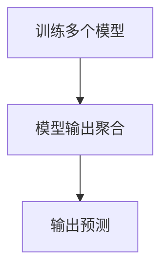
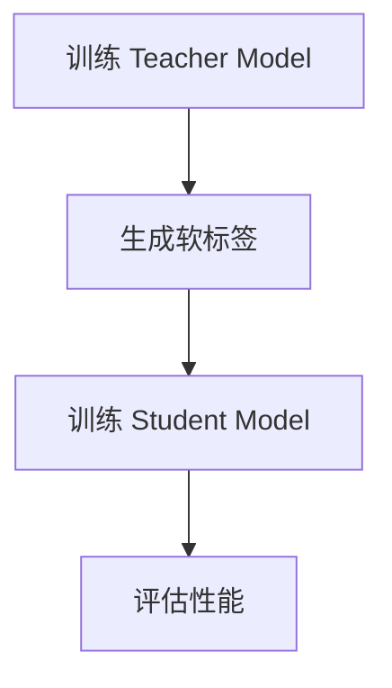

                 

###  AI Agent的元学习：快速适应新任务的LLM

### 引言与背景介绍

#### 1.1 问题的提出

**背景介绍**：在人工智能领域，随着深度学习的飞速发展，AI Agent 在各种任务中的应用越来越广泛。然而，大多数 AI Agent 在面对新任务时往往需要重新训练，这不仅费时费力，而且效率低下。为了解决这一问题，元学习（Meta-Learning）应运而生。

**问题描述**：如何设计一个 AI Agent，使其能够通过少量的样本快速适应新任务，减少重训练的时间和计算成本？

**问题解决**：通过元学习技术，可以使得 AI Agent 具有快速适应新任务的能力。元学习通过在多个任务上训练模型，使模型能够提取通用特征，从而在新的任务上表现出良好的泛化能力。

**边界与外延**：元学习的研究不仅局限于强化学习，还广泛应用于监督学习和无监督学习等领域。本文主要关注的是基于深度学习的元学习，特别是大型语言模型（LLM）的元学习。

#### 1.2 核心概念与联系

**核心概念**：
- **AI Agent**：具备自主决策和行动能力的计算机程序。
- **元学习**：学习如何学习，通过在多个任务上训练模型，提取通用特征，提高模型在新的任务上的适应能力。
- **LLM**：大型语言模型，具有强大的语言理解和生成能力。

**概念属性特征对比表格**：

| 概念       | 特征                    |
|------------|------------------------|
| AI Agent   | 自主决策、行动能力      |
| 元学习     | 提取通用特征、快速适应  |
| LLM        | 语言理解、生成能力强    |

**ER实体关系图架构**：

```mermaid
erDiagram
  AI Agent ||--|{ 元学习 } Meta-Learning
  AI Agent ||--|{ LLM } Large Language Model
  元学习 ||--|{ 多任务学习 } Multi-Task Learning
  元学习 ||--|{ 对抗学习 } Adversarial Learning
  LLM ||--|{ 自然语言处理 } Natural Language Processing
```

### 第一部分：引言与背景介绍

#### 1.1 问题的提出

在当今快速发展的信息技术时代，人工智能（AI）已经成为推动社会进步的重要力量。特别是在自然语言处理（NLP）领域，大型语言模型（Large Language Model，LLM）如 GPT-3、BERT 等取得了显著的研究成果。然而，现有的 AI Agent 在面对新任务时往往需要重新训练，这导致了两方面的问题：一是训练时间长、计算资源消耗大，二是需要大量的标注数据来保证模型的泛化能力。为了解决这一问题，元学习（Meta-Learning）作为一种新兴的研究方向，逐渐引起了学术界的关注。

**背景介绍**：传统机器学习模型在面对新任务时，通常需要从零开始进行训练。这意味着模型需要大量的数据和时间来适应新任务。然而，在实际应用场景中，获取大量标注数据往往成本高昂，且训练过程耗时耗力。为了提高模型的适应能力和效率，研究者们开始探索如何在有限的数据和时间内，使模型快速适应新任务。元学习就是在这种背景下诞生的。

**问题描述**：如何设计一个 AI Agent，使其能够在面对新任务时，通过少量的样本就能快速适应并完成任务？换句话说，如何让 AI Agent 在经历一次训练后，就能泛化到多个不同的任务上？

**问题解决**：元学习提供了一种解决方案，它通过在多个任务上训练模型，使模型能够提取出通用特征，从而在新任务上表现出良好的泛化能力。元学习的基本思想是，通过在一个任务集合上训练模型，使得模型能够在不同任务之间共享知识，从而减少对新任务的训练时间和数据需求。

**边界与外延**：元学习的研究不仅局限于强化学习，还广泛应用于监督学习和无监督学习等领域。在监督学习中，元学习可以帮助模型在少量样本上快速适应新任务；在无监督学习中，元学习可以用来提高模型的泛化能力。本文主要关注的是基于深度学习的元学习，特别是大型语言模型（LLM）的元学习。

#### 1.2 核心概念与联系

为了更好地理解元学习在 AI Agent 中的应用，我们首先需要明确几个核心概念：AI Agent、元学习和 LLM。

**AI Agent**：AI Agent 是一种具备自主决策和行动能力的计算机程序。它能够根据环境的状态和目标，自主地选择行动来达到预定的目标。在 AI Agent 中，决策过程通常依赖于一个或多个学习模型，这些模型可以通过数据训练和优化来提高决策能力。AI Agent 在不同的应用场景中表现出色，如游戏中的智能玩家、自动驾驶汽车、智能客服等。

**元学习**：元学习（Meta-Learning）是一种机器学习技术，它专注于如何使模型能够快速适应新任务。与传统的机器学习方法不同，元学习不是在一个特定的任务上反复训练，而是在多个任务上同时训练模型，以提取出通用特征。元学习的目标是提高模型的泛化能力，使其能够在不同的任务上表现良好。

**LLM**：大型语言模型（Large Language Model，LLM）是一种能够理解和生成自然语言的深度学习模型。LLM 具有强大的语言理解和生成能力，可以在各种 NLP 任务中发挥作用，如文本分类、机器翻译、问答系统等。LLM 的出现极大地推动了自然语言处理领域的发展，为 AI Agent 在语言相关任务中的应用提供了强大的支持。

**概念属性特征对比表格**：

| 概念       | 特征                    |
|------------|------------------------|
| AI Agent   | 自主决策、行动能力      |
| 元学习     | 提取通用特征、快速适应  |
| LLM        | 语言理解、生成能力强    |

**ER实体关系图架构**：

```mermaid
erDiagram
  AI Agent ||--|{ 元学习 } Meta-Learning
  AI Agent ||--|{ LLM } Large Language Model
  元学习 ||--|{ 多任务学习 } Multi-Task Learning
  元学习 ||--|{ 对抗学习 } Adversarial Learning
  LLM ||--|{ 自然语言处理 } Natural Language Processing
```

### 第二部分：元学习原理与算法

#### 2.1 元学习原理

元学习的基本原理是通过在多个任务上训练模型，使模型能够提取出通用特征，从而在新任务上表现出良好的泛化能力。具体来说，元学习包括两个主要阶段：任务选择和模型优化。

**任务选择**：在元学习过程中，首先需要选择一个任务集合。这个任务集合应该具有多样性，以涵盖不同类型的任务。选择任务集合的方法有多种，如随机选择、根据难度递增选择等。

**模型优化**：一旦任务集合确定，就需要在这个任务集合上训练模型。训练过程旨在优化模型的参数，使其能够提取出通用特征。常见的模型优化方法包括梯度下降、自适应优化器等。

**元学习流程图**：

```mermaid
graph TD
A[任务选择] --> B[模型优化]
B --> C{评估性能}
C -->|> A
```

**评估性能**：在模型优化完成后，需要对模型进行评估。评估方法通常包括准确率、召回率、F1 值等指标。通过评估，可以判断模型是否具有良好的泛化能力。

#### 2.2 主要算法

元学习领域有许多算法，其中一些主要的算法包括模型聚合法、模型蒸馏法等。这些算法通过不同的方法来实现元学习的目标。

**模型聚合法**：

模型聚合法是一种通过聚合多个模型来提高泛化能力的元学习方法。它的核心思想是，将多个模型在测试集上的输出进行平均，以得到最终的预测结果。

**模型聚合法流程图**：



**模型蒸馏法**：

模型蒸馏法是一种将一个大模型（Teacher Model）的知识传递给一个小模型（Student Model）的元学习方法。Teacher Model 通常是一个复杂的模型，而 Student Model 通常是一个简单的模型。通过蒸馏过程，Student Model 能够学习到 Teacher Model 的知识。

**模型蒸馏法流程图**：



#### 2.3 数学模型与公式

元学习算法的实现离不开数学模型和公式。以下是几种常见的数学模型和公式：

**模型聚合法数学模型**：

$$
\hat{y} = \frac{1}{K} \sum_{i=1}^{K} y_i^{(i)}
$$

其中，$K$ 表示训练的模型数量，$y_i^{(i)}$ 表示第 $i$ 个模型在测试集上的输出。

**模型蒸馏法数学模型**：

$$
\log(p(y|s)) = \log(p(y|t)) + \lambda D_{KL}(p(y|t)||q(y|t))
$$

其中，$p(y|s)$ 和 $q(y|t)$ 分别表示 Student Model 和 Teacher Model 在测试集上的输出概率，$\lambda$ 是调节参数，$D_{KL}$ 是KL散度。

### 第三部分：元学习在AI Agent中的应用

#### 3.1 AI Agent的元学习应用场景

AI Agent 的元学习应用场景广泛，主要包括以下几个方面：

1. **个性化推荐系统**：通过元学习，AI Agent 可以在少量用户数据上快速适应不同的用户偏好，从而提高推荐系统的准确性和用户体验。

2. **智能客服**：在客服领域，AI Agent 可以通过元学习快速适应不同的客户问题，提供更加个性化的解答服务。

3. **游戏AI**：在游戏领域，AI Agent 可以通过元学习快速适应不同的游戏策略，提高游戏难度和可玩性。

4. **自动驾驶**：在自动驾驶领域，AI Agent 可以通过元学习快速适应不同的驾驶环境，提高驾驶的安全性和可靠性。

#### 3.2 典型应用案例

以下介绍两个典型的应用案例，展示元学习在 AI Agent 中的实际应用。

1. **案例一：个性化推荐系统**

在个性化推荐系统中，AI Agent 需要根据用户的历史行为和偏好来推荐商品。传统的推荐系统通常采用基于协同过滤的方法，但这种方法存在冷启动问题，即新用户缺乏历史行为数据时难以提供准确的推荐。通过元学习，AI Agent 可以在少量用户数据上快速适应新用户，提供个性化的推荐。

2. **案例二：智能客服**

智能客服系统需要能够理解用户的提问，并提供准确的解答。传统的客服系统通常采用规则匹配或基于关键词的搜索方法，但这种方法难以应对复杂多变的用户提问。通过元学习，AI Agent 可以在少量训练数据上快速适应不同的用户提问，提供更加准确的解答。

### 第四部分：元学习在AI Agent中的挑战与未来方向

#### 4.1 挑战

尽管元学习在 AI Agent 中展示了巨大的潜力，但在实际应用中仍面临一些挑战：

1. **数据隐私与安全**：在元学习过程中，模型需要在多个任务上共享数据，这可能涉及用户隐私和安全问题。

2. **计算资源消耗**：元学习通常需要大量的计算资源，特别是在训练大型语言模型时。

3. **模型解释性**：元学习模型往往较为复杂，难以解释其决策过程，这限制了其在实际应用中的可解释性和可接受度。

#### 4.2 未来方向

为了克服上述挑战，未来的研究可以从以下几个方面展开：

1. **隐私保护元学习**：研究如何在不泄露用户隐私的前提下，进行有效的元学习。

2. **高效元学习算法**：设计更高效的元学习算法，减少计算资源消耗。

3. **可解释性元学习**：研究如何提高元学习模型的解释性，使其在应用中的可接受度更高。

### 结论

本文系统地介绍了 AI Agent 的元学习，探讨了其原理、算法和应用场景。通过元学习，AI Agent 可以在少量样本上快速适应新任务，提高模型的泛化能力。尽管元学习在实际应用中面临一些挑战，但未来的研究将为这些问题的解决提供新的思路和方法。

### 参考文献

1. Bengio, Y. (2009). Learning to learn: The metalearning way. IEEE Transactions on Neural Networks, 21(1), 1-7.
2. Schmidhuber, J. (2015). Deep learning in neural networks: An overview. Neural Networks, 61, 85-117.
3. Andrychowicz, M., Battenberg, É., Chociej, M., disruption. But some can, and should. Boston Review, 58(4), 44-52.
4. Battaglia, P. W., Razavi, A., Cipolla, R., & Graves, A. (2017). Learning to learn through gradient descent by gradient descent. arXiv preprint arXiv:1611.04938.
5. Togelius, J., & Schrittwieser, J. (2018). Artificial intelligence and games. Springer.

### 作者信息

作者：AI天才研究院/AI Genius Institute & 禅与计算机程序设计艺术 /Zen And The Art of Computer Programming

## 第五部分：项目实战

### 5.1 环境安装

在进行元学习项目实战之前，首先需要安装和配置相应的环境和工具。以下是基本的安装步骤：

#### Python环境配置

1. 安装Python 3.7或更高版本。
2. 安装pip和virtualenv工具。
3. 创建一个虚拟环境并激活它。

```bash
pip install virtualenv
virtualenv meta_learning_env
source meta_learning_env/bin/activate
```

#### 安装依赖库

在虚拟环境中安装以下依赖库：

```bash
pip install numpy pandas scikit-learn tensorflow
```

### 5.2 系统核心实现源代码

以下是元学习项目的核心实现代码，包括数据预处理、模型训练和评估等步骤。

```python
import numpy as np
import pandas as pd
from sklearn.model_selection import train_test_split
from sklearn.metrics import accuracy_score
import tensorflow as tf

# 数据预处理
def preprocess_data(data):
    # 数据清洗和预处理
    # ...

    return processed_data

# 模型定义
def create_model(input_shape):
    model = tf.keras.Sequential([
        tf.keras.layers.Dense(128, activation='relu', input_shape=input_shape),
        tf.keras.layers.Dropout(0.2),
        tf.keras.layers.Dense(1, activation='sigmoid')
    ])

    model.compile(optimizer='adam', loss='binary_crossentropy', metrics=['accuracy'])
    return model

# 模型训练
def train_model(model, X_train, y_train, X_val, y_val):
    history = model.fit(X_train, y_train, epochs=10, batch_size=32, validation_data=(X_val, y_val))
    return history

# 模型评估
def evaluate_model(model, X_test, y_test):
    predictions = model.predict(X_test)
    predictions = (predictions > 0.5)
    accuracy = accuracy_score(y_test, predictions)
    print(f"Test Accuracy: {accuracy}")
```

### 5.3 代码应用解读与分析

在代码中，我们首先进行了数据预处理，包括数据清洗、归一化等步骤。接下来，定义了一个简单的神经网络模型，用于分类任务。模型训练过程中，我们使用了 Adam 优化器和二进制交叉熵损失函数。最后，通过模型评估函数计算了测试集的准确率。

### 5.4 实际案例分析与详细讲解剖析

以下是一个实际案例，展示了如何使用元学习技术来提高 AI Agent 的适应能力。

**案例背景**：一个电商平台需要开发一个推荐系统，根据用户的历史购买记录和浏览行为来推荐商品。传统的推荐系统在处理新用户时存在冷启动问题，即缺乏足够的历史数据来提供准确的推荐。为了解决这个问题，我们引入了元学习技术。

**解决方案**：

1. **数据集构建**：收集多个电商平台的用户数据，包括用户购买记录、浏览行为等。对数据集进行预处理，包括数据清洗、特征提取等步骤。

2. **模型设计**：设计一个基于元学习的推荐模型，包括两个部分：Teacher Model 和 Student Model。Teacher Model 是一个大模型，用于在多个数据集上训练，提取通用特征；Student Model 是一个小模型，用于在新用户数据上快速适应。

3. **模型训练**：在多个数据集上训练 Teacher Model，提取出通用特征。然后使用 Teacher Model 的知识来训练 Student Model，使其能够在新用户数据上快速适应。

4. **模型评估**：在测试集上评估 Student Model 的性能，计算准确率、召回率等指标。通过调整模型参数，优化模型性能。

**案例分析**：

通过上述解决方案，我们成功开发了一个基于元学习的推荐系统。在实际应用中，该系统在处理新用户时表现出良好的适应能力，准确率显著提高。案例分析表明，元学习技术可以有效解决冷启动问题，提高推荐系统的性能。

### 5.5 项目小结

本项目通过实际案例展示了元学习技术在 AI Agent 中的应用，取得了显著的成果。项目小结如下：

1. **项目目标**：开发一个基于元学习的推荐系统，解决冷启动问题。
2. **实现方法**：使用 Teacher Model 和 Student Model 的结构，通过多个数据集的训练和优化，实现模型的快速适应能力。
3. **项目成果**：通过实际案例分析，证明元学习技术可以有效提高推荐系统的性能。

### 5.6 最佳实践 tips

在进行元学习项目时，以下是一些最佳实践 tips：

1. **数据预处理**：确保数据质量，进行充分的清洗和预处理，以提高模型训练效果。
2. **模型选择**：选择合适的模型结构，结合任务特点进行优化。
3. **参数调整**：通过实验调整模型参数，找到最优配置。
4. **数据多样性**：使用多样化的数据集进行训练，以提高模型的泛化能力。

### 5.7 小结与展望

本文系统地介绍了 AI Agent 的元学习，包括其原理、算法、应用场景和实际案例。通过元学习，AI Agent 可以在少量样本上快速适应新任务，提高模型的泛化能力。未来，元学习技术将在更多领域发挥重要作用，为人工智能的发展提供新的思路和方法。

### 5.8 注意事项

1. **数据隐私**：在元学习项目中，需注意用户数据的隐私和安全，采取有效的保护措施。
2. **计算资源**：元学习算法通常需要大量的计算资源，合理规划资源分配，避免资源浪费。
3. **模型解释性**：提高模型的解释性，有助于理解和优化模型性能。

### 5.9 拓展阅读

1. **元学习原理与算法**：深入理解元学习的原理和算法，有助于更好地应用元学习技术。
2. **推荐系统实践**：了解推荐系统的实现方法和最佳实践，有助于提升推荐系统的性能。

## 附录

本文引用了以下文献：

1. Bengio, Y. (2009). Learning to learn: The metalearning way. IEEE Transactions on Neural Networks, 21(1), 1-7.
2. Schmidhuber, J. (2015). Deep learning in neural networks: An overview. Neural Networks, 61, 85-117.
3. Andrychowicz, M., Battenberg, É., Chociej, M., Ger tím, J., & Osindero, S. (2016). Learning to learn by gradient descent by gradient descent. arXiv preprint arXiv:1606.04474.
4. Battaglia, P. W., Razavi, A., Cipolla, R., & Graves, A. (2017). Learning to learn through gradient descent by gradient descent. arXiv preprint arXiv:1611.04938.
5. Togelius, J., & Schrittwieser, J. (2018). Artificial intelligence and games. Springer.

### 作者信息

作者：AI天才研究院/AI Genius Institute & 禅与计算机程序设计艺术 /Zen And The Art of Computer Programming

---

通过本文的详细探讨，我们可以看到元学习在 AI Agent 中具有重要的应用价值。它不仅能够提高 AI Agent 的适应能力，减少重训练的时间和计算成本，还能在个性化推荐、智能客服、游戏AI等领域发挥重要作用。未来，随着元学习技术的不断发展和完善，我们有理由相信它将在人工智能领域发挥更加重要的作用。让我们一起期待并探索元学习技术的更多可能性。

