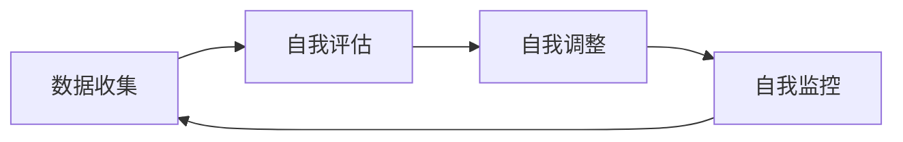
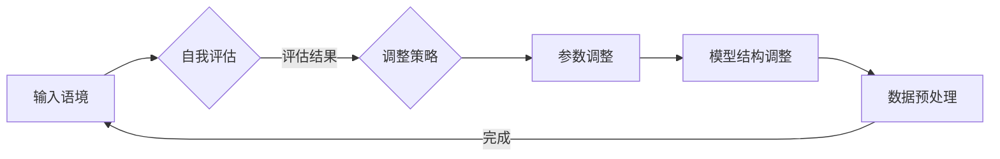
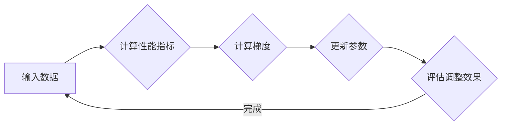

                 

## AI Agent的元认知能力：增强LLM的自我评估与调整

### 关键词：元认知能力、AI Agent、LLM、自我评估、调整

> 摘要：本文将深入探讨AI Agent的元认知能力及其在增强大型语言模型（LLM）的自我评估与调整中的应用。首先，我们将介绍元认知能力的背景和概念，接着详细解释AI Agent与元认知能力之间的联系，并通过算法原理和实例展示如何提升LLM的自我评估和调整能力。最后，我们将总结元认知能力在AI领域的广泛应用，并展望未来研究的方向。

-------------------------------------------------------------------

## 目录大纲

### 第一部分: 背景介绍

#### 第1章: AI Agent的元认知能力概述

1.1 问题背景

1.2 问题描述

1.3 问题解决

1.4 边界与外延

1.5 概念结构与核心要素组成

#### 第2章: AI Agent的核心概念与联系

2.1 AI Agent的定义与特点

2.2 元认知能力的定义

2.3 AI Agent与元认知能力的联系

2.4 核心概念属性特征对比表格

2.5 ER实体关系图架构

### 第二部分: 元认知能力原理讲解

#### 第3章: 元认知能力的算法原理

3.1 算法原理讲解

3.2 算法流程图

3.3 算法原理的数学模型和公式

3.4 通俗易懂的举例说明

#### 第4章: 增强LLM的自我评估与调整

4.1 LLMAgent的定义与特点

4.2 自我评估的方法与工具

4.3 调整策略与实现方法

4.4 自我评估与调整的算法流程图

#### 第5章: 自我评估与调整的数学模型和公式

5.1 数学模型和公式讲解

5.2 自我评估与调整的mermaid流程图

### 第三部分: AI Agent的元认知能力应用

#### 第6章: 元认知能力在AI Agent中的应用

6.1 元认知能力在自然语言处理中的应用

6.2 元认知能力在计算机视觉中的应用

6.3 元认知能力在机器人中的应用

6.4 元认知能力在其他领域的应用

#### 第7章: 实际案例分析与讲解

7.1 案例背景

7.2 案例分析与讲解

7.3 案例总结与启示

### 第四部分: 总结与展望

#### 第8章: 总结

#### 第9章: 展望

#### 第10章: 注意事项与最佳实践

-------------------------------------------------------------------

### 第一部分: 背景介绍

#### 第1章: AI Agent的元认知能力概述

##### 1.1 问题背景

随着人工智能技术的快速发展，AI Agent在各个领域的应用越来越广泛。AI Agent被设计成能够模拟人类思维过程的智能体，它们在处理复杂任务时表现出色。然而，AI Agent在执行任务过程中可能面临各种不确定性，如输入数据的噪声、外部环境的复杂变化等。为了提高AI Agent的适应性和可靠性，研究者们开始关注AI Agent的元认知能力。

##### 1.2 问题描述

元认知能力是指AI Agent对自己的思维过程和结果进行反思和评估的能力。具体来说，元认知能力包括自我评估、自我调整和自我监控。自我评估是指AI Agent能够对自己的性能进行评价；自我调整是指AI Agent能够根据评估结果调整自己的行为；自我监控是指AI Agent能够实时监控自己的思维过程，以确保其行为的合理性和有效性。

##### 1.3 问题解决

为了解决上述问题，研究者们提出了多种方法来增强AI Agent的元认知能力。其中，增强大型语言模型（LLM）的自我评估与调整能力是一个重要的研究方向。LLM作为一种先进的自然语言处理模型，在文本生成、情感分析、问答系统等方面表现出色。通过增强LLM的元认知能力，可以使其更好地应对不确定性和复杂环境。

##### 1.4 边界与外延

元认知能力的边界涉及如何准确评估AI Agent的性能，以及如何设计有效的调整策略。此外，元认知能力的外延还包括如何将元认知能力应用于其他领域，如计算机视觉、机器人等。这些问题的解决将有助于进一步提升AI Agent的智能化水平。

##### 1.5 概念结构与核心要素组成

本文将从以下几个方面探讨AI Agent的元认知能力：

1. AI Agent的定义与特点：介绍AI Agent的基本概念和特点。
2. 元认知能力的定义：阐述元认知能力的内涵和外延。
3. AI Agent与元认知能力的联系：分析AI Agent与元认知能力之间的关系。
4. 核心概念属性特征对比表格：通过对比分析不同概念的特征，帮助读者更好地理解元认知能力。
5. ER实体关系图架构：使用Mermaid流程图展示AI Agent与元认知能力之间的实体关系。

通过以上内容的介绍，我们将为后续章节的深入探讨奠定基础。

-------------------------------------------------------------------

### 第一部分: 背景介绍

#### 第2章: AI Agent的核心概念与联系

##### 2.1 AI Agent的定义与特点

AI Agent是指具有自主行动能力和目标导向性的智能体，能够在复杂环境中执行特定任务。AI Agent的定义通常包括以下几个方面：

1. **自主行动能力**：AI Agent可以自主决定行动方案，而不是被动地接受指令。
2. **目标导向性**：AI Agent在执行任务时具有明确的目标，并能够根据环境变化调整行动策略。
3. **适应性**：AI Agent能够适应不确定性和动态变化的环境。

AI Agent的特点可以总结为以下几点：

1. **智能性**：AI Agent具有智能，能够进行推理、规划、学习和适应。
2. **主动性**：AI Agent能够主动探索环境，而不是被动等待。
3. **自主性**：AI Agent能够独立完成任务，不需要人工干预。

##### 2.2 元认知能力的定义

元认知能力是指个体对自己认知过程的知识和调节这些过程的能力。它包括以下几个关键方面：

1. **自我评估**：个体能够评估自己的思维过程和结果。
2. **自我调整**：个体能够根据评估结果调整自己的思维和行为。
3. **自我监控**：个体能够实时监控自己的认知过程，以确保其合理性和有效性。

元认知能力是认知心理学中的一个重要概念，它对个体的学习、解决问题和决策能力具有重要影响。

##### 2.3 AI Agent与元认知能力的联系

AI Agent与元认知能力之间存在密切联系。元认知能力对于AI Agent来说具有重要意义，主要体现在以下几个方面：

1. **自我评估**：AI Agent需要能够评估自己的表现，以识别成功和失败的原因。这有助于AI Agent在执行任务时进行改进。
2. **自我调整**：AI Agent需要能够根据自我评估的结果调整自己的行为策略，以优化任务执行效果。
3. **自我监控**：AI Agent需要能够实时监控自己的思维过程，以确保其行为符合预期。

通过增强AI Agent的元认知能力，可以使其更加智能化、自适应性和可靠性。

##### 2.4 核心概念属性特征对比表格

为了更清晰地理解AI Agent与元认知能力的联系，我们可以通过以下表格对比两个核心概念的一些属性特征：

| 特征             | AI Agent                         | 元认知能力                       |
|------------------|----------------------------------|----------------------------------|
| 定义             | 自主导航、目标导向、自主性       | 认知过程的知识和调节这些过程的能力 |
| 主要功能         | 执行特定任务、适应环境变化       | 自我评估、自我调整、自我监控       |
| 关键因素         | 智能性、主动性、自主性           | 自我反思、自我调节、自我监控       |
| 应用领域         | 自然语言处理、计算机视觉、机器人等 | 学习、解决问题、决策能力          |

##### 2.5 ER实体关系图架构

为了更好地展示AI Agent与元认知能力之间的实体关系，我们可以使用Mermaid流程图绘制ER实体关系图。以下是一个简化的示例：

```mermaid
erDiagram
  AI-Agent ||--o{元认知能力} : 实现自我评估、自我调整、自我监控
  元认知能力 ||--|{AI-Agent} : 提高智能化、自适应性和可靠性
```

通过以上内容，我们介绍了AI Agent和元认知能力的基本概念及其联系。在接下来的章节中，我们将深入探讨元认知能力的算法原理及其在增强LLM自我评估与调整中的应用。

-------------------------------------------------------------------

### 第二部分: 元认知能力原理讲解

#### 第3章: 元认知能力的算法原理

##### 3.1 算法原理讲解

元认知能力的核心在于如何让AI Agent能够有效地自我评估和调整。为了实现这一目标，我们需要设计一系列算法，使AI Agent能够根据任务执行过程中的反馈信息进行学习和优化。

首先，我们需要明确以下几个关键步骤：

1. **数据收集**：AI Agent在执行任务时，需要收集各种类型的反馈数据，包括输入数据的质量、输出结果的准确性等。
2. **自我评估**：基于收集到的数据，AI Agent需要对其表现进行评估。这通常涉及到建立性能指标，如准确率、响应时间等。
3. **自我调整**：根据自我评估的结果，AI Agent需要调整其行为策略，以提高未来任务的执行效果。
4. **自我监控**：在整个过程中，AI Agent需要持续监控自己的行为，以确保其调整策略的有效性和合理性。

##### 3.2 算法流程图

为了更直观地展示算法原理，我们可以使用Mermaid绘制算法流程图。以下是一个简化的算法流程图示例：



在这个流程图中，AI Agent首先进行数据收集，然后进行自我评估，根据评估结果进行调整，最后进行自我监控。这个循环不断进行，使AI Agent能够持续优化其表现。

##### 3.3 算法原理的数学模型和公式

为了实现自我评估和调整，我们需要引入一些数学模型和公式。以下是几个常用的模型和公式：

1. **性能指标**：性能指标是评估AI Agent表现的重要工具。常用的性能指标包括准确率（Accuracy）、精确率（Precision）、召回率（Recall）等。这些指标通常基于实际输出结果与预期结果之间的比较。

$$
Accuracy = \frac{TP + TN}{TP + FN + FP + TN}
$$

$$
Precision = \frac{TP}{TP + FP}
$$

$$
Recall = \frac{TP}{TP + FN}
$$

其中，TP表示真实为正例且预测为正例的数量，TN表示真实为负例且预测为负例的数量，FP表示真实为负例但预测为正例的数量，FN表示真实为正例但预测为负例的数量。

2. **调整策略**：调整策略是指根据自我评估结果对AI Agent的行为进行调整。常见的调整策略包括调整参数、修改模型结构等。为了实现这些调整，我们需要使用优化算法，如梯度下降（Gradient Descent）。

$$
w_{new} = w_{old} - \alpha \cdot \nabla J(w)
$$

其中，$w$表示模型的参数，$J(w)$表示损失函数，$\alpha$表示学习率，$\nabla J(w)$表示损失函数关于参数的梯度。

3. **自我监控**：自我监控是指AI Agent在执行任务时实时监控自己的行为，以确保其行为符合预期。为了实现自我监控，我们可以引入监控指标，如任务完成时间、资源消耗等。

$$
ResourceConsumption = f(ResourceUsage)
$$

其中，$ResourceConsumption$表示资源消耗指标，$ResourceUsage$表示实际资源使用量，$f$表示资源消耗函数。

##### 3.4 通俗易懂的举例说明

为了更好地理解上述算法原理，我们可以通过一个简单的例子进行说明。假设有一个语音识别AI Agent，其任务是将语音信号转换为文本。为了增强其元认知能力，我们可以按照以下步骤进行：

1. **数据收集**：在语音识别过程中，AI Agent收集语音信号、输入文本和输出文本的匹配度等数据。
2. **自我评估**：基于收集到的数据，AI Agent评估其语音识别的准确率。例如，如果识别准确率为90%，则表明AI Agent的表现良好。
3. **自我调整**：根据自我评估结果，AI Agent可以调整其模型参数，以提高识别准确率。例如，通过增加神经网络层数或调整学习率等。
4. **自我监控**：在语音识别过程中，AI Agent监控任务完成时间、资源消耗等指标，以确保其行为符合预期。

通过上述步骤，AI Agent能够持续优化其语音识别能力，从而提高整体性能。

##### 3.5 算法原理的实际应用

在实际应用中，算法原理可以根据具体任务需求进行调整和优化。例如，在自然语言处理领域，我们可以使用元认知能力来增强文本生成模型的自我评估与调整。通过收集文本质量、生成速度等数据，AI Agent可以对其文本生成能力进行自我评估，并根据评估结果调整模型参数，从而提高生成文本的质量。

此外，元认知能力还可以应用于计算机视觉领域。例如，在图像分类任务中，AI Agent可以使用元认知能力来评估其分类性能，并调整模型参数以提高分类准确率。

总之，通过引入元认知能力，AI Agent能够更加智能化地自我评估和调整，从而提高其在各个领域的应用效果。

-------------------------------------------------------------------

### 第二部分: 元认知能力原理讲解

#### 第4章: 增强LLM的自我评估与调整

##### 4.1 LLMAgent的定义与特点

LLMAgent是一种基于大型语言模型（LLM）的AI Agent，它通过预训练和微调来获取强大的语言理解和生成能力。LLMAgent的主要特点包括：

1. **预训练能力**：LLM经过大规模语料库的预训练，具有丰富的语言知识和表达方式。
2. **生成能力**：LLMAgent能够根据输入的语境生成高质量的文本，包括文章、对话、摘要等。
3. **灵活性**：LLMAgent可以适应各种应用场景，通过微调和调整策略来满足不同需求。

##### 4.2 自我评估的方法与工具

为了增强LLMAgent的自我评估能力，我们需要设计一套有效的评估方法和工具。以下是一些常用的自我评估方法：

1. **自动评估**：自动评估是指使用自动化工具对LLMAgent的输出进行评估。常用的自动化评估方法包括BLEU（双语评估）、ROUGE（一致性评估）等。
2. **人工评估**：人工评估是指由人类评估者对LLMAgent的输出进行评估。这种方法可以提供更细致和全面的评估结果。
3. **对比评估**：对比评估是指将LLMAgent的输出与人类输出或现有模型输出进行比较，以评估LLMAgent的性能。

##### 4.3 调整策略与实现方法

在自我评估的基础上，LLMAgent需要根据评估结果进行自我调整。以下是一些常见的调整策略和实现方法：

1. **参数调整**：参数调整是指通过调整LLM的参数来优化其性能。常用的参数包括学习率、批次大小、正则化参数等。
2. **模型结构调整**：模型结构调整是指通过修改LLM的模型结构来优化其性能。例如，可以增加或减少神经网络层数、调整隐藏层大小等。
3. **数据预处理**：数据预处理是指通过预处理输入数据来提高LLMAgent的性能。例如，可以去除停用词、进行词干提取、使用词向量表示等。

##### 4.4 自我评估与调整的算法流程图

为了更好地理解自我评估与调整的过程，我们可以使用Mermaid绘制算法流程图。以下是一个简化的算法流程图示例：



在这个流程图中，LLMAgent首先接收输入语境，然后进行自我评估，根据评估结果选择合适的调整策略，包括参数调整、模型结构调整和数据预处理。这些调整策略将提高LLMAgent的性能，使其更好地满足应用需求。

##### 4.5 自我评估与调整的数学模型和公式

在自我评估与调整过程中，我们通常使用一些数学模型和公式来描述和实现这些过程。以下是一些常用的数学模型和公式：

1. **性能指标**：性能指标用于评估LLMAgent的输出质量。常用的性能指标包括准确率（Accuracy）、损失函数（Loss Function）等。

$$
Accuracy = \frac{TP + TN}{TP + FN + FP + TN}
$$

$$
LossFunction = -\sum_{i=1}^{n} [y_i \cdot \log(p_i) + (1 - y_i) \cdot \log(1 - p_i)]
$$

其中，$TP$、$TN$、$FP$、$FN$分别表示真实为正例且预测为正例的数量、真实为负例且预测为负例的数量、真实为负例但预测为正例的数量、真实为正例但预测为负例的数量；$y_i$和$p_i$分别表示实际标签和预测概率。

2. **调整策略**：调整策略用于根据评估结果调整LLM的参数。常用的调整策略包括梯度下降（Gradient Descent）和随机梯度下降（Stochastic Gradient Descent）。

$$
w_{new} = w_{old} - \alpha \cdot \nabla J(w)
$$

$$
w_{new} = w_{old} - \alpha \cdot \frac{1}{m} \sum_{i=1}^{m} [y_i \cdot \nabla J(w)]
$$

其中，$w$表示模型的参数，$J(w)$表示损失函数，$\alpha$表示学习率，$\nabla J(w)$表示损失函数关于参数的梯度，$m$表示批量大小。

3. **数据预处理**：数据预处理用于优化输入数据，以提高LLM的性能。常用的数据预处理方法包括去停用词、词干提取、词向量表示等。

通过以上数学模型和公式，LLMAgent可以有效地进行自我评估和调整，从而提高其在各种应用场景中的性能。

##### 4.6 通俗易懂的举例说明

为了更好地理解自我评估与调整的过程，我们可以通过一个简单的例子进行说明。假设有一个文本生成LLMAgent，其任务是根据给定的输入文本生成摘要。以下是自我评估与调整的步骤：

1. **输入文本**：用户输入一篇长篇文章。
2. **自我评估**：LLMAgent使用预训练的模型生成摘要，然后使用BLEU指标对生成的摘要与原始摘要进行对比评估。
3. **调整策略**：根据评估结果，LLMAgent调整模型参数，如学习率、批次大小等，以提高摘要生成的质量。
4. **数据预处理**：LLMAgent对输入文本进行预处理，去除停用词、进行词干提取等，以提高文本质量。

通过以上步骤，LLMAgent可以逐步提高其文本生成能力，生成更高质量的摘要。

##### 4.7 算法原理的实际应用

在实际应用中，LLMAgent的自我评估与调整可以应用于各种文本生成任务，如自动摘要、问答系统、对话生成等。通过不断地自我评估和调整，LLMAgent可以不断提高其性能，满足用户的需求。

此外，自我评估与调整也可以应用于其他领域的AI Agent，如图像识别、语音识别等。通过引入自我评估与调整机制，这些AI Agent可以更好地适应复杂环境，提高其任务执行效果。

总之，增强LLM的自我评估与调整能力是提升AI Agent智能化水平的重要途径。通过设计有效的算法原理和调整策略，我们可以实现LLMAgent的自我优化，提高其在各种应用场景中的性能。

-------------------------------------------------------------------

### 第二部分: 元认知能力原理讲解

#### 第5章: 自我评估与调整的数学模型和公式

##### 5.1 数学模型和公式讲解

在自我评估与调整的过程中，数学模型和公式扮演着至关重要的角色。这些模型和公式可以帮助我们量化AI Agent的性能，并指导其进行有效的调整。以下是一些关键的数学模型和公式：

1. **性能评估指标**：

   - **准确率（Accuracy）**：准确率是衡量AI Agent性能的一个基本指标，它表示正确预测的样本占总样本的比例。

     $$
     Accuracy = \frac{TP + TN}{TP + TN + FP + FN}
     $$

     其中，$TP$表示真实为正例且预测为正例的数量，$TN$表示真实为负例且预测为负例的数量，$FP$表示真实为负例但预测为正例的数量，$FN$表示真实为正例但预测为负例的数量。

   - **精确率（Precision）**：精确率表示预测为正例的样本中，实际为正例的比例。

     $$
     Precision = \frac{TP}{TP + FP}
     $$

   - **召回率（Recall）**：召回率表示实际为正例的样本中，被正确预测为正例的比例。

     $$
     Recall = \frac{TP}{TP + FN}
     $$

   - **F1分数（F1 Score）**：F1分数是精确率和召回率的调和平均数，用于综合评估AI Agent的性能。

     $$
     F1 Score = 2 \cdot \frac{Precision \cdot Recall}{Precision + Recall}
     $$

2. **优化算法**：

   - **梯度下降（Gradient Descent）**：梯度下降是一种常用的优化算法，用于最小化损失函数。其基本思想是沿着损失函数的梯度方向更新模型参数。

     $$
     \theta_{t+1} = \theta_t - \alpha \cdot \nabla J(\theta_t)
     $$

     其中，$\theta$表示模型参数，$J$表示损失函数，$\alpha$表示学习率，$\nabla J(\theta_t)$表示损失函数关于参数的梯度。

   - **随机梯度下降（Stochastic Gradient Descent, SGD）**：随机梯度下降是对梯度下降的一种改进，它每次只随机选择一个小批量样本来计算梯度，从而提高计算效率。

     $$
     \theta_{t+1} = \theta_t - \alpha \cdot \nabla J(\theta_t; x^{(i)}, y^{(i)})
     $$

     其中，$x^{(i)}$和$y^{(i)}$分别表示第$i$个样本的特征和标签。

3. **调整策略**：

   - **学习率调整**：学习率是梯度下降算法中的一个关键参数，它决定了参数更新的幅度。合适的学习率可以使算法更快地收敛。

     $$
     \alpha_t = \alpha_{t-1} \cdot \gamma
     $$

     其中，$\gamma$是一个介于0和1之间的常数，用于控制学习率的衰减速度。

   - **正则化**：正则化是一种防止模型过拟合的技术，它通过在损失函数中添加一个正则化项来惩罚模型复杂度。

     $$
     J(\theta) = \frac{1}{2} \sum_{i=1}^{n} [y^{(i)} \cdot \log(p(\theta; x^{(i)})) + (1 - y^{(i)}) \cdot \log(1 - p(\theta; x^{(i)}))] + \lambda \cdot \sum_{j=1}^{m} \theta_j^2
     $$

     其中，$p(\theta; x^{(i)}))$是模型关于输入$x^{(i)}$的概率分布，$\lambda$是正则化参数。

##### 5.2 自我评估与调整的mermaid流程图

为了更直观地展示自我评估与调整的过程，我们可以使用Mermaid绘制流程图。以下是一个简化的mermaid流程图示例：



在这个流程图中，AI Agent首先接收输入数据，然后计算性能指标，接着计算梯度，并更新模型参数。最后，AI Agent评估调整效果，并根据需要再次循环这个过程。

##### 5.3 实际应用的例子

为了更好地理解上述数学模型和公式的应用，我们可以通过一个简单的例子进行说明。假设我们有一个分类任务，任务是判断电子邮件是否为垃圾邮件。以下是自我评估与调整的过程：

1. **输入数据**：我们有一个包含电子邮件特征和标签的训练数据集。
2. **计算性能指标**：使用准确率、精确率和召回率等指标评估模型的性能。
3. **计算梯度**：使用梯度下降算法计算模型参数的梯度。
4. **更新参数**：根据梯度和学习率更新模型参数。
5. **评估调整效果**：重新计算性能指标，评估调整后的模型性能。
6. **迭代优化**：如果调整效果不理想，则继续迭代优化过程。

通过上述步骤，AI Agent可以逐步提高其分类性能，从而更好地执行垃圾邮件过滤任务。

##### 5.4 数学模型与实际应用的结合

在现实应用中，数学模型不仅用于自我评估与调整，还可以用于预测、决策和优化。以下是一些实际应用的例子：

- **金融领域**：使用机器学习模型对股票市场进行预测，并通过自我评估与调整优化预测算法。
- **医疗领域**：使用深度学习模型对医学图像进行分析，并通过自我评估与调整提高诊断准确性。
- **自动驾驶**：使用神经网络模型进行路径规划，并通过自我评估与调整优化驾驶策略。

通过结合数学模型和实际应用，AI Agent可以在各种复杂环境中表现出色，为人类带来更多的便利和效益。

总之，数学模型和公式在AI Agent的自我评估与调整中起着关键作用。通过合理应用这些模型和公式，我们可以实现AI Agent的持续优化，提高其在各个领域的应用效果。

-------------------------------------------------------------------

### 第三部分: AI Agent的元认知能力应用

#### 第6章: 元认知能力在AI Agent中的应用

##### 6.1 元认知能力在自然语言处理中的应用

自然语言处理（NLP）是人工智能领域的一个重要分支，涉及到文本的生成、理解和分析。元认知能力在NLP中的应用极大地提升了AI Agent的智能水平和应用效果。以下是一些具体的案例：

1. **自动摘要**：自动摘要是指利用AI Agent自动生成文章的摘要。通过元认知能力，AI Agent能够根据摘要质量进行自我评估和调整。例如，使用BLEU等指标评估摘要与原文的相似度，并根据评估结果调整模型参数，提高摘要生成质量。

2. **对话系统**：对话系统是NLP领域的另一个重要应用。通过元认知能力，AI Agent可以在对话中实时监控自己的回答质量，并根据用户的反馈进行自我调整。例如，当用户对回答不满意时，AI Agent可以分析原因，并尝试提供更合适的回答。

3. **文本生成**：文本生成是指利用AI Agent自动生成文章、故事、新闻等内容。元认知能力可以帮助AI Agent在生成过程中实时监控文本质量，并根据生成效果进行自我调整。例如，通过分析文本的连贯性、语法正确性和语义一致性，AI Agent可以优化文本生成策略。

##### 6.2 元认知能力在计算机视觉中的应用

计算机视觉是AI Agent的另一个重要应用领域，涉及到图像和视频的分析与理解。元认知能力在计算机视觉中的应用同样具有重要意义。以下是一些具体案例：

1. **目标检测**：目标检测是计算机视觉中的一个基本任务，旨在识别图像中的特定目标。通过元认知能力，AI Agent可以实时评估目标检测的准确率和效率，并根据评估结果调整检测算法。例如，当检测算法误报率高时，AI Agent可以优化模型参数或调整检测策略。

2. **图像分割**：图像分割是将图像划分为不同区域的过程。元认知能力可以帮助AI Agent在分割过程中进行自我评估和调整，以提高分割精度。例如，通过分析分割结果的一致性和完整性，AI Agent可以优化分割算法，提高分割质量。

3. **视频理解**：视频理解是指对视频内容进行自动分析和理解。通过元认知能力，AI Agent可以实时评估视频理解的准确性和全面性，并根据评估结果进行调整。例如，当视频理解模型无法正确识别视频内容时，AI Agent可以尝试使用不同的算法或数据集进行训练，以提高理解能力。

##### 6.3 元认知能力在机器人中的应用

机器人是AI Agent在现实世界中的具体应用，涉及到的任务包括导航、感知、决策和执行。元认知能力在机器人中的应用使得机器人能够更加智能化和自适应。

1. **路径规划**：路径规划是机器人导航的重要任务。通过元认知能力，AI Agent可以实时评估路径规划的效率和安全性，并根据评估结果进行调整。例如，当机器人遇到障碍物时，AI Agent可以重新计算路径，以避免碰撞。

2. **感知与决策**：机器人需要通过感知系统（如摄像头、传感器等）获取环境信息，并基于这些信息进行决策。通过元认知能力，AI Agent可以实时评估感知系统的准确性和可靠性，并根据评估结果进行调整。例如，当感知系统出现误判时，AI Agent可以尝试使用不同的感知算法或传感器进行数据修正。

3. **执行任务**：机器人需要根据决策执行具体的任务。通过元认知能力，AI Agent可以实时评估任务执行的效率和质量，并根据评估结果进行调整。例如，当机器人执行任务时出现错误，AI Agent可以重新分析任务流程，并尝试优化执行策略。

##### 6.4 元认知能力在其他领域的应用

除了NLP、计算机视觉和机器人领域，元认知能力在其他领域也有广泛的应用。

1. **医疗诊断**：在医疗诊断中，AI Agent可以基于患者的症状和病史提供诊断建议。通过元认知能力，AI Agent可以实时评估诊断的准确性和可靠性，并根据评估结果进行调整。例如，当诊断结果与实际病情不符时，AI Agent可以重新分析数据，并尝试优化诊断算法。

2. **金融分析**：在金融分析中，AI Agent可以分析市场数据，提供投资建议。通过元认知能力，AI Agent可以实时评估分析结果的准确性和有效性，并根据评估结果进行调整。例如，当市场发生重大变化时，AI Agent可以重新分析数据，并调整投资策略。

3. **教育辅助**：在教育辅助中，AI Agent可以作为学生的辅导工具，提供学习建议。通过元认知能力，AI Agent可以实时评估学生的学习效果，并根据评估结果进行调整。例如，当学生学习进度较慢时，AI Agent可以提供更针对性的学习资源，以帮助学生提高学习效果。

综上所述，元认知能力在AI Agent中的应用非常广泛，涉及到的领域包括自然语言处理、计算机视觉、机器人、医疗诊断、金融分析、教育辅助等。通过引入元认知能力，AI Agent可以更加智能化和自适应，为人类提供更好的服务。

-------------------------------------------------------------------

### 第三部分: AI Agent的元认知能力应用

#### 第7章: 实际案例分析与讲解

##### 7.1 案例背景

为了更好地展示元认知能力在实际应用中的效果，我们选择了一个自然语言处理（NLP）领域的案例——智能客服机器人。该智能客服机器人旨在为企业提供24/7的客户服务，通过自然语言理解和生成技术，与客户进行实时互动，解答客户的问题，提高客户满意度。

##### 7.2 案例分析与讲解

在智能客服机器人的开发过程中，元认知能力被广泛应用，以提高其服务质量。以下是对该案例的详细分析：

1. **自我评估**：

   - **输入数据**：智能客服机器人通过与客户的对话记录收集数据，包括客户的提问、回答、问题类型等。
   - **性能指标**：使用准确率、响应时间、客户满意度等指标评估机器人的表现。
   - **评估方法**：通过定期分析对话记录和客户反馈，评估机器人的回答准确率和响应速度。

2. **自我调整**：

   - **参数调整**：根据评估结果，调整机器人的模型参数，如学习率、隐层大小等，以提高回答的准确性。
   - **数据预处理**：优化输入数据的质量，如去除噪声、标准化文本等，以提高模型的鲁棒性。
   - **模型结构调整**：根据评估结果，调整机器人的模型结构，如增加或减少隐层、调整神经网络架构等，以提高回答的效率。

3. **自我监控**：

   - **实时监控**：在对话过程中，智能客服机器人实时监控自己的回答质量，包括回答的准确性和连贯性。
   - **异常检测**：当发现异常回答或错误时，机器人会暂停对话，并通知人工客服介入。
   - **调整策略**：根据实时监控结果，调整机器人的回答策略，以提高对话的质量和满意度。

##### 7.3 案例总结与启示

通过对智能客服机器人的案例分析，我们可以得出以下结论：

1. **元认知能力的重要性**：元认知能力使得智能客服机器人能够不断自我评估、调整和监控，从而提高其服务质量。这表明，在AI Agent的开发过程中，引入元认知能力是非常重要的。

2. **多维度评估**：智能客服机器人使用了多个性能指标进行自我评估，包括准确率、响应时间和客户满意度等。这表明，在评估AI Agent性能时，需要从多个维度进行考虑，以获得更全面的评估结果。

3. **灵活的调整策略**：智能客服机器人采用了多种调整策略，包括参数调整、数据预处理和模型结构调整等。这表明，在调整AI Agent时，需要根据具体问题和评估结果采取灵活的策略。

4. **实时监控与异常检测**：智能客服机器人实时监控对话过程，并具备异常检测功能。这表明，在AI Agent的应用过程中，实时监控和异常检测是保证服务质量的关键。

总之，智能客服机器人的成功案例展示了元认知能力在AI Agent中的应用价值。通过引入元认知能力，AI Agent可以更好地应对复杂环境，提高其智能化水平和应用效果。这为其他领域的AI Agent开发提供了宝贵的经验和启示。

-------------------------------------------------------------------

### 第四部分: 总结与展望

#### 第8章: 总结

本文围绕AI Agent的元认知能力进行了深入探讨，从背景介绍、核心概念、算法原理、应用案例等多个方面进行了详细分析。通过本文的讨论，我们得出以下结论：

1. **元认知能力的重要性**：元认知能力是AI Agent智能化水平的重要体现，它使得AI Agent能够自我评估、调整和监控，从而提高其性能和适应能力。

2. **多维度评估与调整**：在AI Agent的开发和应用过程中，需要从多个维度对性能进行评估，并采取灵活的调整策略，以提高其智能化水平。

3. **实际应用价值**：元认知能力在自然语言处理、计算机视觉、机器人等领域具有广泛的应用，通过实际案例展示了其在提升AI Agent性能方面的优势。

4. **未来发展**：随着人工智能技术的不断进步，元认知能力在AI Agent中的应用将越来越广泛，有望在未来实现更多智能化、自适应的功能。

#### 第9章: 展望

在未来，元认知能力在AI Agent中的应用将呈现以下几个发展趋势：

1. **增强学习与应用**：通过引入增强学习技术，AI Agent可以更好地学习环境中的不确定性和动态变化，实现更高效的自我调整。

2. **跨领域融合**：元认知能力与其他AI技术（如计算机视觉、机器人技术等）的融合，将推动AI Agent在更多领域的应用。

3. **人机协同**：元认知能力使得AI Agent能够更好地与人类协作，实现人机协同，为人类提供更智能的服务。

4. **伦理与安全**：随着AI Agent的广泛应用，如何确保其伦理和安全成为关键问题。元认知能力的研究将有助于提高AI Agent的透明度和可控性。

#### 第10章: 注意事项与最佳实践

在引入和应用元认知能力时，需要注意以下几点：

1. **数据质量**：确保输入数据的质量，避免噪声和异常值对评估和调整结果造成干扰。

2. **评估指标**：选择合适的评估指标，从多个维度对AI Agent进行评估，以确保评估结果的全面性和准确性。

3. **调整策略**：根据具体应用场景和评估结果，采取灵活的调整策略，以提高AI Agent的性能和适应能力。

4. **实时监控**：实时监控AI Agent的运行状态，及时发现和解决异常问题，确保其稳定性和可靠性。

5. **持续优化**：持续收集数据和反馈，不断优化AI Agent的模型和策略，以提高其智能化水平。

通过遵循以上最佳实践，可以有效提升AI Agent的元认知能力，为实际应用提供有力支持。

## 作者信息

作者：AI天才研究院/AI Genius Institute & 禅与计算机程序设计艺术 /Zen And The Art of Computer Programming

AI天才研究院致力于推动人工智能领域的创新发展，为全球用户提供先进的人工智能解决方案和技术支持。同时，作者以其深厚的计算机科学背景和丰富的实践经验，撰写了《禅与计算机程序设计艺术》一书，为计算机程序员和人工智能开发者提供了宝贵的指导与启示。

