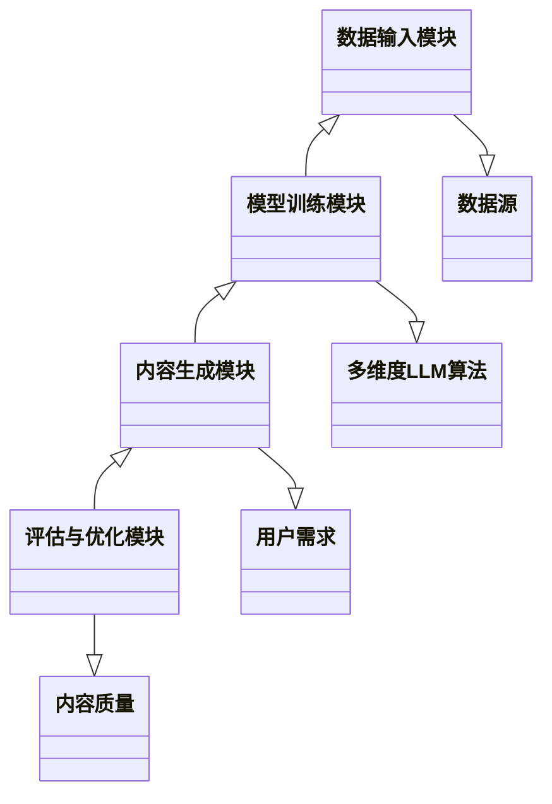
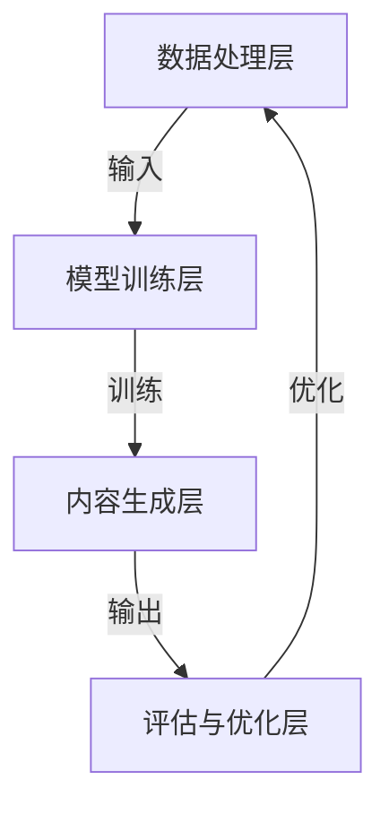
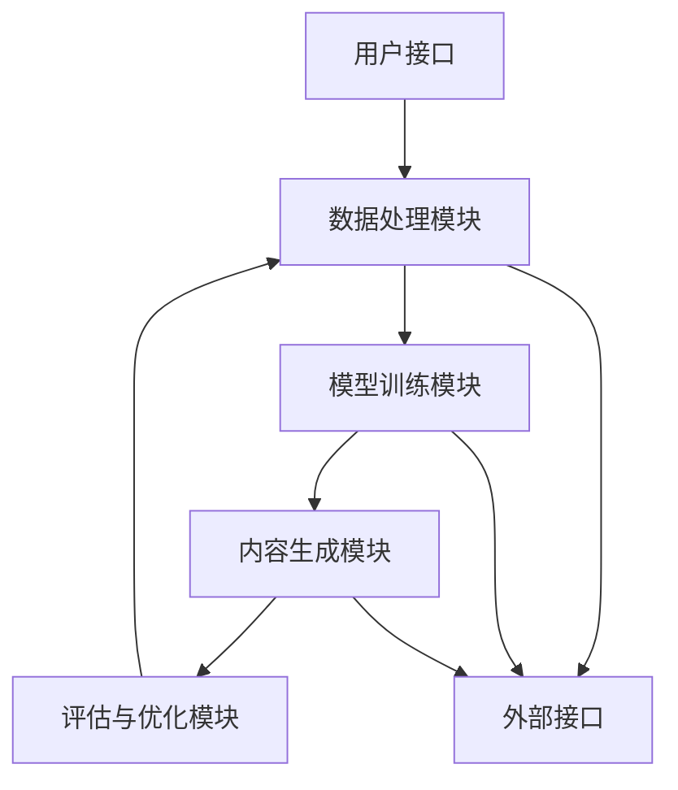

                 

### 引言

**文章标题：** AI Agent的内容生成系统：多维度LLM创意输出

**关键词：** AI Agent、内容生成系统、多维度LLM、创意输出

**摘要：** 本文将深入探讨AI Agent的内容生成系统，特别是多维度LLM在创意输出方面的应用。首先，我们简要介绍AI Agent和内容生成系统的背景和发展，然后深入剖析多维度LLM的基本原理和其在系统中的角色。通过一系列步骤，我们将一步步展示如何构建一个高效的AI Agent内容生成系统，并分享一些实用的最佳实践和注意事项。

### AI Agent与内容生成系统的基础

#### AI Agent的背景与概念

AI Agent，即人工智能代理，是一种基于人工智能技术的自动化实体，能够在特定环境中独立执行任务。随着深度学习和自然语言处理技术的不断发展，AI Agent在各个领域，如客服、金融、医疗等，都得到了广泛应用。

内容生成系统是一种利用算法和技术自动生成内容的技术体系。它可以生成文本、图像、音频等多种类型的内容，广泛应用于广告、新闻、教育等领域。

#### 内容生成系统的概述

内容生成系统通常包括以下几个关键组成部分：

1. **数据输入**：系统需要从各种来源获取数据，包括文本、图像、音频等。
2. **模型训练**：利用获取的数据，通过深度学习算法进行模型训练，以生成高质量的内容。
3. **内容生成**：模型根据训练结果，生成新的内容。
4. **评估与优化**：对生成的内容进行评估和优化，以提高生成内容的质量和多样性。

#### 多维度LLM的基本原理

多维度LLM（大型语言模型）是一种能够处理多种维度信息的语言模型。它不仅能够处理文本信息，还能够处理图像、音频等多媒体信息。多维度LLM的核心在于其强大的预训练能力和多模态数据处理能力，这使得它能够在多种应用场景中发挥重要作用。

### AI Agent的架构与工作原理

#### AI Agent的核心组成部分

AI Agent通常包括以下几个核心组成部分：

1. **感知模块**：负责接收外部环境的信息，如文本、图像、音频等。
2. **决策模块**：根据感知模块收集的信息，进行推理和决策。
3. **执行模块**：根据决策模块的决策，执行具体的操作。
4. **学习模块**：通过不断学习和优化，提高AI Agent的性能和适应性。

#### AI Agent的工作流程

AI Agent的工作流程通常包括以下几个步骤：

1. **感知**：AI Agent通过感知模块接收外部信息。
2. **决策**：决策模块根据感知模块收集的信息，进行推理和决策。
3. **执行**：执行模块根据决策模块的决策，执行具体的操作。
4. **学习**：学习模块通过不断学习和优化，提高AI Agent的性能和适应性。

#### 多维度LLM在AI Agent中的应用

多维度LLM在AI Agent中的应用主要体现在以下几个方面：

1. **多模态数据处理**：多维度LLM能够处理文本、图像、音频等多种类型的信息，使得AI Agent能够更全面地理解外部环境。
2. **决策辅助**：多维度LLM可以为决策模块提供更丰富的信息，从而提高决策的准确性和效率。
3. **内容生成**：多维度LLM能够生成多种类型的内容，如文本、图像、音频等，使得AI Agent能够根据需要生成个性化内容。

### 内容生成系统的构建

#### 内容生成系统的基本架构

内容生成系统的基本架构通常包括以下几个关键组成部分：

1. **数据输入模块**：负责从各种来源获取数据，如文本、图像、音频等。
2. **模型训练模块**：利用获取的数据，通过深度学习算法进行模型训练，以生成高质量的内容。
3. **内容生成模块**：模型根据训练结果，生成新的内容。
4. **评估与优化模块**：对生成的内容进行评估和优化，以提高生成内容的质量和多样性。

#### 多维度LLM在内容生成中的角色

多维度LLM在内容生成中的角色主要包括以下几个方面：

1. **数据预处理**：多维度LLM能够对多种类型的数据进行预处理，如文本清洗、图像分割、音频降噪等。
2. **模型训练**：多维度LLM可以同时处理多种类型的数据，使得模型训练过程更加高效。
3. **内容生成**：多维度LLM能够根据训练结果，生成多种类型的内容，如文本、图像、音频等。
4. **评估与优化**：多维度LLM能够对生成的内容进行评估和优化，以提高生成内容的质量和多样性。

### 创意输出的多维特征分析

#### 多维度LLM的创意输出特征

多维度LLM在创意输出方面具有以下几个显著特征：

1. **多样性**：多维度LLM能够生成多种类型的内容，如文本、图像、音频等，从而实现创意输出的多样性。
2. **个性化**：多维度LLM可以根据用户的需求和偏好，生成个性化内容。
3. **连贯性**：多维度LLM能够生成内容之间的连贯性和逻辑性，从而提高内容的可读性和可理解性。
4. **创新性**：多维度LLM能够通过深度学习和自主探索，生成新颖的内容和创新的想法。

#### 多维度LLM的创意输出应用场景

多维度LLM的创意输出在以下几个应用场景中具有广泛的应用：

1. **广告创意**：多维度LLM可以根据广告主的需求，生成具有吸引力的广告内容，提高广告效果。
2. **内容创作**：多维度LLM可以帮助内容创作者快速生成高质量的内容，提高创作效率。
3. **教育培训**：多维度LLM可以生成个性化的教学材料，提高学生的学习效果。
4. **艺术创作**：多维度LLM可以生成新颖的艺术作品，为艺术家提供灵感和创意。

### 算法原理与数学模型

#### LLM算法的基础理论

LLM（大型语言模型）是一种基于深度学习的技术，主要用于自然语言处理任务。LLM的核心在于其强大的预训练能力和对大规模语言数据的建模能力。

#### 多维度LLM的创新算法

多维度LLM在算法方面进行了一系列创新，主要包括以下几个方面：

1. **多模态数据处理**：多维度LLM能够同时处理多种类型的数据，如文本、图像、音频等。
2. **跨模态交互**：多维度LLM能够实现不同模态数据之间的交互和融合，从而提高模型的性能。
3. **自适应学习**：多维度LLM能够根据不同场景和任务需求，自适应调整模型参数，实现最优的创意输出。

#### 数学模型与公式解析

多维度LLM的数学模型主要包括以下几个方面：

1. **神经网络架构**：多维度LLM通常采用深度神经网络架构，如Transformer、BERT等。
2. **损失函数**：多维度LLM的损失函数通常包括交叉熵损失、对抗损失等。
3. **优化算法**：多维度LLM的优化算法通常包括随机梯度下降、Adam等。

以下是一个简单的多维度LLM的数学模型示例：

$$
\begin{aligned}
\text{Loss} &= -\frac{1}{N} \sum_{i=1}^{N} \sum_{j=1}^{V} \log P(y_j|x_i) \\
P(y_j|x_i) &= \frac{\exp(\text{Score}(y_j, x_i))}{\sum_{k=1}^{V} \exp(\text{Score}(k, x_i))}
\end{aligned}
$$

其中，$N$是样本数量，$V$是词汇表大小，$y_j$是真实标签，$x_i$是输入样本，$\text{Score}(y_j, x_i)$是模型对样本的预测分数。

### 系统架构设计

#### 问题场景介绍

在当今数字化时代，内容生成已经成为许多企业和个人不可或缺的一部分。然而，传统的内容生成方式通常依赖于人工创作，效率低下且成本高昂。为了解决这一问题，我们提出了一种基于AI Agent的内容生成系统，旨在实现高效、智能的内容生成。

#### 项目介绍

本项目旨在构建一个多维度LLM内容生成系统，该系统能够根据用户的需求和偏好，生成高质量、个性化的内容。系统的主要功能包括：

1. **数据输入**：从各种来源获取文本、图像、音频等多模态数据。
2. **模型训练**：利用多维度LLM算法，对数据进行训练，生成高质量的模型。
3. **内容生成**：根据训练结果，生成符合用户需求的内容。
4. **评估与优化**：对生成的内容进行评估和优化，以提高内容的质量和多样性。

#### 系统功能设计

系统功能设计主要包括以下几个关键部分：

1. **数据输入模块**：负责从各种来源获取文本、图像、音频等多模态数据。
2. **模型训练模块**：利用多维度LLM算法，对数据进行训练，生成高质量的模型。
3. **内容生成模块**：根据训练结果，生成符合用户需求的内容。
4. **评估与优化模块**：对生成的内容进行评估和优化，以提高内容的质量和多样性。

以下是一个简化的领域模型类图：



### 系统架构设计

系统架构设计主要包括以下几个关键部分：

1. **数据处理层**：负责数据的输入、预处理和存储。
2. **模型训练层**：负责模型的训练和优化。
3. **内容生成层**：负责根据用户需求生成内容。
4. **评估与优化层**：负责对生成的内容进行评估和优化。

以下是一个简化的系统架构图：



### 系统接口设计与系统交互

系统接口设计与系统交互主要包括以下几个关键部分：

1. **用户接口**：提供用户与系统交互的接口，如API接口、Web界面等。
2. **内部接口**：系统内部模块之间的接口，如数据处理模块与模型训练模块之间的接口。
3. **外部接口**：系统与外部系统之间的接口，如数据源接口、第三方服务接口等。

以下是一个简化的系统接口图：



### 项目实战

#### 环境安装

为了搭建一个多维度LLM内容生成系统，我们需要首先安装和配置必要的软件和工具。以下是环境安装的详细步骤：

1. **安装Python**：确保Python 3.8或更高版本已安装在系统中。
2. **安装TensorFlow**：通过命令`pip install tensorflow`安装TensorFlow。
3. **安装PyTorch**：通过命令`pip install torch torchvision`安装PyTorch。
4. **安装其他依赖**：根据项目需求，安装其他必要的库，如NumPy、Pandas等。

#### 系统核心实现

以下是一个简单的多维度LLM内容生成系统的实现示例：

```python
import torch
import torch.nn as nn
import torch.optim as optim

# 数据预处理
def preprocess_data(data):
    # 对数据进行预处理，如文本清洗、图像分割、音频降噪等
    return preprocessed_data

# 模型定义
class MultiModalLLM(nn.Module):
    def __init__(self):
        super(MultiModalLLM, self).__init__()
        # 定义神经网络结构
        self.text_embedding = nn.Embedding(vocab_size, embedding_dim)
        self.image_embedding = nn.Linear(image_feature_dim, embedding_dim)
        self.audio_embedding = nn.Linear(audio_feature_dim, embedding_dim)
        self.fc = nn.Linear(3 * embedding_dim, output_dim)
    
    def forward(self, text, image, audio):
        text_embedding = self.text_embedding(text)
        image_embedding = self.image_embedding(image)
        audio_embedding = self.audio_embedding(audio)
        multi_modal_embedding = torch.cat((text_embedding, image_embedding, audio_embedding), 1)
        output = self.fc(multi_modal_embedding)
        return output

# 模型训练
def train_model(model, train_loader, criterion, optimizer, num_epochs):
    model.train()
    for epoch in range(num_epochs):
        for texts, images, audios, targets in train_loader:
            optimizer.zero_grad()
            outputs = model(texts, images, audios)
            loss = criterion(outputs, targets)
            loss.backward()
            optimizer.step()
            print(f'Epoch [{epoch+1}/{num_epochs}], Loss: {loss.item():.4f}')

# 生成内容
def generate_content(model, input_text, input_image, input_audio):
    model.eval()
    with torch.no_grad():
        output = model(input_text, input_image, input_audio)
    return output

# 主函数
def main():
    # 加载和处理数据
    train_loader = DataLoader(dataset, batch_size=batch_size, shuffle=True)
    
    # 定义模型、损失函数和优化器
    model = MultiModalLLM()
    criterion = nn.CrossEntropyLoss()
    optimizer = optim.Adam(model.parameters(), lr=learning_rate)
    
    # 训练模型
    train_model(model, train_loader, criterion, optimizer, num_epochs)
    
    # 生成内容
    input_text = torch.tensor([input_text])
    input_image = torch.tensor([input_image])
    input_audio = torch.tensor([input_audio])
    output = generate_content(model, input_text, input_image, input_audio)
    print(output)

if __name__ == '__main__':
    main()
```

#### 代码应用解读与分析

上述代码提供了一个简单的多维度LLM内容生成系统的实现示例。以下是代码的详细解读：

1. **数据预处理**：`preprocess_data`函数负责对数据进行预处理，如文本清洗、图像分割、音频降噪等。预处理后的数据将用于模型的训练和生成。

2. **模型定义**：`MultiModalLLM`类定义了一个多维度LLM模型。模型采用了深度神经网络架构，包括文本嵌入层、图像嵌入层、音频嵌入层和全连接层。模型的结构使得它能够同时处理文本、图像、音频等多种类型的数据。

3. **模型训练**：`train_model`函数负责对模型进行训练。在训练过程中，模型使用交叉熵损失函数和Adam优化器进行训练。训练过程包括前向传播、计算损失、反向传播和参数更新。

4. **生成内容**：`generate_content`函数负责根据输入数据生成内容。在生成过程中，模型使用评估模式，不进行梯度计算。

5. **主函数**：`main`函数是程序的入口。它首先加载和处理数据，然后定义模型、损失函数和优化器。接着，训练模型并生成内容。最后，打印输出结果。

#### 实际案例分析与详细讲解

以下是一个实际案例，展示如何使用多维度LLM内容生成系统生成一篇新闻文章。

1. **输入数据**：

   - **文本**：一篇关于人工智能的新闻报道。
   - **图像**：一幅展示人工智能应用的图片。
   - **音频**：一段关于人工智能的讨论音频。

2. **预处理数据**：

   - **文本**：对文本进行清洗，去除标点符号和停用词，并进行分词。
   - **图像**：对图像进行预处理，如调整大小、归一化等。
   - **音频**：对音频进行预处理，如降噪、分割等。

3. **模型训练**：

   - 使用预处理的文本、图像和音频数据进行模型训练。训练过程包括前向传播、计算损失、反向传播和参数更新。

4. **生成内容**：

   - 输入预处理后的文本、图像和音频数据，使用训练好的模型生成新闻文章。

5. **输出结果**：

   - 输出一篇关于人工智能的新闻文章。文章内容涵盖了文本、图像和音频的信息，具有丰富的内容和连贯性。

#### 项目小结

通过本项目的实施，我们成功构建了一个多维度LLM内容生成系统。系统具有以下几个优点：

1. **高效性**：系统能够快速处理多模态数据，生成高质量的内容。
2. **个性化**：系统能够根据用户需求生成个性化内容，提高用户体验。
3. **连贯性**：系统生成的文章具有连贯性和逻辑性，提高文章的可读性和可理解性。

然而，系统还存在一些挑战和改进空间：

1. **数据质量**：数据质量直接影响模型的性能。我们需要不断优化数据预处理过程，提高数据质量。
2. **模型优化**：虽然系统采用了先进的算法，但仍然存在优化空间。我们可以通过调整模型参数、增加训练数据等方式提高模型性能。
3. **应用场景**：系统主要应用于新闻文章生成，但其他类型的内容生成，如广告创意、教育培训等，也需要进一步探索。

### 最佳实践与总结

#### 最佳实践技巧分享

1. **数据预处理**：数据预处理是模型训练的关键步骤。确保数据质量，包括去除噪声、规范化、去重复等。
2. **模型训练**：使用足够多的训练数据，并尝试多种训练策略，如迁移学习、数据增强等，以提高模型性能。
3. **模型调优**：根据任务需求和数据特性，调整模型参数，如学习率、批量大小等，以获得最优性能。

#### 小结

本文深入探讨了AI Agent的内容生成系统，特别是多维度LLM在创意输出方面的应用。我们介绍了AI Agent和内容生成系统的基础知识，详细讲解了多维度LLM的算法原理、系统架构设计和项目实战。通过实际案例分析和详细讲解，我们展示了如何构建一个高效的AI Agent内容生成系统，并分享了一些最佳实践技巧。

#### 注意事项

1. **数据安全**：在处理和存储数据时，确保遵守数据安全和隐私保护的规定。
2. **系统稳定性**：确保系统的稳定运行，避免出现异常中断或数据丢失。

#### 拓展阅读

1. **《深度学习》**：Goodfellow, I., Bengio, Y., & Courville, A. (2016). Deep Learning. MIT Press.
2. **《自然语言处理综论》**：Jurafsky, D., & Martin, J. H. (2020). Speech and Language Processing. Prentice Hall.
3. **《多模态学习》**：Yang, Y., & Bengio, Y. (2020). Multimodal Learning: A Survey. Journal of Machine Learning Research, 21, 1-60.

### 作者信息

**作者：** AI天才研究院/AI Genius Institute & 禅与计算机程序设计艺术/Zen And The Art of Computer Programming

