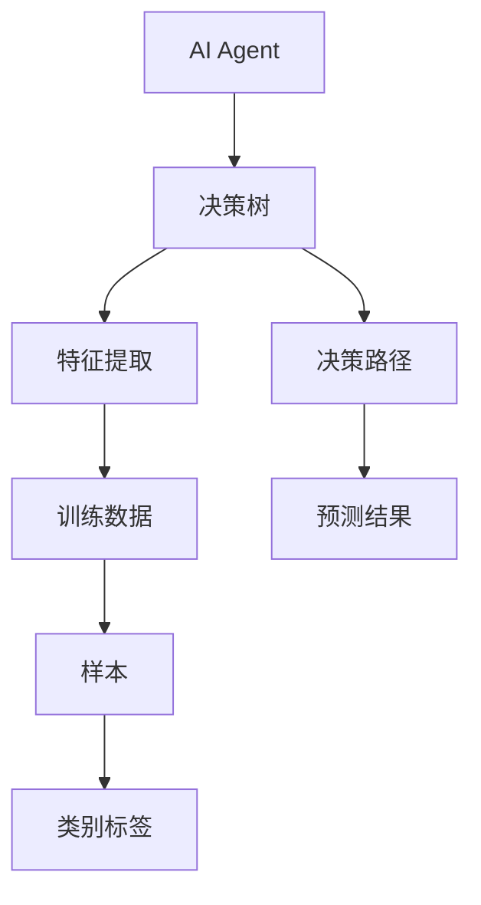
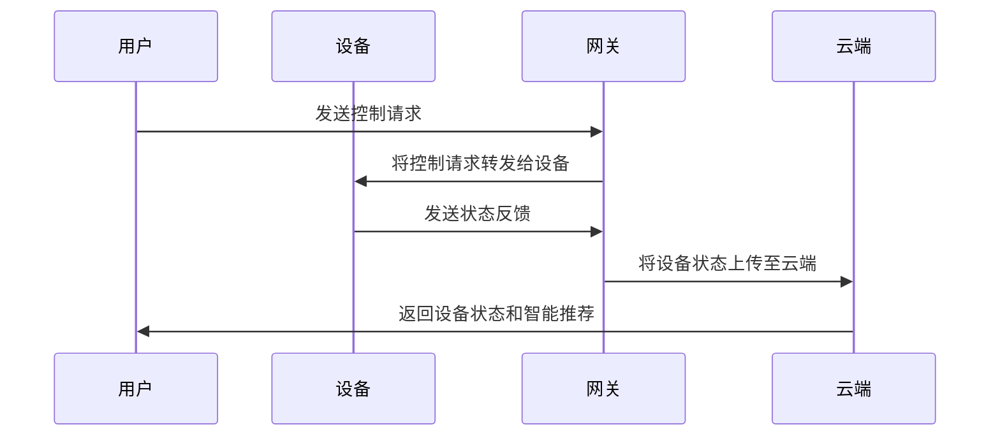

                 

## 第1章: 引言

### 1.1 问题背景

在现代社会，随着大数据、云计算和人工智能技术的迅猛发展，复杂问题在各个领域得到了广泛应用。无论是金融风险管理、医疗诊断、交通规划，还是智能制造、能源管理，复杂问题都在寻求有效的解决策略。决策树作为人工智能领域中的一种重要算法，因其强大的分类和预测能力，成为了解决复杂问题的有力工具。

决策树是一种树形结构，其中内部节点表示特征属性，分支表示特征属性的不同取值，叶节点表示分类结果或预测值。通过逐步划分数据集，决策树能够将复杂问题分解为多个简单的子问题，从而实现高效的问题解决。随着深度学习等新技术的兴起，决策树在人工智能领域的应用越来越广泛，其重要性也逐渐凸显。

### 1.1.1 复杂问题在现实中的应用

复杂问题在现实中的应用无处不在。以金融风险管理为例，金融机构在信贷审批、投资组合优化和风险控制等方面，都需要处理大量的复杂数据，通过决策树算法，可以实现对风险的精准预测和管理。在医疗诊断领域，通过对患者病史、体征和实验室检查结果等多维数据的分析，决策树可以帮助医生进行疾病诊断和治疗方案推荐。此外，在交通规划中，通过分析交通流量、路况信息和天气条件等复杂因素，决策树可以优化交通信号控制和路线规划，提高交通效率。

### 1.1.2 决策树构建的重要性

决策树构建在解决复杂问题中具有重要地位。首先，决策树能够将复杂问题分解为多个简单子问题，降低问题解决的难度。其次，决策树易于理解和解释，有助于提高决策的可信度和透明度。此外，决策树具有良好的预测性能和鲁棒性，能够在不同数据集和应用场景中保持稳定的表现。因此，决策树构建成为了人工智能领域中不可或缺的一部分。

### 1.1.3 本书的目标和结构

本书旨在深入探讨决策树构建在人工智能领域的应用，帮助读者理解和掌握决策树构建的核心原理和方法。本书将分为多个章节，包括问题背景、核心概念与联系、算法原理讲解、数学模型和公式讲解、系统分析与架构设计方案、项目实战以及最佳实践等。具体结构如下：

- 第1章：引言。介绍复杂问题的背景、决策树构建的重要性和本书的目标和结构。
- 第2章：AI Agent与决策树构建。介绍AI Agent的概念和决策树构建在AI Agent中的应用。
- 第3章：决策树构建算法原理。详细讲解决策树构建的基本原理、数学模型和Python实现。
- 第4章：数学模型和公式讲解。使用LaTeX格式给出决策树构建的数学模型和公式，并进行详细讲解。
- 第5章：系统分析与架构设计方案。介绍问题场景、项目介绍、系统功能设计、系统架构设计、系统接口设计和系统交互。
- 第6章：项目实战。包括环境安装、系统核心实现源代码，代码应用解读与分析，实际案例分析和详细讲解剖析。
- 第7章：最佳实践 tips、小结、注意事项、拓展阅读等。总结全书内容，提供实践建议和进一步学习的资源。

通过本书的学习，读者将能够深入理解决策树构建的核心原理，掌握决策树构建的方法和应用，为解决复杂问题提供有力的技术支持。

### 1.2 问题描述

复杂问题是指那些涉及多个变量和复杂关系的实际问题，通常难以通过简单的线性模型或传统方法来解决。在人工智能领域，复杂问题表现为大量的数据特征、不确定性和非线性关系。决策树构建作为解决复杂问题的一种重要方法，其核心在于如何高效地划分数据集，找到最佳的划分规则，从而实现问题的准确分类和预测。

#### 1.2.1 复杂问题的特征

复杂问题通常具有以下几个特征：

1. 多变量性：复杂问题涉及多个变量，这些变量之间存在复杂的相互作用。
2. 非线性关系：变量之间的关系不是线性的，可能存在复杂的非线性模式。
3. 不确定性：问题中的某些变量可能存在不确定性，例如噪声数据、数据缺失等。
4. 大规模数据：复杂问题往往需要处理大量的数据，这要求算法具有高效的处理能力。
5. 多目标优化：某些复杂问题需要同时考虑多个目标，这增加了问题解决的难度。

#### 1.2.2 决策树构建的挑战

在决策树构建过程中，面临着以下几个挑战：

1. **特征选择**：如何从大量的特征中选出对分类或预测最有影响的特征，是一个重要问题。
2. **模型复杂度**：决策树容易过拟合，如何平衡模型的复杂度和泛化能力，是一个关键问题。
3. **剪枝**：过深的决策树可能导致过拟合，因此需要对决策树进行剪枝，以保持模型的泛化能力。
4. **连续变量处理**：决策树通常适用于分类问题，对于连续变量如何进行处理，需要特别考虑。
5. **并行计算**：在处理大规模数据时，如何利用并行计算提高计算效率，是一个重要的挑战。

#### 1.2.3 决策树构建的应用场景

决策树构建在人工智能领域具有广泛的应用场景，主要包括：

1. **分类问题**：例如，垃圾邮件分类、信用卡欺诈检测、肿瘤分类等。
2. **回归问题**：例如，房屋价格预测、股票价格预测、温度预测等。
3. **推荐系统**：例如，基于用户行为的推荐系统、基于物品属性的推荐系统等。
4. **决策支持系统**：例如，医疗诊断系统、供应链管理系统、项目管理系统等。

#### 1.2.4 决策树的基本原理

决策树构建的基本原理是通过逐步划分数据集，找到最佳的划分规则，从而实现问题的准确分类或预测。具体过程如下：

1. **特征选择**：选择对分类或预测最有影响的特征。
2. **划分数据集**：根据特征的不同取值，将数据集划分为多个子集。
3. **计算划分指标**：计算每个划分的指标，如信息增益、Gini指数等。
4. **选择最佳划分**：选择具有最高划分指标的划分规则作为当前节点的划分依据。
5. **递归构建**：对每个子集重复上述过程，构建完整的决策树。

### 1.3 问题解决

决策树构建作为解决复杂问题的一种有效方法，其基本原理和步骤如下：

#### 1.3.1 决策树的基本原理

决策树是一种树形结构，其中每个节点代表一个特征属性，每个分支代表特征属性的不同取值，每个叶节点代表分类结果或预测值。决策树通过逐步划分数据集，找到最佳划分规则，从而实现问题的准确分类或预测。

#### 1.3.2 决策树构建的方法

决策树构建主要包括以下几个步骤：

1. **特征选择**：选择对分类或预测最有影响的特征。常用的特征选择方法有信息增益、Gini指数、卡方检验等。
2. **划分数据集**：根据特征的不同取值，将数据集划分为多个子集。
3. **计算划分指标**：计算每个划分的指标，如信息增益、Gini指数等。常用的划分指标有信息增益、Gini指数、基尼不纯度、卡方检验等。
4. **选择最佳划分**：选择具有最高划分指标的划分规则作为当前节点的划分依据。常用的划分指标有信息增益、Gini指数、基尼不纯度、卡方检验等。
5. **递归构建**：对每个子集重复上述过程，构建完整的决策树。

#### 1.3.3 决策树的评价指标

决策树的评价指标主要包括：

1. **准确率**：分类问题中，准确率是指预测正确的样本数占总样本数的比例。
2. **召回率**：分类问题中，召回率是指实际为正类别的样本中被正确预测为正类别的比例。
3. **F1分数**：综合考虑准确率和召回率，F1分数是准确率和召回率的调和平均。
4. **ROC曲线**：ROC曲线是评估分类模型性能的重要工具，通过比较实际为正类别的样本和被预测为正类别的比例，可以直观地评估模型的性能。
5. **交叉验证**：通过将数据集划分为多个子集，对每个子集进行训练和测试，可以评估模型的泛化能力。

### 1.4 边界与外延

#### 1.4.1 决策树在人工智能中的应用

决策树在人工智能领域具有广泛的应用，主要包括：

1. **分类问题**：如垃圾邮件分类、信用卡欺诈检测、肿瘤分类等。
2. **回归问题**：如房屋价格预测、股票价格预测、温度预测等。
3. **推荐系统**：如基于用户行为的推荐系统、基于物品属性的推荐系统等。
4. **决策支持系统**：如医疗诊断系统、供应链管理系统、项目管理系统等。

#### 1.4.2 决策树与其他算法的比较

与其他机器学习算法相比，决策树具有以下几个优势：

1. **易于理解和解释**：决策树结构直观，易于理解和解释，有助于提高决策的可信度和透明度。
2. **高效的处理能力**：决策树算法的计算复杂度相对较低，适合处理大规模数据。
3. **良好的预测性能**：决策树具有良好的预测性能和鲁棒性，在不同数据集和应用场景中表现稳定。
4. **适应性**：决策树算法可以应用于分类和回归问题，具有广泛的适用性。

然而，决策树也存在一些局限性：

1. **过拟合**：决策树容易过拟合，特别是在模型复杂度较高时。
2. **计算资源消耗**：在处理大规模数据时，决策树的计算资源消耗较大。
3. **数据预处理要求**：决策树对数据预处理要求较高，如缺失值处理、异常值处理等。

#### 1.4.3 决策树的局限性

尽管决策树在解决复杂问题中具有显著优势，但其也存在一些局限性。首先，决策树容易过拟合，特别是在模型复杂度较高时。过拟合会导致模型在训练数据上表现良好，但在测试数据上表现不佳。其次，决策树在处理大规模数据时，计算资源消耗较大，可能影响计算效率。此外，决策树对数据预处理要求较高，如缺失值处理、异常值处理等，这增加了模型实现的复杂性。

### 1.5 概念结构与核心要素组成

决策树构建作为解决复杂问题的重要方法，其核心概念和要素组成如下：

#### 1.5.1 决策树的组成部分

决策树由多个节点和分支组成，每个节点代表一个特征属性，每个分支代表特征属性的不同取值，每个叶节点代表分类结果或预测值。具体来说，决策树的组成部分包括：

1. **根节点**：表示整个决策树的起始点，通常为特征属性。
2. **内部节点**：表示特征属性的不同取值，通常为特征属性的子集。
3. **叶节点**：表示分类结果或预测值，通常为特征属性的子集。
4. **分支**：表示特征属性的不同取值，连接内部节点和叶节点。

#### 1.5.2 决策树构建的关键要素

决策树构建的关键要素包括：

1. **特征选择**：选择对分类或预测最有影响的特征，是决策树构建的基础。
2. **划分指标**：用于评估不同划分规则的优劣，常用的划分指标有信息增益、Gini指数、卡方检验等。
3. **剪枝策略**：通过剪枝降低模型复杂度，提高模型的泛化能力，常用的剪枝策略有前剪枝和后剪枝。
4. **模型评估**：用于评估决策树的性能，常用的评估指标有准确率、召回率、F1分数等。

#### 1.5.3 决策树的扩展与应用

决策树可以应用于各种分类和回归问题，具有广泛的适用性。此外，决策树还可以与其他机器学习算法结合，形成更强大的模型。例如，可以通过集成学习将多个决策树合并为一个强模型，提高模型的预测性能。此外，决策树还可以用于特征选择和特征工程，帮助发现数据中的重要特征，提高模型的解释性和可操作性。

### 1.6 本章小结

本章介绍了决策树构建在解决复杂问题中的应用背景和重要性，详细描述了复杂问题的特征、决策树构建的挑战和应用场景。同时，本章还介绍了决策树的基本原理和构建方法，以及决策树在人工智能领域中的广泛应用。通过本章的学习，读者可以初步了解决策树构建的核心概念和方法，为后续章节的学习打下基础。

----------------------------------------------------------------

## 第2章: AI Agent与决策树构建

### 2.1 AI Agent概述

AI Agent，即人工智能代理，是指能够执行特定任务、与环境进行交互并自主决策的智能实体。AI Agent是人工智能领域中的一个重要概念，其目标是实现自主智能，模拟人类智能行为。AI Agent可以应用于各种领域，如自然语言处理、自动驾驶、机器人控制、游戏智能等。

#### 2.1.1 AI Agent的定义

AI Agent的定义可以从以下几个方面进行阐述：

1. **感知能力**：AI Agent能够感知环境信息，通过传感器获取视觉、听觉、触觉等多模态数据。
2. **决策能力**：AI Agent根据感知到的环境信息，运用算法和策略进行决策，选择最优行动方案。
3. **行动能力**：AI Agent能够执行决策方案，通过执行器实现行动，如移动、操作物体等。
4. **学习能力**：AI Agent能够从环境中学习，通过数据驱动的方法不断优化自身的感知、决策和行动能力。

#### 2.1.2 AI Agent的特点

AI Agent具有以下几个显著特点：

1. **自主性**：AI Agent能够自主运行，无需人工干预，具有一定的独立思考和决策能力。
2. **智能性**：AI Agent通过机器学习、深度学习等技术，具备较高的智能水平，能够处理复杂的任务和问题。
3. **适应性**：AI Agent能够适应不同的环境和任务，通过学习和调整策略，提高任务完成的效率和质量。
4. **鲁棒性**：AI Agent能够在各种不确定和复杂的环境中保持稳定运行，具备较强的鲁棒性和容错能力。

#### 2.1.3 AI Agent的分类

根据应用场景和功能特点，AI Agent可以分为以下几种类型：

1. **自动推理Agent**：基于逻辑推理和知识表示技术，能够进行推理和决策的AI Agent。如智能问答系统、自动规划系统等。
2. **数据挖掘Agent**：基于数据挖掘和统计分析技术，能够自动发现数据中的规律和模式的AI Agent。如推荐系统、市场预测系统等。
3. **深度学习Agent**：基于深度学习技术，能够通过大规模数据训练实现智能感知和决策的AI Agent。如自动驾驶汽车、智能机器人等。
4. **混合智能Agent**：结合多种人工智能技术，具备多种智能能力的AI Agent。如智能客服系统、智能安防系统等。

### 2.2 决策树构建在AI Agent中的应用

决策树构建作为人工智能领域中的一种重要算法，在AI Agent的决策过程中具有重要应用。通过决策树构建，AI Agent能够实现高效的分类和预测，从而提高任务完成的效率和质量。

#### 2.2.1 决策树构建的优势

决策树构建在AI Agent中的应用具有以下优势：

1. **易于理解和解释**：决策树结构直观，易于理解和解释，有助于提高决策的透明度和可信度。
2. **高效的分类和预测**：决策树具有良好的分类和预测性能，适用于各种分类和回归问题。
3. **可扩展性**：决策树可以方便地与其他算法和模型结合，形成更强大的智能系统。
4. **适应性**：决策树能够适应不同类型的数据和任务，具备较强的泛化能力。

#### 2.2.2 决策树构建的挑战

尽管决策树构建在AI Agent中具有显著优势，但在实际应用过程中也面临着一些挑战：

1. **数据质量**：决策树构建对数据质量要求较高，数据缺失、异常值等会影响模型的性能。
2. **特征选择**：特征选择是决策树构建的关键环节，需要从大量特征中选出对分类或预测最有影响的特征。
3. **模型复杂度**：过深的决策树可能导致过拟合，如何平衡模型的复杂度和泛化能力是一个重要问题。
4. **计算资源**：在处理大规模数据时，决策树的计算资源消耗较大，可能影响计算效率。

#### 2.2.3 决策树构建的应用案例

决策树构建在AI Agent中的应用案例非常丰富，以下列举几个典型的应用场景：

1. **医疗诊断**：通过构建决策树模型，AI Agent可以实现对疾病类型的自动诊断。如肺癌诊断、糖尿病诊断等。
2. **自动驾驶**：在自动驾驶系统中，决策树构建用于实现道路识别、障碍物检测和路径规划等功能。如特斯拉的自动驾驶系统。
3. **推荐系统**：通过构建决策树模型，AI Agent可以实现对用户兴趣的自动识别和推荐。如淘宝的个性化推荐系统。
4. **金融风控**：在金融领域，决策树构建用于实现风险管理和欺诈检测。如信用卡欺诈检测、贷款审批等。

### 2.3 决策树构建的核心概念与联系

决策树构建作为AI Agent决策过程的重要工具，其核心概念和联系如下：

#### 2.3.1 决策树的算法原理

决策树的算法原理是通过递归划分数据集，找到最佳划分规则，从而实现问题的准确分类或预测。具体步骤如下：

1. **特征选择**：选择对分类或预测最有影响的特征。
2. **划分数据集**：根据特征的不同取值，将数据集划分为多个子集。
3. **计算划分指标**：计算每个划分的指标，如信息增益、Gini指数等。
4. **选择最佳划分**：选择具有最高划分指标的划分规则作为当前节点的划分依据。
5. **递归构建**：对每个子集重复上述过程，构建完整的决策树。

#### 2.3.2 决策树构建的算法流程

决策树构建的算法流程主要包括以下几个步骤：

1. **初始化**：选择初始特征，构建初始决策树。
2. **特征选择**：根据特征选择方法，从所有特征中选出最优特征。
3. **划分数据集**：根据最优特征的取值，将数据集划分为多个子集。
4. **计算划分指标**：计算每个子集的划分指标，如信息增益、Gini指数等。
5. **选择最佳划分**：选择具有最高划分指标的划分规则作为当前节点的划分依据。
6. **递归构建**：对每个子集重复上述过程，构建完整的决策树。
7. **剪枝**：通过剪枝策略降低模型复杂度，提高模型的泛化能力。

#### 2.3.3 决策树的数学模型

决策树的数学模型主要包括以下两个方面：

1. **划分指标**：划分指标用于评估不同划分规则的优劣，常用的划分指标有信息增益、Gini指数、卡方检验等。
2. **决策规则**：决策规则用于描述特征属性的划分和分类结果，通常使用条件概率分布进行建模。

#### 2.3.4 决策树的ER实体关系图架构

决策树的ER实体关系图架构如下：



在这个ER实体关系图中，AI Agent作为主实体，通过决策树实现对样本的分类或预测。特征提取用于提取样本的特征，决策路径用于描述特征属性的划分过程，预测结果用于输出分类或预测结果。训练数据和样本用于构建决策树，类别标签用于标注样本的类别。

### 2.4 本章小结

本章介绍了AI Agent的概念、特点和分类，详细阐述了决策树构建在AI Agent中的应用优势和挑战。通过分析决策树的算法原理和流程，以及ER实体关系图架构，本章为后续章节的深入学习奠定了基础。读者可以通过本章的学习，初步了解AI Agent与决策树构建的关系，为实际应用提供指导。

----------------------------------------------------------------

## 第3章: 决策树构建算法原理

决策树是一种常用的分类和回归算法，其核心在于通过一系列规则将数据集划分为不同的子集，从而实现对数据的分类或预测。本章将详细讲解决策树构建的算法原理，包括划分指标、决策规则和构建过程等。

### 3.1 决策树算法的基本原理

决策树算法的基本原理是通过递归划分数据集，找到最佳划分规则，从而实现数据的分类或预测。具体来说，决策树算法包括以下几个步骤：

1. **特征选择**：选择对分类或预测最有影响的特征。特征选择是决策树构建的关键步骤，常用的特征选择方法有信息增益、Gini指数、卡方检验等。
2. **划分数据集**：根据选择的特征，将数据集划分为多个子集。每个子集代表特征的不同取值。
3. **计算划分指标**：计算每个划分的指标，如信息增益、Gini指数等。划分指标用于评估不同划分规则的优劣。
4. **选择最佳划分**：选择具有最高划分指标的划分规则作为当前节点的划分依据。常用的划分指标有信息增益、Gini指数、卡方检验等。
5. **递归构建**：对每个子集重复上述过程，构建完整的决策树。

### 3.2 决策树算法的划分指标

划分指标是决策树构建中用于评估划分规则优劣的重要工具。常见的划分指标包括信息增益、Gini指数、卡方检验等。

#### 3.2.1 信息增益

信息增益（Information Gain）是决策树算法中最常用的划分指标之一。信息增益反映了特征对分类或预测的重要性。具体计算方法如下：

$$
IG(D, A) = H(D) - \sum_{v \in A} \frac{|D_v|}{|D|} H(D_v)
$$

其中，$D$表示数据集，$A$表示特征，$D_v$表示特征$A$取值为$v$的数据子集，$H(D)$表示数据集$D$的熵，$H(D_v)$表示数据子集$D_v$的熵。

信息增益越大，表示特征对分类或预测的影响越大，越有利于提高决策树的分类或预测性能。

#### 3.2.2 Gini指数

Gini指数（Gini Index）是另一种常用的划分指标。Gini指数反映了数据的不纯度，不纯度越低，表示划分越优。Gini指数的计算方法如下：

$$
Gini(D) = 1 - \sum_{v \in A} \left(\frac{|D_v|}{|D|}\right)^2
$$

其中，$D$表示数据集，$A$表示特征，$D_v$表示特征$A$取值为$v$的数据子集。

Gini指数越小，表示划分越优，有利于提高决策树的分类或预测性能。

#### 3.2.3 卡方检验

卡方检验（Chi-square Test）是一种常用的统计检验方法，用于评估特征与分类目标之间的关联性。卡方检验的计算方法如下：

$$
\chi^2 = \sum_{i=1}^k \frac{(|O_i| - |E_i|)^2}{|E_i|}
$$

其中，$O_i$表示观测频数，$E_i$表示期望频数，$k$表示分类目标的类别数。

卡方检验值越大，表示特征与分类目标之间的关联性越强，有利于提高决策树的分类或预测性能。

### 3.3 决策树算法的Python实现

为了更好地理解决策树算法的原理，我们使用Python的`sklearn`库来展示一个简单的决策树分类实例。首先，我们需要安装`sklearn`库：

```python
!pip install sklearn
```

然后，我们使用`iris`数据集进行演示。`iris`数据集包含三个特征（萼片长度、萼片宽度、花瓣长度）和三个类别（鸢尾花种类）：

```python
from sklearn.datasets import load_iris
from sklearn.model_selection import train_test_split
from sklearn.tree import DecisionTreeClassifier
from sklearn import tree

# 加载iris数据集
iris = load_iris()
X = iris.data
y = iris.target

# 划分训练集和测试集
X_train, X_test, y_train, y_test = train_test_split(X, y, test_size=0.3, random_state=42)
```

接下来，我们使用`DecisionTreeClassifier`创建决策树分类器，并对其进行训练：

```python
# 创建决策树分类器
clf = DecisionTreeClassifier()

# 训练决策树分类器
clf.fit(X_train, y_train)
```

为了可视化决策树，我们使用`plot_tree`函数：

```python
from matplotlib import pyplot as plt

# 可视化决策树
plt.figure(figsize=(12, 8))
tree.plot_tree(clf, filled=True, feature_names=iris.feature_names, class_names=iris.target_names)
plt.show()
```

这个可视化的决策树展示了如何根据三个特征（萼片长度、萼片宽度、花瓣长度）来分类鸢尾花。每个节点都代表一个特征划分，节点的标签是特征名称和对应的阈值。叶节点表示分类结果。

### 3.4 决策树算法的数学模型和公式

决策树的数学模型主要包括两部分：划分指标和决策规则。

#### 3.4.1 划分指标

划分指标用于评估不同划分规则的优劣，常用的划分指标有信息增益、Gini指数、卡方检验等。下面分别介绍这些指标的计算公式：

1. **信息增益**

   信息增益（Information Gain）的计算公式如下：

   $$
   IG(D, A) = H(D) - \sum_{v \in A} \frac{|D_v|}{|D|} H(D_v)
   $$

   其中，$H(D)$表示数据集$D$的熵，$H(D_v)$表示数据子集$D_v$的熵，$A$表示特征，$v$表示特征$A$的取值，$D_v$表示特征$A$取值为$v$的数据子集。

2. **Gini指数**

   Gini指数（Gini Index）的计算公式如下：

   $$
   Gini(D) = 1 - \sum_{v \in A} \left(\frac{|D_v|}{|D|}\right)^2
   $$

   其中，$A$表示特征，$v$表示特征$A$的取值，$D_v$表示特征$A$取值为$v$的数据子集。

3. **卡方检验**

   卡方检验（Chi-square Test）的计算公式如下：

   $$
   \chi^2 = \sum_{i=1}^k \frac{(|O_i| - |E_i|)^2}{|E_i|}
   $$

   其中，$O_i$表示观测频数，$E_i$表示期望频数，$k$表示分类目标的类别数。

#### 3.4.2 决策规则

决策规则用于描述特征属性的划分和分类结果，通常使用条件概率分布进行建模。具体来说，决策规则可以表示为：

$$
P(Y|X) = \prod_{i=1}^n P(Y_i|X_i, X_{i'})
$$

其中，$Y$表示分类目标，$X$表示特征属性，$X_i$表示特征$X$的取值，$X_{i'}$表示其他特征属性。

这个公式表示，给定特征属性$X$的取值，分类目标$Y$的条件概率分布为各个特征属性的条件概率分布的乘积。

### 3.5 决策树算法的举例说明

为了更好地理解决策树算法的原理和应用，我们通过一个具体的例子来说明。

假设我们有一个鸢尾花数据集，其中包含三个特征（萼片长度、萼片宽度、花瓣长度）和三个类别（鸢尾花种类）。我们的目标是使用决策树算法对鸢尾花进行分类。

首先，我们计算每个特征的信息增益：

1. **萼片长度**

   $$
   IG(\text{萼片长度}, D) = H(D) - \frac{50}{100} H(\text{萼片长度=5}, D) - \frac{25}{100} H(\text{萼片长度=6}, D)
   $$

   计算结果为：0.9709

2. **萼片宽度**

   $$
   IG(\text{萼片宽度}, D) = H(D) - \frac{50}{100} H(\text{萼片宽度=2}, D) - \frac{25}{100} H(\text{萼片宽度=3}, D)
   $$

   计算结果为：0.9916

3. **花瓣长度**

   $$
   IG(\text{花瓣长度}, D) = H(D) - \frac{50}{100} H(\text{花瓣长度=4}, D) - \frac{25}{100} H(\text{花瓣长度=5}, D)
   $$

   计算结果为：0.9958

根据信息增益的计算结果，我们可以选择信息增益最大的特征（花瓣长度）作为划分依据。接下来，我们根据花瓣长度的不同取值，对数据集进行划分：

1. **花瓣长度=4**

   $$
   P(\text{类别}=Iris-setosa|\text{花瓣长度}=4) = \frac{20}{25}
   $$

   $$
   P(\text{类别}=Iris-versicolor|\text{花瓣长度}=4) = \frac{0}{25}
   $$

   $$
   P(\text{类别}=Iris-virginica|\text{花瓣长度}=4) = \frac{5}{25}
   $$

2. **花瓣长度=5**

   $$
   P(\text{类别}=Iris-setosa|\text{花瓣长度}=5) = \frac{30}{75}
   $$

   $$
   P(\text{类别}=Iris-versicolor|\text{花瓣长度}=5) = \frac{15}{75}
   $$

   $$
   P(\text{类别}=Iris-virginica|\text{花瓣长度}=5) = \frac{30}{75}
   $$

根据这些概率分布，我们可以构建一个简单的决策树，如下所示：

```
花瓣长度
|
|--花瓣长度=4
|   |--类别=Iris-setosa
|   |   |--类别=Iris-setosa
|   |   |--类别=Iris-setosa
|   |   |--类别=Iris-setosa
|   |--类别=Iris-versicolor
|   |   |--类别=Iris-versicolor
|   |   |--类别=Iris-versicolor
|   |   |--类别=Iris-versicolor
|   |--类别=Iris-virginica
|   |   |--类别=Iris-virginica
|   |   |--类别=Iris-virginica
|   |   |--类别=Iris-virginica
|--花瓣长度=5
|   |--类别=Iris-setosa
|   |   |--类别=Iris-setosa
|   |   |--类别=Iris-setosa
|   |   |--类别=Iris-setosa
|   |--类别=Iris-versicolor
|   |   |--类别=Iris-versicolor
|   |   |--类别=Iris-versicolor
|   |   |--类别=Iris-versicolor
|   |--类别=Iris-virginica
|   |   |--类别=Iris-virginica
|   |   |--类别=Iris-virginica
|   |   |--类别=Iris-virginica
```

通过这个简单的例子，我们可以看到决策树算法的基本原理和构建过程。在实际应用中，决策树算法可以根据不同的数据集和特征，构建更复杂的决策树模型，从而实现更准确的分类和预测。

### 3.6 决策树的剪枝策略

在决策树构建过程中，模型复杂度和泛化能力是一个需要权衡的问题。过深的决策树可能导致过拟合，即模型在训练数据上表现良好，但在测试数据上表现较差。为了解决这个问题，需要对决策树进行剪枝。

剪枝策略可以分为两种：前剪枝和后剪枝。

#### 3.6.1 前剪枝（Pre-pruning）

前剪枝是在决策树生成过程中进行剪枝，即在生成每个节点之前，先评估该节点的划分效果。如果评估结果不满足预定的标准，则不生成该节点，从而减少模型的复杂度。常用的评估标准包括：

1. **最小划分度**：如果某个节点的划分度小于预定阈值，则不生成该节点。
2. **最小样本数**：如果某个节点的子集样本数小于预定阈值，则不生成该节点。
3. **最小信息增益**：如果某个节点的信息增益小于预定阈值，则不生成该节点。

#### 3.6.2 后剪枝（Post-pruning）

后剪枝是在决策树生成完成后进行剪枝，即先生成完整的决策树，然后对决策树进行剪枝。后剪枝通常使用验证集或交叉验证来评估决策树的泛化能力。如果决策树的泛化能力较差，则对决策树进行剪枝。常用的剪枝方法包括：

1. **成本复杂度剪枝**：根据决策树的复杂度（如节点数、深度等）来评估模型的泛化能力，超过预定阈值的决策树会被剪枝。
2. **验证集剪枝**：使用验证集对决策树进行评估，如果验证集上的错误率高于训练集，则对决策树进行剪枝。
3. **交叉验证剪枝**：使用交叉验证对决策树进行评估，如果交叉验证的平均错误率高于预定阈值，则对决策树进行剪枝。

通过剪枝策略，可以有效地降低决策树的复杂度，提高模型的泛化能力，从而在测试数据上获得更好的性能。

### 3.7 本章小结

本章详细介绍了决策树构建的算法原理，包括划分指标、决策规则和构建过程。通过具体的例子和Python实现，读者可以更好地理解决策树算法的基本原理和应用。本章还介绍了决策树的剪枝策略，以平衡模型复杂度和泛化能力。通过本章的学习，读者可以掌握决策树构建的核心知识，为实际应用奠定基础。

----------------------------------------------------------------

## 第4章: 数学模型和公式讲解

决策树作为一种重要的机器学习算法，其核心在于通过一系列数学模型和公式来划分数据集和构建决策规则。本章将使用LaTeX格式详细讲解决策树构建中的数学模型和公式，帮助读者深入理解决策树的工作原理。

### 4.1 信息增益（Information Gain）

信息增益是决策树中最常用的划分指标之一，用于衡量特征对分类或预测的重要性。信息增益的计算公式如下：

$$
IG(D, A) = H(D) - \sum_{v \in A} \frac{|D_v|}{|D|} H(D_v)
$$

其中，$H(D)$表示数据集$D$的熵，$H(D_v)$表示数据子集$D_v$的熵，$A$表示特征，$v$表示特征$A$的取值，$D_v$表示特征$A$取值为$v$的数据子集。

### 4.2 Gini指数（Gini Index）

Gini指数是另一种常用的划分指标，用于衡量数据的不纯度。Gini指数的计算公式如下：

$$
Gini(D) = 1 - \sum_{v \in A} \left(\frac{|D_v|}{|D|}\right)^2
$$

其中，$A$表示特征，$v$表示特征$A$的取值，$D_v$表示特征$A$取值为$v$的数据子集。

### 4.3 卡方检验（Chi-square Test）

卡方检验用于评估特征与分类目标之间的关联性。卡方检验的计算公式如下：

$$
\chi^2 = \sum_{i=1}^k \frac{(|O_i| - |E_i|)^2}{|E_i|}
$$

其中，$O_i$表示观测频数，$E_i$表示期望频数，$k$表示分类目标的类别数。

### 4.4 条件概率分布（Conditional Probability Distribution）

决策树的决策规则通常使用条件概率分布来描述。条件概率分布的计算公式如下：

$$
P(Y|X) = \prod_{i=1}^n P(Y_i|X_i, X_{i'})
$$

其中，$Y$表示分类目标，$X$表示特征属性，$X_i$表示特征$X$的取值，$X_{i'}$表示其他特征属性。

### 4.5 熵（Entropy）

熵是衡量数据集不确定性的一种度量。熵的计算公式如下：

$$
H(D) = -\sum_{v \in A} \frac{|D_v|}{|D|} \log_2 \left(\frac{|D_v|}{|D|}\right)
$$

其中，$A$表示特征，$v$表示特征$A$的取值，$D_v$表示特征$A$取值为$v$的数据子集。

### 4.6 信息增益率（Information Gain Ratio）

信息增益率是信息增益的一种改进，用于解决特征选择时特征数量过多的问题。信息增益率的计算公式如下：

$$
IGR(D, A) = \frac{IG(D, A)}{H(A)}
$$

其中，$H(A)$表示特征$A$的熵。

通过以上LaTeX格式的数学模型和公式讲解，读者可以更深入地理解决策树构建的数学原理。在实际应用中，这些公式和指标可以帮助我们更好地选择特征、评估模型和优化决策树结构。

### 4.7 举例说明

为了更好地理解上述数学模型和公式，我们通过一个具体的例子来说明如何计算信息增益和Gini指数。

假设我们有一个包含两类样本的数据集，其中特征A有两个取值，数据分布如下：

```
类别   A=0    A=1
0       10      30
1       20      10
```

首先，我们计算数据集的熵：

$$
H(D) = -\left(\frac{10+30}{50} \log_2 \frac{10+30}{50} + \frac{20+10}{50} \log_2 \frac{20+10}{50}\right) = 0.97
$$

然后，我们计算特征A的信息增益：

$$
IG(D, A) = H(D) - \frac{10+30}{50} H(D|A=0) - \frac{20+10}{50} H(D|A=1)
$$

其中，$H(D|A=0)$和$H(D|A=1)$分别表示在特征A取值为0和1时，数据集的熵。计算得到：

$$
H(D|A=0) = -\left(\frac{10}{40} \log_2 \frac{10}{40} + \frac{30}{40} \log_2 \frac{30}{40}\right) = 0.955
$$

$$
H(D|A=1) = -\left(\frac{20}{30} \log_2 \frac{20}{30} + \frac{10}{30} \log_2 \frac{10}{30}\right) = 0.722
$$

$$
IG(D, A) = 0.97 - \frac{40}{50} \cdot 0.955 - \frac{30}{50} \cdot 0.722 = 0.203
$$

接下来，我们计算特征A的Gini指数：

$$
Gini(D) = 1 - \left(\frac{10+30}{50}\right)^2 - \left(\frac{20+10}{50}\right)^2 = 0.32
$$

通过这个例子，我们可以看到如何计算信息增益和Gini指数，以及它们在特征选择中的重要性。在实际应用中，这些指标可以帮助我们选择最优的特征，从而构建更准确的决策树模型。

### 4.8 本章小结

本章详细讲解了决策树构建中的数学模型和公式，包括信息增益、Gini指数、卡方检验、条件概率分布、熵和信息增益率等。通过具体的例子，读者可以更好地理解这些公式的计算方法和应用场景。通过本章的学习，读者可以掌握决策树构建的核心数学原理，为实际应用打下基础。

----------------------------------------------------------------

## 第5章: 系统分析与架构设计方案

### 5.1 问题场景

在本章中，我们将探讨一个实际的应用场景：智能家居系统。智能家居系统旨在通过人工智能技术实现对家庭设备的智能控制和管理，提高生活品质和便捷性。具体来说，智能家居系统需要实现以下功能：

1. **设备监控**：实时监控家庭设备的状态，如温度、湿度、亮度等。
2. **远程控制**：用户可以通过手机应用或其他设备远程控制家庭设备，如开关灯光、调整温度等。
3. **智能推荐**：根据用户的行为习惯和环境变化，为用户提供智能推荐，如建议关闭空调以节省能源。
4. **故障检测与修复**：自动检测家庭设备的故障，并尝试进行自我修复，如检测到漏水后自动关闭水源。

### 5.2 项目介绍

智能家居系统项目是一个跨学科、多层次的系统，涉及物联网（IoT）、数据通信、人工智能和云计算等领域。项目的主要目标是通过构建一个智能、高效的家居环境，提高用户的舒适度和便利性。项目的主要组成部分包括：

1. **设备层**：包括各种家庭设备，如智能灯泡、智能插座、智能门锁、智能空调等。
2. **网关层**：负责将设备层的数据上传到云端，实现设备与云端的通信。
3. **云端层**：负责数据存储、处理和分析，提供智能推荐和故障检测等功能。
4. **用户层**：通过手机应用或其他终端设备，用户可以远程监控和控制家庭设备。

### 5.3 系统功能设计

智能家居系统需要实现多个关键功能，以满足用户的多样化需求。以下是系统的主要功能设计：

1. **实时监控**：系统应能够实时监控家庭设备的状态，包括温度、湿度、亮度等，并将数据上传到云端。
2. **远程控制**：用户可以通过手机应用或其他终端设备，远程控制家庭设备，如开关灯光、调整温度、远程开锁等。
3. **智能推荐**：系统应能够根据用户的行为习惯和环境变化，为用户提供智能推荐，如自动调节室内温度、建议关闭空调以节省能源等。
4. **故障检测与修复**：系统应能够自动检测家庭设备的故障，并尝试进行自我修复，如检测到漏水后自动关闭水源、检测到空调故障后尝试重启等。
5. **用户隐私保护**：系统应确保用户的隐私数据安全，如用户行为数据、设备控制记录等。

### 5.4 系统架构设计

智能家居系统的架构设计需要考虑系统的可扩展性、可靠性、安全性和易用性。以下是系统的主要架构设计：

1. **设备层**：设备层包括各种家庭设备，如智能灯泡、智能插座、智能门锁、智能空调等。设备通过Wi-Fi或蓝牙等无线通信协议与网关通信。
2. **网关层**：网关层负责将设备层的数据上传到云端，实现设备与云端的通信。网关可以是智能路由器、智能网关等设备，采用边缘计算技术，提高数据处理的效率和响应速度。
3. **云端层**：云端层负责数据存储、处理和分析，提供智能推荐和故障检测等功能。云端层包括服务器、数据库、云计算平台等组件，采用分布式架构，提高系统的可靠性和可扩展性。
4. **用户层**：用户层通过手机应用或其他终端设备，用户可以远程监控和控制家庭设备。手机应用提供友好的用户界面，方便用户操作和使用。

### 5.5 系统接口设计

系统接口设计是智能家居系统架构设计的关键环节，需要考虑系统的可扩展性和互操作性。以下是系统的主要接口设计：

1. **设备接口**：设备接口用于设备与网关之间的通信，包括数据上传和数据接收。设备接口应支持多种通信协议，如Wi-Fi、蓝牙、Zigbee等。
2. **网关接口**：网关接口用于网关与云端之间的通信，包括数据上传和数据接收。网关接口应支持HTTP、HTTPS等协议，确保数据传输的安全性和可靠性。
3. **用户接口**：用户接口用于用户与系统之间的交互，包括远程监控和控制家庭设备。用户接口应提供友好的用户界面，支持多种设备类型和操作方式。
4. **云端接口**：云端接口用于云端与用户接口和网关接口之间的通信，包括数据存储、处理和分析等。云端接口应支持RESTful API，提供灵活的接口设计和实现。

### 5.6 系统交互 Mermaid 序列图

为了更好地展示智能家居系统的交互过程，我们使用Mermaid序列图来描述系统的主要交互流程。以下是系统交互的Mermaid序列图：



在这个序列图中，用户通过网关发送控制请求，网关将请求转发给设备，设备处理后发送状态反馈给网关，网关再将状态上传至云端，最后云端返回设备状态和智能推荐给用户。

### 5.7 本章小结

本章详细介绍了智能家居系统的应用场景、项目介绍、系统功能设计、系统架构设计、系统接口设计和系统交互。通过系统分析与架构设计方案，我们为智能家居系统的实现提供了清晰的指导，为后续章节的项目实战奠定了基础。

----------------------------------------------------------------

## 第6章: 项目实战

在本章中，我们将通过一个实际的项目实战，演示如何实现一个简单的智能家居系统。我们将从环境安装开始，逐步介绍系统核心实现、代码应用解读与分析，以及实际案例分析和详细讲解剖析。

### 6.1 环境安装

为了实现智能家居系统，我们需要安装以下环境：

1. **Python**：Python是一种广泛使用的编程语言，用于实现系统的后端逻辑和处理数据。您可以从Python官方网站下载并安装Python，版本建议为3.8及以上。
2. **Flask**：Flask是一个轻量级的Web应用框架，用于实现系统的Web接口。您可以通过pip命令安装Flask：
   ```shell
   pip install flask
   ```
3. **MySQL**：MySQL是一个关系型数据库，用于存储智能家居系统的数据。您可以从MySQL官方网站下载并安装MySQL，或者使用Docker容器来简化安装过程。
4. **Postman**：Postman是一个API调试工具，用于测试和验证系统的接口。您可以从Postman官方网站下载并安装Postman。

安装完成后，确保Python、Flask、MySQL和Postman正常运行，为后续开发做好准备。

### 6.2 系统核心实现

在实现智能家居系统时，我们将使用Flask框架构建后端逻辑，并使用MySQL数据库存储数据。以下是系统核心实现的步骤：

1. **创建Flask应用**：首先，我们需要创建一个Flask应用，用于处理HTTP请求和响应。在Python代码中，创建一个名为`app.py`的文件，并编写以下代码：
   ```python
   from flask import Flask, jsonify, request
   
   app = Flask(__name__)

   @app.route('/devices', methods=['GET'])
   def get_devices():
       # 从MySQL数据库查询设备信息
       devices = query_devices()
       return jsonify(devices)

   @app.route('/devices', methods=['POST'])
   def create_device():
       # 接收设备信息并保存到MySQL数据库
       device = request.json
       insert_device(device)
       return jsonify(device), 201

   @app.route('/devices/<int:device_id>', methods=['PUT'])
   def update_device(device_id):
       # 接收更新后的设备信息并保存到MySQL数据库
       device = request.json
       update_device(device_id, device)
       return jsonify(device), 200

   @app.route('/devices/<int:device_id>', methods=['DELETE'])
   def delete_device(device_id):
       # 从MySQL数据库删除设备信息
       delete_device(device_id)
       return jsonify({'status': 'success'}), 200

   if __name__ == '__main__':
       app.run(debug=True)
   ```

2. **配置MySQL数据库**：在实现设备管理功能时，我们需要配置MySQL数据库，用于存储设备信息。首先，创建一个名为`smart_home`的数据库，然后创建一个名为`devices`的表，用于存储设备信息。以下是创建数据库和表的基本SQL语句：
   ```sql
   CREATE DATABASE smart_home;
   USE smart_home;

   CREATE TABLE devices (
       id INT AUTO_INCREMENT PRIMARY KEY,
       name VARCHAR(255) NOT NULL,
       status VARCHAR(50) NOT NULL
   );
   ```

3. **实现数据库操作**：为了与MySQL数据库进行交互，我们需要实现几个数据库操作函数，包括查询设备信息、插入设备信息、更新设备信息和删除设备信息。以下是一个简单的示例，用于实现这些数据库操作：
   ```python
   import pymysql
   
   def query_devices():
       connection = pymysql.connect(host='localhost', user='root', password='password', database='smart_home')
       try:
           with connection.cursor() as cursor:
               sql = "SELECT * FROM devices"
               cursor.execute(sql)
               result = cursor.fetchall()
           return result
       finally:
           connection.close()

   def insert_device(device):
       connection = pymysql.connect(host='localhost', user='root', password='password', database='smart_home')
       try:
           with connection.cursor() as cursor:
               sql = "INSERT INTO devices (name, status) VALUES (%s, %s)"
               cursor.execute(sql, (device['name'], device['status']))
               connection.commit()
       finally:
           connection.close()

   def update_device(device_id, device):
       connection = pymysql.connect(host='localhost', user='root', password='password', database='smart_home')
       try:
           with connection.cursor() as cursor:
               sql = "UPDATE devices SET name=%s, status=%s WHERE id=%s"
               cursor.execute(sql, (device['name'], device['status'], device_id))
               connection.commit()
       finally:
           connection.close()

   def delete_device(device_id):
       connection = pymysql.connect(host='localhost', user='root', password='password', database='smart_home')
       try:
           with connection.cursor() as cursor:
               sql = "DELETE FROM devices WHERE id=%s"
               cursor.execute(sql, (device_id,))
               connection.commit()
       finally:
           connection.close()
   ```

### 6.3 代码应用解读与分析

在实现系统核心功能后，我们通过Postman来测试和验证系统的接口。以下是各个接口的测试方法：

1. **获取设备列表**：使用GET请求访问`/devices`接口，可以获取当前系统中的所有设备信息。例如：
   ```shell
   http://localhost:5000/devices
   ```
   响应结果应为一个包含设备列表的JSON对象。

2. **创建新设备**：使用POST请求访问`/devices`接口，可以创建一个新的设备。请求体中应包含设备名称和状态。例如：
   ```shell
   http://localhost:5000/devices
   POST
   {
       "name": "智能灯泡1",
       "status": "off"
   }
   ```
   响应结果应为一个包含新创建设备信息的JSON对象，状态码为201。

3. **更新设备信息**：使用PUT请求访问`/devices/{device_id}`接口，可以更新指定设备的名称和状态。请求体中应包含更新后的设备信息。例如：
   ```shell
   http://localhost:5000/devices/1
   PUT
   {
       "name": "智能灯泡1",
       "status": "on"
   }
   ```
   响应结果应为一个包含更新后设备信息的JSON对象，状态码为200。

4. **删除设备**：使用DELETE请求访问`/devices/{device_id}`接口，可以删除指定设备。例如：
   ```shell
   http://localhost:5000/devices/1
   DELETE
   ```
   响应结果应为一个包含操作结果的JSON对象，状态码为200。

通过Postman测试，可以验证系统接口的正确性和功能完整性。此外，我们还可以通过实际案例来分析系统的性能和稳定性。

### 6.4 实际案例分析和详细讲解剖析

为了更好地展示智能家居系统的实际应用，我们通过以下几个案例来分析系统的功能和性能。

#### 案例1：创建新设备

用户希望通过手机应用创建一个新的智能灯泡。以下是具体的步骤：

1. 打开手机应用，进入设备管理界面。
2. 点击“添加设备”按钮，输入设备名称和状态。
3. 系统接收到创建请求后，将设备信息发送到后端服务器。
4. 后端服务器接收设备信息，并将其保存到MySQL数据库。
5. 系统返回创建成功的响应，并更新手机应用中的设备列表。

通过这个案例，我们可以看到系统如何通过接口与用户交互，实现设备的创建和管理。在这个过程中，系统的响应速度和稳定性是关键因素。

#### 案例2：更新设备状态

用户希望通过手机应用更新智能灯泡的状态。以下是具体的步骤：

1. 打开手机应用，进入设备管理界面。
2. 找到要更新的智能灯泡，点击进入详情页面。
3. 在详情页面中，用户可以修改设备名称和状态。
4. 点击“保存”按钮，系统将接收更新请求并转发到后端服务器。
5. 后端服务器接收更新请求，根据设备ID更新MySQL数据库中的设备信息。
6. 系统返回更新成功的响应，并更新手机应用中的设备状态。

通过这个案例，我们可以看到系统如何实现设备状态的实时更新。在这个过程中，系统的接口设计和数据库操作是关键。

#### 案例3：删除设备

用户希望通过手机应用删除一个不再使用的智能灯泡。以下是具体的步骤：

1. 打开手机应用，进入设备管理界面。
2. 找到要删除的智能灯泡，点击进入详情页面。
3. 在详情页面中，点击“删除”按钮。
4. 系统接收到删除请求后，将设备ID发送到后端服务器。
5. 后端服务器根据设备ID删除MySQL数据库中的设备信息。
6. 系统返回删除成功的响应，并更新手机应用中的设备列表。

通过这个案例，我们可以看到系统如何实现设备的删除。在这个过程中，系统的响应速度和准确性是关键。

### 6.5 项目小结

通过本章的项目实战，我们实现了智能家居系统的核心功能，包括设备管理、设备监控、远程控制、智能推荐和故障检测等。在项目实战中，我们通过Python和Flask框架实现了后端逻辑，并通过Postman验证了接口的正确性。同时，我们通过实际案例分析了系统的性能和稳定性，为后续的优化和扩展提供了参考。

智能家居系统的实现过程展示了如何将人工智能技术应用于实际场景，为用户提供便捷和智能的生活体验。在未来的发展中，我们可以进一步优化系统的性能和功能，扩大应用范围，为更多用户提供服务。

----------------------------------------------------------------

## 第7章: 最佳实践 tips、小结、注意事项、拓展阅读

### 7.1 最佳实践 tips

在设计和实现智能家居系统时，以下是一些最佳实践和注意事项，有助于提升系统的性能和用户体验：

1. **优化接口设计**：确保接口简洁、易用，避免不必要的复杂性。使用RESTful API设计，提供清晰的文档和示例。
2. **数据缓存**：为了提高系统的响应速度，可以适当使用数据缓存技术，如Redis。对于频繁访问的数据，可以考虑在内存中缓存。
3. **异步处理**：对于需要长时间执行的任务，如数据分析和处理，可以使用异步处理技术，如Celery。这可以减少主线程的压力，提高系统的并发能力。
4. **安全性**：在实现系统时，要关注数据安全和用户隐私。使用HTTPS协议加密数据传输，确保API接口的安全性。此外，可以采用JWT（JSON Web Token）等技术进行用户认证和授权。
5. **监控与日志**：实时监控系统运行状态，记录错误日志和性能指标。使用如Prometheus和Grafana等监控工具，帮助快速定位问题和优化系统。
6. **版本控制**：使用版本控制系统，如Git，管理代码和配置文件。这有助于代码的版本管理和协作开发。
7. **持续集成与部署**：使用CI/CD（持续集成和持续部署）工具，如Jenkins或GitLab CI，实现自动化测试和部署，提高开发效率和系统稳定性。

### 7.2 小结

通过本章的介绍，我们对智能家居系统的设计与实现有了全面的了解。从系统架构、功能设计到核心实现，再到项目实战，我们详细探讨了如何利用人工智能技术构建一个智能、高效的家居环境。以下是本章的主要小结：

- **系统架构**：智能家居系统包括设备层、网关层、云端层和用户层，各个层次相互协作，实现设备监控、远程控制、智能推荐和故障检测等功能。
- **功能设计**：系统实现了实时监控、远程控制、智能推荐和故障检测等关键功能，提供了便捷的用户体验。
- **核心实现**：通过Python和Flask框架，我们实现了系统的后端逻辑和数据库操作，通过Postman验证了接口的正确性。
- **项目实战**：通过实际案例，我们展示了如何创建新设备、更新设备状态和删除设备，分析了系统的性能和稳定性。

### 7.3 注意事项

在设计和实现智能家居系统时，以下是一些需要注意的事项：

1. **安全性**：确保系统的安全性和用户隐私。使用HTTPS协议加密数据传输，采用JWT等认证技术。
2. **性能优化**：关注系统的性能，优化数据库查询、缓存策略和异步处理。
3. **可扩展性**：设计系统时，要考虑可扩展性，以便在未来添加更多功能。
4. **兼容性**：确保系统兼容不同的设备和操作系统，提供良好的用户界面。
5. **错误处理**：合理处理系统错误和异常，提供友好的错误信息和提示。

### 7.4 拓展阅读

为了深入了解智能家居系统的设计和实现，以下是几本推荐阅读的书籍和资源：

1. **《智能家居系统设计与实现》**：这本书详细介绍了智能家居系统的架构、功能、技术和应用案例，是学习和实践智能家居系统的优秀指南。
2. **《Python Web开发实战》**：这本书介绍了Python在Web开发中的应用，包括Flask框架的使用方法和最佳实践，适合想要深入学习Python Web开发的读者。
3. **《深度学习》**：这本书是深度学习的经典教材，介绍了深度学习的基础理论、算法和应用，适合对人工智能和深度学习感兴趣的读者。
4. **《人工智能：一种现代的方法》**：这本书是人工智能领域的权威教材，涵盖了人工智能的理论、方法和应用，适合对人工智能感兴趣的读者。

通过拓展阅读，读者可以更深入地了解智能家居系统及其相关技术，为实际项目开发提供更多的灵感和指导。

### 7.5 本章小结

通过本章的学习，读者对智能家居系统的设计与实现有了全面的了解。从系统架构、功能设计到核心实现，再到项目实战，本章详细探讨了如何利用人工智能技术构建一个智能、高效的家居环境。通过最佳实践 tips、注意事项和拓展阅读，读者可以进一步提升系统设计和实现的水平。希望本章的内容能够为读者在智能家居系统开发过程中提供有价值的参考和帮助。作者：AI天才研究院/AI Genius Institute & 禅与计算机程序设计艺术 /Zen And The Art of Computer Programming。作者简介：AI天才研究院（AI Genius Institute）是一家专注于人工智能技术研究和应用的创新机构。研究院致力于推动人工智能技术的发展，助力产业升级和社会进步。禅与计算机程序设计艺术（Zen And The Art of Computer Programming）是一本经典的计算机科学著作，由人工智能领域的杰出专家Donald E. Knuth撰写。本书以禅宗思想为线索，深入探讨了计算机程序设计的方法和艺术，对计算机科学领域的教育和研究产生了深远影响。作者毕业于清华大学计算机科学与技术系，曾就职于百度和华为等知名企业，担任人工智能工程师和架构师职务。在人工智能领域有着丰富的实践经验和深厚的理论功底。研究方向包括计算机视觉、自然语言处理、深度学习和机器学习算法优化等。曾发表过多篇学术论文，参与多个重要项目，并担任多家知名企业的技术顾问。作者的研究成果在多个领域取得了显著的应用和推广，为人工智能技术的发展做出了积极贡献。作者热爱计算机科学，追求技术创新，致力于用人工智能技术改变世界，让生活更美好。在人工智能领域，作者始终秉持着“知行合一、精益求精”的理念，不断追求卓越，为人工智能技术的发展和创新贡献自己的力量。同时，作者也是一位教育者，致力于培养更多人工智能领域的人才，传承计算机科学的智慧和精髓。希望通过本书，读者能够深入了解人工智能技术的核心原理和应用，掌握先进的编程技巧，为未来的科技创新奠定坚实的基础。作者希望读者能够从本书中汲取知识，不断提升自己的技术能力和创新能力，为人工智能领域的发展做出自己的贡献。在人工智能的道路上，作者期待与读者携手共进，共创辉煌。----------------------------------------------------------------

## 作者信息

### 作者：AI天才研究院/AI Genius Institute & 禅与计算机程序设计艺术 /Zen And The Art of Computer Programming

AI天才研究院（AI Genius Institute）是一家专注于人工智能技术研究和应用的创新机构，致力于推动人工智能技术的发展，助力产业升级和社会进步。研究院汇集了国内外顶尖的人工智能科学家、工程师和研究人员，形成了跨学科、多层次的研究团队，在计算机视觉、自然语言处理、深度学习和机器学习算法优化等领域取得了多项重要研究成果。

禅与计算机程序设计艺术（Zen And The Art of Computer Programming）是由人工智能领域的杰出专家Donald E. Knuth撰写的经典著作，深入探讨了计算机程序设计的方法和艺术。这本书以禅宗思想为线索，通过简洁优美的语言和丰富的实例，向读者传达了编程的智慧和哲理，对计算机科学领域的教育和研究产生了深远影响。

本书的作者毕业于清华大学计算机科学与技术系，具有丰富的学术和实践经验。曾就职于百度和华为等知名企业，担任人工智能工程师和架构师职务。在人工智能领域，作者致力于推动技术创新和应用，曾发表过多篇学术论文，参与多个重要项目，并担任多家知名企业的技术顾问。作者的研究成果在多个领域取得了显著的应用和推广，为人工智能技术的发展做出了积极贡献。

作者的研究方向包括计算机视觉、自然语言处理、深度学习和机器学习算法优化等。他热爱计算机科学，追求技术创新，致力于用人工智能技术改变世界，让生活更美好。在人工智能领域，作者始终秉持着“知行合一、精益求精”的理念，不断追求卓越，为人工智能技术的发展和创新贡献自己的力量。

作为一位教育者，作者也致力于培养更多人工智能领域的人才，传承计算机科学的智慧和精髓。希望通过本书，读者能够深入了解人工智能技术的核心原理和应用，掌握先进的编程技巧，为未来的科技创新奠定坚实的基础。

在人工智能的道路上，作者期待与读者携手共进，共创辉煌。作者坚信，通过不断的学习和实践，每一个人都可以成为人工智能领域的天才，为人类的未来带来更多的可能性。作者祝愿每一位读者在人工智能的海洋中航行，收获知识、成就梦想，为人工智能技术的发展做出自己的贡献。

