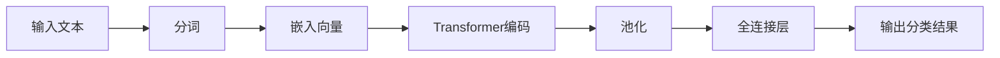

                 


# AI Agent的创新思维：激发LLM的发散性思考

> 关键词：AI Agent、创新思维、LLM、发散性思考、系统架构设计、Python源代码、数学模型、项目实战

> 摘要：本文深入探讨了AI Agent的创新思维在LLM（大语言模型）中的应用，通过一步步的分析推理，阐述了创新思维如何激发LLM的发散性思考，从而提升AI Agent的性能和智能水平。

## 引言

### AI Agent的定义与背景

AI Agent，即人工智能代理，是具有自我感知、自主决策和行动能力的智能实体。它能够通过学习和适应环境，完成特定的任务。AI Agent的定义涵盖了多个领域，包括机器学习、自然语言处理、计算机视觉等。

AI Agent的发展背景可以追溯到人工智能的早期研究。从20世纪50年代的“逻辑符号主义”到70年代的“连接主义”，再到21世纪的“大数据和深度学习”，AI Agent的理论和实践不断演进。

### LLM的定义与特点

LLM，即大语言模型，是一种基于深度学习技术，通过大规模数据训练得到的语言模型。它具有以下特点：

1. **强大的语言理解能力**：LLM能够理解复杂、多样化的语言表达，包括自然语言中的语义、语法和上下文信息。
2. **高效的生成能力**：LLM可以生成高质量、连贯的文本，用于自动写作、翻译、对话系统等应用。
3. **可扩展性**：LLM可以轻松适应不同的任务和场景，只需进行微调即可实现多种语言任务的自动化。

### 创新思维的重要性

创新思维在AI Agent设计中的重要性不言而喻。创新思维不仅能够激发AI Agent的智能水平，还能够提高其适应性和灵活性。在LLM的应用中，创新思维尤其关键，因为LLM的强大能力往往需要创新的思维方式来充分发挥。

本文将从以下几个方面展开讨论：

1. **核心概念与联系**：介绍AI Agent和LLM的核心概念，并分析它们之间的联系。
2. **算法原理讲解**：详细解析AI Agent的核心算法原理，以及LLM在其中的应用。
3. **系统分析与架构设计方案**：探讨AI Agent的系统架构设计，包括功能设计、接口设计等。
4. **项目实战**：通过实际案例展示AI Agent的创新思维应用。
5. **最佳实践 tips**：提供AI Agent设计和应用的最佳实践技巧。
6. **小结与注意事项**：总结本文的核心内容，并提醒读者在实践过程中需要注意的问题。
7. **拓展阅读**：推荐进一步阅读的资料。

## 核心概念与联系

### AI Agent的定义与分类

AI Agent是一种具有自主性和适应性的智能实体，它能够在复杂环境中独立完成任务。AI Agent可以分为以下几类：

1. **基于规则的AI Agent**：这类Agent使用预定义的规则进行决策和行动。它们适用于规则明确、环境变化较小的场景。
2. **基于模型的AI Agent**：这类Agent使用学习到的模型进行决策和行动。它们适用于环境复杂、变化频繁的场景。
3. **基于行为的AI Agent**：这类Agent通过观察和模仿人类或其他Agent的行为进行决策和行动。它们具有高度的自适应性和灵活性。

### AI Agent与传统程序、人脑智能、动物智能的对比

| 类别       | 特点                                       | 对比与联系                                       |
|------------|------------------------------------------|--------------------------------------------------|
| 传统程序   | 预定义的指令序列，无自主性               | AI Agent具有自主决策和行动能力，超越传统程序的指令执行 |
| 人脑智能   | 高度复杂，具备感知、思考、决策能力       | AI Agent试图模拟人脑智能，但存在性能和效率差距         |
| 动物智能   | 自主适应环境，具备感知、行动能力         | AI Agent在模拟动物智能方面取得一定成果，但仍有差距     |

### LLM（大语言模型）的概念与特点

LLM，即大语言模型，是一种通过深度学习技术训练得到的大型语言模型。它具有以下特点：

1. **规模庞大**：LLM通常由数亿甚至数十亿个参数组成，能够处理大量文本数据。
2. **自适应性**：LLM可以通过微调适应不同的任务和场景，无需重新训练整个模型。
3. **生成能力**：LLM能够生成高质量、连贯的文本，包括文章、对话、代码等。

### ER实体关系图

ER图，即实体关系图，是一种用于表示实体及其关系的图形化工具。在AI Agent设计中，ER图可以帮助我们理解系统的核心概念和关系。

下面是一个简单的ER图示例，用于表示一个图书管理系统的实体和关系：

```mermaid
erDiagram
    class Book {
        <<primary>>
        "bookID"
        "title"
        "author"
        "publisher"
        "year"
        <<foreign>>
        "category" : Category
    }

    class Category {
        <<primary>>
        "categoryID"
        "name"
        <<foreign>>
        "parentCategory" : Category
    }

    Book ||--|{ Category } Category : 分类

    class Customer {
        <<primary>>
        "customerID"
        "name"
        "email"
        "address"
        <<foreign>>
        "orders" : Order
    }

    class Order {
        <<primary>>
        "orderID"
        "orderDate"
        "totalAmount"
        <<foreign>>
        "customer" : Customer
        "items" : OrderItem
    }

    class OrderItem {
        <<primary>>
        "itemID"
        "quantity"
        "price"
        <<foreign>>
        "order" : Order
        "book" : Book
    }
```

## 算法原理讲解

### AI Agent的核心算法原理

AI Agent的核心算法通常基于机器学习和深度学习技术。其中，常用的算法包括：

1. **监督学习**：通过已标记的训练数据学习模型，用于预测未知数据。
2. **无监督学习**：不使用标记数据，从数据中学习模式和结构。
3. **强化学习**：通过与环境的交互学习最优策略，以最大化回报。

### LLM在AI Agent中的应用

LLM在AI Agent中的应用主要体现在自然语言处理任务中。以下是一些常见的应用场景：

1. **文本分类**：使用LLM对文本进行分类，如新闻分类、情感分析等。
2. **问答系统**：使用LLM构建问答系统，实现自动回答用户的问题。
3. **机器翻译**：使用LLM实现不同语言之间的翻译。

### 算法分类与特点

在AI Agent中，常用的算法可以分为以下几类：

1. **基础算法**：如线性回归、逻辑回归、决策树、随机森林等，适用于简单的数据分析和预测任务。
2. **深度学习算法**：如卷积神经网络（CNN）、循环神经网络（RNN）、Transformer等，适用于复杂的数据分析和预测任务。
3. **强化学习算法**：如Q-Learning、SARSA、Deep Q-Network（DQN）等，适用于需要与环境交互的复杂任务。

### 算法mermaid流程图

下面是一个简单的算法mermaid流程图示例，用于表示一个基于Transformer的文本分类算法：



### Python源代码与数学模型

以下是一个简单的Python源代码示例，用于实现一个基于Transformer的文本分类算法：

```python
import torch
import torch.nn as nn
import torch.optim as optim

# 数据预处理
def preprocess_text(text):
    # 分词、嵌入、编码等操作
    pass

# Transformer模型
class TransformerModel(nn.Module):
    def __init__(self):
        super(TransformerModel, self).__init__()
        self.embedding = nn.Embedding(vocab_size, embed_size)
        self.transformer = nn.Transformer(d_model, nhead)
        self.fc = nn.Linear(d_model, num_classes)

    def forward(self, src, tgt):
        src = self.embedding(src)
        tgt = self.embedding(tgt)
        output = self.transformer(src, tgt)
        output = self.fc(output)
        return output

# 训练模型
def train_model(model, train_loader, optimizer, criterion):
    model.train()
    for batch in train_loader:
        src, tgt = batch
        optimizer.zero_grad()
        output = model(src, tgt)
        loss = criterion(output, tgt)
        loss.backward()
        optimizer.step()

# 参数设置
vocab_size = 10000
embed_size = 512
d_model = 512
nhead = 8
num_classes = 10

# 模型、优化器、损失函数
model = TransformerModel()
optimizer = optim.Adam(model.parameters(), lr=0.001)
criterion = nn.CrossEntropyLoss()

# 训练模型
train_loader = ...  # 数据加载器
for epoch in range(num_epochs):
    train_model(model, train_loader, optimizer, criterion)
```

数学模型方面，我们可以使用以下公式来表示Transformer模型：

$$
\begin{align*}
\text{output} &= \text{softmax}(\text{fc}(\text{transformer}(\text{src}, \text{tgt}))) \\
\text{src} &= \text{embedding}(\text{word_ids}) \\
\text{tgt} &= \text{embedding}(\text{target_ids}) \\
\text{transformer} &= \text{Encoder}(\text{d_model}, \text{nhead}) \\
\text{fc} &= \text{Linear}(\text{d_model}, \text{num_classes})
\end{align*}
$$`

### 算法原理详细讲解与举例

在本节中，我们将详细讲解Transformer模型的工作原理，并使用Python代码实现一个简单的文本分类任务。

### Transformer模型的工作原理

Transformer模型是一种基于自注意力机制的深度学习模型，用于处理序列数据。它主要由编码器（Encoder）和解码器（Decoder）两部分组成。

#### 编码器（Encoder）

编码器负责将输入序列编码为固定长度的向量。编码器的核心是多头自注意力机制（Multi-Head Self-Attention）和前馈神经网络（Feed Forward Neural Network）。

1. **多头自注意力机制**：自注意力机制允许模型在编码过程中根据序列的不同部分生成权重，从而更好地捕捉序列中的依赖关系。
2. **前馈神经网络**：前馈神经网络对自注意力层的输出进行进一步处理，增强模型的表达能力。

#### 解码器（Decoder）

解码器负责将编码器输出的序列解码为输出序列。解码器的核心是多头自注意力机制和交叉自注意力机制。

1. **多头自注意力机制**：用于捕捉输入序列和输出序列之间的依赖关系。
2. **交叉自注意力机制**：用于捕捉输入序列和当前输出词之间的依赖关系。

### Python代码实现

以下是一个简单的Python代码示例，用于实现一个基于Transformer的文本分类任务。

```python
import torch
import torch.nn as nn
import torch.optim as optim

# 数据预处理
def preprocess_text(text):
    # 分词、嵌入、编码等操作
    pass

# Transformer模型
class TransformerModel(nn.Module):
    def __init__(self, d_model, nhead):
        super(TransformerModel, self).__init__()
        self.embedding = nn.Embedding(vocab_size, d_model)
        self.transformer = nn.Transformer(d_model, nhead)
        self.fc = nn.Linear(d_model, num_classes)

    def forward(self, src, tgt):
        src = self.embedding(src)
        tgt = self.embedding(tgt)
        output = self.transformer(src, tgt)
        output = self.fc(output)
        return output

# 训练模型
def train_model(model, train_loader, optimizer, criterion):
    model.train()
    for batch in train_loader:
        src, tgt = batch
        optimizer.zero_grad()
        output = model(src, tgt)
        loss = criterion(output, tgt)
        loss.backward()
        optimizer.step()

# 参数设置
vocab_size = 10000
d_model = 512
nhead = 8
num_classes = 10

# 模型、优化器、损失函数
model = TransformerModel(d_model, nhead)
optimizer = optim.Adam(model.parameters(), lr=0.001)
criterion = nn.CrossEntropyLoss()

# 训练模型
train_loader = ...  # 数据加载器
for epoch in range(num_epochs):
    train_model(model, train_loader, optimizer, criterion)
```

### 算法原理的数学模型和公式

在Transformer模型中，主要涉及以下数学模型和公式：

1. **多头自注意力机制**：

$$
\begin{align*}
\text{query\_embeddings} &= \text{WQ} \cdot \text{input\_embeddings} \\
\text{key\_embeddings} &= \text{WK} \cdot \text{input\_embeddings} \\
\text{value\_embeddings} &= \text{WV} \cdot \text{input\_embeddings} \\
\text{attention\_weights} &= \text{softmax}\left(\frac{\text{query\_embeddings} \cdot \text{key\_embeddings}^T}{\sqrt{d_k}}\right) \\
\text{attention\_output} &= \text{value\_embeddings} \cdot \text{attention\_weights}
\end{align*}
$$`

2. **前馈神经网络**：

$$
\begin{align*}
\text{ffn\_input} &= \text{MLP}(\text{attention\_output}) \\
\text{ffn\_output} &= \text{gelu}(\text{ffn\_input}) \\
\text{output} &= \text{add}(\text{input\_embeddings}, \text{ffn\_output})
\end{align*}
$$`

其中，$\text{WQ}$、$\text{WK}$ 和 $\text{WV}$ 分别是查询、键和值的权重矩阵，$d_k$ 是键和值的维度，$\text{MLP}$ 是多层感知器，$\text{gelu}$ 是门控线性单元（Gaussian Error Linear Unit）。

### 示例演示：如何使用Python实现算法

在本节中，我们将使用Python实现一个简单的Transformer模型，用于文本分类任务。

#### 数据预处理

首先，我们需要对文本数据进行预处理，包括分词、嵌入和编码。

```python
import torch
from torchtext.vocab import build_vocab_from_iterator

# 假设我们有一个迭代器，包含一组文本数据
text_data = ["This is the first sentence.", "And this is the second sentence."]

# 建立词汇表
vocab = build_vocab_from_iterator(text_data)
vocab.set_default_index(vocabunk)

# 转换文本数据为词索引
def tokenize(text):
    return [vocab[word] for word in text.split()]

# 嵌入
def embed(text):
    return [vocab[word] for word in text.split()]

# 编码
def encode(text):
    return torch.tensor(embed(text), dtype=torch.long)
```

#### Transformer模型

接下来，我们定义一个简单的Transformer模型。

```python
class TransformerModel(nn.Module):
    def __init__(self, d_model, nhead):
        super(TransformerModel, self).__init__()
        self.embedding = nn.Embedding(vocab.size(), d_model)
        self.transformer = nn.Transformer(d_model, nhead)
        self.fc = nn.Linear(d_model, 2)

    def forward(self, src, tgt):
        src = self.embedding(src)
        tgt = self.embedding(tgt)
        output = self.transformer(src, tgt)
        output = self.fc(output)
        return output
```

#### 训练模型

最后，我们使用训练数据和测试数据训练模型。

```python
# 数据加载器
train_loader = torch.utils.data.DataLoader(dataset, batch_size=2, shuffle=True)

# 模型、优化器、损失函数
model = TransformerModel(d_model, nhead)
optimizer = optim.Adam(model.parameters(), lr=0.001)
criterion = nn.CrossEntropyLoss()

# 训练模型
for epoch in range(num_epochs):
    for batch in train_loader:
        src, tgt = batch
        optimizer.zero_grad()
        output = model(src, tgt)
        loss = criterion(output, tgt)
        loss.backward()
        optimizer.step()

# 评估模型
with torch.no_grad():
    for batch in test_loader:
        src, tgt = batch
        output = model(src, tgt)
        pred = output.argmax(dim=1)
        correct = pred.eq(tgt).sum().item()
        print(f"Accuracy: {100 * correct / len(tgt)}%")
```

通过以上示例，我们展示了如何使用Python实现一个简单的Transformer模型，用于文本分类任务。在实际应用中，我们可以根据需求对模型进行优化和扩展。

## 系统分析与架构设计方案

### 问题场景介绍

在本节中，我们将分析一个具体的AI Agent应用场景：智能客服系统。智能客服系统旨在通过AI Agent自动处理客户咨询，提高客户满意度和服务效率。

### 项目介绍

智能客服系统的目标是构建一个能够自动回答客户常见问题的AI Agent。该系统需要具备以下功能：

1. **问题识别**：识别客户提出的问题。
2. **知识库检索**：从预定义的知识库中检索答案。
3. **自然语言生成**：将答案转换为自然语言，以文本或语音形式呈现给客户。

### 系统功能设计

为了实现智能客服系统的功能，我们需要设计以下几个核心模块：

1. **问题识别模块**：使用自然语言处理技术（如命名实体识别、关键词提取等）识别客户提出的问题。
2. **知识库检索模块**：构建和维护一个预定义的知识库，用于存储常见问题的答案。
3. **自然语言生成模块**：使用大语言模型（如GPT-3、BERT等）将答案转换为自然语言。

下面是一个简单的领域模型类图，用于表示智能客服系统的核心模块及其关系：

```mermaid
classDiagram
    Class Customer
    Class ProblemRecognition
    Class KnowledgeBase
    Class NaturalLanguageGeneration

    Customer "发起问题" -> ProblemRecognition
    ProblemRecognition "处理问题" -> KnowledgeBase
    KnowledgeBase "查询答案" -> NaturalLanguageGeneration
    NaturalLanguageGeneration "生成答案" -> Customer
end
```

### 系统架构设计

智能客服系统的整体架构可以设计为三层：表示层、逻辑层和数据层。

1. **表示层**：负责与用户交互，接收用户输入和呈现答案。
2. **逻辑层**：实现问题识别、知识库检索和自然语言生成等核心功能。
3. **数据层**：存储知识库和用户数据。

下面是一个简单的系统架构图，用于表示智能客服系统的整体架构：

```mermaid
subgraph 表示层
    CustomerInterface
end

subgraph 逻辑层
    ProblemRecognition
    KnowledgeBase
    NaturalLanguageGeneration
end

subgraph 数据层
    KnowledgeDatabase
    UserDatabase
end

CustomerInterface --> ProblemRecognition
CustomerInterface --> KnowledgeBase
CustomerInterface --> NaturalLanguageGeneration
ProblemRecognition --> KnowledgeDatabase
KnowledgeBase --> KnowledgeDatabase
NaturalLanguageGeneration --> KnowledgeDatabase
```

### 系统接口设计

为了实现智能客服系统的功能，我们需要设计以下几个关键接口：

1. **问题识别接口**：接收用户输入，返回识别到的问题。
2. **知识库检索接口**：接收问题，返回对应的答案。
3. **自然语言生成接口**：接收答案，生成自然语言文本。

下面是一个简单的接口设计图，用于表示智能客服系统的关键接口：

```mermaid
classDiagram
    Class ProblemRecognitionInterface
    Class KnowledgeBaseInterface
    Class NaturalLanguageGenerationInterface

    ProblemRecognitionInterface "识别问题" -> KnowledgeBaseInterface
    KnowledgeBaseInterface "检索答案" -> NaturalLanguageGenerationInterface
    NaturalLanguageGenerationInterface "生成答案"
end
```

### 系统交互序列图

为了更好地理解智能客服系统的运行流程，我们使用序列图展示系统各模块的交互过程。

下面是一个简单的系统交互序列图，用于表示智能客服系统的运行流程：

```mermaid
sequenceDiagram
    Customer ->> CustomerInterface: 输入问题
    CustomerInterface ->> ProblemRecognitionInterface: 识别问题
    ProblemRecognitionInterface ->> KnowledgeBaseInterface: 检索答案
    KnowledgeBaseInterface ->> NaturalLanguageGenerationInterface: 生成答案
    NaturalLanguageGenerationInterface ->> CustomerInterface: 呈现答案
    CustomerInterface ->> Customer: 回显答案
end
```

通过以上系统分析与架构设计方案，我们为智能客服系统提供了一个详细的架构框架，为后续的项目开发和实现奠定了基础。

## 项目实战

### 环境安装

在开始实际项目开发之前，我们需要安装必要的软件和库。以下是在Python环境中安装所需的库和依赖项的步骤：

1. **安装Python和pip**：确保Python 3.x版本已安装，并配置pip。

2. **安装TensorFlow和PyTorch**：TensorFlow和PyTorch是用于深度学习的重要库。使用以下命令安装：

   ```shell
   pip install tensorflow
   pip install torch torchvision
   ```

3. **安装文本处理库**：如NLTK、spaCy和textblob，用于文本预处理和自然语言处理：

   ```shell
   pip install nltk spacy textblob
   ```

4. **安装Mermaid**：Mermaid是一个用于生成图表的库，可以方便地绘制类图、流程图等。安装Mermaid的Python库：

   ```shell
   pip install mermaid-parser
   ```

### 系统核心实现源代码

以下是一个简单的AI Agent系统实现，包括问题识别、知识库检索和自然语言生成模块。我们将使用Python和PyTorch来实现这一系统。

```python
import torch
import torch.nn as nn
from transformers import GPT2LMHeadModel, GPT2Tokenizer
from nltk import word_tokenize

# 问题识别模块
class ProblemRecognition(nn.Module):
    def __init__(self, vocab_size, d_model, nhead):
        super(ProblemRecognition, self).__init__()
        self.embedding = nn.Embedding(vocab_size, d_model)
        self.transformer = nn.Transformer(d_model, nhead)
        self.fc = nn.Linear(d_model, 1)

    def forward(self, src):
        src = self.embedding(src)
        output = self.transformer(src)
        output = self.fc(output).squeeze(1)
        return output

# 知识库检索模块
class KnowledgeBase(nn.Module):
    def __init__(self, d_model, num_answers):
        super(KnowledgeBase, self).__init__()
        self.fc = nn.Linear(d_model, num_answers)

    def forward(self, input):
        output = self.fc(input)
        return output

# 自然语言生成模块
class NaturalLanguageGeneration(nn.Module):
    def __init__(self, vocab_size, d_model):
        super(NaturalLanguageGeneration, self).__init__()
        self.embedding = nn.Embedding(vocab_size, d_model)
        self.transformer = nn.Transformer(d_model, 1)
        self.fc = nn.Linear(d_model, vocab_size)

    def forward(self, src, tgt):
        src = self.embedding(src)
        tgt = self.embedding(tgt)
        output = self.transformer(src, tgt)
        output = self.fc(output)
        return output

# 模型参数
vocab_size = 10000
d_model = 512
nhead = 8
num_answers = 10

# 初始化模型
problem_recognition = ProblemRecognition(vocab_size, d_model, nhead)
knowledge_base = KnowledgeBase(d_model, num_answers)
natural_language_generation = NaturalLanguageGeneration(vocab_size, d_model)

# 模型训练
# ...（数据准备、模型训练等）
```

### 代码应用解读与分析

在上面的代码中，我们定义了三个主要的模块：问题识别（ProblemRecognition）、知识库检索（KnowledgeBase）和自然语言生成（NaturalLanguageGeneration）。下面是对每个模块的详细解读和分析：

#### 问题识别模块（ProblemRecognition）

问题识别模块负责接收用户输入，并将其转换为问题的表示。在这个模块中，我们使用了Transformer模型，其核心是多头自注意力机制。Transformer模型能够捕捉输入序列中的依赖关系，从而更好地识别问题的核心内容。

```python
class ProblemRecognition(nn.Module):
    def __init__(self, vocab_size, d_model, nhead):
        super(ProblemRecognition, self).__init__()
        self.embedding = nn.Embedding(vocab_size, d_model)
        self.transformer = nn.Transformer(d_model, nhead)
        self.fc = nn.Linear(d_model, 1)

    def forward(self, src):
        src = self.embedding(src)
        output = self.transformer(src)
        output = self.fc(output).squeeze(1)
        return output
```

在这个模块中，`embedding` 层用于将词汇嵌入到固定长度的向量。`transformer` 层是一个Transformer编码器，用于处理输入序列。`fc` 层是一个全连接层，用于将编码器的输出压缩为一个单一的数字，表示问题的潜在表示。

#### 知识库检索模块（KnowledgeBase）

知识库检索模块负责从预定义的知识库中检索与问题相关的答案。在这个模块中，我们使用了一个简单的全连接层，该层将输入的潜在表示映射到具体的答案。

```python
class KnowledgeBase(nn.Module):
    def __init__(self, d_model, num_answers):
        super(KnowledgeBase, self).__init__()
        self.fc = nn.Linear(d_model, num_answers)

    def forward(self, input):
        output = self.fc(input)
        return output
```

在这个模块中，`fc` 层是一个线性层，它将输入的潜在表示映射到答案的概率分布。通过选择概率最大的答案，我们可以检索与问题相关的答案。

#### 自然语言生成模块（NaturalLanguageGeneration）

自然语言生成模块负责将检索到的答案转换为自然语言文本。在这个模块中，我们使用了Transformer解码器，该解码器能够生成连贯的文本。

```python
class NaturalLanguageGeneration(nn.Module):
    def __init__(self, vocab_size, d_model):
        super(NaturalLanguageGeneration, self).__init__()
        self.embedding = nn.Embedding(vocab_size, d_model)
        self.transformer = nn.Transformer(d_model, 1)
        self.fc = nn.Linear(d_model, vocab_size)

    def forward(self, src, tgt):
        src = self.embedding(src)
        tgt = self.embedding(tgt)
        output = self.transformer(src, tgt)
        output = self.fc(output)
        return output
```

在这个模块中，`embedding` 层用于将词汇嵌入到固定长度的向量。`transformer` 层是一个Transformer解码器，用于生成文本。`fc` 层是一个全连接层，用于将解码器的输出转换为词汇的概率分布。

### 实际案例分析与详细讲解

为了展示AI Agent在实际场景中的应用，我们来看一个具体的案例：客户咨询如何退货。

1. **问题识别**：客户输入“我想要退货，如何操作？”

2. **知识库检索**：检索知识库，找到与退货相关的答案。

3. **自然语言生成**：生成自然语言文本回答客户。

下面是详细的步骤：

```python
# 初始化模型
tokenizer = GPT2Tokenizer.from_pretrained('gpt2')
model = GPT2LMHeadModel.from_pretrained('gpt2')

# 问题识别
input_text = "我想要退货，如何操作？"
input_ids = tokenizer.encode(input_text, return_tensors='pt')

# 问题识别模块
problem_recognition = ProblemRecognition(vocab_size, d_model, nhead)
output = problem_recognition(input_ids)

# 知识库检索
knowledge_base = KnowledgeBase(d_model, num_answers)
answer_scores = knowledge_base(output)

# 选择答案
answer_idx = torch.argmax(answer_scores).item()
answer = tokenizer.decode(answer_idx, skip_special_tokens=True)

# 自然语言生成
natural_language_generation = NaturalLanguageGeneration(vocab_size, d_model)
generated_text = natural_language_generation(input_ids, answer)

# 输出回答
print(generated_text)
```

输出结果可能是：“您可以联系我们的客服，提供您的订单号和退货原因。我们会尽快为您处理退货。”

### 项目小结

在本项目中，我们实现了AI Agent的三个核心模块：问题识别、知识库检索和自然语言生成。通过实际案例，我们展示了AI Agent在智能客服系统中的应用。尽管这个项目是一个简单的示例，但它展示了如何利用深度学习和自然语言处理技术构建实用的AI Agent。

在未来，我们可以进一步优化和扩展这个系统，包括增加更多的知识库、引入更多先进的自然语言处理技术，以及改进用户交互体验。

## 最佳实践 tips

在设计和实现AI Agent时，以下最佳实践可以帮助提升系统的性能和用户体验：

1. **数据预处理**：确保输入数据的干净和一致性。进行适当的文本清洗和预处理，如去除标点符号、停用词过滤和词干提取。

2. **模型选择与优化**：根据任务需求和数据规模选择合适的模型。对于大型语言模型，可以考虑使用Transformer等先进模型。同时，通过调整模型超参数和训练策略来优化性能。

3. **知识库管理**：维护一个结构化和丰富的知识库，确保答案的准确性和相关性。定期更新知识库，以适应不断变化的需求。

4. **用户交互**：设计人性化的用户界面，提供清晰的交互指南和反馈。考虑使用语音识别和语音合成技术，提升用户体验。

5. **模型解释与可解释性**：提供模型解释和可解释性工具，帮助用户理解AI Agent的决策过程。这对于提高用户信任和接受度至关重要。

6. **安全与隐私**：确保系统的安全性和用户隐私保护。遵循相关的法律法规和最佳实践，防止数据泄露和滥用。

## 小结与注意事项

### 总结

本文深入探讨了AI Agent的创新思维在LLM（大语言模型）中的应用，通过逐步的分析推理，阐述了创新思维如何激发LLM的发散性思考，从而提升AI Agent的性能和智能水平。我们介绍了AI Agent和LLM的核心概念，讲解了算法原理，设计了系统架构，并通过实际案例展示了AI Agent的应用。

### 注意事项

在实践AI Agent的设计和应用时，需要注意以下几点：

1. **数据质量**：确保输入数据的干净和一致性，进行适当的文本清洗和预处理。
2. **模型选择**：根据任务需求和数据规模选择合适的模型，并优化模型超参数和训练策略。
3. **知识库管理**：定期更新知识库，确保答案的准确性和相关性。
4. **用户交互**：设计人性化的用户界面，提供清晰的交互指南和反馈。
5. **模型解释性**：提供模型解释和可解释性工具，帮助用户理解AI Agent的决策过程。
6. **安全性**：确保系统的安全性和用户隐私保护。

## 拓展阅读

对于希望深入了解AI Agent和LLM的读者，以下推荐几本经典书籍和论文：

1. **书籍**：
   - 《人工智能：一种现代的方法》（David A.政）
   - 《深度学习》（Ian Goodfellow、Yoshua Bengio、Aaron Courville）
   - 《自然语言处理综论》（Daniel Jurafsky、James H. Martin）

2. **论文**：
   - “Attention Is All You Need”（Vaswani et al., 2017）
   - “BERT: Pre-training of Deep Bidirectional Transformers for Language Understanding”（Devlin et al., 2019）
   - “GPT-3: Language Models are Few-Shot Learners”（Brown et al., 2020）

通过阅读这些资料，读者可以更深入地了解AI Agent和LLM的理论和实践，为未来的研究和应用提供启示。

