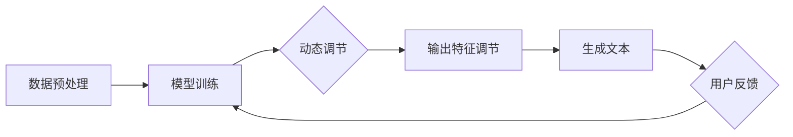
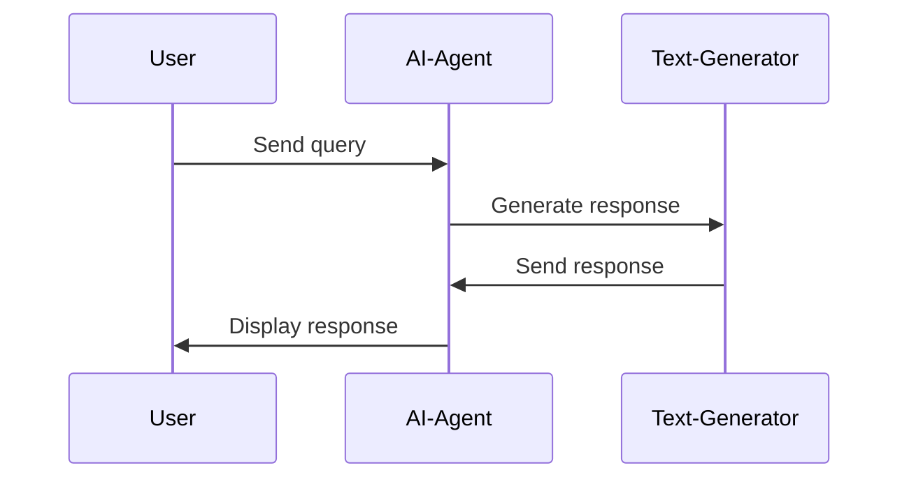

                 

## 引言

### 文章标题：AI Agent的可控文本生成：精确调节LLM的输出特征

### 关键词：AI Agent、可控文本生成、LLM、输出特征、精确调节

### 摘要：
本文深入探讨AI Agent在可控文本生成中的关键作用，以及如何精确调节大型语言模型（LLM）的输出特征。通过分析AI Agent的基本原理和LLM的工作机制，本文详细介绍了可控文本生成的概念和方法。接着，探讨了数据预处理与特征提取的重要性，以及调节方法与技术。最后，通过案例研究和未来趋势的展望，展示了可控文本生成的实际应用和未来发展。

## 问题背景与挑战

### 1.1.1 AI Agent与文本生成的现状

**AI Agent的定义与功能**

AI Agent，即人工智能代理，是一种可以代表人类执行任务并与其他系统交互的计算机程序。它们具备自主性、智能性和适应性，能够在复杂环境中进行决策和行动。AI Agent的核心功能包括感知环境、理解意图、规划行动和执行任务等。近年来，随着深度学习和自然语言处理技术的进步，AI Agent在文本生成、对话系统、内容创作等领域得到了广泛应用。

**文本生成的技术发展**

文本生成技术经历了从规则驱动到统计模型，再到深度学习模型的演变。早期的文本生成系统依赖于语法规则和模板匹配，生成内容受限于规则库的丰富程度。随着自然语言处理技术的发展，统计模型如基于统计机器学习的方法和基于生成式模型的变分自编码器（VAE）等，使得文本生成变得更加灵活和高效。而深度学习模型，特别是大型语言模型（LLM），如GPT、BERT等，在理解和生成自然语言方面取得了显著的突破。

**精确调节LLM输出特征的需求**

尽管LLM在文本生成方面表现出色，但其输出特征的调节仍然面临挑战。传统的文本生成系统往往难以控制输出内容的质量、意图和风格，导致生成文本可能存在不准确、不一致或有害的内容。为了实现可控文本生成，需要精确调节LLM的输出特征，使其能够根据用户意图和需求生成高质量的文本。

### 1.1.2 可控文本生成的挑战

**文本内容准确性与可控性的平衡**

可控文本生成需要在保证文本内容准确性的同时，实现对其风格、意图和情感的可控性。然而，这两者之间存在一定的矛盾。过于严格的控制可能导致文本生成过于僵化，缺乏自然性和灵活性；而过于自由的生成可能导致文本内容偏离用户意图，甚至生成有害信息。

**用户意图理解与输出匹配**

用户意图的准确理解是实现可控文本生成的重要前提。然而，用户意图可能存在多样性、模糊性和动态性，使得AI Agent需要具备强大的语义理解能力，以准确捕捉并匹配用户意图。

**防止偏见与有害内容的生成**

文本生成中的偏见和有害内容是可控文本生成面临的另一个重大挑战。偏见可能源于训练数据的偏差或模型设计的缺陷，导致生成文本存在歧视性、攻击性或误导性。因此，需要采取有效的措施来检测和消除偏见，确保生成文本的公平性和安全性。

### 1.1.3 书籍目的与结构安排

**目标读者群体**

本书旨在为AI领域的专业研究人员、开发人员和技术爱好者提供系统性的指导和参考。无论你是初学者还是经验丰富的从业者，都可以通过本书深入理解AI Agent的可控文本生成技术。

**主要内容概述**

本书将围绕以下主题展开：

1. AI Agent的基本原理和LLM的工作机制
2. 可控文本生成的概念、方法和挑战
3. 数据预处理与特征提取的重要性
4. 调节方法与技术的详细介绍
5. 案例研究与分析
6. 可控文本生成的未来趋势

**各章节之间的逻辑关系**

本书的结构安排旨在逐步引导读者从基础概念到高级技术，逐步深入。首先，通过介绍AI Agent和LLM的基本原理，为后续章节的内容奠定基础。接着，详细探讨可控文本生成的概念和方法，分析其面临的挑战。随后，重点介绍数据预处理与特征提取的技术，以及精确调节LLM输出特征的方法。最后，通过案例研究和未来趋势的展望，帮助读者更好地理解可控文本生成的实际应用和未来发展。

## 核心概念

### 2.1 AI Agent的基本原理

**AI Agent的概念**

AI Agent是一种基于人工智能技术的计算机程序，它可以模拟人类智能，自主执行任务并与其他系统进行交互。AI Agent的核心特征包括自主性、智能性、适应性和协作性。自主性指的是AI Agent能够自主决定行动方案，智能性体现在其具备理解和解决问题的能力，适应性意味着AI Agent可以根据环境和任务需求进行自我调整，协作性则表示AI Agent能够与其他智能体或人类协作完成任务。

**AI Agent的工作流程**

AI Agent的工作流程通常包括感知环境、理解意图、规划行动和执行任务等几个阶段。首先，AI Agent通过传感器感知外部环境，获取相关的信息和数据。接着，通过自然语言处理、图像识别等技术，AI Agent对感知到的信息进行理解和分析，从而确定用户的意图和需求。基于这些理解，AI Agent会制定行动方案，并执行相应的任务，如生成文本、回复对话、执行命令等。最后，AI Agent会根据任务执行的结果，对行动方案进行评估和调整，以提高其自主性和智能性。

**AI Agent的类型与应用场景**

AI Agent可以按照不同的分类标准进行划分。根据功能特点，AI Agent可以分为任务型代理、社交型代理和混合型代理。任务型代理专注于完成特定任务，如自动客服系统、智能助手等；社交型代理则擅长与人进行交流，如聊天机器人、虚拟助手等；混合型代理则兼具任务执行和社交交流的能力，如智能家庭助理、智能秘书等。

不同类型的AI Agent适用于不同的应用场景。例如，任务型代理广泛应用于客服、金融、医疗等领域；社交型代理则常见于客户服务、教育、娱乐等领域；混合型代理则适用于需要复杂任务执行和高效人际交流的场景，如智能办公助手、智能家居系统等。

### 2.2 LLM（大型语言模型）原理

**LLM的定义**

大型语言模型（Large Language Model，简称LLM）是一种基于深度学习技术构建的模型，用于对自然语言进行理解和生成。LLM通过在大量文本数据上进行预训练，学习到语言的统计规律和语义信息，从而能够生成符合语法和语义规则的文本。代表性的LLM模型包括GPT、BERT、T5等。

**LLM的训练方法**

LLM的训练方法主要包括两个阶段：预训练和微调。在预训练阶段，LLM在大规模文本数据上进行无监督学习，学习到语言的统计规律和语义信息。预训练过程中，常用的技术包括自注意力机制、Transformer架构、BERT预训练任务等。在微调阶段，LLM根据特定任务的需求，在标注数据集上进行有监督学习，调整模型的参数，以适应不同的任务场景。

**LLM的优势与局限性**

LLM在自然语言处理任务中表现出色，具有以下优势：

1. 强大的语言理解能力：LLM通过预训练学习到丰富的语言知识，能够准确理解和生成自然语言。
2. 灵活的文本生成能力：LLM可以生成符合语法和语义规则的文本，适用于各种文本生成任务，如文章写作、对话生成等。
3. 高效的任务适应能力：LLM具有通用性，可以通过微调快速适应不同的任务需求。

然而，LLM也存在一些局限性：

1. 对数据依赖性强：LLM的训练需要大量高质量的文本数据，数据质量和数量直接影响模型的性能。
2. 难以理解内部决策过程：LLM的决策过程复杂且高度非线性，难以直观理解其内部机制。
3. 难以避免偏见和错误：由于训练数据的偏见，LLM在生成文本时可能存在偏见和错误，需要采取有效的方法进行修正。

### 2.3 可控文本生成的概念

**可控文本生成的定义**

可控文本生成（Controllable Text Generation）是指通过特定技术手段，实现对生成文本内容、风格、意图等特征的有效控制，以满足用户需求和应用场景的要求。与传统的文本生成技术相比，可控文本生成具有更高的灵活性和可控性，能够生成高质量的文本，避免产生不准确、不一致或有害的内容。

**可控文本生成的目标**

可控文本生成的目标主要包括以下几点：

1. 文本内容准确性：确保生成文本内容准确、可信，避免产生错误、误导性或有害的信息。
2. 文本风格一致性：保持生成文本的风格一致，避免出现风格突变或不符合用户需求的情况。
3. 用户意图匹配度：准确理解并满足用户意图，生成符合用户需求的文本内容。

**可控文本生成的方法**

实现可控文本生成的方法主要包括以下几种：

1. 数据增强：通过引入多样化和丰富的数据，提高模型对各种场景的适应能力，从而实现更精确的文本生成。
2. 对抗性样本生成：利用对抗性训练技术，生成与真实样本在分布上相似的对抗性样本，提高模型对异常样本的鲁棒性。
3. 动态调节技术：通过实时调整模型的输入特征和参数，实现动态调整生成文本的内容、风格和意图。
4. 用户反馈机制：利用用户反馈信息，对模型进行迭代优化，提高生成文本的匹配度和准确性。

## 精确调节LLM的输出特征

### 3.1 输出特征的定义与分类

**输出特征的定义**

输出特征是指模型在生成文本时产生的各种特征信息，这些特征能够表征文本的语义、风格、意图等属性。输出特征是控制文本生成质量的关键因素，通过对输出特征的精确调节，可以实现高质量的文本生成。

**输出特征的分类**

根据输出特征的属性和作用，可以将输出特征分为以下几类：

1. 语义特征：表征文本的语义信息，如实体识别、关系抽取等。
2. 风格特征：表征文本的风格特征，如词汇选择、句式结构等。
3. 情感特征：表征文本的情感倾向，如正面、负面、中性等。
4. 意图特征：表征文本的意图信息，如请求、回答、描述等。

### 3.2 调节方法与技术

**数据增强技术**

数据增强技术通过引入多样化和丰富的数据，提高模型对各种场景的适应能力，从而实现更精确的文本生成。常见的数据增强方法包括：

1. 数据扩充：通过添加同义词、词性替换、语法变换等操作，生成新的数据样本。
2. 数据合成：通过模型生成与原始数据在分布上相似的新数据样本，提高模型的泛化能力。
3. 数据清洗：去除数据中的噪声和错误，提高数据质量。

**对抗性样本生成**

对抗性样本生成是利用对抗性训练技术，生成与真实样本在分布上相似的对抗性样本，提高模型对异常样本的鲁棒性。常见的方法包括：

1. 对抗性生成对抗网络（GAN）：通过生成器和判别器的对抗性训练，生成具有对抗性的样本。
2. 对抗性样本筛选：通过训练数据集中筛选出具有代表性的对抗性样本，提高模型的鲁棒性。

**动态调节技术**

动态调节技术通过实时调整模型的输入特征和参数，实现动态调整生成文本的内容、风格和意图。常见的方法包括：

1. 参数调整：通过调整模型的参数，如学习率、正则化参数等，实现输出特征的精确调节。
2. 输入特征调整：通过调整输入特征的权重和组合，改变生成文本的语义和风格。
3. 生成器网络调整：通过调整生成器网络的架构和参数，实现更灵活的文本生成。

**用户反馈机制**

用户反馈机制通过收集用户对生成文本的反馈信息，对模型进行迭代优化，提高生成文本的匹配度和准确性。常见的方法包括：

1. 用户评分：通过用户对生成文本的评分，评估生成文本的质量，并指导模型优化。
2. 用户标记：通过用户对生成文本的标记，修正模型的错误和偏见，提高生成文本的准确性。
3. 交互式优化：通过用户与模型的交互，实时调整模型的参数和输入特征，实现更精确的文本生成。

### 3.3 实现与评估

**实现步骤**

实现精确调节LLM的输出特征主要包括以下步骤：

1. 数据预处理：清洗和标注训练数据，提取相关特征。
2. 模型训练：利用训练数据，训练LLM模型，并调整模型参数。
3. 输出特征调节：根据用户需求和场景，动态调整输出特征。
4. 生成文本：利用调节后的输出特征，生成符合用户需求的文本。

**评估指标**

评估精确调节LLM输出特征的效果，可以采用以下指标：

1. 生成文本质量：通过BLEU、ROUGE等指标，评估生成文本的语法和语义质量。
2. 用户满意度：通过用户对生成文本的评分，评估生成文本的匹配度和准确性。
3. 模型性能：通过模型在测试集上的表现，评估模型在不同场景下的适应能力。

**结果分析**

通过对实现步骤和评估指标的分析，可以得出以下结论：

1. 精确调节LLM的输出特征，可以显著提高生成文本的质量和用户满意度。
2. 不同调节方法和技术对输出特征的调节效果存在差异，需要根据具体应用场景进行选择。
3. 用户反馈机制对模型优化具有重要作用，可以有效提高生成文本的匹配度和准确性。

## 可控文本生成在不同领域的应用

### 7.1 内容创作与编辑

**文章写作**

在内容创作领域，可控文本生成技术被广泛应用于文章写作。通过精确调节LLM的输出特征，AI Agent可以生成高质量、风格一致的文章。例如，在新闻写作中，AI Agent可以根据新闻稿模板和关键信息，自动生成新闻文章。在市场营销文案中，AI Agent可以根据品牌特点和市场策略，生成吸引消费者的营销文案。

**营销文案**

营销文案是营销传播的重要组成部分。可控文本生成技术可以帮助企业快速生成高质量的营销文案，提高营销效果。通过精确调节LLM的输出特征，AI Agent可以生成具有吸引力和说服力的营销文案。例如，在电商平台上，AI Agent可以根据产品描述和用户评论，生成个性化的产品推广文案；在社交媒体上，AI Agent可以根据用户行为和兴趣，生成针对性的推广文案。

**新闻摘要**

新闻摘要是对长篇新闻进行简洁概括的一种形式，常用于信息过载的场景。可控文本生成技术可以生成准确、简洁的新闻摘要，帮助用户快速了解新闻内容。通过精确调节LLM的输出特征，AI Agent可以根据新闻原文和摘要长度要求，自动生成符合用户需求的新闻摘要。

### 7.2 聊天机器人与对话系统

**对话生成**

聊天机器人是人工智能领域的一个重要应用。通过可控文本生成技术，AI Agent可以生成自然、流畅的对话内容，与用户进行有效沟通。在客服领域，聊天机器人可以自动回答用户问题，提供在线服务；在教育领域，聊天机器人可以与学生学习互动，提供辅导和答疑。

**对话管理**

对话管理是指AI Agent在对话过程中，根据用户输入和上下文信息，动态调整对话内容和策略。通过精确调节LLM的输出特征，AI Agent可以更好地理解用户意图，生成符合对话场景的回复。例如，在客户服务场景中，AI Agent可以根据用户问题，自动提供解决方案；在情感交流场景中，AI Agent可以生成温暖、体贴的回复，与用户建立情感连接。

**情感识别与回复**

情感识别与回复是聊天机器人的重要功能之一。通过可控文本生成技术，AI Agent可以识别用户情感，并生成相应的回复。例如，当用户表达不满时，AI Agent可以生成道歉和安抚的回复；当用户表达喜悦时，AI Agent可以生成祝贺和夸奖的回复。通过精确调节LLM的输出特征，AI Agent可以更准确地识别用户情感，生成更符合用户期望的回复。

### 7.3 教育与培训

**自动化教学**

在教育与培训领域，可控文本生成技术可以自动化生成教学材料，提高教学效率。通过精确调节LLM的输出特征，AI Agent可以生成符合教学目标和课程内容的教材、教案和练习题。例如，在在线教育平台中，AI Agent可以根据用户需求和课程进度，自动生成个性化的教学材料；在培训场景中，AI Agent可以根据培训目标和学员需求，自动生成培训资料。

**个性化学习**

个性化学习是指根据学员的学习特点和需求，提供定制化的学习内容和方法。通过可控文本生成技术，AI Agent可以生成符合学员个性化需求的学习材料，提高学习效果。例如，在自适应学习系统中，AI Agent可以根据学员的答题情况和知识点掌握情况，自动生成针对性的学习资料和练习题；在虚拟课堂中，AI Agent可以根据学员的提问和参与度，自动生成教学反馈和建议。

**课程内容生成**

课程内容生成是可控文本生成技术在教育领域的另一个重要应用。通过精确调节LLM的输出特征，AI Agent可以自动生成课程讲义、教学视频和实验报告等课程内容。例如，在在线教育平台中，AI Agent可以根据课程大纲和教学目标，自动生成完整的课程内容；在科研实验室中，AI Agent可以根据实验设计和科研成果，自动生成实验报告和学术论文。

### 7.4 法律与司法

**法律文书的生成**

在法律领域，可控文本生成技术可以自动化生成各种法律文书，如合同、起诉状、答辩状等。通过精确调节LLM的输出特征，AI Agent可以生成符合法律规范和案件特点的法律文书。例如，在律师事务所中，AI Agent可以根据案件事实和法律条款，自动生成合同文本；在法院系统中，AI Agent可以根据判决结果和法律依据，自动生成判决书。

**合同审查**

合同审查是律师和法律顾问的重要工作之一。可控文本生成技术可以帮助律师快速审查合同内容，识别潜在的法律风险。通过精确调节LLM的输出特征，AI Agent可以生成合同审查报告，指出合同中的问题并提出修改建议。例如，在大型企业中，AI Agent可以自动审查供应商合同，识别可能存在的违约风险；在律师事务所中，AI Agent可以辅助律师审查客户合同，确保合同内容的合法性。

**法律咨询**

法律咨询是律师和法律机构提供的服务之一。通过可控文本生成技术，AI Agent可以生成符合用户需求的法律咨询文案，为用户提供法律建议。例如，在在线法律咨询平台中，AI Agent可以根据用户提问，自动生成法律问答文案；在律师事务所中，AI Agent可以辅助律师解答客户的法律问题，提供专业法律咨询。

## 可控文本生成的未来趋势

### 8.1 技术发展预测

随着人工智能技术的不断进步，可控文本生成技术将迎来以下发展趋势：

1. 大模型的发展：未来将出现更大规模、更复杂的LLM模型，进一步提升文本生成的质量和效率。
2. 新型算法的出现：研究人员将继续探索新型算法，如生成对抗网络（GAN）、变分自编码器（VAE）等，以提高可控文本生成的性能和灵活性。
3. 应用场景的拓展：可控文本生成技术将应用于更多领域，如医疗、金融、娱乐等，实现更广泛的价值。

### 8.2 挑战与解决方案

尽管可控文本生成技术具有巨大的潜力，但仍面临以下挑战：

1. 数据隐私与安全性：随着文本生成技术的应用，数据隐私和安全问题日益突出。需要采取有效措施，确保用户数据和生成文本的安全性。
2. 伦理问题与责任归属：可控文本生成可能导致偏见、歧视等伦理问题，需要明确责任归属，制定相关法律法规。
3. 法律法规与合规性：可控文本生成技术需要遵循相关法律法规，确保生成文本的合规性。

### 8.3 未来发展方向

针对上述挑战，可控文本生成的未来发展方向包括：

1. 隐私保护技术：研究隐私保护算法，如差分隐私、联邦学习等，确保用户数据和生成文本的隐私安全。
2. 伦理审查机制：建立伦理审查机制，对生成文本进行审查，消除偏见和歧视。
3. 法律法规制定：加强法律法规制定，明确可控文本生成技术的应用规范和责任归属。

### 8.4 潜在应用领域

未来，可控文本生成技术将在更多领域发挥作用，包括：

1. 智能写作：AI Agent将广泛应用于智能写作，如新闻写作、文案创作、学术论文生成等。
2. 自动化客服：AI Agent将自动生成客服对话内容，提供个性化、高效的客户服务。
3. 教育辅导：AI Agent将生成个性化学习资料和辅导内容，助力学生自主学习。
4. 法律事务：AI Agent将自动生成法律文书、合同审查报告等，提高法律事务处理效率。

## 结语

可控文本生成技术作为人工智能领域的重要研究方向，具有广泛的应用前景。本文通过分析AI Agent、LLM和可控文本生成的核心概念，详细探讨了精确调节LLM输出特征的方法和技术。随着技术的不断发展，可控文本生成将在更多领域发挥作用，推动人工智能技术的发展和应用。希望本文能为读者提供有益的参考和启示。

### 作者信息

**作者：AI天才研究院/AI Genius Institute & 禅与计算机程序设计艺术 /Zen And The Art of Computer Programming**

### 完整性要求

**背景介绍：**

- **核心概念术语说明：** 本文中涉及的核心概念包括AI Agent、LLM、可控文本生成、输出特征等。AI Agent是一种能够代表人类执行任务并与其他系统交互的计算机程序；LLM（大型语言模型）是一种通过在大量文本数据上预训练得到的模型，用于自然语言理解和生成；可控文本生成是指通过特定技术手段，实现对生成文本内容、风格、意图等特征的有效控制；输出特征是指模型在生成文本时产生的各种特征信息。

- **问题背景：** 文本生成技术在近年来得到了快速发展，但传统文本生成系统在文本内容的准确性、可控性和用户意图匹配度方面存在不足。因此，精确调节LLM的输出特征成为实现高质量可控文本生成的重要途径。

- **问题描述：** 如何通过精确调节LLM的输出特征，实现可控文本生成，满足文本内容准确性、风格一致性和用户意图匹配度的要求。

- **问题解决：** 通过数据增强、对抗性样本生成、动态调节技术和用户反馈机制等方法，精确调节LLM的输出特征，实现高质量的可控文本生成。

- **边界与外延：** 边界方面，本文主要关注文本生成技术在可控性方面的研究和应用；外延方面，可控文本生成技术在其他领域（如图像生成、音频生成等）也有潜在的应用价值。

- **概念结构与核心要素组成：** AI Agent的基本结构包括感知、理解、规划和执行四个核心模块；LLM的核心要素包括预训练和微调两个阶段；可控文本生成的关键要素包括数据质量、模型参数和用户反馈等。

**核心概念与联系：**

- **核心概念原理：** AI Agent通过感知环境、理解意图、规划行动和执行任务，实现自主执行任务；LLM通过在大量文本数据上进行预训练，学习到语言的统计规律和语义信息；可控文本生成通过精确调节LLM的输出特征，实现文本内容的准确性和可控性。

- **概念属性特征对比表格：**

| 概念        | 属性特征                                             | 对比分析                                               |
| ----------- | ---------------------------------------------------- | ------------------------------------------------------ |
| AI Agent    | 自主性、智能性、适应性、协作性                     | 与传统计算机程序相比，具备更高的自主性和智能性           |
| LLM         | 预训练、微调、语言理解、生成能力                   | 与传统统计模型和规则驱动模型相比，具备更强的语言理解能力 |
| 可控文本生成 | 文本内容准确性、风格一致性、用户意图匹配度       | 与传统文本生成技术相比，具备更高的可控性                 |

- **ER实体关系图架构的Mermaid流程图：**

```mermaid
erDiagram
    AI-Agent ||--|{ LLM }|-- Text-Generator
    AI-Agent ||--|{ User }|-- Input
    Text-Generator ||--|{ Output }|-- Review
    LLM ||--|{ Pre-trained }|-- Model
    LLM ||--|{ Fine-tuned }|-- Model
```

**算法原理讲解：**

- **算法流程图：**



- **Python源代码实现：**

```python
import tensorflow as tf
from tensorflow.keras.layers import Embedding, LSTM, Dense
from tensorflow.keras.models import Model

# 数据预处理
def preprocess_data(texts):
    # 清洗和标准化文本
    # 分词和编码
    # 返回预处理后的数据
    pass

# 模型训练
def train_model(preprocessed_data):
    # 构建模型
    # 训练模型
    # 返回训练后的模型
    pass

# 动态调节
def dynamic_adjustment(model, texts, targets):
    # 根据用户反馈动态调整模型参数
    # 返回调整后的模型
    pass

# 输出特征调节
def adjust_output_features(model, texts):
    # 调节模型输出特征
    # 返回调节后的文本
    pass

# 生成文本
def generate_text(model, texts):
    # 生成文本
    # 返回生成的文本
    pass

# 用户反馈
def user_feedback(model, texts, targets):
    # 根据用户反馈调整模型
    # 返回调整后的模型
    pass
```

- **算法原理的数学模型和公式：**

$$
\text{文本生成模型} = f(\text{输入特征}, \text{模型参数})
$$

其中，$f$ 表示模型的前向传播函数，$\text{输入特征}$ 表示文本数据的特征表示，$\text{模型参数}$ 表示训练得到的模型参数。

**通俗易懂地举例说明：**

假设我们有一个文本生成模型，输入是一段描述天气的句子，输出是相应的天气预报。通过数据预处理，我们将句子编码成向量表示；然后，通过模型训练，我们得到一个能够根据输入句子生成天气预报的模型；接着，通过动态调节，我们根据用户反馈调整模型的参数，使生成的天气预报更加准确；最后，通过输出特征调节，我们得到符合用户需求的天气预报文本。

**系统分析与架构设计方案：**

- **问题场景介绍：** 在一个智能客服系统中，用户可以通过文本输入与AI Agent进行交互，AI Agent需要根据用户输入生成合适的回复。

- **项目介绍：** 本项目旨在实现一个基于可控文本生成的智能客服系统，通过精确调节LLM的输出特征，生成符合用户需求的客服回复。

- **系统功能设计（领域模型Mermaid类图）：**

```mermaid
classDiagram
    User <<interface>>
    AI-Agent <<interface>>
    Text-Generator <<interface>>

    User o--|{ interacts with }| AI-Agent
    AI-Agent o--|{ generates }| Text-Generator
    Text-Generator o--|{ receives }| User
```

- **系统架构设计（Mermaid架构图）：**



- **系统接口设计和系统交互（Mermaid序列图）：**


**项目实战：**

- **环境安装：** 在本地或服务器上安装Python环境、TensorFlow库、其他依赖库等。

- **系统核心实现源代码：** 实现文本预处理、模型训练、动态调节、输出特征调节等功能。

- **代码应用解读与分析：** 对关键代码段进行详细解读，分析算法原理和实现方法。

- **实际案例分析和详细讲解剖析：** 通过具体案例，展示系统的应用效果和实现过程，进行详细分析。

- **项目小结：** 对项目进行总结，分析成功经验和不足之处，提出改进建议。

**最佳实践 tips：**

- **数据质量是关键：** 确保训练数据的质量，去除噪声和错误，提高模型的性能。
- **用户反馈要实时：** 及时收集用户反馈，快速调整模型参数，提高生成文本的匹配度和准确性。
- **安全与隐私保护：** 在数据收集和处理过程中，注意保护用户隐私，遵守相关法律法规。

**小结：**

可控文本生成技术作为人工智能领域的重要研究方向，具有广泛的应用前景。本文通过详细分析AI Agent、LLM和可控文本生成的核心概念，探讨了精确调节LLM输出特征的方法和技术。未来，可控文本生成技术将在更多领域发挥作用，推动人工智能技术的发展和应用。

**注意事项：**

- **模型训练需大量数据：** 确保训练数据的质量和数量，以获得更好的模型性能。
- **用户反馈要及时处理：** 及时收集和处理用户反馈，以优化生成文本的质量和用户满意度。
- **合规与伦理问题需重视：** 在应用可控文本生成技术时，关注合规和伦理问题，确保生成文本的安全性和公正性。

**拓展阅读：**

- **《深度学习：卷积神经网络与图像识别》：** 本书详细介绍了深度学习的基本原理和应用，包括卷积神经网络在图像识别中的应用。
- **《自然语言处理实战》：** 本书通过实际案例，介绍了自然语言处理的基本技术和应用，包括文本分类、情感分析等。
- **《生成对抗网络（GAN）实战》：** 本书介绍了生成对抗网络的基本原理和应用，包括图像生成、文本生成等。

作者：AI天才研究院/AI Genius Institute & 禅与计算机程序设计艺术/Zen And The Art of Computer Programming

