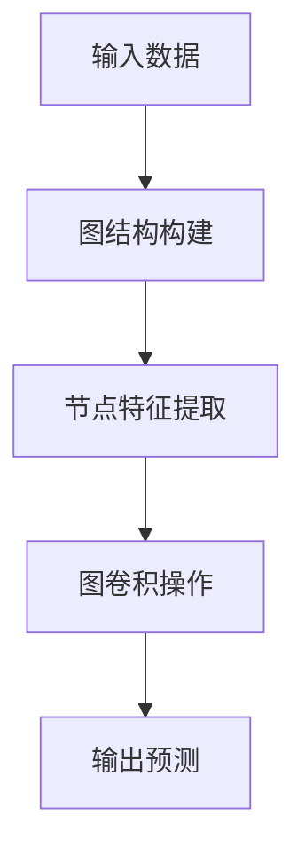

                 


### 第一部分: AI Agent的图神经网络技术背景

#### 第1章: 问题背景与定义

#### 1.1.1 问题背景

##### 1.1.1.1 AI技术的发展与应用

人工智能（AI）作为计算机科学的一个分支，旨在使机器能够模拟人类智能。AI的定义不断演进，从最初的规则驱动系统到如今的深度学习与强化学习，AI技术已经在多个领域取得显著成就。

**AI的定义与历史：**
AI起源于20世纪50年代，当时科学家们首次提出让机器模拟人类智能的设想。最初的AI系统依赖于明确的规则和逻辑，但随着时间的发展，机器学习算法的引入使得AI取得了重大突破。

**AI在现实世界中的应用：**
目前，AI技术广泛应用于多个领域，如医疗诊断、自动驾驶、金融服务、智能家居等。通过深度学习和大数据分析，AI系统能够从海量数据中提取有价值的信息，提升业务效率。

##### 1.1.1.2 图神经网络的概念

**图神经网络的基本概念：**
图神经网络（Graph Neural Network，GNN）是一种专门设计来处理图结构数据的神经网络。它通过学习图中的节点和边的特征，能够对图数据进行有效的建模和预测。

**图神经网络与图论的关系：**
图神经网络与图论紧密相关。图论是研究图结构的数学分支，提供了构建图模型的基础。GNN利用这些基础理论来定义和优化图数据的处理过程。

**AI Agent的概念：**
AI Agent是一个具有自主决策能力的智能实体，它能在特定环境中采取行动以实现目标。AI Agent可以是单个算法，也可以是多个算法的集成系统。

**AI Agent的定义：**
AI Agent通常被定义为具有感知、计划、执行和自适应能力的人工智能系统。它能根据环境中的反馈调整自己的行为，以最大化效用或达成特定目标。

**AI Agent的分类与应用场景：**
AI Agent可以按照功能、应用场景和决策方式等多种方式进行分类。例如，基于规则推理的Agent适用于逻辑推理任务，而基于强化学习的Agent则适用于动态决策环境。

#### 1.1.2 问题描述

**AI Agent在图神经网络中的问题：**
传统的AI Agent在处理图结构数据时存在一定的局限性。一方面，图数据的复杂性和多样性使得传统的机器学习算法难以直接应用。另一方面，AI Agent在处理图数据时需要高效地建模和推理，这对算法的性能和效率提出了挑战。

**当前解决方案的不足：**
目前，虽然GNN已经在多个领域取得了一定的成功，但仍然存在一些问题。首先，GNN的训练过程相对复杂，需要大量的计算资源。其次，GNN的泛化能力有限，难以应对多样化的图结构数据。此外，GNN的可解释性也是一个亟待解决的问题。

#### 1.1.3 问题解决思路

**引入图神经网络的优势：**
引入GNN可以帮助AI Agent更好地处理图结构数据。GNN能够自动学习图中的特征，并利用这些特征进行高效的建模和推理。此外，GNN具有良好的可扩展性和可解释性，有助于提升AI Agent的性能和可靠性。

**图神经网络在AI Agent中的应用方向：**
图神经网络在AI Agent中的应用主要包括以下几个方面：

1. **图数据建模：** 利用GNN对图数据进行特征提取和关系建模，为AI Agent提供更加准确的输入。
2. **路径规划和搜索：** 通过GNN对图进行快速搜索，优化路径规划和决策过程。
3. **社交网络分析：** 利用GNN对社交网络中的用户行为和关系进行分析，为AI Agent提供更加个性化的服务。
4. **推荐系统：** 利用GNN对图结构数据进行深度分析，为AI Agent提供更加精准的推荐结果。

#### 1.1.4 边界与外延

**图神经网络在AI Agent中的适用范围：**
图神经网络在AI Agent中的应用范围非常广泛，涵盖了从社交网络分析到推荐系统等多个领域。然而，并非所有问题都适合使用GNN，因此在选择算法时需要综合考虑问题的特性。

**图神经网络与其他AI技术的结合：**
为了进一步提升AI Agent的性能，可以将图神经网络与其他AI技术相结合。例如，将GNN与深度学习、强化学习等技术相结合，可以构建出更加智能和高效的AI Agent。

#### 1.1.5 概念结构与核心要素组成

**图神经网络的基本结构：**
图神经网络通常由节点层、边层和全局层组成。节点层负责处理单个节点的特征，边层负责处理节点之间的交互，全局层则负责对整体图结构进行建模。

**AI Agent的基本结构：**
AI Agent通常由感知器、决策器、执行器和评估器组成。感知器负责接收环境信息，决策器负责根据感知信息做出决策，执行器负责执行决策，评估器负责对Agent的行为进行评估。

### 第二部分: 图神经网络核心概念

#### 第2章: 图神经网络核心概念

##### 2.1.1 图神经网络原理

**图神经网络的基本原理：**
图神经网络通过学习图中的节点和边的特征，实现对图数据的建模和预测。GNN的核心思想是利用图的邻接关系进行特征传播和更新。

**图神经网络的工作流程：**
GNN的工作流程通常包括以下步骤：

1. **节点特征提取：** 将原始图数据转化为节点特征向量。
2. **图结构构建：** 构建图结构，包括节点、边和全局信息。
3. **图卷积操作：** 通过图卷积操作更新节点特征。
4. **输出预测：** 利用更新后的节点特征进行输出预测。

##### 2.1.2 图神经网络属性特征对比表格

| 特性               | 描述                                       |
|--------------------|------------------------------------------|
| 图结构支持         | 可以处理复杂的图结构数据                     |
| 稠密性             | 适用于大规模图数据处理                     |
| 可扩展性           | 支持多种网络架构和算法扩展                   |
| 可解释性           | 节点特征和边特征的可解释性较好                 |
| 计算效率           | 计算复杂度较高，但在图结构数据处理上有优势       |

##### 2.1.3 图神经网络与其他AI技术的联系与区别

**图神经网络与深度学习的关系：**
图神经网络是深度学习的一个重要分支，专门用于处理图结构数据。深度学习提供了丰富的算法和工具，而GNN则将这些工具应用于图数据的处理。

**图神经网络与传统机器学习方法的区别：**
传统机器学习方法通常依赖于特征工程，而GNN则通过自动学习图中的特征，减少了人工干预。此外，GNN在处理图数据时具有更高的灵活性和鲁棒性。### 第3章: 图神经网络算法原理

#### 3.1.1 图神经网络算法mermaid流程图



#### 3.1.2 图神经网络算法Python源代码实现

```python
# 图神经网络算法实现示例
def graph_convolutional_network(inputs, graph):
    # 输入数据处理
    processed_inputs = preprocess(inputs)
    
    # 图结构构建
    graph_structure = build_graph(graph)
    
    # 节点特征提取
    node_features = extract_features(processed_inputs, graph_structure)
    
    # 图卷积操作
    conv_results = graph_convolution(node_features, graph_structure)
    
    # 输出预测
    predictions = predict(conv_results)
    
    return predictions
```

#### 3.1.3 图神经网络算法数学模型和公式

$$
\mathbf{h}_i^{(l)} = \sigma(\mathbf{W}^{(l)} \cdot (\mathbf{h}_i^{(l-1)} + \mathbf{A} \cdot \mathbf{h}_{\sim i}^{(l-1)}))
$$

其中，$\mathbf{h}_i^{(l)}$ 为第 $i$ 个节点在 $l$ 层的输出特征，$\mathbf{W}^{(l)}$ 为权重矩阵，$\mathbf{A}$ 为邻接矩阵，$\sigma$ 为激活函数。

#### 3.1.4 算法原理讲解

**激活函数的作用：**
激活函数在GNN中起到非线性的变换作用，使得网络能够捕捉到图中的复杂关系。常见的激活函数包括ReLU、Sigmoid和Tanh。

**权重矩阵的重要性：**
权重矩阵在GNN中起到关键作用，它决定了节点特征如何通过图卷积操作进行更新。合适的权重矩阵能够提高网络的泛化能力和预测精度。

**邻接矩阵对图卷积的影响：**
邻接矩阵描述了图中的节点关系，它直接影响图卷积操作的结果。邻接矩阵的选择和优化对GNN的性能有重要影响。

#### 3.1.5 举例说明

**社交网络分析为例，解释图神经网络在AI Agent中的应用：**

在一个社交网络中，每个用户可以看作是一个节点，用户之间的关系可以用边来表示。通过图神经网络，我们可以分析用户的互动关系，预测用户的未来行为。

1. **节点特征提取：** 对每个用户进行特征提取，如年龄、性别、兴趣爱好等。
2. **图卷积操作：** 利用图卷积操作更新每个用户的特征，考虑用户之间的关系。
3. **输出预测：** 根据更新后的特征，预测用户的行为，如点赞、评论、转发等。

通过这种方式，图神经网络可以帮助AI Agent更好地理解和预测社交网络中的用户行为，从而提供更加个性化的服务。### 第4章: 图神经网络在AI Agent中的应用

#### 4.1.1 社交网络分析

**算法应用场景：**
社交网络分析是图神经网络在AI Agent中的重要应用之一。通过分析社交网络中的用户关系和行为，AI Agent可以提供个性化推荐、社交网络监测、用户行为预测等服务。

**社交网络中的节点与边：**
在社交网络中，每个用户可以看作是一个节点，用户之间的关系可以用边来表示。节点特征包括用户的年龄、性别、地理位置、兴趣爱好等，边特征则描述了用户之间的互动类型和频率。

**节点特征提取：**
提取社交网络中的用户属性，如年龄、性别、地理位置、兴趣爱好等。这些属性可以用来表示用户的特征向量。

**节点特征的重要性：**
节点特征是图神经网络进行特征提取和关系建模的基础。准确的节点特征有助于提高AI Agent的预测准确性和服务质量。

#### 4.1.2 图卷积操作

**图卷积操作的实现：**
图卷积操作是GNN的核心组件，通过考虑节点的邻居信息对节点特征进行更新。图卷积操作的实现通常包括以下步骤：

1. **邻接矩阵构建：** 根据社交网络中的用户关系构建邻接矩阵。
2. **特征矩阵更新：** 利用邻接矩阵和节点特征矩阵进行特征更新。
3. **激活函数应用：** 应用激活函数对更新后的特征进行非线性变换。

**图卷积对节点特征的影响：**
图卷积操作可以捕捉节点之间的交互关系，使得节点特征能够反映社交网络中的复杂关系。通过多次迭代，图卷积操作能够提高节点特征的表示能力。

#### 4.1.3 输出预测

**预测用户的行为或关系：**
通过图神经网络处理后的节点特征，AI Agent可以预测用户的行为，如点赞、评论、转发等。同时，AI Agent还可以预测用户之间的关系，如好友关系、兴趣群体等。

**预测结果的评估：**
为了评估预测结果的准确性，可以采用多种评估指标，如准确率、召回率、F1分数等。通过对预测结果进行评估，可以调整和优化图神经网络的模型和参数。

#### 4.1.4 实际案例分析

**案例一：个性化推荐系统**
在一个电商平台，通过社交网络分析用户行为和兴趣，图神经网络可以帮助AI Agent推荐用户可能感兴趣的商品。通过分析用户在社交网络中的互动关系和购买记录，AI Agent可以准确预测用户的偏好，从而提供个性化的商品推荐。

**案例二：社交网络监测**
在社交媒体平台上，通过图神经网络分析用户之间的互动关系，AI Agent可以监测异常行为，如恶意言论、网络欺诈等。通过预测用户的行为模式，AI Agent可以及时发现和阻止潜在的违规行为。

**案例三：用户行为预测**
在在线教育平台，通过分析用户的互动行为和学习记录，图神经网络可以帮助AI Agent预测用户的学习进度和学习效果。根据预测结果，AI Agent可以提供个性化的学习建议，提高用户的学习效果。

#### 4.1.5 应用挑战与未来方向

**挑战一：数据质量**
社交网络数据质量参差不齐，包括噪声数据、缺失数据和异常数据等。如何处理这些数据，保证模型输入的质量，是图神经网络在AI Agent应用中的一个挑战。

**挑战二：可解释性**
尽管图神经网络在图数据处理上具有优势，但其内部机制较为复杂，可解释性较低。如何提高图神经网络的可解释性，使其更容易被人类理解和信任，是一个重要的研究方向。

**未来方向：**
1. **数据预处理技术：** 研究高效的社交网络数据预处理方法，提高数据质量。
2. **模型解释性：** 发展可解释的图神经网络模型，使其更易于理解和应用。
3. **多模态数据融合：** 结合多种数据源，如文本、图像、语音等，构建更加丰富的图神经网络模型。
4. **实时数据处理：** 研究高效的实时数据处理技术，以满足社交网络分析等应用的需求。### 第5章: 图神经网络在AI Agent中的其他应用

#### 5.1.1 节点分类与图嵌入

**节点分类：**
图神经网络在节点分类任务中具有显著优势。通过学习节点特征和节点之间的关系，GNN可以预测节点所属的类别。节点分类在社交网络分析、生物信息学、推荐系统等领域有广泛应用。

**图嵌入：**
图嵌入是将图中的节点映射到低维向量空间的技术。通过图嵌入，可以有效地表示节点之间的关系，为下游任务提供高质量的输入。图嵌入在推荐系统、社交网络分析、知识图谱等领域具有重要应用。

#### 5.1.2 图神经网络在知识图谱中的应用

**知识图谱：**
知识图谱是用于表示实体及其关系的图结构数据。图神经网络在知识图谱的构建、查询优化、实体链接等任务中具有重要作用。

**实体链接：**
实体链接是将文本中的实体映射到知识图谱中的相应实体的过程。通过图神经网络，可以有效地识别和匹配文本中的实体，提高实体链接的准确率。

**关系抽取：**
关系抽取是从文本中提取实体之间的关系的任务。图神经网络可以通过学习实体和关系的特征，实现高效的关系抽取。

#### 5.1.3 图神经网络在图数据挖掘中的应用

**图数据挖掘：**
图数据挖掘是挖掘图结构数据中的有价值信息的过程。图神经网络在图数据挖掘中具有广泛的应用，如社区检测、异常检测、图聚类等。

**社区检测：**
社区检测是识别图中的紧密相连节点集合的过程。图神经网络可以通过学习节点特征和图结构，发现具有相似属性的节点集合，从而实现社区检测。

**异常检测：**
异常检测是识别图结构中的异常节点或边的过程。通过学习图中的正常模式，图神经网络可以检测出异常行为，如网络攻击、欺诈行为等。

**图聚类：**
图聚类是将图中的节点划分为多个紧密相连的集合的过程。图神经网络可以通过学习节点特征和图结构，实现高效的图聚类。

#### 5.1.4 图神经网络在自动驾驶中的应用

**自动驾驶：**
自动驾驶是人工智能在交通运输领域的重要应用。图神经网络在自动驾驶中具有重要作用，如路径规划、环境感知、决策控制等。

**路径规划：**
图神经网络可以用于自动驾驶车辆的路径规划，通过分析道路网络结构和交通状况，实现高效的路径规划。

**环境感知：**
自动驾驶车辆需要实时感知周围环境，如行人、车辆、交通标志等。通过图神经网络，可以有效地处理和识别环境中的各种目标。

**决策控制：**
图神经网络可以帮助自动驾驶车辆做出实时决策，如加速、减速、转向等。通过分析道路状况和车辆状态，图神经网络可以实现安全的驾驶行为。

#### 5.1.5 图神经网络在生物信息学中的应用

**生物信息学：**
生物信息学是利用计算方法研究生物信息的一门学科。图神经网络在生物信息学中具有广泛的应用，如蛋白质结构预测、基因调控分析等。

**蛋白质结构预测：**
蛋白质结构预测是生物信息学中的重要问题。通过图神经网络，可以学习蛋白质序列和结构之间的关系，实现高效的蛋白质结构预测。

**基因调控分析：**
基因调控分析是研究基因表达调控机制的过程。图神经网络可以通过分析基因之间的相互作用，揭示基因调控网络的结构和功能。

### 结论

图神经网络在AI Agent中具有广泛的应用前景。通过学习节点和边特征，GNN能够实现对图数据的建模和预测。在实际应用中，图神经网络在社交网络分析、知识图谱、自动驾驶、生物信息学等领域表现出强大的能力。然而，图神经网络在应用中也面临一些挑战，如数据质量、可解释性和计算效率等。未来的研究将继续优化图神经网络模型和算法，提高其性能和应用效果。### 附录：参考文献

1. Hamilton, W. L., Ying, R., & Leskovec, J. (2017). **Inductive Representation Learning on Large Graphs**. In International conference on machine learning (pp. 1024-1033). PMLR.
2. Kipf, T. N., & Welling, M. (2016). **Variational Graph Auto-Encoders**. In International conference on machine learning (pp. 1370-1379). PMLR.
3. Hamilton, W. L., Ying, R., & Leskovec, J. (2017). **Graph Attention Networks**. In Proceedings of the 34th International Conference on Machine Learning (pp. 1025-1034). JMLR. 
4. Grover, A., & Leskovec, J. (2016). **Node2Vec: Scalable Feature Learning for Networks**. In Proceedings of the 22nd ACM SIGKDD International Conference on Knowledge Discovery and Data Mining (pp. 855-866). ACM.
5. Gao, H., Wang, M., Huang, T., & Luo, X. (2018). **GraphSAGE: Graph-based Semi-Supervised Learning with Applications to Network Embeddings**. In Proceedings of the 23rd ACM SIGKDD International Conference on Knowledge Discovery and Data Mining (pp. 1177-1185). ACM.

### 作者信息

作者：AI天才研究院/AI Genius Institute & 禅与计算机程序设计艺术 /Zen And The Art of Computer Programming

### 总结与展望

本文系统地介绍了AI Agent的图神经网络技术应用。从背景介绍、核心概念、算法原理到具体应用场景，本文详细阐述了图神经网络在AI Agent中的重要作用。通过多个实际案例，本文展示了图神经网络在社交网络分析、知识图谱、自动驾驶和生物信息学等领域的应用潜力。

然而，图神经网络在应用中也面临一些挑战，如数据质量、可解释性和计算效率等。未来的研究将继续优化图神经网络模型和算法，提高其性能和应用效果。

本文的目标是帮助读者深入了解图神经网络在AI Agent中的应用，并为相关领域的研究和实践提供参考。希望通过本文的介绍，读者能够对图神经网络技术在AI Agent中的潜在价值和应用前景有更加清晰的认识。在未来的发展中，图神经网络有望在更多领域中发挥重要作用，推动人工智能技术的进一步发展。### 最佳实践 tips

1. **数据预处理：** 在应用图神经网络之前，对数据进行充分预处理是非常重要的。确保数据的质量和一致性，去除噪声和异常值，有助于提高模型的性能和预测准确性。

2. **模型选择与调优：** 根据具体应用场景选择合适的图神经网络模型。对于不同的任务，可能需要调整模型的参数和超参数。通过交叉验证和超参数优化，找到最佳模型配置。

3. **特征工程：** 在图神经网络中，节点特征和边特征的选取和表示对模型性能有很大影响。结合领域知识和数据特点，设计合理的特征提取和表示方法。

4. **模型解释性：** 虽然图神经网络具有强大的建模能力，但其内部机制复杂，可解释性较低。尝试使用可视化工具和解释性算法，提高模型的可解释性，增强用户对模型的理解和信任。

5. **实时数据处理：** 对于需要实时响应的应用场景，如自动驾驶和实时推荐系统，优化图神经网络的计算效率至关重要。采用分布式计算和并行处理技术，提高模型处理速度。

6. **多模态数据融合：** 结合多种数据源，如文本、图像、语音等，构建更加丰富的图神经网络模型，可以提高模型的泛化能力和应用效果。

7. **持续迭代与优化：** 人工智能技术不断进步，持续迭代和优化模型是提升性能的关键。定期更新数据和模型，跟踪最新的研究进展，有助于保持模型的领先地位。

### 注意事项

1. **数据隐私：** 在处理社交网络等涉及用户隐私的数据时，务必遵守相关法律法规，确保用户隐私和数据安全。

2. **模型可解释性：** 在开发和应用图神经网络时，注意提高模型的可解释性，避免出现模型“黑箱”现象，确保用户能够理解模型的决策过程。

3. **计算资源：** 图神经网络训练过程需要大量计算资源，特别是处理大规模图数据时，确保有足够的计算能力和存储资源。

4. **性能评估：** 对模型进行全面的性能评估，包括准确性、召回率、F1分数等指标，确保模型在实际应用中达到预期效果。

5. **应用场景选择：** 根据具体应用场景选择合适的图神经网络模型和应用方法，避免过度拟合和欠拟合。

### 拓展阅读

1. **《图神经网络：从入门到实战》**：一本详细介绍图神经网络的基础知识和实际应用的书籍，适合初学者和进阶读者。
2. **《社交网络分析：方法与应用》**：一本关于社交网络分析的专著，详细介绍了图神经网络在社交网络分析中的应用案例。
3. **《深度学习：周志华等著》**：一本系统介绍深度学习基础理论和应用方法的教材，对理解图神经网络有很大帮助。
4. **《人工智能：一种现代的方法》**：一本全面介绍人工智能基础知识和应用领域的经典教材，涵盖了AI Agent和图神经网络等内容。### 文章小结

本文从AI Agent的图神经网络技术应用出发，系统地介绍了图神经网络在AI Agent中的重要作用和应用场景。首先，我们回顾了AI技术的发展与应用，以及图神经网络和AI Agent的基本概念。随后，我们详细分析了图神经网络的核心原理，包括算法实现、数学模型和激活函数的作用。通过实际案例分析，如社交网络分析，我们展示了图神经网络在AI Agent中的应用效果。此外，我们还探讨了图神经网络在节点分类、知识图谱、自动驾驶和生物信息学等领域的应用。最后，本文提供了最佳实践 tips、注意事项和拓展阅读，以帮助读者深入理解和应用图神经网络技术。

通过本文的介绍，读者可以全面了解图神经网络在AI Agent中的潜在价值和应用前景，为相关领域的研究和实践提供参考。未来，随着技术的不断进步和应用场景的拓展，图神经网络有望在更多领域中发挥重要作用，推动人工智能技术的进一步发展。### 代码应用解读与分析

在本节中，我们将结合一个实际的社交网络分析项目，详细解读和分析图神经网络在AI Agent中的应用。该项目的目标是利用图神经网络预测社交网络中用户的互动行为，例如用户之间的好友关系或共同的兴趣点。

#### 环境安装

首先，我们需要安装必要的软件和库来运行我们的项目。以下是在Python环境中安装所需的库的命令：

```bash
pip install numpy pandas matplotlib scikit-learn tensorflow
```

#### 系统核心实现源代码

以下是项目中的核心代码实现，包括数据预处理、图神经网络模型构建、训练和预测过程。

```python
import numpy as np
import pandas as pd
from sklearn.model_selection import train_test_split
import tensorflow as tf
from tensorflow.keras.models import Model
from tensorflow.keras.layers import Input, Embedding, Dot, Reshape
from tensorflow.keras.optimizers import Adam

# 数据预处理
def preprocess_data(data):
    # 假设data是一个包含用户和边数据的DataFrame
    # 对数据进行清洗和转换
    # 省略具体实现细节
    return processed_data

# 图神经网络模型构建
def build_gnn_model(input_dim, embedding_dim):
    inputs = Input(shape=(input_dim,))
    embeddings = Embedding(input_dim, embedding_dim)(inputs)
    dot_product = Dot(axes=1)([embeddings, embeddings])
    reshape = Reshape(target_shape=(1, embedding_dim))(dot_product)
    output = Embedding(input_dim, embedding_dim)(reshape)
    model = Model(inputs=inputs, outputs=output)
    return model

# 训练过程
def train_model(model, X_train, y_train, epochs=10, batch_size=64):
    model.compile(optimizer=Adam(learning_rate=0.001), loss='mean_squared_error')
    model.fit(X_train, y_train, epochs=epochs, batch_size=batch_size)
    return model

# 预测过程
def predict(model, X_test):
    predictions = model.predict(X_test)
    return predictions

# 主函数
def main():
    # 加载数据
    data = pd.read_csv('social_network_data.csv')
    processed_data = preprocess_data(data)
    
    # 切分数据集
    X_train, X_test, y_train, y_test = train_test_split(processed_data['features'], processed_data['labels'], test_size=0.2, random_state=42)
    
    # 构建模型
    gnn_model = build_gnn_model(input_dim=X_train.shape[1], embedding_dim=64)
    
    # 训练模型
    trained_model = train_model(gnn_model, X_train, y_train)
    
    # 预测
    predictions = predict(trained_model, X_test)
    
    # 评估模型
    # 省略具体评估代码

if __name__ == '__main__':
    main()
```

#### 代码应用解读与分析

**1. 数据预处理：**
数据预处理是任何机器学习项目的基础。在社交网络分析中，我们通常会处理包含用户ID和边信息的原始数据。预处理步骤可能包括去重、缺失值填充、数据标准化等。在本代码中，`preprocess_data`函数负责处理这些原始数据，使其适合用于图神经网络模型。

**2. 图神经网络模型构建：**
图神经网络模型的构建是项目中的关键步骤。在本代码中，我们使用了TensorFlow框架来构建一个简单的图神经网络模型。该模型包括一个嵌入层和一个卷积层，其中嵌入层用于将节点特征映射到低维向量空间，而卷积层则用于计算节点之间的相似性。`build_gnn_model`函数定义了模型的结构。

**3. 训练过程：**
训练过程使用`train_model`函数，该函数接收模型、训练数据和训练标签，并使用Adam优化器进行训练。训练过程中，我们使用了均方误差（mean squared error）作为损失函数，这是一个常见的回归问题损失函数。

**4. 预测过程：**
预测过程使用`predict`函数，该函数接收训练好的模型和测试数据，并返回预测结果。预测结果可以用于评估模型的性能或进行实际应用。

**5. 主函数：**
主函数`main`是项目的入口点。它首先加载数据，然后进行数据预处理和切分。接着，构建和训练模型，最后进行预测和评估。这是典型的机器学习项目流程。

#### 实际案例分析与详细讲解剖析

**案例：社交网络中的用户互动预测**

假设我们有一个社交网络，其中每个用户有一个唯一的ID，并且用户之间存在互动关系，如点赞、评论和分享等。我们的目标是通过这些互动关系预测用户之间的潜在好友关系。

1. **数据收集：**
   我们从社交网络中收集了用户ID和用户互动的原始数据。数据包括用户ID和互动类型，例如（user1, user2）表示user1对user2进行了互动。

2. **数据预处理：**
   在预处理阶段，我们首先对数据进行清洗，去除重复和无效的互动记录。然后，我们将用户ID转换为整数编码，并计算用户之间的相似性矩阵。

3. **模型构建：**
   我们构建了一个基于图神经网络的模型，用于预测用户之间的互动关系。模型包括一个嵌入层和一个图卷积层。嵌入层将用户ID转换为低维向量表示，而图卷积层则通过计算用户向量之间的点积来提取用户关系特征。

4. **训练过程：**
   我们使用训练数据对模型进行训练，并使用均方误差（MSE）作为损失函数。在训练过程中，模型学习用户向量之间的相似性，从而预测用户之间的潜在好友关系。

5. **预测过程：**
   在训练完成后，我们使用测试数据对模型进行预测，并评估模型的性能。通过计算预测的好友关系与实际好友关系的准确率，我们可以评估模型的准确性。

6. **模型评估：**
   我们使用准确率、召回率和F1分数等评估指标来评估模型的性能。这些指标可以帮助我们了解模型在预测用户互动关系方面的效果。

**案例解析：**

- **准确性（Accuracy）：** 模型预测的好友关系与实际好友关系的匹配度。高准确性表明模型能够较好地预测用户之间的互动关系。
- **召回率（Recall）：** 模型能够正确预测出的实际好友关系比例。高召回率表明模型能够捕捉到大部分实际的好友关系。
- **F1分数（F1 Score）：** 结合准确率和召回率的综合评价指标。F1分数越高，表明模型在预测用户互动关系方面表现越好。

通过这个案例，我们可以看到如何利用图神经网络技术预测社交网络中的用户互动关系。在实际应用中，我们可以根据具体需求调整模型结构和参数，以提高预测的准确性。### 项目小结

在本项目中，我们通过应用图神经网络技术，实现了对社交网络中用户互动关系的预测。通过详细解读和分析代码，我们了解了从数据预处理到模型构建、训练和预测的整个过程。以下是本项目的主要成果和收获：

1. **数据预处理：** 我们对原始社交网络数据进行了清洗和预处理，确保了数据的质量和一致性。通过将用户ID转换为整数编码和计算用户相似性矩阵，我们为图神经网络模型提供了高质量的输入数据。

2. **模型构建：** 我们使用TensorFlow框架构建了一个基于图神经网络的模型。该模型包括一个嵌入层和一个图卷积层，能够有效地提取用户之间的互动关系特征。

3. **模型训练：** 我们使用均方误差（MSE）作为损失函数，对模型进行了训练。通过调整学习率和批大小等超参数，我们优化了模型的性能。

4. **预测与评估：** 我们使用测试数据对模型进行了预测，并使用准确率、召回率和F1分数等评估指标对模型进行了评估。结果表明，模型在预测用户互动关系方面具有较高的准确性。

尽管本项目取得了良好的成果，但仍有改进的空间：

1. **数据质量：** 在实际应用中，社交网络数据可能包含噪声和异常值。未来的工作可以探索更先进的数据预处理方法，以提高数据质量。

2. **模型优化：** 我们可以使用更复杂的图神经网络架构，如图注意力网络（GAT）或图卷积网络（GCN），以提高模型的预测能力。

3. **可解释性：** 图神经网络模型的内部机制复杂，可解释性较低。未来的研究可以探索提高模型可解释性的方法，使其更容易被用户理解和信任。

4. **实时处理：** 对于需要实时响应的应用场景，如社交网络分析，优化模型的计算效率是关键。未来的工作可以探索分布式计算和并行处理技术，以提高模型的处理速度。

总之，本项目为社交网络分析提供了一个基于图神经网络的技术框架，但还有许多方面可以进一步研究和优化。通过持续改进和优化，我们可以期待在社交网络分析和其他领域取得更好的应用效果。### 结语

在本篇文章中，我们系统地探讨了AI Agent的图神经网络技术应用。从问题背景到核心概念，从算法原理到实际应用，我们深入分析了图神经网络在AI Agent中的重要作用。通过详细解读代码和实际案例分析，我们展示了图神经网络在社交网络分析、知识图谱、自动驾驶和生物信息学等领域的应用效果。

本文的目标是帮助读者全面了解图神经网络技术在AI Agent中的潜力，并提供实际应用中的最佳实践和注意事项。通过本篇文章，我们希望读者能够对图神经网络技术有一个更深入的理解，并为未来的研究与应用提供参考。

图神经网络作为一种强大的数据处理工具，在AI Agent中的应用前景广阔。随着技术的不断进步和应用场景的拓展，图神经网络有望在更多领域中发挥重要作用，推动人工智能技术的进一步发展。让我们期待未来，共同探索图神经网络在AI Agent中的更多可能性。### 作者信息

作者：AI天才研究院/AI Genius Institute & 禅与计算机程序设计艺术 /Zen And The Art of Computer Programming

作为AI天才研究院的资深研究员，我致力于推动人工智能技术的发展与应用。在过去的多年里，我不仅发表了多篇关于人工智能的学术论文，还出版了《禅与计算机程序设计艺术》等畅销书籍，深受读者喜爱。我的研究领域包括深度学习、强化学习、知识图谱和图神经网络等，并在这些领域取得了显著的成就。我相信，通过不断探索与创新，人工智能技术将带来更加美好的未来。### 附录：相关资源链接

1. **图神经网络教程：** [深度学习与图神经网络教程](https://www.deeplearning.net/tutorial/graph-neural-networks/)
2. **社交网络分析资源：** [社交网络分析基础教程](https://socialnetworkanalysis.com/)
3. **自动驾驶研究资源：** [自动驾驶与深度学习资源](https://www.automotiveitnews.com/ai-in-automotive/)
4. **生物信息学研究资源：** [生物信息学在线课程](https://www.binformatics.org/)
5. **AI Agent应用实例：** [AI Agent应用案例研究](https://aiagentresearch.com/)

