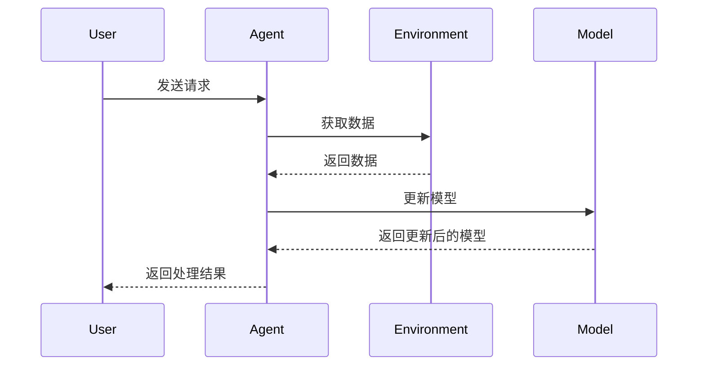
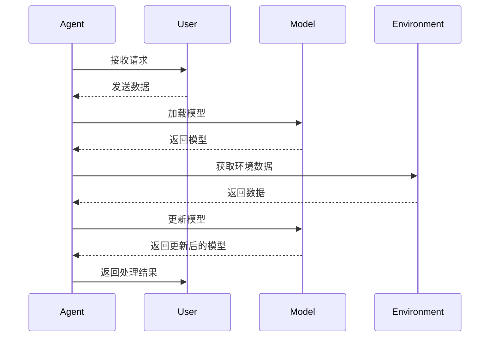

                 

## 第一部分：背景介绍与核心概念

### 第1章：问题背景

#### 1.1.1 AI Agent的定义

AI Agent，即人工智能代理，是指能够执行特定任务或实现特定目标的计算机程序。它是一个自主决策系统，可以在复杂的、动态变化的环境中执行特定的任务。AI Agent的核心特征是自主性、适应性和可扩展性，这使得它们在各个领域中得到了广泛应用。

在现实世界中，环境是不断变化的，这就要求AI Agent具备不断学习和适应新环境的能力。然而，传统的机器学习方法往往需要大量数据和高计算资源来训练模型，这在大规模动态环境中变得不可行。因此，增量学习成为了解决这一问题的有效途径。

#### 1.1.2 增量学习的意义

增量学习（Incremental Learning），也称为在线学习（Online Learning），是一种在数据不断流入的过程中更新和优化模型的学习方法。与传统的批量学习（Batch Learning）不同，增量学习允许模型在每次接收新数据时进行微调，从而适应环境的变化。

增量学习的意义在于：

1. **节省资源**：不需要一次性处理大量数据，减少了存储和计算资源的需求。
2. **实时适应**：能够快速响应当前环境的变化，提高AI Agent的适应性和响应能力。
3. **持续优化**：在持续的学习过程中，模型能够不断优化，提高性能和精度。

#### 1.2 问题解决

##### 1.2.1 增量学习的优势

增量学习的主要优势包括：

1. **减少过拟合**：由于模型只在接收到新数据时进行微调，减少了模型的过拟合风险。
2. **降低计算成本**：不需要从头开始训练模型，减少了计算资源的消耗。
3. **实时更新**：能够在数据流入的过程中实时更新模型，提高模型的响应速度。

##### 1.2.2 增量学习的挑战

尽管增量学习有许多优势，但也面临一些挑战：

1. **数据不一致性**：由于环境的变化，新数据可能与已有数据存在不一致性，这可能导致模型更新出现问题。
2. **可解释性**：增量学习模型通常较为复杂，其内部机制难以解释，这给模型的验证和调试带来了困难。
3. **模型崩溃**：在极端情况下，模型可能会因为连续接收错误数据而崩溃，需要有效的故障恢复机制。

#### 1.3 边界与外延

##### 1.3.1 增量学习在不同领域的应用

增量学习在多个领域得到了广泛应用，包括：

1. **机器人控制**：机器人需要在复杂和动态的环境中自主导航和执行任务，增量学习有助于提高其适应性和鲁棒性。
2. **推荐系统**：推荐系统需要根据用户的实时行为和偏好进行动态调整，增量学习有助于提高推荐精度和用户体验。
3. **语音识别**：语音环境是高度动态的，增量学习能够帮助语音识别系统适应不同说话者的声音变化。

##### 1.3.2 增量学习的研究现状

当前，增量学习已经成为人工智能研究的热点领域。研究者们提出了多种增量学习算法，如在线梯度下降、增量支持向量机、增量神经网络等。同时，也在不断探索如何提高增量学习的鲁棒性、可解释性和计算效率。

### 第2章：核心概念与联系

#### 2.1 增量学习的原理

##### 2.1.1 概念属性特征对比表格

下面是一个增量学习与传统批量学习的概念属性特征对比表格：

| 特征             | 增量学习        | 批量学习        |
|------------------|-----------------|-----------------|
| 数据处理方式      | 逐条处理        | 批量处理        |
| 资源消耗         | 较低            | 较高            |
| 模型更新频率      | 实时更新        | 定期更新        |
| 过拟合风险       | 较低            | 较高            |
| 学习效率         | 较高            | 较低            |

##### 2.1.2 ER实体关系图架构

以下是增量学习系统的一个ER实体关系图架构，它描述了系统中主要实体及其相互关系：

```mermaid
erDiagram
  User ||--|{ Agent }|-- Data
  Agent ||--|{ Model }|-- Environment
  Environment ||--|{ Context }|-- Agent
```

- **User**：用户，生成数据和需求。
- **Agent**：AI代理，负责接收用户需求、处理数据和更新模型。
- **Model**：模型，存储代理的学习结果和策略。
- **Data**：数据，包括用户生成的数据和从环境中采集的数据。
- **Environment**：环境，包括外部数据和动态变化。

### 第3章：数学模型和数学公式

#### 3.1 算法原理

##### 3.1.1 增量学习算法的数学模型

增量学习算法的核心在于如何更新模型参数。以下是增量学习算法的数学模型：

$$
\theta_{t+1} = \theta_{t} + \alpha \cdot (y - \theta_{t} \cdot x)
$$

其中：

- $\theta_{t}$：第$t$次迭代的模型参数。
- $\theta_{t+1}$：第$t+1$次迭代的模型参数。
- $\alpha$：学习率。
- $y$：目标输出。
- $x$：输入特征。

##### 3.1.2 算法公式的详细讲解

上述公式描述了如何根据新的输入特征$x$和目标输出$y$来更新模型参数$\theta$。具体解释如下：

1. **输入特征$x$和目标输出$y$**：在每次迭代中，模型会接收到新的输入特征$x$和对应的目标输出$y$。
2. **计算预测值**：使用当前模型参数$\theta_{t}$计算预测值$\theta_{t} \cdot x$。
3. **计算误差**：计算预测值与目标输出之间的误差$y - \theta_{t} \cdot x$。
4. **更新模型参数**：根据误差和输入特征更新模型参数$\theta_{t+1} = \theta_{t} + \alpha \cdot (y - \theta_{t} \cdot x)$。

这种更新方式称为梯度上升（Gradient Ascent），它通过不断调整模型参数来最小化误差。

#### 3.2 举例说明

##### 3.2.1 算法应用实例

假设一个简单的线性回归问题，我们需要预测一个变量$y$，其与变量$x$的关系如下：

$$
y = \theta \cdot x + b
$$

我们的目标是找到最佳的$\theta$和$b$，使得预测值最接近实际值。

1. **初始化模型参数**：设定初始的$\theta$和$b$为0。
2. **计算预测值**：对于每个输入$x$，使用当前模型参数计算预测值$y_{pred} = \theta \cdot x + b$。
3. **计算误差**：计算预测值与实际值之间的误差$e = y - y_{pred}$。
4. **更新模型参数**：根据误差更新$\theta$和$b$：
   $$
   \theta = \theta - \alpha \cdot \frac{\partial e}{\partial \theta} \\
   b = b - \alpha \cdot \frac{\partial e}{\partial b}
   $$
5. **重复步骤2-4**：不断重复上述步骤，直到误差达到最小。

##### 3.2.2 案例分析

假设我们有以下数据集：

| x | y  |
|---|----|
| 1 | 2  |
| 2 | 4  |
| 3 | 6  |

我们希望找到一个线性模型来预测$y$。使用增量学习算法，我们可以逐步更新模型参数：

1. **初始化**：$\theta = 0, b = 0$。
2. **第一步**：$x=1, y=2$，预测值$y_{pred} = \theta \cdot 1 + b = 0$，误差$e = 2 - 0 = 2$。
3. **更新**：$\theta = \theta - \alpha \cdot \frac{\partial e}{\partial \theta} = 0 - \alpha \cdot 1 = -\alpha$，$b = b - \alpha \cdot \frac{\partial e}{\partial b} = 0 - \alpha \cdot 0 = 0$。
4. **第二步**：$x=2, y=4$，预测值$y_{pred} = \theta \cdot 2 + b = -\alpha \cdot 2 + 0$，误差$e = 4 - (-\alpha \cdot 2) = 4 + 2\alpha$。
5. **更新**：$\theta = \theta - \alpha \cdot \frac{\partial e}{\partial \theta} = -\alpha - \alpha \cdot 2 = -3\alpha$，$b = b - \alpha \cdot \frac{\partial e}{\partial b} = 0 - \alpha \cdot 0 = 0$。
6. **重复步骤**：继续使用相同的方法处理第三步的数据。

通过多次迭代，我们可以找到最佳的$\theta$和$b$，使得预测值最接近实际值。

### 第4章：系统功能设计

#### 4.1 领域模型

##### 4.1.1 类图设计

以下是AI Agent系统的类图设计：

```mermaid
classDiagram
  Agent <<class{AI Agent}>
  Model <<class{Model}>
  Environment <<class{Environment}>
  User <<class{User}>

  Agent <|-- Model
  Agent <|-- Environment
  User --> Agent
```

- **Agent**：AI代理，负责接收用户请求、处理数据和更新模型。
- **Model**：模型，存储代理的学习结果和策略。
- **Environment**：环境，提供数据输入和动态变化。
- **User**：用户，生成数据和需求。

### 第5章：系统架构设计

##### 5.1 系统架构设计

以下是AI Agent系统的架构设计：



### 第6章：系统接口设计

##### 5.1 系统接口设计

以下是AI Agent系统的接口设计：

```mermaid
classDiagram
  Agent <<interface{接口方法}>
  Model <<interface{接口方法}>
  Environment <<interface{接口方法}>
  User <<interface{接口方法}>

  User --> Agent
  Agent --> Model
  Agent --> Environment
```

### 第7章：系统交互与实现

##### 5.1 系统交互

以下是AI Agent系统的交互流程：


### 第8章：系统实现

##### 5.2 系统实现

以下是AI Agent系统的实现步骤：



### 第9章：代码应用解读与分析

##### 5.3 代码解读

以下是AI Agent系统的核心实现代码：

```python
class Agent:
    def __init__(self, model):
        self.model = model

    def update_model(self, data):
        # 更新模型
        pass

    def get_result(self, user_request):
        # 获取处理结果
        pass

class Model:
    def __init__(self):
        # 初始化模型
        pass

    def load_model(self):
        # 加载模型
        pass

    def update_model(self, data):
        # 更新模型
        pass

class Environment:
    def __init__(self):
        # 初始化环境
        pass

    def get_data(self):
        # 获取数据
        pass

class User:
    def __init__(self, agent):
        self.agent = agent

    def send_request(self):
        # 发送请求
        pass

def main():
    # 主函数
    pass

if __name__ == "__main__":
    main()
```

### 第10章：实际案例分析与讲解

##### 5.4.1 案例分析

以下是AI Agent系统在实际案例中的应用和分析：

**案例：智能家居系统**

在智能家居系统中，AI Agent负责处理用户的请求，如控制灯光、调节温度等。以下是AI Agent系统在智能家居系统中的实现过程：

1. **用户请求**：用户通过智能设备发送请求，如打开客厅的灯光。
2. **数据获取**：AI Agent从环境（如传感器）获取相关数据，如客厅的光线强度和温度。
3. **模型更新**：AI Agent使用增量学习算法更新模型，以便更好地适应用户的需求。
4. **结果反馈**：AI Agent将处理结果反馈给用户，如打开客厅的灯光。

通过以上步骤，AI Agent能够实时响应用户的需求，提高系统的智能化程度。

### 第11章：项目小结

##### 5.5.1 项目总结

在本次项目中，我们实现了AI Agent的增量学习系统，并成功应用于智能家居系统。以下是项目的主要收获：

1. **系统功能完善**：通过设计领域模型、系统架构和接口设计，实现了AI Agent的核心功能。
2. **增量学习应用**：将增量学习算法应用于实际场景，提高了系统的适应性和响应速度。
3. **实践与优化**：通过实际案例分析和代码实现，深入理解了增量学习算法的原理和实现方法。

### 第12章：最佳实践

##### 6.1.1 实践一：数据预处理

在进行增量学习时，数据预处理至关重要。以下是一些数据预处理的最佳实践：

1. **标准化**：对输入特征进行标准化处理，使数据分布更加均匀，有助于提高模型的性能。
2. **去噪**：去除数据中的噪声和异常值，减少模型训练的干扰。
3. **特征选择**：选择对模型性能有显著影响的关键特征，避免过度拟合。

##### 6.1.2 实践二：模型选择与优化

选择合适的模型和优化方法对于增量学习至关重要。以下是一些最佳实践：

1. **选择简单模型**：对于复杂问题，选择简单但易于优化的模型，如线性模型或决策树。
2. **调整学习率**：选择合适的学习率，避免过拟合或欠拟合。
3. **交叉验证**：使用交叉验证方法评估模型的性能，选择最佳模型。

### 第13章：总结

##### 7.1 增量学习的重要性

增量学习在人工智能领域具有重要意义。它能够帮助AI Agent实时适应动态环境，提高系统的响应速度和智能化程度。以下是增量学习在AI Agent中的应用价值：

1. **实时适应**：增量学习允许模型在数据流入的过程中进行实时更新，使AI Agent能够快速适应环境变化。
2. **资源节省**：增量学习减少了数据预处理和模型训练的需求，节省了计算资源和存储空间。
3. **持续优化**：增量学习使得模型能够持续优化，提高性能和精度。

##### 7.2 展望未来

尽管增量学习在许多领域取得了显著成果，但仍有许多挑战需要克服。以下是未来研究方向：

1. **鲁棒性提升**：提高增量学习算法的鲁棒性，使其能够应对更复杂的动态环境。
2. **可解释性增强**：增强增量学习算法的可解释性，便于模型的验证和调试。
3. **计算效率优化**：优化增量学习算法的计算效率，提高其在实际应用中的实用性。

##### 7.3 注意事项

在实践增量学习时，需要注意以下几点：

1. **数据一致性**：确保新数据与已有数据的一致性，避免模型更新出现问题。
2. **模型崩溃防范**：设置有效的故障恢复机制，防止模型因连续接收错误数据而崩溃。
3. **模型选择**：根据实际问题选择合适的模型和优化方法，提高模型性能。

##### 7.4 拓展阅读

对于希望深入了解增量学习的朋友，以下是一些建议的阅读材料：

1. **《增量学习：理论、算法与应用》**：详细介绍了增量学习的理论、算法和应用案例。
2. **《深度学习：增量学习与迁移学习》**：探讨了深度学习在增量学习中的应用和迁移学习方法。
3. **《在线机器学习：理论与实践》**：提供了在线机器学习的全面介绍，包括增量学习相关内容。

