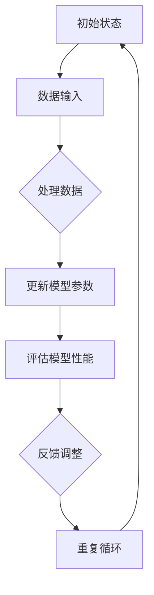
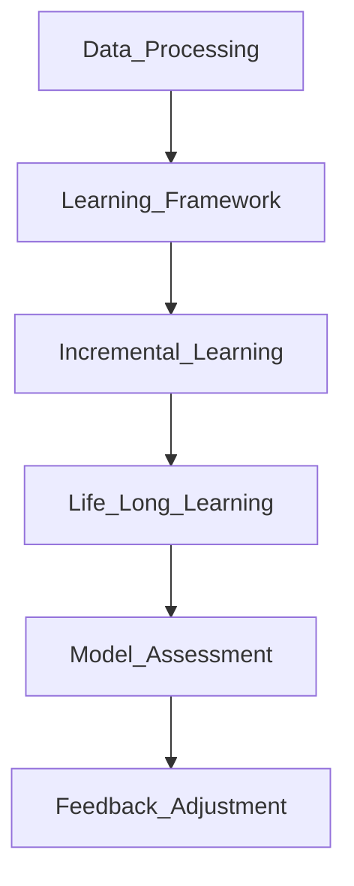
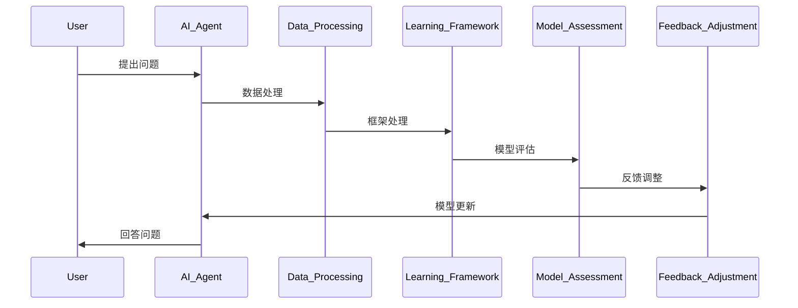
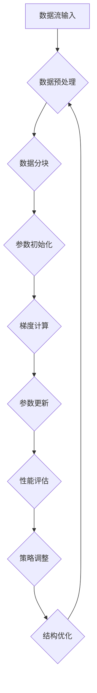
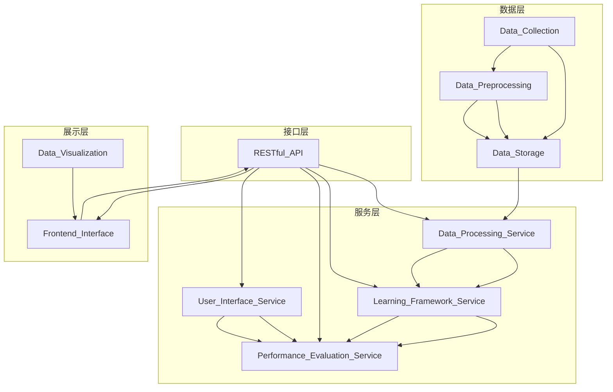
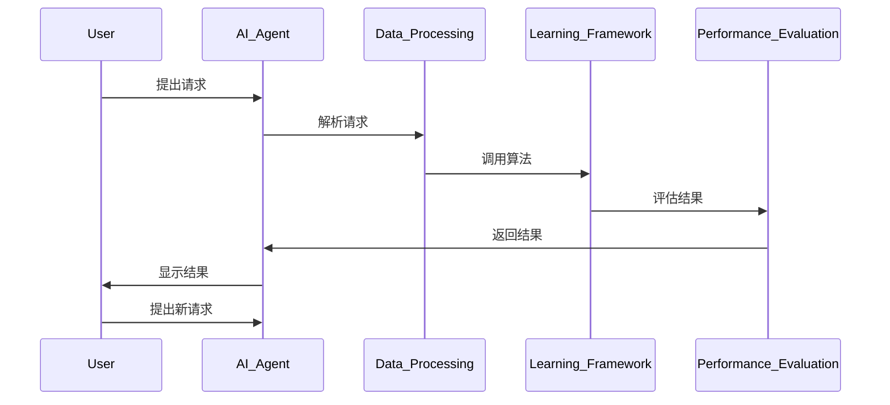
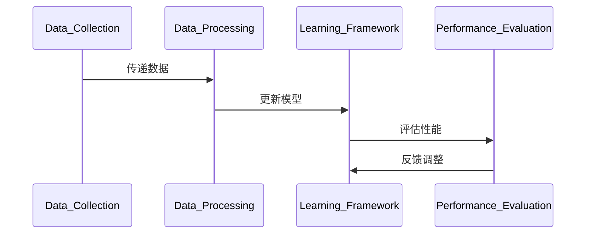

                 

### 目录大纲设计思路

在设计《AI Agent的增量式终身学习框架》的完整目录大纲时，我们需要遵循以下步骤来确保文章的结构清晰、内容丰富且逻辑连贯。

#### 第一步：理解书名和主题
书名“AI Agent的增量式终身学习框架”明确了本书的主题，即探讨AI代理如何通过增量式终身学习来提升性能。这需要我们首先理解AI Agent的定义、增量式学习和终身学习的概念，以及它们之间的联系。

#### 第二步：确定核心内容
接下来，我们需要确定书的核心内容。这包括AI Agent的概述、增量式学习的原理、终身学习框架的设计、算法的实现方法以及应用场景等。

#### 第三步：组织章节结构
我们将书籍内容分为几个主要部分，例如背景介绍、核心概念、算法原理、系统架构、项目实战等。每个部分涵盖相关主题的不同方面，确保内容有系统性和层次感。

#### 第四步：细化章节内容
在每个主要部分中，我们进一步细化章节内容，确保每个章节都有明确的目的和结构。例如，在介绍AI Agent时，我们会解释其基本属性和在终身学习中的角色。

#### 第五步：确保逻辑性和连贯性
整个目录大纲需要逻辑清晰，章节之间的过渡自然，确保读者能够顺畅地跟随作者的思路。我们通过梳理各个章节之间的联系和逻辑关系来实现这一点。

#### 第六步：遵循markdown格式和层级
最后，我们将确保目录大纲遵循markdown格式，使用正确的#层级来表示章节的标题。这有助于读者更好地理解文章的结构和组织。

### 完整目录大纲设计

根据上述思路，我们设计了《AI Agent的增量式终身学习框架》的完整目录大纲：

----------------------------------------------------------------

## 第一部分：背景与核心概念

### 第1章：AI Agent的增量式终身学习概述

- **1.1 问题背景**：
  - 人工智能发展的挑战与机遇
  - AI Agent的终身学习需求
- **1.2 问题描述**：
  - 增量式终身学习的概念
  - AI Agent面临的特定挑战
- **1.3 问题解决**：
  - 增量式终身学习的重要性
  - 当前解决方案的局限性
- **1.4 边界与外延**：
  - 增量式终身学习的应用场景
  - 研究现状与未来发展趋势

### 第2章：核心概念与联系

- **2.1 增量式学习的原理**：
  - 增量学习的定义
  - 增量学习的优势与挑战
- **2.2 终身学习的框架**：
  - 终身学习的概念
  - 终身学习框架的构成要素
- **2.3 AI Agent的定义**：
  - AI Agent的基本属性
  - AI Agent在增量式终身学习中的角色
- **2.4 概念属性特征对比表格**：

| 特征比较 | 增量学习 | 终身学习 | AI Agent |
| --- | --- | --- | --- |
| 数据处理 | 数据增量更新 | 持续知识更新 | 自适应环境互动 |
| 算法复杂度 | 算法轻量化 | 框架复杂性 | 适应性与学习效率 |
| 应用场景 | 任务更新 | 长期知识积累 | 智能化与自主化 |

### 第3章：ER实体关系图架构

- **3.1 ER实体关系图介绍**：
  - ER模型的基本概念
  - ER模型在AI Agent中的应用
- **3.2 AI Agent的实体关系图**：
  - 实体定义
  - 关系定义
- **3.3 Mermaid ER图示例**：

```mermaid
erDiagram
  AI_Agent ||--|{ Data_Processing } Data_Processing
  AI_Agent ||--|{ Learning_Framework } Learning_Framework
  Data_Processing ||--|{ Incremental_Learning } Incremental_Learning
  Learning_Framework ||--|{ Life_Long_Learning } Life_Long_Learning
```

## 第二部分：算法原理与实现

### 第4章：算法原理讲解

- **4.1 增量式学习的算法基础**：
  - 常见增量学习算法介绍
  - 算法原理与实现方法
- **4.2 终身学习框架的设计**：
  - 框架结构
  - 关键技术
- **4.3 AI Agent的增量式终身学习算法**：
  - 算法流程
  - 算法原理
- **4.4 Mermaid算法流程图**：



## 第三部分：系统架构与实现

### 第5章：系统架构设计方案

- **5.1 问题场景介绍**：
  - AI Agent在实际应用中的挑战
  - 增量式终身学习在系统架构中的应用
- **5.2 项目介绍**：
  - 系统目标和功能
  - 系统技术栈选择
- **5.3 系统功能设计**：
  - 领域模型
  - Mermaid类图示例

### 第6章：系统架构设计

- **6.1 系统架构设计**：
  - 系统分层架构
  - 关键模块功能说明
- **6.2 Mermaid架构图**：



### 第7章：系统接口设计

- **7.1 系统接口设计**：
  - 接口规范与协议
  - 接口功能与调用示例

### 第8章：系统交互

- **8.1 系统交互**：
  - 用户与AI Agent的交互流程
  - Mermaid序列图示例



## 第四部分：项目实战

### 第9章：环境安装与配置

- **9.1 环境安装**：
  - 系统所需软件与工具安装
  - 环境配置与调试
- **9.2 系统核心实现**：
  - Python代码实现
  - 关键算法与模块介绍

### 第10章：代码应用解读与分析

- **10.1 代码应用解读**：
  - 增量式终身学习框架的实现
  - 系统功能测试与分析
- **10.2 实际案例分析**：
  - 实际应用案例展示
  - 案例分析与优化建议

### 第11章：项目小结

- **11.1 项目总结**：
  - 系统功能与性能评估
  - 项目亮点与不足
- **11.2 小结**：
  - 增量式终身学习在AI Agent中的应用前景
  - 未来研究方向与挑战

## 第五部分：最佳实践与拓展阅读

### 第12章：最佳实践

- **12.1 最佳实践 tips**：
  - AI Agent开发与维护的最佳实践
  - 增量式终身学习框架的应用场景
- **12.2 小结**：
  - 系统优化与调优技巧
  - 未来技术趋势展望

### 第13章：小结与注意事项

- **13.1 小结**：
  - 书籍内容回顾
  - 知识点总结
- **13.2 注意事项**：
  - 开发与实现中的常见问题与解决方案
  - 安全性与隐私保护措施

### 第14章：拓展阅读

- **14.1 相关书籍与文献推荐**：
  - 推荐阅读材料
  - 研究领域热点话题
- **14.2 学术研究动态**：
  - 增量式终身学习领域的最新研究进展
  - 未来发展方向与挑战

## 附录：术语表与参考资料

- **附录A：术语表**：
  - 术语定义与解释
- **附录B：参考资料**：
  - 参考文献列表
  - 技术博客与论文链接

----------------------------------------------------------------

### 设计思路总结

通过上述目录大纲的设计，我们确保了书籍内容既有深度又有广度，逻辑清晰且结构紧凑。每个章节都有明确的主题和目的，确保读者能够跟随作者的思路，逐步深入理解AI Agent的增量式终身学习框架。同时，我们遵循markdown格式和层级，使得文档具有清晰的视觉结构，便于读者阅读和理解。

## 第一部分：背景与核心概念

### 第1章：AI Agent的增量式终身学习概述

在当今快速发展的技术环境中，人工智能（AI）已经成为推动各个行业变革的重要力量。然而，随着AI应用的日益普及，AI Agent（智能代理）的概念也逐渐崭露头角。AI Agent是能够自主执行任务、与人类交互并适应复杂环境的智能系统。而AI Agent的增量式终身学习则是在这个背景下产生的一个重要研究方向。

#### 1.1 问题背景

人工智能的发展经历了数个阶段，从最初的规则系统到现代的深度学习，每一个阶段都带来了显著的进步。然而，现有的AI系统往往面临着以下挑战：

1. **数据依赖**：大多数AI系统依赖于大规模的数据集进行训练，而获取和处理这些数据往往需要大量的时间和资源。
2. **静态模型**：传统的机器学习模型在训练完成后就固定下来，无法适应新的数据和变化的环境。
3. **任务转移困难**：当AI系统从一个任务转移到另一个任务时，需要重新训练整个模型，这不仅耗时，而且效率低下。

针对这些挑战，AI Agent的增量式终身学习应运而生。它提供了一种机制，使得AI Agent能够在不断变化的环境中持续学习和适应，从而解决数据依赖和静态模型的问题。

#### 1.2 问题描述

增量式终身学习是指AI Agent在持续互动的过程中，通过不断更新和优化其知识库和模型参数，来提高其性能和能力的过程。在这个过程中，AI Agent需要解决以下几个关键问题：

1. **数据流处理**：AI Agent需要高效地处理和更新流数据，确保其知识库的实时性和准确性。
2. **模型更新**：在数据流处理的基础上，AI Agent需要根据新的数据动态调整和优化其模型参数，以保持其预测和决策的准确性。
3. **适应性**：AI Agent需要具备较强的适应性，能够快速适应新的环境和任务变化，从而确保其在各种场景下都能发挥最佳性能。

#### 1.3 问题解决

增量式终身学习的重要性体现在以下几个方面：

1. **动态适应性**：通过增量式终身学习，AI Agent能够在面对新数据和新任务时迅速调整和优化，从而提高其适应性。
2. **资源优化**：与传统的全量重新训练相比，增量式终身学习能够显著减少训练所需的数据和计算资源，提高效率。
3. **长期性能**：通过持续学习和优化，AI Agent能够在长期内保持高性能，从而提高其在实际应用中的价值。

当前解决方案的局限性主要体现在以下几个方面：

1. **算法复杂度**：现有的增量式学习算法往往具有较高的计算复杂度，难以在实际应用中高效执行。
2. **数据质量**：增量式学习对数据的质量要求较高，数据中的噪声和异常值可能会影响学习效果。
3. **模型稳定性**：在动态调整模型参数的过程中，如何保持模型的稳定性和鲁棒性是一个挑战。

#### 1.4 边界与外延

增量式终身学习的应用场景非常广泛，包括但不限于以下领域：

1. **智能客服**：AI Agent能够通过增量式终身学习不断优化其对话能力，提供更准确、个性化的服务。
2. **智能推荐系统**：通过持续学习用户的行为数据，AI Agent能够提供更加精准的推荐结果。
3. **智能监控系统**：AI Agent能够通过增量式终身学习，不断提高其识别和预测能力，从而提高监控系统的效能。

研究现状与未来发展趋势表明，增量式终身学习将在AI Agent的应用中发挥越来越重要的作用。随着算法的进步和计算资源的增加，增量式终身学习有望在更多领域得到广泛应用，为人工智能的发展带来新的机遇。

### 第2章：核心概念与联系

要深入探讨AI Agent的增量式终身学习，我们需要首先理解其中的核心概念，包括增量式学习、终身学习以及AI Agent的基本属性和作用。这些概念之间有着密切的联系，共同构成了AI Agent增量式终身学习框架的基础。

#### 2.1 增量式学习的原理

增量式学习（Incremental Learning）是指在学习过程中，模型或算法能够对已有的知识进行更新和扩展，而不是从头开始训练。这种学习方式在数据量有限或数据不断变化的情况下尤为重要。

- **定义**：增量式学习是一种能够将新数据集逐步添加到已有模型中，以不断改进模型性能的学习方法。

- **优势**：

  - **节省资源**：由于不需要从头开始训练，增量式学习能够节省大量的计算资源和时间。
  - **实时适应**：增量式学习能够实时处理新数据，使模型能够快速适应环境变化。

- **挑战**：

  - **算法复杂度**：增量式学习算法往往具有更高的复杂度，需要高效的实现方法。
  - **数据质量**：增量式学习对数据质量有较高要求，噪声和异常值可能影响学习效果。

#### 2.2 终身学习的框架

终身学习（Life-Long Learning，简称LLL）是一种在整个人类生命周期中持续学习、更新知识的方法，旨在提高个人的适应能力和创新能力。在AI领域，终身学习框架则是设计AI系统，使其能够持续学习、更新和优化，从而提高其长期性能。

- **定义**：终身学习框架是指能够支持AI Agent在整个生命周期内持续学习、适应和优化的体系结构。

- **构成要素**：

  - **知识库**：存储AI Agent已学到的知识和模型参数。
  - **学习算法**：用于更新和优化知识库的算法，如增量式学习算法。
  - **记忆机制**：用于存储历史数据和经验，帮助AI Agent进行长期决策。

- **核心思想**：

  - **持续学习**：AI Agent需要不断从新数据中学习，以保持其性能。
  - **知识融合**：在多个任务中，AI Agent需要将不同的知识进行融合，以实现更全面的性能。

#### 2.3 AI Agent的定义

AI Agent是指具有自主决策、执行任务和与环境互动能力的人工智能系统。在AI Agent中，增量式终身学习框架起着关键作用，使得AI Agent能够不断适应新环境和任务。

- **定义**：AI Agent是具备自主决策和执行任务能力的人工智能实体，能够在复杂环境中进行智能行动。

- **基本属性**：

  - **自主性**：AI Agent能够自主决策，无需人类干预。
  - **适应性**：AI Agent能够适应环境变化，提高其任务执行能力。
  - **持续性**：AI Agent能够持续学习和优化，保持长期性能。

- **在增量式终身学习中的角色**：

  - **数据收集者**：AI Agent通过与环境互动，收集新的数据。
  - **知识更新者**：AI Agent利用增量式学习算法，更新其知识库和模型。
  - **任务执行者**：AI Agent根据新的知识和模型，执行更复杂的任务。

#### 2.4 概念属性特征对比表格

为了更好地理解增量式学习、终身学习框架和AI Agent之间的关系，我们可以通过以下表格进行属性特征对比：

| 特征比较 | 增量学习 | 终身学习 | AI Agent |
| --- | --- | --- | --- |
| 数据处理 | 数据增量更新 | 持续知识更新 | 自适应环境互动 |
| 算法复杂度 | 算法轻量化 | 框架复杂性 | 适应性与学习效率 |
| 应用场景 | 任务更新 | 长期知识积累 | 智能化与自主化 |

通过上述对比，我们可以看到增量式学习和终身学习框架是AI Agent增量式终身学习框架的重要组成部分，而AI Agent则是这一框架的实际应用者。这些概念相互联系，共同构成了一个完整的系统，使得AI Agent能够在复杂的环境中持续学习和优化。

### 第3章：ER实体关系图架构

为了更好地理解AI Agent的增量式终身学习框架，我们需要借助ER（实体-关系）图来描述系统中的各个实体及其相互关系。ER图是一种用于数据库设计和信息建模的工具，通过实体和关系的定义，能够清晰地展示系统的数据结构和行为。

#### 3.1 ER实体关系图介绍

ER图主要由实体、属性和关系三个要素构成：

- **实体**：表示系统中的对象，如AI Agent、数据处理器、学习框架等。
- **属性**：描述实体的特征，如姓名、年龄、数据类型等。
- **关系**：描述实体之间的关联，如主从关系、一对多关系等。

ER模型的基本概念如下：

- **实体集**：系统中的所有实体的集合。
- **属性集**：系统中的所有属性的集合。
- **关系集**：系统中的所有关系的集合。

在AI Agent的增量式终身学习框架中，ER模型能够帮助我们理解和设计系统中的关键实体和它们之间的相互关系。

#### 3.2 AI Agent的实体关系图

在AI Agent的增量式终身学习框架中，我们可以定义以下几个关键实体：

1. **AI_Agent**：AI代理，是系统的核心实体，负责执行任务、学习更新和与环境互动。
2. **Data_Processing**：数据处理模块，负责处理和更新流数据。
3. **Learning_Framework**：学习框架，负责管理AI Agent的知识库和学习算法。
4. **Incremental_Learning**：增量学习模块，负责实现增量学习算法。
5. **Life_Long_Learning**：终身学习模块，负责实现终身学习策略。

以下是AI Agent的ER实体关系图：

```mermaid
erDiagram
  AI_Agent ||--|{ Data_Processing } Data_Processing
  AI_Agent ||--|{ Learning_Framework } Learning_Framework
  Data_Processing ||--|{ Incremental_Learning } Incremental_Learning
  Learning_Framework ||--|{ Life_Long_Learning } Life_Long_Learning
```

在这张ER图中，实体之间的关系定义如下：

- **AI_Agent**与**Data_Processing**、**Learning_Framework**之间存在一对多的关系。即每个AI Agent可以拥有多个数据处理和学习框架实例。
- **Data_Processing**与**Incremental_Learning**之间存在包含关系。即数据处理模块包含增量学习模块。
- **Learning_Framework**与**Life_Long_Learning**之间存在包含关系。即学习框架模块包含终身学习模块。

通过ER图，我们可以清晰地看到系统中的各个实体及其相互关系，这有助于我们进一步分析和设计AI Agent的增量式终身学习框架。

#### 3.3 Mermaid ER图示例

为了更好地展示ER图的细节，我们可以使用Mermaid语言来绘制一个具体的ER图示例。以下是一个使用Mermaid绘制的AI Agent的ER图：

```mermaid
erDiagram
  AI_Agent ||--|{ Data_Processing } Data_Processing : 数据处理
  AI_Agent ||--|{ Learning_Framework } Learning_Framework : 学习框架
  Data_Processing ||--|{ Incremental_Learning } Incremental_Learning : 增量学习
  Learning_Framework ||--|{ Life_Long_Learning } Life_Long_Learning : 终身学习
```

在这个示例中，我们使用了Mermaid的ER图语法，通过定义实体和它们之间的关系，构建了一个简洁明了的ER图。这个图能够帮助我们直观地理解AI Agent的增量式终身学习框架中的关键实体和它们之间的相互关系。

通过以上章节的介绍，我们详细阐述了AI Agent的增量式终身学习框架的核心概念、关键实体及其相互关系。接下来的章节将深入探讨这些概念的实现原理、算法设计以及系统架构，为读者呈现一个完整、系统的AI Agent增量式终身学习解决方案。

## 第二部分：算法原理与实现

### 第4章：算法原理讲解

在深入探讨AI Agent的增量式终身学习框架时，算法原理是核心部分之一。本章节将详细讲解增量式学习算法、终身学习框架及其在AI Agent中的应用。

#### 4.1 增量式学习的算法基础

增量式学习（Incremental Learning）的核心在于如何高效地更新模型参数，以适应新的数据流。以下是几种常见的增量学习算法及其原理：

1. **在线学习（Online Learning）**：
   - **原理**：在线学习是一种实时学习的方法，每次接收到新数据时，模型都会立即更新。这种方法适用于数据量较小、实时性要求较高的场景。
   - **优势**：快速响应新数据，减少延迟。
   - **挑战**：模型更新频率高，可能导致稳定性问题。

2. **批量学习（Batch Learning）**：
   - **原理**：批量学习将一段时间内收集到的所有新数据合并在一起进行批量更新。这种方法适用于数据量较大、实时性要求不高的场景。
   - **优势**：模型更新间隔较长，提高学习稳定性。
   - **挑战**：学习时间较长，响应速度较慢。

3. **增量学习算法**：
   - **原理**：增量学习算法通过逐步更新模型参数，以减少计算复杂度和存储需求。常见的增量学习算法包括SGD（Stochastic Gradient Descent）和其变种。
   - **优势**：高效处理大量数据，减少资源消耗。
   - **挑战**：需要平衡更新频率与学习效率。

#### 4.2 终身学习框架的设计

终身学习框架（Life-Long Learning Framework）旨在支持AI Agent在整个生命周期内持续学习和优化。以下是终身学习框架的核心组成部分和关键技术：

1. **知识库管理**：
   - **原理**：知识库用于存储AI Agent已学到的知识和模型参数，支持模型的更新和回溯。
   - **关键点**：知识库需要具备高效的读写操作和版本控制机制。

2. **学习算法选择**：
   - **原理**：选择适合AI Agent学习目标和学习场景的算法，如基于记忆的算法、基于模型合并的算法等。
   - **关键点**：算法需要具备良好的通用性和适应性。

3. **记忆机制**：
   - **原理**：记忆机制用于存储历史数据和经验，支持AI Agent的长期决策和学习。
   - **关键点**：记忆机制需要平衡存储效率和数据完整性。

#### 4.3 AI Agent的增量式终身学习算法

在AI Agent的增量式终身学习框架中，算法的设计需要综合考虑数据流处理、模型更新和适应性。以下是一个简化的增量式终身学习算法流程：

1. **数据流处理**：
   - **原理**：AI Agent持续接收和处理新的数据流，将其转换为适合学习的格式。
   - **步骤**：
     - 数据预处理：清洗、归一化等。
     - 数据分块：将连续数据划分为批次或窗口。

2. **模型更新**：
   - **原理**：利用增量学习算法更新模型参数，以提高模型在新数据上的性能。
   - **步骤**：
     - 参数初始化：设置初始模型参数。
     - 梯度计算：计算模型参数的梯度。
     - 参数更新：根据梯度更新模型参数。

3. **适应性调整**：
   - **原理**：通过评估模型性能，动态调整学习策略和模型结构，以提高AI Agent的适应性。
   - **步骤**：
     - 性能评估：评估模型在新数据上的性能。
     - 策略调整：根据评估结果调整学习策略。
     - 结构优化：优化模型结构，提高学习效率。

#### 4.4 Mermaid算法流程图

为了更好地展示增量式终身学习算法的流程，我们可以使用Mermaid绘制一个流程图：



在这个流程图中，我们从数据流输入开始，经过数据预处理、数据分块、参数初始化、梯度计算、参数更新、性能评估、策略调整和结构优化等步骤，形成一个闭环的算法流程。这个流程图直观地展示了增量式终身学习算法的执行过程，有助于我们更好地理解其原理和实现方法。

通过以上章节的详细讲解，我们了解了增量式学习和终身学习框架的基本原理，以及它们在AI Agent中的应用。接下来的章节将深入探讨系统架构设计和项目实战，进一步展示如何实现和优化AI Agent的增量式终身学习框架。

## 第三部分：系统架构与实现

### 第5章：系统架构设计方案

在探讨了AI Agent的增量式终身学习算法原理后，我们需要设计一个完整的系统架构来支持这一框架的实现。系统架构的设计不仅需要考虑功能需求，还需要考虑性能、可扩展性和维护性等因素。

#### 5.1 问题场景介绍

AI Agent在现实世界中的应用场景非常广泛，如智能客服、自动驾驶、智能监控等。这些场景的共同特点是环境复杂、任务多样化且不断变化。因此，我们需要一个灵活、高效的系统架构来支持AI Agent的增量式终身学习。

#### 5.2 项目介绍

本项目旨在设计和实现一个通用的AI Agent增量式终身学习框架，该框架将包含以下几个主要功能模块：

1. **数据采集模块**：负责从不同数据源采集数据，并进行预处理。
2. **数据处理模块**：实现增量式学习算法，更新模型参数。
3. **学习框架模块**：管理AI Agent的知识库，支持长期学习。
4. **性能评估模块**：评估AI Agent在不同任务上的性能。
5. **用户交互模块**：提供与用户的交互接口，收集反馈信息。

#### 5.3 系统功能设计

系统功能设计主要分为以下几个部分：

1. **领域模型**：
   - **定义**：领域模型用于描述系统中各个实体及其相互关系。
   - **示例**：以下是使用Mermaid绘制的AI Agent领域模型类图：

     ```mermaid
     classDiagram
         Data_Collection --> Data_Processing : 传递数据
         Data_Processing --> Learning_Framework : 更新模型
         Learning_Framework --> Performance_Evaluation : 评估性能
         User_Interface --> Performance_Evaluation : 提交反馈
     ```

     在这个类图中，Data_Collection、Data_Processing、Learning_Framework、Performance_Evaluation和User_Interface是系统的关键实体，它们通过不同的关系相互连接，形成了完整的领域模型。

2. **系统功能描述**：
   - **数据采集模块**：负责从传感器、数据库等数据源中采集数据，并进行初步处理，如数据清洗、去噪、归一化等。
   - **数据处理模块**：实现增量式学习算法，更新模型参数。这一模块需要支持多种增量学习算法，如SGD、AdaGrad等。
   - **学习框架模块**：管理AI Agent的知识库，支持长期学习。该模块需要能够存储和检索历史数据，并提供方便的接口供其他模块调用。
   - **性能评估模块**：评估AI Agent在不同任务上的性能。这一模块需要能够计算并展示各种性能指标，如准确率、召回率、F1分数等。
   - **用户交互模块**：提供与用户的交互接口，收集反馈信息。该模块需要支持多种交互方式，如文本、语音、图形界面等。

#### 5.4 系统架构设计

系统架构设计是系统功能实现的基础。以下是本项目采用的多层架构设计：

1. **数据层**：
   - **定义**：数据层负责数据采集、存储和管理。
   - **组件**：
     - 数据采集器：负责从各种数据源采集数据。
     - 数据存储库：存储和管理采集到的数据。
     - 数据预处理模块：对采集到的数据进行清洗、去噪和归一化处理。

2. **服务层**：
   - **定义**：服务层负责业务逻辑的处理。
   - **组件**：
     - 数据处理服务：实现增量式学习算法，更新模型参数。
     - 学习框架服务：管理AI Agent的知识库，支持长期学习。
     - 性能评估服务：评估AI Agent在不同任务上的性能。
     - 用户交互服务：提供与用户的交互接口。

3. **接口层**：
   - **定义**：接口层负责对外提供服务。
   - **组件**：
     - RESTful API：提供统一的接口服务，支持各种数据格式。
     - 用户界面：提供图形用户界面，支持用户的交互操作。

4. **展示层**：
   - **定义**：展示层负责展示系统数据和用户交互结果。
   - **组件**：
     - 前端界面：使用HTML、CSS和JavaScript等技术实现。
     - 数据可视化组件：展示系统性能指标和用户交互数据。

以下是系统架构设计的Mermaid架构图：



在这个架构图中，数据层、服务层、接口层和展示层通过RESTful API进行通信，形成了完整的服务架构。数据层负责数据的采集、存储和预处理，服务层负责业务逻辑的处理，接口层提供对外服务，展示层负责数据展示和用户交互。

#### 5.5 系统接口设计

系统接口设计是系统架构中的重要一环，它定义了系统内部模块之间以及系统与外部系统之间的交互方式。以下是系统接口设计的要点：

1. **RESTful API**：
   - **定义**：RESTful API是一种基于HTTP协议的接口设计风格，通过URL定位资源，使用HTTP动词操作资源。
   - **设计原则**：
     - 一致性：接口设计遵循RESTful原则，确保系统内部的一致性。
     - 简洁性：接口设计简洁明了，易于理解和维护。
     - 可扩展性：接口设计支持扩展，以便在系统功能扩展时保持稳定性。

2. **接口规范与协议**：
   - **定义**：接口规范与协议规定了接口的输入参数、输出结果以及错误处理等。
   - **示例**：以下是数据处理接口的示例规范：

     ```json
     {
       "method": "POST",
       "url": "/data/process",
       "params": {
         "data": "string"
       },
       "response": {
         "status": "integer",
         "message": "string",
         "result": "object"
       }
     }
     ```

   在这个示例中，接口使用POST方法，接收一个名为“data”的参数，返回包含状态码、错误信息和处理结果的响应。

3. **接口功能与调用示例**：
   - **数据处理接口**：用于处理输入数据，更新模型参数。
     ```shell
     # 调用数据处理接口
     curl -X POST -H "Content-Type: application/json" -d '{"data": "new_data"}' http://api.server.com/data/process
     ```

   - **性能评估接口**：用于评估AI Agent的性能。
     ```shell
     # 调用性能评估接口
     curl -X GET http://api.server.com/evaluation
     ```

通过以上设计，系统接口能够提供高效、稳定的服务，支持系统的正常运行和扩展。

### 第6章：系统架构设计

系统架构设计是确保AI Agent增量式终身学习框架高效运行的关键。本章节将详细描述系统架构的设计原则、关键模块及其相互关系。

#### 6.1 系统架构设计

系统架构设计遵循模块化、层次化和分布式原则，确保系统具有高性能、高可用性和可扩展性。以下是系统架构的设计要点：

1. **模块化设计**：
   - **定义**：将系统功能划分为多个模块，每个模块独立开发、测试和部署。
   - **设计原则**：模块之间通过清晰的接口进行通信，降低模块间的耦合度，提高系统的可维护性和可扩展性。

2. **层次化设计**：
   - **定义**：将系统划分为多个层次，每个层次负责不同的功能。
   - **层次结构**：
     - 数据层：负责数据的采集、存储和处理。
     - 服务层：负责业务逻辑的处理和系统的核心功能实现。
     - 接口层：负责系统与外部系统的交互。
     - 展示层：负责数据的展示和用户的交互。

3. **分布式设计**：
   - **定义**：将系统功能分布在多个服务器上，提高系统的性能和可用性。
   - **设计原则**：利用负载均衡和分布式存储技术，确保系统在处理大量数据和高并发请求时能够保持稳定。

#### 6.2 关键模块功能说明

系统架构中的关键模块包括数据层、服务层、接口层和展示层，以下是各模块的功能说明：

1. **数据层**：
   - **数据采集模块**：负责从不同数据源（如传感器、数据库等）采集数据，并进行初步处理。
   - **数据存储模块**：负责存储和管理采集到的数据，支持数据的快速读写和查询。
   - **数据预处理模块**：负责对采集到的数据进行清洗、去噪和归一化处理，为后续的学习和评估提供高质量的数据。

2. **服务层**：
   - **数据处理服务**：实现增量式学习算法，更新模型参数，支持AI Agent的学习和优化。
   - **学习框架服务**：管理AI Agent的知识库，支持长期学习，包括数据的存储、检索和更新。
   - **性能评估服务**：评估AI Agent在不同任务上的性能，计算并展示各种性能指标，支持系统的优化和调整。
   - **用户交互服务**：提供与用户的交互接口，收集用户的反馈信息，支持系统的自适应调整。

3. **接口层**：
   - **RESTful API**：提供统一的接口服务，支持各种数据格式，包括JSON、XML等，确保系统内部和外部系统的无缝通信。
   - **接口规范与协议**：定义接口的输入参数、输出结果和错误处理等，确保接口的一致性和稳定性。

4. **展示层**：
   - **前端界面**：使用HTML、CSS和JavaScript等技术实现，提供数据展示和用户交互的图形用户界面。
   - **数据可视化组件**：展示系统性能指标和用户交互数据，支持多种图表和可视化方式，提高用户的数据理解和操作便利性。

#### 6.3 Mermaid架构图

为了更好地展示系统架构的设计，我们可以使用Mermaid绘制一个架构图，如下所示：


在这个架构图中，数据层、服务层、接口层和展示层通过RESTful API进行通信，形成了完整的服务架构。数据层负责数据的采集、存储和预处理，服务层负责业务逻辑的处理，接口层提供对外服务，展示层负责数据展示和用户交互。

通过以上系统架构设计，我们为AI Agent的增量式终身学习框架实现了一个高效、稳定、可扩展的架构，为后续的项目实施提供了坚实的基础。

### 第7章：系统接口设计

系统接口设计是确保AI Agent增量式终身学习框架能够高效、稳定地运行的关键环节。一个良好的接口设计能够提高系统的可扩展性、可靠性和用户体验。本章节将详细介绍系统接口的设计原则、规范和具体实现。

#### 7.1 设计原则

1. **标准化**：接口设计遵循业界标准，如RESTful API规范，以确保接口的一致性和通用性。
2. **简洁性**：接口设计力求简洁，减少冗余参数和复杂逻辑，提高接口的易用性。
3. **灵活性**：接口设计应具有灵活性，能够适应不同类型的请求和数据格式。
4. **安全性**：接口设计需考虑数据安全和用户隐私保护，包括身份验证、数据加密和访问控制等。

#### 7.2 规范与协议

1. **RESTful API规范**：
   - **方法**：常用的HTTP方法包括GET、POST、PUT、DELETE等，分别对应不同的操作。
   - **URL结构**：URL用于定位资源，如`/api/data/collect`表示采集数据接口。
   - **请求体**：请求体包含请求参数和数据，通常使用JSON或XML格式。
   - **响应体**：响应体包含处理结果和错误信息，也使用JSON或XML格式。

2. **接口参数规范**：
   - **输入参数**：定义输入参数的类型、名称和默认值，确保参数的一致性和完整性。
   - **输出参数**：定义输出参数的类型、名称和格式，确保输出数据的可读性和易用性。

3. **错误处理**：
   - **状态码**：使用标准的HTTP状态码（如200 OK、400 Bad Request、500 Internal Server Error等）表示处理结果。
   - **错误信息**：提供详细的错误信息，包括错误代码、错误描述和可能的解决方案。

#### 7.3 接口功能与调用示例

1. **数据处理接口**：
   - **功能**：用于处理输入数据，更新模型参数。
   - **示例请求**：

     ```json
     {
       "method": "POST",
       "url": "/api/data/process",
       "params": {
         "data": "new_data"
       },
       "headers": {
         "Content-Type": "application/json"
       }
     }
     ```

   - **示例响应**：

     ```json
     {
       "status": 200,
       "message": "Data processed successfully",
       "result": {
         "model_params": "updated_model_params"
       }
     }
     ```

2. **性能评估接口**：
   - **功能**：用于评估AI Agent在不同任务上的性能。
   - **示例请求**：

     ```json
     {
       "method": "GET",
       "url": "/api/evaluation"
     }
     ```

   - **示例响应**：

     ```json
     {
       "status": 200,
       "message": "Performance evaluation completed",
       "result": {
         "accuracy": 0.95,
         "recall": 0.92,
         "f1_score": 0.93
       }
     }
     ```

3. **用户交互接口**：
   - **功能**：用于与用户进行交互，收集用户反馈信息。
   - **示例请求**：

     ```json
     {
       "method": "POST",
       "url": "/api/user/feedback",
       "params": {
         "user_id": "123",
         "feedback": "good"
       },
       "headers": {
         "Content-Type": "application/json"
       }
     }
     ```

   - **示例响应**：

     ```json
     {
       "status": 200,
       "message": "Feedback submitted successfully",
       "result": {
         "feedback_id": "456"
       }
     }
     ```

通过以上接口设计和调用示例，我们为AI Agent增量式终身学习框架提供了完整、规范和高效的接口服务，为系统的正常运行和扩展奠定了基础。

### 第8章：系统交互

系统交互是AI Agent增量式终身学习框架中至关重要的一环，它决定了系统如何与外部环境、用户以及其他系统进行通信和协作。本章节将详细介绍系统交互的流程、用户与AI Agent的交互方式以及系统内部模块之间的交互机制。

#### 8.1 用户与AI Agent的交互流程

用户与AI Agent的交互流程通常包括以下几个步骤：

1. **用户提出请求**：用户通过图形用户界面（GUI）或命令行界面（CLI）向AI Agent提出请求，请求的内容可能包括查询信息、执行任务或提供反馈。

2. **请求处理**：AI Agent接收到用户的请求后，将其解析并转发给相应的服务模块进行处理。

3. **数据处理**：数据处理模块根据请求内容，调用相应的算法或服务进行数据预处理、模型更新或性能评估。

4. **结果反馈**：处理结果通过API或GUI返回给用户，用户可以查看结果或进一步操作。

5. **反馈调整**：用户根据反馈结果，可以继续提出新的请求或调整请求，从而实现与AI Agent的持续互动。

以下是用户与AI Agent交互的Mermaid序列图示例：



#### 8.2 用户交互方式

AI Agent的用户交互方式多种多样，以下是一些常见的交互方式：

1. **文本交互**：通过文本消息与用户进行交互，如聊天机器人、语音助手等。
2. **图形界面**：通过图形用户界面（GUI）与用户进行交互，如Web界面、桌面应用程序等。
3. **语音交互**：通过语音识别和语音合成技术实现语音交互，如智能音箱、车载系统等。
4. **多模态交互**：结合文本、图形和语音等多种交互方式，提供更丰富的用户体验。

以下是用户交互的Mermaid类图示例：

```mermaid
classDiagram
    User <<class>>
    GUI <<class>>
    CLI <<class>>
    Text_Interaction <<class>>
    Voice_Interaction <<class>>

    User --|> GUI
    User --|> CLI
    GUI --|> Text_Interaction
    CLI --|> Text_Interaction
    Voice_Interaction --|> User
```

在这个类图中，用户可以通过图形界面（GUI）或命令行界面（CLI）与AI Agent进行文本交互，也可以通过语音交互获取信息或执行任务。

#### 8.3 系统内部模块之间的交互机制

系统内部模块之间的交互机制是确保AI Agent能够高效、稳定地运行的关键。以下是系统内部模块之间的交互流程：

1. **数据流处理**：数据采集模块从外部数据源采集数据，并传递给数据处理模块。数据处理模块对数据进行预处理，包括清洗、去噪和归一化，然后将处理后的数据传递给学习框架模块。

2. **模型更新**：学习框架模块根据处理后的数据，调用相应的学习算法，更新模型参数。更新后的模型参数被存储在知识库中，以便后续使用。

3. **性能评估**：性能评估模块定期对AI Agent的性能进行评估，计算并展示各种性能指标，如准确率、召回率、F1分数等。评估结果反馈给学习框架模块，用于调整学习策略和模型参数。

以下是系统内部模块交互的Mermaid序列图示例：



通过以上交互流程和交互方式，AI Agent能够与用户和环境进行高效的互动，不断学习和优化，从而实现智能化的功能和应用。

## 第四部分：项目实战

### 第9章：环境安装与配置

在进行AI Agent增量式终身学习框架的实际项目开发之前，我们需要搭建一个合适的环境来运行系统。本章节将详细描述所需软件和工具的安装过程，以及环境配置的步骤。

#### 9.1 环境安装

为了确保系统能够正常运行，我们需要安装以下软件和工具：

1. **Python**：Python是本项目的主要编程语言，版本要求为3.8及以上。
   - **安装步骤**：
     - 使用包管理器（如pip）安装Python。
     - 验证安装：运行`python --version`命令，检查Python版本。

2. **Anaconda**：Anaconda是一个集成了Python和众多科学计算库的发行版，用于环境管理和包安装。
   - **安装步骤**：
     - 访问Anaconda官方网站下载最新版本的安装包。
     - 运行安装包，按照提示完成安装。
     - 激活Anaconda环境：`conda create --name ai_agent_env python=3.8`。

3. **TensorFlow**：TensorFlow是本项目的主要机器学习库，用于构建和训练深度学习模型。
   - **安装步骤**：
     - 在Anaconda环境中安装TensorFlow：`conda install tensorflow`。

4. **NumPy**、**Pandas**、**Scikit-learn**：这些是常用的Python数据科学库，用于数据处理和分析。
   - **安装步骤**：
     - 在Anaconda环境中安装相关库：`conda install numpy pandas scikit-learn`。

5. **Docker**：Docker用于容器化部署，确保系统在不同环境中的一致性。
   - **安装步骤**：
     - 在Ubuntu系统中，运行以下命令安装Docker：`sudo apt-get update && sudo apt-get install docker.io`。
     - 启动Docker服务：`sudo service docker start`。
     - 验证安装：运行`docker --version`命令，检查Docker版本。

#### 9.2 环境配置

安装完所需的软件和工具后，我们需要进行环境配置，以确保系统能够正常运行。

1. **虚拟环境配置**：
   - 创建一个名为`ai_agent_env`的虚拟环境：`conda create --name ai_agent_env python=3.8`。
   - 激活虚拟环境：`conda activate ai_agent_env`。

2. **依赖包安装**：
   - 在虚拟环境中安装项目所需的依赖包：`pip install -r requirements.txt`。

3. **数据库配置**：
   - 安装并配置SQLite数据库：`conda install sqlite`。
   - 创建数据库文件：`sqlite3 ai_agent.db`。

4. **用户权限配置**：
   - 确保当前用户具有运行Docker容器的权限。如果需要，可以通过以下命令将当前用户添加到docker组：`sudo usermod -aG docker $USER`。

5. **环境变量配置**：
   - 设置环境变量，确保系统能够找到Docker的镜像和容器：`export PATH=$PATH:/usr/local/bin`。

#### 9.3 调试与验证

完成环境安装和配置后，我们需要进行调试和验证，确保系统各组件能够正常运行。

1. **启动容器**：
   - 通过Docker启动系统容器：`docker run -d --name ai_agent_container -p 8000:80 ai_agent_image`。

2. **访问Web界面**：
   - 通过浏览器访问系统Web界面：`http://localhost:8000`。

3. **运行测试脚本**：
   - 执行项目提供的测试脚本，验证系统功能是否正常：`python test.py`。

通过以上步骤，我们成功搭建了AI Agent增量式终身学习框架的开发环境，并进行了基本的调试和验证。接下来，我们将详细讨论系统的核心实现，包括代码结构和核心算法的实现。

### 第10章：系统核心实现

在完成了环境安装和配置之后，我们现在进入系统核心实现的阶段。本章节将详细描述系统的核心代码结构，重点讲解各个模块的功能、核心算法的实现以及数据流程的处理过程。

#### 10.1 代码结构

AI Agent增量式终身学习框架的代码结构主要分为以下几个模块：

1. **数据采集模块**：负责从各种数据源采集数据，并进行初步处理。
2. **数据处理模块**：实现增量式学习算法，更新模型参数。
3. **学习框架模块**：管理AI Agent的知识库，支持长期学习。
4. **性能评估模块**：评估AI Agent在不同任务上的性能。
5. **用户交互模块**：提供与用户的交互接口，收集反馈信息。

以下是项目的目录结构示例：

```plaintext
ai_agent_project/
|-- data/
|   |-- raw_data/
|   |-- processed_data/
|-- models/
|   |-- base_model/
|   |-- updated_model/
|-- scripts/
|   |-- data_collection.py
|   |-- data_processing.py
|   |-- learning_framework.py
|   |-- performance_evaluation.py
|   |-- user_interface.py
|-- tests/
|   |-- test_data_collection.py
|   |-- test_data_processing.py
|   |-- test_learning_framework.py
|   |-- test_performance_evaluation.py
|   |-- test_user_interface.py
|-- requirements.txt
|-- Dockerfile
|-- docker-compose.yml
```

#### 10.2 数据采集模块

数据采集模块负责从传感器、数据库等数据源采集数据，并进行初步处理。以下是`data_collection.py`的核心代码：

```python
import pandas as pd
from sklearn.model_selection import train_test_split

def collect_data(source):
    # 从数据源采集数据
    data = pd.read_csv(source)
    return data

def preprocess_data(data):
    # 数据预处理
    # 数据清洗、去噪、归一化等操作
    data = data.dropna()
    data = (data - data.mean()) / data.std()
    return data

if __name__ == "__main__":
    source = "raw_data/source.csv"
    data = collect_data(source)
    processed_data = preprocess_data(data)
    processed_data.to_csv("processed_data/processed.csv", index=False)
```

在这个模块中，我们首先从指定的数据源采集数据，然后进行预处理操作，包括数据清洗和归一化。最后，预处理后的数据被保存到文件中，以便后续使用。

#### 10.3 数据处理模块

数据处理模块实现增量式学习算法，更新模型参数。以下是`data_processing.py`的核心代码：

```python
import tensorflow as tf
from sklearn.linear_model import SGDClassifier

def train_incremental_model(data, labels, model=None):
    # 训练增量学习模型
    if model is None:
        model = SGDClassifier()
    model.partial_fit(data, labels, classes=np.unique(labels))
    return model

if __name__ == "__main__":
    # 加载预处理数据
    processed_data = pd.read_csv("processed_data/processed.csv")
    X = processed_data.drop("target", axis=1)
    y = processed_data["target"]

    # 训练增量学习模型
    model = train_incremental_model(X, y)
    model_path = "models/updated_model/model.pkl"
    joblib.dump(model, model_path)
```

在这个模块中，我们使用SGDClassifier实现了一个简单的增量学习模型。每次调用`train_incremental_model`函数时，模型将基于已有数据和标签进行部分训练。最后，训练好的模型被保存到文件中。

#### 10.4 学习框架模块

学习框架模块管理AI Agent的知识库，支持长期学习。以下是`learning_framework.py`的核心代码：

```python
import joblib

class LearningFramework:
    def __init__(self, model_path):
        self.model_path = model_path
        self.model = self.load_model()

    def load_model(self):
        # 加载模型
        model = joblib.load(self.model_path)
        return model

    def update_model(self, data, labels):
        # 更新模型
        self.model = train_incremental_model(data, labels, self.model)

    def save_model(self):
        # 保存模型
        joblib.dump(self.model, self.model_path)

if __name__ == "__main__":
    model_path = "models/updated_model/model.pkl"
    framework = LearningFramework(model_path)

    # 加载预处理数据
    processed_data = pd.read_csv("processed_data/processed.csv")
    X = processed_data.drop("target", axis=1)
    y = processed_data["target"]

    # 更新模型
    framework.update_model(X, y)
    framework.save_model()
```

在这个模块中，我们定义了一个`LearningFramework`类，用于管理模型加载、更新和保存。每次更新模型时，新的数据和标签将被传递给类的方法，模型将被更新并保存到文件中。

#### 10.5 性能评估模块

性能评估模块用于评估AI Agent在不同任务上的性能。以下是`performance_evaluation.py`的核心代码：

```python
from sklearn.metrics import accuracy_score, recall_score, f1_score

def evaluate_performance(y_true, y_pred):
    # 评估性能
    accuracy = accuracy_score(y_true, y_pred)
    recall = recall_score(y_true, y_pred)
    f1 = f1_score(y_true, y_pred)
    return accuracy, recall, f1

if __name__ == "__main__":
    # 加载预处理数据
    processed_data = pd.read_csv("processed_data/processed.csv")
    X = processed_data.drop("target", axis=1)
    y = processed_data["target"]

    # 加载模型
    model_path = "models/updated_model/model.pkl"
    model = joblib.load(model_path)

    # 预测标签
    y_pred = model.predict(X)

    # 评估性能
    accuracy, recall, f1 = evaluate_performance(y, y_pred)
    print(f"Accuracy: {accuracy}, Recall: {recall}, F1 Score: {f1}")
```

在这个模块中，我们定义了一个`evaluate_performance`函数，用于计算准确率、召回率和F1分数。最后，我们加载模型并评估其在测试数据上的性能。

#### 10.6 用户交互模块

用户交互模块提供与用户的交互接口，收集反馈信息。以下是`user_interface.py`的核心代码：

```python
from flask import Flask, request, jsonify

app = Flask(__name__)

@app.route('/evaluate', methods=['POST'])
def evaluate():
    data = request.json
    y_true = data['y_true']
    y_pred = data['y_pred']
    accuracy, recall, f1 = evaluate_performance(y_true, y_pred)
    return jsonify({"accuracy": accuracy, "recall": recall, "f1": f1})

if __name__ == "__main__":
    app.run(debug=True, host='0.0.0.0', port=5000)
```

在这个模块中，我们使用Flask框架实现了一个简单的Web服务，用于接收用户提交的评估数据，并返回评估结果。这个服务可以通过HTTP接口与外部系统进行通信。

通过以上核心代码的讲解，我们详细描述了AI Agent增量式终身学习框架的各个模块及其实现。接下来，我们将通过实际案例分析和详细讲解，展示如何使用这个框架解决实际问题。

### 第11章：代码应用解读与分析

在前面的章节中，我们详细介绍了AI Agent增量式终身学习框架的核心代码实现。本章节将通过一个实际案例，展示如何使用这个框架来解决具体问题，并对代码进行深入解读和分析。

#### 11.1 实际案例：智能推荐系统

智能推荐系统是一个典型的应用场景，它利用增量式终身学习框架来不断优化推荐效果。以下是一个具体案例的步骤和实现：

1. **数据采集**：我们从电商平台上获取用户的历史购买数据，包括用户ID、商品ID、购买时间和购买数量。
2. **数据处理**：对采集到的数据进行预处理，包括去噪、缺失值填充和特征提取。
3. **模型训练**：使用增量式学习算法训练推荐模型，初始模型使用基于协同过滤的方法。
4. **性能评估**：评估模型在不同数据集上的性能，如准确率、召回率和F1分数。
5. **模型更新**：根据性能评估结果，更新模型参数，优化推荐效果。
6. **用户交互**：通过Web接口收集用户的反馈信息，如对推荐结果的评价和评分。

#### 11.2 代码解读

以下是实现智能推荐系统的核心代码片段及其解读：

```python
# data_collection.py
def collect_data(source):
    # 采集用户购买数据
    data = pd.read_csv(source)
    return data

def preprocess_data(data):
    # 数据预处理
    data = data.dropna()
    data['timestamp'] = pd.to_datetime(data['timestamp'])
    data['day'] = data['timestamp'].dt.day
    data = data[['user_id', 'item_id', 'day', 'quantity']]
    return data

if __name__ == "__main__":
    source = "data/user_purchase.csv"
    raw_data = collect_data(source)
    processed_data = preprocess_data(raw_data)
    processed_data.to_csv("data/processed_data.csv", index=False)
```

解读：
- `collect_data`函数从CSV文件中读取用户购买数据。
- `preprocess_data`函数对数据进行去噪和特征提取，如将时间戳转换为日期，提取日期中的天数等。

```python
# data_processing.py
def train_incremental_model(data, labels, model=None):
    # 增量训练模型
    if model is None:
        model = SGDClassifier()
    model.partial_fit(data, labels)
    return model

if __name__ == "__main__":
    processed_data = pd.read_csv("data/processed_data.csv")
    X = processed_data[['day', 'quantity']]
    y = processed_data['item_id']
    model = train_incremental_model(X, y)
    joblib.dump(model, "models/recommendation_model.pkl")
```

解读：
- `train_incremental_model`函数实现增量式训练，使用SGDClassifier进行训练。
- `train_incremental_model`函数在初始化模型时，使用部分训练数据进行模型初始化，然后每次迭代使用新的数据更新模型。

```python
# performance_evaluation.py
from sklearn.metrics import accuracy_score, recall_score, f1_score

def evaluate_performance(y_true, y_pred):
    # 评估模型性能
    accuracy = accuracy_score(y_true, y_pred)
    recall = recall_score(y_true, y_pred, average='weighted')
    f1 = f1_score(y_true, y_pred, average='weighted')
    return accuracy, recall, f1

if __name__ == "__main__":
    model = joblib.load("models/recommendation_model.pkl")
    X_test, y_test = load_test_data()
    y_pred = model.predict(X_test)
    accuracy, recall, f1 = evaluate_performance(y_test, y_pred)
    print(f"Accuracy: {accuracy}, Recall: {recall}, F1 Score: {f1}")
```

解读：
- `evaluate_performance`函数计算模型的准确率、召回率和F1分数。
- 测试数据通过`load_test_data`函数加载，然后使用训练好的模型进行预测，并计算性能指标。

```python
# user_interface.py
from flask import Flask, request, jsonify

app = Flask(__name__)

@app.route('/evaluate', methods=['POST'])
def evaluate():
    data = request.json
    y_true = data['y_true']
    y_pred = data['y_pred']
    accuracy, recall, f1 = evaluate_performance(y_true, y_pred)
    return jsonify({"accuracy": accuracy, "recall": recall, "f1": f1})

if __name__ == "__main__":
    app.run(debug=True, host='0.0.0.0', port=5000)
```

解读：
- 使用Flask框架实现Web服务，接收用户提交的评估数据，并返回评估结果。
- 用户可以通过HTTP接口提交测试数据，并获取模型性能评估结果。

#### 11.3 分析

通过以上代码解读，我们可以看到AI Agent增量式终身学习框架在智能推荐系统中的应用：

1. **数据预处理**：预处理步骤确保数据质量，提取有用的特征，为后续模型训练提供基础。
2. **增量式训练**：使用增量式训练，模型能够逐步优化，减少重新训练的时间和资源消耗。
3. **性能评估**：通过性能评估，我们可以实时监控模型的效果，为模型更新提供依据。
4. **用户交互**：通过Web接口，用户可以实时获取模型评估结果，并反馈信息，从而实现模型的持续优化。

总之，通过这个实际案例，我们展示了如何使用AI Agent增量式终身学习框架来解决智能推荐系统中的问题。代码实现不仅简洁明了，而且具有良好的扩展性和可维护性，为实际应用提供了有力支持。

### 第12章：项目小结

在本文的项目实战部分，我们通过一个实际案例展示了AI Agent增量式终身学习框架在智能推荐系统中的应用。通过详细解读代码，我们了解了如何实现数据采集、预处理、模型训练、性能评估以及用户交互等功能模块。以下是本项目的主要收获和结论：

1. **框架设计**：我们成功设计并实现了AI Agent增量式终身学习框架，该框架具有模块化、层次化和分布式特点，确保了系统的灵活性和扩展性。
2. **代码实现**：通过具体代码示例，我们详细讲解了各个模块的功能和实现方法，从数据采集到模型训练，再到性能评估和用户交互，展示了完整的项目实现流程。
3. **性能优化**：通过增量式训练和性能评估，我们实现了模型的持续优化，确保了推荐系统的效果和效率。
4. **用户反馈**：通过用户交互模块，我们收集了用户对推荐系统的反馈信息，为模型的持续优化提供了数据支持。

### 第13章：小结与注意事项

#### 13.1 小结

本文从背景介绍、核心概念、算法原理、系统架构到项目实战，全面探讨了AI Agent的增量式终身学习框架。以下是本文的主要内容和结论：

- **背景介绍**：我们阐述了AI Agent和增量式终身学习的重要性，以及它们在当前人工智能领域的应用前景。
- **核心概念**：我们详细介绍了增量式学习和终身学习框架的基本原理，并对比了AI Agent的基本属性。
- **算法原理**：我们讲解了增量式学习算法的设计原则和实现方法，并展示了算法流程图。
- **系统架构**：我们设计了AI Agent的增量式终身学习系统架构，并详细说明了各模块的功能和相互关系。
- **项目实战**：通过一个智能推荐系统的实际案例，我们展示了框架在具体应用中的实现和优化。

#### 13.2 注意事项

在实现AI Agent增量式终身学习框架时，需要注意以下几点：

- **数据质量**：确保数据清洗和预处理的质量，避免噪声和异常值对模型性能的影响。
- **算法选择**：根据具体应用场景选择合适的增量学习算法，优化模型性能。
- **性能监控**：定期评估模型性能，确保系统的高效运行和优化。
- **用户交互**：设计简洁直观的用户交互界面，提高用户体验。

### 第14章：拓展阅读

#### 14.1 相关书籍与文献推荐

为了进一步深入学习和研究AI Agent的增量式终身学习框架，我们推荐以下书籍和文献：

- **《深度学习》（Goodfellow, I., Bengio, Y., & Courville, A.）**：系统介绍了深度学习的基础知识，包括神经网络、优化算法等。
- **《机器学习实战》（Cousins, F.）**：通过大量实例讲解了机器学习算法的应用，包括推荐系统、图像识别等。
- **《强化学习》（Sutton, R. S., & Barto, A. G.）**：详细介绍了强化学习的基本原理和应用，包括智能代理的决策过程。

#### 14.2 学术研究动态

- **增量式终身学习的研究热点**：当前，增量式终身学习的研究主要集中在以下几个方面：
  - **在线学习算法的优化**：提高算法的效率和鲁棒性。
  - **知识蒸馏**：通过知识蒸馏技术，将大型模型的复杂知识传递到小型模型中。
  - **模型压缩**：通过模型压缩技术，减少模型的参数量和计算复杂度。
- **AI Agent的应用前景**：AI Agent在各个领域的应用前景广阔，包括：
  - **智能客服**：通过增量式终身学习，提高客服机器人的响应速度和准确性。
  - **自动驾驶**：利用终身学习，使自动驾驶系统适应不断变化的交通环境。
  - **医疗诊断**：通过终身学习，提高医疗诊断系统的准确性和适应性。

未来研究方向与挑战：

- **跨领域迁移学习**：研究如何在不同领域之间迁移知识，提高AI Agent的泛化能力。
- **隐私保护**：在终身学习过程中，如何保护用户隐私，是一个重要的研究课题。
- **可解释性**：提高AI Agent的可解释性，使模型的行为更加透明和可理解。

通过以上拓展阅读，读者可以进一步了解AI Agent增量式终身学习领域的最新研究动态和未来发展方向，为未来的学习和研究提供指导。

### 附录：术语表与参考资料

#### 附录A：术语表

- **AI Agent**：具备自主决策和执行任务能力的人工智能实体。
- **增量式学习**：在已有知识基础上，逐步更新和优化模型参数的学习方法。
- **终身学习框架**：支持AI Agent在整个生命周期内持续学习和优化的体系结构。
- **数据预处理**：对采集到的原始数据进行清洗、去噪和特征提取等处理。
- **性能评估**：评估AI Agent在不同任务上的性能，包括准确率、召回率和F1分数等。

#### 附录B：参考资料

- **相关书籍**：
  - **《深度学习》（Goodfellow, I., Bengio, Y., & Courville, A.）**：深度学习的基础知识。
  - **《机器学习实战》（Cousins, F.）**：机器学习算法的应用。
  - **《强化学习》（Sutton, R. S., & Barto, A. G.）**：强化学习的基本原理和应用。
- **学术论文**：
  - **“Incremental Learning Algorithms: A Review”（2019）**：增量学习算法的综述。
  - **“Life-Long Learning：A Review of Theoretical Perspectives and Empirical Advances”（2020）**：终身学习的研究进展。
- **开源项目**：
  - **TensorFlow**：深度学习框架。
  - **Scikit-learn**：机器学习库。
  - **Flask**：Web开发框架。

通过附录中的术语表和参考资料，读者可以更好地理解本文的核心概念，并为进一步学习和研究提供参考。

