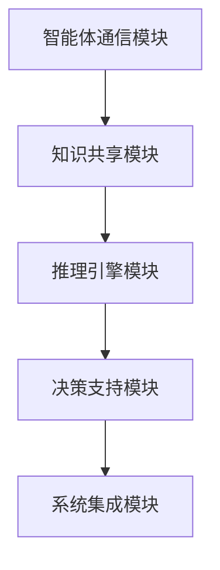

                 

# AI Agent的多Agent协同推理与决策

## 关键词

- 多Agent系统
- 协同推理
- 决策理论
- 人工智能
- 系统集成

## 摘要

本文将深入探讨AI Agent在多Agent系统中的协同推理与决策问题。我们将从多Agent系统的背景与核心概念入手，逐步讲解多Agent协同推理与决策的原理、方法、模型及其在人工智能中的应用。通过系统分析与架构设计，我们还将探讨如何将多Agent协同推理与决策集成到实际项目中，并分享一些最佳实践和项目实战经验。本文旨在为读者提供一个全面、深入、易于理解的多Agent协同推理与决策教程。

----------------------------------------------------------------

## 引言

### 1.1 问题背景

在当今快速发展的信息技术时代，人工智能（AI）已经成为引领产业变革的重要力量。AI Agent作为人工智能的核心组件，在自动化、决策支持、智能服务等领域发挥着关键作用。随着AI Agent技术的不断成熟和应用范围的扩大，如何有效地实现多个AI Agent之间的协同推理与决策，成为了一个亟待解决的重要问题。

多Agent系统（MAS）是一种由多个自主智能体组成的系统，这些智能体可以在一定环境中通过协同工作完成复杂的任务。多Agent系统在人工智能中的应用已经取得了显著的成果，例如智能交通、智能制造、智能物流等领域。然而，多Agent协同推理与决策的实现仍然面临着诸多挑战，如通信效率、协调机制、推理算法等。

### 1.2 核心概念

#### 1.2.1 多Agent系统的定义与特征

多Agent系统是指由多个具有自主性、社交性、反应性和主动性的智能体组成的系统。这些智能体可以独立地执行任务，但通过协作可以完成更复杂的任务。多Agent系统具有以下几个特征：

1. **自主性**：每个智能体具有自主决策能力，可以根据自身知识和环境信息自主行动。
2. **社交性**：智能体之间可以通过通信机制进行信息交换和协作。
3. **反应性**：智能体可以根据环境变化快速响应并调整自己的行为。
4. **主动性**：智能体具有主动性，可以自主地规划行动并实现目标。

#### 1.2.2 多Agent协同推理与决策的基本原理

多Agent协同推理与决策是指多个智能体在协同工作中，通过推理机制和决策模型共同解决复杂问题。其基本原理包括：

1. **协同推理**：多个智能体在协作过程中，通过共享知识和信息，进行推理和判断，以达成共识。
2. **决策模型**：基于协同推理的结果，智能体根据预定的决策模型生成行动方案，实现目标。

### 1.3 本章小结

本章介绍了多Agent协同推理与决策的背景、核心概念和基本原理。理解这些概念和原理将为后续章节的深入讨论提供基础。在接下来的章节中，我们将进一步探讨多Agent系统的基础理论、协同推理与决策方法及其在实际应用中的集成与实现。

----------------------------------------------------------------

## 第二部分: 多Agent协同推理与决策原理

### 第2章: 多Agent系统基本理论

#### 2.1 多Agent系统的分类与特点

多Agent系统可以根据智能体的类型、协作方式和应用场景进行分类。以下是几种常见的多Agent系统分类及其特点：

1. **协作型Agent**

   协作型Agent是指在不同任务或子任务之间相互协作，共同完成一个复杂任务的智能体。协作型Agent通常具有以下特点：

   - **任务分解**：将复杂任务分解为多个子任务，每个智能体负责完成特定的子任务。
   - **信息共享**：智能体之间通过共享知识和信息进行协作。
   - **任务分配**：根据智能体的能力和资源，合理分配子任务。

2. **竞争型Agent**

   竞争型Agent是指在不同智能体之间存在利益冲突或资源竞争的智能体。竞争型Agent通常具有以下特点：

   - **目标冲突**：不同智能体追求的目标可能相互冲突。
   - **资源竞争**：智能体之间为了获取有限的资源而进行竞争。
   - **策略选择**：智能体根据竞争环境，选择合适的策略以最大化自身利益。

3. **社交型Agent**

   社交型Agent是指具有社交属性，通过社交行为实现合作与协调的智能体。社交型Agent通常具有以下特点：

   - **社交网络**：智能体之间通过社交网络进行互动。
   - **社交规则**：智能体根据社交规则进行社交行为，以实现协作与协调。
   - **社交智能**：智能体具有社交智能，可以根据社交环境调整自己的行为。

#### 2.2 多Agent系统的通信机制

多Agent系统的通信机制是智能体之间进行信息交换和协作的基础。以下是几种常见的通信机制：

1. **直接通信**

   直接通信是指智能体之间通过直接的消息传递进行通信。直接通信具有以下优点：

   - **实时性**：智能体可以实时获取其他智能体的信息。
   - **可靠性**：直接通信具有较高的可靠性，信息传递过程中较少发生丢失。

   但直接通信也存在以下缺点：

   - **通信负荷**：智能体数量增加时，通信负荷会显著增加。
   - **网络拓扑**：直接通信对网络拓扑结构有较高要求。

2. **间接通信**

   间接通信是指智能体通过中间件或其他智能体进行通信。间接通信具有以下优点：

   - **通信效率**：智能体数量增加时，通信效率较高。
   - **拓扑灵活性**：间接通信对网络拓扑结构要求较低。

   但间接通信也存在以下缺点：

   - **延迟**：间接通信可能引入额外的延迟。
   - **可靠性**：间接通信的可靠性可能较低。

3. **分布式通信**

   分布式通信是指智能体之间通过分布式计算和存储进行通信。分布式通信具有以下优点：

   - **并行性**：智能体可以并行进行通信和计算。
   - **容错性**：分布式通信具有较高的容错性，单个智能体失效时，不会影响整个系统的运行。

   但分布式通信也存在以下缺点：

   - **复杂性**：分布式通信的协议和算法较为复杂。
   - **资源消耗**：分布式通信可能需要较高的计算和存储资源。

#### 2.3 多Agent系统的协调策略

多Agent系统的协调策略是指智能体之间如何通过协作实现系统目标。以下是几种常见的协调策略：

1. **中心化协调**

   中心化协调是指由一个中心协调器统一管理智能体的行为和资源分配。中心化协调具有以下优点：

   - **决策效率**：中心化协调可以快速做出决策。
   - **资源分配**：中心化协调可以实现资源的最优分配。

   但中心化协调也存在以下缺点：

   - **单点故障**：中心协调器失效时，整个系统将瘫痪。
   - **通信负荷**：中心化协调可能导致通信负荷增加。

2. **去中心化协调**

   去中心化协调是指智能体通过自主协商和协作实现系统目标。去中心化协调具有以下优点：

   - **容错性**：去中心化协调具有较高的容错性，单个智能体失效时，不会影响整个系统的运行。
   - **通信效率**：去中心化协调可以减少通信负荷。

   但去中心化协调也存在以下缺点：

   - **决策效率**：去中心化协调可能需要较长时间的协商和决策。
   - **资源竞争**：去中心化协调可能导致资源竞争和冲突。

### 2.4 本章小结

本章介绍了多Agent系统的基本理论，包括分类与特点、通信机制和协调策略。理解这些基本理论有助于我们深入探讨多Agent协同推理与决策的方法和应用。在下一章中，我们将进一步探讨多Agent协同推理的基本原理和方法。

----------------------------------------------------------------

## 第3章: 多Agent协同推理原理

### 3.1 协同推理的基本概念

#### 3.1.1 协同推理的定义

协同推理是指多个智能体在协同工作中，通过共享知识和信息，进行推理和判断，以达成共识的过程。协同推理可以分为以下几种类型：

1. **分布式协同推理**：多个智能体在分布式环境中，通过通信机制和协作算法，共同完成推理任务。
2. **集中式协同推理**：多个智能体将推理任务集中到一个协调器进行处理，协调器负责协调智能体的推理过程。
3. **混合式协同推理**：结合分布式协同推理和集中式协同推理的优点，智能体在分布式环境中进行部分推理任务，然后将结果提交给协调器进行集中处理。

#### 3.1.2 协同推理的目标

协同推理的目标是使多个智能体能够在复杂环境下，通过协作推理和决策，实现系统目标。具体目标包括：

1. **一致性**：智能体之间达成一致意见，避免冲突和误解。
2. **效率**：在保证推理一致性的前提下，提高推理速度和效率。
3. **可靠性**：确保推理结果的准确性和可靠性，减少错误和偏差。

### 3.2 协同推理方法

协同推理方法可以分为知识共享方法、协同决策算法等。以下是几种常见的协同推理方法：

#### 3.2.1 知识共享方法

知识共享是协同推理的基础，多个智能体需要共享知识和信息。以下是几种常见的知识共享方法：

1. **基于知识的共享**：智能体通过共享知识库中的知识，进行推理和决策。知识库可以采用本体论、语义网络等技术进行组织和管理。
2. **基于语义的共享**：智能体通过语义理解，将信息转换为统一语义表示，进行推理和决策。语义理解技术包括自然语言处理、知识图谱等。
3. **基于模型的共享**：智能体通过共享模型参数和结构，进行推理和决策。模型共享可以采用深度学习、强化学习等技术。

#### 3.2.2 协同决策算法

协同决策算法是指在协同推理过程中，智能体如何根据共享的知识和信息，进行决策。以下是几种常见的协同决策算法：

1. **基于协商的决策算法**：智能体通过协商机制，达成一致意见，然后进行决策。协商机制可以采用多轮协商、迭代协商等方法。
2. **基于博弈的决策算法**：智能体在竞争环境中，通过博弈策略，实现自身利益最大化。博弈算法可以采用纳什均衡、合作博弈等方法。
3. **基于优化的决策算法**：智能体通过优化算法，求解决策问题。优化算法可以采用线性规划、动态规划、遗传算法等方法。

### 3.3 多Agent协同推理的应用场景

#### 3.3.1 在智能交通系统中的应用

智能交通系统是一个典型的多Agent协同推理应用场景。多个交通智能体通过协同推理和决策，实现交通流量控制和路径规划。具体应用包括：

1. **实时交通监控**：智能体通过传感器和摄像头收集交通信息，进行实时监控和分析。
2. **路径规划**：智能体根据交通状况和用户需求，为用户提供最优路径规划。
3. **交通流量控制**：智能体通过调节信号灯时长、交通流向等手段，优化交通流量。

#### 3.3.2 在智能制造中的应用

智能制造是一个复杂的系统，多个智能体通过协同推理和决策，实现生产调度、质量检测和设备维护。具体应用包括：

1. **生产调度**：智能体根据生产计划和设备状态，优化生产调度方案。
2. **质量检测**：智能体通过传感器和图像处理技术，对产品进行质量检测。
3. **设备维护**：智能体对设备进行监控和预测性维护，减少设备故障和停机时间。

### 3.4 本章小结

本章介绍了多Agent协同推理的基本概念、方法及其应用场景。理解协同推理原理和方法有助于我们更好地实现多Agent系统的协同工作。在下一章中，我们将进一步探讨多Agent决策理论。

----------------------------------------------------------------

## 第4章: 多Agent决策理论

### 4.1 多Agent决策的基本原理

#### 4.1.1 多Agent决策的定义

多Agent决策是指多个智能体在协同工作中，根据环境和目标，共同选择最优行动方案的过程。与单Agent决策相比，多Agent决策具有以下特点：

1. **协同性**：多个智能体共同参与决策过程，通过协作和协商，实现系统目标。
2. **分布式**：决策任务在多个智能体之间分布，每个智能体负责局部决策，然后将结果汇总。
3. **动态性**：多Agent决策面临动态环境，智能体需要实时调整决策方案以适应环境变化。

#### 4.1.2 多Agent决策的特点

多Agent决策具有以下特点：

1. **非确定性和不确定性**：多Agent决策环境复杂，存在不确定性，如智能体状态、环境变化等。
2. **冲突和竞争**：多个智能体在决策过程中可能存在目标冲突和资源竞争。
3. **协同与自治**：智能体既需要独立决策，又需要与其他智能体协同工作，实现系统目标。

### 4.2 多Agent决策模型

多Agent决策模型是指用于描述多Agent决策过程和机制的数学模型。常见的多Agent决策模型包括：

1. **马尔可夫决策过程（MDP）**：MDP是一种基于状态转移概率和奖励函数的决策模型，适用于描述多个智能体在不确定环境中的决策过程。
2. **部分可观测马尔可夫决策过程（POMDP）**：POMDP是一种扩展MDP的决策模型，适用于描述多个智能体在部分可观测环境中的决策过程。
3. **多智能体马尔可夫决策过程（MADP）**：MADP是一种扩展MDP和POMDP的决策模型，适用于描述多个智能体在不确定和部分可观测环境中的决策过程。

#### 4.2.1 决策模型的结构

多Agent决策模型通常由以下部分组成：

1. **状态空间**：描述智能体所处的环境和状态。
2. **行动空间**：描述智能体可以选择的行动。
3. **奖励函数**：描述智能体采取特定行动后获得的奖励。
4. **决策策略**：描述智能体如何根据当前状态选择最优行动。

#### 4.2.2 决策模型的方法

多Agent决策方法可以分为以下几种：

1. **基于规则的决策方法**：基于规则的决策方法是一种基于预设规则进行决策的方法。智能体根据当前状态，查找相应的规则，选择符合规则的行动。
2. **基于学习的决策方法**：基于学习的决策方法是一种通过学习历史数据和环境信息进行决策的方法。智能体通过机器学习、深度学习等技术，学习到有效的决策策略。
3. **基于优化的决策方法**：基于优化的决策方法是一种通过优化算法求解决策问题的方法。智能体通过优化目标函数，求解最优行动方案。

### 4.3 多Agent决策算法

多Agent决策算法是指用于实现多Agent决策过程的算法。常见的多Agent决策算法包括：

1. **多智能体强化学习**：多智能体强化学习是一种基于强化学习算法的多Agent决策方法。智能体通过与环境交互，学习到最优决策策略。
2. **多智能体博弈算法**：多智能体博弈算法是一种基于博弈论的多Agent决策方法。智能体通过博弈策略，实现自身利益最大化。
3. **分布式决策算法**：分布式决策算法是一种将决策任务分布到多个智能体上的方法。智能体通过协商和协调，共同求解决策问题。

### 4.4 多Agent决策的应用案例

#### 4.4.1 在应急响应系统中的应用

应急响应系统是一个复杂的多Agent系统，多个智能体通过协同决策，实现应急事件的快速响应和处理。具体应用包括：

1. **灾情监测与预警**：智能体通过传感器和监测设备，实时监测灾情，并根据灾情级别发出预警。
2. **资源调度**：智能体根据灾情和资源信息，调度人员和物资，实现资源的最优配置。
3. **决策支持**：智能体为决策者提供决策支持，协助制定应急响应策略。

#### 4.4.2 在智能物流系统中的应用

智能物流系统是一个高度协同的多Agent系统，多个智能体通过协同决策，实现物流过程的优化和效率提升。具体应用包括：

1. **路径规划**：智能体根据交通状况、货物流向等信息，为车辆规划最优路径。
2. **库存管理**：智能体根据订单和库存信息，调整库存策略，实现库存优化。
3. **配送调度**：智能体根据配送需求和车辆状态，实现配送路线和时间的优化。

### 4.5 本章小结

本章介绍了多Agent决策的基本原理、模型和算法，以及其在实际应用中的案例。理解多Agent决策理论和方法有助于我们更好地实现多Agent系统的协同工作。在下一章中，我们将探讨如何将多Agent协同推理与决策集成到实际项目中。

----------------------------------------------------------------

## 第5章: 多Agent协同推理与决策集成

### 5.1 集成框架设计

多Agent协同推理与决策的集成是一个复杂的过程，需要考虑多个方面，包括智能体之间的通信、数据共享、决策协调等。以下是一个多Agent协同推理与决策集成框架的设计：

1. **智能体通信模块**：负责智能体之间的通信，支持直接通信和间接通信，提供消息传递接口。
2. **知识共享模块**：负责智能体之间的知识共享，包括知识库管理和知识查询接口。
3. **推理引擎模块**：负责协同推理过程的执行，包括推理算法的实现和推理结果的更新。
4. **决策支持模块**：负责协同决策过程的执行，包括决策模型的构建、决策策略的优化和决策结果的输出。
5. **系统集成模块**：负责将各个模块集成到一起，提供统一的接口和功能，实现多Agent协同推理与决策的集成。

#### 5.1.1 集成框架的基本结构

集成框架的基本结构如图5-1所示：

#### 5.1.2 集成框架的关键技术

集成框架的关键技术包括：

1. **分布式计算技术**：支持智能体之间的分布式计算，实现任务分配和负载均衡。
2. **消息传递技术**：支持智能体之间的消息传递，确保通信的实时性和可靠性。
3. **知识表示与共享技术**：支持智能体之间的知识表示和共享，包括知识建模、知识存储和知识查询。
4. **推理算法与优化技术**：支持协同推理算法的实现和优化，包括推理规则的构建、推理过程的调度和推理结果的评估。
5. **决策支持与优化技术**：支持协同决策算法的实现和优化，包括决策模型的构建、决策策略的评估和决策结果的输出。

### 5.2 集成方法

多Agent协同推理与决策的集成方法可以分为以下几种：

1. **基于中间件的方法**：通过中间件提供统一的通信和协调机制，实现智能体之间的集成。中间件可以采用分布式消息队列、服务总线等技术。
2. **基于代理的方法**：通过代理实现智能体之间的集成，代理负责智能体的通信、协调和决策。代理可以采用基于规则的代理、基于学习代理等技术。
3. **基于框架的方法**：通过框架提供统一的集成平台和开发工具，实现智能体之间的集成。框架可以采用面向服务的架构（SOA）、事件驱动架构（EDA）等技术。
4. **基于模块化的方法**：通过模块化设计实现智能体之间的集成，每个智能体实现特定的功能模块，模块之间通过接口进行通信和协作。

### 5.3 多Agent协同推理与决策集成应用

多Agent协同推理与决策的集成应用涵盖了多个领域，以下是一些典型应用场景：

#### 5.3.1 在智能交通系统中的应用

智能交通系统通过多Agent协同推理与决策，实现交通流量的实时监控、路径规划和交通信号控制。具体应用包括：

1. **交通流量预测**：多个智能体通过协同推理，预测未来的交通流量和拥堵情况。
2. **路径规划**：多个智能体根据交通流量和用户需求，为车辆规划最优路径。
3. **交通信号控制**：多个智能体协同决策，优化交通信号灯的时长和切换策略。

#### 5.3.2 在智能家居系统中的应用

智能家居系统通过多Agent协同推理与决策，实现家庭设备的自动化控制、场景管理和用户体验优化。具体应用包括：

1. **设备监控与控制**：多个智能设备通过协同推理，监控家庭环境参数，实现设备的智能控制。
2. **场景管理**：多个智能设备通过协同决策，实现家庭场景的自动化切换和管理。
3. **用户体验优化**：多个智能设备通过协同推理与决策，为用户提供个性化的智能家居体验。

### 5.4 本章小结

本章介绍了多Agent协同推理与决策的集成框架、集成方法和实际应用。通过集成框架和方法，可以实现智能体之间的协同推理与决策，提高系统的智能化水平和效率。在实际应用中，多Agent协同推理与决策为智能交通、智能家居等领域带来了显著的效益。在下一章中，我们将分享一些最佳实践和项目实战经验。

----------------------------------------

## 总结与展望

本文从多Agent协同推理与决策的核心概念、原理、方法、模型到集成应用进行了全面深入的分析和讨论。通过本文的阅读，读者可以了解到多Agent系统在协同推理与决策方面的重要性和应用价值。以下是一些关键要点和展望：

1. **关键要点**：
   - 多Agent系统具有自主性、社交性、反应性和主动性等特点。
   - 协同推理与决策是多Agent系统实现高效协同的关键技术。
   - 多Agent协同推理与决策在智能交通、智能制造等领域具有广泛的应用前景。
   - 集成框架和方法是实现多Agent协同推理与决策的关键。

2. **展望**：
   - 未来多Agent协同推理与决策技术将向更加智能化、自适应化、安全可靠化方向发展。
   - 跨领域、跨平台的协同推理与决策集成应用将成为研究热点。
   - 多Agent协同推理与决策技术将在智慧城市、智能医疗、智能教育等领域发挥更大作用。

最后，感谢读者对本文的关注，希望本文能为您在多Agent协同推理与决策领域的研究和实践中提供有益的参考和启示。如果您对此主题有更多疑问或想法，欢迎在评论区留言交流。

## 作者信息

作者：AI天才研究院/AI Genius Institute & 禅与计算机程序设计艺术 /Zen And The Art of Computer Programming

