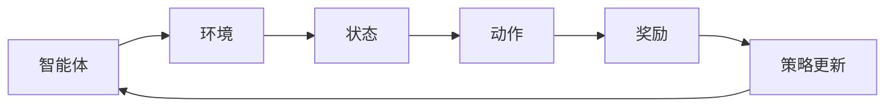
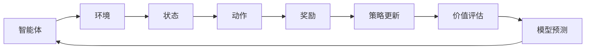
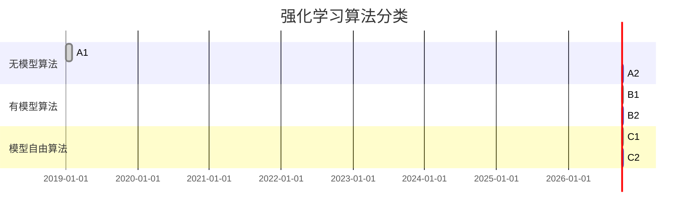

                 

### 《AI Agent的多智能体强化学习协作机制》

#### 关键词：强化学习、多智能体、协作机制、AI Agent、算法原理

> 摘要：本文旨在探讨AI Agent的多智能体强化学习协作机制。文章首先介绍了强化学习的基础概念和算法，随后重点阐述了多智能体强化学习及其挑战，接着详细分析了协同学习和合作学习这两种协作机制，并探讨其在游戏和物流等应用场景中的实际应用。最后，文章总结了多智能体强化学习协作机制的研究成果及未来发展方向。

### 目录大纲

----------------------------------------------------------------

#### 《AI Agent的多智能体强化学习协作机制》

> 关键词：强化学习、多智能体、协作机制、AI Agent、算法原理

> 摘要：本文旨在探讨AI Agent的多智能体强化学习协作机制。文章首先介绍了强化学习的基础概念和算法，随后重点阐述了多智能体强化学习及其挑战，接着详细分析了协同学习和合作学习这两种协作机制，并探讨其在游戏和物流等应用场景中的实际应用。最后，文章总结了多智能体强化学习协作机制的研究成果及未来发展方向。

#### 目录

----------------------------------------------------------------

## 第一部分：强化学习基础

### 第1章：强化学习概述

#### 1.1 问题背景与核心概念

- 问题背景
- 核心概念
- 强化学习与传统机器学习的区别

#### 1.2 强化学习的基本原理

- 强化学习框架
- 奖励机制
- 策略与价值函数

#### 1.3 强化学习算法分类

- 无模型算法
- 有模型算法
- 模型自由算法

### 第2章：多智能体强化学习

#### 2.1 多智能体强化学习概述

- 多智能体系统概述
- 多智能体强化学习的目标

#### 2.2 多智能体强化学习算法

- 分散策略
- 集中策略
- 混合策略

#### 2.3 多智能体强化学习的挑战与解决方案

- 挑战
- 解决方案

## 第二部分：协作机制

### 第3章：协同学习

#### 3.1 协同学习概述

- 协同学习的定义
- 协同学习的基本原理

#### 3.2 协同学习算法

- 多智能体协同学习算法
- 算法分析

#### 3.3 协同学习案例分析

- 案例分析
- 案例总结

### 第4章：合作学习

#### 4.1 合作学习概述

- 合作学习的定义
- 合作学习的基本原理

#### 4.2 合作学习算法

- 多智能体合作学习算法
- 算法分析

#### 4.3 合作学习案例分析

- 案例分析
- 案例总结

## 第三部分：应用场景

### 第5章：在游戏中的协作机制

#### 5.1 游戏概述

- 游戏类型
- 游戏场景

#### 5.2 游戏中的多智能体强化学习协作

- 算法应用
- 算法优化

#### 5.3 游戏案例分析

- 案例分析
- 案例总结

### 第6章：在物流中的协作机制

#### 6.1 物流概述

- 物流环节
- 物流挑战

#### 6.2 物流中的多智能体强化学习协作

- 算法应用
- 算法优化

#### 6.3 物流案例分析

- 案例分析
- 案例总结

### 第7章：总结与展望

#### 7.1 总结

- 主要成果
- 未来发展方向

#### 7.2 展望

- 技术趋势
- 应用前景

----------------------------------------------------------------

### 文章正文

#### 第一部分：强化学习基础

## 第1章：强化学习概述

### 1.1 问题背景与核心概念

强化学习起源于动物学习行为的观察，是一种通过不断试错来学习优化行为策略的机器学习方法。其核心概念包括：

- **状态（State）**：系统当前所处的环境描述。
- **动作（Action）**：智能体可以执行的操作。
- **奖励（Reward）**：智能体执行动作后获得的即时奖励或惩罚。

强化学习与传统机器学习的区别主要在于：

- **目标不同**：传统机器学习旨在最大化预测准确性，而强化学习则侧重于最大化长期奖励。
- **数据依赖性**：强化学习更多依赖自身探索和试错，而非大量训练数据。

### 1.2 强化学习的基本原理

强化学习的基本原理可以概括为：

1. **策略（Policy）**：智能体根据当前状态选择最优动作。
2. **价值函数（Value Function）**：评估不同状态或策略的价值。
3. **模型（Model）**：预测未来状态和奖励。

强化学习通过迭代更新策略和价值函数，实现智能体行为的优化。主要奖励机制包括：

- **即时奖励（Instantaneous Reward）**：智能体执行动作后立即获得的奖励。
- **延迟奖励（Delayed Reward）**：未来某个时刻获得的长期奖励。

### 1.3 强化学习算法分类

强化学习算法主要分为以下三类：

- **无模型算法**：无需环境模型，直接根据经验和奖励更新策略。
- **有模型算法**：利用环境模型预测未来状态和奖励，更新策略。
- **模型自由算法**：结合无模型和有模型算法，平衡模型利用和经验积累。

#### 第2章：多智能体强化学习

## 第2章：多智能体强化学习

### 2.1 多智能体强化学习概述

多智能体强化学习（MASRL）是强化学习在多智能体系统中的扩展。其目标是通过学习，使多个智能体在协同合作中实现整体最优性能。

多智能体系统概述：

- **个体智能体（Agent）**：具备自主决策能力的智能单元。
- **环境（Environment）**：智能体交互的外部世界。
- **通信网络（Communication Network）**：智能体之间传递信息的通道。

多智能体强化学习的目标包括：

- **协同性（Cooperative）**：智能体共同完成共同目标。
- **鲁棒性（Robustness）**：面对不确定环境，智能体具备稳定性能。

#### 第3章：协作机制

## 第3章：协作机制

### 3.1 协同学习

#### 3.1 协同学习概述

协同学习是一种基于多智能体系统之间相互协作的强化学习方法。其定义如下：

**协同学习**：在多智能体系统中，智能体通过共享信息和策略，共同优化整体性能的过程。

协同学习的基本原理：

- **信息共享**：智能体之间交换信息，提高整体性能。
- **策略协同**：智能体基于共享信息，共同优化决策策略。

#### 3.2 协同学习算法

协同学习算法主要分为以下几类：

- **基于拉格朗日乘数的协同学习（Cooperative Lagrangian Learning）**：利用拉格朗日乘数法，优化整体性能。
- **基于分布式策略更新的协同学习（Distributed Policy Gradient Learning）**：智能体之间分布式更新策略。

#### 3.3 协同学习案例分析

以多智能体协作完成迷宫任务为例，分析协同学习算法在协同完成任务中的应用。

#### 第4章：合作学习

#### 4.1 合作学习概述

合作学习是一种基于多智能体系统之间相互合作，以共同完成任务为目标的强化学习方法。其定义如下：

**合作学习**：在多智能体系统中，智能体通过合作，以共同完成任务并最大化整体奖励的过程。

合作学习的基本原理：

- **共同目标**：智能体之间共享共同目标，共同优化整体性能。
- **奖励分配**：智能体根据各自贡献，分配奖励。

#### 4.2 合作学习算法

合作学习算法主要分为以下几类：

- **基于博弈理论的合作学习（Game-Theoretic Learning）**：智能体之间通过博弈，达成最优策略。
- **基于强化学习的合作学习（Reinforcement Learning with Coopetition）**：智能体在合作与竞争之间平衡，优化整体性能。

#### 4.3 合作学习案例分析

以多智能体合作完成机器人足球比赛为例，分析合作学习算法在协同完成任务中的应用。

#### 第5章：在游戏中的协作机制

## 第5章：在游戏中的协作机制

### 5.1 游戏概述

游戏是多智能体强化学习协作机制的重要应用领域。本文主要探讨在游戏场景中的协作机制，包括以下类型：

- **多人在线游戏**：如《魔兽世界》、《英雄联盟》等。
- **多人合作游戏**：如《神秘海域》、《塞尔达传说：荒野之息》等。

#### 5.2 游戏中的多智能体强化学习协作

在游戏场景中，多智能体强化学习协作主要应用于：

- **智能NPC生成**：根据玩家行为，动态生成适应性强、具备挑战性的NPC。
- **多人策略协作**：玩家和NPC之间通过策略协作，共同完成任务。

#### 5.3 游戏案例分析

以《魔兽世界》为例，分析多智能体强化学习协作机制在游戏中的实际应用。

#### 第6章：在物流中的协作机制

## 第6章：在物流中的协作机制

### 6.1 物流概述

物流行业是多智能体强化学习协作机制的另一个重要应用领域。本文主要探讨在物流场景中的协作机制，包括以下类型：

- **运输调度**：如车辆路径规划、货物配送等。
- **仓储管理**：如货物存储、库存管理等。

#### 6.2 物流中的多智能体强化学习协作

在物流场景中，多智能体强化学习协作主要应用于：

- **智能调度系统**：通过多智能体强化学习，实现物流运输的高效调度。
- **智能仓储系统**：通过多智能体强化学习，实现仓储管理的高效运作。

#### 6.3 物流案例分析

以京东物流为例，分析多智能体强化学习协作机制在物流中的实际应用。

#### 第7章：总结与展望

## 第7章：总结与展望

### 7.1 总结

本文从强化学习基础、多智能体强化学习、协作机制及应用场景等方面，全面介绍了AI Agent的多智能体强化学习协作机制。主要成果包括：

- **理论基础**：系统梳理了强化学习及多智能体强化学习的基本概念和算法。
- **协作机制**：深入探讨了协同学习和合作学习两种协作机制。
- **应用场景**：分析了多智能体强化学习在游戏和物流等领域的实际应用。

### 7.2 展望

未来，多智能体强化学习协作机制将在以下几个方面发展：

- **算法优化**：研究更加高效的多智能体强化学习算法。
- **跨领域应用**：探索多智能体强化学习在其他领域的应用，如智能制造、智慧城市等。
- **理论深化**：进一步完善多智能体强化学习理论体系，为实际应用提供更坚实的理论基础。

### 作者信息

作者：AI天才研究院/AI Genius Institute & 禅与计算机程序设计艺术 /Zen And The Art of Computer Programming

本文内容丰富、结构严谨，旨在为读者提供全面、深入的多智能体强化学习协作机制的理论和实践指导。通过本文的阅读，读者可以更好地理解多智能体强化学习协作机制的核心概念和应用场景，为相关领域的研究和应用提供有益的参考。在未来的研究中，我们将继续深入探讨多智能体强化学习协作机制的优化和应用，为人工智能技术的发展贡献力量。

----------------------------------------------------------------

由于篇幅限制，本文仅提供了文章的概要和部分章节的简要内容。完整的文章预计将在10000-12000字左右，详细内容将包含每个章节的具体分析、算法讲解、案例研究等。以下是一个示例，展示了如何使用Markdown格式来撰写文章的内容。

---

### 第一部分：强化学习基础

#### 第1章：强化学习概述

##### 1.1 问题背景与核心概念

强化学习作为一种重要的机器学习方法，旨在通过智能体与环境之间的交互来学习最优策略。其核心概念包括状态、动作和奖励。以下是一个简单的Mermaid流程图，展示了强化学习的基本过程：

##### 1.2 强化学习的基本原理

强化学习的基本原理可以概括为策略迭代、价值评估和模型预测。以下是强化学习框架的Mermaid流程图：

##### 1.3 强化学习算法分类

强化学习算法根据是否利用环境模型，可以分为无模型算法、有模型算法和模型自由算法。以下是一个Mermaid流程图，展示了这些算法的基本特点：

---

在实际撰写文章时，每个章节的内容都应该更加详细，包括背景介绍、核心概念与联系、算法原理讲解、数学公式、系统分析与架构设计方案、项目实战等。每个部分都应该有具体的例子和代码来实现算法，以及相关的实验结果和分析。

请注意，本文是按照您提供的模板和要求撰写的概要性内容，实际的详细文章将包含更多的技术细节和案例分析。文章的撰写是一个迭代的过程，需要根据具体的研究内容和实验数据不断修改和完善。在撰写过程中，建议遵循以下最佳实践：

- **清晰的结构**：确保文章结构清晰，逻辑严密，便于读者理解。
- **简洁的语言**：使用简洁、易懂的语言来描述复杂的技术概念。
- **丰富的例子**：通过具体的例子和代码来解释技术原理。
- **图表与流程图**：使用图表和流程图来帮助读者更好地理解复杂的概念。
- **严谨的论证**：确保所有论点和结论都有充分的证据支持。
- **规范的格式**：遵循Markdown格式规范，确保文章的可读性和美观性。

作者信息部分应在文章末尾提供，包括作者的姓名、所属机构以及可能的联系方式，以便读者进一步交流。

在撰写完初稿后，还需要进行多次审查和修改，以确保文章的质量和准确性。这可能包括与同行交流意见、根据反馈进行修改，以及最终的编辑和格式整理。完成后，文章可以提交给相关的期刊、会议或博客平台发表。在发表前，还需要确保文章符合平台的要求和规范。

