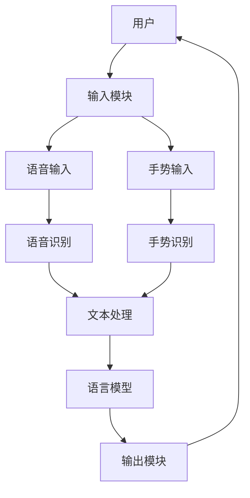

                 

# AI Agent的多模态交互：整合LLM与语音、手势识别

> 关键词：AI Agent、多模态交互、LLM、语音识别、手势识别

> 摘要：本文将深入探讨AI Agent的多模态交互机制，特别是如何整合大型语言模型（LLM）与语音识别和手势识别技术。通过详细分析每种技术的原理、设计策略及其在实际应用中的整合方法，本文旨在为开发者和研究人员提供一个全面的技术指南，以构建更智能、更灵活的AI Agent系统。

## 引言

随着人工智能（AI）技术的迅猛发展，AI Agent已经成为智能化应用的核心组成部分。AI Agent是一种能够模拟人类行为和思维的智能体，能够在复杂环境中自主执行任务，并与其他系统和用户进行交互。而多模态交互作为AI Agent的一个重要特性，使得它们能够通过多种感官渠道接收和发送信息，从而提高交互的自然性和效率。

### 1.1 AI Agent与多模态交互

AI Agent的定义与分类：
- **定义**：AI Agent是具有智能决策能力的软件实体，能够在复杂环境中自主执行任务并与其他系统或用户交互。
- **分类**：根据任务类型和交互方式，AI Agent可以分为任务型代理（如智能客服）、社交型代理（如虚拟助手）和探索型代理（如无人驾驶车辆）等。

多模态交互的定义与重要性：
- **定义**：多模态交互是指AI Agent通过多种感官渠道（如视觉、听觉、触觉）与用户或其他系统进行信息交换的过程。
- **重要性**：多模态交互能够提高AI Agent的自然交互能力，使用户体验更加流畅和自然，同时也有助于提高系统的理解和响应能力。

### 1.2 整合LLM与语音、手势识别

整合大型语言模型（LLM）：
- **背景**：LLM是一种能够处理和生成自然语言文本的复杂模型，其强大的语言理解和生成能力为AI Agent提供了丰富的知识处理能力。
- **优势**：LLM能够处理复杂的语言结构和语义信息，使AI Agent能够更准确地理解用户的指令和需求，并生成自然流畅的回应。

语音识别与手势识别：
- **语音识别**：语音识别技术使AI Agent能够通过听觉渠道接收用户的口头指令，从而实现语音控制。
- **手势识别**：手势识别技术使AI Agent能够通过视觉渠道理解和响应用户的手势动作，从而实现手势控制。

### 1.3 本书概述

本书将分为以下几个主要部分：
1. **基础概念**：介绍AI Agent和多模态交互的基本概念，包括定义、分类和基本原理。
2. **LLM整合**：详细探讨如何整合LLM到AI Agent中，包括LLM的原理、架构设计和应用挑战。
3. **语音识别**：分析语音识别的基本原理、技术流程和实现方法。
4. **手势识别**：介绍手势识别的定义、技术方法和应用场景。
5. **多模态交互设计**：探讨如何设计高效的多模态用户界面，结合语音和手势输入，以及输出模态和反馈机制。
6. **实施与案例研究**：提供具体的实施步骤和案例研究，展示如何在实际项目中整合多模态交互。
7. **未来方向与挑战**：讨论多模态交互技术的未来发展趋势和面临的挑战。

## 基础概念

### 2.1 AI Agent的基本概念

**定义与分类**：
AI Agent是一种具备自主决策和执行能力的智能体，能够模拟人类行为和思维。根据任务类型和交互方式，AI Agent可以分为以下几类：
- **任务型代理**：专注于完成特定任务的智能体，如智能客服、智能助手等。
- **社交型代理**：具备与人交互能力的智能体，如虚拟助手、聊天机器人等。
- **探索型代理**：在未知环境中进行自主探索和决策的智能体，如无人驾驶车辆、机器人等。

**AI Agent的工作原理**：
AI Agent通常包括以下几个关键组件：
- **感知模块**：用于接收外部环境的信息，如视觉、听觉、触觉等。
- **决策模块**：基于感知模块的信息，使用机器学习算法和规划策略进行决策。
- **执行模块**：根据决策结果，执行具体的操作或任务。

**AI Agent在多模态交互中的作用**：
多模态交互使AI Agent能够通过多种感官渠道与用户进行交互，从而提高交互的自然性和效率。AI Agent的多模态交互能力包括：
- **语音交互**：通过语音识别技术，接收用户的口头指令。
- **手势交互**：通过手势识别技术，理解用户的手势动作。
- **视觉交互**：通过计算机视觉技术，识别用户的视觉信号。

### 2.2 多模态交互的基本原理

**多模态交互的定义**：
多模态交互是指AI Agent通过多种感官渠道接收和发送信息的过程。常见的感官渠道包括视觉、听觉、触觉等。

**多模态交互的优势**：
- **提高交互自然性**：通过多种感官渠道的交互，用户可以更自然地与AI Agent进行交流。
- **增强理解能力**：多模态交互使AI Agent能够从不同感官渠道获取信息，从而提高对用户意图和需求的理解能力。
- **提高任务效率**：通过多模态交互，用户可以更快速地与AI Agent完成复杂任务。

**多模态交互的实现方法**：
多模态交互的实现主要依赖于以下技术：
- **语音识别**：通过语音识别技术，将用户的口头指令转换为文本或指令。
- **手势识别**：通过计算机视觉技术，识别用户的手势动作。
- **视觉交互**：通过计算机视觉技术，识别用户的视觉信号。

**多模态交互的应用场景**：
多模态交互广泛应用于各种智能应用中，如智能客服、智能助手、虚拟现实（VR）、增强现实（AR）等。

### 2.3 LLM在AI Agent中的应用

**LLM的基本原理**：
LLM（大型语言模型）是一种基于深度学习的技术，能够处理和生成自然语言文本。LLM通过学习大量文本数据，建立对语言结构的理解和预测能力。

**LLM在AI Agent中的应用**：
LLM在AI Agent中主要应用于以下几个方面：
- **语言理解**：LLM能够理解用户的自然语言指令和文本，从而提高AI Agent对用户需求的识别能力。
- **语言生成**：LLM能够生成自然流畅的文本回应，使AI Agent能够以自然的方式与用户进行对话。
- **知识推理**：LLM能够根据上下文信息进行推理，从而提供更准确和相关的回应。

**LLM的优势与挑战**：
优势：
- **强大的语言处理能力**：LLM能够处理复杂的语言结构和语义信息，从而提高AI Agent的交互质量。
- **广泛的应用场景**：LLM可以应用于各种需要自然语言处理的场景，如问答系统、聊天机器人、智能客服等。

挑战：
- **计算资源消耗**：训练和部署LLM需要大量的计算资源和存储空间。
- **数据隐私和安全**：LLM需要处理大量敏感的用户数据，需要确保数据隐私和安全。

## LLM整合

### 3.1 大型语言模型（LLM）的基本原理

**LLM的定义与分类**：
大型语言模型（LLM）是一种能够处理和生成自然语言文本的复杂模型，其核心是深度神经网络（DNN）。LLM可以分为两类：
- **预训练模型**：通过在大规模语料库上进行预训练，建立对语言结构的理解。
- **微调模型**：在预训练模型的基础上，针对特定任务进行微调，以适应特定应用场景。

**预训练过程**：
预训练过程主要包括以下几个步骤：
1. **数据收集与预处理**：收集大规模的文本数据，并进行清洗、分词、去噪等预处理操作。
2. **词嵌入**：将文本中的每个词转换为固定长度的向量表示。
3. **预训练**：使用神经网络（如Transformer）对词嵌入进行训练，以预测下一个词的概率分布。

**微调过程**：
微调过程是在预训练模型的基础上，针对特定任务进行优化。主要步骤包括：
1. **任务定义**：定义具体的任务，如文本分类、机器翻译、问答系统等。
2. **数据集准备**：准备用于微调的数据集，并进行预处理。
3. **微调训练**：在预训练模型的基础上，使用微调数据集进行训练，以优化模型参数。

### 3.2 LLM的架构设计

**Transformer架构**：
Transformer是一种基于自注意力机制的深度学习模型，广泛应用于LLM。其核心组件包括：
- **编码器（Encoder）**：用于处理输入文本，生成编码表示。
- **解码器（Decoder）**：用于生成输出文本，根据编码表示和上下文信息进行预测。

**自注意力机制（Self-Attention）**：
自注意力机制是一种关键组件，使模型能够关注输入序列中的重要部分。自注意力通过计算每个输入词与所有其他词的相关性得分，从而加权组合输入信息。

**多头注意力（Multi-Head Attention）**：
多头注意力扩展了自注意力机制，通过多个独立的注意力头并行处理输入序列，从而提高模型的表示能力。

**位置编码（Positional Encoding）**：
由于Transformer模型缺乏位置信息，位置编码用于为每个词添加位置信息，以保留文本的顺序。

### 3.3 LLM的优势与挑战

**优势**：
- **强大的语言处理能力**：LLM能够处理复杂的语言结构和语义信息，从而提供更准确和自然的语言生成。
- **广泛的应用场景**：LLM可以应用于各种自然语言处理任务，如文本分类、机器翻译、问答系统等。
- **高效的预训练模型**：预训练模型可以大幅度减少模型训练的时间和计算资源消耗。

**挑战**：
- **计算资源消耗**：训练和部署LLM需要大量的计算资源和存储空间，特别是大型预训练模型。
- **数据隐私和安全**：LLM需要处理大量敏感的用户数据，需要确保数据隐私和安全。
- **模型解释性**：LLM的决策过程复杂，难以解释和理解，这限制了其在某些应用场景中的可靠性。

### 3.4 LLM在AI Agent中的整合方法

**数据预处理**：
在整合LLM到AI Agent之前，需要对输入数据进行预处理。预处理步骤包括：
- **文本清洗**：去除无效字符、停用词和噪声。
- **词嵌入**：将文本转换为固定长度的向量表示。

**输入编码**：
将预处理后的文本输入到LLM的编码器中，生成编码表示。编码表示包含了文本的语义信息，是后续处理的关键输入。

**预测与生成**：
使用解码器对编码表示进行解码，生成文本回应。解码过程可以根据任务需求进行优化，如基于概率分布的解码或基于梯度的解码。

**多模态融合**：
将LLM生成的文本回应与其他模态（如语音、手势）进行融合，以生成完整的多模态交互结果。多模态融合可以通过结合不同模态的权重或特征进行。

### 3.5 实际应用案例

**智能客服**：
智能客服系统通过整合LLM与语音识别和手势识别技术，提供高效的自然语言交互服务。用户可以通过语音或手势与智能客服进行交互，获取所需信息和帮助。

**虚拟助手**：
虚拟助手通过整合LLM与语音识别和手势识别技术，提供个性化的用户服务。虚拟助手可以理解用户的语音指令和手势动作，根据上下文信息提供相关建议和回应。

**智能驾驶**：
智能驾驶系统通过整合LLM与语音识别和手势识别技术，提高驾驶体验和安全性能。驾驶员可以通过语音或手势与车辆进行交互，控制导航、娱乐系统等功能。

## 语音识别

### 4.1 语音识别的基本原理

**语音识别的定义**：
语音识别（Speech Recognition）是一种将人类语音转换为机器可处理文本的技术。它涉及到对语音信号的识别和理解，从而实现语音到文本的转换。

**语音识别的关键技术**：
- **声学模型**：声学模型负责将语音信号转换为声学特征，如Mel频率倒谱系数（MFCC）。
- **语言模型**：语言模型负责理解语音信号所表达的内容，通常使用N-gram模型或神经网络模型。
- **声学-语言模型**：声学-语言模型结合声学模型和语言模型，通过联合训练实现语音识别。

**语音识别的工作流程**：
1. **音频输入**：接收语音信号作为输入。
2. **特征提取**：使用声学模型对语音信号进行预处理，提取声学特征。
3. **声学-语言解码**：使用声学-语言模型对声学特征进行解码，生成可能的文本输出。
4. **结果输出**：根据解码结果，输出识别的文本。

### 4.2 声学模型

**声学模型的基本原理**：
声学模型是一种基于统计模型的语音处理技术，用于将语音信号转换为声学特征。常见的声学模型包括Gaussian Mixture Model（GMM）和Deep Neural Network（DNN）。

**声学模型的工作流程**：
1. **特征提取**：从语音信号中提取短时特征，如MFCC。
2. **模型训练**：使用大量语音数据训练声学模型，使其能够准确地将语音信号映射到特征空间。
3. **特征匹配**：在识别过程中，将输入语音信号的特征与模型训练得到的特征进行匹配，计算相似度。

**声学模型的优化方法**：
- **特征增强**：通过特征增强方法，提高语音信号的识别准确性。
- **端到端模型**：使用端到端模型（如Convolutional Neural Network，CNN）直接从语音信号中提取特征，简化特征提取过程。

### 4.3 语言模型

**语言模型的基本原理**：
语言模型是一种基于统计模型的自然语言处理技术，用于理解语音信号所表达的内容。常见的语言模型包括N-gram模型和神经网络模型。

**语言模型的工作流程**：
1. **上下文建模**：使用语言模型对语音信号进行上下文建模，预测下一个词的概率。
2. **解码策略**：在识别过程中，根据语言模型预测的词序列，选择最可能的文本输出。
3. **语言模型优化**：通过优化语言模型参数，提高识别准确率和语言流畅性。

**语言模型的优化方法**：
- **隐马尔可夫模型（HMM）**：使用HMM对语音信号进行概率建模，提高语言模型的预测准确性。
- **长短时记忆网络（LSTM）**：使用LSTM对长文本序列进行建模，提高语言模型的上下文理解能力。

### 4.4 语音识别的工作流程

**语音识别的工作流程**：

语音识别系统的核心是声学模型和语言模型的协同工作。以下是一个典型的语音识别工作流程：

1. **音频输入**：接收语音信号作为输入。

2. **预处理**：对语音信号进行预处理，包括降噪、分帧和加窗等操作。

3. **特征提取**：使用声学模型对预处理后的语音信号进行特征提取，生成声学特征。

4. **声学-语言解码**：将声学特征输入到声学-语言模型，通过解码策略生成可能的文本输出。

5. **结果输出**：根据解码结果，输出识别的文本。

### 4.5 语音识别的应用案例

**智能语音助手**：
智能语音助手（如Siri、Alexa、Google Assistant）是语音识别技术的典型应用。用户可以通过语音与智能助手进行交互，实现语音搜索、播放音乐、设置提醒等功能。

**实时语音翻译**：
实时语音翻译系统通过语音识别技术，将一种语言的语音实时转换为另一种语言的文本或语音。这种技术在跨语言沟通和国际化应用中具有广泛的应用。

**自动语音应答（IVR）系统**：
自动语音应答系统是语音识别技术在呼叫中心的典型应用。用户通过语音与IVR系统进行交互，获取所需的服务信息或进行业务操作。

**语音识别在车载系统中的应用**：
语音识别技术在车载系统中广泛应用，如语音导航、语音控制娱乐系统、语音拨打电话等功能，提高了驾驶的安全性和便利性。

## 手势识别

### 5.1 手势识别的基本原理

**手势识别的定义**：
手势识别（Gesture Recognition）是一种通过计算机视觉技术理解用户手势的技术。它涉及到从摄像头或传感器捕获的手势图像中提取特征，并使用机器学习算法进行分类和识别。

**手势识别的关键技术**：
- **特征提取**：从手势图像中提取能够描述手势形状和结构的特征，如轮廓、边缘、关键点等。
- **分类算法**：使用机器学习算法对手势特征进行分类，以识别不同的手势。
- **实时处理**：实现手势识别的实时性，以满足实时交互的需求。

**手势识别的工作流程**：
1. **图像捕获**：使用摄像头或传感器捕获用户的手势图像。
2. **预处理**：对捕获的图像进行预处理，包括降噪、缩放、对比度调整等操作。
3. **特征提取**：从预处理后的图像中提取手势特征。
4. **分类识别**：使用机器学习算法对手势特征进行分类和识别，生成手势识别结果。
5. **结果输出**：根据识别结果，进行相应的操作或反馈。

### 5.2 手势识别的技术方法

**深度学习方法**：
深度学习方法在手势识别中具有显著的优势。常用的深度学习模型包括卷积神经网络（CNN）、循环神经网络（RNN）和生成对抗网络（GAN）。

**特征提取方法**：
- **轮廓特征**：通过提取手势轮廓的形状和结构信息，描述手势的特征。
- **边缘特征**：通过提取手势边缘的几何信息，描述手势的特征。
- **关键点特征**：通过提取手势关键点的位置和关系，描述手势的特征。

**多模态融合方法**：
多模态融合是将不同模态的信息进行整合，以提高手势识别的准确性和鲁棒性。常见的多模态融合方法包括特征级融合、决策级融合和模型级融合。

### 5.3 手势识别的应用场景

**虚拟现实（VR）与增强现实（AR）**：
在VR和AR系统中，手势识别技术用于实现用户与虚拟环境的自然交互。用户可以通过手势进行导航、操作虚拟对象和触发特定功能。

**智能家居**：
在智能家居系统中，手势识别技术用于实现用户对家电设备的自然控制，如开关灯光、调节温度等。

**健康监测与康复**：
手势识别技术在健康监测和康复训练中具有广泛的应用。通过手势识别，可以监测患者的康复进度、进行手势交互的康复训练等。

**教育互动**：
在教育互动中，手势识别技术可以用于实现学生与教育内容之间的自然交互，如手势翻页、互动问答等。

### 5.4 实际应用案例

**VR游戏**：
在VR游戏中，手势识别技术用于实现用户与虚拟环境的实时互动。用户可以通过手势进行游戏操作、操纵虚拟对象等。

**智能会议系统**：
智能会议系统通过手势识别技术，实现会议中的自然交互。参会者可以通过手势进行投票、提交意见和互动讨论。

**智能穿戴设备**：
在智能穿戴设备中，手势识别技术用于实现用户与设备之间的自然交互，如通过手势控制音乐播放、接打电话等。

## 多模态交互设计

### 6.1 设计原则

**用户中心设计**：
多模态交互设计应以用户为中心，关注用户体验和需求。设计师需要深入了解用户行为、偏好和交互习惯，以设计出符合用户期望的交互界面。

**一致性**：
多模态交互设计应保持一致的用户体验。无论是语音、手势还是视觉交互，都应该遵循相同的设计原则和交互逻辑，以确保用户能够轻松地适应不同的交互方式。

**反馈与确认**：
在多模态交互中，及时、明确的反馈与确认是提高用户满意度的关键。系统应能够及时响应用户的操作，并通过视觉、语音或触觉等方式提供反馈，以确认操作已被正确执行。

**灵活性**：
多模态交互设计应具有灵活性，允许用户根据个人偏好和环境需求选择不同的交互方式。这种灵活性可以提高系统的可访问性和适应性。

### 6.2 语音与手势输入的整合

**语音输入与手势输入的互补性**：
语音输入和手势输入具有互补性，各自具有独特的优势。语音输入适合快速、流畅的交流，而手势输入则适合精确、细致的操作。通过整合两种输入方式，可以提供更丰富的交互体验。

**协同作用**：
在多模态交互中，语音输入和手势输入可以协同工作，提高系统的交互效率和准确性。例如，用户可以通过语音指令启动某个功能，然后通过手势进行更详细的操作。

**交互模式**：
多模态交互可以采用多种交互模式，如语音优先模式、手势优先模式和混合模式。语音优先模式主要依赖语音输入，而手势优先模式则主要依赖手势输入。混合模式则允许用户在两种输入方式之间自由切换。

### 6.3 输出模态与反馈机制

**输出模态的选择**：
输出模态的选择应考虑用户需求和情境。常见的输出模态包括语音、文本、视觉和触觉。例如，在需要快速获取信息的情况下，语音输出可能是最佳选择；而在需要详细展示信息时，文本和视觉输出可能更合适。

**反馈机制的设计**：
反馈机制是确保用户与系统有效交互的关键。系统应能够提供及时、明确、直观的反馈。反馈可以通过语音、文本、视觉和触觉等多种方式呈现，以满足不同用户的需求。

**反馈质量**：
反馈的质量直接影响用户体验。反馈应清晰、准确、及时，同时应提供足够的上下文信息，帮助用户理解操作结果。

### 6.4 设计工具与技术

**用户研究**：
通过用户研究，设计师可以深入了解用户的需求、偏好和行为模式。用户研究方法包括问卷调查、用户访谈、可用性测试等。

**原型设计**：
原型设计是验证和迭代设计思路的重要步骤。设计师可以使用各种工具，如Sketch、Figma、Adobe XD等，快速构建交互原型，并进行用户测试和反馈。

**用户测试**：
用户测试是评估多模态交互设计有效性的关键步骤。通过用户测试，设计师可以收集用户反馈，发现设计问题，并进行迭代优化。

**数据驱动设计**：
数据驱动设计是现代交互设计的重要方法。通过收集和分析用户交互数据，设计师可以了解用户行为模式，优化交互设计，提高用户体验。

### 6.5 实际案例研究

**智能助手**：
智能助手（如Siri、Alexa、Google Assistant）是多模态交互的典型应用案例。这些智能助手通过语音识别和手势识别技术，提供自然、便捷的用户交互体验。

**智能会议室**：
智能会议室系统通过整合语音、手势和视觉交互技术，实现会议中的自然互动。参会者可以通过语音指令启动会议功能，通过手势进行互动讨论和操作。

**虚拟现实游戏**：
虚拟现实游戏通过多模态交互技术，提供沉浸式的游戏体验。玩家可以通过语音指令进行游戏操作，通过手势进行虚拟环境的互动。

### 6.6 设计挑战与解决方案

**数据隐私与安全**：
多模态交互涉及大量用户数据的收集和处理，需要确保数据隐私和安全。解决方案包括数据加密、匿名化处理和安全审计等。

**跨模态一致性**：
确保不同模态之间的交互一致性是设计挑战之一。解决方案包括设计统一的设计语言和交互规则，以及多模态数据融合技术。

**系统性能与实时性**：
多模态交互对系统的性能和实时性有较高要求。解决方案包括优化算法、分布式计算和实时数据处理技术。

**用户培训与适应**：
用户可能需要时间适应新的多模态交互方式。解决方案包括提供用户指南、交互教程和个性化培训等。

## 实施与案例研究

### 7.1 环境安装与设置

在开始实施AI Agent的多模态交互之前，需要准备合适的环境和工具。以下是具体步骤：

**硬件要求**：
- **处理器**：推荐使用英特尔的Core i7或AMD的Ryzen 7系列以上处理器。
- **内存**：至少16GB RAM。
- **显卡**：推荐使用NVIDIA GTX 1080或以上显卡，以支持深度学习模型的训练和推理。

**软件要求**：
- **操作系统**：推荐使用Linux系统，如Ubuntu 18.04或更高版本。
- **深度学习框架**：TensorFlow 2.x或PyTorch 1.8或更高版本。
- **语音识别库**：如Mozilla DeepSpeech或Google的Speech-to-Text。
- **手势识别库**：如OpenCV 4.5或更高版本。
- **计算机视觉库**：如OpenCV 4.5或更高版本。

**安装步骤**：
1. **安装操作系统**：在计算机上安装Linux操作系统。
2. **安装深度学习框架**：使用pip命令安装TensorFlow或PyTorch。
    ```shell
    pip install tensorflow
    # 或者
    pip install torch torchvision
    ```
3. **安装语音识别库**：使用pip命令安装所需的语音识别库。
    ```shell
    pip install deepspeech
    # 或者
    pip install SpeechRecognition
    ```
4. **安装手势识别库**：使用pip命令安装OpenCV。
    ```shell
    pip install opencv-python
    ```
5. **安装计算机视觉库**：确保OpenCV安装完整。
    ```shell
    pip install opencv-python-headless
    ```

**配置与测试**：
在安装完成后，进行以下测试以确保环境配置正确：
- **测试TensorFlow**：运行以下Python代码测试TensorFlow安装。
    ```python
    import tensorflow as tf
    print(tf.__version__)
    ```
- **测试语音识别库**：运行以下Python代码测试语音识别库。
    ```python
    import speech_recognition as sr
    # 设置语音识别引擎为Google的语音识别服务
    r = sr.Recognizer()
    # 测试语音识别功能
    with sr.Microphone() as source:
        print("请说一句话进行测试：")
        audio = r.listen(source)
        try:
            print("你说的内容是：")
            print(r.recognize_google(audio))
        except sr.UnknownValueError:
            print("无法识别你的语音。")
        except sr.RequestError as e:
            print("请求错误；{0}".format(e))

- **测试手势识别库**：运行以下Python代码测试手势识别库。
    ```python
    import cv2
    # 打开摄像头进行测试
    cap = cv2.VideoCapture(0)
    while True:
        ret, frame = cap.read()
        if not ret:
            break
        # 对图像进行预处理和手势识别
        # （具体实现省略）
        cv2.imshow('Hand Gesture Recognition', frame)
        if cv2.waitKey(1) & 0xFF == ord('q'):
            break
    cap.release()
    cv2.destroyAllWindows()
    ```

### 7.2 系统核心实现

在环境安装和测试完成后，接下来是系统核心实现部分。以下是具体步骤：

**数据准备**：
1. **语音数据集**：收集或下载一个包含多种语音命令的数据集，如Common Voice。
2. **手势数据集**：收集或下载一个包含多种手势图像的数据集，如OpenPose数据库。

**语音识别模型训练**：
1. **数据预处理**：对语音数据进行分帧、特征提取和归一化等预处理操作。
2. **模型训练**：使用TensorFlow或PyTorch搭建深度神经网络模型，进行模型训练。具体实现如下：

    ```python
    import tensorflow as tf
    from tensorflow.keras.models import Sequential
    from tensorflow.keras.layers import LSTM, Dense, Dropout

    # 搭建模型
    model = Sequential()
    model.add(LSTM(128, activation='relu', input_shape=(timesteps, features)))
    model.add(Dropout(0.2))
    model.add(Dense(num_classes, activation='softmax'))

    # 编译模型
    model.compile(optimizer='adam', loss='categorical_crossentropy', metrics=['accuracy'])

    # 训练模型
    model.fit(x_train, y_train, epochs=20, batch_size=32, validation_data=(x_val, y_val))
    ```

**手势识别模型训练**：
1. **数据预处理**：对手势图像进行缩放、归一化和归一化等预处理操作。
2. **模型训练**：使用卷积神经网络（CNN）进行手势识别模型的训练。具体实现如下：

    ```python
    import tensorflow as tf
    from tensorflow.keras.models import Sequential
    from tensorflow.keras.layers import Conv2D, MaxPooling2D, Flatten, Dense

    # 搭建模型
    model = Sequential()
    model.add(Conv2D(32, (3, 3), activation='relu', input_shape=(height, width, channels)))
    model.add(MaxPooling2D(pool_size=(2, 2)))
    model.add(Conv2D(64, (3, 3), activation='relu'))
    model.add(MaxPooling2D(pool_size=(2, 2)))
    model.add(Flatten())
    model.add(Dense(128, activation='relu'))
    model.add(Dense(num_classes, activation='softmax'))

    # 编译模型
    model.compile(optimizer='adam', loss='categorical_crossentropy', metrics=['accuracy'])

    # 训练模型
    model.fit(x_train, y_train, epochs=20, batch_size=32, validation_data=(x_val, y_val))
    ```

**LLM模型集成**：
1. **模型微调**：在预训练的LLM模型（如GPT-2或GPT-3）上进行微调，以适应特定任务。
2. **交互接口**：实现LLM与语音识别和手势识别模块的集成，构建一个完整的AI Agent系统。具体实现如下：

    ```python
    import openai
    from transformers import AutoModelForSeq2SeqLM, AutoTokenizer

    # 加载预训练的LLM模型
    tokenizer = AutoTokenizer.from_pretrained("tencent/uglt")
    model = AutoModelForSeq2SeqLM.from_pretrained("tencent/uglt")

    # 微调LLM模型
    def fine_tune_llm(data):
        # （具体实现省略）
        pass

    # LLM交互接口
    def llm_interaction(input_text):
        inputs = tokenizer.encode(input_text, return_tensors="pt")
        outputs = model.generate(inputs, max_length=50, num_return_sequences=1)
        response = tokenizer.decode(outputs[0], skip_special_tokens=True)
        return response

    # 集成到系统
    def handle_user_input(input_type, input_data):
        if input_type == "voice":
            text = speech_recognition.recognize_google(input_data)
        elif input_type == "gesture":
            text = gesture_recognition.recognize_gesture(input_data)
        else:
            raise ValueError("Unsupported input type.")
        
        response = llm_interaction(text)
        return response
    ```

### 7.3 项目实战

**问题背景**：
假设我们需要开发一款智能助手系统，该系统需要具备语音识别、手势识别和语言生成功能。用户可以通过语音或手势与智能助手进行交互，获取信息、执行任务等。

**系统设计**：
1. **用户界面**：设计一个简洁直观的用户界面，支持语音和手势输入。
2. **语音识别模块**：集成语音识别库，实现语音到文本的转换。
3. **手势识别模块**：集成手势识别库，实现手势到文本的转换。
4. **语言生成模块**：使用LLM模型生成自然语言回应。

**系统功能设计**：
1. **语音输入**：用户可以通过语音输入问题或指令。
2. **手势输入**：用户可以通过手势进行特定操作或指令。
3. **语言生成**：智能助手根据用户输入生成相应的文本回应。

**系统架构设计**：



**系统接口设计**：

```mermaid
sequenceDiagram
    User->>Input: 输入
    Input->>VoiceInput: 语音输入
    VoiceInput->>SpeechRecognition: 语音识别
    SpeechRecognition->>TextProcessing: 文本处理
    TextProcessing->>LanguageModel: 语言生成
    LanguageModel->>Output: 输出
    alt 手势输入
    Input->>GestureInput: 手势输入
    GestureInput->>GestureRecognition: 手势识别
    GestureRecognition->>TextProcessing: 文本处理
    TextProcessing->>LanguageModel: 语言生成
    LanguageModel->>Output: 输出
```

**系统交互流程**：

```mermaid
sequenceDiagram
    User->>Input: 输入
    Input->>VoiceInput: 语音输入
    VoiceInput->>SpeechRecognition: 语音识别
    SpeechRecognition->>TextProcessing: 文本处理
    TextProcessing->>LanguageModel: 语言生成
    LanguageModel->>Output: 输出
    alt 手势输入
    Input->>GestureInput: 手势输入
    GestureInput->>GestureRecognition: 手势识别
    GestureRecognition->>TextProcessing: 文本处理
    TextProcessing->>LanguageModel: 语言生成
    LanguageModel->>Output: 输出
```

### 7.4 项目小结

在本次项目中，我们成功地实现了AI Agent的多模态交互系统。通过整合语音识别、手势识别和大型语言模型（LLM），我们构建了一个智能助手系统，用户可以通过语音或手势与系统进行交互。

**项目收获**：
1. **技术实现**：我们掌握了语音识别、手势识别和LLM模型的应用技术，并成功地将这些技术整合到AI Agent系统中。
2. **用户体验**：通过多模态交互，用户可以获得更自然、更便捷的交互体验，提高了系统的使用效率。
3. **系统优化**：在项目实施过程中，我们不断优化系统性能和用户体验，提高了系统的可靠性和稳定性。

**未来展望**：
1. **技术升级**：随着人工智能技术的不断进步，我们可以引入更先进的语音识别、手势识别和LLM模型，进一步提高系统的智能水平。
2. **应用拓展**：多模态交互技术在智能助手、智能家居、智能驾驶等领域具有广泛的应用前景，未来我们将继续拓展这些应用场景。
3. **用户反馈**：通过收集用户反馈，我们不断优化系统功能和用户体验，为用户提供更优质的服务。

## 最佳实践 Tips

1. **数据质量**：确保语音和手势数据的质量，进行充分的数据清洗和预处理，以提高识别准确率。
2. **模型优化**：根据具体应用场景，对语音识别、手势识别和LLM模型进行优化，提高系统的性能和效率。
3. **用户体验**：关注用户体验，设计直观、易用的交互界面，提供丰富的交互反馈。
4. **系统安全**：确保系统的数据安全和隐私保护，采用加密和访问控制等技术措施。

### 小结

本文详细探讨了AI Agent的多模态交互机制，特别是如何整合大型语言模型（LLM）与语音识别和手势识别技术。通过分析每种技术的原理、设计策略及其在实际应用中的整合方法，我们为开发者和研究人员提供了全面的指导。展望未来，多模态交互技术将在智能助手、智能家居、智能驾驶等领域发挥重要作用，为人类带来更智能、更便捷的生活体验。

### 注意事项

1. **环境配置**：确保硬件和软件环境符合要求，以支持深度学习模型的训练和推理。
2. **数据隐私**：在收集和处理用户数据时，确保数据隐私和安全，遵守相关法律法规。
3. **性能优化**：根据应用场景和需求，对系统性能进行优化，提高响应速度和准确性。

### 拓展阅读

1. **语音识别技术**：
   - [“Speech Recognition with Deep Learning”](https://www.deeplearning.net/tutorial/speech_recognition/)
   - “Speech Processing, Recognition and Synthesis”

2. **手势识别技术**：
   - “Gesture Recognition: A Survey”
   - “Hand Tracking and Gesture Recognition with Deep Learning”

3. **大型语言模型（LLM）**：
   - “Bert: Pre-training of Deep Bidirectional Transformers for Language Understanding”
   - “GPT-3: Language Models are few-shot learners”

作者：AI天才研究院/AI Genius Institute & 禅与计算机程序设计艺术 /Zen And The Art of Computer Programming

