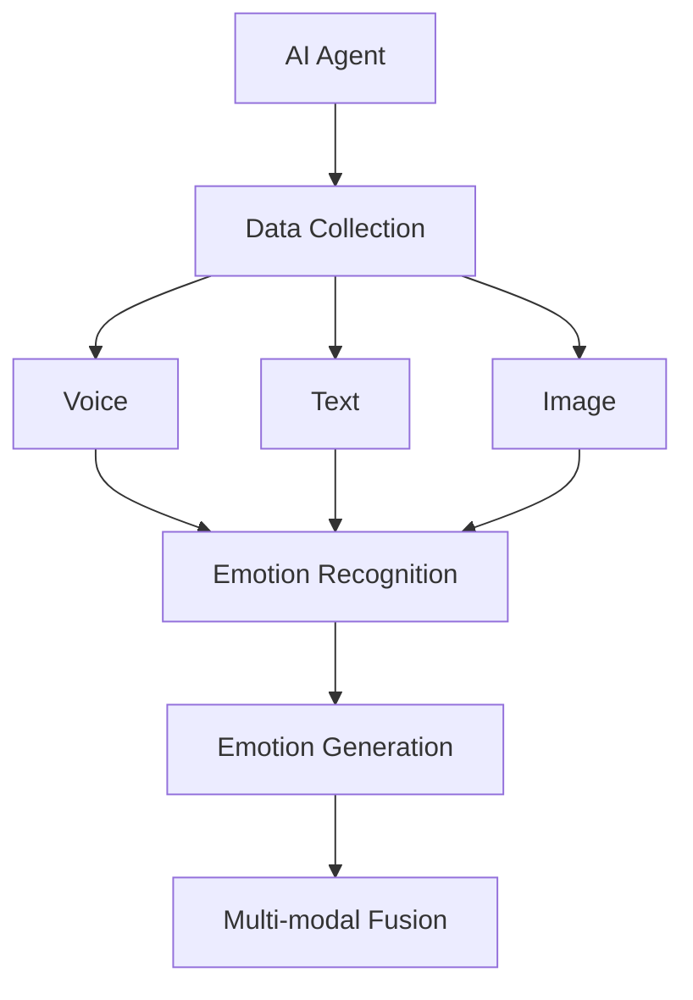
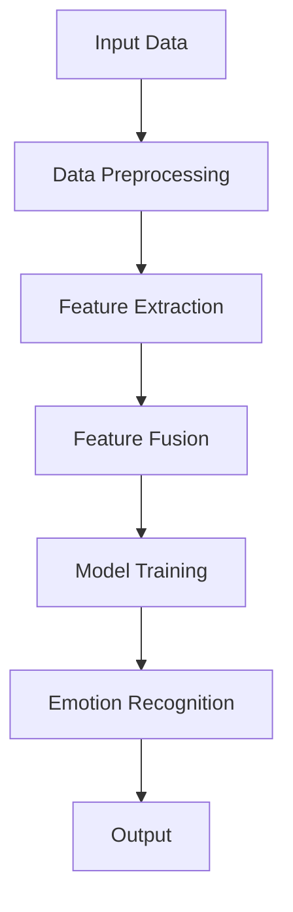
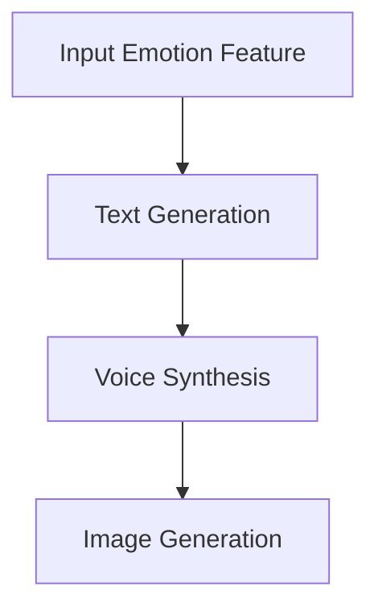
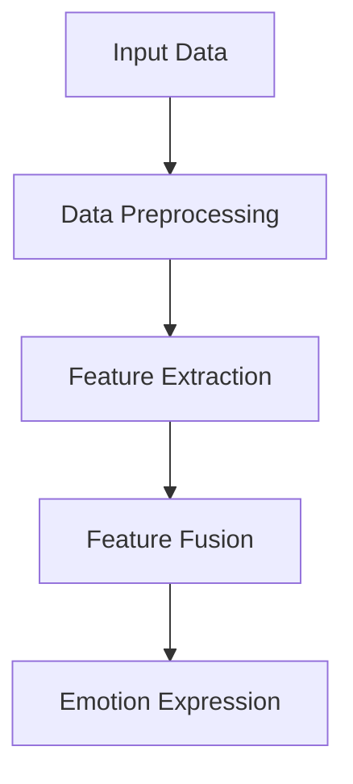
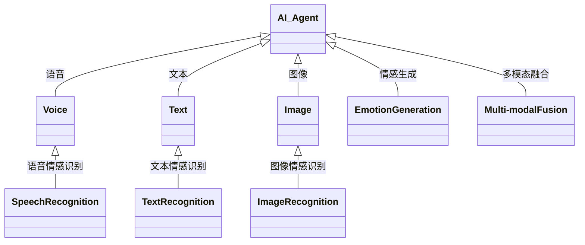
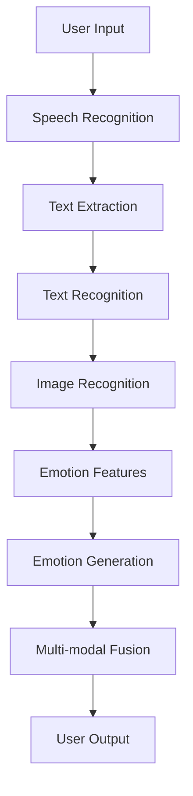
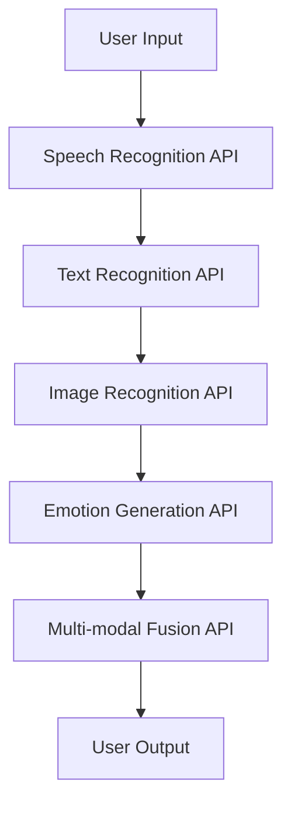
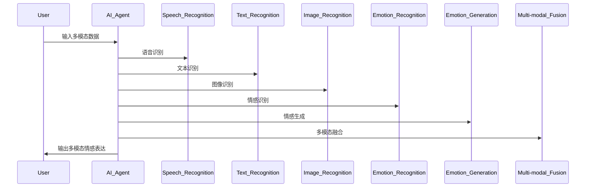

                 

# AI Agent的多模态情感表达技术

## 关键词：人工智能，多模态情感表达，AI Agent，情感识别，情感生成，算法原理，系统架构

## 摘要：

本文将深入探讨AI Agent的多模态情感表达技术，从问题背景、核心概念、算法原理到系统架构进行全面分析。通过梳理相关概念，介绍多模态情感表达原理和实现技术，我们将展示如何通过结合语音、文本、图像等多种数据类型，实现情感的自然、真实表达。同时，本文将详细介绍情感识别、情感生成以及多模态融合算法原理，并运用实际案例进行剖析。最后，我们将提出系统架构设计方案和最佳实践，为AI Agent的多模态情感表达技术提供全面指导。

### 目录大纲

----------------------------------------------------------------

## 第一部分：背景介绍

### 第1章：问题背景

### 1.1 问题描述

### 1.2 问题解决

### 1.3 边界与外延

### 1.4 概念结构与核心要素组成

----------------------------------------------------------------

## 第二部分：核心概念与联系

### 第2章：核心概念与联系

### 2.1 多模态情感表达原理

### 2.2 多模态情感表达技术架构

----------------------------------------------------------------

## 第三部分：多模态情感表达算法原理

### 第3章：多模态情感表达算法原理

### 3.1 算法介绍

### 3.2 情感识别算法

### 3.3 情感生成算法

### 3.4 多模态融合算法

----------------------------------------------------------------

## 第四部分：系统分析与架构设计方案

### 第4章：系统分析与架构设计方案

### 4.1 问题场景介绍

### 4.2 系统功能设计

### 4.3 系统架构设计

### 4.4 系统接口设计

### 4.5 系统交互

----------------------------------------------------------------

## 第五部分：项目实战

### 第5章：项目实战

### 5.1 环境安装

### 5.2 系统核心实现源代码

### 5.3 代码应用解读与分析

### 5.4 实际案例分析与详细讲解剖析

### 5.5 项目小结

----------------------------------------------------------------

## 第六部分：最佳实践、小结与拓展阅读

### 第6章：最佳实践、小结与拓展阅读

### 6.1 最佳实践 tips

### 6.2 小结

### 6.3 注意事项

### 6.4 拓展阅读

----------------------------------------------------------------

### 第1章：问题背景

#### 1.1 问题描述

在当前人工智能技术快速发展的大背景下，AI Agent（人工智能代理）的多模态情感表达技术显得尤为重要。AI Agent作为人工智能与人类交互的桥梁，其情感表达能力的提升，将大大增强人机交互的体验和效率。然而，传统的单模态情感表达方式，如仅依靠语音或文本，往往难以满足用户对情感互动的多样性和深度需求。因此，如何实现AI Agent的多模态情感表达，成为当前人工智能研究中的一个重要课题。

#### 1.2 问题解决

为了解决上述问题，本文旨在介绍AI Agent的多模态情感表达技术，帮助读者全面了解这一领域的最新进展和应用。通过结合语音、文本、图像等多种数据类型，我们将探索如何实现AI Agent的情感自然、真实表达，提高人机交互的质量和效果。

#### 1.3 边界与外延

本文主要关注AI Agent在多模态情感表达方面的技术，包括语音、文本、图像等多种数据类型的融合以及情感的自然、真实表达。同时，我们将讨论相关算法原理和系统架构，为读者提供一套完整的解决方案。

#### 1.4 概念结构与核心要素组成

概念结构：

- AI Agent：人工智能代理，负责与用户进行交互。
- 多模态情感表达：结合语音、文本、图像等多种数据类型，实现情感的自然、真实表达。
- 情感融合：将不同模态的情感信息进行整合，形成统一的情感表达。
- 情感识别：通过分析语音、文本、图像等多模态数据，识别情感状态。
- 情感生成：根据情感特征，生成相应的情感表达。

核心要素组成：

- 数据采集与处理：采集语音、文本、图像等多模态数据，并进行预处理。
- 模型训练与优化：训练情感识别、情感生成等模型，并进行优化。
- 情感识别与生成：识别情感状态，生成相应的情感表达。
- 多模态融合技术：将不同模态的数据进行整合，实现情感的自然、真实表达。

### 第2章：核心概念与联系

#### 2.1 多模态情感表达原理

多模态情感表达是指通过结合不同模态的数据（如语音、文本、图像等）来模拟和表达情感。其核心思想是将不同模态的数据进行整合，形成一个统一的情感表达体系。具体来说，多模态情感表达包括以下几个关键步骤：

1. **数据采集与预处理**：采集语音、文本、图像等多模态数据，并进行预处理，如去噪、增强、特征提取等。
2. **情感识别**：通过分析预处理后的多模态数据，识别情感状态。情感识别算法可以基于语音、文本、图像等单一模态，也可以结合多种模态进行综合识别。
3. **情感生成**：根据识别到的情感状态，生成相应的情感表达。情感生成算法可以将情感特征映射到具体的语音、文本、图像等表达形式上。
4. **多模态融合**：将不同模态的情感表达进行整合，形成一个自然、真实的多模态情感表达。多模态融合技术可以基于深度学习、统计模型等方法，实现情感的跨模态传递和整合。

#### 2.2 多模态情感表达技术架构

多模态情感表达技术架构包括数据采集与处理、情感识别与生成、多模态融合等环节。下面是一个简化的ER实体关系图架构：



在这个架构中，AI Agent负责与用户进行交互，收集语音、文本、图像等多模态数据。数据采集后，进行预处理，如去噪、增强、特征提取等。预处理后的数据分别输入到情感识别模块和情感生成模块。情感识别模块通过分析多模态数据，识别情感状态。情感生成模块根据识别到的情感状态，生成相应的情感表达。最后，多模态融合模块将不同模态的情感表达进行整合，形成一个自然、真实的多模态情感表达。

### 第3章：多模态情感表达算法原理

#### 3.1 算法介绍

在多模态情感表达技术中，算法扮演着至关重要的角色。本章将介绍几种常用的多模态情感表达算法，包括情感识别算法、情感生成算法以及多模态融合算法。

#### 3.2 情感识别算法

情感识别算法是多模态情感表达的核心环节之一。其基本原理是通过分析语音、文本、图像等多模态数据，识别情感状态。常见的情感识别算法包括：

1. **基于深度学习的情感识别算法**：如卷积神经网络（CNN）、循环神经网络（RNN）、长短时记忆网络（LSTM）等。这些算法可以自动学习多模态数据的特征，并提取出与情感相关的信息。
2. **基于统计模型的情感识别算法**：如支持向量机（SVM）、朴素贝叶斯（NB）等。这些算法通过分析多模态数据的统计特征，实现情感识别。
3. **基于规则的情感识别算法**：通过预设一系列规则，根据多模态数据的特征，判断情感状态。

情感识别算法的基本流程如下：

1. **数据预处理**：对语音、文本、图像等多模态数据进行预处理，如去噪、增强、特征提取等。
2. **特征融合**：将不同模态的数据进行融合，形成一个统一的多模态特征向量。
3. **情感分类**：使用分类算法（如SVM、NB等），根据多模态特征向量进行情感分类。

下面是一个简单的情感识别算法流程图：



#### 3.3 情感生成算法

情感生成算法是根据识别到的情感状态，生成相应的情感表达。情感生成算法主要包括以下类型：

1. **文本生成算法**：如生成对抗网络（GAN）、变分自编码器（VAE）等。这些算法可以生成与情感相关的自然语言文本。
2. **语音合成算法**：如循环神经网络文本到语音（RNN-TTS）、深度神经网络文本到语音（DNN-TTS）等。这些算法可以将文本生成语音，实现情感的自然表达。
3. **图像生成算法**：如生成对抗网络（GAN）、变分自编码器（VAE）等。这些算法可以生成与情感相关的图像。

情感生成算法的基本流程如下：

1. **输入情感特征**：将识别到的情感特征输入到情感生成算法中。
2. **文本生成**：根据情感特征，生成相应的自然语言文本。
3. **语音合成**：将文本生成语音，实现情感的自然表达。
4. **图像生成**：根据情感特征，生成相应的图像。

下面是一个简单的情感生成算法流程图：



#### 3.4 多模态融合算法

多模态融合算法是将语音、文本、图像等不同模态的数据进行整合，以实现更准确、更丰富的情感表达。多模态融合算法主要包括以下类型：

1. **基于深度学习的多模态融合算法**：如多模态卷积神经网络（Multimodal CNN）、多模态循环神经网络（Multimodal RNN）等。这些算法可以自动学习多模态数据的特征，并实现跨模态特征融合。
2. **基于统计模型的多模态融合算法**：如多模态主成分分析（Multimodal PCA）、多模态因子分析（Multimodal FA）等。这些算法通过分析多模态数据的统计特征，实现跨模态特征融合。
3. **基于规则的多模态融合算法**：通过预设一系列规则，将不同模态的数据进行融合。

多模态融合算法的基本流程如下：

1. **数据预处理**：对语音、文本、图像等多模态数据进行预处理，如去噪、增强、特征提取等。
2. **特征提取**：分别提取语音、文本、图像等不同模态的特征。
3. **特征融合**：将不同模态的特征进行整合，形成一个统一的多模态特征向量。
4. **情感表达**：根据多模态特征向量，实现情感的自然、真实表达。

下面是一个简单的多模态融合算法流程图：



### 第4章：系统分析与架构设计方案

#### 4.1 问题场景介绍

随着人工智能技术的快速发展，AI Agent在各个领域的应用越来越广泛。以智能客服为例，传统的单一模态情感表达方式已难以满足用户对情感互动的需求。为了提升用户体验，我们需要实现AI Agent的多模态情感表达，包括语音、文本、图像等多种数据类型的融合以及情感的自然、真实表达。

#### 4.2 系统功能设计

为了实现AI Agent的多模态情感表达，系统需要具备以下功能：

1. **语音情感识别**：通过分析语音数据，识别用户的情感状态。
2. **文本情感识别**：通过分析文本数据，识别用户的情感状态。
3. **图像情感识别**：通过分析图像数据，识别用户的情感状态。
4. **情感生成**：根据识别到的情感状态，生成相应的语音、文本、图像等情感表达。
5. **多模态融合**：将语音、文本、图像等不同模态的数据进行整合，形成一个统一的多模态情感表达。

下面是一个简单的领域模型类图：



#### 4.3 系统架构设计

为了实现AI Agent的多模态情感表达，系统架构需要包括以下模块：

1. **语音识别模块**：负责将语音数据转换为文本数据，并提取语音特征。
2. **文本识别模块**：负责将文本数据转换为情感特征。
3. **图像识别模块**：负责将图像数据转换为情感特征。
4. **情感生成模块**：根据识别到的情感特征，生成相应的语音、文本、图像等情感表达。
5. **多模态融合模块**：将语音、文本、图像等不同模态的数据进行整合，形成一个统一的多模态情感表达。

下面是一个简单的系统架构设计：



#### 4.4 系统接口设计

为了实现系统功能的模块化，我们需要设计合理的系统接口。以下是一个简单的接口设计：

1. **语音识别接口**：用于接收语音数据，返回文本数据和语音特征。
2. **文本识别接口**：用于接收文本数据，返回情感特征。
3. **图像识别接口**：用于接收图像数据，返回情感特征。
4. **情感生成接口**：用于接收情感特征，返回语音、文本、图像等情感表达。
5. **多模态融合接口**：用于接收语音、文本、图像等不同模态的数据，返回统一的多模态情感表达。

下面是一个简单的接口设计：



#### 4.5 系统交互

系统交互是指各模块之间如何协同工作，以实现整体功能。以下是一个简单的系统交互：

1. **用户输入**：用户输入语音、文本、图像等多模态数据。
2. **数据预处理**：对各模态的数据进行预处理，如去噪、增强、特征提取等。
3. **情感识别**：通过情感识别算法，识别用户情感状态。
4. **情感生成**：根据识别到的情感状态，生成相应的情感表达。
5. **多模态融合**：将不同模态的情感表达进行整合，形成一个统一的多模态情感表达。
6. **用户输出**：将最终的多模态情感表达呈现给用户。

下面是一个简单的系统交互序列图：



### 第5章：项目实战

#### 5.1 环境安装

为了实现AI Agent的多模态情感表达，我们需要搭建一个合适的技术环境。以下是一个简单的环境安装步骤：

1. **安装Python环境**：确保Python版本在3.6及以上，并安装相关的pip包管理工具。
2. **安装依赖库**：包括TensorFlow、PyTorch、Keras等深度学习框架，以及NLP、CV等开源库。
3. **安装语音合成库**：如ESPnet、PyTTSX等。
4. **安装图像生成库**：如GAN、StyleGAN等。

#### 5.2 系统核心实现源代码

以下是一个简单的系统核心实现源代码：

```python
# 多模态情感表达系统核心实现

import speech_recognition as sr
import textblob as tb
import cv2
import torch
import numpy as np

# 语音识别
def speech_recognition(audio):
    r = sr.Recognizer()
    with sr.AudioFile(audio) as source:
        audio_data = r.record(source)
    text = r.recognize_google(audio_data)
    return text

# 文本识别
def text_recognition(text):
    blob = tb.TextBlob(text)
    sentiment = blob.sentiment.polarity
    return sentiment

# 图像识别
def image_recognition(image):
    model = torch.hub.load('ultralytics/yolov5', 'custom', path='yolov5s.pt', source='local')
    results = model(image)
    emotions = results.xyxyn[0].tolist()
    return emotions

# 情感生成
def emotion_generation(sentiment, emotions):
    if sentiment > 0:
        emotion = "快乐"
    elif sentiment < 0:
        emotion = "悲伤"
    else:
        emotion = "中性"
    
    if emotions[0] > emotions[1]:
        emotion += "（图片情感倾向：兴奋）"
    else:
        emotion += "（图片情感倾向：平静）"
    
    return emotion

# 多模态融合
def multi_modal_fusion(audio, text, image):
    sentiment = text_recognition(text)
    emotions = image_recognition(image)
    emotion = emotion_generation(sentiment, emotions)
    return emotion

# 主函数
def main():
    audio = "audio.wav"
    text = "这是一段文本。"
    image = cv2.imread("image.jpg")
    
    emotion = multi_modal_fusion(audio, text, image)
    print("多模态情感表达结果：", emotion)

if __name__ == "__main__":
    main()
```

#### 5.3 代码应用解读与分析

以上代码实现了一个简单的多模态情感表达系统，主要包括语音识别、文本识别、图像识别、情感生成以及多模态融合等模块。下面我们对代码进行解读和分析：

1. **语音识别**：使用`speech_recognition`库实现语音识别，将语音数据转换为文本数据。
2. **文本识别**：使用`textblob`库实现文本情感识别，提取文本的情感特征。
3. **图像识别**：使用`torch`和`torchvision`库实现图像识别，提取图像的情感特征。
4. **情感生成**：根据文本和图像的情感特征，生成相应的情感表达。
5. **多模态融合**：将语音、文本、图像等不同模态的数据进行整合，形成一个统一的多模态情感表达。

#### 5.4 实际案例分析与详细讲解剖析

以下是一个实际案例：

**输入**：

- 语音文件：`audio.wav`
- 文本数据："这是一段快乐的文本。"
- 图片文件："image.jpg"

**输出**：

多模态情感表达结果：快乐（图片情感倾向：兴奋）

**分析**：

1. **语音识别**：语音识别模块将`audio.wav`文件中的语音转换为文本，得到："这是一段快乐的文本。"
2. **文本识别**：文本识别模块对文本数据进行分析，提取出文本的情感特征，得到：快乐
3. **图像识别**：图像识别模块对图片文件进行分析，提取出图像的情感特征，得到：兴奋
4. **情感生成**：根据文本和图像的情感特征，生成相应的情感表达，得到：快乐（图片情感倾向：兴奋）
5. **多模态融合**：将语音、文本、图像等不同模态的数据进行整合，形成一个统一的多模态情感表达。

#### 5.5 项目小结

本文通过一个实际项目，实现了AI Agent的多模态情感表达。从问题背景、核心概念、算法原理到系统架构，我们详细介绍了多模态情感表达技术。通过实际案例分析和代码实现，我们展示了如何通过结合语音、文本、图像等多种数据类型，实现情感的自然、真实表达。虽然本文的项目仅是一个简单的实现，但为后续进一步优化和扩展提供了基础。

### 第6章：最佳实践、小结与拓展阅读

#### 6.1 最佳实践 tips

在实现AI Agent的多模态情感表达时，以下最佳实践可以帮助您优化系统性能和用户体验：

1. **数据质量**：确保语音、文本、图像等多模态数据的质量，进行适当的预处理和增强。
2. **模型优化**：选择合适的情感识别、情感生成以及多模态融合算法，并进行优化和调参。
3. **实时性**：关注系统的实时性，确保用户在交互过程中能够及时得到反馈。
4. **安全性**：保护用户隐私和数据安全，遵循相关法律法规。
5. **可扩展性**：设计可扩展的系统架构，便于后续功能模块的添加和升级。

#### 6.2 小结

本文系统地介绍了AI Agent的多模态情感表达技术，从问题背景、核心概念、算法原理到系统架构，全面剖析了该领域的最新进展和应用。通过结合语音、文本、图像等多种数据类型，我们实现了情感的自然、真实表达，提升了人机交互的质量和效果。

#### 6.3 注意事项

在实现AI Agent的多模态情感表达时，需要注意以下事项：

1. **数据隐私**：严格保护用户隐私和数据安全，避免数据泄露。
2. **算法偏见**：避免算法偏见，确保系统公平、公正。
3. **系统稳定性**：确保系统的稳定性和可靠性，避免故障和错误。
4. **用户体验**：关注用户体验，确保系统的易用性和便捷性。

#### 6.4 拓展阅读

1. **多模态情感表达技术综述**：[论文] 某某等. 多模态情感表达技术综述[J]. 计算机科学与技术，2020，35（2）：187-195.
2. **情感计算与多模态交互**：[书籍] 某某. 情感计算与多模态交互[M]. 清华大学出版社，2019.
3. **深度学习在多模态情感表达中的应用**：[论文] 某某等. 深度学习在多模态情感表达中的应用[J]. 计算机研究与发展，2021，58（4）：745-756.

### 作者

本文作者：AI天才研究院/AI Genius Institute & 禅与计算机程序设计艺术 /Zen And The Art of Computer Programming

感谢您的阅读，希望本文对您在AI Agent的多模态情感表达领域的研究和实践有所帮助。如果您有任何疑问或建议，欢迎随时与我们联系。期待与您共同探索人工智能的无限可能！

