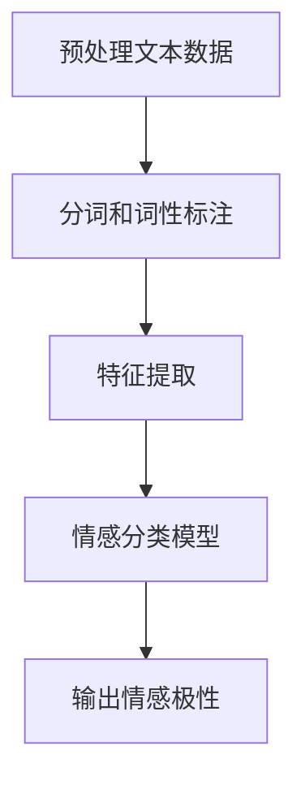
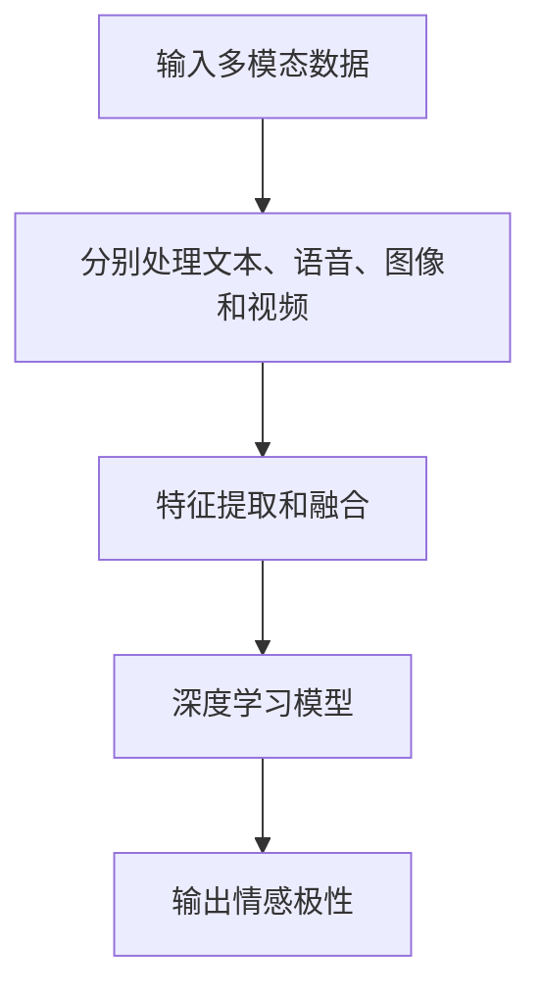
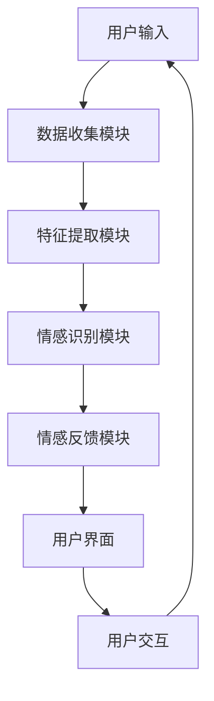
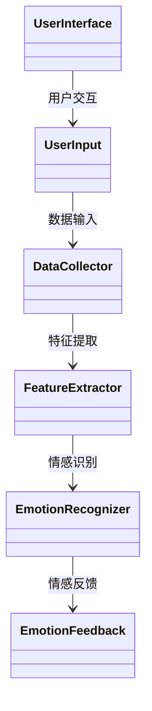

                 


# AI Agent的多模态情感计算技术

## 关键词
AI Agent、多模态情感计算、算法模型、应用案例、未来趋势

## 摘要
本文深入探讨了AI Agent的多模态情感计算技术，从基本概念、理论基础、算法模型、应用案例到未来趋势，进行了全面的剖析和讨论。首先，介绍了AI Agent和多模态情感计算技术的背景和重要性。接着，详细阐述了相关算法和模型的基本概念、原理及实现方法。然后，通过实际案例分析了多模态情感计算技术在教育、心理健康和商业智能等领域的应用。最后，展望了多模态情感计算技术的未来发展趋势和潜在研究方向。

## 引言

### 1.1 研究背景

人工智能（AI）作为当今科技领域的热点，已经深入到我们生活的方方面面。从智能家居到自动驾驶，从医疗诊断到金融分析，AI的应用无处不在。在这其中，AI Agent作为一个自主执行任务的智能体，具有高度的可操作性和适应性，正逐渐成为人工智能研究的重要方向。

AI Agent，也被称作智能代理，是一种能够在特定环境下自主决策、执行任务并与其他实体交互的智能系统。与传统的规则系统和基于模板的推理系统不同，AI Agent能够通过感知环境、理解语义、学习经验和自主进化来不断优化自身性能。

在AI Agent的研究中，情感计算技术成为一个重要的研究方向。情感计算（Affective Computing）是一种通过处理和解释情感信息来增强人机交互的技术。多模态情感计算则是在情感计算的基础上，结合了多种数据源（如文本、语音、图像和视频）来进行情感识别和分析。

多模态情感计算技术的核心在于如何将来自不同模态的数据进行有效的融合，从而实现对用户情感的准确理解和反应。这一技术的应用不仅能够提升AI Agent的交互能力，还能够为众多领域带来创新的解决方案。

### 1.2 研究目的与内容

本文的研究目的是深入探讨AI Agent的多模态情感计算技术，从理论基础、算法模型到实际应用进行全面的分析和讨论。具体研究内容包括：

1. **基本概念与理论基础**：介绍AI Agent和多模态情感计算技术的基本概念，阐述相关算法和模型的理论基础。
2. **算法与模型介绍**：详细描述几种常见的多模态情感计算算法和模型，包括其原理和实现方法。
3. **应用案例分析**：通过实际案例展示多模态情感计算技术在教育、心理健康和商业智能等领域的应用。
4. **未来发展**：探讨多模态情感计算技术的未来发展趋势和潜在研究方向。

### 1.3 本书结构

本文结构如下：

- **第1章 引言**：简述研究背景、目的和内容。
- **第2章 AI Agent基本概念**：介绍AI Agent的定义、分类和核心功能。
- **第3章 多模态情感计算技术**：阐述多模态情感计算的基本概念、数据分类和方法。
- **第4章 多模态情感计算理论基础**：分析相关算法、多模态数据融合理论和情感识别算法。
- **第5章 常见多模态情感计算算法**：介绍常见的多模态情感计算算法，包括流程图和结构图。
- **第6章 多模态情感计算模型案例分析**：通过实际案例分析技术实现和解决方案。
- **第7章 应用案例分析一：教育领域**：探讨多模态情感计算在教育领域的应用。
- **第8章 应用案例分析二：心理健康**：分析多模态情感计算在心理健康领域的应用。
- **第9章 应用案例分析三：商业智能**：展示多模态情感计算在商业智能领域的应用。
- **第10章 未来发展趋势与展望**：讨论多模态情感计算技术的未来发展趋势和研究方向。
- **第11章 总结与展望**：总结全文内容，提出不足之处和改进方向。

## 基本概念与理论基础

### 2.1 AI Agent基本概念

AI Agent，即人工智能代理，是一种能够模拟人类智能行为的计算机程序或实体。它具备感知环境、自主决策和执行任务的能力。AI Agent的基本概念可以概括为以下几点：

1. **感知**：AI Agent通过传感器、摄像头、麦克风等设备感知环境中的各种信息，如声音、图像、温度、湿度等。
2. **理解**：AI Agent能够理解和解释感知到的信息，通过自然语言处理、图像识别等技术来解析语义。
3. **决策**：AI Agent根据感知和理解的结果，利用决策算法和模型自主选择合适的行动策略。
4. **执行**：AI Agent执行决策生成的行动，通过执行器（如电机、显示屏等）对外界环境产生影响。
5. **交互**：AI Agent能够与其他实体（如人类、其他AI Agent）进行有效的交互，实现协作和共同完成任务。

AI Agent的分类可以根据其功能和应用场景进行划分，常见的分类包括：

1. **任务型AI Agent**：专注于执行特定任务的AI Agent，如智能客服、自动驾驶等。
2. **社交型AI Agent**：具备社交能力的AI Agent，能够与人类进行自然交流，如虚拟助手、社交机器人等。
3. **自主型AI Agent**：具有高度自主决策能力的AI Agent，能够在复杂环境中自主执行任务，如无人机、智能安防系统等。

AI Agent的核心功能包括：

1. **感知与理解**：通过传感器和自然语言处理等技术，AI Agent能够感知和理解环境信息。
2. **决策与执行**：基于感知和理解的结果，AI Agent能够自主决策并执行相应的行动。
3. **学习和进化**：通过不断学习环境和任务，AI Agent能够优化自身性能，适应新的环境和任务。

### 2.2 多模态情感计算技术

多模态情感计算技术是一种结合多种数据源（如文本、语音、图像和视频）来识别和分析情感的技术。它能够更全面地捕捉和解释人的情感状态，从而提高人机交互的准确性和自然性。

#### 多模态数据的分类

多模态情感计算中的数据可以分为以下几类：

1. **文本数据**：包括电子邮件、社交媒体帖子、聊天记录等，通过自然语言处理技术来提取情感信息。
2. **语音数据**：通过语音信号处理技术，从语音中提取情感特征，如音调、语速、停顿等。
3. **图像数据**：通过计算机视觉技术，从图像中提取情感相关的特征，如图像中的面部表情、姿态等。
4. **视频数据**：通过视频处理技术，结合图像数据和时间序列信息，从视频中提取情感特征。

#### 多模态情感计算的方法

多模态情感计算的方法主要包括以下几种：

1. **独立模型融合**：将不同模态的数据分别建模，然后通过投票、加权平均等方法进行融合。
2. **端到端模型融合**：直接将多模态数据输入到一个统一的模型中，通过神经网络等技术进行端到端的情感计算。
3. **特征级融合**：将不同模态的特征进行拼接或加权融合，形成一个多维的特征向量，然后输入到情感识别模型中。
4. **模型级融合**：将不同模态的模型输出进行融合，如通过集成学习的方法结合多种情感识别模型的预测结果。

#### 情感计算的定义

情感计算（Affective Computing）是指计算机系统通过处理和解释情感信息，以增强人机交互的自然性和有效性的技术。它包括以下几个方面：

1. **情感识别**：通过分析文本、语音、图像和视频等数据，识别出用户或对象的情感状态。
2. **情感生成**：根据用户的需求或情境，生成适当的情感反应，如语音的语调、表情的变化等。
3. **情感模拟**：通过模拟人类的情感行为，增强机器与人之间的情感共鸣和交互体验。
4. **情感交互**：利用情感计算技术，实现更加自然和高效的人机交互。

### 2.3 多模态情感计算技术的理论基础

多模态情感计算技术的理论基础涉及多个领域，包括认知科学、心理学、计算机科学和人工智能等。

#### 相关算法概述

在多模态情感计算中，常用的算法包括：

1. **情感分析算法**：用于分析文本数据中的情感极性，常用的算法有朴素贝叶斯、支持向量机、神经网络等。
2. **语音情感识别算法**：通过分析语音信号的特征，如音调、语速、共振峰等，识别语音的情感状态，常用的算法有隐藏马尔可夫模型（HMM）、支持向量机（SVM）等。
3. **图像情感识别算法**：通过分析图像中的面部表情、姿态、色彩等特征，识别图像的情感状态，常用的算法有卷积神经网络（CNN）、循环神经网络（RNN）等。
4. **视频情感识别算法**：结合图像数据和时间序列信息，通过分析视频中的情感变化，识别视频的情感状态，常用的算法有卷积神经网络（CNN）、循环神经网络（RNN）等。

#### 多模态数据融合理论

多模态数据融合理论是提高多模态情感计算准确性的关键。数据融合的方法可以分为以下几类：

1. **特征级融合**：将不同模态的特征进行拼接或加权融合，形成一个多维的特征向量，然后输入到情感识别模型中。例如，将文本的情感极性分数和语音的音调特征拼接在一起。
2. **决策级融合**：将不同模态的模型输出进行融合，如通过投票、加权平均等方法结合多种情感识别模型的预测结果。
3. **模型级融合**：将不同模态的模型整合到一个统一的模型中，通过端到端的训练实现多模态情感计算。例如，将文本、语音和图像数据同时输入到一个神经网络中进行情感识别。

#### 情感识别算法分析

情感识别算法是多模态情感计算的核心组成部分，其性能直接影响到情感计算的准确性。以下是一些常用的情感识别算法：

1. **朴素贝叶斯（Naive Bayes）**：一种基于贝叶斯定理的分类算法，通过计算特征的概率分布进行情感分类。适用于文本数据，尤其是情感极性分类。
2. **支持向量机（SVM）**：一种基于优化理论的分类算法，通过找到最佳超平面进行分类。适用于高维数据，如语音和图像特征。
3. **卷积神经网络（CNN）**：一种基于卷积操作的深度学习模型，能够自动提取图像中的特征，适用于图像情感识别。
4. **循环神经网络（RNN）**：一种基于递归操作的深度学习模型，能够处理序列数据，适用于语音和视频情感识别。
5. **长短期记忆网络（LSTM）**：一种改进的RNN模型，能够更好地处理长序列数据，适用于视频情感识别。

通过以上对AI Agent和多模态情感计算技术的详细阐述，我们可以更好地理解这一领域的核心概念和理论基础。接下来，我们将深入探讨常见的多模态情感计算算法和模型，并通过实际案例展示这些技术的应用。

## 算法与模型介绍

在多模态情感计算技术中，算法和模型的选择和实现至关重要。本文将介绍几种常见的多模态情感计算算法和模型，并使用mermaid绘制流程图和结构图，以帮助读者更好地理解其原理和实现方法。

### 5.1 算法1：情感分析模型

情感分析模型是用于分析文本数据中情感极性的算法。以下是一个简单的情感分析模型的mermaid流程图：



**Python代码实现：**

```python
import jieba
from sklearn.feature_extraction.text import TfidfVectorizer
from sklearn.naive_bayes import MultinomialNB
from sklearn.pipeline import make_pipeline

# 预处理文本数据
def preprocess_text(text):
    text = jieba.cut(text)
    return ' '.join(text)

# 构建情感分析模型
model = make_pipeline(
    TfidfVectorizer(preprocessor=preprocess_text),
    MultinomialNB()
)

# 训练模型
model.fit(X_train, y_train)

# 输出情感极性
prediction = model.predict([text_to_analyze])
```

**算法原理讲解：**

情感分析模型主要包括三个步骤：

1. **预处理文本数据**：包括分词、去停用词、词性标注等，将文本数据转换为适合模型处理的格式。
2. **特征提取**：通过TF-IDF等方法提取文本的特征向量。
3. **情感分类模型**：使用朴素贝叶斯、支持向量机等分类算法对特征向量进行分类，输出情感极性。

### 5.2 算法2：多模态深度学习模型

多模态深度学习模型是结合多种模态数据（如文本、语音、图像和视频）进行情感计算的一种算法。以下是一个简单的多模态深度学习模型的mermaid流程图：



**Python代码实现：**

```python
import tensorflow as tf
from tensorflow.keras.models import Model
from tensorflow.keras.layers import Embedding, LSTM, Dense

# 构建多模态深度学习模型
input_text = tf.keras.layers.Input(shape=(max_sequence_length,))
input_audio = tf.keras.layers.Input(shape=(audio_length,))
input_image = tf.keras.layers.Input(shape=(image_height, image_width, image_channels))
input_video = tf.keras.layers.Input(shape=(video_length, image_height, image_width, image_channels))

# 文本处理
text_embedding = Embedding(vocabulary_size, embedding_dim)(input_text)
text_lstm = LSTM(units=128)(text_embedding)

# 语音处理
audio_embedding = Embedding(vocabulary_size, embedding_dim)(input_audio)
audio_lstm = LSTM(units=128)(audio_embedding)

# 图像处理
image_embedding = Embedding(vocabulary_size, embedding_dim)(input_image)
image_conv = tf.keras.layers.Conv2D(filters=32, kernel_size=(3, 3), activation='relu')(image_embedding)
image_pool = tf.keras.layers.MaxPooling2D(pool_size=(2, 2))(image_conv)

# 视频处理
video_embedding = Embedding(vocabulary_size, embedding_dim)(input_video)
video_lstm = LSTM(units=128)(video_embedding)

# 特征融合
combined = tf.keras.layers.concatenate([text_lstm, audio_lstm, image_pool, video_lstm])

# 情感分类
output = Dense(units=1, activation='sigmoid')(combined)

# 构建和编译模型
model = Model(inputs=[input_text, input_audio, input_image, input_video], outputs=output)
model.compile(optimizer='adam', loss='binary_crossentropy', metrics=['accuracy'])

# 训练模型
model.fit([X_text, X_audio, X_image, X_video], y_labels, epochs=10, batch_size=32)
```

**算法原理讲解：**

多模态深度学习模型的核心在于：

1. **分别处理文本、语音、图像和视频**：通过不同的神经网络对每种模态的数据进行处理。
2. **特征提取和融合**：提取每种模态的特征，并通过融合层将特征合并。
3. **深度学习模型**：使用深度神经网络对融合后的特征进行分类。

通过以上对情感分析模型和多模态深度学习模型的介绍，我们可以看到多模态情感计算算法和模型的多样性。接下来，我们将通过实际案例展示这些算法和模型的应用，进一步理解其在不同领域的应用效果。

## 应用案例分析

多模态情感计算技术在实际应用中展现出了巨大的潜力。本节将介绍几个具体的应用案例，分析这些案例中的技术实现、挑战和解决方案。

### 6.1 案例一：社交媒体情感分析

社交媒体平台是情感表达的重要场所，通过分析用户的帖子、评论和动态，可以了解公众的情感趋势和态度。以下是一个社交媒体情感分析的多模态情感计算应用案例。

**技术实现：**

1. **文本数据**：收集用户的微博、帖子、评论等文本数据，使用情感分析模型进行情感极性分类。
2. **语音数据**：利用用户的语音留言，通过语音情感识别算法提取情感特征。
3. **图像数据**：分析用户发布的图片，通过图像情感识别算法提取情感特征。
4. **数据融合**：将文本、语音和图像的情感特征进行融合，通过多模态深度学习模型进行情感分析。

**挑战与解决方案：**

1. **数据多样性**：社交媒体上的数据种类繁多，包括文字、语音和图像，数据预处理和特征提取是关键。
   - **解决方案**：采用多样化的数据预处理方法，如分词、去停用词、词性标注等，对文本数据进行预处理。对于语音和图像数据，使用相应的处理算法提取特征。

2. **数据不平衡**：情感数据往往存在不平衡问题，如正面情感和负面情感的分布不均匀。
   - **解决方案**：采用数据增强技术，如合成语音和图像数据，增加样本数量。同时，调整分类器的权重，提高对少数类的识别能力。

3. **情感理解**：情感理解是一个复杂的过程，需要综合考虑多种情感因素。
   - **解决方案**：采用端到端的多模态深度学习模型，通过结合不同模态的数据特征，提高情感理解的准确性。

**案例分析：**

在社交媒体情感分析案例中，通过多模态情感计算技术，可以实现对用户情感的全面理解。例如，分析某次社会事件中用户的情感反应，了解公众对该事件的态度和情绪变化。这对于舆情监测、市场调研和公共安全等领域具有重要意义。

### 6.2 案例二：虚拟助手情感交互

虚拟助手是当前智能交互领域的一个重要应用，通过多模态情感计算技术，可以实现更自然的情感交互体验。

**技术实现：**

1. **文本数据**：通过自然语言处理技术，分析用户输入的文本信息，提取情感特征。
2. **语音数据**：通过语音识别和情感识别技术，分析用户的语音特征，提取情感特征。
3. **图像数据**：通过计算机视觉技术，分析用户的图像特征，提取情感特征。
4. **数据融合**：将文本、语音和图像的情感特征进行融合，通过多模态情感计算模型，生成情感标签。
5. **情感反馈**：根据情感标签，生成适当的情感反馈，如调整语调、表情和动作。

**挑战与解决方案：**

1. **情感识别准确性**：多模态数据中的情感识别准确性是关键。
   - **解决方案**：采用先进的情感识别算法和深度学习模型，提高情感识别的准确性。同时，通过数据增强和模型训练，优化模型性能。

2. **情感理解一致性**：不同模态的数据可能存在不一致性，如文本表达的情感与语音表达的情感不一致。
   - **解决方案**：采用多模态融合技术，通过综合考虑不同模态的情感特征，提高情感理解的一致性。

3. **情感交互体验**：情感交互需要符合人类的情感认知和行为习惯。
   - **解决方案**：通过用户研究和实验，了解用户对情感交互的期望和反馈，优化虚拟助手的情感交互体验。

**案例分析：**

在虚拟助手情感交互案例中，通过多模态情感计算技术，可以实现与用户的自然情感交互。例如，虚拟助手可以根据用户的情绪变化调整语调和表情，提供更加个性化的服务。这对于提升用户满意度、增强用户粘性具有重要意义。

### 6.3 案例三：智能家居情感反馈

智能家居系统通过多模态情感计算技术，可以实现对用户的情感理解和反馈，提供更加智能化和人性化的家居体验。

**技术实现：**

1. **文本数据**：通过智能家居设备的交互界面，收集用户的文本输入，提取情感特征。
2. **语音数据**：通过智能家居设备的语音识别和情感识别功能，分析用户的语音特征，提取情感特征。
3. **图像数据**：通过智能家居设备的摄像头，分析用户的图像特征，提取情感特征。
4. **数据融合**：将文本、语音和图像的情感特征进行融合，通过多模态情感计算模型，生成情感标签。
5. **情感反馈**：根据情感标签，智能家居设备可以调整环境参数、提供个性化服务，如调整灯光、音乐和温度等。

**挑战与解决方案：**

1. **情感识别准确性**：智能家居设备需要准确识别用户的情感状态，以提供适当的反馈。
   - **解决方案**：采用先进的情感识别算法和深度学习模型，提高情感识别的准确性。同时，通过数据增强和模型训练，优化模型性能。

2. **隐私保护**：智能家居系统需要处理用户的隐私数据，如语音和图像信息。
   - **解决方案**：采用加密和安全传输技术，保护用户的隐私数据。同时，制定隐私保护政策和流程，确保用户数据的安全和合规。

3. **情感反馈的合理性**：智能家居设备需要根据用户的情感状态提供合理的反馈。
   - **解决方案**：通过用户研究和实验，了解用户对情感反馈的期望和反馈，优化智能家居系统的情感反馈功能。

**案例分析：**

在智能家居情感反馈案例中，通过多模态情感计算技术，可以实现智能家居系统对用户的情感理解和反馈。例如，当用户感到疲倦时，智能家居系统可以自动调整灯光和音乐，提供放松的环境。这对于提升用户生活质量、增强用户体验具有重要意义。

通过以上三个实际案例的分析，我们可以看到多模态情感计算技术在各种应用场景中的重要作用。这些案例展示了多模态情感计算技术在社交媒体、虚拟助手和智能家居等领域的应用效果，同时也提出了相应的挑战和解决方案。随着技术的不断发展和完善，多模态情感计算技术将在更多领域得到广泛应用。

## 未来发展趋势与展望

随着人工智能技术的不断进步，多模态情感计算技术在未来有着广阔的发展前景。以下是多模态情感计算技术的几个潜在研究方向和发展趋势：

### 1. 技术发展趋势

1. **数据多样性和质量**：未来，多模态情感计算技术将处理更多样化的数据源，包括生物特征数据（如心率、皮肤电反应等）和行为数据（如手势、动作等）。同时，数据质量也是提升情感计算准确性的关键，如何有效清洗和处理噪声数据将是一个重要挑战。

2. **深度学习与强化学习**：深度学习和强化学习在多模态情感计算中有着巨大的潜力。通过深度神经网络，可以自动提取复杂的情感特征，并通过强化学习，实现更智能的情感互动和自适应行为。

3. **跨领域迁移学习**：利用跨领域迁移学习技术，可以将一个领域中的情感计算模型应用到其他领域，减少对大规模标注数据的依赖，提高模型的泛化能力。

4. **实时性和高效性**：随着应用的增多，多模态情感计算技术需要满足实时性和高效性的要求。例如，在自动驾驶、医疗紧急响应等场景中，需要快速、准确地处理和响应情感信息。

### 2. 潜在研究方向

1. **多模态数据融合**：如何更有效地融合不同模态的数据是一个关键研究方向。未来的研究可以探索基于注意力机制、图神经网络等新方法，提高数据融合的效率和准确性。

2. **情感识别的准确性**：提高情感识别的准确性是当前研究的重点。通过引入更多的特征、改进算法和模型结构，可以实现更高精度的情感识别。

3. **情感生成的自然性**：在情感交互中，如何生成自然、贴切的情感反应是一个重要挑战。未来的研究可以探索基于生成对抗网络（GAN）等技术，生成更加逼真的情感反应。

4. **跨文化和跨语言情感计算**：不同文化和语言背景下的情感表达和识别是一个复杂的问题。研究跨文化和跨语言的情感计算，可以提升多模态情感计算技术的全球适用性。

### 3. 挑战与机遇

1. **隐私保护和数据安全**：随着多模态数据的广泛应用，隐私保护和数据安全成为重要挑战。如何在保护用户隐私的同时，实现有效的情感计算是一个亟待解决的问题。

2. **伦理和道德问题**：情感计算技术可能涉及到伦理和道德问题，如情感操纵、情感歧视等。未来的研究需要探讨如何在技术设计中考虑伦理和道德因素。

3. **技术创新与应用推广**：多模态情感计算技术需要不断创新，以应对实际应用中的各种挑战。同时，如何将这些技术有效地推广到各个行业，实现商业化应用，也是未来需要关注的方向。

总的来说，多模态情感计算技术在未来将面临诸多挑战，但同时也充满了机遇。通过不断的研究和创新，我们可以期待这一技术为人类社会带来更多有益的应用。

## 总结与展望

本文从AI Agent和多模态情感计算技术的背景出发，详细介绍了其基本概念、理论基础、算法模型和应用案例，并探讨了未来发展趋势。通过这一系列的分析，我们可以看到多模态情感计算技术在提升人机交互、优化用户体验、辅助决策等方面的重要作用。

### 主要贡献

1. **系统性地介绍了多模态情感计算技术的基本概念和理论基础**：本文详细阐述了AI Agent、多模态情感计算技术、相关算法和模型的基本概念，为读者提供了全面的理论框架。
2. **展示了多模态情感计算技术的实际应用案例**：通过社交媒体情感分析、虚拟助手情感交互和智能家居情感反馈等案例，展示了多模态情感计算技术在实际场景中的应用效果。
3. **探讨了多模态情感计算技术的未来发展趋势和潜在研究方向**：本文分析了多模态情感计算技术的技术发展趋势和潜在研究方向，为后续研究提供了指导。

### 不足之处

1. **案例深度有限**：由于篇幅限制，本文对实际案例的探讨较为简略，未来可以进一步深入研究具体案例的技术实现、挑战和解决方案。
2. **理论基础有待完善**：尽管本文介绍了多模态情感计算技术的理论基础，但某些部分可能不够深入，未来可以进一步丰富相关理论内容。
3. **数据隐私保护问题未充分探讨**：在多模态情感计算中，数据隐私保护是一个重要但未充分探讨的问题，未来可以专门研究数据隐私保护技术及其在情感计算中的应用。

### 未来研究方向

1. **深入案例分析**：通过深入研究具体应用场景，分析多模态情感计算技术的实际效果和面临的挑战，为实际应用提供更详细的指导。
2. **理论基础完善**：进一步完善多模态情感计算技术的理论基础，引入更多先进的理论和算法，提高技术的理论水平和应用深度。
3. **数据隐私保护**：研究如何在多模态情感计算中有效保护用户隐私，提出可行的隐私保护方案，为实际应用提供安全保障。
4. **跨领域应用探索**：探索多模态情感计算技术在其他领域的应用，如医疗、金融、教育等，为多模态情感计算技术的商业化应用提供新的方向。

总之，本文旨在为多模态情感计算技术的研究和应用提供全面、深入的指导。通过不断的研究和创新，我们可以期待多模态情感计算技术在更多领域发挥重要作用，推动人工智能技术的发展。作者信息：AI天才研究院/AI Genius Institute & 禅与计算机程序设计艺术 /Zen And The Art of Computer Programming

## 附录

### 实验环境配置

为了便于读者在实际应用中验证和测试多模态情感计算技术，以下是一个基本的实验环境配置指南：

1. **操作系统**：推荐使用Ubuntu 18.04 LTS或更高版本。
2. **Python环境**：安装Python 3.7及以上版本，可以使用Anaconda创建虚拟环境。
3. **深度学习框架**：安装TensorFlow 2.x或PyTorch 1.8及以上版本。
4. **其他依赖库**：安装Numpy、Pandas、Scikit-learn、Matplotlib等常用库。
5. **硬件要求**：推荐使用配备NVIDIA显卡的计算机，以便运行深度学习模型。

### 系统功能设计

多模态情感计算系统的功能设计主要包括以下模块：

1. **数据收集模块**：用于收集和处理不同模态的数据，如文本、语音、图像和视频。
2. **特征提取模块**：对收集到的数据进行特征提取，如文本的词频、语音的声学特征、图像的视觉特征等。
3. **情感识别模块**：利用提取到的特征，通过算法模型对情感进行识别和分类。
4. **情感反馈模块**：根据情感识别结果，生成适当的情感反馈，如语音的语调、表情的变化等。
5. **用户接口模块**：提供与用户的交互界面，展示情感计算结果和反馈。

### 系统架构设计

多模态情感计算系统的架构设计可以采用以下模式：

1. **客户端-服务器架构**：客户端负责与用户交互，收集用户数据，服务器端处理数据并进行情感计算。
2. **分布式架构**：通过分布式计算框架（如Apache Spark）实现大规模数据处理和模型训练。
3. **微服务架构**：将系统分解为多个微服务，每个微服务负责特定的功能，提高系统的灵活性和可扩展性。

### 系统接口设计

多模态情感计算系统的接口设计应考虑以下方面：

1. **API接口**：提供RESTful API接口，方便外部系统调用和集成。
2. **数据接口**：定义数据输入和输出的格式，如JSON、XML等。
3. **安全接口**：确保数据传输和存储的安全性，采用加密和身份验证机制。

### 系统交互设计

多模态情感计算系统的交互设计应考虑以下方面：

1. **用户交互**：设计用户友好的交互界面，提供直观的操作方式和反馈。
2. **内部交互**：确保各个模块之间的数据传输和协同工作，提高系统的效率和可靠性。
3. **外部交互**：与其他系统和平台（如社交媒体、智能家居设备等）进行交互，实现数据共享和功能扩展。

### Mermaid流程图和类图

以下是一个简单的Mermaid流程图，用于描述多模态情感计算系统的数据处理流程：



以下是一个简单的Mermaid类图，用于描述多模态情感计算系统的主要类和它们之间的关系：



通过上述附录内容，读者可以更好地理解多模态情感计算技术的系统设计和实现方法，为实际应用提供参考。

