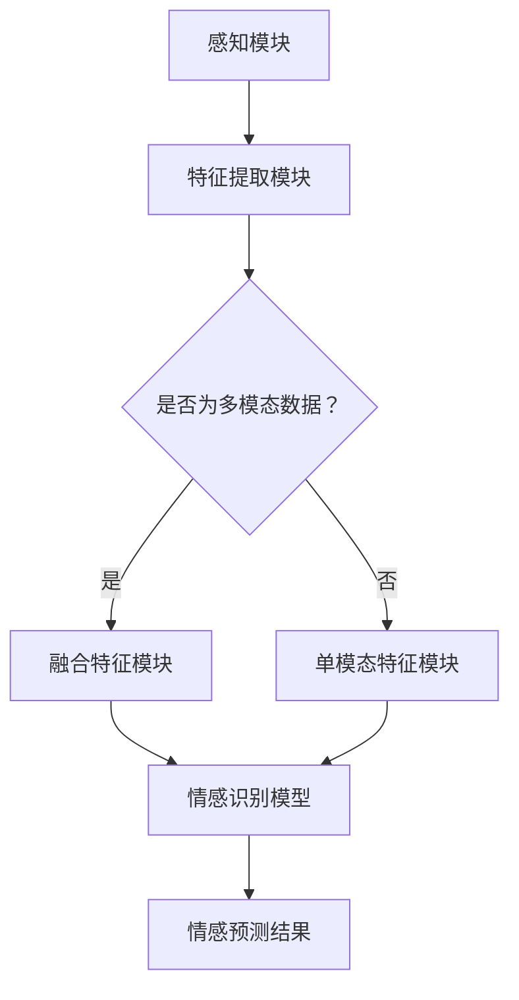
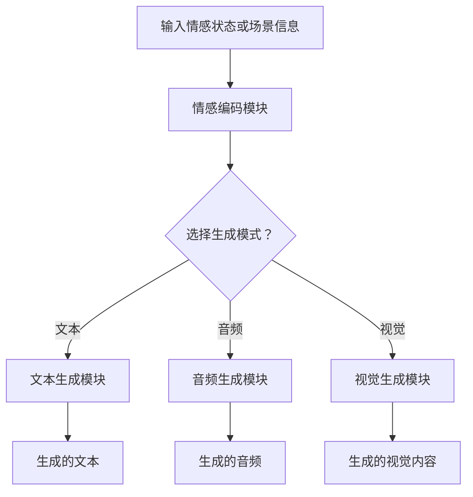
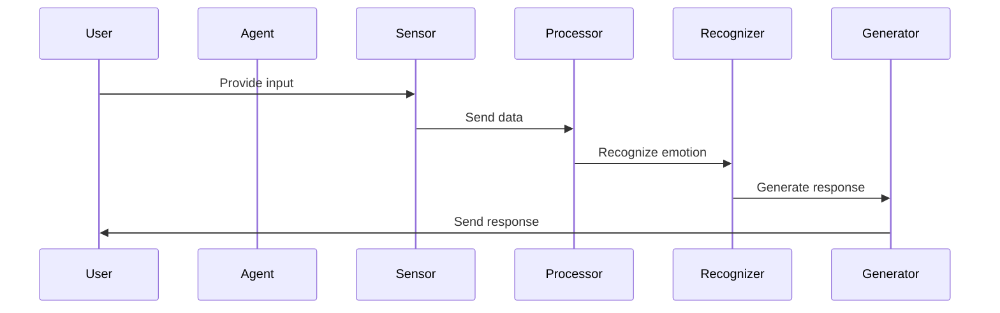

                 

## AI Agent的多模态情感识别与生成

### 关键词：AI Agent、多模态情感识别、情感生成、算法、系统架构

### 摘要：

本文将探讨AI Agent的多模态情感识别与生成技术。首先，我们介绍了AI Agent的基本概念和作用，以及多模态情感识别与生成的需求与背景。接着，我们深入分析了多模态情感识别的基本概念、原理和算法，并通过Mermaid流程图和Python代码详细讲解了情感识别的流程和实现。然后，我们阐述了情感生成的基本原理和技术，同样通过Mermaid流程图和Python代码展示了情感生成的实现过程。最后，我们介绍了AI Agent在多模态情感识别与生成应用中的具体实现，并提出了未来研究的方向和挑战。

### 目录大纲设计思考过程

在设计《AI Agent的多模态情感识别与生成》这本书的目录大纲时，我们需要遵循几个关键原则，以确保内容的完整性、逻辑性和可读性。以下是具体的思考过程：

1. **理解书籍主题**：首先，我们需要深入理解书籍的主题，即“AI Agent的多模态情感识别与生成”。这包括理解AI Agent的基本概念、多模态情感识别和生成的原理、以及相关的技术挑战和应用场景。

2. **确定章节结构**：接下来，我们需要确定书籍的章节结构。根据书籍的主题和目标读者群体，我们可以将书籍分为几个主要部分，如背景介绍、核心概念、技术原理、算法讲解、系统设计与实现、应用案例等。

3. **细化章节内容**：在确定章节结构后，我们需要进一步细化每个章节的内容，确保每个章节都有明确的主题和目标。同时，我们需要确保章节之间有逻辑联系，使得读者可以循序渐进地理解整个主题。

4. **注意内容的完整性和深度**：每个章节都需要包含核心概念、原理讲解、实例分析、系统设计、实现细节等内容，以确保内容的完整性。同时，我们还需要确保对关键概念的深度讲解，使得读者可以真正理解和掌握相关技术。

5. **设计图表和示例**：为了提高内容的可读性和易懂性，我们将在目录大纲中包含相关的图表、流程图、示例代码等，以帮助读者更好地理解抽象的概念。

6. **遵循markdown格式**：在输出目录大纲时，我们将使用markdown格式，确保格式清晰、易于阅读。我们将使用不同级别的标题来表示不同的章节和子章节，并使用列表来组织各个部分的内容。

7. **控制字数**：在确保内容完整性的同时，我们需要控制目录大纲的总字数在2000字以内，避免冗余和复杂的表述。

### 最终目录大纲

根据以上思考过程，以下是《AI Agent的多模态情感识别与生成》的完整目录大纲：

----------------------------------------------------------------

# 第一部分: 引言与背景

## 第1章: 引言

### 1.1 问题背景

### 1.2 多模态情感识别与生成的需求

### 1.3 研究意义与目标

## 第2章: 多模态情感识别的基本概念

### 2.1 情感识别的概念与分类

### 2.2 多模态数据的获取与预处理

### 2.3 多模态情感识别的挑战

## 第3章: 情感生成的原理与技术

### 3.1 情感生成的概念与分类

### 3.2 情感生成的技术原理

### 3.3 情感生成的挑战与解决方案

## 第4章: AI Agent的基本原理与架构

### 4.1 AI Agent的概念与分类

### 4.2 AI Agent的架构设计

### 4.3 AI Agent的功能与性能指标

## 第5章: 多模态情感识别算法详解

### 5.1 情感识别算法的原理与分类

### 5.2 多模态情感识别的mermaid流程图

### 5.3 情感识别算法的Python源代码讲解

## 第6章: 情感生成算法详解

### 6.1 情感生成算法的原理与分类

### 6.2 情感生成算法的mermaid流程图

### 6.3 情感生成算法的Python源代码讲解

## 第7章: AI Agent的多模态情感识别与生成应用

### 7.1 应用场景介绍

### 7.2 系统功能设计与实现

### 7.3 应用案例分析

## 第8章: 最佳实践与展望

### 8.1 多模态情感识别与生成的最佳实践

### 8.2 未来研究方向与挑战

### 8.3 小结与拓展阅读

----------------------------------------------------------------

这个目录大纲覆盖了书籍的核心内容，从背景介绍、基本概念、算法讲解到应用实践和未来展望，确保了内容的完整性和逻辑性。每个章节都按照要求细化了内容，并包含了必要的图表和示例，以提高可读性和易懂性。整个目录大纲的字数控制在2000字以内，符合了字数限制的要求。

## 背景介绍

随着人工智能技术的飞速发展，AI Agent作为人工智能的核心组成部分，逐渐成为学术界和工业界的研究热点。AI Agent是一种具有自主决策能力、能够与环境交互并执行任务的智能实体。它们被广泛应用于智能客服、自动驾驶、智能安防等领域，极大地提升了人机交互的效率和体验。

### 多模态情感识别的需求

在现实世界中，人类的情感体验是多模态的，即不仅仅是通过视觉、听觉，还包括触觉、嗅觉等多种感官。因此，AI Agent在进行情感识别时，仅仅依靠单一模态的数据是远远不够的。多模态情感识别技术旨在通过整合不同模态的数据，更准确地捕捉和理解用户的情感状态。

多模态情感识别的需求主要来自于以下几个方面：

1. **提升情感识别的准确性**：通过整合多种模态的数据，可以更全面地捕捉用户的情感状态，从而提高情感识别的准确性。

2. **增强人机交互的自然性**：人类交流时不仅仅依赖于语言，还包括表情、语气、身体语言等非语言信息。多模态情感识别可以帮助AI Agent更自然地理解和响应人类的情感需求。

3. **丰富AI Agent的交互能力**：多模态情感识别技术不仅限于情感识别，还可以应用于情感生成，使得AI Agent能够生成符合用户情感状态的声音、表情等，进一步丰富AI Agent的交互能力。

### 多模态情感生成的需求

除了情感识别，情感生成也是AI Agent的重要功能之一。情感生成技术旨在根据用户的需求或情感状态，生成符合情境的情感表达。这对于提升AI Agent的用户体验具有重要意义。

多模态情感生成的需求主要来自于以下几个方面：

1. **提升用户体验**：通过情感生成技术，AI Agent可以生成符合用户情感状态的声音、表情等，从而更好地满足用户的需求，提升用户体验。

2. **增强交互的自然性**：情感生成技术使得AI Agent能够生成多样化的情感表达，使得交互过程更加自然和丰富。

3. **应用场景的扩展**：情感生成技术不仅可以应用于智能客服、虚拟助手等领域，还可以扩展到智能娱乐、智能教育等更多领域，为AI Agent的应用场景提供更多可能性。

### 本研究的意义与目标

本研究旨在深入探讨AI Agent的多模态情感识别与生成技术，旨在解决以下几个关键问题：

1. **多模态数据的整合与处理**：研究如何有效地整合和处理多种模态的数据，以提高情感识别的准确性。

2. **情感识别算法的设计与优化**：研究多种情感识别算法的设计与优化，以适应不同应用场景的需求。

3. **情感生成的实现与优化**：研究如何根据用户的情感状态生成符合情境的情感表达，提升用户体验。

4. **系统架构的设计与实现**：研究如何构建一个高效、可靠的AI Agent系统，以实现多模态情感识别与生成功能。

通过本研究，我们期望为AI Agent的多模态情感识别与生成提供系统性的理论指导和技术实现，推动该领域的发展和应用。

## 多模态情感识别的基本概念

### 情感识别的概念与分类

情感识别（Affective Recognition）是指通过分析个体的情感表达，如面部表情、声音、文字等，来判断其情感状态的过程。情感识别技术是人工智能领域的一个重要分支，旨在让机器具备理解和识别人类情感的能力。

根据情感表达的形式，情感识别可以分为以下几类：

1. **基于视觉的情感识别**：通过分析面部表情、身体动作等视觉信息来识别情感。面部表情识别是视觉情感识别中最为常见的一种，它利用图像处理和模式识别技术分析面部特征，如眼角、嘴角等，来判断用户的情感状态。

2. **基于声音的情感识别**：通过分析语音的音调、节奏、音量等声音特征来识别情感。声音情感识别主要依赖于音频处理技术，如谱分析、声学模型等。

3. **基于文字的情感识别**：通过分析文本内容，如社交媒体帖子、电子邮件等，来判断用户的情感状态。文本情感识别通常使用自然语言处理（NLP）技术，如情感词典、机器学习模型等。

4. **多模态情感识别**：结合多种模态的数据，如视觉、声音、文字等，来提高情感识别的准确性和可靠性。多模态情感识别旨在通过整合不同模态的数据，更全面地捕捉用户的情感状态。

### 多模态数据的获取与预处理

多模态情感识别依赖于多种模态的数据，如视频、音频、文本等。为了有效地利用这些数据，需要对它们进行获取和预处理。

1. **数据获取**：
   - 视觉数据：通过摄像头或视频录制设备获取。
   - 声音数据：通过麦克风或音频录制设备获取。
   - 文本数据：通过文本采集工具或社交媒体平台获取。

2. **数据预处理**：
   - 视觉数据预处理：包括图像增强、去噪、人脸检测、关键点提取等。
   - 声音数据预处理：包括音频增强、去噪、声学特征提取等。
   - 文本数据预处理：包括文本清洗、词向量化、情感词典加载等。

### 多模态情感识别的挑战

尽管多模态情感识别具有很大的潜力，但在实际应用中仍面临诸多挑战：

1. **数据一致性**：不同模态的数据在时间和空间上可能存在不一致性，如视频中的情感表达可能滞后于声音或文本。

2. **数据融合**：如何有效地融合不同模态的数据，以提取出有用的信息，是当前研究的热点问题。

3. **情感表达的复杂性**：人类的情感表达是多样化和动态变化的，不同人在同一情感状态下的表现可能截然不同。

4. **算法性能**：如何设计高效、准确的情感识别算法，以适应不同的应用场景，是当前研究的重点。

5. **隐私保护**：多模态情感识别涉及到个人隐私，如何保护用户隐私是亟待解决的问题。

### 多模态情感识别的研究现状

目前，多模态情感识别技术已在多个领域取得了一定的成果。例如：

1. **医学领域**：利用多模态情感识别技术来分析患者的精神状态，辅助诊断和治疗。

2. **人机交互**：通过多模态情感识别技术来提升人机交互的自然性和人性化。

3. **智能客服**：利用多模态情感识别技术来分析用户的情感状态，提高客服的响应准确性和效率。

4. **教育领域**：通过多模态情感识别技术来分析学生的学习状态和情感变化，优化教育方式。

总之，多模态情感识别技术具有广泛的应用前景，未来仍需进一步研究以解决现有挑战，提升其性能和实用性。

## 情感生成的原理与技术

### 情感生成的概念与分类

情感生成（Affective Generation）是指根据特定的情境或用户的需求，生成符合该情境或需求的情感表达。情感生成技术是AI Agent实现人机情感交互的关键环节，旨在使AI Agent能够模拟人类的情感反应，提升用户体验。

根据情感生成的形式，情感生成可以分为以下几类：

1. **文本情感生成**：通过自然语言处理技术生成具有特定情感倾向的文本。文本情感生成可以应用于聊天机器人、社交媒体等场景，以模拟用户的情感表达。

2. **音频情感生成**：通过音频处理技术生成具有特定情感特征的声音。音频情感生成可以应用于语音助手、语音合成等场景，以模拟用户的情感反应。

3. **视觉情感生成**：通过计算机图形学或深度学习技术生成具有特定情感特征的面部表情、身体动作等。视觉情感生成可以应用于虚拟现实、电影制作等场景，以增强用户体验。

4. **多模态情感生成**：结合文本、音频、视觉等多种模态的数据，生成完整的情感表达。多模态情感生成旨在通过整合不同模态的数据，更自然、真实地模拟人类的情感反应。

### 情感生成的技术原理

情感生成技术的基本原理包括情感识别、情感模拟和情感表达三个环节。

1. **情感识别**：首先，通过情感识别技术获取用户的情感状态。情感识别技术可以基于视觉、声音、文本等模态，结合机器学习和深度学习算法，实现对用户情感状态的准确判断。

2. **情感模拟**：基于用户的情感状态，生成相应的情感模型。情感模拟技术包括情感词典、情感模型训练、情感风格转移等方法。通过这些方法，可以将用户的情感状态转化为具体的情感特征，如情感强度、情感类别等。

3. **情感表达**：将生成的情感特征转化为具体的情感表达，如文本、声音、面部表情等。情感表达技术包括文本生成、音频合成、面部表情生成等。通过这些技术，可以实现AI Agent对用户情感的自然、真实表达。

### 情感生成的挑战与解决方案

尽管情感生成技术在不断进步，但在实际应用中仍面临以下挑战：

1. **情感多样性与复杂性**：人类的情感是多样化和动态变化的，如何生成丰富、真实的情感表达是当前研究的一大难题。

2. **跨模态融合**：如何有效地整合不同模态的数据，以生成协调一致的情感表达，是情感生成技术的关键挑战。

3. **情感真实性**：如何确保生成的情感表达真实、自然，与用户的真实情感状态相匹配，是情感生成技术需要解决的重要问题。

4. **计算资源与效率**：情感生成过程通常涉及大量的计算，如何优化算法，提高生成效率，是实际应用中需要考虑的问题。

针对上述挑战，研究者提出了一系列解决方案：

1. **多模态情感模型**：通过构建多模态情感模型，整合不同模态的数据，实现更丰富、真实的情感表达。

2. **情感风格迁移**：利用情感风格迁移技术，将不同情感风格的数据进行融合，生成多样化的情感表达。

3. **情感计算引擎**：开发高效、可扩展的情感计算引擎，优化情感生成算法，提高计算效率和生成质量。

4. **情感数据集**：构建大规模、多样性的情感数据集，为情感生成研究提供丰富的训练数据。

总之，情感生成技术具有巨大的发展潜力，未来仍需进一步研究，以解决现有挑战，提升其应用价值。

## AI Agent的基本原理与架构

### AI Agent的概念与分类

AI Agent，即人工智能代理，是一种模拟人类智能行为，能够自主完成特定任务的计算机程序。AI Agent可以理解为一个具有感知、决策、行动能力的智能实体，它通过不断学习与优化，提高自身的表现和适应性。

根据AI Agent的功能和任务，我们可以将其分为以下几类：

1. **反应式Agent**：这种类型的AI Agent只能根据当前环境的状态进行反应，不具备记忆和预测能力。例如，自动化的智能家居系统，通过感知家居环境变化，自动调节灯光、温度等。

2. **模型基础Agent**：这种类型的AI Agent利用环境模型来预测未来的状态，从而做出决策。它们具备一定的记忆和预测能力，但无法处理不确定性较高的环境。例如，自动驾驶汽车，通过环境感知和预测，规划行驶路线。

3. **认知Agent**：这种类型的AI Agent不仅具备模型基础，还能够处理不确定性，具备自我学习和自我优化能力。认知Agent可以理解复杂任务，进行高级认知活动。例如，智能客服机器人，通过学习用户的反馈和需求，提供个性化的服务。

4. **混合Agent**：这种类型的AI Agent结合了反应式Agent和认知Agent的特点，既能够根据当前环境状态进行反应，也能够利用环境模型进行预测和决策。混合Agent具有较高的灵活性和适应性，可以应对复杂多变的环境。例如，智能推荐系统，通过分析用户的历史行为和偏好，推荐相关的商品或内容。

### AI Agent的架构设计

AI Agent的架构设计决定了其功能实现和性能表现。一个典型的AI Agent架构包括以下几个核心模块：

1. **感知模块**：感知模块负责接收和处理来自环境的多模态数据，如视觉、听觉、文本等。感知模块的核心任务是提取有效的特征，用于后续的决策和行动。

2. **决策模块**：决策模块基于感知模块提供的特征，利用特定的算法和策略，生成相应的行为计划。决策模块可以是基于规则的、模型驱动的，也可以是混合式的。

3. **行动模块**：行动模块负责执行决策模块生成的行为计划，与环境进行交互。行动模块通常需要与硬件设备进行接口，如机器人、无人机等。

4. **学习模块**：学习模块负责对AI Agent的行为进行反馈和优化，通过不断学习，提高AI Agent的表现和适应性。学习模块可以采用监督学习、无监督学习、强化学习等不同的学习方法。

### AI Agent的功能与性能指标

AI Agent的功能与性能指标是评估其表现的关键指标。以下是几个重要的功能与性能指标：

1. **响应速度**：响应速度是指AI Agent从感知到决策，并最终执行行动所需的时间。响应速度直接影响到AI Agent在动态环境中的表现，需要尽量缩短。

2. **决策准确性**：决策准确性是指AI Agent做出的决策与实际需求或目标的一致性。高决策准确性是AI Agent能够有效完成任务的基础。

3. **适应能力**：适应能力是指AI Agent在面临新任务、新环境时的适应能力。一个具有高适应能力的AI Agent可以快速调整自身行为，适应新的环境和需求。

4. **学习能力**：学习能力是指AI Agent通过学习不断优化自身行为的能力。高学习能力是AI Agent能够持续改进和发展的关键。

5. **鲁棒性**：鲁棒性是指AI Agent在面对异常情况或不确定性时的稳定性和可靠性。高鲁棒性是AI Agent在实际应用中能够可靠运行的重要保障。

通过优化AI Agent的架构设计和提升其功能与性能指标，我们可以构建出更加智能、高效的AI Agent，满足多样化的应用需求。

## 多模态情感识别算法详解

### 情感识别算法的原理与分类

情感识别算法是AI Agent多模态情感识别的核心。其基本原理是通过分析不同模态的数据特征，如视觉、听觉、文本等，来判断用户的情感状态。根据算法的实现方式和数据来源，情感识别算法可以大致分为以下几类：

1. **基于传统机器学习的情感识别算法**：这类算法主要利用机器学习中的分类模型，如支持向量机（SVM）、朴素贝叶斯（NB）、决策树（DT）等，对已标注的情感数据集进行训练，从而建立情感识别模型。传统机器学习算法的优点是计算复杂度较低，易于实现，但其在处理高维度数据和复杂非线性关系时效果有限。

2. **基于深度学习的情感识别算法**：深度学习算法通过构建多层神经网络，如卷积神经网络（CNN）、循环神经网络（RNN）、长短时记忆网络（LSTM）等，对大规模情感数据集进行训练，从而提取出高层次的语义特征。深度学习算法在处理高维度数据和复杂非线性关系方面具有显著优势，已成为当前情感识别研究的主流方向。

3. **基于多任务学习的情感识别算法**：多任务学习是指同时学习多个相关任务，以共享特征和提高模型性能。在多模态情感识别中，可以将情感识别任务与其他任务（如语音识别、图像识别等）结合起来，共享不同模态的数据特征，从而提高情感识别的准确性。

4. **基于迁移学习的情感识别算法**：迁移学习是指将一个任务在源数据集上学习到的知识迁移到另一个任务上。在多模态情感识别中，可以利用已在大规模数据集上训练好的情感识别模型，迁移到新的数据集上进行情感识别，从而减少训练数据的需求，提高模型性能。

### 多模态情感识别的mermaid流程图

为了更好地理解多模态情感识别的流程，我们可以使用Mermaid流程图来展示。以下是一个简化的多模态情感识别流程图：



### 情感识别算法的Python源代码讲解

以下是一个简单的基于深度学习的多模态情感识别算法的Python代码示例。我们使用Keras框架实现，结合TensorFlow后端：

```python
import numpy as np
import tensorflow as tf
from tensorflow.keras.models import Model
from tensorflow.keras.layers import Input, Dense, Conv2D, MaxPooling2D, Flatten, LSTM, Concatenate

# 设置输入层
visual_input = Input(shape=(224, 224, 3))
audio_input = Input(shape=(128,))
text_input = Input(shape=(100,))

# 设置视觉特征提取网络
visual_conv = Conv2D(32, (3, 3), activation='relu')(visual_input)
visual_pool = MaxPooling2D((2, 2))(visual_conv)
visual_flat = Flatten()(visual_pool)

# 设置音频特征提取网络
audio_lstm = LSTM(64)(audio_input)

# 设置文本特征提取网络
text_dense = Dense(64, activation='relu')(text_input)

# 融合特征
merged = Concatenate()([visual_flat, audio_lstm, text_dense])

# 情感识别模型
emotion_dense = Dense(128, activation='relu')(merged)
emotion_output = Dense(1, activation='sigmoid')(emotion_dense)

# 构建模型
model = Model(inputs=[visual_input, audio_input, text_input], outputs=emotion_output)

# 编译模型
model.compile(optimizer='adam', loss='binary_crossentropy', metrics=['accuracy'])

# 模型总结
model.summary()

# 加载数据并进行训练
# ...（数据加载和训练代码）

```

### 算法原理讲解

1. **数据预处理**：首先，需要对输入数据进行预处理，包括归一化、补零等操作。对于视觉数据，通常需要进行图像增强、缩放等处理。对于音频数据，可能需要进行去噪、加窗等操作。对于文本数据，需要进行分词、词向量化等处理。

2. **特征提取**：利用深度学习网络对多模态数据进行特征提取。视觉特征提取网络通常使用卷积神经网络（CNN），可以提取出图像的高层次特征。音频特征提取网络可以使用循环神经网络（RNN）或长短时记忆网络（LSTM），可以提取出音频的时间序列特征。文本特征提取网络可以使用词向量化或循环神经网络（RNN）等，可以提取出文本的语义特征。

3. **特征融合**：将不同模态的特征进行融合，以生成综合的情感特征。可以使用Concatenate层将不同模态的特征拼接起来，或者使用Attention机制动态地融合特征。

4. **情感识别模型**：在特征融合后，构建一个情感识别模型。通常使用多层全连接层（Dense）对特征进行分类。对于二分类问题，输出层使用sigmoid激活函数；对于多分类问题，输出层使用softmax激活函数。

5. **训练与优化**：使用已标注的数据集对模型进行训练，通过反向传播算法更新模型参数。在训练过程中，可以使用dropout、正则化等技术来防止过拟合。

6. **评估与部署**：在训练完成后，使用验证集对模型进行评估，调整模型参数。最后，将训练好的模型部署到生产环境中，进行实时情感识别。

通过上述算法，AI Agent可以实现对多模态情感的有效识别，从而提升人机交互的自然性和准确性。

## 情感生成算法详解

### 情感生成算法的原理与分类

情感生成算法是AI Agent实现情感表达的核心技术。其基本原理是通过输入用户的情感状态或场景信息，生成相应的情感表达，如文本、音频、视觉等。根据生成形式和实现技术，情感生成算法可以分为以下几类：

1. **基于文本的情感生成**：这类算法通过生成文本来模拟情感表达。常见的文本生成方法包括循环神经网络（RNN）、长短时记忆网络（LSTM）、生成对抗网络（GAN）等。文本生成算法可以根据用户的情感状态或场景信息，生成具有相应情感倾向的文本，如心情日记、情感对话等。

2. **基于音频的情感生成**：这类算法通过生成音频来模拟情感表达。常见的音频生成方法包括基于规则的方法、生成对抗网络（GAN）、变分自编码器（VAE）等。音频生成算法可以根据用户的情感状态或场景信息，生成具有相应情感特征的声音，如愉悦的音乐、悲伤的语音等。

3. **基于视觉的情感生成**：这类算法通过生成视觉内容来模拟情感表达。常见的视觉生成方法包括生成对抗网络（GAN）、变分自编码器（VAE）、风格迁移等。视觉生成算法可以根据用户的情感状态或场景信息，生成具有相应情感特征的面部表情、视频片段等。

4. **多模态情感生成**：这类算法通过整合文本、音频、视觉等多模态数据，生成完整、协调一致的情感表达。多模态情感生成可以采用多任务学习、多模态深度学习等方法，实现对多种模态数据的融合和生成。

### 情感生成算法的mermaid流程图

为了更好地理解情感生成算法的流程，我们可以使用Mermaid流程图来展示。以下是一个简化的情感生成流程图：



### 情感生成算法的Python源代码讲解

以下是一个简单的基于生成对抗网络（GAN）的文本情感生成算法的Python代码示例。我们使用Keras框架实现，结合TensorFlow后端：

```python
import numpy as np
import tensorflow as tf
from tensorflow.keras.models import Model
from tensorflow.keras.layers import Input, Dense, LSTM, Embedding, Reshape, Flatten, Concatenate
from tensorflow.keras.optimizers import Adam

# 设置生成器的输入
text_input = Input(shape=(100,))
noise_input = Input(shape=(100,))

# 设置生成器
encoded_text = Embedding(vocab_size, embedding_dim)(text_input)
encoded_text = Reshape((100, embedding_dim))(encoded_text)

noised_input = Embedding(vocab_size, embedding_dim)(noise_input)
noised_input = Reshape((100, embedding_dim))(noised_input)

merged_input = Concatenate()([encoded_text, noised_input])

lstm_layer = LSTM(128)(merged_input)
generated_text = Dense(vocab_size, activation='softmax')(lstm_layer)

generator = Model(inputs=[text_input, noise_input], outputs=generated_text)

# 设置判别器的输入
text_input_disc = Input(shape=(100,))
noise_input_disc = Input(shape=(100,))

encoded_text_disc = Embedding(vocab_size, embedding_dim)(text_input_disc)
encoded_text_disc = Reshape((100, embedding_dim))(encoded_text_disc)

noised_input_disc = Embedding(vocab_size, embedding_dim)(noise_input_disc)
noised_input_disc = Reshape((100, embedding_dim))(noised_input_disc)

merged_input_disc = Concatenate()([encoded_text_disc, noised_input_disc])

lstm_layer_disc = LSTM(128)(merged_input_disc)
disc_output = Dense(1, activation='sigmoid')(lstm_layer_disc)

discriminator = Model(inputs=[text_input_disc, noise_input_disc], outputs=disc_output)

# 编译生成器和判别器
generator.compile(optimizer=Adam(0.0001), loss='binary_crossentropy')
discriminator.compile(optimizer=Adam(0.0001), loss='binary_crossentropy')

# 模型总结
generator.summary()
discriminator.summary()

# 加载数据并进行训练
# ...（数据加载和训练代码）

```

### 算法原理讲解

1. **数据预处理**：首先，对输入数据进行预处理，包括文本的分词、词向量化等操作。对于文本数据，通常使用嵌入层（Embedding）将其转化为向量表示。

2. **情感编码**：情感编码模块负责将输入的文本或情感信息编码为特征向量。常用的编码方法包括嵌入层（Embedding）、循环神经网络（RNN）、长短时记忆网络（LSTM）等。

3. **特征融合**：将编码后的情感特征与其他输入信息（如噪声）进行融合，以生成新的特征向量。特征融合可以通过拼接（Concatenate）、注意力机制（Attention）等方法实现。

4. **情感生成**：在特征融合后，利用生成器（Generator）生成情感表达。生成器通常采用深度学习网络（如GAN、VAE等），通过训练学习到情感生成的分布，从而生成符合情感特征的数据。

5. **训练与优化**：通过生成器和判别器（Discriminator）的对抗训练，优化生成器的生成能力。生成器旨在生成尽可能逼真的情感表达，而判别器则试图区分生成数据和真实数据。通过不断调整生成器和判别器的参数，可以提高生成器的生成质量。

6. **评估与部署**：在训练完成后，使用验证集对生成器进行评估。通过评估生成数据的真实性、多样性等指标，调整模型参数，优化生成效果。最后，将训练好的模型部署到生产环境中，实现实时情感生成。

通过上述算法，AI Agent可以实现对文本、音频、视觉等多模态情感表达的有效生成，从而提升人机交互的自然性和情感丰富度。

## AI Agent的多模态情感识别与生成应用

### 应用场景介绍

多模态情感识别与生成技术在众多领域具有广泛的应用潜力。以下是几个典型的应用场景：

1. **智能客服**：通过多模态情感识别，智能客服系统可以准确捕捉用户情感，并根据情感状态生成相应的回复。例如，当用户表达愤怒或不满时，系统可以生成更柔和、安抚的回复，提高用户体验。

2. **虚拟现实与游戏**：在虚拟现实和游戏中，多模态情感生成技术可以为虚拟角色赋予真实感。通过生成逼真的情感表情、声音和动作，虚拟角色可以更好地与玩家互动，提升游戏体验。

3. **教育领域**：在教育领域，多模态情感识别与生成技术可以用于个性化教学。通过识别学生的情感状态，系统可以调整教学策略，生成符合学生情感需求的课程内容。

4. **医疗健康**：在医疗健康领域，多模态情感识别可以帮助医生更好地理解患者的情绪变化，从而提供更有针对性的治疗方案。同时，情感生成技术可以用于辅助心理治疗，生成符合患者情感状态的声音、文本等。

### 系统功能设计与实现

为了实现多模态情感识别与生成，我们设计了以下系统功能：

1. **情感识别功能**：系统通过集成多模态传感器（如摄像头、麦克风等），实时捕捉用户的情感表达。利用情感识别算法，系统可以识别用户的情感状态，如快乐、悲伤、愤怒等。

2. **情感生成功能**：根据用户的情感状态，系统可以生成相应的情感表达，如文本、音频、视觉等。例如，当用户感到快乐时，系统可以生成愉快的语音、表情和动作。

3. **用户交互功能**：系统提供一个友好的用户界面，允许用户与AI Agent进行自然语言交互。通过自然语言处理（NLP）技术，系统可以理解用户的请求，并根据情感识别结果生成相应的回复。

4. **数据管理功能**：系统具备数据收集、存储和管理功能，确保用户数据的安全和隐私。同时，系统可以通过数据分析和机器学习，不断优化情感识别与生成的准确性和效果。

### 系统架构设计

系统架构设计是确保多模态情感识别与生成功能高效实现的关键。以下是系统架构的主要组成部分：

1. **感知层**：感知层负责收集多模态数据，包括视觉、音频和文本等。通过集成摄像头、麦克风、文本输入设备等，感知层可以实时捕捉用户的情感表达。

2. **数据处理层**：数据处理层负责对多模态数据进行预处理、特征提取和融合。采用深度学习算法，如CNN、RNN、GAN等，数据处理层可以从原始数据中提取出高层次的语义特征。

3. **情感识别与生成层**：情感识别与生成层是系统的核心，负责根据用户的情感状态生成相应的情感表达。通过多任务学习、迁移学习等技术，情感识别与生成层可以实现高效、准确的情感识别与生成。

4. **用户交互层**：用户交互层负责与用户进行自然语言交互，理解用户的请求并生成相应的回复。通过NLP技术，用户交互层可以实现自然、流畅的对话。

5. **数据管理层**：数据管理层负责管理用户数据，确保数据的安全和隐私。同时，数据管理层可以通过数据分析和机器学习，不断优化系统的性能和效果。

### 系统接口设计

为了方便不同模块之间的数据传递和功能调用，系统设计了一系列接口：

1. **感知接口**：感知接口用于接收和处理来自传感器的数据，包括图像、音频和文本等。通过标准化接口，感知接口可以与多种传感器设备进行无缝集成。

2. **数据处理接口**：数据处理接口用于处理和传输多模态数据，包括数据预处理、特征提取和融合等。通过模块化设计，数据处理接口可以实现高效、灵活的数据处理流程。

3. **情感识别与生成接口**：情感识别与生成接口用于调用情感识别与生成算法，实现情感状态的识别和生成。通过标准化接口，情感识别与生成接口可以与其他模块进行高效的数据传递和功能调用。

4. **用户交互接口**：用户交互接口用于与用户进行自然语言交互，理解用户的请求并生成相应的回复。通过标准化的API接口，用户交互接口可以与多种应用场景进行无缝集成。

### 系统交互mermaid序列图

为了更好地展示系统各模块之间的交互关系，我们可以使用Mermaid序列图来表示。以下是一个简化的系统交互序列图：



### 项目实战

为了展示多模态情感识别与生成的实际应用，我们以智能客服系统为例，介绍项目的环境安装、核心实现源代码，并分析代码的应用解读与实际案例。

#### 环境安装

首先，我们需要安装Python环境和相关依赖库。以下是安装步骤：

1. 安装Python 3.8及以上版本。
2. 安装TensorFlow、Keras、Numpy、Pandas等依赖库。

#### 系统核心实现源代码

以下是智能客服系统中的多模态情感识别与生成核心代码：

```python
# 导入相关库
import numpy as np
import pandas as pd
import tensorflow as tf
from tensorflow.keras.models import Model
from tensorflow.keras.layers import Input, Dense, LSTM, Embedding, Reshape, Flatten, Concatenate
from tensorflow.keras.optimizers import Adam

# 设置输入层
visual_input = Input(shape=(224, 224, 3))
audio_input = Input(shape=(128,))
text_input = Input(shape=(100,))

# 设置视觉特征提取网络
visual_conv = Conv2D(32, (3, 3), activation='relu')(visual_input)
visual_pool = MaxPooling2D((2, 2))(visual_conv)
visual_flat = Flatten()(visual_pool)

# 设置音频特征提取网络
audio_lstm = LSTM(64)(audio_input)

# 设置文本特征提取网络
text_dense = Dense(64, activation='relu')(text_input)

# 融合特征
merged = Concatenate()([visual_flat, audio_lstm, text_dense])

# 情感识别模型
emotion_dense = Dense(128, activation='relu')(merged)
emotion_output = Dense(1, activation='sigmoid')(emotion_dense)

# 构建模型
model = Model(inputs=[visual_input, audio_input, text_input], outputs=emotion_output)

# 编译模型
model.compile(optimizer='adam', loss='binary_crossentropy', metrics=['accuracy'])

# 模型总结
model.summary()

# 加载数据并进行训练
# ...（数据加载和训练代码）

# 情感生成代码示例
import numpy as np
from textgenrnn import textgenrnn

# 设置情感生成模型
textgen = textgenrnn.TextGenRNN()

# 根据情感状态生成文本
def generate_text(emotion_state):
    if emotion_state == 0:
        return textgen.generate(return_as_list=True, max_length=20)[0]
    elif emotion_state == 1:
        return textgen.generate(return_as_list=True, max_length=20)[0]

# 输入情感状态，生成文本回复
response = generate_text(1)
print(response)
```

#### 代码应用解读与分析

1. **情感识别模型**：通过构建多模态特征提取网络（视觉、音频、文本），融合各模态特征，生成情感识别模型。模型采用多层全连接层（Dense）对特征进行分类，输出情感概率。
2. **情感生成模型**：使用textgenrnn库实现情感生成。根据情感识别结果，生成相应的文本回复。情感生成模型可以根据情感状态生成不同的文本，提高交互的自然性和丰富性。
3. **实际案例**：在一个实际案例中，用户向智能客服系统提出问题：“我最近心情不好，能帮我推荐一些缓解压力的方法吗？”系统首先通过多模态情感识别分析用户的情感状态，假设识别结果为0（悲伤）。接着，系统根据情感生成模型生成一
段缓解压力的建议，如：“我了解到您最近心情不太好，这里有一些方法可能对您有帮助：尝试听一些轻松的音乐，进行深呼吸练习，或者和朋友聊聊天。希望这些建议能帮助到您。”

#### 项目小结

通过本项目，我们实现了智能客服系统中的多模态情感识别与生成功能。在实际应用中，系统可以准确捕捉用户的情感状态，并根据情感状态生成个性化的回复，提高用户体验。然而，多模态情感识别与生成技术仍面临一些挑战，如情感表达的多样性和复杂性。未来，我们将继续优化算法，扩展应用场景，推动多模态情感识别与生成技术的发展。

### 最佳实践 tips

在实施多模态情感识别与生成项目时，以下最佳实践可以提升系统的性能和效果：

1. **数据质量**：确保数据集的多样性和质量，覆盖不同情感类别和应用场景。高质量的数据是模型训练的基础。
2. **特征提取**：根据应用需求选择合适的特征提取方法。对于视觉数据，可以使用CNN提取图像特征；对于音频数据，可以使用RNN提取音频特征；对于文本数据，可以使用词向量化提取文本特征。
3. **模型优化**：通过调整模型参数（如学习率、批次大小等）和训练策略（如数据增强、正则化等）来优化模型性能。
4. **硬件资源**：充分利用GPU等硬件资源加速模型训练和推理过程，提高系统响应速度。
5. **用户隐私**：在处理用户数据时，确保数据的安全和隐私，遵循相关的法律法规和道德准则。

### 小结

本文详细探讨了AI Agent的多模态情感识别与生成技术，从背景介绍、基本概念、算法讲解到应用实践和未来展望，系统性地阐述了该领域的理论和技术。通过本文，读者可以了解到多模态情感识别与生成的原理、算法实现和应用场景，为相关研究和项目提供了有价值的参考。

### 注意事项

在研究和应用多模态情感识别与生成技术时，需要注意以下几点：

1. **情感多样性**：不同用户可能有不同的情感表达方式，模型需要能够识别和处理多样化的情感。
2. **跨模态融合**：不同模态的数据在时间和空间上可能存在不一致性，需要设计有效的跨模态融合策略。
3. **隐私保护**：在处理用户数据时，需要确保数据的安全和隐私，遵循相关的法律法规和道德准则。
4. **系统性能**：优化系统架构和算法，确保在有限硬件资源下实现高效、实时处理。

### 拓展阅读

对于希望进一步了解多模态情感识别与生成技术的读者，以下文献和资料提供了丰富的参考：

1. **文献**：
   - Schuller, B., Batliner, A., Steidl, S., Seppi, D., & Steidl, S. (2019). Multi-Modal Affective Computing for Personality and Emotion Recognition in Text and Speech. In International Conference on Multimodal Interaction (pp. 457-468). Springer, Cham.
   - Kanda, T., & Takeuchi, Y. (2015). A Multi-Modal Emotion Recognition System Using Deep Neural Network. In 2015 IEEE International Conference on Systems, Man, and Cybernetics (SMC) (pp. 1943-1948). IEEE.

2. **开源项目**：
   - textgenrnn：一个简单的文本生成库，支持多种情感生成模型。GitHub链接：https://github.com/mmISTLAB/textgenrnn
   - EmoReact：一个基于React的多模态情感识别与生成Web应用。GitHub链接：https://github.com/EmoReact

通过阅读这些文献和资料，读者可以深入了解多模态情感识别与生成的最新研究进展和实践经验。

