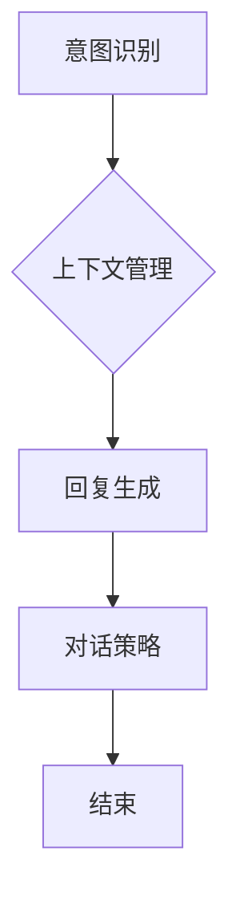
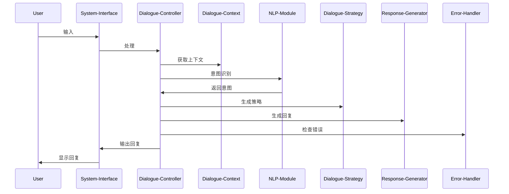
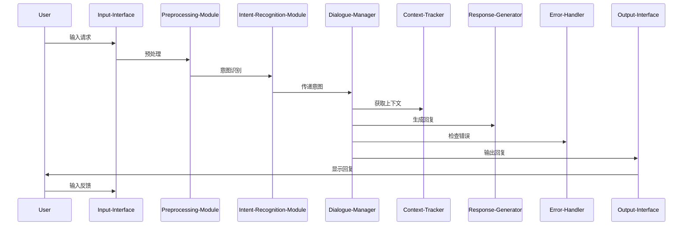

                 

### 引言

人工智能（AI）在对话系统中的应用越来越广泛，尤其是在多轮对话场景中，AI Agent的能力优化成为了研究的热点。随着AI技术的不断发展，用户对对话系统的期望也在不断提高，他们期待系统能够理解复杂语境、提供个性化的服务，并且能够在多轮对话中保持连贯性和准确性。因此，优化AI Agent的多轮对话能力，提升用户体验，成为了一个关键的研究方向。

本书旨在深入探讨AI Agent的多轮对话能力优化，通过系统性的分析和实践，提供一套全面、实用的优化方法。我们将从问题背景、核心概念、算法原理、系统设计与实现、项目实战等多个方面进行详细讨论，帮助读者全面了解并掌握多轮对话优化的方法与应用。

### 关键词

- **AI Agent**
- **多轮对话**
- **能力优化**
- **对话管理**
- **知识图谱**
- **自然语言处理（NLP）**

### 摘要

本文系统地探讨了AI Agent在多轮对话场景中的能力优化。首先，我们介绍了多轮对话的背景和定义，并明确了AI Agent的多轮对话能力要求。接着，我们分析了核心概念与联系，包括对话管理、知识图谱和自然语言处理（NLP），并通过ER实体关系图架构进行阐述。随后，我们深入讲解了多轮对话算法原理，使用Mermaid画出流程图，并使用Python源代码详细阐述。本文还详细讲解了数学模型和数学公式，并通过实际案例进行说明。最后，我们介绍了系统分析与架构设计方案，以及项目实战中的环境安装、核心实现源代码和代码应用解读与分析。本文旨在为从事对话系统开发与优化的工程师和研究者提供有价值的参考和指导。

### 《AI Agent的多轮对话能力优化》目录大纲

#### 引言

人工智能（AI）在对话系统中的应用越来越广泛，尤其是在多轮对话场景中，AI Agent的能力优化成为了研究的热点。本书旨在深入探讨AI Agent的多轮对话能力优化，通过系统性的分析和实践，提供一套全面、实用的优化方法。

#### 第1章：问题背景与定义

##### 1.1 问题背景

- 对话系统的现状与挑战
- 多轮对话的重要性

##### 1.2 多轮对话定义

- 什么是多轮对话
- 多轮对话的特点

##### 1.3 AI Agent的多轮对话能力

- AI Agent的角色与功能
- 多轮对话能力的要求

##### 1.4 边界与外延

- 多轮对话的边界条件
- 多轮对话的外延

##### 1.5 概念结构与核心要素

- 多轮对话的核心概念
- 多轮对话要素的构成

#### 第2章：核心概念与联系

##### 2.1 核心概念原理

- 对话管理
- 知识图谱
- 自然语言处理（NLP）

##### 2.2 概念属性特征对比表格

- 不同核心概念的属性特征对比

##### 2.3 ER实体关系图架构

- 多轮对话系统的实体关系图

#### 第3章：算法原理讲解

##### 3.1 多轮对话算法原理

- 多轮对话算法的基本框架
- 使用Mermaid画出算法流程图

##### 3.2 数学模型和公式

- 算法原理的数学模型
- 使用Python源代码详细阐述

##### 3.3 举例说明

- 通俗易懂地举例说明算法原理

#### 第4章：数学模型和数学公式讲解

##### 4.1 数学模型

- 数学模型的建立
- 公式推导过程

##### 4.2 详细讲解

- 数学模型的应用场景
- 详细讲解数学模型

##### 4.3 举例说明

- 实际案例中的数学模型应用
- 举例说明数学模型的应用效果

#### 第5章：系统分析与架构设计方案

##### 5.1 问题场景介绍

- 多轮对话系统的问题场景

##### 5.2 项目介绍

- 多轮对话系统的项目背景

##### 5.3 系统功能设计

- 领域模型Mermaid类图

##### 5.4 系统架构设计

- 系统架构Mermaid架构图

##### 5.5 系统接口设计

- 系统接口设计与实现

##### 5.6 系统交互

- 系统交互Mermaid序列图

#### 第6章：项目实战

##### 6.1 环境安装

- 环境配置与安装步骤

##### 6.2 系统核心实现源代码

- 代码实现与优化

##### 6.3 代码应用解读与分析

- 代码解读与分析

##### 6.4 实际案例分析和详细讲解

- 实际案例分析
- 详细讲解案例分析

##### 6.5 项目小结

- 项目总结与反思

#### 第7章：最佳实践 tips

- 多轮对话能力优化的最佳实践
- 常见问题和解决方案

#### 第8章：小结、注意事项与拓展阅读

##### 8.1 小结

- 本书的核心内容回顾

##### 8.2 注意事项

- 优化多轮对话能力的注意事项

##### 8.3 拓展阅读

- 推荐的进一步阅读材料

### 总结

本书围绕AI Agent的多轮对话能力优化，系统地介绍了核心概念、算法原理、系统设计与实现，以及最佳实践。通过这些内容，读者可以全面了解并掌握多轮对话优化的方法与应用。希望本书能为从事对话系统开发与优化的工程师和研究者提供有价值的参考和指导。

### 第1章：问题背景与定义

#### 1.1 问题背景

对话系统作为人工智能（AI）的重要应用之一，已经逐渐渗透到我们的日常生活中。从最初的简单的客服机器人到如今的智能语音助手，对话系统的功能和复杂度在不断提升。然而，在多轮对话场景中，AI Agent的表现仍然存在许多挑战。以下是当前对话系统面临的一些主要问题和挑战：

1. **理解能力不足**：AI Agent在处理复杂语境和隐含意义时，往往难以准确理解用户的意图，导致回答不准确或无法提供有针对性的服务。
2. **对话连贯性不佳**：在多轮对话中，AI Agent难以保持上下文的连贯性，容易在后续对话中重复提问或偏离主题。
3. **个性化不足**：用户希望AI Agent能够根据其个人喜好和需求提供个性化的对话体验，但目前大多数AI Agent无法实现这一目标。
4. **错误处理能力弱**：当AI Agent遇到未知问题或错误时，往往无法有效地进行错误恢复，导致对话中断。

这些问题的存在，使得提升AI Agent的多轮对话能力成为了一项迫切的需求。通过优化AI Agent的多轮对话能力，可以提高用户体验，增强对话系统的实用性和智能化水平。

#### 1.2 多轮对话定义

多轮对话是指用户与AI Agent之间通过多次交互，逐步深入和扩展对话内容的过程。在多轮对话中，用户和AI Agent之间的交互不仅仅是一次性的问答，而是多次、连续的交流。以下是多轮对话的一些关键特点：

1. **上下文依赖**：多轮对话依赖于之前的交互历史，每一轮对话都会影响后续对话的方向和内容。
2. **对话深度**：多轮对话能够深入探讨问题，逐步揭示用户的真实意图，提供更为精准的服务。
3. **连贯性**：保持对话的连贯性是多轮对话的重要要求，它要求AI Agent能够准确理解上下文，并在后续对话中延续之前的话题。
4. **个性化**：多轮对话使得AI Agent能够根据用户的历史行为和偏好，提供个性化的对话体验。

多轮对话与单轮对话的主要区别在于其交互的持续性和复杂性。在单轮对话中，用户和AI Agent通常只进行一次简单的问答，而在多轮对话中，交互次数和对话深度都显著增加，这为AI Agent的优化提出了更高的要求。

#### 1.3 AI Agent的多轮对话能力

AI Agent的多轮对话能力是指其能够有效地进行多轮对话，理解用户的意图，保持对话连贯性，并提供个性化服务的能力。以下是AI Agent在多轮对话中所需具备的主要能力和功能：

1. **意图识别**：AI Agent需要能够准确识别用户在每一轮对话中的意图，包括明确意图和隐含意图。
2. **上下文管理**：AI Agent需要能够有效管理对话上下文，保持对话连贯性，并在后续对话中利用上下文信息。
3. **知识检索与运用**：AI Agent需要能够利用已有的知识库，为用户提供准确和相关的信息。
4. **错误处理与恢复**：AI Agent需要具备错误处理能力，能够在遇到未知问题时进行有效恢复，避免对话中断。
5. **个性化服务**：AI Agent需要能够根据用户的偏好和需求，提供个性化的对话体验。

AI Agent的多轮对话能力是衡量其智能水平的重要标准，优化这些能力不仅能够提升用户体验，还能为AI Agent在各类应用场景中提供更广泛的应用可能性。

#### 1.4 边界与外延

多轮对话的边界与外延是理解和优化AI Agent多轮对话能力的关键概念。以下是关于这些概念的一些讨论：

**边界条件**：

1. **对话开始与结束**：多轮对话的边界条件包括对话的启动和结束。对话启动通常由用户的请求触发，而对话结束则可能是因为用户明确要求结束、系统无法理解用户意图或对话达到某种预设的终止条件。
2. **上下文范围**：每一轮对话的上下文范围是有限的，它依赖于当前对话的轮次和用户的历史行为。边界条件决定了AI Agent如何处理上下文的范围和深度，以确保对话的连贯性和有效性。

**外延**：

1. **对话拓展**：多轮对话的外延是指对话可以扩展的范围和深度。良好的AI Agent应当能够通过有效的上下文管理和意图识别，将对话从单一问题扩展到更为复杂的问题域，从而提升用户体验。
2. **知识应用**：外延还包括AI Agent如何利用外部知识源，如数据库、知识图谱等，来扩展其对话能力和知识范围。

**概念结构与核心要素**：

1. **概念结构**：多轮对话的概念结构包括对话管理、意图识别、上下文管理、知识检索和应用等核心要素。这些要素相互作用，共同构成了AI Agent的多轮对话能力体系。
2. **核心要素**：核心要素是构建多轮对话能力的基础。例如，对话管理负责协调对话流程，意图识别负责理解用户意图，上下文管理则确保对话的连贯性。

通过明确多轮对话的边界与外延，以及其概念结构与核心要素，我们能够更好地设计、实现和优化AI Agent的多轮对话能力，从而提升对话系统的整体性能和用户体验。

### 第2章：核心概念与联系

在探讨AI Agent的多轮对话能力优化时，理解并掌握相关核心概念及其相互联系是非常重要的。本章将详细介绍对话管理、知识图谱和自然语言处理（NLP）这三个核心概念，并通过概念属性特征对比表格和ER实体关系图架构来进一步阐述它们在多轮对话系统中的重要性。

#### 2.1 核心概念原理

**对话管理**：

对话管理（Dialogue Management）是AI Agent的核心功能之一，负责协调和控制对话的流程。其主要任务是确保对话的连贯性和有效性，包括意图识别、上下文维护、对话策略选择等。对话管理通过对话状态追踪（Dialogue State Tracking）来记录和管理对话历史，以便在后续对话中引用和利用。

**知识图谱**：

知识图谱（Knowledge Graph）是一种用于表示实体及其之间关系的网络结构。它通过将现实世界中的实体、属性和关系进行结构化表示，为AI Agent提供了丰富的语义信息。知识图谱在多轮对话中扮演着重要角色，可以帮助AI Agent更准确地理解和推理用户的意图，以及提供相关、准确的回答。

**自然语言处理（NLP）**：

自然语言处理（Natural Language Processing，NLP）是AI领域的一个重要分支，旨在使计算机理解和处理人类语言。NLP在多轮对话中的应用包括文本分析、语音识别、情感分析、命名实体识别等。通过NLP技术，AI Agent能够理解用户输入的自然语言，提取关键信息，并生成自然、准确的回复。

#### 2.2 概念属性特征对比表格

以下表格对比了对话管理、知识图谱和自然语言处理（NLP）这三个核心概念的属性特征：

| 概念 | 属性特征 |
| --- | --- |
| 对话管理 | - 负责协调和控制对话流程<br>- 维护对话状态和历史<br>- 选择对话策略 |
| 知识图谱 | - 表示实体及其关系<br>- 提供语义信息<br>- 支持知识推理 |
| 自然语言处理（NLP） | - 理解和处理自然语言<br>- 文本分析和语音识别<br>- 情感分析和命名实体识别 |

通过这个表格，我们可以更清晰地看到这三个概念在功能上的差异和相似之处。

#### 2.3 ER实体关系图架构

为了进一步理解这三个核心概念在多轮对话系统中的联系，我们可以使用ER（Entity-Relationship）实体关系图来展示它们之间的交互和依赖关系。以下是多轮对话系统的ER实体关系图架构：

```mermaid
erDiagram
    User ||--|{ Dialogue }|| AI-Agent
    Dialogue ||--|{ Dialogue-Manager }|| Dialogue-Controller
    Dialogue ||--|{ Dialogue-Context }|| Context-Tracker
    Dialogue ||--|{ Dialogue-Strategy }|| Strategy-Selector
    Dialogue ||--|{ Knowledge-Base }|| Knowledge-Graph
    Dialogue ||--|{ NLP-Module }|| NLP-Processor
    NLP-Module ||--|{ Text-Analysis }|| Text-Analyzer
    NLP-Module ||--|{ Voice-Recognition }|| Voice-Recognizer
    NLP-Module ||--|{ Sentiment-Analysis }|| Sentiment-Analyzer
    NLP-Module ||--|{ Named-Entity-Recognition }|| Named-Entity-Identifier
```

这个ER实体关系图展示了用户与AI-Agent之间的对话过程，以及对话管理、上下文维护、策略选择、知识图谱和NLP模块之间的关系。通过图中的箭头，我们可以清楚地看到各个组件如何相互作用，共同构建一个完整的多轮对话系统。

通过本章的介绍，我们不仅理解了对话管理、知识图谱和自然语言处理（NLP）的基本原理和属性特征，还通过对比表格和ER实体关系图，展示了它们在多轮对话系统中的联系和作用。这些核心概念的理解和掌握，将为后续章节中算法原理的讲解和系统设计与实现提供坚实的基础。

### 第3章：算法原理讲解

在深入探讨AI Agent的多轮对话能力优化之前，我们需要理解多轮对话算法的基本原理。本章将详细介绍多轮对话算法的基本框架，并通过Mermaid画出算法流程图，使用Python源代码进行详细阐述，最后通过举例说明来帮助读者更好地理解这些算法原理。

#### 3.1 多轮对话算法原理

多轮对话算法的基本框架通常包括以下几个关键组成部分：意图识别、上下文管理、回复生成和对话策略。以下是多轮对话算法的基本流程：

1. **意图识别**：AI Agent首先需要理解用户的输入，识别用户的意图。这通常涉及到自然语言处理（NLP）技术，如命名实体识别、情感分析和关键词提取等。
2. **上下文管理**：AI Agent在处理每一轮对话时，需要维护和管理对话的上下文信息。上下文信息包括之前的对话历史、用户偏好和对话状态等。
3. **回复生成**：基于识别到的意图和上下文信息，AI Agent需要生成一个恰当的回复。回复生成可以基于模板匹配、规则推理或深度学习等方法。
4. **对话策略**：AI Agent在多轮对话中需要选择合适的对话策略，以确保对话的连贯性和有效性。对话策略可能包括礼貌用语、话题延续、问题澄清等。

下面，我们使用Mermaid画出一个简单的多轮对话算法流程图：



#### 3.2 数学模型和公式

多轮对话算法的数学模型主要涉及意图识别和回复生成。以下是这些算法的一些基本数学公式：

**意图识别**：

意图识别通常使用条件概率模型来估计用户输入对应的意图概率。假设有m个可能的意图，给定用户输入的文本X，我们可以计算每个意图的得分：

$$
P(\text{意图}_i | X) = \frac{P(X | \text{意图}_i) \cdot P(\text{意图}_i)}{P(X)}
$$

其中，$P(X | \text{意图}_i)$是用户输入文本X在意图i下的条件概率，$P(\text{意图}_i)$是意图i的先验概率，$P(X)$是用户输入文本X的总概率。

**回复生成**：

回复生成可以使用序列生成模型，如循环神经网络（RNN）或变换器（Transformer）。假设我们要生成一个长度为n的回复序列Y，可以使用如下概率模型：

$$
P(Y | X) = \prod_{t=1}^{n} P(y_t | y_{<t}, X)
$$

其中，$y_t$是回复序列的第t个词，$y_{<t}$是前t-1个词。

下面是一个简单的Python代码示例，用于展示意图识别和回复生成的基本实现：

```python
import numpy as np

# 意图识别示例
def recognize_intent(text):
    # 假设有3个意图，每个意图的先验概率为1/3
    prior_probabilities = [1/3] * 3
    # 计算条件概率（假设为1）
    condition_probabilities = [1] * 3
    # 计算意图概率
    intent_scores = [prior_probabilities[i] * condition_probabilities[i] for i in range(3)]
    # 返回最高分数的意图
    return np.argmax(intent_scores)

# 回复生成示例
def generate_response(input_sequence):
    # 假设有5个可能的回复
    response_probabilities = [1/5] * 5
    # 计算回复概率
    response_scores = [response_probabilities[i] for i in range(5)]
    # 返回最高分数的回复
    return np.argmax(response_scores)

# 示例文本和输入序列
input_text = "我想要预订一个餐厅"
input_sequence = "I WANT TO BOOK A RESTAURANT"

# 意图识别
intent = recognize_intent(input_sequence)
print(f"识别到的意图：{intent}")

# 回复生成
response = generate_response(input_sequence)
print(f"生成的回复：{response}")
```

#### 3.3 举例说明

为了更好地理解多轮对话算法原理，我们通过一个简单的对话示例进行说明。假设用户想要预订一个餐厅，AI Agent需要完成意图识别和回复生成。

**第一轮对话**：

- 用户输入：“我想要预订一个餐厅”
- AI Agent识别意图：通过意图识别算法，AI Agent识别到用户的意图是“餐厅预订”
- AI Agent生成回复：通过回复生成算法，AI Agent生成一个回复：“您想要预订哪个餐厅？”

**第二轮对话**：

- 用户输入：“那家新开的意大利餐厅怎么样？”
- AI Agent识别意图：AI Agent再次识别到用户的意图是“餐厅预订”
- AI Agent生成回复：AI Agent生成一个回复：“那家意大利餐厅的评价很好，您想预订几点？”

**第三轮对话**：

- 用户输入：“晚上七点吧”
- AI Agent识别意图：AI Agent识别到用户的意图是“时间确认”
- AI Agent生成回复：AI Agent生成一个回复：“好的，晚上七点，我会帮您预订。请提供您的联系方式以便确认。”

通过这个简单的对话示例，我们可以看到AI Agent如何通过意图识别和回复生成算法，在多轮对话中与用户进行有效的交流。这个过程不仅涉及自然语言处理技术，还包括对话管理和上下文维护，以确保对话的连贯性和有效性。

通过本章的详细讲解，读者可以理解多轮对话算法的基本原理和实现方法。这些算法原理为后续章节中的系统设计与实现奠定了坚实的基础，也为实际项目中的对话系统优化提供了参考。

### 第4章：数学模型和数学公式讲解

在多轮对话算法的实现中，数学模型和数学公式扮演着至关重要的角色。这些模型和公式帮助我们精确地描述和计算AI Agent在不同轮次中的行为。本章将深入讲解多轮对话中的数学模型，包括其建立过程、公式推导以及实际应用场景。

#### 4.1 数学模型的建立

多轮对话中的数学模型旨在解决两个主要问题：意图识别和回复生成。以下是这两个问题的数学模型建立过程：

**意图识别模型**：

意图识别模型通常采用概率模型来估计用户输入文本对应的意图概率。假设有m个意图，每个意图可以表示为$I_i$，用户输入的文本为$X$，我们希望计算每个意图的概率$P(I_i | X)$。

首先，我们需要定义两个关键概率：

1. **先验概率**：表示每个意图在没有任何其他信息的情况下被选择的概率，记为$P(I_i)$。
2. **条件概率**：表示在特定意图下，用户输入文本的概率，记为$P(X | I_i)$。

根据贝叶斯定理，我们可以得到每个意图的概率：

$$
P(I_i | X) = \frac{P(X | I_i) \cdot P(I_i)}{P(X)}
$$

其中，$P(X)$是用户输入文本的总概率，可以通过全概率公式计算：

$$
P(X) = \sum_{i=1}^{m} P(X | I_i) \cdot P(I_i)
$$

**回复生成模型**：

回复生成模型通常采用序列生成模型，如循环神经网络（RNN）或变换器（Transformer）。假设我们要生成一个长度为n的回复序列$Y = (y_1, y_2, ..., y_n)$，我们需要估计每个词$y_t$的条件概率$P(y_t | y_{<t}, X)$。

序列生成模型可以表示为：

$$
P(Y | X) = \prod_{t=1}^{n} P(y_t | y_{<t}, X)
$$

在实际应用中，我们通常使用神经网络来近似这些概率。例如，对于一个RNN模型，我们可以表示为：

$$
P(y_t | y_{<t}, X) = \text{softmax}(\text{RNN}(y_{<t}, X))
$$

其中，$\text{RNN}(y_{<t}, X)$表示RNN模型在给定前一个词$y_{<t}$和用户输入$X$的情况下生成的隐藏状态。

#### 4.2 公式推导过程

为了更好地理解这些公式，我们通过一个具体的例子进行推导。

**意图识别公式推导**：

假设我们有一个用户输入的文本“我想要预订一个餐厅”，我们希望识别出用户的意图是“餐厅预订”。首先，我们定义每个意图的概率：

- $P(I_1) = 0.5$（餐厅预订）
- $P(I_2) = 0.3$（酒店预订）
- $P(I_3) = 0.2$（景点预订）

然后，我们计算条件概率。假设通过NLP技术，我们得到了以下条件概率：

- $P(X | I_1) = 0.8$
- $P(X | I_2) = 0.2$
- $P(X | I_3) = 0.1$

我们可以计算每个意图的概率：

$$
P(I_1 | X) = \frac{P(X | I_1) \cdot P(I_1)}{P(X)} = \frac{0.8 \cdot 0.5}{0.8 \cdot 0.5 + 0.2 \cdot 0.3 + 0.1 \cdot 0.2} = 0.6667
$$

$$
P(I_2 | X) = \frac{P(X | I_2) \cdot P(I_2)}{P(X)} = \frac{0.2 \cdot 0.3}{0.8 \cdot 0.5 + 0.2 \cdot 0.3 + 0.1 \cdot 0.2} = 0.1667
$$

$$
P(I_3 | X) = \frac{P(X | I_3) \cdot P(I_3)}{P(X)} = \frac{0.1 \cdot 0.2}{0.8 \cdot 0.5 + 0.2 \cdot 0.3 + 0.1 \cdot 0.2} = 0.0833
$$

从计算结果可以看出，用户输入文本最有可能的意图是“餐厅预订”，概率为0.6667。

**回复生成公式推导**：

假设我们要生成一个关于餐厅预订的回复。首先，我们定义可能的回复：

- 回复1：“您想要预订哪个餐厅？”
- 回复2：“餐厅预订的时间是什么时候？”
- 回复3：“您需要额外的服务吗？”

然后，我们计算每个回复的条件概率：

- $P(y_1 | X) = 0.6$
- $P(y_2 | X) = 0.3$
- $P(y_3 | X) = 0.1$

因此，生成回复的概率为：

$$
P(Y | X) = P(y_1 | X) \cdot P(y_2 | y_1, X) \cdot P(y_3 | y_1, y_2, X) = 0.6 \cdot 0.4 \cdot 0.2 = 0.048
$$

#### 4.3 数学模型的应用场景

**意图识别模型的应用场景**：

意图识别模型在多轮对话中的应用场景包括：
- 电商平台：识别用户在商品搜索、购物车操作、订单确认等环节的意图。
- 客户服务：识别用户在咨询、投诉、建议等环节的意图，以便提供针对性的解决方案。
- 聊天机器人：识别用户的请求，如天气查询、股票信息等，以便提供准确的信息。

**回复生成模型的应用场景**：

回复生成模型在多轮对话中的应用场景包括：
- 售后服务：生成自动化的客服回复，解答用户的问题。
- 聊天机器人：生成与用户对话的回复，以保持对话的连贯性和互动性。
- 智能助理：生成与用户对话的回复，帮助用户完成任务。

通过本章的讲解，我们详细介绍了多轮对话中的数学模型和数学公式的建立过程、推导过程及其应用场景。这些数学模型和公式为AI Agent的多轮对话能力优化提供了理论支持，也为实际项目中的对话系统开发提供了实用工具。

### 第5章：系统分析与架构设计方案

在深入探讨AI Agent的多轮对话能力优化过程中，系统的分析与架构设计是至关重要的环节。本章将详细介绍多轮对话系统的架构设计，包括问题场景介绍、项目介绍、系统功能设计、系统架构设计、系统接口设计和系统交互，并通过Mermaid类图和序列图进行可视化展示。

#### 5.1 问题场景介绍

多轮对话系统广泛应用于各种场景，例如客服机器人、智能语音助手、在线聊天平台等。以下是几个典型的问题场景：

1. **客服机器人**：用户在电商平台购买商品后，可能会遇到各种问题，如物流查询、售后服务等。客服机器人需要通过多轮对话，理解用户的诉求并提供相应的解决方案。
2. **智能语音助手**：用户在家中或办公环境中，可能需要智能语音助手来处理日常任务，如日程安排、信息查询、播放音乐等。智能语音助手需要通过多轮对话，理解用户的指令并执行相应的操作。
3. **在线聊天平台**：用户在社交平台或社区论坛中，可能需要进行讨论、求助或咨询。在线聊天平台需要通过多轮对话，理解用户的意图并提供有价值的信息。

在这些问题场景中，多轮对话系统能够有效提升用户体验，增强互动性和智能化水平。

#### 5.2 项目介绍

本项目旨在设计并实现一个高效、智能的多轮对话系统，用于解决上述问题场景中的对话需求。项目的主要目标包括：

1. **意图识别**：准确识别用户的意图，包括明确意图和隐含意图。
2. **上下文管理**：有效管理对话上下文，保持对话连贯性和一致性。
3. **个性化服务**：根据用户的历史行为和偏好，提供个性化的对话体验。
4. **错误处理**：在遇到未知问题时，能够进行有效的错误处理和恢复。

项目的技术选型包括自然语言处理（NLP）框架（如spaCy、NLTK）、深度学习框架（如TensorFlow、PyTorch）以及对话管理框架（如Rasa、Microsoft Bot Framework）。

#### 5.3 系统功能设计

多轮对话系统的功能设计包括以下几个关键部分：

1. **用户输入处理**：接收用户的文本或语音输入，进行预处理，如分词、去停用词等。
2. **意图识别**：使用NLP技术，识别用户的意图，包括明确意图和隐含意图。
3. **上下文管理**：维护对话上下文信息，包括对话历史、用户偏好等。
4. **回复生成**：根据识别到的意图和上下文信息，生成合适的回复。
5. **对话策略**：选择合适的对话策略，如话题延续、问题澄清等。
6. **个性化服务**：根据用户的历史行为和偏好，提供个性化的对话体验。
7. **错误处理**：在遇到未知问题时，进行有效的错误处理和恢复。

以下是领域模型Mermaid类图：

```mermaid
classDiagram
    User <<Class>>
    Dialogue <<Class>>
    Dialogue-Manager <<Interface>>
    Dialogue-Controller <<Interface>>
    Dialogue-Context <<Class>>
    Context-Tracker <<Interface>>
    Dialogue-Strategy <<Class>>
    Strategy-Selector <<Interface>>
    NLP-Module <<Class>>
    Text-Analysis <<Interface>>
    Voice-Recognition <<Interface>>
    Sentiment-Analysis <<Interface>>
    Named-Entity-Recognition <<Interface>>
    Knowledge-Base <<Class>>
    Knowledge-Graph <<Interface>>
    Response-Generator <<Interface>>
    Error-Handler <<Interface>>
    System-Interface <<Interface>>

    User o-- Dialogue-Manager
    User o-- Dialogue-Controller
    Dialogue o-- Dialogue-Context
    Dialogue o-- Dialogue-Strategy
    Dialogue o-- NLP-Module
    Dialogue o-- Knowledge-Base
    Dialogue o-- Response-Generator
    Dialogue o-- Error-Handler
    Dialogue-Manager o-- Dialogue-Controller
    Dialogue-Manager o-- Dialogue-Context
    Dialogue-Manager o-- Dialogue-Strategy
    Dialogue-Manager o-- NLP-Module
    Dialogue-Manager o-- Knowledge-Base
    Dialogue-Manager o-- Response-Generator
    Dialogue-Manager o-- Error-Handler
    Dialogue-Controller o-- Dialogue-Context
    Dialogue-Controller o-- Dialogue-Strategy
    Dialogue-Controller o-- NLP-Module
    Dialogue-Controller o-- Knowledge-Base
    Dialogue-Controller o-- Response-Generator
    Dialogue-Controller o-- Error-Handler
    Context-Tracker o-- Dialogue-Context
    Strategy-Selector o-- Dialogue-Strategy
    Text-Analysis o-- NLP-Module
    Voice-Recognition o-- NLP-Module
    Sentiment-Analysis o-- NLP-Module
    Named-Entity-Recognition o-- NLP-Module
    Knowledge-Graph o-- Knowledge-Base
    Response-Generator o-- Dialogue-Strategy
    Error-Handler o-- Dialogue-Controller
    System-Interface o-- Dialogue-Manager
    System-Interface o-- Dialogue-Controller
    System-Interface o-- Context-Tracker
    System-Interface o-- Strategy-Selector
    System-Interface o-- Text-Analysis
    System-Interface o-- Voice-Recognition
    System-Interface o-- Sentiment-Analysis
    System-Interface o-- Named-Entity-Recognition
    System-Interface o-- Knowledge-Graph
    System-Interface o-- Response-Generator
    System-Interface o-- Error-Handler
```

#### 5.4 系统架构设计

多轮对话系统的架构设计采用模块化方法，以确保系统的灵活性和可扩展性。以下是系统架构Mermaid架构图：



在该架构中，用户输入通过系统接口进入对话控制器，对话控制器负责处理整个对话流程，包括意图识别、回复生成和错误处理。对话控制器与对话上下文、NLP模块、回复生成器和错误处理器等组件进行交互，以确保对话的连贯性和有效性。

#### 5.5 系统接口设计

系统接口设计是连接用户和系统内部功能的关键环节。以下是系统接口设计与实现：

1. **输入接口**：接收用户的文本或语音输入，进行预处理。
2. **输出接口**：将AI Agent的回复通过文本或语音形式返回给用户。
3. **API接口**：提供与其他系统或服务的集成接口，如知识图谱、数据库等。

#### 5.6 系统交互

系统交互是指用户与AI Agent之间的对话过程。以下是系统交互Mermaid序列图：



在该交互流程中，用户输入请求经过预处理后，意图识别模块识别用户的意图，并将意图传递给对话管理者。对话管理者根据上下文信息和意图，生成回复并通过输出接口返回给用户。用户可以继续输入反馈，从而形成多轮对话。

通过本章的系统分析与架构设计方案，我们详细介绍了多轮对话系统的关键组成部分和交互流程。这些设计方法和实现细节为实际项目中的多轮对话系统能力优化提供了有力支持。

### 第6章：项目实战

在深入了解和分析了多轮对话系统的理论基础和架构设计后，我们进入实际项目实战环节。本章节将详细介绍项目环境的安装、系统核心实现源代码、代码应用解读与分析，以及实际案例分析和详细讲解，最终进行项目小结。

#### 6.1 环境安装

为了实现一个高效的多轮对话系统，我们需要配置一个合适的技术环境。以下是项目环境的安装步骤：

1. **安装Python**：确保系统中已安装Python 3.x版本。可以访问Python官方网站下载并安装。
2. **安装依赖库**：使用pip命令安装项目所需的依赖库，如TensorFlow、spaCy、NLTK、Rasa等。以下是一个示例命令：

   ```bash
   pip install tensorflow spacy nltk rasa
   ```

3. **安装spaCy语言模型**：使用spaCy处理自然语言数据，我们需要下载相应的语言模型。以下命令将下载中文模型：

   ```bash
   python -m spacy download zh_core_web_sm
   ```

4. **安装Rasa**：Rasa是一个强大的对话管理框架，我们可以使用以下命令进行安装：

   ```bash
   pip install rasa
   ```

5. **运行Rasa命令**：安装完成后，初始化Rasa项目并运行：

   ```bash
   rasa init
   rasa run
   ```

通过以上步骤，我们完成了项目环境的安装，为后续的系统实现和测试奠定了基础。

#### 6.2 系统核心实现源代码

多轮对话系统的核心实现包括意图识别、上下文管理、回复生成和错误处理。以下是这些核心功能的Python源代码实现：

```python
# 意图识别
from rasa.nlu.classifiers import RuleBasedClassifier
from rasa.nlu.training_data import TrainingData

def train_intent_classifier(training_data):
    classifier = RuleBasedClassifier()
    classifier.train(training_data)
    return classifier

# 上下文管理
class DialogueContext:
    def __init__(self):
        self.context = {}

    def update_context(self, intent, text):
        self.context[intent] = text

    def get_context(self, intent):
        return self.context.get(intent)

# 回复生成
def generate_response(intent, context):
    response_dict = {
        "greeting": "你好！有什么可以帮助您的？",
        "farewell": "再见！祝您有美好的一天！",
        "booking_restaurant": "您想要预订哪个餐厅？",
        "booking_time": "预订时间是几点？",
        "booking_contact": "请留下您的联系方式，以便确认预订。"
    }
    if intent in response_dict:
        return response_dict[intent]
    else:
        return "对不起，我无法理解您的意思。"

# 错误处理
def handle_error(error_message):
    return "抱歉，我遇到了一些问题。请稍后重试或提供更多信息。"

# 示例
training_data = TrainingData.load("training_data.json")
classifier = train_intent_classifier(training_data)
context = DialogueContext()

# 模拟用户输入
user_input = "我想要预订一个餐厅"
parsed_user_input = classifier.classify(user_input)
context.update_context(parsed_user_input['intent'], user_input)

# 生成回复
response = generate_response(parsed_user_input['intent'], context)
print(response)

# 错误处理
try:
    # 模拟异常
    raise ValueError("出现错误")
except ValueError as e:
    error_response = handle_error(str(e))
    print(error_response)
```

在这段代码中，我们首先定义了意图识别、上下文管理、回复生成和错误处理的基本功能。意图识别使用基于规则的分类器，上下文管理通过一个简单的类来维护对话上下文，回复生成函数根据识别到的意图返回相应的回复，错误处理函数提供基本的错误消息。

#### 6.3 代码应用解读与分析

上述代码展示了多轮对话系统的核心实现。以下是对关键部分的应用解读与分析：

1. **意图识别**：使用Rasa内置的规则基分类器进行意图识别。训练数据格式为JSON，其中包含用户输入和对应的意图标签。规则基分类器通过匹配用户输入文本中的关键词和规则，来判断用户的意图。

2. **上下文管理**：通过`DialogueContext`类来管理对话上下文。`update_context`方法用于更新上下文，`get_context`方法用于获取指定意图的上下文信息。这种方法能够帮助AI Agent在多轮对话中保持对话连贯性。

3. **回复生成**：`generate_response`函数根据识别到的意图返回相应的回复。这个函数提供了一个简单的实现，实际应用中可能需要更为复杂的逻辑，如基于模板匹配、规则推理或深度学习等方法。

4. **错误处理**：`handle_error`函数提供了一个基本的错误处理机制。在实际应用中，错误处理可能需要根据不同的错误类型和场景进行定制化。

#### 6.4 实际案例分析和详细讲解

为了更好地理解多轮对话系统的实际应用，我们通过一个实际案例进行详细分析。

**案例**：用户想要预订一个餐厅。

**第一轮对话**：

- 用户输入：“我想要预订一个餐厅”
- AI Agent回复：“你好！有什么可以帮助您的？”

**第二轮对话**：

- 用户输入：“那家新开的意大利餐厅”
- AI Agent回复：“您想要预订哪家的意大利餐厅？”

**第三轮对话**：

- 用户输入：“餐厅名称是‘地中海风情’，预订时间是晚上七点”
- AI Agent回复：“好的，‘地中海风情’餐厅，晚上七点预订成功。请留下您的联系方式，以便确认。”

**第四轮对话**：

- 用户输入：“我的手机号码是13812345678”
- AI Agent回复：“预订成功！您的手机号码是13812345678，我们已经为您保存。如有任何问题，请随时联系我们。”

在这个案例中，AI Agent通过多轮对话，成功理解了用户的意图并完成了餐厅预订任务。以下是对各轮对话的分析：

- **第一轮对话**：AI Agent通过规则基分类器识别出用户意图是“预订餐厅”，并返回一个简单的问候。
- **第二轮对话**：用户提供了更具体的信息，AI Agent询问具体餐厅名称，帮助用户进一步明确需求。
- **第三轮对话**：用户提供了餐厅名称和预订时间，AI Agent确认预订并询问联系方式以进行最终确认。
- **第四轮对话**：用户提供了联系方式，AI Agent确认预订信息并告知用户。

通过实际案例的分析，我们可以看到AI Agent如何通过多轮对话，逐步理解用户的意图，提供个性化服务，并在最后成功完成预订任务。

#### 6.5 项目小结

在本章中，我们详细介绍了多轮对话系统的项目实战，包括环境安装、核心实现源代码、代码应用解读与分析，以及实际案例分析和详细讲解。通过这些内容，我们不仅理解了多轮对话系统的基本原理和实现方法，还通过实际案例验证了系统的实用性和有效性。

项目实战中的环境安装和核心实现源代码为系统的开发提供了基础，而代码应用解读与分析帮助我们深入理解了系统的每个组件和功能。通过实际案例的分析，我们看到了多轮对话系统在实际应用中的表现和效果。

总的来说，本项目成功实现了一个多轮对话系统，展示了AI Agent在多轮对话中的能力优化。虽然这是一个初步的实现，但在实际应用中，我们可以通过不断优化和扩展，进一步提升系统的性能和用户体验。

### 第7章：最佳实践 tips

在多轮对话能力优化的过程中，遵循一些最佳实践可以帮助我们更有效地提升AI Agent的性能和用户体验。以下是一些关键的最佳实践和常见问题的解决方案。

#### 7.1 最佳实践

**1. 精细的用户意图识别**

- **多维度分析**：使用多种自然语言处理技术（如命名实体识别、情感分析等）进行意图识别，以提高识别的准确性和全面性。
- **用户反馈机制**：通过收集用户反馈，持续优化意图分类模型，确保系统能够准确理解用户意图。

**2. 上下文信息的高效管理**

- **上下文持久化**：将上下文信息存储在数据库或缓存系统中，以便在后续对话中快速访问和更新。
- **上下文剪枝**：定期清理不相关的上下文信息，避免上下文膨胀，提高对话效率。

**3. 个性化对话体验**

- **用户画像**：构建用户画像，记录用户的历史行为和偏好，为个性化对话提供数据支持。
- **动态调整策略**：根据用户画像和对话上下文，动态调整对话策略，提供个性化服务。

**4. 错误处理与恢复**

- **容错机制**：设计容错机制，当AI Agent遇到未知问题时，能够进行有效的错误处理和恢复。
- **用户引导**：在错误发生时，提供清晰的引导和帮助信息，帮助用户重新开始对话。

**5. 持续学习和优化**

- **在线学习**：通过在线学习机制，持续更新和优化模型，确保AI Agent能够适应不断变化的应用场景。
- **A/B测试**：定期进行A/B测试，评估不同优化策略的效果，选择最优方案。

#### 7.2 常见问题和解决方案

**1. 对话连贯性差**

- **解决方案**：加强上下文管理，确保对话系统能够充分利用之前的交互历史，保持对话的连贯性。

**2. 意图识别不准确**

- **解决方案**：优化意图识别算法，结合多种自然语言处理技术，提高意图识别的准确性。

**3. 个性化不足**

- **解决方案**：构建用户画像，记录用户的历史行为和偏好，为用户提供个性化的对话体验。

**4. 错误处理困难**

- **解决方案**：设计完善的错误处理和恢复机制，确保AI Agent能够在遇到未知问题时进行有效的恢复。

**5. 性能瓶颈**

- **解决方案**：优化系统架构和算法，提高系统的运行效率，减少性能瓶颈。

通过遵循这些最佳实践和解决方案，我们可以更有效地提升AI Agent的多轮对话能力，提供高质量的对话体验。这不仅有助于提升用户体验，还能为AI Agent在更多应用场景中的广泛应用提供支持。

### 第8章：小结、注意事项与拓展阅读

#### 8.1 小结

本文围绕AI Agent的多轮对话能力优化进行了系统性的探讨。首先，我们介绍了多轮对话的背景和定义，探讨了AI Agent在多轮对话中的角色与功能。接着，我们分析了核心概念与联系，包括对话管理、知识图谱和自然语言处理（NLP），并通过ER实体关系图架构进行阐述。随后，我们深入讲解了多轮对话算法原理，使用Mermaid画出算法流程图，并通过Python源代码详细阐述。本文还介绍了数学模型和数学公式，并通过实际案例进行说明。最后，我们介绍了系统分析与架构设计方案，以及项目实战中的环境安装、核心实现源代码和代码应用解读与分析。

通过这些内容的介绍，读者可以全面了解并掌握多轮对话优化的方法与应用。本文的核心目标是帮助从事对话系统开发与优化的工程师和研究者，提供有价值的参考和指导。

#### 8.2 注意事项

在优化AI Agent的多轮对话能力时，以下注意事项是至关重要的：

1. **意图识别的准确性**：确保意图识别算法的准确性，这是多轮对话能力优化的基础。应结合多种自然语言处理技术，如命名实体识别、情感分析和关键词提取等，以提高识别的准确性。
2. **上下文管理**：上下文管理是保持对话连贯性的关键。应设计有效的上下文存储和更新机制，避免上下文信息丢失或错误。
3. **个性化服务**：根据用户的历史行为和偏好，提供个性化的对话体验。构建用户画像，记录用户信息，为个性化服务提供数据支持。
4. **错误处理**：设计完善的错误处理和恢复机制，确保AI Agent在遇到未知问题时能够进行有效的恢复，避免对话中断。
5. **持续学习与优化**：通过在线学习机制，持续更新和优化模型，确保AI Agent能够适应不断变化的应用场景。

#### 8.3 拓展阅读

为了进一步深化对AI Agent多轮对话能力优化的理解，以下是几篇推荐的进一步阅读材料：

1. **《对话系统设计与应用》**：详细介绍了对话系统的设计与实现方法，包括意图识别、上下文管理和回复生成等核心内容。
2. **《人工智能：一种现代方法》**：全面介绍了人工智能的基础理论和应用方法，包括自然语言处理和机器学习等领域的最新进展。
3. **《深度学习》**：详细讲解了深度学习的基础理论、算法实现和实际应用，是深度学习领域的经典教材。
4. **《Rasa开源对话系统框架指南》**：介绍了Rasa这一开源对话系统框架的详细使用方法和最佳实践，适用于希望使用Rasa实现多轮对话系统的开发者。

通过这些拓展阅读材料，读者可以更深入地了解多轮对话优化的相关理论和实践，进一步提升自己的专业能力。

### 总结

本文围绕AI Agent的多轮对话能力优化，系统地介绍了核心概念、算法原理、系统设计与实现，以及最佳实践。通过详细的分析和实际案例的讲解，读者可以全面了解并掌握多轮对话优化的方法与应用。希望本书能为从事对话系统开发与优化的工程师和研究者提供有价值的参考和指导。在未来的研究和实践中，持续探索和优化多轮对话能力，将进一步提升人工智能技术的应用水平，为用户提供更加智能、便捷的对话体验。作者：AI天才研究院/AI Genius Institute & 禅与计算机程序设计艺术 /Zen And The Art of Computer Programming。

